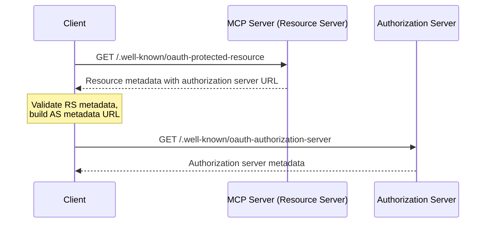

# OAuth Roles and Metadata Serving: Deep Analysis

**Date:** 2024-11-16  
**Status:** Investigation  
**Question:** Who is the authorization server, and where should authorization server metadata be served?

---

## The Core Question

When we say `authorization_servers: ["https://REDACTED.clerk.accounts.dev"]` in our protected resource metadata, where should clients fetch the authorization server metadata from?

**Option A:** `https://REDACTED.clerk.accounts.dev/.well-known/oauth-authorization-server` (Clerk)  
**Option B:** `https://our-server.com/.well-known/oauth-authorization-server` (Us, proxying to Clerk)

---

## OAuth 2.0 Roles in Our System

### Clear Facts

1. **Users authenticate with Clerk** - Users go to Clerk's authorization endpoint
2. **Clerk issues tokens** - Access tokens come from Clerk's token endpoint
3. **We validate tokens** - We call `getAuth()` from `@clerk/express` to validate
4. **We host the protected resources** - The `/mcp` endpoints are on our server

### Role Assignment

- **Resource Owner:** End users (teachers, educators)
- **Client:** MCP clients (Claude Desktop, etc.)
- **Authorization Server:** **CLERK** (authenticates users, issues tokens)
- **Resource Server:** **US** (hosts `/mcp`, validates tokens)

**Conclusion:** Clerk is unambiguously the authorization server.

---

## RFC 8414: Authorization Server Metadata

### Section 3: Obtaining Authorization Server Metadata

From RFC 8414:

> Authorization servers supporting metadata **MUST** make a JSON document containing metadata available at a path formed by inserting a well-known URI string into the authorization server's issuer identifier between the host component and the path component, if any.

**Key requirement:** The authorization server metadata MUST be served by the **authorization server** at a well-known path derived from the **issuer identifier**.

### What is the Issuer?

The issuer is the authorization server's identifier. In our case, when Clerk issues tokens, the `iss` claim in the JWT would be something like:

```
https://REDACTED.clerk.accounts.dev
```

Therefore, per RFC 8414, authorization server metadata MUST be at:

```
https://REDACTED.clerk.accounts.dev/.well-known/oauth-authorization-server
```

**This is Clerk's URL, not ours.**

---

## RFC 9728: Protected Resource Metadata

### Section 4: Protected Resource Metadata Format

From RFC 9728:

> The "authorization_servers" member is an array of strings representing the authorization server(s) from which access tokens or other authorization data can be obtained for access to this protected resource.

### Section 7.6: Authorization Servers

From RFC 9728:

> The protected resource metadata document specifies authorization servers that can be used to obtain access tokens or other authorization data for accessing the protected resource. **Clients can use the Authorization Server Metadata [RFC8414] mechanism to discover information about the authorization servers** referenced in the "authorization_servers" member.

**Key interpretation:** Clients take the URL from `authorization_servers` array and use RFC 8414 discovery ON THAT SERVER.

So if we say `authorization_servers: ["https://clerk-fapi-url"]`, clients should fetch:

```
https://clerk-fapi-url/.well-known/oauth-authorization-server
```

**There is NO provision for the resource server to proxy this.**

---

## MCP Auth Spec: Sequence Diagram Analysis

Looking at lines 104-129 of `mcp-auth-spec.md`:



**Critical observation:** Line 118 shows `C->>A` (Client to Authorization Server), **NOT** `C->>M` (Client to MCP Server).

The note says "build AS metadata URL" - meaning the client constructs the authorization server metadata URL from the `authorization_servers` array and fetches it **directly from the authorization server**.

---

## What We're Currently Doing (Analysis)

### Our Protected Resource Metadata

```typescript
// Tells clients: "authorization_servers: [https://clerk-fapi-url]"
app.get(
  '/.well-known/oauth-protected-resource',
  protectedResourceHandlerClerk({
    scopes_supported: ['mcp:invoke', 'mcp:read'],
  }),
);
```

**This is correct** per RFC 9728. We tell clients where the authorization server is (Clerk).

### Our Authorization Server Metadata Proxy

```typescript
// Also serves authorization server metadata on OUR server
app.get(
  '/.well-known/oauth-authorization-server',
  addNoCacheHeaders(authServerMetadataHandlerClerk),
);
```

**This is questionable.** We're serving authorization server metadata on the resource server's URL, not the authorization server's URL.

### The Ambiguity

If a client follows the MCP spec literally:

1. Fetch `https://our-server/.well-known/oauth-protected-resource`
2. Read `authorization_servers: ["https://clerk-fapi"]`
3. Fetch `https://clerk-fapi/.well-known/oauth-authorization-server` (go to Clerk)

But if a client naively assumes metadata is always relative:

1. Fetch `https://our-server/.well-known/oauth-protected-resource`
2. Assume all metadata is on the same server
3. Fetch `https://our-server/.well-known/oauth-authorization-server` (come to us)

**Question:** Which approach do MCP clients actually use?

---

## The Caching Issue Context

You mentioned caching problems. With the current architecture:

**If clients fetch from us (the proxy):**

- We fetch from Clerk on every request (no caching due to no-cache headers)
- Adds latency
- Creates failure point
- Complicates diagnosis

**If clients fetch directly from Clerk:**

- Clerk controls caching via their headers
- No proxy overhead
- Clerk handles their own rate limiting
- Simpler architecture

---

## Investigating What Clients Actually Do

### Test 1: What does Claude Desktop do?

We need to observe actual MCP client behavior. Does Claude Desktop:

- A) Read `authorization_servers` and fetch metadata from that URL?
- B) Assume metadata is on the resource server?

### Test 2: What does the MCP SDK do?

If there's an official MCP client SDK, check its implementation of authorization server discovery.

### Test 3: Temporary Modification

1. Modify our proxy endpoint to return a distinctive marker
2. Observe if OAuth flow still works
3. If yes → clients bypass us (correct per RFC)
4. If no → clients incorrectly expect us to serve it

---

## Architectural Implications

### If Clients Follow RFC Correctly

**Remove the proxy endpoint:**

- Clients will fetch directly from Clerk
- Correct per RFC 8414 and RFC 9728
- Simpler architecture
- Solves caching issues

### If Clients Expect Proxy

**This indicates a bug in MCP clients** that should be fixed. However, as a workaround:

- Keep the endpoint temporarily
- File issues with MCP client implementations
- Plan to remove once clients are fixed

---

## Recommendation

**Step 1: Investigation (30 minutes)**

Test with an actual MCP client (Claude Desktop):

1. Start server with current implementation
2. Enable debug logging
3. Observe which URL clients fetch authorization server metadata from
4. Check network traffic if needed

**Step 2: Decision**

**If clients fetch from Clerk directly:**

- Remove the proxy endpoint (correct behavior)
- Update tests to reflect correct architecture

**If clients fetch from us:**

- This is a client bug
- Keep proxy temporarily as workaround
- Add documentation explaining the architectural compromise
- File issues with MCP client maintainers

**Step 3: Long-term**

Either way, document:

- Clerk is the authorization server
- We are the resource server
- Per RFCs, authorization server metadata should be served by authorization server
- Any proxy is an architectural compromise for compatibility

---

## Answer to Your Question

> "Are we sure that in this scenario Clerk is the authorisation server and not us?"

**Yes, Clerk is definitely the authorization server:**

1. **Clerk authenticates users** - Users interact with Clerk's authorization endpoint
2. **Clerk issues tokens** - Tokens come from Clerk's token endpoint with Clerk's signature
3. **Token issuer is Clerk** - The `iss` claim in JWTs is Clerk's URL
4. **We only validate** - We call Clerk's SDK to validate tokens they issued
5. **RFC 8414 location** - Authorization server metadata should be at Clerk's URL, not ours

**We are the resource server:**

1. **We host the protected resources** - The `/mcp` endpoints
2. **We validate tokens** - Using Clerk's SDK
3. **We publish protected resource metadata** - Per RFC 9728

**The question is not "who is the AS"** (definitely Clerk), but rather **"should we proxy the AS metadata"** (probably not, per RFCs).

---

## Next Steps

1. **Test with actual MCP client** - Observe behavior
2. **Check MCP SDK source** - See how discovery is implemented
3. **Make informed decision** - Based on evidence, not assumptions
4. **Document findings** - Update architecture docs accordingly

Only after these investigations should we make changes to the code.
