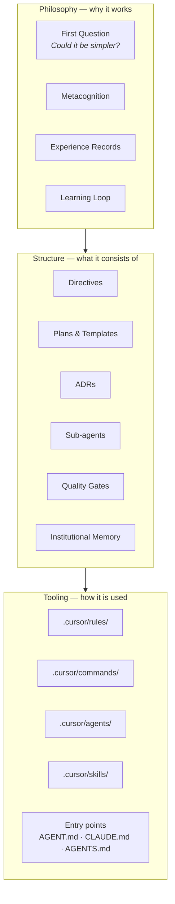
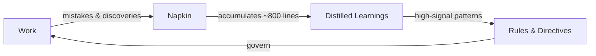
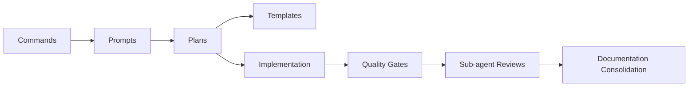
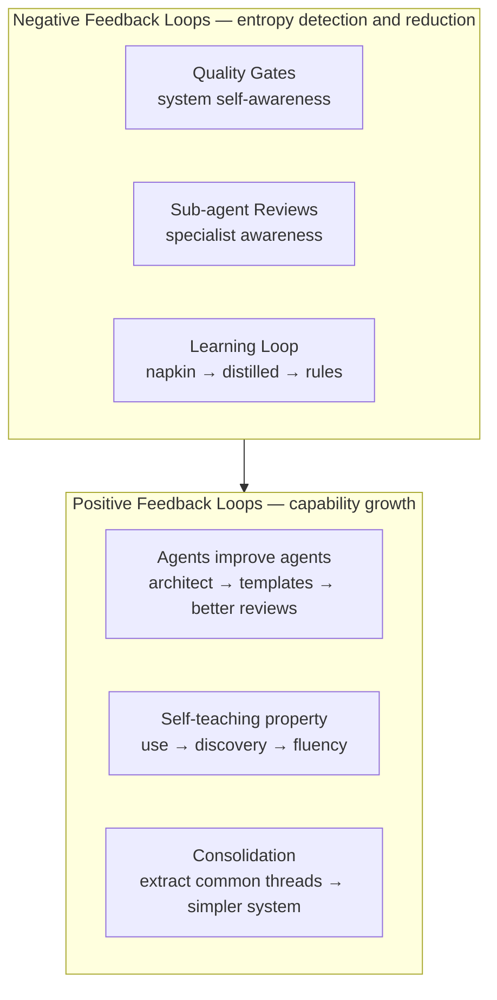

# The Agentic Engineering Practice

The agentic engineering practice is the self-reinforcing system of principles, structures, agents, and tooling that governs how work happens in this repository. It creates the conditions for safe, high-quality human-AI collaboration. The practice is what produces the product code (SDK, MCP servers, search system) — but it is not the product code itself.

**See also**: [ADR-119](../../docs/architecture/architectural-decisions/119-agentic-engineering-practice.md) records the naming decision and conceptual boundary.

## Three Layers

The practice operates in three layers. Each builds on the one below.

### Philosophy

The principles and learning mechanisms. The First Question ("could it be simpler?"), [metacognition](metacognition.md), [experience records](../experience/README.md), and the learning loop. **Architectural enforcement** is a core philosophical commitment: preferring physical constraints (lint rules, boundary tooling) over human vigilance. This layer defines *why* the practice works.

### Structure

The organisational patterns. [Directives](./) (this directory), [plans](../plans/) and their [templates](../plans/templates/), [ADRs](../../docs/architecture/architectural-decisions/), sub-agent [prompt architecture](../../docs/architecture/architectural-decisions/114-layered-sub-agent-prompt-composition-architecture.md) ([ADR-114](../../docs/architecture/architectural-decisions/114-layered-sub-agent-prompt-composition-architecture.md)), quality gates, and [institutional memory](../memory/). **Cross-agent standardisation** (AGENTS.md, Agent Skills, MCP, A2A) is an evolving implementation direction to keep the practice portable and platform-agnostic. This layer defines *what* the practice consists of.

### Tooling

Platform-specific implementations. `.cursor/rules/` (always-applied workspace rules), `.cursor/commands/` (slash commands), `.cursor/agents/` (sub-agent definitions), `.cursor/skills/` (specialised capabilities), and entry-point files (`AGENT.md`, `CLAUDE.md`, `AGENTS.md`). This layer defines *how* the practice is used in a specific environment.

## The Learning Loop

The practice improves through use. Mistakes, corrections, and discoveries flow through a cycle that converts experience into rules.

- **Napkin** (`.agent/memory/napkin.md`) — session-level log of what went wrong, what worked, and corrections received. Written continuously during every session.
- **Distilled learnings** (`.agent/memory/distilled.md`) — curated rulebook extracted from the napkin when it grows large. Deduplicates, archives, and rotates.
- **Rules** (`.agent/directives/rules.md`, `.cursor/rules/*.mdc`) — the operational rules that govern all work. Updated when distilled learnings reveal persistent patterns.
- **Experience** (`.agent/experience/`) — qualitative records of shifts in understanding across sessions.

## The Review System

Specialist sub-agents provide targeted review after non-trivial changes. The `invoke-code-reviewers` rule (`.cursor/rules/invoke-code-reviewers.mdc`) is the authoritative source for the full roster, invocation matrix, timing tiers, and triage checklist. The [AGENT.md](AGENT.md) "Available Sub-agents" section lists all reviewers by name.

Sub-agent prompts follow a three-layer composition architecture ([ADR-114](../../docs/architecture/architectural-decisions/114-layered-sub-agent-prompt-composition-architecture.md)): components, templates, and wrappers.

## The Workflow

Work flows through a predictable sequence: commands invoke prompts, prompts reference plans, plans use templates, quality gates validate the output.

- **Commands** (`.cursor/commands/`) — slash commands that initiate structured workflows
- **Prompts** (`.agent/prompts/`) — reusable playbooks that provide domain context and operational guidance. Session entry points (e.g. `semantic-search.prompt.md`) combine grounding, context, and a pointer to the active execution plan
- **Plans** (`.agent/plans/`) — executable work plans forming a nested hierarchy from strategic overview down to hands-on implementation tasks:
  1. **Strategic index** — `high-level-plan.md` cross-collection overview
  2. **Collection roadmaps** — e.g. `semantic-search/roadmap.md` milestone sequence
  3. **Active execution plans** — e.g. `semantic-search/active/sdk-workspace-separation.md` with YAML frontmatter, phased execution, and deterministic validation. Active plans live in `active/`, completed plans move to `archive/completed/`
  4. **Platform-specific plans** — e.g. `.cursor/plans/*.plan.md` (Cursor plans) supplement the lowest-level active plans with session-scoped implementation tasks, batch breakdowns, and review checkpoints. These are created per-session and track fine-grained progress that is too ephemeral for the active plan itself
- **Templates** (`.agent/plans/templates/`) — reusable plan components ([ADR-117](../../docs/architecture/architectural-decisions/117-plan-templates-and-components.md))
- **Quality gates** — see [rules.md](rules.md) and `pnpm qg`. All gates are always blocking.

## Artefact Map

| Location | What lives there |
|---|---|
| `.agent/directives/` | Principles, rules, and this practice guide |
| `.agent/plans/` | Work planning — active, archived, and templates |
| `.agent/memory/` | Institutional memory — napkin and distilled learnings |
| `.agent/experience/` | Experiential records across sessions |
| `.agent/prompts/` | Reusable prompt playbooks |
| `.agent/sub-agents/` | Reviewer prompt architecture (components, templates) |
| `.agent/skills/` | Repo-managed skills for shared workflows |
| `.agent/research/` | Research documents and analysis |
| `.agent/reference-docs/` | Supporting reference material |
| `.cursor/rules/` | Always-applied workspace rules |
| `.cursor/commands/` | Slash commands |
| `.cursor/agents/` | Sub-agent definitions (Cursor-specific) |
| `.cursor/skills/` | Skills (Cursor-specific) |
| `docs/architecture/architectural-decisions/` | Permanent architectural decision records |

## Feedback Loops and Recursive Self-Improvement

The practice is stabilised by interlocking feedback loops — the same mechanism that stabilises any complex system. Each loop is a cycle where outputs feed back to improve inputs.

The checks and quality gates are the system's self-awareness. They detect variance from intended structure, surface it immediately, and prevent entropy from accumulating. Without them, each contribution — human or AI — would introduce small deviations that compound into structural decay. The gates do not merely catch errors; they are the mechanism by which the system maintains awareness of its own state and actively resists degradation. Stability is not a default — it is an emergent property of these feedback loops running continuously.

**Negative feedback loops** act against entropy — they detect variance, surface it, and correct it before it compounds:

- **Quality gates** make the system self-aware: type-check, lint, test, format, and subagent validation each observe a different dimension of structural integrity. A failure is not an inconvenience — it is the system telling you that entropy has been introduced
- **Sub-agent reviews** provide specialist awareness — architectural drift, security risks, type-safety erosion, and test quality degradation that no single gate can detect
- **The learning loop** converts entropy that _was_ introduced into rules that prevent its recurrence

**Positive feedback loops** compound capability over time:

- **Agents improve agents** -- the subagent-architect reviews and upgrades other agents, which then produce better reviews, which improve code quality, which raises the bar for what agents must understand. This recursive self-improvement is analogous to how a mature engineering team raises its own standards through retrospectives and practice refinement
- **Self-teaching** -- each new user (human or AI) who follows the practice from `AGENT.md` discovers the system through use, and their questions and mistakes feed back into documentation improvements
- **Consolidation** -- the [`/jc-consolidate-docs`](../../.cursor/commands/jc-consolidate-docs.md) workflow and the subagent-architect's ecosystem consolidation procedure both extract common threads into shared, reusable structures. Each consolidation pass leaves the system simpler and more consistent

These loops operate at different timescales -- quality gates within seconds, learning loops within sessions, consolidation across sessions -- but they all serve the same purpose: keeping the practice aligned with reality and continuously improving.

## The Self-Teaching Property

The practice is designed to be discoverable through use. `AGENT.md` links to `rules.md`, which references `testing-strategy.md` and `schema-first-execution.md`. Commands invoke prompts, prompts reference plans, plans use templates. Sub-agents review work against the same rules that guided its creation. The napkin captures what went wrong, distillation extracts rules, and the rules prevent repetition.

If you are new to this repository, start with [AGENT.md](AGENT.md). Follow the links. The practice will teach itself.

## Sustainability and Scaling

### Current Volume

The practice spans ~1,000+ files across `.agent/`, `.cursor/`, and `docs/`. This volume is a consequence of the three-layer model (philosophy, structure, tooling) and is managed, not accidental. Each layer generates files with distinct lifecycles: directives are stable, plans are ephemeral, and generated artifacts are rebuilt on demand.

### Consolidation Mechanisms

Three mechanisms keep the volume manageable:

1. **Distillation skill** — when the napkin exceeds ~800 lines, the [distillation skill](../../.cursor/skills/distillation/SKILL.md) extracts high-signal patterns into a curated `distilled.md` (target: <200 lines) and archives the old napkin. This prevents session-level learnings from growing unboundedly.

2. **Consolidate-docs command** — the [`/jc-consolidate-docs`](../../.cursor/commands/jc-consolidate-docs.md) workflow migrates settled knowledge from ephemeral plans to permanent documentation. It enforces the principle that plans are not documentation: once a plan's insights are proven, they belong in `docs/` or `directives/`, and the plan moves to `archive/`.

3. **Sub-agent architect consolidation** — the sub-agent architect reviews the prompt ecosystem and extracts common patterns into shared templates, reducing duplication across agent definitions.

### Intentional Repetition Trade-Off

The Cardinal Rule ("Types Flow From The Schema") appears in ~66 files. This is a conscious trade-off: a contributor can start anywhere in the repository and encounter the foundational rules within their first few documents. DRY is important for code; for onboarding documentation, discoverability outweighs deduplication. The risk is formulation drift — mitigated by the consolidate-docs command, which checks for consistency across repetitions.

### Scaling Constraints

High file volume has mechanical costs beyond human perception. Semantic search degrades when a core concept returns many equally-weighted hits across duplicated files, and AI agents exhaust finite context windows reading overlapping content. The consolidation mechanisms above address volume growth, but search signal quality and context efficiency are independent constraints that must also be monitored.

### When This Needs Restructuring

The practice should be restructured if:

- Consolidation mechanisms cannot keep pace with new file creation
- The distillation cycle takes longer than a single session
- New contributors report that the volume is intimidating rather than helpful
- Semantic search for a core concept (e.g. the Cardinal Rule) returns more than 5 equally-weighted hits, indicating that centralisation has degraded
- AI agents consistently exhaust context windows reading overlapping plans or directives

The first three are trailing indicators — by the time they trigger, structural debt may already be deep. The last two are leading mechanical indicators that can be measured before human perception catches up. The onboarding review process (8 audience-specific reviews) is itself a monitoring mechanism for these thresholds. See [ADR-119](../../docs/architecture/architectural-decisions/119-agentic-engineering-practice.md) for the formal architectural decision that names and frames this practice.
