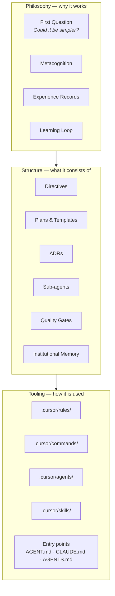
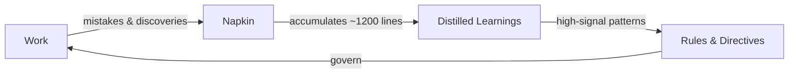
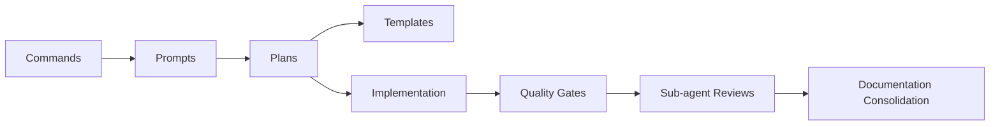

# The Agentic Engineering Practice

The agentic engineering practice is the self-reinforcing system of principles, structures, agents, and tooling that governs how work happens in this repository. It creates the conditions for safe, high-quality human-AI collaboration. The practice is what produces the product code (SDK, MCP servers, search system) — but it is not the product code itself.

**See also**: [ADR-119](../../docs/architecture/architectural-decisions/119-agentic-engineering-practice.md) records the naming decision and conceptual boundary.

## Three Layers

The practice operates in three layers. Each builds on the one below.

### Philosophy

The principles and learning mechanisms. The First Question ("could it be simpler?"), [metacognition](metacognition.md), [experience records](../experience/README.md), and the learning loop. This layer defines *why* the practice works.

### Structure

The organisational patterns. [Directives](./) (this directory), [plans](../plans/) and their [templates](../plans/templates/), [ADRs](../../docs/architecture/architectural-decisions/), sub-agent [prompt architecture](../../docs/architecture/architectural-decisions/114-layered-sub-agent-prompt-composition-architecture.md) ([ADR-114](../../docs/architecture/architectural-decisions/114-layered-sub-agent-prompt-composition-architecture.md)), quality gates, and [institutional memory](../memory/). This layer defines *what* the practice consists of.

### Tooling

Platform-specific implementations. `.cursor/rules/` (always-applied workspace rules), `.cursor/commands/` (slash commands), `.cursor/agents/` (sub-agent definitions), `.cursor/skills/` (specialised capabilities), and entry-point files (`AGENT.md`, `CLAUDE.md`, `AGENTS.md`). This layer defines *how* the practice is used in a specific environment.

## The Learning Loop

The practice improves through use. Mistakes, corrections, and discoveries flow through a cycle that converts experience into rules.

- **Napkin** (`.agent/memory/napkin.md`) — session-level log of what went wrong, what worked, and corrections received. Written continuously during every session.
- **Distilled learnings** (`.agent/memory/distilled.md`) — curated rulebook extracted from the napkin when it grows large. Deduplicates, archives, and rotates.
- **Rules** (`.agent/directives/rules.md`, `.cursor/rules/*.mdc`) — the operational rules that govern all work. Updated when distilled learnings reveal persistent patterns.
- **Experience** (`.agent/experience/`) — qualitative records of shifts in understanding across sessions.

## The Review System

Specialist sub-agents provide targeted review after non-trivial changes. The `invoke-code-reviewers` rule (`.cursor/rules/invoke-code-reviewers.mdc`) is the authoritative source for the full roster, invocation matrix, timing tiers, and triage checklist. The [AGENT.md](AGENT.md) "Available Sub-agents" section lists all reviewers by name.

Sub-agent prompts follow a three-layer composition architecture ([ADR-114](../../docs/architecture/architectural-decisions/114-layered-sub-agent-prompt-composition-architecture.md)): components, templates, and wrappers.

## The Workflow

Work flows through a predictable sequence: commands invoke prompts, prompts reference plans, plans use templates, quality gates validate the output.

- **Commands** (`.cursor/commands/`) — slash commands that initiate structured workflows
- **Prompts** (`.agent/prompts/`) — reusable playbooks that provide domain context and operational guidance
- **Plans** (`.agent/plans/`) — executable work plans with YAML frontmatter for progress tracking. Active plans live in `active/`, completed plans move to `archive/completed/`
- **Templates** (`.agent/plans/templates/`) — reusable plan components ([ADR-117](../../docs/architecture/architectural-decisions/117-plan-templates-and-components.md))
- **Quality gates** — see [rules.md](rules.md) and `pnpm qg`. All gates are always blocking.

## Artefact Map

| Location | What lives there |
|---|---|
| `.agent/directives/` | Principles, rules, and this practice guide |
| `.agent/plans/` | Work planning — active, archived, and templates |
| `.agent/memory/` | Institutional memory — napkin and distilled learnings |
| `.agent/experience/` | Experiential records across sessions |
| `.agent/prompts/` | Reusable prompt playbooks |
| `.agent/sub-agents/` | Reviewer prompt architecture (components, templates) |
| `.agent/skills/` | Repo-managed skills for shared workflows |
| `.cursor/rules/` | Always-applied workspace rules |
| `.cursor/commands/` | Slash commands |
| `.cursor/agents/` | Sub-agent definitions (Cursor-specific) |
| `.cursor/skills/` | Skills (Cursor-specific) |
| `docs/architecture/architectural-decisions/` | Permanent architectural decision records |

## The Self-Teaching Property

The practice is designed to be discoverable through use. `AGENT.md` links to `rules.md`, which references `testing-strategy.md` and `schema-first-execution.md`. Commands invoke prompts, prompts reference plans, plans use templates. Sub-agents review work against the same rules that guided its creation. The napkin captures what went wrong, distillation extracts rules, and the rules prevent repetition.

If you are new to this repository, start with [AGENT.md](AGENT.md). Follow the links. The practice will teach itself.
