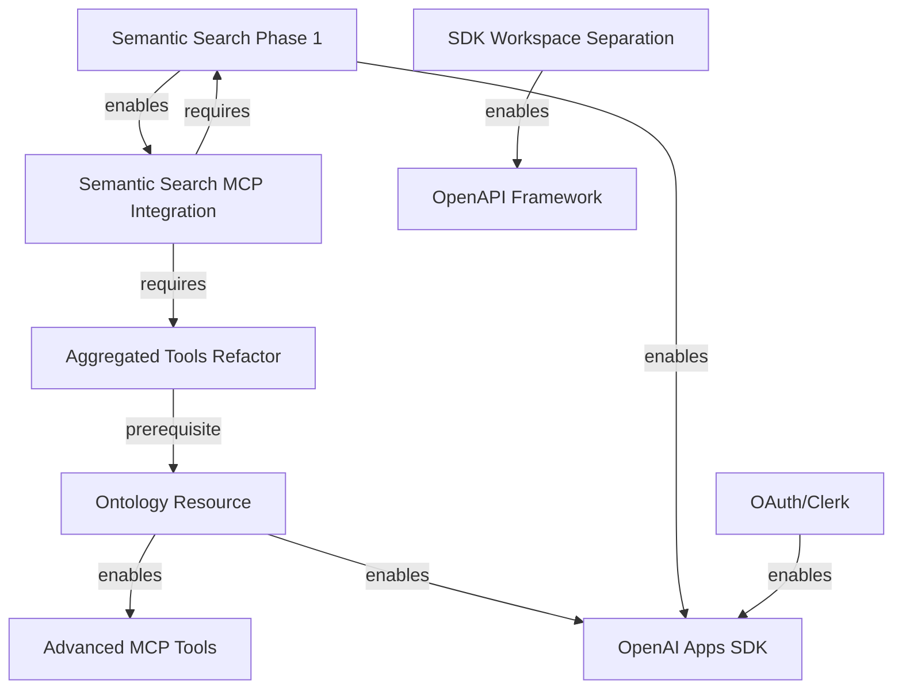

# Plan Summary and Status

**Last Updated**: 2025-10-28

This document provides a quick reference for all active plans and their current status.

## Current Priorities

1. **Semantic Search Phase 1** - ✅ NEAR COMPLETE
2. **Ontology Resource** - 🔄 ACTIVE (planned)
3. **OAuth/Clerk Integration** - 🔄 ACTIVE (planned)
4. **Advanced MCP Tools** - ⏸ DEFERRED (until 1-3 complete)

## Active Plans

### Priority 1: Semantic Search

| Plan                  | Status   | Path                                                                    |
| --------------------- | -------- | ----------------------------------------------------------------------- |
| High-Level Plan       | Complete | `.agent/plans/semantic-search/semantic-search-high-level-plan.md`       |
| Context Log           | Current  | `.agent/plans/semantic-search/context.md`                               |
| Snagging Resolution   | ✅ DONE  | `.agent/plans/semantic-search/snagging-resolution-plan.md`              |
| Phase 1 Functionality | Complete | `.agent/plans/semantic-search/semantic-search-phase-1-functionality.md` |

**Current State**: Status-aware response handling complete; quality gates green; remote verification passing. Only documentation refresh and commit packaging remain.

### Priority 2: Ontology Resource

| Plan                                 | Status      | Path                                                          |
| ------------------------------------ | ----------- | ------------------------------------------------------------- |
| Ontology Resource                    | NOT STARTED | `.agent/plans/curriculum-ontology-resource-plan.md`           |
| Aggregated Tools Refactor (Sprint 0) | NOT STARTED | `.agent/plans/mcp-aggregated-tools-type-gen-refactor-plan.md` |

**Current State**: Sprint 0 prerequisite (aggregated tools refactor) must happen first. Aggregated tools still hand-written runtime code in `packages/sdks/oak-curriculum-sdk/src/mcp/`.

**Blocker**: `search` and `fetch` tools need to be moved from runtime to type-gen generation before ontology work can begin.

### Priority 3: OAuth/Clerk Integration

| Plan                 | Status      | Path                                            |
| -------------------- | ----------- | ----------------------------------------------- |
| OAuth Implementation | NOT STARTED | `.agent/plans/mcp-oauth-implementation-plan.md` |

**Current State**: OAuth 2.1 Resource Server already implemented. Need to replace local demo Authorization Server with Clerk production AS.

### Priority 4+: Future Work

| Plan                            | Status       | Priority | Path                                                       |
| ------------------------------- | ------------ | -------- | ---------------------------------------------------------- |
| OpenAI Apps SDK                 | Planned      | 4        | `.agent/plans/oak-openai-app-plan.md`                      |
| Semantic Search MCP Integration | Planned      | 5        | (covered in semantic search plans)                         |
| **Advanced MCP Tools**          | **DEFERRED** | **6**    | **`.agent/plans/advanced-mcp-tools-plan.md`**              |
| Contract Testing                | Planned      | 7        | `.agent/plans/contract-testing-schema-evolution-plan.md`   |
| SDK Workspace Separation        | Planned      | 8        | `.agent/plans/sdk-workspace-separation-plan.md`            |
| OpenAPI Framework Extraction    | Blocked      | 10       | `.agent/plans/openapi-to-mcp-framework-extraction-plan.md` |

## Plan Relationships



## Recently Updated Plans

- **2025-10-28**: Created `advanced-mcp-tools-plan.md` (comprehensive plan for future tooling)
- **2025-10-28**: Updated `high-level-plan.md` to reflect current priorities
- **2025-10-28**: Deleted `mcp-enhancements-plan.md` (low quality, superseded)
- **2025-10-24**: Completed status-aware response handling (semantic search)
- **2025-10-23**: Completed OpenAI connector alias retirement

## Deprecated/Superseded Plans

- ❌ `mcp-enhancements-plan.md` - DELETED (low quality, superseded by advanced-mcp-tools-plan.md)
- ⏸ `curriculum-tools-guidance-playbooks-plan.md` - Phase 1 complete, Phase 2+ deferred (overlaps with advanced tools)

## Quick Reference: What to Work On Next

1. **If finishing semantic search**: Documentation refresh, commit packaging
2. **If starting ontology**: Begin with Sprint 0 (aggregated tools refactor)
3. **If starting OAuth**: Review existing OAuth 2.1 Resource Server, plan Clerk AS replacement
4. **If considering advanced tools**: DON'T START YET - prerequisites not met

## Key Documents

- **High-Level Plan**: `.agent/plans/high-level-plan.md` - Strategic overview
- **Rules**: `.agent/directives-and-memory/rules.md` - Cardinal Rule, TDD, type safety
- **Schema-First**: `.agent/directives-and-memory/schema-first-execution.md` - Generator-first architecture
- **Testing Strategy**: `docs/agent-guidance/testing-strategy.md` - TDD approach
- **Curriculum Ontology**: `docs/architecture/curriculum-ontology.md` - Domain model

## Implementation Notes

### Aggregated Tools Refactor (Sprint 0 - Critical Blocker)

**Current Hand-Written Files** (need to be moved to type-gen):

- `packages/sdks/oak-curriculum-sdk/src/mcp/aggregated-search.ts` (225 lines)
- `packages/sdks/oak-curriculum-sdk/src/mcp/aggregated-fetch.ts` (~100 lines)
- `packages/sdks/oak-curriculum-sdk/src/mcp/universal-tools.ts` (118 lines)

**Target State**: All tool definitions generated at type-gen time from declarative configuration.

**Why Critical**: Establishes the pattern for all composite tools (ontology, advanced tools, semantic search integration).

### Type-Gen Infrastructure

**Current Generators**:

- `packages/sdks/oak-curriculum-sdk/type-gen/typegen/mcp-tools/` - Basic tool generation
- `packages/sdks/oak-curriculum-sdk/type-gen/typegen/search/` - Search-specific generation

**Missing Generators** (need to be created):

- `packages/sdks/oak-curriculum-sdk/type-gen/typegen/mcp-aggregated-tools/` - Aggregated tools (Sprint 0)
- `packages/sdks/oak-curriculum-sdk/type-gen/typegen/ontology/` - Ontology extraction (Priority 2)
- `packages/sdks/oak-curriculum-sdk/type-gen/typegen/advanced-tools/` - Advanced tools (Priority 6 - future)

## Quality Gates

All work must pass:

```bash
pnpm type-gen      # Regenerate types from OpenAPI
pnpm build         # No type errors
pnpm type-check    # All workspaces type-safe
pnpm lint -- --fix # No linting errors
pnpm test          # Unit + integration tests
pnpm test:e2e      # E2E tests
```

Full pipeline:

```bash
pnpm make  # install -> type-gen -> build -> type-check -> doc-gen -> lint -> format
pnpm qg    # format-check -> type-check -> lint -> markdownlint -> test suites -> smoke
```
