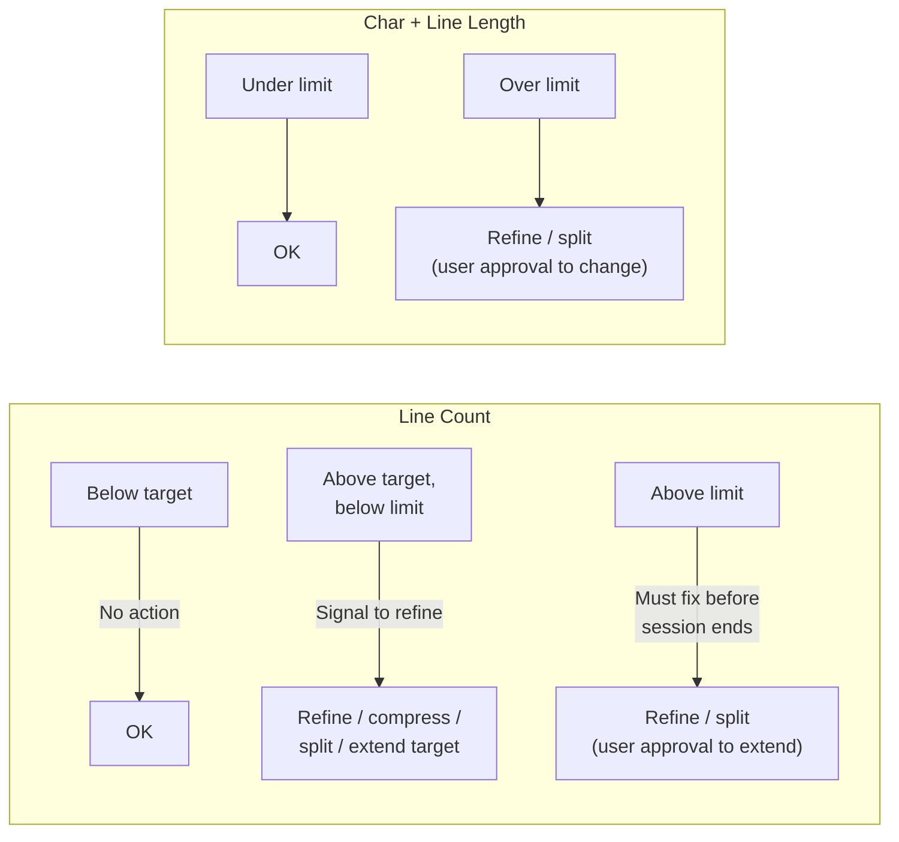

# Fitness Two-Threshold Model

## Design

Replace the single `fitness_line_count` field with four frontmatter fields on every fitness-managed file:

- `**fitness_line_target**` — soft ceiling for content lines. Exceeding it signals that the file should be refined (compress, split, deduplicate) during the next consolidation. Agents may extend this modestly when content is genuinely valuable and dense. Replaces `fitness_line_count`.
- `**fitness_line_limit**` — hard ceiling for content lines. Cannot be exceeded or extended without user approval. Prevents runaway limit inflation. New field, initially calculated at approximately 1.3x the target (rounded to a clean number), then stored as an independent constant in each file's frontmatter.
- `**fitness_char_limit**` — hard ceiling for content characters. Not adjustable. For the 3 trinity files, keeps existing `fitness_char_count` values. For all other files, initially calculated as `fitness_line_limit * 60`, then stored as an independent constant. Replaces `fitness_char_count`.
- `**fitness_line_length**` — hard ceiling for prose line width. Not adjustable. Always `100`. Already exists on trinity files; added to all others.

**All hard limits are constants, not formulas.** The formulas above (1.3x, *60) are used once during the initial migration to calculate sensible starting values. After that, each file's frontmatter values are independent numbers with no derivation relationship. The validator reads them as literal values — it does not compute one from another.

**Key principle**: None of these limits ever block graduation. Graduation checks only "stable?" and "natural home?" The fitness step runs after graduation and handles any resulting pressure.

## Validator Changes

File: [scripts/validate-practice-fitness.mjs](../../scripts/validate-practice-fitness.mjs)

- **Discovery**: Change `discoverFitnessFiles()` to look for `fitness_line_target` instead of `fitness_line_count` (backward compat: also match `fitness_line_count` with a deprecation warning during transition)
- **Extraction**: Read all four fields from frontmatter via `getFrontmatterNumber()`
- **Evaluation**: For line count, compare against both target and limit. Return separate `targetOk` and `limitOk` booleans. For char count and line length, compare against the single hard limit (same as current logic, just renamed fields)
- **Reporting**: Update `formatResult()` to show both thresholds for line count, e.g.:
  - `Lines:  290 / target 300 / limit 400  [checkmark]`
  - `Lines:  310 / target 300 / limit 400  [warning: above target]`
  - `Lines:  410 / target 300 / limit 400  [fail: above limit]`
- **Exit code**: In strict mode, exit 1 only when hard limits are exceeded (above limit, above char limit, above line length). Target exceedance is always a warning, never a failure
- **Exports**: Update `evaluateFitnessFile` return type to include `targetOk` / `limitOk` distinction

## Frontmatter Migration

16 files need frontmatter updates (13 under `.agent/`, 3 under `docs/`). The 6 Practice Core files (3 live + 3 incoming mirrors) already have char and line-length fields that just need renaming. The other 10 files get new char and line-length fields.

**Trinity files** (3 live + 3 incoming mirrors):

- `.agent/practice-core/practice-bootstrap.md`: target 575, limit 750, char_limit 30000 (keep), line_length 100 (keep)
- `.agent/practice-core/practice-lineage.md`: target 550, limit 725, char_limit 32000 (keep), line_length 100 (keep)
- `.agent/practice-core/practice.md`: target 375, limit 500, char_limit 22000 (keep), line_length 100 (keep)
- Plus their 3 mirrors in `.agent/practice-core/incoming/practice-core/`

**Directive files** (5):

- `.agent/directives/AGENT.md`: target 200, limit 275, char_limit 16500, line_length 100
- `.agent/directives/principles.md`: target 200, limit 275, char_limit 16500, line_length 100
- `.agent/directives/testing-strategy.md`: target 410, limit 550, char_limit 33000, line_length 100
- `.agent/directives/schema-first-execution.md`: target 100, limit 150, char_limit 9000, line_length 100
- `.agent/directives/artefact-inventory.md`: target 80, limit 125, char_limit 7500, line_length 100

**Memory**:

- `.agent/memory/distilled.md`: target 200, limit 275, char_limit 16500, line_length 100

**Docs** (3):

- `docs/operations/troubleshooting.md`: target 315, limit 425, char_limit 25500, line_length 100
- `docs/governance/development-practice.md`: target 150, limit 200, char_limit 12000, line_length 100
- `docs/governance/typescript-practice.md`: target 150, limit 200, char_limit 12000, line_length 100

## Documentation Updates

Four files describe how fitness functions work and need updating to reflect the two-threshold model:

- `.agent/practice-core/practice-lineage.md` **Fitness Functions section** — canonical definition. Update the Thresholds table and prose to describe the target/limit distinction. Update the frontmatter key table. Add note that char_limit and line_length are non-adjustable
- `.agent/practice-core/practice-bootstrap.md` **Consolidation Workflow step 6** — update fitness management instructions to reference target vs limit thresholds
- `.agent/practice-core/practice.md` **Knowledge Flow fitness description** — update brief mention to reflect two-threshold model
- `.agent/commands/consolidate-docs.md` **Step 8** — update fitness management instructions to differentiate target (refine) vs limit (must fix, user approval to extend)

## Verification

- Run `pnpm practice:fitness:informational` after all changes to confirm all files pass against their new thresholds
- Run `pnpm qg` to ensure no quality gate regressions
- Spot-check that files currently above their old `fitness_line_count` are not above the new `fitness_line_limit`

## Future Work (out of scope)

- Redesign char limits based on file intent, utility, and context (per user note)
- Consider whether `fitness_line_length: 100` should be a validator default rather than per-file frontmatter
