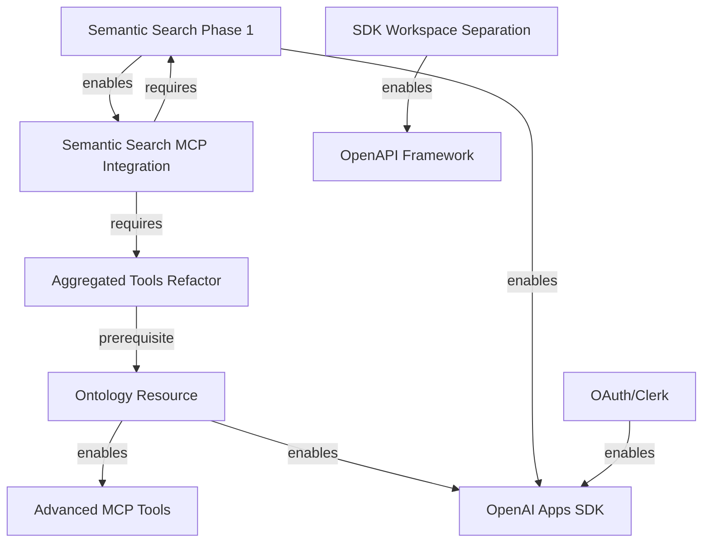

# Plan Summary and Status

**Last Updated**: 2025-11-11
status: outdated, deprecated until reviewed and updated

This document provides a quick reference for all active plans and their current status.

## Plan Organization (NEW - 2025-11-11)

Plans have been reorganized into topical subdirectories:

- **Root**: High-priority active plans (OAuth, backlog)
- **`sdk-and-mcp-enhancements/`**: SDK/MCP tool/resource content improvements (what we generate)
  - Comprehensive MCP enhancement roadmap (3 plans combined)
  - Curriculum tools/guidance and ontology resource plans
- **`pipeline-enhancements/`**: Type-gen pipeline improvements (how we generate)
  - OpenAPI-to-MCP framework extraction
  - SDK workspace separation
  - Pipeline integration plans
- **`semantic-search/`**: Search service and UI (well-organized with index, overview, service, UI plans)
- **`dev-tooling-and-dev-ai-support/`**: Testing, tooling, and developer infrastructure
- **`openai-app/`**: OpenAI Apps SDK integration
- **`observability/`**: Logging, error tracking, monitoring
- **`external/`**: External stakeholder documents
- **`archive/`**: Completed and superseded plans
- **`icebox/`**: Deferred/won't implement

## Current Priorities

1. **Semantic Search Phase 1** - ✅ NEAR COMPLETE
2. **Ontology Resource** - 🔄 ACTIVE (planned)
3. **OAuth/Clerk Integration** - 🔄 ACTIVE (finishing up)
4. **MCP Enhancements** - ⏸ DEFERRED (until 1-3 complete)

## Active Plans

### Priority 1: Semantic Search

| Plan           | Status   | Path                                                   |
| -------------- | -------- | ------------------------------------------------------ |
| Overview       | Current  | `semantic-search/semantic-search-overview.md`          |
| Search Service | Current  | `semantic-search/search-service/schema-first-...md`    |
| Search UI      | Current  | `semantic-search/search-ui/frontend-implementation.md` |
| Index          | Current  | `semantic-search/index.md`                             |
| Archive        | Complete | `semantic-search/archive/` (completed Phase 1 work)    |

**Current State**: Planning complete; all 3 phases defined with clear sessions; ready for implementation.

**Scope**: Migrate all search schemas to type-gen (SDK generation); add ontology fields (threads, programme factors, unit types, content guidance, lesson components).

### Priority 2: Ontology Resource

| Plan                                 | Status      | Path                                                         |
| ------------------------------------ | ----------- | ------------------------------------------------------------ |
| Ontology Resource                    | NOT STARTED | `sdk-and-mcp-enhancements/curriculum-ontology-resource...md` |
| Aggregated Tools Refactor (Sprint 0) | NOT STARTED | `sdk-and-mcp-enhancements/comprehensive-...md` Phase 0       |

**Current State**: Sprint 0 prerequisite (aggregated tools refactor) must happen first. Aggregated tools still hand-written runtime code in `packages/sdks/oak-curriculum-sdk/src/mcp/`.

**Blocker**: `search` and `fetch` tools need to be moved from runtime to type-gen generation before ontology work can begin.

### Priority 3: OAuth/Clerk Integration

| Plan                 | Status       | Path                               |
| -------------------- | ------------ | ---------------------------------- |
| OAuth Implementation | FINISHING UP | `mcp-oauth-implementation-plan.md` |

**Current State**: Clerk AS is live with metadata endpoints, auth middleware, and smoke/e2e coverage; remote and local smoke passes with auth bypass, while authenticated smoke awaits M2M bearer support.

### Priority 4+: Future Work

| Plan                            | Status       | Priority | Path                                                                  |
| ------------------------------- | ------------ | -------- | --------------------------------------------------------------------- |
| OpenAI Apps SDK                 | Planned      | 4        | `openai-app/oak-openai-app-plan.md`                                   |
| Semantic Search MCP Integration | Planned      | 5        | (covered in semantic search plans)                                    |
| **MCP Enhancements**            | **DEFERRED** | **6**    | **`sdk-and-mcp-enhancements/comprehensive-...md`** (3 plans combined) |
| Contract Testing                | Planned      | 7        | `dev-tooling-and-dev-ai-support/contract-testing-...md`               |
| SDK Workspace Separation        | Planned      | 8        | `pipeline-enhancements/sdk-workspace-separation-plan.md`              |
| OpenAPI Framework Extraction    | Blocked      | 10       | `pipeline-enhancements/openapi-to-mcp-framework-extraction-plan.md`   |

## Plan Relationships



## Recently Updated Plans

- **2025-11-11**: Created `mcp-enhancements/comprehensive-mcp-enhancement-plan.md` (combines 3 MCP plans)
- **2025-11-11**: Reorganized plans into topical subdirectories
- **2025-11-11**: Moved archived plans: `advanced-mcp-tools-plan.md`, `mcp-enhancements-plan.md`, `mcp-aggregated-tools-type-gen-refactor-plan.md`
- **2025-11-11**: Moved context document to `.agent/context/curriculum-tools-guidance-playbooks-context.md`
- **2025-11-11**: Updated `high-level-plan.md` with new plan structure
- **2025-11-11**: Updated `PLAN_SUMMARY.md` to reflect reorganization
- **2025-10-28**: Created original advanced MCP tools plans
- **2025-10-24**: Completed status-aware response handling (semantic search)

## Consolidated/Archived Plans

- ✅ **MCP Enhancements Consolidated** (2025-11-11): Three separate plans combined into one comprehensive plan:
  - `archive/mcp-aggregated-tools-type-gen-refactor-plan.md` → Phase 0
  - `archive/mcp-enhancements-plan.md` → Phase 1
  - `archive/advanced-mcp-tools-plan.md` → Phase 2
  - **New location**: `sdk-and-mcp-enhancements/comprehensive-mcp-enhancement-plan.md`
- ✅ **Plans Organized by Category** (2025-11-11):
  - `curriculum-tools-guidance-playbooks-plan.md` → `sdk-and-mcp-enhancements/`
  - `curriculum-ontology-resource-plan.md` → `sdk-and-mcp-enhancements/`
  - Phase 1 of playbooks plan complete, Phase 2+ deferred (overlaps with MCP Enhancements Phase 2)
- ✅ **Backlog Items Expanded** (2025-11-11):
  - Created `dev-tooling-and-dev-ai-support/sdk-publishing-and-versioning-plan.md` (from backlog line 60)
  - Created `dev-tooling-and-dev-ai-support/agent-lifecycle-automation-plan.md` (from backlog line 61)
  - Created `icebox/advanced-mcp-server-ideas.md` (from backlog lines 73-74)
  - Archived `backlog.md` and `backlog-analysis.md` (content preserved in new plans)

## Future Plans (Not Yet Active)

These plans are documented but not yet prioritized for implementation:

| Plan                         | Priority | Category             | Path                                                       |
| ---------------------------- | -------- | -------------------- | ---------------------------------------------------------- |
| SDK Publishing & Versioning  | Medium   | Production hardening | `dev-tooling-and-dev-ai-support/sdk-publishing-...md`      |
| Pair Programming Coach Agent | Medium   | DX / AI-assisted dev | `dev-tooling-and-dev-ai-support/pair-programming-coach...` |
| Agent Lifecycle Automation   | Low      | DX improvement       | `dev-tooling-and-dev-ai-support/agent-lifecycle-...md`     |
| Advanced MCP Server Ideas    | Low      | Research/PoC         | `icebox/advanced-mcp-server-ideas.md`                      |

**SDK Publishing**: Make packages npm-installable; add CLI entry points; implement versioning workflow

**Pair Programming Coach**: Event-driven VSCode/Cursor extension that monitors code changes in real-time, detects patterns (type safety, missing tests, architecture violations), and provides AI-powered suggestions like a senior engineer pair programming partner

**Agent Lifecycle**: Automated commit trigger when file changes exceed threshold; runs quality gates; generates conventional commits

**Advanced MCP**: Fan-out-fan-in parallel execution; review agents; cross-server pipelines (speculative)

## Quick Reference: What to Work On Next

1. **If finishing semantic search**: Begin Phase 1 implementation (schema-first migration)
2. **If starting ontology**: Begin with Sprint 0 (see `sdk-and-mcp-enhancements/comprehensive-mcp-enhancement-plan.md` Phase 0)
3. **If finishing OAuth**: Complete M2M bearer support for authenticated smoke tests
4. **If considering MCP enhancements**: DON'T START YET - prerequisites (semantic search, ontology, OAuth) not met
5. **If considering npm publish**: See `sdk-publishing-and-versioning-plan.md` when production-ready

## Key Documents

- **High-Level Plan**: `.agent/plans/high-level-plan.md` - Strategic overview
- **Rules**: `.agent/directives/rules.md` - Cardinal Rule, TDD, type safety
- **Schema-First**: `.agent/directives/schema-first-execution.md` - Generator-first architecture
- **Testing Strategy**: `.agent/directives/testing-strategy.md` - TDD approach
- **Curriculum Ontology**: `docs/architecture/curriculum-ontology.md` - Domain model

## Implementation Notes

### Aggregated Tools Refactor (Sprint 0 - Critical Blocker)

**Plan**: `sdk-and-mcp-enhancements/comprehensive-mcp-enhancement-plan.md` Phase 0

**Current Hand-Written Files** (need to be moved to type-gen):

- `packages/sdks/oak-curriculum-sdk/src/mcp/aggregated-search.ts` (220 lines)
- `packages/sdks/oak-curriculum-sdk/src/mcp/aggregated-fetch.ts` (~100 lines)
- `packages/sdks/oak-curriculum-sdk/src/mcp/universal-tools.ts` (116 lines)

**Target State**: All tool definitions generated at type-gen time from declarative configuration.

**Why Critical**: Establishes the pattern for all composite tools (ontology, advanced tools, semantic search integration).

**Implementation**: 6 sessions over ~2 weeks (config schema → descriptors → validators → executors → runtime integration → documentation).

### Type-Gen Infrastructure

**Current Generators**:

- `packages/sdks/oak-curriculum-sdk/type-gen/typegen/mcp-tools/` - Basic tool generation
- `packages/sdks/oak-curriculum-sdk/type-gen/typegen/search/` - Search-specific generation

**Missing Generators** (need to be created):

- `packages/sdks/oak-curriculum-sdk/type-gen/typegen/mcp-aggregated-tools/` - Aggregated tools (Sprint 0)
- `packages/sdks/oak-curriculum-sdk/type-gen/typegen/ontology/` - Ontology extraction (Priority 2)
- `packages/sdks/oak-curriculum-sdk/type-gen/typegen/advanced-tools/` - Advanced tools (Priority 6 - future)

## Quality Gates

All work must pass:

```bash
pnpm type-gen      # Regenerate types from OpenAPI
pnpm build         # No type errors
pnpm type-check    # All workspaces type-safe
pnpm lint -- --fix # No linting errors
pnpm test          # Unit + integration tests
pnpm test:e2e      # E2E tests
```

Full pipeline:

```bash
pnpm make  # install -> type-gen -> build -> type-check -> doc-gen -> lint -> format
pnpm qg    # format-check -> type-check -> lint -> markdownlint -> test suites -> smoke
```
