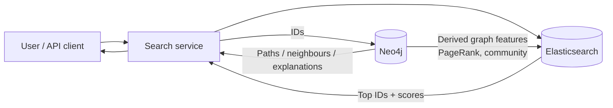
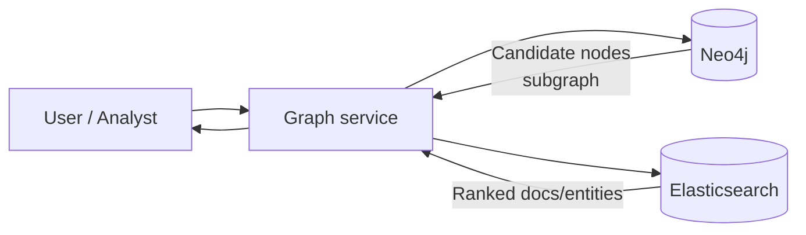
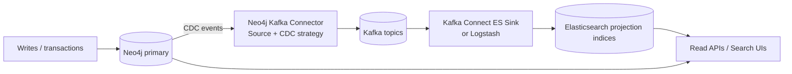

# How Elasticsearch and Neo4j Complement Each Other to Create Real Business Value

## Executive summary

Elasticsearch and Neo4j are highly complementary because they are optimised for different “hard parts” of modern data products. **Elasticsearch** excels at large-scale **lexical + semantic retrieval, ranking, analytics, and near-real-time indexing** (refresh-driven search visibility). citeturn2search3turn2search19turn9search6 **Neo4j** excels at **authoritative graph storage, ACID transactions, explicit relationship modelling, traversal/path queries, and graph algorithms** (including shortest paths and community detection) with operational support for clustering, secondaries/read scaling, and causal consistency semantics in cluster routing. citeturn5search1turn5search8turn11search0turn11search12

The highest-value architectures typically treat one system as **the system of record** and the other as a **derived projection** optimised for a specific access pattern:

- **ES-first search + Neo4j graph augmentation** is best when user journeys start with search (documents, tickets, products, knowledge base articles), then require relationship reasoning (“connected to”, “related accounts”, “similar entities”, “explain why”). It leverages Elasticsearch’s retrieval (BM25 + vectors + hybrid) and Neo4j’s graph traversal and algorithms. citeturn2search3turn11search0turn11search1turn9search6
- **Neo4j-first graph + Elasticsearch ranking** is best when the “starting point” is graph discovery (fraud rings, dependency chains, lineage, recommendations), but users still need high-quality textual/semantic search over node/edge content or attached documents. Neo4j has Lucene-powered full-text and vector indexes, but Elasticsearch is typically more feature-rich for large-scale relevance engineering and retrieval pipelines. citeturn1search1turn1search2turn9search1turn0search2
- **Dual-store with CDC** provides the most robust near-real-time synchronisation, usually via Kafka Connect: Neo4j has an official Kafka connector, including a CDC strategy where you select patterns and stream changes to topics. citeturn0search7turn7search10turn7search2

For production, the single most important design principle is **stable identity and idempotency**. Neo4j’s internal identifiers (elementId/id) are **not safe to track outside the scope of a single transaction**, and Neo4j CDC guidance explicitly recommends defining **logical/business keys** (node key / relationship key constraints) so change events consistently include key properties. citeturn10search0turn12search2turn12search1 On the Elasticsearch side, use external document IDs plus **optimistic concurrency control** (sequence number + primary term) when you need to avoid lost updates in projection indices. citeturn7search1turn7search0

Licensing and versioning materially affect design choices: Elasticsearch **retrievers** were introduced in **8.14.0** and became generally available in **8.16.0**; hybrid ranking via retrievers (including RRF) is therefore version-dependent. citeturn9search1turn9search6turn0search2 In addition, Elastic representatives have stated that **RRF and linear retrievers are under an Enterprise licence**, which can push teams towards application-side fusion if running Basic. citeturn0search18 Neo4j Enterprise includes “enterprise requirements such as backups, clustering, and failover capabilities”, and many monitoring/ops features are explicitly Enterprise. citeturn4search0turn6search1

## Integration patterns and federated query models

This section addresses **integration patterns**, **sync strategies**, **near-real-time**, and **federated query** approaches.

### Comparison table of integration patterns

| Pattern name                                        | Data flow                                                                                                                    | Consistency model                                                                                                                 | Typical latency                                                                             | Complexity                          | Best-use cases                                                                                                                                            |
| --------------------------------------------------- | ---------------------------------------------------------------------------------------------------------------------------- | --------------------------------------------------------------------------------------------------------------------------------- | ------------------------------------------------------------------------------------------- | ----------------------------------- | --------------------------------------------------------------------------------------------------------------------------------------------------------- |
| ES-first with graph augmentation                    | User query → Elasticsearch retrieves IDs → Neo4j traverses/derives graph context → (optional) Elasticsearch re-ranks/filters | Neo4j authoritative; Elasticsearch is query-time retrieval index; cross-store is **application-coordinated eventual consistency** | Low for search; traversal adds one extra round trip; freshness bounded by ES refresh & sync | Medium (orchestration + ID mapping) | Knowledge search with explainability; entity-centric search; investigation workflows; “search then explain connections” citeturn2search3turn11search0 |
| Neo4j-first with search projection                  | Graph query in Neo4j → collect candidate nodes/docs → Elasticsearch ranks/expands via text/vector search                     | Neo4j authoritative; Elasticsearch is a ranking/projection layer                                                                  | Low for traversal; ranking adds extra hop; ES freshness bounded by refresh                  | Medium                              | Fraud/recommendations where traversal comes first, but you need great relevance ranking or semantic recall citeturn5search1turn9search6               |
| Dual-write (application-level)                      | Application writes to both Neo4j and Elasticsearch on each transaction                                                       | Usually **eventual** unless you add distributed transaction patterns; typically “best effort + reconciliation”                    | Near real-time if both writes succeed; failures create divergence                           | High operational burden             | Low-latency domains without Kafka; smaller systems; when you can tolerate reconciliation jobs                                                             |
| Batch ETL / periodic re-indexing                    | Export from authoritative store → bulk load to the other store on schedule                                                   | Eventual; bounded staleness by ETL interval                                                                                       | Minutes–hours                                                                               | Low–Medium                          | Analytics, reporting, or low-freshness search; initial backfills; rebuilding projections citeturn7search0turn8search1                                 |
| CDC via Kafka Connect (recommended dual-store sync) | Neo4j CDC → Kafka topics → Elasticsearch sink (or Logstash) → projection indices; or Kafka → Neo4j sink                      | Eventual but robust; supports replay/backfill; ordering depends on partitioning                                                   | Seconds to tens of seconds typically                                                        | Medium–High (Kafka operations)      | Enterprise-grade sync; auditability; replay; back-pressure; multi-consumer projections citeturn0search7turn7search10turn7search3turn3search1        |
| Federated query “inside Neo4j”                      | Cypher calls Elasticsearch via APOC procedures (HTTP to ES) → combine results in Cypher                                      | Application semantics; consistency depends on ES freshness and query                                                              | Low–Medium                                                                                  | Medium                              | Power-user graph workflows; prototypes; when you specifically want “query ES during traversal” citeturn1search0turn1search16                          |

### Near-real-time synchronisation: what “near real time” really means

Elasticsearch makes data searchable after a **refresh**, not immediately. By default, Elasticsearch refreshes indices periodically (commonly every second for “active” indices), which is why it is described as **near real-time** search. citeturn2search3turn2search19 This matters when your graph application expects read-your-writes semantics across stores: Neo4j can guarantee ACID transaction behaviour, while Elasticsearch requires explicit design (refresh control, retries, or causal bookmarking at the orchestration layer). citeturn5search1turn2search3turn5search14

### Federated query patterns in practice

There are two pragmatic federation styles:

- **Application-orchestrated federation** (recommended): your service layer calls Elasticsearch and Neo4j separately, then combines results. This keeps security boundaries clear and avoids “querying a remote system from inside Cypher” operational surprises.
- **Neo4j-driven federation via APOC “Elasticsearch integration”**: APOC provides procedures like `apoc.es.query` and notes that some Elastic 8 APIs can be called without extra config, while others require ES version configuration for endpoints. citeturn1search0turn1search16

## Data modelling and mapping strategies across both stores

This section covers **canonicalisation**, **ID strategy**, **denormalisation**, **templates/labels**, and **update/consistency** handling.

### Canonical identity: do not rely on Neo4j internal IDs for cross-system joins

Neo4j CDC documentation is explicit: Neo4j internally identifies nodes/relationships by **elementId**, but these internal identifiers are **not safe to track outside the scope of a single transaction**; instead, define **logical/business keys** using **node key constraints** and **relationship key constraints**, so key properties are included as stable identifiers in change events. citeturn10search0turn12search2turn12search1

Practical recommendation:

- In Neo4j, introduce a **domain ID** property (e.g., `customerId`, `docId`, `assetId`) that is globally unique and stable.
- Create a **key constraint** (Enterprise feature) to guarantee existence + uniqueness of that ID for the relevant label/type. citeturn12search1turn12search0
- In Elasticsearch, use the **same canonical ID** as the document `_id` (or as a dedicated `keyword` field plus `_id`), enabling idempotent “upsert by ID” ingestion.

### Modelling: what belongs in Neo4j vs what belongs in Elasticsearch

A clean separation that scales well:

- Neo4j: authoritative **entities and relationships**, plus graph-native properties needed for traversal and algorithms (weights, timestamps, relationship types).
- Elasticsearch: **searchable projections** of entities/relationships/documents, including text fields, filters/facets, embeddings, and derived graph scores (e.g., PageRank, community ID).

Neo4j’s full-text indexes are Lucene-based and return a score, which is useful for lightweight search, but Elasticsearch is purpose-built for large-scale relevance engineering and retrieval pipelines. citeturn1search1turn9search6 Neo4j also supports vector indexes (HNSW) for similarity queries, but if your product needs hybrid ranking pipelines, Elasticsearch retrievers and hybrid patterns often fit better—subject to version and licence constraints. citeturn2search0turn9search1turn0search18

### Mapping strategies: templates, analyzers, and “projection indices”

Elasticsearch index templates are the right mechanism to keep projections consistent at scale; Elastic notes that **composable index templates** take precedence over legacy templates (legacy deprecated since 7.8). citeturn5search11 For a dual-store system, create separate templates for:

- node projections (e.g., `entity-*`)
- relationship projections (e.g., `edge-*`)
- document/content projections (e.g., `content-*`)

Example composable template skeleton (projection indices):

```json
PUT _index_template/entity_template
{
  "index_patterns": ["entity-*"],
  "template": {
    "settings": { "index.refresh_interval": "1s" },
    "mappings": {
      "properties": {
        "entity_id": { "type": "keyword" },
        "labels":    { "type": "keyword" },
        "name":      { "type": "text" },
        "name_kw":   { "type": "keyword" }
      }
    }
  }
}
```

Templates govern how fields behave for aggregation, sorting, and retrieval, which is key when these indices are fed by CDC/ETL pipelines. citeturn5search11turn2search3

### Handling updates and consistency

For Neo4j → Elasticsearch projections, treat Elasticsearch as a **derived index**. If you must prevent lost updates (e.g., multiple workers applying changes), use Elasticsearch **optimistic concurrency control** using `_seq_no` and `_primary_term`, which Elasticsearch tracks for each document. citeturn7search1

For Elasticsearch → Neo4j (less common), avoid trying to “reverse engineer” a graph from search documents unless you have a clear entity model; if you do, enforce idempotency and use Neo4j transactions (ACID) to update multiple nodes/relationships atomically. citeturn5search1

## Ingestion, synchronisation, and pipelines

This section covers **Logstash/Beats/connectors**, **Neo4j import**, **Kafka/CDC**, **APOC**, and **enrichment/NLP/embeddings**.

### Elasticsearch ingestion building blocks

Elasticsearch supports multiple ingestion paths that fit dual-store architectures:

- **Logstash Elasticsearch output plugin** stores events/documents into Elasticsearch and is commonly used as the last hop in pipelines; it supports time series and non-time series data and benefits from batch/bulk behaviour for throughput. citeturn3search1
- **Beats** are lightweight shippers that collect logs/metrics and send to Elasticsearch directly or via Logstash. citeturn3search10turn3search2
- **Elastic connectors** create searchable, read-only replicas of external content sources and support full and incremental syncs (full sync also deletes documents no longer present in the source). citeturn3search0turn3search8
  - Operational note: the Elastic connectors repository states that **managed connectors on Elastic Cloud Hosted are no longer available as of version 9.0**, pushing many teams to self-managed connectors if they depend on connector-based sync. citeturn3search4

### Neo4j ingestion building blocks

Neo4j offers both online and offline/bulk import:

- `LOAD CSV` (Cypher) supports local/remote URLs, requires load privileges, and Neo4j advises `neo4j-admin database import` as the most efficient approach for large CSV workloads. citeturn8search0turn8search1
- `neo4j-admin database import` supports **full and incremental import** into a running or stopped DBMS (useful for seeding + staged bulk loads). citeturn8search1turn8search5
- APOC provides operational procedures like `apoc.periodic.iterate` for batching Cypher operations; note that it runs inner transactions, and Neo4j documents rebinding considerations for 4.0+ because entities from different transactions must be rebound. citeturn8search14turn8search2

### CDC and Kafka Connect: the most robust “near-real-time” sync

Neo4j provides an official **Neo4j Connector for Kafka** that streams data between Neo4j/Aura and Kafka platforms using the Kafka Connect framework. citeturn0search7turn7search6 The source connector includes a **Change Data Capture strategy** where you define patterns/selectors for which nodes/relationships to track and assign them to topics. citeturn7search10turn7search2 The Neo4j source connector always generates messages with schema support, so your key/value converters must be configured appropriately. citeturn7search2

On the Elasticsearch side, a common pairing is a Kafka Connect **Elasticsearch sink connector**, which moves data from Kafka topics to Elasticsearch indices. citeturn7search3 Alternatively, Logstash can consume from Kafka and write to Elasticsearch via the output plugin (often preferred when you want richer ingest-time transformations in Logstash). citeturn3search1

Version note: Neo4j’s older “Neo4j Streams” approach is documented as **no longer under active development** and not supported after Neo4j 4.4; Neo4j recommends Kafka Connect Neo4j Connector instead. citeturn0search11

### Enrichment, NLP inference, and embeddings in the pipeline

If you need entity extraction or embeddings for better search and RAG:

- Elasticsearch ingest pipelines can run NLP inference using the **inference processor**, which “uses a pre-trained… model deployed for natural language processing tasks to infer against data being ingested”. citeturn3search3
- When you need reference-data joins at ingest time (e.g., mapping IDs to canonical forms), Elastic’s **enrich processor** enriches documents with data from another index and uses an **enrich index** internally for efficient matching. citeturn0search4turn0search16
- Neo4j’s vector indexes require embeddings to be stored as properties; Neo4j provides an embeddings/vector index tutorial and includes similarity functions like `vector.similarity.cosine()`. citeturn2search0turn1search2turn1search18turn2search12

A high-value complement pattern is: generate embeddings once (or centrally), then store them in both systems if you need semantic retrieval in both. If you only need semantic retrieval in Elasticsearch and traversal in Neo4j, store vectors primarily in Elasticsearch and keep Neo4j lean—unless Neo4j vector search is part of your graph-native retrieval. citeturn9search6turn2search0

## Query and workflow patterns that unlock compound value

This section covers **retrieve-then-traverse**, **graph-first-then-rank**, **GraphRAG**, and **orchestration** patterns.

### Retrieve-with-Elasticsearch then traverse in Neo4j

This is the most widely useful pattern for “search-first” products:

1. Elasticsearch returns candidate entity IDs/doc IDs using lexical and/or semantic retrieval.
2. Neo4j expands those IDs into relevant subgraphs: neighbours, paths, communities, provenance, and explanations.
3. Optionally write derived graph features back into Elasticsearch for ranking and faceting.

Elasticsearch retrieval pipelines are increasingly expressed via **retrievers** (8.14+) which replace other top-doc-returning elements such as `query` and `knn`. citeturn9search6turn9search1 RRF combines multiple child retrievers into a single ranking. citeturn0search2 (Licensing note: Elastic has stated RRF/linear retrievers are Enterprise licensed.) citeturn0search18

Neo4j then performs traversal and path queries, including shortest path constructs (e.g., `SHORTEST k` patterns) and quantified/variable-length path patterns. citeturn11search0turn11search2

### Graph-first in Neo4j then rank/expand in Elasticsearch

Use this when the first step is inherently graph-native:

- fraud rings (shared devices/IPs/addresses)
- dependency impact / blast radius
- lineage and provenance chains
- multi-hop recommendation candidates

Neo4j can compute graph algorithms (PageRank, community detection, pathfinding) using the Graph Data Science library. citeturn11search11turn11search3turn11search12 You can then push algorithm outputs to Elasticsearch as ranking signals (e.g., a `pagerank` numeric field) and use them in scoring/boosting.

### Hybrid RAG: Elasticsearch retrieval + Neo4j pathfinding/algorithms

GraphRAG research frames a general idea: construct or use a knowledge graph to retrieve structured context, not only unstructured text, improving query-focused summarisation. citeturn13search17turn13search3 Neo4j positions GraphRAG as a natural fit for relational context, and provides a first-party GraphRAG Python package. citeturn13search0turn13search12turn13search4

A pragmatic “ES + Neo4j GraphRAG” workflow in production is:

- Elasticsearch retrieves relevant passages/documents (often vector + lexical hybrid).
- Extract candidate entities (or map them via dictionaries).
- Neo4j finds explanatory paths, constraints, communities, or subgraphs among those entities.
- The LLM uses both retrieved text and graph-structured evidence.

### Federated APIs and orchestration: safe defaults

A robust orchestration layer should:

- implement retries and timeouts independently per store
- control result sizes to avoid path explosion
- use stable keys (not `elementId`) in all external payloads citeturn10search0turn12search2
- record “sync offsets” (Kafka offsets / change IDs) and expose reconciliation endpoints

If you need to query Elasticsearch directly from Neo4j, APOC’s Elasticsearch integration provides procedures such as `apoc.es.query`, allowing a Cypher-driven federated workflow. citeturn1search0turn1search16

## Performance, scalability, security, licensing, and operational reliability

This section covers **latency**, **scaling**, **vector costs**, **clustering/memory**, **security/RBAC**, and **failure modes/monitoring/recovery**.

### Performance and scaling: where bottlenecks typically appear

**Elasticsearch latency drivers**

- Search freshness is bounded by refresh; default periodic refresh is a key factor in near-real-time behaviour. citeturn2search3turn2search19
- Bulk ingestion is critical for throughput; the Bulk API exists to batch index/create/delete/update actions and improve indexing speed. citeturn7search0
- Optimistic concurrency in Elasticsearch uses `_seq_no` and `_primary_term` to prevent lost updates in concurrent writes. citeturn7search1

**Vector index cost considerations (both systems use HNSW)**

- Neo4j’s vector index implements **HNSW** for ANN search. citeturn2search0
- Elasticsearch vector search also relies on HNSW concepts and graph construction has tuning/performance implications (Elastic discusses HNSW graph construction and parameters). citeturn0search1turn0search17  
  A practical consequence: running vector search in both stores can be expensive. Decide whether semantic retrieval belongs in one store (often Elasticsearch) and keep the other store focused on its strengths.

**Neo4j scaling and memory drivers**

- Neo4j’s clustering architecture supports primaries and secondaries for read scaling, and notes causal consistency semantics (“read at least its own writes” when invoked) plus majority-based write availability for primaries. citeturn5search8turn5search0
- Neo4j transactions provide ACID properties. citeturn5search1
- Neo4j performance depends heavily on memory configuration, especially **page cache** (caching graph data and indexes to avoid costly disk access). citeturn2search1

### Security and access control

**Elasticsearch security**

- Elasticsearch privileges are organised into cluster/indices/run-as/application privilege categories, used to define roles and govern access. citeturn6search0
- Elastic supports document and field level security for restricting access within an index/data stream (with caveats about write operations). citeturn6search8
- Elastic security APIs cover roles, role mappings, and API keys. citeturn6search16

**Neo4j security**

- Neo4j provides role-based access control (RBAC) and privilege management via Cypher. citeturn2search6turn4search9
- Neo4j’s SSL framework documentation notes the Bolt protocol supports authentication and TLS via certificates and, in clusters, provides smart routing with load balancing/failover. citeturn6search11
- Version-sensitive note: Neo4j migration guidance states that from 4.0 onwards, the default encryption setting is off and Neo4j no longer auto-generates certificates when none are provided (affecting Bolt/HTTPS defaults). citeturn6search3

### Licensing and deployment implications

- Elastic licences differ by deployment type: Elastic Cloud licences apply at the organisation/orchestrator level; self-managed licences apply at the cluster level and expiry reverts functionality to Basic. citeturn4search3turn4search7
- Retrievers are version-dependent (added 8.14.0; GA 8.16.0). citeturn9search1 RRF exists in the docs, but Elastic staff have stated RRF/linear retrievers are Enterprise licensed. citeturn0search2turn0search18
- Neo4j Enterprise includes backups, clustering, failover; monitoring metrics are explicitly Enterprise. citeturn4search0turn6search1
- Neo4j Graph Data Science has Enterprise features unlocked via a licence key file configuration, and the released product includes closed-source components under licence constraints. citeturn4search6turn4search14

### Failure modes, monitoring, and recovery strategies

**Common failure modes in dual-store systems**

- Divergence from partial failures (written to Neo4j but not to Elasticsearch, or vice versa).
- Out-of-order event application (especially with Kafka partitioning choices).
- Identity mismatch (tracking `elementId` instead of business keys).
- Delete handling (missing tombstones or missing delete propagation).

**Mitigations**

- Use Neo4j CDC guidance: define key constraints so change events contain stable key properties; do not treat elementId as a durable external key. citeturn10search0turn12search2
- Use idempotent writes to Elasticsearch: stable `_id` plus Bulk API; use optimistic concurrency control where needed. citeturn7search0turn7search1
- If relying on connector sync, use full sync periodically because Elastic full sync deletes documents removed in the source (restoring consistency). citeturn3search8

**Monitoring and observability**

- Elastic Stack monitoring collects logs/metrics from Elasticsearch, Logstash, Kibana, Beats, stores them in Elasticsearch, and visualises in Kibana. citeturn6search10turn6search2
- Neo4j metrics (Enterprise) can be logged and exported to tools including Prometheus; Neo4j documents how to expose metrics. citeturn6search1turn6search17

## Recommended architectures, examples, and an actionable decision matrix

This section provides **three reference architectures**, **code snippets**, and a **decision matrix** to choose the right approach.

### Architecture diagrams

#### ES-first: search-led product with graph augmentation



Why it works: Elasticsearch provides relevance and near-real-time indexing. citeturn2search3turn9search6 Neo4j provides traversal and algorithmic graph intelligence (shortest paths, community detection, PageRank). citeturn11search0turn11search3turn11search11

#### Neo4j-first: graph-native workflows with Elasticsearch ranking



This fits investigations and recommendation engines where traversal produces candidates, but you still want best-in-class text/semantic ranking and filtering. citeturn11search2turn9search6

#### Dual-store with CDC: Neo4j authoritative, ES as projection, Kafka as backbone



Neo4j supports CDC strategy configuration via patterns/selectors and topic assignment; the Kafka connector is designed for Kafka Connect. citeturn7search10turn0search7turn7search2 Elasticsearch sink connectors write topic data into Elasticsearch indices. citeturn7search3

### Practical examples

#### Example Elasticsearch mapping for entity projection with vectors

```json
PUT entity-people-000001
{
  "mappings": {
    "properties": {
      "person_id": { "type": "keyword" },
      "name":      { "type": "text" },
      "aliases":   { "type": "keyword" },
      "pagerank":  { "type": "float" },
      "embedding": { "type": "dense_vector", "dims": 384 }
    }
  }
}
```

Dense vectors are used for kNN/semantic retrieval; tune usage based on your Elastic version and retrieval APIs. citeturn0search17turn9search6

#### Example Elasticsearch ingest pipeline: inference + enrich for canonical IDs

```json
PUT _ingest/pipeline/entity_ingest_v1
{
  "processors": [
    {
      "inference": {
        "model_id": "my-ner-or-embedding-model",
        "target_field": "ml",
        "field_map": { "content": "text" }
      }
    },
    {
      "enrich": {
        "policy_name": "person_dictionary_policy",
        "field": "ml.entities.name",
        "target_field": "canonical",
        "max_matches": 1
      }
    }
  ]
}
```

The inference processor runs ML/NLP inference at ingest time. citeturn3search3 The enrich processor enriches from another index via an enrich policy and enrich index. citeturn0search4turn0search16

#### Example Neo4j constraints and IDs

Use key constraints so CDC includes stable keys:

```cypher
CREATE CONSTRAINT person_key
FOR (p:Person)
REQUIRE (p.personId) IS UNIQUE;
```

Neo4j’s constraints include **key constraints** (Enterprise) that ensure existence and uniqueness over a label/type’s properties. citeturn12search1turn12search0 For CDC, Neo4j recommends key constraints so changes include key properties, because internal elementIds are not safe external identifiers. citeturn10search0turn12search2

#### Example Neo4j import via LOAD CSV

```cypher
LOAD CSV WITH HEADERS FROM $url AS row
MERGE (p:Person {personId: row.personId})
SET p.name = row.name;
```

`LOAD CSV` supports local/remote URLs and requires load privileges. citeturn8search0 For very large CSV imports, Neo4j recommends `neo4j-admin database import`. citeturn8search0turn8search1

#### Example orchestration flow: Python (ES retrieve → Neo4j traverse)

```python
from elasticsearch import Elasticsearch
import neo4j

es = Elasticsearch("https://es.example")
driver = neo4j.GraphDatabase.driver("neo4j+s://neo4j.example", auth=("neo4j", "password"))

def search_people(query_text: str, k: int = 20):
    # Use query/knn/retrievers depending on your ES version and licence
    res = es.search(
        index="entity-people-*",
        size=k,
        query={"match": {"name": query_text}},
        _source=["person_id", "name"]
    )
    return [hit["_source"]["person_id"] for hit in res["hits"]["hits"]]

def fetch_explanations(person_ids):
    cypher = """
    MATCH (p:Person)-[r*1..3]-(q)
    WHERE p.personId IN $ids
    RETURN p.personId AS seed, q, r
    LIMIT 200
    """
    with driver.session(database="neo4j") as session:
        records = session.run(cypher, ids=person_ids)
        return list(records)

ids = search_people("Alice Johnson")
graph_ctx = fetch_explanations(ids)
```

Neo4j’s Python driver provides session/transaction APIs and supports causal chaining/bookmarks for cluster consistency (important when mixing writes and reads). citeturn5search14turn5search2

#### Example orchestration flow: Java (outline)

- Use the Elasticsearch Java client to run `_search` (or retrievers if supported by your version). citeturn9search14turn9search6
- Use the Neo4j Java driver to run Cypher over Bolt with TLS (especially in production). citeturn6search11

(Exact code depends strongly on your chosen ES and Neo4j driver versions; avoid assuming versions by pinning client libraries to your deployment contracts.)

### Decision matrix: when dual-store vs single-store

Choose **dual-store (Elasticsearch + Neo4j)** when most of the following are true:

- You need **high-quality search relevance** (lexical + semantic, ranking pipelines) and **graph-native traversal/algorithms** in the same product experience. citeturn9search6turn11search12
- You need **ACID graph updates** (multiple nodes/relationships updated atomically) that then become searchable within seconds, not necessarily instantly. citeturn5search1turn2search3
- You benefit from **CDC replay/auditability** and can run Kafka Connect. citeturn0search7turn7search10

Choose **single-store Elasticsearch** when:

- Your “graph needs” are mostly association discovery and relevance/analytics, NOT explicit pathfinding or graph algorithms (you can do a lot with search + aggregations and implicit associations, or you can store edges and traverse in application code). (If you adopt retrievers/hybrid ranking, verify licence/version.) citeturn9search1turn0search18turn0search2

Choose **single-store Neo4j** when:

- The product is traversal-first and your search needs are modest enough to rely on Neo4j full-text/vector indexes and the operational simplicity of one datastore. citeturn1search1turn1search2turn11search2

### Concrete recommendations

1. **Pick one “authoritative” store** (usually Neo4j for graph truth, Elasticsearch for search truth), and treat the other as a projection that can be rebuilt. Align this with your failure/recovery plan. citeturn7search0turn8search1
2. **Implement stable business keys in Neo4j** and enforce them with constraints; never integrate on internal IDs (elementId/id). citeturn10search0turn12search2turn12search1
3. **Use CDC via Kafka Connect for near-real-time sync** when correctness and recoverability matter; use batch ETL for low-freshness needs; reserve dual-write for small systems with strong operational discipline and reconciliation tooling. citeturn0search7turn0search11turn7search3
4. **Be deliberate about vector search location**: both systems support HNSW vector indexes, so cost can double if you store vectors twice. Default to “vectors in Elasticsearch; traversal/algorithms in Neo4j” unless you have a graph-native semantic use case. citeturn2search0turn0search1
5. **Validate licences early**: Elastic retrievers/RRF can be licence-gated; Neo4j Enterprise adds clustering/ops features that materially affect HA and monitoring designs. citeturn0search18turn4search0turn6search1
