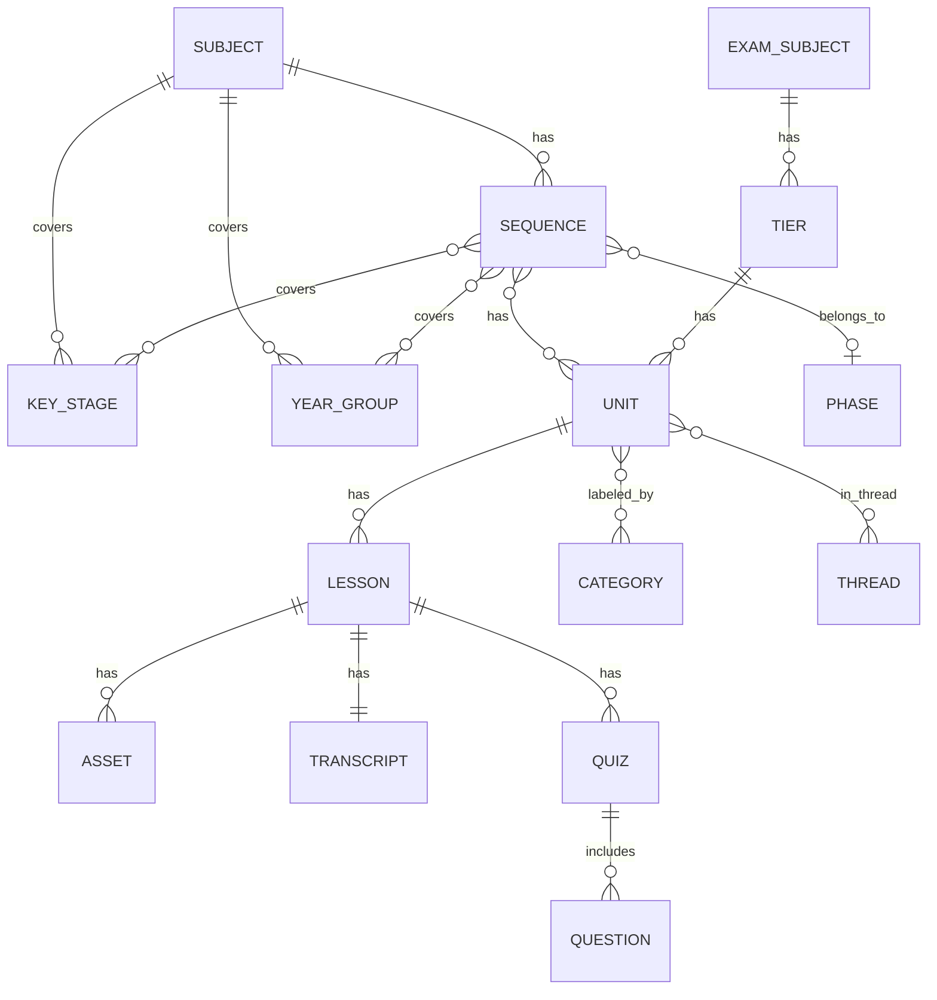

## Plan: Curriculum Data vs Guidance Tools, Playbooks, and Commands

### Intent

- Clarify and enforce a clean separation between curriculum data-fetching tools and presentation guidance/instruction tools.
- Provide deterministic, in-repo authored guidance specifications and playbooks (process definitions) that consuming agents execute without any server-side agentic orchestration.
- Introduce a discoverable commands registry mapping slash-style commands to playbooks and supporting templates.
- Improve tool discoverability via richer metadata (category, tags, stability, audience, constraints) and enhance descriptions to set accurate expectations.
- Maintain strict type discipline: all static structures and validators generated from OpenAPI via `pnpm type-gen` per the Cardinal Rule.
- Adhere to TDD, repository testing strategy, and quality gates.

### Grounding

Read and follow:

- `./.agent/directives-and-memory/AGENT.md` and linked references
- `./.agent/directives-and-memory/rules.md`
- `./docs/agent-guidance/testing-strategy.md`

Adjust the todo list if anything changes.

### Structure the Todo List

The following tasks are atomic, actionable, and aligned to the intent. Each `ACTION:` is followed by a `REVIEW:` self-review. Every third task is a `GROUNDING:` reminder. Quality gates are invoked regularly.

#### Phase 0 – Project grounding and scope confirmation

1. ACTION: Re-read `AGENT.md`, `rules.md`, and `testing-strategy.md` to confirm constraints and practices.
2. REVIEW: Confirm understanding: no server-side agentic workflows; caller runs playbooks; all types via type-gen; tests avoid network.
3. GROUNDING: read GO.md and follow all instructions
4. QUALITY-GATE: From repo root run: `pnpm i`, `pnpm type-gen`, `pnpm build`, `pnpm type-check`, `pnpm lint -- --fix`, `pnpm -F @oaknational/oak-curriculum-sdk docs:all`, `pnpm format`, `pnpm markdownlint`, `pnpm test`, `pnpm test:e2e`.

#### Phase 1 – SDK: OpenAPI schemas and type generation

5. ACTION: Add OpenAPI module `PresentationGuidance@v1` defining: `PresentationSpec` (requiredHeadings, requiredNotices, templates, linkPolicy, provenancePolicy, accessibilityChecklist), specializations `LessonPresentationSpec` and `SearchResultsPresentationSpec`.
6. REVIEW: Ensure the schema is minimal yet expressive; check enumerations and literals preserve type information (use `as const` data in fixtures; no type assertions in code).
7. GROUNDING: read GO.md and follow all instructions
8. ACTION: Add OpenAPI module `Playbook@v1` defining: `Playbook` (id, version, inputs, questions), `Step` union (`ask` | `toolCall` | `aggregate` | `format`), light `Condition` language (`missing(x)`, equality), `TemplateRef`, and `Outputs` contract.
9. REVIEW: Validate that the schema supports a clarification loop and deterministic execution by the caller without embedding LLM prompts in code (prompts referenced as templates or text blocks in the spec).
10. QUALITY-GATE: Run full quality gate sequence from repo root.

#### Phase 2 – Author guidance specs and templates in-repo

11. ACTION: Author initial guidance fixtures for `lesson` and `searchResults` (JSON) plus markdown templates; store under a dedicated package or within app resources as appropriate, ensuring they are loaded without network access.
12. REVIEW: Check that provenance rules require links to original Oak resources and that accessibility checklist items are actionable.
13. GROUNDING: read GO.md and follow all instructions
14. QUALITY-GATE: Run full quality gate sequence from repo root.

#### Phase 3 – Metadata strategy and tool taxonomy

15. ACTION: Define canonical tool categories and tags: categories = `data | guidance | playbook | command` and domain tags (e.g., `curriculum`, `lessons`, `units`, `sequences`, `search`, `presentation`, `provenance`, `accessibility`). Draft a metadata interface for tool registration including optional fields (stability, audience, input/output examples, caching, rateLimitPolicy, determinism, requiresNetwork, provenanceRequired, etc.).
16. REVIEW: Verify metadata fields align with MCP spec and do not introduce runtime logic; ensure descriptions are intention-revealing and concise.
17. GROUNDING: read GO.md and follow all instructions
18. QUALITY-GATE: Run full quality gate sequence from repo root.

#### Phase 4 – MCP servers: tools, resources, and metadata

19. ACTION: In `apps/oak-curriculum-mcp-stdio` and `apps/oak-curriculum-mcp-streamable-http`, update existing curriculum tools to be exposed as `oak.data.*`, add clear descriptions, categories, tags, and optional metadata fields (stability, determinism, pagination, caching, rate limits, errors, etc.). Maintain non-breaking aliases if needed.
20. REVIEW: Confirm no server-side agentic orchestration is introduced; the tools remain stateless data fetchers.
21. GROUNDING: read GO.md and follow all instructions
22. ACTION: Implement `oak.guidance.getLessonPresentationSpec` and `oak.guidance.getSearchResultsPresentationSpec` tools that return the authored, validated guidance objects (no external API).
23. REVIEW: Validate guidance tool outputs with generated Zod validators; fail fast with informative errors if invalid.
24. QUALITY-GATE: Run full quality gate sequence from repo root.

#### Phase 5 – Playbooks and commands registry

25. ACTION: Implement `oak.playbooks.get` tool returning `FindLesson@v1` playbook. The playbook defines: clarification questions (audience, keyStage, etc.), steps to call `oak.data.searchLessons`, aggregation, fetching `oak.guidance.getSearchResultsPresentationSpec`, and a `format` step referencing a markdown template.
26. REVIEW: Ensure deterministic behavior; inputs and outputs are fully typed; no network beyond curriculum data tools when executed by the caller.
27. GROUNDING: read GO.md and follow all instructions
28. ACTION: Add a read-only resource `mcp://oak/commands/index.json` mapping `oak_find_lesson` → `FindLesson@v1` with summary and hints.
29. REVIEW: Confirm resource discoverability and that clients can wire slash commands to playbooks via this index.
30. QUALITY-GATE: Run full quality gate sequence from repo root.

#### Phase 6 – Documentation and examples

31. ACTION: Add a new document under `docs/agent-guidance/` covering categories, tags, how to consume playbooks/guidance, and an example `/oak_find_lesson find me lessons about Vikings` flow; add a link to it from `AGENT.md`.
32. REVIEW: Ensure docs reflect no server-side agentic activity and point to the commands registry.
33. GROUNDING: read GO.md and follow all instructions
34. ACTION: Update app READMEs with grouped tool tables (data vs guidance vs playbooks vs commands), metadata fields, and example calls.
35. REVIEW: Cross-check descriptions with tool registration to avoid drift.
36. QUALITY-GATE: Run full quality gate sequence from repo root.

#### Phase 7 – Testing per repository strategy

37. ACTION: Unit tests for schema validators (guidance and playbooks), plus pure helpers (template interpolation, condition evaluation).
38. REVIEW: Confirm no network and no I/O in unit tests; use pure data fixtures.
39. GROUNDING: read GO.md and follow all instructions
40. ACTION: Integration tests importing server registration code to verify: tool metadata presence (categories, tags), guidance validation, playbook contract, and formatting output contains required headings and provenance links using mocks.
41. REVIEW: Validate that integration tests remain in-process and do not start servers; only simple injected mocks are used.
42. QUALITY-GATE: Run full quality gate sequence from repo root.

#### Phase 8 – Optional metadata and observability polish

43. ACTION: Add strictly standards-compliant, optional metadata fields where useful (stability, audience, expectedLatencyMs, cache, rateLimitPolicy, determinism, pagination, errors taxonomy, licensing, contentNotices, accessibility hints, debugExampleSession).
44. REVIEW: Ensure metadata is consistent across stdio and streamable-http servers and documented in AGENT.md.
45. GROUNDING: read GO.md and follow all instructions
46. QUALITY-GATE: Run full quality gate sequence from repo root.

#### Phase 9 – Final acceptance

47. ACTION: Verify acceptance criteria (below) and tidy any discrepancies.
48. REVIEW: Self-review against `rules.md`, verify types flow from type-gen, no unsafe type assertions, and tests follow strategy.
49. QUALITY-GATE: Run full quality gate sequence from repo root.

#### Phase 10 – Ontology tool and schemas

50. ACTION: Add OpenAPI module `Ontology@v1` defining: `Ontology` (entities[], relationships[]), `Entity` (id, label, definition, keyFields, enums?), `Relationship` (source, target, type, label, cardinality), and `Enumeration` (id, values). Generate validators via `pnpm type-gen`.
51. REVIEW: Ensure ontology schema reflects SDK domain (Subjects, Sequences, Units, Lessons, Threads, Categories, Assets, KeyStages, Phases, Years, Quizzes, Transcripts) and enumerations (KeyStageSlug, AssetType, QuestionType, AnswerFormat).
52. GROUNDING: read GO.md and follow all instructions
53. ACTION: Implement MCP tool `oak.guidance.getOntology` that returns the authored ontology JSON (validated); tag as `guidance`, `documentation`, `ontology`.
54. REVIEW: Validate tool output with generated validators; ensure deterministic, versioned (`v1`).
55. QUALITY-GATE: Run full quality gate sequence from repo root.
56. ACTION: Document the new tool in `AGENT.md` and add an optional command mapping `oak_get_ontology` → `getOntology` in the commands registry resource.
57. REVIEW: Confirm discoverability and example usage in docs and READMEs.
58. QUALITY-GATE: Run full quality gate sequence from repo root.

### Acceptance Criteria

- Tool taxonomy: curriculum tools exposed as `oak.data.*`; guidance tools as `oak.guidance.*`; playbook retrieval as `oak.playbooks.get`; commands registry resource present.
- Descriptions and tags: every tool/resource has clear, intention-revealing descriptions and category/domain tags; ontology metadata present on relevant tools.
- Guidance specs: authored in-repo, versioned (v1), validated at runtime using generated validators; include required headings, notices, provenance/link policy, and accessibility checklist.
- Playbook `FindLesson@v1`: includes clarification loop, multiple tool calls, aggregation, and formatting via template; deterministic, typed inputs/outputs.
- Commands registry: `oak_find_lesson` mapped to `FindLesson@v1` with summary; discoverable via MCP resource; `oak_get_ontology` maps to `getOntology@v1`.
- Ontology: OpenAPI `Ontology@v1` exists; MCP tool `oak.guidance.getOntology` returns validated ontology definitions; static MCP resources available; examples included.
- Tool outputs: optional ontology/provenance annotations (`_nodeType`, `_nodeId`, `_provenance`, `_related`, `_schemaRefs`, `_ontologyRefs`) added non-breaking to relevant responses.
- Tests: unit and integration tests pass without network calls; formatting results include required headings and provenance links.
- Documentation: `AGENT.md` and app READMEs updated; examples included; manual vs auto-derived and generic vs Oak-specific separation documented.
- Quality gates: All passes from repo root after each phase and at final acceptance.

### Risks and Mitigations

- Scope creep in schemas → Keep schemas minimal; iterate versions (`v1`) and resist embedding prompt logic in code.
- Metadata drift across servers → Centralize metadata constants where feasible; add integration test to assert tags/categories.
- Template coupling → Reference templates via `TemplateRef` and expose stable resources; add tests for required sections.
- Type safety regressions → Enforce type-gen, no type assertions; validate all external inputs/fixtures via Zod.

### Notes

- No server-side orchestration: playbooks are executed by the caller/agent; servers only provide deterministic tools/resources.
- Tests must not perform network I/O; curriculum SDK/network calls should be mocked in tests.
- Provenance is mandatory in guidance for search/lesson presentation.

### How the ontology supports the plan intent

- Separation of data vs guidance tools
  - Ontology provides clear entity boundaries (Subject, Sequence, Unit, Lesson, Asset, Quiz) used by `oak.data.*` tools, while PresentationSpec lives in `oak.guidance.*`. The graph clarifies provenance edges (e.g., Lesson → Asset) that guidance tools must reference but never fetch.
- Deterministic guidance and playbooks
  - Ontology enumerates inputs/outputs and relations used by playbooks (e.g., Sequence → Unit → Lesson). Steps are data-graph traversals plus formatting, making the process deterministic and testable.
- Commands registry and playbook discoverability
  - Ontology defines the target nodes/edges for each command (e.g., find lessons → traverse Subject/KeyStage/Year → Lessons), enabling concise, discoverable playbooks and command descriptions.
- Richer metadata and tool descriptions
  - Category/domain tags map to ontology nodes/edges (e.g., `search`, `lessons`, `provenance`, `presentation`), improving agent routing. Coverage edges (Subject ↔ KeyStage/Year) inform filter metadata.
- Type discipline and validators
  - Entities and relationships are tied to explicit schema references in Appendix A, generating types/validators at type-gen. Canonicalization rules (e.g., Year) ensure consistent internal types without assertions.

### Appendix A: Curriculum Ontology Related to Schema

This appendix maps ontology nodes and edges to the SDK schema. Each entry is either explicit in the schema or an implied link with a specific schema reference. Appendix B lists concepts that are not present in the schema and is informational only.

#### Schema index (where referenced)

- `SequenceUnitsResponseSchema`: Unit trees, unitOrder, categories[], threads[], KS4 examSubjects/tiers.
- `AllKeyStageAndSubjectUnitsResponseSchema`: Year groups with units and lessons; demonstrates `lessonOrder`.
- `KeyStageSubjectLessonsResponseSchema`: Units with nested lessons for a key stage and subject.
- `UnitSummaryResponseSchema`: Unit metadata and `unitOptions` (alternatives).
- `LessonSummaryResponseSchema`: Keywords, keyLearningPoints, misconceptions, teacherTips, contentGuidance, supervisionLevel.
- `LessonSearchResponseSchema`: Lesson similarity, many-to-many lesson↔unit references, context slugs.
- `LessonAssetsResponseSchema` / `SubjectAssetsResponseSchema` / `SequenceAssetsResponseSchema`: Assets and attribution.
- `TranscriptResponseSchema`: Lesson transcript and VTT captions.
- `AllSubjectsResponseSchema` / `SubjectResponseSchema`: Subjects with sequences, coverage of key stages and years.
- `SubjectSequenceResponseSchema`: Sequence-level keyStages/years coverage and phase.
- `SubjectKeyStagesResponseSchema` / `SubjectYearsResponseSchema`: Coverage lists.
- `AllThreadsResponseSchema` / `ThreadUnitsResponseSchema`: Threads and their units.
- `QuestionsForSequenceResponseSchema` / `QuestionsForKeyStageAndSubjectResponseSchema` / `QuestionForLessonsResponseSchema`: Quiz question sets scoped to sequence/subject/lesson.
- `KeyStageResponseSchema`: Key stage slugs and titles.

#### Entities and definitions

- Sequence (synonyms: Programme)
  - Definition: A pedagogically ordered collection of Units (and associated Threads) for a Subject across specified Key Stages/Years.
  - Key fields: `sequenceSlug` (string), `years` (number[]), `keyStages` [{`keyStageTitle`, `keyStageSlug`}], `phaseSlug` (string), `phaseTitle` (string), `ks4Options` ({title, slug}|null)
  - Relationships: Sequence → Units; Sequence → KeyStages (covers); Sequence → Years (covers); Sequence → Phase (belongs_to); Subject → Sequence (has)
- Subject
  - Definition: An academic discipline (e.g., Maths).
  - Key fields: `subjectSlug` (string), `subjectTitle` (string)
  - Relationships: Subject → Sequences; Subject → KeyStages (coverage lists); Subject → Years (coverage lists)
- Unit
  - Definition: A themed set of Lessons within a Sequence.
  - Key fields: `unitSlug` (string), `unitTitle` (string), `unitOrder` (number)
  - Additional fields (where available): `year` (number|string), `yearSlug` (string), `phaseSlug` (string), `subjectSlug` (string), `keyStageSlug` (string), `notes` (string|nullable)
  - Relationships: Sequence → Unit (has); Unit → Lessons (has); Unit ↔ Thread (membership via `ThreadUnitsResponseSchema`); Unit → Categories (has)
- Thread
  - Definition: A cross-unit conceptual strand.
  - Key fields: `slug` (string), `title` (string)
  - Relationships: Thread → Units (has); Units ↔ Thread (membership)
- Category
  - Definition: A classification label for Units.
  - Fields: `categoryTitle` (string), `categorySlug` (string, optional)
  - Relationships: Unit → Category (has)
- Lesson
  - Definition: A single teaching session within a Unit.
  - Key fields: `lessonSlug` (string), `lessonTitle` (string), `subjectSlug` (string), `keyStageSlug` (string), `unitSlug` (string), `downloadsAvailable` (boolean)
  - Summary fields: `lessonKeywords` [{`keyword`, `description`}], `keyLearningPoints` [{`keyLearningPoint`}], `misconceptionsAndCommonMistakes` [{`misconception`, `response`}], `teacherTips` [{`teacherTip`}], `contentGuidance` (array|null), `supervisionLevel` (string|null)
  - Relationships: Unit → Lesson (has); Lesson → Assets (has); Lesson → Transcript (has)
- Asset
  - Definition: Downloadable or viewable resource, including `video`.
  - Fields: `type` (enum), `label` (string), `url` (string); attribution at lesson/subject/sequence scope
  - Relationships: Lesson → Asset (has)
- Transcript
  - Definition: Video transcript and captions timing.
  - Fields: `transcript` (string), `vtt` (string)
  - Relationships: Lesson → Transcript (has)
- Quiz
  - Definition: A set of questions associated with a Lesson (starter/exit).
  - Types: `starterQuiz`, `exitQuiz`
  - Relationships: Lesson → Quiz (has); Quiz → Question (has)
- Question
  - Definition: A question within a Quiz.
  - Types (enums): `multiple-choice`, `short-answer`, `match`, `order`
  - Answer formats: `text`, `image`
  - Relationships: Quiz → Question (has)

- KeyStage
  - Definition: UK educational stage.
  - Fields: `keyStageSlug` (ks1|ks2|ks3|ks4), `keyStageTitle` (string) or as `slug`/`title`
  - Relationships: Subject → KeyStage (coverage); Sequence → KeyStage (covers)
- Phase
  - Definition: School phase grouping.
  - Fields: `phaseSlug` (primary|secondary), `phaseTitle` (string)
  - Relationships: Sequence → Phase (belongs_to)
- YearGroup (synonyms: Year)
  - Definition: Curriculum year grouping.
  - Fields: number 1–11 (and filter string `"1"…"11"`; special `"all-years"`)
  - Relationships: Subject → Years (coverage); Sequence → Years (covers); Unit → Year (belongs_to)

- KS4 variants
  - ExamSubject
    - Fields: `examSubjectTitle`, optional `examSubjectSlug`
    - Relationships: Sequence (KS4 contexts) → ExamSubject (has); ExamSubject → Tier (has)
  - Tier
    - Fields: `tierTitle`, `tierSlug`
    - Relationships: ExamSubject → Tier (has); Tier → Units (has)
  - Unit options (synonyms: Unit variant/Optionality)
    - Definition: Alternative Unit slugs within a Unit position or tiered variants.
    - Fields: `unitOptions` [{`unitTitle`, `unitSlug`}]
    - Relationships: Unit → Unit options (has)

#### Enumerations and constraints

- KeyStageSlug: `ks1` | `ks2` | `ks3` | `ks4`
- AssetType: `slideDeck` | `exitQuiz` | `exitQuizAnswers` | `starterQuiz` | `starterQuizAnswers` | `supplementaryResource` | `video` | `worksheet` | `worksheetAnswers`
- QuestionType: `multiple-choice` | `short-answer` | `match` | `order`
- AnswerFormat: `text` | `image`
- Year filters: `"1"`–`"11"`, `"all-years"` (string), plus numeric years in many responses
- PhaseSlug: `primary` | `secondary`

#### Inconsistent types and canonicalization

- Year
  - Observed types: number; string filters `"1"…"11"`; literal `"all-years"`.
  - Canonical internal form: number 1–11, or `'ALL_YEARS'`.
- Unit.year (number|string)
  - Canonical internal form: number (1–11) or `'ALL_YEARS'` as above.
- Nullable strings and arrays (e.g., `examBoardTitle`, `contentGuidance`)
  - Canonical internal forms: `null` for absence; non-empty when present.

#### Relationships (schema-backed)

- Subject HAS_MANY Sequence
- Subject HAS_MANY KeyStage (coverage)
- Subject HAS_MANY YearGroup (coverage)
- Sequence BELONGS_TO Subject
- Sequence HAS_MANY Unit
- Sequence BELONGS_TO Phase
- Sequence COVERS_MANY YearGroup
- Sequence COVERS_MANY KeyStage
- Sequence HAS_OPTIONAL Ks4Option
- Sequence (KS4) HAS_MANY ExamSubject; ExamSubject HAS_MANY Tier; Tier HAS_MANY Unit
- Unit HAS_MANY Lesson
- Unit HAS_MANY Category
- Unit BELONGS_TO Sequence
- Unit BELONGS_TO KeyStage/Subject/Phase/YearGroup (via summary fields)
- Unit HAS_MANY Unit options (variants)
- Thread HAS_MANY Unit; Unit IN_THREAD Thread
- Lesson BELONGS_TO Unit
- Lesson HAS_MANY Asset
- Lesson HAS Transcript
- Lesson HAS_MANY Quiz; Quiz HAS_MANY Question

#### Relationship diagram (Mermaid, schema-backed only)



#### Concrete examples (schema-aligned)

- Sequence (Subject Maths, KS3 Higher): Units → Sequences, Linear Graphs, Circles, Probability.
- Thread Geometry: Units → Angles & Shapes, Symmetry, 2D Shapes, Circles, Angles, Co-ordinates.
- Unit Circles: unitOptions → {Foundation/Core/Higher variants or KS4 tiers}; Lessons for variants include Parts of a circle; Circumference; Segments; Using π; Area.
- Lesson Area of a circle: Assets → Slides, Worksheets, Additional Resources, Videos, Sign Language Video; Quizzes → Starter, Exit; Questions include “Pi is approximately…”.

#### Implied relationships (inferred from schema fields)

- Lesson → Unit (via `unitSlug`; lessons can appear in multiple units in `LessonSearchResponseSchema.units`)
- Lesson → Subject (via `subjectSlug` in lesson summary/search)
- Lesson → KeyStage (via `keyStageSlug` in lesson summary/search)
- Unit → YearGroup (via `year`/`yearSlug`/`yearTitle` where present)
- Unit ↔ Unit (alternative-of via `unitOptions` indicating alternative unit choices)
- Sequence → Subject (inverse implied by `Subject.sequenceSlugs[].sequenceSlug`)
- Sequence → Lesson (transitive: Sequence → Units; `SequenceAssetsResponseSchema` enumerates lessons)
- Unit → Thread (via `unit.threads[]`; inverse of `ThreadUnitsResponseSchema`)
- Unit → Category (via `unit.categories[]`)
- Subject ↔ KeyStage (coverage lists in `SubjectResponseSchema` and `AllSubjectsResponseSchema`)
- Sequence (KS4) → ExamSubject → Tier → Unit (nested structures)
- Lesson → Quiz (via starter/exit quiz assets and QuestionsFor\* schemas)
- Asset → Lesson (assets keyed by lesson)
- Attribution → Lesson/Assets (via `attribution: string[]`)

#### Implied entities (structured but no standalone endpoints)

- Quiz (starter/exit)
- Question (and answer options/format)
- Keyword, KeyLearningPoint, Misconception, TeacherTip (lesson summary sub-objects)
- Category (unit-level object without standalone endpoint)
- Phase (fields on sequence, no standalone endpoint)
- YearGroup (derived from numeric year and `yearSlug`/`yearTitle` aggregates)
- ExamBoard (nullable `examBoardTitle` in lesson search unit context)
- ContentGuidanceArea and SupervisionLevel (lesson summary fields)
- Licence/Attribution (arrays associated with assets and lessons)

#### Graph extraction opportunities (with schema cross-references)

- Provenance/containment paths
  - Subject → Sequence → Unit → Lesson → Asset/Transcript
  - Schema refs:
    - `AllSubjectsResponseSchema.sequenceSlugs[]` (Subject → Sequence)
    - `SubjectSequenceResponseSchema` (Sequence coverage)
    - `AllKeyStageAndSubjectUnitsResponseSchema.units[]` and `KeyStageSubjectLessonsResponseSchema.lessons[]` (Sequence/Unit → Lesson)
    - `LessonAssetsResponseSchema.assets[]`, `TranscriptResponseSchema` (Lesson → Asset/Transcript)
- Lesson → Quiz → Question
  - Schema refs: `QuestionsForSequenceResponseSchema`, `QuestionsForKeyStageAndSubjectResponseSchema`, `QuestionForLessonsResponseSchema` (question sets scoped by lesson/sequence/subject); quiz types also implied by asset types `starterQuiz`, `exitQuiz` in `*AssetsResponseSchema`.
- Unit ↔ Thread; Unit ↔ Category
  - Schema refs: `ThreadUnitsResponseSchema` (Thread → Units); unit objects embed `threads[]` and `categories[]` in `SequenceUnitsResponseSchema`.
- Coverage bipartite graphs
  - Subject ↔ KeyStage, Subject ↔ YearGroup; Sequence ↔ KeyStage, Sequence ↔ YearGroup
  - Schema refs: `AllSubjectsResponseSchema.keyStages[]`, `AllSubjectsResponseSchema.years[]`, `SubjectKeyStagesResponseSchema`, `SubjectYearsResponseSchema`; `SubjectSequenceResponseSchema.keyStages[]/years[]`.
- KS4 variant DAG
  - Sequence → ExamSubject → Tier → Unit; Unit → unitOptions (alternative-of)
  - Schema refs: `SequenceUnitsResponseSchema` (examSubjects/tiers/units branches), `UnitSummaryResponseSchema.unitOptions[]`.
- Ordering edges
  - Unit precedes via `unitOrder`; Lesson precedes via `lessonOrder` (where present)
  - Schema refs: `SequenceUnitsResponseSchema.unitOrder`, `UnitSummaryResponseSchema` (notes/ordering), `AllKeyStageAndSubjectUnitsResponseSchema.units[].lessons[].lessonOrder` (example shows ordering)
- Search-derived associations
  - Lesson ↔ Unit (many-to-many via `LessonSearchResponseSchema.units[]`)
  - Similarity score (edge weight) via `LessonSearchResponseSchema.similarity`
- Tag/label graphs
  - Lesson ↔ Keyword; Lesson ↔ ContentGuidanceArea; Lesson ↔ SupervisionLevel; Unit ↔ Category
  - Schema refs: `LessonSummaryResponseSchema.lessonKeywords[]`, `contentGuidance`, `supervisionLevel`, and unit `categories[]` in `SequenceUnitsResponseSchema`.
- Attribution/licensing associations
  - Lesson/Asset ↔ Attribution
  - Schema refs: `LessonAssetsResponseSchema.attribution[]`, `SubjectAssetsResponseSchema.attribution[]`, `SequenceAssetsResponseSchema.attribution[]`.
- Resource-type taxonomies
  - Asset type enum; Question type and answer format enums
  - Schema refs: `*AssetsResponseSchema.assets[].type` enum, question `enum` types throughout question schemas.

### Appendix B: Curriculum Ontology Concepts Not in Schema

#### Not-in-schema entities and relationships (from ontology references)

- Entities (absent from current SDK schema)
  - Age; Age appropriateness
  - Specialist (specialist settings like PMLD, CLDD)
  - National Curriculum (boolean flag)
  - Nation (England, Wales, Scotland, Northern Ireland)
  - Parent Subject / Child Subject (subject hierarchy)
  - Programme factors as first-class entities (beyond fields present in sequences/KS4 variants)
  - Unit Variant as a distinct persisted entity (beyond `unitOptions` and KS4 `tiers`)

- Relationships (not present in current SDK schema structures)
  - Subject PARENT_OF Subject (parent/child subject hierarchy)
  - Programme FACTORED_BY Age/AgeAppropriateness/Specialist/NationalCurriculum/Nation (explicit factors)
  - Programme ↔ Threads (explicit join table entity distinct from ThreadUnits linkage)
  - UnitVariant ↔ Lessons (distinct linkage beyond unit→lessons filtered by tier/options)

Note: These items are recognized from the diagram/glossary references and are listed for future schema consideration. They are not added to the schema-backed ontology above but may be included as synonyms or mapped concepts where possible (e.g., Unit Variant → unitOptions, KS4 tiers).

### Surfacing ontology in MCP tools

- Existing `oak.data.*` tools (metadata and outputs)
  - Metadata augmentation:
    - `ontology`: { `nodesReturned`: ["Lesson","Unit"], `edgesImplied`: ["Unit-has-Lesson"], `schemaRefs`: ["KeyStageSubjectLessonsResponseSchema"], `provenanceRequired`: true }
    - `tags`: ["curriculum","ontology","provenance","lessons","units"]
    - `examples`: concise graph paths (e.g., Subject→Sequence→Unit→Lesson)
  - Output annotations (additive, optional):
    - `_nodeId`: stable ID (e.g., `"Lesson:lessonSlug"`)
    - `_nodeType`: `"Lesson" | "Unit" | ...`
    - `_provenance`: { unitSlug, sequenceSlug, subjectSlug, keyStageSlug }
    - `_related`: [{ type: `"belongs_to"`, nodeType: `"Unit"`, nodeId: `"Unit:unitSlug"` }]
    - `_schemaRefs`: ["LessonSummaryResponseSchema"]
    - `_ontologyRefs`: ["oak:edges/Lesson-has-Asset"]

- Dedicated ontology tool: `oak.guidance.getOntology`
  - Request:
    - `{ version?: "v1", filter?: { nodes?: string[], edges?: string[], subjectSlug?, keyStage?, year? }, format?: "json"|"jsonld"|"mermaid" }`
  - Response (JSON primary):
    - `version`, `generatedAt`
    - `entities`: [{ id, label, definition, keyFields, schemaRefs }]
    - `relationships`: [{ id, source, target, type, cardinality, transitive, schemaRefs }]
    - `enums`: [{ id, values }]
    - `canonicalization`: [{ field, from, to }]
    - `schemaIndex`: [{ name, purpose, paths }]
    - `examples`: [{ name, path }]
  - Optional formats:
    - `jsonld`: JSON-LD wrapper with `@context`/`@type`
    - `mermaid`: ER/text for human review
  - Static MCP resources for quick access:
    - `mcp://oak/ontology/v1.json` (full), `mcp://oak/ontology/index.json` (toc), `mcp://oak/ontology/mermaid.md` (human)

- Minimal JSON examples

```json
{
  "entities": [
    {
      "id": "Lesson",
      "label": "Lesson",
      "definition": "A single teaching session within a unit.",
      "keyFields": ["lessonSlug"],
      "schemaRefs": ["LessonSummaryResponseSchema", "LessonSearchResponseSchema"]
    }
  ],
  "relationships": [
    {
      "id": "Unit-has-Lesson",
      "source": "Unit",
      "target": "Lesson",
      "type": "has",
      "cardinality": "1..n",
      "schemaRefs": ["KeyStageSubjectLessonsResponseSchema"]
    }
  ],
  "canonicalization": [
    { "field": "year", "from": ["\"1\"..\"11\"", "\"all-years\""], "to": "number|ALL_YEARS" }
  ]
}
```

- Tool metadata augmentation example

```json
{
  "name": "oak.data.getLessonsForUnit",
  "category": "data",
  "tags": ["curriculum", "lessons", "units", "ontology", "provenance"],
  "ontology": {
    "nodesReturned": ["Lesson"],
    "edgesImplied": ["Unit-has-Lesson"],
    "schemaRefs": ["KeyStageSubjectLessonsResponseSchema"]
  }
}
```

### Information sources and separation

- Manual vs automatically derived
  - Automatically derived: Entities, relationships, enums, and canonicalization rules extracted from the OpenAPI schema (`packages/sdks/oak-curriculum-sdk/schema-cache/api-schema-sdk.json`) and validated via type-gen.
  - Manually derived: Ontological guidance (labels, examples, path recipes, presentation policies) authored in-repo (e.g., required headings, provenance notices, example graph paths).
  - Practice: Keep authored guidance and ontology overlays in dedicated JSON/Markdown resources (guidance specs, ontology resources), clearly versioned; merge at tool runtime for agent consumption.

- Generic vs Oak-specific
  - Generic (MCP/server construction): Mechanisms to expose ontology metadata, add output annotations, implement `getOntology`, and provide static MCP resources.
  - Oak-specific: The concrete entity/relationship set, schemaRefs, enums, and path recipes derived from the Oak Curriculum OpenAPI and guidance requirements (provenance, accessibility, headings).
  - Practice: Structure packages so generic code paths and types are reusable; Oak-specific data lives under clearly named resources and schemas.
