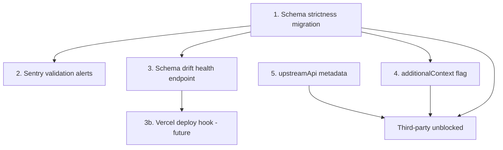

# Schema Resilience and Response Architecture

**Status**: PENDING — open questions require owner decisions
**Last Updated**: 2026-04-13
**Triggered By**: Third-party MCP consumer workaround analysis

## Problem

A third-party MCP consumer disabled `fetch`, `get-lessons-summary`,
and `get-lessons-assets` due to:

> "Response does not match any documented schema for statuses:
> 200, 400, 401, 404"

They built workarounds: raw `fetch()` bypassing the MCP SDK transport,
manual SSE parsing, response cleaning (stripping `oakContextHint`,
`status` wrapper, `data` envelope), and disabling the three tools
entirely.

The root cause is our `.strict()` Zod response schemas rejecting
upstream API responses that contain fields not in our cached OpenAPI
spec. The issue is not currently reproducible on oak-prod (tested
2026-04-13 with 7+ lesson slugs including edge cases), suggesting
it was caused by a transient upstream schema addition — but the
structural fragility remains.

## Assumptions

These assumptions must be verified before or during implementation.
Each is labelled with risk-if-wrong.

- **A1**: The upstream Oak API (`open-api.thenational.academy`) may
  add new optional fields to existing response objects without bumping
  the OpenAPI spec version string. *Risk if wrong*: `.strict()` stays
  safe; but evidence from the third-party consumer contradicts this.
- **A2**: The upstream API does NOT remove or rename existing fields
  without a version bump. *Risk if wrong*: `.strip()` would silently
  succeed on responses that are actually broken — need Layer 1 Sentry
  monitoring to catch this case.
- **A3**: `openapi-zod-client` (our Zod schema generator) emits
  `.passthrough()` when `strictObjects: false`. We assume a
  post-processing step can replace this with `.strip()`. *Risk if
  wrong*: we get `.passthrough()` by default, which weakens types —
  must verify the library's actual behaviour before implementing.
- **A4**: The MCP SDK passes `_meta` from `tools/call` requests
  through to tool handlers in the server. *Risk if wrong*: the
  `additionalContext` flag mechanism would need a different transport
  path (e.g. HTTP headers).
- **A5**: MCP clients (Cursor, Claude Desktop, third-party) tolerate
  extra fields in `_meta` that they don't recognise. *Risk if wrong*:
  adding `upstreamApi` to `_meta` could break clients — test with
  reference implementations first.
- **A6**: The `schema-cache/api-schema-original.json` version-only
  comparison is the sole mechanism for detecting upstream changes.
  *Risk if wrong*: there may be another check we're unaware of.
- **A7**: Search schemas (Elasticsearch index) are under our control
  and should remain `.strict()`. *Risk if wrong*: if a third party
  is also querying our search index responses via MCP, they'd hit
  the same fragility.
- **A8**: The third-party consumer's disabled tools were failing
  because of extra fields in the upstream API response, not because
  of missing fields, changed types, or a different error. *Risk if
  wrong*: `.strip()` alone may not fix their issue — awaiting their
  specific slugs for confirmation.
- **A9**: The upstream API's swagger endpoint
  (`/api/v0/swagger.json`) is stable and fetchable at runtime from
  the deployed MCP server. *Risk if wrong*: the health endpoint
  would need a fallback or cached comparison strategy. Could also
  be rate-limited by the upstream provider.

## Open Questions

### OQ1: `.strip()` vs `.passthrough()` — OWNER DECISION REQUIRED

Both resolve the immediate breakage. The choice affects type safety
and data flow:

**Option A: `.passthrough()` — accept and forward unknown fields**

- Pros: never breaks on upstream additions; unknown fields are
  available if downstream code wants them
- Cons: `z.infer<typeof schema>` gains `[key: string]: unknown`,
  weakening all downstream types. Unknown fields leak into
  `structuredContent` and MCP wire format. Any code that spreads
  the validated result gets polluted with unknown keys.

**Option B: `.strip()` — accept but silently discard unknown fields**

- Pros: never breaks on upstream additions. Types stay clean
  (`z.infer` produces exact shape). No unknown fields leak
  downstream. Existing destructuring and spread patterns unaffected.
- Cons: we silently drop data. If the upstream API adds a field
  that we *want*, we won't notice until we regenerate the schema
  cache. (Mitigated by drift monitoring in Section 3.)

**Option C: Keep `.strict()` but catch and retry without it**

- Overly complex, not recommended.

**Recommendation**: Option B (`.strip()`), pending owner decision.

### OQ2: Should `additionalProperties: false` also be removed from
JSON Schema output?

If MCP clients validate tool responses against the advertised
`toolOutputJsonSchema`, they would reject extra fields even if Zod
accepts them. Removing `additionalProperties: false` from response
JSON Schemas makes the two layers consistent.

### OQ3: Specific lesson slugs from the third-party consumer

Awaiting their response. Testing those slugs against oak-prod would
confirm whether the issue is fixed or latent.

## Section 1: Schema Strictness Migration

### The control knob

`.strict()` originates from `strictObjects: true` in
[generate-zod-schemas.ts](../../packages/core/openapi-zod-client-adapter/src/generate-zod-schemas.ts)
(lines 80-81), with `additionalPropertiesDefaultValue: false`
(lines 82-83). This is hardcoded — not configurable per-schema.
All OpenAPI-derived Zod schemas get `.strict()`.

### Downstream impact analysis (assuming `.strip()`)

- **`validateOutput` in each generated tool descriptor** — loops
  documented-status schemas. With `.strip()`, unknown fields are
  silently removed. The returned `result.data` is typed exactly
  as before. No change needed.
- **`toolOutputJsonSchema` (JSON Schema)** — advertised to MCP
  clients. JSON Schema's `additionalProperties: false` is a
  separate concern. See OQ2.
- **`structuredContent`** — built from validated data in
  `mapExecutionResult`
  ([executor.ts](../../packages/sdks/oak-curriculum-sdk/src/mcp/universal-tools/executor.ts)
  lines 61-63). With `.strip()`, only known fields reach
  `structuredContent`. No change needed.
- **Type inference** — `z.infer<typeof LessonSummaryResponseSchema>`
  with `.strip()` produces the same type as with `.strict()`. No
  change needed.
- **Search schemas** — separately generated in
  `packages/sdks/oak-sdk-codegen/code-generation/typegen/search/`
  with literal `.strict()` in template strings. These validate
  against our own Elasticsearch index (which we control). **Defer
  search schemas — keep strict.**

### Implementation

Single change in
[generate-zod-schemas.ts](../../packages/core/openapi-zod-client-adapter/src/generate-zod-schemas.ts):

- `strictObjects: true` -> `strictObjects: false`
- Verify the adapter emits `.strip()` (not `.passthrough()`) — may
  need a post-processing step in
  [zod-v3-to-v4-transform.ts](../../packages/core/openapi-zod-client-adapter/src/zod-v3-to-v4-transform.ts)
- Run `pnpm sdk-codegen` to regenerate all schemas
- Conditionally update JSON Schema generation (per OQ2)

## Section 2: Schema Drift Monitoring

Three layers of detection, from reactive to proactive.

### Layer 1: Sentry alerting on validation failures (REACTIVE)

The server already logs validation failures via
`logValidationFailureIfPresent` in
[validation-logger.ts](../../apps/oak-curriculum-mcp-streamable-http/src/validation-logger.ts).
With the Sentry integration coming online (per the
sentry-canonical-alignment plan), these `logger.warn` calls will
surface as Sentry issues.

With `.strip()`, validation failures fire only for missing fields,
changed types, or removed fields — the correct signal for upstream
breaking changes, not additions.

### Layer 2: Health endpoint on the MCP server (PROACTIVE)

The drift check must run **remotely on the deployed MCP server**,
not as a local CI job. This gives us a live health signal that can
be monitored by Sentry and trigger alerts when the upstream API
schema diverges from the schemas baked into the running server.

The SDK codegen README notes "Phase 7 (CI drift check) remains" —
reframing this as a server-side health endpoint.

**Design:**

- New route on the HTTP MCP server (e.g. `GET /health/schema-drift`)
- On each invocation:
  1. Fetch live schema from
     `https://open-api.thenational.academy/api/v0/swagger.json`
  2. Deep-diff against the `schema-cache/api-schema-original.json`
     content that was baked into the server at build time — not just
     `info.version` string comparison
  3. Return a structured result: `{ drifted: boolean, summary: ... }`
- Current cache write logic in
  [schema-cache.ts](../../packages/sdks/oak-sdk-codegen/code-generation/schema-cache.ts)
  (lines 32-47) only triggers on version string change — this is a
  known gap since the upstream API could add fields without bumping
  the version string. The health endpoint closes this gap.

**Monitoring:**

- Sentry cron monitor or scheduled check on the health endpoint
- Alert rule: fire when `drifted: true` persists across consecutive
  checks (avoids false positives from transient upstream deploys)
- Dashboard visibility alongside other MCP server health signals

### Layer 2b: Vercel deploy webhook (FUTURE, not yet committed)

Vercel supports deploy hooks — a URL that triggers a rebuild of a
specific branch when called. We could wire the schema drift health
endpoint (or an external cron) to call the Vercel deploy hook for
`main` when drift is detected, automatically rebuilding the MCP
server with the fresh upstream schema.

This is architecturally sound but **not yet committed** because:

- Auto-rebuilding on upstream changes without human review could
  introduce regressions if the upstream API makes breaking changes
- The rebuild would pick up the new schema via `pnpm sdk-codegen`
  at build time, but any new fields would still be stripped (under
  the `.strip()` policy) until we explicitly add them to our schemas
- Better as a second phase after the health endpoint proves stable
  and the drift alert pipeline is trusted

When ready, implementation is: Vercel project settings -> Git ->
Deploy Hooks -> create hook for `main` -> call it from the drift
detection pipeline.

### Layer 3: Runtime field inventory (OPTIONAL, higher effort)

Log stripped field counts at runtime. Lower priority than Layers 1-2.

## Section 3: `additionalContext` Response Flag

### Current architecture

`oakContextHint` is added in `formatToolResponse`
([universal-tool-shared.ts](../../packages/sdks/oak-curriculum-sdk/src/mcp/universal-tool-shared.ts)
lines 185-197). For generated tools, `includeContextHint` is wired
from `descriptor.requiresDomainContext`
([executor.ts](../../packages/sdks/oak-curriculum-sdk/src/mcp/universal-tools/executor.ts)
line 64). There is no request-level mechanism to control this.

The `{status, data}` envelope is built in `mapExecutionResult`
(same executor.ts, lines 61-63).

### Design: `additionalContext` request flag

Read from `_meta` on the MCP `tools/call` request:

```typescript
{
  "method": "tools/call",
  "params": {
    "name": "get-lessons-summary",
    "arguments": { "lesson": "joining-using-and" },
    "_meta": { "additionalContext": false }
  }
}
```

Controls:

- `oakContextHint` — omit when `additionalContext: false`
- `summary` text content item — omit when false
- `status` wrapper — could be flattened/omitted

`structuredContent` shape remains stable (consumed by MCP Apps
widgets). The `content` array is what most MCP clients read.

## Section 4: Direct API Access

Cross-references
[upstream-api-reference-metadata.plan.md](upstream-api-reference-metadata.plan.md)
— not duplicated here. That plan adds `_meta.upstreamApi` to every
generated tool, enabling machine-to-machine consumers to discover
the upstream API and call it directly.

Architectural principle: MCP is for agent-mediated interaction with
context enrichment; direct API access is for programmatic data
retrieval. The `upstreamApi` metadata bridges the two.

## Execution Priority



- **Immediate**: schema strictness migration (unblocks third party,
  prevents recurrence) — blocked on OQ1
- **Soon**: Sentry validation alerting (comes with
  sentry-canonical-alignment anyway)
- **Planned**: schema drift health endpoint (remote, Sentry-monitored),
  `additionalContext` flag, `upstreamApi` metadata
- **Future**: Vercel deploy hook for automatic rebuild on drift
  (not yet committed — requires trust in drift detection pipeline)

## Key Files

- `packages/core/openapi-zod-client-adapter/src/generate-zod-schemas.ts`
  — `.strict()` control knob
- `packages/core/openapi-zod-client-adapter/src/zod-v3-to-v4-transform.ts`
  — post-processing that may need `.strip()` injection
- `packages/sdks/oak-sdk-codegen/code-generation/schema-cache.ts`
  — version-only cache comparison (drift gap)
- `packages/sdks/oak-curriculum-sdk/src/mcp/universal-tool-shared.ts`
  — `formatToolResponse` and `oakContextHint`
- `packages/sdks/oak-curriculum-sdk/src/mcp/universal-tools/executor.ts`
  — `mapExecutionResult` and `{status, data}` envelope
- `apps/oak-curriculum-mcp-streamable-http/src/validation-logger.ts`
  — validation failure logging (Layer 1)
