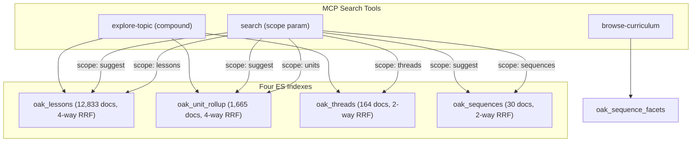
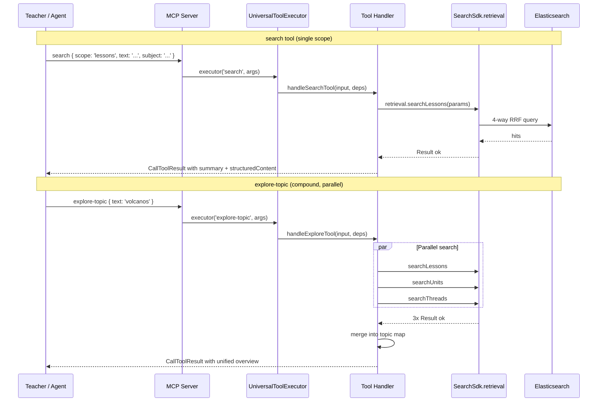

# Phase 3a: MCP Search Integration — Execution Plan

This is not a simple API adapter. This is an experience layer with two users: the human teacher and the AI agent. The tool architecture must serve both.

## Design Principles

1. **Every index gets exposed.** Four search indexes (lessons, units, threads, sequences) plus completion suggestions and faceted browsing = six retrieval capabilities. All must be accessible.
2. **Passthrough AND compound.** Individual scope access for precision. Multi-index tools for discovery. Teachers often don't know which scope they need.
3. **NL guidance is first-class.** Per ADR-107, the SDK is deterministic. The MCP layer teaches agents how to map "find me KS3 science lessons about cells" into structured search parameters. This happens through tool descriptions, examples, and cross-tool workflow guidance.
4. **Two users.** Agent-facing: rich descriptions, NL mapping examples, "Use this when" / "Do NOT use" patterns, prerequisite guidance. Human-facing: meaningful summaries, formatted results, next-action suggestions.

---

## Tool Architecture

### The Search Landscape



### Tool 1: `search` -- primary search across all indexes

**Replaces:** the old REST-based `search` aggregated tool (after validation in WS5).

**Scopes** (5):

| Scope       | SDK Method        | Index             | Strategy   | When to use                              |
| ----------- | ----------------- | ----------------- | ---------- | ---------------------------------------- |
| `lessons`   | `searchLessons`   | `oak_lessons`     | 4-way RRF  | Find specific lessons on a topic         |
| `units`     | `searchUnits`     | `oak_unit_rollup` | 4-way RRF  | Find teaching units that cover a concept |
| `threads`   | `searchThreads`   | `oak_threads`     | 2-way RRF  | Find learning progressions across years  |
| `sequences` | `searchSequences` | `oak_sequences`   | 2-way RRF  | Find curriculum programme structures     |
| `suggest`   | `suggest`         | varies            | Completion | Typeahead as the user types              |

**Input schema:** `text` (required), `scope` (required), plus common filters (`subject`, `keyStage`, `size`, `from`) and scope-specific filters (lesson: `unitSlug`, `tier`, `examBoard`, `year`, `threadSlug`, `highlight`; unit: `minLessons`, `highlight`; sequence: `phaseSlug`, `category`; suggest: `limit`).

**NL-to-structured examples** (in tool description, per ADR-107):

| Teacher says                                    | Maps to                                                                             |
| ----------------------------------------------- | ----------------------------------------------------------------------------------- |
| "Find KS3 science lessons about photosynthesis" | `{ scope: 'lessons', text: 'photosynthesis', subject: 'science', keyStage: 'ks3' }` |
| "What units cover fractions in primary maths?"  | `{ scope: 'units', text: 'fractions', subject: 'maths', keyStage: 'ks2' }`          |
| "What's the learning progression for algebra?"  | `{ scope: 'threads', text: 'algebra', subject: 'maths' }`                           |
| "Show me secondary science programmes"          | `{ scope: 'sequences', text: 'science', keyStage: 'ks3' }`                          |
| "Suggest lessons starting with 'photo'"         | `{ scope: 'suggest', text: 'photo', scope: 'lessons' }`                             |
| "Find lessons on the Romans for Year 3"         | `{ scope: 'lessons', text: 'Romans', year: '3' }`                                   |
| "KS4 higher tier maths on trigonometry"         | `{ scope: 'lessons', text: 'trigonometry', keyStage: 'ks4', tier: 'higher' }`       |

**Agent workflow guidance** (in description):

- "Start with `scope: 'lessons'` for specific content. Use `scope: 'units'` for broader topic coverage. Use `scope: 'threads'` to understand how concepts build across years."
- "For learning progressions, search threads first, then call `get-thread-progressions` for the full ordered sequence."
- "For prerequisites, search threads for the topic, then call `get-prerequisite-graph` to see what comes before."
- "Combine with `fetch` to get full lesson details (objectives, keywords, misconceptions, quiz questions)."

### Tool 2: `browse-curriculum` -- structured navigation

**Backed by:** `fetchSequenceFacets()` from the Search SDK.

**Purpose:** When the teacher wants to browse what's available, not search for something specific. Returns structured facet data: subjects, key stages, units, lesson counts.

**Input schema:** `subject` (optional), `keyStage` (optional).

**When to use:** "What's available in KS2 science?", "Show me the maths curriculum", "What subjects can I browse?"

**Why separate from search:** Different interaction model. No free-text query. Returns categories and counts, not ranked results. Useful for initial orientation.

### Tool 3: `explore-topic` -- compound multi-index discovery

**Purpose:** The "I don't know what I'm looking for yet" tool. Searches lessons, units, AND threads in parallel for a topic, returning a unified topic map.

**Input schema:** `text` (required), `subject` (optional), `keyStage` (optional).

**Implementation:** Calls `searchLessons`, `searchUnits`, `searchThreads` in parallel (small `size`, e.g. 5 per scope). Formats a unified response:

```text
Topic: "photosynthesis"
Found across the curriculum:
- 12 lessons (top 5 shown)
- 3 units covering this topic
- 2 learning progression threads

Lessons:
  1. "Photosynthesis and leaf structure" (KS3 Science)
  2. ...

Units:
  1. "Plants and photosynthesis" (KS3 Science, 8 lessons)
  2. ...

Learning threads:
  1. "Biology: Cells and organisms" (Year 7-11)
  2. ...

Next steps: Use search with scope 'lessons' for more results,
or fetch a specific lesson for full details.
```

**When to use:** "What does Oak have about volcanos?", "I want to teach about electricity", "Explore fractions across the curriculum."

**Why compound:** Agents often don't know which scope is relevant. This gives a cross-curriculum overview in one call, then the agent can drill down.

---

## Dependency Strategy

Add search SDK as a direct dependency of curriculum-sdk for now. The cross-SDK dependency (curriculum-sdk -> search-sdk, search-sdk peer-deps curriculum-sdk) is a known concern. pnpm resolves it in workspace mode. We will solve this properly later -- extracting shared types to `packages/core/` is easier once we have working code to refactor.

**Dependencies to add:**

- `packages/sdks/oak-curriculum-sdk/package.json`: `@oaknational/result`, `@oaknational/oak-search-sdk`
- `apps/oak-curriculum-mcp-stdio/package.json`: `@oaknational/oak-search-sdk`, `@elastic/elasticsearch`
- `apps/oak-curriculum-mcp-streamable-http/package.json`: `@oaknational/oak-search-sdk`, `@elastic/elasticsearch`

---

## Data Flow



---

## WS1 -- Tool Definitions and Tests (RED)

All tests MUST FAIL at the end of WS1.

### 1.1: `search` tool module

**Directory:** `packages/sdks/oak-curriculum-sdk/src/mcp/aggregated-search-sdk/`

(Named `aggregated-search-sdk` to distinguish from the existing `aggregated-search` REST-based tool during the transition period.)

| File                 | Purpose                                                                | Template                               |
| -------------------- | ---------------------------------------------------------------------- | -------------------------------------- |
| `types.ts`           | `SearchSdkArgs` type with `scope` discriminator, `SearchSdkScope`      | `aggregated-search/types.ts`           |
| `validation.ts`      | `validateSearchSdkArgs()` with Zod                                     | `aggregated-search/validation.ts`      |
| `tool-definition.ts` | `SEARCH_SDK_TOOL_DEF`, `SEARCH_SDK_INPUT_SCHEMA` with rich NL examples | `aggregated-search/tool-definition.ts` |
| `execution.ts`       | `runSearchSdkTool()` stub (throws)                                     | `aggregated-search/execution.ts`       |
| `formatting.ts`      | `formatSearchResults()` per-scope result formatting                    | new                                    |
| `index.ts`           | Barrel export                                                          | `aggregated-search/index.ts`           |

`**SearchSdkScope`:** `'lessons' | 'units' | 'threads' | 'sequences' | 'suggest'`

**Key type design:** `SearchSdkArgs` has a `scope` field plus all filter fields. Scope-specific filters are optional and validated in the handler (not at the Zod level -- keeps the schema simple for agents).

**Tests:**

- `validation.unit.test.ts` -- valid/invalid inputs for all 5 scopes, filter validation, subject/keyStage enum validation
- `execution.integration.test.ts` -- fake `RetrievalService`, test all 5 scope dispatches (success + error), filter passthrough, missing deps error
- `formatting.unit.test.ts` -- result formatting per scope, summary generation, empty results

### 1.2: `browse-curriculum` tool module

**Directory:** `packages/sdks/oak-curriculum-sdk/src/mcp/aggregated-browse/`

| File                 | Purpose                                  |
| -------------------- | ---------------------------------------- |
| `types.ts`           | `BrowseArgs` (subject?, keyStage?)       |
| `validation.ts`      | `validateBrowseArgs()`                   |
| `tool-definition.ts` | `BROWSE_TOOL_DEF`, `BROWSE_INPUT_SCHEMA` |
| `execution.ts`       | `runBrowseTool()` stub                   |
| `index.ts`           | Barrel export                            |

**Tests:**

- `validation.unit.test.ts` -- optional filters, invalid subject/keyStage
- `execution.integration.test.ts` -- fake retrieval, test facet response formatting

### 1.3: `explore-topic` compound tool module

**Directory:** `packages/sdks/oak-curriculum-sdk/src/mcp/aggregated-explore/`

| File                 | Purpose                                       |
| -------------------- | --------------------------------------------- |
| `types.ts`           | `ExploreArgs` (text, subject?, keyStage?)     |
| `validation.ts`      | `validateExploreArgs()`                       |
| `tool-definition.ts` | `EXPLORE_TOOL_DEF`, `EXPLORE_INPUT_SCHEMA`    |
| `execution.ts`       | `runExploreTool()` stub                       |
| `formatting.ts`      | `formatTopicMap()` merges multi-index results |
| `index.ts`           | Barrel export                                 |

**Tests:**

- `validation.unit.test.ts` -- text required, optional filters
- `execution.integration.test.ts` -- fake retrieval, test parallel dispatch, test merge logic, test partial failures (one scope errors, others succeed)
- `formatting.unit.test.ts` -- topic map formatting, empty scopes, mixed results

### 1.4: Run tests -- ALL must fail

```bash
pnpm test --filter @oaknational/curriculum-sdk
```

---

## WS2 -- Wiring and Implementation (GREEN)

All tests MUST PASS at the end of WS2.

### 2.1: Add dependencies

```bash
# curriculum-sdk
pnpm add @oaknational/result @oaknational/oak-search-sdk --filter @oaknational/curriculum-sdk

# Both MCP servers
pnpm add @oaknational/oak-search-sdk @elastic/elasticsearch --filter oak-curriculum-mcp-stdio
pnpm add @oaknational/oak-search-sdk @elastic/elasticsearch --filter oak-curriculum-mcp-streamable-http

pnpm install
```

### 2.2: Extend `UniversalToolExecutorDependencies`

**File:** [packages/sdks/oak-curriculum-sdk/src/mcp/universal-tool-shared.ts](packages/sdks/oak-curriculum-sdk/src/mcp/universal-tool-shared.ts) (line 33)

Add optional `searchRetrieval: RetrievalService` property. When absent, all search tools return a fail-fast error.

### 2.3: Implement `search` tool

**File:** `aggregated-search-sdk/execution.ts`

Dispatch by scope to the 5 SDK methods. Each handler:

- Builds scope-specific SDK params from `SearchSdkArgs`
- Calls the appropriate SDK method
- Maps `Result<T, RetrievalError>` to `CallToolResult` via `formatSearchResults()`
- Error: `formatError(result.error.message)` with `RetrievalError.type` for context

**Result formatting** (`formatting.ts`):

- Human-readable summary: "Found 15 lessons matching 'photosynthesis' in KS3 Science"
- `structuredContent`: full result data for model reasoning + widget display
- `_meta`: toolName, query, timestamp for widget routing
- Scope-specific: lessons show title/subject/keyStage/highlights; units show title/lessonCount; threads show title/subjectSlugs/unitCount; sequences show title/phaseTitle

### 2.4: Implement `browse-curriculum` tool

**File:** `aggregated-browse/execution.ts`

Calls `retrieval.fetchSequenceFacets(params)`. Formats the `SearchFacets` response into a structured overview showing subjects, key stages, units, and lesson counts.

### 2.5: Implement `explore-topic` compound tool

**File:** `aggregated-explore/execution.ts`

Calls `searchLessons`, `searchUnits`, `searchThreads` in parallel (using `Promise.all`). Small `size` per scope (e.g. 5). Merges into topic map. Handles partial failures gracefully (if one scope errors, still return the others with an error note).

### 2.6: Register all three tools

**File:** [definitions.ts](packages/sdks/oak-curriculum-sdk/src/mcp/universal-tools/definitions.ts) -- add to `AGGREGATED_TOOL_DEFS`

**File:** [executor.ts](packages/sdks/oak-curriculum-sdk/src/mcp/universal-tools/executor.ts) -- add 3 cases to `executeAggregatedTool` switch

### 2.7: ES environment config + SDK wiring (both servers)

**STDIO** ([runtime-config.ts](apps/oak-curriculum-mcp-stdio/src/runtime-config.ts), [wiring.ts](apps/oak-curriculum-mcp-stdio/src/app/wiring.ts)):

- Optional `ELASTICSEARCH_URL` and `ELASTICSEARCH_API_KEY` in env/config
- Create `searchRetrieval` from `createSearchSdk(...).retrieval` if credentials present
- Pass through to `createUniversalToolExecutor`

**HTTP** ([env.ts](apps/oak-curriculum-mcp-streamable-http/src/env.ts), [handlers.ts](apps/oak-curriculum-mcp-streamable-http/src/handlers.ts)):

- Optional Zod-validated ES env vars
- Same SDK wiring pattern
- Pass through to executor in `handleToolWithAuthInterception`

Both servers gracefully degrade: without ES credentials, search tools return "not configured" errors; all other tools work normally.

### 2.8: Run tests -- ALL must pass

```bash
pnpm test --filter @oaknational/curriculum-sdk
```

---

## WS3 -- NL Guidance, Examples, and Documentation (REFACTOR)

This workstream is NOT an afterthought. It is where the user experience is defined.

### 3.1: Tool descriptions with NL guidance

Each tool description follows the established "Use this when" / "Do NOT use" pattern, with scope-specific NL mapping examples. The descriptions teach the agent:

- **Which scope to choose** for different teacher intents
- **How to extract filters** from natural language ("KS3 science" -> `keyStage: 'ks3', subject: 'science'`)
- **When to combine tools** ("What comes before trigonometry?" -> search threads, then get-prerequisite-graph)
- **What each scope returns** so the agent can set teacher expectations

### 3.2: Cross-tool workflow guidance

Update [prerequisite-guidance.ts](packages/sdks/oak-curriculum-sdk/src/mcp/prerequisite-guidance.ts) to include search tool guidance. Add search-specific workflows to the guidance constants.

Key workflows to document:

| Teacher intent            | Tool sequence                                                    |
| ------------------------- | ---------------------------------------------------------------- |
| Find lessons on a topic   | `search(scope: 'lessons')`                                       |
| Plan a lesson             | `search(scope: 'lessons')` then `fetch(lesson:slug)` for details |
| Explore a topic           | `explore-topic` then drill down with `search`                    |
| Understand progression    | `search(scope: 'threads')` then `get-thread-progressions`        |
| Find prerequisites        | `search(scope: 'threads')` then `get-prerequisite-graph`         |
| Browse a subject          | `browse-curriculum(subject)`                                     |
| Discover what's available | `explore-topic` or `browse-curriculum`                           |

### 3.3: Extend `get-help` content

Update [tool-guidance-data.ts](packages/sdks/oak-curriculum-sdk/src/mcp/aggregated-help/tool-guidance-data.ts):

- Add new tool categories (search tools alongside existing browsing/fetching)
- Add search-specific workflows
- Add NL mapping tips
- Add scope selection guidance

### 3.4: MCP prompts for search workflows

Update existing MCP prompts and add new ones:

- Update `find-lessons` prompt to use the new search tool
- Add `explore-curriculum` prompt for broad topic exploration
- Add `learning-progression` prompt for thread-based progression mapping

### 3.5: Result formatting for humans

Each scope's result formatter produces a human-readable summary that:

- States what was found (count, scope, query)
- Highlights key information (lesson titles, unit names, thread spans)
- Suggests next actions ("Use fetch to get full lesson details", "Search threads to see progression")
- Uses teacher-friendly language, not technical terms

### 3.6: Documentation and TSDoc

- Update workspace READMEs for curriculum-sdk, stdio server, http server
- Comprehensive TSDoc on all new functions, types, modules
- Update architecture docs with search tool architecture
- Update active plan and roadmap

---

## WS4 -- Quality Gates

### 4.1: Full quality gate chain

```bash
pnpm type-gen
pnpm build
pnpm type-check
pnpm lint:fix
pnpm format:root
pnpm markdownlint:root
pnpm test
pnpm test:e2e
pnpm test:ui
pnpm smoke:dev:stub
```

### 4.2: Verify existing tools unaffected

All 7 existing aggregated tools + all generated tools must work identically.

### 4.3: Sub-agent reviews

- `code-reviewer` on all changed files
- `architecture-reviewer` on cross-SDK dependency and tool architecture
- `test-reviewer` on new tests
- `config-reviewer` on package.json changes

---

## WS5 -- Compare and Replace

### 5.1: Comparative queries

Run the same queries through old `search` (REST API) and new `search` (SDK/ES, scope: lessons) on representative teacher queries. Compare relevance, coverage, latency.

### 5.2: Decision and transition

If SDK search is superior (expected: 4-way RRF + ELSER vs REST text search):

- Remove old `search` aggregated tool (`aggregated-search/`)
- Rename new tool from internal `aggregated-search-sdk` to `aggregated-search` (or keep as-is if naming is clear)
- Update the tool name in `AGGREGATED_TOOL_DEFS` to `'search'`
- Update all cross-references in tool descriptions, help content, prerequisite guidance
- Full quality gate chain again

### 5.3: Cleanup

- Delete old `aggregated-search/` module if replaced
- Update `get-help` workflows to reference final tool names
- Update MCP prompts

---

## Implementation Notes (WS1-WS2 Complete)

### Circular Dependency Resolution

`pnpm add @oaknational/oak-search-sdk --filter @oaknational/curriculum-sdk` caused a turbo "Cyclic dependency detected" error (search-sdk has curriculum-sdk as peerDependency). Solved via **dependency inversion**: `search-retrieval-types.ts` defines a local `SearchRetrievalService` interface structurally compatible with `oak-search-sdk`'s `RetrievalService`, using only curriculum-sdk's own generated types. The MCP servers import the concrete `oak-search-sdk` and pass it through.

### Key Architectural Decisions

- **Dispatch maps, not switches**: `executor.ts` and `execution.ts` use const object maps for tool/scope dispatch to stay within ESLint complexity limits
- **Two error patterns coexist**: Existing tools use `ToolExecutionResult`; search tools use `Result<T, E>` from `@oaknational/result`. Clean boundary. Unification is a separate future workstream (Phase 3b)
- **`_meta` and `securitySchemes` required**: All aggregated tools must include OpenAI Apps SDK `_meta` fields and OAuth `securitySchemes` for widget rendering and auth enforcement

### Quality Gate Results (WS4)

| Gate | Result | Notes |
| ---- | ------ | ----- |
| type-gen | Pass | |
| build | Pass | |
| type-check | Pass | |
| lint:fix | Pass | |
| format:root | Pass | |
| SDK tests | 1241 passed (113 files) | All green |
| STDIO E2E | 10 passed (4 files) | All green |
| HTTP unit/integration | 611 passed (51 files) | All green |
| HTTP E2E | 191 passed (25 files) | All green after transport isolation fix |

### E2E Transport Isolation Fix (17 previously failing tests — RESOLVED)

**Root cause**: MCP `StreamableHTTPServerTransport` serves exactly one client per instance. Tests that shared an app instance (via `beforeAll`) silently failed on the second request — transport returned HTTP 500 (consumed), which SSE parsers reported as "missing data line".

**Fix**: Each test expecting a 200 from MCP transport now creates its own fresh `createApp()` instance. Tests checking for HTTP 401 (auth rejects before transport) were safe but updated for consistency.

**Files fixed** (6): `application-routing`, `auth-enforcement`, `public-resource-auth-bypass`, `get-knowledge-graph`, `widget-metadata`, `widget-resource`.

---

## Key Risks and Mitigations

| Risk                                           | Mitigation                                                                                            |
| ---------------------------------------------- | ----------------------------------------------------------------------------------------------------- |
| Cross-SDK circular dependency                  | Solved via dependency inversion. `SearchRetrievalService` interface in curriculum-sdk. Extract to `packages/core/` later. |
| `@elastic/elasticsearch` bundle size on Vercel | Not yet verified. Lazy imports if needed. |
| ES credentials missing in deployment           | Optional env vars + fail-fast error. Existing tools unaffected. |
| Too many tools overwhelms agents               | Three new tools is modest. Rich descriptions + `get-help` + prerequisite guidance help agents choose. |
| Existing tool regression                       | `searchRetrieval` is optional. All existing code paths unchanged. E2E tests verify. |
| NL guidance insufficient                       | WS3 pending. Iterate on descriptions based on agent testing. The guidance is in code, easy to refine. |
| E2E transport isolation (was 17 failures)       | **Resolved.** Tests now create fresh `createApp()` per MCP request. 191/191 E2E pass. |
