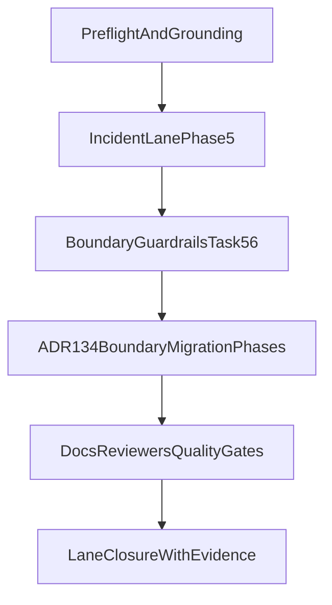

# Search CLI-SDK Boundary Migration - Implementation Plan

**Last Updated**: 12 March 2026 (long-term architecture closeout)

## Source Strategy

- Canonical doctrine source: `docs/architecture/architectural-decisions/134-search-sdk-capability-surface-boundary.md`
- Active incident lane to align with: `cli-robustness.plan.md`
- ADR target number: `ADR-134`.
- ADR status: `ADR-134` exists and is accepted; Phase 0 validates and amends it if new
  boundary decisions emerge during RED proofing.
- Foundation docs:
  - `.agent/directives/principles.md`
  - `.agent/directives/testing-strategy.md`
  - `.agent/directives/schema-first-execution.md`

## Standalone Entry - Start Here

If this is the first file loaded in a new session, execute this order:

1. Run preflight checks from this file.
2. Continue/complete boundary refactor phases first (especially Phase 3/4 if open).
3. Do not run lifecycle ingest path during refactor completion.
4. Hand over to incident validation only after refactor/enforcement acceptance criteria are met.
5. In incident validation, ingest remains operator-run while the agent monitors and diagnoses.

## Preflight

Before implementation edits:

1. Re-read foundation docs listed above.
2. Confirm current boundary state and imports:

```bash
pnpm --filter @oaknational/search-cli lint
pnpm --filter @oaknational/oak-search-sdk lint
```

3. Record baseline package surfaces:

```bash
rg -n "exports|from './admin|from './internal|createSearchSdk" packages/sdks/oak-search-sdk/{package.json,src/index.ts}
```

## Integrated Unified Execution Contract

This section captures the full unified execution contract for the semantic-search
lanes and is authoritative for standalone next-session re-entry.

### Unified Goal

Close the active `semantic-search` work by finishing refactoring and ADR-134
boundary enforcement first, then running CLI lifecycle validation, and
finishing with deterministic closure evidence.

### Unified Source-of-truth Inputs

- Session prompt: `.agent/prompts/semantic-search/semantic-search.prompt.md`
- Incident lane: `.agent/plans/semantic-search/active/cli-robustness.plan.md`
- Boundary lane (this file): `.agent/plans/semantic-search/active/search-cli-sdk-boundary-migration.execution.plan.md`
- Doctrine: `docs/architecture/architectural-decisions/134-search-sdk-capability-surface-boundary.md`
- Foundations:
  - `.agent/directives/principles.md`
  - `.agent/directives/testing-strategy.md`
  - `.agent/directives/schema-first-execution.md`

### Unified Execution Order (authoritative)

1. Re-ground on foundations and confirm branch/worktree state.
2. Complete refactoring obligations first:
   - `cli-robustness` Phase 5 GREEN/REFACTOR implementation tasks
     (excluding ingest execution)
   - verify ADR-134 boundary enforcement remains green; do not reopen this
     completed boundary lane unless new regression evidence appears
3. Only after Step 2 is complete, run incident lifecycle validation chain:
   `validate-aliases` -> `versioned-ingest` -> `validate-aliases`.
4. `versioned-ingest` is operator-run: the operator starts ingest; the agent
   monitors and diagnoses.
5. Perform docs/ADR propagation and full gates only after both lanes'
   acceptance criteria pass.

**Hard sequencing rule**: do not try to run the lifecycle ingest path until
refactoring and boundary enforcement tasks are complete.

### Unified Phase Structure

#### Phase 0 — Preflight and Baseline Capture

- Re-read foundations and ADR-134.
- Capture deterministic baseline:
  - `git status --short`
  - `git branch --show-current`
  - active plan inventory
- Capture current boundary signals with package-scoped lint/type checks.

#### Phase 1 — Incident Lane Completion (`cli-robustness`)

- Execute Task 5.1–5.5 to close `previous_version` strict mapping contract drift.
- Confirm artefact coherence via `pnpm sdk-codegen`, `pnpm build`, `pnpm type-check`.
- Re-run lifecycle validation chain only after boundary refactor/enforcement
  completion; prove alias health plus rollback-branch closure.
- Complete Phase 5 REFACTOR cleanup and preserve fail-fast diagnostics.

#### Phase 2 — Boundary Doctrine Execution (this lane)

- Phase 0 RED proofs: failing checks for root leakage and import-policy violations.
- Phase 1–2 GREEN: split SDK `read`/`admin` surfaces and migrate CLI imports.
- Phase 3 REFACTOR: remove CLI duplicate canonical retrieval/preprocessing semantics.
- Phase 4 enforcement: encode boundary policy in lint (positive/negative fixtures,
  blocking behaviour).
- This phase must be complete before attempting CLI ingest validation.

#### Phase 3 — Unified Closeout

- Complete pending specialist reviewer passes for both lanes:
  - `test-reviewer`
  - `type-reviewer`
  - `docs-adr-reviewer`
  - `elasticsearch-reviewer`
  - re-check `code-reviewer` if substantive diffs changed
- Propagate docs updates to:
  - `apps/oak-search-cli/README.md`
  - `apps/oak-search-cli/docs/ARCHITECTURE.md`
  - `packages/sdks/oak-search-sdk/README.md`
  - relevant ADR index/decision records
- Run full one-gate-at-a-time sequence from repo root, restarting from first
  failing gate after each fix.

### Cross-lane Dependency Map



### Unified Evidence and Exit Criteria

- Incident evidence: no strict mapping exception for `previous_version`,
  `versioned-ingest` exits 0, post-ingest alias targets healthy.
- Boundary evidence: non-admin CLI cannot import
  `@oaknational/oak-search-sdk/admin`; no app deep/internal imports; root
  surface no admin/internal leakage.
- Governance evidence: reviewer findings resolved or explicitly owner-triaged;
  all quality gates pass without bypasses.

### Unified Scope Controls (Non-goals)

- No compatibility layers.
- No fallback dynamic-mapping workarounds.
- No reopening already-completed historical phases without new regression evidence.
- No expansion into unrelated semantic-search roadmap items outside the two active lanes.

## Current Progress Snapshot (12 March 2026)

Completed:

1. SDK subpath surfaces added:
   - `@oaknational/oak-search-sdk/read`
   - `@oaknational/oak-search-sdk/admin`
2. Root SDK surface constrained to read-safe exports (no admin/internal re-export leakage).
3. CLI import migration executed across:
   - `src/cli/search/**` -> `/read`
   - `src/cli/observe/**` -> `/read`
   - `src/cli/admin/**` and lifecycle/indexing paths -> `/admin`
4. Search CLI lint policy now blocks:
   - non-admin modules importing root or admin SDK surface
   - app imports of SDK internal/deep implementation paths
   - admin-only support modules importing SDK read/root surfaces
5. Admin-only lifecycle orchestration moved to:
   - `src/cli/admin/shared/build-lifecycle-service.ts`
   - no longer exported from `src/cli/shared/index.ts`
6. Fixture-backed boundary proofs added in:
   - `apps/oak-search-cli/eslint-boundary.integration.test.ts`
   - negative + positive cases for read/admin/internal path boundaries,
     including admin-root, indexing/adapters, and evaluation policy proofs
7. Index resolver primitives were promoted to SDK read surface and consumed by
   `apps/oak-search-cli/src/lib/search-index-target.ts` from `/read`, removing
   transitive admin coupling from read-path query construction.
8. Boundary policy now defaults to non-admin for `src/**/*.ts` with explicit
   privileged overrides for `src/cli/admin/**`, `src/lib/indexing/**`,
   `src/adapters/**`, and mixed-capability safeguards for `evaluation/**` and
   `operations/**`.

Remaining in this lane:

- None. Boundary lane acceptance criteria satisfied; continue via incident lane ordering.

## Current Boundary Map

### Ownership Matrix (Current)

| Module family | Current owner | Correct owner | Boundary status |
|---|---|---|---|
| `apps/oak-search-cli/src/cli/search/**` command UX and handlers | CLI | CLI | Healthy (`@oaknational/oak-search-sdk/read`) |
| `apps/oak-search-cli/src/cli/admin/**` admin command UX | CLI | CLI | Healthy (`@oaknational/oak-search-sdk/admin`) |
| `apps/oak-search-cli/src/cli/shared/build-search-sdk-config.ts` | CLI | CLI | Healthy |
| `apps/oak-search-cli/src/cli/admin/shared/build-lifecycle-service.ts` | CLI | CLI admin lane | Healthy (admin-only orchestration) |
| `apps/oak-search-cli/src/lib/indexing/**` | CLI | CLI admin-support subtree | Healthy (`@oaknational/oak-search-sdk/admin`) |
| `apps/oak-search-cli/src/adapters/**` | CLI | CLI admin-support subtree | Healthy (`@oaknational/oak-search-sdk/admin`) |
| `packages/sdks/oak-search-sdk/src/retrieval/**` | SDK | SDK | Canonical owner |
| `packages/sdks/oak-search-sdk/src/admin/**` | SDK | SDK | Canonical owner |
| `apps/oak-search-cli/src/lib/hybrid-search/**` | CLI | SDK read surface for canonical retrieval semantics | Retained for CLI runtime orchestration only |
| `apps/oak-search-cli/src/lib/query-processing/**` | CLI | SDK retrieval/query-processing | Retained legacy lane; migration complete for active CLI surfaces |
| `apps/oak-search-cli/src/lib/search-index-target.ts` | Shared/mixed | Split: SDK canonical constants + CLI coercion | Healthy (consumes canonical `/read` index-resolver exports) |
| `packages/sdks/oak-search-sdk/src/internal/**` not re-exported by `src/index.ts` | SDK internal surface | Internal only | Healthy (no root leakage) |

### Boundary Evidence Anchors (Updated)

- SDK exports root plus explicit `./read` and `./admin` surfaces (`packages/sdks/oak-search-sdk/package.json`).
- SDK root does not re-export admin/internal symbols (`packages/sdks/oak-search-sdk/src/index.ts`).
- SDK read surface exports index-resolver primitives used by read and admin consumers
  (`packages/sdks/oak-search-sdk/src/read.ts`).
- SDK admin surface re-exports shared index-resolver primitives via read surface, not
  `internal/*` (`packages/sdks/oak-search-sdk/src/admin.ts`).
- CLI read/admin import policy is enforced in `apps/oak-search-cli/eslint.config.ts` and proven via fixture tests in `apps/oak-search-cli/eslint-boundary.integration.test.ts`.

## Strict To-Be Boundary Contract

### Capability Surfaces

1. `@oaknational/oak-search-sdk/read`
   - Canonical retrieval semantics only.
   - Default consumer path for non-admin CLI modules.
2. `@oaknational/oak-search-sdk/admin`
   - Privileged lifecycle/write/admin operations only.
   - Allowed only in explicit admin entrypoints.
3. `internal/*`
   - Never importable by app code.
   - Never re-exported from root/default SDK surface.

### Import Policy

- Non-admin CLI modules must not import admin surface.
- `src/**/*.ts` defaults to non-admin policy; privileged access requires explicit
  lint-override membership.
- App code must not import `internal/*` or deep SDK implementation paths.
- Root SDK entrypoint must not expose admin/write or internal symbols transitively.
- Experiment modules are deferred until a first real consumer exists (YAGNI).

## Violations Catalogue (Current, Prioritised)

### Open

- None. Boundary closeout evidence is complete in this lane.

## Long-Term Excellence Criteria and Fitness Functions

The boundary is healthy only when all checks below are true and blocking:

1. No duplicate canonical retrieval/preprocessing module families across CLI and SDK.
2. No app imports from SDK `internal/*` or deep implementation paths.
3. Non-admin CLI modules cannot import SDK admin surface.
4. Default SDK root entrypoint does not expose admin/write or internal symbols.
5. Any future experiment seam is introduced only with its own ADR and boundary tests.
6. Boundary fitness failures break lint/type gates and block merges.

## ADR and Documentation Targets

Delivered updates in this implementation:

1. ADR update for final CLI/SDK capability contract:
   - read/admin surface doctrine
   - rejected alternatives and rationale
   - enforcement mechanisms (lint + package exports + tests)
2. `apps/oak-search-cli/README.md` and `apps/oak-search-cli/docs/ARCHITECTURE.md`:
   - explicit read-by-default and admin entrypoint boundaries
3. `packages/sdks/oak-search-sdk/README.md`:
   - subpath export usage guidance and privilege model
4. Semantic-search planning docs:
   - ensure this implementation plan is indexed in active lane docs
   - ensure incident lane references the boundary policy once enforced

## TDD Execution Plan

### Phase 0 - Boundary Contract Validation + RED Proofs

- Step 0a (contract validation): verify ADR-134 still matches active boundary decisions,
  then amend ADR-134 only if decisions changed.
  - ADR file target: `docs/architecture/architectural-decisions/134-search-sdk-capability-surface-boundary.md`
- Step 0b (RED proofs): write tests/checks that assert the target contract and fail on current state:
  - root SDK must not export admin/internal symbols (fails today, passes in GREEN)
  - non-admin CLI modules must not import admin helpers (fails today, passes in GREEN)
- Test/check locations:
  - extend `packages/core/oak-eslint/src/rules/sdk-boundary.unit.test.ts` for generic boundary primitives only
  - keep CLI-specific capability-matrix proof fixtures in the CLI workspace (no app-topology doctrine embedded in core)

Deterministic validation:

- `pnpm --filter @oaknational/eslint-plugin-standards test`
- `pnpm markdownlint:root`

### Phase 1 - SDK Surface Split (GREEN)

- Add explicit SDK exports for `read` and `admin` in package manifest.
- Restrict root `src/index.ts` to safe default surface (read-first, no internal leakage).
- Keep `internal/*` unexported.

Deterministic validation:

- `pnpm --filter @oaknational/oak-search-sdk build`
- `pnpm --filter @oaknational/oak-search-sdk type-check`
- `pnpm --filter @oaknational/oak-search-sdk test`

### Phase 2 - CLI Import Migration (GREEN)

- Migrate CLI imports:
  - `src/cli/search/**` -> `@oaknational/oak-search-sdk/read`
  - `src/cli/observe/**` -> `@oaknational/oak-search-sdk/read`
  - `src/cli/admin/**` -> `@oaknational/oak-search-sdk/admin`
- Shared modules:
  - `src/cli/shared/build-search-sdk-config.ts` -> read-safe config shape only
  - moved `src/cli/shared/build-lifecycle-service.ts` -> `src/cli/admin/shared/**` (admin-only surface)
- Preserve semi-separate admin command structure.

Deterministic validation:

- `pnpm --filter @oaknational/search-cli type-check`
- `pnpm --filter @oaknational/search-cli test`

### Phase 3 - Duplication Removal and Canonical Semantics (REFACTOR)

- Remove CLI-local duplicate retrieval/preprocessing modules.
- Route canonical semantics through SDK retrieval surface only.
- Keep CLI as orchestration/runtime policy layer.

Deterministic validation:

- `pnpm --filter @oaknational/search-cli lint:fix`
- `pnpm --filter @oaknational/search-cli test`

### Phase 4 - Lint and Boundary Fitness Enforcement (REFACTOR)

- Enforcement mechanism split:
  1. Extend shared boundary primitives in `packages/core/oak-eslint/src/rules/boundary.ts`
     only where logic is reusable and app-agnostic.
  2. Define search-cli capability matrix policy in `apps/oak-search-cli/eslint.config.ts`
     (or an app-local lint helper).
  3. Keep existing `appArchitectureRules` deep-path/internal blocking (`**/internal/**`).
- Add at least one positive and one negative proof fixture per boundary class:
  - negative: `src/cli/search/**` importing `@oaknational/oak-search-sdk/admin` fails
  - positive: `src/cli/search/**` importing `@oaknational/oak-search-sdk/read` passes
  - negative: app code importing SDK deep/internal path fails
  - positive: `src/cli/admin/**` importing `@oaknational/oak-search-sdk/admin` passes

Status note:

- Rule enforcement is implemented in `apps/oak-search-cli/eslint.config.ts`.
- Fixture-backed proof cases are implemented in `apps/oak-search-cli/eslint-boundary.integration.test.ts`.

Deterministic validation:

- `pnpm --filter @oaknational/eslint-plugin-standards test`
- `pnpm --filter @oaknational/search-cli lint`

### Phase 5 - Docs Closeout (Completed)

- Publish docs updates listed above (ADR validated in Phase 0).
- Run full quality gates one gate at a time from repo root.
- Run required reviewer passes:
  - `code-reviewer`
  - architecture reviewer(s)
  - `type-reviewer`
  - `test-reviewer`
  - `docs-adr-reviewer`
  - `elasticsearch-reviewer` for ingestion/search-adjacent changes

Deterministic validation run for closeout:

- `pnpm sdk-codegen`
- `pnpm build`
- `pnpm type-check`
- `pnpm lint:fix`
- `pnpm test`
- `pnpm markdownlint:root`
- `pnpm test:e2e`
- `pnpm test:ui`
- `pnpm smoke:dev:stub`

## Risks and Mitigations

| Risk | Mitigation |
|---|---|
| Breaking import paths for existing CLI modules | Stage migration by module family and keep deterministic checks per phase |
| Admin/read split regresses operator workflows | Preserve admin command surface and add E2E command contract checks |
| Future experiment seam accidentally bypasses boundary | Add a separate ADR + boundary tests only when first experiment consumer is approved |
| Boundary rules drift over time | Treat lint fitness as blocking and maintain rule unit tests |

## Done When

1. SDK surfaces are split and root leakage removed.
2. CLI imports align to capability surfaces with admin semi-separate.
3. Duplicate canonical retrieval semantics are removed.
4. Lint fitness functions enforce boundary policy with proof fixtures.
5. ADR/docs are updated and this plan is the active executable reference.
