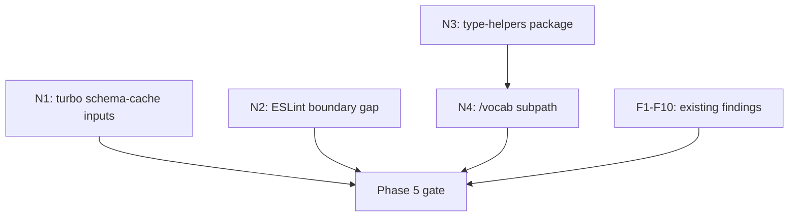

# Architecture Review Remediation Plan

## Context

Following Phase 4.3/4.4 completion and the deep import analysis, all four architecture reviewers (Barney, Betty, Fred, Wilma) reviewed the work. Combined with the deep import investigation, this produced **6 new findings** not already tracked in the [canonical plan](packages/sdks/oak-curriculum-sdk-generation/../../.agent/plans/semantic-search/active/sdk-workspace-separation.md). All are blocking per user directive.

## Finding Summary

### Already Tracked (in canonical plan Phases 5-7)

These are already integrated as F1-F18. No plan changes needed:

- **F8/C3**: `generate:clean` atomicity (Phase 5)
- **F9/H1**: `SearchFacetsSchema` dual export (Phase 5)
- **F10/H4**: `types/index.ts` duplicate API paths (Phase 5)
- **H5**: ADR-086 pipeline location stale (Phase 6)
- **H6**: `vi.mock` hardcoded paths (Phase 5, F18)

### New Findings Requiring Plan Integration

#### N1: `schema-cache/` missing from Turbo `type-gen` inputs (C5)

**Problem**: [turbo.json](turbo.json) `type-gen` inputs are `**/type-gen/**/*.ts`, `**/vocab-gen/**/*.ts`, `**/scripts/**/*.ts`. The `schema-cache/api-schema-original.json` is not `.ts`, so if the cached OpenAPI spec changes, Turbo won't invalidate the `type-gen` cache -- producing stale generated code.

**Fix**: Add `**/schema-cache/`** to `type-gen` inputs in `turbo.json`.

**Phase**: 5 (config hardening)

**Files**: `turbo.json` (1 line addition)

---

#### N2: ESLint boundary rules don't cover `type-gen/` or `vocab-gen/` (H3)

**Problem**: `createSdkBoundaryRules('generation')` is applied only to `files: ['src/**/*.ts']` in [eslint.config.ts](packages/sdks/oak-curriculum-sdk-generation/eslint.config.ts). Generator code in `type-gen/` and `vocab-gen/` is exempt from boundary enforcement. A future `type-gen` file could import from `@oaknational/curriculum-sdk` without lint catching it.

**Fix**: Add the boundary rules to the existing `type-gen` and `vocab-gen` override blocks, or create a separate override that applies boundary rules to `['type-gen/**/*.ts', 'vocab-gen/**/*.ts']`.

**Phase**: 5 (boundary hardening)

**Files**: `packages/sdks/oak-curriculum-sdk-generation/eslint.config.ts`

---

#### N3: `typeSafeEntries` duplicated between workspaces with drift risk (H2)

**Problem**: Runtime SDK has the full type-helpers suite (9 functions: `typeSafeKeys`, `typeSafeValues`, `typeSafeEntries`, `typeSafeFromEntries`, `typeSafeGet`, `typeSafeSet`, `typeSafeHas`, `typeSafeHasOwn`, `typeSafeOwnKeys`). Generation SDK has only `typeSafeEntries` (copied to satisfy `analysis-report-generator.ts`). If either implementation changes, the other won't follow.

**Options** (requires user decision):

- **Option A: Extract to `@oaknational/type-helpers` core package**
  - New package in `packages/core/type-helpers/`
  - Both SDKs depend on it
  - Single source of truth
  - Follows existing core package pattern (`@oaknational/result`, `@oaknational/mcp-env`)
  - ~30 min: scaffold package, move helpers, update both SDKs' imports
- **Option B: Keep duplication, add sync test**
  - Add a unit test in generation SDK that imports the runtime helpers and asserts identical behaviour
  - Problem: this test itself would violate the one-way boundary (generation importing runtime)
  - Not viable without a shared package
- **Option C: Accept duplication, document**
  - Add a comment in both files cross-referencing the other
  - Lowest effort but highest drift risk
  - The generation copy currently only has 1 of 9 functions; if more are needed later, drift risk compounds

**Recommendation**: Option A. The pattern already exists (`packages/core/`), the boundary violation is real, and the helpers are genuinely shared infrastructure.

**Phase**: 5 (dependency hardening)

**Files**:

- New: `packages/core/type-helpers/package.json`, `src/index.ts`, `tsconfig.json`, `tsconfig.build.json`, `tsup.config.ts`
- Modified: `pnpm-workspace.yaml`, both SDK `package.json` files, both `type-helpers.ts` files (replaced with re-exports or deleted)

---

#### N4: `/bulk` subpath is too broad -- mixes static data and pipeline APIs (C4)

**Problem**: `@oaknational/curriculum-sdk-generation/bulk` exports 150+ symbols across three categories:

- **Static graph data** (6 graphs + ontology): only consumed by runtime SDK for LLM tool composition
- **Pipeline APIs** (readers, extractors, generators, processing): only consumed by search CLI for ingestion
- **Shared types/schemas** (Lesson, Unit, BulkDownloadFile): consumed by both

This means the runtime SDK imports pipeline functions it never calls (tree-shaking mitigates at runtime, but the API surface is misleading).

**Fix**: Create a `/vocab` subpath for static graph data and ontology. `generated/vocab/index.ts` already exists as the barrel. Add `conceptGraph` and its types.

```
/vocab  -> static graph data + ontology (runtime SDK consumers)
/bulk   -> pipeline APIs + shared types + schemas (search CLI consumers)
```

Runtime SDK rewire: 6 files change from `@oaknational/curriculum-sdk-generation/bulk` to `@oaknational/curriculum-sdk-generation/vocab` for graph data imports.

**Phase**: 5 (subpath refinement, before Phase 6 subpath granularity evaluation)

**Files**:

- New: `packages/sdks/oak-curriculum-sdk-generation/src/vocab.ts` (barrel)
- Modified: `packages/sdks/oak-curriculum-sdk-generation/package.json` (add `/vocab` export)
- Modified: `packages/sdks/oak-curriculum-sdk-generation/src/bulk.ts` (remove graph data re-exports)
- Modified: 6 runtime SDK files that import graph data

---

#### N5: MCP tool generation is structurally over-nested (C1)

**Problem**: Generated MCP tool files sit 8 levels deep: `src/types/generated/api-schema/mcp-tools/generated/data/tools/`. The `buildImports()` function in `generate-tool-file.ts` hardcodes `../../../../` relative paths. 26 tool files depend on this structure.

The nesting exists because:

- `src/types/generated/` is the standard generated output root
- `api-schema/` separates API pipeline output from search/zod
- `mcp-tools/` groups all MCP tool concerns
- `generated/` distinguishes generated from authored (contract)
- `data/tools/` mirrors the structural separation of tool definitions

**Fix approach**: Flatten the generated output to reduce depth by 2 levels. The `generated/data/` intermediate directories add no semantic value -- tools are already namespaced by `mcp-tools/`.

Target: `src/types/generated/api-schema/mcp-tools/tools/` (6 levels, removing `generated/data/`)

This requires changes to:

1. `typegen-core-file-operations.ts` (directory creation)
2. `generate-tool-file.ts` (import paths: `../../../../` becomes `../../`)
3. `generate-definitions-file.ts` (import paths)
4. All barrel/index files in the mcp-tools tree
5. The path resolution unit test

All 26 tool files are generated, so they'll be regenerated automatically by `pnpm type-gen`.

**Phase**: 6 (structural refinement, alongside F11 provenance banner updates)

**Files**:

- Modified: `packages/sdks/oak-curriculum-sdk-generation/type-gen/typegen-core-file-operations.ts`
- Modified: `packages/sdks/oak-curriculum-sdk-generation/type-gen/typegen/mcp-tools/parts/generate-tool-file.ts`
- Modified: `packages/sdks/oak-curriculum-sdk-generation/type-gen/typegen/mcp-tools/parts/generate-tool-file.header.unit.test.ts`
- Regenerated: all 26 tool files + definitions + stubs

---

#### N6: Generator bootstrap cycle -- type-gen code imports its own output (C2)

**Problem**: 1 generator file and 3 test files import from `src/types/generated/`, creating a compile-time dependency on generated output:

- `type-gen/generate-ai-doc.ts` imports `PATH_OPERATIONS` and tool name utilities from generated code
- `type-gen/mcp-security-policy.unit.test.ts` imports `SCOPES_SUPPORTED`
- `type-gen/typegen/error-types/classify-http-error.unit.test.ts` imports generated error functions
- `type-gen/typegen/search/generate-subject-hierarchy.unit.test.ts` imports generated hierarchy

After `pnpm clean`, `type-check` fails because these generated files don't exist.

**Current mitigation**: Turbo task graph ensures `type-gen` runs before `type-check`, `build`, `lint`, and `test`. So in practice the generated files always exist when type-check runs. The cycle is masked by the task graph.

**Fix approach**: The 3 test files are VERIFICATION tests (they import generated output to assert it's correct). This is a valid pattern -- it's not a true cycle, it's a test dependency. The fix is to ensure these tests are excluded from the base `tsconfig.lint.json` and only included in test-specific configs that run after `type-gen`.

For `generate-ai-doc.ts`, this is a true build-time cycle. The fix is to make it read the generated files at runtime (via `fs.readFileSync` + JSON parse) rather than importing them statically.

**Phase**: 6 (structural refinement)

**Files**:

- Modified: `packages/sdks/oak-curriculum-sdk-generation/type-gen/generate-ai-doc.ts`
- Modified: `packages/sdks/oak-curriculum-sdk-generation/tsconfig.lint.json` (possibly)

---

## Phase Integration Summary

The 6 new findings integrate into existing phases as follows:

### Phase 5 (N1, N2, N3, N4 + existing F1-F10, F18)

- **N1**: Add `schema-cache` to turbo inputs (config, 1 line)
- **N2**: Extend boundary rules to type-gen/vocab-gen (config, ~10 lines)
- **N3**: Extract `@oaknational/type-helpers` core package (new package, ~30 min)
- **N4**: Create `/vocab` subpath, split from `/bulk` (new barrel + rewire 6 files)

### Phase 6 (N5, N6 + existing F11-F15)

- **N5**: Flatten MCP tool directory structure (generator change + regenerate)
- **N6**: Break generator bootstrap cycle in `generate-ai-doc.ts`

### Phase 7 (unchanged)

No new findings for Phase 7.

## Dependency Order Within Phase 5



N3 should be done before N4 because the `/vocab` barrel might need type helpers. N1 and N2 are independent and can be done in parallel with everything else.
