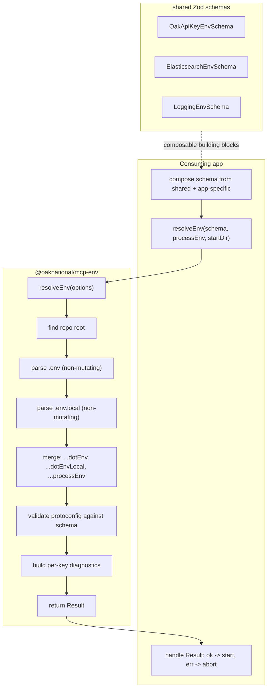

# Environment Architecture Overhaul

## Problem Statement

The environment loading architecture across both MCP servers is broken in seven ways. But the root cause is deeper: `@oaknational/mcp-env` is just a file loader with some bolted-on diagnostics. It should be a proper environment resolution pipeline that defines the contract for how apps communicate their requirements.

### What is wrong

**1. Entry points bypass `runtime-config.ts`.**
Both server entry points (`index.ts` for HTTP, `bin/oak-curriculum-mcp.ts` for STDIO) import `loadRootEnv` directly from `@oaknational/mcp-env`, manually check for missing keys, log diagnostics, and call `process.exit(1)` — all before calling `loadRuntimeConfig()`. The entry point should make ONE call to `loadRuntimeConfig` and get back a valid config or an error.

**2. Required keys defined in two places.**
The HTTP entry point has `alwaysRequired` and `clerkKeys` arrays. The Zod schema in `env.ts` has its own required fields. These WILL drift. There should be ONE source of truth for what is required: the schema.

**3. Clerk keys unconditionally required in Zod schema.**
`env.ts` always requires `CLERK_PUBLISHABLE_KEY` and `CLERK_SECRET_KEY`. When `DANGEROUSLY_DISABLE_AUTH=true`, they are not needed. Every test that sets `DANGEROUSLY_DISABLE_AUTH=true` provides dummy Clerk keys to satisfy a schema that doesn't reflect reality.

**4. `loadRuntimeConfig` doesn't load `.env`.**
It assumes `.env` was already loaded by its caller. The config loader should be self-contained.

**5. `process.env` accessed in multiple places.**
The HTTP entry point reads `process.env.DANGEROUSLY_DISABLE_AUTH` (currently behind a temporary `eslint-disable-next-line` — must be removed by this plan), passes `process.env` to `loadRootEnv`, and then `loadRuntimeConfig()` reads `process.env` again via its default parameter.

**6. `loadRootEnv` has wrong responsibilities.**
`keyStatus` and `missingKeys` were bolted onto the file loader during the fail-fast work. The instinct was right (the env lib should own diagnostics) but the placement was wrong (diagnostics belong in a validation pipeline, not a file loader).

**7. Source hierarchy is broken.**
`loadRootEnv` loads the FIRST `.env` file it finds and stops. It does not merge `.env` and `.env.local`. It mutates `process.env` via `dotenvConfig()`. Explicit env vars set via `SOME_KEY=true some-command` should override `.env` defaults, but the current implementation's behavior depends on load order and mutation timing.

---

## Architecture

### Design principle

The env lib defines the contract. The consuming app communicates its requirements in a standard format defined by the lib. The app should not need magical knowledge of how the env lib works — it conforms to the contract, passes its schema, and gets back a result.

### The pipeline



### Source hierarchy (precedence low to high)

```text
.env         (shared defaults, committed)              — LOWEST
.env.local   (local developer overrides, gitignored)   — MEDIUM
process.env  (explicit vars, e.g. KEY=val command)     — HIGHEST
```

The env lib uses `dotenv.parse()` (non-mutating) to read `.env` files as key-value objects. It then merges them with correct precedence: `{ ...dotEnvValues, ...dotEnvLocalValues, ...processEnv }`. The merged result is the "protoconfig" — all env values resolved from all sources, before validation.

The protoconfig is then validated against the app-provided Zod schema. The schema is the single source of truth for what keys exist, what types they have, which are required, and which are conditionally required.

### The contract (defined by the env lib)

The env lib exports the types that apps must conform to:

```typescript
interface ResolveEnvOptions<TSchema extends z.ZodType> {
  readonly schema: TSchema;
  readonly processEnv: NodeJS.ProcessEnv;
  readonly startDir: string;
}

interface EnvKeyDiagnostic {
  readonly key: string;
  readonly present: boolean;
}

interface EnvResolutionError {
  readonly message: string;
  readonly diagnostics: readonly EnvKeyDiagnostic[];
  readonly zodIssues: readonly z.ZodIssue[];
}

function resolveEnv<TSchema extends z.ZodType>(
  options: ResolveEnvOptions<TSchema>,
): Result<z.infer<TSchema>, EnvResolutionError>;
```

The app composes its schema, calls `resolveEnv`, and handles the `Result`. The app does not know about `.env` files, merge order, or `dotenv`. It just says "here is what I need" and gets back either a validated config or a structured error.

### What each layer owns

| Layer | Owns | Does NOT own |
|-------|------|-------------|
| **Env lib** | Contract types, source hierarchy, merging, validation pipeline, shared Zod schemas, per-key diagnostics, `Result<T, E>` | App-specific schemas, conditional requirement logic, what to do with errors, logging, `process.exit` |
| **App `env.ts`** | App-specific schema composition, conditional requirements (`superRefine`), app-specific env types | Source loading, merging, validation execution |
| **App `runtime-config.ts`** | Calling the pipeline, building `RuntimeConfig` from validated env, propagating `Result` | Schema definition, source loading |
| **App `index.ts`** | Passing `process.env`, handling the `Result` (log + exit or start) | Everything else |

---

## Shared env lib changes (`@oaknational/mcp-env`)

### New: `resolveEnv` pipeline

The core addition. Takes `{ schema, processEnv, startDir }`, returns `Result<T, EnvResolutionError>`.

Internally:
1. Finds repo root from `startDir`
2. Parses `.env` and `.env.local` from repo root using `dotenv.parse()` (no mutation)
3. Merges: `{ ...dotEnvValues, ...dotEnvLocalValues, ...processEnv }`
4. Validates merged protoconfig via `schema.safeParse(merged)`
5. Builds per-key diagnostics (presence/absence of each schema key in the merged env)
6. Returns `ok(validatedData)` or `err({ message, diagnostics, zodIssues })`

### New dependency: `@oaknational/result`

Add `@oaknational/result` (workspace package) to use the canonical `Result<T, E>` type.

### Existing: shared Zod schemas

`OakApiKeyEnvSchema`, `ElasticsearchEnvSchema`, `LoggingEnvSchema` remain unchanged. They are composable building blocks that apps use to construct their schema.

### Existing: `loadRootEnv` / `findRepoRoot`

`loadRootEnv` in its current form is superseded by `resolveEnv`. Options:
- Keep it as a lower-level export (some consumers may want just the file loading)
- Make it internal to `resolveEnv`
- Remove the bolted-on `keyStatus`/`missingKeys` additions regardless

The `findRepoRoot` function remains useful and stays exported.

---

## HTTP server changes

### `env.ts` — conditional Clerk keys

The Zod schema makes Clerk keys optional in the base shape. A `superRefine` enforces that Clerk keys are present when `DANGEROUSLY_DISABLE_AUTH` is not `'true'`. This is the SINGLE source of truth for which keys are required under which conditions.

Two env types are exported:
- `AuthEnabledEnv` — Clerk keys are `string` (required)
- `AuthDisabledEnv` — Clerk keys are `string | undefined` (optional)

The app's `env.ts` no longer calls `readEnv` with `process.env`. Instead, it exports the schema and the types. The validation is done by `resolveEnv` in `runtime-config.ts`.

### `runtime-config.ts` — calls the pipeline

`loadRuntimeConfig({ processEnv, startDir })`:
1. Calls `resolveEnv({ schema: HttpEnvSchema, processEnv, startDir })`
2. If `err`, propagates as `Result err` with context
3. If `ok`, builds `RuntimeConfig` from validated env data
4. Returns `Result<RuntimeConfig, ConfigError>`

`RuntimeConfig` becomes a discriminated union on `dangerouslyDisableAuth`:
- `AuthEnabledRuntimeConfig`: `dangerouslyDisableAuth: false`, `env: AuthEnabledEnv`
- `AuthDisabledRuntimeConfig`: `dangerouslyDisableAuth: true`, `env: AuthDisabledEnv`

TypeScript's narrowing handles Clerk key access automatically. After `if (runtimeConfig.dangerouslyDisableAuth) return;`, the compiler knows Clerk keys are `string`. No assertions, no type guards.

### `index.ts` — minimal wiring

```text
const result = loadRuntimeConfig({ processEnv: process.env, startDir: process.cwd() });
if (!result.ok) {
  console.error(result.error.message);
  process.exit(1);
}
const app = createApp({ runtimeConfig: result.value });
app.listen(...);
```

One `process.env` access. One function call. Handle the result. That's it.

---

## The discriminated union

Every place that accesses Clerk keys in the HTTP server already checks `dangerouslyDisableAuth` and returns early when `true`:

- `setupGlobalAuthContext` (auth-routes.ts:150): `if (runtimeConfig.dangerouslyDisableAuth) return;`
- `setupAuthRoutes` (auth-routes.ts:214): `if (runtimeConfig.dangerouslyDisableAuth) return;`
- `setupOAuthAndCaching` (oauth-and-caching-setup.ts:51): `if (!runtimeConfig.dangerouslyDisableAuth)`

After the early return, TypeScript narrows `RuntimeConfig` to `AuthEnabledRuntimeConfig`, where Clerk keys are `string`. The type system enforces that you check the auth flag before accessing auth credentials.

---

## STDIO server changes

Same pattern. `bin/oak-curriculum-mcp.ts` delegates to `loadRuntimeConfig` which calls `resolveEnv` internally. The STDIO server has no Clerk key conditionality (no auth), so its schema is simpler. Its `loadRuntimeConfig` returns `Result<RuntimeConfig, ConfigError>`.

---

## Test implications

**Tests that set `DANGEROUSLY_DISABLE_AUTH=true`** no longer need dummy Clerk keys. The `baseEnv` patterns in test files can drop `CLERK_PUBLISHABLE_KEY` and `CLERK_SECRET_KEY` when auth is disabled.

**`resolveEnv` tests** (env lib integration tests) need a temp directory with `.env` and `.env.local` files to verify the source hierarchy and merge precedence.

**`loadRuntimeConfig` tests** pass a complete env object as `processEnv`. Since all required keys are present in `processEnv`, and `processEnv` has highest precedence, the pipeline works correctly without needing real `.env` files. The env lib tests verify the file loading; the app tests verify the schema and config building.

---

## TDD sequence

### Prerequisite

0. **Move `result` to `core/`**: Move `packages/libs/result` to `packages/core/result`. Update `pnpm-workspace.yaml`. Run `pnpm install`. Package name stays `@oaknational/result` — zero import changes across the codebase. Verify `pnpm build && pnpm type-check && pnpm test` pass.

### RED phase

1. **Env pipeline** (`packages/libs/env/tests/resolve-env.integration.test.ts`): Tests for `resolveEnv` proving source hierarchy, schema validation, Result types, and per-key diagnostics. Run — MUST fail (function does not exist).

2. **Conditional Clerk keys** (`env.unit.test.ts`): Tests proving missing Clerk keys are accepted when `DANGEROUSLY_DISABLE_AUTH=true` and rejected when auth is enabled. Run — MUST fail.

3. **`loadRuntimeConfig` uses pipeline** (`runtime-config.unit.test.ts`): Tests proving `loadRuntimeConfig({ processEnv, startDir })` returns `Result<RuntimeConfig, ConfigError>`. Run — MUST fail.

4. **Discriminated union** (`runtime-config.unit.test.ts`): Tests proving type narrowing on `dangerouslyDisableAuth`. Run — MUST fail.

### GREEN phase

5. **`resolveEnv`**: Implement in `@oaknational/mcp-env`. Add `@oaknational/result` dep. Non-mutating `dotenv.parse()`. Merge hierarchy. Schema validation. Diagnostics. `Result` return.

6. **`env.ts`**: Make Clerk keys conditional via `superRefine`. Export `AuthEnabledEnv`, `AuthDisabledEnv`.

7. **`runtime-config.ts`**: Call `resolveEnv`. Build `RuntimeConfig`. Return `Result`. Discriminated union.

8. **`index.ts`**: Gut to ~15 lines. Handle `Result`.

9. **Clean up old `loadRootEnv`**: Remove bolted-on diagnostics. Simplify or internalize.

10. **STDIO alignment**: Same pattern for STDIO server.

11. **Test cleanup**: Remove dummy Clerk keys from auth-disabled tests.

### REFACTOR phase

12. **Docs and quality gates**: TSDoc, READMEs, `.env.example`. Full quality gate chain.

---

## Files affected

### Result package (move)
- `packages/libs/result/` -> `packages/core/result/` (directory move, no code changes)
- `pnpm-workspace.yaml` — update path

### Shared env lib (`packages/libs/env/`)
- `package.json` — add `@oaknational/result` dependency
- `src/resolve-env.ts` — NEW: the pipeline function, contract types, diagnostic builder
- `src/repo-root.ts` — remove `keyStatus`/`missingKeys`/`EnvKeyStatus`/`LoadRootEnvResult`/`buildKeyStatus`; `loadRootEnv` simplified or made internal
- `src/index.ts` — export `resolveEnv`, contract types; remove old diagnostic exports
- `tests/resolve-env.integration.test.ts` — NEW: pipeline tests with temp .env files
- `tests/load-root-env.integration.test.ts` — remove `keyStatus`/`missingKeys` tests

### HTTP server (`apps/oak-curriculum-mcp-streamable-http/`)
- `src/env.ts` — conditional Clerk keys via `superRefine`, export schema (not `readEnv`), `AuthEnabledEnv`, `AuthDisabledEnv`
- `src/env.unit.test.ts` — conditional Clerk key tests
- `src/runtime-config.ts` — call `resolveEnv`, return `Result<RuntimeConfig, ConfigError>`, discriminated union
- `src/runtime-config.unit.test.ts` — pipeline integration, discriminated union tests
- `src/index.ts` — gut to ~15 lines, handle `Result`
- `src/auth-routes.ts` — verify existing guards work with union type (likely no changes needed)
- `src/application.ts` — verify `RuntimeConfig` union is handled
- `src/test-helpers/*.ts` — update mock configs
- `src/*.test.ts` — remove dummy Clerk keys from auth-disabled test envs
- `e2e-tests/*.ts` — verify env setups

### STDIO server (`apps/oak-curriculum-mcp-stdio/`)
- `bin/oak-curriculum-mcp.ts` — delegate to `loadRuntimeConfig`, handle `Result`
- `src/runtime-config.ts` — call `resolveEnv`, return `Result<RuntimeConfig, ConfigError>`

---

## Risks

| Risk | Mitigation |
|------|-----------|
| Discriminated union cascading type changes | Every Clerk key access is already guarded by `dangerouslyDisableAuth` check. TypeScript narrowing handles it. |
| `resolveEnv` reads .env files in tests | Tests pass a complete `processEnv` object. Since `processEnv` has highest precedence, .env files (if found) don't affect the result. Env lib tests use temp dirs for file loading verification. |
| `superRefine` losing type precision | Use overloaded `readEnv` or conditional return types to preserve the auth-enabled/disabled distinction. |
| `dotenv.parse()` behavior differences from `dotenvConfig()` | `parse()` is well-documented and stable. Integration tests verify the merge behavior explicitly. |
| Source hierarchy change (load all files, not first-found) | This is a correctness fix. `.env.local` overriding `.env` is the standard convention. Tests verify the precedence. |
| Scope creep into STDIO server | STDIO alignment is minimal — same pattern, simpler schema (no Clerk keys). |

---

## Related documents

- [Phase 3a: MCP Search Integration](phase-3a-mcp-search-integration.md) — parent plan
- [Fail-fast ES credentials (completed)](../archive/completed/fail-fast-elasticsearch-credentials.md) — predecessor, exposed these issues
- [Roadmap](../roadmap.md) — milestone tracking
- [Session prompt](../../prompts/semantic-search/semantic-search.prompt.md) — entry point
