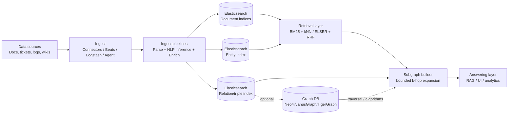
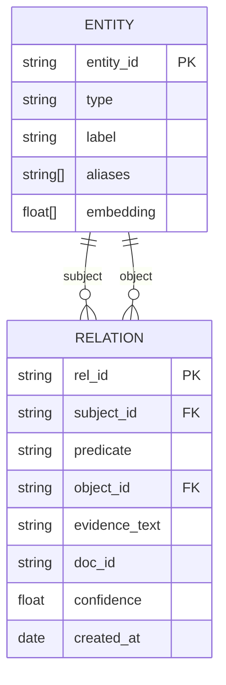

# Graph and Knowledge-Graph Capabilities in Elasticsearch and the Elastic Stack

## Executive summary

Elasticsearch is not a “graph database” in the property-graph sense, but it can deliver graph-like outcomes in two distinct ways: (a) **implicit graphs** inferred from document co-occurrence (Elastic’s **Graph** feature) and (b) **explicit graphs** you model yourself as entity/edge documents and then query iteratively (application-driven traversal). Elastic’s official **Graph analytics** consists of a **Graph explore API** (`/{index}/_graph/explore`) plus a **Kibana Graph** visual app; it discovers “vertices” (terms) and “connections” (co-occurrence relationships) using sampling, relevance and significance heuristics rather than maintaining explicit edges. citeturn10search5turn11view1turn11view0

For knowledge-graph (KG) and semantic search work, Elastic’s strongest native building blocks are **ingest-time enrichment and NLP**, plus **vector + semantic retrieval**. You can deploy **NLP inference** (including named-entity recognition) and run it in ingest pipelines via the **inference processor**, and then store extracted entities/relations in fields or dedicated indices. citeturn1search7turn1search3turn1search23 You can implement semantic search via **dense vectors** (`dense_vector` + kNN) or sparse semantic retrieval (ELSER + `sparse_vector` / `text_expansion`), and Elastic’s newer **semantic_text** field type aims to simplify semantic ingestion, chunking, and query defaults—though it is explicitly version- and licence-sensitive. citeturn0search2turn0search26turn3search24turn3search4turn3search0turn3search1

However, Elasticsearch does **not** provide native graph query primitives like **shortest path**, general **k-hop traversal**, pattern matching, or declarative graph query languages (Cypher/Gremlin/GSQL). Elastic’s Graph API supports multi-hop “spidering” in its own term-graph model, but it remains fundamentally an aggregation-driven association explorer, not a general traversal engine. citeturn11view0turn11view1turn1search24 For true graph traversal and algorithms (shortest path, PageRank, community detection, link prediction), dedicated graph databases and graph analytics ecosystems (e.g., **Neo4j + Cypher + Graph Data Science**, **JanusGraph + Gremlin**, **TigerGraph + GSQL**) are designed around adjacency and traversal performance and expressiveness. citeturn15search0turn15search9turn19search0turn14search5turn14search6turn19search10

Pragmatically, Elasticsearch is a compelling “graph-enabling” platform when you need **search relevance, text + vector retrieval, scale-out indexing, and analytics**—and you can tolerate *application-level traversal* or *association graphs* rather than full graph semantics. When you need **deep, low-latency traversals**, **path queries**, **graph constraints**, or **graph algorithms as first-class operations**, choose a dedicated graph DB and integrate it with Elasticsearch for text/semantic retrieval and ranking.

## Elastic’s official graph-related features and services

Elastic’s graph story spans multiple product surfaces. The key is understanding *which of these features are truly “graph”* versus *graph-shaped visualisations* or *entity-centric security tooling*.

**Graph analytics: Graph explore API and Kibana Graph**  
Elastic Graph provides a “graph exploration API” and an interactive Kibana app that works directly on existing indices; Elastic emphasises you “don’t need to store any additional data” to use it because it derives relationships from indexed terms. citeturn10search5turn1search0 The **Graph explore API** (`POST /{index}/_graph/explore`) starts from a seed query and specified vertex fields, then can “spider out” and exclude previously returned vertices. citeturn11view0turn11view1 In the Kibana Graph guide, Elastic is explicit about its model: it is “a network of related terms in the index”, where the terms are “vertices”. citeturn1search24

Graph is operationally configurable: the Graph explore API is enabled by default in Elasticsearch, and you can disable both the API and the Kibana Graph UI via `xpack.graph.enabled: false` in `elasticsearch.yml`. citeturn11view0turn10search2 Kibana Graph workspaces are saved as Kibana saved objects in the `.kibana` index, and Kibana can also restrict editing certain Graph settings (e.g., drill-down URLs). citeturn1search16turn10search18

**Licensing and availability nuances for Graph**  
Graph is a subscription-gated feature in Elastic’s packaging: community and Elastic sources historically describe Graph as a **Platinum** feature (or available via trial). citeturn10search37turn0search9 Elastic’s self-managed subscription matrix explicitly lists **“Graph exploration”** as not universally available across tiers (it appears as a paid feature in the matrix). citeturn6view1 Additionally, Elastic’s current docs mark Graph configuration pages as **“Serverless Unavailable”**, implying that Kibana Graph (and related Graph UX) is not available on Elastic Cloud Serverless projects even if it exists on “Stack” deployments. citeturn1search16turn2search27

**Elastic Enterprise Search, App Search, Workplace Search: current positioning**  
Enterprise Search historically provided a separate server with UIs/APIs and included two “standalone products”: **App Search** and **Workplace Search**. Elastic’s Enterprise Search “What is” page still frames it as an additional service adding APIs/UIs, enabling connectors and the web crawler, and including App Search and Workplace Search. citeturn0search31 The Enterprise Search docs also note App Search and Workplace Search UIs live within Kibana when running the Enterprise Search server. citeturn0search7

That said, Elastic has been consolidating enterprise-search capabilities *into Elasticsearch itself*. Elastic’s own blog states that core capabilities previously bundled as App Search and Workplace Search are available in **Elasticsearch Serverless**, and it explicitly discusses the limitations of building these capabilities “outside of Elasticsearch”. citeturn0search3turn3search31 Workplace Search documentation for 8.19 strongly recommends new users use “native Elasticsearch tools” instead of the standalone Workplace Search product, and includes a comparison framing. citeturn0search23 The 2026 subscription PDF also warns that its feature list excludes “End-of-Life products such as Enterprise Search” and included features such as App Search / Workplace Search / web crawler / native connectors, reinforcing that these product lines are in end-of-life transition. citeturn9view2

**Elastic Maps as “graph-adjacent” capability**  
Elastic Maps is primarily geospatial, but it is relevant to “graph-like” exploration because it supports joining and layering data sources, letting you visually relate entities to locations and to one another. Kibana Maps supports querying/filtering across layers with Kibana query language and spatial filters. citeturn2search2turn2search25 Elastic documents “terms join” functionality, where a terms aggregation on one layer is joined to another source (a join-like mechanism for geo visualisation). citeturn2search21turn2search10

**Machine Learning and AI integrations that underpin KG workflows**  
Elastic’s ML stack is directly relevant to knowledge graphs because it supplies entity extraction, embeddings, semantic retrieval, and reranking primitives.

- **NLP inference in ingest pipelines**: Elastic documents using an **inference processor** in an ingest pipeline and provides examples of referencing models (including named-entity recognition model IDs). citeturn1search3turn1search23  
- **Named entity recognition example**: Elastic provides an end-to-end NER example to deploy, test, and add a NER model to an ingest pipeline. citeturn1search7turn1search11  
- **ELSER**: Elastic’s Learned Sparse EncodeR is documented as a retrieval model for semantic search (contextual meaning rather than keyword matches). citeturn3search24  
- **semantic_text**: Elastic’s `semantic_text` field type is positioned as automating semantic search setup (mappings, ingestion pipelines, chunking) and includes licence-related failure modes if the appropriate licence is not present. citeturn3search1

**Elastic Security “graph uses”**  
Elastic Security uses graph-shaped artefacts (process graphs / timelines) for investigation, though these are not the same as a general-purpose graph DB.

- The **Visual event analyzer** is described as a “process-based visual analyzer” showing a graphical timeline of processes leading up to an alert and immediately after. citeturn2search12  
- **Session View** displays richer process context data (collected by Elastic Defend when “Collect session data” is enabled) and provides session exploration within Kibana Security. citeturn2search0turn2search23  
- **Entity Analytics / Advanced Entity Analytics** is entity-centric risk and anomaly tooling (hosts/users/services), combining SIEM detections and ML for risk analytics—often used as a conceptual “entity graph” in SOC workflows even when not exposed as a graph query engine. citeturn2search13turn2search1

## Knowledge-graph primitives in Elastic: entities, relations, semantics, and linking

A knowledge graph typically needs (i) entity identification, (ii) relation extraction or modelling, (iii) schema/ontology governance, and (iv) retrieval over entities and relationships. Elastic does not ship a full KG platform, but it provides strong primitives for (i) and (iv), and workable options for (ii), with limited support for (iii).

**Entity extraction and normalisation**  
Elastic supports running NLP inference at ingest time via the inference processor. citeturn1search23turn1search3 The official NER example shows you can deploy a Hugging Face NER model to Elasticsearch, test it, and use it in ingest pipelines to extract entities like people, places, and organisations from text. citeturn1search7turn1search11

In practice, an Elastic-based KG pipeline usually adds two extra steps beyond extraction:

- **Canonicalisation / entity resolution** (e.g., “UK”, “United Kingdom”, “Britain” → the same canonical ID). Elastic does not provide a full ER framework, but it offers supporting tools: enrichment joins (see below) and strong lexical/semantic retrieval to candidate-match entities.  
- **Governed reference data** (e.g., approved entity dictionary, watchlists, taxonomy tables). Elastic’s enrich processor is intended exactly for enriching incoming docs from a reference index and is best suited for reference data that does not change frequently. citeturn12search0turn12search1

**Relationship modelling: implicit vs explicit**  
Elastic supports *two* very different relationship paradigms:

Implicit (derived) relationships: **Graph API** can infer relationships between terms via their co-occurrence in documents, optionally filtered by statistical significance (`use_significance` defaults true and references the `significant_terms` aggregation). citeturn11view0turn4search1 This is powerful for “people who bought X also bought Y” or “accounts that share anomalous attributes” patterns, but the “edges” are **not persisted as first-class relationships** with transaction semantics.

Explicit (modelled) relationships: you can model edges yourself, typically as documents such as `(subject_id, predicate, object_id, provenance, timestamps, weights)`. Elastic’s own “Graph RAG” article explicitly discusses repurposing Elasticsearch to store graph structures (triplets) and then dynamically generate/prune subgraphs for retrieval. citeturn16view0 This approach makes Elasticsearch a **graph-shaped document store** queried with search APIs, not a graph DB.

**Schema/ontology support**  
Elasticsearch provides mapping schemas (field types, analyzers, dynamic mappings), but it does not implement ontology languages (RDFS/OWL), reasoning, constraint validation across arbitrary relationships, SHACL, etc. As a result:

- You can represent a schema/ontology *implicitly* as index templates + mappings + governance conventions.  
- You cannot ask Elasticsearch to infer new facts via ontology reasoning; you must implement inference upstream (ETL/ML) or in application logic.

**Semantic search, embeddings, and hybrid retrieval**  
Elastic provides both dense and sparse semantic retrieval approaches:

- `dense_vector` stores dense vectors and is “primarily used for k-nearest neighbor (kNN) search”, but does not support aggregations or sorting. citeturn0search2turn0search10  
- Approximate kNN search stores per-segment vectors as an **HNSW graph**, making indexing potentially expensive; Elastic also cautions that vector data should fit in the node’s page cache for efficiency. citeturn0search26turn18search33  
- `sparse_vector` is the recommended field type for ELSER mappings, and the legacy `text_expansion` query converts query text into token-weight pairs to query a sparse vector (or rank-features) representation. citeturn3search4turn3search0  
- The `semantic_text` field type aims to simplify semantic search substantially by automating mapping choices, ingestion/chunking and querying defaults, and explicitly notes that missing the appropriate licence can cause indexing/reindexing failures. citeturn3search1turn3search21  

Elastic also supports **hybrid retrieval** (lexical + semantic) using Reciprocal Rank Fusion (RRF) via retrievers: the RRF retriever combines multiple child retrievers into one ranked list. citeturn18search0turn18search1 Elastic’s hybrid search tutorial shows combining `query` and `knn` inputs in a single search request and using a `rank` section to merge results. citeturn3search2turn18search2

Licensing matters here: community reports show a licence error when using RRF on a non-compliant licence. citeturn18search32 (If you plan to rely on RRF/hybrid retrievers for KG retrieval, verify licensing early.)

**Linking to external knowledge bases**  
Elastic supports “linking” more as an integration pattern than as a native KG federation layer:

- Kibana Graph supports configuring drilldown URLs (e.g., to perform a web search for a selected vertex term), which is a practical way to bridge from discovered entities to external KB pages. citeturn10search18  
- Elastic connectors replicate data from external sources into Elasticsearch as search indices; a connector “syncs data from an original data source to Elasticsearch” and creates “read-only replicas” as documents. citeturn3search3turn3search11  
- Enrichment joins can map external IDs or attributes at ingest time by matching incoming docs to reference indices. citeturn12search1turn12search30  

## Data modelling, ingest pipelines, and performance for graph and KG workloads

This section is the “engineering core”: how to model and run a KG-like system on Elastic without accidentally building something that is slow, fragile, or expensive.

### Modelling options for relationships in Elasticsearch

Elasticsearch is optimised for **search over documents**. Relationship-heavy models work best when you embrace **denormalisation** and avoid joins unless you have a narrow, well-understood reason.

A useful rule: treat Elasticsearch as an **indexable projection** of your entity and relationship world rather than the system-of-record for complex relationship integrity.

**Embedded relationships (denormalised)**  
Store related entities directly inside a document (arrays of IDs, nested objects). This supports fast retrieval for “one-hop” relationships if you don’t need flexible traversal.

**Parent–child relationships (join field)**  
Elasticsearch offers a `join` field type (parent-join) to create parent/child relations in the same index, but Elastic warns it *“shouldn’t be used like joins in a relational database”* and that each join query adds a “significant tax” to query performance and can trigger global ordinals. It recommends using it only in specific one-to-many cases where one entity significantly outnumbers the other. citeturn1search2turn1search38  
For KG-like graphs (many-to-many edges), parent–child is usually the wrong tool.

**Edge index (recommended for explicit KGs in ES)**  
Create an index of edges/triplets. This is the pattern Elastic’s Graph RAG article discusses: store triplets and query them efficiently to build subgraphs on the fly. citeturn16view0

### Example: explicit KG indices (entities + relations)

Below is a minimal, pragmatic mapping set for KGs in Elasticsearch. It supports:
- canonical entities (with aliases and embeddings)
- explicit relations (edges) with provenance
- fast adjacency lookup by `subject_id` and `object_id`
- semantic ranking over relation text (optional)

```json
PUT kg_entities
{
  "mappings": {
    "properties": {
      "entity_id": { "type": "keyword" },
      "type":      { "type": "keyword" }, 
      "label":     { "type": "text" },
      "aliases":   { "type": "keyword" },
      "source_ids": { "type": "keyword" },
      "created_at": { "type": "date" },
      "updated_at": { "type": "date" },

      "embedding": {
        "type": "dense_vector",
        "dims": 384
      }
    }
  }
}
```

`dense_vector` is primarily used for kNN search, but you cannot aggregate or sort on it—so preserve structured fields for analytics. citeturn0search2

```json
PUT kg_relations
{
  "mappings": {
    "properties": {
      "rel_id":      { "type": "keyword" },
      "subject_id":  { "type": "keyword" },
      "predicate":   { "type": "keyword" },
      "object_id":   { "type": "keyword" },

      "evidence_text": { "type": "text" },
      "evidence_url":  { "type": "keyword" },
      "doc_id":        { "type": "keyword" },
      "confidence":    { "type": "float" },
      "created_at":    { "type": "date" },

      "evidence_embedding": {
        "type": "dense_vector",
        "dims": 384
      }
    }
  }
}
```

If you prefer sparse semantic retrieval (ELSER), you would store ELSER features in `sparse_vector` fields and query with `text_expansion`/`sparse_vector` queries as appropriate. citeturn3search4turn3search0

### Ingest pipelines: extraction + enrichment + indexing

Elastic ingest pipelines run a sequence of processors; processor order matters because each processor depends on the previous one. citeturn12search12turn12search17 This is critical for KG pipelines because you often need:

1) parse/clean text  
2) run NER or embedding inference  
3) normalise fields  
4) enrich with canonical entity IDs  
5) route to appropriate indices / datastreams

#### Example: ingest pipeline (NER inference + enrich)

This pipeline sketch shows:
- running a deployed NER model via the inference processor
- enriching recognised entities by looking up a canonical “entity dictionary” index via enrich policy

```json
PUT _ingest/pipeline/kg_ingest_v1
{
  "processors": [
    {
      "inference": {
        "model_id": "my_ner_model",
        "target_field": "ml.ner",
        "field_map": { "content": "text" }
      }
    },
    {
      "enrich": {
        "policy_name": "entity_dictionary_policy",
        "field": "ml.ner.entities.name",
        "target_field": "kg.canonical",
        "max_matches": 1
      }
    }
  ]
}
```

Elastic documents both the inference processor for ingest-time NLP and the NER workflow (deploy/test/use in ingest). citeturn1search23turn1search7 Elastic also documents the enrich processor setup flow and warns that enrich may impact ingest speed, recommending testing/benchmarking before production and noting it works best with reference data that does not change frequently. citeturn12search0turn12search1

#### Enrich processor internals and trade-offs

Elastic explains that enrich requires an enrich policy, and executing that policy creates a streamlined **enrich index** (a system index `.enrich-*`) which is force-merged and read-only for fast retrieval; the enrich processor uses that index to match and enrich documents. citeturn12search1

From a KG perspective, this is a strong pattern for *stable dictionaries* (e.g., canonical entity IDs, organisation registry tables). It is a poor choice for real-time graph edges that change every second: Elastic explicitly does not recommend enrich for appending real-time data. citeturn12search0

### Performance and scalability considerations

**Graph explore API performance knobs**  
Graph uses sampling and significance filtering. Elastic’s troubleshooting guidance suggests increasing `sample_size`, turning off `use_significance` for forensic completeness, and reducing `min_doc_count` to include weaker relationships when needed. citeturn4search0turn11view0 The API definition clarifies that each hop considers a sample of best-matching docs per shard; very small samples may lack evidence, while very large samples can dilute quality and hurt execution time. citeturn11view1 It also supports `sample_diversity` to avoid a sample dominated by a single value (useful when one source or tenant overwhelms the result set). citeturn11view1

**Aggregation and ordinals costs**  
Most graph-like analytics in Elasticsearch (terms, significant terms, Graph explore) relies on term aggregations. Elasticsearch explains that the terms aggregation uses **global ordinals** rather than collecting raw string values, which is why field choice (keyword/doc_values) and cardinality matter. citeturn4search29turn4search2

**Vector search costs**  
Approximate kNN uses HNSW graphs per segment and can be expensive to build; Elastic notes indexing vectors can take substantial time and recommends ensuring vector data fits in the node’s page cache for performance. citeturn0search26turn18search33

**Deep traversal / expansion and pagination limits**  
If you implement explicit traversal by repeatedly querying `kg_relations`, you will encounter Elasticsearch’s result window safeguards. Elastic documents that by default you cannot page through more than 10,000 hits using `from`/`size` because of `index.max_result_window` (default 10,000), and recommends `search_after` for deeper pagination. citeturn17search1turn17search0 The Scroll API is “no longer recommended” for deep pagination; Elastic recommends `search_after` + a point-in-time (PIT) when index-state consistency matters. citeturn17search2turn17search3

These constraints become crucial in KG traversal patterns (multi-hop expansions) where naïve “return everything” queries will be expensive or impossible.

## Query capabilities for graph-like analytics and KG retrieval

### What the Graph explore API can do

The Graph explore API supports:

- a **seed query**: any valid Elasticsearch query used to choose the document set of interest citeturn11view0  
- **vertex definitions**: fields containing terms to treat as vertices, with include/exclude lists, per-field size limits, and significance thresholds like `min_doc_count` citeturn11view0turn11view1  
- **connections**: fields to extract terms associated with vertices; connections can be nested and each nesting layer is “a hop” (multi-hop exploration) citeturn11view0  
- **controls**: including `use_significance` (based on `significant_terms`) and `sample_size`, plus sampling diversity and timeouts citeturn11view0turn11view1  

This is best understood as *discovering associative structure* (term co-occurrence patterns) within a filtered slice of the corpus, rather than traversing an explicitly stored graph.

#### Example: Graph explore request (co-occurrence graph)

```json
POST my-index/_graph/explore
{
  "query": {
    "bool": {
      "filter": [
        { "term": { "event.type": "transaction" } },
        { "range": { "@timestamp": { "gte": "now-30d" } } }
      ]
    }
  },
  "vertices": [
    { "field": "user.id", "size": 10, "min_doc_count": 3 },
    { "field": "merchant.id", "size": 10, "min_doc_count": 3 }
  ],
  "connections": {
    "vertices": [
      { "field": "ip", "size": 10, "min_doc_count": 2 }
    ]
  },
  "controls": {
    "use_significance": true,
    "sample_size": 200
  }
}
```

The justification for `use_significance` and sample-based exploration is described in the API docs: significance filters to terms “significantly associated” with the query and points to the significant_terms algorithm. citeturn11view0turn4search1

### What Elasticsearch cannot do natively (and how people work around it)

Elasticsearch does not provide a built-in **shortest path** operator or a declarative graph traversal language. In dedicated graph systems, shortest paths and related traversal constructs are first-class (e.g., Neo4j documents shortest path patterns in Cypher, and its GDS library offers multiple shortest-path algorithms like Dijkstra, A*, Yen’s). citeturn15search0turn15search20

In Elasticsearch, the practical workaround is:

1) store edges as documents  
2) perform traversal in application logic via repeated search queries  
3) optionally use vector search to rank which edges or entities to expand

Elastic’s Graph RAG article explicitly describes implementing graph traversal patterns using Elasticsearch search primitives: it checks for direct relations, expands neighbours via filtered queries, and uses stacked boolean queries; it also enforces neighbour caps during expansion. citeturn16view0

#### Example: k-hop expansion on an explicit edge index (application-driven)

**Hop 1: get neighbours of seed entities**

```json
POST kg_relations/_search
{
  "size": 100,
  "query": {
    "bool": {
      "should": [
        { "term": { "subject_id": "entity:Nancy_Pelosi" } },
        { "term": { "object_id":  "entity:Nancy_Pelosi" } }
      ],
      "minimum_should_match": 1
    }
  },
  "_source": ["subject_id","predicate","object_id","confidence","doc_id"]
}
```

**Hop 2: expand from neighbour set**  
You would collect unique neighbour IDs from hop-1 results, then issue a second query with a `terms` filter on `subject_id`/`object_id`. For large expansions, use PIT + `search_after` rather than pushing `from/size` beyond 10k. citeturn17search1turn17search3

This style of traversal is straightforward to implement but comes with the usual graph-traversal problems (explosion of frontier, need for visited sets, hub nodes). Elastic’s Graph RAG post notes that graph topology often has hubs and many low-degree nodes, affecting expansion size and latency. citeturn16view0

### Relationship analytics via aggregations: adjacency_matrix and significant_terms

Even without traversal, Elasticsearch can produce relationship matrices and association metrics:

- **adjacency_matrix** aggregation returns non-empty intersections among named filters, effectively producing an adjacency-like view of co-membership sets (useful for “A&B” overlaps). citeturn2search3  
- **significant_terms** aggregation returns “interesting or unusual” term occurrences in a set, used for finding non-obvious associations. citeturn4search1  

Graph explore uses significance filtering based on `significant_terms`, reinforcing that Elastic Graph is essentially a graph-shaped wrapper around association analytics plus sampling. citeturn11view0turn4search1

### Combining vector + graph queries (recommended hybrid pattern)

A practical KG retrieval pattern in Elastic is:

1) Use lexical + vector search to retrieve relevant **entities** or **triplets** (semantic recall)  
2) Use edge-index queries to build a **query-specific subgraph** (controlled expansion)  
3) Use a reranker / RRF to prioritise which nodes/edges to surface

Elastic supports hybrid retrieval with RRF retrievers: the RRF retriever combines two or more child retrievers into a single ranked list. citeturn18search0turn18search9

#### Example: hybrid retrieval (BM25 + kNN) to seed KG expansion

```json
POST kg_entities/_search
{
  "query": {
    "multi_match": {
      "query": "Nancy Pelosi education",
      "fields": ["label^3", "aliases"]
    }
  },
  "knn": {
    "field": "embedding",
    "query_vector": [/* 384-d query embedding */],
    "k": 50,
    "num_candidates": 200
  },
  "rank": {
    "rrf": { "window_size": 50 }
  }
}
```

Elastic’s hybrid-search tutorial describes passing both `query` and `knn` plus a `rank` section to combine the result sets into one ranked list. citeturn3search2turn18search2

Once you have top entity IDs, you can fetch/expand relations that touch those entities, and optionally run a second-stage kNN over `kg_relations.evidence_embedding` to prioritise the most semantically relevant edges—mirroring Elastic’s Graph RAG pattern of “filtered KNN queries” to rerank triplets. citeturn16view0turn0search26

## Tooling and ecosystem: Kibana, clients, connectors, and ingestion tools

**Kibana visualisation surface**  
Kibana provides multiple visual editors and dashboards; Graph is a specialised app for relationship exploration, and Maps supports geospatial layering and joins. citeturn10search5turn2search2turn1search36 For non-native graph visualisations, Kibana’s general-purpose tooling (Lens, custom visualisations, Vega) can be used to render network-like views, but Graph is the primary “graph UI” offered by Elastic. citeturn10search23turn1search24

**Graph API clients (language ecosystem)**  
Graph explore is supported via Elasticsearch REST APIs and in official clients:

- Python client exposes Graph explore operations. citeturn10search7turn0search4  
- .NET client has a Graph namespace. citeturn10search11turn0search8  
- Go client typed API includes graph explore. citeturn0search24turn10search8  

These client APIs matter if you implement application-level traversal or build a custom graph-RAG pipeline.

**Connectors and ingestion ecosystem**  
Elastic offers multiple ingestion pathways that are relevant to KG building:

- **Content connectors** sync data from a source into Elasticsearch as read-only replicas, and Elastic documents that connectors are written in Python and available in the `elastic/connectors` repository. citeturn3search3turn3search11  
- In Elastic 9.0 context, the connectors repo notes that “Managed connectors on Elastic Cloud Hosted are no longer available as of version 9.0”, signalling a major operational change (self-managed connector clients become the path). citeturn3search11  
- **Beats** can ship logs/metrics/network data directly to Elasticsearch or via Logstash, supporting entity and event graphs in security and observability use cases. citeturn13search0turn13search12  
- **Logstash**’s Elasticsearch output plugin stores processed events into Elasticsearch (useful when you need custom parsing/enrichment before KG extraction). citeturn13search1  
- Elastic Agent integrations provide a unified way to collect data and protect systems, feeding security/entity-centric workflows. citeturn13search2  

## Security, access control, licensing, and deployment options

**Access control basics**  
Elasticsearch search APIs require the caller to have appropriate index privileges when security is enabled (e.g., “read index privilege” for search). citeturn17search32 This extends to graph-like retrieval because Graph explore and traversal queries are ultimately searches/aggregations over indices.

**Licence and subscription mechanics**  
Elastic’s licence or subscription determines feature availability; Elastic documents that in Elastic Cloud (Hosted/Serverless), licences are controlled at the organisation/orchestrator level, while in self-managed clusters licences are controlled at the cluster level. citeturn10search35turn0search1 If a self-managed licence expires, the subscription level reverts to Basic and “you will no longer be able to use Platinum or Enterprise features.” citeturn0search13

Graph exploration is explicitly listed as a subscription feature (not universally available across tiers). citeturn6view1 Similarly, semantic features like `semantic_text` include explicit licence-related failure conditions. citeturn3search1 Community experience also suggests RRF hybrid ranking can be licence-gated. citeturn18search32

**Deployment options: Cloud Hosted vs Serverless vs self-managed**  
Elastic differentiates **Elastic Cloud Hosted** (managed deployments where you still manage clusters/nodes conceptually) from **Elastic Cloud Serverless** (projects that abstract clusters/nodes/tiering and auto-scale). citeturn10search36turn10search1 Elastic also provides deployment comparison guidance for selecting among deployment types. citeturn10search17turn10search13

Graph’s Kibana configuration docs indicate Graph is “Serverless Unavailable”, so if your graph requirements depend on Kibana Graph, validate availability in your chosen deployment model early. citeturn1search16turn2search27

**Elastic licensing model for source distribution**  
Elastic changed its licensing in 7.11, moving the Apache 2.0-licensed source code for Elasticsearch and Kibana to dual licensing under SSPL and Elastic License 2.0, and documents this change in its licensing FAQ. citeturn0search5turn0search33 This matters when embedding or redistributing Elasticsearch in products, and may influence procurement decisions for KG platforms.

## Limitations, workarounds, and comparisons with dedicated graph databases

### Key limitations and “gaps” for graph / knowledge-graph use

**No native property-graph traversal language or operators**  
Unlike Neo4j (Cypher), JanusGraph (Gremlin), or TigerGraph (GSQL), Elasticsearch provides no first-class traversal language for pattern matching, variable-length paths, or shortest paths. Cypher is explicitly a declarative query language for property graphs. citeturn14search0turn15search0 Gremlin is a path-oriented traversal language. citeturn14search1turn14search5 TigerGraph’s GSQL is designed for graph traversal and analytics, with built-in parallelism. citeturn14search14turn19search2

**Graph explore is association mining, not an explicit KG engine**  
Elastic Graph operates on “terms in the index” as vertices and uses sampling + significance to surface “meaningfully-connected terms”. citeturn1search24turn11view1 It is excellent for discovering hidden associations, but it is not a substitute for a system where edges are first-class citizens with constraints, updates, and traversal semantics.

**Ontology / reasoning limitations**  
Elasticsearch does not provide OWL/RDFS reasoning or SPARQL, so classical semantic-knowledge-graph platform behaviours (schema reasoning, rule inference, SHACL validation) must be implemented elsewhere.

**Performance pitfalls for “graph-in-ES”**  
Explicit graph traversal in Elasticsearch tends to hit:
- hub explosion (high-degree nodes)
- pagination safeguards (`index.max_result_window`)
- repeated round trips and application complexity
- expensive aggregations on high-cardinality fields (global ordinals)

Elastic’s own Graph RAG post highlights practical constraints like enforcing neighbour caps and respecting the 10k result window in expansion steps. citeturn16view0turn17search1

### Recommended patterns and workarounds (when staying on Elastic)

**Pattern: Association graphs (Elastic Graph) for discovery and recommendations**  
Use Graph explore when your “graph” is fundamentally about *discovering correlated terms* (“accounts that share suspicious merchants”, “products co-clicked”) and you benefit from Elastic relevance and filtering. Configure `sample_size`, `use_significance`, and diversity when needed for completeness vs speed. citeturn11view1turn4search0

**Pattern: Explicit KG index + application traversal (Graph RAG style)**  
Store triplets and traverse using search queries; enforce strict caps on neighbours/hops; use semantic ranking to choose which edges to expand or present. This is precisely the approach Elastic describes for Graph RAG: dynamic construction and pruning of query-specific subgraphs; boolean query stacking; and optional kNN reranking of triplets. citeturn16view0

**Pattern: Dual-store architecture (graph DB + Elasticsearch)**  
When you need both deep traversal and best-in-class text relevance:
- store the authoritative graph in a graph DB (Neo4j/JanusGraph/TigerGraph)
- index entity text, documents, and embeddings into Elasticsearch
- retrieve candidate entities/documents via Elasticsearch (lexical/vector)
- traverse/compute paths/algorithms in the graph DB
- return results with Elasticsearch-based ranking and explainability

This avoids forcing Elasticsearch to do what property-graph engines are built for.

### Comparison table: Elasticsearch vs graph databases for KG workloads

| Capability | Elasticsearch + Elastic Graph | Neo4j | JanusGraph | TigerGraph |
|---|---|---|---|---|
| Primary data model | Document + inverted index; Graph = terms-as-vertices association graph citeturn1search24turn11view0 | Property graph (nodes + relationships) citeturn14search0turn19search3 | Distributed graph DB with pluggable storage backends citeturn19search0turn19search1 | Native MPP graph DB; designed for parallel graph computation citeturn19search10turn14search2 |
| Query language | Elasticsearch Query DSL; Graph explore API for association mining citeturn11view1turn17search32 | Cypher (declarative) citeturn14search0turn15search0 | Gremlin (traversal language) citeturn14search5turn14search1 | GSQL (graph traversal + analytics; also supports OpenCypher/pattern matching claims) citeturn14search6turn14search14 |
| Native k-hop traversal | Not as a built-in operator; requires repeated search queries / app logic; Graph explore supports “hops” in term-graph sense citeturn11view0turn16view0 | Yes (variable-length patterns) citeturn15search0turn15search15 | Yes (path-oriented traversals in Gremlin) citeturn14search5turn15search10 | Yes (graph traversal queries; distributed query mode for traversals) citeturn14search14turn14search2 |
| Shortest path | No native shortest-path operator | Yes (Cypher shortest paths; GDS has multiple shortest-path algorithms) citeturn15search0turn15search20 | Via Gremlin traversal patterns / graph computing frameworks (implementation-specific) citeturn14search1turn14search5 | Available via algorithm libraries / GSQL patterns (ecosystem) citeturn15search22turn14search14 |
| Graph algorithms | Not a graph-algorithm engine; Graph explore uses significance/association heuristics; aggregations like significant_terms/adjacency_matrix help relationship analytics citeturn11view0turn4search1turn2search3 | Rich GDS library (PageRank, community detection, path finding, embeddings, etc.) citeturn15search9turn15search1 | Integrates with Hadoop/Spark for distributed graph processing; indexing backends supported citeturn14search29turn19search1 | Designed for scalable graph analytics; academic description as native MPP graph DB citeturn19search10turn14search6 |
| Text search relevance | Best-in-class (BM25, aggregations, scoring) citeturn6view0turn17search32 | Available but not primary focus (often integrated with Lucene/fulltext indexing) | Often integrates with external indices like Elasticsearch/Solr/Lucene citeturn19search1 | Varies; typically not as search-focused as Elasticsearch |
| Vector / semantic search | Native dense + sparse semantic retrieval, semantic_text, hybrid retrieval via RRF retrievers (licence-dependent) citeturn0search2turn3search4turn3search1turn18search0 | Increasingly available via ecosystem; not the core differentiator in most deployments | Not core; often paired with Elasticsearch for search | Emerging; TigerGraph ecosystem references vector search in docs, but core strength remains graph traversal/analytics citeturn14search34turn14search6 |
| Typical “best fit” use cases | Search + analytics first; association graphs; entity-centric retrieval; hybrid RAG; log/security exploration citeturn10search5turn2search12turn16view0 | Knowledge graphs with complex traversals; fraud; recommendations; pathfinding; graph analytics & ML citeturn15search9turn15search0 | Massive-scale graphs backed by Cassandra/HBase; high concurrency traversals; graph + external indexing citeturn19search27turn19search1 | Large-scale graph analytics with distributed traversal execution; algorithmic querying citeturn14search2turn19search10 |

### Recommendations: when to use Elasticsearch for graph/KG needs vs a graph DB

**Choose Elasticsearch (plus Elastic Graph/semantic features) when:**
- Your problem is primarily **search and relevance** over text and metadata, and “graph” is used to *enhance discovery* (associations, recommendations, co-occurrence). citeturn10search5turn11view1  
- You want **one platform** for documents, analytics, and semantic retrieval (dense/sparse vectors, semantic_text), and can handle traversal logic in the application. citeturn3search1turn16view0  
- Your “knowledge graph” is mainly an **indexable triplet store** used for retrieval/ranking rather than complex reasoning and path queries (Graph RAG pattern). citeturn16view0  
- You rely on Elastic’s ingestion ecosystem (connectors, Beats, Logstash, Elastic Agent) to continuously populate entity/event data. citeturn3search3turn13search0turn13search1turn13search2  

**Choose a dedicated graph DB (and integrate with Elasticsearch) when:**
- You need native **graph traversals** (k-hop, variable-length patterns) with predictable performance, or need **shortest path** and other graph algorithms as core queries. citeturn15search0turn14search5turn14search2  
- You need strong graph data management features: transactional updates across many edges/nodes, constraint-like semantics, and graph-specific optimisation. Neo4j explicitly frames its operations as transactional with ACID guarantees. citeturn19search3turn19search22  
- You need **graph analytics pipelines** (PageRank/community detection/embeddings/link prediction) as part of standard operations (Neo4j GDS, TigerGraph algo libraries, JanusGraph + Spark). citeturn15search9turn19search10turn14search29  
- You need **ontology-driven reasoning** or RDF/SPARQL semantics (this generally points to dedicated KG platforms/RDF stores rather than Elastic).

### Practical architecture diagrams

#### Hybrid KG architecture (Elasticsearch-first, with optional graph DB)



This reflects Elastic’s documented ability to run NLP inference at ingest and to enrich from reference indices, plus the Graph RAG pattern of building subgraphs from a triple index. citeturn1search23turn12search1turn16view0

#### Entity and relationship model (explicit KG in Elasticsearch)



This mirrors the “triplet” style used in Elastic’s Graph RAG discussion (entity, relation, entity) and is a common explicit-graph representation for search-driven KG retrieval. citeturn16view0