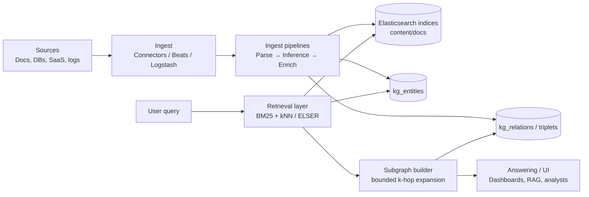
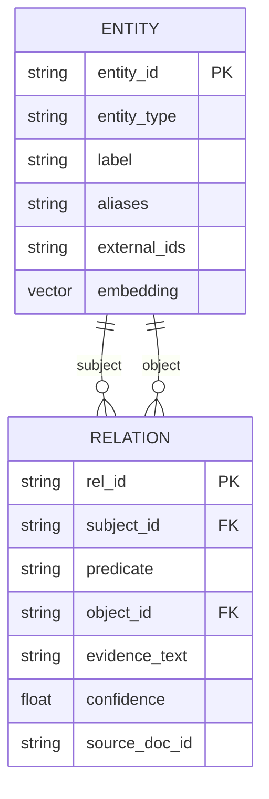
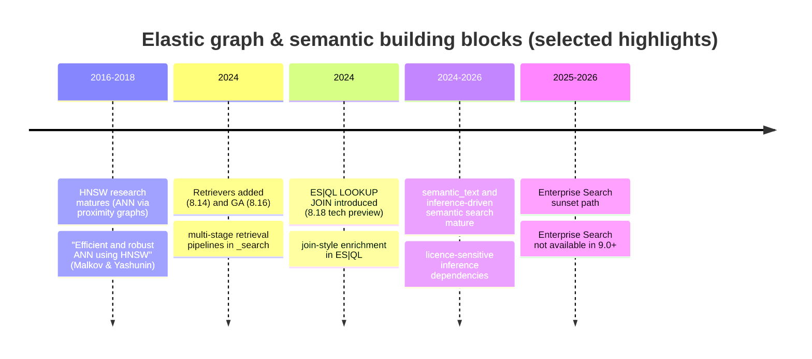

# Graph and Knowledge-Graph Capabilities in Elasticsearch and the Elastic Stack

## Executive summary

Elasticsearch is **not a native graph database** (no Cypher/Gremlin-style traversal engine, no built-in shortest-path operator, no first-class adjacency storage optimised for deep traversals), but it can support **graph-shaped outcomes** through two complementary approaches:

**Elastic Graph (official Graph analytics)** builds an *implicit*, **term-to-term association graph** over your indexed documents. Vertices are “terms in the index”; edges summarise co-occurrence evidence from sampled top-matching documents and can be filtered by statistical “significance” to prioritise non-obvious connections. It is delivered as the **Graph explore API** (`POST /{index}/_graph/explore`) plus an interactive **Kibana Graph** UI, and it works “out of the box” on existing indices without storing explicit edges. citeturn0search1turn25view0turn11search9

**Explicit knowledge-graph modelling in Elasticsearch** is an engineering pattern rather than a single built-in feature: you model **entities and relationships as documents** (e.g., nodes index + edges/triples index), enrich and normalise them at ingest time, and perform traversal-like behaviour via **iterative search queries** in application logic. Elastic’s own Search Labs “Graph RAG” guidance describes building and dynamically pruning query-specific subgraphs while storing triplets in Elasticsearch, which is a practical blueprint for KG-enhanced retrieval. citeturn4search0

For **knowledge-graph and semantic search workloads**, Elastic’s strongest primitives are its **ingest pipelines** (including the **inference processor** for ML/NLP at ingest), **enrich processors** for reference-data joins, and **vector/sparse semantic search** (dense vectors, ELSER sparse embeddings, and the higher-level `semantic_text` field type). These provide a robust toolkit for entity extraction, canonicalisation, and hybrid retrieval—even if graph traversal remains application-driven. citeturn2search4turn5search0turn2search1turn2search3turn3search1turn20search0turn3search0

From a product/solution perspective:

- **Enterprise Search (App Search / Workplace Search)** is in transition. Elastic’s Enterprise Search docs recommend that new users prefer “native Elasticsearch tools” over the standalone App Search / Workplace Search products, and Elastic provides a migration guide stating **Enterprise Search will no longer be available in Elastic 9.0+**. citeturn1search0turn1search8  
- **Kibana Maps** supports relationship-like exploration through multi-layer querying and **term joins** (client-side joining of a terms aggregation result to vector features) and is often used to situate entity relationships geographically. citeturn1search2turn10search14  
- **Elastic Security** includes graph-shaped investigative tooling (process/event visualisations such as **Visual event analyzer** and **Session View**) and entity-centric analytics such as **entity risk scoring**—useful “graph use cases” even though they are not exposed as a general graph query engine. citeturn1search3turn10search0turn10search1

Licensing and deployment choices matter: the Elastic subscription matrix shows **Graph exploration** is **not available in the Basic tier** (it appears only in higher tiers), and several semantic/AI features explicitly depend on licence state (e.g., `semantic_text` can cause indexing/reindexing failures if the inference API is not licensed). citeturn14view0turn18view0turn3search1 Graph docs are marked **“Serverless Unavailable”**, so if you plan to rely on Kibana Graph in Elastic Cloud Serverless, validate feature availability early. citeturn21search3turn23search9turn23search15

**Recommendations (high-level):**

- Use **Elasticsearch + Elastic Graph** when your “graph” requirement is primarily **association discovery** (co-occurrence, shared attributes, recommendation-like exploration) and you benefit from Elastic’s relevance ranking, filtering, and operational scale. citeturn0search1turn25view0  
- Use **Elasticsearch as a KG store** when your main goal is **search + semantic retrieval** over entity/relationship documents, and traversal needs can be satisfied with bounded application-driven expansion (GraphRAG-style subgraph building). citeturn4search0turn19search2  
- Choose a **dedicated graph database** (Neo4j/JanusGraph/TigerGraph) when you need **native variable-length traversal, shortest path, complex pattern matching, or graph algorithms** as first-class operations; integrate Elasticsearch for best-in-class text/semantic retrieval and ranking. citeturn8search16turn8search0turn8search2turn22search3turn8search1

Key source links (real websites) used throughout this report:

```text
Elastic Graph docs:            https://www.elastic.co/docs/explore-analyze/visualize/graph
Graph explore API (8.19 doc):  https://www.elastic.co/guide/en/elasticsearch/reference/8.19/graph-explore-api.html
Graph explore API (API hub):   https://www.elastic.co/docs/api/doc/elasticsearch/operation/operation-graph-explore
Elastic GraphRAG blog:         https://www.elastic.co/search-labs/blog/rag-graph-traversal
dense_vector field type:       https://www.elastic.co/docs/reference/elasticsearch/mapping-reference/dense-vector
sparse_vector field type:      https://www.elastic.co/docs/reference/elasticsearch/mapping-reference/sparse-vector
semantic_text field type:      https://www.elastic.co/docs/reference/elasticsearch/mapping-reference/semantic-text
Enrich processor setup:        https://www.elastic.co/docs/manage-data/ingest/transform-enrich/set-up-an-enrich-processor
NER example:                   https://www.elastic.co/docs/explore-analyze/machine-learning/nlp/ml-nlp-ner-example
Neo4j shortest paths:          https://neo4j.com/docs/cypher-manual/current/patterns/shortest-paths/
JanusGraph + Elasticsearch:    https://docs.janusgraph.org/index-backend/elasticsearch/
TigerGraph distributed query:  https://docs.tigergraph.com/gsql-ref/4.2/querying/distributed-query-mode
SPARQL 1.1 (W3C):              https://www.w3.org/TR/sparql11-query/
HNSW paper (arXiv):            https://arxiv.org/abs/1603.09320
```

## Official Elastic features and where “graph” shows up in the stack

Elastic’s graph story is distributed across (a) **Graph analytics**, (b) **search/enterprise search tooling**, (c) **visualisations (Graph/Maps/Vega)**, and (d) **solution-specific UIs (Security)**.

**Graph API and Kibana Graph: what it is (and what it is not)**  
Elastic Graph is defined by Elastic as “a network of related terms in the index,” where terms are **vertices** and **connections** summarise documents containing both terms. This is a term association model rather than an explicit entity-edge model. citeturn0search1turn0search13 The core API is the **Graph explore API** (`POST /{index}/_graph/explore`), intended to “extract and summarise information about the documents and terms” and to “spider out” across multiple hops by nesting `connections`. citeturn25view0turn6search11

Operationally, the explore API is **enabled by default**, and Elastic documents how to disable both the API and Kibana Graph UI using `xpack.graph.enabled: false`. citeturn25view0 Kibana persists graph workspaces as saved objects in the `.kibana` index, storing both configuration and (optionally) the data currently visualised (vertices/connections). citeturn21search3

**Enterprise Search, App Search, Workplace Search: relevance to knowledge graphs**  
Enterprise Search historically offered packaged “enterprise search” capabilities (APIs/UIs, connectors, crawler) and two standalone products: **App Search** and **Workplace Search**. Elastic’s Enterprise Search docs still describe Enterprise Search as an additional service enabling connectors, the web crawler, and App Search / Workplace Search. citeturn1search14turn1search4 However, the documentation now explicitly recommends that **new users use native Elasticsearch tools rather than standalone App Search / Workplace Search**, and Elastic provides a migration guide stating **Enterprise Search is not available in Elastic 9.0+**. citeturn1search0turn1search8turn1search1

For KG work, what matters is the direction: “enterprise search” capabilities (connectors, relevance tuning, retrieval, permissions) are increasingly expressed as **native Elasticsearch + Kibana** features rather than a separate server. citeturn1search7turn1search0

**Elastic Maps: graph-adjacent joins and relationship visualisation**  
Kibana Maps is not a graph analytics engine, but it enables relationship exploration by combining layers and filtering across them. citeturn10search14 A key “relationship” primitive is the **term join**: a shared-key join between vector features (“left source”) and a **terms aggregation** result (“right source”). citeturn1search2turn10search2 This can be used for geo-enriched entity views (e.g., entity activity by region) and is often complementary to entity graphs.

**Machine learning integrations: inference in ingest and semantic retrieval**  
Elastic supports adding an **inference processor** to ingest pipelines to apply deployed NLP models at index time (e.g., NER), and provides a worked NER example that deploys a Hugging Face NER model, tests it, and uses it in an ingest pipeline. citeturn2search0turn2search1turn2search4 Elastic also documents ELSER (Elastic Learned Sparse Encoder) as a semantic retrieval model with explicit subscription requirements and deployment options via Elastic Inference Service. citeturn20search0turn20search1 These are foundational for KG-style entity extraction and semantic search.

**Elastic Security: “graph uses” in investigation and entity analytics**  
Elastic Security includes graph-shaped investigative tools such as:

- **Visual event analyzer**, described by Elastic as a “process-based visual analyzer” showing a graphical timeline of processes around an alert. citeturn1search3  
- **Session View**, which organises Linux process data in a tree-like structure by parentage and time of execution. citeturn10search0  
- **Entity analytics** features like **entity risk scoring**, which is explicitly an entity-centric analytics feature for hosts/users/services risk posture monitoring. citeturn10search1turn10search5  

These are practical “graph” applications (process trees, entity-centric correlation) even though they do not expose arbitrary traversal and path queries like a graph DB would.

## Knowledge-graph concepts on Elastic: entities, relations, semantics, and linking

A knowledge graph typically requires: (a) entity extraction/identification, (b) relationship modelling, (c) schema/ontology governance and potentially reasoning, and (d) retrieval (lexical + semantic) across entities/relations. Elastic covers (a) and (d) strongly, offers workable patterns for (b), and is comparatively weak for (c).

**Entity extraction (NER) and enrichment**  
Elastic’s recommended path for entity extraction is ingest-time NLP inference. The “Named entity recognition” example shows how to deploy and use an NER model and add it to an inference ingest pipeline. citeturn2search1 The underlying processor is the **inference processor**, which applies a pre-trained NLP model (or trained model) during ingest. citeturn2search4turn2search0

For KG pipelines, entity extraction is usually followed by **canonicalisation** (mapping “UK”, “United Kingdom”, “Britain” → one canonical entity ID). Elastic’s **enrich processor** supports ingest-time enrichment from another index (reference data). citeturn5search1turn5search4 This is a natural fit for entity dictionaries and controlled vocabularies.

**Relationship modelling: implicit vs explicit**  
Elastic supports two relationship paradigms:

- **Implicit relationships (Elastic Graph):** relationships are inferred from document co-occurrence among indexed terms. You configure vertex fields and connection fields; the API builds a term graph, optionally filtered by significance. citeturn0search1turn25view0  
- **Explicit relationships (KG-in-ES):** you model relationships explicitly as documents (edge/triple records). Elastic’s own GraphRAG guidance describes storing graph triplets directly in Elasticsearch and dynamically generating subgraphs for retrieval. citeturn4search0  

The second approach is the usual way to represent a true (explicit) KG in Elasticsearch, but traversal is not a native engine feature (it is orchestrated in application logic).

**Schema/ontology and reasoning support: limited in Elasticsearch**  
Elasticsearch provides mappings, index templates, and analyzers as schema tooling; it does not provide RDF/OWL semantics, SPARQL, or built-in reasoning. In contrast, RDF knowledge-graph platforms are explicitly designed around triples and reasoning. W3C RDF defines the RDF data model, and SPARQL 1.1 defines a query language for RDF graphs. citeturn9search0turn8search3 Systems like Ontotext GraphDB document forward-chaining reasoning and total materialisation strategies, and Stardog documents reasoning integrated into SPARQL evaluation. citeturn9search10turn9search9turn9search13

Implication: Elasticsearch can store KG-shaped data, but **ontology-driven inference and constraint validation must be external** (ETL/ML layer, application logic, or a dedicated KG platform).

**Semantic search: embeddings, vectors, and hybrid retrieval**  
Elastic offers multiple semantic retrieval options:

- **Dense vector search** using `dense_vector` fields (primarily for kNN search); dense vectors do **not support aggregations or sorting**, so you preserve structured fields for analytics downstream. citeturn2search3  
- **Sparse semantic retrieval** via ELSER and `sparse_vector`. Elastic explicitly states `sparse_vector` is the field type used with ELSER mappings, and `text_expansion` converts query text to token-weight pairs to query sparse vectors or rank-features. citeturn3search0turn3search4turn20search0  
- The higher-level **`semantic_text`** field type, which aims to automate much of the mapping/ingest/chunking work for semantic search; Elastic warns that using `semantic_text` without an appropriate licence can cause indexing/reindexing to fail because it typically calls the inference API. citeturn3search1turn3search17  

These semantic primitives are directly useful in KG scenarios: you can semantically retrieve **entity nodes**, **relationship evidence**, or **document passages** before building an explicit subgraph (GraphRAG pattern).

**Linking to external knowledge bases**  
Elastic does not provide native KG federation; linking is typically achieved through:

- storing external KB IDs/IRIs in entity documents, and/or  
- Kibana Graph “drilldown URLs” and similar UI actions, which allow users to jump from a vertex term to an external system (Elastic describes drilldown configuration as part of Graph settings). citeturn21search3  
- connectors replicating content from external systems into Elastic as searchable indices (useful when you want to treat external KB documents as part of retrieval). citeturn7search0turn7search4  

## Data modelling and indexing strategies for graph and KG workloads on Elasticsearch

The modelling decision that determines success or failure is whether you treat Elasticsearch as:

- a **document store that can infer associations** (Elastic Graph), or
- an **indexable projection** of an explicit entity/edge graph (KG-in-ES).

**Core modelling patterns**

**Term-association graph (Elastic Graph):** do not change your schema; choose “vertex fields” and run Graph explore. This is lowest engineering effort but not a true KG.

**Entity + relationship indices (explicit KG and GraphRAG-style retrieval):**  

- `kg_entities` index: one document per canonical entity (plus aliases, metadata, embeddings).  
- `kg_relations` index: one document per relationship/triple/edge (subject_id, predicate, object_id, provenance, confidence, optional embeddings for evidence text).  
This aligns with Elastic’s own GraphRAG approach of storing triplets and dynamically extracting subgraphs. citeturn4search0

**Why Elastic recommends denormalisation over joins**  
Elasticsearch’s join features exist, but the platform is explicit about trade-offs: the **join field** “shouldn’t be used like joins in a relational database”; each `has_child`/`has_parent` query adds a “significant tax” to performance and can trigger global ordinals. Elastic says the join field only makes sense in certain one-to-many situations where one entity outnumbers the other (e.g., products and offers). citeturn19search0  
Nested fields are also “typically expensive,” and Elastic even recommends `flattened` in some cases; nested fields have incomplete Kibana support. citeturn19search1

For graph/KG: these warnings imply that **many-to-many edges are better represented as separate edge documents** rather than parent/child joins.

**Ingest pipelines and processors: extraction, normalisation, enrichment**  
Elastic documents ingest pipelines as ordered sequences of processors where each processor depends on the previous output, making ordering critical. citeturn5search12turn5search20 For KG building, common steps are: parse → NLP inference → canonicalise → enrich → route/index.

- **Inference processor:** runs ML inference at ingest, including NLP models. citeturn2search4turn2search0  
- **Enrich processor:** enriches documents from another index; Elastic strongly recommends benchmarking enrich in production-like settings and explicitly does **not recommend** using enrich to append real-time data. It works best for reference data that doesn’t change frequently; it can impact ingest speed; Elastic recommends co-locating ingest and data roles to minimise remote searches. citeturn5search0turn5search1  

**Entity extraction example as an official building block**  
Elastic’s NER example explicitly targets the “deploy, test, add to ingest pipeline” workflow, which is a direct on-ramp to entity extraction for KG pipelines. citeturn2search1

**Vector indexing and performance/scalability**  
Vector search has unique operational costs. Elasticsearch’s approximate kNN search uses **HNSW**, which is an approximate method trading accuracy for speed; the API supports filters to restrict the candidate set. citeturn3search18turn4search9 Elastic also provides production guidance for tuning approximate kNN search and notes that kNN indexing builds vector index structures and has performance considerations distinct from “normal” search. citeturn20search2turn3search10 Elastic’s Search Labs HNSW guidance highlights a key architectural point: **each Lucene segment has its own HNSW graph**, and segments are searched independently. citeturn4search1 The HNSW algorithm itself is described in the foundational paper by Malkov & Yashunin. citeturn4search2

For graph-shaped KGs, this matters because vector-heavy entity/edge indices can become memory-relevant; you must size for vector data and query load, not only term search.

## Query capabilities: Graph explore, aggregation-based “graph analytics”, and hybrid vector + graph retrieval

This section addresses the core question: “What graph queries can Elasticsearch actually do?”

**Elastic Graph explore API: multi-hop association exploration, not general traversal**  
The Graph explore API defines:

- a **seed query**;  
- **vertices** (fields containing the terms to treat as vertices), including include/exclude, `size`, `min_doc_count` thresholds;  
- **connections** (fields to extract associated terms), which can be nested into multiple levels; each nesting level is “considered a hop,” and the API talks about proximity in hop depth;  
- **controls** such as `use_significance` (based on `significant_terms`) and `sample_size` (sampling top docs per shard). citeturn25view0turn6search3turn6search0  

Elastic also clarifies an important interpretability nuance: in Graph explore responses, the `doc_count` for a connection reflects how many documents in the **sample set** contain the pairing, not a global corpus count. citeturn25view0 This is why Graph is excellent for **discovery** but not a deterministic traversal engine.

**Aggregation primitives that look like graph operations**  
Even without Graph explore, you can perform relationship-like analytics:

- **`significant_terms` aggregation** returns statistically unusual/interesting term occurrences and is explicitly described as supporting fraud/common-point-of-compromise scenarios. citeturn6search0turn22search10  
- **`adjacency_matrix` aggregation** returns named intersections among filter sets (“cells” in a matrix of intersecting filters). This can be used to compute co-membership overlap patterns (an adjacency-like representation). citeturn6search1  
- Relationship analytics performance is often governed by **doc values and global ordinals**; Elastic documents how term-based field types store doc values with ordinal mappings and how global ordinals support aggregation-like operations. citeturn6search2turn19search15  

**k-hop and subgraph extraction: how teams implement it on Elastic**  
Elasticsearch does not provide a native `kHop(startNode, k)` operator over explicit edges, nor native shortest path. Instead, teams typically:

1) retrieve a frontier of neighbour edges from an `edges` index using `term/terms` filters on subject/object IDs;  
2) iterate (BFS/DFS) in application code;  
3) cap expansion to avoid hub explosion;  
4) optionally use semantic ranking to choose which edges to expand.

Elastic’s own GraphRAG article follows this “build a tailored subgraph for the query” approach on Elasticsearch-stored triplets. citeturn4search0 Operationally, deep expansions risk hitting search pagination constraints; Elastic discourages deep `from/size` pagination beyond 10,000 hits and recommends `search_after` with a point-in-time (PIT) when preserving index state is needed. citeturn19search2

**Shortest path: not a native Elasticsearch feature**  
Unlike Neo4j, which documents a `SHORTEST` keyword for shortest path variations and reachability constructs, Elasticsearch does not offer a built-in shortest-path query primitive. citeturn8search16 In Elastic-based systems, shortest path requires either:

- exporting the relevant subgraph and running a graph algorithm externally, or  
- integrating a graph database/graph analytics engine.

**Combining vector + graph queries: recommended hybrid patterns**  
For KG-enhanced search, one high-leverage pattern is “retrieve semantically, then expand structurally”:

- Step A: Elasticsearch retrieves top entities/edges/doc passages using dense vectors (`dense_vector` + kNN) or sparse semantics (ELSER + `sparse_vector` / `text_expansion`). citeturn2search3turn3search0turn3search4turn20search0  
- Step B: application builds a bounded subgraph by pulling edges touching those entities.  
- Step C: optionally re-rank using Elastic’s multi-stage retrieval pipelines (**retrievers**) or custom scoring.

Version note: Elastic retrievers were added to the Search API in **8.14.0** and became GA in **8.16.0**, enabling multi-stage retrieval pipelines in a single `_search` call. citeturn24search1turn24search0 The **RRF retriever** combines multiple child retrievers into one ranked list. citeturn3search3

Licensing note: Elastic’s current subscription matrix shows that advanced retrieval functions (including RRF and some retrievers) are tier-dependent, so organisations on Basic may need to implement fusion/reranking in application code. citeturn15view0turn18view1

## Tooling and ecosystem: Kibana, clients, connectors, integrations, and third-party tooling

**Kibana visualisation surface**  
Elastic provides multiple “surfaces” for graph and KG-adjacent workflows:

- **Kibana Graph** for interactive association exploration. citeturn0search13turn0search1  
- **Kibana Lens** for general analytics and dashboards; Lens is described as Kibana’s drag-and-drop visualisation editor. citeturn10search3  
- **Vega/Vega-Lite** panels for custom visualisations; Elastic documents that Vega panels can query Elasticsearch and other sources and support Kibana extensions. citeturn21search1turn21search13  
- **Kibana Maps**, including term joins and layer-based filtering considerations. citeturn1search2turn10search18turn10search14  

These tools matter because KG projects frequently depend on good exploratory UX and analyst workflows even if the backend data is not a “native” KG platform.

**Graph API clients and programmatic access**  
Elastic’s Graph explore endpoint is exposed through official clients, including:

- Python client Graph explore docs. citeturn0search4  
- Go typed client Graph explore API. citeturn0search8  
- .NET client Graph namespace. citeturn0search12  

This enables building bespoke graph-assisted applications (fraud rings, recommendations, entity investigation) on top of Elastic’s term-association model.

**Connectors and content ingestion**  
Elastic connectors synchronise data from third-party sources into Elasticsearch and create searchable, read-only replicas. Elastic highlights that connectors are written in Python and that source is available in `elastic/connectors`. citeturn7search0turn7search4 Content sync behaviour matters for consistency: Elastic documents that a **full sync** deletes Elasticsearch documents that no longer exist in the source, improving consistency at the cost of longer runtimes. citeturn7search12 Connector-specific DLS is versioned and described as introduced in 8.9.0 (beta), with prerequisites; this can be relevant if you treat connector-ingested content as part of a “knowledge base”. citeturn7search11

**Beats and Logstash: classic ingestion and enrichment**  
Beats can ship data directly to Elasticsearch or via Logstash, enabling event-to-entity correlation workflows (security/observability graphs). citeturn7search1turn7search5 Logstash’s Elasticsearch output plugin is an established pathway for high-throughput ingestion into Elasticsearch. citeturn5search3turn5search17

**Open-source and example repositories**  
Elastic maintains multiple repos that often become “de facto references” for implementation patterns:

- `elastic/elasticsearch` main repo (core engine). citeturn21search12  
- `elastic/elasticsearch-labs` for notebooks and example apps for vector search, hybrid search, and RAG-style applications. citeturn4search3  
- `elastic/search-ui` (open-source Search UI library) for building search UIs on Elastic backends—useful in KG-backed search experiences. citeturn21search0turn21search4  
- `elastic/beats` and Logstash plugin repos, for ingestion tooling. citeturn7search5turn5search7  

## Security, access control, licensing, and deployment options

**Access control and security model**  
Elastic’s security model is privilege-based: roles are built from cluster, indices, run-as, and application privileges. citeturn7search2 Fine-grained controls include **field-level security** and **document-level security**, but Elastic warns these features are meant for **read-only privileged accounts** (users with DLS/FLS should not perform writes). citeturn7search3

For KG scenarios, this warning matters because:

- if you treat Elasticsearch as a shared KG store, you must separate write pipelines (service accounts) from user-facing read roles;  
- if you project sensitive relationships, DLS/FLS might be necessary but introduces operational complexity and licensing constraints. citeturn7search6turn7search3

**Licensing implications (graph + semantic features)**  
Elastic’s documentation is explicit that licences/subscriptions determine available features; licences apply at different levels depending on deployment type (cloud vs self-managed). citeturn0search10 The self-managed subscriptions table defines tiers including “Free and open – Basic”, “Platinum”, and “Enterprise” (and notes Gold is discontinued). citeturn18view0 Within that matrix, **Graph exploration** is shown as not available in the Basic tier but available in higher tiers (check marks in non-Basic columns). citeturn14view0turn18view1

For semantic features, Elastic’s `semantic_text` docs warn that although the mapping can be added regardless of licence state, it typically calls the inference API; without an appropriate licence, indexing and reindexing may fail. citeturn3search1 ELSER also has explicit subscription requirements (“appropriate subscription level for semantic search or trial period activated”). citeturn20search0

**Deployment options: cloud hosted vs serverless vs self-managed**  
Elastic Cloud Serverless is described as fully managed, decoupling compute and storage and removing the need to manage clusters/nodes/tiers directly. citeturn21search11turn23search0 Elastic also documents a comparison guide for Cloud Hosted vs Serverless. citeturn23search15 However, Elastic’s Graph docs are labelled **“Serverless Unavailable”** (Graph UI/configuration/troubleshooting pages), implying that Kibana Graph is not available in serverless projects even if it exists in stack deployments. citeturn23search9turn21search3turn21search7

Practical implication: if Graph UI is a core requirement, plan around **Elastic Stack deployments (self-managed / ECK / ECE / Cloud Hosted)** rather than assuming Serverless will support it.

## Limitations, gaps, recommended patterns, and comparisons with graph DBs and KG platforms

### Where Elasticsearch is strong vs weak for graphs and knowledge graphs

**Strengths**

- Large-scale text search, relevance ranking, aggregations, and near-real-time indexing behaviour. citeturn5search3turn0search1  
- Out-of-the-box association graphs via Graph explore API, including multi-hop “spidering” and significance filtering. citeturn25view0turn6search3  
- Ingest-time ML inference (NER, embeddings), enrichment joins, and mature ingestion ecosystem (Beats, Logstash, connectors). citeturn2search4turn5search0turn7search0turn7search1turn5search3  
- Native vector search (HNSW-based approximate kNN) and sparse semantic retrieval (ELSER). citeturn3search18turn4search1turn20search0turn3search0  

**Gaps**

- No native equivalents of **shortest path**, general path pattern matching, or a graph traversal query language. Neo4j documents shortest-path query support directly in Cypher, highlighting the contrast. citeturn8search16  
- No ontology reasoning or SPARQL; RDF and SPARQL are formalised by W3C and supported by dedicated KG platforms. citeturn9search0turn8search3  
- Relationship modelling is largely “bring your own model” (edge docs) and “bring your own traversal” (application logic), which increases complexity and can be expensive at high hop counts; deep pagination constraints (10k result window; preference for PIT + `search_after`) become relevant quickly. citeturn19search2turn4search0  

### Recommended patterns and workarounds

**Pattern: Elastic Graph for association discovery**

- Use Graph explore when your graph question is: “Which terms co-occur meaningfully in a subset of documents?”  
- Tune `sample_size`, `use_significance`, and `min_doc_count` depending on whether you need signal vs completeness (Elastic explains these defaults and how they can miss details). citeturn6search3turn25view0

**Pattern: Explicit triplets store + bounded expansion (GraphRAG-style)**

- Store edge documents and build subgraphs dynamically at query time; cap neighbour counts; use semantic retrieval to prioritise expansions. Elastic’s GraphRAG guidance is a concrete reference for this design. citeturn4search0turn19search2

**Pattern: Dual-store (graph DB + Elasticsearch)**

- Put authoritative relationships and traversal/algorithms in a graph DB, store searchable text/embeddings and logs/docs in Elasticsearch; join at the application layer. This avoids forcing Elasticsearch into deep traversal workloads while preserving superior text/semantic retrieval.

### Comparison table: Elasticsearch vs graph DBs and KG platforms

| System | Native graph model | Query language for traversal | Shortest path | Semantic search / vectors | Typical strengths / use-cases |
|---|---|---|---|---|---|
| Elasticsearch + Elastic Graph | Document index; Graph = term association over documents citeturn0search1turn25view0 | Elasticsearch Query DSL; Graph explore API “hops” over term associations citeturn25view0 | Not native (application or external) | Strong: dense vectors (`dense_vector`), sparse `sparse_vector`/ELSER, `semantic_text` (licence-dependent) citeturn2search3turn3search0turn3search1turn20search0 | Search-first systems; association discovery; KG-shaped retrieval (GraphRAG); log/security investigation |
| Neo4j | Property graph (nodes + relationships) | Cypher (pattern matching, variable-length paths) citeturn8search0 | Native (`SHORTEST`) citeturn8search16 | Available (vector index), but many deployments still pair ES for search citeturn22search3 | Traversal-heavy apps; fraud rings; recommendation paths; graph algorithms (GDS) citeturn22search3 |
| JanusGraph | Property graph with pluggable storage/index backends | Gremlin (via Apache TinkerPop) | Via Gremlin/analytics stack | Often uses external index; JanusGraph explicitly supports Elasticsearch as an index backend citeturn8search1turn8search9 | Very large graphs with distributed storage; operational flexibility; external indexing |
| TigerGraph | Native distributed graph system | GSQL with distributed traversal execution | Supported via query/algorithm patterns | Varies by setup | Large-scale traversal/analytics; distributed query mode for multi-machine traversals citeturn8search2turn8search14 |
| RDF KG platforms (e.g., GraphDB, Stardog) | RDF triples (subject–predicate–object) citeturn9search0 | SPARQL 1.1 citeturn8search3 | Path queries supported via SPARQL property paths (platform-dependent) | Often integrate text search; some support vector/ML add-ons | Ontology-centric KGs; reasoning/inference; semantic constraints (GraphDB/Stardog reasoning) citeturn9search10turn9search9turn9search13 |

### When to use Elasticsearch for graph/KG needs vs when to choose a graph DB

Use **Elasticsearch (and optionally Elastic Graph)** when:

- The product is **search-led** and graph is used for **association discovery** or to provide “related things” based on co-occurrence. citeturn0search1turn25view0  
- You need a **single platform** for text + filter analytics + embeddings + ingestion at scale; and traversal can be bounded and application-driven (GraphRAG-style subgraph). citeturn4search0turn2search3turn19search2  
- You want to operationalise entity extraction and enrichment at ingest time using inference + enrich pipelines. citeturn2search4turn5search0turn2search1  

Choose a **dedicated graph DB / KG platform** when:

- You require **variable-length traversal, shortest path, or complex pattern matching** as standard queries (Neo4j Cypher is the canonical reference). citeturn8search0turn8search16  
- You rely on **graph algorithms** as first-class operations (centrality, community detection, embeddings, path finding). Neo4j’s GDS library documents broad algorithm coverage. citeturn22search3  
- You require **ontology reasoning** and SPARQL-level graph semantics (GraphDB/Stardog reasoning; W3C standards). citeturn8search3turn9search10turn9search9  

## Practical examples: mappings, pipelines, queries, and reference architectures

### Example explicit KG indices in Elasticsearch (entities + relations)

Below is a pragmatic baseline for explicit KGs in Elasticsearch. It respects Elastic’s constraints: vectors are for kNN and cannot be aggregated; keep structured fields for filtering/analytics. citeturn2search3

**Entities index**

```json
PUT kg_entities
{
  "mappings": {
    "properties": {
      "entity_id":   { "type": "keyword" },
      "entity_type": { "type": "keyword" },
      "label":       { "type": "text" },
      "aliases":     { "type": "keyword" },
      "external_ids": {
        "type": "object",
        "enabled": true
      },
      "embedding": {
        "type": "dense_vector",
        "dims": 384
      },
      "created_at":  { "type": "date" },
      "updated_at":  { "type": "date" }
    }
  }
}
```

**Relations index**

```json
PUT kg_relations
{
  "mappings": {
    "properties": {
      "rel_id":     { "type": "keyword" },
      "subject_id": { "type": "keyword" },
      "predicate":  { "type": "keyword" },
      "object_id":  { "type": "keyword" },

      "evidence_text": { "type": "text" },
      "source_doc_id": { "type": "keyword" },
      "source_url":    { "type": "keyword" },
      "confidence":    { "type": "float" },

      "evidence_embedding": {
        "type": "dense_vector",
        "dims": 384
      },

      "created_at": { "type": "date" }
    }
  }
}
```

This aligns with Elastic’s GraphRAG recommendation to store triplets/edges and build query-specific subgraphs. citeturn4search0

### Example ingest pipeline: NER inference + reference enrichment

This combines:

- the **inference processor** (NER model) citeturn2search4turn2search1  
- the **enrich processor** (reference entity dictionary join), with the caveat that enrich is best for slowly changing reference data and can impact ingest speed. citeturn5search0turn5search1  

```json
PUT _ingest/pipeline/kg_ingest_v1
{
  "processors": [
    {
      "inference": {
        "model_id": "my_ner_model",
        "target_field": "ml.ner",
        "field_map": { "content": "text" }
      }
    },
    {
      "enrich": {
        "policy_name": "entity_dictionary_policy",
        "field": "ml.ner.entities.name",
        "target_field": "kg.canonical",
        "max_matches": 1
      }
    }
  ]
}
```

### Example: Elastic Graph explore API request (association graph)

This request seeds exploration from a filtered query, defines vertices, and expands connections one hop. It uses the defaults and controls described in Elastic’s Graph explore API docs (sampling, significance, min doc count). citeturn25view0turn6search3turn0search0

```json
POST events-*/_graph/explore
{
  "query": {
    "bool": {
      "filter": [
        { "term": { "event.category": "authentication" } },
        { "range": { "@timestamp": { "gte": "now-7d" } } }
      ]
    }
  },
  "vertices": [
    { "field": "user.name", "size": 10, "min_doc_count": 3 }
  ],
  "connections": {
    "vertices": [
      { "field": "source.ip", "size": 10, "min_doc_count": 3 }
    ]
  },
  "controls": {
    "use_significance": true,
    "sample_size": 200
  }
}
```

### Example: adjacency-matrix “overlap graph” using aggregations

Elastic describes `adjacency_matrix` as returning non-empty intersections among named filters (a form of adjacency matrix). citeturn6search1

```json
POST transactions/_search
{
  "size": 0,
  "aggs": {
    "overlaps": {
      "adjacency_matrix": {
        "filters": {
          "country_UK": { "term": { "billing_country": "GB" } },
          "high_value": { "range": { "amount": { "gte": 1000 } } },
          "chargeback": { "term": { "status": "chargeback" } }
        }
      }
    }
  }
}
```

### Architecture diagrams (mermaid)

#### Elastic-based KG build and retrieval pipeline

This diagram shows an Elastic-first architecture that combines connectors/ingest pipelines (entity extraction and enrich), semantic retrieval, and explicit edge expansion in application logic.



The “inference → enrich” path is directly grounded in Elastic’s inference processor and enrich processor documentation. citeturn2search4turn5search1 The “bounded expansion” is aligned with Elastic’s GraphRAG guidance and the need to respect pagination constraints (PIT + `search_after`). citeturn4search0turn19search2

#### Entity–relationship structure for an explicit KG in Elasticsearch



#### Feature evolution timeline (version-sensitive highlights)

Version notes are important because Elastic’s modern retrieval tooling and Enterprise Search status are version-dependent.



The timeline references: HNSW paper citeturn4search2, retrievers versioning citeturn24search1turn24search0, ES|QL LOOKUP JOIN introduction citeturn21search14turn21search6, semantic_text licensing note citeturn3search1, and Enterprise Search 9.0 removal guidance citeturn1search8.

### “GraphRAG” context: why KGs matter for RAG and where Elastic fits

Academic and industry work increasingly supports graph-enhanced retrieval for multi-hop reasoning and query-focused summarisation. Microsoft’s GraphRAG paper describes building an entity knowledge graph and using community summaries to answer questions over private corpora. citeturn22search0turn22search4 Surveys on GraphRAG emphasise that flat retrieval struggles with relational structure. citeturn22search1turn22search5 Elastic’s GraphRAG guidance shows how Elasticsearch can store and retrieve KG triplets effectively, but you should treat it as **search-centric KG storage**, not a graph traversal engine. citeturn4search0

# Graph and Knowledge-Graph Capabilities in Elasticsearch and the Elastic Stack

## Executive summary

Elasticsearch is **not a native graph database** (no Cypher/Gremlin-style traversal engine, no built-in shortest-path operator, no first-class adjacency storage optimised for deep traversals), but it can support **graph-shaped outcomes** through two complementary approaches:

**Elastic Graph (official Graph analytics)** builds an *implicit*, **term-to-term association graph** over your indexed documents. Vertices are “terms in the index”; edges summarise co-occurrence evidence from sampled top-matching documents and can be filtered by statistical “significance” to prioritise non-obvious connections. It is delivered as the **Graph explore API** (`POST /{index}/_graph/explore`) plus an interactive **Kibana Graph** UI, and it works “out of the box” on existing indices without storing explicit edges. citeturn0search1turn25view0turn11search9

**Explicit knowledge-graph modelling in Elasticsearch** is an engineering pattern rather than a single built-in feature: you model **entities and relationships as documents** (e.g., nodes index + edges/triples index), enrich and normalise them at ingest time, and perform traversal-like behaviour via **iterative search queries** in application logic. Elastic’s own Search Labs “Graph RAG” guidance describes building and dynamically pruning query-specific subgraphs while storing triplets in Elasticsearch, which is a practical blueprint for KG-enhanced retrieval. citeturn4search0

For **knowledge-graph and semantic search workloads**, Elastic’s strongest primitives are its **ingest pipelines** (including the **inference processor** for ML/NLP at ingest), **enrich processors** for reference-data joins, and **vector/sparse semantic search** (dense vectors, ELSER sparse embeddings, and the higher-level `semantic_text` field type). These provide a robust toolkit for entity extraction, canonicalisation, and hybrid retrieval—even if graph traversal remains application-driven. citeturn2search4turn5search0turn2search1turn2search3turn3search1turn20search0turn3search0

From a product/solution perspective:

- **Enterprise Search (App Search / Workplace Search)** is in transition. Elastic’s Enterprise Search docs recommend that new users prefer “native Elasticsearch tools” over the standalone App Search / Workplace Search products, and Elastic provides a migration guide stating **Enterprise Search will no longer be available in Elastic 9.0+**. citeturn1search0turn1search8  
- **Kibana Maps** supports relationship-like exploration through multi-layer querying and **term joins** (client-side joining of a terms aggregation result to vector features) and is often used to situate entity relationships geographically. citeturn1search2turn10search14  
- **Elastic Security** includes graph-shaped investigative tooling (process/event visualisations such as **Visual event analyzer** and **Session View**) and entity-centric analytics such as **entity risk scoring**—useful “graph use cases” even though they are not exposed as a general graph query engine. citeturn1search3turn10search0turn10search1

Licensing and deployment choices matter: the Elastic subscription matrix shows **Graph exploration** is **not available in the Basic tier** (it appears only in higher tiers), and several semantic/AI features explicitly depend on licence state (e.g., `semantic_text` can cause indexing/reindexing failures if the inference API is not licensed). citeturn14view0turn18view0turn3search1 Graph docs are marked **“Serverless Unavailable”**, so if you plan to rely on Kibana Graph in Elastic Cloud Serverless, validate feature availability early. citeturn21search3turn23search9turn23search15

**Recommendations (high-level):**

- Use **Elasticsearch + Elastic Graph** when your “graph” requirement is primarily **association discovery** (co-occurrence, shared attributes, recommendation-like exploration) and you benefit from Elastic’s relevance ranking, filtering, and operational scale. citeturn0search1turn25view0  
- Use **Elasticsearch as a KG store** when your main goal is **search + semantic retrieval** over entity/relationship documents, and traversal needs can be satisfied with bounded application-driven expansion (GraphRAG-style subgraph building). citeturn4search0turn19search2  
- Choose a **dedicated graph database** (Neo4j/JanusGraph/TigerGraph) when you need **native variable-length traversal, shortest path, complex pattern matching, or graph algorithms** as first-class operations; integrate Elasticsearch for best-in-class text/semantic retrieval and ranking. citeturn8search16turn8search0turn8search2turn22search3turn8search1

Key source links (real websites) used throughout this report:

```text
Elastic Graph docs:            https://www.elastic.co/docs/explore-analyze/visualize/graph
Graph explore API (8.19 doc):  https://www.elastic.co/guide/en/elasticsearch/reference/8.19/graph-explore-api.html
Graph explore API (API hub):   https://www.elastic.co/docs/api/doc/elasticsearch/operation/operation-graph-explore
Elastic GraphRAG blog:         https://www.elastic.co/search-labs/blog/rag-graph-traversal
dense_vector field type:       https://www.elastic.co/docs/reference/elasticsearch/mapping-reference/dense-vector
sparse_vector field type:      https://www.elastic.co/docs/reference/elasticsearch/mapping-reference/sparse-vector
semantic_text field type:      https://www.elastic.co/docs/reference/elasticsearch/mapping-reference/semantic-text
Enrich processor setup:        https://www.elastic.co/docs/manage-data/ingest/transform-enrich/set-up-an-enrich-processor
NER example:                   https://www.elastic.co/docs/explore-analyze/machine-learning/nlp/ml-nlp-ner-example
Neo4j shortest paths:          https://neo4j.com/docs/cypher-manual/current/patterns/shortest-paths/
JanusGraph + Elasticsearch:    https://docs.janusgraph.org/index-backend/elasticsearch/
TigerGraph distributed query:  https://docs.tigergraph.com/gsql-ref/4.2/querying/distributed-query-mode
SPARQL 1.1 (W3C):              https://www.w3.org/TR/sparql11-query/
HNSW paper (arXiv):            https://arxiv.org/abs/1603.09320
```

## Official Elastic features and where “graph” shows up in the stack

Elastic’s graph story is distributed across (a) **Graph analytics**, (b) **search/enterprise search tooling**, (c) **visualisations (Graph/Maps/Vega)**, and (d) **solution-specific UIs (Security)**.

**Graph API and Kibana Graph: what it is (and what it is not)**  
Elastic Graph is defined by Elastic as “a network of related terms in the index,” where terms are **vertices** and **connections** summarise documents containing both terms. This is a term association model rather than an explicit entity-edge model. citeturn0search1turn0search13 The core API is the **Graph explore API** (`POST /{index}/_graph/explore`), intended to “extract and summarise information about the documents and terms” and to “spider out” across multiple hops by nesting `connections`. citeturn25view0turn6search11

Operationally, the explore API is **enabled by default**, and Elastic documents how to disable both the API and Kibana Graph UI using `xpack.graph.enabled: false`. citeturn25view0 Kibana persists graph workspaces as saved objects in the `.kibana` index, storing both configuration and (optionally) the data currently visualised (vertices/connections). citeturn21search3

**Enterprise Search, App Search, Workplace Search: relevance to knowledge graphs**  
Enterprise Search historically offered packaged “enterprise search” capabilities (APIs/UIs, connectors, crawler) and two standalone products: **App Search** and **Workplace Search**. Elastic’s Enterprise Search docs still describe Enterprise Search as an additional service enabling connectors, the web crawler, and App Search / Workplace Search. citeturn1search14turn1search4 However, the documentation now explicitly recommends that **new users use native Elasticsearch tools rather than standalone App Search / Workplace Search**, and Elastic provides a migration guide stating **Enterprise Search is not available in Elastic 9.0+**. citeturn1search0turn1search8turn1search1

For KG work, what matters is the direction: “enterprise search” capabilities (connectors, relevance tuning, retrieval, permissions) are increasingly expressed as **native Elasticsearch + Kibana** features rather than a separate server. citeturn1search7turn1search0

**Elastic Maps: graph-adjacent joins and relationship visualisation**  
Kibana Maps is not a graph analytics engine, but it enables relationship exploration by combining layers and filtering across them. citeturn10search14 A key “relationship” primitive is the **term join**: a shared-key join between vector features (“left source”) and a **terms aggregation** result (“right source”). citeturn1search2turn10search2 This can be used for geo-enriched entity views (e.g., entity activity by region) and is often complementary to entity graphs.

**Machine learning integrations: inference in ingest and semantic retrieval**  
Elastic supports adding an **inference processor** to ingest pipelines to apply deployed NLP models at index time (e.g., NER), and provides a worked NER example that deploys a Hugging Face NER model, tests it, and uses it in an ingest pipeline. citeturn2search0turn2search1turn2search4 Elastic also documents ELSER (Elastic Learned Sparse Encoder) as a semantic retrieval model with explicit subscription requirements and deployment options via Elastic Inference Service. citeturn20search0turn20search1 These are foundational for KG-style entity extraction and semantic search.

**Elastic Security: “graph uses” in investigation and entity analytics**  
Elastic Security includes graph-shaped investigative tools such as:

- **Visual event analyzer**, described by Elastic as a “process-based visual analyzer” showing a graphical timeline of processes around an alert. citeturn1search3  
- **Session View**, which organises Linux process data in a tree-like structure by parentage and time of execution. citeturn10search0  
- **Entity analytics** features like **entity risk scoring**, which is explicitly an entity-centric analytics feature for hosts/users/services risk posture monitoring. citeturn10search1turn10search5  

These are practical “graph” applications (process trees, entity-centric correlation) even though they do not expose arbitrary traversal and path queries like a graph DB would.

## Knowledge-graph concepts on Elastic: entities, relations, semantics, and linking

A knowledge graph typically requires: (a) entity extraction/identification, (b) relationship modelling, (c) schema/ontology governance and potentially reasoning, and (d) retrieval (lexical + semantic) across entities/relations. Elastic covers (a) and (d) strongly, offers workable patterns for (b), and is comparatively weak for (c).

**Entity extraction (NER) and enrichment**  
Elastic’s recommended path for entity extraction is ingest-time NLP inference. The “Named entity recognition” example shows how to deploy and use an NER model and add it to an inference ingest pipeline. citeturn2search1 The underlying processor is the **inference processor**, which applies a pre-trained NLP model (or trained model) during ingest. citeturn2search4turn2search0

For KG pipelines, entity extraction is usually followed by **canonicalisation** (mapping “UK”, “United Kingdom”, “Britain” → one canonical entity ID). Elastic’s **enrich processor** supports ingest-time enrichment from another index (reference data). citeturn5search1turn5search4 This is a natural fit for entity dictionaries and controlled vocabularies.

**Relationship modelling: implicit vs explicit**  
Elastic supports two relationship paradigms:

- **Implicit relationships (Elastic Graph):** relationships are inferred from document co-occurrence among indexed terms. You configure vertex fields and connection fields; the API builds a term graph, optionally filtered by significance. citeturn0search1turn25view0  
- **Explicit relationships (KG-in-ES):** you model relationships explicitly as documents (edge/triple records). Elastic’s own GraphRAG guidance describes storing graph triplets directly in Elasticsearch and dynamically generating subgraphs for retrieval. citeturn4search0  

The second approach is the usual way to represent a true (explicit) KG in Elasticsearch, but traversal is not a native engine feature (it is orchestrated in application logic).

**Schema/ontology and reasoning support: limited in Elasticsearch**  
Elasticsearch provides mappings, index templates, and analyzers as schema tooling; it does not provide RDF/OWL semantics, SPARQL, or built-in reasoning. In contrast, RDF knowledge-graph platforms are explicitly designed around triples and reasoning. W3C RDF defines the RDF data model, and SPARQL 1.1 defines a query language for RDF graphs. citeturn9search0turn8search3 Systems like Ontotext GraphDB document forward-chaining reasoning and total materialisation strategies, and Stardog documents reasoning integrated into SPARQL evaluation. citeturn9search10turn9search9turn9search13

Implication: Elasticsearch can store KG-shaped data, but **ontology-driven inference and constraint validation must be external** (ETL/ML layer, application logic, or a dedicated KG platform).

**Semantic search: embeddings, vectors, and hybrid retrieval**  
Elastic offers multiple semantic retrieval options:

- **Dense vector search** using `dense_vector` fields (primarily for kNN search); dense vectors do **not support aggregations or sorting**, so you preserve structured fields for analytics downstream. citeturn2search3  
- **Sparse semantic retrieval** via ELSER and `sparse_vector`. Elastic explicitly states `sparse_vector` is the field type used with ELSER mappings, and `text_expansion` converts query text to token-weight pairs to query sparse vectors or rank-features. citeturn3search0turn3search4turn20search0  
- The higher-level **`semantic_text`** field type, which aims to automate much of the mapping/ingest/chunking work for semantic search; Elastic warns that using `semantic_text` without an appropriate licence can cause indexing/reindexing to fail because it typically calls the inference API. citeturn3search1turn3search17  

These semantic primitives are directly useful in KG scenarios: you can semantically retrieve **entity nodes**, **relationship evidence**, or **document passages** before building an explicit subgraph (GraphRAG pattern).

**Linking to external knowledge bases**  
Elastic does not provide native KG federation; linking is typically achieved through:

- storing external KB IDs/IRIs in entity documents, and/or  
- Kibana Graph “drilldown URLs” and similar UI actions, which allow users to jump from a vertex term to an external system (Elastic describes drilldown configuration as part of Graph settings). citeturn21search3  
- connectors replicating content from external systems into Elastic as searchable indices (useful when you want to treat external KB documents as part of retrieval). citeturn7search0turn7search4  

## Data modelling and indexing strategies for graph and KG workloads on Elasticsearch

The modelling decision that determines success or failure is whether you treat Elasticsearch as:

- a **document store that can infer associations** (Elastic Graph), or
- an **indexable projection** of an explicit entity/edge graph (KG-in-ES).

**Core modelling patterns**

**Term-association graph (Elastic Graph):** do not change your schema; choose “vertex fields” and run Graph explore. This is lowest engineering effort but not a true KG.

**Entity + relationship indices (explicit KG and GraphRAG-style retrieval):**  

- `kg_entities` index: one document per canonical entity (plus aliases, metadata, embeddings).  
- `kg_relations` index: one document per relationship/triple/edge (subject_id, predicate, object_id, provenance, confidence, optional embeddings for evidence text).  
This aligns with Elastic’s own GraphRAG approach of storing triplets and dynamically extracting subgraphs. citeturn4search0

**Why Elastic recommends denormalisation over joins**  
Elasticsearch’s join features exist, but the platform is explicit about trade-offs: the **join field** “shouldn’t be used like joins in a relational database”; each `has_child`/`has_parent` query adds a “significant tax” to performance and can trigger global ordinals. Elastic says the join field only makes sense in certain one-to-many situations where one entity outnumbers the other (e.g., products and offers). citeturn19search0  
Nested fields are also “typically expensive,” and Elastic even recommends `flattened` in some cases; nested fields have incomplete Kibana support. citeturn19search1

For graph/KG: these warnings imply that **many-to-many edges are better represented as separate edge documents** rather than parent/child joins.

**Ingest pipelines and processors: extraction, normalisation, enrichment**  
Elastic documents ingest pipelines as ordered sequences of processors where each processor depends on the previous output, making ordering critical. citeturn5search12turn5search20 For KG building, common steps are: parse → NLP inference → canonicalise → enrich → route/index.

- **Inference processor:** runs ML inference at ingest, including NLP models. citeturn2search4turn2search0  
- **Enrich processor:** enriches documents from another index; Elastic strongly recommends benchmarking enrich in production-like settings and explicitly does **not recommend** using enrich to append real-time data. It works best for reference data that doesn’t change frequently; it can impact ingest speed; Elastic recommends co-locating ingest and data roles to minimise remote searches. citeturn5search0turn5search1  

**Entity extraction example as an official building block**  
Elastic’s NER example explicitly targets the “deploy, test, add to ingest pipeline” workflow, which is a direct on-ramp to entity extraction for KG pipelines. citeturn2search1

**Vector indexing and performance/scalability**  
Vector search has unique operational costs. Elasticsearch’s approximate kNN search uses **HNSW**, which is an approximate method trading accuracy for speed; the API supports filters to restrict the candidate set. citeturn3search18turn4search9 Elastic also provides production guidance for tuning approximate kNN search and notes that kNN indexing builds vector index structures and has performance considerations distinct from “normal” search. citeturn20search2turn3search10 Elastic’s Search Labs HNSW guidance highlights a key architectural point: **each Lucene segment has its own HNSW graph**, and segments are searched independently. citeturn4search1 The HNSW algorithm itself is described in the foundational paper by Malkov & Yashunin. citeturn4search2

For graph-shaped KGs, this matters because vector-heavy entity/edge indices can become memory-relevant; you must size for vector data and query load, not only term search.

## Query capabilities: Graph explore, aggregation-based “graph analytics”, and hybrid vector + graph retrieval

This section addresses the core question: “What graph queries can Elasticsearch actually do?”

**Elastic Graph explore API: multi-hop association exploration, not general traversal**  
The Graph explore API defines:

- a **seed query**;  
- **vertices** (fields containing the terms to treat as vertices), including include/exclude, `size`, `min_doc_count` thresholds;  
- **connections** (fields to extract associated terms), which can be nested into multiple levels; each nesting level is “considered a hop,” and the API talks about proximity in hop depth;  
- **controls** such as `use_significance` (based on `significant_terms`) and `sample_size` (sampling top docs per shard). citeturn25view0turn6search3turn6search0  

Elastic also clarifies an important interpretability nuance: in Graph explore responses, the `doc_count` for a connection reflects how many documents in the **sample set** contain the pairing, not a global corpus count. citeturn25view0 This is why Graph is excellent for **discovery** but not a deterministic traversal engine.

**Aggregation primitives that look like graph operations**  
Even without Graph explore, you can perform relationship-like analytics:

- **`significant_terms` aggregation** returns statistically unusual/interesting term occurrences and is explicitly described as supporting fraud/common-point-of-compromise scenarios. citeturn6search0turn22search10  
- **`adjacency_matrix` aggregation** returns named intersections among filter sets (“cells” in a matrix of intersecting filters). This can be used to compute co-membership overlap patterns (an adjacency-like representation). citeturn6search1  
- Relationship analytics performance is often governed by **doc values and global ordinals**; Elastic documents how term-based field types store doc values with ordinal mappings and how global ordinals support aggregation-like operations. citeturn6search2turn19search15  

**k-hop and subgraph extraction: how teams implement it on Elastic**  
Elasticsearch does not provide a native `kHop(startNode, k)` operator over explicit edges, nor native shortest path. Instead, teams typically:

1) retrieve a frontier of neighbour edges from an `edges` index using `term/terms` filters on subject/object IDs;  
2) iterate (BFS/DFS) in application code;  
3) cap expansion to avoid hub explosion;  
4) optionally use semantic ranking to choose which edges to expand.

Elastic’s own GraphRAG article follows this “build a tailored subgraph for the query” approach on Elasticsearch-stored triplets. citeturn4search0 Operationally, deep expansions risk hitting search pagination constraints; Elastic discourages deep `from/size` pagination beyond 10,000 hits and recommends `search_after` with a point-in-time (PIT) when preserving index state is needed. citeturn19search2

**Shortest path: not a native Elasticsearch feature**  
Unlike Neo4j, which documents a `SHORTEST` keyword for shortest path variations and reachability constructs, Elasticsearch does not offer a built-in shortest-path query primitive. citeturn8search16 In Elastic-based systems, shortest path requires either:

- exporting the relevant subgraph and running a graph algorithm externally, or  
- integrating a graph database/graph analytics engine.

**Combining vector + graph queries: recommended hybrid patterns**  
For KG-enhanced search, one high-leverage pattern is “retrieve semantically, then expand structurally”:

- Step A: Elasticsearch retrieves top entities/edges/doc passages using dense vectors (`dense_vector` + kNN) or sparse semantics (ELSER + `sparse_vector` / `text_expansion`). citeturn2search3turn3search0turn3search4turn20search0  
- Step B: application builds a bounded subgraph by pulling edges touching those entities.  
- Step C: optionally re-rank using Elastic’s multi-stage retrieval pipelines (**retrievers**) or custom scoring.

Version note: Elastic retrievers were added to the Search API in **8.14.0** and became GA in **8.16.0**, enabling multi-stage retrieval pipelines in a single `_search` call. citeturn24search1turn24search0 The **RRF retriever** combines multiple child retrievers into one ranked list. citeturn3search3

Licensing note: Elastic’s current subscription matrix shows that advanced retrieval functions (including RRF and some retrievers) are tier-dependent, so organisations on Basic may need to implement fusion/reranking in application code. citeturn15view0turn18view1

## Tooling and ecosystem: Kibana, clients, connectors, integrations, and third-party tooling

**Kibana visualisation surface**  
Elastic provides multiple “surfaces” for graph and KG-adjacent workflows:

- **Kibana Graph** for interactive association exploration. citeturn0search13turn0search1  
- **Kibana Lens** for general analytics and dashboards; Lens is described as Kibana’s drag-and-drop visualisation editor. citeturn10search3  
- **Vega/Vega-Lite** panels for custom visualisations; Elastic documents that Vega panels can query Elasticsearch and other sources and support Kibana extensions. citeturn21search1turn21search13  
- **Kibana Maps**, including term joins and layer-based filtering considerations. citeturn1search2turn10search18turn10search14  

These tools matter because KG projects frequently depend on good exploratory UX and analyst workflows even if the backend data is not a “native” KG platform.

**Graph API clients and programmatic access**  
Elastic’s Graph explore endpoint is exposed through official clients, including:

- Python client Graph explore docs. citeturn0search4  
- Go typed client Graph explore API. citeturn0search8  
- .NET client Graph namespace. citeturn0search12  

This enables building bespoke graph-assisted applications (fraud rings, recommendations, entity investigation) on top of Elastic’s term-association model.

**Connectors and content ingestion**  
Elastic connectors synchronise data from third-party sources into Elasticsearch and create searchable, read-only replicas. Elastic highlights that connectors are written in Python and that source is available in `elastic/connectors`. citeturn7search0turn7search4 Content sync behaviour matters for consistency: Elastic documents that a **full sync** deletes Elasticsearch documents that no longer exist in the source, improving consistency at the cost of longer runtimes. citeturn7search12 Connector-specific DLS is versioned and described as introduced in 8.9.0 (beta), with prerequisites; this can be relevant if you treat connector-ingested content as part of a “knowledge base”. citeturn7search11

**Beats and Logstash: classic ingestion and enrichment**  
Beats can ship data directly to Elasticsearch or via Logstash, enabling event-to-entity correlation workflows (security/observability graphs). citeturn7search1turn7search5 Logstash’s Elasticsearch output plugin is an established pathway for high-throughput ingestion into Elasticsearch. citeturn5search3turn5search17

**Open-source and example repositories**  
Elastic maintains multiple repos that often become “de facto references” for implementation patterns:

- `elastic/elasticsearch` main repo (core engine). citeturn21search12  
- `elastic/elasticsearch-labs` for notebooks and example apps for vector search, hybrid search, and RAG-style applications. citeturn4search3  
- `elastic/search-ui` (open-source Search UI library) for building search UIs on Elastic backends—useful in KG-backed search experiences. citeturn21search0turn21search4  
- `elastic/beats` and Logstash plugin repos, for ingestion tooling. citeturn7search5turn5search7  

## Security, access control, licensing, and deployment options

**Access control and security model**  
Elastic’s security model is privilege-based: roles are built from cluster, indices, run-as, and application privileges. citeturn7search2 Fine-grained controls include **field-level security** and **document-level security**, but Elastic warns these features are meant for **read-only privileged accounts** (users with DLS/FLS should not perform writes). citeturn7search3

For KG scenarios, this warning matters because:

- if you treat Elasticsearch as a shared KG store, you must separate write pipelines (service accounts) from user-facing read roles;  
- if you project sensitive relationships, DLS/FLS might be necessary but introduces operational complexity and licensing constraints. citeturn7search6turn7search3

**Licensing implications (graph + semantic features)**  
Elastic’s documentation is explicit that licences/subscriptions determine available features; licences apply at different levels depending on deployment type (cloud vs self-managed). citeturn0search10 The self-managed subscriptions table defines tiers including “Free and open – Basic”, “Platinum”, and “Enterprise” (and notes Gold is discontinued). citeturn18view0 Within that matrix, **Graph exploration** is shown as not available in the Basic tier but available in higher tiers (check marks in non-Basic columns). citeturn14view0turn18view1

For semantic features, Elastic’s `semantic_text` docs warn that although the mapping can be added regardless of licence state, it typically calls the inference API; without an appropriate licence, indexing and reindexing may fail. citeturn3search1 ELSER also has explicit subscription requirements (“appropriate subscription level for semantic search or trial period activated”). citeturn20search0

**Deployment options: cloud hosted vs serverless vs self-managed**  
Elastic Cloud Serverless is described as fully managed, decoupling compute and storage and removing the need to manage clusters/nodes/tiers directly. citeturn21search11turn23search0 Elastic also documents a comparison guide for Cloud Hosted vs Serverless. citeturn23search15 However, Elastic’s Graph docs are labelled **“Serverless Unavailable”** (Graph UI/configuration/troubleshooting pages), implying that Kibana Graph is not available in serverless projects even if it exists in stack deployments. citeturn23search9turn21search3turn21search7

Practical implication: if Graph UI is a core requirement, plan around **Elastic Stack deployments (self-managed / ECK / ECE / Cloud Hosted)** rather than assuming Serverless will support it.

## Limitations, gaps, recommended patterns, and comparisons with graph DBs and KG platforms

### Where Elasticsearch is strong vs weak for graphs and knowledge graphs

**Strengths**

- Large-scale text search, relevance ranking, aggregations, and near-real-time indexing behaviour. citeturn5search3turn0search1  
- Out-of-the-box association graphs via Graph explore API, including multi-hop “spidering” and significance filtering. citeturn25view0turn6search3  
- Ingest-time ML inference (NER, embeddings), enrichment joins, and mature ingestion ecosystem (Beats, Logstash, connectors). citeturn2search4turn5search0turn7search0turn7search1turn5search3  
- Native vector search (HNSW-based approximate kNN) and sparse semantic retrieval (ELSER). citeturn3search18turn4search1turn20search0turn3search0  

**Gaps**

- No native equivalents of **shortest path**, general path pattern matching, or a graph traversal query language. Neo4j documents shortest-path query support directly in Cypher, highlighting the contrast. citeturn8search16  
- No ontology reasoning or SPARQL; RDF and SPARQL are formalised by W3C and supported by dedicated KG platforms. citeturn9search0turn8search3  
- Relationship modelling is largely “bring your own model” (edge docs) and “bring your own traversal” (application logic), which increases complexity and can be expensive at high hop counts; deep pagination constraints (10k result window; preference for PIT + `search_after`) become relevant quickly. citeturn19search2turn4search0  

### Recommended patterns and workarounds

**Pattern: Elastic Graph for association discovery**

- Use Graph explore when your graph question is: “Which terms co-occur meaningfully in a subset of documents?”  
- Tune `sample_size`, `use_significance`, and `min_doc_count` depending on whether you need signal vs completeness (Elastic explains these defaults and how they can miss details). citeturn6search3turn25view0

**Pattern: Explicit triplets store + bounded expansion (GraphRAG-style)**

- Store edge documents and build subgraphs dynamically at query time; cap neighbour counts; use semantic retrieval to prioritise expansions. Elastic’s GraphRAG guidance is a concrete reference for this design. citeturn4search0turn19search2

**Pattern: Dual-store (graph DB + Elasticsearch)**

- Put authoritative relationships and traversal/algorithms in a graph DB, store searchable text/embeddings and logs/docs in Elasticsearch; join at the application layer. This avoids forcing Elasticsearch into deep traversal workloads while preserving superior text/semantic retrieval.

### Comparison table: Elasticsearch vs graph DBs and KG platforms

| System | Native graph model | Query language for traversal | Shortest path | Semantic search / vectors | Typical strengths / use-cases |
|---|---|---|---|---|---|
| Elasticsearch + Elastic Graph | Document index; Graph = term association over documents citeturn0search1turn25view0 | Elasticsearch Query DSL; Graph explore API “hops” over term associations citeturn25view0 | Not native (application or external) | Strong: dense vectors (`dense_vector`), sparse `sparse_vector`/ELSER, `semantic_text` (licence-dependent) citeturn2search3turn3search0turn3search1turn20search0 | Search-first systems; association discovery; KG-shaped retrieval (GraphRAG); log/security investigation |
| Neo4j | Property graph (nodes + relationships) | Cypher (pattern matching, variable-length paths) citeturn8search0 | Native (`SHORTEST`) citeturn8search16 | Available (vector index), but many deployments still pair ES for search citeturn22search3 | Traversal-heavy apps; fraud rings; recommendation paths; graph algorithms (GDS) citeturn22search3 |
| JanusGraph | Property graph with pluggable storage/index backends | Gremlin (via Apache TinkerPop) | Via Gremlin/analytics stack | Often uses external index; JanusGraph explicitly supports Elasticsearch as an index backend citeturn8search1turn8search9 | Very large graphs with distributed storage; operational flexibility; external indexing |
| TigerGraph | Native distributed graph system | GSQL with distributed traversal execution | Supported via query/algorithm patterns | Varies by setup | Large-scale traversal/analytics; distributed query mode for multi-machine traversals citeturn8search2turn8search14 |
| RDF KG platforms (e.g., GraphDB, Stardog) | RDF triples (subject–predicate–object) citeturn9search0 | SPARQL 1.1 citeturn8search3 | Path queries supported via SPARQL property paths (platform-dependent) | Often integrate text search; some support vector/ML add-ons | Ontology-centric KGs; reasoning/inference; semantic constraints (GraphDB/Stardog reasoning) citeturn9search10turn9search9turn9search13 |

### When to use Elasticsearch for graph/KG needs vs when to choose a graph DB

Use **Elasticsearch (and optionally Elastic Graph)** when:

- The product is **search-led** and graph is used for **association discovery** or to provide “related things” based on co-occurrence. citeturn0search1turn25view0  
- You need a **single platform** for text + filter analytics + embeddings + ingestion at scale; and traversal can be bounded and application-driven (GraphRAG-style subgraph). citeturn4search0turn2search3turn19search2  
- You want to operationalise entity extraction and enrichment at ingest time using inference + enrich pipelines. citeturn2search4turn5search0turn2search1  

Choose a **dedicated graph DB / KG platform** when:

- You require **variable-length traversal, shortest path, or complex pattern matching** as standard queries (Neo4j Cypher is the canonical reference). citeturn8search0turn8search16  
- You rely on **graph algorithms** as first-class operations (centrality, community detection, embeddings, path finding). Neo4j’s GDS library documents broad algorithm coverage. citeturn22search3  
- You require **ontology reasoning** and SPARQL-level graph semantics (GraphDB/Stardog reasoning; W3C standards). citeturn8search3turn9search10turn9search9  

## Practical examples: mappings, pipelines, queries, and reference architectures

### Example explicit KG indices in Elasticsearch (entities + relations)

Below is a pragmatic baseline for explicit KGs in Elasticsearch. It respects Elastic’s constraints: vectors are for kNN and cannot be aggregated; keep structured fields for filtering/analytics. citeturn2search3

**Entities index**

```json
PUT kg_entities
{
  "mappings": {
    "properties": {
      "entity_id":   { "type": "keyword" },
      "entity_type": { "type": "keyword" },
      "label":       { "type": "text" },
      "aliases":     { "type": "keyword" },
      "external_ids": {
        "type": "object",
        "enabled": true
      },
      "embedding": {
        "type": "dense_vector",
        "dims": 384
      },
      "created_at":  { "type": "date" },
      "updated_at":  { "type": "date" }
    }
  }
}
```

**Relations index**

```json
PUT kg_relations
{
  "mappings": {
    "properties": {
      "rel_id":     { "type": "keyword" },
      "subject_id": { "type": "keyword" },
      "predicate":  { "type": "keyword" },
      "object_id":  { "type": "keyword" },

      "evidence_text": { "type": "text" },
      "source_doc_id": { "type": "keyword" },
      "source_url":    { "type": "keyword" },
      "confidence":    { "type": "float" },

      "evidence_embedding": {
        "type": "dense_vector",
        "dims": 384
      },

      "created_at": { "type": "date" }
    }
  }
}
```

This aligns with Elastic’s GraphRAG recommendation to store triplets/edges and build query-specific subgraphs. citeturn4search0

### Example ingest pipeline: NER inference + reference enrichment

This combines:

- the **inference processor** (NER model) citeturn2search4turn2search1  
- the **enrich processor** (reference entity dictionary join), with the caveat that enrich is best for slowly changing reference data and can impact ingest speed. citeturn5search0turn5search1  

```json
PUT _ingest/pipeline/kg_ingest_v1
{
  "processors": [
    {
      "inference": {
        "model_id": "my_ner_model",
        "target_field": "ml.ner",
        "field_map": { "content": "text" }
      }
    },
    {
      "enrich": {
        "policy_name": "entity_dictionary_policy",
        "field": "ml.ner.entities.name",
        "target_field": "kg.canonical",
        "max_matches": 1
      }
    }
  ]
}
```

### Example: Elastic Graph explore API request (association graph)

This request seeds exploration from a filtered query, defines vertices, and expands connections one hop. It uses the defaults and controls described in Elastic’s Graph explore API docs (sampling, significance, min doc count). citeturn25view0turn6search3turn0search0

```json
POST events-*/_graph/explore
{
  "query": {
    "bool": {
      "filter": [
        { "term": { "event.category": "authentication" } },
        { "range": { "@timestamp": { "gte": "now-7d" } } }
      ]
    }
  },
  "vertices": [
    { "field": "user.name", "size": 10, "min_doc_count": 3 }
  ],
  "connections": {
    "vertices": [
      { "field": "source.ip", "size": 10, "min_doc_count": 3 }
    ]
  },
  "controls": {
    "use_significance": true,
    "sample_size": 200
  }
}
```

### Example: adjacency-matrix “overlap graph” using aggregations

Elastic describes `adjacency_matrix` as returning non-empty intersections among named filters (a form of adjacency matrix). citeturn6search1

```json
POST transactions/_search
{
  "size": 0,
  "aggs": {
    "overlaps": {
      "adjacency_matrix": {
        "filters": {
          "country_UK": { "term": { "billing_country": "GB" } },
          "high_value": { "range": { "amount": { "gte": 1000 } } },
          "chargeback": { "term": { "status": "chargeback" } }
        }
      }
    }
  }
}
```

### Architecture diagrams (mermaid)

#### Elastic-based KG build and retrieval pipeline

This diagram shows an Elastic-first architecture that combines connectors/ingest pipelines (entity extraction and enrich), semantic retrieval, and explicit edge expansion in application logic.


The “inference → enrich” path is directly grounded in Elastic’s inference processor and enrich processor documentation. citeturn2search4turn5search1 The “bounded expansion” is aligned with Elastic’s GraphRAG guidance and the need to respect pagination constraints (PIT + `search_after`). citeturn4search0turn19search2

#### Entity–relationship structure for an explicit KG in Elasticsearch


#### Feature evolution timeline (version-sensitive highlights)

Version notes are important because Elastic’s modern retrieval tooling and Enterprise Search status are version-dependent.


The timeline references: HNSW paper citeturn4search2, retrievers versioning citeturn24search1turn24search0, ES|QL LOOKUP JOIN introduction citeturn21search14turn21search6, semantic_text licensing note citeturn3search1, and Enterprise Search 9.0 removal guidance citeturn1search8.

### “GraphRAG” context: why KGs matter for RAG and where Elastic fits

Academic and industry work increasingly supports graph-enhanced retrieval for multi-hop reasoning and query-focused summarisation. Microsoft’s GraphRAG paper describes building an entity knowledge graph and using community summaries to answer questions over private corpora. citeturn22search0turn22search4 Surveys on GraphRAG emphasise that flat retrieval struggles with relational structure. citeturn22search1turn22search5 Elastic’s GraphRAG guidance shows how Elasticsearch can store and retrieve KG triplets effectively, but you should treat it as **search-centric KG storage**, not a graph traversal engine. citeturn4search0

---

# refs

elastic.co
elastic.co

1
<https://www.elastic.co/docs/explore-analyze/visualize/graph>
<https://www.elastic.co/docs/explore-analyze/visualize/graph>

2
<https://www.elastic.co/search-labs/blog/rag-graph-traversal>
<https://www.elastic.co/search-labs/blog/rag-graph-traversal>

3
<https://www.elastic.co/docs/reference/enrich-processor/inference-processor>
<https://www.elastic.co/docs/reference/enrich-processor/inference-processor>

4
<https://www.elastic.co/guide/en/enterprise-search/current/app-search-workplace-search-docs.html>
<https://www.elastic.co/guide/en/enterprise-search/current/app-search-workplace-search-docs.html>

5
<https://www.elastic.co/docs/explore-analyze/visualize/maps/terms-join>
<https://www.elastic.co/docs/explore-analyze/visualize/maps/terms-join>

6
<https://www.elastic.co/docs/solutions/security/investigate/visual-event-analyzer>
<https://www.elastic.co/docs/solutions/security/investigate/visual-event-analyzer>

7
<https://www.elastic.co/pdf/subscriptions-2026-02-03.pdf>
<https://www.elastic.co/pdf/subscriptions-2026-02-03.pdf>

8
<https://www.elastic.co/docs/explore-analyze/visualize/graph/graph-configuration>
<https://www.elastic.co/docs/explore-analyze/visualize/graph/graph-configuration>

10
<https://www.elastic.co/guide/en/elasticsearch/reference/8.19/graph-explore-api.html>
<https://www.elastic.co/guide/en/elasticsearch/reference/8.19/graph-explore-api.html>

11
<https://www.elastic.co/guide/en/enterprise-search/current/start.html>
<https://www.elastic.co/guide/en/enterprise-search/current/start.html>

12
<https://www.elastic.co/blog/search-for-enterprise-serverless>
<https://www.elastic.co/blog/search-for-enterprise-serverless>

13
<https://www.elastic.co/docs/explore-analyze/visualize/maps>
<https://www.elastic.co/docs/explore-analyze/visualize/maps>

14
<https://www.elastic.co/docs/explore-analyze/machine-learning/nlp/ml-nlp-inference>
<https://www.elastic.co/docs/explore-analyze/machine-learning/nlp/ml-nlp-inference>

15
<https://www.elastic.co/docs/explore-analyze/machine-learning/nlp/ml-nlp-elser>
<https://www.elastic.co/docs/explore-analyze/machine-learning/nlp/ml-nlp-elser>

16
<https://www.elastic.co/docs/solutions/security/investigate/session-view>
<https://www.elastic.co/docs/solutions/security/investigate/session-view>

17
<https://www.elastic.co/docs/solutions/security/advanced-entity-analytics/entity-risk-scoring>
<https://www.elastic.co/docs/solutions/security/advanced-entity-analytics/entity-risk-scoring>

18
<https://www.elastic.co/docs/explore-analyze/machine-learning/nlp/ml-nlp-ner-example>
<https://www.elastic.co/docs/explore-analyze/machine-learning/nlp/ml-nlp-ner-example>

19
<https://www.elastic.co/docs/reference/enrich-processor/enrich-processor>
<https://www.elastic.co/docs/reference/enrich-processor/enrich-processor>

22
<https://www.elastic.co/docs/reference/elasticsearch/mapping-reference/dense-vector>
<https://www.elastic.co/docs/reference/elasticsearch/mapping-reference/dense-vector>

23
<https://www.elastic.co/docs/reference/elasticsearch/mapping-reference/sparse-vector>
<https://www.elastic.co/docs/reference/elasticsearch/mapping-reference/sparse-vector>

24
<https://www.elastic.co/docs/reference/elasticsearch/mapping-reference/semantic-text>
<https://www.elastic.co/docs/reference/elasticsearch/mapping-reference/semantic-text>

25
<https://www.elastic.co/docs/reference/search-connectors>
<https://www.elastic.co/docs/reference/search-connectors>

26
<https://www.elastic.co/docs/reference/elasticsearch/mapping-reference/parent-join>
<https://www.elastic.co/docs/reference/elasticsearch/mapping-reference/parent-join>

27
<https://www.elastic.co/docs/reference/elasticsearch/mapping-reference/nested>
<https://www.elastic.co/docs/reference/elasticsearch/mapping-reference/nested>

28
<https://www.elastic.co/guide/en/elasticsearch/reference/8.19/processors.html>
<https://www.elastic.co/guide/en/elasticsearch/reference/8.19/processors.html>

29
<https://www.elastic.co/docs/manage-data/ingest/transform-enrich/set-up-an-enrich-processor>
<https://www.elastic.co/docs/manage-data/ingest/transform-enrich/set-up-an-enrich-processor>

30
<https://www.elastic.co/docs/api/doc/elasticsearch/v8/operation/operation-knn-search>
<https://www.elastic.co/docs/api/doc/elasticsearch/v8/operation/operation-knn-search>

31
<https://www.elastic.co/docs/deploy-manage/production-guidance/optimize-performance/approximate-knn-search>
<https://www.elastic.co/docs/deploy-manage/production-guidance/optimize-performance/approximate-knn-search>

32
<https://www.elastic.co/search-labs/blog/hnsw-graph>
<https://www.elastic.co/search-labs/blog/hnsw-graph>

34
<https://www.elastic.co/docs/reference/aggregations/search-aggregations-bucket-significantterms-aggregation>
<https://www.elastic.co/docs/reference/aggregations/search-aggregations-bucket-significantterms-aggregation>

35
<https://www.elastic.co/docs/reference/aggregations/search-aggregations-bucket-adjacency-matrix-aggregation>
<https://www.elastic.co/docs/reference/aggregations/search-aggregations-bucket-adjacency-matrix-aggregation>

36
<https://www.elastic.co/docs/reference/elasticsearch/mapping-reference/eager-global-ordinals>
<https://www.elastic.co/docs/reference/elasticsearch/mapping-reference/eager-global-ordinals>

37
<https://www.elastic.co/docs/reference/elasticsearch/rest-apis/paginate-search-results>
<https://www.elastic.co/docs/reference/elasticsearch/rest-apis/paginate-search-results>

38
<https://www.elastic.co/guide/en/elasticsearch/reference/8.19/retrievers-overview.html>
<https://www.elastic.co/guide/en/elasticsearch/reference/8.19/retrievers-overview.html>

39
<https://www.elastic.co/docs/reference/elasticsearch/rest-apis/retrievers/rrf-retriever>
<https://www.elastic.co/docs/reference/elasticsearch/rest-apis/retrievers/rrf-retriever>

40
<https://www.elastic.co/guide/en/kibana/8.19/xpack-graph.html>
<https://www.elastic.co/guide/en/kibana/8.19/xpack-graph.html>

41
<https://www.elastic.co/docs/explore-analyze/visualize/lens>
<https://www.elastic.co/docs/explore-analyze/visualize/lens>

42
<https://www.elastic.co/docs/explore-analyze/visualize/custom-visualizations-with-vega>
<https://www.elastic.co/docs/explore-analyze/visualize/custom-visualizations-with-vega>

46
<https://www.elastic.co/docs/reference/search-connectors/content-syncs>
<https://www.elastic.co/docs/reference/search-connectors/content-syncs>

47
<https://www.elastic.co/docs/reference/search-connectors/document-level-security>
<https://www.elastic.co/docs/reference/search-connectors/document-level-security>

48
<https://www.elastic.co/docs/reference/beats/serverless/beats>
<https://www.elastic.co/docs/reference/beats/serverless/beats>

49
<https://www.elastic.co/docs/reference/logstash/plugins/plugins-outputs-elasticsearch>
<https://www.elastic.co/docs/reference/logstash/plugins/plugins-outputs-elasticsearch>

54
<https://www.elastic.co/docs/reference/elasticsearch/security-privileges>
<https://www.elastic.co/docs/reference/elasticsearch/security-privileges>

55
<https://www.elastic.co/docs/deploy-manage/users-roles/cluster-or-deployment-auth/controlling-access-at-document-field-level>
<https://www.elastic.co/docs/deploy-manage/users-roles/cluster-or-deployment-auth/controlling-access-at-document-field-level>

56
<https://www.elastic.co/docs/deploy-manage/users-roles/cluster-or-deployment-auth/kibana-role-management>
<https://www.elastic.co/docs/deploy-manage/users-roles/cluster-or-deployment-auth/kibana-role-management>

57
<https://www.elastic.co/docs/deploy-manage/license>
<https://www.elastic.co/docs/deploy-manage/license>

58
<https://www.elastic.co/subscriptions>
<https://www.elastic.co/subscriptions>

59
<https://www.elastic.co/docs/deploy-manage/deploy/elastic-cloud/serverless>
<https://www.elastic.co/docs/deploy-manage/deploy/elastic-cloud/serverless>

60
<https://www.elastic.co/docs/deploy-manage/deploy/elastic-cloud/differences-from-other-elasticsearch-offerings>
<https://www.elastic.co/docs/deploy-manage/deploy/elastic-cloud/differences-from-other-elasticsearch-offerings>

61
<https://www.elastic.co/docs/explore-analyze/visualize/graph/graph-troubleshooting>
<https://www.elastic.co/docs/explore-analyze/visualize/graph/graph-troubleshooting>

67
<https://www.elastic.co/blog/esql-lookup-join-elasticsearch>
<https://www.elastic.co/blog/esql-lookup-join-elasticsearch>
neo4j.com
neo4j.com

9
<https://neo4j.com/docs/cypher-manual/current/patterns/shortest-paths/>
<https://neo4j.com/docs/cypher-manual/current/patterns/shortest-paths/>

62
<https://neo4j.com/docs/cypher-manual/current/patterns/variable-length-patterns/>
<https://neo4j.com/docs/cypher-manual/current/patterns/variable-length-patterns/>

63
<https://neo4j.com/docs/graph-data-science/current/algorithms/>
<https://neo4j.com/docs/graph-data-science/current/algorithms/>
w3.org
w3.org

20
<https://www.w3.org/TR/rdf11-concepts/>
<https://www.w3.org/TR/rdf11-concepts/>

66
<https://www.w3.org/TR/sparql11-query/>
<https://www.w3.org/TR/sparql11-query/>
graphdb.ontotext.com
graphdb.ontotext.com

21
<https://graphdb.ontotext.com/documentation/11.1/reasoning.html>
<https://graphdb.ontotext.com/documentation/11.1/reasoning.html>
arxiv.org
arxiv.org

33
<https://arxiv.org/abs/1603.09320>
<https://arxiv.org/abs/1603.09320>

69
<https://arxiv.org/abs/2404.16130>
<https://arxiv.org/abs/2404.16130>

70
<https://arxiv.org/abs/2408.08921>
<https://arxiv.org/abs/2408.08921>
elasticsearch-py.readthedocs.io
elasticsearch-py.readthedocs.io

43
<https://elasticsearch-py.readthedocs.io/en/v8.19.0/api/graph-explore.html>
<https://elasticsearch-py.readthedocs.io/en/v8.19.0/api/graph-explore.html>
pkg.go.dev
pkg.go.dev

44
<https://pkg.go.dev/github.com/elastic/go-elasticsearch/v9/typedapi/graph/explore>
<https://pkg.go.dev/github.com/elastic/go-elasticsearch/v9/typedapi/graph/explore>
elastic.github.io
elastic.github.io

45
<https://elastic.github.io/elasticsearch-net/9.0.0/api/Elastic.Clients.Elasticsearch.Graph.html>
<https://elastic.github.io/elasticsearch-net/9.0.0/api/Elastic.Clients.Elasticsearch.Graph.html>
github.com
github.com

50
<https://github.com/elastic/elasticsearch>
<https://github.com/elastic/elasticsearch>

51
<https://github.com/elastic/elasticsearch-labs>
<https://github.com/elastic/elasticsearch-labs>

52
<https://github.com/elastic/search-ui>
<https://github.com/elastic/search-ui>

53
<https://github.com/elastic/beats>
<https://github.com/elastic/beats>
docs.janusgraph.org
docs.janusgraph.org

64
<https://docs.janusgraph.org/index-backend/elasticsearch/>
<https://docs.janusgraph.org/index-backend/elasticsearch/>
docs.tigergraph.com
docs.tigergraph.com

65
<https://docs.tigergraph.com/gsql-ref/4.2/querying/distributed-query-mode>
<https://docs.tigergraph.com/gsql-ref/4.2/querying/distributed-query-mode>
elastic.aiops.work
elastic.aiops.work

68
<https://elastic.aiops.work/guide/en/enterprise-search/8.19/upgrading-to-9-x.html>
<https://elastic.aiops.work/guide/en/enterprise-search/8.19/upgrading-to-9-x.html>
Sources scanned · 1,146

elastic.co
elastic.co
Explore graph analytics | Elasticsearch API documentation

Extract and summarize information about the documents and terms in an Elasticsearch data stream or index. The easiest way to understand the behavior of this API is to use the Graph UI to explore connections. An initial request to the _explore API contains a seed query that identifies the documents of interest and specifies the fields that define the vertices and connections you want to include ...
Licenses and subscriptions | Elastic Docs

Your Elastic license or subscription determines which features are available and what level of support you receive. Depending on your deployment type, licenses and subscriptions are applied at different levels: Elastic Cloud, Elastic Cloud Enterprise, and Elastic Cloud on Kubernetes: Licenses and subscriptions are controlled at the orchestrator or organization level, and apply to all related ...
Dense vector field type | Reference - Elastic

The dense_vector field type stores dense vectors of numeric values. Dense vector fields are primarily used for k-nearest neighbor (kNN) search. The dense_vector type does not support aggregations or sorting. You can provide vectors in two different input formats: Array of floats: A JSON array of numeric values representing each vector dimension. Base64-encoded string: A Base64-encoded binary ...
App Search and Workplace Search standalone products are now ... - Elastic

Previously bundled as Elastic’s App Search and Workplace Search, core capabilities for building search for the enterprise are all available in Elasticsearch Serverless....
FAQ on Software Licensing - Elastic

FAQ on Software Licensing In 2021, with the 7.11 release, we moved our Apache 2.0-licensed source code in Elasticsearch and Kibana to be dual licensed under Server Side Public License (SSPL) and the Elastic License, giving users the choice of which license to apply.
App Search and Workplace Search | Enterprise Search ... - Elastic

App Search and Workplace Search are products included with the Enterprise Search server. If you are running the server, you can find the user interfaces for these products within Kibana.
Dense vector field type | Elasticsearch Guide [8.19] | Elastic

The dense_vector field type stores dense vectors of numeric values. Dense vector fields are primarily used for k-nearest neighbor (kNN) search. The dense_vector type does not support aggregations or sorting. You add a dense_vector field as an array of numeric values based on element_type with float by default:
Manage your license in a self-managed cluster - Elastic Docs

License expiration Licenses are valid for a specific time period. 30 days before the license expiration date, Elasticsearch starts logging expiration warnings. If monitoring is enabled, expiration warnings are displayed prominently in Kibana.
App Search and Workplace Search product documentation - Elastic

While the Enterprise Search documentation does contain some documentation for App Search and Workplace Search (specifically, users and compatibility), these standalone products are primarily documented separately.
Subscriptions | Elastic Stack Products & Support | Elastic

The Elastic Stack — Elasticsearch, Kibana, and Integrations — powers a variety of use cases. And we have flexible plans to help you get the most out of your on-prem subscriptions. Our resource-based pricing philosophy is simple: You only pay for the data you use, at any scale, for every use case. Contact sales for more pricing information about self-managed licensing.
Universal workplace search — Search all your tools in one place | Elastic

Elasticsearch Labs Bootstrap your employee search app Learn how to build the most innovative workplace search experiences by staying up-to-date with new research and examples on generative AI, vector search, and machine learning.
Graph explore | Elasticsearch API documentation

The graph explore API enables you to extract and summarize information about the documents and terms in an Elasticsearch data stream or index.
Kibana | Kibana - Elastic

This section contains reference information for configuring Kibana and its apps, including: Application, management, and advanced settings, Audit events,...
Dense vectors and kNN search | Go - Elastic

When working with vector embeddings for semantic search or machine learning applications, the Go client provides support for dense vector indexing and k-nearest neighbors (kNN) search. For the full kNN search reference, see kNN search in the Elasticsearch documentation.
Workplace Search documentation [8.19] | Elastic

The internal knowledge search use case (AKA workplace search) continues to be a top priority for Elastic. We are actively developing new features and capabilities in Elasticsearch to serve this use case. For new users, we strongly recommend using our native Elasticsearch tools for your workplace search needs, rather than the standalone Workplace Search product. We have provided a comparison ...
Licensing | Elasticsearch API documentation

Licensing APIs enable you to manage your licenses.
k-nearest neighbor (kNN) search | Elasticsearch Guide [8.19] | Elastic

For approximate kNN search, Elasticsearch stores the dense vector values of each segment as an HNSW graph. Indexing vectors for approximate kNN search can take substantial time because of how expensive it is to build these graphs.
Searching with Workplace Search | Workplace Search ... - Elastic

The searcher’s guide: Teach your team mates The Ways of Search with Workplace Search. Searching from your web browser’s address bar: Save time; initiate your searches directly from your browser’s address bar. Custom search experiences: Learn more about the Search API and how to embed search within any internal application.
License Management | Kibana Guide [8.19] | Elastic

License expiration Licenses are valid for a specific time period. 30 days before the license expiration date, Elasticsearch starts logging expiration warnings. If monitoring is enabled, expiration warnings are displayed prominently in Kibana.
Run a knn search | Elasticsearch API documentation (v8)

NOTE: The kNN search API has been replaced by the knn option in the search API. Perform a k-nearest neighbor (kNN) search on a dense_vector field and return the matching documents. Given a query vector, the API finds the k closest vectors and returns those documents as search hits. Elasticsearch uses the HNSW algorithm to support efficient kNN ...
What is Elastic Enterprise Search?

Enterprise Search is an additional Elastic service that adds APIs and UIs to those already provided by Elasticsearch and Kibana. Enterprise Search enables native connectors for Elastic Cloud deployments, the Elastic web crawler, and two standalone products: App Search and Workplace Search. The Enterprise Search documentation covers the features provided by the server, compatible libraries, and ...
Graph explore API | Elasticsearch Guide [8.19] | Elastic

The graph explore API enables you to extract and summarize information about the documents and terms in an Elasticsearch data stream or index. The easiest way to understand the behaviour of this API is to use the Graph UI to explore connections. You can view the most recent request submitted to the _explore endpoint from the Last request panel.
FAQ on Elastic License 2.0 (ELv2)

I’m customizing Elasticsearch or Kibana inside my application, how does ELv2 work for me? The Elastic License 2.0 allows use, modification and redistribution, with the three restrictions summarized above. If you are following these simple rules, you are good to continue using our default distribution under the Elastic License.
How to set up vector search in Elasticsearch

How to set up k-NN Vector search is available natively in Elasticsearch, and there’s nothing specific to install. We only need to create an index that defines at least one field of type dense_vector, which is where your vector data will be stored and/or indexed. The mapping below shows a dense_vector field called title_vector of dimension 3.
Enterprise Search documentation [8.19] | Elastic

What is Enterprise Search? Migrating to Elastic 9.x Connectors Web crawler App Search and Workplace Search Programming language clients Search UI Enterprise Search server Prerequisites Known issues Troubleshooting Help, support, and feedback Release notes
Graph - Elastic Docs

The graph analytics features provide a simple, yet powerful graph exploration API, and an interactive graph visualization app for Kibana. Both work out of the box with existing Elasticsearch indices—you don’t need to store any additional data to use these features.
Set up an enrich processor - Elastic Docs

Once you have source indices, an enrich policy, and the related enrich index in place, you can set up an ingest pipeline that includes an enrich processor for your policy.
Join field type | Reference - Elastic

The join field shouldn’t be used like joins in a relation database. In Elasticsearch the key to good performance is to de-normalize your data into documents. Each join field, has_child or has_parent query adds a significant tax to your query performance. It can also trigger global ordinals to be built. The only case where the join field makes sense is if your data contains a one-to-many ...
Add NLP inference to ingest pipelines - Elastic Docs

Add an inference processor to an ingest pipeline In Kibana, you can create and edit pipelines from the Ingest Pipelines management page. You can find this page in the main menu or using the global search field.
Graph: Explore Connections in Elasticsearch Data | Elastic

The Graph UI in Kibana lets you visualize these connections. Drill down into the details using any of the maps, timelines, pie charts, or raw document visualizations in Kibana. Click through and interact with your graph of networked entities, view the strength of connections, and even customize colors and icons.
Data enrichment - Elastic Docs

You can use the enrich processor to add data from your existing indices to incoming documents during ingest. For example, you can use the enrich processor...
Named entity recognition - Elastic Docs

You can use these instructions to deploy a named entity recognition (NER) model in Elasticsearch, test the model, and add it to an inference ingest pipeline. The model that is used in the example is publicly available on HuggingFace.
How to deploy NLP: Named entity recognition (NER) example - Elastic

Using a publicly available model, we will show you how to deploy that model to Elasticsearch, find named entities in text with the new _infer API, and use the NER model in an ingest pipeline to extract entities as documents are ingested into Elasticsearch.
Configure Graph - Elastic Docs

When a user saves a graph workspace in Kibana, it is stored in the .kibana index along with other saved objects like visualizations and dashboards. By default, both the configuration and data are saved for the workspace: configuration The selected data view, fields, colors, icons, and settings. data The visualized content (the vertices and connections displayed in the workspace). The data in a ...
Enrich processor | Reference - Elastic

The enrich processor can enrich documents with data from another index. See enrich data section for more information about how to set this up.
Inference processor | Reference - Elastic

Elastic Docs / Reference / Elasticsearch / Processor reference Inference processor Uses a pre-trained data frame analytics model or a model deployed for natural language processing tasks to infer against the data that is being ingested in the pipeline.
Graph | Kibana Guide [8.19] | Elastic

The graph analytics features provide a simple, yet powerful graph exploration API, and an interactive graph visualization app for Kibana. Both work out of the box with existing Elasticsearch indices—you don’t need to store any additional data to use these features.
Set up an enrich processor | Elasticsearch Guide [8.19] | Elastic

Once you have source indices, an enrich policy, and the related enrich index in place, you can set up an ingest pipeline that includes an enrich processor for your policy.
Inference processing | Elasticsearch Guide [8.19] | Elastic

When you create an index through the Content UI, a set of default ingest pipelines are also created, including a ML inference pipeline. The ML inference pipeline uses inference processors to analyze fields and enrich documents with the output. Inference processors use ML trained models, so you need to use a built-in model or deploy a trained model in your cluster to use this feature.
Add NLP inference to ingest pipelines - Elastic

Click Add a processor and select the Inference processor type. Set Model ID to the name of your trained model, for example elastic__distilbert-base-cased-finetuned-conll03-english or lang_ident_model_1.
Explore and analyze data with Kibana - Elastic Docs

Explore and analyze your data with Kibana. Query, filter, visualize, and create interactive dashboards to gain insights from your Elasticsearch data. Utilize machine learning, geospatial analysis, and more.
Transform and enrich data - Elastic Docs

The Elasticsearch enrich processor enables you to add data from existing indices to your incoming data, based on an enrich policy. The enrich policy contains a set of rules to match incoming documents to the fields containing the data to add. Refer to Data enrichment to learn how to set up an enrich processor.
Inference processing - Elastic Docs

When you create an index through the Content UI, a set of default ingest pipelines are also created, including a machine learning inference pipeline. The ML inference pipeline uses inference processors to analyze fields and enrich documents with the output. Inference processors use ML trained models, so you need to use a built-in model or deploy a trained model in your cluster to use this ...
Panels and visualizations - Elastic Docs

Kibana provides many options to create panels with visualizations of your data and add content to your dashboards. From advanced charts, maps, and metrics to plain text and images, multiple types of panels with different capabilities are available.
Ingest processor reference - Elastic

An ingest pipeline is made up of a sequence of processors that are applied to documents as they are ingested into an index. Each processor performs a specific task, such as filtering, transforming, or enriching data. Each successive processor depends on the output of the previous processor, so the order of processors is important. The modified documents are indexed into Elasticsearch after all ...
Has parent query | Reference - Elastic

Elastic Docs / Reference / Elasticsearch / Query languages / QueryDSL / Joining queries Has parent query Returns child documents whose joined parent document matches a provided query. You can create parent-child relationships between documents in the same index using a join field mapping.
An NLP end-to-end tutorial - Elastic Docs

Setup an ML inference pipeline: We will create an Elasticsearch index with a predefined mapping and add an inference pipeline. Show enriched results: We will ingest some data into our index and observe that the pipeline enriches our documents. Follow the instructions to load a text classification model and set it up to enrich some photo comment ...
Configure Graph | Kibana Guide [8.19] | Elastic

When a user saves a graph workspace in Kibana, it is stored in the .kibana index along with other saved objects like visualizations and dashboards. By default, both the configuration and data are saved for the workspace: ... The data in a saved workspace is like a report— it is a saved snapshot that potentially summarizes millions of raw ...
Session View - Elastic Docs

Session View can only display data that was collected by Elastic Defend when Collect session data was enabled. When this setting is on, Elastic Defend includes additional process context data in captured process, file, and network events.
Entity Analytics dashboard - Elastic Docs

The Entity Analytics dashboard provides a centralized view of emerging insider threats—including host risk, user risk, service risk, and anomalies from within your network. Use it to triage, investigate, and respond to these emerging threats.
Maps - Elastic Docs

Search across the layers in your map to focus on just the data you want. Combine free text search with field-based search using the Kibana Query Language. Set the time filter to restrict layers by time. Draw a polygon on the map or use the shape from features to create spatial filters. Filter individual layers to compares facets. Check out Search geographic data.
Adjacency matrix aggregation | Reference - Elastic

Elastic Docs / Reference / Elasticsearch / Aggregations / Bucket Adjacency matrix aggregation A bucket aggregation returning a form of adjacency matrix. The request provides a collection of named filter expressions, similar to the filters aggregation request. Each bucket in the response represents a non-empty cell in the matrix of intersecting filters. Given filters named A, B and C the ...
Elastic

Session View can only display data that was collected by Elastic Defend when **Collect session data** was enabled. When this setting is enabled, Elastic Defend includes additional process context data in captured process, file, and network events.
Map settings in Kibana - Elastic

This value is used to do an inner-join between the document stored in Elasticsearch and the geojson file. For example, if the field in the geojson is called Location and has city names, there must be a field in Elasticsearch that holds the same values that Kibana can then use to lookup for the geoshape data. map.regionmap.layers[].name Mandatory.
Visual event analyzer - Elastic Docs

Elastic Security allows any event detected by Elastic Endpoint or supported third-party integrations to be analyzed using a process-based visual analyzer, which shows a graphical timeline of processes that led up to the alert and the events that occurred immediately after. Examining events in the visual event analyzer is useful to determine the origin of potentially malicious activity and ...
Advanced Entity Analytics - Elastic Docs

Advanced Entity Analytics generates a set of threat detection and risk analytics that allows you to expedite alert triage and hunt for new threats from within an entity’s environment. This feature combines the power of the SIEM detection engine and Elastic’s machine learning capabilities to identify unusual user behaviors and generate comprehensive risk analytics for hosts, users, and ...
Geospatial analysis - Elastic Docs

Combine aggregations to perform complex geospatial analysis. For example, to calculate the most recent GPS tracks per flight, use a terms aggregation to group documents into buckets per aircraft. Then use geo-line aggregation to compute a track for each aircraft. In another example, use geotile grid aggregation to group documents into a grid.
Entity Analytics dashboard | Elastic Security [8.19] | Elastic

Refer to Elastic's version policy and the latest documentation. The Entity Analytics dashboard provides a centralized view of emerging insider threats—including host risk, user risk, service risk, and anomalies from within your network. Use it to triage, investigate, and respond to these emerging threats.
Term join - Elastic Docs

The right source uses the Kibana sample data set "Sample web logs". In this data set, the geo.src field contains the ISO 3166-1 alpha-2 code of the country of origin. A terms aggregation groups the sample web log documents by geo.src and calculates metrics for each term. The METRICS configuration defines two metric aggregations: The count of all documents in the terms bucket. The average of ...
Session View | Elastic Security [8.19] | Elastic

Session View can only display data that was collected by Elastic Defend when Collect session data was enabled. When this setting is enabled, Elastic Defend includes additional process context data in captured process, file, and network events.
View entity details - Elastic Docs

You can learn more about an entity (host, user, or service) from the entity details flyout, which is available throughout the Elastic Security app. To access this flyout, click on an entity name in places such as: The Alerts table The Entity Analytics overview The Users and user details pages The Hosts and host details pages
Search geographic data - Elastic Docs

Search across the layers in your map to focus on just the data you want. Combine free text search with field-based search using the Kibana Query Language. Set the time filter to restrict layers by time. This image shows an example of global search and global time narrowing results.
Adjacency matrix aggregation | Elasticsearch Guide [8.19] | Elastic

Adjacency matrix aggregation IMPORTANT: This documentation is no longer updated. Refer to Elastic's version policy and the latest documentation. A bucket aggregation returning a form of adjacency matrix. The request provides a collection of named filter expressions, similar to the filters aggregation request.
Maps for Geospatial Analysis | Elastic

The open source Maps app in Kibana gives you an intuitive way to weave geospatial layers in with your temporal, structured, text, and other Elasticsearch data so you can ask (and answer) meaningful questions.
Elastic Security UI

Visualization actions Many Elastic Security histograms, graphs, and tables display an Inspect button () when you hover over them. Click to examine the Elasticsearch queries used to retrieve data throughout the app.
Security entity analytics | Kibana Serverless API documentation - Elastic

Use the Security entity analytics APIs to manage entity analytics and risk scoring, including asset criticality, privileged user monitoring, and entity engines.
Import geospatial data - Elastic Docs

To import geospatical data into the Elastic Stack, the data must be indexed as geo_point or geo_shape. Geospatial data comes in many formats. Choose an import tool based on the format of your geospatial data.
Text expansion query | Elasticsearch Guide [8.19] | Elastic

The text expansion query uses a natural language processing model to convert the query text into a list of token-weight pairs which are then used in a query against a sparse vector or rank features field.
Semantic text field type | Reference - Elastic

The semantic_text field type simplifies semantic search by providing sensible defaults that automate most of the manual work typically required for vector search. Using semantic_text, you don't have to manually configure mappings, set up ingestion pipelines, or handle chunking. The field type automatically: Configures index mappings: Chooses the correct field type (sparse_vector or dense ...
Hybrid Search: Combined Full-Text and kNN Results

To implement a hybrid search strategy the search() method must receive both the query and knn arguments, each requesting a separate query. The rank section as shown above is added as well to combine the results into a single ranked list. Here is the version of handle_search() that implements the hybrid search strategy:
Content connectors | Reference - Elastic

A connector is an Elastic integration that syncs data from an original data source to Elasticsearch. Use connectors to create searchable, read-only replicas of your data in Elasticsearch. Each connector extracts the original files, records, or objects; and transforms them into documents within Elasticsearch.
Sparse vector field type | Reference - Elastic

A sparse_vector field can index features and weights so that they can later be used to query documents in queries with a sparse_vector. This field can also be used with a legacy text_expansion query. sparse_vector is the field type that should be used with ELSER mappings.
Migrating to 9.x from Enterprise Search 8.x versions - Elastic

The following sections outline specific migration strategies for App Search, Workplace Search, Elastic web crawler and native connectors (aka Elastic managed connectors) to ensure a smooth upgrade experience.
Text expansion query | Reference - Elastic

The text expansion query uses a natural language processing model to convert the query text into a list of token-weight pairs which are then used in a query against a sparse vector or rank features field.
Elastic connectors | Enterprise Search documentation [8.19] | Elastic

« Migrating to 9.x from Enterprise Search 8.x versions Elastic web crawler » Most Popular Video Get Started with Elasticsearch Video Intro to Kibana Video ELK for Logs & Metrics
Semantic text field type reference - Elastic

This page provides reference content for the semantic_text field type, including parameter descriptions, inference endpoint configuration options, chunking behavior, update operations, querying options, and limitations.
Connector clients | Serverless | Elastic

A connector is a type of Elastic integration that syncs data from an original data source to Elasticsearch. Each connector extracts the original files, records, or objects; and transforms them into documents within Elasticsearch. Connector clients are self-managed connectors that you run on your own infrastructure.
Semantic text field type | Elasticsearch Guide [8.19] | Elastic

This field type and the semantic query type make it simpler to perform semantic search on your data. The semantic_text field type may also be queried with match, sparse_vector or knn queries. If you don’t specify an inference endpoint, the inference_id field defaults to .elser-2-elasticsearch, a preconfigured endpoint for the elasticsearch ...
Elasticsearch Connector | Search UI

Search UI provides a built-in connector for querying Elasticsearch directly using its native APIs. This gives you full control over your search implementation, including query customization, autocomplete, facets, and filters. The connector uses the same Search UI configuration that other connectors use. You must specify either the Cloud ID or an on-premise host URL for the Elasticsearch connector.
ELSER - Elastic Docs

Elastic Learned Sparse EncodeR - or ELSER - is a retrieval model trained by Elastic that enables you to perform semantic search to retrieve more relevant search results. This search type provides you search results based on contextual meaning and user intent, rather than exact keyword matches.
Tutorial: semantic search with semantic_text | Elasticsearch Guide [8. ...

This tutorial uses the elasticsearch service for demonstration, which is created automatically as needed. To use the semantic_text field type with an inference service other than elasticsearch service, you must create an inference endpoint using the Create inference API.
Elasticsearch hybrid search: Overview & hybrid search queries ...

Learn about hybrid search, the types of hybrid search queries Elasticsearch supports, and how to craft them.
Elastic Docs

Official Elastic documentation. Explore guides for Elastic Cloud (Hosted and Serverless) or on-prem deployments. Find product documentation, how-to guides, troubleshooting tips, release notes, and more.
Sparse vector field type | Elasticsearch Guide [8.19] | Elastic

A sparse_vector field can index features and weights so that they can later be used to query documents in queries with a sparse_vector. This field can also be used with a legacy text_expansion query. sparse_vector is the field type that should be used with ELSER mappings.
Elasticsearch ELSER: Text expansion and semantic search - Elasticsearch ...

To use the ELSER model at index time, we'll need to create an index mapping that supports a text_expansion query. The mapping includes a field of type sparse_vector to work with our feature vectors of interest.
Elasticsearch semantic text: GA & with semantic highlighting ...

The Elasticsearch semantic_text field type is now GA. Explore the latest improvements: semantic highlighting, simpler representation in_source and more.
Content connectors - Elastic Docs

To manage an existing connector: Use the global search field to find "Content connectors". Click the connector you want to manage to open its settings page, which has six tabs: Overview: View general information such as the connector's name, ID, status, pipeline, and content sync history. Manage the connector's pipeline and attached index. Documents: View data from the connector. Mappings ...
Sparse vector query | Elasticsearch Guide [8.19] | Elastic

The following is an example of the sparse_vector query that references the ELSER model to perform semantic search. For a more detailed description of how to perform semantic search by using ELSER and the sparse_vector query, refer to this tutorial.
Elastic Connector APIs: Ingesting data into Elasticsearch Serverless ...

Learn how to manage connectors and use the Connector API to ingest data from MongoDB or other sources into Elasticsearch Serverless.
Elasticsearch sparse vector query - Elasticsearch Labs

The sparse vector query: Searching sparse vectors with inference or precomputed query vectors Learn about the Elasticsearch sparse vector query, how it works, and how to effectively use it.
Troubleshooting and limitations of the Graph API - Elastic Docs

Increase the sample_size to a larger number of documents to analyze more data on each shard. Set the use_significance setting to false to retrieve terms regardless of any statistical correlation with the sample. Set the min_doc_count for your vertices to 1 to ensure only one document is required to assert a relationship.
Significant terms aggregation | Reference - Elastic

Reference / Elasticsearch / Aggregations / Bucket Significant terms aggregation An aggregation that returns interesting or unusual occurrences of terms in a set. Suggesting "H5N1" when users search for "bird flu" in text Identifying the merchant that is the "common point of compromise" from the transaction history of credit card owners ...
eager_global_ordinals | Reference - Elastic

To support aggregations and other operations that require looking up field values on a per-document basis, Elasticsearch uses a data structure called doc values. Term-based field types such as keyword store their doc values using an ordinal mapping for a more compact representation. This mapping works by assigning each term an incremental integer or ordinal based on its lexicographic order ...
Elastic pricing FAQ

Yes. Elastic Cloud Standard, Gold, Platinum, Enterprise, and Private subscriptions include varying levels of support for our Elasticsearch Service. See the Support section in the comparison table on the pricing page. For self-managed customers, Gold,* Platinum, and Enterprise subscriptions include varying levels of support for the Elastic Stack.
How to use significant terms aggregations in Elasticsearch ...

Unveiling unique patterns: A guide to significant terms aggregation in Elasticsearch Learn how to use the significant terms aggregation to discover insights in your data.
Troubleshoot graph analytics features - Elastic Docs

Increase the sample_size to a larger number of documents to analyze more data on each shard. Set the use_significance setting to false to retrieve terms regardless of any statistical correlation with the sample. Set the min_doc_count for your vertices to 1 to ensure only one document is required to assert a relationship.
Troubleshoot data issues in Elasticsearch | Elastic Docs

Troubleshoot data issues in Elasticsearch Use the topics in this section to troubleshoot data-related issues in your Elasticsearch deployments, including allocation problems, tiering issues, and shard limits.
Terms aggregation | Reference - Elastic

The terms aggregation does not support collecting terms from multiple fields in the same document. The reason is that the terms agg doesn’t collect the string term values themselves, but rather uses global ordinals to produce a list of all of the unique values in the field.
Subscriptions | Elastic Stack Products & Support | Elastic

Elastic self-managed subscriptions The Elastic Stack Elasticsearch, Kibana, and Integrations — powers a variety of use cases. And we have flexible plans to help you get the most out of your on-prem subscriptions.
Elastic Cloud Serverless

Elastic Cloud Serverless is a fully managed solution that allows you to deploy and use Elastic for your use cases without managing the underlying infrastructure. It represents a shift in how you interact with Elasticsearch - instead of managing clusters, nodes, data tiers, and scaling, you create serverless projects that are fully managed and automatically scaled by Elastic. This abstraction ...
Explore graph analytics | Elasticsearch API documentation (v8)

Extract and summarize information about the documents and terms in an Elasticsearch data stream or index. The easiest way to understand the behavior of this API is to use the Graph UI to explore connections. An initial request to the _explore API contains a seed query that identifies the documents of interest and specifies the fields that define the vertices and connections you want to include ...
Access Kibana on Elastic Cloud Hosted

Under Applications, select the Kibana Launch link and wait for Kibana to open. Note Both ports 443 and 9243 can be used to access Kibana. SSO only works with 9243 on older deployments, where you will see an option in the Cloud UI to migrate the default to port 443. In addition, any version upgrade will automatically migrate the default port to 443.
Compare Elastic Cloud Hosted and Serverless

This guide compares Elastic Cloud Hosted deployments with Elastic Cloud Serverless projects, highlighting key features and capabilities across different project types. Use this information to understand what's available in each deployment option or to plan migrations between platforms.
Detailed deployment comparison - Elastic Docs

For a high-level overview of deployment types and guidance on choosing between them, refer to the Deploy and manage overview. For more details about feature availability in Serverless, refer to Compare Elastic Cloud Hosted and Serverless.
Lens - Elastic Docs

Lens is Kibana's modern, drag‑and‑drop visualization editor designed to make data exploration fast and intuitive. It allows you to build charts and tables by dragging fields from a data view onto a workspace, while Kibana automatically suggests the most appropriate visualization types based on the data. The Lens editor uses data views to define the available Elasticsearch indices and ...
Kibana: Visualize, explore, and manage data in Elasticsearch

Kibana is the open source interface to query, analyze, visualize, and manage your data stored in Elasticsearch.
Download Graph | Elastic

Graph for the Elastic Stack offers a new way to explore the relationships in your Elasticsearch data by adding relevance to the process. Try for free.
Security settings in Elasticsearch | Reference

The security autoconfiguration process will set this to true unless an administrator sets it to false before starting Elasticsearch. xpack.security.hide_settings (Static) A comma-separated list of settings that are omitted from the results of the cluster nodes info API. You can use wildcards to include multiple settings in the list.
Elastic Cloud Hosted

These deployments are hosted on Elastic Cloud, through the cloud provider and regions of your choice, and are tied to your organization account. A hosted deployment helps you manage an Elasticsearch cluster and instances of other Elastic products, like Kibana or APM instances, in one place.
ES|QL ENRICH command | Reference - Elastic

ENRICH looks for records in the enrich index using the match_field defined in the enrich policy. The input table must have a column with the same name (language_code in this example):
Ingest processor reference | Elasticsearch Guide [8.19] | Elastic

An ingest pipeline is made up of a sequence of processors that are applied to documents as they are ingested into an index. Each processor performs a specific task, such as filtering, transforming, or enriching data. Each successive processor depends on the output of the previous processor, so the order of processors is important.
Elastic

When executed, an enrich policy uses enrich data from the policy’s source indices to create a streamlined system index called the *enrich index*. The processor uses this index to match and enrich incoming documents.
Elasticsearch ingest pipelines | Elastic Docs

Elasticsearch ingest pipelines let you perform common transformations on your data before indexing. For example, you can use pipelines to remove fields, extract values from text, and enrich your data. A pipeline consists of a series of configurable tasks called processors. Each processor runs sequentially, making specific changes to incoming documents. After the processors have run ...
Create an enrich policy | Elasticsearch API documentation

Matches a number, date, or IP address in incoming documents to a range in the enrich index based on a term query.
Combine data from multiple indices with ENRICH | Reference - Elastic

Executing an enrich policy uses data from the policy's source indices to create a streamlined system index called the enrich index. The ENRICH command uses this index to match and enrich an input table.
Data enrichment | Elasticsearch Guide [8.19] | Elastic

Enrichment data doesn’t change frequently You can accept index-time overhead You can accept having multiple matches combined into multi-values You can accept being limited to predefined match fields You do not need fine-grained security: There are no restrictions to specific enrich policies or document and field level security.
How to benchmark Elasticsearch performance with ingest pipelines and ...

We will create an ingest pipeline with a remove processor that does a keep operation. We just drop the _id that is set, because we want to duplicate the data. We only have ~14,000 documents in the original dataset, and we want to benchmark the impact of the ingest pipeline and various processors. We can do that only if we have enough data.
Reroute processor | Reference - Elastic

After a document is rerouted, it is processed through the ingest pipeline associated with the new target destination (or dataset and namespace). This enables the document to be transformed according to the rules specific to its new destination. If the new ingest pipeline also contains a reroute processor, the document can be rerouted again to yet another target. This chaining continues as long ...
Create readable and maintainable ingest pipelines - Elastic Docs

There are many ways to achieve similar results when creating ingest pipelines, which can make maintenance and readability difficult. This guide outlines patterns you can follow to make the maintenance and readability of ingest pipelines easier without sacrificing functionality.
Introducing the enrich processor for Elasticsearch ingest nodes

As part of Elasticsearch 7.5.0, a new ingest processor — named enrich processor — was released. This new processor allows ingest node to enrich documents being ingested with additional data from reference data sets. This opens up a new world of possibilities for ingest nodes. But first… what’s an ingest node? Let’s zoom out a bit. What do ingest nodes do exactly? Ingest nodes allow ...
Ingest pipelines | Elasticsearch Guide [8.19] | Elastic

Ingest pipelines let you perform common transformations on your data before indexing. For example, you can use pipelines to remove fields, extract values from text, and enrich your data. A pipeline consists of a series of configurable tasks called processors. Each processor runs sequentially, making specific changes to incoming documents. After the processors have run, Elasticsearch adds the ...
Example: Enrich your data based on exact values - Elastic Docs

match enrich policies match enrich data to incoming documents based on an exact value, such as a email address or ID, using a term query. The following example creates a match enrich policy that adds user name and contact information to incoming documents based on an email address. It then adds the match enrich policy to a processor in an ingest pipeline. Use the create index API or index API ...
Beats | Beats - Elastic

Elastic provides Beats for capturing: Audit data Auditbeat Log files and journals Filebeat Availability Heartbeat Metrics Metricbeat Network traffic Packetbeat Windows event logs Winlogbeat Beats can send data directly to Elasticsearch or through Logstash, where you can further process and enhance the data, before visualizing it in Kibana.
Elasticsearch output plugin | Logstash Plugins

Elasticsearch provides near real-time search and analytics for all types of data. The Elasticsearch output plugin can store both time series datasets (such as logs, events, and metrics) and non-time series data in Elasticsearch. You can learn more about Elasticsearch on the website landing page or in the Elasticsearch documentation. Compatibility Note When connected to Elasticsearch 7.x ...
Manage Elastic Agent integrations | Elastic Docs

Elastic Agent integrations provide a simple, unified way to collect data from popular apps and services, and protect systems from security threats. Integrations are available for a wide array of popular services and platforms. To see the full list, go to the Integrations page in Kibana, or visit Elastic Integrations.
Use Metricbeat to send monitoring data | Beats - Elastic

In 7.3 and later, you can use Metricbeat to collect data about Filebeat and ship it to the monitoring cluster. The benefit of using Metricbeat instead of internal collection is that the monitoring agent remains active even if the Filebeat instance dies.
Beats: Data Shippers for Elasticsearch | Elastic

Beats is an open source platform for single-purpose data shippers. They send data from hundreds or thousands of machines and systems to Logstash or Elasticsearch.
Ingest data from Beats with Logstash as a proxy - Elastic Docs

This guide explains how to ingest data from Filebeat and Metricbeat to Logstash as an intermediary, and then send that data to your Elastic Cloud Hosted or Elastic Cloud Enterprise deployment. Using Logstash as a proxy limits your Elastic stack traffic through a single, external-facing firewall exception or rule. Consider the following features of this type of setup: You can send multiple ...
Download Beats | Elastic.co

Easily ingest data into Elasticsearch using Beats, lightweight data shippers for the Elastic Stack to handle log files, CPU metrics, network data, and more.
Use Metricbeat to send monitoring data | Filebeat Reference ... - Elastic

In 7.3 and later, you can use Metricbeat to collect data about Filebeat and ship it to the monitoring cluster. The benefit of using Metricbeat instead of internal collection is that the monitoring agent remains active even if the Filebeat instance dies.
Graph RAG & Elasticsearch: Implementing RAG on a Knowledge Graph ...

Learn about Graph RAG and discover how to use Knowledge Graphs to enhance RAG results while storing the graph in Elasticsearch.
General index settings | Reference - Elastic

Defaults to index.max_result_window which defaults to 10000. Search requests take heap memory and time proportional to max(window_size, from + size) and this limits that memory.
Paginate search results | Reference - Elastic

For deep pages or large sets of results, these operations can significantly increase memory and CPU usage, resulting in degraded performance or node failures. By default, you cannot use from and size to page through more than 10,000 hits. This limit is a safeguard set by the index.max_result_window index setting.
Run a scrolling search | Elasticsearch API documentation

IMPORTANT: The scroll API is no longer recommend for deep pagination. If you need to preserve the index state while paging through more than 10,000 hits, use the search_after parameter with a point in time (PIT).
Open a point in time | Elasticsearch API documentation

A search request by default runs against the most recent visible data of the target indices, which is called point in time. Elasticsearch pit (point in time) is a lightweight vi...
Open a point in time | Elasticsearch Serverless API documentation

A search request by default runs against the most recent visible data of the target indices, which is called point in time. Elasticsearch pit (point in time) is a lightweight vi...
Index modules | Elasticsearch Guide [8.19] | Elastic

Defaults to index.max_result_window which defaults to 10000. Search requests take heap memory and time proportional to max (window_size, from + size) and this limits that memory.
Scroll API | Elasticsearch Guide [8.19] | Elastic

We no longer recommend using the scroll API for deep pagination. If you need to preserve the index state while paging through more than 10,000 hits, use the search_after parameter with a point in time (PIT).
Close a point in time | Elasticsearch API documentation

A point in time must be opened explicitly before being used in search requests. The keep_alive parameter tells Elasticsearch how long it should persist. A point in time is automatically closed when the keep_alive period has elapsed. However, keeping points in time has a cost; close them as soon as they are no longer required for search requests.
Paginate search results | Elasticsearch Guide [8.19] | Elastic

Elasticsearch uses pagination to segment large result sets into manageable pages for efficient retrieval and processing.
Run a search | Elasticsearch API documentation

If the Elasticsearch security features are enabled, you must have the read index privilege for the target data stream, index, or alias. For cross-cluster search, refer to the documentation about configuring CCS privileges. To search a point in time (PIT) for an alias, you must have the read index privilege for the alias's data streams or indices.
RRF retriever | Reference - Elastic

An RRF retriever returns top documents based on the RRF formula, combining two or more child retrievers. Reciprocal rank fusion (RRF) is a method for combining multiple result sets with different relevance indicators into a single result set.
Retrievers | Reference - Elastic

The linear and rrf retrievers support a multi-field query format that provides a simplified way to define searches across multiple fields without explicitly specifying inner retrievers. This format automatically generates appropriate inner retrievers based on the field types and query parameters. This is a great way to search an index, knowing little to nothing about its schema, while also ...
Semantic re-ranking | Elasticsearch Guide [8.19] | Elastic

This overview focuses more on the high-level concepts and use cases for semantic re-ranking. For full implementation details on how to set up and use semantic re-ranking in Elasticsearch, see the reference documentation in the Search API docs. Re-rankers improve the relevance of results from earlier-stage retrieval mechanisms.
Retrievers | Elasticsearch Guide [8.19] | Elastic

RRF Retriever. Combines and ranks multiple first-stage retrievers using the reciprocal rank fusion (RRF) algorithm. Allows you to combine multiple result sets with different relevance indicators into a single result set. An RRF retriever is a compound retriever, where its filter element is propagated to its sub retrievers. Rule Retriever. Applies query rules to the query before returning ...
Hybrid search simplified: Multi-field queries in Elasticsearch ...

Explore how to simplify hybrid search in Elasticsearch with a multi-field query format for linear and RRF retrievers, and create queries with no previous knowledge about your Elasticsearch index.
Retriever | Elasticsearch Guide [8.19] | Elastic

This examples demonstrates how to deploy the Elastic Rerank model and use it to re-rank search results using the text_similarity_reranker retriever. Follow these steps:
Reference | Elastic Docs

Explore reference documentation for the Elastic Stack including APIs, security schemas, configuration settings, query languages, scripting, ECS field references, and more.
Elasticsearch retrievers architecture and use-cases

Elasticsearch retrievers are GA with 8.16.0. Learn all about their c, use-cases and how to implement them, including the rrf retriever.
What is semantic reranking and how to use it? - Elastic

Note that what constitutes semantic similarity can vary from task to task: for example, finding similar documents requires assessing similarity of two texts, whereas answering a question requires understanding if the necessary information is contained in the document text.
Elasticsearch API documentation

Elasticsearch provides REST APIs that are used by the UI components and can be called directly to configure and access Elasticsearch features. Documentation source and versions This documentation is derived from the main branch of the elasticsearch-specification repository.
Hybrid Search: Combined Full-Text and ELSER Results

Introduction to Sub-Searches The solution to implementing a hybrid full-text and dense vector search was to send a search request that included the query, knn arguments to request the two searches, and the rrf argument to combine them into a single results list.
Cross encoder reranker: Hugging Face re-ranking model into Elastic ...

Re-rank time! With everything set up, we can query using the text_similarity_reranker retriever. The text similarity reranker is a two-stage reranker. This means that the specified retrievers are run first, and then those results are passed to the second re-ranking stage. Example from the notebook:
Elasticsearch query rules: Introducing the query rules retriever ...

Learn how to harness the power of Elasticsearch’s query rules combined with semantic search and rerankers using the rule retriever.
kNN search: Elasticsearch scoring based on multiple kNN fields ...

Scoring documents Scoring documents based on the closest document when you have multiple k-nearest neighbor (kNN) fields involves leveraging Elasticsearch's ability to handle vector similarity to rank documents. This approach is particularly beneficial in scenarios such as semantic search and recommendation engines.
Semantic reranking in Elasticsearch with retrievers

Explore strategies for using semantic reranking to boost the relevance of top search results, including semantic reranking with retrievers.
Elastic Search 8.15: Accessible semantic search with semantic text and ...

Elastic Search 8.15 introduces the semantic_text field and semantic reranking. The Elastic open inference API enables more third-party model providers. Learning to rank and query rules are now GA....
Elastic Rerank: Elastic's semantic re-ranker model - Elasticsearch Labs

Learn about Elastic's new re-ranker model, Elastic Rerank, how it was trained, and how it performs compared to other models.
Evaluate ranked search results | Elasticsearch API documentation

The unrated_docs section contains an_index and _id entry for each document in the search result for this query that didn’t have a ratings value. This can be used to ask the user to supply ratings for these documents
Balancing the scales: Making reciprocal rank fusion (RRF ... - Elastic

The challenge: One size doesn't fit all RRF is fantastic for combining different retrieval strategies—like keyword, semantic, and vector search —into a single ranked result set. But treating all retrievers equally can limit your search quality when some retrieval methods are more valuable for specific query types.
HNSW graph: How to improve Elasticsearch performance

The principles of Hierarchical Navigable Small World vector searches were first introduced in Elasticsearch 8.0. But how are graphs created in the first place? What effect does graph construction have on search quality? And what do those parameters actually do? Searching the graph To start with, a brief recap of how HNSW graphs work. An HNSW graph is a layered data structure, with the ...
Designing for large scale vector search with Elasticsearch

Explore the cost, performance and benchmarking for running large-scale vector search in Elasticsearch, with a focus on high-fidelity dense vector search.
Near real-time search - Elastic Docs

In Elasticsearch, this process of writing and opening a new segment is called a refresh. A refresh makes all operations performed on an index since the last refresh available for search. You can control refreshes through the following means: Waiting for the refresh interval Setting the ?refresh option Using the Refresh API to explicitly complete a refresh (POST _refresh) By default ...
The refresh parameter | Reference - Elastic

Elasticsearch automatically refreshes shards that have changed every index.refresh_interval. Calling the Refresh API or setting refresh to true on any of the APIs that support it will also cause a refresh, in turn causing already running requests with refresh=wait_for to return.
Content syncs | Reference - Elastic

A full sync syncs all documents in the third-party data source into Elasticsearch. It also deletes any documents in Elasticsearch, which no longer exist in the third-party data source. A full sync, by definition, takes longer than an incremental sync but it ensures full data consistency. A full sync is available for all connectors.
Ingest content with Elastic connectors | Elasticsearch Guide [8.19 ...

A connector is a type of Elastic integration that syncs content from an original data source to an Elasticsearch index. Connectors enable you to create searchable, read-only replicas of your data sources.
Index templating in Elasticsearch: How to use composable templates

Explore how to create composable and component index templates in Elasticsearch to ensure consistent mappings and automate index configuration.
Templates - Elastic Docs

The following conditions apply to using templates: Composable index templates take precedence over any legacy templates, which were deprecated in Elasticsearch 7.8. If no composable template matches a given index, a legacy template may still match and be applied.
Elasticsearch privileges | Reference

Roles are governed by a set of configurable privileges grouped into these categories: cluster, which you can use to manage core operations like snapshots, managing API keys, autoscaling, and cross-cluster functionality. indices, which govern document-level access, index and data stream metadata information, and more.
Collecting monitoring data with Metricbeat - Elastic Docs

Enable the Elasticsearch module in Metricbeat on each Elasticsearch node. For example, to enable the default configuration for the Elastic Stack monitoring features in the modules.d directory, run the following command:
Controlling access at the document and field level - Elastic

You can control access to data within a data stream or index by adding field and document level security permissions to a role. Field level security restricts the fields that users have read access to. In particular, it restricts which fields can be accessed from document-based read APIs.
Stack monitoring - Elastic Docs

Stack monitoring allows you to collect logs and metrics from various Elastic products, including Elasticsearch nodes, Logstash nodes, Kibana instances, APM Server, and Beats in your cluster.
Security | Elasticsearch API documentation

The security APIs enable you to perform security activities, and add, update, retrieve, and remove application privileges, role mappings, and roles. You can also create and update API keys and create and invalidate bearer tokens.
Elasticsearch node_stats metricset | Beats

The node_stats metricset interrogates the Cluster API endpoint of Elasticsearch to get the cluster nodes statistics. The data received is only for the local node so this Metricbeat has to be run on each Elasticsearch node.
Bulk index or delete documents | Elasticsearch API documentation

Perform multiple index, create, delete, and update actions in a single request. This reduces overhead and can greatly increase indexing speed. If the Elasticsearch security features are enabled, you must have the following index privileges for the target data stream, index, or index alias: To use the create action, you must have the create_doc, create, index, or write index privilege. Data ...
Optimistic concurrency control | Reference

Elasticsearch keeps tracks of the sequence number and primary term of the last operation to have changed each of the documents it stores. The sequence number and primary term are returned in the _seq_no and _primary_term fields in the response of the GET API:
Elasticsearch version 8.14.0 | Elasticsearch Guide [8.19] | Elastic

When upgrading clusters from version 8.11.4 or earlier, if your cluster contains non-master-eligible nodes, information about the new functionality of these upgraded nodes may not be registered properly with the master node. This can lead to some new functionality added since 8.12.0 not being accessible on the upgraded cluster. If your cluster is running on ECK 2.12.1 and above, this may cause ...
8.14.0 release notes - Elastic

Enterprise Search: Enterprise Search nodes in Elastic Cloud may be erroneously removed from deployments. See connectors known issues. Fixed in 8.14.3 Sharepoint Online connector: When a document is deleted in an incremental sync, the UI counter is not updated. The counter is only updated for full syncs. (Note this does not occur for other ...
Elastic Search 8.14: Faster and more cost-effective vector search ...

With Elastic Search 8.14, vector search is faster and more cost-effective. Key components for semantic and contextual searches are now seamlessly integrated into Elasticsearch APIs.
Elasticsearch retrievers - How to use search retrievers in ...

In 8.14, Elastic introduced a new search capability called “Retrievers” in Elasticsearch. Keep reading to discover their simplicity and efficiency and how they can empower you in your search operations. Retrievers are a new abstraction layer added to the Search API in Elasticsearch.
Elastic Platform 8.14: ES|QL GA, encryption at rest & vector search ...

Elastic Platform 8.14 includes ES|QL GA, the use of AI for pattern recognition in logs, API key based security model for remote clusters, encryption at rest with KMS keys, retrievers, several vector o...
Reciprocal rank fusion | Elasticsearch Guide [8.19] | Elastic

The rrf retriever supports inner hits functionality, allowing you to retrieve related nested or parent/child documents alongside your main search results. Inner hits can be specified as part of any ne...
HNSW graphs: Speeding up merging - Elasticsearch Labs

Explore the work we’ve been doing to reduce the overhead of building multiple HNSW graphs, particularly reducing the cost of merging graphs.
Retrievers examples | Elasticsearch Guide [8.19] | Elastic

To implement this in the retriever framework, we start with the top-level element: our rrf retriever. This retriever operates on top of two other retrievers: a knn retriever and a standard retriever....
Enrich processor | Elasticsearch Guide [8.19] | Elastic

The enrich processor can enrich documents with data from another index. See enrich data section for more information about how to set this up.
Tune approximate kNN search - Elastic Docs

Elasticsearch supports approximate k-nearest neighbor search for efficiently finding the k nearest vectors to a query vector. Since approximate kNN search works differently from other queries, there a...
Bring your own dense vector embeddings to Elasticsearch

This tutorial demonstrates how to index documents that already have dense vector embeddings into Elasticsearch. You’ll also learn the syntax for searching these documents using a knn query.
Elasticsearch HNSW: Adaptive early termination for vector search ...

Elasticsearch uses the Hierarchical Navigable Small World (HNSW) algorithm to perform vector search over a proximity graph. HNSW is known to provide a nice trade-off between the quality of k-nearest n...
Elastic

The `enrich` processor can enrich documents with data from another index. See [enrich data](https://www.elastic.co/docs/manage-data/ingest/transform-enrich/data-enrichment) section for more informatio...
Near real-time search | Elasticsearch Guide [8.19] | Elastic

When a document is stored in Elasticsearch, it is indexed and fully searchable in near real-time --within 1 second. What defines near real-time search? Lucene, the Java libraries on which Elasticsearc...
Beats and Elastic Agent capabilities | Elastic Docs

Beats and Elastic Agent can both send data directly to Elasticsearch or through Logstash, where you can further process and enhance the data, before visualizing it in Kibana. This article summarizes t...
Elasticsearch output plugin | Logstash Reference [8.19] | Elastic

Compatibility Note When connected to Elasticsearch 7.x, modern versions of this plugin don’t use the document-type when inserting documents, unless the user explicitly sets document_type. If you are u...
Inference processor | Elasticsearch Guide [8.19] | Elastic

Uses a pre-trained data frame analytics model or a model deployed for natural language processing tasks to infer against the data that is being ingested in the pipeline.
Configure the Elasticsearch output | Beats

The Elasticsearch output sends events directly to Elasticsearch using the Elasticsearch HTTP API. Example configuration: When sending data to a secured...
Output plugins | Logstash Reference [8.19] | Elastic

An output plugin sends event data to a particular destination. Outputs are the final stage in the event pipeline. The following output plugins are available below. For a list of Elastic supported plug...
Connector | Elasticsearch API documentation

The connector and sync jobs APIs provide a convenient way to create and manage Elastic connectors and sync jobs in an internal index. Connectors are Elasticsearch integrations for syncing content from...
Beats | Serverless | Elastic

Refer to Elastic's version policy and the latest documentation. Beats are lightweight data shippers that send operational data to Elasticsearch. Elastic provides separate Beats for different types of...
Logstash Plugins - Elastic

Logstash has a rich collection of input, filter, codec, and output plugins. Check out the Elastic Support Matrix to see which plugins are supported at various levels. The plugins make up your Logstash...
What are Beats? | Beats Platform Reference [8.19] | Elastic

The libbeat library, written entirely in Go, offers the API that all Beats use to ship data to Elasticsearch, configure the input options, implement logging, and more.
Create or update a pipeline | Elasticsearch API documentation

description string Description of the ingest pipeline. on_failure array [object] Processors to run immediately after a processor failure. Each processor supports a processor-level on_failure value. If...
Connector APIs | Elasticsearch Guide [8.19] | Elastic

The connector and sync jobs APIs provide a convenient way to create and manage Elastic connectors. and sync jobs in an internal index. To get started with Connector APIs, check out our tutorial. Conne...
Getting Started with Beats | Elastic Videos

Overview Beats are a family of lightweight shippers that send data from edge machines to Elasticsearch. It all started with Packetbeat - you know, for network data. Then expanded to five additional El...
Elastic subscription | Enterprise Search documentation [8.19] | Elastic

To enable all Enterprise Search features, you will need to start a free trial or upgrade to a paid subscription. To start a trial, use the License management UI within Kibana or the Start trial API fo...
Manage your license in Elastic Cloud on Kubernetes

After you install a license into ECK, the Enterprise features of the operator are available, like Elasticsearch autoscaling and support for Elastic Maps Server. All the Elastic Stack applications you...
License settings | Reference - Elastic

For more information, see License management. xpack.license.self_generated.type (Static) Set to basic (default) to enable basic X-Pack features. If set to trial, the self-generated license gives acces...
License on a self-managed elasticsearch cluster - Discuss the Elastic Stack

If I go here Subscriptions | Elastic Stack Products & Support | Elastic I can see that there are basic (free), platinum and enterprise licenses but I do not see their price, Would anyone know how much...
Official Elastic Cloud pricing — compare serverless and hosted ...

Hosted Serverless Self-managed Operations Full visibility and control over HW configuration, clusters size, node count, and versions Fully managed, just bring your data. Elastic manages all HW configu...
Create or update an index template | Elasticsearch API documentation

Index templates define settings, mappings, and aliases that can be applied automatically to new indices. Elasticsearch applies templates to new indices based on an wildcard pattern that matches the in...
Index templates | Elasticsearch Guide [8.19] | Elastic

Index templates edit This topic describes the composable index templates introduced in Elasticsearch 7.8. For information about how index templates worked previously, see the legacy template documenta...
Create or update index template API - Elastic

This documentation is about legacy index templates, which are deprecated and will be replaced by the composable templates introduced in Elasticsearch 7.8. For information about composable templates, s...
Enable stack monitoring for Elasticsearch on a self-managed cluster

The Elastic Stack monitoring features consist of two components: an agent that you install on each Elasticsearch and Logstash node, and a Monitoring UI in Kibana. The monitoring agent collects and ind...
Enable stack monitoring on ECK deployments - Elastic Docs

How stack monitoring works in ECK In the background, Metricbeat and Filebeat are deployed as sidecar containers in the same Pod as Elasticsearch and Kibana. Metricbeat is used to collect monitoring me...
Elasticsearch module | Beats

The elasticsearch module can be used to collect metrics shown in our Stack Monitoring UI in Kibana. To enable this usage, set xpack.enabled: true and remove any metricsets from the module’s configurat...
User roles - Elastic Docs

Role-based access control (RBAC) enables you to authorize users by assigning privileges to roles and assigning roles to users or groups. This is the primary way of controlling access to resources in E...
Elasticsearch metrics | Elastic Docs

You can drill down into the status of your Elasticsearch cluster in Kibana by clicking the Overview, Nodes, Indices and Logs links on the Stack Monitoring page. For more information, refer to Monitor...
Elasticsearch module | Metricbeat Reference [8.19] | Elastic

The elasticsearch module can be used to collect metrics shown in our Stack Monitoring UI in Kibana. To enable this usage, set xpack.enabled: true and remove any metricsets from the module’s configurat...
Security privileges | Elasticsearch Guide [8.19] | Elastic

Application privileges are managed within Elasticsearch and can be retrieved with the has privileges API and the get application privileges API. They do not, however, grant access to any actions or re...
How monitoring works | Elasticsearch Guide [8.19] | Elastic

How monitoring works IMPORTANT: This documentation is no longer updated. Refer to Elastic's version policy and the latest documentation. Each monitored Elastic Stack component is considered unique in...
Elasticsearch API keys | Elastic Docs

To have a read-only view on the API keys, you must have access to the page and the read_security cluster privilege. To manage roles, go to the Roles management page using the navigation menu or the gl...
Visualizing monitoring data - Elastic Docs

From within the Stack Monitoring section of Kibana, you can view health and performance data for Elasticsearch, Logstash, Kibana, and Beats in real time,...
Bulk API | Elasticsearch Guide [8.19] | Elastic

To use the update action, you must have the index or write index privilege. To automatically create a data stream or index with a bulk API request, you must have the auto_configure, create_index, or m...
Optimistic concurrency control | Elasticsearch Guide [8.19] | Elastic

Elasticsearch keeps tracks of the sequence number and primary term of the last operation to have changed each of the documents it stores. The sequence number and primary term are returned in the *seq*...
Optimistic concurrency control in ElasticSearch Output plugin

Is there a mechanism to use if_seq_no and if_primary_term in the Elasticsearch output plugin? My use-case involves using Elasticsearch as an input (including the _seq_no, and _primary_term fields), an...
Optimistic Concurrency on new documents - Elasticsearch - Discuss the ...

Attempt to get a document, include seq_no and primary_term if found Create a new document, based on the results of some in-memory merge of the received message and (optionally) the retrieved document...
Elastic search optimistic concurrency control not working as expected

Hi, We are using Elasticsearch version 7.16.2 with the Java Rest client to process and store documents in Elasticsearch in a Spring application . We are noticing this intermittent issue where document...
8.14.0 release notes | Enterprise Search documentation [8.19 ... - Elastic

The connector service tries to apply Settings and Mapping if the index is created programmatically using Connectors APIs or Elasticsearch APIs. The Connectors CLI command ./bin/connectors index list s...
Elasticsearch release notes | Reference

Current version (9.0+) Report a docs issue Edit this page Elastic Docs / Release notes Elasticsearch release notes Review the changes, fixes, and more in each version of Elasticsearch. To check for se...
Elastic 8.14: Announcing the GA of Elasticsearch Query Language (ES|QL)

Elastic 8.14 includes the GA of ES|QL, an innovative and streamlined way to analyze data in Elasticsearch, improvements in vector search, new generative AI Attack Discovery security capabilities, and...
Release notes | Enterprise Search documentation [8.19] | Elastic

Release notes edit 8.19.12 release notes 8.19.11 release notes 8.19.10 release notes 8.19.9 release notes 8.19.8 release notes 8.19.7 release notes 8.19.6 release notes 8.19.5 release notes 8.19.4 rel...
What’s new in Elastic 8.14 - Discuss the Elastic Stack

Retrievers (standard, kNN, and RRF) are a new type of abstraction in the _search API that describes how to retrieve a set of top documents. Retrievers are a standard, more general and simpler API that...
StandardRetriever (java-client 8.14.3 API)

java.lang.Object co.elastic.clients.elasticsearch._types.RetrieverBase co.elastic.clients.elasticsearch._types.StandardRetriever All Implemented Interfaces: RetrieverVariant, JsonpSerializable @JsonpD...
Elasticsearch Guide | Elastic

Elasticsearch Guide Elasticsearch Guide: 8.19 Elasticsearch Guide: 8.18 Elasticsearch Guide: 8.17 Elasticsearch Guide: 8.16 Elasticsearch Guide: 8.15 Elasticsearch Guide: 8.14 Elasticsearch Guide: 8.1...
Elasticsearch API guides and examples | Reference

This section provides guides and examples for using certain Elasticsearch APIs. These longer-form pages augment and complement the information provided in the Elasticsearch and Elasticsearch Serverles...
Elasticsearch version 8.14.1 | Elasticsearch Guide [8.19] | Elastic

This can lead to some new functionality added since 8.12.0 not being accessible on the upgraded cluster. If your cluster is running on ECK 2.12.1 and above, this may cause problems with finalizing the...
Migrating to 8.14 | Elasticsearch Guide [8.19] | Elastic

This section discusses the changes that you need to be aware of when migrating your application to Elasticsearch 8.14. See also What’s new in 8.19 and Release notes.
RAG & Elasticsearch: Build RAG with minimal code in Elastic ...

Learn how to easily build a RAG pipeline with the S3 Connector, semantic_text datatype and Elastic Playground.
Advanced RAG techniques part 1: Data processing - Elastic

This blog explores and implements advanced RAG techniques which may increase performance, focusing on data processing & ingestion of an advanced RAG pipeline.
Building a RAG workflow using LangGraph and Elasticsearch

Learn how to configure and customize a LangGraph Retrieval Agent Template with Elasticsearch to build a RAG workflow for efficient data retrieval and AI-driven responses.
Timeline - Elastic Docs

In addition to Timelines, you can create and attach Timeline templates to detection rules. Timeline templates allow you to define the source event fields used when you investigate alerts in Timeline. You can select whether the fields use predefined values or values retrieved from the alert. For more information, refer to Timeline templates.
Term join | Kibana Guide [8.19] | Elastic

A term join uses a shared key to combine vector features, the left source, with the results of an Elasticsearch terms aggregation, the right source. The cloropeth example uses the shared key, ISO 3166-1 alpha-2 code, to join world countries and web log traffic.
How to choose the best k and num_candidates for kNN search - Elastic

Learn strategies for selecting the optimal values for `k` and `num_candidates` parameters in kNN search, illustrated with practical examples.
Retrievers examples | Reference - Elastic

To implement this in the retriever framework, we start with the top-level element: our rrf retriever. This retriever operates on top of two other retrievers: a knn retriever and a standard retriever. We can specify weights to adjust the influence of each retriever on the final ranking.
Beats for Elasticsearch Serverless | Beats

Set up Beats with Elasticsearch Serverless To send data to an Elasticsearch Serverless project, configure your Beat to connect using the project's Elasticsearch endpoint URL and an API key.
Role management using Kibana - Elastic Docs

Document-level security is a subscription feature. Go to the Roles management page in the navigation menu or use the global search field. Click Create role. In Index privileges, enter: filebeat-* in the Indices field. read and view_index_metadata in the Privileges field. Select Grant read privileges to specific documents. Enter an Elasticsearch query that matches the documents your users ...
Document level security for content connectors | Reference - Elastic

This page pertains to a specific implementation of DLS for Elastic content connectors. Refer to Controlling access at the document and field level to learn about the Elasticsearch DLS feature.
Entity risk scoring - Elastic Docs

Entity risk scoring is an advanced Elastic Security analytics feature that helps security analysts detect changes in an entity’s risk posture, hunt for new threats, and prioritize incident response. Entity risk scoring allows you to monitor risk score changes of hosts, users, and services in your environment.
Maps | Kibana Guide [8.19] | Elastic

Search across the layers in your map to focus on just the data you want. Combine free text search with field-based search using the Kibana Query Language. Set the time filter to restrict layers by time. Draw a polygon on the map or use the shape from features to create spatial filters. Filter individual layers to compares facets.
View and analyze risk score data - Elastic Docs

The Elastic Security app provides several ways to monitor the change in the risk posture of entities in your environment. In the Entity Analytics overview,...
Filter a single layer - Elastic Docs

Layer filters are not applied to the right side of term joins. You can apply a search request to the right side of term joins by setting the where clause in the join definition. For example, suppose you have a layer with a term join where the left side is roads and the right side is traffic volume measurements. A layer filter of roadType is "highway" is applied to the roads index, but not to ...
Kibana Lens | Elastic

Kibana Lens is an easy-to-use, intuitive UI that simplifies the process of data visualization through a drag-and-drop experience. Whether you're exploring billions of logs or spotting trends from your website traffic, Lens gets you from data to insights in just a few clicks — no prior experience in Kibana required.
Subscriptions | Elastic Stack Products & Support | Elastic

Updates provided through this subscription page exclude End-of-Life EOL products such as Enterprise Search or included features such as App Search, Workplace Search, Elastic web crawler or native connectors.
Check Serverless status and get updates | Elastic Docs

Serverless projects run on cloud platforms, which may undergo changes in availability. When availability changes, Elastic makes sure to provide you with a current service status. To check current and past service availability, go to the Elastic service status page.
Elastic Cloud Feature Matrix | Elastic

Elastic Cloud managed service features Elastic Cloud gives you the flexibility to run where you want. Deploy our managed service on Google Cloud, Microsoft Azure, or Amazon Web Services, and we'll handle the maintenance and upkeep for you.
Service status - Elastic Docs

Elastic Cloud Hosted deployments and Serverless projects run on different cloud platforms, such as Amazon Web Services (AWS), Google Cloud Platform (GCP), and Microsoft Azure. Like any service, it might undergo availability changes from time to time. When availability changes, Elastic makes sure to provide you with a current service status.
Nested field type | Reference - Elastic

Instead, consider using the flattened data type, which maps an entire object as a single field and allows for simple searches over its contents. Nested documents and queries are typically expensive, so using the flattened data type for this use case is a better option.
Create an ELSER inference endpoint | Elasticsearch API documentation

Create an inference endpoint to perform an inference task with the elser service. You can also deploy ELSER by using the Elasticsearch inference integration. Your Elasticsearch deployment contains a preconfigured ELSER inference endpoint, you only need to create the enpoint using the API if you want to customize the settings.
Create an ELSER inference endpoint - Elastic

Create an inference endpoint to perform an inference task with the elser service. You can also deploy ELSER by using the Elasticsearch inference integration. Your Elasticsearch deployment contains a preconfigured ELSER inference endpoint, you only need to create the enpoint using the API if you want to customize the settings.
ELSER – Elastic Learned Sparse EncodeR

Elastic Learned Sparse EncodeR - or ELSER - is a retrieval model trained by Elastic that enables you to perform semantic search to retrieve more relevant search results. This search type provides you search results based on contextual meaning and user intent, rather than exact keyword matches.
Tune approximate kNN search | Elasticsearch Guide [8.19] | Elastic

Elasticsearch supports approximate k-nearest neighbor search for efficiently finding the k nearest vectors to a query vector. Since approximate kNN search works differently from other queries, there are special considerations around its performance. Many of these recommendations help improve search speed. With approximate kNN, the indexing algorithm runs searches under the hood to create the ...
ELSER inference integration | Elasticsearch Guide [8.19] | Elastic

The following example shows how to create an inference endpoint called my-elser-model to perform a sparse_embedding task type. Refer to the ELSER model documentation for more info.
Early termination in HNSW for faster approximate KNN search

This blog post explores early termination concepts for HNSW and how they can optimize query execution. HNSW redundancy HNSW is an approximate nearest neighbor algorithm that builds a layered graph where nodes represent vectors and edges represent the proximity between vectors in the vector space.
Custom visualizations with Vega - Elastic Docs

Vega and Vega-Lite panels can display one or more data sources, including Elasticsearch, Elastic Map Service, URL, or static data, and support Kibana extensions that allow you to embed the panels on your dashboard and add interactive tools. Use Vega or Vega-Lite when you want to create visualizations with:
Join data from multiple indices with LOOKUP JOIN | Reference - Elastic

The ES|QL LOOKUP JOIN processing command combines data from your ES|QL query results table with matching records from a specified lookup index. It adds fields from the lookup index as new columns to your results table based on matching values in the join field. Teams often have data scattered across multiple indices – like logs, IPs, user IDs, hosts, employees etc. Without a direct way to ...
Search UI with Elasticsearch | Search UI

This section provides step-by-step guides and examples to help you build a modern search experience using Search UI and Elasticsearch. Whether you're just starting out or preparing for production, you'll find the right guide here.
ES|QL LOOKUP JOIN command | Reference - Elastic

LOOKUP JOIN enables you to add data from another index, AKA a 'lookup' index, to your ES|QL query results, simplifying data enrichment and analysis workflows. Refer to the high-level landing page for an overview of the LOOKUP JOIN command, including use cases, prerequisites, and current limitations.
LOOKUP JOIN | Elasticsearch Guide [8.19] | Elastic

The ES|QL LOOKUP join processing command combines data from your ES|QL query results table with matching records from a specified lookup index. It adds fields from the lookup index as new columns to your results table based on matching values in the join field.
ES|QL Joins are here! Yes, Joins! | Elastic Blog

Elasticsearch 8.18 includes our first SQL-style JOIN: ES|QL’s LOOKUP JOIN command. It is now available in tech preview and enables data correlation and enrichment with easily updatable lookup datasets...
Elasticsearch Serverless API documentation

Documentation source and versions This documentation is derived from the main branch of the elasticsearch-specification repository. It is provided under license Attribution-NonC...
Do less with serverless: Elastic Cloud Serverless — Now GA

Elastic Cloud Serverless is engineered to tackle high-volume and high-performance workloads. Today, serverless scales to rapidly ingest and efficiently retain petabytes of data with fast indexing, search, and aggregation. Over the past six months since the public preview, thousands of active serverless projects have been provisioned and scaled with customers. Elastic Cloud Serverless recent ...
Elastic Cloud Serverless roadmap

Our Elastic Cloud Serverless roadmap reflects only our strategic goals and objectives and includes estimated release dates and proposed descriptions for commercial features. All information is subject to change. Information may be updated, added, or removed from this roadmap as features or products become available, canceled, or postponed.
Elastic Cloud Serverless known issues | Elastic Docs

Elastic Docs / Release notes / Elastic Cloud Serverless Elastic Cloud Serverless known issues Known issues are significant defects or limitations that may impact your implementation. These issues are actively being worked on and will be addressed in a future release. Review the Elastic Cloud Serverless known issues to help you make informed decisions, such as upgrading to a new version.
Serve more with Elastic Cloud Serverless and Search AI Lake

Discover the power of Elastic Cloud Serverless for enhanced search, observability, and security. Get started quickly with guided onboarding, leverage cutting-edge AI search features, and scale effortl...
Elasticsearch retrievers architecture and use-cases

Elasticsearch retrievers are GA with 8.16.0. Learn all about their c, use-cases and how to implement them, including the rrf retriever.
Elasticsearch and Kibana 8.16: Kibana gets contextual and BBQ speed and ...

The 8.16 release of the Elastic Search AI Platform (Elasticsearch, Kibana, and machine learning) is full of new features to increase performance, optimize workflows, and simplify data management. Turn up the heat with Better Binary Quantization (BBQ) and generative AI (GenAI): Scorching speed, sizzling precision, and smoky cost savings in vector search Elasticsearch’s new BBQ algorithm ...
Elasticsearch Guide [8.19] | Elastic

Elasticsearch Guide: 8.19 other versions other versions: 8.19 8.18 8.17 8.16 8.15 8.14 8.13 8.12 8.11 8.10 8.9 8.8 8.7 8.6 8.5 8.4 8.3 8.2 8.1 8.0 7.17 7.16 7.15 7.14 ...
elasticsearch-py.readthedocs.io
elasticsearch-py.readthedocs.io
Graph Explore — Python Elasticsearch client 8.19.0 documentation

Explore graph analytics. Extract and summarize information about the documents and terms in an Elasticsearch data stream or index. The easiest way to understand the behavior of this API is to use the Graph UI to explore connections. An initial request to the _explore API contains a seed query that identifies the documents of interest and specifies the fields that define the vertices and ...
Graph Explore — Python Elasticsearch client 9.3.0 documentation

The easiest way to understand the behavior of this API is to use the Graph UI to explore connections. An initial request to the _explore API contains a seed query that identifies the documents of interest and specifies the fields that define the vertices and connections you want to include in the graph.
Graph Explore — Python Elasticsearch client 8.15.1 documentation

Graph Explore class elasticsearch.client.GraphClient(client) Parameters: client (BaseClient) explore(*, index, connections=None, controls=None, error_trace=None, filter_path=None, human=None, pretty=None, query=None, routing=None, timeout=None, vertices=None, body=None) Extracts and summarizes information about the documents and terms in an Elasticsearch data stream or index. <https://www> ...
X-Pack APIs — Elasticsearch 7.0.0 documentation

X-Pack APIs ¶ X-Pack is an Elastic Stack extension that bundles security, alerting, monitoring, reporting, and graph capabilities into one easy-to-install package. While the X-Pack components are designed to work together seamlessly, you can easily enable or disable the features you want to use.
Graph Explore — Python Elasticsearch client 8.12.1 documentation

Parameters: index (str | Sequence [str]) – Name of the index. connections (Mapping [str, Any] | None) – Specifies or more fields from which you want to extract terms that are associated with the specified vertices. controls (Mapping [str, Any] | None) – Direct the Graph API how to build the graph. query (Mapping [str, Any] | None) – A seed query that identifies the documents of ...
Elasticsearch API Reference — Python Elasticsearch client 8.14.0 ...

Note Some API parameters in Elasticsearch are reserved keywords in Python. For example the from query parameter for pagination would be aliased as from_.
Elasticsearch — Python Elasticsearch client 8.14.0 documentation

Elasticsearch collects documents before sorting. Use with caution. Elasticsearch applies this parameter to each shard handling the request. When possible, let Elasticsearch perform early termination a...
Connector — Python Elasticsearch client 8.16.0 documentation

Update the api_key_id and api_key_secret_id fields of a connector. You can specify the ID of the API key used for authorization and the ID of the connector secret where the API key is stored. The connector secret ID is required only for Elastic managed (native) connectors. Self-managed connectors (connector clients) do not use this field.
Inference — Python Elasticsearch client 9.4.0 documentation

Create an inference endpoint to perform an inference task with the elasticsearch service. info Your Elasticsearch deployment contains preconfigured ELSER and E5 inference endpoints, you only need to create the enpoints using the API if you want to customize the settings.
oneuptime.com
oneuptime.com
How to Implement Elasticsearch Dense Vector Search

A practical guide to implementing semantic search in Elasticsearch using dense vectors, covering mapping configuration, HNSW tuning, and hybrid search strategies.
How to Implement Parent-Child Relationships in Elasticsearch

Learn how to model parent-child relationships in Elasticsearch using join fields, with practical examples covering one-to-many relationships, querying related documents, and when to use this pattern over alternatives.
How to Implement Index Templates in Elasticsearch

A comprehensive guide to implementing Elasticsearch index templates for consistent mapping across indices, covering composable templates, component templates, and lifecycle integration.
How to Set Up Elasticsearch Monitoring with Metricbeat on Kubernetes

Implement comprehensive Elasticsearch cluster monitoring using Metricbeat on Kubernetes, including node metrics, cluster health, index statistics.
How to Implement Role-Based Access Control in Elasticsearch

A comprehensive guide to implementing Role-Based Access Control (RBAC) in Elasticsearch, covering user management, role creation, privilege assignment, and security best practices.
How to Implement Field-Level Security in Elasticsearch

A comprehensive guide to implementing field-level and document-level security in Elasticsearch for fine-grained access control over sensitive data.
How to Use Kibana Lens for Creating Custom Log Visualizations

Master Kibana Lens to build powerful log visualizations through drag-and-drop interfaces, including time series charts, breakdowns by field, metric displays, and custom log analytics dashboards.
How to Fix "Result window is too large" Errors in Elasticsearch

Learn how to fix the 'Result window is too large' error in Elasticsearch. This guide covers pagination strategies including scroll API, search_after, and point in ...
How to Implement Nested Objects in Elasticsearch

Elasticsearch flattens arrays of objects by default, which can lead to incorrect query results when you need to match multiple fields within the same array element. Nested objects solve this by maintaining the relationship between fields in array elements. This guide shows you when and how to use nested types effectively.
elastic.github.io
elastic.github.io
Namespace Elastic.Clients.Elasticsearch.Graph

Explore graph analytics. Extract and summarize information about the documents and terms in an Elasticsearch data stream or index. The easiest way to understand the behavior of this API is to use the Graph UI to explore connections.
Namespace Elastic.Clients.Elasticsearch.Graph

Explore graph analytics. Extract and summarize information about the documents and terms in an Elasticsearch data stream or index. The easiest way to understand the behavior of this API is to use the Graph UI to explore connections. An initial request to the _explore API contains a seed query that identifies the documents of interest and specifies the fields that define the vertices and ...
Namespace Elastic.Clients.Elasticsearch.Graph

Explore graph analytics. Extract and summarize information about the documents and terms in an Elasticsearch data stream or index. The easiest way to understand the behavior of this API is to use the Graph UI to explore connections.
Elastic Documentation: Semantic search with the inference API

The mapping of the destination index—the index that contains the embeddings that the model will create based on your input text—must be created. The destination index must have a field with the dense_vector field type for most models and the sparse_vector field type for the sparse vector models like in the case of the elser service to index ...
github.com
github.com
Graph app not respecting license level for feature control ... - GitHub

Kibana version: 7.2 The Graph application is currently a platinum feature, but its feature definition does not specify a set of valid licenses, so Graph shows up on the Spaces and Role Management s...
_graph/explore does not match datastreams when using wildcards

The Graph Explore API does not work when using an index pattern that contains a wildcard that matches the datastream (not the actual backing indexes!). Steps to reproduce: Follow our Set up a data stream documentation step by step till s...
Elasticsearch OpenNLP Ingest Processor - GitHub

With the introduction of ingest processors in Elasticsearch 5.0 this problem has been resolved. This processor is doing named/date/location/'whatever you have a model for' entity recognition and stores the output in the JSON before it is being stored.
kibana/x-pack/solutions/security/plugins/session_view/README ... - GitHub

Session View Session View is meant to provide a visualization into what is going on in a particular Linux environment where the agent is running. It looks likes a terminal emulator; however, it is a tool for introspecting process activity and understanding user and service behaviour in your Linux servers and infrastructure.
ElasticSearch-Reference/01_Adjacency_Matrix_Aggregation.md at master ...

A bucket aggregation returning a form of adjacency matrix. The request provides a collection of named filter expressions, similar to the filters aggregation request. Each bucket in the response represents a non-empty cell in the matrix of intersecting filters.
[Security Solution] Session View initial Plugin submission #124573

Background Session View is a new feature that will be introduced to Elastic Security as part of a large support for Linux Security/Observability into the Elastic platform. The benefit of this feature is to provide a Session Exploration experience in-platform that allows customers to explore Linux session data within the Kibana console.
elasticsearch/docs/reference/aggregations/bucket/adjacency-matrix ...

Free and Open Source, Distributed, RESTful Search Engine - elasticsearch/docs/reference/aggregations/bucket/adjacency-matrix-aggregation.asciidoc at main · elastic ...
elasticsearch-labs/notebooks/search/09-semantic-text.ipynb at main ...

The semantic_text field type is a powerful tool that can help you quickly and easily integrate semantic search. It can greatly improve the relevancy of your search results, particularly when combined with lexical search techniques.
elasticsearch-labs/notebooks/search/02-hybrid-search.ipynb at main ...

Hybrid Search using RRF In this example we'll use the reciprocal rank fusion algorithm to combine the results of BM25 and kNN semantic search. We'll use the same dataset we used in our quickstart guide. You can use RRF for hybrid search out of the box, without any additional configuration. This example demonstrates how RRF ranking works at a basic level.
Official Elastic connectors for third-party data sources - GitHub

This repository contains the source code for all Elastic connectors, developed by the Search team at Elastic. Use connectors to sync data from popular data sources to Elasticsearch. These connectors are available to be self-managed on your own infrastructure. Note Managed connectors on Elastic Cloud ...
Flask Elasticsearch Search Tutorial - GitHub

A comprehensive search tutorial demonstrating advanced search capabilities using Flask and Elasticsearch. This project implements 5 different search modes including traditional BM25, dense vector search (kNN), sparse semantic search (ELSER), and hybrid approaches with full Elastic Cloud integration.
ElasticSearch-Reference /07_Aggregations /02_Bucket_Aggregations

An aggregation that returns interesting or unusual occurrences of terms in a set. The significant_terms aggregation can be very heavy when run on large indices. Work is in progress to provide more lightweight sampling techniques. As a result, the API for this feature may change in non-backwards ...
[DOCS] Add xpack.graph.enabled parameter to Elasticsearch documentation

I discovered that the issue was that the xpack.graph.enabled parameter was set to false in the Elasticsearch.yml file. However, the only documentation I could find on this parameter was in the Kibana documentation stating that it should be added in the Kibana.yml file, and even in the older 6.8 documentation it states that graph settings are ...
elastic-package/docs/howto/pipeline_benchmarking.md at main · elastic ...

Conceptually, running a pipeline benchmark involves the following steps: Deploy the Elasticsearch instance (part of the Elastic Stack). This step takes time so it should typically be done once as a pre-requisite to running pipeline benchmarks on multiple data streams. Upload ingest pipelines to be benchmarked. Use Simulate API to process logs/metrics with the ingest pipeline. Gather statistics ...
Beats - Lightweight shippers for Elasticsearch & Logstash - GitHub

The Beats are lightweight data shippers, written in Go, that you install on your servers to capture all sorts of operational data (think of logs, metrics, or network packet data). The Beats send the operational data to Elasticsearch, either directly or via Logstash, so it can be visualized with Kibana.
GitHub - logstash-plugins/logstash-output-elasticsearch

Logstash provides infrastructure to automatically generate documentation for this plugin. We use the asciidoc format to write documentation so any comments in the source code will be first converted into asciidoc and then into html. All plugin documentation are placed under one central location. For formatting code or config example, you can use the asciidoc [source,ruby] directive For more ...
Releases · elastic/beats - GitHub

:tropical_fish: Beats - Lightweight shippers for Elasticsearch & Logstash - elastic/beats
beats/README.md at main · elastic/beats · GitHub

The Beats are lightweight data shippers, written in Go, that you install on your servers to capture all sorts of operational data (think of logs, metrics, or network packet data). The Beats send the operational data to Elasticsearch, either directly or via Logstash, so it can be visualized with Kibana.
GitHub - elastic/elastic-agent: Elastic Agent - single, unified way to ...

Elastic Agent - single, unified way to add monitoring for logs, metrics, and other types of data to a host. - elastic/elastic-agent
GitHub - FRETKAK/elastic-beats

In addition to the above Beats, which are officially supported by Elastic, the community has created a set of other Beats that make use of libbeat but live outside of this Github repository. We maintain a list of community Beats here.
Libraries used by Elastic Agent and Beats - GitHub

Libraries used by Elastic Agent and Beats. Contribute to elastic/elastic-agent-libs development by creating an account on GitHub.
Release Beats 8.18.3 · elastic/beats · GitHub

:tropical_fish: Beats - Lightweight shippers for Elasticsearch & Logstash - Release Beats 8.18.3 · elastic/beats
GitHub - tigergraph/ecosys: TigerGraph Ecosystem · GitHub

GSQL 101 provides the basics of programming in GSQL, and enables you to create and use TigerGraph’s graph database and analytics solution. Graph Algorithms for Machine Learning, examines five different categories of graph algorithms and how they improve the accuracy of machine learning algorithms.
janusgraph/docs/getting-started/gremlin.md at master - GitHub

Gremlin is JanusGraph’s query language used to retrieve data from and modify data in the graph. Gremlin is a path-oriented language which succinctly expresses complex graph traversals and mutation operations.
tigergraph/gsql-graph-algorithms - GitHub

The GSQL Graph Algorithm Library is a collection of high-performance GSQL queries, each of which implements a standard graph algorithm. Each algorithm is ready to be installed and used, either as a stand-alone query or as a building block of a larger analytics application.GSQL running on the ...
gsql-graph-algorithms/algorithms/Path/shortest_path/README.md ... - GitHub

GSQL Graph Algorithms. Contribute to tigergraph/gsql-graph-algorithms development by creating an account on GitHub.
Learning Gremlin · JanusGraph/janusgraph Wiki · GitHub

Learn Gremlin with JanusGraph, an open-source distributed graph database, through this comprehensive guide on its wiki page.
elasticsearch/docs/reference/search/rrf.asciidoc at main · elastic ...

First, we execute the kNN search specified by the knn retriever to get its global top 50 results. Second, we execute the query specified by the standard retriever to get its global top 50 results. Then, on a coordinating node, we combine the kNN search top documents with the query top documents and rank them based on the RRF formula using parameters from the rrf retriever to get the combined ...
[Feature Request] Include Query Source Attribution in RRF Ranking ...

The introduction of the rank feature with rrf (Reciprocal Rank Fusion) in Elasticsearch 8.x has been a significant advancement for combining results from multiple queries. However, in its current preview state, the feature does not provide visibility into the source of each document's retrieval—whether it was from a vector search or a text ...
elasticsearch-labs/notebooks/search/12-semantic-reranking-elastic ...

Semantic reranking with Elastic Rerank In this notebook you'll learn how to implement semantic reranking in Elasticsearch using the built-in Elastic Rerank model. You'll also learn about the retriever abstraction, a simpler syntax for crafting queries and combining different search operations. You will query your data using the text_similarity_rerank retriever, and the Elastic Rerank model to ...
janusgraph/docs/storage-backend/cassandra.md at master - GitHub

The Apache Cassandra database is the right choice when you need scalability and high availability without compromising performance. Linear scalability and proven fault-tolerance on commodity hardware or cloud infrastructure make it the perfect platform for mission-critical data.
GitHub - dylanht/janusgraph: JanusGraph: an open-source, distributed ...

JanusGraph is a highly scalable graph database optimized for storing and querying large graphs with billions of vertices and edges distributed across a multi-machine cluster. JanusGraph is a transactional database that can support thousands of concurrent users, complex traversals, and analytic graph queries.
JanusGraph: an open-source, distributed graph database - GitHub

JanusGraph is a highly scalable graph database optimized for storing and querying large graphs with billions of vertices and edges distributed across a multi-machine cluster. JanusGraph is a transactional database that can support thousands of concurrent users, complex traversals, and analytic graph queries.
GitHub - neo4j-contrib/neo4j-streams: Neo4j Kafka Connector

Neo4j Connector for Kafka 5.0 This project integrates Neo4j with Apache Kafka and the Confluent Platform.
GitHub - neo4j/neo4j-kafka-connector: Neo4j Kafka Connector

License Neo4j Connector for Kafka is licensed under the terms of the Apache License, version 2.0. See LICENSE for more details.
neo4j-streams/readme.adoc at 5.0 · neo4j-contrib/neo4j-streams · GitHub

This project integrates Neo4j with streaming data solutions. Currently it provides an integration with Apache Kafka and the Confluent Platform. Here are articles, introducing the Neo4j Extension and the Kafka Connect Neo4j Connector. And practical applications of the extension for Building Data ...
GitHub - neo4j-contrib/neo4j-apoc-procedures: Awesome Procedures On ...

The APOC library consists of many (about 450) procedures and functions to help with many different tasks in areas like data integration, graph algorithms or data conversion.
elasticsearch/docs/reference/search/search-your-data/near-real-time ...

When a document is stored in {es}, it is indexed and fully searchable in near real-time--within 1 second. What defines near real-time search? Lucene, the Java libraries on which {es} is based, introduced the concept of per-segment search. A segment is similar to an inverted index, but the word index ...
[ML] ML Model Inference Ingest Processor #49052 - GitHub

The new ingest processor is called inference: field_mappings: The mapping of ingest doc field names to the fields expected by the model model_id: The model with which to infer inference_config: The type of inference (regression or classification) and their related options target_field: The field name to put the results of the inference
graph-data-science/README.adoc at 2.13 · neo4j/graph-data-science - GitHub

The Neo4j Graph Data Science library as built and distributed by Neo4j includes the sources in this repository as well a suite of closed sources. Neo4j GDS is available to download and use under the constraints of its license.
Neo4j Bolt Driver for Python - GitHub

Neo4j Bolt driver for Python. Contribute to neo4j/neo4j-python-driver development by creating an account on GitHub.
neo4j-kubernetes-operator/docs/user_guide/clustering.md at main · neo4j ...

Overview The Neo4j Kubernetes Operator supports Neo4j 5.26+ Enterprise clustering with multiple discovery mechanisms and advanced features like read replicas and multi-zone deployments.
neo4j-kubernetes-operator/docs/user_guide/guides/monitoring.md ... - GitHub

The operator will then expose a metrics endpoint that can be scraped by Prometheus. This allows you to monitor key metrics like transaction rates, memory usage, and query performance.
Kafka Connect Elasticsearch Connector - GitHub

Changelog for this connector can be found here. kafka-connect-elasticsearch is a Kafka Connector for copying data between Kafka and Elasticsearch. To build a development version you'll need a recent version of Kafka as well as a set of upstream Confluent projects, which you'll have to build from ...
Releases · elastic/elasticsearch - GitHub

Free and Open Source, Distributed, RESTful Search Engine - Releases · elastic/elasticsearch
Add the retriever API in _search #2508 - GitHub

We need to add the Retriever API, see documentation here. This API is designed as parameter of the _search API. The retriever API is already in elasticsearch main, see elastic/elasticsearch#105470 and it will be available in 8.14.0.
Getting warning about the deprecated id () function when using the @Id ...

The id function for nodes and relationships got deprecated and was replaced with elementId in Neo4j 5. The warning itself just got harsher with Neo4j 5.6 (and should not mention ..no longer supported.. in one of the next minor releases).
Neo4j-uuid is a unmanaged extension to Neo4j. It features ... - GitHub

A best practice for having unique identifiers is to assign each node/relationship a uuid property and let Neo4j perform autoindexing on the uuid property. Third party systems store only the UUID. A simple index lookup retrieves then the referenced node or relationship in the graph database.
Element ID reset upon NEO/Aura resume · Issue #13300 · neo4j/neo4j

The recommendation has always been to Neo4j reuses its internal IDs when nodes and relationships are deleted. This means that applications using, and relying on internal Neo4j IDs, are brittle or at risk of making mistakes. It is therefore recommended to rather use application-generated IDs.
Functions id and elementId don't accept Expression #939

Functions id and elementId are currently defined as accepting either Node or Relationship. This can't be used by Cypher statements which have other types. I suppose accepting Expression could be the best fit. There is a similar pattern with function keys, accepts Node, Relationship or Expression.
Neo4j GraphRAG Package for Python - GitHub

The official Neo4j GraphRAG package for Python enables developers to build graph retrieval augmented generation (GraphRAG) applications using the power of Neo4j and Python. As a first-party library, it offers a robust, feature-rich, and high-performance solution, with the added assurance of long-term support and maintenance directly from Neo4j.
Elasticsearch Vector Index Performance Visualization - GitHub

An interactive 3D visualization showcasing Elasticsearch's vector index types and their performance trade-offs, based on official Elastic benchmarks and the latest 2024-2025 improvements including BBQ...
neo4j-streams/README.md at 5.0 - GitHub

Neo4j Connector for Kafka 5.0 This project integrates Neo4j with Apache Kafka and the Confluent Platform.
GitHub - neo4j/docs-kafka-connector

Contribute to neo4j/docs-kafka-connector development by creating an account on GitHub.
Releases · neo4j-contrib/neo4j-streams - GitHub

Neo4j Kafka Connector. Contribute to neo4j-contrib/neo4j-streams development by creating an account on GitHub.
GitHub - neo4j/apoc

The other belonging to APOC Extended. This repository handles the core part of APOC. There are over 400 different procedures and functions in the APOC library. Their purpose is to increase functionali...
getsocial-rnd/neo4j-aws-causal-cluster - GitHub

We run our infrastructure on AWS and the first approach to host Neo4j was using the suggested (at that time) HA Cluster architecture neo4j-aws-ha-cluster, which lately become deprecated and that the n...
HNSW parameters for vector indexing and searching should be ...

The HNSW vector search algorithm supports two parameters for vector index construction: m and ef_construction. There is no way to set them in Neo4j 5.22.0. I modified the Neo4j source code to make ...
GitHub - Drassil/elasticsearch-connectors: Source code for all Elastic ...

This repository contains the source code for all Elastic connectors, developed by the Search team at Elastic. Use connectors to sync data from popular data sources to Elasticsearch. These connectors a...
connectors/README.md at main · elastic/connectors · GitHub

This repository contains the source code for all Elastic connectors, developed by the Search team at Elastic. Use connectors to sync data from popular data sources to Elasticsearch. These connectors a...
GitHub - TobyAbel/elasticsearch-connectors: Official Elastic connectors ...

This repository contains the source code for all Elastic connectors, developed by the Search team at Elastic. Use connectors to sync data from popular data sources to Elasticsearch.
logstash-output-elasticsearch/docs/index.asciidoc at main · logstash ...

Elasticsearch provides near real-time search and analytics for all types of data. The Elasticsearch output plugin can store both time series datasets (such as logs, events, and metrics) and non-time s...
neo4j-python-driver/README.rst at 6.x - GitHub

Neo4j Bolt driver for Python. Contribute to neo4j/neo4j-python-driver development by creating an account on GitHub.
GitHub - neo4j/docs-cypher: Neo4j Cypher Documentation

Neo4j Cypher Documentation. Contribute to neo4j/docs-cypher development by creating an account on GitHub.
apoc.periodic.iterate yields corrupted data - GitHub

Expected Behavior (Mandatory) We're using an apoc.periodic.iterate query to delete relationships. Normally it yields all the output parameters correctly (for example updateStatistics is a map with ...
InternalIdStrategy vs elementId in Neo4J 5 - GitHub

Expected Behavior Unsure. Current Behavior @Id @GeneratedValue long id will use Node ID. Context The recommended version for Neo4J OGM 4.x is Neo4J 5.x. When trying to update Neo4J to 5.2 I get deprec...
Lots Of Deprecation Warnings about the Use of ID function #989

Of course the underlying root cause is the use of the deprecated id function but this won't be solved in the near future. With the experience of introducing 4.4.x and 5.x compatible Spring Data Neo4j...
UUID Mode · Issue #12985 · neo4j/neo4j - GitHub

Describe the solution you'd like "UUID Mode" A great solution would enable NEO4J to internally maintain Relationships via UUIDs so that subgraphs could move around between systems without another sepa...
Deprecated ID function warnings · Issue #2942 · spring ... - GitHub

Using Neo4j DB 5.22 and Spring boot 3.3.0 & 3.3.2 Feature Deprecation warnings as Spring creates CYPHER using ID function. Running the accessing-data-neo4j example out of the box shows the issue:
neo4j-uuid/README.md at master · sarmbruster/neo4j-uuid

Neo4j-uuid is a unmanaged extension to Neo4j. It features automatic UUIDs on nodes and relationships. - sarmbruster/neo4j-uuid
Adding semantic_text field mapping on non-licensed cluster breaks ...

Nowhere on that page is mentioned that any usage involving semantic_text field will require a license. Adding a semantic_text field should not be allowed (return a 403 like for other licensed features) to avoid then breaking other APIs, like indexing, reindexing when using an index with this field on a licensed cluster.
GitHub - elastic/elasticsearch-labs: Notebooks & Example Apps for ...

This repo contains executable Python notebooks, sample apps, and resources for testing out the Elastic platform: Learn how to use Elasticsearch as a vector database to store embeddings, power hybrid and semantic search experiences. Build use cases such as retrieval augmented generation (RAG), summarization, and question answering (QA).
GitHub - aws-samples/gofast-hnsw: This project is a reference ...

Gofast-HNSW is a reference implementation of the Hierarchical Navigable Small World graph paper by Malkov & Yashunin (2018) as a companion to the AWS presentation by Ben Duncan "What you need to know about Vector Databases.
[Issue]: misleading URL segment in processor reference #1171

Even more confusingly, the top-level page describing ingest processors as a general concept is at <https://www.elastic.co/docs/reference/enrich-processor/>. This looks like it ought to be about that specific processor, not the class as a whole.
connectors/docs/REFERENCE.md at main · elastic/connectors

Connector Reference (Home) ℹ️ Find documentation for the following connector clients in the Elasticsearch docs. This table provides an overview of our available connectors, their current support status, and the features they support. The columns provide specific information about each connector:
janusgraph/docs/index-backend/elasticsearch.md at master - GitHub

Elasticsearch is a distributed, RESTful search and analytics engine capable of solving a growing number of use cases. As the heart of the Elastic Stack, it centrally stores your data so you can discover the expected and uncover the unexpected. — Elasticsearch Overview JanusGraph supports Elasticsearch as an index backend. Here are some of the Elasticsearch features supported by JanusGraph ...
GitHub - elastic/search-ui: Search UI. Libraries for the fast ...

Elastic Search UI A JavaScript library for the fast development of modern, engaging search experiences with Elastic. Get up and running quickly without re-inventing the wheel. Check out the documentation to learn more about setting up and using Search UI.
Releases · elastic/search-ui - GitHub

Search UI. Libraries for the fast development of modern, engaging search experiences. - elastic/search-ui
kibana-vega-vis/README.md at master · nyurik/kibana-vega-vis

This Kibana plugin allows any data visualizations from Elastic Search and other data sources using Vega grammar. You can even create a visualization on top of an interactive map. - kibana-vega-vis/README.md at master · nyurik/kibana-vega-vis
GitHub - elastic/elasticsearch: Free and Open Source, Distributed ...

Elasticsearch is a distributed search and analytics engine, scalable data store and vector database optimized for speed and relevance on production-scale workloads. Elasticsearch is the foundation of Elastic’s open Stack platform. Search in near real-time over massive datasets, perform vector searches, integrate with generative AI applications, and much more.
GitHub - microsoft/graphrag: A modular graph-based Retrieval-Augmented ...

The GraphRAG project is a data pipeline and transformation suite that is designed to extract meaningful, structured data from unstructured text using the power of LLMs. To learn more about GraphRAG and how it can be used to enhance your LLM's ability to reason about your private data, please visit the Microsoft Research Blog Post.
GitHub - elastic/stack-docs: Elastic Stack Documentation

Elastic Stack Documentation. Contribute to elastic/stack-docs development by creating an account on GitHub.
GitHub - blookot/elastic-releases: Listing releases of the Elastic ...

Elastic releases Listing releases of the Elastic stack with new features and references Try the official Elastic Cloud service, either hosted or serverless! New (amazing!) stuff: have a look at our MCP server and the Elasticsearch CLI! You should also subscribe to our blogs Obserability Labs, Search Labs and Security Labs for more references.
pulse.support
pulse.support
Enterprise Search with Elasticsearch - pulse.support

Complete guide to Enterprise Search with Elasticsearch including Workplace Search, App Search, search relevance tuning, and implementing enterprise-grade search solutions.
Elasticsearch Join Field Data Type - pulse.support

Learn about the Elasticsearch join field data type, its usage for modeling parent-child relationships, and best practices for implementing hierarchical data structures in your Elasticsearch index.
Elasticsearch Adjacency Matrix Aggregation - Syntax, Example, and Tips

Elasticsearch's Adjacency Matrix Aggregation, its usage in graph analysis, syntax, examples, and best practices.
Elasticsearch semantic_text Field Data Type - pulse.support

Learn about the Elasticsearch semantic_text field data type, its usage in vector search and natural language processing, with examples and FAQs.
Elastic Subscriptions: The Complete Guide to Elasticsearch Pricing ...

Your guide to Elasticsearch subscription tiers including Free, Basic, Platinum, and Enterprise plans. Compare features, pricing, and support levels.
Elasticsearch Significant Terms Aggregation - Syntax, Example, and Tips

Learn about Elasticsearch's Significant Terms Aggregation, its usage for identifying unusual occurrences in your data, syntax, examples, and best practices.
Elasticsearch Terms Aggregation - Syntax, Example, and Tips

Learn about Elasticsearch Terms Aggregation, its syntax, usage, and best practices for efficient data analysis and visualization.
Elasticsearch index.max_result_window Setting

The index.max_result_window setting in Elasticsearch controls the maximum number of results that can be returned from a single search query. It effectively limits the pagination depth for search results, preventing excessive memory usage and potential performance issues when dealing with large result sets. Default value: 10,000 Possible values: Any positive integer Recommendations: Keep the ...
Elasticsearch Pagination: Efficient Techniques for Large Result Sets

Learn effective pagination techniques in Elasticsearch to handle large result sets efficiently. Explore methods like from/size, scroll API, and search_after for optimal performance.
How to Change Index Refresh Interval in Elasticsearch

For search-heavy workloads that require near real-time results, keep the refresh interval low. You can temporarily disable automatic refreshing by setting the interval to "-1" during bulk indexing ope...
Elasticsearch Index refresh_interval Setting

The refresh_interval parameter in Elasticsearch index settings (index.refresh_interval) controls how frequently the index is refreshed, making newly indexed documents available for search. This parame...
Elasticsearch KNN (k-Nearest Neighbors) Query - Syntax, Example, and Tips

Q: How does the num_candidates parameter affect KNN query results? A: The num_candidates parameter determines how many vectors are considered during the approximate KNN search. A higher value increases accuracy but also increases query time. It should be set higher than k for better results.
Elasticsearch Reciprocal Rank Fusion (RRF) Retriever

Explore Elasticsearch's Reciprocal Rank Fusion (RRF) Retriever for improved search result ranking and relevance across multiple queries.
elastic.org.cn
elastic.org.cn
Dense vector field type - Elastic开源社区

A k-nearest neighbor (kNN) search finds the k nearest vectors to a query vector, as measured by a similarity metric. Dense vector fields can be used to rank documents in script_score queries.
Set up an enrich processor - Elastic开源社区

Once you have an enrich processor set up, you can update your enrich data and update your enrich policies. The enrich processor performs several operations and may impact the speed of your ingest pipeline. We strongly recommend testing and benchmarking your enrich processors before deploying them in production.
Join field type - Elastic开源社区

The join field shouldn’t be used like joins in a relation database. In Elasticsearch the key to good performance is to de-normalize your data into documents. Each join field, has_child or has_parent query adds a significant tax to your query performance. It can also trigger global ordinals to be built. The only case where the join field makes sense is if your data contains a one-to-many ...
Enrich your data - Elastic开源社区

Before it can be used with an enrich processor, an enrich policy must be executed. When executed, an enrich policy uses enrich data from the policy’s source indices to create a streamlined system index called the enrich index. The processor uses this index to match and enrich incoming documents.
Adjacency matrix aggregation - Elastic开源社区

A bucket aggregation returning a form of adjacency matrix. The request provides a collection of named filter expressions, similar to the filters aggregation request. Each bucket in the response represents a non-empty cell in the matrix of intersecting filters.
eager_global_ordinals

eager_global_ordinals What are global ordinals? To support aggregations and other operations that require looking up field values on a per-document basis, Elasticsearch uses a data structure called doc values. Term-based field types such as keyword store their doc values using an ordinal mapping for a more compact representation.
Graph explore API - elastic.org.cn

The graph explore API enables you to extract and summarize information about the documents and terms in an Elasticsearch data stream or index. The easiest way to understand the behaviour of this API is to use the Graph UI to explore connections.
Ingest pipelines - Elastic开源社区

Ingest pipelines let you perform common transformations on your data before indexing. For example, you can use pipelines to remove fields, extract values from text, and enrich your data. A pipeline consists of a series of configurable tasks called processors. Each processor runs sequentially, making specific changes to incoming documents. After the processors have run, Elasticsearch adds the ...
Pipeline processor - Elastic开源社区

The name of the current pipeline can be accessed from the _ingest.pipeline ingest metadata key. An example of using this processor for nesting pipelines would be:
Point in time API - elastic.org.cn

A search request by default executes against the most recent visible data of the target indices, which is called point in time. Elasticsearch pit (point in time) is a lightweight view into the state of the data as it existed when initiated. In some cases, it’s preferred to perform multiple search requests using the same point in time. For example, if refreshes happen between search_after ...
Scroll API - elastic.org.cn

We no longer recommend using the scroll API for deep pagination. If you need to preserve the index state while paging through more than 10,000 hits, use the search_after parameter with a point in time (PIT).
Inference processor - Elastic开源社区

This configuration specifies a regression inference and the results are written to the my_regression field contained in the target_field results object. The field_map configuration maps the field original_fieldname from the source document to the field expected by the model.
Collecting Elasticsearch monitoring data with Metricbeat

Enable the Elasticsearch module in Metricbeat on each Elasticsearch node. For example, to enable the default configuration for the Elastic Stack monitoring features in the modules.d directory, run the following command: metricbeat modules enable elasticsearch-xpack
Near real-time search - Elastic开源社区

Near real-time search The overview of documents and indices indicates that when a document is stored in Elasticsearch, it is indexed and fully searchable in near real-time --within 1 second. What defi...
Create or update index template API - elastic.org.cn

This documentation is about legacy index templates, which are deprecated and will be replaced by the composable templates introduced in Elasticsearch 7.8. For information about composable templates, s...
Bulk API - Elastic开源社区

To use the delete action, you must have the delete or write index privilege. To use the update action, you must have the index or write index privilege. To automatically create a data stream or index...
Optimistic concurrency control - elastic.org.cn

Elasticsearch keeps tracks of the sequence number and primary term of the last operation to have changed each of the documents it stores. The sequence number and primary term are returned in the *seq*...
Enrich processor - Elastic开源社区

The processor can enrich documents with data from another index. See enrich data section for more information about how to set this up.
Ingest processor reference - elastic.org.cn

Ingest processor reference Elasticsearch includes several configurable processors. To get a list of available processors, use the nodes info API.
Significant terms aggregation - Elastic开源社区

Another consideration is that the significant_terms aggregation produces many candidate results at shard level that are only later pruned on the reducing node once all statistics from all shards are merged.
k-nearest neighbor (kNN) search - elastic.org.cn

For approximate kNN search, Elasticsearch stores the dense vector values of each segment as an HNSW graph. Indexing vectors for approximate kNN search can take substantial time because of how expensive it is to build these graphs.
swiftorial.com
swiftorial.com
Graph Exploration | Advanced Topics | Elasticsearch Tutorial

Introduction Graph exploration in Elasticsearch allows you to discover relationships between indexed data points. This can be incredibly useful for tasks like fraud detection, recommendation engines, and network analysis. In this tutorial, we will go through the fundamental concepts and operations involved in graph exploration using Elasticsearch.
Full Text Indexes | Indexes And Constraints - Swiftorial Lessons

Introduction Full-text indexes in Neo4j allow users to perform efficient searches across large text data. This feature is especially useful for applications that require searching through unstructured data, such as documents and articles.
Memory Settings And Page Cache | Operations And Administration ...

In Neo4j, memory management is crucial for performance and stability. This lesson covers memory settings and page cache configuration, essential for optimizing database operations.
Causal Clustering Architecture in Neo4j - swiftorial.com

**Causal Consistency**: Guarantees that operations appear to execute in a specific order, preserving the causal relationships. **Cluster Members**: Nodes in the cluster that can be categorized into three types: core, read replicas, and system. **Raft Consensus Algorithm**: Ensures that all changes across the cluster are consistent and reliable.
Neo4j Admin Database Import | Etl And Import Export - Swiftorial Lessons

The neo4j-admin database import tool is a powerful utility provided by Neo4j to facilitate the import of large datasets into a Neo4j database. This lesson will cover essential concepts, a step-by-step guide for using the tool, and best practices for efficient data import.
Variable Length Paths | Cypher Basics - Swiftorial Lessons

In Neo4j, variable-length paths allow you to traverse a graph with paths that can vary in length. This is particularly useful in graph databases where the depth of relationships is not fixed.
docs.opensearch.org
docs.opensearch.org
Transform dense_vector fields to knn_vector - OpenSearch Documentation

The dense_vector field type was introduced in Elasticsearch 7.x for storing dense vectors used in machine learning and similarity search applications. When migrating from Elasticsearch 7.x to OpenSearch, Migration Assistant automatically converts dense_vector fields to OpenSearch’s equivalent knn_vector type.
Ingest pipelines - OpenSearch Documentation

An ingest pipeline is a sequence of processors that are applied to documents as they are ingested into an index. Each processor in a pipeline performs a specific task, such as filtering, transforming, or enriching data.
Logstash - OpenSearch Documentation

Logstash supports a wide range of output plugins for destinations like OpenSearch, TCP/UDP, emails, files, stdout, HTTP, Nagios, and so on. Both the input and output phases support codecs to process events as they enter or exit the pipeline.
Transform dense_vector fields to knn_vector - OpenSearch Documentation

The dense_vector field type was introduced in Elasticsearch 7.x for storing dense vectors used in machine learning and similarity search applications. When migrating from Elasticsearch 7.x to OpenSearch, Migration Assistant automatically converts dense_vector fields to OpenSearch’s equivalent knn_vector type.
pkg.go.dev
pkg.go.dev
explore package - github.com/elastic/go-elasticsearch/v9/typedapi/graph ...

Documentation Overview Explore graph analytics. Extract and summarize information about the documents and terms in an Elasticsearch data stream or index. The easiest way to understand the behavior of this API is to use the Graph UI to explore connections.
bookstack.cn
bookstack.cn
REST APIs - Graph explore API - 《Elasticsearch v7.17 Reference》 - 书栈网 · ...

Graph explore API The Graph explore API enables you to extract and summarize information about the documents and terms in your Elasticsearch index.
Bucket aggregations - Adjacency matrix - 《Elasticsearch v8.17 Reference ...

Adjacency matrix aggregation A bucket aggregation returning a form of adjacency matrix. The request provides a collection of named filter expressions, similar to the filters aggregation request. Each bucket in the response represents a non-empty cell in the matrix of intersecting filters. Given filters named A, B and C the response would return buckets with the following names:
Field data types - Semantic text - 《Elasticsearch v8.17 Reference》 - 书栈 ...

The semantic_text field type can be the target of copy_to fields. This means you can use a single semantic_text field to collect the values of other fields for semantic search.
Semantic search - Semantic search with `semantic_text` - 《Elasticsearch ...

Requirements This tutorial uses the elasticsearch service for demonstration, which is created automatically as needed. To use the semantic_text field type with an inference service other than elasticsearch service, you must create an inference endpoint using the Create inference API.
Ingest pipelines - Processor reference - 《Elasticsearch v8.17 Reference ...

Each successive processor depends on the output of the previous processor, so the order of processors is important. The modified documents are indexed into Elasticsearch after all processors are applied. Elasticsearch includes over 40 configurable processors. The subpages in this section contain reference documentation for each processor.
Enrich your data - Set up an enrich processor - 《Elasticsearch v8.17 ...

Once you have an enrich processor set up, you can update your enrich data and update your enrich policies. The enrich processor performs several operations and may impact the speed of your ingest pipeline.
Retrievers - Retrievers examples - 《Elasticsearch v8.17 ... - 书栈网

Github 来源:elasticsearch 浏览 32 扫码 分享 2025-01-13 10:20:01 Retrievers examples Retrievers examples Add example data Example: Combining query and kNN with RRF Example: Grouping results by year with collapse Example: Highlighting results based on nested sub-retrievers Example: Computing inner hits from nested sub-retrievers
Search APIs - Retriever - 《Elasticsearch v8.17 Reference ... - 书栈网

Text Similarity Re-ranker Retriever Prerequisites Parameters Example: Elastic Rerank Example: Cohere Rerank Example: Semantic re-ranking with a Hugging Face model Query Rules Retriever Prerequisites Parameters Example: Rule retriever Example: Rule retriever combined with RRF Common usage guidelines Using from and size with a retriever tree
Search APIs - Reciprocal rank fusion - 《Elasticsearch v8.17 Reference ...

The rrf retriever provi d es a way to combine an d rank multiple stan d ar d retrievers. A primary use case is combining top d ocuments from a tra d itional BM25 query an d an ELSER query to achieve improve d relevance.
Search your data - Retrievers - 《Elasticsearch v8.17 Reference》 - 书栈网 · ...

This simplifies your search application logic, because you no longer need to configure complex searches via multiple Elasticsearch calls or implement additional client-side logic to combine results from different queries. This document provides a general overview of the retriever abstraction.
Connectors - 《Elasticsearch v8.17 Reference》 - 书栈网 · BookStack

A connector is a type of Elastic integration that syncs content from an original data source to an Elasticsearch index. Connectors enable you to create searchable, read-only replicas of your data sour...
Ingest pipelines in Search - Inference processing - 《Elasticsearch v8 ...

Inference processing When you create an index through the Content UI, a set of default ingest pipelines are also created, including a ML inference pipeline. The ML inference pipeline uses inference processors to analyze fields and enrich documents with the output. Inference processors use ML trained models, so you need to use a built-in model or deploy a trained model in your cluster to use ...
docs.spring.io
docs.spring.io
Routing values :: Spring Data Elasticsearch

When Elasticsearch stores a document in an index that has multiple shards, it determines the shard to you use based on the id of the document. Sometimes it is necessary to predefine that multiple documents should be indexed on the same shard (join-types, faster search for related data). For this Elasticsearch offers the possibility to define a routing, which is the value that should be used to ...
Spring Data Neo4j - Reference Documentation

addition, Neo4j provides ACID transactions, durable persistence, concurrency control, transaction recovery, high availability, and more. Neo4j is released under a dual free software/commercial licence model.
Spring Data Neo4j - Reference Documentation

2.1. Introducing Neo4j Neo4j is an open source NoSQL graph database. It is a fully transactional database (ACID) that stores data structured as graphs consisting of nodes, connected by relationships. Inspired by the structure of the real world, it allows for high query performance on complex data, while remaining intuitive and simple for the ...
Neo4j :: Spring AI Reference

The Neo4j’s Vector Search allows users to query vector embeddings from large datasets. An embedding is a numerical representation of a data object, such as text, image, audio, or document. Embeddings can be stored on Node properties and can be queried with the db.index.vector.queryNodes() function. Those indexes are powered by Lucene using a Hierarchical Navigable Small World Graph (HNSW) to ...
SeqNoPrimaryTerm (Spring Data Elasticsearch 6.0.3 API)

This allows to implement optimistic locking pattern for full-update scenario, when an entity is first read from Elasticsearch and then gets reindexed with new _content. Index operations will throw an OptimisticLockingFailureException if the seq_no + primary_term pair already has different values for the given document.
Handling and provisioning of unique IDs :: Spring Data Neo4j

The @GeneratedValue annotation can take a class implementing org.springframework.data.neo4j.core.schema.IdGenerator as parameter. SDN provides InternalIdGenerator (the default) and UUIDStringGenerator out of the box. The latter generates new UUIDs for each entity and returns them as java.lang.String. An application entity using that would look like this:
Id (Spring Data Neo4j 8.0.3 API)

To use externally generated ids, annotate an arbitrary attribute with a type that your generated returns with @Id and @GeneratedValue and specify the generator class.
hevodata.com
hevodata.com
Enrich ElasticSearch Simplified 101 - Learn | Hevo

3. Enrich Index It is a special system index associated with a particular enrichment policy. Matching an incoming document directly to a document in the source index can be time-consuming and resource-intensive. To speed up the process, the enrich ElasticSearch processor uses the enrich index.
Elasticsearch Ingest Pipeline 101 | Hevo

The ElasticSearch Ingest pipeline contains a set of configurable jobs called processors. Each processor runs in turn, making certain modifications to the incoming document.
opster.com
opster.com
Define Relationship Between Elasticsearch Documents Using Join - Opster

The join data type field allows users to establish parent-child relationships between documents in Elasticsearch. To use it, you need to...
Natural Language Processing (NLP) in Elasticsearch - Opster

Once a model is deployed to the Elasticsearch cluster, users can harness its power to perform inference on incoming data. NLP supported operations include extracting information through tasks, such as named entity recognition (NER), text classification, and text embedding, allowing users to enrich documents with models output inferences. Definition
Elasticsearch Hybrid Search: Types, Optimization & Examples - Opster

This guide covers the different types of hybrid search queries supported by Elasticsearch, its limitations, optimizations, and more.
Elasticsearch Terms Aggregation on High-Cardinality Fields - Opster

Introduction Terms aggregation is probably the most common aggregation type used in Elasticsearch. It helps us group our documents by a field value and obtain the document count of each of these values. For low-cardinality fields (i.e., fields with a low amount of unique values), defaults will work just fine. But in some cases, you want to aggregate on high-cardinality fields, and some ...
Elasticsearch Global Ordinals and High Cardinality Fields - Opster

Global ordinals in Elasticsearch Terms aggregations rely on an internal data structure known as global ordinals. These structures maintain statistics for each unique value of a given field. Those statistics are calculated, kept at the shard level and further combined in the reduce phase to produce a final result. The performance of terms aggregations on a given field can be harmed as the ...
X-Pack Elasticsearch: Features Overview & Implementation - Opster

Implementing X-Pack Elasticsearch Overview X-Pack is an Elastic Stack extension that bundles security, alerting, monitoring, reporting, and graph capabilities into one easy-to-install package. While the X-Pack components are designed to work together seamlessly, you can easily enable or disable the features you want to use.
Elasticsearch Ingest Pipelines - How to Leverage them to ... - Opster

A set of these processors is called an ingest pipeline and when defined, can be used to manipulate data upon ingestion. Let’s take the following structure of data as an example:
Elasticsearch Ingest Data: How to Ingest Data Into Elasticsearch - Opster

This guide reviews several ways users can ingest data into Elasticsearch, including using index & Bulk API, Filebeat & Kibana Import Wizard.
Elasticsearch Pagination Techniques: SearchAfter, Scroll, Pagination & PIT

Elasticsearch Pagination Techniques Elasticsearch currently provides 3 different techniques for fetching many results: pagination, Search-After and Scroll. Each use case calls for a different technique. We’ll cover the considerations in this guide. When you build a user facing search application or an API reading from Elasticsearch, it’s crucial to think about the number of results to be ...
Elasticsearch Index Templates - How to Use Composable Templates

How to create composable (index) templates Elasticsearch provides an _index_template endpoint for managing index templates. The user provides all the required mappings, settings, and aliases along with an index name pattern in this template.
Creating & Managing API Keys in Elasticsearch - Opster

This article will delve into the process of creating API keys in Elasticsearch and how to manage API keys.
A Complete Guide to Elasticsearch Bulk API & Code - Opster

Overview In Elasticsearch, when using the Bulk API it is possible to perform many write operations in a single API call, which increases the indexing speed. Using the Bulk API is more efficient than s...
Setting Up Vector Search in Elasticsearch - opster.com

We then introduced the two main ways to perform vector search in Elasticsearch, namely either by leveraging the `script_score` query in order to run an exact brute-force search or by resorting to using approximate nearest neighbor search via the `knn` search option.
devoteam.com
devoteam.com
Data enrichment in Elasticsearch with the ingest pipeline

In other cases, the enrich-policy might come from another index in Elasticsearch. Summary: transform your Logstash setup into ingesting pipelines with the enrich processor If you started using Elastic after 2020, you probably started with ingest pipelines straight away. Maybe this article will help you to get more out of the ingest pipelines.
dev.to
dev.to
Elasticsearch parent-child relation(join) field type - DEV Community

As we can see that on updating a record, there's parameter called routing. Elasticsearch needs to index both parent and child data in the same shard when either parent or child record updates thus the routing parameter is used to make that happen. Use case and consideration Join field type can possibly be considered over nested field type by below points: Will each record have quite large ...

# Neo4j Tutorial: A Practical Guide to Graph Query Language

Cypher is a powerful, expressive language that makes working with graph data intuitive and efficient. By mastering Cypher, you unlock the full potential of Neo4j and graph databases, enabling you to solve complex connected data problems with elegant, readable queries.

# Neo4j Tutorial: Mastering Variable Length Relationships and Path ...

The Shortest Path Algorithm While variable-length relationships allow us to find all paths between nodes, we often want to find the most efficient route. Neo4j provides built-in functions for this: shortestPath(): Finds the path with the fewest number of hops allShortestPaths(): Finds all paths with the minimum number of hops

# Neo4j Tutorial: Establishing Constraints in Graph Databases

Understanding Constraints in Neo4j Constraints in Neo4j serve several important purposes: Ensuring data uniqueness: Preventing duplicate nodes with the same key values Enforcing data existence: Ensuring that required properties are always present Maintaining relationship validity: Making sure relationships connect appropriate nodes

# Neo4j Tutorial: Comprehensive Guide to Neo4j Indexing

Introduction Indexes in Neo4j are essential auxiliary data structures that dramatically improve the performance of Cypher queries. They allow the database to quickly locate nodes with specific property values without performing costly full scans. This guide explores Neo4j indexing with the latest syntax and best practices as of 2024-2025.
Building a Simple RAG Pipeline with Elasticsearch as a Vector Database ...

In this blog, I share a complete, hands-on walkthrough of building a production-grade RAG pipeline using Elasticsearch as the vector store, integrated with OpenAI embeddings and GPT-4o. You will find real code, architectural diagrams, benchmark results, and the hard-won lessons that only come from actually shipping this. Why Elasticsearch for RAG?
useready.com
useready.com
Unlocking the Power of Parent-Child Relations in Elasticsearch

Learn how to leverage parent-child relations in Elasticsearch to manage hierarchical data efficiently and unlock powerful search capabilities.
deepwiki.com
deepwiki.com
Parent-Child Relationships | dromara/easy-es | DeepWiki

Parent-Child Relationships Relevant source files This page documents how Easy-ES implements and supports parent-child relationships in Elasticsearch. Parent-child relationships allow you to create associations between documents that belong to different entity types but stored in the same index. This feature is based on Elasticsearch's join field type and is particularly useful when you need to ...
Entity Analytics | elastic/docs-content | DeepWiki

Entity Analytics Relevant source files Entity Analytics is a feature within Elastic Security that provides a centralized view of emerging insider threats by analyzing user, host, and service entities across your network.
Security Analytics | elastic/reference-architecture-docs | DeepWiki

Security Analytics Relevant source files This document provides reference architectures and implementation patterns for deploying Elastic Stack as a Security Analytics solution. It covers architectural considerations for security information and event management (SIEM) capabilities, including data collection, processing, detection, analysis, and response workflows. For information about ...
Elasticsearch Output | elastic/logstash-docs | DeepWiki

The Elasticsearch Output plugin functions as the final stage in the Logstash pipeline, responsible for sending processed events to Elasticsearch clusters. It supports various authentication methods, template management, index lifecycle management, and data streams.
Agent to Elasticsearch Patterns | elastic/ingest-docs | DeepWiki

Summary Direct Agent-to-Elasticsearch patterns represent the recommended starting point for data ingestion. The three primary patterns—agent installed on hosts, agent collecting via APIs, and custom integrations—cover the majority of use cases with minimal infrastructure complexity. These patterns leverage the Elastic Agent integration ecosystem and Fleet management capabilities to provide ...
Beat Types and Functionality | elastic/beats-1 | DeepWiki

Overview of Beats Platform Beats are lightweight data shippers that collect and send operational data to Elasticsearch or other supported outputs. Each Beat is specialized for a particular type of data collection, allowing you to choose the right tool for each monitoring task.
Beat Configuration | elastic/beats | DeepWiki

Beat Configuration Relevant source files This document provides comprehensive information on configuring Elastic Beats - the lightweight data shippers for various types of operational data. Whether you are configuring Filebeat, Metricbeat, Packetbeat, or any other Beat, you'll find essential configuration patterns and options explained here.
Traversal Strategies | JanusGraph/janusgraph | DeepWiki

This document explains JanusGraph's Gremlin traversal optimization strategies, which enhance query performance by optimizing how graph traversals are executed. These strategies work alongside JanusGraph's standard query processing system to improve graph query performance. For information about index selection specifically, see Index Selection and Optimization.
Path Pattern Optimization | neo4j/neo4j | DeepWiki

Path Pattern Optimization Relevant source files This page explains how Neo4j optimizes path patterns in Cypher queries. Path patterns include variable-length relationships, shortest path queries, and quantified path patterns. We'll explore how these patterns are represented internally and the techniques used to optimize their execution. For information about Cypher query processing in general ...
JanusGraph/janusgraph | DeepWiki

For detailed information about specific components like specific storage backends or index backends, refer to the respective pages in the wiki. What is JanusGraph? JanusGraph is an open-source, distributed graph database optimized for storing, querying, and processing graphs containing billions of vertices and edges across a multi-machine cluster.
Clustering Configurations | neo4j/docker-neo4j | DeepWiki

Purpose and Scope This document covers the configuration of Neo4j clustering setups using Docker containers, including High Availability (HA) clustering and Causal Clustering configurations. It provides technical details on Docker Compose configurations, environment variables, and network setup required for multi-node Neo4j deployments.
Beats and Data Shippers | elastic/reference-architecture-docs | DeepWiki

Sources: README.md Deployment Architectures Reference architectures for Beats deployments typically follow one of two primary patterns: direct-to-Elasticsearch or via-Logstash. Direct-to-Elasticsearch Pattern In this pattern, Beats send data directly to Elasticsearch without intermediate processing. This approach minimizes deployment complexity and latency. Diagram: Direct-to-Elasticsearch ...
neo4j/neo4j-python-driver | DeepWiki

Purpose The Neo4j Python Driver is the official Python client for connecting to and interacting with Neo4j graph databases. It implements the Bolt protocol for efficient binary communication with Neo4j servers and provides both synchronous and asynchronous APIs for database operations. Sources: README.rst 1-10 docs/source/index.rst 1-18
Monitoring and Metrics | neo4j-contrib/neo4j-helm | DeepWiki

This page documents the monitoring and metrics capabilities of the Neo4j Helm chart. It covers the configuration and integration of Neo4j's built-in metrics exporters, including Prometheus, Graphite,
Getting Started | confluentinc/kafka-connect-elasticsearch | DeepWiki

For detailed build instructions, see Building and Installation. For comprehensive configuration options, see Basic Configuration and Configuration Reference. Overview The Kafka Connect Elasticsearch Sink Connector enables streaming data from Apache Kafka topics into Elasticsearch indices, data streams, or aliases.
Community Detection Algorithms | neo4j/graph-data-science | DeepWiki

Purpose and Scope This document describes the community detection algorithms in the Neo4j Graph Data Science (GDS) library, their architecture, implementation patterns, and usage. Community detection algorithms evaluate how nodes cluster together and identify groups of nodes that are more densely connected internally than to the rest of the graph.
Indexes and Constraints | neo4j-contrib/neomodel | DeepWiki

This page documents how to define, create, and manage indexes and constraints in neomodel. These features are essential for optimizing query performance and ensuring data integrity in your Neo4j datab
Constraints and Data Integrity | neo4j/docs-cypher | DeepWiki

This document covers Neo4j's constraint system for ensuring data integrity in graph databases. It explains the four constraint types available in Neo4j, their syntax and lifecycle operations, and how they enforce data quality at the database level. For information about indexing systems that support constraint enforcement, see Indexing System. For query performance optimization strategies, see ...
Memory and Resource Tuning | neo4j-contrib/neo4j-helm | DeepWiki

This document explains memory configuration and resource allocation strategies for Neo4j deployments using the neo4j-helm chart. It covers two primary approaches to memory management: automatic sizing...
Output Plugins | elastic/logstash-docs | DeepWiki

Relevant source files Output plugins send event data to a particular destination, representing the final stage in the Logstash event pipeline. After data is received by input plugins and transformed b...
Ingest APIs | elastic/elasticsearch-specification | DeepWiki

The Ingest APIs in Elasticsearch provide functionality for managing ingest pipelines, which pre-process documents before they're indexed. These APIs allow you to create, update, retrieve, delete, and...
elastic/beats | DeepWiki

Elastic Beats is a collection of lightweight data shippers written in Go that collect operational data and send it to Elasticsearch, Logstash, Kafka, or other outputs. The repository contains the libb...
logstash-plugins/logstash-output-elasticsearch | DeepWiki

The logstash-output-elasticsearch plugin is a Logstash output plugin that transmits events from Logstash pipelines to Elasticsearch clusters. It serves as the primary integration point between Logstas...
elastic/beats | DeepWiki

This page introduces the Elastic Beats framework, a collection of lightweight data shippers that send operational data to Elasticsearch or other outputs. Each Beat is a specialized agent focused on co...
Bulk Operations | elastic/elasticsearch-definitive-guide | DeepWiki

Bulk Operations in Elasticsearch enable you to perform multiple document operations (create, index, update, delete) in a single API request. This significantly reduces network overhead and improves ov...
Connector and Task Model | confluentinc/kafka-connect-elasticsearch ...

Connector and Task Model Relevant source files Purpose and Scope This document explains how the Elasticsearch Sink Connector integrates with the Kafka Connect framework through the SinkConnector and S...
confluentinc/kafka-connect-elasticsearch | DeepWiki

Overview Relevant source files This document provides a high-level introduction to the Kafka Connect Elasticsearch Sink Connector, explaining its purpose, architecture, core components, and key featur...
Configuration Reference | confluentinc/kafka-connect-elasticsearch ...

Configuration Reference Relevant source files This page provides a comprehensive reference for all configuration properties supported by the Elasticsearch Sink Connector. The connector's configuration...
Periodic Execution and Batch Processing | neo4j-contrib/neo4j-apoc ...

The core of the system is the batch processing capability provided by apoc.periodic.iterate, which breaks large operations into manageable transactions. Batch Execution Flow
ELSER and Semantic Search | elastic/stack-docs | DeepWiki

The terms that text is expanded into by ELSER are not synonyms for the search terms; they are learned associations capturing relevance. Elasticsearch's sparse vector field type is used to store these terms and weights at index time, and to search against later.
Lens Visualization System | elastic/kibana-yiyang | DeepWiki

This document explains the Lens Visualization System - the core architecture and components that enable Kibana to create and render interactive data visualizations through a drag-and-drop interface. This system powers the creation of charts, tables, and metrics in the Lens application, which is Kibana's primary visualization builder.
Integration with Kibana | elastic/vega-view | DeepWiki

This document explains how the @elastic/vega-view library is integrated with Kibana, Elastic's analytics and visualization platform. It covers the Kibana-specific adaptations, architecture, rendering pipeline, and how Vega visualizations are incorporated into Kibana's visualization ecosystem.
Serverless-Specific Features | elastic/elasticsearch-specification ...

This document explains how the Elasticsearch API Specification handles Elasticsearch Serverless-specific features, limitations, and API availability. It covers the mechanisms used to mark APIs as available or unavailable in serverless environments, how the serverless-specific schemas are generated, and the key differences between stack (self-managed) and serverless API endpoints.
stackbay.org
stackbay.org
Kibana Tutorials | Maps: Geospatial Analysis - StackBay

You can adjust this clustering in the layer settings by disabling the Scaling Type, allowing for more detailed analysis at larger scales. Hopefully, this tutorial has provided a basic understanding of using Kibana to create beautiful and rich geospatial visualizations.
Neo4j Tutorials | Causal Cluster Setup - StackBay

For a production environment, additional configuration settings related to security, logging, memory management, and others should also be considered. Always refer to the official Neo4j documentation for the most current and detailed guidance on setting up and managing a causal cluster.
Neo4j Tutorials | Managing Constraints in Neo4j - StackBay

Neo4j's constraint system is a powerful tool for ensuring data integrity within a graph database. By leveraging unique constraints, existence constraints, and node key constraints, developers can protect their data from inconsistencies and errors.
Neo4j Tutorials | Neo4j Transactions - StackBay

Instead, it automatically handles transaction isolation to balance performance with consistency needs effectively. Conclusion: Leveraging Transactions in Neo4j Transactions are a cornerstone of data m...
noobtomaster.com
noobtomaster.com
Configuring map layers and map options - Kibana - Noob to master

Conclusion Configuring map layers and map options in Kibana is a powerful way to visualize your data on interactive maps. With the ability to add various map layers and customize map settings, you can create compelling visualizations that uncover insights from your data.
man.hubwiz.com
man.hubwiz.com
Adjacency Matrix Aggregation - man.hubwiz.com

A bucket aggregation returning a form of adjacency matrix. The request provides a collection of named filter expressions, similar to the filters aggregation request. Each bucket in the response represents a non-empty cell in the matrix of intersecting filters.
16.6. Shortest path planning - - The Neo4j Manual v3.1.0-SNAPSHOT

Shortest path finding in Cypher and how it is planned. Planning shortest paths in Cypher can lead to different query plans depending on the predicates that need to be evaluated. Internally, Neo4j will use a fast bidirectional breadth-first search algorithm if the predicates can be evaluated whilst searching for the path.
24.6. Memory mapped IO settings - - The Neo4j Manual v3.1.0-SNAPSHOT

The page cache is sometimes called low level cache, file system cache or file buffer cache. It caches the Neo4j data as stored on the durable media. The default configuration of the cache relies on heuristics and assumes that the machine is dedicated to running Neo4j, so you might want to tune it yourself to get the most out of the available memory. There is just one setting for the file ...
Chapter 18. Transaction Management - - The Neo4j Manual v3.1.0-SNAPSHOT

In order to fully maintain data integrity and ensure good transactional behavior, Neo4j supports the ACID properties:
12.8. Importing CSV files with Cypher - - The Neo4j Manual v3.1.0-SNAPSHOT

For more details, see Section 11.6, “Load CSV”. Using the following Cypher queries, we’ll create a node for each person, a node for each movie and a relationship between the two with a property denoting the role. We’re also keeping track of the country in which each movie was made. Let’s start with importing the persons:
join datatype - man.hubwiz.com

The join datatype is a special field that creates parent/child relation within documents of the same index. The relations section defines a set of possible relations within the documents, each relation being a parent name and a child name.
softwaredoug.com
softwaredoug.com
Elasticsearch Hybrid Search Recipes - Benchmarked

Previously I wrote a blog article on Elasticsearch hybrid search. Let’s get actual numbers on different solutions. It that previous post, I discussed how Elasticsearch’s KNN query can only retrieve some top N for subsequent boosting, etc. So we discussed a strategy of getting KNN candidates filtered to different buckets of lexical candidates.
Elasticsearch hybrid search in practice - softwaredoug.com

Building hybrid search with Elastisearch requires wrestling with one of the hairiest queries out there - the knn query. Indeed it’s marked as an “expert level” feature, and under active development for good reason. I’ve stubbed my toe a bunch, so let me walk you through how I’ve arrived at effective hybrid search with Elasticsearch combining the best candidates from vector + lexical ...
ibm.com
ibm.com
Configuring query body for Elasticsearch - IBM

For more information, see Semantic text field type in Elasticsearch documentation. semtext.inference.chunks It refers to the field that stores the chunked texts and embeddings. sparse_vector It specifies the type of the query, in this case, a sparse_vector query. It is a similar, but newer type of query compared to the text_expansion query.
Neo4j Guide - IBM

The page cache memory is used to cache the Neo4j data and indexes from the disk. The caching of graph data and indexes into memory helps to avoid costly disk access and results in optimal read perform...
nikiforovall.blog
nikiforovall.blog
Hybrid Search with Elasticsearch in .NET | N+1 Blog

Use the reciprocal rank fusion algorithm to combine the results of BM25 and kNN semantic search.
colab.research.google.com
colab.research.google.com
03-ELSER.ipynb - Colab

To use the ELSER model at index time, we'll need to create an index mapping that supports a text_expansion query. The mapping includes a field of type sparse_vector to work with our feature vectors of interest.
discuss.elastic.co
discuss.elastic.co
Implementing Hybrid Search with k-NN and BM25 in Elasticsearch Open ...

I am currently using Elasticsearch version 8.16 and am looking to implement hybrid search that combines k-NN and BM25. Since I am using the open-source version, I am unable to utilize RRF. Is there a way to use retrievers with the open-source version? If not, what would be the best alternatives for implementing hybrid search in the open-source version?
Terms aggregation on high cardinality field - Elasticsearch - Discuss ...

The field type for our field is keyword so doc_values is enabled and eager_global_ordinals is set to true. For query returning more than 1 or 2 millions hits, the aggregation is very slow to compute.
Enable x-pack - Elasticsearch - Discuss the Elastic Stack

how to enable Graphs Graph is a feature in Elasticsearch under a platinum (or 30 day trial) license. It is primarily focused on exploring the relationships between data stored in Elasticsearch. Visualisations are part of Kibana, available free in the base (OSS) product. These show graphical representations of your Elasticsearch data. Can i use graph with basic installation ? You need a ...
Execute enrich policy automatically - Discuss the Elastic Stack

We do not recommend using the enrich processor to append real-time data. The enrich processor works best with reference data that doesn’t change frequently. What is your requirement to need to run the enrich policy every second? Maybe it is not the best way to enrich your data. 1 Like yago82 April 21, 2024, 3:45pm 3 ashish25:
How can i use elasticsearch as a graphdb? - Discuss the Elastic Stack

Discover how to use Knowledge Graphs to enhance RAG results while storing the graph efficiently in Elasticsearch. This guide explores a detailed strategy for dynamically generating knowledge subgraphs tailored to a user’s query.
For exporting data shoud we use scroll or pit with search after?

We no longer recommend using the scroll API for deep pagination. If you need to preserve the index state while paging through more than 10,000 hits, use the search_after parameter with a point in time (PIT).
Need help with search_after and PIT for deep pagination - Elasticsearch ...

the size and from parameters to display by default up to 10000 records to your users. If you want to change this limit, you can change index.max_result_window setting but be aware of the consequences (ie memory). the search after feature to do deep pagination. the Scroll API if you want to extract a resultset to be consumed by another tool later. (Not recommended anymore) jax020 October 9 ...
Index max_result_window - Discuss the Elastic Stack

Elasticsearch 4 3501 January 24, 2017 One shot search query by scroll from index > 10'000 Elasticsearch 7 2323 April 21, 2020 Result window is too large, from + size must be less than or equal to: [10000] but was [11001] Elasticsearch 5 15881 July 5, 2017 Help me increase index.max_result_window level Elasticsearch 2 1672 August 8, 2018
Why is search_after preferred over Scroll API? - Elastic Stack ...

I've read that "We no longer recommend using the scroll API for deep pagination. If you need to preserve the index state while paging through more than 10,000 hits, use the search_after parameter with a point in time (…
Is rrf available in the free, self-hosted version of elastic search?

I am using Elasticsearch as self-hosted in docker container, 8.9.1. When I query with the parameter rrf Reciprocal rank fusion, I get this message elasticsearch.AuthorizationException: AuthorizationException(403, 'security_exception', 'current license is non-compliant for [Reciprocal Rank Fusion (RRF)]') Do I understand correctly that this function is not available in free plan ? I couldn't ...
Weird results (and explanation) when combining KNN and ELSER in RRF

Hello, community, I’m experiencing unexpected behavior in the explain output when using Elasticsearch with both ELSER and KNN in RRF. Specifically, the explanation details for KNN differ when executed alongside ELSER compared to running KNN alone. It is like when running together, the results are "combined", the part for method KNN EMBEDDING even has the "elser field" in the details ...
Use of retrievers in the search api - Elasticsearch - Discuss the ...

Thanks @aperez900907 for reaching out! Yes, RRF and linear retrievers are under Enterprise license. We're updating the docs with that information. Sorry for the confusion this has caused!
Join query (maps) - Kibana - Discuss the Elastic Stack

Here is some documentation detailing how terms joins work, Term join | Kibana Guide [8.11] | Elastic Is it something we can use in normal ES queries ...or does Kibana pre-parse the query to do a separate second query to join the results from the first one on ? The request is just a standard _search terms aggregation request.
Analyze Event Tool - Subgraph Extraction? - Elastic Security - Discuss ...

1) Is it possible to specify to find events in the forward direction (i.e. children of the analyzed process) or in the reverse direction (i.e. parents of the analyzed process) 2) Is it possible to limit the number of events (processes) that are in the graph say we only get 3 events of the same above graph. Something like
Elasticsearch Pagination: Scroll API - Discuss the Elastic Stack

Hi, Noticed, that the following note has been added for Scroll Pagination. We no longer recommend using the scroll API for deep pagination. If you need to preserve the index state while paging through more than 10,000 hits, use the search_after parameter with a point in time (PIT). Could someone advise me on this to understand this better as we are intended to use scroll pagination for one of ...
ojitha.github.io
ojitha.github.io
Semantic search with ELSER in Elasticsearch | Ojitha Hewa Kumanayaka

The text expansion query uses a NLP model to convert the query text into a list of token-weight pairs which are then used in a query against a sparse vector or rank features field.
youtube.com
youtube.com
Elasticsearch Hybrid Search: BM25 + kNN via Rescore - YouTube

Hybrid search in Elasticsearch: wire BM25 and kNN with rescore so the first page balances exact and semantic relevance. Follow a compact Python demo that builds a dense_vector index, runs kNN ...
Easier integrations with Elastic Agent & Fleet - YouTube

Fleet allows you to centrally manage Elastic Agents at scale and update them in a single click. Add integrations for popular systems and apps so you can go from data to insights in seconds.
Elasticsearch Labs Blogs - Video Tutorials - YouTube

Watch videos that bring Elasticsearch Labs blogs by Elastic to life! We cover topics such as generative AI and RAG, Elastic as a vector database, LLM integrations, and popular cookbooks on Search ...
elastic.aiops.work
elastic.aiops.work
Semantic text in Elasticsearch: Simpler, better, leaner, stronger

The Elasticsearch semantic_text field type is now GA. Explore the latest improvements: semantic highlighting, simpler representation in_source and more.
Logstash output plugin | Logstash Reference [8.17] | Elastic

Send events to a Logstash input plugin in a pipeline that may be in another process or on another host. You must have a TCP route to the port (defaults to 9800) on an interface that the downstream input is bound to.
Re-ranking | Elasticsearch Guide [8.19] | Elastic

Semantic re-ranking uses machine learning models to reorder search results based on their semantic similarity to a query. Models can be hosted directly in your Elasticsearch cluster, or you can use inference endpoints to call models provided by third-party services. Semantic re-ranking enables out-of-the-box semantic search capabilities on existing full-text search indices.
Migrating to 9.x from Enterprise Search 8.x versions

Enterprise Search will no longer be available in Elastic version 9.0 and beyond. This guide provides essential resources and migration paths to help you transition from Enterprise Search features to native Elasticsearch capabilities. The following sections outline specific migration strategies for App Search, Workplace Search, Elastic web crawler and native connectors (aka Elastic managed ...
Advanced Entity Analytics | Elastic Security Solution [8.14] | Elastic

Advanced Entity Analytics edit Advanced Entity Analytics generates a set of threat detection and risk analytics that allows you to expedite alert triage and hunt for new threats from within an entity’s environment. This feature combines the power of the SIEM detection engine and Elastic’s machine learning capabilities to identify unusual user behaviors and generate comprehensive risk ...
Starting with the Elasticsearch Platform and its Solutions

Starting with the Elasticsearch Platform and its Solutions Starting with the Elasticsearch Platform and its Solutions: API reference Release docs Introducing Elastic documentation Get started with your use case Get Elastic An overview of the Elastic Stack Troubleshooting and FAQs Getting help
service.bropen.com.cn
service.bropen.com.cn
Troubleshooting | Elasticsearch Graph [2.3] | Elastic

Increase the sample_size to a larger number of documents to analyse more data on each shard. Set the use_significance setting to false to retrieve terms regardless of any statistical correlation with the sample Set the min_doc_count for your vertices to 1 to ensure only one document is required to assert a relationship.
Managing Your License | Elasticsearch Graph [2.4] | Elastic

The license is provided as a JSON file that you install with the license API. The endpoint for the license API changed to _license in Elasticsearch 2.0. If you are still running Elasticsearch 1.x, use the_licenses endpoint to update your license. For more information about managing licenses on 1.x, see the Shield 1.3 Reference. To update your ...
Configuring Graph | X-Pack for the Elastic Stack [5.1] | Elastic

By default, users can configure drill down URLs to display additional information about a selected vertex in a new browser window. For example, you could configure a drill down URL to perform a web search for the selected vertex term. To prevent users from adding drill down URLs, set xpack.graph.canEditDrillDownUrls to false in kibana.yml:
Processors | Elasticsearch Reference [5.1] | Elastic

The put pipeline API will fail if a processor specified in a pipeline doesn’t exist on all nodes. If you rely on custom processor plugins make sure to mark these plugins as mandatory by adding plugin.mandatory setting to the config/elasticsearch.yml file, for example: plugin.mandatory: ingest-attachment,ingest-geoip
geeksforgeeks.org
geeksforgeeks.org
Analyzing Text Data with Term and Significant Terms Aggregations

The Term and Significant Terms aggregations in Elasticsearch are powerful tools for analyzing text data and gaining insights into document content. Whether you're exploring the distribution of terms within a field or identifying statistically significant keywords within text documents, these aggregations provide valuable capabilities for text ...
Troubleshooting Common Elasticsearch Problems - GeeksforGeeks

Elasticsearch is a powerful but complex tool, and its complexity increases when managing multiple instances in a cluster. Proper troubleshooting and optimization are crucial for maintaining a healthy Elasticsearch environment. By addressing these common issues, you can ensure efficient and reliable search and analytics capabilities for your data.
Neo4j Query Cypher Language - GeeksforGeeks

The Neo4j has its own query language that called Cypher Language. It is similar to SQL, remember one thing Neo4j does not work with tables, row or columns it deals with nodes. It is more satisfied to see the data in a graph format rather than in a table format. Example: The Neo4j Cypher statement compare to SQL
Elasticsearch API Authentication: How to Set Up with Examples

Setting up API authentication in Elasticsearch is essential for securing access to your data and ensuring that only authorized users can interact with your Elasticsearch clusters. This article covered the basics of enabling security features, setting up basic authentication, using API keys, and implementing role-based access control (RBAC).
Using the Elasticsearch Bulk API for High-Performance Indexing

The Elasticsearch Bulk API is a powerful tool for high-performance indexing, enabling you to efficiently ingest large volumes of data. By combining multiple operations into a single request, you can significantly improve indexing performance and throughput.
Setting Up RBAC in Elasticsearch with Kibana: Configuring Role-Based ...

Setting up Role-Based Access Control (RBAC) in Elasticsearch with Kibana is a crucial step in securing your data and ensuring that only authorized users can access or modify specific information. By f...
Knowledge Graphs for RAG - GeeksforGeeks

Querying and Traversal : Queries explore the graph by following relationships, helping the system uncover hidden connections and infer new knowledge. Integration with RAG : The knowledge graph gives structured context to the language model, which can be combined with embeddings or other data to improve answer accuracy.
Nested Objects and Parent-Child Relationships in Elasticsearch

Nested objects in Elasticsearch allow us to index arrays of objects as a single field, which is useful when dealing with arrays of objects that need to be queried or filtered as a single entity.
Significant Aggregation in Elasticsearch - GeeksforGeeks

The Significant Aggregation in Elasticsearch is a powerful tool for identifying significant terms or buckets within a dataset. By comparing the frequency of terms in a subset of data to their frequency in the entire dataset, it helps uncover patterns, anomalies, and trends that may otherwise go unnoticed.
stackoverflow.com
stackoverflow.com
How do I retrieve more than 10000 results/events in Elasticsearch?

But if my query has the size of 650,000 Documents for example or even more, how can I retrieve all of the results in one GET? I have been reading about the SCROLL, FROM-TO, and the PAGINATION API, but all of them never deliver more than 10K.
Limiting depth of shortest path query using Gremlin on JanusGraph

I would like to limit this query so that gremlin/janusgraph stops searching for path over, let's say, 100 hops (so I want max depth of 100 edges basically). I have tried to use .times(100) in multiple positions but if .until() is used with .times() in the same query it always crashes with a NullPointerException in gremlin traversal classes, ie:
How to increase performance of shortest path using Gremlin?

I'm using JanusGraph with Gremlin and this dataset cotaining 2.6k nodes and 6.6k edges (3.3k edges on both sides). I've run the query for 10 minutes without find the shortest path.
cypher - Neo4j shortest_path documentation - Stack Overflow

Are you interested in finding unweighted shortest paths (least amount of hops between two nodes) or weighted shortest paths (cheapest path based on some cost/weight)? Vanilla Cypher only supports the former, for weighted shortest path, you need to use a stored procedure, e.g. one provided by the Graph Data Science library.
How does search_after work in elastic search? - Stack Overflow

I found out Elasticsearch has something called search_after, which is the ideal solution for supporting deep pagination. I have been trying to understand it from docs but its bit confusing and was not able to clearly understand how it works. Let's assume, I have three columns in my document, id, first_name, last_name, here ID is a unique ...
How to Create Elasticsearch Point in Time (PIT)?

6 I'm trying to use the search_after parameter with a point in time (PIT) to paginate search results. This is the documentation section I'm consulting. I'm making a POST to /my-index/_pit?keep_alive=1m. The /_pit endpoint only accepts the POST method (if I try GET, it says only POST is accepted), and per the doc, does not take a request body.
elastic stack - How to choose optimal Point in Time for Elasticsearch ...

From the official documentation: The keep_alive parameter, which is passed to a open point in time request and search request, extends the time to live of the corresponding point in time. The value (e.g. 1m, see Time units) does not need to be long enough to process all data — it just needs to be long enough for the next request.
Where should I configure max_result_window index setting?

The max_result_window is a dynamic index level setting, not node specific. The default is 10,000, so if that's the value you'd like to set, there should be no need.
RRF search in elasticsearch giving problem - Stack Overflow

A retriever is an abstraction that was added to the Search API in 8.14.0. <https://www.elastic.co/guide/en/elasticsearch/reference/current/retrievers-overview.html>
neo4j - APOC Elasticsearch query format - Stack Overflow

I am using Neo4j 4.0.3, Elasticsearch 6.8.3 and APOC. I want to run an Elasticsearch aggregation query through Neo4J using the APOC Elasticsearch procedure. The query is defined in the request b...
different between neo4j enterprise and neo4j community for windows?

Neo4j Enterprise just has more 'enterprise features' such as clustering and additional security for example. The comparison link the other poster provided is good to see the differences between enterprise and community server but it does not mention that Neo4j Enterprise is also free under it's open source license!
python - Why does Neo4j connect over TLS using bolt:// when tls_level ...

This is more or less equivalent to cypher-shell's --encryption=default option - it allows the server to negotiate the upgrade to SSL/TLS if the server's config settings are server.bolt.tls_level=REQUIRED.
neo4j - How to enable TLS on bolt protocol on Noe4j? - Stack Overflow

I have configured Neo4j to use encrypted connections bith with https in browser and bolt protocol. I have a valid certificate signed with a CA and the browser works fine accessing and runnign queries.
Why elasticsearch introduced the _primary_term to obtain optimistic ...

2 From the official Elasticsearch's documentation about optimistic concurrency control I read about the _seq_no and _primary_term as parameter needed to implement the optimistic locking. I didn't understand the utility of the _seq_no parameter. Is not enough a sequence number to indentify uniquely a change in a document?
Call APOC procedure in apoc.periodic.iterate - Stack Overflow

The point of apoc.periodic.iterate is to run something in batches but it seems to leak memory.
cypher - Neo4j- How can I match by using the internal ID - Stack Overflow

By the way, the id() function in Neo4j is deprecated in favor of elementId(). It's not something you want to implement now, since you're on such an old version of Neo4j, but keep it in mind for the future if you're building queries around the internal identifier values.
neo4j generate unique id for existing node - Stack Overflow

WHERE NOT EXISTS(p.id) SET p.id = apoc.create.uuid() RETURN p The APOC library can also automatically assign a UUID to a given property when a node with a specified label is created. Neo4j 5.x+ apoc.create.uuid() was deprecated in Neo4j 5.0, and replaced by the Cypher function randomUUID () edited Aug 21, 2023 at 17:14 answered Mar 18, 2020 at ...
path - Neo4J variable-length pattern - Stack Overflow

Is it possible to write a Cypher query with a variable-length patter, that specifies that nodes between the start and end node can only be nodes with a certain property? I think that a query like the
How to create unique constraint involving multiple properties in Neo4J

As of neo4j version 3.3 there is a constraint called NODE KEY which can be used for uniqueness across multiple properties. From the documentation: To create a Node Key ensuring that all nodes with a particular label have a set of defined properties whose combined value is unique, and where all properties in the set are present Example Query CREATE CONSTRAINT ON (n:Person) ASSERT (n.firstname ...
How to execute conditional statements inside an apoc.periodic.iterate ...

I get Failed to invoke procedure apoc.periodic.iterate: Caused by: org.neo4j.exceptions.SyntaxException: Invalid input 'CASE': expected when I run the query above. How can I change/replace the query a...
neo4j - How to filter by pattern in a variable length Cypher query ...

The response does not contain "all possible paths". It contains exactly what your query asked for: all paths of length 1 or 2 in which the first node satisfies 2 conditions - its name value is n1 and...
Adding an index to elasticsearch and creating a term join in Kibana maps

Kibana will know to take this code and "join" the document on the geo tag keyword provided in the document set. Once documents in the indices that are included in the index pattern you choose to join on have a keyword field that contains the ISO 3166-1 alpha-2 code, then the countries with a higher aggregate value of documents from a specific ...
How does the num_candidates parameter in ElasticSearch's K-nearest ...

The way it works is described here. To gather results, the kNN search API finds a num_candidates number of approximate nearest neighbor candidates on each shard. The search computes the similarity of these candidate vectors to the query vector, selecting the k most similar results from each shard. The search then merges the results from each shard to return the global top k nearest neighbors ...
elastic, can I use my own global ordinals with a painless terms ...

1) A painless script in terms aggregation, which returns the intersection of these two arrays for each document. 2) A new field created during index time, maybe called CC_CN.colors, which holds intersection for all docs.
elasticsearch query nested array of objects - Stack Overflow

Are you sure your objects are stores as nested type, rather than object?
What is the difference between scroll api and search after elastic ...

"We no longer recommend using the scroll API for deep pagination. If you need to preserve the index state while paging through more than 10,000 hits, use the search_after parameter with a point in time (PIT)."
elasticsearch - ElasticsearchRepository result is greater than 10000 ...

You are hitting Elasticsearch’s index.max_result_window limit (default 10,000). That’s why you can nott page beyond 10k. For large result sets you shouldn’t rely on normal pagination. use Scroll API if you want to process/export all docs, or second option use Search After (with a stable sort, usually timestamp + _id) if you need deep user-facing pagination, lastly increase max_result ...
francescatabor.com
francescatabor.com
Elasticsearch Open Source vs. Enterprise: What’s the Difference?

The trade-off? While open source Elasticsearch is powerful, many advanced features are locked behind enterprise subscriptions. Enterprise Elasticsearch Elastic’s Enterprise subscriptions (Standard, Gold, Platinum, Enterprise tiers) and Elastic Cloud deployments build on top of the open-source core. What you get on top:
community.grafana.com
community.grafana.com
Opensearch Datasource - Setting data size limit for elasticsearch ...

We are using the opensearch datasource to graph data that we have on elasticsearch 6.x. The issue im having though, is the document size is limited to 500. The opensearch documentation explains how to increase that limit, but that is if you are using PPL query language Lucene does not support a size limit syntax to my knowledge.
elk-factory.com
elk-factory.com
Elastic Subscriptions - Elk Factory

The Enterprise subscription is the most comprehensive and tailor-made offering from Elastic. It provides all the functionalities of the Platinum subscription and is designed for large enterprises with complex infrastructure and needs. The Enterprise subscription offers additional capabilities such as custom Service Level Agreements (SLAs), dedicated account support, and customized training and ...
adeewu.github.io
adeewu.github.io
Significant Terms - adeewu.github.io

The significant_terms (SigTerms) aggregation is rather different from the rest of the aggregations. All the aggregations we have seen so far are essentially simple math operations. By combining the various building blocks, you can build sophisticated aggregations and reports about your data.
Near Real-Time Search - GitHub Pages

refresh API In Elasticsearch, this lightweight process of writing and opening a new segment is called a refresh. By default, every shard is refreshed automatically once every second. This is why we say that Elasticsearch has near real-time search: document changes are not visible to search immediately, but will become visible within 1 second.
Optimistic Concurrency Control - GitHub Pages

Elasticsearch is distributed. When documents are created, updated, or deleted, the new version of the document has to be replicated to other nodes in the cluster. Elasticsearch is also asynchronous an...
programmersought.com
programmersought.com
Elasticsearch：significant terms aggregation - Programmer Sought

Here, we have inserted 20 pieces of data together. Significant Terms Aggregation As we have already mentioned, important term aggregation can identify anomalous and interesting terms in the data. The aggregation function is very powerful for the following use cases: Identify relevant terms/documents related to user queries. For example, when a user queries for "Spain", the aggregation may ...
Neo4j 3 Community Edition and Enterprise Edition technical features ...

Many people ask how much difference between Neo4j Community Edition and Enterprise Edition, except for "soft features" such as price, technical support and customer service. So, the following table summarizes the important differences in the technical characteristics of the product.
cloud.ibm.com
cloud.ibm.com
IBM Cloud Docs

Databases for Elasticsearch Platinum Plan offers all the features of the Enterprise Plan, plus a richer array of functionality around integrations (connectors and web crawlers), security features (logging and access control), document-level security, and machine learning capabilities (anomaly detection, data frame analysis, and inference and ...
Use ELSER, Elastic's Natural Language Processing model

Elastic Learned Sparse EncodeR (ELSER) is a natural language processing (NLP) model trained by Elastic that enables you to perform semantic search by using sparse vector representation. Instead of literal matching on search terms, semantic search retrieves results based on the intent and the contextual meaning of a search query.
geekskey.com
geekskey.com
How does a significant terms aggregation work in Elasticsearch?

1. Elasticsearch analyzes the field to extract the terms: Before performing the significant terms aggregation, Elasticsearch first analyzes the specified field in all of the documents to extract the terms. The analysis process may include tokenization, stemming, and other text processing techniques, depending on the configured analyzer.
blog.krybot.com
blog.krybot.com
ELK Kibana Cluster Security and Monitoring with X-Pack

Enabling and Disabling X-Pack Features By default, all X-Pack features are enabled. We can enable or disable specific features by setting the corresponding configuration in the elasticsearch.yml, kibana.yml, and logstash.yml files. For example, to disable X-Pack graphics capabilities, we can set xpack.graph.enabled to false:
Resolving the "Result Window is Too Large" Error in Elasticsearch

The 10,000-record limit is controlled by the index-level parameter index.max_result_window. By default, this parameter is set to 10,000, but you can modify it to accommodate larger data sets.
pythian.com
pythian.com
Experiments with Elastic’s Graph Tool - pythian.com

The “connections” (Elastic term) or “edges” (general Graph term) show which vertices (nodes) are related, and the width indicates the strength of that relationship (based on Elasticsearch's significant terms and scoring algorithm).
bropen.com.cn
bropen.com.cn
REST API | Elasticsearch Graph [2.4] | Elastic

The Graph "explore" API is accessible via the /_graph/explore endpoint. One of the best ways to understand the behaviour of this API is to use the Kibana graph plugin to visually click around connected data and then view the "Last request" panel (accessible from the button with the cog icon).
Near Real-Time Search | Elasticsearch: The Definitive Guide [2.x] | Elastic

A manual refresh can be useful when writing tests, but don’t do a manual refresh every time you index a document in production; it will hurt your performance. Instead, your application needs to be awa...
moldstud.com
moldstud.com
Custom Logstash Output Pipelines Guide with Elasticsearch | MoldStud

Learn how to create custom output pipelines using Logstash and the Elasticsearch plugin. This guide covers setup, configuration, and best practices for optimal results.
simplified.guide
simplified.guide
How to configure Logstash output to Elasticsearch

Indexing events into Elasticsearch is the last stage of a Logstash pipeline, turning parsed and enriched records into searchable documents for dashboards, alerting, and analytics. A correct output configuration keeps ingestion reliable when cluster endpoints, authentication, or index naming rules change.
How to create and manage index templates in Elasticsearch

Modern Elasticsearch uses composable templates stored and managed through the /_index_template API. Each template matches one or more index_patterns and contributes configuration under the template section, optionally pulling shared building blocks from component templates via composed_of.
aravind.dev
aravind.dev
Seven ways to ingest data into Elasticsearch! - Aravind Putrevu

Kafka has an Elasticsearch Sink connector as well as a connector to push data to Elastic Cloud. OpenTelemetry - Elastic has built integrations to consume data from other data systems or frameworks. One such recent integration is OpenTelemetry, an observability framework through which you can ship logs, metrics and traces.
alibabacloud.com
alibabacloud.com
Use a Fleet agent to collect custom log data from a server ...

A Fleet agent is a lightweight data collection agent that is used to collect data from a source. The Fleet server is the core node of Fleet and is responsible for managing and monitoring all Fleet agents and transferring data to Elasticsearch.
Enhancing Search Accuracy with RRF(Reciprocal Rank Fusion) in Alibaba ...

Introduction to Enhanced Ranking with RRF in Elasticsearch With the arrival of Elasticsearch 8.x, a new horizon in search technology has emerged. Elasticsearch has welcomed Reciprocal Rank Fusion (RRF) into its suite of capabilities, offering an enriched approach to merging and re-ranking multiple result sets.
A Tutorial on Leveraging the Elastic Learned Sparse EncodeR (ELSER ...

This time, we're turning our attention to another powerful vector type: sparse_vector. Sparse Vectors are ideal for handling output from the Elastic Learned Sparse EncodeR model (ELSER), which generates embeddings as a collection of features with assigned weights.
elastic-stack.readthedocs.io
elastic-stack.readthedocs.io
Logstash Pipelines — Log Consolidation with ELK Stack 1.2 documentation

Logstash Pipeline ¶ Based on the “ELK Data Flow”, we can see Logstash sits at the middle of the data process and is responsible for data gathering (input), filtering/aggregating/etc. (filter), and forwarding (output). The process of event processing (input -> filter -> output) works as a pipe, hence is called pipeline. Pipeline is the core of Logstash and is the most important concept we ...
help.mikrotik.com
help.mikrotik.com
Syslog with Elasticsearch - RouterOS - MikroTik Documentation

Introduction Elasticsearch is a popular NoSQL database that can be used to store a wide range of data, including Syslog data. Alongside with Kibana you can create a powerful tool to analyze Syslog data from your RouterOS devices. This guide will rely on Elasticsearch integrations and for it to work you need to have a working Elasticsearch setup.
neo4j.com
neo4j.com
Introduction - Cypher Manual - Neo4j Graph Data Platform

Cypher is Neo4j’s declarative query language, allowing users to unlock the full potential of property graph databases. This manual covers Cypher 25. As of Neo4j 2025.06, all new Cypher features are exclusively added to Cypher 25, while Cypher 5 is frozen. For information about how to how to use Cypher 25, see Select Cypher version.
Shortest paths - Cypher Manual - Neo4j Graph Data Platform

Note on Cypher and GDS shortest paths Both Cypher and Neo4j´s Graph Data Science (GDS) library can be used to find variations of the shortest paths between nodes.
PageRank - Neo4j Graph Data Science

This section describes the PageRank algorithm in the Neo4j Graph Data Science library.
Graph algorithms - Neo4j Graph Data Science

This chapter describes each of the graph algorithms in the Neo4j Graph Data Science library, including algorithm tiers, execution modes and general syntax.
Path finding - Neo4j Graph Data Science

This chapter provides explanations and examples for each of the path finding algorithms in the Neo4j Graph Data Science library.
The Neo4j Graph Data Science Library Manual v2.26

Graph management — A detailed guide to the graph catalog and utility procedures included in the Neo4j Graph Data Science library. Graph algorithms — A detailed guide to each algorithm in their respective categories, including use-cases and examples.
Transaction management - Operations Manual - Neo4j Graph Data Platform

Transactions Database operations that access the graph, indexes, or schema are performed in a transaction to ensure the ACID properties. Transactions are single-threaded, confined, and independent. Multiple transactions can be started in a single thread and they are independent of each other.
Run your own transactions - Neo4j Python Driver Manual

Run a managed transaction A transaction can contain multiple queries. As Neo4j is ACID compliant, queries within a transaction will either be executed as a whole or not at all: you cannot get a part of the transaction succeeding and another failing. Use transactions to group together related queries which work together to achieve a single logical database operation.
Transactions - Cypher Manual - Neo4j Graph Data Platform

A query that makes a large number of updates will consequently use large amounts of memory. For memory configuration in Neo4j, see the Neo4j Operations Manual → Memory configuration. For examples of the API’s used to start and commit transactions, refer to the API specific documentation:
Transaction logging - Operations Manual - Neo4j Graph Data Platform

Transaction log files A transaction log file contains a sequence of records with all changes made to a particular database as part of each transaction, including data, indexes, and constraints. The transaction log serves multiple purposes, including providing differential backups and supporting cluster operations.
Neo4j Connector for Kafka

The Neo4j Connector for Kafka streams data between Neo4j or Aura databases and platforms based on Apache Kafka® using the Kafka Connect framework.
Quick Start - Neo4j Streams Docs

The Kafka Connect Neo4j Connector is the recommended method to integrate Kafka with Neo4j, as Neo4j Streams is no longer under active development and will not be supported after version 4.4 of Neo4j.
ElasticSearch - APOC Extended Documentation - Neo4j Graph Data Platform

Some APIs in Elastic 8 can be called by the procedures without needing configuration {version: 'EIGHT'}, for example the apoc.es.stats, but for several APIs, it is necessary to set it, to handle the endpoint properly, for example the apoc.es.query.
Full-text indexes - Cypher Manual - Neo4j Graph Data Platform

This means that full-text indexes can be used to match within the content of a STRING property. Full-text indexes also return a score of proximity between a given query string and the STRING values stored in the database, thus enabling them to semantically interpret data. Full-text indexes are powered by the Apache Lucene indexing and search ...
Vector indexes - Cypher Manual - Neo4j Graph Data Platform

Vectors and embeddings in Neo4j Vector indexes allow you to query vector embeddings from large datasets. An embedding is a numerical representation of a data object, such as a text, image, or document.
Causal Clustering in Neo4j - Neo4j 3.5 Administration

Causal Clustering in Neo4j About this module Now that you have gained experience managing a Neo4j instance and database , you will learn how to get started with creating and managing Neo4j Causal Clusters.
Index configuration - Operations Manual - Neo4j Graph Data Platform

By default, the full-text index uses the standard-no-stop-words analyzer, specified in db.index.fulltext.default_analyzer configuration setting. This analyzer is the same as Lucene’s StandardAnalyzer, except no stop-words are filtered out.
Create vector index - Embeddings & Vector Indexes Tutorial

Vector indexes allow Neo4j to run similarity queries across the whole database. The example below shows how to create a vector index for movie embeddings, under the name of moviePlots.
ElasticSearch - APOC Extended Documentation - Neo4j Graph Data Platform

Call apoc.es.query to get the first chunk of data and obtain also the scroll_id (in order to enable the pagination). Do your merge/create etc. operations with the first N hits Use the range (start,end,step) function to repeat a second call to get all the other chunks until the end.
Fulltext search in Neo4j - Knowledge Base

Fulltext search in Neo4j is supported by means of fulltext schema indexes. Fulltext schema indexes are created, dropped, and updated transactionally, and are automatically replicated throughout a cluster. For example let’s say we have a database containing books and movies.
Compute embeddings similarity - Embeddings & Vector Indexes Tutorial

Once embeddings are in the database, you can compute the similarity of two of them using the Cypher ® function vector.similarity.cosine ().
Neo4j Vector Index and Search - Developer Guides

The Neo4j Vector index implements HNSW (Hierarchical Navigatable Small World) for creating layers of k-nearest neighbors to enable efficient and robust approximate nearest neighbor search. The index is designed to work with embeddings, such as those generated by machine learning models, and can be used to find similar nodes in a graph based on their embeddings.
Memory configuration - Operations Manual - Neo4j Graph Data Platform

The page cache is used to cache the Neo4j data stored on disk. The caching of graph data and indexes into memory helps avoid costly disk access and result in optimal performance.
Role-based access control - Operations Manual - Neo4j Graph Data Platform

This section explains how to use Cypher to manage privileges for Neo4j role-based access control and fine-grained security.
Get initial memory recommendations - Operations Manual

The command prints heuristic memory settings recommendations for the Neo4j JVM heap and pagecache. It either uses the total system memory or the amount of memory specified in the --memory argument.
Built-in roles and privileges - Operations Manual - Neo4j Graph Data ...

The default privileges of the built-in roles in Neo4j and how to recreate them if needed.
Introduction - Embeddings & Vector Indexes Tutorial

Neo4j’s vector indexes allow you to retrieve nodes and relationships that are similar to other nodes and relationships, or that relate to a given text prompt. Vector indexes don’t work on texts expressed in natural language though: they need the texts to be turned into lists of numbers. These lists are called embeddings, and they attempt to encode the meaning of a text numerically. With a ...
User management - Neo4j Aura

The predefined roles are assigned the following privileges on the instance level: ... The predefined roles take the following format: console_<role>_<dbid>, for example console_member_73b84556 or console_admin_pro_73b84556. User management within the Aura console does not replace built-in roles or fine-grained RBAC at the database level.
Introduction - Operations Manual - Neo4j Graph Data Platform

The Enterprise Edition includes everything the Community Edition offers, plus additional enterprise requirements such as backups, clustering, and failover capabilities. Infinigraph is a special Enterprise Edition that also includes unlimited horizontal scaling with automatic sharding, as well as Graph Data Science and Neo4j Bloom with license keys.
GDS Enterprise Edition - Neo4j Graph Data Science

If the gds.enterprise.license_file setting is set to a non-empty value, the Neo4j Graph Data Science library will verify that the license key file is accessible and contains a valid license key. When a valid license key is configured, all Enterprise Edition features are unlocked.
Neo4j Licensing | Open Source Graph Databases & License Overview

Evaluate the different Neo4j licensing agreements including commercial, educational, evaluation, and community options from our open source graph database.
Cypher and Aura - Cypher Manual - Neo4j Graph Data Platform

Additionally, some Cypher features are exclusive to AuraDB Business Critical and AuraDB Virtual Dedicated Cloud tiers. These primarily fall under database administration and role-based access control capabilities.
Clustering - Operations Manual - Neo4j Graph Data Platform

Disaster recovery — How to recover a cluster in the event of a disaster. Settings reference — A summary of the most important cluster settings. Server management command syntax — Reference of Cypher administrative commands to add and manage servers. Clustering glossary — A glossary of terms related to the Neo4j clustering.
Neo4j Python Driver 6.1

Note neo4j-driver is the old name for this package. It is now deprecated and and will receive no further updates starting with 6.0.0. Make sure to install neo4j as shown here.
Introduction: Neo4j clustering architecture - Operations Manual

Operability: Database management is separated from server management. For details, see Managing databases in a cluster and Managing servers in a cluster. Causal consistency: When invoked, a client application is guaranteed to read at least its own writes.
API Documentation — Neo4j Python Driver 6.1

import neo4j def transfer_to_other_bank(driver, customer_id, other_bank_id, amount): with driver.session( database="neo4j", # optional, defaults to WRITE_ACCESS default_access_mode=neo4j.WRITE_ACCESS ) as session: tx = session.begin_transaction() # or just use a `with` context instead of try/finally try: if not customer_balance_check(tx ...
Metrics - Operations Manual - Neo4j Graph Data Platform

Enterprise Edition You can configure Neo4j to log many different metrics to help you keep your applications running smoothly. By default, you can view this data via Neo4j Ops Manager (NOM), retrieved from CSV files, or exposed over JMX MBeans, but you can also export it to third-party monitoring tools, such as Graphite and Prometheus.
Configure SSL Policy for Bolt server and HTTPS server

This section describes how to configure the SSL policy for Bolt and HTTPS servers. Neo4j 3.5 allows encrypted connections with the default configuration. Self-signed certificates are automatically generated if no certificate is installed before a server starts.
SSL framework - Operations Manual - Neo4j Graph Data Platform

Bolt protocol is based on the PackStream serialization and supports the Cypher type system, protocol versioning, authentication, and TLS via certificates. For Neo4j clusters, Bolt provides smart client routing with load balancing and failover.
Expose metrics - Operations Manual - Neo4j Graph Data Platform

This chapter describes how to expose the metrics using the default and third-party monitoring tools.
Configuring SSL - Operations Manual - Neo4j Graph Data Platform

To enable Neo4j SSL policies, configure the ssl.<policy name> object in the Neo4j Helm deployment’s values.yaml file to reference the Kubernetes Secrets containing the SSL certificates and keys to use. This example shows how to configure the bolt SSL policy:
Configuring source connector - Neo4j Connector for Kafka

The Source connector always generates messages with schema support, so you need to use key and value converters accordingly.
Change Data Capture strategy - Neo4j Connector for Kafka

Please make sure that you take the necessary steps described at Change Data Capture > Getting Started before configuring your source instance with this strategy. In order to configure this strategy, you need to define patterns and selectors that describe which nodes or relationships you want to track changes and assign them to topics.
Pattern strategy - Neo4j Connector for Kafka

Configuration To configure a pattern strategy for a desired topic, you must follow the following convention:
LOAD CSV - Cypher Manual - Neo4j Graph Data Platform

The neo4j-admin database import command is the most efficient way of importing large CSV files. Use a language library to parse CSV data and run creation Cypher queries against a Neo4j database.
Importing data - Operations Manual - Neo4j Graph Data Platform

This tutorial provides detailed examples to illustrate the capabilities of importing data from CSV files with the command `neo4j-admin database import`.
apoc.periodic.iterate - APOC Extended Documentation

This section contains reference documentation for the apoc.periodic.iterate procedure.
Configuring sink connector - Neo4j Connector for Kafka

Cypher Use the incoming Kafka messages as parameters of a user-provided Cypher write query. Change Data Capture Process incoming Kafka messages generated by either a Source instance configured with Change Data Capture strategy or the deprecated Neo4j Streams plugin, then apply the changes directly to the target database. Pattern Use a Cypher-like pattern syntax to transform incoming Kafka ...
Import - Operations Manual - Neo4j Graph Data Platform

This section describes how to perform bulk offline imports of data into Neo4j using the command line tool `neo4j-admin database import`.
LOAD CSV functions - Cypher Manual - Neo4j Graph Data Platform

LOAD CSV functions can be used to get information about the file that is processed by `LOAD CSV`.
apoc.periodic.iterate - APOC Core Documentation

This change affects apoc.periodic.iterate as this procedure runs in its own inner transaction.
The role of elementIds and key properties - Change Data Capture

Neo4j internally identifies nodes and relationships by their elementId. Although these internal identifiers are always part of the generated change events, they are not safe to track data out of the scope of a single transaction. You should thus define logical/business keys to your graph entities in the form of node key constraints and relationships key constraints. Properties with node and ...
String functions - Cypher Manual - Neo4j Graph Data Platform

String functions all operate on string expressions only, and will return an error if used on any other values.
UUIDs - APOC Extended Documentation - Neo4j Graph Data Platform

The UUID handler is a transaction event handler that automatically adds the UUID property to a provided label and for the provided property name. Please check the following documentation to an in-depth description.
Scalar functions - Cypher Manual - Neo4j Graph Data Platform

The function id () returns a node or a relationship identifier, unique by an object type and a database. Therefore, id () can return the same value for both nodes and relationships in the same database. Neo4j implements the ID so that every node and relationship in a database has an identifier. The identifier for a node or relationship is guaranteed to be unique among other nodes' and ...
Additions, deprecations, removals, and compatibility

This section lists all of the features that have been removed, deprecated, added, or extended in different versions of Neo4j. Replacement syntax for deprecated and removed features are also indicated.
String operators - Cypher Manual - Neo4j Graph Data Platform

String operators are used to perform operations on STRING values. Cypher ® contains the following string operators:
Dijkstra Single-Source Shortest Path - Neo4j Graph Data Science

The Dijkstra Shortest Path algorithm computes the shortest path between nodes. The algorithm supports weighted graphs with positive relationship weights. The Dijkstra Single-Source algorithm computes the shortest paths between a source node and all nodes reachable from that node. To compute the shortest path between a source and a target node, Dijkstra Source-Target can be used.
Variable-length patterns - Cypher Manual - Neo4j Graph Data Platform

To demonstrate the utility of predicates in quantified path patterns, this section considers an example of finding the shortest path by physical distance and compares that to the results yielded by using the SHORTEST keyword.
Community detection - Neo4j Graph Data Science

This chapter provides explanations and examples for each of the community detection algorithms in the Neo4j Graph Data Science library.
Dijkstra Source-Target Shortest Path - Neo4j Graph Data Science

The Dijkstra Shortest Path algorithm computes the shortest path between nodes. The algorithm supports weighted graphs with positive relationship weights. The Dijkstra Source-Target algorithm computes the shortest path between a source and a list of target nodes. To compute all paths from a source node to all reachable nodes, Dijkstra Single-Source can be used.
Shortest path planning - Cypher Manual - Neo4j Graph Data Platform

Planning shortest paths in Cypher can lead to different query plans depending on the predicates that need to be evaluated. Internally, Neo4j will use a fast bidirectional breadth-first search algorithm if the predicates can be evaluated whilst searching for the path. Therefore, this fast algorithm will always be certain to return the right answer when there are universal predicates on the path ...
Shortest Path Algorithm in the Neo4j Graph Database

Learn how you can calculate the shortest (weighted) path between a pair of nodes in the Neo4j graph database by using the shortest path algorithm.
Create, show, and drop constraints - Cypher Manual - Neo4j Graph Data ...

For example, it is possible to have a property uniqueness and a property existence constraint on the same label/relationship type and property combination, though this would be the equivalent of having a node or relationship key constraint.
Constraints - Cypher Manual - Neo4j Graph Data Platform

Key constraints: ensure that all properties exist and that the combined property values are unique for all nodes with a specific label or all relationships with a specific type.
Indexes - Cypher Manual - Neo4j Graph Data Platform

Indexes An index is a copy of specified primary data in a Neo4j database, such as nodes, relationships, or properties. The data stored in the index provides an access path to the data in the primary storage and allows users to evaluate query filters more efficiently (and, in some cases, semantically interpret query filters).
Examples - Change Data Capture - Neo4j Graph Data Platform

The provided key properties need to fully match to a corresponding node key or relationship key on the entity. See The role of elementIds and key properties for details.
Syntax - Cypher Manual - Neo4j Graph Data Platform

This page contains the syntax for creating, listing, and dropping the constraints available in Neo4j. More details about the syntax can be found in the Operations Manual → Cypher ® syntax for administration commands.
Node and relationship operators - Cypher Manual - Neo4j Graph Data Platform

Information about Cypher's node and relationship operators, which enable the querying and manipulation of nodes and relationships.
Core concepts - Cypher Manual - Neo4j Graph Data Platform

Fundamentally, a Neo4j graph database consists of three core entities: nodes, relationships, and paths. Cypher ® queries are constructed to either match or create these entities in a graph. Having a basic understanding of what nodes, relationships, and paths are in a graph database is therefore crucial in order to construct Cypher queries.
SET - Cypher Manual - Neo4j Graph Data Platform

SET can be used to set or update a property on a node or relationship even when the property key name is not statically known. This allows for more flexible queries and mitigates the risk of Cypher ® injection. (For more information about Cypher injection, see Neo4j Knowledge Base → Protecting against Cypher injection).
Cypher and Neo4j - Cypher Manual

This section discusses aspects of Neo4j (different editions, key terms & transactions) that are important to consider when using Cypher.
GraphRAG Developer Guide - Developer Guides - Neo4j Graph Data Platform

Graph databases provide unmatched data organization, flexibility, and standardization, making it easy to write diverse queries and answer more questions. GraphRAG (retrieval-augmented generation with graphs) extends these benefits to AI, enabling developers to build more accurate, agile, and extensible GenAI apps and agentic systems. Use these resources to get started today!
User Guide: RAG — neo4j-graphrag-python documentation

User Guide: RAG ¶ This guide provides a starting point for using the Neo4j GraphRAG package and configuring it according to specific requirements. Quickstart ¶ To perform a GraphRAG query using the neo4j-graphrag package, a few components are needed: A Neo4j driver: used to query your Neo4j database. A Retriever: the neo4j-graphrag package provides some implementations (see the dedicated ...
GraphRAG for Python — neo4j-graphrag-python documentation

GraphRAG for Python ¶ This package contains the official Neo4j GraphRAG features for Python. The purpose of this package is to provide a first party package to developers, where Neo4j can guarantee long term commitment and maintenance as well as being fast to ship new features and high performing patterns and methods. ⚠️ This package is a renamed continuation of neo4j-genai. The package ...
GraphRAG Field Guide: Navigating the World of Advanced RAG Patterns

Explore advanced GraphRAG retrieval patterns and learn how graph structures enhance RAG systems with actionable optimization strategies.
Neo4j Streaming Data Integrations User Guide - Neo4j Streams Docs

The Kafka Connect Neo4j Connector is the recommended method to integrate Kafka with Neo4j, as Neo4j Streams is no longer under active development and will not be supported after version 4.4 of Neo4j.
Installation - Neo4j Connector for Kafka

The Neo4j Connector for Kafka is a plugin designed to run in an Apache Kafka Connect environment, which is deployed separately from the Neo4j database. For standalone Kafka Connect installations, down...
Source: Neo4j → Kafka - Neo4j Streams Docs

The Kafka Connect Neo4j Connector is the recommended method to integrate Kafka with Neo4j, as Neo4j Streams is no longer under active development and will not be supported after version 4.4 of Neo4j.
Neo4j Connector for Apache Kafka - Neo4j Aura

Many users and customers want to integrate Kafka and other streaming solutions with Neo4j, either to ingest data into the graph from other sources or to send update events to the event log for later c...
apoc.es - APOC Extended Documentation - Neo4j Graph Data Platform

This section contains reference documentation for the apoc.es procedures.
Fulltext search in Neo4j

Fulltext search in Neo4j is supported by means of fulltext schema indexes. Fulltext schema indexes are created, dropped, and updated transactionally, and are automatically replicated throughout a clus...
Vector functions - Cypher Manual - Neo4j Graph Data Platform

However, they can also be expressed as an exhaustive search using vector similarity functions directly. While this is typically significantly slower than using an index, it is exact rather than approx...
Procedures & Functions - APOC Core Documentation

This chapter provides a reference of all the procedures and functions in the APOC library.
Indexes - Cypher Manual - Neo4j Graph Data Platform

Full-text schema indexes are created with the db.index.fulltext.createNodeIndex and db.index.fulltext.createRelationshipIndex. The indexes must each be given a unique name when created, which is used...
How to use Fulltext index on multiple nodes and multiple node ... - Neo4j

CALL db.index.fulltext.queryNodes("SearchComedyMaterial", "comedy") YIELD node, score RETURN node.title,node.tagline, node.name, score; This will return all the Movies and Books with the text 'comedy'...
Create a Vector Index | GraphAcademy - Neo4j

A vector index significantly increases the speed of similarity searches by pre-computing the similarity between vectors and storing them in the index. In this lesson, you will create vector indexes on...
APOC Core 2026.01 Documentation - APOC Core Documentation

This is the user guide for Neo4j APOC, authored by the Neo4j Docs Team.
Syntax - Cypher Manual - Neo4j Graph Data Platform

This page contains the syntax for creating, listing, and dropping the indexes available in Neo4j. It also contains the signatures for the procedures necessary to call in order to use full-text and vec...
How to perform searches using Full-text search indexes? - Neo4j

For the full description of full-text search in Neo4j, see the official documentation available here: Full-text search index. Fulltext schema indexes are powered by the Apache Lucene indexing and sear...
Vectors - Cypher Manual - Neo4j Graph Data Platform

Create and store vectors (embeddings) as properties on nodes and relationships, and use them for efficient semantic retrieval with vector indexes and the GenAI plugin.
APOC Extended user guide (Labs project) - APOC Extended Documentation

Introduction — An Introduction to the APOC Extended library. Installation — Installation instructions for the APOC Extended library. Usage — A usage example. Security Guidelines — Guidelines on securi...
Creating and Using Full-text Indexes | GraphAcademy - Neo4j

You use the CREATE clause to create a full-text index, but what makes full-text indexes different from other index types (RANGE, TEXT), is that they are not automatically used in your Cypher queries....
neo4j_graphrag.indexes — neo4j-graphrag-python documentation

[docs] def create_vector_index( driver: neo4j.Driver, name: str, label: str, embedding_property: str, dimensions: int, similarity_fn: Literal["euclidean", "cosine"], fail_if_exists: bool = False, neo4...
Fine-grained access control - Operations Manual - Neo4j Graph Data Platform

This tutorial walks you trough a healthcare use case, demonstrating various aspects of security and fine-grained access control.
The Neo4j Operations Manual

The Neo4j Operations Manual This is the Neo4j Operations Manual, which includes all the operational details and instructions for installing and deploying Neo4j on-premise and in the cloud. For all inf...
Role-based access control (RBAC) - Operations Manual

Role-based access control (RBAC) Enterprise Edition Not available on Aura Introduced in 2025.12 Role-based access control works as on a standard database. For details, see Role-based access control. H...
Manage roles - Operations Manual - Neo4j Graph Data Platform

PUBLIC - a role that all users have granted. By default it gives access to the home database and to execute privileges for procedures and functions. reader - can perform traverse and read operations i...
Neo4j x LangChain: Deep Dive Into the New Vector Index Implementation

Neo4j Vector Index Customization Each text chunk is stored in Neo4j as a single isolated node. Graph schema of imported documents. By default, Neo4j vector index implementation in LangChain represents...
Role-Based Access Control in Neo4j Enterprise

Discover how to implement and manage role-based access control with the latest release of Neo4j Enterprise Edition for stronger database security.
Performance - Operations Manual - Neo4j Graph Data Platform

Memory configuration — How to configure memory settings for efficient operations. Vector index memory configuration — How to configure memory for vector indexes. Index configuration — How to configure...
Operations & Security - support.neo4j.com

What this means in practice depends on whether we are talking about a read privilege or a write privilege: Refer to the Role Based Access Control documentation for how to implement RBAC to your projec...
Modify the default configuration - Operations Manual - Neo4j Graph Data ...

In particular, the default memory assignments to Neo4j are very limited (NEO4J_server_memory_pagecache_size=512M and NEO4J_server_memory_heap_max__size=512M), to allow multiple containers to be run on...
SECURITY - support.neo4j.com

Roles and Privileges in Neo4j Aura Professional & Enterprise Instances 753 Views • Sep 29, 2025 • Knowledge
Neo4j documentation - Neo4j Documentation

Neo4j Tools Use Neo4j’s tools to explore, visualize, manage, monitor, and import data to your graph.
Disks, RAM and other tips - Operations Manual - Neo4j Graph Data Platform

Active page cache warmup Neo4j Enterprise Edition has a feature called active page cache warmup, which is enabled by default via the db.memory.pagecache.warmup.enable configuration setting.
Neo4j Security - Neo4j Documentation

Neo4j Ops Manager Server installation Self-Signed Certificate Generation Docker server security Security manager
Neo4j AuraDB – Frequently Asked Questions

Neo4j AuraDB offers Free, Professional, Business Critical, and Aura Virtual Dedicated Cloud (VDC). Each tier varies by capacity, backups, support SLAs, and compliance features. See our Pricing to comp...
Installation - Neo4j Graph Data Science

The Neo4j Graph Data Science (GDS) library is delivered as a plugin to the Neo4j Graph Database. The plugin needs to be installed into the database and configured. Aura Graph Analytics is the new full...
Limitations - Operations Manual - Neo4j Graph Data Platform

Limitations AuraDB Business Critical AuraDB Virtual Dedicated Cloud Enterprise Edition It is very important to apply the principle of least privilege when defining user roles and privileges. Further t...
Legal Terms Overview - Graph Database & Analytics

The links below govern Neo4j’s products designed for the individual developer community. These are generally provided for free and internal, non-production use, but the specific terms of each linked l...
Neo4j AuraDB and Role-Based Access Control (RBAC)

Role-Based Access Control (RBAC) is available in Neo4j Aura Virtual Dedicated Cloud and Business Critical Tiers. RBAC is not currently available in Neo4j Aura Professional.
Introduction - Neo4j Graph Data Science

The Neo4j Graph Data Science (GDS) library provides efficiently implemented, parallel versions of common graph algorithms, exposed as Cypher procedures. Additionally, GDS includes machine learning pip...
Choose the Right Neo4j Offering for Your Needs

This option extends Community Edition capabilities with advanced security features, high availability clustering, and performance optimization. Enterprise Edition is designed for organizations that:
Regions - Neo4j Aura

This page lists all regions Aura supports deployment in, sorted by tier.
Graph Data Science - Graph Database & Analytics - Neo4j Graph Data Platform

Why Neo4j Graph Data Science? Graph structure makes it possible to explore billions of data points in seconds and identify hidden relationships that help improve predictions. Our library of graph algo...
About clustered neo4j setup in community edition - is it possible?

Hi there! I’m exploring Neo4j for a project and am particularly interested in setting up a clustered environment to ensure high availability. From what I understand, clustering and causal clustering f...
Neo4j AuraDB Enhancements: Better Features & Speed

AuraDB Business Critical will soon be available in the same regions as AuraDB Professional over the next few quarters. For more information on AuraDB pricing and service level tiers, visit Neo4j prici...
Community Edition - Graph Database & Analytics

Neo4j Community Edition Get started with a community-supported graph database—or try Neo4j AuraDB, a fully managed, high-performance cloud offering that scales as your data grows, with built-in securi...
FAQ: Neo4j Enterprise Edition Is Moving to an Open Core Licensing Model

Get answers to all of the most frequently asked questions (FAQs) about our move to an open core licensing model for Neo4j Enterprise Edition.
Neo4j Aura Documentation - Neo4j Aura

Aura includes AuraDB, a fully managed graph database, and AuraDS, a fully managed data science as a service solution for running graph analytics on Aura. The documentation is based on AuraDB unless sp...
Data science with Neo4j - Getting Started

Introduction With a native graph database at the core, Neo4j offers Neo4j Graph Data Science — a library of graph algorithms for analysts and data scientists. The library includes algorithms for commu...
Clustering - Operations Manual - Neo4j Graph Data Platform

Move from a standalone deployment to a cluster — This section describes how to move from a single Neo4j server to Neo4j cluster. Cluster server discovery — How servers in a cluster discover each other...
Leadership, routing, and load balancing - Operations Manual

Only servers hosting a database in primary mode can be elected leaders for that database, provided that the cluster contains more than one primary server. If a Neo4j DBMS cluster contains multiple dat...
Database internals and transactional behavior - Operations Manual

Database internals and transactional behavior To maintain data integrity and ensure reliable transactional behavior, Neo4j DBMS supports transactions with full ACID properties, and it uses a write-ahe...
Deploy a basic cluster - Operations Manual - Neo4j Graph Data Platform

The following example shows how to set up a basic cluster with three members hosting the default database, neo4j (in addition to the system database), in primary mode, using the method of server addre...
Run your own transactions - Neo4j JavaScript Driver Manual

A transaction can contain multiple queries. As Neo4j is ACID compliant, queries within a transaction will either be executed as a whole or not at all: you cannot get a part of the transaction succeedi...
Managing servers in a cluster - Operations Manual - Neo4j Graph Data ...

This section describes how to manage servers in a Neo4j cluster.
Multi-Data Center Operations and Disaster Recovery Scenarios - Neo4j

However, some use cases present high needs for availability, redundancy, locality of client applications, or simply scale. In these cases it is important that the cluster is aware of its physical topo...
Run your own transactions - Neo4j Java Driver Manual

Run a managed transaction A transaction can contain multiple queries. As Neo4j is ACID compliant, queries within a transaction will either be executed as a whole or not at all: you cannot get a part o...
All documentation - Neo4j Documentation

Prior to Neo4j 4.2, all Neo4j Drivers were documented in a single manual, titled the Neo4j Drivers Manual. From Neo4j 4.2 onwards, this was split so that each language has its own documentation.
Advanced connection information - Neo4j Python Driver Manual

The driver receives a routing table from the server upon successful connection, regardless of whether the instance is a proper cluster environment or a single-machine environment. The driver’s routing...
Monitoring - Operations Manual - Neo4j Graph Data Platform

Metrics If Neo4j is configured to listen for Graphite, JMX, or Prometheus connections for metrics, those services can be accessed as described in Accessing Neo4j. The Helm chart supports standard Neo4...
Neo4j SSL Setup - 4.x Version.docx

Bolt protocol is based on the PackStream serialization and supports the Cypher type system, protocol versioning, authentication and TLS via certificates. For Neo4j Clusters, Bolt provides smart client...
Metrics reference - Operations Manual - Neo4j Graph Data Platform

This section includes metrics that are primarily to allow Neo4j experts to fine-tune specific issues.
How to monitor Neo4j with Prometheus - Knowledge Base

Commencing with the release of Neo4j Enterprise 3.4, one can now use the open source monitoring tool Prometheus to monitor Neo4j. The following article details a basic Prometheus implementation to dem...
Configure network connectors - Operations Manual - Neo4j Graph Data ...

Neo4j provides support for Bolt, HTTP, and HTTPS protocols using network connectors. Network connectors are configured in the neo4j.conf file.
Essential metrics - Operations Manual - Neo4j Graph Data Platform

Server load metrics Monitoring the hardware resources shows the strain on the server running Neo4j. You can use utilities, such as the collectd daemon or systemd on Linux, to gather information about...
Bolt Protocol documentation - Bolt Protocol - Neo4j Graph Data Platform

Bolt Protocol — The application protocol for database queries via a database query language. Bolt Protocol and Neo4j compatibility — A compatibility matrix for Bolt protocol and Neo4j.
How to monitor Neo4j with Prometheus - Neo4j Online Community

Commencing with the release of Neo4j 3.4, one can now use the open source monitoring tool Prometheus to monitor Neo4j. The following article details a basic Prometheus implementation to demonstrate th...
Bolt Protocol - Bolt Protocol - Neo4j Graph Data Platform

Bolt is an application protocol for the execution of database queries via a database query language, such as Cypher. It is generally carried over a regular TCP or WebSocket connection. Bolt inherits i...
How to set up SSL communcation when running Neo4j within a Docker ...

Setting up secure Bolt and HTTPS communications when running Neo4j within a Docker Container requires some specific steps and configuration settings. The below steps assume the processes outlined in t...
Neo4j

Causal clustering metrics metrics.prometheus.enabled=true metrics.prometheus.endpoint=<ip address of the core instance>:2004
Neo4j SSL Configuration Best Practices

The session will demonstrate how to configure SSL in Neo4j to ensure encryption of data in transit via bolt/https, backup as well as any intra-cluster communication.
Source Configuration Settings - Neo4j Connector for Kafka

Bolt Connect data sources Neo4j Connector for Apache Spark Neo4j Connector for Apache Kafka Change Data Capture (CDC) BigQuery to Neo4j Google Cloud to Neo4j Labs GenAI Ecosystem LLM Knowledge Graph B...
Sink Configuration Settings - Neo4j Connector for Kafka

Neo4j Connection Settings ... Common Sink Settings ... Cypher Strategy Settings ... Pattern Strategy Settings ... CDC Strategy Settings ... CUD Strategy Settings
Kafka Connect Neo4j Connector setup and integration with Neo4j

Apache Kafka Connect Neo4j Connector, which is deployed separately from Neo4j database, allows moving data from Kafka topics into Neo4j and vice versa using Cypher templated queries or Node Patterns.
Query strategy - Neo4j Connector for Kafka

This will create a Kafka Connect source instance that will send change event messages derived by the provided query over to the my-topic topic, using your preferred serialization format.
What’s New? - Neo4j Connector for Kafka

Configuration Settings for both Source and Sink connectors have been reviewed and most of the settings have been renamed to follow a consistent naming structure. Refer to Source Configuration Settings...
Data ingestion - Operations Manual - Neo4j Graph Data Platform

Initial import from delimited files You can use the neo4j-admin database import full command to import data from delimited files into a sharded property database as in a standard Neo4j database. This...
Tutorial: Import CSV data using LOAD CSV - Getting Started

Neo4j supports different methods of importing data. Which method to use depends on factors like dataset size, deployment method, and familiarity with Cypher®. This tutorial shows how to import CSV dat...
Neo4j 5.26.1 Cannot neo4j-admin database import incremental

I cant use the incremental opcion. When using -h, it shows only full available: neo4j-admin database import -h Usage: neo4j-admin database import [-h] [COMMAND] High-speed import of data from CSV file...
Cypher Strategy - Neo4j Connector for Kafka

Starting with version 5.1.0 of the Neo4j Connector for Kafka, the Cypher strategy binds header, key, and value of the messages as __header,__key, and __value respectively, which are passed to the use...
Cypher - Neo4j Documentation

Cypher Docs Read an instructive guide on Neo4j’s declarative query language and learn how to use it within Neo4j tools and deployments.
Neo4j Admin and Neo4j CLI - Operations Manual

Both neo4j-admin and neo4j commands support the --help option, which prints the command’s usage and options, and the --version option, which prints the version of the command. All admin command option...
Periodic Execution - APOC Extended Documentation

The apoc.periodic.iterate procedure is helpful when you need to handle large amounts of data for import, refactoring, and other cases that require large transactions.
Tutorials - Operations Manual - Neo4j Graph Data Platform

Importing data — This tutorial provides detailed examples to illustrate the capabilities of importing data from CSV files with the command neo4j-admin database import. Setting up and using a composite...
apoc.periodic - APOC Core Documentation

This section contains reference documentation for the apoc.periodic procedures.
Neo4j Streams - Sink: Kafka → Neo4j - Neo4j Streams Docs

When you decide to use Cypher template as Sink strategy to import data from Kafka into Neo4j, you have to be sure about the query correctness. If the query is not optimized, this could also results in...
Database management command syntax - Operations Manual

Database management command syntax The database management commands are used to manage standard or composite databases.
apoc.periodic - APOC Extended Documentation

This section contains reference documentation for the apoc.periodic procedures.
Functions - Cypher Manual - Neo4j Graph Data Platform

LOAD CSV functions LOAD CSV functions can be used to get information about the file that is processed by LOAD CSV.
Procedures - Operations Manual - Neo4j Graph Data Platform

This page provides a complete reference to Neo4j’s built-in procedures. For lists of changed, deprecated, or removed procedures in the 2025-2026 series, refer to Changes in Neo4j 2025-2026 series, Cur...
Using apoc.periodic.iterate and understanding how to iterate ...

The reason behind this is because the first statement will return a list of nodes but in the loop, the second statement is trying to update/delete them. When you write apoc.periodic.iterate() like thi...
Import your data into Neo4j - Getting Started

Neo4j provides different tools for importing data stored in various formats, e.g. .csv, .tsv, and .json. Depending on the kind of data you are working with, there are different options to choose from,...
Database administration - Operations Manual - Neo4j Graph Data Platform

A database is an administrative partition of a DBMS. In practical terms, it is a physical structure of files organized within a directory or folder, that has the same name of the database. This chapte...
ID () function deprecated? How to replace easily? - community.neo4j.com

^ The query used a deprecated function: id. Which is related to the use of the function ID. I understood from this Topic that we should use the function elementId () instead of id (). However, as you...
Use uuid as value of id - Procedures & APOC - Neo4j Online Community

I'm using Neo4j 5.12 Is there a way to configure neo4j to use uuid values for id instead of incremental numbers? incremental ids are security issue and predictable.
Cypher Cheat Sheet - Neo4j Documentation Cheat Sheet

Cypher contains two operators for the concatenation of STRING values: || and + The two operators are functionally equivalent. However, || is GQL conformant, while + is not.
Fast with Properties, Slow with elementId() — Why? Fixable?

Outside of the scope of a single transaction, no guarantees are given about the mapping between ID values and elements. 2. Neo4j reuses its internal IDs when nodes and relationships are deleted. Appli...
Get a node identifier! - Cypher - Neo4j Online Community

The difference is that ID (x) returns an int while ELEMENTID (x) returns a string. The reason is that ID (x) is only unique within a database, but not necessarily in composite databases, while ELEMENT...
String functions - Cypher Manual - Neo4j Graph Data Platform

Functions taking a string as input all operate on Unicode characters rather than on a standard char []. For example, the size () function applied to any Unicode character will return 1, even if the ch...
Node Ids changed after migration - Neo4j Online Community

The relevant warnings are these: Outside of the scope of a single transaction, no guarantees are given about the mapping between ID values and elements. and more specifically Neo4j reuses its internal...
Expressions - Cypher Manual - Neo4j Graph Data Platform

Expressions containing unsanitized user input may make your application vulnerable to Cypher injection. Consider using parameters instead. For more information, see Neo4j Knowledge Base → Protecting a...
Parameters - Cypher Manual - Neo4j Graph Data Platform

Introduction Cypher ® supports querying with parameters. A parameterized query is a query in which placeholders are used for parameters and the parameter values are supplied at execution time. This me...
Unique Identifier Best Practice - Neo4j Online Community

Subsequently we store the article in our Neo4J database and create the needed relations. What is the best practice to uniquely identify nodes and keep the reference to the document in MongoDB? Should...
Node properties - Difference between "identity" and "elementId"

Current documentation says that id () function you've mentioned is deprecated and there's another function with a similar description elementId () "returns a node or relationship identifier, unique wi...
Patterns - Cypher Manual - Neo4j Graph Data Platform

Shortest paths - information about finding the SHORTEST path patterns. Non-linear patterns - information about equijoins and graph patterns (combined path patterns). Match modes - information about Cy...
Graph Algorithms for Community Detection & Recommendations

Learn about graph algorithms for community detection and recommendations and further understand how to actually employ these algorithms in Neo4j.
Cypher Cheat Sheet - Neo4j Documentation Cheat Sheet

Multiple path patterns can be combined in a comma-separated list to form a graph pattern. In a graph pattern, each path pattern is matched separately, and where node variables are repeated in the sepa...
Dijkstra Source-Target Shortest Path - Neo4j Graph Data Platform

The algorithm supports weighted graphs with positive relationship weights. The Dijkstra Source-Target algorithm computes the shortest path between a source and a list of target nodes, or between multi...
Graph Algorithms in Neo4j: PageRank

Graph algorithms provide the means to understand, model and predict complicated dynamics such as the flow of resources or information, the pathways through which contagions or network failures spread,...
Path pattern expressions - Cypher Manual - Neo4j Graph Data Platform

While existential subqueries are more powerful and capable of performing anything achievable with path pattern expressions, path pattern expressions are more concise. For more information about graph...
Basic workflow - Neo4j Graph Data Science

A good first candidate algorithm to calculate the shortest path in a graph is the Dijkstra Source-Target Shortest Path algorithm. To try it out, use it with the stream mode to see the result in the qu...
Graph Algorithms - Neo4j Graph Data Science

Graph Algorithms - Neo4j Graph Data Science
Cypher Cheat Sheet - Neo4j Documentation Cheat Sheet

Multiple path patterns can be combined in a comma-separated list to form a graph pattern. In a graph pattern, each path pattern is matched separately, and where node variables are repeated in the sepa...
Aura Graph Analytics: A Technical Deep Dive - Neo4j Graph Data Platform

Take a deep dive into Neo4j Aura Graph Analytics, and learn how to run PageRank, community detection, and other algorithms directly in your workflow.
Syntax and semantics - Cypher Manual - Neo4j Graph Data Platform

Prior to the introduction of keyword-based specification of shortest path selection, the only available syntax for shortest paths were the functions shortestPath () and allShortestPaths ().
Dijkstra Single-Source Shortest Path - Neo4j Graph Data Platform

The algorithm supports weighted graphs with positive relationship weights. The Dijkstra Single-Source algorithm computes the shortest paths between a source node and all nodes reachable from that node...
Graph Algorithms - Neo4j

The Neo4j Graph Data Science (GDS) library contains a set of graph algorithms, exposed through Cypher procedures. Graph algorithms provide insights into the graph structure and elements, for example,...
Shortest Path with Alternating Attributes - Cypher - Neo4j Online Community

The goal is to find a path from Equipment 552 to Equipment 554 without specifying the details of the intermediate connections in the query itself. I need to set these possible paths, and then use one...
Verify Neo4j Cypher Queries With CyVer

Type negation (e.g., r:!REL_TYPE1) Variable length (e.g. *,*1..3) Path patterns: A path pattern combines node and relationship patterns, with optional direction. A path pattern describes how nodes are...
Community Detection - Neo4j Graph Data Science Client

The tasks we cover here include performing initial graph preprocessing using Weakly Connected Components and then performing community detection on the largest component using the Louvain algorithm.
Indexes and constraints - Neo4j Data Importer

Data Importer supports adding indexes to improve read performance of queries and creates constraints to ensure the accuracy of data. They are found in the details panel and the tab is visible when a s...
Format of change events - Change Data Capture - Neo4j Graph Data Platform

The content of the change events differs depending on the type of entity (node or relationship).
CREATE - Cypher Manual - Neo4j Graph Data Platform

CREATE using dynamic node labels and relationship types Node labels and relationship types can be referenced dynamically in expressions, parameters, and variables when creating nodes and relationships...
Clauses - Cypher Manual - Neo4j Graph Data Platform

The flow of data within a Cypher query is an unordered sequence of maps with key-value pairs — a set of possible bindings between the variables in the query and values derived from the database. This...
Indexes and constraints - Neo4j GraphQL Library

This is the documentation of the GraphQL Library version 7. For the long-term support (LTS) version 5, refer to GraphQL Library version 5 LTS. This page describes how to use indexes and constraints in...
Constraints in Neo4j | GraphAcademy

An existence constraint for a node label or relationship type property means that a property must exist. Even though, by default, you need not create all nodes or relationships with the same property...
Cypher Cheat Sheet - Neo4j Documentation Cheat Sheet

Create a node property type constraint on the label Person and property name, restricting the property to STRING. If a node with that label is created with a name property of a different Cypher type,...
Indexes and constraints - Neo4j Aura

Import supports adding indexes to improve read performance of queries and creates constraints to ensure the accuracy of data. They are found in the details panel and the tab is visible when a single n...
Change Data Capture Strategy - Neo4j Connector for Kafka

The Schema strategy merges nodes and relationships by the constraints (node key, relationship key and/or property uniqueness + existence) defined in the source database. The Source ID strategy merges...
Creating Node Key Constraints | GraphAcademy - Neo4j

1. Creating a Node key constraint Suppose we have a graph that contains Company nodes. Every Company in the graph must have a unique name and location. These properties must be set in every Company no...
Cypher Cheat Sheet - Neo4j Documentation Cheat Sheet

Create a relationship key constraint with the name constraint_name on the relationship type KNOWS and properties since and isFriend. If a relationship with that relationship type is created without bo...
Labels, Constraints and Indexes - graphgists - Neo4j Graph Data Platform

Using Constraints You can also specify unique constraints that guarantee uniqueness of a certain property on nodes with a specific label. These constraints are also used by the MERGE clause to make ce...
Schema optimization - Neo4j Spark

Node property uniqueness constraints Node property uniqueness constraints ensure that property values are unique for all nodes with a specific label. For property uniqueness constraints on multiple pr...
Queries - Cypher Manual - Neo4j Graph Data Platform

This section provides a brief overview of the core concepts of a Cypher ® query (nodes, relationships, and paths), along with examples of how to query a Neo4j graph database. It also explains how to s...
Using Constraints in Neo4j | GraphAcademy

Learn about the types constraints available in Neo4j and why you would use them. Create a uniqueness constraint. Create an existence constraint for a node property. Create an existence constraint for...
Defining Constraints for your Data - Neo4j Graph Data Platform

Defining Constraints for your Data About this module In the courses, Querying with Cypher in Neo4j 4.x and Creating Nodes and Relationships in Neo4j 4.x, you learned how to query the graph and create...
Search-performance indexes - Cypher Manual - Neo4j Graph Data Platform

Search-performance indexes enable quicker retrieval of exact matches between an index and the primary data storage. There are four different search-performance indexes available in Neo4j:
Python, OpenAI & GraphRAG - Graph Database & Analytics

Python, OpenAI & GraphRAG This guide shows you how to set up and run GraphRAG (Graph Retrieval-Augmented Generation) using Neo4j’s official GraphRAG package with OpenAI integration. The example uses a...
Neo4j GraphRAG Python Package - Developer Guides

The Neo4j GraphRAG package is a comprehensive Python library that allows building GenAI applications. It supports knowledge graph creation through a pipeline that extracts entities from unstructured t...
The Developer's Guide to GraphRAG - Neo4j Graph Data Platform

Find out how to combine a knowledge graph with RAG for GraphRAG. Provide more complete GenAI outputs.
GenAI Ecosystem - Neo4j Labs

GenAI Ecosystem Knowledge graphs bring more accurate responses, rich context, and explainability to each generative AI model interaction. By combining knowledge graphs with native vector search, you g...
Getting Started with Neo4j GraphRAG Python Package

In this post, we introduce the official Neo4j GraphRAG Python package (neo4j-graphrag), designed to simplify the integration of Neo4j into Retrieval-Augmented Generation (RAG) applications for develop...
What Is GraphRAG? - Neo4j Graph Data Platform

GraphRAG is a powerful retrieval mechanism that improves GenAI applications by taking advantage of the rich context in graph data structures. Enterprise GenAI systems face a critical challenge: the ne...
GraphRAG Python Package: Accelerating GenAI With Knowledge Graphs

Use the GraphRAG Python package to transform unstructured data into knowledge graphs and enhance GenAI retrieval accuracy and relevance.
THE DEVELOPER’S GUIDE TO GraphR - go.neo4j.com

Neo4j uncovers hidden relationships and patterns across billions of data connections deeply, easily, and quickly, making graph databases an ideal choice for building your first GraphRAG application.
Using a Knowledge Graph to implement a RAG application

In this walkthrough, you’ll learn how to build a RAG app using knowledge graphs and vector search, combining the best of both structured and semantic retrieval. We’ll explain the basic RAG process, ex...
tinkerpop.apache.org
tinkerpop.apache.org
Graph Query Language - Gremlin | Apache TinkerPop

Gremlin is a graph traversal language for querying databases with a functional, data-flow approach. Learn how to use this powerful query language.
TinkerPop Documentation

Explore comprehensive documentation for Apache TinkerPop, a graph computing framework, including usage guides and reference materials for its Gremlin traversal language.
Graph Database Providers & Systems | Apache TinkerPop - Gremlin

The other type of provider are language designers that have a (graph) query language they wish to have execute on the Gremlin traversal machine and thus, against any TinkerPop-enabled graph system. Provider Documentation & Guidelines
docs.tigergraph.com
docs.tigergraph.com
Distributed Query Mode - GSQL Language Reference - TigerGraph Documentation

TigerGraph Enterprise Edition offers a Distributed Query mode which provides a more optimized execution plan for queries which are likely to start at several machines and continue their traversal across several machines.
Query Language Reference - GSQL Language Reference

Query Language Reference The GSQL™ software program is the TigerGraph comprehensive environment for designing graph schemas, loading and managing data to build a graph, and querying the graph to perform data analysis. TigerGraph now also supports OpenCypher and the pattern matching portion of GQL, within the same execution engine.
GSQL Query Language - TigerGraph Documentation

The high-level language makes it easy to perform powerful graph traversal queries in the TigerGraph system. By combining features familiar to database users and programmers with highly expressive new capabilities, the GSQL query language offers both easy authoring and powerful execution.
Querying Choices - GSQL Language Reference - docs.tigergraph.com

GSQL GSQL is TigerGraph’s original native language. it offers graph traversal and pattern matching queries using declarative syntax similar to SQL, extends it for procedural programming to enable more complex algorithmic querying, adds accumulators for efficient analytics, and installs (pre-compiles) queries to optimize the execution performance.
Queries :: GSQL Language Reference - docs.tigergraph.com

A GSQL query is a sequence of data retrieval and computation statements executed as a single operation. Users can write queries to explore and manipulate data in the graph, perform computations, update the graph, and retrieve results. A query functions similarly to a user-defined procedure or function, accepting one or more input parameters and producing output by either returning values or ...
Query Languages - GSQL Language Reference - docs.tigergraph.com

Query Languages The GSQL ® Graph Database Language is more than just a query language. It also serves as a DDL (Database Definition Language). The following tutorials and guides will help you learn, write, and optimize queries, as well as adopt best practices when designing graph schemas and working with advanced features like vector search.
GSQL Language Reference :: GSQL Language Reference - docs.tigergraph.com

In short, TigerGraph users do most of their work via the GSQL program. This document presents the syntax and features of the GSQL language.
TigerGraph Documentation - Explore

TigerGraph DB 4.2.0 Preview was released on Apr. 4, 2025. TigerGraph DB 4.2.0 Alpha was released on Mar. 4, 2025. TigerGraph Savanna - was released on Jan. 21, 2025. TigerGraph DB 3.11.1 was released on Dec. 18, 2024 pyTigerGraph 1.8 was released on Nov. 5, 2024. TigerGraph DB 3.11.0 Preview was released on Oct. 25, 2024.
Algorithms as GSQL Queries - Graph Data Science Library

Locate the query in the GDS Library GitHub repository. It is a .gsql file named after the query. Copy the entire contents of the query file, which is the command to create the query, and paste it into a file on the machine running TigerGraph. Log in to the GSQL shell as a user with query writing privileges for the graph on which you want to create the query. Run @<file path> from the GSQL ...
Welcome to TigerGraph® DB :: TigerGraph DB - TigerGraph Documentation

The TigerGraph® self-managed database runs on standard Linux servers, with everything built-in. To view the documentation of a particular TigerGraph version, please ...
docs.janusgraph.org
docs.janusgraph.org
Gremlin Query Language - JanusGraph

Gremlin is JanusGraph’s query language used to retrieve data from and modify data in the graph. Gremlin is a path-oriented language which succinctly expresses complex graph traversals and mutation operations.
JanusGraph with TinkerPop’s Hadoop-Gremlin

JanusGraph with TinkerPop’s Hadoop-Gremlin This chapter describes how to leverage Apache Hadoop and Apache Spark to configure JanusGraph for distributed graph processing. These steps will provide an overview on how to get started with those projects, but please refer to those project communities to become more deeply familiar with them.
Gremlin Query Language - JanusGraph

Gremlin is a path-oriented language which succinctly expresses complex graph traversals and mutation operations. Gremlin is a functional language whereby traversal operators are chained together to form path-like expressions. For example, "from Hercules, traverse to his father and then his father’s father and return the grandfather’s name."
JanusGraph

JanusGraph is distributed with 3 supporting backends: Apache Cassandra, Apache HBase, and Oracle Berkeley DB Java Edition. Note that BerkeleyDB JE is a non-distributed database and is typically only used with JanusGraph for testing and exploration purposes.
Architectural Overview - JanusGraph

Data storage: Apache Cassandra Apache HBase Oracle Berkeley DB Java Edition Indices, which speed up and enable more complex queries: Elasticsearch Apache Solr Apache Lucene Broadly speaking, applications can interact with JanusGraph in two ways: Embed JanusGraph inside the application executing Gremlin queries directly against the graph within ...
JanusGraph

Introduction The Benefits of JanusGraph JanusGraph is designed to support the processing of graphs so large that they require storage and computational capacities beyond what a single machine can provide. Scaling graph data processing for real time traversals and analytical queries is JanusGraph’s foundational benefit.
Configuration Reference - JanusGraph

This section is the authoritative reference for JanusGraph configuration options. It includes all options for storage and indexing backends that are part of the official JanusGraph distribution.
Elasticsearch - JanusGraph

Elasticsearch Elasticsearch is a distributed, RESTful search and analytics engine capable of solving a growing number of use cases. As the heart of the Elastic Stack, it centrally stores your data so you can discover the expected and uncover the unexpected. — Elasticsearch Overview JanusGraph supports Elasticsearch as an index backend.
arxiv.org
arxiv.org
Ontology Learning and Knowledge Graph Construction: A Comparison of ...

This study investigates how different Knowledge Graph (KG) construction strategies influence RAG performance. We compare a variety of approaches: standard vector-based RAG, GraphRAG, and retrieval over KGs built from ontologies derived either from relational databases or textual corpora.
Ontology Learning and Knowledge Graph Construction: A Comparison of ...

This study investigates how different Knowledge Graph (KG) construction strategies influence RAG perfor-mance. We compare a variety of approaches: standard vector-based RAG, GraphRAG, and retrieval over KGs built from ontologies derived either from relational databases or textual corpora.
TigerGraph: A Native MPP Graph Database - arXiv.org

ABSTRACT We present TigerGraph, a graph database system built from the ground up to support massively parallel computation of queries and analytics. TigerGraph’s high-level query lan-guage, GSQL, is designed for compatibility with SQL, while simultaneously allowing NoSQL programmers to continue thinking in Bulk-Synchronous Processing (BSP) terms and reap the benefits of high-level ...
[2404.16130] From Local to Global: A Graph RAG Approach to ... - arXiv.org

Abstract page for arXiv paper 2404.16130: From Local to Global: A Graph RAG Approach to Query-Focused Summarization
arXiv:2404.16130v2 [cs.CL] 19 Feb 2025

In this paper, we present GraphRAG – a graph-based RAG approach that enables sensemaking over the entirety of a large text corpus. GraphRAG first uses an LLM to construct a knowledge graph, where nodes correspond to key entities in the corpus and edges represent relationships between those entities. Next, it partitions the graph into a hierarchy of communities of closely related entities ...
From Local to Global: A GraphRAG Approach to Query-Focused Summarization

In this paper, we present GraphRAG – a graph-based RAG approach that enables sensemaking over the entirety of a large text corpus. GraphRAG first uses an LLM to construct a knowledge graph, where nodes correspond to key entities in the corpus and edges represent relationships between those entities.
From Local to Global: A Graph RAG Approach to Query-Focused Summarization

In this paper, we present a Graph RAG approach based on global summarization of an LLM-derived knowledge graph (Figure 1).
Retrieval-Augmented Generation with Graphs (GraphRAG)

Retrieval-augmented generation (RAG) is a powerful technique that enhances downstream task execution by retrieving additional information, such as knowledge, skills, and tools from external sources. G...
[2408.08921] Graph Retrieval-Augmented Generation: A Survey - arXiv.org

This paper provides the first comprehensive overview of GraphRAG methodologies. We formalize the GraphRAG workflow, encompassing Graph-Based Indexing, Graph-Guided Retrieval, and Graph-Enhanced Genera...
arXiv:2404.16130v1 [cs.CL] 24 Apr 2024

(GraphRAG, NebulaGraph, 2024) formats. Unlike our Graph RAG approach, however, none of these systems use the natural modularity of graphs to p
[2506.05690] When to use Graphs in RAG: A Comprehensive Analysis for ...

Graph retrieval-augmented generation (GraphRAG) has emerged as a powerful paradigm for enhancing large language models (LLMs) with external knowledge. It leverages graphs to model the hierarchical str...
Efficient Knowledge Graph Construction and Retrieval from Unstructured ...

To address these gaps, the GraphRAG paradigm was introduced, embedding a structured knowledge graph between the retrieval and generation stages (Han et al., 2024). Microsoft’s GraphRAG demonstrated th...
Efficient and robust approximate nearest neighbor search using ...

View a PDF of the paper titled Efficient and robust approximate nearest neighbor search using Hierarchical Navigable Small World graphs, by Yu. A. Malkov and 1 other authors
baeldung.com
baeldung.com
Introduction to JanusGraph - Baeldung

We also get native integration with the Apache TinkerPop stack, including the Gremlin console and query language. 2. Running JanusGraph and Gremlin To run JanusGraph locally, we first need to download the latest release, version 1.1.0 at the time of writing. Once downloaded, we can unpack this and we’re ready to run.
How Does search_after Work in ElasticSearch? | Baeldung on Ops

It facilitates deep pagination in ElasticSearch by enabling the retrieval of subsequent pages based on the sort values of the last document on the previous page. In this tutorial, we’ll explore the search_after parameter in ElasticSearch and how it addresses the challenges of deep pagination.
How to Connect Kafka with ElasticSearch - Baeldung

In this tutorial, we’ll learn how to connect Apache Kafka to ElasticSearch using the Kafka Connector Sink. The Kafka project provides Kafka Connect, a powerful tool that allows seamless integration between Kafka and external data store sources without the need for additional code or applications. 2. Why Use Kafka Connect?
verbitskiy.co
verbitskiy.co
Neo4j Cypher Cheat Sheet - verbitskiy.co

Neo4j, the most popular graph database, uses a declarative query language called Cypher, designed to make relationship-focused queries both expressive and readable. But how does this graph-based approach compare to traditional SQL in practice?
softwareengineering.stackexchange.com
softwareengineering.stackexchange.com
Why would I use ElasticSearch if I already use a graph database?

I don't find any deep explanation on the web about a comparison between ElasticSearch and the graph databases. Both are optimized to traverse data. ElasticSearch seems to be optimized for analytics.
docs.langchain.com
docs.langchain.com
Neo4j integration - Docs by LangChain

Neo also licenses Neo4j with these extensions under closed-source commercial terms. This notebook shows how to use LLMs to provide a natural language interface to a graph database you can query with the Cypher query language. Cypher is a declarative graph query language that allows for expressive and efficient data querying in a property graph.
Neo4j vector index integration - Docs by LangChain

Neo4j is an open-source graph database with integrated support for vector similarity search It supports: approximate nearest neighbor search Euclidean similarity and cosine similarity Hybrid search combining vector and keyword searches This notebook shows how to use the Neo4j vector index (Neo4jVector). See the installation instruction.
squash.io
squash.io
Comparing GraphQL and Elasticsearch - Squash

A thorough comparison of GraphQL and Elasticsearch for programming. Explore the advantages and disadvantages of graph databases versus Elasticsearch, analyze the differences between GraphQL and traditional REST APIs, and compare data querying capabilities in both technologies. Assess the feasibility and limitations of using Elasticsearch as a replacement for GraphQL, and delve into the ...
learnwithyan.com
learnwithyan.com
A Beginners Guide to Neo4j Cypher Query Language

Introduction Neo4j is a popular graph database management system that uses Cypher as its query language. Cypher is a powerful and expressive language that allows users to interact with the graph database efficiently. If you are new to Neo4j and Cypher, this beginner’s guide will help you get started with the basics of Cypher Query Language.
Exploring the Neo4j Community Edition: Features and Limitations

This may be a limitation for projects that require the additional features and capabilities of the Enterprise Edition. In conclusion, the Neo4j Community Edition is a powerful and versatile graph data...
chupman.github.io
chupman.github.io
JanusGraph Documentation - chupman.github.io

Graph Partitioning 36. Datatype and Attribute Serializer Configuration 37. JanusGraph with TinkerPop’s Hadoop-Gremlin 38. Monitoring JanusGraph 39. Migrating from Titan VI. JanusGraph Internals 40. JanusGraph Data Model 41. Building JanusGraph VII. JanusGraph Development Process 42. Development Decisions 43. Branching 44. Pull Requests 45 ...
Chapter 18. Apache Cassandra - chupman.github.io

The Apache Cassandra database is the right choice when you need scalability and high availability without compromising performance. Linear scalability and proven fault-tolerance on commodity hardware or cloud infrastructure make it the perfect platform for mission-critical data.
Part III. Storage Backends - chupman.github.io

JanusGraph’s data storage layer is pluggable. Implementations of the pluggable storage layer — that is, the software component tells JanusGraph how to talk to its data store — are called storage backends.
Part I. Introduction

This section gives an overview of JanusGraph’s architecture and benefits, followed by a quick tour of JanusGraph features using a small tutorial data set.
db-engines.com
db-engines.com
Elasticsearch vs. GraphDB vs. OpenSearch Comparison

Enterprise-ready RDF and graph database with efficient reasoning, cluster and external index synchronization support. It supports also SQL JDBC access to Knowledge Graph and GraphQL over SPARQL. A distributed, RESTful search and analytics engine forked from Elasticsearch and based on Apache Lucene Primary database model Search engine Graph DBMS RDF store Search engine Secondary database models ...
tutorialspoint.com
tutorialspoint.com
Neo4j Query Cypher Language - Online Tutorials Library

Neo4j has developed its own query language called Cypher, which differs from SQL in that it operates on nodes rather than tables, rows, and columns. Its syntax is similar to SQL. But it is better suited for working with graph data. This is because Neo4j is a graph database that stores data in nodes and relationships.
piembsystech.com
piembsystech.com
Connecting Gremlin to Graph Databases Language

Gremlin is a graph traversal language used to interact with property graph databases like JanusGraph, Amazon Neptune, and Azure Cosmos DB. It allows developers to query, filter, and manipulate data through expressive path-based syntax.
Exploring and Calculating Graph Metrics in the Gremlin Query

For example, calculating path length or graph diameter allows fine-tuning of traversal steps. Gremlin’s flexibility enables these measurements without extra tooling, making performance tuning more data-driven and efficient.
stackshare.io
stackshare.io
Elasticsearch vs GraphQL | What are the differences? | StackShare

Elasticsearch vs GraphQL: What are the differences? Introduction Elasticsearch is a distributed search and analytics engine, designed for efficient full-text searching, logging, and data analytics, while GraphQL is a query language and runtime for APIs, providing a flexible and efficient way to request and manipulate data from various sources.
homepages.inf.ed.ac.uk
homepages.inf.ed.ac.uk
Cypher: An Evolving Query Language for Property Graphs

The Cypher property graph query language is an evolving language, originally designed and implemented as part of the Neo4j graph database, and it is currently used by several commercial database products and researchers.
tigergraph.com
tigergraph.com
GSQL: Graph Query Language | TigerGraph

A Modern Graph Query Language The GSQL® query language is the choice for fast and scalable graph operations and analytics, for the cloud or on-premises. GSQL’s similarity to SQL, High-level syntax, Turing completeness, and built-in parallelism brings faster performance, faster development and the ability to describe any algorithm.
blog.e-zest.com
blog.e-zest.com
Elasticsearch vs Graph Database - e-Zest

Graph Database Graph databases use graph theory to store, map and query relationships. A graph database is essentially a collection of nodes and edges. Each node represents an entity (such as a person) and each edge represents a connection or relationship between two nodes. Each node also has a set of properties to define it.
datacamp.com
datacamp.com
Neo4j Tutorial: Using And Querying Graph Databases in Python

Learn to use Neo4j graph databases with Python: set up AuraDB, write Cypher queries, and ingest data. Master graph database concepts and optimize queries in this comprehensive guide.
Amazon Neptune: A Look into AWS’s Graph Database | DataCamp

Understand how Amazon Neptune handles highly connected data using graph models like property graphs and RDF. Discover how to write queries in Gremlin, openCypher, and SPARQL for real-world tasks like fraud detection and recommendations.
cheatsheetshero.com
cheatsheetshero.com
Neo4j Cypher Cheatsheet

Neo4j Cypher Cheatsheet A comprehensive cheat sheet for Neo4j's Cypher query language, covering syntax, common operations, and best practices for graph database interactions.
rdocumentation.org
rdocumentation.org
shortestPath function - RDocumentation

shortestPath: Shortest Paths and Weighted Shortest Paths Description Retrieve the shortest path between two nodes. Usage shortestPath(fromNode, relType, toNode, direction = "out", max_depth = 1, cost_property = character())
neo4j.app
neo4j.app
Neo4j and graph algorithms An overview of the most useful algorithms ...

Neo4j offers a wide range of graph algorithms that help you achieve optimal results in your data operations. In this article, we've covered some of the most useful graph algorithms, including the shortest path algorithm, PageRank algorithm, community detection algorithm, and betweenness centrality algorithm.
dsdsd.da.cwi.nl
dsdsd.da.cwi.nl
Aggregation Support for Modern Graph Analytics in TigerGraph

Loops (until condition is satisfied) Necessary to program iterative algorithms, e.g. PageRank, recommender systems, shortest-path, etc. They synergize with accumulators. This GSQL-unique combination concisely expresses sophisticated graph algorithms within the language! no need to modify built-in algorithms programmed in Java/C++/Python...
darekdari.com
darekdari.com
Neo4j Find Shortest Path Python Between Two Nodes

A shortest path algorithm determines the minimum sequence of edges between two nodes. Neo4j’s Cypher query language provides built-in functions for pathfinding, allowing users to extract valuable insights from their graph data.
data-xtractor.com
data-xtractor.com
Neo4j Graph Algorithms: (1) Path Finding Algorithms - Data Xtractor

Path finding algorithms find the shortest path between two or more nodes or evaluate the availability and quality of paths. This visual presentation of the Neo4j graph algorithms is focused on quick understanding and less implementation details.
info.tigergraph.com
info.tigergraph.com
Part 1 - Shortest Paths Using Graph Algorithms for Advanced Analytics

GSQL Graph Algorithm Library Written in GSQL - high-level, parallelized Open-source, user-extensible Well-documented
pythontic.com
pythontic.com
Finding shortest paths between two nodes of a Neo4j graph using Python

Shortest paths present in Neo4j graphs can be found using the shortestPath () and allShortestPaths () functions of CQL. The python example uses person nodes and finds the single and multiple shortest paths between two persons.
drivewingrow.com
drivewingrow.com
How to find the shortest path between nodes in Neo4j

Here’s a detailed exploration of finding the shortest path between nodes in Neo4j, along with illustrative code examples using Cypher. 1. The shortestPath Function The most straightforward approach utilizes the built-in shortestPath function. This function directly returns the shortest path between two specified nodes.
How to secure Neo4j with role-based access control

Neo4j’s graph database capabilities are powerful, but that power demands robust security; ensuring only authorized users access specific data is paramount. Role-based access control (RBAC) provides a structured approach to managing permissions within Neo4j, aligning with common security practices and simplifying administration.
How to handle variable length paths in Neo4j - Drive Win Grow

The simplest way to handle variable length paths is by using the *operator in your Cypher pattern. The* signifies “zero or more” relationships of the specified type.
dev.tigergraph.com
dev.tigergraph.com
Reg-[Path Finding][GSQL Algo][with visulization] - TigerGraph

If you are using GraphStudio and only want a fast visual display of all paths, use the GraphStudio implementation instead of this algorithm. is there a way that I can get a version of GSQL which prints the output of the shortest path and all possible paths as a visulization.
tutorialpedia.org
tutorialpedia.org
Elasticsearch 2.1: How to Resolve 'Result Window Too Large' Error ...

index.max_result_window is an index-level setting that defines the maximum number of results Elasticsearch will fetch and sort to satisfy a from + size query. The default value is 10000, meaning Elasticsearch refuses to process queries where from + size > 10000.
How to Create a Unique Constraint with Multiple Properties in Neo4J ...

For example, a `:User` node might need unique `email` and `username` together, or a `:Product` node might require a unique `SKU` and `version` pair. This blog will guide you through creating, verifying, and managing **multi-property unique constraints** in Neo4j using Cypher, the graph query language.
sngeth.com
sngeth.com
Using search_after with Elasticsearch-Rails: Efficient Pagination for ...

Why Use search_after? Traditional pagination using from and size parameters can become inefficient for deep pages, as Elasticsearch needs to calculate and skip over a large number of documents. search_after provides a more scalable approach by using the sort values of the last seen document as a search marker. Implementation Steps 1. Set Up ...
thelinuxcode.com
thelinuxcode.com
A Comprehensive Guide to Scrolling in Elasticsearch

This comprehensive guide will cover everything you need to know about scrolling in Elasticsearch. You‘ll learn: When to use scrolling for large result sets How to use the scrolling API with examples Best practices for smooth and efficient scrolling Architectural considerations when scrolling at scale Alternatives like search_after for deep pagination Follow along and you‘ll gain expertise ...
A Complete Guide to Configuring Elasticsearch Index Templates

There is a simple yet powerful tool built right into Elasticsearch that will revolutionize how you work with indices – index templates. In this comprehensive guide, I‘ll provide an in-depth look at ho...
How to Use Elasticsearch Bulk API – TheLinuxCode

The Elasticsearch bulk API allows executing multiple CRUD (create, read, update, delete) operations with a single API request. This bulk indexing capability improves performance by reducing overhead a...
jcleow.github.io
jcleow.github.io
Deep pagination using search_after and Point in Time (PIT)

Overall it was an interesting exercise deep diving (no pun intended hehe) into search after and how it works. Hopefully you might find this small post somewhat helpful when thinking about deep pagination in Elasticsearch.
w3tutorials.net
w3tutorials.net
How to Retrieve More Than 10,000 Results in Elasticsearch: Scroll API ...

Elasticsearch is a powerful search and analytics engine, widely used for indexing and querying large datasets. However, by default, Elasticsearch enforces a limit on the number of results you can retrieve in a single search request: **10,000 results**. This limit is governed by the `index.max_result_window` setting, which is designed to protect cluster performance by preventing resource-heavy ...
blog.gigasearch.co
blog.gigasearch.co
Efficient pagination methods in Elasticsearch

Master Elasticsearch pagination with our guide to basic pagination, Scroll API, search_after, and Point in Time API. Learn to navigate large datasets efficiently, optimize queries, and process data in parallel. Understand tradeoffs and take your skills to the next level.
Semantic Search with ELSER

By capturing not only the text, but the intent and meaning behind it, semantic search models like ELSER can help provide more relevant search results. ELSER, or Elastic Learned Sparse EncodeR, is a Natural Language Processing (NLP) model that elevates your Elasticsearch searches by understanding the intent and meaning behind your queries.
knowledge.informatica.com
knowledge.informatica.com
FAQ: What is the use of index.max_result_window setting in Elasticsearch?

The default value for index.max_result_window is 10,000. This means that by default, the sum of your from and size parameters in a search query cannot exceed 10,000.
ecweb.ecer.com
ecweb.ecer.com
Elasticsearch Introduces search After to Solve Pagination Issues

The Deep Pagination Dilemma: Limitations of Traditional Approaches Before examining search_after , it's crucial to understand why conventional pagination methods struggle with massive datasets. Consider an index containing 100 billion records totaling 4TB, distributed across five indices.
tranindigo.github.io
tranindigo.github.io
Pagination Strategies in Elasticsearch

In this article, we’ll talk about pagination in Elasticsearch (ES) and strategies to perform deep pagination and aggregations of large datasets beyond the default 10,000 document limit that ES imposes for pagination.
heidloff.net
heidloff.net
Hybrid and Vector Searches with Elasticsearch - Niklas Heidloff

Recent research has shown that combinations of semantic and classic keyword searches often outperform these separate search options. Elasticsearch provides Hybrid Retrieval to run both searches in parallel to get the best of both options. Improving information retrieval in the Elastic Stack: Hybrid retrieval Reciprocal rank fusion
search.n2sm.co.jp
search.n2sm.co.jp
Introducing Retrievers - Search All the Things! - Elasticsearch Labs

Learn about Elasticsearch retrievers, including Standard, kNN, text_expansion, and RRF. Discover how to use retrievers with examples.
businesswire.com
businesswire.com
Elastic Announces Elastic Rerank Model to Power Up Semantic Search

Built on the DeBERTa v3 architecture, the Elastic Rerank model outperforms other significantly larger reranking models. Testing indicates a 40% uplift on a broad range of retrieval tasks and up to ...
glaforge.dev
glaforge.dev
Advanced RAG — Understanding Reciprocal Rank Fusion in Hybrid Search

What is RRF? RRF is a robust, “zero-shot” algorithm for merging search results from different retrieval methods. The technique was formally introduced by Gordon V. Cormack and his colleagues in their 2009 SIGIR paper, “Reciprocal Rank Fusion outperforms Condorcet and individual Rank Learning Methods”. Instead of trying to somehow normalize arbitrary scores, RRF ignores the scores ...
ir.elastic.co
ir.elastic.co
Elastic Announces Elastic Rerank Model to Power Up Semantic Search

New cross-encoder reranking model amplifies search experiences through semantic boosting and no required reindexing Elastic (NYSE: ESTC), the Search AI Company, announced Elastic Rerank, a cross-encoder reranking model that offers powerful semantic search capabilities with no required reindexing, and high relevance, top performance, and efficiency for text search. Developers can now ...
devblogs.microsoft.com
devblogs.microsoft.com
Revolutionizing Large-Scale AI with Janusgraph and Azure Managed ...

JanusGraph is a high-performance graph database that offers flexibility in choosing storage backends. Apache Cassandra is a distributed NoSQL database known for its scalability and fault tolerance.
alronz.github.io
alronz.github.io
Transaction Support - Factors Influencing NoSQL Adoption

Neo4j > Basics > Transaction Support Neo4j is compliant with the ACID properties and provides full transaction support. All operations in Neo4j that changes the graph will be run on a transaction. This means that an update query will be either fully executed or not at all.
ar5iv.labs.arxiv.org
ar5iv.labs.arxiv.org
[1901.08248] TigerGraph: A Native MPP Graph Database - ar5iv

TigerGraph is a native parallel graph database, in the sense that its proprietary storage is designed from the ground up to store graph nodes, edges and their attributes in a way that supports an engine that computes queries and analytics in massively parallel processing (MPP) fashion for significant scale-up and scale-out performance.
dist.neo4j.org
dist.neo4j.org
The Neo4j Manual

The idiomatic use of transactions in Neo4j is to use a try-finally block, starting the transaction and then try to perform the write operations. The last operation in the try block should mark the transaction as successful while the finally block should finish the transaction.
old-docs.janusgraph.org
old-docs.janusgraph.org
JanusGraph Documentation

1. The Benefits of JanusGraph 2. Architectural Overview 3. Getting Started II. JanusGraph Basics 4. Configuration 5. Schema and Data Modeling 6. Gremlin Query Language 7. JanusGraph Server 8. Deployment Scenarios 9. ConfiguredGraphFactory 10. Things to Consider in a Multi-Node JanusGraph Cluster 11. Indexing for Better Performance 12 ...
studylib.net
studylib.net
TigerGraph: Native MPP Graph Database System - studylib.net

Explore TigerGraph, a native MPP graph database. Learn about its architecture, GSQL query language, and performance benchmarks. Ideal for big data analytics.
livebook.manning.com
livebook.manning.com
Chapter 7. Transactions · Neo4j in Action

Being fully ACID-compliant means Neo4j offers the same guarantees you’d have if you were working with a traditional relational database system. It’s important to have ACID guarantees when you work with Neo4j because it’s commonplace to mutate a number of graph entities (nodes, relationships, and index entries) within the same transaction.
shakudo.io
shakudo.io
What is JanusGraph? Docs, Demo and How to Deploy | Shakudo

What is JanusGraph? JanusGraph is a distributed, open-source graph database designed for scalability and high performance. It's favored by enterprises and organizations for its ability to handle large-scale graphs with billions of vertices and edges, as well as its compatibility with various storage backends like Apache Cassandra and Apache HBase.
robertdale.github.io
robertdale.github.io
JanusGraph Documentation - robertdale.github.io

33. Graph Partitioning 34. Datatype and Attribute Serializer Configuration 35. JanusGraph with TinkerPop’s Hadoop-Gremlin 36. Monitoring JanusGraph 37. Migrating from Titan VI. JanusGraph Internals 38. JanusGraph Data Model
linuxlinks.com
linuxlinks.com
JanusGraph - distributed graph database - LinuxLinks

JanusGraph is a highly scalable graph database optimized for storing and querying large graphs with billions of vertices and edges distributed across a multi-machine cluster. JanusGraph is a transactional database that can support thousands of concurrent users, complex traversals, and analytic graph queries. This is free and open source software.
arxiv.gg
arxiv.gg
TigerGraph: A Native MPP Graph Database - arxiv.gg

We present TigerGraph, a graph database system built from the ground up to support massively parallel computation of queries and analytics. TigerGraph's high-level query language, GSQL, is designed for compatibility with SQL, while simultaneously allowing NoSQL programmers to continue thinking in Bulk-Synchronous Processing (BSP) terms and reap the benefits of high-level specification. GSQL is ...
protodoc.io
protodoc.io
JanusGraph/janusgraph - protodoc.io

JanusGraph is a highly scalable graph database optimized for storing and querying large graphs with billions of vertices and edges distributed across a multi-machine cluster.
jointhegraph.github.io
jointhegraph.github.io
Installing JanusGraph and Its Storage Backends | Join the Graph!

Introduction This is the third article in a series of articles about installing and configuring JanusGraph and its storage backends on a Linux Ubuntu server. In this article, I will explain how to install and run the Apache Cassandra database. And how to configure JanusGraph to use it as its storage backend. Download and Extract Cassandra At the time of writing this article, JanusGraph’s ...
tigergraph-devlabs.github.io
tigergraph-devlabs.github.io
TigerGraph - Developer Portal

Graph Fundementals a course designed for people who are new to graph database and graph-based analytics GSQL 101 provides the basics of programming in GSQL, and enables you to create and use TigerGraph’s graph database and analytics solution
blog.gdeltproject.org
blog.gdeltproject.org
Our Journey Towards User-Facing Vector Search: Evaluating Elasticsearch ...

According to Elastic's documentation, to maintain optimal performance, Lucene's HNSW algorithm requires the entire index to fit within the page cache, meaning there must be sufficient RAM for the entire index to remain memory resident. Thus, unlike disk-based inverted indexes, there is a much higher cost to offering vector search.
kenwagatsuma.com
kenwagatsuma.com
Neo4j Causal Clustering - Ken Wagatsuma's Homepage

An in-depth analysis of Neo4j's Causal Clustering architecture, explaining how it ensures data consistency across distributed systems through Raft consensus protocol, Core servers, and Read Replicas to achieve high availability and scalability.
Neo4j Vector Search - Ken Wagatsuma's Homepage

A practical guide to implementing vector similarity search in Neo4j, showing how to store embeddings as properties and leverage Cosine Similarity calculations to enable semantic search capabilities within graph databases.
neo4j-contrib.github.io
neo4j-contrib.github.io
8.3. ElasticSearch Integration - Chapter 8. Database Integration

Call apoc.es.query to get the first chunk of data and obtain also the scroll_id (in order to enable the pagination). Do your merge/create etc. operations with the first N hits Use the range (start,end,step) function to repeat a second call to get all the other chunks until the end.
13.3. apoc.periodic.iterate - Chapter 13. Cypher Execution

With apoc.periodic.iterate you provide 2 statements, the first outer statement is providing a stream of values to be processed. The second, inner statement processes one element at a time or with iterateList:true the whole batch at a time.
APOC User Guide 3.3.0.4 - GitHub Pages

The APOC library consists of many (about 450) procedures and functions to help with many different tasks in areas like data integration, graph algorithms or data conversion.
APOC User Guide 3.2.3.6 - GitHub Pages

Neo4j 3.2 introduces user defined aggregation functions, we will use that feature in APOC in the future, e.g. for export, graph-algorithms and more, instead of passing in Cypher statements to procedur...
13.2. Job management and periodic execution - GitHub Pages

copies over the name property of each person to lastname. CALL apoc.periodic.rock_n_roll('match (p:Person) return id(p) as id_p', 'MATCH (p) where id(p)={id_p} SET p.lastname =p.name', 20000) Many pro...
radiotutor.uk
radiotutor.uk
Neo4j Full Text Search - HelpDesk

You can use the `CALL db.index.fulltext.queryNodes ()` or `CALL apoc.index.fulltext.queryNodes ()` procedures, depending on the index type you're using. These procedures return results that match your search term, along with a score indicating the relevance of each match.
codespindle.com
codespindle.com
Neo4j Causal Cluster Demo - CodeSpindle

Demo – Neo4j Casual Clustering Create a local working directory. Download a copy of Neo4j Enterprise Edition from the Neo4j download site. Unpack Neo4j in the working directory. Make a copy of the neo4j-enterprise-3.5.14 directory, and name it core-01. We will need to keep the original directory to use when setting up the Read Replicas later The core-01 directory will contain the first Core ...
support.neo4j.com
support.neo4j.com
Roles and Privileges in Neo4j Aura Professional & Enterprise Instances

Note: Neo4j Aura Virtual Dedicated cloud and Business Critical provide Role Based Access Control (RBAC). Please refer to Neo4j RBAC documentation for more detailed information including a complete list of built-in roles and their related privileges.
learnitweb.com
learnitweb.com
Understanding the Elasticsearch Refresh API – Learnitweb

Elasticsearch does not make documents searchable immediately after insert or update, by design. This is a fundamental part of its near real-time architecture. The default refresh interval is one second, which balances performance and search freshness extremely well. For most use cases, this delay is negligible and should be left unchanged.
Optimistic Concurrency Control in Elasticsearch – Learnitweb

In modern Elasticsearch, concurrency control is no longer based on the old _version field. Instead, it is based on two internal metadata values that Elasticsearch maintains for every document: the sequence number and the primary term.
doc.castsoftware.com
doc.castsoftware.com
Optimizing Neo4j memory allocation | Documentation

OverviewOut of the box Neo4j external link - the graph database system used to power the CAST Imaging results - is set to use 12GB of RAM memory (JVM heap, initial and maximum) via the following two specific settings in the neo4j.conf file: server.memory.heap.initial_size=12G server.memory.heap.max_size=12G This configuration is designed to work in most situations, however, it may not be ...
codelucky.com
codelucky.com
Beats Linux: Complete Guide to Data Shippers for Elasticsearch ...

Master Beats on Linux - the lightweight data shippers that seamlessly collect, parse, and forward logs, metrics, and network data to Elasticsearch for powerful analytics.
neo4j-aura.canny.io
neo4j-aura.canny.io
Now Available: Secondaries for AuraDB Business Critical | Neo4j Changelog

We are excited to announce that Secondaries are now available for Neo4j AuraDB Business Critical instances! This feature, previously exclusive to our Virtual Dedicated Cloud tier, brings a new level of read scalability and high availability to our enterprise-grade, multi-tenant AuraDB offering.
community.neo4j.com
community.neo4j.com
What is the major difference between community and Enterprise

I have a usecase where I have to store 4TB of data, In this case I’m planning to use a community edition of the Neo4j, If i opt that then what would be the limitations i might face and what migt be the performance bottlenecks that can arise due to this ? Store formats - Operations Manual–Idid referred this document, but there is not limitations of community edition only the enterprise ...
Is it possible to use import-admin incremental on a modified database ...

Is that possible? From the documentation I read confusing explanations: Admin import The database is either empty or its content is unchanged since a previous incremental import. Incremental import Besides, you can update your graph by importing data incrementally, which is more performant than transactional insertion of such data.
ID () function deprecated? How to replace easily? - Cypher - Neo4j ...

If the ID () function is deprecated, then we will have thousands of cypher queries to update in our app. I would like to ask (and make sure) if in future neo4j versions: the exisiting internal identifier (ID) of a node will be kept in database (and remain constant)
Id vs elementid transactions question - Neo4j Online Community

@daveaitel this 'unique to each transaction' is even detailed in Neo4j 3.5 and for id () Scalar functions - Cypher Manual so although perhaps it may give you pause its no different than id ()
blog.nashtechglobal.com
blog.nashtechglobal.com
Neo4J - Part 3 - Enterprise Edition - NashTech Blog

Introduction While Neo4j’s free Community Edition offers a fantastic gateway into the world of graph databases for developers, students, and smaller projects, the Enterprise Edition is specifically engineered for mission-critical, production workloads where performance, uptime, and security are paramount. It builds upon the core graph capabilities by introducing a suite of advanced features ...
graphacademy.neo4j.com
graphacademy.neo4j.com
AuraDB Tiers | GraphAcademy

AuraDB Professional, Business Critical, and Virtual Dedicated Cloud tiers include a free trial period (7 days, extendable by an additional 7 days) so you can explore all capabilities before committing.
Creating a Node Key Constraint | GraphAcademy - Neo4j

Creating Multiple Constraints If you create incorrect constraints with different names or property_key names, do not worry. You can create new ones, provided the constraint_name or property_key is unique. Later in this course you will learn how to remove constraints from the graph.
go.neo4j.com
go.neo4j.com
Neo4j Graph Data Science Library

Graph data science uses the relationships and network structures in your data to help data scientists address complex questions about system dynamics and group behavior. The Neo4j Graph Data ScienceTM Library equips data scientists with a customized, flexible data structure for global computations and a repository of powerful, robust algorithms.
pypi.org
pypi.org
neo4j · PyPI

The Neo4j Operations Manual (docs on how to run a Neo4j server) The Neo4j Python Driver Manual (good introduction to this driver) Python Driver API Documentation (full API documentation for this driver) Neo4j Cypher Cheat Sheet (summary of Cypher syntax - Neo4j’s graph query language) Example Project (small web application using this driver)
neo4j-graphrag · PyPI

The official Neo4j GraphRAG package for Python enables developers to build graph retrieval augmented generation (GraphRAG) applications using the power of Neo4j and Python. As a first-party library, it offers a robust, feature-rich, and high-performance solution, with the added assurance of long-term support and maintenance directly from Neo4j.
neo4j-driver · PyPI

Neo4j Bolt Driver for Python This repository contains the official Neo4j driver for Python. Starting with 5.0, the Neo4j Drivers will be moving to a monthly release cadence.
aphpba2019.org
aphpba2019.org
How To Monitor Neo4J With Prometheus – CTKX

Here’s a link to the documentation for the configuration file changes and supported methods of exporting metrics Monitoring – Operations Manual Monitoring is an Enterprise Commencing with the release of Neo4j Enterprise 3.4, one can now use the open source monitoring tool Prometheus to monitor Neo4j.
docs.confluent.io
docs.confluent.io
Elasticsearch Service Sink Connector for Confluent Platform

The Kafka Connect Elasticsearch Service Sink connector moves data from Apache Kafka® to Elasticsearch. It writes data from a topic in Kafka to an index in Elasticsearch. All data for a topic have the same type in Elasticsearch. This allows an independent evolution of schemas for data from different topics. This simplifies the schema evolution because Elasticsearch has one enforcement on ...
Neo4j Sink Connector for Confluent Cloud

The fully-managed Neo4j Sink connector moves data from Apache Kafka® to Neo4j and Aura databases. The connector uses multiple write strategies, such as Cypher, Change Data Capture (CDC), Pattern, and Create-Update-Delete (CUD).
devops.aibit.im
devops.aibit.im
Efficiently Managing Data Using the Elasticsearch _bulk API Command

Action and Metadata Line: This line specifies the operation type (e.g., index, create, update, delete), the target index, and optionally the document type and ID.
feliperohdee.gitbooks.io
feliperohdee.gitbooks.io
Bulk · Elastic Search Definitive Guide

In the same way that mget allows us to retrieve multiple documents at once, the bulk API allows us to make multiple create, index, update, or delete requests in a single step.
quackit.com
quackit.com
Neo4j - Import Data from a CSV File using Cypher

Being able to load CSV files into Neo4j makes it easy to import data from another database model (for example, a relational database). With Neo4j, you can load CSV files from a local or remote URL.
Neo4j - Create a Constraint using Cypher - Quackit Tutorials

Neo4j - Create a Constraint using Cypher Create an Index Select Data A constraint allows you to place restrictions over the data that can be entered against a node or a relationship. Constraints help enforce data integrity, because they prevent users from entering the wrong kind of data.
codestudy.net
codestudy.net
Kafka Connect Neo4j Sink: A Comprehensive Guide - codestudy.net

The Kafka Connect Neo4j Sink is a connector that enables you to stream data from Kafka topics into a Neo4j graph database. This allows you to leverage the real-time data streaming capabilities of Kafka and the relationship-based data modeling of Neo4j, opening up new possibilities for data analysis and visualization.
Kafka Connect Neo4j: A Comprehensive Guide - codestudy.net

Neo4j, on the other hand, is a leading graph database that excels at storing and querying highly connected data. Kafka Connect Neo4j is a connector that allows you to stream data from Kafka topics int...
elasticsearch-dsl.readthedocs.io
elasticsearch-dsl.readthedocs.io
Changelog — Elasticsearch DSL 8.14.0 documentation

In 6.2.0 we refactored the DocType class and renamed it to Document. The primary motivation for this was the support for types being dropped from elasticsearch itself in 7.x - we needed to somehow link the Index and Document classes.
API Documentation — Elasticsearch DSL 8.14.0 documentation

Parameters: using – Elasticsearch instance to use index – limit the search to index doc_type – only query this type. using – Elasticsearch instance to use index – limit the search to index doc_type –...
gitclear.com
gitclear.com
Elasticsearch v8.14.0 Release - GitClear

Elasticsearch: v8.14.0 Release Release date: June 4, 2024 Previous version: v8.13.4 (released May 6, 2024)
artifacts.elastic.co
artifacts.elastic.co
Retriever (java-client 8.14.0 API) - artifacts.elastic.co

void serialize (jakarta.json.stream.JsonGenerator generator, JsonpMapper mapper) protected static void setupRetrieverDeserializer (ObjectDeserializer < Retriever.Builder > op) StandardRetriever standard ()
neo4jrb.readthedocs.io
neo4jrb.readthedocs.io
Unique IDs — Neo4j.rb 10.0.1 documentation

Neo4j.rb requires you to define which key should act as primary key on ActiveGraph::Node classes instead of using the internal Neo4j ids. By default, Node will generate a unique ID using SecureRandom::uuid saving it in a uuid property. The instance method id will also point to this.
Unique IDs — Neo4j.rb 8.0.18 documentation

Unique IDs ¶ The database generates unique IDs and they are accessible from all nodes and relationships using the neo_id method. These keys are somewhat volatile and may be reused or change throughout...
thecodebuzz.com
thecodebuzz.com
Neo4j – Get node by id with cypher - TheCodeBuzz

Neo4j Nodes using ID query – Commands with examples Let’s now do the vice versa. We will access the nodes or relationships using the above ID. MATCH (n:Movie) where ID (n) = 15 return n Above we are returning the node where ID is equal to 15 Neo4j 5 and above changes The function id() is deprecated. It is recommended to use elementId ().
graphaware.com
graphaware.com
Cypher: Variable-length relationships by example - GraphAware

RETURN friend, post By introducing a zero-length path into the pattern, we have been able to instruct Cypher to bind the lastPost and post variables to the very same node in the zero-length path case. In other words, RETURN friend, post will now return all friends with at least one blog post and all their blog posts, no matter how many they ...
Neo4j causal cluster Docker quickstart - GraphAware

This is due to the NEO4J_dbms_mode The property is set to READ_REPLICA, rather than CORE, and demonstrates how easy it is to add read-only followers to a cluster, boosting the cluster’s scalability. V...
cdn.neo4jlabs.com
cdn.neo4jlabs.com
Community Detection & Recommendations Graph Algorithms for

Graph Algorithms Libraries Global analysis and iterations Global Computation rall structure of a network, updating data, a Don’t Need Graph Algorithms to Answer . . .
s3.amazonaws.com
s3.amazonaws.com
Data Science Neo4j Graph Algorithms for - s3.amazonaws.com

Outline What are graph algorithms and how can we use them? Algorithms support tiers and execution modes Algorithm categories: Centrality Community detection Similarity Path finding
pureinsights.com
pureinsights.com
GraphRAG: When Your RAG Needs a Memory Palace

Elastic – If Elasticsearch is already your filing cabinet, the Elastic Labs walkthrough shows how to sneak GraphRAG in through the document store you already have (Graph RAG: Navigating graphs for Retrieval-Augmented Generation using Elasticsearch).
codelabs.developers.google.com
codelabs.developers.google.com
Building GraphRAG Agents with ADK | Google Codelabs

This codelab teaches you how to build intelligent multi-agent systems using Google’s Agent Development Kit (ADK) combined with Neo4j graph databases and the Model Context Protocol (MCP) Toolbox. You’ll learn to create specialized GraphRAG-powered agents that leverage knowledge graphs for context-aware query responses, implement agent orchestration patterns, and deploy pre-validated ...
docs.docker.com
docs.docker.com
Leveraging RAG in GenAI | Docker Docs - Docker Documentation

This guide walks through the process of setting up and utilizing a GenAI stack with Retrieval-Augmented Generation (RAG) systems and graph databases. Learn how to integrate graph databases like Neo4j with AI models for more accurate, contextually-aware responses.
elasticstrain.com
elasticstrain.com
GraphRAG: The Next Frontier of Knowledge-Augmented AI

What Is GraphRAG? GraphRAG is an advanced form of retrieval-augmented generation where instead of pulling context only from documents (like in traditional RAG), the model retrieves structured knowledge from a graph database or knowledge graph.
microsoft.github.io
microsoft.github.io
Welcome - GraphRAG

Welcome to GraphRAG 👉 Microsoft Research Blog Post 👉 GraphRAG Arxiv Figure 1: An LLM-generated knowledge graph built using GPT-4 Turbo. GraphRAG is a structured, hierarchical approach to Retrieval Augmented Generation (RAG), as opposed to naive semantic-search approaches using plain text snippets.
microsoft.com
microsoft.com
Project GraphRAG - Microsoft Research

LLM-Derived Knowledge Graphs GraphRAG (Graphs + Retrieval Augmented Generation) is a technique for richly understanding text datasets by combining text extraction, network analysis, and LLM prompting and summarization into a single end-to-end system. GraphRAG and LazyGraphRAG technology is now available through Microsoft Discovery (opens in new tab), an agentic platform for scientific research ...
'Enormous business potential': Microsoft on why GraphRAG outperforms ...

'Enormous business potential': Microsoft on why GraphRAG outperforms naive RAG Redmond opens up to discuss its new tool, which can extract data from unstructured text using large language models.
Project GraphRAG - Microsoft Research: Publications

LLM-Derived Knowledge Graphs GraphRAG (Graphs + Retrieval Augmented Generation) is a technique for richly understanding text datasets by combining text extraction, network analysis, and LLM prompting and summarization into a single end-to-end system. GraphRAG and LazyGraphRAG technology is now available through Microsoft Discovery (opens in new tab), an agentic platform for scientific research ...
developers.openai.com
developers.openai.com
RAG with a Graph database - OpenAI

This notebook shows how to use LLMs in combination with Neo4j, a graph database, to perform Retrieval Augmented Generation (RAG). If you w
spring.io
spring.io
Neo4jVectorStore (Spring AI Parent 1.1.2 API)

The store uses Neo4j's vector search functionality to persist and query vector embeddings along with their associated document content and metadata. The implementation leverages Neo4j's HNSW (Hierarch...
hubwiz.com
hubwiz.com
Optimistic concurrency control - man.hubwiz.com

Elasticsearch keeps tracks of the sequence number and primary term of the last operation to have changed each of the documents it stores. The sequence number and primary term are returned in the *seq*...
canny.io
canny.io
New Capabilities in Aura are now available! | Neo4j Changelog

Available in Early Preview (private - invitation based) for AuraDB Business Critical & Virtual Dedicated Cloud starting October 2025, with GA planned for next year
confluent.io
confluent.io
Configuration Reference for Elasticsearch Service Sink Connector for ...

Configuration Reference for Elasticsearch Service Sink Connector for Confluent Platform To use this connector, specify the name of the connector class in the connector.class configuration property:
Elasticsearch Sink V2 Connector for Confluent Cloud

Elasticsearch Sink V2 Connector for Confluent Cloud The fully-managed Elasticsearch Sink V2 connector for Confluent Cloud moves data from Apache Kafka® to Elasticsearch. The connector supports Avro, J...
Kafka Elasticsearch Connector Tutorial with Examples - Confluent

In this tutorial, we’ll show you how to connect Kafka to Elasticsearch with minimum effort using the Elasticsearch sink connector.
Elasticsearch Service Sink Connector for Confluent Cloud

The fully-managed Elasticsearch Service Sink connector for Confluent Cloud moves data from Apache Kafka® to Elasticsearch. The connector supports Avro, JSON Schema, Protobuf, or JSON (schemaless) data...
google.com
google.com
neo4jvector_langchain_deepdive.ipynb - Colab

By default, Neo4j vector index implementation in LangChain represents the documents using the Chunk node label, where the text property stores the text of the document, and the embedding property hold...
savantgarde.org
savantgarde.org
Shortest Path Algorithm In The Neo4J Graph Database

Note that the specified mutateProperty value must not exist in the projected graph A brief history of Dijkstra, his shortest path finding algorithm & implementation using Neo4j Graph Database Part 1 –...
skyzh.github.io
skyzh.github.io
HNSW Index - Write You a Vector Database - GitHub Pages

connect neighbors with search_target purge edges of neighbors if larger than m_max of that layer You may also refer to the HNSW paper for a more detailed pseudo code. Implementation You have already i...
codingtechroom.com
codingtechroom.com
Should You Upgrade from Neo4j Community to Enterprise Edition? Insights ...

Answer Migrating from Neo4j Community Edition to Enterprise Edition can offer several benefits, including advanced features, better performance, and enhanced security, which are especially valuable fo...
codezup.com
codezup.com
Elasticsearch Security: Role-Based Access Control Implementation Strategies

Learn how to implement Elasticsearch security with role-based access control, enhancing data protection and user management.
datastax.github.io
datastax.github.io
Traversal - GraphRAG

Traversal At a high level, traversal performs the following steps: Retrieve start_k most similar to the query using vector search. Find the nodes reachable from the initial_root_ids. Discover the star...
generalistprogrammer.com
generalistprogrammer.com
neo4j Python Guide [2025] | PyPI Tutorial

With >=3.10 support, it offers neo4j bolt driver for python with an intuitive API and comprehensive documentation. Whether you're building web applications, data pipelines, CLI tools, or automation sc...
quantumailabs.net
quantumailabs.net
Setting Up and Running GraphRAG with Neo4j – Quantum™ Ai Labs

The GraphRAG knowledge graph (KG) construction pipeline consists of several components, each vital in transforming raw text into structured data for enhanced Retrieval-Augmented Generation (RAG)- Grap...
axonops.com
axonops.com
Elasticsearch Sink Connector - axonops.com

Elasticsearch Sink Connector Stream Kafka events to Elasticsearch for full-text search, log analytics, and real-time dashboards.
confluent.co.uk
confluent.co.uk
Neo4j Connector | Neo4j, Inc. | Confluent Marketplace | Confluent Hub

The connector runs on Apache Kafka Connect Clusters to sink data from Kafka topics into Neo4j and Aura databases and use Aura and Neo4j databases as a source for Kafka topics via Change Data Capture o...
exchangetuts.com
exchangetuts.com
neo4j generate unique id for existing node - exchangetuts.com

All nodes have an automatically-generated "native ID" (that can be obtained via the ID function), but that native ID can be re-used for another node if the original node is deleted. To avoid confusion...
hatchjs.com
hatchjs.com
Neo4j Community Edition Limitations: What You Need to Know

Learn about the limitations of Neo4j Community Edition and how to upgrade to a paid plan for more features. Neo4j Community Edition is a free, open-source graph database that is perfect for small busi...
kindatechnical.com
kindatechnical.com
Kinda Technical | A Guide to Elasticsearch - Role-Based Access Control ...

Role-Based Access Control (RBAC) is a key security feature in Elasticsearch that allows you to manage user permissions at a granular level. This ensures that only authorized users can access or modify...
kindatechnical () | A Guide to Elasticsearch - Bulk Indexing

Each action line must be followed by the corresponding document or metadata line. Omitting newlines or misaligning pairs leads to request failures. Bulk Indexing Format The _bulk endpoint requires new...
inspiringlab.com.np
inspiringlab.com.np
Graph RAG Over Elasticsearch:Next Step in Data Search

Elasticsearch revolutionized search technologies, but as data complexity and AI-driven needs continue to evolve, Graph RAG represents the next step. It doesn’t just retrieve data—it uncovers meaning,...
getpid.dev
getpid.dev
Optimistic concurrency control in Elasticsearch | Software Engineering ...

With Elasticsearch, optimistic concurrency control can be achieved by specifying the if_primary_term and if_seq_no query parameters when updating the document. if_primary_term tells Elasticsearch to u...
pythonrepo.com
pythonrepo.com
Neo4j Bolt driver for Python | PythonRepo

Overview Neo4j Bolt Driver for Python This repository contains the official Neo4j driver for Python. Each driver release (from 4.0 upwards) is built specifically to work with a corresponding Neo4j rel...
thedataguy.in
thedataguy.in
Setup Neo4j Causal Cluster On GCP And AWS - The Data Guy

Setup and configure the neo4j causal cluster on GCP and AWS. Also we covered how to solve the store copy ID mismatch.
tomsquest.com
tomsquest.com
Elasticsearch 101: refresh interval | Thomas Queste

Quick Guide on Elasticsearch refresh_interval setting. What is the refresh interval? Controls how often indexed documents become searchable Documents are stored in all cases, just not indexed Default...
dzone.com
dzone.com
Querying Neo4j Clusters - DZone

The leader is responsible for coordinating the cluster and accepting all writes. Followers help scale the read workload ability of the cluster and provide for high-availability of data.
Assigning UUIDs to Neo4j Nodes and Relationships

TL;DR: This blog post features a small demo project on github: neo4j-uuid and explains how to automatically assign UUIDs to nodes and relationships in Neo4j. A...
hashnode.dev
hashnode.dev
ELASTIC BLOGATHON 2026 Building a Simple RAG Pipeline with ...

In this blog, I share a complete, hands-on walkthrough of building a production-grade RAG pipeline using Elasticsearch as the vector store, integrated with OpenAI embeddings and GPT-4o. You will find...
aiops.work
aiops.work
Elasticsearch index template: Detect template before index creation ...

Learn about Elasticsearch index templates and how to detect which index template Elasticsearch will use before creating the index itself.
analyticsvidhya.com
analyticsvidhya.com
Setting Up and Running GraphRAG with Neo4j - Analytics Vidhya

The GraphRAG knowledge graph (KG) construction pipeline consists of several components, each vital in transforming raw text into structured data for enhanced Retrieval-Augmented Generation (RAG)- Grap...
apache.org
apache.org
Neo4j constraint :: Apache Hop

Object name: the label of the node or relationship you want to update a constraint for Property: the property to put the constraint on (for NODE_KEY, use comma-separated properties like "id,name")
airbyte.com
airbyte.com
Elasticsearch Pricing Guide: Cloud & Self-Managed Cost Breakdown ...

Explore Elasticsearch pricing models for cloud and self-managed deployments. Compare costs, features, and plans to choose the best option for your organization.
epixa.github.io
epixa.github.io
Sample Elasticsearch templates for ECS

The component index templates described below should be considered reference templates for ECS. The composable template that brings them together, and the legacy all-in-one index template should be co...
particula.tech
particula.tech
GraphRAG Implementation: What 12 Million Nodes Taught Us

GraphRAG combines knowledge graph traversal with LLM generation. Standard RAG searches for semantically similar text chunks using vector embeddings. GraphRAG first traverses structured relationships b...
go.dev
go.dev
bulk package - github.com/elastic/go-elasticsearch/v8/typedapi/core ...

Bulk index or delete documents. Bulk index or delete documents. Perform multiple `index`, `create`, `delete`, and `update` actions in a single request. This reduces overhead and can greatly increase i...
flowrec.com
flowrec.com
What Are Elasticsearch Refresh Interval? A Complete Guide to ...

Conclusion Optimizing Elasticsearch refresh intervals is a delicate balancing act that depends on the unique needs of each business. Whether you need real-time searchability, efficient bulk indexing,...
mindmajix.com
mindmajix.com
Elasticsearch Bulk API | Elasticsearch Bulk Processing API - MindMajix

This Elasticsearch Bulk API guide explores bulk indexing in Elasticsearch that allows making multiple index/delete operations in a single API call.
cvut.cz
cvut.cz
Neo4j from Python

Database Connection Database Connection Establishing a connection creating a driver instance and verifying connectivity.
mindfulchase.com
mindfulchase.com
Advanced Neo4j Troubleshooting for Enterprise Graph Databases

2. What is the ideal page cache size for Neo4j? Typically 50-70% of system RAM (excluding heap), but it should fit the working graph dataset for optimal performance. 3. How can I prevent stale reads i...
manualkibanaocds.readthedocs.io
manualkibanaocds.readthedocs.io
Visualize - OCDS Kibana Manual documentation

Visualize # Kibana is a strong search engine, but it is also a powerful data visualization tool that allows us to create and save different types of graphics for data analysis. Once you enter the visualization section, you can see a table with the already saved visualizations, and a blue button with a + symbol.
repost.aws
repost.aws
Troubleshoot connection issues in ElastiCache Serverless for Valkey and ...

If you verify TLS connectivity but still can't connect to your ElastiCache Serverless cluster, then review your application configurations for the following potential issues: Because ElastiCache Serverless enforces in-transit encryption, your application must support TLS/SSL to connect to ElastiCache Serverless.
blog.tomsawyer.com
blog.tomsawyer.com
Kibana Graph Visualization | Tom Sawyer Software

Enhanced Network Monitoring and Management: By combining Kibana’s real-time data processing with Tom Sawyer’s graph visualization capabilities, organizations can create more dynamic and detailed visual representations of network traffic, infrastructure health, and security incidents.
learn.microsoft.com
learn.microsoft.com
Meaning of Options for Configuration for serverless elastic

What the configuration means “General purpose” gives you a balanced serverless configuration for typical search / indexing workloads: a balance of storage, memory and CPU. “Optimized for Vectors” means the underlying infrastructure is tuned for vector search workloads (embedding-based similarity search/semantic search).
adoclib.com
adoclib.com
Adding An Index To Elasticsearch And Creating A Term Join In Kibana Maps

Configure map settings. Connect to Elastic Maps Joining queriesedit Instead, Elasticsearch offers two forms of join which are designed to scale horizontally. Documents may contain fields of type nested . These fields are used to index arrays of objects, where each object can be queried (with the nested query) as an independent document.
plushcap.com
plushcap.com
How to deploy NLP: Named entity recognition (NER) example

The example uses a model from Hugging Face, deployed through Eland, to analyze the characters and settings in Les Misérables. By running the model via Docker, users can identify entities in text fields using the _infer API and integrate this into an ingest pipeline with Elasticsearch, enabling bulk inference.
gist.github.com
gist.github.com
Quick Guide for setting up NER and Vector Models (High Level).md

NER - Named Entity Recognition NER models can be used two ways in elasticsearch: On ingest, new documents can be run through an ingest pipeline, which sends one of the fields through the model, and the resulting entity fields are indexed along with the original document.
scispace.com
scispace.com
Efficient and Robust Approximate Nearest Neighbor Search Using ...

(DOI: 10.1109/TPAMI.2018.2889473) We present a new approach for the approximate K-nearest neighbor search based on navigable small world graphs with controllable hierarchy (Hierarchical NSW, HNSW). The proposed solution is fully graph-based, without any need for additional search structures (typically used at the coarse search stage of the most proximity graph techniques). Hierarchical NSW ...
pysquad.com
pysquad.com
Building an AI-Powered Search System using RAG and Elasticsearch

Build an AI-powered search system using RAG and Elasticsearch for fast, accurate, context-aware results. A step-by-step guide to modern intelligent search.
calmops.com
calmops.com
GraphRAG Complete Guide 2026: Knowledge Graph Enhanced RAG

Learn how GraphRAG combines knowledge graphs with retrieval-augmented generation to create more accurate, explainable AI responses. Complete implementation guide with code examples.
geograph.org.uk
geograph.org.uk
14 images in cluster Rochdale Branch Canal in sd9012 :: Geograph ...

14 images in cluster Rochdale Branch Canal in sd9012 Image clustering - assigning images labels - is an automated process, based on the image title/description. It's not totally accurate, and can sometimes assign images to odd clusters
apxml.com
apxml.com
HNSW Algorithm Internals Explained - apxml.com

Efficient and Robust Approximate Nearest Neighbor Search Using Hierarchical Navigable Small World Graphs, Yury Malkov, Dmitry Yashunin, 2018 IEEE Transactions on Pattern Analysis and Machine Intelligence, Vol. 40 (IEEE) DOI: 10.1109/TPAMI.2018.2889473 - The definitive academic paper introducing the HNSW algorithm, detailing its multi-layer ...
j-labs.pl
j-labs.pl
Elasticsearch in Java projects – data enrichment - j-labs

A special read-only system index tied to a specific enrich policy that always begins with .enrich-*. It is used by the enrich processor to speed up the process and should not be used for other purposes.
w3.org
w3.org
SPARQL 1.1 Query Language - World Wide Web Consortium (W3C)

Set of Documents This document is one of eleven SPARQL 1.1 Recommendations produced by the SPARQL Working Group:
SPARQL Query Language for RDF - World Wide Web Consortium (W3C)

W3C Recommendation 15 January 2008 New Version Available: SPARQL 1.1 (Document Status Update, 26 March 2013) The SPARQL Working Group has produced a W3C Recommendation for a new version of SPARQL which adds features to this 2008 version. Please see SPARQL 1.1 Overview for an introduction to SPARQL 1.1 and a guide to the SPARQL 1.1 document set.
RDF 1.1 Concepts and Abstract Syntax - World Wide Web Consortium (W3C)

This specification, RDF 1.1 Concepts and Abstract Syntax, defines a data model and related terminology for use in other specifications, such as concrete RDF syntaxes, API specifications, and query languages.
RDF 1.1 Concepts and Abstract Syntax - World Wide Web Consortium (W3C)

Abstract The Resource Description Framework (RDF) is a framework for representing information in the Web. RDF 1.1 Concepts and Abstract Syntax defines an abstract syntax (a data model) which serves to link all RDF-based languages and specifications.
community-stage.tigergraph.com
community-stage.tigergraph.com
Understanding Parallel proccessing - Queries - TigerGraph

Distributed Query Mode - GSQL Language Reference Overview of distributed query mode. This will explain how each mode works when making a query, also our underlying software can stores and process data in parallel which is explained here:
interoperable-europe.ec.europa.eu
interoperable-europe.ec.europa.eu
SPARQL 1.1 Query Language | Interoperable Europe Portal

RDF is a directed, labeled graph data format for representing information in the Web. This specification defines the syntax and semantics of the SPARQL query language for RDF. SPARQL can be used to express queries across diverse data sources, whether the data is stored natively as RDF or viewed as RDF via middleware.
w3c.github.io
w3c.github.io
SPARQL 1.1 Query Language - w3c.github.io

SPARQL 1.1 Query Language Copyright © 2010 W3C (MIT, ERCIM, Keio), All Rights Reserved. W3C liability, trademark, and document use rules apply.
RDF 1.2 Primer - GitHub Pages

The RDF Data Model is described in this section in the form of an "abstract syntax", i.e. a data model that is independent of a particular concrete syntax (the syntax used to represent triples stored in text files).
johal.in
johal.in
JanusGraph Python Gremlin: Cassandra Elasticsearch Backend 2025

JanusGraph stands as the premier open-source distributed graph database in 2025, built on Apache TinkerPop's Gremlin query language. At its core, it decouples storage from compute, allowing Cassandra—a NoSQL column-family store—for durable, partitioned vertex/edge storage, and Elasticsearch for lightning-fast full-text search and graph ...
the-pi-guy.com
the-pi-guy.com
JanusGraph and Elasticsearch: Integrating for search and analytics

This integration example provides a foundation for using JanusGraph with Elasticsearch. By following these steps and code examples, you can leverage powerful search and analytics capabilities for your graph databases.
docs.stardog.com
docs.stardog.com
Home | Stardog Documentation Latest

Stardog Latest Documentation Find the docs, references, and examples you need to manage, query and search, virtualize, infer, constrain, and learn data and build applications on the Stardog platform.
How to Debug Reasoning | Stardog Documentation Latest

Reasoning can replace arbitrary amounts of complex code and queries. Reasoning transforms a graph data structure into a knowledge graph. Reasoning in Stardog is fully integrated into SPARQL query evaluation. A Motivating Example Take, for example, the following trivial graph in the Turtle format:
Query Stardog | Stardog Documentation Latest

Overview Stardog supports the SPARQL query language along with OWL & Rule Reasoning. It supports SPARQL 1.1. Below we discuss some of the basics. Executing Queries To execute a SPARQL query against a Stardog database with the CLI, use the query execute subcommand with a query string, a query file, or the name of a stored query.
Getting Started Part 1: Introduction to ... - Stardog Documentation

Introduction This is the first part of the Getting Started series, which puts Knowledge Graph concepts in action and introduces the SPARQL query language. It was designed for technologists of all backgrounds and assumes no knowledge of Stardog, though it does presume some basic familiarity with query languages and relational databases. Part 1 explains foundational concepts necessary to start ...
graphdb.ontotext.com
graphdb.ontotext.com
Reasoning — GraphDB 10.0.0 documentation - Ontotext

GraphDB performs reasoning based on forward chaining of entailment rules defined using RDF triple patterns with variables. GraphDB’s reasoning strategy is one of Total materialization, where the inference rules are applied repeatedly to the asserted (explicit) statements until no further inferred (implicit) statements are produced. The GraphDB repository uses configured rulesets to compute ...
GraphDB Fundamentals — GraphDB 10.1.0 documentation - Ontotext

Module 4: GraphDB Installation ¶ This video guides you through the steps of setting up your GraphDB: from downloading and deploying it as a native desktop application, a standalone server, or a Docker image, through launching the Workbench, to creating a repository and executing SPARQL queries against the data in it.
Reasoning — GraphDB 11.1 documentation

GraphDB performs reasoning based on forward chaining of entailment rules defined using RDF triple patterns with variables. GraphDB’s reasoning strategy is one of Total materialization, where the inference rules are applied repeatedly to the asserted (explicit) statements until no further inferred (implicit) statements are produced. The GraphDB repository uses configured rulesets to compute ...
General — GraphDB 10.1.0 documentation - Ontotext

Ontotext GraphDB is a highly efficient and robust graph database with RDF and SPARQL support. This documentation is a comprehensive guide that explains every feature of GraphDB, as well as topics such as setting up a repository, loading and working with data, tuning its performance, scaling, etc.
Inferencing — GraphDB 11.0 documentation

Explains GraphDB's inference capabilities, one of the key advantages of ontologies and data modeled with RDF (S). Learn how to enable the built-in reasoning, apply rulesets, and create and load custom rulesets.
aws.amazon.com
aws.amazon.com
Query RDF graphs using SPARQL and property graphs using Gremlin with ...

To query a Neptune database in Athena, you can use the Amazon Athena Neptune connector, an AWS Lambda function that connects to the Neptune cluster and queries the graph on behalf of Athena. In this post, we provide a step-by-step implementation guide to integrate the new version of the Athena Neptune connector and query a Neptune cluster using Gremlin and SPARQL queries.
How Elastic Built a Serverless Solution for Search, Observability, and ...

The cloud offering was initially built on top of AWS but was later made available on all public clouds. As Elastic expanded into generative AI solutions, it developed Search AI Lake—a cloud-optimized architecture that offers vast storage and search capabilities through Elasticsearch for low-latency querying of large volumes of data.
researchgate.net
researchgate.net
RDF 1.1 Concepts and Abstract Syntax - ResearchGate

This specification, RDF 1.1 Concepts and Abstract Syntax, defines a data model and related terminology for use in other specifications, such as concrete RDF syntaxes, API specifications, and query ...
docs.amazonaws.cn
docs.amazonaws.cn
Using SPARQL to access graph data in Amazon Neptune

This section of the Amazon Neptune user guide shows you how to use the SPARQL query language to access and interact with the graph data stored in your Neptune cluster. It provides guidance on leveraging SPARQL's capabilities to query and traverse RDF-based graph data in your Neptune environment.
omgwiki.org
omgwiki.org
W3C: RDF 1.1 Concepts and Abstract Syntax (RDF) - omgwiki.org

Abstract The Resource Description Framework (RDF) is a framework for representing information in the Web. This document defines an abstract syntax (a data model) which serves to link all RDF-based languages and specifications. The abstract syntax has two key data structures: RDF graphs are sets of subject-predicate-object triples, where the elements may be IRIs, blank nodes, or datatyped ...
docs.aws.amazon.com
docs.aws.amazon.com
Accessing the Neptune graph with SPARQL - Amazon Neptune

SPARQL is a query language for the Resource Description Framework (RDF), which is a graph data format designed for the web. Amazon Neptune is compatible with SPARQL 1.1. This means that you can connect to a Neptune DB instance and query the graph using the query language described in the SPARQL 1.1 Query Language specification.
Querying a Neptune Graph - Amazon Neptune - docs.aws.amazon.com

SPARQL is a declarative language based on graph pattern-matching, for querying RDF data. It is supported by the World Wide Web Consortium. See Accessing the Neptune graph with SPARQL to learn about using SPARQL in Neptune, and SPARQL standards compliance in Amazon Neptune to find specific details about the Neptune implementation of SPARQL.
What is Amazon EC2? - Amazon Elastic Compute Cloud

Amazon Elastic Compute Cloud (Amazon EC2) provides on-demand, scalable computing capacity in the Amazon Web Services (AWS) Cloud. Using Amazon EC2 reduces hardware costs so you can develop and deploy applications faster.
coralogix.com
coralogix.com
Kibana Lens Tutorial: Easily Create Stunning Visualizations

This Kibana Lens tutorial will get you well prepared for any data exploration and visualization in the wild.
statusgator.com
statusgator.com
Elastic Cloud Serverless Status. Check if Elastic Cloud Serverless is ...

Elastic Cloud Serverless not working? Check what's wrong with Elastic Cloud Serverless right now. Receive alerts for Elastic Cloud Serverless status updates via email, Slack, Teams, SMS, webhook, and more.
Elastic Cloud Serverless Status. Check if Elastic Cloud Serverless is ...

Elastic Cloud Serverless down? Check the current Elastic Cloud Serverless status right now, learn about outages, downtime, incidents, and issues.
isdown.app
isdown.app
Elastic Cloud - Elastic Cloud Serverless, Elastic Cloud Hosted, and ...

Jun 12, 2025 - Elastic Cloud outages - At this tine we have identified an issue which is preventing Serverless projects from being created in GCP. We are c...
mo4tech.com
mo4tech.com
Elasticsearch: Parent relationship of join data type in Elasticsearch ...

Relation_type: indicates the name of the join data type Eager_global_ordinals: Parent-child use Global Ordinals to speed up import Relations: Defines a set of possible relationships, each with a parent and child name. In this example, we use the names “parent” and “child” for convenience. In a practical example, we can use whatever name you like
bigdataboutique.com
bigdataboutique.com
Nested Fields in Elasticsearch: Why and How to Avoid Them

Elasticsearch is a document-oriented data store. Trying to use relational models like in-use in RDBMS systems like Postgresql and MySQL, with Elasticsearch is prone to failure. Yet, Elasticsearch allows you to model complex data structures using nested fields, which are useful for preserving relationships within arrays of objects.
vega.github.io
vega.github.io
Documentation - Vega

Vega - A Visualization Grammar. Vega is a visualization grammar, a declarative format for creating, saving, and sharing interactive visualization designs. With Vega, you can describe the visual appearance and interactive behavior of a visualization in a JSON format, and generate web-based views using Canvas or SVG.
openreview.net
openreview.net
Retrieval-Augmented Generation with Knowledge Graphs: A Survey

We systematically review current methodologies across the stages of graph construction, graph retrieval, and augmented generation, highlighting key innovations and challenges. Additionally, we examine datasets, evaluation metrics, and experimental frameworks, and propose future research directions to advance RAG systems.
aclanthology.org
aclanthology.org
Knowledge Graph-Guided Retrieval Augmented Generation

In this paper, we propose a novel Knowledge Graph-Guided Retrieval Augmented Generation (KG2RAG) framework that utilizes knowledge graphs (KGs) to provide fact-level relationships between chunks, improving the diversity and coherence of the retrieved results.
mdpi.com
mdpi.com
KA-RAG: Integrating Knowledge Graphs and Agentic Retrieval-Augmented ...

This study proposed and implemented a course-oriented question answering system that integrates a knowledge graph with retrieval-augmented generation (RAG) to enhance knowledge retrieval and learning support in higher education.
esrally.readthedocs.io
esrally.readthedocs.io
Rally and Elastic Serverless - Rally 2.12.0 documentation

Rally and Elastic Serverless # Overview # Elastic Serverless (later called “Serverless”) is a fully managed solution hiding the complexity of Elasticsearch clusters including details such as nodes, shards, data tiers, and scaling. The Elasticsearch API used in Serverless is a subset of the API available in traditional Elasticsearch installations, requiring Rally modifications to support it ...
grafana.com
grafana.com
Elasticsearch data source | Grafana documentation

Supported Elasticsearch versions This data source supports these versions of Elasticsearch: ≥ v7.17 v8.x v9.x Elastic Cloud Serverless The Grafana maintenance policy for the Elasticsearch data source aligns with Elastic Product End of Life Dates. Grafana ensures proper functionality for supported versions only. If you use an EOL version of Elasticsearch, you can still run queries, but the ...
Connector sources scanned

No connector sources scanned
