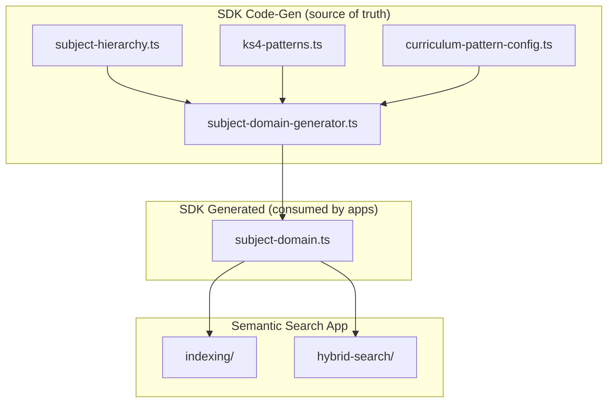

# Subject Domain Model — SDK Architecture

**Status**: 📋 Pending — After Ground Truth Review  
**Parent**: [../roadmap.md](../roadmap.md)  
**Origin**: Cursor plan `subject_domain_model_d08e994f`  
**Created**: 2026-01-22

---

## Problem Statement

Subject-specific knowledge is currently scattered across the app:

- Subject hierarchy (`physics → science`) in `bulk-transform-helpers.ts`
- KS4 patterns in `curriculum-pattern-config.ts` (app-level)
- KS4 fields shared universally as optional arrays

This violates the Cardinal Rule: *All structural knowledge should flow from the SDK at sdk-codegen time.*

---

## Scope

This plan covers **Oak API SDK sdk-codegen** enhancements, NOT the Search SDK. It establishes domain knowledge that other components (including semantic search) consume.

| Component | Location |
|-----------|----------|
| **Source of truth** | `packages/sdks/oak-curriculum-sdk/code-generation/typegen/search/subject-domain/` |
| **Generated output** | `packages/sdks/oak-curriculum-sdk/src/types/generated/search/subject-domain.ts` |
| **Primary consumer** | `apps/oak-search-cli/` |

---

## Architecture Overview



---

## Subject Domain Model Design

### 1. Subject Hierarchy

Only Science currently has sub-subjects. Define as const data structure:

```typescript
// code-generation/typegen/search/subject-domain/subject-hierarchy.ts

export const SUBJECT_HIERARCHY = {
  science: ['biology', 'chemistry', 'physics', 'combined-science'],
} as const;

export const BULK_SUBJECT_VARIANTS = [
  'biology', 'chemistry', 'physics', 'combined-science'
] as const;
```

### 2. KS4 Complexity per Subject

Each subject has a unique KS4 pattern:

| Subject | Tiers | Exam Boards | Exam Subjects | Unit Options |
|---------|-------|-------------|---------------|--------------|
| Science | Yes | Yes | Yes | No |
| Maths | Yes | No | No | No |
| History | No | Yes | No | Yes |
| Art | No | No | No | Yes |
| Cooking | - | - | - | (no KS4) |

Define as:

```typescript
// code-generation/typegen/search/subject-domain/ks4-patterns.ts

export const SUBJECT_KS4_CONFIG = {
  science: { 
    hasTiers: true, 
    hasExamBoards: true, 
    hasExamSubjects: true, 
    hasUnitOptions: false 
  },
  maths: { 
    hasTiers: true, 
    hasExamBoards: false, 
    hasExamSubjects: false, 
    hasUnitOptions: false 
  },
  // ... all 17 subjects
} as const;
```

### 3. Curriculum Pattern Configuration

Move from app to SDK, maintaining same structure but with SDK types:

```typescript
// code-generation/typegen/search/subject-domain/curriculum-pattern-config.ts

export const CURRICULUM_PATTERN_CONFIG = {
  'science:ks4': {
    pattern: 'exam-subject-split',
    combinesWith: ['exam-board-variants', 'tier-variants'],
    traversal: 'sequence-units',
    sequences: ['science-secondary-aqa', 'science-secondary-edexcel', 'science-secondary-ocr'],
  },
  // ... all 68 combinations
} as const;
```

### 4. Generated Output

Generate to `src/types/generated/search/subject-domain.ts`:

- `SubjectParent` type union
- `BulkSubjectVariant` type (the KS4 science variants)
- `BulkSubjectSlug` type (API subjects + bulk variants)
- `deriveSubjectParent(slug)` function with proper typing
- `isKs4ScienceVariant(slug)` type guard
- `getSubjectKs4Config(subject)` helper
- `getPatternConfig(subject, keyStage)` helper
- Subject-specific field applicability types

---

## Key Files

### New Files in SDK

| File | Purpose |
|------|---------|
| `code-generation/typegen/search/subject-domain/subject-hierarchy.ts` | Subject parent-child relationships |
| `code-generation/typegen/search/subject-domain/ks4-patterns.ts` | KS4 complexity per subject |
| `code-generation/typegen/search/subject-domain/curriculum-config.ts` | 68 subject×keystage patterns |
| `code-generation/typegen/search/subject-domain/generator.ts` | Code generator |

### Modified Files

| File | Change |
|------|--------|
| `code-generation/typegen/index.ts` | Export new generator |
| `code-generation/codegen.ts` | Call new generator |
| `apps/oak-search-cli/src/adapters/bulk-transform-helpers.ts` | Import from SDK instead of local definitions |
| `apps/oak-search-cli/src/lib/indexing/curriculum-pattern-config.ts` | Re-export from SDK (then delete) |

---

## Implementation Steps

1. **TDD: Subject hierarchy tests** — parent-child relationships, type guards
2. **TDD: KS4 patterns tests** — field applicability per subject
3. **TDD: Curriculum config tests** — 68 subject×keystage combinations
4. **Implement subject-hierarchy.ts** — const data structures
5. **Implement ks4-patterns.ts** — subject KS4 configuration
6. **Move curriculum-pattern-config.ts** — from app to SDK sdk-codegen
7. **Implement generator.ts** — produce subject-domain.ts output
8. **Wire into codegen.ts** — run `pnpm sdk-codegen -- --ci`
9. **Update app imports** — import from SDK instead of local definitions
10. **Delete app duplicates** — redundant app-level definitions
11. **Quality gates** — type-check, lint, test, build

---

## Quality Gates

After implementation:

```bash
pnpm sdk-codegen -- --ci
pnpm type-check
pnpm lint:fix
pnpm test
pnpm build
```

---

## Benefits

1. **Single source of truth** — Subject domain knowledge in SDK
2. **Type safety** — Compile-time guarantees on subject patterns
3. **Eliminates duplication** — App imports from SDK
4. **Enables future precision** — Subject-specific document validation
5. **Cardinal Rule compliance** — Running `pnpm sdk-codegen` propagates changes

---

## Future Extensions (not in scope)

- Subject-specific ES index mappings
- Subject-aware document validation at ingestion
- Per-subject field optionality in Zod schemas

---

## Related Documents

| Document | Purpose |
|----------|---------|
| [ADR-080](../../../../docs/architecture/architectural-decisions/080-curriculum-data-denormalization-strategy.md) | KS4 denormalisation patterns |
| [ADR-101](../../../../docs/architecture/architectural-decisions/101-subject-hierarchy-for-search-filtering.md) | Subject hierarchy for search |
| [subject-hierarchy-enhancement.md](../archive/completed/subject-hierarchy-enhancement.md) | Prior implementation baseline |
