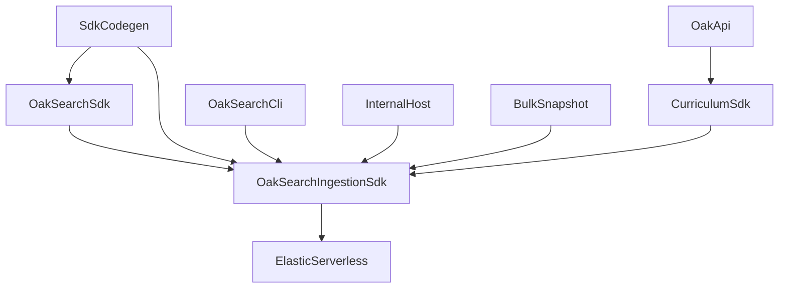

# Search ingestion SDK extraction and thin CLI adoption

**Last Updated**: 2026-03-24  
**Status**: PLANNING  
**Scope**: Introduce a dedicated Oak-specific ingestion SDK and collapse `oak-search-cli` into a thin operator shell while preserving `@oaknational/oak-search-sdk` as the canonical Elasticsearch read/admin SDK.

**Permanent Architecture**: [ADR-140: Search Ingestion SDK Boundary](../../../../docs/architecture/architectural-decisions/140-search-ingestion-sdk-boundary.md)

## Source Strategy

- [@.agent/directives/principles.md](../../directives/principles.md)
- [@.agent/directives/testing-strategy.md](../../directives/testing-strategy.md)
- [@.agent/directives/schema-first-execution.md](../../directives/schema-first-execution.md)
- [ADR-140: Search Ingestion SDK Boundary](../../../../docs/architecture/architectural-decisions/140-search-ingestion-sdk-boundary.md)
- [ADR-108: SDK Workspace Decomposition](../../../../docs/architecture/architectural-decisions/108-sdk-workspace-decomposition.md)
- [ADR-130: Zero-Downtime Blue/Green Elasticsearch Index Swapping](../../../../docs/architecture/architectural-decisions/130-blue-green-index-swapping.md)
- [ADR-133: CLI Resource Lifecycle Management](../../../../docs/architecture/architectural-decisions/133-cli-resource-lifecycle-management.md)
- [ADR-134: Search SDK Capability Surface Boundary](../../../../docs/architecture/architectural-decisions/134-search-sdk-capability-surface-boundary.md)
- [ADR-139: Sequence Semantic Contract and Ownership](../../../../docs/architecture/architectural-decisions/139-sequence-semantic-contract-and-ownership.md)
- [ADR-093: Bulk-First Ingestion Strategy](../../../../docs/architecture/architectural-decisions/093-bulk-first-ingestion-strategy.md)
- [docs/operations/elasticsearch-ingest-lifecycle.md](../../../../docs/operations/elasticsearch-ingest-lifecycle.md)
- [docs/agent-guidance/semantic-search-architecture.md](../../../../docs/agent-guidance/semantic-search-architecture.md)
- [Indexing Module README](../../../../apps/oak-search-cli/src/lib/indexing/README.md)
- [index-lifecycle-management.execution.plan.md](./index-lifecycle-management.execution.plan.md)
- [bulk-canonical-merge-api-parity-and-validation.execution.plan.md](./bulk-canonical-merge-api-parity-and-validation.execution.plan.md)
- [f2-closure-and-p0-ingestion.execution.plan.md](../archive/completed/f2-closure-and-p0-ingestion.execution.plan.md)
- [sdk-workspace-separation.md](../archive/completed/sdk-workspace-separation.md)

## First Question

Could it be simpler without compromising quality?

Yes. The simplest excellent solution is not a new service, a fat CLI, or a search-sdk layering violation. It is a new Oak-specific SDK workspace that owns ingestion runtime, with the CLI reduced to a thin operator interface and `@oaknational/oak-search-sdk` left focused on Elasticsearch concerns only.

## Context

### Problem 1: reusable ingestion runtime still lives inside the app

Today the app owns logic that another host could legitimately need:

- [apps/oak-search-cli/src/lib/indexing/bulk-ingestion.ts](../../../../apps/oak-search-cli/src/lib/indexing/bulk-ingestion.ts)
- [apps/oak-search-cli/src/lib/indexing/run-versioned-ingest.ts](../../../../apps/oak-search-cli/src/lib/indexing/run-versioned-ingest.ts)
- [apps/oak-search-cli/src/lib/elasticsearch/setup/ingest-client-factory.ts](../../../../apps/oak-search-cli/src/lib/elasticsearch/setup/ingest-client-factory.ts)
- [apps/oak-search-cli/src/adapters/oak-adapter.ts](../../../../apps/oak-search-cli/src/adapters/oak-adapter.ts)
- [apps/oak-search-cli/src/adapters/api-supplementation.ts](../../../../apps/oak-search-cli/src/adapters/api-supplementation.ts)
- [apps/oak-search-cli/src/adapters/category-supplementation.ts](../../../../apps/oak-search-cli/src/adapters/category-supplementation.ts)

This conflicts with [@.agent/rules/apps-are-thin-interfaces.md](../../rules/apps-are-thin-interfaces.md), which requires reusable domain logic to live in packages rather than apps.

### Problem 2: the obvious destination is forbidden

It would be tempting to push this code into `@oaknational/oak-search-sdk`, but [ADR-108](../../../../docs/architecture/architectural-decisions/108-sdk-workspace-decomposition.md) explicitly keeps `@oaknational/oak-search-sdk` independent from `@oaknational/curriculum-sdk`. The ingestion runtime currently needs Oak API access and supplementation, so moving it into search-sdk would violate a live architectural invariant.

### Problem 3: another internal consumer needs a supported provisioning path

The concrete user need is:

1. get the bulk data
2. process and enrich it
3. upload it into an existing Elasticsearch Serverless project that has not yet been configured for Oak search
4. run stable commands against that instance for validation and promotion

That consumer should not have to import CLI internals or reconstruct the ingestion pipeline by reading app code.

### Current boundary state

| Concern | Current owner | Correct long-term owner |
|---|---|---|
| Generated bulk readers, search types, mappings, vocab | `@oaknational/sdk-codegen` | unchanged |
| Oak API client and runtime access | `@oaknational/curriculum-sdk` | unchanged |
| Elasticsearch retrieval, admin primitives, alias lifecycle, lease handling | `@oaknational/oak-search-sdk` | unchanged |
| Bulk acquisition, API supplementation orchestration, document preparation, bulk upload orchestration | `apps/oak-search-cli` | new ingestion SDK |
| Env parsing, CLI flags, human output, exit codes | `apps/oak-search-cli` | unchanged, but thinner |

## Decision

Create a new SDK workspace:

- `packages/sdks/oak-search-ingestion-sdk/`

with the package identity:

- `@oaknational/oak-search-ingestion-sdk`

This SDK will be the Oak-specific runtime composition layer for ingestion. It will depend on:

- `@oaknational/sdk-codegen` for generated bulk/search artefacts
- `@oaknational/curriculum-sdk` for Oak API access
- `@oaknational/oak-search-sdk/admin` for Elasticsearch-native lifecycle and admin primitives
- the shared support packages required for logging, result handling, and types

`apps/oak-search-cli` will remain the canonical operator shell, but only as a thin interface over the new SDK and the existing search SDK.

## Distribution Strategy

- The package is **private first**, distributed internally (for example via GitHub Packages).
- The package must be designed so it can become public later without a second boundary rewrite.
- Therefore the initial stable API must be intentionally narrow, explicit, and future-public-ready: no deep imports, no opportunistic exports of internal phase modules, and no CLI-internal dependencies.
- Even while private, the exported surface should be treated as semver-governed so future publication does not require a contract reset.

## Why This Boundary Is Correct

### Why not keep the logic in the CLI?

- It violates the thin-app rule.
- It traps reusable operator capability inside an app.
- It forces future consumers either to duplicate logic or depend on app internals.

### Why not move it into `@oaknational/oak-search-sdk`?

- [ADR-108](../../../../docs/architecture/architectural-decisions/108-sdk-workspace-decomposition.md) forbids the `search-sdk -> curriculum-sdk` dependency.
- `@oaknational/oak-search-sdk` is intentionally Elasticsearch-scoped.
- Keeping search-sdk clean preserves the boundary already enforced by [ADR-134](../../../../docs/architecture/architectural-decisions/134-search-sdk-capability-surface-boundary.md).

### Why a new SDK workspace instead of a library workspace?

- This is an Oak-specific runtime surface consumed by apps and potentially other internal hosts.
- It composes multiple domain-level packages into a stable API.
- It belongs conceptually with the other SDK workspaces under `packages/sdks/`.

## Target Architecture



## Target Public Contract

The new package must start with a deliberately **small** stable surface:

- one high-level ingestion service/factory for supported host composition
- one lifecycle-compatible adapter surface, if required, to satisfy `IndexLifecycleDeps['runVersionedIngest']`
- boundary methods that return `Result<...>` and preserve error cause chains

The following runtime internals remain **package-private** unless a later ADR proves they need direct consumers:

- bulk loaders and snapshot validators
- Oak API supplementation helpers
- document builders and preparation phases
- bulk upload coordinators
- retry, pacing, and backpressure modules

The new package must **not** re-export, shadow, or duplicate existing `@oaknational/oak-search-sdk/read` or `@oaknational/oak-search-sdk/admin` capabilities.

## Operator Command Contract And Ownership

The CLI must preserve the full current admin/search operator surface, with explicit ownership:

| CLI command or group | Long-term owner | Notes |
|---|---|---|
| `oaksearch admin download` | `@oaknational/oak-search-ingestion-sdk` via CLI shell | Supported high-level ingestion concern |
| `oaksearch admin stage` | ingestion SDK + `@oaknational/oak-search-sdk/admin` | Ingestion SDK provides safe ingest composition; search SDK retains lifecycle primitives |
| `oaksearch admin versioned-ingest` | ingestion SDK + `@oaknational/oak-search-sdk/admin` | Same ownership split as `stage` |
| `oaksearch admin setup` | `@oaknational/oak-search-sdk/admin` via CLI shell | Must not be duplicated in ingestion SDK |
| `oaksearch admin status` | `@oaknational/oak-search-sdk/admin` via CLI shell | Must not be duplicated in ingestion SDK |
| `oaksearch admin synonyms` | `@oaknational/oak-search-sdk/admin` via CLI shell | Must not be duplicated in ingestion SDK |
| `oaksearch admin meta` | `@oaknational/oak-search-sdk/admin` via CLI shell | Must not be duplicated in ingestion SDK |
| `oaksearch admin count` | `@oaknational/oak-search-sdk/admin` via CLI shell | Live parent-document validation only |
| `oaksearch admin promote` | `@oaknational/oak-search-sdk/admin` via CLI shell | Mutating alias transition; lease/coherence invariants remain mandatory |
| `oaksearch admin rollback` | `@oaknational/oak-search-sdk/admin` via CLI shell | Mutating alias transition; lease/coherence invariants remain mandatory |
| `oaksearch admin validate-aliases` | `@oaknational/oak-search-sdk/admin` via CLI shell | Alias topology validation only |
| `oaksearch admin inspect-lease` | `@oaknational/oak-search-sdk/admin` via CLI shell | Must not be duplicated in ingestion SDK |
| `oaksearch admin release-lease` | `@oaknational/oak-search-sdk/admin` via CLI shell | Must not be duplicated in ingestion SDK |
| `oaksearch admin delete-version` | `@oaknational/oak-search-sdk/admin` via CLI shell | Must not be duplicated in ingestion SDK |
| `oaksearch admin list-orphans` | `@oaknational/oak-search-sdk/admin` via CLI shell | Must not be duplicated in ingestion SDK |
| `oaksearch admin cleanup-orphans` | `@oaknational/oak-search-sdk/admin` via CLI shell | Must not be duplicated in ingestion SDK |
| `oaksearch admin verify` | CLI orchestration utility for now | Explicitly out of ingestion-SDK public-surface scope unless later proven reusable |
| `oaksearch admin sandbox-ingest` | CLI orchestration utility for now | Explicitly out of ingestion-SDK public-surface scope unless later proven reusable |
| `oaksearch admin cache-reset` | CLI orchestration utility for now | Explicitly out of ingestion-SDK public-surface scope unless later proven reusable |
| `oaksearch admin diagnose-elser` | CLI orchestration utility for now | Explicitly out of ingestion-SDK public-surface scope unless later proven reusable |
| `oaksearch admin analyze-elser` | CLI orchestration utility for now | Explicitly out of ingestion-SDK public-surface scope unless later proven reusable |
| `oaksearch search ...` | `@oaknational/oak-search-sdk/read` via CLI shell | Smoke validation path only |

## Elasticsearch And Lifecycle Invariants

The extracted architecture must preserve the current Elasticsearch safety model as a **contract**, not as an implementation detail:

1. **Existing project prerequisite**: the supported path bootstraps Oak search inside an **existing** Elasticsearch Serverless project; it does not create or manage the project itself.
2. **Lease safety**: supported mutating lifecycle operations must preserve lifecycle leasing. Hosts must not bypass `withLifecycleLease(...)` or any successor invariant.
3. **Metadata/alias coherence**: supported promote/rollback/ingest flows must preserve the coherence checks already enforced by the lifecycle layer before mutation.
4. **Validation semantics**:
   - `validate-aliases` proves alias topology only
   - `admin count` proves live parent-document counts only
   - staged versions require stage output evidence plus field-readback audit before promotion
5. **ELSER/backpressure envelope**: the new SDK must preserve the current bulk upload retry, pacing, and item-level failure semantics unless a later ADR explicitly replaces them with a re-proven envelope.
6. **Blue/green storage precondition**: supported adoption documentation must include capacity/sizing evidence for double-storage periods during blue/green ingest.
7. **Supported host path**: non-CLI consumers must use the package-supplied high-level service/factory for mutating ingestion flows; ad hoc composition of raw lifecycle primitives is unsupported.

## Non-goals

- Publishing any package to npm as part of this plan.
- Provisioning or creating Elasticsearch Serverless projects themselves.
- Introducing a hosted search service or new HTTP runtime.
- Creating long-lived compatibility shims in `apps/oak-search-cli/src/lib/indexing/**`.
- Moving generated code or bulk readers out of `@oaknational/sdk-codegen`.
- Moving Elasticsearch-native lifecycle primitives out of `@oaknational/oak-search-sdk/admin`.
- Re-exporting low-level ingestion phase modules as stable public API without a later ADR proving the need.
- Reworking search ranking or retrieval behaviour unless required by boundary moves.

## Sequencing Constraints

This plan overlaps with active work in:

- [index-lifecycle-management.execution.plan.md](./index-lifecycle-management.execution.plan.md)
- [bulk-canonical-merge-api-parity-and-validation.execution.plan.md](./bulk-canonical-merge-api-parity-and-validation.execution.plan.md)
- [f2-closure-and-p0-ingestion.execution.plan.md](../archive/completed/f2-closure-and-p0-ingestion.execution.plan.md)

The extraction work must begin with an explicit overlap audit so that:

- uncommitted lifecycle changes are not stranded in app-local files that are about to move
- the canonical bulk-merge and API-parity work lands on the new boundary rather than being implemented twice
- the new package boundary becomes the destination for any remaining ingestion fixes still in flight

## Quality Gate Strategy

After each completed phase, run the full sequence one gate at a time from repo root:

```bash
pnpm sdk-codegen
pnpm build
pnpm type-check
pnpm doc-gen
pnpm lint:fix
pnpm format:root
pnpm markdownlint:root
pnpm test
pnpm test:e2e
pnpm test:ui
pnpm smoke:dev:stub
```

Rationale: this work crosses package boundaries, CLI surfaces, docs, and generated-type consumers. Filtered verification would hide regressions.

## Resolution Plan

### Phase 0: Lock architecture, boundary, and sequencing

#### Task 0.1: Create the boundary ADR and same-phase amendments

Write one primary ADR for the new workspace boundary, and in the same phase amend the already-accepted ADRs whose ownership tables would otherwise become stale.

Acceptance criteria:

1. The new workspace is named and placed under `packages/sdks/`.
2. The decision explicitly preserves the `search-sdk -> curriculum-sdk` prohibition from [ADR-108](../../../../docs/architecture/architectural-decisions/108-sdk-workspace-decomposition.md).
3. Ownership shifts are recorded for the ingestion runtime currently trapped in the CLI.
4. [ADR-134](../../../../docs/architecture/architectural-decisions/134-search-sdk-capability-surface-boundary.md) is amended in the same phase so its ownership matrix, evidence bullets, and fitness rules no longer point at the old CLI-owned ingestion tree.
5. [ADR-139](../../../../docs/architecture/architectural-decisions/139-sequence-semantic-contract-and-ownership.md) is amended in the same phase so `sequence_semantic` production ownership is not stale while code is moving.
6. [ADR-093](../../../../docs/architecture/architectural-decisions/093-bulk-first-ingestion-strategy.md) and [ADR-133](../../../../docs/architecture/architectural-decisions/133-cli-resource-lifecycle-management.md) are updated, or explicitly recorded as no-change with rationale, before implementation proceeds.
7. The decision references [ADR-130](../../../../docs/architecture/architectural-decisions/130-blue-green-index-swapping.md), [ADR-134](../../../../docs/architecture/architectural-decisions/134-search-sdk-capability-surface-boundary.md), and [ADR-139](../../../../docs/architecture/architectural-decisions/139-sequence-semantic-contract-and-ownership.md).

#### Task 0.2: Define the package surface

Specify the public API groups for the new SDK before moving code.

Acceptance criteria:

1. The package exposes a small stable public surface: one high-level service/factory plus one lifecycle adapter only if needed.
2. Internal phase modules are explicitly private by default.
3. Boundary methods are specified to use the `Result` pattern and preserve cause chains.
4. The CLI command contract and owner of every current admin/search command is listed explicitly.
5. No required workflow remains dependent on app-private modules.

#### Task 0.3: Reconcile overlapping active plans

Produce an overlap register for files and responsibilities shared with the existing active plans.

Acceptance criteria:

1. Every currently active ingestion-related plan is linked and its overlap is described.
2. Code-movement tasks are sequenced after unresolved overlapping edits are reconciled.
3. There is one explicit destination boundary for in-flight ingestion fixes: the new SDK, not the CLI.

#### Task 0.4: Lock the post-extraction import matrix and lint strategy

Define the enforceable import matrix before writing RED tests.

Acceptance criteria:

1. `@oaknational/oak-search-sdk` forbidden imports remain explicit.
2. `@oaknational/oak-search-ingestion-sdk` allowed imports are defined explicitly.
3. CLI ingestion/admin files are limited to package-surface imports after extraction.
4. The location of lint fixtures, ESLint rules, and boundary tests is defined for the post-extraction tree.
5. Any path-based bans that only become valid after the package exists are sequenced accordingly.

### Phase 1: RED - write failing boundary and behaviour tests

#### Task 1.1: Add package-boundary tests

Add failing tests and lint rules proving the target boundary defined in Phase 0.

Acceptance criteria:

1. `@oaknational/oak-search-sdk` still cannot import `@oaknational/curriculum-sdk`.
2. `@oaknational/oak-search-ingestion-sdk` is allowed to depend only on the approved package graph and approved subpath imports.
3. The CLI boundary is defined in enforceable terms: ingestion/admin shells may import package surfaces only, not reusable app-local ingestion runtime.
4. The new SDK package surface is tested through declared exports only.
5. No deep-import or compatibility-layer loophole is left open.

Deterministic validation:

```bash
pnpm type-check
pnpm lint
pnpm test
```

Note: RED-phase validation intentionally uses `pnpm lint` rather than `pnpm lint:fix` so failures are observed without mutating the tree.

Expected: new boundary tests fail before implementation because the target package and wiring do not yet exist.

#### Task 1.2: Move existing ingestion behaviour into failing tests

Port or recreate the key behavioural coverage currently rooted in the CLI:

- `bulk-ingestion.integration.test.ts`
- `run-versioned-ingest.integration.test.ts`
- document-builder tests that prove preparation correctness
- lifecycle command tests that prove the CLI is only a wrapper

Acceptance criteria:

1. Existing ingestion behaviour is specified independently of the CLI implementation location.
2. CLI tests prove env parsing, command registration, and output handling rather than domain logic.
3. Tests explicitly pin lease wrapping, metadata/alias coherence expectations, staged validation semantics, and ELSER retry/backpressure behaviour.
4. The RED suite fails for the right reason: missing package and missing rewiring, not undefined future behaviour.

### Phase 2: GREEN - create the ingestion SDK and move runtime logic

#### Task 2.1: Create the workspace skeleton

Create `packages/sdks/oak-search-ingestion-sdk/` with package metadata, exports, build/test/lint scripts, and README.

Acceptance criteria:

1. The workspace builds independently through Turbo.
2. The package exports are explicit, narrow, and future-public-ready.
3. The package is configured for private distribution first.
4. The package is registered as a first-class workspace and wired into the repo build/test graph.
5. Dependencies are limited to the allowed package graph.

#### Task 2.2: Move ingestion orchestration into the new SDK

Move reusable runtime logic out of the app and into the new workspace, including:

- bulk preparation orchestration
- upload orchestration and retry coordination
- Oak ingestion client creation
- API supplementation orchestration
- lifecycle-compatible `runVersionedIngest`

Acceptance criteria:

1. Reusable "get data, process it, upload it" logic is no longer owned by `apps/oak-search-cli`.
2. The new SDK is the only runtime owner of that logic.
3. The new SDK preserves the current ELSER retry, pacing, and item-level failure semantics unless replaced by an ADR-backed alternative.
4. No long-lived re-export or forwarding layer remains in the app.

#### Task 2.3: Keep the stable public API intentionally small

Promote only the high-level service/factory surface to package exports. Keep loaders, supplementers, builders, uploaders, and phase orchestration private.

Acceptance criteria:

1. Consumers can perform supported ingestion through a small stable facade.
2. Internal modules are not exported just because they are convenient during migration.
3. The package does not become a second monolith of stable low-level APIs.

#### Task 2.4: Move document-build ownership where required

Re-home any search index document builders that belong to ingestion runtime rather than app presentation.

Acceptance criteria:

1. Ownership of document preparation aligns with the new package boundary.
2. Generated types remain sourced from `@oaknational/sdk-codegen`.
3. Any ownership change required by [ADR-139](../../../../docs/architecture/architectural-decisions/139-sequence-semantic-contract-and-ownership.md) is captured in the same-phase ADR updates, not deferred.

### Phase 3: GREEN - collapse the CLI into a thin operator shell

#### Task 3.1: Rewire admin commands to package APIs

Refactor the CLI so it performs only:

- validated env loading
- file path resolution
- command parsing
- SDK composition
- output rendering
- exit code handling

The concrete file paths below are initial anchors only. If overlap work or preceding refactors move or rename those files, the Phase 0 overlap register must refresh these references before implementation proceeds.

Acceptance criteria:

1. `admin-lifecycle-commands.ts` no longer assembles reusable ingestion logic itself.
2. `apps/oak-search-cli/src/cli/admin/shared/build-lifecycle-service.ts` no longer buries reusable ingestion assembly in the app.
3. `apps/oak-search-cli/src/cli/admin/admin-orchestration-commands.ts` is reconciled against the explicit command ownership matrix.
4. The CLI imports the new ingestion SDK rather than app-local ingestion modules.
5. The command surface remains stable for operators.

#### Task 3.2: Provide the internal-consumer adoption path

Create a supported reuse path for another internal project to bootstrap and operate Oak search inside its own existing Elasticsearch Serverless project.

Acceptance criteria:

1. A non-CLI host can compose the new SDK directly, but only through the package-supplied high-level service/factory for mutating ingest flows.
2. The CLI remains the canonical operator interface for humans.
3. The supported operational flow covers the full owned command inventory or explicitly documents any CLI-only utilities still out of scope.
4. The validation recipe is explicit: alias topology, live parent-doc counts, staged field-readback audit, and smoke queries are distinguished and sequenced correctly.
5. Capacity/sizing preconditions for blue/green storage are documented for adopters.

Deterministic validation:

```bash
pnpm test
pnpm test:e2e
```

Expected: CLI and programmatic-host coverage both pass against the new boundary.

### Phase 4: REFACTOR - docs, ADRs, gates, and evidence

#### Task 4.1: Update permanent non-ADR architecture documents

Update the non-ADR documentation surfaces to reflect the new package boundary after the Phase 0 ADR work is complete:

- [apps/oak-search-cli/docs/ARCHITECTURE.md](../../../../apps/oak-search-cli/docs/ARCHITECTURE.md)
- [apps/oak-search-cli/docs/INDEXING.md](../../../../apps/oak-search-cli/docs/INDEXING.md)
- [docs/operations/elasticsearch-ingest-lifecycle.md](../../../../docs/operations/elasticsearch-ingest-lifecycle.md)
- [docs/agent-guidance/semantic-search-architecture.md](../../../../docs/agent-guidance/semantic-search-architecture.md)
- the new SDK README

Acceptance criteria:

1. Ownership language is consistent across ADRs and workspace docs.
2. The CLI is described as a thin shell.
3. The new SDK is documented as the supported ingestion runtime for internal consumers.

#### Task 4.2: Synchronise plan and prompt discoverability

After implementation begins, update the collection navigation surfaces that were intentionally left untouched in this planning-only file creation turn.

Acceptance criteria:

1. `active/README.md` includes this plan.
2. Any affected prompt or collection index points at the correct active authority.
3. No stale references remain to app-local ingestion ownership once the package exists.

#### Task 4.3: Run full gates and specialist review

Invoke the full gate sequence and specialist reviewers after implementation.

Required reviewers:

- `architecture-reviewer-barney`
- `architecture-reviewer-betty`
- `architecture-reviewer-fred`
- `architecture-reviewer-wilma`
- `code-reviewer`
- `test-reviewer`
- `type-reviewer`
- `elasticsearch-reviewer`
- `security-reviewer`
- `docs-adr-reviewer`

Acceptance criteria:

1. All quality gates pass.
2. Reviewer findings are implemented or explicitly disproven.
3. No unresolved boundary violation remains.

## Testing Strategy

### Unit

- pure boundary helpers and package surface helpers in the new SDK
- document preparation helpers after extraction
- lifecycle composition helpers that remain pure

### Integration

- bulk preparation and upload orchestration in the new SDK
- lifecycle-compatible `runVersionedIngest`
- lease and metadata/alias coherence behaviour through the supported host path
- validation semantics that distinguish alias topology, live counts, and staged readback
- CLI command registration and output over mocked package surfaces
- boundary/lint enforcement for the new workspace graph
- retry/backpressure invariants for ELSER-heavy bulk upload

### E2E

- CLI command flows against a controlled ES test target
- smoke verification that an existing ES project can be configured, staged, validated, promoted, and queried through the preserved command surface

## Risks and Mitigations

| Risk | Mitigation |
|---|---|
| The new SDK becomes a dumping ground for mixed concerns | Lock package ownership in ADR before code moves; keep ES lifecycle in `oak-search-sdk` and generated artefacts in `sdk-codegen` |
| The new SDK exports too many low-level modules too early | Start with one high-level stable service/factory and keep phase modules private until a later ADR proves broader demand |
| Existing active ingestion fixes land on the wrong side of the boundary during migration | Start with overlap audit and rebase discipline in Phase 0 |
| Search SDK accidentally regains a curriculum-sdk dependency | Add explicit RED boundary tests before any package movement |
| A compatibility layer survives in the CLI because it is convenient | Make deletion of app-local reusable ingestion modules part of GREEN acceptance |
| Internal consumers still need CLI internals | Provide direct SDK composition and preserve the stable operator command contract |
| Non-CLI hosts bypass lease or coherence guards | Make the safe host path part of the package contract and test it explicitly |
| Validation is reduced to alias checks or smoke queries | Freeze the multi-step validation recipe in the package and docs |
| Future public release would require another boundary rewrite | Keep the package private first but design the stable API as future-public-ready from day one |

## Success Criteria

### Boundary

- Reusable ingestion/runtime logic no longer lives in `apps/oak-search-cli`.
- `@oaknational/oak-search-sdk` remains Elasticsearch-scoped and independent of `@oaknational/curriculum-sdk`.
- `@oaknational/oak-search-ingestion-sdk` is the canonical owner of Oak-specific ingestion runtime.
- The new ingestion SDK exports a deliberately small stable surface and keeps phase modules private.

### Operator experience

- `oaksearch` remains the reference human-facing bootstrap and operations tool.
- The full current command inventory has explicit ownership and remains stable or is intentionally deprecated via ADR-backed decision.

### Internal reuse

- Another internal host can compose the new SDK directly without importing app internals.
- The supported path for operating Oak search inside an existing Elasticsearch Serverless project is documented and test-backed.
- The package is private first and future-public-ready without promising publication in this plan.

### Documentation

- ADRs, READMEs, and plan surfaces all describe the same boundary and adoption path.

## References

- [@.agent/directives/principles.md](../../directives/principles.md)
- [@.agent/directives/testing-strategy.md](../../directives/testing-strategy.md)
- [@.agent/directives/schema-first-execution.md](../../directives/schema-first-execution.md)
- [@.agent/rules/apps-are-thin-interfaces.md](../../rules/apps-are-thin-interfaces.md)
- [ADR-108: SDK Workspace Decomposition](../../../../docs/architecture/architectural-decisions/108-sdk-workspace-decomposition.md)
- [ADR-130: Zero-Downtime Blue/Green Elasticsearch Index Swapping](../../../../docs/architecture/architectural-decisions/130-blue-green-index-swapping.md)
- [ADR-133: CLI Resource Lifecycle Management](../../../../docs/architecture/architectural-decisions/133-cli-resource-lifecycle-management.md)
- [ADR-134: Search SDK Capability Surface Boundary](../../../../docs/architecture/architectural-decisions/134-search-sdk-capability-surface-boundary.md)
- [ADR-139: Sequence Semantic Contract and Ownership](../../../../docs/architecture/architectural-decisions/139-sequence-semantic-contract-and-ownership.md)
- [ADR-093: Bulk-First Ingestion Strategy](../../../../docs/architecture/architectural-decisions/093-bulk-first-ingestion-strategy.md)
- [docs/operations/elasticsearch-ingest-lifecycle.md](../../../../docs/operations/elasticsearch-ingest-lifecycle.md)
- [docs/agent-guidance/semantic-search-architecture.md](../../../../docs/agent-guidance/semantic-search-architecture.md)
- [Indexing Module README](../../../../apps/oak-search-cli/src/lib/indexing/README.md)
- [sdk-workspace-separation.md](../archive/completed/sdk-workspace-separation.md)
