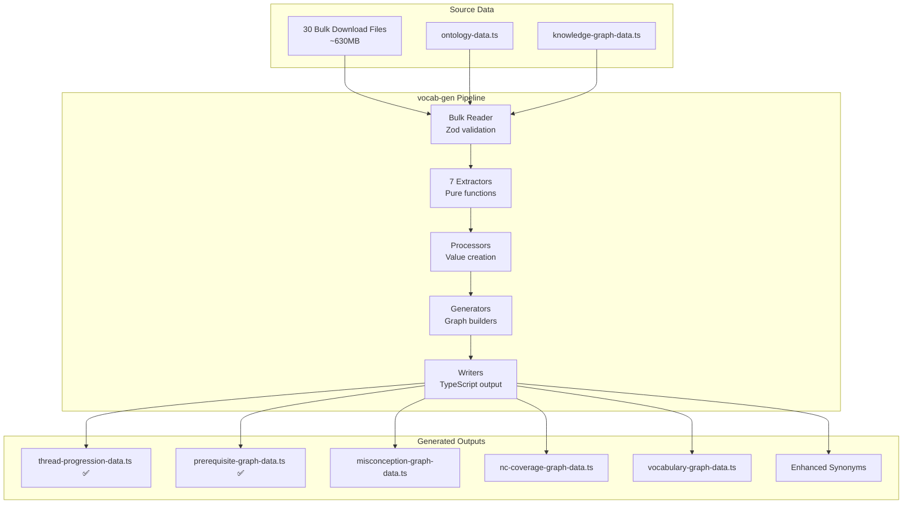

# Sub-Plan 02b: Comprehensive Curriculum Vocabulary Mining

**Status**: 🔄 IN PROGRESS — Extraction complete, graph data generated, ES indexing pending  
**Priority**: HIGH — User value through positive impact  
**Parent**: [README.md](README.md)  
**Prerequisite**: [02a-synonym-architecture.md](02a-synonym-architecture.md) ✅ COMPLETE  
**Created**: 2025-12-24  
**Last Updated**: 2025-12-26

---

> **Note**: MCP tool integration has been deferred to [08-mcp-graph-tools.md](08-mcp-graph-tools.md).
> This plan focuses on search implementation: extraction, graph generation, and ES indexing.

---

## 🎯 Purpose: User Value Through Impact

**This work exists to enhance the usefulness of search results for multiple audiences.**

We are NOT here to count keywords or celebrate extraction metrics. We are here to create positive impact for:

| Persona | What They Need | How We Help |
|---------|----------------|-------------|
| **Student** | Clear definitions, learning paths | Glossary, thread progressions |
| **Teacher** | Vocabulary to introduce, mistakes to address | Keywords, misconceptions |
| **School Leader** | Curriculum coverage, progression planning | NC statements, prerequisite graphs |
| **Curriculum Planner** | Cross-subject vocabulary, dependency chains | Relationship graphs |
| **Parent (Homeschool)** | Clear structure, what comes next | Thread progressions, prerequisites |
| **Adult Learner** | Context-appropriate explanations, flexible paths | Curated vocabulary, learning paths |

### Success = Measurable User Impact

Success is NOT "13K keywords extracted." Success is:

- Search MRR improvement on vocabulary queries
- AI agents correctly answering "What comes before X?"
- Teachers finding relevant misconceptions for their lessons
- Students getting clear definitions when they need them

---

## Pipeline Architecture: Extraction → Processing → Impact

The vocabulary mining pipeline is **multi-step by design**:

```
┌─────────────────────────────────────────────────────────────────────────────┐
│ STEP 1: EXTRACTION (Exploratory)                                             │
│ ─────────────────────────────────                                            │
│ Mine EVERYTHING from bulk data. We don't know what will be useful yet.      │
│ Keywords, phrases, relationships (implicit & explicit), progressions.        │
│ This step is speculative — capture broadly, decide value later.              │
└─────────────────────────────────────────────────────────────────────────────┘
                                      ↓
┌─────────────────────────────────────────────────────────────────────────────┐
│ STEP 2: PROCESSING (Value Creation)                                          │
│ ────────────────────────────────────                                         │
│ Transform raw extracted data into user-valuable structures:                  │
│ • Curate high-value terms from raw keywords                                  │
│ • Build prerequisite graphs from prior knowledge                             │
│ • Cluster misconceptions by topic                                            │
│ • Extract implicit relationships from definitions                            │
│ • Mine synonyms from "also known as" patterns                                │
└─────────────────────────────────────────────────────────────────────────────┘
                                      ↓
┌─────────────────────────────────────────────────────────────────────────────┐
│ STEP 3: OUTPUT (User-Facing Impact)                                          │
│ ───────────────────────────────────                                          │
│ Generate structures that directly serve user needs:                          │
│ • Static graph data files (used by search and MCP tools)                     │
│ • Elasticsearch indexes for search (glossary, misconceptions)                │
│ • Synonym sets for query expansion                                           │
│ • Analysis reports for curriculum planning                                   │
│                                                                               │
│ Note: MCP tool integration deferred to 08-mcp-graph-tools.md                 │
└─────────────────────────────────────────────────────────────────────────────┘
```

**Key insight**: Extraction is speculative. We mine broadly because we don't yet know what will create the most value. Processing and output steps are where we make deliberate choices about what serves users best.

### Architecture Diagram



---

## 🚀 Implementation Progress (2025-12-25)

### What's Complete

| Component | Status | User Value |
|-----------|--------|------------|
| Pipeline infrastructure | ✅ COMPLETE | Foundation for all extraction |
| Bulk reader with Zod validation | ✅ COMPLETE | Robust data quality handling |
| CLI with `--dry-run` flag | ✅ COMPLETE | Safe iteration |
| **7 Extractors** | ✅ COMPLETE | Raw data for processing |
| **Thread Progression Generator** | ✅ COMPLETE | "What's the learning path?" |
| **Thread MCP Tool** | ✅ COMPLETE | `get-thread-progressions` for AI agents |

### Extracted Data (Raw Material)

These counts are informational, not success metrics. The raw data enables processing:

```bash
$ pnpm vocab-gen --dry-run

Files processed: 30
Source data: 12,783 lessons, 1,663 units

Extracted data (raw, for processing):
  Keywords with definitions     ← Enables glossary, synonym mining
  Misconceptions with responses ← Enables teacher guidance, AI tutoring
  Learning points               ← Enables outcome mapping
  Teacher tips                  ← Enables pedagogical guidance
  Prior knowledge requirements  ← Enables prerequisite graphs
  NC statements                 ← Enables curriculum coverage
  Thread progressions           ← ✅ GENERATED: thread-progression-data.ts
```

### What's In Progress

| Component | Status | User Need It Serves |
|-----------|--------|---------------------|
| **Prerequisite Generator** | 🔄 Next | "What should I know before this?" |
| **Misconception Generator** | 📋 Planned | "What mistakes should I watch for?" |
| **Vocabulary Processing** | 📋 Planned | Curated terms, synonym mining |
| **NC Coverage Generator** | 📋 Planned | "Which NC statements does this cover?" |

### Generated Outputs

**Graph Data Files (This Plan)**:

| Output | Status | Location |
|--------|--------|----------|
| `thread-progression-data.ts` | ✅ GENERATED | `src/mcp/` |
| `prerequisite-graph-data.ts` | ✅ GENERATED | `src/mcp/` (1601 units, 3408 edges) |
| `misconception-graph-data.ts` | 📋 Pending | `src/mcp/` |
| `vocabulary-graph-data.ts` | 📋 Pending | `src/mcp/` |

**MCP Tools (Deferred to [08-mcp-graph-tools.md](08-mcp-graph-tools.md))**:

| Tool | Status |
|------|--------|
| `get-thread-progressions` | ✅ COMPLETE |
| `get-prerequisite-graph` | ✅ COMPLETE |
| `get-misconception-graph` | 📋 Deferred |
| `get-vocabulary-graph` | 📋 Deferred |
| `get-nc-coverage-graph` | 📋 Deferred |

### Generator Directory Structure

```
vocab-gen/generators/
├── thread-progression-generator.ts   ← ✅ COMPLETE
├── write-graph-file.ts               ← ✅ COMPLETE (shared utility)
├── index.ts                          ← ✅ COMPLETE
├── prerequisite-graph-generator.ts   ← Next priority
├── misconception-graph-generator.ts  ← Planned
├── vocabulary-processor.ts           ← Planned (curates from raw keywords)
├── synonym-miner.ts                  ← Planned (extracts from definitions)
└── nc-coverage-generator.ts          ← Planned
```

### Current File Structure

```
packages/sdks/oak-curriculum-sdk/vocab-gen/
├── run-vocab-gen.ts              ← CLI entry point
├── vocab-gen.ts                  ← Pipeline orchestrator
├── vocab-gen-core.ts             ← Core processing (testable, no IO)
├── vocab-gen-format.ts           ← Output formatting
├── lib/
│   ├── bulk-reader.ts            ← Reads 30 files with validation
│   ├── bulk-file-schema.ts       ← Top-level Zod schema
│   ├── lesson-schema.ts          ← Lesson record schema
│   ├── unit-schemas.ts           ← Unit record schemas
│   ├── vocabulary-schemas.ts     ← Keyword, misconception schemas
│   ├── content-guidance-schema.ts
│   └── index.ts
├── extractors/
│   ├── keyword-extractor.ts      ← Returns ExtractedKeyword[]
│   ├── misconception-extractor.ts
│   ├── learning-point-extractor.ts
│   ├── teacher-tip-extractor.ts
│   ├── prior-knowledge-extractor.ts
│   ├── nc-statement-extractor.ts
│   ├── thread-extractor.ts
│   └── index.ts
└── generators/
    ├── thread-progression-generator.ts   ← ✅ COMPLETE
    ├── write-graph-file.ts               ← ✅ Shared serialisation utility
    └── index.ts
```

### Data Quality Issues Resolved

| Issue | Solution Implemented |
|-------|---------------------|
| `"NULL"` sentinel strings | Zod transforms to `undefined` |
| `contentGuidance` complex array | Custom schema with supervision levels |
| `whyThisWhyNow` sometimes undefined | Optional field in schema |
| `year` as "All years" for PE swimming | Union type: `number \| "All years"` |
| Empty `teacherTip` strings | Filtered in extractor |
| Maths-secondary tier variants | Merged by unitSlug (tier-agnostic) |

---

## Executive Summary

Oak National Academy's bulk download data contains **unique, structured educational content** that can transform how people learn and teach. The opportunity is not the raw data itself, but what we can build from it:

| User Need | Data Source | What We Build |
|-----------|-------------|---------------|
| "What does X mean?" | Keywords with definitions | Curated glossary, synonym expansion |
| "What mistakes should I watch for?" | Misconceptions with responses | Teacher guidance, AI tutoring support |
| "What's the learning path?" | Threads, prior knowledge | Prerequisite graphs, progression data |
| "Does this cover the NC?" | NC statements | Curriculum coverage maps |
| "What should I teach?" | Learning points, teacher tips | Pedagogical vocabulary, guidance |

**The opportunity**: No other organisation has this breadth and depth of structured educational content. By mining everything and processing it into user-valuable structures, we can enable experiences that weren't previously possible.

---

## 🔄 Core Principle: Fully Repeatable Pipeline

**CRITICAL REQUIREMENT**: The entire vocabulary mining process MUST be repeatable and automated.

```bash
# Single command to regenerate ALL vocabulary artefacts
pnpm vocab-gen
```

### What This Command Does

1. **Reads** all 30 bulk download files from `reference/bulk_download_data/`
2. **Extracts** vocabulary, misconceptions, prerequisites, NC statements, etc.
3. **Generates** static graph data files in the SDK:
   - `prerequisite-graph-data.ts`
   - `misconception-graph-data.ts`
   - `nc-coverage-graph-data.ts`
   - `vocabulary-graph-data.ts`
   - `thread-progression-data.ts`
4. **Exports** Elasticsearch index definitions and ingestion scripts
5. **Updates** synonym sets with mined vocabulary
6. **Produces** analysis reports (coverage, frequency, cross-subject terms)

### Pipeline Properties

| Property | Requirement |
|----------|-------------|
| **Idempotent** | Same input → same output (deterministic) |
| **Incremental** | Can detect unchanged files and skip processing |
| **Logged** | Full audit trail of what was processed |
| **Validated** | Output validated against Zod schemas |
| **Versioned** | Generated files include source data version |

### Integration with Existing Tooling

```bash
# Full regeneration chain (like type-gen → build)
pnpm bulk-download      # Fetch latest bulk data (if needed)
pnpm vocab-gen          # Generate all vocabulary artefacts
pnpm type-gen           # Regenerate types (if vocab changes affect types)
pnpm build              # Build all packages
pnpm es:setup           # Update Elasticsearch with new synonyms/indices
```

### Source Data Versioning

All generated files MUST include source metadata:

```typescript
export const prerequisiteGraph = {
  version: '1.0.0',
  generatedAt: '2025-12-24T10:30:00Z',
  
  // Source data tracking for reproducibility
  source: {
    bulkDownloadVersion: '2025-12-07T09:37:04.693Z',
    filesProcessed: 30,
    totalLessons: 12345,
    totalUnits: 678,
  },
  
  // ... graph data
} as const;
```

---

## Data Quality Handling Strategy

**Reference**: [07-bulk-download-data-quality-report.md](../../../research/ooc/07-bulk-download-data-quality-report.md)

The bulk download data has known quality issues that the pipeline MUST handle robustly.

### 1. Null Sentinel Values

**Problem**: `contentGuidance` and `supervisionLevel` use string `"NULL"` instead of JSON null.

**Solution**: Zod schemas transform `"NULL"` to `undefined`:

```typescript
const nullSentinel = z.union([
  z.literal('NULL').transform(() => undefined),
  z.null().transform(() => undefined),
  z.string(),
  z.array(z.unknown()),
]);
```

### 2. Implicit KS4 Tier Variants (Maths-Secondary Only)

**Problem**: Maths-secondary has 30 unit slugs that appear twice — these are **foundation/higher tier variants** without explicit tier metadata. Other secondary subjects use `examBoards` field for explicit variants.

**Pattern**:
- Same `unitSlug`, identical metadata except `unitLessons[]`
- One variant has more lessons (higher tier), one has fewer (foundation tier)
- Example: `algebraic-fractions` appears with 8 lessons and 2 lessons

**Solution for vocabulary mining**: **Merge variants** — for vocabulary extraction, tier distinction is not relevant. Keywords and misconceptions from both tier variants should be combined.

```typescript
// Composite key for unit-level data (when variant distinction matters)
const unitKey = `${unitSlug}:${lessonCount}`;

// For vocabulary: merge by unitSlug (tier-agnostic)
const vocabularyKey = unitSlug;
```

### 3. Subject-Specific Variant Metadata

| Subject Type | Variant Field | Strategy |
|--------------|---------------|----------|
| maths-secondary | None (implicit) | Merge by unitSlug |
| Other secondary | `examBoards[]` | Can filter by exam board if needed |
| All primary | None (no variants) | Direct extraction |

### 4. Extracted Data Types

Each extractor returns strongly-typed data. These types are defined in `vocab-gen-core.ts`:

```typescript
/** Keyword with definition, frequency, and context */
type ExtractedKeyword = {
  readonly term: string;
  readonly definition: string;
  readonly frequency: number;
  readonly subjects: readonly string[];
  readonly firstYear: number;
  readonly lessonSlugs: readonly string[];
};

/** Misconception with teacher response */
type ExtractedMisconception = {
  readonly misconception: string;
  readonly response: string;
  readonly lessonSlug: string;
  readonly subject: string;
  readonly keyStage: string;
};

/** Thread with ordered units */
type ExtractedThread = {
  readonly slug: string;
  readonly title: string;
  readonly subject: string;
  readonly units: readonly {
    readonly slug: string;
    readonly order: number;
    readonly year: number | undefined;
  }[];
};

/** Prior knowledge requirement */
type ExtractedPriorKnowledge = {
  readonly requirement: string;
  readonly unitSlug: string;
  readonly subject: string;
  readonly year: number;
};

/** NC statement with coverage */
type ExtractedNCStatement = {
  readonly statement: string;
  readonly unitSlugs: readonly string[];
  readonly subject: string;
  readonly keyStage: string;
};
```

### 5. Missing References and Empty Fields

| Issue | Handling |
|-------|----------|
| `unitLessons[]` referencing missing lesson | Log warning, skip |
| Empty `teacherTip` strings | Filter before counting |
| Units with empty `threads[]` | Include with empty array |
| Missing transcripts | Log, proceed with available data |

### 5. Data Quality Report Generation

The pipeline MUST generate a data quality report before extraction:

```bash
pnpm vocab-gen --report-only  # Generate quality report without extraction
```

Report includes:
- Per-file duplicate counts
- Null sentinel field counts
- Missing reference counts
- Empty field counts

---

## Vision

Build a suite of **searchable vocabulary indices** that transform how teachers, students, AI agents, and researchers interact with curriculum content:

```text
                    ┌─────────────────────────────────────────┐
                    │      OAK VOCABULARY PLATFORM            │
                    │                                         │
                    │  ┌─────────┐  ┌─────────┐  ┌─────────┐  │
                    │  │GLOSSARY │  │SYNONYMS │  │MISCON-  │  │
                    │  │ INDEX   │  │  INDEX  │  │CEPTIONS │  │
                    │  └────┬────┘  └────┬────┘  └────┬────┘  │
                    │       │            │            │       │
                    │  ┌────┴────┐  ┌────┴────┐  ┌────┴────┐  │
                    │  │   NC    │  │PREREQ   │  │PEDAGOGY │  │
                    │  │COVERAGE │  │ GRAPH   │  │  VOCAB  │  │
                    │  └────┬────┘  └────┬────┘  └────┬────┘  │
                    │       │            │            │       │
                    │       └────────────┴────────────┘       │
                    │                    │                    │
                    │            UNIFIED SEARCH               │
                    └────────────────────┬────────────────────┘
                                         │
          ┌──────────────────────────────┼──────────────────────────────┐
          │                              │                              │
    ┌─────┴─────┐                  ┌─────┴─────┐                  ┌─────┴─────┐
    │  TEACHERS │                  │ STUDENTS  │                  │ AI AGENTS │
    │           │                  │           │                  │           │
    │ "What     │                  │ "What     │                  │ "Find     │
    │  does X   │                  │  does     │                  │  lessons  │
    │  mean?"   │                  │  this     │                  │  about    │
    │           │                  │  term     │                  │  this     │
    │ "Common   │                  │  mean?"   │                  │  concept" │
    │  mistakes │                  │           │                  │           │
    │  for Y?"  │                  │ "Why is   │                  │ "What     │
    │           │                  │  this     │                  │  comes    │
    │ "What's   │                  │  wrong?"  │                  │  before   │
    │  needed   │                  │           │                  │  this?"   │
    │  before   │                  │           │                  │           │
    │  this?"   │                  │           │                  │           │
    └───────────┘                  └───────────┘                  └───────────┘
```

---

## Audience & Context Analysis

### User Personas

| Persona | Context | What They Need | Example Query | Priority |
|---------|---------|----------------|---------------|----------|
| **Student** | Learning new concepts | Clear definitions, learning paths | "What does photosynthesis mean?" | HIGH |
| **Teacher** | Lesson planning | Vocabulary to introduce, mistakes to address | "Common mistakes with fractions" | HIGH |
| **Teacher** | Curriculum mapping | NC coverage, progression planning | "Which NC statements does this cover?" | HIGH |
| **School Leader** | Strategic planning | Curriculum coverage, progression mapping | "Year 5 maths NC coverage" | MEDIUM |
| **Curriculum Planner** | Cross-school design | Cross-subject vocabulary, dependency chains | "What's the learning path for algebra?" | MEDIUM |
| **Parent (Homeschool)** | Supporting learning | Clear structure, what comes next | "What should my child know before this?" | MEDIUM |
| **Adult Learner** | Self-directed learning | Context-appropriate explanations, flexible paths | "Explain this for someone new to maths" | MEDIUM |
| **AI Agent** | Search enhancement | Synonym expansion, concept matching | Query → Canonical → Lessons | HIGH |
| **AI Agent** | Tutoring support | Misconception detection, prerequisite checking | "What comes before trigonometry?" | HIGH |

### Use Case Matrix

| Use Case | Index Required | Query Pattern |
|----------|----------------|---------------|
| "Define 'photosynthesis'" | Glossary | Term → Definition |
| "Find lessons about respiration" | Synonyms | Query → Canonical → Lessons |
| "Common mistakes in fractions" | Misconceptions | Topic → Misconceptions |
| "Prerequisites for trigonometry" | Prerequisite Graph | Concept → Prior Knowledge |
| "NC coverage for Year 6 maths" | NC Coverage Map | Year+Subject → NC Statements |
| "Teacher-facing vocabulary" | Pedagogy Vocab | Filter by audience |

---

## Data Sources

### 1. Bulk Download Data (PRIMARY)

Location: `reference/bulk_download_data/oak-bulk-download-2025-12-07T09_37_04.693Z/`

**SCOPE: ALL 30 FILES — Every subject, primary and secondary**

| Subject | Primary | Secondary | Combined Size |
|---------|---------|-----------|---------------|
| Art | ✅ 9.0MB | ✅ 9.8MB | 18.8MB |
| Citizenship | — | ✅ 21MB | 21MB |
| Computing | ✅ 7.3MB | ✅ 16MB | 23.3MB |
| Cooking & Nutrition | ✅ 3.5MB | ✅ 2.2MB | 5.7MB |
| Design & Technology | ✅ 7.4MB | ✅ 11MB | 18.4MB |
| English | ✅ 91MB | ✅ 70MB | 161MB |
| French | ✅ 251KB | ✅ 1.1MB | 1.4MB |
| Geography | ✅ 12MB | ✅ 34MB | 46MB |
| German | — | ✅ 1.1MB | 1.1MB |
| History | ✅ 9.8MB | ✅ 30MB | 39.8MB |
| Maths | ✅ 62MB | ✅ 78MB | 140MB |
| Music | ✅ 12MB | ✅ 13MB | 25MB |
| Physical Education | ✅ 1.2MB | ✅ 13MB | 14.2MB |
| Religious Education | ✅ 9.9MB | ✅ 26MB | 35.9MB |
| Science | ✅ 19MB | ✅ 59MB | 78MB |
| Spanish | ✅ 309KB | ✅ 1.0MB | 1.3MB |
| **TOTAL** | **28 files** | **30 files** | **~630MB** |

**Extracted Vocabulary (across ALL subjects)**:

| Field | Type | Total Count | Unique | Structure | Use |
|-------|------|-------------|--------|-----------|-----|
| `lessonKeywords` | Array | 44,638 | 13,349 | `{keyword, description}` | Glossary + Synonyms |
| `misconceptionsAndCommonMistakes` | Array | 12,777 | TBD | `{misconception, response}` | Misconception Index |
| `keyLearningPoints` | Array | 51,894 | TBD | `{keyLearningPoint}` | Learning outcomes |
| `teacherTips` | Array | 12,774 | TBD | `{teacherTip}` | Pedagogical vocabulary |
| `priorKnowledgeRequirements` | Array | TBD | TBD | Array of strings | Prerequisite Graph |
| `nationalCurriculumStatements` | Array | TBD | TBD | Array of strings | NC Coverage Map |
| `threads` | Array | TBD | TBD | Thread slugs | Concept progression |

### 2. Ontology Data (EXISTING)

Location: `packages/sdks/oak-curriculum-sdk/src/mcp/ontology-data.ts`

| Section | Use |
|---------|-----|
| `curriculumStructure` | Key stages, phases, subjects |
| `threads` | Concept progression definitions |
| `ks4Complexity` | Programme factors vocabulary |
| `contentGuidance` | Supervision level vocabulary |
| `synonyms` | Existing synonym mappings (163 entries) |

### 3. Knowledge Graph (EXISTING)

Location: `packages/sdks/oak-curriculum-sdk/src/mcp/knowledge-graph-data.ts`

| Section | Use |
|---------|-----|
| `concepts` | Entity types and categories |
| `edges` | Relationship vocabulary |

### 4. API Schema (GENERATED)

Location: `packages/sdks/oak-curriculum-sdk/src/types/generated/api-schema/api-schema-sdk.json`

| Section | Use |
|---------|-----|
| Schema definitions | Field names as vocabulary |
| Enum values | Canonical term lists |
| Description fields | Definition text |

---

## Proposed Indices

### Index 1: Curriculum Glossary

**Purpose**: Searchable index of all keywords with definitions

| Field | Type | Source |
|-------|------|--------|
| `term` | keyword | `lessonKeywords[].keyword` |
| `definition` | text | `lessonKeywords[].description` |
| `subject` | keyword | Lesson subject |
| `key_stage` | keyword | Lesson key stage |
| `year` | integer | Lesson year |
| `lesson_slugs` | keyword[] | Lessons using this term |
| `frequency` | integer | Usage count |
| `first_introduced` | integer | Earliest year |

**Query Examples**:
- "Define photosynthesis" → Term search with definition
- "Year 4 maths vocabulary" → Filter by year + subject
- "When is 'denominator' introduced?" → First year of use

**Size Estimate**: ~13,349 documents (unique keywords)

### Index 2: Synonym Expansion Index

**Purpose**: Enhanced search query expansion beyond current 163 entries

| Field | Type | Source |
|-------|------|--------|
| `canonical_term` | keyword | Primary term |
| `variants` | keyword[] | Synonyms, abbreviations, colloquialisms |
| `definition` | text | For semantic matching |
| `subject` | keyword | Subject scope |
| `source` | keyword | Where synonym was mined |
| `confidence` | float | Mining confidence score |

**Synonym Sources**:
1. **Definition parsing**: Extract "also known as", "or", parenthetical alternatives
2. **Cross-lesson matching**: Same concept, different wording
3. **Existing synonyms**: Current 163 entries as seed
4. **UK/US variants**: colour/color, maths/math
5. **Colloquial terms**: "pythagoras" → "pythagorean theorem"

**Size Estimate**: ~5,000-10,000 synonym mappings

#### 🔗 Synonym Integration Strategy

**Critical Question**: How do mined synonyms integrate with existing curated synonyms?

**Existing System** (see [ADR-063](../../../../docs/architecture/architectural-decisions/063-sdk-domain-synonyms-source-of-truth.md)):

```
packages/sdks/oak-curriculum-sdk/src/mcp/synonyms/
├── maths.ts          ← ~40 curated entries
├── science.ts        ← ~15 curated entries
├── subjects.ts       ← ~13 curated entries
├── key-stages.ts     ← ~4 curated entries
└── ...               ← Total: ~160 entries
```

**Proposed Integration**:

```
synonyms/
├── maths.ts              ← CURATED (never touched by vocab-gen)
├── science.ts            ← CURATED
├── ...
└── generated/            ← MINED (regenerated by vocab-gen)
    ├── definition-synonyms.ts    ← "also known as" patterns
    ├── cross-subject-terms.ts    ← Terms in 2+ subjects
    ├── uk-us-variants.ts         ← Spelling variants
    └── index.ts
```

**Merge Priority**:
1. **Curated synonyms always win** — If a curated entry exists, mined is ignored
2. **Mined synonyms supplement** — Fill gaps curated hasn't addressed
3. **Confidence threshold** — Only include mined synonyms above threshold

**Extraction Patterns**:

| Pattern | Example in Definition | Extracted Synonym |
|---------|----------------------|-------------------|
| "also known as X" | "Mitochondria, also known as the powerhouse of the cell" | mitochondria ↔ powerhouse of the cell |
| "or X" | "Addition or summing" | addition ↔ summing |
| "(X)" | "Photosynthesis (plant energy creation)" | photosynthesis ↔ plant energy creation |
| "sometimes called X" | "Integers, sometimes called whole numbers" | integers ↔ whole numbers |

**Open Questions** (see ADR-063):

1. **Conflict resolution**: Curated always wins, but should conflicts be logged?
2. **Confidence scoring**: How to score extraction quality?
   - Pattern clarity (explicit "also known as" > parenthetical)
   - Definition length (longer = more context = higher confidence)
   - Cross-reference (same synonym from multiple lessons = higher)
3. **Promotion workflow**: When does a mined synonym become curated?
4. **Size limits**: ES may have synonym count limits per category

### Index 3: Misconception Index

**Purpose**: Search lessons by common mistakes they address

| Field | Type | Source |
|-------|------|--------|
| `misconception` | text | The wrong belief |
| `response` | text | How to address it |
| `subject` | keyword | Subject |
| `key_stage` | keyword | Key stage |
| `year` | integer | Year |
| `lesson_slug` | keyword | Lesson that addresses it |
| `severity` | keyword | How common/damaging |

**Query Examples**:
- "Misconceptions about fractions" → Topic search
- "Students think all fruit needs peeling" → Natural language search
- "Year 7 science common mistakes" → Filter by year + subject

**Size Estimate**: ~12,777 documents

### Index 4: NC Coverage Map

**Purpose**: Map lessons to National Curriculum statements

| Field | Type | Source |
|-------|------|--------|
| `nc_statement` | text | Official NC text |
| `units` | object[] | Units covering this statement |
| `lessons` | object[] | Lessons within those units |
| `subject` | keyword | Subject |
| `key_stage` | keyword | Key stage |
| `coverage_depth` | keyword | How deeply covered |

**Query Examples**:
- "Which lessons cover NC statement X?"
- "What percentage of Year 5 maths NC is covered?"
- "Find gaps in NC coverage"

**Size Estimate**: ~500-1000 documents (unique NC statements)

### Index 5: Prerequisite Graph Index

**Purpose**: Enable "what comes before" queries

| Field | Type | Source |
|-------|------|--------|
| `unit_slug` | keyword | Unit identifier |
| `unit_title` | text | Unit name |
| `prior_knowledge` | text[] | Required prior knowledge |
| `prior_units` | keyword[] | Units that teach prerequisites |
| `subsequent_units` | keyword[] | Units this enables |
| `thread_slugs` | keyword[] | Threads this unit belongs to |
| `thread_position` | integer | Position within thread |

**Query Examples**:
- "What should students know before trigonometry?"
- "What comes after fractions Year 4?"
- "Build a learning path for algebra"

**Size Estimate**: ~3,000 documents (units with prerequisites)

#### 🔗 Graph Export for MCP

**REQUIREMENT**: The prerequisite graph MUST also be exported as a static JSON graph structure, similar to `knowledge-graph-data.ts`, for consumption by MCP tools.

**Output Location**: `packages/sdks/oak-curriculum-sdk/src/mcp/prerequisite-graph-data.ts`

**Structure** (modelled on `conceptGraph`):

```typescript
export const prerequisiteGraph = {
  version: '1.0.0',
  generatedAt: '2025-XX-XX',
  
  // Nodes: Units with prerequisite metadata
  units: [
    {
      slug: 'fractions-year-4',
      title: 'Fractions Year 4',
      subject: 'maths',
      keyStage: 'ks2',
      year: 4,
      threads: ['number-fractions'],
      threadPosition: 3,
      priorKnowledge: ['Understand equal parts', 'Count in halves and quarters'],
    },
    // ... ~3,000 units
  ],
  
  // Edges: Prerequisite relationships
  edges: [
    { from: 'fractions-year-3', to: 'fractions-year-4', rel: 'prerequisiteFor' },
    { from: 'fractions-year-4', to: 'fractions-year-5', rel: 'prerequisiteFor' },
    // ... derived from prior knowledge matching
  ],
  
  // Thread progressions for easy traversal
  threadProgressions: {
    'number-fractions': ['fractions-year-2', 'fractions-year-3', 'fractions-year-4', ...],
  },
} as const;
```

**MCP Tool**: `get-prerequisite-graph`
- Returns the full prerequisite graph for AI agent reasoning
- Enables questions like "What's the learning path to trigonometry?"
- Complements `get-knowledge-graph` (schema-level) with instance-level data

### Index 6: Pedagogical Vocabulary Index

**Purpose**: Teacher-facing terminology and guidance

| Field | Type | Source |
|-------|------|--------|
| `term` | keyword | Pedagogical term |
| `context` | text | How it's used |
| `source_type` | keyword | teacher_tip, content_guidance, etc. |
| `subject` | keyword | Subject if applicable |
| `examples` | text[] | Usage examples |

**Query Examples**:
- "What does 'scaffolding' mean in this context?"
- "Teacher guidance for sensitive topics"
- "Assessment vocabulary"

**Size Estimate**: ~2,000 documents

---

## Graph Exports for MCP Tools

**CRITICAL REQUIREMENT**: All extracted graph structures MUST be exported as static JSON data files in the SDK, with corresponding MCP tools for AI agent consumption.

### Pattern: Follow `knowledge-graph-data.ts`

The existing knowledge graph (`packages/sdks/oak-curriculum-sdk/src/mcp/knowledge-graph-data.ts`) provides the pattern:

1. **Static data file** with `as const` for type inference
2. **Exported types** derived from the data structure
3. **TSDoc documentation** explaining structure and usage
4. **MCP tool** that returns the graph to AI agents

### Graphs to Extract and Export

| Graph | Output File | MCP Tool | Purpose |
|-------|-------------|----------|---------|
| **Prerequisite Graph** | `prerequisite-graph-data.ts` | `get-prerequisite-graph` | Unit dependencies, learning paths |
| **Misconception Graph** | `misconception-graph-data.ts` | `get-misconception-graph` | Common mistakes by topic/concept |
| **NC Coverage Graph** | `nc-coverage-graph-data.ts` | `get-nc-coverage-graph` | Which lessons cover which NC statements |
| **Vocabulary Graph** | `vocabulary-graph-data.ts` | `get-vocabulary-graph` | Term relationships, cross-subject terms |
| **Thread Progression Graph** | `thread-progression-data.ts` | `get-thread-progressions` | Ordered unit sequences within threads |

### Graph Structure Template

All graphs should follow this structure:

```typescript
/**
 * [Graph Name] - extracted from bulk download data
 *
 * @remarks
 * - Generated from ALL 30 bulk download files
 * - Nodes: [what nodes represent]
 * - Edges: [what edges represent]
 * - Use with get-knowledge-graph for schema context
 *
 * @see 02b-vocabulary-mining.md for extraction methodology
 */
export const [graphName] = {
  /** Semantic version of this graph */
  version: '1.0.0',
  
  /** When this graph was generated */
  generatedAt: 'ISO-8601 timestamp',
  
  /** Source data version */
  sourceVersion: 'bulk-download-2025-12-07',
  
  /** Node count for agent context */
  stats: {
    nodeCount: number,
    edgeCount: number,
    subjectsCovered: string[],
  },
  
  /** Graph nodes */
  nodes: [
    { id: string, ...metadata },
  ],
  
  /** Graph edges */
  edges: [
    { from: string, to: string, rel: string, ...metadata },
  ],
  
  /** Cross-reference to related tools */
  seeAlso: 'Related MCP tools and resources',
} as const;

export type [GraphType] = typeof [graphName];
```

### MCP Tool Implementation

Each graph MCP tool should:

1. **Import the static data** from the SDK
2. **Return the full graph** (small enough for context window)
3. **Support optional filtering** (by subject, key stage, etc.)
4. **Include usage hints** for AI agents

Example tool signature:

```typescript
// In MCP tool definitions
{
  name: 'get-prerequisite-graph',
  description: `Returns the curriculum prerequisite graph showing unit dependencies.
  
  Use this to answer questions like:
  - "What should students know before trigonometry?"
  - "What's the learning path from Year 2 fractions to Year 6?"
  - "Which units depend on this one?"
  
  Returns nodes (units) and edges (prerequisiteFor relationships).
  Complements get-knowledge-graph (schema-level) with instance data.`,
  parameters: {
    subject: { type: 'string', optional: true },
    keyStage: { type: 'string', optional: true },
  },
}
```

### Size Considerations

Graphs must fit in AI context windows. Estimated sizes:

| Graph | Est. Nodes | Est. Edges | Est. JSON Size | Fits Context? |
|-------|------------|------------|----------------|---------------|
| Prerequisite | ~3,000 | ~5,000 | ~500KB | ⚠️ May need filtering |
| Misconception | ~12,000 | ~15,000 | ~2MB | ❌ Must filter/summarise |
| NC Coverage | ~1,000 | ~5,000 | ~300KB | ✅ Yes |
| Vocabulary | ~13,000 | ~20,000 | ~3MB | ❌ Must filter/summarise |
| Thread Progression | ~200 | ~3,000 | ~100KB | ✅ Yes |

**Strategy for large graphs**:
1. Return summary/stats by default
2. Support filtering by subject/keyStage/year
3. Offer "subgraph" queries (e.g., "fractions learning path only")

---

## Categorization Strategy

### Option A: By Subject (Recommended)

Mirrors bulk download structure. Natural for teachers.

```text
indices/
├── glossary-maths/
├── glossary-english/
├── glossary-science/
├── glossary-history/
├── glossary-geography/
└── glossary-shared/       # Cross-subject terms
```

**Pros**: Natural navigation, subject-specialist use
**Cons**: Some terms cross subjects

### Option B: By Vocabulary Type

```text
indices/
├── glossary/              # All definitions
├── misconceptions/        # All misconceptions  
├── prerequisites/         # All prereqs
└── nc-coverage/           # All NC statements
```

**Pros**: Cleaner separation, easier to query type
**Cons**: Cross-cutting queries harder

### Option C: Unified with Facets

```text
indices/
└── curriculum-vocabulary/
    ├── doc_type: glossary | misconception | prerequisite | nc
    ├── subject: maths | english | science | ...
    ├── key_stage: ks1 | ks2 | ks3 | ks4
    └── ...
```

**Pros**: Single index, powerful faceting
**Cons**: Larger index, mixed schemas

### Recommendation: Hybrid

1. **Separate indices** for different schemas (glossary vs misconceptions vs prerequisites)
2. **Unified faceting** within each index (subject, key_stage, year, phase)
3. **Cross-index search** for "find everything about X"

### Per-Subject Analysis (from 30 bulk download files)

Each subject has different vocabulary characteristics:

| Subject | Primary Focus | Vocabulary Style | Cross-Subject Potential |
|---------|--------------|------------------|------------------------|
| **Maths** | Procedural | Technical, precise | Number, geometry terms → Science |
| **English** | Literacy | Literary, analytical | Grammar terms → MFL |
| **Science** | Conceptual | Technical, hierarchical | Maths crossover, geography crossover |
| **History** | Contextual | Temporal, causal | Geography crossover |
| **Geography** | Spatial | Physical + human terms | Science crossover |
| **MFL** (French, Spanish, German) | Linguistic | Grammar, vocabulary | English crossover |
| **Art/Music/DT** | Creative | Technical + aesthetic | Cross-creative terms |
| **Computing** | Technical | Precise, modern | Maths logic terms |
| **RE/RSHE/Citizenship** | Values | Abstract, ethical | Cross-curricular themes |
| **PE** | Physical | Activity-based | Science (biology) terms |
| **Cooking** | Practical | Procedural, sensory | Science (chemistry) terms |

**Cross-Subject Term Mining**: Particularly valuable for identifying:
- **STEM vocabulary** shared across Maths/Science/Computing/DT
- **Literacy vocabulary** shared across English/MFL
- **Abstract concepts** shared across RE/Citizenship/RSHE
- **Procedural vocabulary** shared across PE/Cooking/DT

---

## Weighting & Prioritization

Not all vocabulary is equal. Weight by:

### Importance Factors

| Factor | Weight | Rationale |
|--------|--------|-----------|
| **Frequency** | 0.3 | More common = more useful |
| **Cross-Subject** | 0.2 | Terms used in multiple subjects |
| **Foundation** | 0.2 | Key stages 1-2 vocabulary |
| **Definition Quality** | 0.15 | Clearer definitions = more useful |
| **Search Failure** | 0.15 | Terms causing search failures |

### Priority Tiers

**Tier 1 (Must Have)**: Top 1,000 keywords by weighted score
**Tier 2 (Should Have)**: Next 4,000 keywords
**Tier 3 (Nice to Have)**: Remaining ~8,000 keywords

### Example Weighting Calculation

```
Term: "photosynthesis"
  Frequency: 127 occurrences → 0.3 * (127/max_freq) = 0.18
  Cross-Subject: science + geography → 0.2 * 0.5 = 0.10
  Foundation: KS2 first use → 0.2 * 1.0 = 0.20
  Definition: Good quality → 0.15 * 0.9 = 0.135
  Search Failure: None → 0.15 * 0 = 0
  TOTAL: 0.615 → Tier 1
```

---

## Word vs Phrase Indices

### Word-Level Indices

- Individual vocabulary terms
- Good for: Definitions, spelling, etymology
- Example: "denominator", "photosynthesis", "algorithm"

### Phrase-Level Indices

**Learning Phrase Patterns**:
| Pattern | Example | Source |
|---------|---------|--------|
| "How to X" | "How to add fractions" | Key learning points |
| "Why X matters" | "Why place value matters" | Unit descriptions |
| "Common mistake: X" | "Common mistake: confusing area and perimeter" | Misconceptions |
| "Before learning X, students need Y" | Prerequisite statements | Prior knowledge |

**Phrase Index Fields**:
| Field | Type | Use |
|-------|------|-----|
| `phrase` | text | The complete phrase |
| `phrase_type` | keyword | how_to, why, common_mistake, prerequisite |
| `key_concepts` | keyword[] | Main concepts in phrase |
| `lesson_slugs` | keyword[] | Source lessons |

---

## Implementation Phases

### Phase 0: Pipeline Infrastructure ✅ COMPLETE

**Status**: ✅ COMPLETE (2025-12-24)

**What was built**:

```
packages/sdks/oak-curriculum-sdk/vocab-gen/
├── run-vocab-gen.ts              ← CLI entry point
├── vocab-gen.ts                  ← Pipeline orchestrator
├── vocab-gen-core.ts             ← Core processing (no IO, testable)
├── vocab-gen-format.ts           ← Output formatting
└── lib/
    ├── bulk-reader.ts            ← Reads all 30 bulk files
    ├── bulk-file-schema.ts       ← Top-level Zod schema
    ├── lesson-schema.ts          ← Lesson record schema
    ├── unit-schemas.ts           ← Unit record schemas
    ├── vocabulary-schemas.ts     ← Keyword, misconception schemas
    ├── content-guidance-schema.ts ← Handles complex content guidance
    └── index.ts                  ← Barrel exports
```

**Key decisions**:

- **Location**: `packages/sdks/oak-curriculum-sdk/vocab-gen/` (not `scripts/` or `apps/`)
  - Reasoning: follows `type-gen/` pattern within SDK, outputs go to `src/mcp/`
- **Zod schemas handle all data quality issues** (NULL sentinels, mixed types, etc.)
- **Core logic in `vocab-gen-core.ts`** is pure and testable without file IO
- **Integration tests use fixtures** — no real file IO per testing-strategy.md

**Acceptance criteria met**:

- ✅ `pnpm vocab-gen` runs from repo root
- ✅ `--dry-run` flag shows stats without writing files
- ✅ All 11 quality gates pass
- ✅ Unit and integration tests with TDD

### Phase 1: Extraction Foundation ✅ COMPLETE

**Status**: ✅ COMPLETE (2025-12-24)

**What was built**:

```
packages/sdks/oak-curriculum-sdk/vocab-gen/extractors/
├── keyword-extractor.ts          ← 13,349 unique keywords with frequency
├── misconception-extractor.ts    ← 12,777 misconceptions with responses
├── learning-point-extractor.ts   ← 51,894 learning points
├── teacher-tip-extractor.ts      ← 12,750 teacher tips
├── prior-knowledge-extractor.ts  ← 7,881 prior knowledge requirements
├── nc-statement-extractor.ts     ← 7,454 NC statements
├── thread-extractor.ts           ← 164 unique threads with progressions
└── index.ts                      ← Barrel exports
```

**All extractors**:

- Are **pure functions** (no side effects)
- Have **unit tests** following TDD
- Return **typed data structures** with rich metadata:

```typescript
// Example: ExtractedKeyword includes
type ExtractedKeyword = {
  term: string;
  definition: string;
  frequency: number;
  subjects: readonly string[];
  firstYear: number;
  lessonSlugs: readonly string[];
};
```

**Acceptance criteria met**:

- ✅ Extracts from ALL 30 files
- ✅ Counts match expected values exactly
- ✅ Empty strings filtered
- ✅ Maths tier variants merged (tier-agnostic)
- ✅ All quality gates pass

### Phase 1.5: Generators 🔄 IN PROGRESS

**Goal**: Generate user-valuable output files from extracted data.

**Status**: Thread progressions ✅ COMPLETE. Other generators pending.

**Current structure**:

```
packages/sdks/oak-curriculum-sdk/vocab-gen/generators/
├── thread-progression-generator.ts   ← ✅ COMPLETE (164 threads, 14 subjects)
├── write-graph-file.ts               ← ✅ Shared serialisation utility
├── index.ts                          ← ✅ Barrel exports
├── prerequisite-graph-generator.ts   ← 📋 Next (serves "what comes before?")
├── misconception-graph-generator.ts  ← 📋 Planned (serves teacher guidance)
├── vocabulary-processor.ts           ← 📋 Planned (curates from raw keywords)
├── synonym-miner.ts                  ← 📋 Planned (extracts from definitions)
└── nc-coverage-generator.ts          ← 📋 Planned (serves curriculum planners)
```

**Generated output files** (in `packages/sdks/oak-curriculum-sdk/src/mcp/`):

| File | Status | User Need It Serves |
|------|--------|---------------------|
| `thread-progression-data.ts` | ✅ GENERATED (with MCP tool) | "What's the learning path?" |
| `prerequisite-graph-data.ts` | ✅ GENERATED (with MCP tool) | "What should I know before?" |
| `misconception-graph-data.ts` | 📋 Pending | "What mistakes to watch for?" |
| `vocabulary-graph-data.ts` | 📋 Pending | Curated glossary terms |
| `nc-coverage-graph-data.ts` | 📋 Pending | "Which NC statements covered?" |

**Pattern to follow**: `knowledge-graph-data.ts` — static `as const` export with version, nodes, edges, and derived types. For large graphs (>5000 lines), use explicit interface types instead of `as const` due to TypeScript serialization limits (see ADR-086).

#### TDD Sequence for Each Generator

For each new generator, follow this sequence:

1. **RED**: Write test for `generate[GraphName](extractedData)` — fails (function doesn't exist)
2. **GREEN**: Implement generator returning graph structure
3. **RED**: Write test for serialisation to TypeScript
4. **GREEN**: Implement serialisation with TSDoc header
5. **REFACTOR**: Extract common patterns to shared utilities

#### Acceptance Criteria by Generator

##### Prerequisite Graph Generator (NEXT)

| Acceptance Criteria | Measurement |
|---------------------|-------------|
| Nodes for all units with prior knowledge | Node count matches units with priorKnowledge |
| Edges from prior knowledge text matching | Edge count populated |
| Edges from thread ordering | Thread sequence edges added |
| Follows `knowledge-graph-data.ts` pattern | Structure matches template |
| File generated by `pnpm vocab-gen` | File exists after run |
| Includes version and timestamp | Fields present in output |
| Uses `as const` | Types inferred correctly |
| TSDoc documentation | Comments present |
| Compiles without errors | `pnpm build` passes |

**User need**: "What should I know before this?"

##### Misconception Graph Generator

| Acceptance Criteria | Measurement |
|---------------------|-------------|
| Topics extracted from misconceptions | Topic clustering works |
| Cross-subject patterns identified | Pattern report generated |
| Summary graph created (not full data) | Size < 500KB |
| Links misconceptions to lessons | lessonSlug field populated |
| Supports topic filtering | Filter by subject/topic |

**User need**: "What mistakes should I watch for?"

##### Vocabulary Processor

| Acceptance Criteria | Measurement |
|---------------------|-------------|
| Cross-subject terms identified | Terms in 2+ subjects flagged |
| Definition-based relationships | "Used in definition" edges |
| Introduction progression | Year progression tracked |
| High-value terms curated | Quality over quantity |

**User need**: Curated glossary, synonym mining

##### NC Coverage Generator

| Acceptance Criteria | Measurement |
|---------------------|-------------|
| All unique NC statements captured | Count logged |
| Mapped to covering units | Unit links populated |
| Includes subject/keyStage context | Context fields present |
| Size < 500KB | Fits in context window |

**User need**: "Which NC statements does this cover?"

#### Foundation Re-commitment Checkpoint

After completing each generator:

1. Run all quality gates
2. Re-read `rules.md`, `testing-strategy.md`, `schema-first-execution.md`
3. Confirm TDD was followed (tests written FIRST)
4. Verify user value is measurable

### Phase 2: Glossary Index (Week 2-3)

1. **Design ES mapping** for glossary index
2. **Create ingestion pipeline** from extraction scripts
3. **Build search interface** (API endpoint)
4. **Add to MCP server** as new tool

**Deliverables**:
- `oak-glossary` Elasticsearch index
- `glossary-ingestion.ts` — Ingestion script
- `GET /api/glossary/search` — Search endpoint
- `mcp: get-glossary-definition` — MCP tool

### Phase 3: Synonym Enhancement (Week 3-4)

1. **Parse definitions** for "also known as", parentheticals
2. **Cross-reference lessons** for same-concept variants
3. **Merge with existing** 163 synonyms
4. **Generate ES synonyms file**

**Deliverables**:
- Enhanced `synonymsData` (target: 1,000+ entries)
- `extract-synonyms-from-definitions.ts`
- Updated `oak-syns` synonym set

### Phase 4: Misconception Index (Week 4-5)

1. **Design ES mapping** for misconception index
2. **Create ingestion pipeline**
3. **Build search interface**
4. **Add to MCP server**

**Deliverables**:
- `oak-misconceptions` Elasticsearch index
- `misconception-ingestion.ts`
- `GET /api/misconceptions/search`
- `mcp: search-misconceptions`

### Phase 5: Prerequisite Graph (Week 5-6)

1. **Extract prior knowledge** requirements from ALL subjects
2. **Build unit dependency graph** with edges inferred from:
   - Explicit `priorKnowledgeRequirements`
   - Thread ordering (`unitOrder` within threads)
   - Year progression within subjects
3. **Export as static graph** following `knowledge-graph-data.ts` pattern
4. **Create MCP tool** for AI agent consumption
5. **Index in Elasticsearch** for search queries

**Deliverables**:
- `packages/sdks/oak-curriculum-sdk/src/mcp/prerequisite-graph-data.ts` — **Static graph export**
- `oak-prerequisites` Elasticsearch index
- `mcp: get-prerequisite-graph` — **MCP tool for AI agents**
- `GET /api/prerequisites/{unit-slug}` — REST endpoint
- TSDoc and README documentation

### Phase 6: NC Coverage Map (Week 6-7)

1. **Extract NC statements** from ALL subject units
2. **Map to lessons** with coverage depth
3. **Calculate coverage metrics** per year/subject
4. **Export as static graph** for AI agents
5. **Create MCP tool** for curriculum planning queries

**Deliverables**:
- `packages/sdks/oak-curriculum-sdk/src/mcp/nc-coverage-graph-data.ts` — **Static graph export**
- `oak-nc-coverage` Elasticsearch index
- `mcp: get-nc-coverage-graph` — **MCP tool for AI agents**
- `GET /api/nc-coverage/search` — REST endpoint
- Coverage report per subject/year

### Phase 7: Thread Progression Graph (Week 7-8)

1. **Extract thread progressions** from ALL subjects
2. **Build ordered unit sequences** within each thread
3. **Calculate year span and concept growth**
4. **Export as static graph** (small, fits in context)

**Deliverables**:
- `packages/sdks/oak-curriculum-sdk/src/mcp/thread-progression-data.ts` — **Static graph export**
- `mcp: get-thread-progressions` — **MCP tool for AI agents**
- TSDoc and README documentation

### Phase 8: Misconception Graph (Week 8-9)

1. **Extract misconceptions** from ALL subjects
2. **Build topic → misconception graph**
3. **Identify common patterns** across subjects
4. **Export summary graph** (full data too large)

**Deliverables**:
- `packages/sdks/oak-curriculum-sdk/src/mcp/misconception-graph-data.ts` — **Summary graph export**
- `oak-misconceptions` Elasticsearch index (full data)
- `mcp: get-misconception-graph` — **MCP tool (summary + filtering)**
- Analysis report on cross-subject misconception patterns

### Phase 9: Vocabulary Relationship Graph (Week 9-10)

1. **Build term relationship graph** from definitions
2. **Identify cross-subject terms** and their relationships
3. **Map term introduction progression** across years
4. **Export summary graph** with filtering support

**Deliverables**:
- `packages/sdks/oak-curriculum-sdk/src/mcp/vocabulary-graph-data.ts` — **Summary graph export**
- `mcp: get-vocabulary-graph` — **MCP tool (summary + filtering)**
- Cross-subject term analysis report

---

## Documentation Requirements

### TSDoc

All extraction scripts and indices MUST have comprehensive TSDoc:

```typescript
/**
 * Extracts unique keywords from bulk download data with frequency analysis.
 *
 * @remarks
 * Keywords are structured objects with `keyword` and `description` fields.
 * This function deduplicates by lowercase keyword and tracks:
 * - Frequency across all lessons
 * - First year of introduction
 * - Subject distribution
 *
 * @param bulkDownloadPath - Path to bulk download directory
 * @returns Deduplicated keywords with metadata
 *
 * @example
 * ```ts
 * const keywords = await extractKeywords('reference/bulk_download_data/...');
 * // Returns: Array<{ term, definition, frequency, subjects, firstYear }>
 * ```
 *
 * @see {@link WeightedKeyword} for the output type
 * @see ADR-XXX for vocabulary mining strategy
 */
export async function extractKeywords(bulkDownloadPath: string): Promise<WeightedKeyword[]>
```

### Authored Markdown

Each index MUST have a README:

```markdown
# Oak Glossary Index

## Overview

Searchable index of 13,349 curriculum keywords with definitions.

## Schema

| Field | Type | Description |
|-------|------|-------------|
| term | keyword | The vocabulary term |
| definition | text | Full definition |
| ... | ... | ... |

## Query Examples

### Basic term lookup
\`\`\`
GET oak-glossary/_search
{
  "query": { "match": { "term": "photosynthesis" } }
}
\`\`\`

## Data Sources

- `lessonKeywords` from bulk download
- Cross-referenced with existing synonyms

## Maintenance

- Re-run ingestion after curriculum updates
- Frequency weights recalculated quarterly
```

### ADRs Required

| ADR | Title | Status |
|-----|-------|--------|
| ADR-XXX | Vocabulary Mining Strategy | 📋 Planned |
| ADR-XXX | Glossary Index Design | 📋 Planned |
| ADR-XXX | Misconception Index Design | 📋 Planned |
| ADR-086 | **Vocabulary Mining and Graph Export Pattern** | ✅ Accepted |
| ADR-XXX | NC Coverage Map Design | 📋 Planned |
| ADR-XXX | **Large Graph Filtering Strategy** | 📋 Planned |

---

## Sector Impact

### Why This Matters

1. **No other organisation has this data** — Oak's structured vocabulary is unique
2. **Teachers need this** — "What vocabulary should I teach in Year 5 maths?"
3. **AI tutors need this** — Misconception detection requires misconception data
4. **Curriculum planning needs this** — NC coverage, prerequisites, progression
5. **Accessibility** — Clear definitions help all learners

### Potential Partnerships

- **DfE** — Official curriculum vocabulary resource
- **MATs** — Curriculum planning tool
- **EdTech** — API access for vocabulary features
- **Publishers** — Align textbooks with Oak vocabulary

### Open Data Opportunity

Consider releasing as open data:
- Glossary with definitions
- Misconception database
- NC coverage mappings

---

## Success Metrics

### Primary Metrics (User Impact)

| Metric | What It Measures | Target |
|--------|------------------|--------|
| **Search MRR on vocabulary queries** | Do users find what they need? | +10% improvement |
| **Learning path accuracy** | Can AI answer "what comes before?" | Correct for 90%+ of queries |
| **Misconception detection** | Can AI identify common mistakes? | Relevant misconceptions surfaced |
| **Teacher query satisfaction** | Do teachers find useful content? | Qualitative feedback positive |

### Secondary Metrics (Technical Enablers)

These are means to the above ends, not goals in themselves:

| Metric | Target | Notes |
|--------|--------|-------|
| Graph exports | 5 graphs generated | Thread ✅, prerequisite, misconception, vocabulary, NC |
| MCP tools | 5 new graph tools | One per graph |
| Source coverage | ALL 30 bulk files processed | Extraction complete ✅ |
| Context compatibility | Graphs < 500KB or filterable | AI agent usability |

---

## Related Documents

- [02a-synonym-architecture.md](02a-synonym-architecture.md) — ✅ COMPLETE (prerequisite)
- [05-complete-data-indexing.md](05-complete-data-indexing.md) — Index all fields
- [ADR-063](../../../../docs/architecture/architectural-decisions/063-sdk-domain-synonyms-source-of-truth.md) — Synonym source of truth
- [synonyms/README.md](../../../../packages/sdks/oak-curriculum-sdk/src/mcp/synonyms/README.md) — Synonym module documentation
- [ontology-data.ts](../../../../packages/sdks/oak-curriculum-sdk/src/mcp/ontology-data.ts) — Existing ontology (vocab-gen source)
- [knowledge-graph-data.ts](../../../../packages/sdks/oak-curriculum-sdk/src/mcp/knowledge-graph-data.ts) — **Pattern for graph exports** (vocab-gen source)

### Pipeline Directory Structure (Actual — 2025-12-24)

```text
packages/sdks/oak-curriculum-sdk/vocab-gen/
├── run-vocab-gen.ts              ← CLI entry point (pnpm vocab-gen)
├── vocab-gen.ts                  ← Pipeline orchestrator
├── vocab-gen-core.ts             ← Core processing (pure, testable)
├── vocab-gen-format.ts           ← Output formatting
├── vocab-gen.unit.test.ts        ← Unit tests
├── vocab-gen.integration.test.ts ← Integration tests (uses fixtures)
├── lib/
│   ├── bulk-reader.ts            ← Reads all 30 bulk files ✅
│   ├── bulk-file-schema.ts       ← Top-level Zod schema ✅
│   ├── lesson-schema.ts          ← Lesson record schema ✅
│   ├── unit-schemas.ts           ← Unit record schemas ✅
│   ├── vocabulary-schemas.ts     ← Keyword, misconception schemas ✅
│   ├── content-guidance-schema.ts ← Content guidance handling ✅
│   ├── bulk-schemas.unit.test.ts ← Schema tests ✅
│   └── index.ts                  ← Barrel exports ✅
├── extractors/                   ← ALL COMPLETE ✅
│   ├── keyword-extractor.ts      ← 13,349 unique keywords
│   ├── misconception-extractor.ts ← 12,777 misconceptions
│   ├── learning-point-extractor.ts ← 51,894 learning points
│   ├── teacher-tip-extractor.ts  ← 12,750 teacher tips
│   ├── prior-knowledge-extractor.ts ← 7,881 prior knowledge
│   ├── nc-statement-extractor.ts ← 7,454 NC statements
│   ├── thread-extractor.ts       ← 164 unique threads
│   ├── *.unit.test.ts            ← Unit tests for each
│   └── index.ts                  ← Barrel export
└── generators/                   ← NOT YET CREATED ❌
    ├── thread-progression-generator.ts   ← Start here
    ├── vocabulary-graph-generator.ts
    ├── prerequisite-graph-generator.ts
    ├── misconception-graph-generator.ts
    ├── nc-coverage-graph-generator.ts
    ├── synonyms-generator.ts
    └── index.ts

packages/sdks/oak-curriculum-sdk/src/mcp/
├── knowledge-graph-data.ts     ← Existing (PATTERN REFERENCE)
├── ontology-data.ts            ← Existing
├── prerequisite-graph-data.ts  ← TO BE GENERATED by vocab-gen
├── misconception-graph-data.ts ← TO BE GENERATED by vocab-gen
├── nc-coverage-graph-data.ts   ← TO BE GENERATED by vocab-gen
├── vocabulary-graph-data.ts    ← TO BE GENERATED by vocab-gen
└── thread-progression-data.ts  ← TO BE GENERATED by vocab-gen
```

### Working Commands

```bash
# Current: runs extraction, reports statistics, no file output
pnpm vocab-gen --dry-run

# Example output (verified 2025-12-24):
# Files processed: 30
# Source data: 12,783 lessons, 1,663 units
# Extracted vocabulary:
#   13,349 unique keywords
#   12,777 misconceptions
#   51,894 learning points
#   12,750 teacher tips
#   7,881 prior knowledge requirements
#   7,454 NC statements
#   164 unique threads
```

### Commands Not Yet Implemented

```bash
# These require generators to be built:
pnpm vocab-gen             # Generate all output files
pnpm vocab-gen --verify    # Check generated files match source
pnpm vocab-gen --diff      # Show changes since last run
```

### Pattern Reference: knowledge-graph-data.ts

The existing knowledge graph provides the canonical pattern for graph exports:

```typescript
// Key structural elements to follow:
export const conceptGraph = {
  version: '1.0.0',              // Semantic versioning
  concepts: [...],               // Nodes with id, label, brief, category
  edges: [...],                  // Edges with from, to, rel, optional inferred
  seeOntology: '...',            // Cross-reference to related tools
} as const;

// Derived types for type safety
export type ConceptGraph = typeof conceptGraph;
export type ConceptId = ConceptGraph['concepts'][number]['id'];
```

All new graph exports MUST follow this pattern for consistency.

---

## Open Questions

### Glossary & Graph Questions

1. **Should glossary terms link back to lessons or units?** Both? Configurable?
2. **How to handle term evolution?** Same word, different meanings at different key stages?
3. **Versioning?** When curriculum updates, how to track vocabulary changes?
4. **Multi-language?** Welsh curriculum vocabulary?
5. **Access control?** Public API or authenticated only?

### Synonym Integration Questions (Critical for Phase 3)

See [ADR-063](../../../../docs/architecture/architectural-decisions/063-sdk-domain-synonyms-source-of-truth.md) for full context.

6. **Curated vs Mined Priority**: Curated synonyms should always win, but:
   - Should conflicts be logged for human review?
   - Should mined synonyms that conflict be discarded silently or flagged?

7. **Confidence Scoring**: How to score mined synonym quality?
   - Extraction pattern clarity ("also known as" > parenthetical)
   - Definition context length
   - Cross-reference count (same synonym from multiple lessons)
   - Subject specificity (maths-only vs cross-subject)

8. **Promotion Workflow**: How do high-value mined synonyms become curated?
   - **Option A**: Manual — developer reviews generated file, copies to curated
   - **Option B**: Semi-auto — vocab-gen generates PR with suggested promotions
   - **Option C**: Confidence threshold — auto-promote above score X

9. **Size Limits**: ES may have performance issues with 10x synonyms
   - Per-category limits?
   - Top-N by confidence per category?
   - Benchmark needed before full deployment

10. **Regeneration Safety**: vocab-gen must NEVER modify curated files
    - Generated files in `synonyms/generated/` only
    - Clear documentation and code guards

### Decisions Needed Before Phase 3

| Question | Decision | Owner |
|----------|----------|-------|
| Conflict logging | TBD | — |
| Confidence algorithm | TBD | — |
| Promotion workflow | TBD | — |
| Size limits | TBD (benchmark first) | — |

---

## Next Steps

### Completed

1. ✅ Create this plan document (2025-12-24)
2. ✅ Fix circular dependency in 02a (dead code deleted)
3. ✅ Create pipeline infrastructure (`packages/sdks/oak-curriculum-sdk/vocab-gen/`)
4. ✅ Implement bulk reader with Zod validation for all data quality issues
5. ✅ Create all 7 extractors with TDD
6. ✅ **Thread progression generator** — `thread-progression-data.ts` generated (2025-12-25)
7. ✅ **Thread MCP tool** — `get-thread-progressions` tool for AI agents (2025-12-25)
8. ✅ All quality gates pass

### Immediate Next Steps (By User Need)

| User Need | Generator | Status |
|-----------|-----------|--------|
| "What should I know before this?" | `prerequisite-graph-generator.ts` | ✅ COMPLETE |
| "What mistakes should I watch for?" | `misconception-graph-generator.ts` | 📋 Planned |
| "Better search for vocabulary queries" | `synonym-miner.ts` | 📋 Planned |
| "Does this cover the NC?" | `nc-coverage-generator.ts` | 📋 Planned |
| **Type Preservation Fix** | ESLint + `TypedCallToolResult<T>` | 📋 Planned — See [Addendum C](#addendum-c-type-preservation-architecture-fix) |

### Future Phases

- Phase 2: Glossary ES index, ingestion, endpoint, MCP tool
- Phase 3: Misconception ES index and MCP tool
- Phase 4: NC coverage tools for curriculum planners
- Phase 5: ADRs and documentation

### Key Architectural Decisions Made

- **Location**: `vocab-gen/` lives in SDK alongside `type-gen/` (not in `scripts/` or `apps/`)
- **Multi-step pipeline**: Extraction is exploratory; processing creates value; output serves users
- **Core logic is pure**: `vocab-gen-core.ts` has no IO, enabling proper integration tests
- **Integration tests use fixtures**: No file IO in tests per testing-strategy.md
- **User value first**: Every output must serve a user persona with measurable impact
- **Schemas handle data quality**: Zod transforms handle NULL sentinels, mixed types, etc.
- **Extractors return rich data**: Include frequency, subjects, firstYear, lessonSlugs

### Lessons Learned

1. **Never disable quality gates** — splitting `bulk-schemas.ts` into 5 files was correct fix
2. **Read real data early** — discovered `contentGuidance` complex structure by inspection
3. **Integration tests with fixtures are fast** — 2.8s vs 18s with real file IO
4. **TDD works** — caught schema issues before they became runtime failures

---

## Addendum C: Type Preservation Architecture Fix

**Status**: BLOCKING — Moved to standalone plan  
**Location**: [type-remediation.plan.md](../../type-remediation.plan.md)  
**Prompt**: [type-remediation.prompt.md](../../../prompts/type-remediation.prompt.md)

This work was discovered during 02b vocabulary mining and has been extracted to a separate plan. It must be completed before resuming semantic search work.

See the standalone plan for full details.
