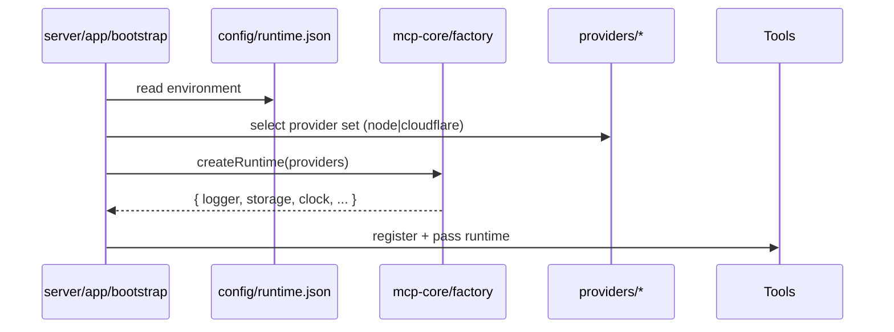

# Oak MCP Refactor High-Level Plan — Two-Part Roadmap

Strategic roadmap only. Detailed execution for Part 1 is defined in `standardising-architecture-part1.md` (single source). This document captures intent, phased outcomes, constraints, risks, and acceptance at a high level without duplicating codemod or script detail.

## Scope & References

- Read and follow `GO.md` for grounding, TODO structuring, and quality gates. Replace references to external review agents with self-reviews.
- Read `.agent/directives-and-memory/AGENT.md` and linked documents.
- Implementation details live in:
  - `.agent/plans/standardising-architecture-part1.md` (Part 1 implementation)
  - `.agent/plans/standardising-architecture-part2.md` (Part 2 implementation)
- Note: This document intentionally excludes implementation detail. Any code snippets present below are archived, non‑normative appendices; the implementation plans are the source of truth.

Summary:

- Part 1: Behaviour‑preserving directory & import normalisation (conventional structure, export & boundary parity, audited atomic commit).
- Part 2: Platform‑agnostic core & explicit provider injection (remove runtime auto‑detection, reinforce purity boundaries).
  - Additional mandate: eradicate Greek‑nomenclature from active code. Mechanically move apps/libs under standard taxonomy; replace `@oaknational/mcp-moria` imports with neutral `@oaknational/mcp-core` compat and retire the moria workspace; archive any orphan tissues.

Shared Constraints:

- Preserve architectural import rules (no relaxation during rename).
- No behavioural change in Part 1 (hash + export parity enforced by detailed plan).
- Continuous quality gates (format → type‑check → lint → test → build).
- Configuration, not detection, in Part 2 for environment selection.
- Legacy biological nomenclature archived with pointer docs (not erased).

## Part 1 — Overview

Objective: Present a conventional, self‑describing server package layout while retaining _exact_ runtime semantics and public API surfaces.

Key Outcomes:

1. Directory set migrated (`app`, `tools`, `integrations`, `config`, `logging`, `types`, `test/mocks`).
2. Zero residual legacy tokens in code (archive only).
3. Export symbol parity (no additions / removals).
4. Boundary enforcement parity (legacy + new patterns coexist until Part 2 cull).
5. Idempotent codemod + comprehensive `refactor-report.json` (hashes, collisions, export parity, literal scan, boundary duplication flag).
6. Single atomic, green‑gated commit.

Status: Part 1 complete (2025-09-05); merged via [PR #14](https://github.com/oaknational/oak-mcp-ecosystem/pull/14).
Part 2 in progress on `feat/standardising_architecture_part_2`: nested tools rename → runtime completed; gates PASS.

High-Level Phases:

1. Baseline capture (structure, exports, boundaries, literals).

## Part 2 — Platform‑Agnostic Support & Explicit Injection

Strategic Objective: Decouple runtime concerns via explicit provider injection around a shared core abstraction layer.

High‑Level Outcomes:

1. `@oaknational/mcp-core` package (interfaces, pure utils, composition factory).
2. Providers (Node, Cloudflare) implementing contracts; selected via config (no auto‑detection).
3. Server bootstraps construct runtime via factory and inject into tools/integrations.
4. Strengthened purity boundaries (core cannot import providers) enforced by ESLint.
5. Strict import hygiene with eslint-plugin-import-x: alias‑only cross‑boundary imports; `no-relative-parent-imports`; `no-internal-modules` except approved public subpaths.
6. Mechanical deconfliction rename: `src/tools/tools` → `src/tools/runtime` with import updates.
7. Barrel rationalisation and naming clarity to avoid layered collisions (e.g., export runtime registry as `CoreToolRegistry`; keep schema types local).
8. Legacy architecture narrative archived with forward‑looking pointer.
9. Workspace taxonomy renaming (mechanical): `ecosystem/{psycha,histoi,moria}` → `apps/` and `packages/{core,libs,sdks}`.
   - Central principle: remove Greek‑themed architecture and nomenclature from active code and docs; retain only a single pointer doc (`docs/architecture/greek-ecosystem-deprecation.md`).
   - Status: apps moved (notion, curriculum); libs moved (env, logger, storage, transport); `histos-runtime-abstraction` queued for archival; `moria-mcp` queued for removal after core‑compat import switch.
10. Internal alias scope introduced: reserve `@oaknational/*` for published packages; use `@workspace/*` for internal aliasing.

Phased Shape (concise):

Current working branch for Part 2: `feat/standardising_architecture_part_2`.
Early progress: Step 7 (tools rename) completed; proceeding with barrels and strict import hygiene prep.

1. Core extraction & internal publish.
2. Provider modules + contract tests.
3. Introduce configuration (`config/runtime.json`) & remove detection logic.
4. Server refactor → DI pattern; enforce boundaries with import‑x strict rules.
5. Documentation + archival update.
6. Optional CI provider matrix.
7. Apply nested tools rename (`src/tools/tools` → `src/tools/runtime`) and update imports.
8. Barrel rationalisation; remove duplicated legacy boundary patterns retained from Part 1.
9. Workspace taxonomy renaming (apps + packages/{core,libs,sdks}) and `@workspace/*` alias introduction; update configs; idempotent import rewrite.

### Workspace taxonomy renaming (mechanical)

- Canonical layout
  - `apps/`: MCP servers (ex‑psycha)
  - `packages/`
    - `core/`: shared core (ex‑moria)
    - `libs/`: reusable libraries (ex‑histoi)
    - `sdks/`: public SDKs (e.g., `oak-curriculum-sdk`)

- Mapping (directories only; no publish name changes unless scheduled). Residual Greek tokens to eradicate: psycha, psychon, chorai, chora, aither, stroma, phaneron, organa, moria, histoi, eidola, morphai, krypton, kanon, kratos, nomos, systema (and plurals/variants).
  - `ecosystem/psycha/<server>` → `apps/<server>`
  - `ecosystem/moria/moria-mcp` → `packages/core/mcp-core`
  - `ecosystem/histoi/histos-logger` → `packages/libs/logger`
  - `ecosystem/histoi/histos-transport` → `packages/libs/transport`
  - `ecosystem/histoi/histos-storage` → `packages/libs/storage`
  - `ecosystem/histoi/histos-env` → `packages/libs/env`
  - `ecosystem/histoi/histos-runtime-abstraction` → `packages/libs/runtime`
  - `packages/oak-curriculum-sdk` → `packages/sdks/oak-curriculum-sdk`

- Alias policy (distinct from publish scope)
  - Reserve `@oaknational/*` for published packages only.
  - Introduce internal alias scope `@workspace/*`:
    - `@workspace/apps/*` → `apps/*/src/*`
    - `@workspace/core/*` → `packages/core/*/src/*`
    - `@workspace/libs/*` → `packages/libs/*/src/*`
    - `@workspace/sdks/*` → `packages/sdks/*/src/*`

- Config mutations
  - `tsconfig.base.json`: add `paths` for `@workspace/*`; remove any `ecosystem/**` paths.
  - ESLint boundaries: replace zones `ecosystem/psycha/**` → `apps/**`, `ecosystem/histoi/**` → `packages/libs/**`, `ecosystem/moria/**` → `packages/core/**`; add `packages/sdks/**` allowances (no deps on apps).
  - Turborepo/test globs: update inputs/outputs from `ecosystem/**` to the new directories.
  - pnpm-workspace: include `apps/*` and `packages/*`, exclude removed `ecosystem/psycha/*` entries.

- Codemod
  - Moves via `git mv` per mapping (abort on collisions).
  - AST import rewrite from old top‑level dirs to new; preserve ESM `.js` suffix rules; idempotent (second run = 0 changes).

- Boundaries
  - apps → may depend on packages/{core,libs,sdks}
  - packages/libs → may depend on packages/core; not on apps
  - packages/core → pure; no deps on libs/apps
  - packages/sdks → may depend on packages/{core,libs}; not on apps

- Acceptance additions (Part 2)
  - Directory mapping applied; configs updated (tsconfig/eslint/turbo/test); codemod idempotent; full gates green; docs updated with taxonomy and alias guidance; no publish name changes unless explicitly scheduled.

Key Risks & Mitigations:

| Risk                                  | Mitigation                                          |
| ------------------------------------- | --------------------------------------------------- |
| Provider leakage into core            | Interface segregation + lint rules + contract tests |
| Divergent provider behaviour          | Shared contract test suite across providers         |
| Config sprawl                         | Minimal schema & documented ownership               |
| Performance overhead from indirection | Benchmark before/after runtime assembly             |

Acceptance (Part 2): Core adopted, providers injected explicitly, no detection logic, strict import-x boundary rules active (alias-only, no parent relatives, no internal modules beyond approved public subpaths), nested tools rename applied, barrels rationalised, tests green, docs updated & legacy archived.
  - And: imports rewritten to `@oaknational/mcp-core` compat; `ecosystem/moria/moria-mcp` removed; orphan tissues archived; residual Greek tokens only in the pointer doc.

---

## Shared Quality Gates

Across both parts: `pnpm -r format` → `pnpm -r type-check` → `pnpm -r lint` → `pnpm -r test` → `pnpm -r build` (order enforced). Part 1 adds export parity & legacy token eradication; Part 2 adds provider contract test suite.

---

## High-Level Risks (Consolidated)

| Phase | Risk                   | Mitigation                       | Signal                             |
| ----- | ---------------------- | -------------------------------- | ---------------------------------- |
| P1    | Boundary relaxation    | Duplicate rules then prune later | Lint passes; unchanged cycle graph |
| P1    | Export drift           | Snapshot + diff                  | Empty diff arrays                  |
| P1    | Residual legacy tokens | Grep + filtered scan             | Zero residual list                 |
| P1    | Non-idempotent codemod | Re-run dry                       | Zero planned ops                   |
| P2    | Provider-core coupling | ESLint boundary + interfaces     | No direct imports flagged          |
| P2    | Behaviour divergence   | Contract tests                   | Equal pass set                     |
| P2    | Config complexity      | Minimal schema & docs            | Stable minimal config footprint    |
| P1    | Boundary relaxation    | Duplicate rules then prune later | Lint passes; unchanged cycle graph |
| P1    | Export drift           | Snapshot + diff                  | Empty diff arrays                  |
| P1    | Residual legacy tokens | Grep + filtered scan             | Zero residual list                 |
| P1    | Non‑idempotent codemod | Re‑run dry                       | Zero planned ops                   |
| P2    | Provider‑core coupling | ESLint boundary + interfaces     | No direct imports flagged          |
| P2    | Behaviour divergence   | Contract tests                   | Equal pass set                     |
| P2    | Config complexity      | Minimal schema & docs            | Stable minimal config footprint    |

---

## Acceptance (Roadmap Level)

Part 1: Conventional layout, no legacy tokens, export & boundary parity, audited report, atomic commit merged.

Part 2: Core + providers pattern adopted, explicit config, detection removed, boundaries enforced, contract tests green, legacy docs archived.

---

## Appendix A — Diagrams

**A.1 Target layout inside a server package**

```mermaid
graph TD
  A[src/app/bootstrap.ts] --> B[src/tools/*]
  A --> C[src/integrations/notion/*]
  A --> D[src/config/*]
  A --> E[src/types/*]
  A --> F[src/logging/*]
  A --> G[@oaknational/mcp-core]
  G --> H[mcp-core/interfaces + utils]
  A --> I[providers/node or providers/cloudflare]
  I -->|implements| H
```

**A.2 Injection flow (explicit config, no detection)**


