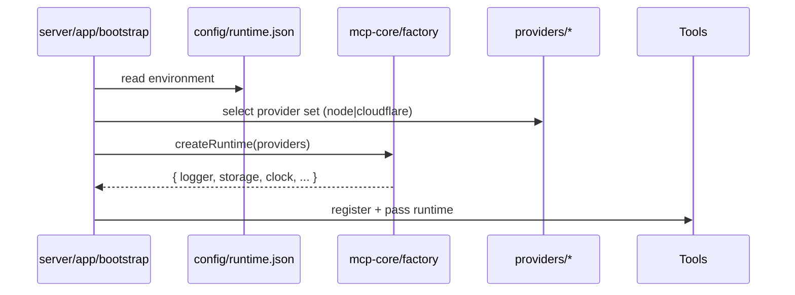

# Oak MCP Refactor High-Level Plan — Two-Part Roadmap

Strategic roadmap only. Detailed execution for Part 1 is defined in `standardising-architecture-part1.md` (single source). This document captures intent, phased outcomes, constraints, risks, and acceptance at a high level without duplicating codemod or script detail.

Summary:

- Part 1: Behaviour‑preserving directory & import normalisation (conventional structure, export & boundary parity, audited atomic commit).
- Part 2: Platform‑agnostic core & explicit provider injection (remove runtime auto‑detection, reinforce purity boundaries).

Shared Constraints:

- Preserve architectural import rules (no relaxation during rename).
- No behavioural change in Part 1 (hash + export parity enforced by detailed plan).
- Continuous quality gates (format → type‑check → lint → test → build).
- Configuration, not detection, in Part 2 for environment selection.
- Legacy biological nomenclature archived with pointer docs (not erased).

## Part 1 — Overview

Objective: Present a conventional, self‑describing server package layout while retaining _exact_ runtime semantics and public API surfaces.

Key Outcomes:

1. Directory set migrated (`app`, `tools`, `integrations`, `config`, `logging`, `types`, `test/mocks`).
2. Zero residual legacy tokens in code (archive only).
3. Export symbol parity (no additions / removals).
4. Boundary enforcement parity (legacy + new patterns coexist until Part 2 cull).
5. Idempotent codemod + comprehensive `refactor-report.json` (hashes, collisions, export parity, literal scan, boundary duplication flag).
6. Single atomic, green‑gated commit.

High-Level Phases:

1. Baseline capture (structure, exports, boundaries, literals).

# Oak MCP Refactor High‑Level Plan — Two‑Part Roadmap

Strategic roadmap only. Detailed execution for Part 1 lives in `standardising-architecture-part1.md` (single detailed source of truth). This document provides context, outcomes, phased shape, risks, and acceptance — without codemod scripts or low‑level mechanics.

Summary:

- Part 1: Behaviour‑preserving directory & import normalisation (conventional structure, export & boundary parity, audited atomic commit).
- Part 2: Platform‑agnostic core with explicit provider injection (remove runtime auto‑detection, reinforce purity boundaries).

Shared Constraints:

- Preserve architectural import rules (no relaxation during rename).
- No behavioural change in Part 1 (hash + export parity checks in implementation plan).
- Continuous quality gates (format → type‑check → lint → test → build).
- Configuration (not heuristic detection) selects providers/runtime in Part 2.
- Legacy biological nomenclature archived (not deleted) with pointer docs.

## Part 1 — Overview

Objective: Present a conventional, self‑describing server package layout while retaining exact runtime semantics and public API surfaces (REMINDER: UseBritish spelling).

Key Outcomes:

1. Directory set migrated (`app`, `tools`, `integrations`, `config`, `logging`, `types`, `test/mocks`).
2. Zero residual legacy tokens in code (archive only).
3. Export symbol parity (no additions / removals).
4. Boundary enforcement parity (legacy + new patterns coexist until Part 2 cull).
5. Idempotent codemod + comprehensive `refactor-report.json` (hashes, collisions, export parity, literal scan, boundary duplication flag).
6. Single atomic, green‑gated commit.

High‑Level Phases (mechanics in implementation plan):

1. Baseline capture (structure, exports, boundaries, literals).
2. Dry‑run plan & sign‑off.
3. Per‑package moves + import rewrites (scoped gates).
4. Global config update & boundary duplication.
5. Validation (export & literal residual scans) + reporting.
6. Documentation pointer & PR merge.

## Part 2 — Platform‑Agnostic Support & Explicit Injection

Strategic Objective: Decouple runtime concerns via explicit provider injection around a shared core abstraction layer.

High‑Level Outcomes:

1. `@oaknational/mcp-core` package (interfaces, pure utils, composition factory).
2. Providers (Node, Cloudflare) implementing contracts; selected via config (no auto‑detection).
3. Server bootstraps construct runtime via factory and inject into tools/integrations.
4. Strengthened purity boundaries (core cannot import providers) enforced by ESLint.
5. Strict import hygiene with eslint-plugin-import-x: alias‑only cross‑boundary imports; `no-relative-parent-imports`; `no-internal-modules` except approved public subpaths.
6. Mechanical deconfliction rename: `src/tools/tools` → `src/tools/runtime` with import updates.
7. Barrel rationalisation and naming clarity to avoid layered collisions (e.g., export runtime registry as `CoreToolRegistry`; keep schema types local).
8. Legacy architecture narrative archived with forward‑looking pointer.

Phased Shape (concise):

1. Core extraction & internal publish.
2. Provider modules + contract tests.
3. Introduce configuration (`config/runtime.json`) & remove detection logic.
4. Server refactor → DI pattern; enforce boundaries with import‑x strict rules.
5. Documentation + archival update.
6. Optional CI provider matrix.
7. Apply nested tools rename (`src/tools/tools` → `src/tools/runtime`) and update imports.
8. Barrel rationalisation; remove duplicated legacy boundary patterns retained from Part 1.

Key Risks & Mitigations:

| Risk                                  | Mitigation                                          |
| ------------------------------------- | --------------------------------------------------- |
| Provider leakage into core            | Interface segregation + lint rules + contract tests |
| Divergent provider behaviour          | Shared contract test suite across providers         |
| Config sprawl                         | Minimal schema & documented ownership               |
| Performance overhead from indirection | Benchmark before/after runtime assembly             |
| Ambiguous ownership                   | CODEOWNERS + core README roles section              |

Acceptance (Part 2): Core adopted, providers injected explicitly, no detection logic, strict import‑x boundary rules active (alias‑only, no parent relatives, no internal modules beyond approved public subpaths), nested tools rename applied, barrels rationalised, tests green, docs updated & legacy archived.

---

## Shared Quality Gates

Across both parts: `pnpm -r format` → `pnpm -r typecheck` → `pnpm -r lint` → `pnpm -r test` → `pnpm -r build` (order enforced). Part 1 adds export parity & legacy token eradication; Part 2 adds provider contract test suite.

---

## High‑Level Risks (Consolidated)

| Phase | Risk                   | Mitigation                       | Signal                             |
| ----- | ---------------------- | -------------------------------- | ---------------------------------- |
| P1    | Boundary relaxation    | Duplicate rules then prune later | Lint passes; unchanged cycle graph |
| P1    | Export drift           | Snapshot + diff                  | Empty diff arrays                  |
| P1    | Residual legacy tokens | Grep + filtered scan             | Zero residual list                 |
| P1    | Non‑idempotent codemod | Re‑run dry                       | Zero planned ops                   |
| P2    | Provider‑core coupling | ESLint boundary + interfaces     | No direct imports flagged          |
| P2    | Behaviour divergence   | Contract tests                   | Equal pass set                     |
| P2    | Config complexity      | Minimal schema & docs            | Stable minimal config footprint    |

---

## Acceptance (Roadmap Level)

Part 1: Conventional layout, no legacy tokens, export & boundary parity, audited report, atomic commit merged.

Part 2: Core + providers pattern adopted, explicit config, detection removed, boundaries enforced, contract tests green, legacy docs archived.

---

## Appendix A — Diagrams

**A.1 Target layout inside a server package**

```mermaid
graph TD
  A[src/app/bootstrap.ts] --> B[src/tools/*]
  A --> C[src/integrations/notion/*]
  A --> D[src/config/*]
  A --> E[src/types/*]
  A --> F[src/logging/*]
  A --> G[@oaknational/mcp-core]
  G --> H[mcp-core/interfaces + utils]
  A --> I[providers/node or providers/cloudflare]
  I -->|implements| H
```

**A.2 Injection flow (explicit config, no detection)**



---

Document ends. See `standardising-architecture-part1.md` for operational detail.

````typescript
['src/organa/mcp', 'src/tools'],
// any other organa/_should map to integrations/_
];

const moves = [];
for (const [from, to] of candidates) {
const fromPath = path.join(pkgDir, from);
const toPath = path.join(pkgDir, to);
if (files.has(fromPath)) moves.push({ from, to });
}

// dynamic organa/<integration> -> integrations/<integration>
// enumerate immediate children of src/organa/\*
const organaDir = path.join(pkgDir, 'src/organa');
if (files.has(organaDir)) {
// naive listing; Codex can enhance to robust fs.exists + readdir
moves.push({ dynamicOrganaToIntegrations: true });
}

// psychon -> app
const psychon = path.join(pkgDir, 'src/psychon');
if (files.has(psychon)) moves.push({ from: 'src/psychon', to: 'src/app' });

return moves;
}

async function main() {
const pkgJsonPaths = await fg(['**/package.json'], { ignore: IGNORES, dot: true });
const fileSet = new Set(await fg(['**/*'], { ignore: IGNORES, dot: true }));

const plan = [];
for (const p of pkgJsonPaths) {
const pkgDir = path.dirname(p);
const pkgJson = JSON.parse(await fs.readFile(p, 'utf8'));
const files = fileSet; // coarse; Codex may refine per-package

    # Oak MCP Refactor High‑Level Plan — Two‑Part Roadmap

    Strategic roadmap only. Detailed execution for Part 1 lives in `standardising-architecture-part1.md` (single detailed source of truth). This document provides context, outcomes, phased shape, risks, and acceptance — without codemod scripts or low‑level mechanics.

    Summary:

    - Part 1: Behaviour‑preserving directory & import normalisation (conventional structure, export & boundary parity, audited atomic commit).
    - Part 2: Platform‑agnostic core with explicit provider injection (remove runtime auto‑detection, reinforce purity boundaries).

    Shared Constraints:

    - Preserve architectural import rules (no relaxation during rename).
    - No behavioural change in Part 1 (hash + export parity checks in implementation plan).
    - Continuous quality gates (format → type‑check → lint → test → build).
    - Configuration (not heuristic detection) selects providers/runtime in Part 2.
    - Legacy biological nomenclature archived (not deleted) with pointer docs.

    ## Part 1 — Overview

    Objective: Present a conventional, self‑describing server package layout while retaining exact runtime semantics and public API surfaces (REMINDER: UseBritish spelling).

    Key Outcomes:

    1. Directory set migrated (`app`, `tools`, `integrations`, `config`, `logging`, `types`, `test/mocks`).
    2. Zero residual legacy tokens in code (archive only).
    3. Export symbol parity (no additions / removals).
    4. Boundary enforcement parity (legacy + new patterns coexist until Part 2 cull).
    5. Idempotent codemod + comprehensive `refactor-report.json` (hashes, collisions, export parity, literal scan, boundary duplication flag).
    6. Single atomic, green‑gated commit.

    High‑Level Phases (mechanics in implementation plan):

    1. Baseline capture (structure, exports, boundaries, literals).
    2. Dry‑run plan & sign‑off.
    3. Per‑package moves + import rewrites (scoped gates).
    4. Global config update & boundary duplication.
    5. Validation (export & literal residual scans) + reporting.
    6. Documentation pointer & PR merge.

    ## Part 2 — Platform‑Agnostic Support & Explicit Injection

    Strategic Objective: Decouple runtime concerns via explicit provider injection around a shared core abstraction layer.

    High‑Level Outcomes:

    1. `@oaknational/mcp-core` package (interfaces, pure utils, composition factory).
    2. Providers (Node, Cloudflare) implementing contracts; selected via config (no auto‑detection).
    3. Server bootstraps construct runtime via factory and inject into tools/integrations.
    4. Strengthened purity boundaries (core cannot import providers) enforced by ESLint.
    5. Legacy architecture narrative archived with forward‑looking pointer.

    Phased Shape (concise):

    1. Core extraction & internal publish.
    2. Provider modules + contract tests.
    3. Introduce configuration (`config/runtime.json`) & remove detection logic.
    4. Server refactor → DI pattern; enforce boundaries.
    5. Documentation + archival update.
    6. Optional CI provider matrix.

    Key Risks & Mitigations:

    | Risk | Mitigation |
    | ---- | ---------- |
    | Provider leakage into core | Interface segregation + lint rules + contract tests |
    | Divergent provider behaviour | Shared contract test suite across providers |
    | Config sprawl | Minimal schema & documented ownership |
    | Performance overhead from indirection | Benchmark before/after runtime assembly |
    | Ambiguous ownership | CODEOWNERS + core README roles section |

    Acceptance (Part 2): Core adopted, providers injected explicitly, no detection logic, purity boundaries enforced, tests green, docs updated & legacy archived.

    ---

    ## Shared Quality Gates

    Across both parts: `pnpm -r format` → `pnpm -r typecheck` → `pnpm -r lint` → `pnpm -r test` → `pnpm -r build` (order enforced). Part 1 adds export parity & legacy token eradication; Part 2 adds provider contract test suite.

    ---

    ## High‑Level Risks (Consolidated)

    | Phase | Risk | Mitigation | Signal |
    | ----- | ---- | ---------- | ------ |
    | P1 | Boundary relaxation | Duplicate rules then prune later | Lint passes; unchanged cycle graph |
    | P1 | Export drift | Snapshot + diff | Empty diff arrays |
    | P1 | Residual legacy tokens | Grep + filtered scan | Zero residual list |
    | P1 | Non‑idempotent codemod | Re‑run dry | Zero planned ops |
    | P2 | Provider‑core coupling | ESLint boundary + interfaces | No direct imports flagged |
    | P2 | Behaviour divergence | Contract tests | Equal pass set |
    | P2 | Config complexity | Minimal schema & docs | Stable minimal config footprint |

    ---

    ## Acceptance (Roadmap Level)

    Part 1: Conventional layout, no legacy tokens, export & boundary parity, audited report, atomic commit merged.

    Part 2: Core + providers pattern adopted, explicit config, detection removed, boundaries enforced, contract tests green, legacy docs archived.

    ---

    ## Appendix A — Diagrams

    **A.1 Target layout inside a server package**

    ```mermaid
    graph TD
      A[src/app/bootstrap.ts] --> B[src/tools/*]
      A --> C[src/integrations/notion/*]
      A --> D[src/config/*]
      A --> E[src/types/*]
      A --> F[src/logging/*]
      A --> G[@oaknational/mcp-core]
      G --> H[mcp-core/interfaces + utils]
      A --> I[providers/node or providers/cloudflare]
      I -->|implements| H
    ```

    **A.2 Injection flow (explicit config, no detection)**

    ```mermaid
    sequenceDiagram
      participant Boot as server/app/bootstrap
      participant Cfg as config/runtime.json
      participant Core as mcp-core/factory
      participant Prov as providers/*

      Boot->>Cfg: read environment
      Boot->>Prov: select provider set (node|cloudflare)
      Boot->>Core: createRuntime(providers)
      Core-->>Boot: { logger, storage, clock, ... }
      Boot->>Tools: register + pass runtime
    ```

    ---

    Document ends. See `standardising-architecture-part1.md` for operational detail.
  return s;
}

async function rewriteFile(fp) {
  const code = await fs.readFile(fp, 'utf8');
  const ast = recast.parse(code, { parser });

  let changed = false;
  visit(ast, {
    visitImportDeclaration(pathNode) {
      const old = pathNode.value.source.value;
      const neu = rewriteSpecifier(old, path.dirname(fp));
      if (neu !== old) {
        pathNode.value.source.value = neu;
        changed = true;
      }
      this.traverse(pathNode);
    },
    visitExportAllDeclaration(pathNode) {
      const src = pathNode.value.source && pathNode.value.source.value;
      if (src) {
        const neu = rewriteSpecifier(src, path.dirname(fp));
        if (neu !== src) {
          pathNode.value.source.value = neu;
          changed = true;
        }
      }
      this.traverse(pathNode);
    },
    visitExportNamedDeclaration(pathNode) {
      const src = pathNode.value.source && pathNode.value.source.value;
      if (src) {
        const neu = rewriteSpecifier(src, path.dirname(fp));
        if (neu !== src) {
          pathNode.value.source.value = neu;
          changed = true;
        }
      }
      this.traverse(pathNode);
    },
    visitCallExpression(p) {
      const callee = p.value.callee;
      const arg0 = p.value.arguments?.[0];
      const isRequire =
        callee && callee.name === 'require' && arg0 && arg0.type === 'StringLiteral';
      if (isRequire) {
        const old = arg0.value;
        const neu = rewriteSpecifier(old, path.dirname(fp));
        if (neu !== old) {
          arg0.value = neu;
          changed = true;
        }
      }
      this.traverse(p);
    },
  });

  if (changed) {
    const output = recast.print(ast, { quote: 'single' }).code;
    await fs.writeFile(fp, output);
    return true;
  }
  return false;
}

async function main() {
  const files = await fg(FILE_GLOBS, { ignore: IGNORE, dot: true });
  let count = 0;
  for (const fp of files) {
    const changed = await rewriteFile(fp);
    if (changed) count++;
  }
  console.log(`Rewrote imports in ${count} files.`);
}

main().catch((e) => {
  console.error(e);
  process.exit(1);
});
````

**D. Config updates — `scripts/refactor/part1-configs.mjs`**

```js
// scripts/refactor/part1-configs.mjs
import { promises as fs } from 'node:fs';
import path from 'node:path';
import fg from 'fast-glob';

const IGNORE = ['**/node_modules/**', '**/dist/**', '**/.turbo/**', '**/build/**'];

const replacements = [
  // ESLint rules / text references
  [/chora\/phaneron/g, 'config'],
  [/chora\/aither/g, 'logging'],
  [/chora\/stroma/g, 'types'],
  [/chora\/eidola/g, 'test/mocks'],
  [/organa\/mcp/g, 'tools'],
  [/(^|[^a-z])organa\/(?!mcp)([^/]+)/g, '$1integrations/$2'],
  [/psychon/g, 'app'],
];

const CONFIG_GLOBS = [
  '**/.eslintrc*',
  '**/tsconfig*.json',
  '**/jest*.{js,cjs,mjs,json}',
  '**/vitest*.{js,cjs,mjs,ts}',
  '**/vite*.{js,cjs,mjs,ts}',
  '**/turbo*.{json,js}',
  '**/.swcrc',
];

async function rewriteConfig(fp) {
  let text = await fs.readFile(fp, 'utf8');
  let changed = false;
  for (const [rx, to] of replacements) {
    const before = text;
    text = text.replace(rx, to);
    if (text !== before) changed = true;
  }
  if (changed) await fs.writeFile(fp, text);
  return changed;
}

async function main() {
  const files = await fg(CONFIG_GLOBS, { ignore: IGNORE, dot: true });
  let changed = 0;
  for (const fp of files) if (await rewriteConfig(fp)) changed++;
  console.log(`Updated ${changed} config files.`);
}

main().catch((e) => {
  console.error(e);
  process.exit(1);
});
```

**E. Runner script — `scripts/refactor/part1-run.mjs`**

```js
// scripts/refactor/part1-run.mjs
import { execa } from 'execa';

async function run(cmd, args) {
  await execa(cmd, args, { stdio: 'inherit' });
}

async function main() {
  // Preflight (Codex should also check git status separately)
  await run('node', ['scripts/refactor/part1-plan.mjs']);
  await run('node', ['scripts/refactor/part1-move.mjs']);
  await run('node', ['scripts/refactor/part1-rewrite.mjs']);
  await run('node', ['scripts/refactor/part1-configs.mjs']);
  // Validate
  await run('pnpm', ['-r', 'lint']);
  await run('pnpm', ['-r', 'typecheck']);
  await run('pnpm', ['-r', 'build']);
  await run('pnpm', ['-r', 'test']);
}

main().catch((e) => {
  console.error(e);
  process.exit(1);
});
```

# Oak MCP Refactor High‑Level Plan — Two‑Part Roadmap

Strategic roadmap only. Detailed execution mechanics for Part 1 live in `standardising-architecture-part1.md` (single detailed source). This file stays concise: intent, phased outcomes, constraints, risks, acceptance. No codemod code duplication.

Summary:

- Part 1: Behaviour‑preserving directory & import normalisation (conventional structure, export & boundary parity, audited atomic commit).
- Part 2: Platform‑agnostic core with explicit provider injection (remove runtime auto‑detection, reinforce purity boundaries).

Shared Constraints:

- Preserve architectural import rules (no relaxation during rename).
- No behavioural change in Part 1 (hash + export parity enforced by detailed plan).
- Continuous quality gates (format → type‑check → lint → test → build).
- Configuration (not detection) in Part 2 for environment selection.
- Legacy biological nomenclature archived (not deleted) with pointer docs.

## Part 1 — Overview

Objective: Present a conventional, self‑describing server package layout while retaining exact runtime semantics and public API surfaces (REMINDER: UseBritish spelling).

Key Outcomes:

1. Directory set migrated (`app`, `tools`, `integrations`, `config`, `logging`, `types`, `test/mocks`).
2. Zero residual legacy tokens in code (archive only).
3. Export symbol parity (no additions / removals).
4. Boundary enforcement parity (legacy + new patterns coexist until Part 2 cull).
5. Idempotent codemod + comprehensive `refactor-report.json` (hashes, collisions, export parity, literal scan, boundary duplication flag).
6. Single atomic, green‑gated commit.

High‑Level Phases:

1. Baseline capture (structure, exports, boundaries, literals).
2. Dry‑run plan & sign‑off.
3. Per‑package move + import rewrite (scoped gates).
4. Global config update & boundary duplication.
5. Full validation, residual scans, reporting.
6. Documentation pointer + PR merge.

Implementation specifics (mapping matrices, heuristics, codemod code, rollback paths) are intentionally omitted here—see the detailed Part 1 plan.

## Part 2 — Platform‑Agnostic Support & Explicit Injection

Strategic Objective: Decouple runtime concerns via explicit provider injection and shared core abstractions.

High‑Level Outcomes:

1. `@oaknational/mcp-core` package (interfaces, pure utils, composition factory).
2. Providers (Node, Cloudflare) implementing contracts; selected via config (no auto‑detection).
3. Server bootstraps construct runtime via factory and inject into tools/integrations.
4. Strengthened purity boundaries (core layer cannot import providers) enforced by ESLint.
5. Legacy architecture narrative archived with forward‑looking pointer.

Phased Approach (concise):

1. Core extraction (interfaces + pure utils) & internal publish.
2. Provider modules + contract tests (behavioural equivalence).
3. Introduce configuration (`config/runtime.json`) & remove detection logic.
4. Server refactor to DI pattern; enforce boundaries.
5. Documentation & archival update.
6. Optional CI matrix for multi‑provider verification.

Key Risks & Mitigations:

| Risk                                  | Mitigation                                          |
| ------------------------------------- | --------------------------------------------------- |
| Provider leakage into core            | Interface segregation + lint rules + contract tests |
| Divergent provider behaviour          | Shared contract test suite across providers         |
| Config sprawl                         | Minimal schema & documented ownership               |
| Performance overhead from indirection | Benchmark before/after runtime assembly             |
| Ambiguous ownership                   | CODEOWNERS + core README roles section              |

Acceptance (Part 2): Core adopted, providers injected explicitly, no detection logic, purity boundaries enforced, tests green, docs updated & legacy archived.

---

## Shared Quality Gates

All phases rely on: `pnpm -r format`, `pnpm -r typecheck`, `pnpm -r lint`, `pnpm -r test`, `pnpm -r build` (order enforced). Part 1 adds export parity & legacy token eradication; Part 2 adds provider contract test suite.

---

## High‑Level Risks (Consolidated)

| Phase | Risk                   | Mitigation                       | Signal                             |
| ----- | ---------------------- | -------------------------------- | ---------------------------------- |
| P1    | Boundary relaxation    | Duplicate rules then prune later | Lint passes; unchanged cycle graph |
| P1    | Export drift           | Snapshot + diff                  | Empty diff arrays                  |
| P1    | Residual legacy tokens | Grep + filtered scan             | Zero residual list                 |
| P1    | Non‑idempotent codemod | Re‑run dry                       | Zero planned ops                   |
| P2    | Provider‑core coupling | ESLint boundary + interfaces     | No direct imports flagged          |
| P2    | Behaviour divergence   | Contract tests                   | Equal pass set                     |
| P2    | Config complexity      | Minimal schema & docs            | Stable minimal config footprint    |

---

## Acceptance (Roadmap Level)

Part 1: Conventional layout, no legacy tokens, export & boundary parity, audited report, atomic commit merged.

Part 2: Core + providers pattern adopted, explicit config, detection removed, boundaries enforced, contract tests green, legacy docs archived.

---

## Appendix A — Diagrams

**A.1 Target layout inside a server package**

```mermaid
graph TD
  A[src/app/bootstrap.ts] --> B[src/tools/*]
  A --> C[src/integrations/notion/*]
  A --> D[src/config/*]
  A --> E[src/types/*]
  A --> F[src/logging/*]
  A --> G[@oaknational/mcp-core]
  G --> H[mcp-core/interfaces + utils]
  A --> I[providers/node or providers/cloudflare]
  I -->|implements| H
```

**A.2 Injection flow (explicit config, no detection)**


---

Document ends. See `standardising-architecture-part1.md` for operational detail.
