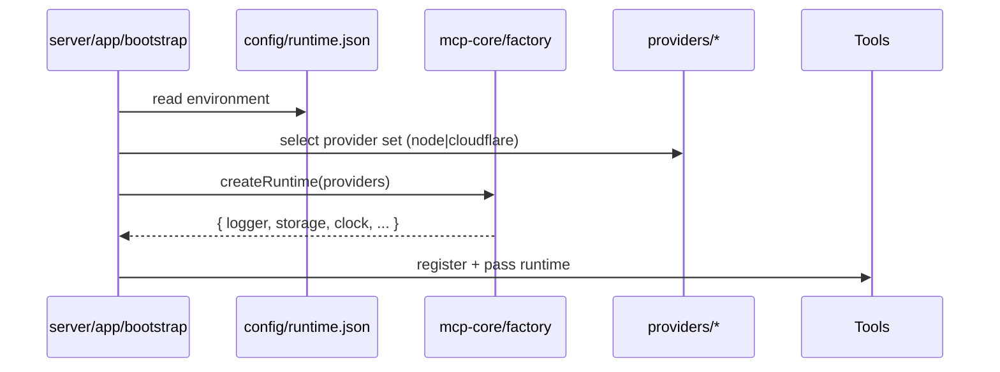

# Oak MCP Refactor Plan — Two-Part Implementation (Codemod-Ready)

**Scope:** Implement the agreed refactor in two parts. This revision adds a **codemod-ready brief for Part 1** so another ChatGPT5 (via **Codex IDE**) can create and run the codemod directly against the **live repo** with high confidence.

- **Part 1:** Minimal rename & shuffle to present a more standard architecture (no logic changes). Includes a **Codex IDE Implementation Playbook**, heuristics, mapping rules, safety checks, and code skeletons.
- **Part 2:** General improvements and platform‑agnostic support using explicit plugin injection (no runtime detection), unchanged in intent but included here for completeness.

> **Constraints & Principles**
>
> - **Preserve import rules & boundaries.** Custom ESLint rules and quality gates remain authoritative; the codemod must keep the same semantic constraints.
> - **No behavior changes in Part 1.** Only move/rename files and adjust imports/config.
> - **Runtime‑agnostic core in Part 2.** Environment specifics are injected explicitly from config (Node vs Cloudflare Workers). **No auto‑detection.**
> - **Repository stability.** After each step: `pnpm -r build`, `pnpm -r test`, lint and typecheck must pass.
> - **Documentation stewardship.** Archive the “biological architecture” docs for later study in `docs/legacy-architecture/`.

---

## Table of Contents

- [Oak MCP Refactor Plan — Two-Part Implementation (Codemod-Ready)](#oak-mcp-refactor-plan--two-part-implementation-codemod-ready)
  - [Table of Contents](#table-of-contents)
  - [Part 1 — Minimal Rename \& Shuffle (Codemod Ready)](#part1--minimal-rename--shuffle-codemod-ready)
    - [1.1 Outcomes](#11-outcomes)
    - [1.2 Codex IDE Implementation Playbook](#12-codex-ide-implementation-playbook)
    - [1.3 Heuristics to detect targets](#13-heuristics-to-detect-targets)
    - [1.4 Directory mapping rules](#14-directory-mapping-rules)
    - [1.5 Import, alias, and config rewrite rules](#15-import-alias-and-config-rewrite-rules)
    - [1.6 Safety checks, dry‑run, and idempotency](#16-safety-checks-dryrun-and-idempotency)
    - [1.7 Post-change checks \& rollback](#17-post-change-checks--rollback)
    - [1.8 Code skeletons for the codemod](#18-code-skeletons-for-the-codemod)
  - [Part 2 — General Improvements \& Platform‑Agnostic Support](#part2--general-improvements--platformagnostic-support)
    - [2.1 Outcomes](#21-outcomes)
    - [2.2 DI + explicit config design sketch](#22-di--explicit-config-design-sketch)
    - [2.3 Step-by-step tasks](#23-step-by-step-tasks)
    - [2.4 Server package refactors](#24-server-package-refactors)
    - [2.5 Tests/CI and quality gates](#25-testsci-and-quality-gates)
    - [2.6 Archive legacy docs](#26-archive-legacy-docs)
    - [2.7 Risks \& mitigations](#27-risks--mitigations)
  - [Appendix A — Mermaid diagrams](#appendix-a--mermaid-diagrams)
  - [Appendix B — Command snippets](#appendix-b--command-snippets)
    - [Acceptance checklist (per part)](#acceptance-checklist-per-part)

---

## Part 1 — Minimal Rename & Shuffle (Codemod Ready)

### 1.1 Outcomes

- The repo **looks** conventional to new contributors, **no logic changes**:
  - Server packages: `src/tools`, `src/integrations`, `src/config`, `src/types`, `src/logging`, `src/app`, `src/test/mocks`.
  - Shared packages: `src/utils` (pure), `src/adapters` or `src/runtime` (env‑touching), `src/types`.
- **ESLint import boundaries preserved.**
- All builds, tests, type checks pass.

---

### 1.2 Codex IDE Implementation Playbook

> This is the **operational brief** for another ChatGPT5 instance running inside **Codex IDE** against the live repo. Follow in order.

1. **Preflight & Context**
   - Detect monorepo root (presence of `pnpm-workspace.yaml` or `turbo.json`).
   - Ensure a **clean working tree**: `git status` (no unstaged changes). If not clean, abort and prompt for manual cleanup.
   - Create a branch: `git checkout -b feat/refactor/part-1-rename`.

2. **Workspace Inventory**
   - List all package roots: Recursively find `package.json` (ignore `**/node_modules/**` and `**/dist/**`).
   - Classify packages:
     - **Server packages (Psycha):** name contains `mcp` **and** either depends on `@modelcontextprotocol/sdk` or contains any of: `src/organa/mcp`, `src/chora/phaneron`, `src/psychon`, `src/tools`.
     - **Shared/core packages (Moria/Histoi):** utility or adapter libraries (e.g., names containing `moria`, `histoi`, `core`, `utils`, `logger`, `storage`, `transport`, `env`).

3. **Plan Moves (per package)**
   - For **server packages**, schedule directory renames according to **[1.4 Directory mapping rules](#14-directory-mapping-rules)**. Only move directories that **exist**.
   - For **shared packages**, normalize internal layout only (no cross‑package merges in Part 1).

4. **Dry‑Run Preview**
   - Print a JSON plan of: package → list of moves; and a count of imports to rewrite for each mapping.
   - Do **not** modify files yet.

5. **Execute Moves**
   - Use `git mv` for directory moves to preserve history. If `git mv` is unavailable, ensure the sequence is `fs.rename` + `git add -A`.
   - Moves must be **idempotent** (skip if already at target).

6. **Rewrite Imports & Aliases**
   - Apply AST codemods to **TS/TSX/JS/CTS/MTS** files:
     - Update import/export specifiers and CommonJS `require()` calls.
     - Preserve relative depth (`../../`) while rewriting **path segments** (e.g., `chora/phaneron` → `config`), per **[1.5](#15-import-alias-and-config-rewrite-rules)**.
   - Update **tsconfig paths**, **ESLint configs**, **Jest/Vitest aliases**, **Vite/TS esbuild aliases**, and **Turbo** globs where the old directories are referenced.

7. **Validation Gate**
   - Run `pnpm -r lint && pnpm -r typecheck && pnpm -r build && pnpm -r test`.
   - If any step fails, **halt** and print a diagnosis (which file, which rule). Suggest minimal fixes (typically a missed import path or alias).

8. **Commit**
   - If all green, commit with a clear message:
     - `chore(refactor): Part 1 rename & shuffle (no logic changes)`
   - Open PR with a short summary of moves and confirmation that ESLint boundaries remain intact.

---

### 1.3 Heuristics to detect targets

- **Server packages (MCP servers) identification (any of):**
  - `package.json` → `name` includes `mcp` and `dependencies|devDependencies` includes `@modelcontextprotocol/sdk`.
  - File structure includes any of:
    - `src/organa/mcp` (pre‑refactor tools staging)
    - `src/chora/phaneron`, `src/chora/aither`, `src/chora/stroma`, `src/chora/eidola`
    - `src/psychon`
    - Or already `src/tools`, `src/integrations`, `src/config`, `src/app`

- **Shared/core packages identification (any of):**
  - Name includes `moria`, `histoi`, `core`, `logger`, `storage`, `transport`, `env`, `utils`.
  - Contains a `src/utils` or `src/runtime`/`src/adapters` split already.

- **Ignore**: `node_modules`, `dist`, `build`, `.turbo`, any generated code directories.

---

### 1.4 Directory mapping rules

> Apply **only if the source exists**. Skip cleanly if it doesn’t. The codemod must be **idempotent**.

**For Server Packages**

| From (old)                 | To (new)                                       | Purpose                           |
| -------------------------- | ---------------------------------------------- | --------------------------------- |
| `src/chora/phaneron`       | `src/config`                                   | Configuration loading & schema    |
| `src/chora/aither`         | `src/logging`                                  | Logging/events                    |
| `src/chora/stroma`         | `src/types`                                    | Package-local shared types        |
| `src/chora/eidola`         | `src/test/mocks` (else `src/mocks`)            | Test fixtures & mocks             |
| `src/organa/mcp`           | `src/tools`                                    | MCP tools & handlers              |
| `src/organa/<integration>` | `src/integrations/<integration>`               | Third‑party SDKs / domain modules |
| `src/psychon`              | `src/app` (or leave as `src/` if already flat) | Bootstrap & assembly              |

**For Shared/Core Packages**

- Normalize internal structure only (no external merges):
  - Ensure `src/utils/` holds **pure** helpers (no Node/CF imports).
  - Ensure `src/adapters/` or `src/runtime/` contains env‑touching code (Node/CF).
  - Ensure `src/types/` contains shared types only.

---

### 1.5 Import, alias, and config rewrite rules

**A. Source code import rewrites** (TS/TSX/JS/MJS/CTS):

- Rewrite **path segments** while preserving relative depth:
  - `chora/phaneron` → `config`
  - `chora/aither` → `logging`
  - `chora/stroma` → `types`
  - `chora/eidola` → `test/mocks` (or `mocks` if that’s where it ended)
  - `organa/mcp` → `tools`
  - `organa/<segment>` → `integrations/<segment>` (for any `<segment>` ≠ `mcp`)
  - `psychon` → `app`
- Apply to: `import ... from '…'`, `export ... from '…'`, and `require('…')`.

**B. TSConfig path aliases (`tsconfig*.json`)**

- For each `compilerOptions.paths` key/value containing old segments, rewrite them to the new directories.
- Ensure **no path alias** allows core/pure utils to import adapters/runtime (keep boundary semantics).

**C. ESLint configuration (`.eslintrc.*`)**

- Update any rule patterns referencing old folders (e.g., `chora|organa|psychon`) to their new counterparts (`config|logging|types|test/mocks|tools|integrations|app`).
- Keep semantic rules **unchanged** (e.g., “utils must not import providers/adapters”).

**D. Test & bundler aliases**

- **Jest/Vitest:** update `moduleNameMapper` or `resolve.alias`.
- **Vite/ESBuild/TS‑Node:** update `resolve.alias` if present.

**E. Turbo / workspace scripts**

- Update any globs or path-based filters in `turbo.json`, GitHub Actions, or other CI configs that referenced old folders.

---

### 1.6 Safety checks, dry‑run, and idempotency

- **Dry‑run first:** Print the move plan, count of import strings to be rewritten per rule, and list of config files to be edited.
- **Idempotent operations:** If a target directory already exists, **skip** the move for that source; consider it already applied.
- **File conflict guard:** If the target exists and is non‑empty with conflicting files, stop and prompt for manual resolution.
- **Backup option:** Offer `--write-backups` to save `.bak` of modified files (imports/configs) before rewriting.
- **VCS guard:** Refuse to run if working tree not clean; insist on a branch and a single commit at the end.

---

### 1.7 Post-change checks & rollback

- Run: `pnpm -r lint && pnpm -r typecheck && pnpm -r build && pnpm -r test`
- Perform a smoke‑test of each MCP server (stdio/HTTP if applicable).
- **Rollback:** `git reset --hard HEAD~1` (or `git revert` the merge/PR). Keep a machine‑readable `refactor-report.json` of all moves to assist reversals.

---

### 1.8 Code skeletons for the codemod

> Codex IDE can adapt these directly. They assume Node ≥18, ESM, and the repo root as CWD.

**A. Package discovery and mapping plan — `scripts/refactor/part1-plan.mjs`**

```js
// scripts/refactor/part1-plan.mjs
import { promises as fs } from 'node:fs';
import path from 'node:path';
import fg from 'fast-glob';

const IGNORES = ['**/node_modules/**', '**/dist/**', '**/.turbo/**', '**/build/**'];
const SERVER_MARKERS = ['src/organa/mcp', 'src/chora/phaneron', 'src/psychon', 'src/tools'];

function isServerPackage(pkgJson, pkgDir, files) {
  const name = pkgJson?.name ?? '';
  const deps = { ...pkgJson.dependencies, ...pkgJson.devDependencies };
  const hasMcpDep = deps && Object.keys(deps).some((d) => d === '@modelcontextprotocol/sdk');
  const hasMarkers = SERVER_MARKERS.some((m) => files.has(path.join(pkgDir, m)));
  return name.includes('mcp') && (hasMcpDep || hasMarkers);
}

function toMovesForServer(pkgDir) {
  const candidates = [
    ['src/chora/phaneron', 'src/config'],
    ['src/chora/aither', 'src/logging'],
    ['src/chora/stroma', 'src/types'],
    ['src/chora/eidola', 'src/test/mocks'],
    ['src/organa/mcp', 'src/tools'],
    // any other organa/* should map to integrations/*
  ];

  const moves = [];
  for (const [from, to] of candidates) {
    const fromPath = path.join(pkgDir, from);
    const toPath = path.join(pkgDir, to);
    if (files.has(fromPath)) moves.push({ from, to });
  }

  // dynamic organa/<integration> -> integrations/<integration>
  // enumerate immediate children of src/organa/*
  const organaDir = path.join(pkgDir, 'src/organa');
  if (files.has(organaDir)) {
    // naive listing; Codex can enhance to robust fs.exists + readdir
    moves.push({ dynamicOrganaToIntegrations: true });
  }

  // psychon -> app
  const psychon = path.join(pkgDir, 'src/psychon');
  if (files.has(psychon)) moves.push({ from: 'src/psychon', to: 'src/app' });

  return moves;
}

async function main() {
  const pkgJsonPaths = await fg(['**/package.json'], { ignore: IGNORES, dot: true });
  const fileSet = new Set(await fg(['**/*'], { ignore: IGNORES, dot: true }));

  const plan = [];
  for (const p of pkgJsonPaths) {
    const pkgDir = path.dirname(p);
    const pkgJson = JSON.parse(await fs.readFile(p, 'utf8'));
    const files = fileSet; // coarse; Codex may refine per-package

    if (isServerPackage(pkgJson, pkgDir, files)) {
      plan.push({
        kind: 'server',
        pkgDir,
        name: pkgJson.name,
        moves: toMovesForServer(pkgDir, files),
      });
    } else {
      plan.push({
        kind: 'shared-or-other',
        pkgDir,
        name: pkgJson.name,
        moves: [],
      });
    }
  }

  await fs.writeFile('refactor-plan.part1.json', JSON.stringify(plan, null, 2));
  console.log('Wrote refactor-plan.part1.json');
}

main().catch((e) => {
  console.error(e);
  process.exit(1);
});
```

**B. Directory moves — `scripts/refactor/part1-move.mjs`**

```js
// scripts/refactor/part1-move.mjs
import { promises as fs } from 'node:fs';
import path from 'node:path';
import { execa } from 'execa';

const MOVE_CANDIDATES = [
  ['src/chora/phaneron', 'src/config'],
  ['src/chora/aither', 'src/logging'],
  ['src/chora/stroma', 'src/types'],
  ['src/chora/eidola', 'src/test/mocks'],
  ['src/organa/mcp', 'src/tools'],
  ['src/psychon', 'src/app'],
];

async function gitMv(fromAbs, toAbs) {
  // ensure target dir exists
  await fs.mkdir(path.dirname(toAbs), { recursive: true });
  try {
    await execa('git', ['mv', fromAbs, toAbs], { stdio: 'inherit' });
  } catch {
    // fallback
    await fs.rename(fromAbs, toAbs);
    await execa('git', ['add', '-A', toAbs], { stdio: 'inherit' });
    await execa('git', ['rm', '-r', fromAbs], { stdio: 'inherit' });
  }
}

async function moveOrganaChildren(pkgDir) {
  const organa = path.join(pkgDir, 'src/organa');
  let entries = [];
  try {
    entries = await fs.readdir(organa, { withFileTypes: true });
  } catch {
    return;
  }
  for (const e of entries) {
    if (!e.isDirectory()) continue;
    if (e.name === 'mcp') continue;
    const from = path.join(organa, e.name);
    const to = path.join(pkgDir, 'src/integrations', e.name);
    await fs.mkdir(path.dirname(to), { recursive: true });
    await gitMv(from, to);
  }
}

async function main() {
  const plan = JSON.parse(await fs.readFile('refactor-plan.part1.json', 'utf8'));
  for (const item of plan) {
    if (item.kind !== 'server') continue;
    const pkgDir = item.pkgDir;
    console.log(`
== Package: ${item.name} ==`);
    // static moves
    for (const [from, to] of MOVE_CANDIDATES) {
      const fromAbs = path.join(pkgDir, from);
      const toAbs = path.join(pkgDir, to);
      try {
        await fs.stat(fromAbs);
      } catch {
        continue;
      }
      // skip if already moved
      try {
        await fs.stat(toAbs);
        console.log(`skip: ${from} -> ${to} (exists)`);
        continue;
      } catch {}
      console.log(`move: ${from} -> ${to}`);
      await gitMv(fromAbs, toAbs);
    }
    // dynamic organa children
    await moveOrganaChildren(pkgDir);
  }
  console.log('\nDirectory moves complete.');
}

main().catch((e) => {
  console.error(e);
  process.exit(1);
});
```

**C. Import/alias rewrite — `scripts/refactor/part1-rewrite.mjs`**

```js
// scripts/refactor/part1-rewrite.mjs
import { promises as fs } from 'node:fs';
import path from 'node:path';
import fg from 'fast-glob';
import * as recast from 'recast';
import babelParser from '@babel/parser';
import { visit } from 'ast-types';

const parser = {
  parse(source) {
    return babelParser.parse(source, {
      sourceType: 'module',
      plugins: [
        'typescript',
        'jsx',
        'decorators-legacy',
        'classProperties',
        'classPrivateProperties',
        'classPrivateMethods',
        'dynamicImport',
      ],
    });
  },
};

const FILE_GLOBS = ['**/*.{ts,tsx,js,jsx,mts,cts}'];
const IGNORE = ['**/node_modules/**', '**/dist/**', '**/.turbo/**', '**/build/**'];

const SEGMENT_RULES = [
  ['chora/phaneron', 'config'],
  ['chora/aither', 'logging'],
  ['chora/stroma', 'types'],
  ['chora/eidola', 'test/mocks'],
  ['organa/mcp', 'tools'],
  // organa/<x> -> integrations/<x> handled via regex below
  ['psychon', 'app'],
];

function rewriteSpecifier(spec, fileDir) {
  if (!spec || typeof spec !== 'string') return spec;
  let s = spec;

  // Apply explicit segment rules (preserve relative prefixes like ../../)
  for (const [fromSeg, toSeg] of SEGMENT_RULES) {
    // replace only when segment appears as a path segment
    s = s.replace(new RegExp(`(^|/)${fromSeg}(/|$)`), (m, a, b) => `${a}${toSeg}${b}`);
  }

  // organa/<x> -> integrations/<x> (but exclude /organa/mcp handled above)
  s = s.replace(
    /(^|\/)organa\/(?!mcp)([^/]+)(\/|$)/,
    (m, a, name, b) => `${a}integrations/${name}${b}`,
  );

  return s;
}

async function rewriteFile(fp) {
  const code = await fs.readFile(fp, 'utf8');
  const ast = recast.parse(code, { parser });

  let changed = false;
  visit(ast, {
    visitImportDeclaration(pathNode) {
      const old = pathNode.value.source.value;
      const neu = rewriteSpecifier(old, path.dirname(fp));
      if (neu !== old) {
        pathNode.value.source.value = neu;
        changed = true;
      }
      this.traverse(pathNode);
    },
    visitExportAllDeclaration(pathNode) {
      const src = pathNode.value.source && pathNode.value.source.value;
      if (src) {
        const neu = rewriteSpecifier(src, path.dirname(fp));
        if (neu !== src) {
          pathNode.value.source.value = neu;
          changed = true;
        }
      }
      this.traverse(pathNode);
    },
    visitExportNamedDeclaration(pathNode) {
      const src = pathNode.value.source && pathNode.value.source.value;
      if (src) {
        const neu = rewriteSpecifier(src, path.dirname(fp));
        if (neu !== src) {
          pathNode.value.source.value = neu;
          changed = true;
        }
      }
      this.traverse(pathNode);
    },
    visitCallExpression(p) {
      const callee = p.value.callee;
      const arg0 = p.value.arguments?.[0];
      const isRequire =
        callee && callee.name === 'require' && arg0 && arg0.type === 'StringLiteral';
      if (isRequire) {
        const old = arg0.value;
        const neu = rewriteSpecifier(old, path.dirname(fp));
        if (neu !== old) {
          arg0.value = neu;
          changed = true;
        }
      }
      this.traverse(p);
    },
  });

  if (changed) {
    const output = recast.print(ast, { quote: 'single' }).code;
    await fs.writeFile(fp, output);
    return true;
  }
  return false;
}

async function main() {
  const files = await fg(FILE_GLOBS, { ignore: IGNORE, dot: true });
  let count = 0;
  for (const fp of files) {
    const changed = await rewriteFile(fp);
    if (changed) count++;
  }
  console.log(`Rewrote imports in ${count} files.`);
}

main().catch((e) => {
  console.error(e);
  process.exit(1);
});
```

**D. Config updates — `scripts/refactor/part1-configs.mjs`**

```js
// scripts/refactor/part1-configs.mjs
import { promises as fs } from 'node:fs';
import path from 'node:path';
import fg from 'fast-glob';

const IGNORE = ['**/node_modules/**', '**/dist/**', '**/.turbo/**', '**/build/**'];

const replacements = [
  // ESLint rules / text references
  [/chora\/phaneron/g, 'config'],
  [/chora\/aither/g, 'logging'],
  [/chora\/stroma/g, 'types'],
  [/chora\/eidola/g, 'test/mocks'],
  [/organa\/mcp/g, 'tools'],
  [/(^|[^a-z])organa\/(?!mcp)([^/]+)/g, '$1integrations/$2'],
  [/psychon/g, 'app'],
];

const CONFIG_GLOBS = [
  '**/.eslintrc*',
  '**/tsconfig*.json',
  '**/jest*.{js,cjs,mjs,json}',
  '**/vitest*.{js,cjs,mjs,ts}',
  '**/vite*.{js,cjs,mjs,ts}',
  '**/turbo*.{json,js}',
  '**/.swcrc',
];

async function rewriteConfig(fp) {
  let text = await fs.readFile(fp, 'utf8');
  let changed = false;
  for (const [rx, to] of replacements) {
    const before = text;
    text = text.replace(rx, to);
    if (text !== before) changed = true;
  }
  if (changed) await fs.writeFile(fp, text);
  return changed;
}

async function main() {
  const files = await fg(CONFIG_GLOBS, { ignore: IGNORE, dot: true });
  let changed = 0;
  for (const fp of files) if (await rewriteConfig(fp)) changed++;
  console.log(`Updated ${changed} config files.`);
}

main().catch((e) => {
  console.error(e);
  process.exit(1);
});
```

**E. Runner script — `scripts/refactor/part1-run.mjs`**

```js
// scripts/refactor/part1-run.mjs
import { execa } from 'execa';

async function run(cmd, args) {
  await execa(cmd, args, { stdio: 'inherit' });
}

async function main() {
  // Preflight (Codex should also check git status separately)
  await run('node', ['scripts/refactor/part1-plan.mjs']);
  await run('node', ['scripts/refactor/part1-move.mjs']);
  await run('node', ['scripts/refactor/part1-rewrite.mjs']);
  await run('node', ['scripts/refactor/part1-configs.mjs']);
  // Validate
  await run('pnpm', ['-r', 'lint']);
  await run('pnpm', ['-r', 'typecheck']);
  await run('pnpm', ['-r', 'build']);
  await run('pnpm', ['-r', 'test']);
}

main().catch((e) => {
  console.error(e);
  process.exit(1);
});
```

> **Notes for Codex IDE:**
>
> - Install deps for scripts: `pnpm add -Dw fast-glob execa recast @babel/parser`.
> - Prefer `git mv` to preserve history. Skip moves for non‑existent sources. Avoid overwriting non‑empty targets.
> - The rewrite rules are conservative; if your repo uses **path aliases** (e.g., `@pkg/chora/*`), expand `part1-configs.mjs` to patch those keys/values in `tsconfig` and test configs.

---

## Part 2 — General Improvements & Platform‑Agnostic Support

### 2.1 Outcomes

- **Runtime‑agnostic utilities** with **explicit config** (no detection).
- A single `@oaknational/mcp-core` for interfaces + pure utils + factory.
- Server packages (Notion, Curriculum) consume providers via DI.

### 2.2 DI + explicit config design sketch

```mermaid
flowchart LR
  subgraph CORE["@oaknational/mcp-core"]
    I[Interfaces & Types]:::core --> U[Pure Utils]:::core
    I --> F[Factories (compose)]:::core
  end

  subgraph PROVIDERS["Runtime Providers (adapters)"]
    N[Node Provider(s)]:::prov
    C[Cloudflare Provider(s)]:::prov
  end

  subgraph CONFIG["config/"]
    R[config/runtime.json]:::cfg --> F
    B[config/bindings.json]:::cfg --> F
  end

  subgraph SERVER["MCP Server (e.g. Notion)"]
    T[tools/*]:::app --> F
    X[integrations/*]:::app --> F
    A[app bootstrap]:::app --> F
  end

  F -->|injected per config| N
  F -->|injected per config| C

  classDef core fill:#eef,stroke:#88f;
  classDef prov fill:#efe,stroke:#5b5;
  classDef cfg fill:#ffe,stroke:#bb5;
  classDef app fill:#f5f5ff,stroke:#99f;
```

### 2.3 Step-by-step tasks

1. Create `packages/mcp-core` with `src/interfaces`, `src/utils`, `src/factory`.
2. Define interfaces at env seams (`Logger`, `Storage`, `Clock`, `HttpClient` if needed).
3. Implement **providers** in each server (temporary), later extract to `mcp-providers` if shared.
4. Add `config/runtime.json` and load it in each server bootstrap to select providers explicitly.
5. Thread providers into tools/integrations; remove any auto‑detect logic.
6. Optional: consolidate providers into a shared package with clear build targets (no Node code in CF bundles).

### 2.4 Server package refactors

- Keep the Part 1 structure (`src/tools`, `src/integrations`, `src/app`, `src/config`, `src/types`, `src/logging`).
- Bootstrap: read config → select providers → create runtime via `mcp-core/factory` → register tools.

### 2.5 Tests/CI and quality gates

- Unit tests for providers (Node & CF).
- Integration tests for servers (Node mode by default).
- ESLint boundary rules: ensure pure code doesn’t import providers.
- CI: Optionally matrix for provider unit tests.

### 2.6 Archive legacy docs

- Create `docs/legacy-architecture/`.
- Move/copy biological-architecture ADRs and narratives.
- Add an index explaining the new direction and the archive purpose.

### 2.7 Risks & mitigations

| Risk                                    | Mitigation                                                                    |
| --------------------------------------- | ----------------------------------------------------------------------------- |
| ESLint patterns tied to old dirs        | Update to new names; add pre‑commit validation                                |
| Provider code leaking into core bundles | Keep providers outside core or ensure side‑effect‑free exports + tree‑shaking |
| Ambiguous env seams                     | Start minimal (Logger/Storage/Clock/HTTP), evolve pragmatically               |
| CF parity hard to test                  | Unit test providers; add Workers integration tests when necessary             |
| Config sprawl                           | Keep `config/` minimal (`runtime.json` + optional `bindings.json`)            |

---

## Appendix A — Mermaid diagrams

**A.1 Target layout inside a server package**

```mermaid
graph TD
  A[src/app/bootstrap.ts] --> B[src/tools/*]
  A --> C[src/integrations/notion/*]
  A --> D[src/config/*]
  A --> E[src/types/*]
  A --> F[src/logging/*]
  A --> G[@oaknational/mcp-core]
  G --> H[mcp-core/interfaces + utils]
  A --> I[providers/node or providers/cloudflare]
  I -->|implements| H
```

**A.2 Injection flow (explicit config, no detection)**



---

## Appendix B — Command snippets

**B.1 Bulk move (example; adapt paths):**

```bash
# Example moves inside a server package
git mv src/chora/phaneron src/config || true
git mv src/chora/aither   src/logging || true
git mv src/chora/stroma   src/types || true
git mv src/chora/eidola   src/test/mocks || true
git mv src/organa/mcp     src/tools || true
git mv src/organa/notion  src/integrations/notion || true
git mv src/psychon        src/app || true
```

**B.2 Import rewrites (regex fallback if AST unavailable):**

```bash
# Use sd or perl as a last resort (prefer AST script from 1.8C)
sd 'chora/phaneron' 'config' -s
sd 'chora/aither'   'logging' -s
sd 'chora/stroma'   'types' -s
sd 'chora/eidola'   'test/mocks' -s
sd 'organa/mcp'     'tools' -s
sd '(?<!organa/)organa/([A-Za-z0-9_-]+)' 'integrations/$1' -s
sd 'psychon'        'app' -s
```

**B.3 Validation after each phase**

```bash
pnpm -r lint
pnpm -r typecheck
pnpm -r build
pnpm -r test
```

---

### Acceptance checklist (per part)

- **Part 1**
  - [ ] All mapped directories renamed & imports updated
  - [ ] ESLint boundary rules updated; no violations
  - [ ] Builds, tests, typechecks green
  - [ ] PR reviewed & merged

- **Part 2**
  - [ ] `@oaknational/mcp-core` created; interfaces + utils migrated
  - [ ] Providers implemented for Node & Cloudflare
  - [ ] Explicit config in `config/` and bootstraps updated
  - [ ] No runtime auto‑detection remains
  - [ ] Servers refactored to DI pattern
  - [ ] Docs archived under `docs/legacy-architecture/`
  - [ ] CI matrix updated (provider tests), all green
