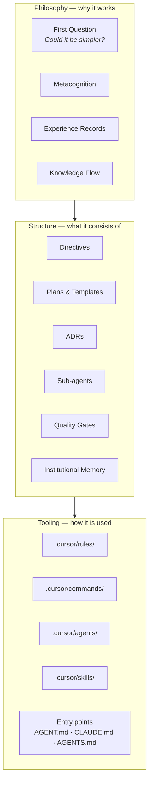
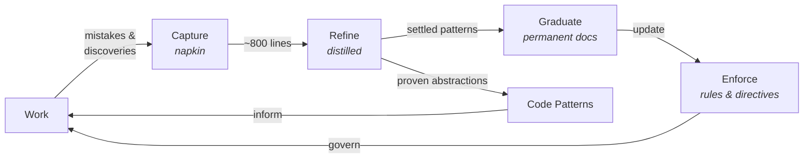
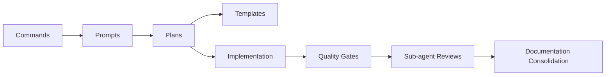

---
provenance:
  - index: 0
    repo: oak-open-curriculum-ecosystem
    date: 2026-02-26
    purpose: "Production SDK ecosystem: curriculum SDK, MCP servers, semantic search, 13 specialist reviewers, full learning loop"
  - index: 1
    repo: cloudinary-icon-ingest-poc
    date: 2026-02-26
    purpose: "Short-lived POC: build-time SVG icon ingestion from Cloudinary, 3 reviewers, simplified gates"
  - index: 2
    repo: oak-open-curriculum-ecosystem
    date: 2026-02-27
    purpose: "Production SDK ecosystem: adopted practice-core structure, trinity concept, and bootstrap from round-trip"
fitness_ceiling: 250
attribution: "created by [Jim Cresswell](https://www.jimcresswell.net/), evolved by many agents in many repos"
---

# The Agentic Engineering Practice

The agentic engineering practice is the self-reinforcing system of principles, structures, agents, and tooling that governs how work happens in this repository. It creates the conditions for safe, high-quality human-AI collaboration. The practice is what produces the product code (SDK, MCP servers, search system) — but it is not the product code itself.

**See also**: For the practice-core files and their roles, see [index.md](index.md). For navigable links to this repo's directives, ADRs, and tools, see [practice-index.md](../practice-index.md) — the bridge between the portable core and the local repo. ADR-119 records the naming decision and conceptual boundary.

## Three Layers

The practice operates in three layers. Each builds on the one below.

### Philosophy

The principles and learning mechanisms. The First Question ("could it be simpler?"), metacognition (`.agent/directives/metacognition.md`), experience records (`.agent/experience/`), and the knowledge flow. **Architectural enforcement** is a core philosophical commitment: preferring physical constraints (lint rules, boundary tooling) over human vigilance. This layer defines *why* the practice works.

### Structure

The organisational patterns. Directives (`.agent/directives/`), plans (`.agent/plans/`) and their templates (`.agent/plans/templates/`), ADRs (`docs/architecture/architectural-decisions/`), sub-agent prompt architecture (ADR-114), quality gates, and institutional memory (`.agent/memory/`). **Cross-agent standardisation** (AGENTS.md, Agent Skills, MCP, A2A) is an evolving implementation direction to keep the practice portable and platform-agnostic. This layer defines *what* the practice consists of.

### Tooling

Platform-specific implementations. `.cursor/rules/` (always-applied workspace rules), `.cursor/commands/` (slash commands), `.cursor/agents/` (sub-agent definitions), `.cursor/skills/` (specialised capabilities), and entry-point files (`AGENT.md`, `CLAUDE.md`, `AGENTS.md`). This layer defines *how* the practice is used in a specific environment.

## The Knowledge Flow

The knowledge flow is the Practice's central mechanism. It converts raw experience into settled knowledge through a progression of stages, each serving a broader audience and demanding a stricter bar for entry.

### The Cycle

### Three Audiences

Each stage exists because it serves a different audience. The progression from capture to graduation is a progression from narrow to broad.

| Stage | Artefact | Audience | Fitness governor |
|---|---|---|---|
| **Capture** | Napkin | Current session | ~800 lines → distillation |
| **Refine** | Distilled learnings | Future agents | ~200 lines → extraction to permanent docs |
| **Graduate** | ADRs, governance docs, READMEs, TSDoc | Everyone — humans and agents | `fitness_ceiling` frontmatter → split by responsibility |
| **Enforce** | Rules, directives, always-applied rules | All agents, automatically | `fitness_ceiling` frontmatter on directives |
| **Inform** | Code patterns | Engineers facing a recognised situation | Barrier: broadly applicable, proven, recurring, stable |

Not everything in the napkin survives distillation, and not everything distilled graduates to permanent documentation. Each transition raises the bar. The `/jc-consolidate-docs` command drives the graduation step — it checks which distilled entries have settled into permanent practice and moves them to their discoverable permanent home.

### Fitness Functions

Every stage has a governor that prevents unbounded growth. Without these, the knowledge flow simply moves the accumulation problem downstream.

- **Napkin** → ~800 lines triggers distillation (see the distillation skill): extract high-signal patterns, archive the rest
- **Distilled** → target <200 lines; the primary reduction mechanism is extracting settled entries to permanent docs, not compression
- **Permanent docs** → each carries a `fitness_ceiling` in YAML frontmatter with a `split_strategy`; exceeding the ceiling triggers splitting by responsibility
- **Practice-core** → the trinity files carry their own ceilings; exceeding triggers tightening (the same ideas, expressed more concisely)

### Feedback Properties

The knowledge flow is stabilised by interlocking feedback. Quality gates, sub-agent reviews, and the learning loop detect entropy and convert it into corrective knowledge (negative feedback). Agents improve agents, the self-teaching property improves documentation, and consolidation extracts common threads into simpler structures (positive feedback). These operate at different timescales — gates within seconds, learning within sessions, consolidation across sessions — but all keep the Practice aligned with reality.

### The Transmission Dimension

The knowledge flow is itself part of the Practice, and the Practice travels via [plasmid exchange](#plasmid-exchange). The knowledge flow pattern is therefore self-replicating: a receiving repo inherits not just current rules but the mechanism that produced them. Each repo's learning loop runs locally, producing learnings shaped by local context. When the Practice returns to its origin via the practice box, it may carry patterns that the origin's own loop hadn't surfaced — different work, different mistakes, different discoveries.

### Artefact Locations

- **Napkin** — `.agent/memory/napkin.md` — written continuously during every session
- **Distilled** — `.agent/memory/distilled.md` — curated rulebook, read at session start
- **Code patterns** — `.agent/memory/code-patterns/` — abstract proven patterns
- **Rules** — `.agent/directives/rules.md` + `.cursor/rules/*.mdc`
- **Experience** — `.agent/experience/` — qualitative records of shifts in understanding

## The Review System

Specialist sub-agents provide targeted review after non-trivial changes. The `invoke-code-reviewers` rule (`.cursor/rules/invoke-code-reviewers.mdc`) is the authoritative source for the full roster, invocation matrix, timing tiers, and triage checklist. The `.agent/directives/AGENT.md` "Available Sub-agents" section lists all reviewers by name.

Sub-agent prompts follow a three-layer composition architecture (ADR-114): components, templates, and wrappers.

## The Workflow

Work flows through a predictable sequence: commands invoke prompts, prompts reference plans, plans use templates, quality gates validate the output.

- **Commands** (`.cursor/commands/`) — slash commands that initiate structured workflows
- **Prompts** (`.agent/prompts/`) — reusable playbooks that provide domain context and operational guidance. Session entry points (e.g. `semantic-search.prompt.md`) combine grounding, context, and a pointer to the active execution plan
- **Plans** (`.agent/plans/`) — executable work plans forming a nested hierarchy from strategic overview down to hands-on implementation tasks:
  1. **Strategic index** — `high-level-plan.md` cross-collection overview
  2. **Collection roadmaps** — e.g. `semantic-search/roadmap.md` milestone sequence
  3. **Active execution plans** — e.g. `semantic-search/active/<plan-name>.md` with YAML frontmatter, phased execution, and deterministic validation. Active plans live in `active/`, completed plans move to `archive/completed/` (e.g. `sdk-workspace-separation.md`)
  4. **Platform-specific plans** — e.g. `.cursor/plans/*.plan.md` (Cursor plans) supplement the lowest-level active plans with session-scoped implementation tasks, batch breakdowns, and review checkpoints. These are created per-session and track fine-grained progress that is too ephemeral for the active plan itself
  5. **Documentation propagation** — before phase closure, propagate settled outcomes from plans into permanent docs: ADR-119, ADR-124, `.agent/practice-core/practice.md`, and any additionally impacted ADRs/docs/READMEs. Apply `.cursor/commands/jc-consolidate-docs.md`
- **Templates** (`.agent/plans/templates/`) — reusable plan components (ADR-117)
- **Quality gates** — see `.agent/directives/rules.md` and `pnpm qg`. All gates are always blocking.

## Artefact Map

| Location | What lives there |
|---|---|
| `.agent/directives/` | Principles, rules, and operational directives |
| `.agent/practice-core/` | Practice-core files: plasmid trinity (practice, lineage, bootstrap), entry points (README, index), and practice box |
| `.agent/plans/` | Work planning — active, archived, and templates |
| `.agent/memory/` | Institutional memory — napkin, distilled learnings, and code patterns |
| `.agent/experience/` | Experiential records across sessions |
| `.agent/prompts/` | Reusable prompt playbooks |
| `.agent/sub-agents/` | Reviewer prompt architecture (components, templates) |
| `.agent/skills/` | Repo-managed skills for shared workflows |
| `.agent/research/` | Research documents and analysis |
| `.agent/reference-docs/` | Supporting reference material |
| `.cursor/rules/` | Always-applied workspace rules |
| `.cursor/commands/` | Slash commands |
| `.cursor/agents/` | Sub-agent definitions (Cursor-specific) |
| `.cursor/skills/` | Skills (Cursor-specific) |
| `docs/architecture/architectural-decisions/` | Permanent architectural decision records |

## Plasmid Exchange

The practice is not confined to a single repo. It travels as a package of five files in `.agent/practice-core/`: the plasmid trinity — this file (the **what**), [practice-lineage.md](practice-lineage.md) (the **why**), and [practice-bootstrap.md](practice-bootstrap.md) (the **how**) — plus two entry points: [README.md](README.md) (for humans) and [index.md](index.md) (for agents). The trinity files carry provenance frontmatter and evolve through real work; the entry points provide orientation for the two audiences receiving the Practice. Each repo carries its own Practice instance — there is no hierarchy.

The trinity files always carry YAML frontmatter with a `provenance` array (recording the chain of repos that have evolved the file, each with a `purpose` describing what the Practice is being used for there) and a `fitness_ceiling`. The frontmatter must be complete at all times — files can be copied by anyone at any moment, not only through agent-mediated propagation.

The mechanism is documented in [practice-lineage.md](practice-lineage.md), which serves as both the reference for how exchange works and the source template for outbound propagation.

### The Practice Box

`.agent/practice-core/incoming/` is the canonical location for incoming practice-core files. It is normally empty. When files arrive:

- **At session start** (via start-right), agents alert the user.
- **At consolidation** (via `/jc-consolidate-docs` step 8), agents perform the full integration flow: check the provenance chain, compare against the full local Practice system (not just `practice.md` — also rules, skills, commands, prompts, and directives), apply the three-part bar, propose specific changes, and clear the box after integration.

### Meta-Principles

Principles about the Practice itself, discovered through propagation and evolution. These sit above the domain-specific rules — they govern how the Practice works, not what the product code should look like.

- **Separate universal from domain-specific at the file level.** When rules about TDD live in the same file as rules about a specific schema, portability requires line-by-line editing.
- **If a behaviour must be automatic, it needs a rule, not just a skill.** Skills are documentation — they depend on being discovered and invoked. Always-applied rules fire on every interaction. The learning loop's capture stage (napkin) must be enforced by a rule to be genuinely always-on.
- **Plasmids need a provenance chain, not just an origin.** A file that only records where it was created will be dismissed by its origin repo as "already mine." The provenance array records every repo that has evolved the file; the last entry tells the receiving repo whether the file has been somewhere new.
- **Practice-core files must be self-contained.** No navigable markdown links to files outside `practice-core/`, except to `../practice-index.md` — the one known bridge file that practice-core specifies and the hydration process creates. All other external paths appear as code-formatted text only. Self-containment is what makes the Practice transferable.

The full set of Learned Principles, including those about silent degradation, discoverability trade-offs, and stable indexes, is maintained in [practice-lineage.md](practice-lineage.md) §Learned Principles.

## The Self-Teaching Property

The practice is designed to be discoverable through use. `AGENT.md` links to `rules.md`, which references `testing-strategy.md` and `schema-first-execution.md`. Commands invoke prompts, prompts reference plans, plans use templates. Sub-agents review work against the same rules that guided its creation. The napkin captures what went wrong, distillation extracts rules, and the rules prevent repetition.

If you are new to this repository, start with `.agent/directives/AGENT.md`. Follow the links. The practice will teach itself.

## Sustainability and Scaling

The Practice spans ~1,000+ files. This volume is managed, not accidental — each layer generates files with distinct lifecycles (directives are stable, plans are ephemeral, generated artefacts are rebuilt on demand). Three mechanisms keep volume manageable: the knowledge flow's fitness functions (§The Knowledge Flow above), the consolidate-docs command (which graduates plan content to permanent docs then archives the plan), and sub-agent architect consolidation (which extracts common prompt patterns into shared templates).

Intentional repetition is a conscious trade-off: the Cardinal Rule appears in ~66 files so that any contributor encounters it within their first few documents. DRY matters for code; discoverability matters for onboarding. The risk is formulation drift, mitigated by the consolidation command.

The Practice should be restructured if: consolidation cannot keep pace with file creation, the distillation cycle takes longer than one session, semantic search for a core concept returns more than 5 equally-weighted hits, or AI agents consistently exhaust context windows reading overlapping content. The last two are leading mechanical indicators measurable before human perception catches up. See ADR-119.
