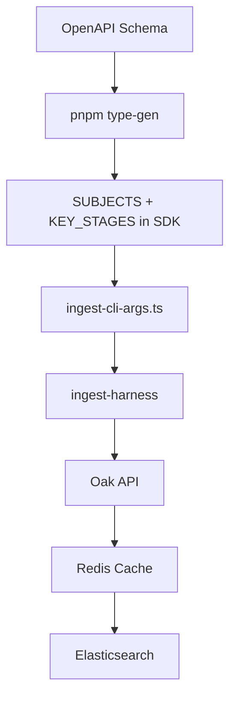

# Semantic Search — Multi-Subject Expansion

**Status**: Part 1 ACTIVE — Focus: Multi-Subject Ingestion + Synonym Validation  
**Master Plan**: [Part 1: Search Excellence](../../plans/semantic-search/part-1-search-excellence/README.md)  
**Last Updated**: 2025-12-28

---

## 📋 EXPLICIT ASSUMPTIONS

### Previous Work (Completed)

1. **CLI Enhancement**: The `--all` flag and schema-derived subjects are implemented and tested (13 unit tests)
2. **Batch-Atomic Ingestion (ADR-087)**: Each (subject, keystage) batch commits immediately to ES — process interruption preserves committed data
3. **Result Pattern (ADR-088)**: SDK adapter uses `Result<T, SdkFetchError>` for explicit error handling; 404/500 errors skip gracefully
4. **Partial Ingestion**: 6 subjects are in ES (english, art, computing, design-technology, citizenship, cooking-nutrition)
5. **ES Reset**: Previous maths/history/geography data was lost when ES was reset for index reconfiguration
6. **Error Types**: `SdkFetchError` discriminated union exists in `src/adapters/sdk-error-types.ts` (to be moved to SDK later)

### Current Work (In Progress)

1. **Ingestion is incomplete**: 11 of 17 subjects still need ingestion
2. **Logs need analysis**: Ingestion logs contain errors that need categorization (intermittent vs data integrity)
3. **Error handling is new**: The Result pattern was just implemented; needs validation through full ingestion cycle
4. **Caching is Redis-based**: SDK responses are cached in Redis when `SDK_CACHE_ENABLED=true`

### Next Work (Blocked)

1. **Synonym quality audit**: Blocked until ingestion is complete — cannot measure impact without representative data
2. **Ground truth expansion**: Current evaluation corpus is GCSE Maths only; needs multi-subject queries
3. **SDK error types migration**: Blocked until Result pattern is validated in search app
4. **Weighting function**: Not yet implemented; planned for synonym candidate prioritization

### Known Risks

1. **Upstream API instability**: 404/500 errors occur intermittently from Oak API
2. **Memory pressure**: Large batches can trigger ES `inference_exception` due to memory limits
3. **Long running process**: Full ingestion takes 2-4 hours and can be interrupted

---

## ⚠️ LOG ANALYSIS REQUIRED

**Action needed**: Analyze ingestion logs to create a stable, reliable, repeatable ingestion process.

### Logs Location

`apps/oak-open-curriculum-semantic-search/logs/`

### Key Log Files to Analyze

| File | Status | Notes |
|------|--------|-------|
| `ingest-english-20251227-223311.log` | ✅ Success | 96 warnings gracefully handled |
| `ingest-2025-12-27-22-33-13.log` | ✅ Success | Same as above (duplicate log) |
| `ingest-2025-12-27-21-05-14.log` | ❌ Failed | 404 error pre-Result pattern |
| `ingest-2025-12-27-17-45-45.log` | ❌ Failed | 500 error pre-batch-atomic |
| `ingest-2025-12-27-15-08-14.log` | ❌ Failed | 404 error pre-Result pattern |

### Analysis Tasks

1. **Categorize errors**: Which are intermittent (retryable) vs data integrity issues (permanent)?
2. **Identify problematic units**: Which unitSlugs consistently fail across runs?
3. **Validate graceful handling**: Confirm new Result pattern logs warnings correctly
4. **Document retry behavior**: Are 404/500 retries working as expected (2 max)?

### Log Parsing Commands

```bash
cd apps/oak-open-curriculum-semantic-search

# Find all 404 errors
grep "404" logs/*.log | jq -r '.Attributes.context.unitSlug // .Body' 2>/dev/null

# Find all 500 errors  
grep "500" logs/*.log | jq -r '.Attributes.context.unitSlug // .Body' 2>/dev/null

# Get issue summary from completed runs
grep "Issue Summary" logs/*.log | jq '.Attributes'

# Find FATAL errors
grep "FATAL ERROR" logs/*.log | jq '.Attributes["exception.stacktrace"]'
```

---

## 📊 INGESTION STATUS (2025-12-28)

### Current Elasticsearch State

| Subject | Lessons | Status | Notes |
|---------|---------|--------|-------|
| english | 1,521 | ✅ Complete | 96 warnings handled (86×404, 10×500) |
| art | 537 | ✅ Complete | From earlier batch run |
| computing | 528 | ✅ Complete | From earlier batch run |
| design-technology | 426 | ✅ Complete | From earlier batch run |
| citizenship | 318 | ✅ Complete | From earlier batch run |
| cooking-nutrition | 108 | ✅ Complete | From earlier batch run |
| **maths** | 0 | ❌ **Needs re-ingestion** | Lost on ES reset |
| **history** | 0 | ❌ **Needs re-ingestion** | Lost on ES reset |
| **geography** | 0 | ❌ **Needs re-ingestion** | Lost on ES reset |
| science | 0 | ❌ Not ingested | — |
| french | 0 | ❌ Not ingested | — |
| spanish | 0 | ❌ Not ingested | — |
| german | 0 | ❌ Not ingested | — |
| religious-education | 0 | ❌ Not ingested | — |
| music | 0 | ❌ Not ingested | — |
| physical-education | 0 | ❌ Not ingested | — |
| rshe-pshe | 0 | ❌ Not ingested | — |

**Total in ES**: ~3,438 lessons across 6 subjects  
**Remaining**: 11 subjects need ingestion

### Verify ES State

```bash
cd apps/oak-open-curriculum-semantic-search
source .env.local && curl -s -H "Authorization: ApiKey $ELASTICSEARCH_API_KEY" \
  "$ELASTICSEARCH_URL/oak_lessons/_search" -H "Content-Type: application/json" \
  -d '{"size": 0, "aggs": {"subjects": {"terms": {"field": "subject_slug", "size": 50}}}}' | jq '.aggregations.subjects.buckets'
```

---

## 🚀 IMMEDIATE ACTION FOR NEW SESSIONS

### 1. Start Redis (required for caching)

```bash
cd apps/oak-open-curriculum-semantic-search
docker compose up -d
```

### 2. Complete Remaining Ingestion

**Priority order** (core curriculum first):

```bash
cd apps/oak-open-curriculum-semantic-search

# Stage 0: Re-ingest previously lost subjects
SDK_CACHE_ENABLED=true pnpm es:ingest-live -- --subject maths
SDK_CACHE_ENABLED=true pnpm es:ingest-live -- --subject history
SDK_CACHE_ENABLED=true pnpm es:ingest-live -- --subject geography

# Stage 1: Core subjects
SDK_CACHE_ENABLED=true pnpm es:ingest-live -- --subject science

# Stage 2: Languages
SDK_CACHE_ENABLED=true pnpm es:ingest-live -- --subject french
SDK_CACHE_ENABLED=true pnpm es:ingest-live -- --subject spanish
SDK_CACHE_ENABLED=true pnpm es:ingest-live -- --subject german

# Stage 3: Remaining subjects
SDK_CACHE_ENABLED=true pnpm es:ingest-live -- --subject religious-education
SDK_CACHE_ENABLED=true pnpm es:ingest-live -- --subject music
SDK_CACHE_ENABLED=true pnpm es:ingest-live -- --subject physical-education
SDK_CACHE_ENABLED=true pnpm es:ingest-live -- --subject rshe-pshe
```

Each subject takes **5-30 minutes** depending on size.

---

## 📋 Architecture: Batch-Atomic Ingestion (ADR-087)

### Data Flow



### How It Works

Each (subject, keystage) pair is a **batch**:
1. Fetch all data for the batch from Oak API
2. Build ES bulk operations in memory
3. **Commit immediately** to Elasticsearch
4. Move to next batch

**Benefits**:
- Process interruption preserves all committed batches
- Graceful error handling per-unit (404/500 → skip, continue)
- Clear progress tracking in logs

### Key Files

| File | Purpose |
|------|---------|
| `src/lib/elasticsearch/setup/ingest-cli-args.ts` | CLI argument parsing with `--all` flag |
| `src/lib/elasticsearch/setup/ingest-cli-args.unit.test.ts` | 13 tests for CLI behavior |
| `src/lib/elasticsearch/setup/ingest-live.ts` | CLI entry point |
| `src/lib/indexing/ingest-harness.ts` | Orchestration |
| `src/lib/indexing/ingest-harness-batch.ts` | Batch iteration |
| `src/adapters/oak-adapter-sdk.ts` | SDK adapter with Result pattern |
| `src/adapters/sdk-error-types.ts` | Typed error discrimination |

### Error Types (ADR-088)

```typescript
type SdkFetchError =
  | SdkNotFoundError      // 404 - skip and continue
  | SdkServerError        // 5xx - skip and continue  
  | SdkRateLimitedError   // 429 - retry with backoff
  | SdkNetworkError       // Network failure - propagate
  | SdkValidationError    // Invalid response - propagate
```

### CLI Usage

```bash
# Single subject
pnpm es:ingest-live -- --subject maths

# Multiple subjects
pnpm es:ingest-live -- --subject maths --subject english

# ALL subjects (17 total from OpenAPI schema)
pnpm es:ingest-live -- --all

# Error: no subjects specified
pnpm es:ingest-live  # ❌ Will throw error
```

---

## 📊 Context: Why Multi-Subject Ingestion?

We are expanding the search system from maths-focused to **all 17 subjects** to:

1. **Enable proper synonym validation** — our KS1/KS2 foundational synonyms (e.g., "describing word" for adjective) cannot be tested with a maths-only index
2. **Build representative ground truth** — current evaluation corpus is GCSE Maths only; need queries across subjects/key stages
3. **Complete the "Index EVERYTHING" principle** — Elasticsearch should be a complete view of the curriculum

---

## 📋 NEXT TASK: Synonym Quality Validation

**Blocked until multi-subject ingestion is complete.**

After ingestion, return to validating synonym quality with a representative ground truth corpus.

**Goal**: Audit existing synonyms for weak entries, add high-value foundational synonyms, and measure impact on search.

**Full plan**: [11-synonym-quality-audit.md](../../plans/semantic-search/part-1-search-excellence/11-synonym-quality-audit.md)

### Why This After Ingestion?

1. **Top 100 curriculum terms have 0% synonym coverage** — the highest-frequency vocabulary is not covered
2. **Existing synonyms are unaudited** — we don't know if any are harming precision
3. **Quick win** — 2-3 hours of work with measurable impact
4. **NOW MEASURABLE** — with multi-subject data, we can actually test foundational synonyms

---

## 🔧 FUTURE WORK

### Move SDK Error Types to SDK Package

**Task**: Move `sdk-error-types.ts` from `apps/oak-open-curriculum-semantic-search/src/adapters/` to `packages/sdks/oak-curriculum-sdk/src/`.

**Rationale**: The `SdkFetchError` discriminated union and related types are SDK-level concerns per ADR-088. They should be:
- Defined once in the SDK
- Generated at type-gen time from OpenAPI schema error responses where possible
- Re-exported from the SDK for consumer apps

**Blocked by**: Completing the initial Result pattern adoption in the search app to validate the error type design.

---

## ⚠️ Critical Architecture: Two Complementary Mechanisms

The SDK `synonymsData` feeds **two parallel search mechanisms**:

### 1. ES Synonym Expansion (Single-Word Tokens)

- **How**: `oak_syns_filter` applies at query time via ES `synonym_graph`
- **When**: Single-word synonyms only (ES tokenizes first, then expands)
- **Precision risk**: **Higher** — expands all query tokens containing the synonym

```text
"guess" for estimate → ES expands query: ["estimate"] → ["estimate", "guess"]
```

### 2. Phrase Detection + Boosting (Multi-Word Terms)

- **How**: `detectCurriculumPhrases()` → `match_phrase` boost in RRF retriever
- **When**: Multi-word terms (cannot expand via ES synonyms)
- **Precision risk**: **Lower** — only boosts documents with exact phrase match

```text
"describing word" for adjective → Phrase boost for documents containing "describing word"
```

### Audit Implication

| Synonym Type | Mechanism | Precision Risk | Audit Focus |
|--------------|-----------|----------------|-------------|
| Single-word (`"guess"`) | ES expansion | **Higher** | Could match broadly |
| Multi-word (`"bottom number"`) | Phrase boost | **Lower** | Exact match only |

**Note**: Most foundational synonyms (e.g., "describing word", "bottom number") are phrases — they use phrase boosting, not ES expansion. This is architecturally safer for precision.

---

## Current State

### Synonym Files (~300 entries total)

| File | Entries | Focus |
|------|---------|-------|
| `maths.ts` | ~119 | GCSE compounds, algebra, geometry |
| `key-stages.ts` | ~106 | KS abbreviations |
| `subjects.ts` | ~51 | Subject name variants |
| `numbers.ts` | ~17 | one↔1, two↔2, etc. |
| `history.ts` | ~13 | Historical periods |
| `education.ts` | ~10 | SEN, CPD, etc. |
| `science.ts` | ~11 | Concepts |
| `computing.ts` | ~6 | NEW — raster/bitmap, etc. |
| `music.ts` | ~8 | NEW — semibreve/whole note |
| `english.ts` | ~8 | Literary terms |
| `geography.ts` | ~8 | Themes |
| `exam-boards.ts` | ~5 | AQA, Edexcel, etc. |

### Key Discovery: Synonym Strategy is Inverted

**See [vocabulary-value-analysis.md](../../research/semantic-search/vocabulary-value-analysis.md)**

- Current synonyms target GCSE compounds (low frequency, high complexity)
- Top 100 curriculum terms (high frequency, foundational) have **0% coverage**
- Value Score = Frequency × (1 + 1/Year) × (1 + 0.2*(subjects-1))
- Highest-value uncovered: `adjective` (678), `noun` (579), `suffix` (378)

### Session Outcomes (2025-12-27/28)

- ✅ Bulk mining complete — all 5 generators working
- ✅ Vocabulary value analysis — scoring framework created
- ✅ 27 LLM-extracted synonyms added (music.ts, computing.ts created)
- ✅ Regex synonym mining archived — 93% noise rate documented
- ✅ Plans 09, 10, 11 created for future work
- ✅ **ADR-087**: Batch-atomic ingestion — each (subject, keystage) commits immediately
- ✅ **ADR-088**: Result pattern for explicit error handling
- ✅ **english** fully ingested with graceful 404/500 handling
- ✅ **art, computing, design-technology, citizenship, cooking-nutrition** ingested
- ⏳ Ingestion of remaining 11 subjects pending

---

## Before You Start

### 1. Read Foundation Documents

1. **[rules.md](../../directives-and-memory/rules.md)** — TDD, quality gates, Result pattern
2. **[11-synonym-quality-audit.md](../../plans/semantic-search/part-1-search-excellence/11-synonym-quality-audit.md)** — Full synonym plan
3. **[vocabulary-value-analysis.md](../../research/semantic-search/vocabulary-value-analysis.md)** — Value scoring

### 2. Verify Quality Gates

```bash
cd /Users/jim/code/oak/ai_experiments/oak-notion-mcp
pnpm type-gen && pnpm build && pnpm type-check && pnpm lint:fix
```

### 3. Check ES State

```bash
cd apps/oak-open-curriculum-semantic-search
source .env.local && curl -s -H "Authorization: ApiKey $ELASTICSEARCH_API_KEY" \
  "$ELASTICSEARCH_URL/_cat/indices/oak_*?v&h=index,docs.count"
```

---

## Key File Locations

### Ingestion System

```text
apps/oak-open-curriculum-semantic-search/
├── src/lib/elasticsearch/setup/ingest-live.ts     ← CLI entry point
├── src/lib/elasticsearch/setup/ingest-cli-args.ts ← Argument parsing
├── src/lib/indexing/ingest-harness.ts             ← Orchestration
├── src/lib/indexing/ingest-harness-batch.ts       ← Batch iteration
├── src/adapters/oak-adapter-sdk.ts                ← SDK adapter (Result pattern)
├── src/adapters/sdk-error-types.ts                ← Typed errors
└── logs/                                           ← Ingestion logs
```

### Synonym Files

```text
packages/sdks/oak-curriculum-sdk/src/mcp/synonyms/
├── index.ts           ← Barrel export
├── maths.ts           ← Largest file (~119 entries)
├── english.ts         ← Target for foundational additions
├── science.ts         ← Check for category errors
├── education.ts       ← Acronyms (likely clean)
└── README.md          ← Documentation
```

### Bulk Vocabulary (for validation)

```text
packages/sdks/oak-curriculum-sdk/src/mcp/vocabulary-graph-data.ts  ← 13K terms with definitions
```

---

## Quality Gate Checkpoints

After any code changes:

```bash
pnpm type-gen
pnpm build
pnpm type-check
pnpm lint:fix
pnpm test
```

After ES deployment:

```bash
cd apps/oak-open-curriculum-semantic-search
pnpm test:smoke
```

---

## Related Documents

- [11-synonym-quality-audit.md](../../plans/semantic-search/part-1-search-excellence/11-synonym-quality-audit.md) — Full plan
- [vocabulary-value-analysis.md](../../research/semantic-search/vocabulary-value-analysis.md) — Value scoring
- [elasticsearch-optimization-opportunities.md](../../research/semantic-search/elasticsearch-optimization-opportunities.md) — ES research
- [synonyms/README.md](../../../packages/sdks/oak-curriculum-sdk/src/mcp/synonyms/README.md) — Lessons learned
- [ADR-087](../../../docs/architecture/architectural-decisions/087-batch-atomic-ingestion.md) — Batch-atomic ingestion
- [ADR-088](../../../docs/architecture/architectural-decisions/088-result-pattern-for-error-handling.md) — Result pattern

---

## Constraints

1. **No new MCP tools** — Search optimisation focus
2. **LLM agent makes final decisions** — Weighting function is first pass only
3. **Scope is ALL subjects** — Not just maths; bulk data covers full curriculum
4. **Measure before and after** — No unmeasured changes

---

**Ready?**

1. Analyze ingestion logs (categorize errors, identify patterns)
2. Complete remaining ingestion (11 subjects)
3. Record baseline MRR
4. Audit existing synonyms (start with maths.ts — largest file)
5. Add foundational synonyms from value-scored list
6. Deploy to ES and measure impact
