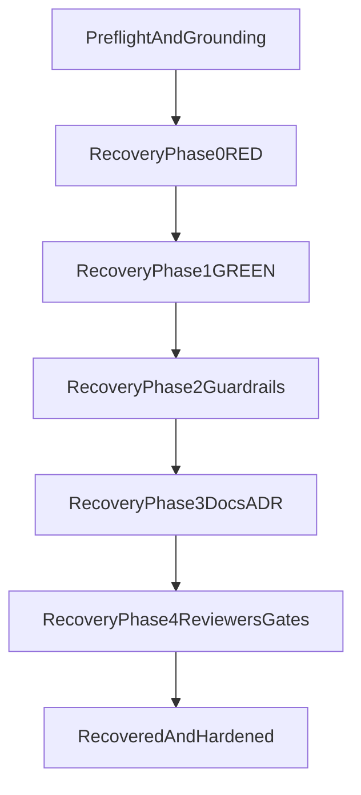

# Semantic Search — Session Entry Point

**Last Updated**: 2026-03-14 (recovery lane active; Phase 0/1 complete, Phase 2 remediation tranche + Phase 3/4 closeout pending)

This prompt is intentionally short and operational. Long-lived architecture,
history, and completed phase detail lives in ADRs, roadmap, and archived plans.

---

## Immediate Context

**Branch context**: use current checkout and verify explicitly; do not assume a branch name.

**Session entry state**:

- Primary active lane is now recovery execution:
  `semantic-search-recovery-and-guardrails.execution.plan.md`.
- Boundary lane (`search-cli-sdk-boundary-migration`) is complete and retained as evidence.
- Latest execution state: recovery work has already completed baseline and
  salvage closure, and has landed runtime guardrail implementation updates
  (including lease hardening and strict metadata-mapping contract checks).
  Start the next session with a comprehensive review/fix/re-review cycle
  before further implementation.

Current priorities:

1. [semantic-search-recovery-and-guardrails.execution.plan.md](../../plans/semantic-search/active/semantic-search-recovery-and-guardrails.execution.plan.md) (primary active recovery + anti-recurrence guardrails lane)
2. [semantic-search-ingest-runbook.md](../../plans/semantic-search/active/semantic-search-ingest-runbook.md) (operator-run lifecycle runbook lane)
3. [cli-robustness.plan.md](../../plans/semantic-search/active/cli-robustness.plan.md) (historical incident lane retained for prior failure evidence)
4. [semantic-search-scheduled-refresh.operations.plan.md](../../plans/semantic-search/active/semantic-search-scheduled-refresh.operations.plan.md) (scheduled refresh operations lane: incremental-first with full re-ingest fallback; depends on recovery landing)
5. [search-cli-sdk-boundary-migration.execution.plan.md](../../plans/semantic-search/archive/completed/search-cli-sdk-boundary-migration.execution.plan.md) (completed boundary lane, retained as evidence)

Current phase snapshot:

- Phase 0 (baseline evidence): complete
- Phase 1 (salvage/closure): complete
- Phase 2 (runtime guardrails + test/type remediation tranche): in progress
- Phase 3 (docs + ADR sync): in progress
- Phase 4 (reviewers + full gates): pending

Reviewer findings traceability:

- The authoritative findings register is in
  `semantic-search-recovery-and-guardrails.execution.plan.md` under
  **Reviewer Findings Register (round 1, 2026-03-14)**.
- Findings are actionable by default. Reject only when incorrect and record
  rationale/evidence in that register.
- Current must-fix ID set: `R1` to `R9`.

Boundary doctrine is now anchored in
[ADR-134](../../../docs/architecture/architectural-decisions/134-search-sdk-capability-surface-boundary.md).

---

## Session Start (authoritative — follow this sequence exactly)

### Step 1: Ground

Re-ground via:

- [start-right-thorough.md](../../skills/start-right-thorough/shared/start-right-thorough.md)
- [AGENT.md](../../directives/AGENT.md)
- [principles.md](../../directives/principles.md)
- [testing-strategy.md](../../directives/testing-strategy.md)
- [schema-first-execution.md](../../directives/schema-first-execution.md)

### Step 2: Verify state

```bash
git status --short
git branch --show-current
ls -1 .agent/plans/semantic-search/active
cd apps/oak-search-cli
pnpm tsx bin/oaksearch.ts admin validate-aliases
pnpm tsx bin/oaksearch.ts admin meta get
pnpm tsx bin/oaksearch.ts admin count
cd ../..
set -a && source ".env" && set +a
curl -sS -H "Authorization: ApiKey ${ELASTICSEARCH_API_KEY}" \
  "${ELASTICSEARCH_URL}/oak_meta/_mapping"
```

After these checks, skip straight to the appropriate recovery plan phase only
if aliases are healthy, metadata lineage is coherent, and `oak_meta` mapping
includes the required generated metadata contract fields (with
`previous_version` as a sentinel).

### Step 3: Start with full review/fix cycle

Before any new implementation work in the lane:

1. Run the full reviewer roster from recovery plan Phase 4 Task 4.1 in readonly mode.
2. Implement all findings by default; reject only when incorrect, with written rationale and evidence.
   Use reviewer finding IDs (`R1` to `R9`) from the recovery plan register in
   implementation notes and review responses.
3. Re-run affected reviewers iteratively until no unresolved must-fix/high findings remain.
4. Update ADRs/docs immediately for any accepted behavioural or architectural change.

### Step 4: Read plans and ADRs

- [semantic-search-recovery-and-guardrails.execution.plan.md](../../plans/semantic-search/active/semantic-search-recovery-and-guardrails.execution.plan.md) — primary active lane
- [semantic-search-ingest-runbook.md](../../plans/semantic-search/active/semantic-search-ingest-runbook.md) — operator-run lifecycle checklist
- [cli-robustness.plan.md](../../plans/semantic-search/active/cli-robustness.plan.md) — supporting incident evidence lane (read-only context)
- [ADR-134](../../../docs/architecture/architectural-decisions/134-search-sdk-capability-surface-boundary.md) — Search SDK read/admin boundary doctrine
- [ADR-108](../../../docs/architecture/architectural-decisions/108-sdk-workspace-decomposition.md) — two-pipeline architecture and boundary invariants

### Step 5: Execute recovery plan phases in order

1. **Phase 0 RED**: capture deterministic live baseline and prove missing
   guardrails with failing tests.
2. **Phase 1 GREEN**: read-only preflight, additive mapping reconciliation,
   metadata-alias coherence repair, salvage promote, hard postchecks.
3. **Phase 2 GREEN** (after incident closure): runtime invariants, alias swap
   safety with `must_exist=true`, distributed Elasticsearch-backed lease, and
   remediation of known test-doctrine/type-discipline findings.
4. **Phase 3 REFACTOR**: docs/ADR propagation, CLI and SDK README updates.
5. **Phase 4 closeout**: specialist reviews, full quality gates.

Resume rule:

- If a phase already meets closure criteria with evidence, do not re-run it.
- Continue from the first incomplete phase and keep evidence additive.

**Phase transition rules**:

- Do not start Phase 1 until Phase 0 evidence pack is complete and internally consistent.
- Do not start Phase 2 until incident closure is proven by healthy promote postchecks.
- Do not start Phase 3 until invariant and lock guardrail tests are green.
  The known test taxonomy/type-discipline remediation tranche in Phase 2 must
  also be complete before Phase 3 starts.
  Phase 2 closeout gates can complete after Phase 3 starts, but only when those
  guardrail tests are already green.
- Do not start Phase 4 until docs/ADR propagation is complete and lane docs agree.

Use `cli-robustness.plan.md` only as supporting context when reconciling prior
incident evidence.

**Hard sequencing rule**: never promote, retry, or release lock after a
post-mutation failure until immediate readback triage (`validate-aliases`,
`meta get`, `count`) is complete.

---

## Operator-Run Ingest Protocol

When the flow reaches `admin versioned-ingest` (or `admin stage`):

1. The agent prepares the exact command and pre-check context.
2. The operator starts ingest independently.
3. The agent monitors output, diagnoses failures, and continues remediation.

The agent must not independently start ingest/stage commands unless the operator
explicitly requests that override in the current session.

Before any ingest/promote execution, run a read-only mapping gate and confirm
live `oak_meta` mapping contains `previous_version`. If absent, stop and
remediate mapping contract drift first.

Record outcome in the recovery plan evidence trail as each phase closes; keep
`semantic-search-ingest-runbook.md` aligned with any sequencing or stop/go
updates.

---

## Goal and Source-of-truth Inputs

**Goal**: Recover live lifecycle integrity safely, salvage staged data when
valid, and land permanent anti-recurrence guardrails with deterministic closure
evidence.

**Source-of-truth inputs**:

- This prompt (session entry)
- `semantic-search-recovery-and-guardrails.execution.plan.md` (execution detail)
- `semantic-search-ingest-runbook.md` (operator lifecycle checklist)
- `cli-robustness.plan.md` (supporting incident evidence)
- Foundations: `principles.md`, `testing-strategy.md`, `schema-first-execution.md`

**Authority split**:

- This prompt controls lane selection and start order.
- The recovery plan controls task-level execution and phase closure criteria.
- The ingest runbook controls operator stop/go sequencing and triage commands.
- `cli-robustness.plan.md` is historical evidence only, not execution authority.

### Dependency Map



---

## Evidence and Exit Criteria

- **Incident**: no strict mapping exception for `previous_version`,
  `versioned-ingest` exits 0, post-ingest alias targets healthy.
- **CLI promote command surface**: use `admin promote --target-version <v>`.
- **Salvage** (when applicable): staged version index family exists with
  expected counts and can be promoted successfully once mapping drift is fixed.
- **Boundary**: non-admin CLI cannot import `@oaknational/oak-search-sdk/admin`;
  no app deep/internal imports; index-resolver sourced from SDK `/read` surface.
- **Governance**: reviewer findings resolved or explicitly owner-triaged; all
  quality gates pass without bypasses.
  Owner-triaged means implemented, or explicitly rejected as incorrect with
  written rationale and evidence (never silent deferral).
  Required comprehensive review roster for closeout includes:
  `code-reviewer`, `test-reviewer`, `type-reviewer`, `docs-adr-reviewer`,
  `elasticsearch-reviewer`, `security-reviewer`, and the full architecture
  quartet (`architecture-reviewer-barney`, `architecture-reviewer-betty`,
  `architecture-reviewer-fred`, `architecture-reviewer-wilma`), with iterative
  re-review until no unresolved must-fix/high findings remain.

Next-session must-fix tranche is authored in the recovery plan
(`semantic-search-recovery-and-guardrails.execution.plan.md`) Task 2.3.
Treat that task as the single source of truth for remediation scope.

---

## Scope Controls (Non-goals)

- No compatibility layers.
- No fallback dynamic-mapping workarounds.
- No reopening completed historical phases without new regression evidence.
- No expansion into unrelated roadmap items outside the active recovery lane.

---

## Lane Indexes

- [Active Plans](../../plans/semantic-search/active/README.md)
- [Current Queue](../../plans/semantic-search/current/README.md)
- [Roadmap](../../plans/semantic-search/roadmap.md)
- [Archive](../../plans/semantic-search/archive/completed/)
