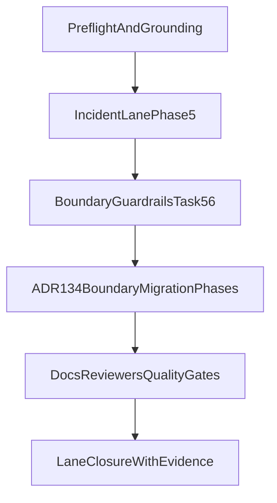

# Semantic Search — Session Entry Point

**Last Updated**: 2026-03-12 (standalone-next-session hardened + long-term boundary closeout)

This prompt is intentionally short and operational. Long-lived architecture,
history, and completed phase detail lives in ADRs, roadmap, and archived plans.

---

## Immediate Context

**Branch context**: use current checkout and verify explicitly; do not assume a branch name.

**Session entry state**:

- Boundary lane (`search-cli-sdk-boundary-migration`) is complete and retained as evidence.
- Start with incident lane execution (`cli-robustness`) and keep boundary checks green.

Current priorities:

1. [cli-robustness.plan.md](../../plans/semantic-search/active/cli-robustness.plan.md) (active incident lane)
2. [search-cli-sdk-boundary-migration.execution.plan.md](../../plans/semantic-search/active/search-cli-sdk-boundary-migration.execution.plan.md) (completed boundary lane, retained as evidence)

Boundary doctrine is now anchored in
[ADR-134](../../../docs/architecture/architectural-decisions/134-search-sdk-capability-surface-boundary.md).

---

## Current Standalone Start Path

Treat this prompt plus
[cli-robustness.plan.md](../../plans/semantic-search/active/cli-robustness.plan.md) and
[search-cli-sdk-boundary-migration.execution.plan.md](../../plans/semantic-search/active/search-cli-sdk-boundary-migration.execution.plan.md)
as the standalone entrypoint for the next session.

Run this first:

```bash
cd apps/oak-search-cli
pnpm tsx bin/oaksearch.ts admin validate-aliases
```

This initial `validate-aliases` check is the one allowed pre-refactor exception to the
later lifecycle-chain sequencing rule. It is a bootstrap health check, not a full
`validate-aliases -> versioned-ingest -> validate-aliases` run.

Then follow the plan re-entry branch:

- If initial `validate-aliases` fails, classify failure cause first
  (connectivity/auth/cluster health vs metadata mapping contract). Execute
  metadata schema/mapping remediation only for confirmed contract failures.
- If `versioned-ingest` fails with metadata contract evidence
  (`strict_dynamic_mapping_exception` path), execute the metadata
  schema/mapping remediation checkpoint.
- If post-ingest `validate-aliases` fails, treat this as active incident
  remediation and re-run validation after fix before entering Phase 4.
- If aliases are healthy and `versioned-ingest` passes, complete remaining
  incident-lane Phase 5 REFACTOR and then enter formal Phase 4 closeout.

### Operator-Run Ingest Protocol (authoritative)

When the flow reaches `admin versioned-ingest` (or `admin stage`):

1. The agent prepares the exact command and pre-check context.
2. The operator starts ingest independently.
3. The agent monitors output, diagnoses failures, and continues remediation.

The agent must not independently start ingest/stage commands in this lane unless
the operator explicitly requests that override in the current session.

Record outcome by appending a dated bullet under
**Next Session Bootstrap (Standalone Entry Point)** in
`cli-robustness.plan.md` before moving to any other semantic-search lane.

---

## Integrated Unified Runbook Contract

This prompt is now self-contained for next-session execution.

### Goal

Close the active `semantic-search` work by finishing refactoring and ADR-134
boundary enforcement first, then running CLI lifecycle validation, and
finishing with deterministic closure evidence.

### Source-of-truth Inputs

- Session prompt: this file
- Incident lane: `cli-robustness.plan.md`
- Boundary lane: `search-cli-sdk-boundary-migration.execution.plan.md`
- Doctrine: `docs/architecture/architectural-decisions/134-search-sdk-capability-surface-boundary.md`
- Foundations:
  - `.agent/directives/principles.md`
  - `.agent/directives/testing-strategy.md`
  - `.agent/directives/schema-first-execution.md`

### Execution Order (authoritative)

1. Re-ground on foundations and confirm branch/worktree state.
2. Complete incident-lane refactoring obligations first:
   - `cli-robustness` Phase 5 GREEN/REFACTOR implementation tasks
     (excluding ingest execution)
   - verify ADR-134 boundary enforcement remains green; do not reopen the
     completed boundary lane unless new regression evidence appears
3. Only after Step 2 is complete, run incident lifecycle validation chain:
   `validate-aliases` -> `versioned-ingest` -> `validate-aliases`.
4. `versioned-ingest` is operator-run: the operator starts ingest; the agent
   monitors and diagnoses.
5. Perform docs/ADR propagation and full gates only after both lanes'
   acceptance criteria pass.

**Hard sequencing rule**: do not run the lifecycle ingest path until the
incident-lane preflight checks are complete and boundary enforcement remains green.

### Implementation Phases

#### Phase 0 — Preflight and Baseline Capture

- Re-read foundations and ADR-134.
- Capture deterministic baseline (`git status --short`, `git branch --show-current`,
  active plan inventory).
- Capture current boundary signals with package-scoped lint/type checks.

#### Phase 1 — Incident Lane Completion (`cli-robustness`)

- Execute Task 5.1–5.5 to close `previous_version` strict mapping contract drift.
- Confirm artefact coherence via `pnpm sdk-codegen`, `pnpm build`, `pnpm type-check`.
- Re-run lifecycle validation chain only after boundary refactor/enforcement
  completion; prove alias health plus rollback-branch closure.
- Complete Phase 5 REFACTOR cleanup and preserve fail-fast diagnostics.

#### Phase 2 — Boundary Doctrine Verification (`search-cli-sdk-boundary-migration`)

- Confirm completed ADR-134 lane remains green:
  - lint fitness still enforces default non-admin policy for `src/**/*.ts`
  - privileged imports remain explicitly scoped to `src/cli/admin/**`,
    `src/lib/indexing/**`, and `src/adapters/**`
  - evaluation/operations remain mixed-capability but blocked from SDK root/internal paths
  - fixture proofs remain passing
  - SDK read surface remains canonical source of shared index-resolver primitives
    used by both read and admin consumers
  - docs/ADR links remain current
- Reopen boundary lane only if new evidence shows regression.

#### Phase 3 — Unified Closeout

- Complete specialist reviewer passes:
  `test-reviewer`, `type-reviewer`, `docs-adr-reviewer`, `elasticsearch-reviewer`,
  and re-check `code-reviewer` when needed.
- Propagate docs/ADR updates to CLI and SDK READMEs plus ADR index consistency.
- Run full one-gate-at-a-time quality sequence from repo root.

### Cross-lane Dependency Map



### Evidence and Exit Criteria

- Incident evidence: no strict mapping exception for `previous_version`,
  `versioned-ingest` exits 0, post-ingest alias targets healthy.
- Boundary evidence: non-admin CLI cannot import
  `@oaknational/oak-search-sdk/admin`; no app deep/internal imports; root
  surface no admin/internal leakage; index-resolver constants/functions are
  sourced from SDK `/read` surface (not transitive admin/internal paths).
- Governance evidence: reviewer findings resolved or explicitly owner-triaged;
  all quality gates pass without bypasses.

### Scope Controls (Non-goals)

- No compatibility layers.
- No fallback dynamic-mapping workarounds.
- No reopening already-completed historical phases without new regression evidence.
- No expansion into unrelated semantic-search roadmap items outside the two active lanes.

---

## Immediate Next-session Actions

If a new session starts from this prompt alone, do this exact sequence:

1. Re-ground and capture baseline (`git status --short`, `git branch --show-current`,
   `ls -1 .agent/plans/semantic-search/active`).
2. Complete remaining incident refactor tasks first (no lifecycle ingest yet).
3. Re-run lint/type/build checks for `@oaknational/oak-search-sdk` and
   `@oaknational/search-cli`.
4. When incident-lane acceptance criteria are met, run lifecycle
   validation chain with operator-run ingest:
   - agent runs pre/post alias validation
   - operator runs `admin versioned-ingest`
   - agent monitors and diagnoses
5. Proceed to reviewer + docs + full-gate closeout.

---

## Standalone Session Bootstrap

Run this checklist at the start of the next session:

1. Re-ground via:
   - [start-right-thorough.md](../../skills/start-right-thorough/shared/start-right-thorough.md)
   - [AGENT.md](../../directives/AGENT.md)
   - [principles.md](../../directives/principles.md)
   - [testing-strategy.md](../../directives/testing-strategy.md)
   - [schema-first-execution.md](../../directives/schema-first-execution.md)
2. Verify current state before planning or coding:

   ```bash
   git status --short
   git branch --show-current
   ls -1 .agent/plans/semantic-search/active
   ```

3. If the session touches historical SDK workspace separation concerns, use the
   archived plan and baseline files directly rather than replaying the old split
   verification by default.

4. Read boundary-critical ADRs:
   - [ADR-108](../../../docs/architecture/architectural-decisions/108-sdk-workspace-decomposition.md) — two-pipeline architecture, consumer model, boundary invariants, 4-workspace vision
   - [ADR-134](../../../docs/architecture/architectural-decisions/134-search-sdk-capability-surface-boundary.md) — Search SDK read/admin boundary doctrine
   - [ADR-065](../../../docs/architecture/architectural-decisions/065-turbo-task-dependencies.md) — turbo task dependencies and caching
   - [ADR-086](../../../docs/architecture/architectural-decisions/086-vocab-gen-graph-export-pattern.md) — vocab pipeline ownership
5. Read the active execution plan you are working from:
   - [cli-robustness.plan.md](../../plans/semantic-search/active/cli-robustness.plan.md) — current active lane; execute the metadata remediation checkpoint first
   - [search-cli-sdk-boundary-migration.execution.plan.md](../../plans/semantic-search/active/search-cli-sdk-boundary-migration.execution.plan.md) — executable plan for strict CLI/SDK capability boundary migration and lint fitness enforcement
6. Use lane indexes for everything else:
   - [Active Plans](../../plans/semantic-search/active/README.md)
   - [Current Queue](../../plans/semantic-search/current/README.md)
   - [Roadmap](../../plans/semantic-search/roadmap.md)

---

## Execution Ordering Note

Run the `cli-robustness` re-entry checkpoint first; it is authoritative for
incident-state capture and metadata remediation. Boundary migration is
authoritative for ADR-134 capability-boundary changes and enforcement.

If both lanes are active concurrently, use separate branches/worktrees and
rebase boundary migration frequently on incident-lane changes to shared files.
Formal incident-lane closeout remains blocked on Phase 5 REFACTOR plus
lifecycle validation evidence.

Queue and archive references live in:

- [Current Queue](../../plans/semantic-search/current/README.md)
- [Archive Completed](../../plans/semantic-search/archive/completed/)
