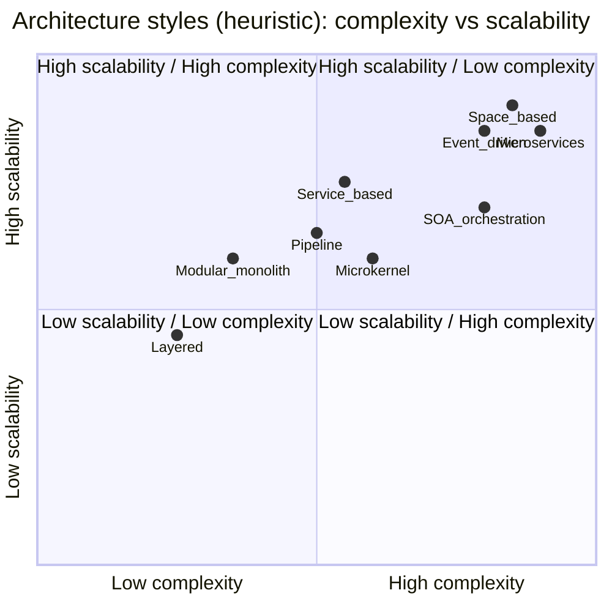
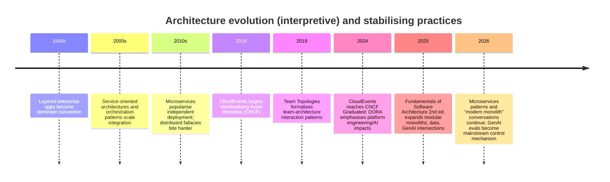

# Fundamentals of Software Architecture by Richards & Ford

## Executive summary

*Fundamentals of Software Architecture* (Mark Richards, Neal Ford) is positioned as a practical “modern engineering” guide to architecture, built around a core premise: architecture is about making and continuously revisiting trade-offs in context, not finding a single “best” answer. The latest (2nd) edition (March 2025) expands and standardises the comparison of architecture styles, and explicitly adds/updates material on modular monoliths, microservices/event-driven architectures, governance, team topologies, data topologies, and generative AI intersections. [[1]](https://www.oreilly.com/library/view/fundamentals-of-software/9781098175504/)

The book’s strongest contribution is an integrated decision-making framework that links: (a) **architectural characteristics** (quality attributes / “-ilities”), (b) **structure** (styles and patterns), (c) **architectural decisions** and their documentation/governance, and (d) **organisational/operational realities** (cloud, DevOps, team shape, and now GenAI). This breadth is visible chapter-by-chapter in the 2nd edition contents: foundations (characteristics/modularity/components), styles (layered → modular monolith → pipeline → microkernel → service-based → event-driven → space-based → orchestration-driven SOA → microservices), then techniques/soft skills (ADRs, risk storming, diagramming standards, team effectiveness, negotiation, and “architectural intersections”). [[2]](https://www.oreilly.com/library/view/fundamentals-of-software/9781098175504/)

Key “engineering approach” mechanisms advocated or strongly implied by the structure of the 2nd edition include: 
- **Fitness functions** and automated governance to preserve key architectural characteristics over time (tying architectural intent to objectively checkable signals in pipelines/production). [[3]](https://www.oreilly.com/library/view/fundamentals-of-software/9781098175504/) 
- Explicit treatment of **distributed-systems realities** via the “fallacies” (e.g., latency is not zero, the network is not reliable) and the practical consequences for coupling, scalability, observability, and cost. [[2]](https://www.oreilly.com/library/view/fundamentals-of-software/9781098175504/) 
- **Architectural quanta** as a scoping/granularity tool tied to cohesion and synchronous coupling. [[4]](https://www.oreilly.com/library/view/fundamentals-of-software/9781098175504/) 
- A pragmatic style of decision-making: **ADRs** to avoid decision anti-patterns (re-litigating decisions, hiding decisions in email/threads, decision paralysis disguised as documentation). [[5]](https://www.oreilly.com/library/view/fundamentals-of-software/9781098175504/) 

Modern critiques and alternatives (2020–2026) broadly reinforce the book’s stance: microservices can enable independent deployment and strong module boundaries, but often a well-structured monolith is better for many contexts; modular monoliths are increasingly discussed as an intentional “middle” path; and academic reviews highlight that microservices and event-driven architectures introduce significant performance/monitoring/testing challenges that are frequently under-evidenced in the literature—making context-specific trade-off analysis essential. [[6]](https://martinfowler.com/microservices/)

## Core framework distilled from the book and modern references

The 2nd edition’s table of contents makes the book’s operating model explicit: architects start by clarifying what matters (**architectural characteristics**), then shape the system structure (**styles/patterns/components**) to satisfy those characteristics, and then keep the architecture healthy through **governance**, **risk analysis**, **documentation**, and organisational alignment (teams/operations/business). [[2]](https://www.oreilly.com/library/view/fundamentals-of-software/9781098175504/)

### Canonical definitions and “translation layer” to current standards

The book uses “architectural characteristics” as a central organising idea (operational, structural, cloud, cross-cutting). [[2]](https://www.oreilly.com/library/view/fundamentals-of-software/9781098175504/) In wider architecture literature and standards, these map closely to **quality attributes** and stakeholders’ concerns captured in architecture descriptions (ADs). ISO/IEC/IEEE 42010:2022 specifies requirements for architecture descriptions, including the need to address stakeholders and concerns through viewpoints/views. [[7]](https://www.iso.org/standard/74393.html)

A practical way to reconcile terminology across the book, standards, and cloud frameworks:

| Concept in Richards & Ford | Canonical/standard-adjacent phrasing | Practical “so what” |
|---|---|---|
| Architectural characteristics | Quality attributes / non-functional requirements / cross-cutting concerns | Make them explicit, prioritised, and testable; treat them as first-class constraints. [[8]](https://www.oreilly.com/library/view/fundamentals-of-software/9781098175504/) |
| Governance & fitness functions | Continuous conformance checks (“architecture as code” mindset) | Encode constraints into pipelines/monitors; prevent drift through automation and feedback loops. [[9]](https://www.oreilly.com/library/view/fundamentals-of-software/9781098175504/) |
| Architectural decisions (ADRs) | Decision log / decision record practice | Avoid repeating debates and losing rationale; keep decisions versioned and searchable. [[10]](https://www.oreilly.com/library/view/fundamentals-of-software/9781098175504/) |
| Architectural quanta | Deployable unit with strong cohesion and synchronous coupling | Use to reason about granularity and the true “unit of deployment/change”. [[11]](https://www.oreilly.com/library/view/fundamentals-of-software/9781098175504/) |
| “Least worst” architecture | Contextual optimisation under constraints | Stop searching for “perfect”; choose the best trade-off set, then evolve. [[2]](https://www.oreilly.com/library/view/fundamentals-of-software/9781098175504/) |

### The book’s decision loop as an engineering system

The following diagram is a faithful synthesis of the 2nd edition’s content structure (characteristics → scoping/components → styles/patterns → decisions/governance → operations/teams → iterate), plus modern mechanisms for automation (fitness functions, observability).

```mermaid
flowchart LR
  A[Business & domain drivers] --> B[Architectural characteristics\n(operational/structural/cloud/cross-cutting)]
  B --> C[Scope & granularity\n(architectural quanta)]
  C --> D[Component-based thinking\n(logical vs physical)]
  D --> E[Select architecture style(s)\n& supporting patterns]
  E --> F[Architectural decisions\n(ADRs, principles, constraints)]
  F --> G[Governance via automation\n(fitness functions in CI/CD,\npolicy-as-code, quality gates)]
  G --> H[Run & learn\n(SRE/DevOps metrics,\nobservability, incidents)]
  H --> B
```

This loop aligns well with modern “Well-Architected” cloud frameworks, which explicitly treat architecture as a continuous lifecycle of trade-offs across reliability/security/performance/cost/operations/sustainability. [[12]](https://docs.aws.amazon.com/wellarchitected/latest/framework/welcome.html)

### Fitness functions as the bridge between intent and reality

Richards/Ford strongly connect governance to measurable checks; in the broader evolutionary architecture literature, an architectural fitness function is defined as providing an **objective integrity assessment** of one or more architectural characteristics, implemented via existing mechanisms (tests, metrics, monitors, chaos engineering). [[13]](https://evolutionaryarchitecture.com/ffkatas/)

Concrete, modern examples of fitness functions (tooling referenced is illustrative, not mandatory):

- **Structural modularity guardrails**: fail builds when cyclic dependencies appear between modules/components (static analysis), mirroring the book’s modularity emphasis. [[14]](https://www.oreilly.com/library/view/fundamentals-of-software/9781098175504/) 
- **SLO/error-budget guardrails**: if error budget burn exceeds thresholds, restrict risky changes (a direct operationalisation of “operational characteristics first”). Google’s SRE guidance describes implementing SLOs and monitoring burn rate. [[15]](https://sre.google/workbook/implementing-slos/) 
- **Architecture constraints as tests**: enforce layering rules or “no cross-module imports” as unit tests. This is consistent with the broader “fitness function-driven development” idea. [[16]](https://www.thoughtworks.com/insights/articles/fitness-function-driven-development) 

## Chapter-by-chapter map of extracted concepts, patterns, and practical guidance

The mapping below is derived from the 2nd edition’s published contents (chapter topics and subtopics). [[2]](https://www.oreilly.com/library/view/fundamentals-of-software/9781098175504/) The “enhancements” column shows high-quality modern sources that deepen or operationalise each chapter’s ideas.

| Chapter | Key extracted concepts / patterns | Practical guidance emphasis | Modern cross-references (selected) |
|---|---|---|---|
| Introduction | Definition of software architecture; expectations of an architect; laws (trade-offs, “why”); roadmap | Architecture as decision-making + continuous analysis; not a static artefact | Microservices trade-off framing (“many situations better with a monolith”). [[17]](https://martinfowler.com/microservices/) |
| Architectural Thinking | Architecture vs design; breadth; trade-offs; “personal radar” | Develop breadth without losing depth; treat trade-offs as the job | DORA research emphasises platform engineering and organisational factors affecting delivery outcomes. [[18]](https://research.google/pubs/dora-accelerate-state-of-devops-2024-report/) |
| Modularity | Modularity vs granularity; cohesion/coupling; metrics; distance-from-main-sequence; connascence | Use measurable modularity signals, not vibes; reduce high-strength coupling | JDepend defines distance-from-main-sequence and related metrics; connascence taxonomy references. [[19]](https://www.oreilly.com/library/view/fundamentals-of-software/9781098175504/) |
| Architectural Characteristics Defined | Operational/structural/cloud/cross-cutting; trade-offs; “least worst” architecture | Make characteristics explicit and prioritised; accept trade-offs | AWS/Azure/Google well-architected frameworks: pillars as structured non-functional lenses. [[12]](https://docs.aws.amazon.com/wellarchitected/latest/framework/welcome.html) |
| Identifying Characteristics | Extract characteristics from domain concerns; explicit vs implicit; limit/prioritise; katas | Turn business language into testable characteristics; prioritise ruthlessly | ISO 42010: stakeholders/concerns in architecture descriptions (formal structure for capturing “what matters”). [[20]](https://www.iso.org/standard/74393.html) |
| Measuring & Governing | Operational/structural/process measures; governance; fitness functions | Automate architecture governance; treat it like engineering | Fitness functions definition and practice guidance. [[21]](https://evolutionaryarchitecture.com/ffkatas/) |
| Scope of Characteristics | Architectural quanta; synchronous communication; scoping impacts; cloud scoping | Use “quantum” to reason about deployability/coupling and right-sized boundaries | Architectural quanta definition and trade-off discussion. [[22]](https://ebrary.net/54015/economics/architectural_quanta_granularity) |
| Component-Based Thinking | Logical vs physical; identifying components; coupling (static/temporal); Law of Demeter | Create a logical architecture and validate it with stories/roles; manage coupling types | C4 model to communicate at multiple abstraction levels (system→container→component→code). [[23]](https://c4model.com/) |
| Foundations (Styles) | Styles vs patterns; Big Ball of Mud; client/server; partitioning; distributed fallacies; team topologies linkage | Understand why distribution hurts; avoid accidental complexity; tie structure to teams | Team Topologies key concepts; DORA’s emphasis on platform engineering; distributed fallacies appear as core warning set. [[24]](https://teamtopologies.com/key-concepts) |
| Layered | Layers, isolation; data topologies; governance; team topology considerations; use/avoid | Guard layer boundaries; be explicit about data access rules | Layering enforcement via tests/static analysis and quality gates (generalised). [[25]](https://www.oreilly.com/library/view/fundamentals-of-software/9781098175504/) |
| Modular Monolith | Monolithic vs modular structure; module communication; data topologies; governance; use/avoid | Build modularity first; preserve boundaries; evolve safely | Spring Modulith (official) for “modular monoliths with Spring Boot”; recent research: modular monolith trend and definitions. [[26]](https://docs.spring.io/spring-modulith/reference/index.html) |
| Pipeline | Filters/pipes; data topologies; cloud considerations; risks | Ideal for staged transformations/stream processing; watch backpressure/error handling | “Pipes and filters” is a canonical architectural pattern; modern stream processing toolchains often embody it (general). [[2]](https://www.oreilly.com/library/view/fundamentals-of-software/9781098175504/) |
| Microkernel | Core system + plug-in components; registry/contracts; risks (volatile core, plugin deps) | Make extension points explicit; manage compatibility and plugin isolation | Microkernel as “plug-in architecture”; academic/teaching materials cite IDEs/Jenkins as examples. [[27]](https://www.oreilly.com/library/view/fundamentals-of-software/9781098175504/) |
| Service-Based | Service granularity; UI and API gateway options; data topologies; risks | Coarse-grained services as pragmatic distributed option; avoid microservices’ overhead when not needed | Author materials compare service-based vs microservices (structural/operational). [[28]](https://www.oreilly.com/library/view/fundamentals-of-software/9781098175504/) |
| Event-Driven | Events vs messages; derived events; error handling; preventing data loss; mediated EDA; payload risks; swarm-of-gnats antipattern | Design events deliberately; treat schemas, idempotency, and observability as first-class | CloudEvents spec for interoperable event metadata; AsyncAPI for documenting event-driven APIs; author lesson on swarm-of-gnats. [[29]](https://github.com/cloudevents/spec) |
| Space-Based | Processing units; data grids; data pumps/readers/writers; scaling and collision risks; ticketing/auction examples | Use when DB scalability is the bottleneck and concurrency spikes are extreme | Space-based architecture references in IMDG products (e.g., GigaSpaces) as a concrete implementation style. [[30]](https://docs.gigaspaces.com/latest/overview/space-based-architecture.html) |
| Orchestration-driven SOA | Taxonomy; reuse vs coupling; risks; governance | Central orchestration can help coordinate complex flows, but can centralise coupling | Modern saga orchestration tooling (e.g., “orchestration vs choreography”) is widely discussed in distributed transactions. [[31]](https://www.oreilly.com/library/view/fundamentals-of-software/9781098175504/) |
| Microservices | Bounded context; data isolation; choreography/orchestration; transactions & sagas; risks; cloud/team topology considerations | Independent deployability and strong boundaries—at a high ops/complexity cost | Microservices trade-off guidance; saga pattern documentation; academic “pains/gains” and performance/scaling reviews. [[32]](https://martinfowler.com/microservices/) |
| Choosing a Style | “Fashion” shifts; decision criteria; case studies | Use decision criteria not trends; apply to monolith/modular monolith/microkernel/distributed | Empirical studies on microservices patterns vs quality trade-offs support formal criteria. [[33]](https://arxiv.org/abs/2201.03598) |
| Architectural Patterns | Reuse; domain vs operational coupling; communication; orchestration vs choreography; CQRS; infrastructure broker-domain pattern | Patterns as targeted solutions inside styles; focus on coupling dimensions | CQRS and Saga patterns (official Azure architecture patterns). [[34]](https://learn.microsoft.com/en-us/azure/architecture/patterns/cqrs) |
| Architectural Decisions | Decision anti-patterns; architectural significance; ADRs; GenAI/LLMs in decisions | Make decisions explicit, recorded, and governable; use ADRs as living docs | ADR origin and modern guidance; UK GDS ADR guidance; Fowler ADR update. [[35]](https://cognitect.com/blog/2011/11/15/documenting-architecture-decisions) |
| Analysing Risk | Risk matrix; risk storming phases; user-story risk analysis | Make risk identification collaborative and continuous | Risk-storming technique guidance; author lesson on risk storming. [[36]](https://riskstorming.com/) |
| Diagramming | UML, C4, ArchiMate; diagram guidelines | Communicate at the right abstraction for the audience | C4 model official; UML and ArchiMate official sources. [[37]](https://c4model.com/) |
| Making Teams Effective | Collaboration boundaries; personality pitfalls; checklists; warning signs | Architecture succeeds via teams; use checklists and healthy collaboration modes | Team Topologies: team types and interaction modes. [[38]](https://teamtopologies.com/key-concepts) |
| Negotiation & Leadership | Facilitation and negotiation across stakeholders | Architects as socio-technical leaders | Team/interaction framing from Team Topologies. [[38]](https://teamtopologies.com/key-concepts) |
| Architectural Intersections | Architecture’s intersection with implementation, ops, constraints, infra, data topologies, engineering practices, integration, enterprise, business environment, GenAI | Architecture is not “just structure”; it permeates delivery and operations | DORA’s organisational findings; GenAI patterns and risk frameworks. [[39]](https://research.google/pubs/dora-accelerate-state-of-devops-2024-report/) |
| Laws Revisited | Trade-offs; “can’t do it just once”; “why > how”; out-of-context anti-pattern | Counter-trend to dogma: context or it’s wrong | Strongly aligned with modern cloud “well-architected” trade-off thinking. [[40]](https://www.oreilly.com/library/view/fundamentals-of-software/9781098175504/) |

## Catalogue of architecture styles and patterns with implementation guidance

This section organises the book’s main style catalogue (Ch. 10–18) plus the “Architectural Patterns” chapter (Ch. 20) into a practical “when/why/how” reference. The style-specific subtopics (topology, data topologies, risks, governance, team topology considerations, “when to use/not”) are explicitly listed in the 2nd edition contents. [[2]](https://www.oreilly.com/library/view/fundamentals-of-software/9781098175504/)

### Layered architecture style

**Canonical definition:** A system organised into layers (often presentation → business/domain → data access), where dependencies are constrained to flow “downwards”. The book highlights layers of isolation, adding layers, governance, and data topologies. [[2]](https://www.oreilly.com/library/view/fundamentals-of-software/9781098175504/)

**Implementation guidance (code-level):** 
Enforce layering as a testable constraint: 
- static checks (“no imports from higher layers”), 
- build-breaking fitness functions, and 
- quality gates. This operationalises the book’s measurement/governance stance. [[41]](https://www.oreilly.com/library/view/fundamentals-of-software/9781098175504/)

**Trade-offs and decision criteria:** 
Layering often improves understandability and change isolation, but can add latency and rigidity (extra hops, “pass-through” services) and can become a “big ball of mud” if boundaries are not governed. The styles foundation chapter calls out Big Ball of Mud as a fundamental anti-pattern risk context. [[2]](https://www.oreilly.com/library/view/fundamentals-of-software/9781098175504/)

**When to use / avoid:** 
Use for CRUD-heavy business apps with clear separation of concerns and teams that benefit from convention. Avoid when domain workflows are highly cross-cutting and layers become “leaky” or force unnatural coupling. [[2]](https://www.oreilly.com/library/view/fundamentals-of-software/9781098175504/)

### Modular monolith architecture style

**Canonical definition:** A single deployable unit (“monolith”) structured into enforceable modules with explicit boundaries, module communication rules, and deliberate data ownership/topologies. [[2]](https://www.oreilly.com/library/view/fundamentals-of-software/9781098175504/)

**Modern implementation tooling (examples):** 
- **Spring Modulith** is an opinionated toolkit to build domain-driven modular applications with Spring Boot, explicitly aiming to structure applications functionally into modules and support module-level testing/verification and documentation. [[42]](https://docs.spring.io/spring-modulith/reference/index.html) 
- Similar “module boundary” guidance is increasingly visible in contemporary platform/IDE tooling ecosystems (e.g., JetBrains documentation describing Spring Modulith as supporting modular monoliths). [[43]](https://www.jetbrains.com/help/idea/spring-modulith.html)

**Trade-offs and evidence:** 
Recent research (systematic grey literature review) notes industry interest and attempts to define modular monoliths as combining benefits of monolith simplicity with microservices-like modular boundaries. [[44]](https://arxiv.org/pdf/2401.11867)

**Decision criteria:** 
Choose modular monolith when you want: 
- strong internal boundaries, 
- simpler operations than distributed systems, 
- a path to later extraction (if needed), 
but without paying the full microservices tax up front. This directly echoes the book’s inclusion of modular monolith as a first-class style and its emphasis on “fashion vs criteria”. [[45]](https://www.oreilly.com/library/view/fundamentals-of-software/9781098175504/)

### Pipeline architecture style (pipes and filters)

**Canonical definition:** A sequence of processing stages (“filters”) connected by “pipes”, where each stage transforms data and passes results along. The 2nd edition calls out filters and pipes explicitly. [[2]](https://www.oreilly.com/library/view/fundamentals-of-software/9781098175504/)

**Implementation guidance:** 
Pipeline designs excel when transformations are naturally staged and can be independently tested and scaled; key operational concerns are backpressure, partial failure, and observability across stages (treat each stage as a component with measurable SLIs). This aligns with the book’s operational-measurement emphasis. [[46]](https://www.oreilly.com/library/view/fundamentals-of-software/9781098175504/)

**When to use / avoid:** 
Use for compiler-like processes, document/media processing, ETL/stream processing, and situations where the “flow” itself is the architecture. Avoid when the domain requires rich bidirectional interaction and shared mutable state across steps. [[2]](https://www.oreilly.com/library/view/fundamentals-of-software/9781098175504/)

### Microkernel architecture style (plug-in architecture)

**Canonical definition:** A minimal “core” system with a plug-in mechanism; features are delivered as plug-ins implementing stable contracts. The book highlights core system, plug-ins, registry/contracts, and risks like volatile cores and plug-in dependencies. [[2]](https://www.oreilly.com/library/view/fundamentals-of-software/9781098175504/)

**Implementation guidance (code-level):** 
- Treat **contracts** as versioned public APIs; apply compatibility rules and testing. 
- Secure plug-in loading/sandboxing and dependency resolution. 
- Provide explicit extension points and lifecycle hooks.

Microkernel is widely taught as underpinning extensible products like IDEs and CI servers; a teaching handout explicitly lists web browsers, IDEs (Eclipse), and Jenkins as examples and frames microkernel as “plug-in architecture”. [[47]](https://csse6400.uqcloud.net/handouts/microkernel.pdf)

**Trade-offs:** 
High extensibility and product customisation vs. operational/versioning complexity (“plugin sprawl”) and long-term compatibility management. [[2]](https://www.oreilly.com/library/view/fundamentals-of-software/9781098175504/)

### Service-based architecture style

**Canonical positioning in the book:** 
A named style distinct from microservices, with explicit consideration of service design/granularity, UI options, API gateway options, and risks/governance. [[2]](https://www.oreilly.com/library/view/fundamentals-of-software/9781098175504/)

**Practical interpretation (consistent with author materials):** 
Service-based architecture is often used to denote a smaller number of **coarse-grained domain services** (compared to microservices), typically with a separately deployed UI and often a simpler data topology than “database per service”. Mark Richards’ public material explicitly compares “service-based” vs microservices as structurally and operationally different. [[48]](https://www.youtube.com/watch?v=xkr5nGJYx_U)

**Decision criteria:** 
Choose when you need some distribution benefits (deployment separation of major domains, potentially independent scaling of big chunks) but want to avoid the operational and organisational overhead of fine-grained microservices. [[28]](https://www.oreilly.com/library/view/fundamentals-of-software/9781098175504/)

### Event-driven architecture style

**Canonical definition:** A decoupled architecture where components publish and consume events asynchronously; the 2nd edition explicitly addresses: events vs messages, derived events, trigger/extensible events, asynchronous/broadcast capabilities, payload concerns, error handling, preventing data loss, and mediated EDA. [[2]](https://www.oreilly.com/library/view/fundamentals-of-software/9781098175504/)

**Implementation guidance: event contracts and documentation** 
A modern, interoperable approach is: 
- Standardise event envelopes and metadata (e.g., **CloudEvents**, a CNCF-hosted specification for describing event data in common formats; graduated CNCF project as of Jan 2024). [[49]](https://github.com/cloudevents/spec) 
- Document asynchronous APIs with **AsyncAPI** (protocol-agnostic specification for describing message-driven APIs; v3.0.0 supports request/reply documentation). [[50]](https://www.asyncapi.com/docs/reference/specification/v3.0.0) 

Example: CloudEvents JSON envelope (illustrative):

```json
{
  "specversion": "1.0",
  "type": "com.example.order.created",
  "source": "/orders",
  "id": "9c2e7b9a-3c2b-4a22-a6ef-7df0b6f2d8c1",
  "time": "2026-04-10T10:00:00Z",
  "datacontenttype": "application/json",
  "data": { "orderId": "12345" }
}
```

**Implementation guidance: reliability and operational characteristics** 
Event-driven systems elevate the importance of: idempotency, retries, error handling, and preventing data loss—explicitly called out as subtopics in the book’s EDA chapter. [[2]](https://www.oreilly.com/library/view/fundamentals-of-software/9781098175504/) Observability should be treated as a first-class architectural characteristic: OpenTelemetry provides a vendor-neutral framework for collecting traces/metrics/logs across services. [[51]](https://opentelemetry.io/docs/)

**Anti-pattern: “Swarm of Gnats”** 
The book’s EDA chapter names this antipattern; Mark Richards’ public lesson describes it as arising from difficulty deciding how many derived events to emit—leading to excessive low-value event emissions that overwhelm consumers/infrastructure. [[52]](https://www.oreilly.com/library/view/fundamentals-of-software/9781098175504/)

**Empirical critiques:** 
Academic work notes that despite broad adoption, the empirical evidence base on EDA’s effects (performance/stability/monitoring) is limited, and there is active research agenda setting—reinforcing the book’s insistence on explicit trade-offs and measurement. [[53]](https://arxiv.org/abs/2308.05270)

### Space-based architecture style

**Canonical definition:** The book frames space-based architecture as explicitly addressing high scalability/elasticity/high concurrency, and includes processing units, grids, data pumps, and operational risks like collisions and consistency issues. [[2]](https://www.oreilly.com/library/view/fundamentals-of-software/9781098175504/)

**Concrete implementations and considerations:** 
In practice, space-based architecture is often realised with **in-memory data grids** and partitioned “spaces”. GigaSpaces documentation describes a space-based architecture implementation as a set of “Processing Units”, each holding a partitioned space instance and services registered on events for that partition. [[54]](https://docs.gigaspaces.com/latest/overview/space-based-architecture.html)

**Decision criteria:** 
Choose when the central bottleneck is the data tier under spiky concurrency and when strong cache/grid patterns with partitioned state can replace or shield a traditional database. Avoid if you require strong global consistency semantics across high-volume writes without accepting complexity/cost. [[55]](https://www.oreilly.com/library/view/fundamentals-of-software/9781098175504/)

### Orchestration-driven service-oriented architecture and Microservices architecture

The 2nd edition distinguishes orchestration-driven SOA from microservices, and then treats microservices as a dedicated style with bounded contexts, data isolation, choreography vs orchestration, and transactions/sagas. [[2]](https://www.oreilly.com/library/view/fundamentals-of-software/9781098175504/)

**Microservices—canonical decision criteria:** 
Martin Fowler’s microservices guidance explicitly emphasises trade-offs and warns that many systems would do better with a monolith; microservices’ benefits include strong module boundaries and independent deployment. [[56]](https://martinfowler.com/microservices/) Empirical academic research reinforces that microservices adoption introduces a large set of challenges spanning decomposition, testing, performance, and operations. [[57]](https://www.researchgate.net/publication/360933678_Challenges_and_Solution_Directions_of_Microservice_Architectures_A_Systematic_Literature_Review/fulltext/62a2c812c660ab61f87123c4/Challenges-and-Solution-Directions-of-Microservice-Architectures-A-Systematic-Literature-Review.pdf)

**Transactions and sagas:** 
The book explicitly includes “Transactions and Sagas” under microservices. [[2]](https://www.oreilly.com/library/view/fundamentals-of-software/9781098175504/) The Azure Architecture Center defines the **Saga pattern** as a way to maintain consistency via sequences of local transactions with compensations, and highlights orchestration vs choreography approaches. [[58]](https://learn.microsoft.com/en-us/azure/architecture/patterns/saga)

**Patterns chapter linkage (reuse, coupling dimensions, orchestration vs choreography, CQRS):** 
Chapter 20 lists CQRS and orchestration vs choreography as first-class architectural patterns concerns. [[2]](https://www.oreilly.com/library/view/fundamentals-of-software/9781098175504/) Microsoft’s CQRS pattern definition aligns: separate read/write models to optimise independently, with explicit “when to use” and “considerations” sections. [[59]](https://learn.microsoft.com/en-us/azure/architecture/patterns/cqrs)

## Operational and organisational concerns: DevOps, SRE, team topologies

A standout aspect of the 2nd edition is how explicitly it ties architecture to team topology considerations and operational realities (these appear as recurring subtopics within each architecture style chapter, plus a dedicated “Architectural Intersections” chapter). [[2]](https://www.oreilly.com/library/view/fundamentals-of-software/9781098175504/)

### DevOps and measurement: tying architecture to delivery outcomes

DORA’s 2024 report (Google/DORA research) synthesises survey data from 39,000+ professionals and explicitly focuses on the capabilities that drive software delivery and operational performance, including newer emphases like platform engineering and AI impacts. [[60]](https://research.google/pubs/dora-accelerate-state-of-devops-2024-report/) This matters architecturally because architectural styles with high operational overhead (microservices, event-driven) typically require higher maturity in automation, observability, and disciplined interface evolution.

A practical operationalisation consistent with the book’s governance stance is: architecture decisions should specify what delivery/ops metrics must remain healthy (deployment frequency, lead time, recovery time, change failure rate—DORA’s well-known metric set). [[61]](https://cloud.google.com/blog/products/devops-sre/announcing-the-2024-dora-report)

### SRE: operational characteristics as first-class architectural characteristics

The book’s focus on operational characteristics and measurement dovetails with SRE’s reliance on SLOs and error budgets. Google’s SRE workbook provides step-by-step guidance for implementing SLOs and treating them as central to reliability decision-making. [[62]](https://sre.google/workbook/implementing-slos/) For scalable distributed systems, SLO burn-rate alerting is a common operational mechanism; Google Cloud documentation describes alerting policies expressed via error budget burn rate. [[63]](https://docs.cloud.google.com/stackdriver/docs/solutions/slo-monitoring/alerting-on-budget-burn-rate)

**Code-/config-level operational considerations** that frequently become architectural “gotchas” in distributed styles: 
- **Health checks and rollout safety** (especially on Kubernetes): liveness, readiness, and startup probes are core mechanisms for self-healing and safe traffic routing. Kubernetes documentation explains their purpose and typical usage patterns. [[64]](https://kubernetes.io/docs/tasks/configure-pod-container/configure-liveness-readiness-startup-probes/) 
- **End-to-end observability for debugging and risk control**: OpenTelemetry describes collecting traces/metrics/logs as a vendor-neutral standard approach to make systems observable. [[51]](https://opentelemetry.io/docs/)

Illustrative Kubernetes probe snippet:

```yaml
livenessProbe:
  httpGet:
    path: /healthz
    port: 8080
  failureThreshold: 3
  periodSeconds: 10
readinessProbe:
  httpGet:
    path: /ready
    port: 8080
  failureThreshold: 3
  periodSeconds: 5
startupProbe:
  httpGet:
    path: /startup
    port: 8080
  failureThreshold: 30
  periodSeconds: 10
```

### Team Topologies and Conway-style alignment

The styles foundation chapter explicitly links “Team Topologies and Architecture”. [[2]](https://www.oreilly.com/library/view/fundamentals-of-software/9781098175504/) Team Topologies defines four team types and three interaction modes, with a strong emphasis on flow and cognitive load. [[65]](https://teamtopologies.com/key-concepts)

Architectural implications (practical, decision-oriented): 
- Microservices and event-driven styles often *aspire* to stream-aligned teams owning bounded contexts—but require platform teams (internal developer platform, observability, CI/CD) to prevent cognitive overload. This is consistent with Team Topologies’ platform-as-a-product stance. [[24]](https://teamtopologies.com/key-concepts) 
- Modular monoliths can support stream-aligned structure *within one deployable*, which reduces operational burden while still aligning teams to domain boundaries—consistent with the book elevating modular monolith as a first-class style. [[66]](https://www.oreilly.com/library/view/fundamentals-of-software/9781098175504/) 

### Risk analysis as an organisational practice: risk storming

The 2nd edition defines a three-phase risk storming approach (identification → consensus → mitigation) as part of architecture risk analysis. [[2]](https://www.oreilly.com/library/view/fundamentals-of-software/9781098175504/) Risk-storming has public practice documentation describing it as a visual, collaborative risk identification technique that starts from architecture diagrams and proceeds through individual identification and group prioritisation. [[67]](https://riskstorming.com/) Mark Richards also provides public guidance through a dedicated lesson describing risk storming for architects as a collaborative technique to identify and mitigate architectural risk. [[68]](https://developertoarchitect.com/lessons/lesson204.html)

## Critiques, alternatives, and decision support artefacts

This final section provides: (a) comparative tables and matrices (as requested), (b) critiques/alternatives informed by recent research (2019–2026), and (c) practical decision-support diagrams. Where scoring is used, it is explicitly **heuristic**—intended for comparative reasoning, not as empirical measurement.

### Comparative table of key architecture styles

Legend: **H/M/L** are *relative* within typical enterprise contexts; “coupling” refers to the tendency to induce **cross-team/system coordination coupling** (not just code-level coupling).

| Style | Scalability | Complexity | Coupling risk | Latency risk | Operational cost | Team impact |
|---|---|---|---|---|---|---|
| Layered | M | L–M | M (layer leakage) | M (extra hops) | L | Works well for smaller teams; risk of siloed layers if teams align to layers. [[2]](https://www.oreilly.com/library/view/fundamentals-of-software/9781098175504/) |
| Modular monolith | M | M | L–M (if modules enforced) | L | L–M | Enables domain-aligned teams without distributed ops burden; rising industry interest. [[66]](https://www.oreilly.com/library/view/fundamentals-of-software/9781098175504/) |
| Pipeline | M–H | M | L (stage isolation) | M (stage latency) | M | Teams can own stages; requires discipline in interface contracts and observability. [[2]](https://www.oreilly.com/library/view/fundamentals-of-software/9781098175504/) |
| Microkernel | M | M–H | M (plugin dependency graph) | L–M | M | Teams can ship plugins; requires strong contract governance. [[27]](https://www.oreilly.com/library/view/fundamentals-of-software/9781098175504/) |
| Service-based | H (coarse scaling) | M | M | M–H (network) | M–H | A pragmatic “some distribution” option; needs distributed-systems maturity. [[28]](https://www.oreilly.com/library/view/fundamentals-of-software/9781098175504/) |
| Event-driven | H | H | M–H (schema/event coupling) | L–M (async) | H | Harder testing/observability; “swarm of gnats” risk; limited empirical evidence base. [[69]](https://www.oreilly.com/library/view/fundamentals-of-software/9781098175504/) |
| Space-based | H (spiky concurrency) | H | M | L (in-memory) | H | Often requires specialist platform skills; strong fit for extreme concurrency. [[55]](https://www.oreilly.com/library/view/fundamentals-of-software/9781098175504/) |
| Orchestration-driven SOA | M–H | H | H (central orchestration) | M–H | H | Can centralise governance but risks central bottlenecks and coupling. [[31]](https://www.oreilly.com/library/view/fundamentals-of-software/9781098175504/) |
| Microservices | H | H | M–H (distributed coordination) | H (network) | H | Requires platform/team topology alignment; strong benefits but many challenges. [[70]](https://www.oreilly.com/library/view/fundamentals-of-software/9781098175504/) |

### Heuristic “complexity vs scalability” chart (visual aid)



### Decision matrix

This matrix is designed to operationalise the book’s “decision criteria, not fashion” stance. [[2]](https://www.oreilly.com/library/view/fundamentals-of-software/9781098175504/)

| Decision driver | Layered | Modular monolith | Service-based | Microservices | Event-driven | Space-based | Orchestrated SOA |
|---|---:|---:|---:|---:|---:|---:|---:|
| Need rapid delivery with small/medium team | ✅ | ✅✅ | ✅ | ⚠️ | ⚠️ | ❌ | ⚠️ |
| Need strong domain boundaries & evolvability | ⚠️ | ✅✅ | ✅ | ✅✅ | ✅✅ | ⚠️ | ✅ |
| Independent deployment is essential | ❌ | ⚠️ (module-level, not deploy-level) | ⚠️ | ✅✅ | ✅✅ | ✅ | ⚠️ |
| Highly uneven scaling / bursty workloads | ⚠️ | ⚠️ | ✅ | ✅✅ | ✅✅ | ✅✅ | ⚠️ |
| Strict consistency across operations | ✅ | ✅ | ✅ (often shared DB) | ⚠️ (needs sagas/compensation) | ⚠️ | ⚠️ | ✅ |
| Organisation has strong platform/ops maturity | ⚠️ | ✅ | ✅ | ✅✅ | ✅✅ | ✅✅ | ✅ |
| Observability is already mature | ⚠️ | ✅ | ✅ | ✅✅ | ✅✅ | ✅✅ | ✅ |
| Regulatory/security governance overhead tolerance | ✅ | ✅ | ✅ | ⚠️ | ⚠️ | ⚠️ | ✅ |

Interpretation cues: 
- ✅✅ = strong fit; ✅ = good fit; ⚠️ = depends / requires mitigations; ❌ = usually poor fit without special circumstances. 
Mitigations for ⚠️ commonly include: fitness functions and automated governance [[71]](https://evolutionaryarchitecture.com/ffkatas/), SLO-based operational control [[15]](https://sre.google/workbook/implementing-slos/), and clear team/platform topology [[72]](https://teamtopologies.com/key-concepts).

### Anti-patterns and “avoidance criteria” (book + modern sources)

The 2nd edition explicitly names decision-making anti-patterns and EDA anti-patterns. [[2]](https://www.oreilly.com/library/view/fundamentals-of-software/9781098175504/) Practical modern avoidance patterns:

- **Decision anti-patterns → ADRs**: ADRs were popularised by Michael Nygard; modern ADR guidance emphasises keeping decisions in version control and making them searchable. [[73]](https://cognitect.com/blog/2011/11/15/documenting-architecture-decisions) 
- **Event-driven anti-patterns → standardised event contracts and governance**: use CloudEvents for envelope standardisation [[74]](https://www.cncf.io/projects/cloudevents/) and AsyncAPI for discoverable/documented event APIs. [[50]](https://www.asyncapi.com/docs/reference/specification/v3.0.0) 
- **Swarm of Gnats → event granularity discipline**: explicitly control derived-event proliferation; Richards’ lesson frames this as derived-event overproduction overwhelming consumers. [[75]](https://www.developertoarchitect.com/lessons/lesson198.html) 
- **Microservices “because it’s trendy” → evaluate pains/gains empirically**: academic syntheses emphasise the breadth of microservices challenges and the need for disciplined trade-off evaluation. [[76]](https://www.researchgate.net/publication/360933678_Challenges_and_Solution_Directions_of_Microservice_Architectures_A_Systematic_Literature_Review/fulltext/62a2c812c660ab61f87123c4/Challenges-and-Solution-Directions-of-Microservice-Architectures-A-Systematic-Literature-Review.pdf) 

### Up-to-date critiques and alternatives

**Microservices vs “modern monolith” resurgence:** 
The book’s 2nd edition elevates modular monolith explicitly, consistent with industry pushback against premature microservices. [[45]](https://www.oreilly.com/library/view/fundamentals-of-software/9781098175504/) Fowler’s guidance similarly stresses that many situations do better with a monolith and frames microservices as trade-off heavy. [[56]](https://martinfowler.com/microservices/) Recent academic work directly investigates modular monolith definitions and industry trend evidence. [[44]](https://arxiv.org/pdf/2401.11867)

**Event-driven architectures and evidence gaps:** 
Recent research highlights the scarcity of empirical evidence for EDA impacts and calls for deeper study—matching the book’s caution around nondeterminism, error handling, and governance needs. [[77]](https://arxiv.org/abs/2308.05270)

**GenAI as an architectural intersection (newer emphasis):** 
The 2nd edition adds explicit content on “Architecture and Generative AI” and “Generative AI as an Architect Assistant.” [[2]](https://www.oreilly.com/library/view/fundamentals-of-software/9781098175504/) Modern authoritative sources to operationalise this responsibly include: 
- NIST AI RMF 1.0 and its GenAI profile direction (risk and trustworthiness framing). [[78]](https://nvlpubs.nist.gov/nistpubs/ai/NIST.AI.100-1.pdf) 
- Martin Fowler’s “Emerging Patterns in Building GenAI Products”, highlighting the centrality of evaluations (“evals”) for controlling non-deterministic systems. [[79]](https://martinfowler.com/articles/gen-ai-patterns/) 
- Recent literature review work on GenAI for software architecture describing common techniques (e.g., RAG) and where GenAI is being applied in architecture lifecycles. [[80]](https://www.sciencedirect.com/science/article/pii/S0164121225002766) 

### Timeline of architecture “fashion shifts” and stabilising mechanisms

This timeline is an interpretive synthesis aligned with the book’s “shifting fashion” topic and modern platform/GenAI developments; it is not a claim that the book presents this exact timeline, but it reflects the ecosystem changes the book explicitly discusses (fashion shifts, cloud considerations, team topologies, GenAI). [[81]](https://www.oreilly.com/library/view/fundamentals-of-software/9781098175504/)



### Source links (quick access)

The citations above are already clickable; this is a convenience list of key primary/official sources (URLs shown in code as requested):

```text
O’Reilly (FoSA 2nd ed. contents): https://www.oreilly.com/library/view/fundamentals-of-software/9781098175504/
Neal Ford (FoSA 2nd ed. page): https://nealford.com/books/SAF2e.html
DORA 2024 report: https://dora.dev/research/2024/dora-report/
Team Topologies key concepts: https://teamtopologies.com/key-concepts
C4 model (official): https://c4model.com/
OpenTelemetry docs: https://opentelemetry.io/docs/
CloudEvents spec (GitHub): https://github.com/cloudevents/spec
AsyncAPI spec v3: https://www.asyncapi.com/docs/reference/specification/v3.0.0
NIST AI RMF 1.0 PDF: https://nvlpubs.nist.gov/nistpubs/ai/NIST.AI.100-1.pdf
Azure Architecture Center – CQRS: https://learn.microsoft.com/azure/architecture/patterns/cqrs
Azure Architecture Center – Saga: https://learn.microsoft.com/azure/architecture/patterns/saga
Kubernetes probes (official): https://kubernetes.io/docs/tasks/configure-pod-container/configure-liveness-readiness-startup-probes/
```

