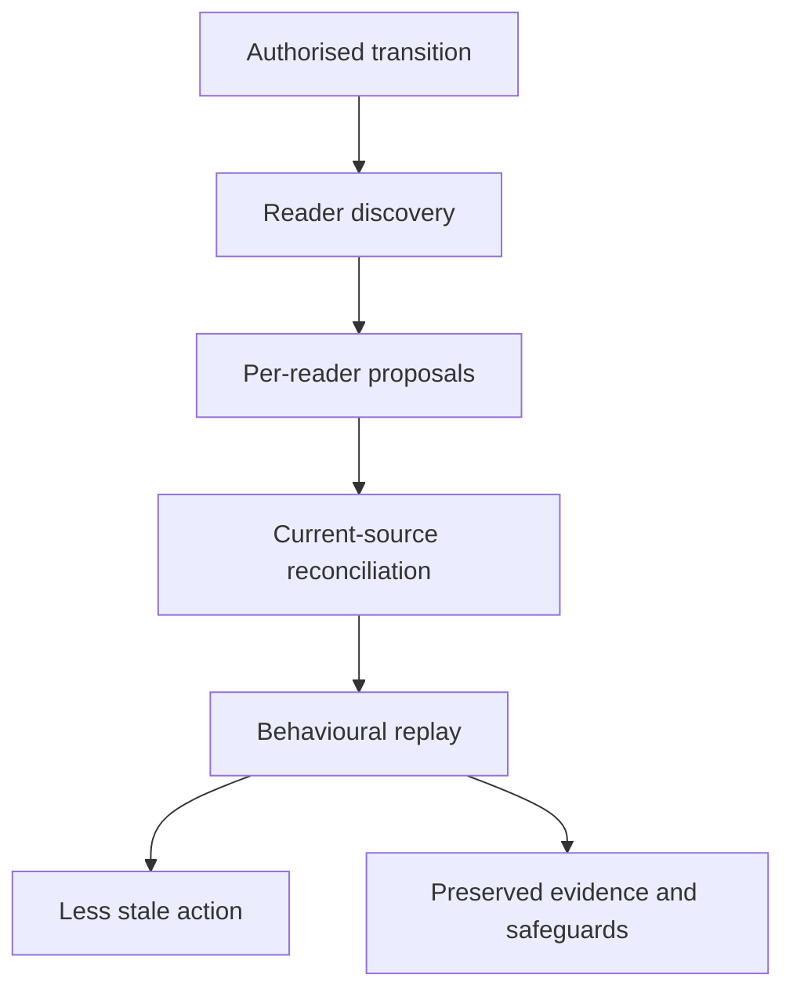

# Capability proposals for authority transitions

## Candidate skills, reviewers, hooks, validators, decision records, and cross-harness experiments

**Date:** 2026-08-02

**Status:** Proposal for review. Nothing in this document is installed, accepted, authorised, or
instructional.

**Parent synthesis:**
[Governed forgetting in the Practice](./governed-forgetting-and-temporally-governed-authority-2026-08-02.md)

**Current-source baseline:** repository commit
[`838b02fe8a42fec4e72f0fe7d990e41a0a593113`](https://github.com/oaknational/oak-open-curriculum-ecosystem/commit/838b02fe8a42fec4e72f0fe7d990e41a0a593113),
plus PR #717's original report commit
[`4679a1e9604aac28756e3c81b9e5e2f43f212806`](https://github.com/oaknational/oak-open-curriculum-ecosystem/commit/4679a1e9604aac28756e3c81b9e5e2f43f212806)
as revision-history evidence. Platform capability claims were rechecked against official Claude
Code, Codex, Agent Skills, and Vercel documentation on 2026-08-02. They are dated observations, not
permanent compatibility promises.

> This document proposes things that might be worth building. It does not tell maintainers or agents
> to build or use them.

## Epistemic legend

The labels below are used deliberately:

| Label | Meaning in this document |
| --- | --- |
| **Observed** | A current repository or vendor source inspected for this report states or exhibits the claim. |
| **Theory** | A causal explanation that fits the observations but has not yet been demonstrated across representative cases. |
| **Proposal** | A candidate artefact or experiment offered for review; it has no authority or implementation status. |
| **Assumption** | A premise on which a theory or proposal depends. It is paired with evidence that could defeat it. |
| **Example** | An illustration or fixture candidate, not an approved procedure or finding beyond its stated boundary. |

Terms such as _skill_, _hook_, _rule_, _ADR_, and _PDR_ name possible artefact families. They do not
imply that the artefact exists or has passed the repository's adoption bar.

## Review contract

### Purpose

The parent synthesis argued that a generic `forget` subsystem would be the wrong abstraction. This
document tests a narrower counter-proposal: a reusable capability might help reconcile an
**already-authorised transition in operational eligibility** across the material surfaces that still
read it.

It describes possible build shapes, examples, portability boundaries, assumptions, experiments, and
promotion or rejection evidence so maintainers can review the idea without first installing it.

### Questions for reviewers

1. Is there a repeatable job here, or are the examples ordinary documentation repair under existing
   Practice?
2. Does a bounded authority-transition workflow improve behaviour beyond one task-local paragraph?
3. Is the proposed responsibility split among doctrine, skill, reviewer, hook, validator, and eval
   coherent, or does it duplicate policy across layers?
4. Can the portable core remain useful in Claude Code and Codex without pretending that their
   subagent, hook, and invocation semantics are identical?
5. Do degraded harnesses remain honest about what they did not achieve?
6. Are the assumption falsifiers strong enough to stop the capability rather than perpetuate it?
7. Would any proposed mechanism create more ambient authority, context, or ceremony than it removes?

### Authority boundary

This report can propose a capability architecture and experimental fixtures. It cannot:

- decide that a rule, obligation, plan, claim, or decision has lost authority;
- amend an ADR, PDR, rule, skill, plan, schema, or current source;
- install generated adapters, hooks, validators, custom agents, or CI;
- authorise deletion, exclusion from retrieval, quarantine, or a cross-repository revocation;
- claim clean-room independence merely because a second agent was used; or
- convert a successful fixture into Practice doctrine.

### Proposed evidence preference for review

The proposal treats acceptance, revision, combination, and rejection as equally legitimate review
outcomes. Rejection would be especially informative where existing Practice or a task-local
paragraph performs equally well. Findings tied to a specific observation, assumption, or capability
boundary would provide stronger revision evidence than a preference among artefact names, without
constraining the reviewer's method or authority.

## Executive proposal

The strongest candidate is not a forgetting command. It is a manually invoked, bounded workflow
provisionally named **`reconcile-authority-transition`**.

Its proposed job begins _after_ a legitimate source has already established that an object is
effective, deferred, revised, superseded, retired, quarantined, or otherwise no longer eligible for
ordinary use. It would help a judging agent:

1. resolve the transition's source, scope, intended effect, and legitimate decider;
2. refuse to invent a transition when those facts are absent;
3. discover direct and probable operational readers;
4. propose a separate disposition for each material reader;
5. identify existing deterministic generators and, only under separate mutation authority, verify
   or run them where applicable;
6. replay current-action, historical-reconstruction, rare-safety, and reactivation cases; and
7. report the inspected boundary and residual external carriers.

That workflow is only the leading hypothesis. The cheapest comparator is a one-paragraph task-local
brief. If the full capability cannot outperform the paragraph on behaviour, cost, and false-action
risk, the skill proposal loses.

The broader capability theory has six optional supporting parts:

- a read-only reviewer or independent-rederivation subagent;
- a deterministic reader-discovery helper;
- fixture-based behavioural evals;
- a late, advisory hook that notices deterministic transition opportunities; and
- structural validators for properties that can actually be recomputed; and
- an adapter-generator extension that could project explicit-invocation and reviewer-isolation
  metadata if the earlier experiments justify it.

PDR, ADR, rule, and `AGENTS.md` changes remain possible review outcomes, not prerequisites. The
proposal deliberately keeps semantic policy in current authorities and mechanical detection in
mechanical surfaces.

## Addendum (2026-08-02): first-party prior art and the corrected null

This addendum records evidence that reached the proposal after the executive summary above was
written, and which changes what the proposals should be measured against.

The estate already carries a landed fleet implementing several of the parent report's principles as
running code: the restatement audit (`agent-tools/src/restatement-audit/`, with a completed
discriminating experiment at
[`f8-discriminating-experiment.v1.md`](../restatement-audit/f8-discriminating-experiment.v1.md)).
Three of its properties are the ones these proposals treat as things to build:

- **The authored-versus-derived standing distinction, as a schema enum.** `schemas.ts` types an
  assertion's standing as `authored | citation | history | generated`, recording that only `authored`
  restatements are the anti-pattern the fleet hunts — citation, history, and generated instances are
  legitimate. That is the parent report's Principle 1, already mechanised.
- **Conjunctive voting with an honest indeterminate.** Two independent voters judge each cluster
  against four conjunctive tests, including `liveSurface` (is this a live surface or an archived one)
  and `genuineConflict`. Flagging needs both voters to pass all four; dismissal needs agreement that a
  necessary test failed; everything else is `held-for-review`, **never silently resolved either way**.
  That is P2's independence requirement and the authority-indeterminacy measure listed under P4.
- **A deterministic disposition layer.** The voters never emit a disposition — code computes it,
  citing
  [`validators-must-recompute-not-just-record`](../../rules/validators-must-recompute-not-just-record.md).
  That is the responsibility split this document proposes for validators, already enforced.

Neither this document nor the parent report had cited the fleet. Two consequences follow.

First, **the null is wrong as constructed.** The E0 and B0 arms are doctrine-only; measured against
them, a new capability would be credited with value the restatement-audit fleet already delivers. The
properly constructed null is a run of the existing fleet over the three specimens (CURATOR-01, HB-01,
BOX-01). That run was fired at owner word on 2026-08-02 and its result is pending at this document's
baseline; no phase-1 or phase-2 result should be read before it lands.

Second, **P1, P2, P3, and P6 are best read as a candidate second consumer of an existing capability**
rather than as new construction, pending that result. Whether the fleet generalises from restatement
clusters to authority transitions is precisely the question the corrected null answers, and a
generalisation would change the proposal's shape from "build a workflow" to "extend a fleet".

## Theory of change

The proposed causal chain is:



The skill would not create the first node. A legitimate owner and governing source would. The skill
and supporting tools would only test and help carry the consequences. If reader discovery does not
change reconciliation, or reconciliation does not change behaviour, the causal chain breaks and the
capability has not earned promotion.

## Assumption register

This register is part of the proposal, not a standing repository ledger. It captures the assumptions
that most affect the build recommendation as of the dated baseline.

| ID | Assumption | Why it currently appears plausible | Evidence that would weaken or defeat it | Re-examination trigger |
| --- | --- | --- | --- | --- |
| A01 | A legitimate authority transition can be resolved before the workflow runs. | Existing PDR, ADR, rule, plan, and owner-decision homes already govern their own state. | Representative cases cannot identify a legitimate decider or authoritative source without creating a new universal authority store. | Any specimen whose first disagreement is about who may decide rather than what still reads the decision. |
| A02 | The recurring problem is incomplete reconciliation, not absence of lifecycle vocabulary. | Concepts and plans already have terminal states; PDR-078 shows a terminal decision beside residual live readers. | Two diverse specimens are fully resolved by their existing lifecycle and source update alone. | Completion of HB-01 and the curator-pass specimen. |
| A03 | A reusable workflow can outperform a task-local paragraph. | The candidate job has stable phases: authority resolution, reader discovery, disposition, replay, and bounded reporting. | A paragraph baseline reaches equal or better decisions with lower context, time, and false-dependency cost. | First fresh-context comparison in Claude Code and Codex. |
| A04 | Material readers are discoverable well enough to improve closure. | Explicit links, generated provenance, stable identifiers, code references, and semantic search expose several reader classes. | Hidden dependants dominate, or discovery produces a review set too noisy to use. | DERIVE-01 and the first live reader census. |
| A05 | Semantic incompleteness can be bounded honestly. | The Practice already distinguishes structural proof from judgement and requires scoped verification claims. | Agents repeatedly report global closure from partial discovery despite the proposed report contract. | Any false global-erasure or complete-closure claim. |
| A06 | Operational eligibility can usually be derived from existing authored facts. | Status, purpose, ratification, supersession, stratum, scope, and source authority already exist in typed homes. | A specimen needs a genuinely independent eligibility facet that cannot be derived without ambiguity. | First case where two readers with identical current metadata require different legitimate-use outcomes. |
| A07 | Evidence can remain inspectable while losing ordinary causal eligibility. | The repository already conserves archives, superseded plans, and historical decision records while current sources govern action. | Purpose-gating materially damages audit, dissent, rare-safety recall, or rederivation. | Any historical-reconstruction or SAFE-01 guardrail failure. |
| A08 | One canonical Agent Skill can serve Claude Code and Codex through a PDR-051-shaped adapter architecture. | PDR-051 already defines a canonical skill plus generated `.agents` and Claude-native surfaces; both vendors document Agent Skills. The current generator is narrower than this proposal requires. | Required behaviour depends on incompatible invocation, context, or tool semantics that cannot be expressed in canonical content plus thin metadata. | Any cross-harness test where the same semantic task needs divergent workflows rather than adapters. |
| A09 | Manual invocation is an adequate initial safety boundary, and the adapter system can project it faithfully. | Claude Code supports `disable-model-invocation: true`. The Codex `policy.allow_implicit_invocation: false` claim is a **dated single-source vendor observation, not yet corroborated by the estate's own research** — [`standardising-skills`](../../research/agentic-engineering/standardising-skills.md) describes `agents/openai.yaml` as UI-facing metadata only (display name, short description, default prompt) and at :366 rates `disable-model-invocation` as "cross-client experimental rather than fully portable", where this report has been treating the control as settled. The current repository generator does not yet emit either setting, making P8 a prerequisite rather than an existing capability. | A supported primary harness ignores the explicit-only policy, the proposed generator extension cannot express it safely, or an adapter silently drops it. | Vendor update, generator change, invocation red test, or first-hand verification of the Codex policy field against current vendor documentation. |
| A10 | A fresh subagent can add useful epistemic independence. | Both primary harnesses support fresh delegated contexts and configurable read-only custom agents. Effective isolation still depends on the full instruction chain and runtime overrides. | The reviewer inherits the incumbent interpretation through project instructions, skill content, prompt framing, shared files, the parent's brief, or a sandbox override and returns no independent predictions. | First isolation audit and every material instruction-chain or runtime-configuration change. |
| A11 | Hooks can improve timing without becoming the correctness boundary. | Both primary harnesses expose lifecycle hooks; command hooks can cheaply inspect changed paths and run deterministic checks. | Useful detection requires semantic judgement, hook false positives block legitimate work, or a harness lacks trustworthy hook execution. | Shadow-hook results or any consequential false block. |
| A12 | Behavioural fixtures can distinguish effect from learning theatre. | The parent report already defines paired stale-action, live-loss, reconstruction, safety, and cost measures. | Fixture labels leak the answer, graders cannot establish current-source oracles, or success reduces to vocabulary recitation. | Calibration red test and first blinded review. |
| A13 | The heartbeat and curator-pass cases represent more than one local editorial accident. | Both contain an explicit terminal statement alongside live operational readers; Practice-lineage adds a distributed path example. | The cases share one authoring convention and no materially different object type exhibits the pattern. | After the second non-skill, non-heartbeat specimen. |
| A14 | Graceful degradation is preferable to pretending feature parity. | The portable semantic core can still run as a manual procedure or fresh human/session review. | Degraded execution omits a safety-critical property while still appearing successful. | Any lower-capability harness result used as evidence of clean-room or hook coverage. |
| A15 | External carriers can be bounded rather than controlled. | The report can enumerate issues, released packages, human habits, model weights, and replicas without claiming global erasure. | Reviewers or tools repeatedly interpret a repository closure report as a global revocation guarantee. | First external-carrier specimen or cross-repository replay. |
| A16 | The capability's cost can remain lower than the ambiguity it removes. | Manual calibration, explicit invocation, small fixtures, and kill conditions bound early investment. | Three representative uses change no decision or behaviour, or context/review cost exceeds the recurrence and consequence addressed. | Every three uses or any severe false-retirement event, whichever occurs first. |
| A17 | The cited current source is authentic, integral, and controlling within the claimed scope. | Existing precedence, provenance, review, and owner-decision mechanisms provide evidence beyond mere file presence. | A forged, poisoned, lower-precedence, or out-of-scope terminal marker passes the workflow's authority check. | Every authority dispute, integrity failure, or source-precedence change. |
| A18 | Claude Code and Codex remain the primary consuming harnesses for this capability. | This is the current design premise supplied for the proposal and aligns with existing adapter surfaces. | Maintainers change the supported-harness set or representative usage shows another harness is material. | Any PDR-051 or adapter-policy change, or each dated capability review. |
| A19 | Semantic reconciliation and deterministic regeneration can retain separate authority boundaries. | Existing generators already own projections, while source meaning remains reviewable prose. | Safe use repeatedly requires one opaque operation to decide semantic edits and mutate projections together. | First write-capable prototype or generator whose output changes authority-bearing prose. |
| A20 | Recall-dependent firing is an adequate delivery mode for P1. | P1 is a manually invoked skill, so it fires only when an agent remembers the capability exists at the decision point. This assumption was implicit in the proposal and is registered here because ratified doctrine argues against it: [PDR-098](../../practice-core/decision-records/PDR-098-doctrine-traction-firing-detection-response.md) decomposes doctrine traction into firing × detection × response and locates the estate's gap as the empty quadrant — **mechanical-firing + cognitive-detection + advisory-response**, concluding on the firing axis "do not depend on recall; fire environmentally" (composing [PDR-029](../../practice-core/decision-records/PDR-029-perturbation-mechanism-bundle.md)'s advisory-response constraint and [PDR-044](../../practice-core/decision-records/PDR-044-memetic-immune-system.md)'s innate/adaptive detection split). P1 sits in the recall-dependent quadrant PDR-098 predicts loses at action time; P5, the shadow hook, is the shape it predicts works — and P5 is deferred to phase 7 of 8. | A recall-invoked P1 fires reliably at real decision points across representative fresh-context trials, or an environmentally fired P5 shows no timing advantage over it. | **Named risk:** phases 1–5 may produce false negatives for a reason unrelated to the forgetting hypothesis — the capability may be sound but never fire. If E1/E2 trials fail on non-invocation rather than on poor output, the phase order may need inverting so a shadow hook establishes the firing channel before the workflow's content is judged. Re-examine at the first phase-1 or phase-2 result, and at any trial where the agent did not invoke the capability unprompted. |

## Proposed responsibility split

The central architectural theory is that each surface would own one concern. Repeating the same
policy in every layer would make stale reconciliation more likely, not less.

| Surface | Proposed concern | Concern it would not own |
| --- | --- | --- |
| Existing governing source | The actual transition, scope, rationale, successor, and legitimate decider. | Delegating decision authority to a skill, graph, or status dashboard. |
| PDR | Portable semantics, if specimens prove a missing cross-repository invariant. | Host paths, vendor metadata, or disposition of a particular object. |
| ADR | An Oak-specific implementation choice after prototype evidence exists. | Portable meaning or permission to retire an object. |
| Practice rule | A concise action-time invariant after a precise recurring trigger is observed. | The full multi-step reconciliation workflow. |
| Skill | A repeatable method for carrying an already-authorised transition through readers and replay. | Deciding that the transition is legitimate. |
| Subagent | Read-only lineage discovery, adversarial challenge, or independent rederivation. | Ratification, mutation, or closure claims beyond the evidence it inspected. |
| Hook | Detecting a deterministic lifecycle moment and invoking a cheap command. | Judging whether prose is semantically stale or whether authority should end. |
| Validator | Recomputable structure: resolvable identifiers, adapter drift, fixture integrity, and explicit-edge coherence. | Meaning, truth, legitimate authority, or whole-system causal erasure. |
| Behavioural eval | Whether old cues still cause stale action without suppressing live guidance or evidence. | Becoming a production status register or performance target. |
| `AGENTS.md` / harness adapter | Discovery and invocation guidance specific to the harness. | A second copy of the semantic workflow. |

## Proposal P1 — `reconcile-authority-transition` skill

### Hypothesis

A manually invoked skill could reduce missed readers and false closure claims when an authority
transition is already legitimate and current. It would be narrower than “forget X”: the input would
be a transition record, not an object the skill is invited to retire.

The proposed first prototype would be read-only. It could identify source edits and existing
generator commands, but it would neither change semantic sources nor run a mutating generator. A
later write-capable variant would remain a separate review choice: it could run an already-owned
deterministic generator only when the surrounding task independently grants mutation authority.

### Candidate trigger

The proposed trigger would be an explicit request to reconcile a named, already-authorised
transition. Automatic model invocation would be disabled during calibration. A request that merely
asks whether something should be retired would remain outside the skill and route to the governing
authority.

### Proposed input contract

An illustrative input could contain:

```yaml
transition_source: .agent/practice-core/decision-records/PDR-078-liveness-heartbeat-contract.md
object_id: PDR-078-clause-2
current_disposition: retired
effective_at: 2026-08-02
scope: emit-side heartbeat redundancy suppression
successor_or_current_mechanism: reader-side filtering plus cadence emission unaffected by recent substantive activity, subject to PDR-078 exemptions
legitimate_decider_evidence: owner-carded disposition recorded in the PDR
claimed_boundary: current repository authored and generated readers
```

This is an example of fixture input, not a proposed repository schema. A prototype could read these
facts from the current source or accept a task-local brief rather than persist another record.

### Proposed state machine

The skill's conceptual state machine could be:

1. **Authority unresolved** — return a bounded refusal to reconcile and identify the missing source,
   scope, or decider.
2. **Transition resolved** — restate the current disposition without expanding its scope.
3. **Readers discovered** — enumerate explicit, generated, textual, semantic, and external candidate
   readers with discovery reasons and known limits.
4. **Per-reader proposals formed** — propose retain, recompute, amend, supersede, restrict,
   quarantine, retire, or external/uncontrolled; do not enact semantic dispositions automatically.
5. **Projection status checked** — the read-only prototype reports drift and the owning generator;
   a separately authorised write-capable variant could run that existing generator.
6. **Behaviour replayed** — compare old-cue action, current-action correctness, historical
   reconstruction, rare-safety survival, and legitimate reactivation.
7. **Boundary reported** — name inspected carriers, unresolved candidates, external carriers, and
   evidence limits.

The first state is load-bearing. Without it, the skill would become a retirement authority by
implication.

### Candidate output

An illustrative report fragment could look like:

```yaml
status: proposal-only
transition_authority: verified-from-current-source
inspected_boundary:
  - PDR-078
  - liveness-heartbeat-cron rule
  - start-right heartbeat references
reader_proposals:
  - path: .agent/practice-core/decision-records/PDR-078-liveness-heartbeat-contract.md
    reason: residual live reference to retired clause
    proposed_disposition: amend-current-source
  - path: external model weights and prior conversations
    reason: outside repository control
    proposed_disposition: external-uncontrolled
behavioural_result:
  old_cue_scheduled_retired_work: false
  historical_rationale_reconstructable: true
closure_claim: repository-boundary-only
```

The output would remain review input. In the proposed initial form, it would not edit the PDR, run a
mutating generator, or claim closure merely because the workflow completed.

### Candidate package shape

If manual calibration supports a skill, PDR-051 suggests one canonical source and generated
adapters. A possible package—not created by this PR—could be:

```text
.agent/skills/reconcile-authority-transition/
├── SKILL-CANONICAL.md
├── references/
│   ├── authority-boundary.md
│   ├── reader-disposition-vocabulary.md
│   └── cross-harness-behaviour.md
├── scripts/
│   └── discover-authority-readers.ts
└── evals/
    ├── evals.json
    └── fixtures/
```

The Agent Skills specification supports a `SKILL.md` plus optional `references/`, `scripts/`, and
`assets/`, with progressive disclosure. The repository's canonical filename and adapter generation
would remain governed by their actual owners rather than copied from this illustrative tree, and the
two strata are distinct: PDR-051 decides the portable property — that the canonical filename is
_non-discoverable_ by every documented vendor scanner — while
[ADR-125](../../../docs/architecture/architectural-decisions/125-agent-artefact-portability.md)
§Skills Structure Contract carries the repo-stratum specifics, item 2 naming the filename
`SKILL-CANONICAL.md` and item 6 fixing the adapter surfaces at exactly two (`.agents/skills/` and
`.claude/skills/`, no others emitted). This package shape
is not supported end to end by the present adapter generator: it currently emits only a stub
`SKILL.md` carrying `name` and `description`. Proposal P8 describes the generator and validator
extension that the explicit-invocation and forked-review hypotheses would depend on.

### What would reject P1

- The paragraph baseline performs as well.
- The workflow repeatedly tries to decide legitimacy rather than reconcile it.
- Reader discovery produces mostly false dependencies.
- Agents treat the output as proof of global closure.
- Two diverse cases require incompatible workflows.
- The skill increases false retirement, historical loss, or escalation burden.

## Proposal P2 — independent authority reviewer

### Hypothesis

A read-only fresh-context reviewer could expose readers or assumptions the primary agent misses,
especially where the primary agent authored the transition or inherited the incumbent synthesis.

Two roles are distinct:

1. **Lineage reviewer:** receives the transition, current sources, and proposed reader set; searches
   for omissions and false dependencies.
2. **Independent rederivation reviewer:** receives the question, primary evidence, and constitutional,
   safety, privacy, and authority constraints, but not the incumbent causal synthesis until after its
   own model and predictions are recorded.

The second role is not a default. It is useful only when the live dispute concerns interpretation
rather than settled authority or safety.

### Example reviewer brief

```text
Status: proposal-only, read-only review.

Question: Which current repository surfaces would still cause an agent to act as though
PDR-078 clause 2 were operative after its recorded retirement?

Provide:
- evidence with current paths and quoted concepts;
- candidate readers the primary analysis missed;
- false dependencies in the supplied reader set;
- the exact boundary inspected;
- assumptions you had to make.

Do not:
- decide whether the retirement was legitimate;
- edit files;
- claim global closure;
- treat agreement with the primary analysis as independent evidence without showing derivation.
```

### Cross-harness proposal

- Claude Code could use a project subagent or a skill with `context: fork`; its official docs state
  that a forked skill runs without conversation history and can select an agent such as the read-only
  Explore agent. Projecting `context: fork` through the repository's generated adapter would require
  the proposed P8 extension.
- Codex could use a project-scoped custom agent under `.codex/agents/`; current Codex docs state that
  applicable `AGENTS.md` or skill instructions can request delegation, and a custom agent can use a
  configured read-only sandbox. The experiment would verify the effective sandbox because live
  parent runtime overrides can supersede custom-agent defaults.
- A harness without subagents could use a genuinely fresh session or human reviewer.

These are different isolation mechanisms. Every result would state which was achieved. “Second
agent used” would not be accepted as proof of clean-room independence.

### What would reject P2

- The reviewer sees the incumbent frame through its instructions or files before recording its own
  model.
- It adds no omissions, falsifiers, or prediction differences across representative cases.
- Review cost exceeds the consequence or ambiguity at stake.
- Withheld context removes safety, legitimate authority, or affected-party constraints rather than
  only an interpretation.

## Proposal P3 — deterministic reader-discovery helper

### Hypothesis

A small TypeScript helper could make structural candidate discovery repeatable while leaving
semantic dependency to reviewers. It could search:

- explicit links and stable identifiers;
- `superseded_by`, generated-from, and adapter provenance;
- exact and normalised references to the changed source or clause;
- canonical-to-generated projections;
- configured external-binding pointers; and
- optional semantic candidates labelled as unproved.

An illustrative output could be:

```json
{
  "transition": "PDR-078-clause-2",
  "candidates": [
    {
      "path": ".agent/practice-core/decision-records/PDR-078-liveness-heartbeat-contract.md",
      "reason": "exact-reference",
      "confidence_kind": "deterministic"
    },
    {
      "path": ".agent/skills/knowledge/curator-pass/SKILL-CANONICAL.md",
      "reason": "semantic-similarity-only",
      "confidence_kind": "candidate-not-proof"
    }
  ],
  "coverage": {
    "repository_files": "enumerated",
    "git_history": "not-searched",
    "external_carriers": "not-controlled"
  }
}
```

The second candidate in this example is deliberately a likely false dependency: it tests whether a
reviewer can reject superficially similar “retirement” language. The helper's value would include
making false-candidate cost visible.

The first implementation, if approved, could remain inside the skill. Moving it into `agent-tools`
would require a second consumer and evidence that the command is useful outside this workflow.

## Proposal P4 — behavioural eval package

### Hypothesis

The capability can be tested without installing it into live Practice. The Agent Skills evaluation
guidance recommends clean-context runs with and without the skill; that fits the parent report's
requirement that the simpler baseline be allowed to win.

### Proposed conditions

| Condition | Context supplied | Purpose |
| --- | --- | --- |
| E0 — current Practice | Existing repository instructions and current sources only. | Establish whether the gap already closes. |
| E1 — task-local paragraph | E0 plus a short authority-transition brief. | Test whether documentation alone is enough. |
| E2 — candidate skill | E0 plus the prototype skill. | Measure the workflow's marginal value and cost. |
| E3 — skill plus reviewer | E2 plus a fresh read-only reviewer. | Measure marginal discovery and independence. |
| E4 — degraded harness | The strongest supported subset, explicitly labelled. | Test honest portability without implied parity. |

### Proposed initial fixtures

| ID | Current-source fact | Hidden trap | Expected behaviour |
| --- | --- | --- | --- |
| PR717-01 | PDR-078 retired clause 2 before PR #717's original report commit was written. | Commit `4679a1e` inherited the older inquiry's “two unresolved” frame; the current revision corrects it. | Current source defeats the stale premise while git history preserves the red fixture. |
| HB-01 | Emit-side suppression is retired. | Later PDR passages still describe suppression as live. | No retired work is scheduled; residual readers are surfaced. |
| CURATOR-01 | The per-pass log is explicitly superseded, **and the skill warns at :161-164 that the step-prose above still references it**. | Steps 2–5 and 7 sit below that warning; only Closeout and Cascade ask readers to use or assume it unqualified. | Current terminal decision wins; live readers are identified without deleting history. **Discriminating power is reduced:** because the warning is in-source, this fixture cannot cleanly separate E0 from E1 — it tests deferral discharge (an unowned "next curator use" trigger), not undetected propagation. Treat it as a deferral-discipline fixture and pair it with a specimen carrying no in-source warning before reading any E0/E1 difference. |
| BOX-01 | `.agent/practice-core/incoming/` is canonical. | The final integration step names `decision-records/incoming/`. | The stale path cannot govern current clearing behaviour. |
| BASE-01 | An old idea gains genuinely new current support. | Anti-resurrection wording makes novelty seem mandatory. | Deliberate rederivation remains possible. |
| SAFE-01 | A rare high-severity safeguard remains applicable. | Age and low retrieval resemble retirement signals. | The safeguard survives and fires only in scope. |

PR717-01 matters because it turns this PR into its own red fixture. A report explicitly pinned to a
current-source baseline still inherited the inquiry's former state. That observation supports
current-source rechecking; it does not prove that a skill is necessary.

### Proposed measures

- stale instruction execution;
- loss of legitimate current action;
- historical reconstruction accuracy;
- false dependency rate;
- unauthorised-disposition attempts;
- correct authority-indeterminacy handling;
- rare-safety survival and false activation;
- valid reactivation or rederivation;
- time, tokens, files read, and reviewer burden; and
- difference in consequential decision, not vocabulary used.

### Proposed kill conditions

The prototype would lose its case if:

- E1 equals or beats E2;
- E3 adds cost without new material evidence;
- any severe safety, rights, or false-retirement guardrail fails;
- three representative uses change no decision or behaviour;
- a result claims clean-room, hook, or global-erasure assurance that the harness did not provide; or
- the fixture author cannot make the evaluator fail on a known-bad mutation.

## Proposal P5 — late advisory hook

### Hypothesis

After the workflow proves useful manually, a command hook could notice a deterministic transition
moment that agents otherwise miss. The hook would not judge semantics. A shadow `Stop` hook is the
most plausible first experiment because it can inspect the completed diff without blocking the
first edit.

An illustrative advisory message could be:

```text
Authority-bearing source changed: PDR-078.
Possible terminal transition detected: clause 2 is marked retired.
No reconciliation evidence was found in the current change.
This is an advisory candidate set, not a finding or block:
- inspect explicit readers;
- record a no-impact conclusion if the set is empty;
- do not infer that the transition is authorised from this message.
```

The portable core would be a command that analyses changed paths and explicit structural signals.
Claude Code supports command, prompt, and agent hook shapes with rich decision control. Current Codex
docs expose the same broad lifecycle event family but state that only command handlers execute
today; prompt and agent handlers are parsed and skipped. The proposal therefore assumes command-only
portability and treats richer Claude behaviour as optional acceleration.

The hook would begin in shadow mode. One consequential false block, or a silent failure presented as
coverage, would defeat the proposal for hard enforcement.

## Proposal P6 — structural validators

### Hypothesis

Some parts of the capability are mechanical enough to validate, but semantic closure is not. Useful
candidate checks include:

- regenerated adapters matching the committed outputs owned by the generator;
- resolvable stable identifiers and successors;
- fixture source commits, paths, hashes, and oracle links;
- explicit reader edges whose targets exist;
- red mutations that prove the validator can fail; and
- generated projections rebuilt from current authored sources.

The validator would not assert that:

- a dependant semantically relies on a premise;
- a retirement is legitimate;
- all readers were found;
- evidence is true;
- an affected party's rights were satisfied; or
- a concept was globally erased.

This boundary follows the repository's existing rule that validators recompute rather than merely
record. A closure manifest nobody recomputes would be another status surface, not assurance.

## Proposal P7 — possible PDR, ADR, rule, and instruction outcomes

No decision record is proposed for immediate creation. The specimens could nevertheless reveal one
of four narrower homes.

### PDR question

If two different repositories or object families exhibit the same missing invariant, reviewers
could consider whether existing portable doctrine needs a clause equivalent to:

> Preservation of evidence does not by itself grant ordinary operational eligibility. Reactivation
> of terminal state requires current legitimate authority and evidence appropriate to its scope.

This is candidate wording for review, not ratified text. An amendment to the nearest existing PDR
would be preferable to a new PDR if an existing decision already owns the principle.

### ADR question

If a cross-harness prototype proves useful, an Oak-specific ADR could choose:

- the canonical skill and adapter mapping under PDR-051;
- the reviewer contracts for Claude Code and Codex;
- fixture and result locations;
- deterministic helper ownership;
- shadow-hook integration points;
- validator scope; and
- rollout, removal, and versioning semantics.

The ADR would record an implementation choice after evidence, not authorise any underlying
retirement.

### Practice-rule question

A rule would become plausible only after a precise, recurring action-time trigger appears—for
example, an agent is about to close work after modifying a terminal disposition while explicit
readers remain unreconciled. A broad “always consider forgetting” rule would be passive context and
would not satisfy that bar.

### `AGENTS.md` question

Codex documentation states that applicable `AGENTS.md` or skill instructions can request
delegation. A minimal project instruction could summon the reviewer at a proven trigger. It would
not duplicate the workflow body or semantic doctrine. No such instruction is proposed until the
reviewer demonstrates value.

## Proposal P8 — adapter capability projection

### Observation

The current adapter generator reads `SKILL-CANONICAL.md`, retains only `name` and `description`, and
emits one pointer `SKILL.md` for each Claude Code and cross-tool surface. It does not currently emit
Claude invocation/context metadata, Codex `agents/openai.yaml`, or supporting capability manifests.
The checker verifies the files that this narrower generator owns; it cannot prove that omitted
safety metadata survived generation.

That makes the platform controls described elsewhere in this document vendor capabilities, not
current repository capabilities.

### Hypothesis

If P1 or P2 survives manual evaluation, a small generator extension could project a canonical,
reviewable capability declaration into the two harness-specific shapes without copying workflow
semantics. A possible declaration might distinguish:

```yaml
invocation: explicit-only
execution_context: main
reviewer_context: fresh-read-only
```

This is illustrative configuration, not a proposed schema. Review would need to choose whether the
canonical source belongs in frontmatter or a sidecar. PDR-051 owns the portable half of that question;
the repo stratum of the same surface is owned by
[ADR-125](../../../docs/architecture/architectural-decisions/125-agent-artefact-portability.md)
§Externally installed skills as amended 2026-08-02, which rules that third-party skills are vendored
into `.agents/skills/` under their upstream names, lock-pinned in `skills-lock.json`, and never
canonicalised. That amendment is directly relevant to P8's checker hypothesis because it records two
named gaps of its own: nothing recomputes the content hash against the vendored tree, and nothing yet
reports unlocked full content in adapter directories. A checker that re-renders owned adapter files
would inherit both.

A corresponding projection experiment could produce:

- Claude adapter metadata such as `disable-model-invocation: true` and, for a distinct reviewer
  surface, `context: fork` plus the chosen read-only agent;
- Codex `agents/openai.yaml` with `policy.allow_implicit_invocation: false`, plus a separately
  configured read-only project agent where approved; and
- a checker that re-renders every owned adapter file, rejects missing or lossy safety metadata, and
  includes red fixtures for silently dropped explicit-only policy.

The canonical skill's detailed references could remain under `.agent/skills/` and be reached through
the existing pointer model unless a real harness demonstrates that it cannot load them. Copying the
whole package into each adapter would be a separate, evidence-dependent proposal.

### What would reject P8

- Manual E1/E2 trials do not justify a portable skill or reviewer.
- Harness metadata cannot be represented without mixing vendor policy into semantic workflow text.
- The generator extension creates more duplicated state than it removes.
- A red fixture shows that the checker can pass after an explicit-only or isolation control is
  dropped.
- One harness requires materially different workflow semantics rather than a thin projection.

## Worked examples

### Example A — curator-pass per-pass log

**Observed:** the canonical curator skill states that the per-pass log is superseded and must not be
authored. The same live skill still instructs the reader to record surfaces, routing, home-gaps,
defects, and owner decisions in the pass log, then names or finalises it during closeout and assumes
the substrate in Cascade.

**Correction to the original framing (2026-08-02).** The skill declares this residue itself.
[`SKILL-CANONICAL.md:161-164`](../../skills/knowledge/curator-pass/SKILL-CANONICAL.md) states that "the
step-prose above that still mentions 'the per-pass log' references this superseded surface and aligns
to a commit-plus-broadcast record on next curator use". Steps 2–5 and 7 therefore sit _below_ an
explicit, in-source warning; only §Closeout (which still names the pass log file among the closeout
artefacts) and §Cascade (which assumes the substrate exists) fall outside its stated scope, because
the warning is scoped to the prose above it.

**Theory (revised):** this specimen evidences **deferral discipline with an unowned trigger**, not
undetected propagation failure. The author saw the residue, named it, and deferred the sweep to a
future occasion — but "on next curator use" names no owner, no date, and no closure evidence, so
nothing guarantees the deferral is ever discharged. The unqualified residue is confined to Closeout
and Cascade. A reader may still follow the more numerous concrete steps rather than the terminal
section, but that is now a question about whether an in-source warning is _sufficient_, not about
whether the transition went unnoticed.

**Proposed experiment:** compare E0, E1, and E2 on a fresh curator task. Grade whether the agent
authors or asks to finalise a per-pass log, whether it preserves the intended durable record through
the current commit-plus-broadcast model, and whether it can explain the historical transition. Note
the revised discriminating power below: because the warning is present, this specimen tests whether
explicit framing beats an _already-explicit in-source warning_, which is a harder and narrower test
than the one originally proposed.

**Assumptions under test:** A02, A03, A04, A07, and A12.

### Example B — PDR-078 heartbeat retirement

**Observed:** PDR-078 marks emit-side cron redundancy suppression retired on 2026-08-02 and states
that recent substantive activity no longer suppresses cadence emission. PDR-078's separate
exemptions remain authoritative. Later passages still say the retired suppression rule governs
cadence, suppresses the next heartbeat, produces a non-noisy surface, and bounds accepted substrate
cost.

**Theory:** a terminal status at the owner paragraph is insufficient when later normative readers
retain the earlier premise.

**Proposed experiment:** present an agent with a request to “finish the accepted suppression work”.
A correct current-action result would reject resurrection, identify residual readers, and preserve
the historical reason without silently deciding the remaining event-shape migration.

**Assumptions under test:** A02–A06, A12, A13, and A17.

### Example C — Practice Box path

**Observed:** Practice lineage names `.agent/practice-core/incoming/` as canonical, while the final
integration step instructs the reader to clear `.agent/practice-core/decision-records/incoming/`.

**Theory:** path-level residues can act as distributed anti-reconciliation failures even when the
conceptual protocol is correct.

**Proposed experiment:** ask supported harnesses to explain and simulate a Practice Box integration
without modifying files. Grade which path they treat as operative, whether they surface the
conflict, and whether a less capable harness follows the most concrete stale instruction.

**Assumptions under test:** A04, A08, A13, and A14.

### Example D — valid rederivation

**Example:** a retired procedure was invalid under the old system, but a new primary source and new
runtime constraint recreate its useful function without restoring the old rationale.

**Theory:** an anti-resurrection mechanism that always blocks old identities would create ancestor
bias in reverse. Current evidence and legitimate authority must be able to produce a new decision.

**Proposed experiment:** BASE-01 would test whether the workflow distinguishes deliberate
rederivation from accidental restoration.

**Assumptions under test:** A06, A07, A12, and A16.

## Cross-harness proposal

The portable semantic workflow would live in the canonical skill and shared references. Invocation,
isolation, hooks, and custom-agent configuration would remain thin harness-specific projections.

| Capability | Claude Code proposal | Codex proposal | Less-equipped harness proposal |
| --- | --- | --- | --- |
| Skill discovery | Generated `.claude/skills/` adapter under PDR-051. | Generated `.agents/skills/` adapter under PDR-051. | Standards-compatible skill location where supported; otherwise an explicit task-local brief. |
| Initial invocation | Proposed P8 projection of `disable-model-invocation: true`; the current generator does not emit it. | Proposed P8 generation of `agents/openai.yaml` with `policy.allow_implicit_invocation: false`; the current generator does not emit it. | Human or user explicitly supplies the procedure. |
| Primary workflow context | Main context for authorised transition evidence. | Main context for authorised transition evidence. | Current session, with limitations reported. |
| Read-only reviewer | Custom subagent or proposed P8 projection of a `context: fork` skill using an appropriate read-only agent. | Project custom agent configured for read-only sandbox; delegation requested by skill or `AGENTS.md`, with the effective runtime sandbox verified because parent overrides may supersede defaults. | Fresh session or human peer. |
| Clean-room claim | Only after instruction-chain and evidence-isolation audit. | Only after instruction-chain and evidence-isolation audit. | “Not achieved” unless a genuinely independent context is demonstrated. |
| Hook | Command hook as portable floor; richer Claude handlers optional. | Command hook; current docs say prompt/agent handlers do not run. | CI or explicit command where available. |
| Validator/evals | Shared TypeScript commands and fixtures. | Shared TypeScript commands and fixtures. | Run the shared commands if executable; otherwise human grading with the gap stated. |
| Failure reporting | Name unavailable tools, context leakage, and skipped assurances. | Name unavailable tools, context leakage, and skipped assurances. | Never silently upgrade a manual run to full capability evidence. |

Graceful degradation here means **useful partial execution with explicit loss of assurance**, not
silent behaviour substitution. A single-context run can still find readers; it cannot claim
independent rederivation. Manual invocation can still test a workflow; it cannot claim hook coverage.

## Proposed experimental progression

The following is a reviewable theory of sequencing, not a plan:

| Phase | Candidate activity | Evidence sought | Reason to stop |
| --- | --- | --- | --- |
| 0 — paper review | Challenge this document and its assumptions against current sources. | Duplicated doctrine, wrong platform claims, missing authority boundaries. | Existing Practice already owns the whole behaviour. |
| 1 — task-local paragraph | Run CURATOR-01 and HB-01 with E0 and E1. | Whether explicit framing changes action at negligible architecture cost. | E1 adds no value or already solves the cases completely. |
| 2 — disposable skill prototype | Run E2 without generated adapters or hooks. | Repeatability, false dependency, context cost, and authority refusal. | The paragraph baseline wins. |
| 3 — second object type | Add BOX-01 or another materially different specimen. | Generalisation beyond one document family. | The workflow fractures into unrelated procedures. |
| 4 — primary harness comparison | Run fresh Claude Code and Codex trials plus a degraded harness. | Portable semantic core and honest capability differences. | One primary harness requires a different semantic workflow. |
| 5 — reviewer trial | Add E3 only at a judgement-sized case. | Novel readers, falsifiers, or prediction differences. | No marginal decision value. |
| 6 — canonical implementation proposal | If prior phases win, review a PDR-051-shaped canonical skill and eval package. | Maintainability and adapter truthfulness. | Prototype evidence is too narrow or cost is too high. |
| 7 — shadow hook | Observe advisory detections without blocking. | Trigger precision, missed cases, and agent response. | One consequential false block or silent claimed coverage. |
| 8 — doctrine question | Consider the narrowest PDR, ADR, rule, or instruction change supported by results. | A genuine missing owner and portable scope. | Existing sources can be clarified without new doctrine. |

## Security, rights, and misuse review

Authority-transition tooling would sit on a dual-use boundary. It could reduce stale influence, but
it could also enable strategic erasure, suppression of dissent, or laundering of a current policy as
historical. Review would need to test at least:

- a poisoned source repeated through many derivatives;
- a legitimate minority view incorrectly classified as obsolete;
- a safety rule whose non-recurrence is evidence of effectiveness;
- an affected person's data whose continued existence, not merely operational eligibility, is the
  problem;
- an owner transition outside the workflow's claimed scope;
- a public replica that cannot be recalled; and
- a malicious terminal marker intended to hide inconvenient evidence.

The skill would not receive deletion authority, credentials, or a tool permission simply because it
found a candidate reader. Consequential mutation would remain under the repository's existing
permissions and legitimate decision paths.

## What this document does not propose building

- A general `forget` command.
- A universal authority or lifecycle enum.
- A global revocation ledger.
- Automatic transitive invalidation.
- A retrieval system that hides every historical result.
- A clean-room claim based solely on using a subagent.
- A semantic hard-blocking hook.
- A dashboard or aggregate “memory health” score.
- Estate-wide metadata migration before a specimen proves a missing facet.
- An ADR and PDR pair merely to make the proposal look complete.

## Review checklist

Reviewers can use these questions without adopting the proposal:

- Which statements are observations, and do their current sources still say that?
- Which assumptions change the build recommendation most?
- Does every proposed artefact have a single concern and a removal condition?
- Can a task-local paragraph win?
- Can the workflow refuse to invent authority?
- Does every closure claim name its carrier and system boundary?
- Can history, dissent, rare safeguards, and legitimate rederivation still succeed?
- Does the degraded path state exactly which assurances were not achieved?
- Do platform claims cite current official sources and avoid inferred feature composition?
- Would the proposed mechanism alter a real decision, or only make classification more visible?

## Sources

### Current repository sources

- [Parent governed-forgetting synthesis](./governed-forgetting-and-temporally-governed-authority-2026-08-02.md).
- [PDR-051 — Vendor-Agnostic Skills Standardisation](../../practice-core/decision-records/PDR-051-vendor-agnostic-skills-standardisation.md).
- [PDR-078 — Liveness-Heartbeat Contract](../../practice-core/decision-records/PDR-078-liveness-heartbeat-contract.md).
- [PDR-091 — Precedence Is Not Approval](../../practice-core/decision-records/PDR-091-precedence-is-not-approval.md).
- [PDR-107 — Directive Supersedes and Reconciles ADR](../../practice-core/decision-records/PDR-107-directive-supersedes-and-reconciles-adr.md).
- [PDR-114 — Knowledge Surfaces Are Curated Suggestions, Not Control-Flow](../../practice-core/decision-records/PDR-114-knowledge-surfaces-are-curated-suggestions-not-control-flow.md).
- [Curator-pass canonical skill](../../skills/knowledge/curator-pass/SKILL-CANONICAL.md).
- [Practice lineage](../../practice-core/practice-lineage.md).
- [Standardising skills research](../../research/agentic-engineering/standardising-skills.md).
- [Learning promotion and reversal inquiry](./agent-tools-learning-promotion-and-reversal-inquiry-2026-08-01.md).
- [Current skills adapter generator](../../../agent-tools/src/skills-adapter-generate/generator.ts).
- [Current skills adapter checker](../../../agent-tools/src/skills-adapter-generate/checker.ts).

### Current external capability sources

- [Agent Skills specification](https://agentskills.io/specification): portable `SKILL.md` package,
  optional resources, and progressive disclosure.
- [Agent Skills evaluation guidance](https://agentskills.io/skill-creation/evaluating-skills):
  clean-context with-skill and without-skill comparison, assertions, timing, blind grading, and
  human review.
- [Vercel Agent Skills](https://vercel.com/docs/agent-resources/skills): current ecosystem framing
  and multi-agent installation surface.
- [Claude Code skills](https://code.claude.com/docs/en/skills): explicit invocation,
  `context: fork`, skill-scoped hooks, and subagent selection.
- [Claude Code subagents](https://code.claude.com/docs/en/sub-agents): project agents, tool
  restrictions, read-only agents, and nested delegation boundaries.
- [Claude Code hooks](https://code.claude.com/docs/en/hooks): lifecycle interception and command,
  prompt, and agent hook semantics.
- [Codex build skills](https://learn.chatgpt.com/docs/build-skills): `.agents/skills`, optional
  `agents/openai.yaml`, explicit invocation policy, and skill evaluation.
- [Codex subagents](https://learn.chatgpt.com/docs/agent-configuration/subagents): project custom
  agents, read-only sandboxing, and delegation through direct requests, skills, or `AGENTS.md`.
- [Codex hooks](https://learn.chatgpt.com/docs/hooks): lifecycle events, hook trust, and the current
  command-handler-only execution boundary.
- [Codex `AGENTS.md`](https://learn.chatgpt.com/docs/agent-configuration/agents-md): project
  instruction discovery and scope.

## Closing theory

The build case is intentionally conditional:

> If an authorised authority transition repeatedly leaves material readers causally live, and if a
> bounded workflow outperforms existing Practice and a task-local paragraph without increasing false
> retirement, historical loss, or review burden, then a manually invoked authority-transition skill
> with fixture-based evaluation may be worth building.

Every clause can fail. If it does, the correct result is a clearer report and no capability. If it
holds, the next review question is still not “how much forgetting can be automated?” It is “which
smallest reusable support helps current authority propagate through its real readers while evidence
and legitimate alternatives remain available?”
