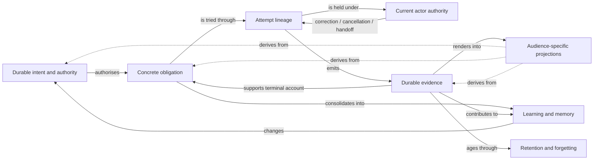
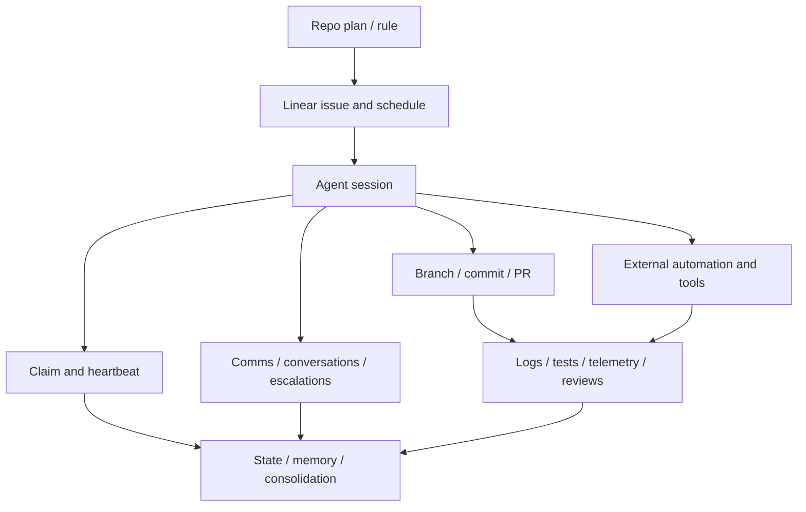
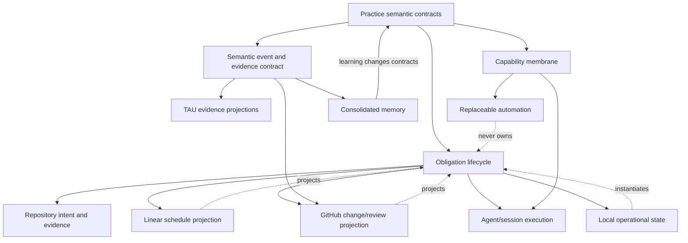
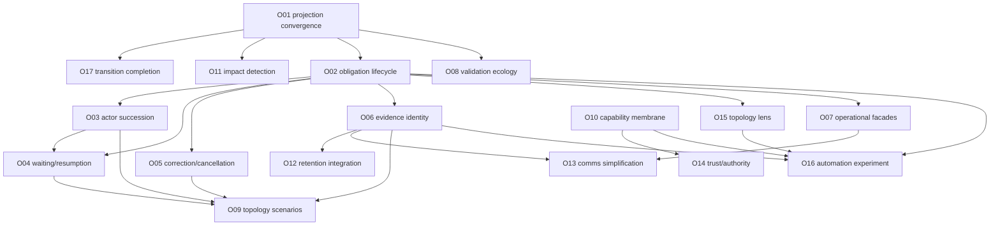

# Interaction and transition map

## The central interaction

The proposal is not a chain of new services. It is a causal relationship among existing Practice
surfaces.

The dashed edges are the present risk. A projection may show intent, current work, or evidence, but
must not become the owner of any of them.

## Current fragmentation

The same conceptual episode currently spans several systems:

These are legitimate specialised surfaces. The fragmentation lies in the missing semantic joins:

- no universal obligation identity;
- attempt lineage is often narrative;
- actor succession is local to claim/handoff conventions;
- waiting and resumption use several mechanisms;
- evidence correlation is surface-specific;
- terminal state can be inferred differently by each audience;
- transition and retirement completeness are not uniformly checked.

## Desired topology

The desired topology preserves the specialised systems while moving semantic identity above them.

No central runtime is implied. `Lifecycle`, `Events`, and `Membrane` are portable contracts. Different
hosts may implement them through several checked projections.

## Transition sequence

### Stage A — prove current truth can propagate

**Outcomes:** O01, O11, O17.

Select one real contradictory projection family and complete the transition:

1. identify canonical authority;
2. enumerate every live embodiment;
3. classify generated, validated, interpreted, and historical surfaces;
4. repair or retire stale projections;
5. add conformance and absence checks;
6. preserve historical evidence separately;
7. prove future authority changes produce deterministic updates or failures.

Recommended worked example: coordination-event retention and rotation.

**Why first:** introducing new lifecycle semantics into an estate with incomplete projection
convergence would multiply drift.

**Expected deletion:** stale state documentation, obsolete ledger references, transitional commands
or checks associated with the replaced contract.

### Stage B — validate the obligation ontology before building

**Outcomes:** O02 and O15.

Use two worked cases:

- one historical multi-session episode with failure, handoff, or retry;
- one live, bounded delivery occurrence.

Map:

- governing intent;
- obligation identity;
- attempts;
- actors and claims;
- waits and corrections;
- evidence and projections;
- terminal account;
- retained learning.

Revise or reject the ontology based on where it fails to explain the work.

**Why before tooling:** the wrong identities are expensive to unwind once copied into GitHub, Linear,
state, and telemetry.

**Expected deletion:** none yet. This stage is concept validation.

### Stage C — enact actor authority and resumable work

**Outcomes:** O03, O04, O05.

Add the minimum operational semantics needed for the selected live slice:

- attempt identity;
- bounded claim and succession;
- waiting condition;
- expected-state transition;
- correction/cancellation;
- terminal account.

Do not generalise every status before the worked slice proves the need.

**Expected deletion:** session-retention workarounds, narrative-only successor state, repeated orphan
coordination, duplicate resumption guards.

### Stage D — establish evidence identity through existing TAU direction

**Outcomes:** O06 and O12.

- register the operational question;
- define minimal semantic facts;
- project to fixtures/logs first;
- correlate with GitHub/Linear/state where required;
- run human interpretation;
- decide and remeasure;
- define retention and consolidation.

**Expected deletion:** direct sink-specific event definitions and manual cross-surface correlation for
the worked slice.

### Stage E — return value through agent experience

**Outcomes:** O07 and O13.

Replace the worked slice's implementation-shaped procedure with an outcome-oriented operation.
Simplify communication authoring through semantic routing.

This stage is a required acceptance gate, not later usability polish.

**Expected deletion:** flags, paths, temporary files, repeated identity inputs, channel-selection
instructions, and procedural steps rendered unnecessary.

### Stage F — prove system behaviour

**Outcomes:** O08 and O09.

- map the relevant validators and risks;
- build topology scenarios around the worked slice;
- reproduce one historical failure;
- prove stale actor, duplicate trigger, interruption, recovery, and projection drift behaviour;
- remove redundant controls only after structural proof exists.

**Expected deletion:** bespoke smoke scripts or read-side guards superseded by lower-level invariant
and scenario coverage.

### Stage G — generalise capability admission and trust

**Outcomes:** O10 and O14.

Apply the membrane to three unlike capability families before ratification:

- one canonical skill;
- one MCP/executable tool;
- one external organising or automation surface.

**Expected deletion:** duplicated capability-state vocabulary, silent local overrides, and one-off
availability instructions.

### Stage H — optional external automation

**Outcome:** O16.

Only after a real recurring cost and the previous contracts exist:

- select one bounded workflow;
- keep intent/evidence authority outside it;
- run a remove-the-automation drill;
- compare total cost and failure recovery;
- promote, revise, or reject.

**Expected deletion:** the manual recurring action the workflow replaces. If none disappears, do not
promote it.

## Dependencies between outcomes

## Interactions that can produce unintended harm

### Lifecycle plus existing plan state

If the obligation lifecycle duplicates Linear schedule state or plan ratification status, it will
recreate the drift the planning estate is designed to remove. It must join those surfaces by
identity, not mirror them.

### Stronger claims plus liveness taxonomy

The liveness model is already rich. Adding another independent claim-health vocabulary would increase
complexity. Attempt authority should consume liveness evidence and make one succession decision.

### Semantic events plus raw retention

A new event model can tempt the estate to retain more data. The correct result is usually less raw
stream retention because compact facts, artefacts, and terminal accounts become sufficient.

### Capability membrane plus platform adapters

The membrane must not turn canonical-first adapters into a central plugin registry. It governs
lifecycle semantics; existing portability architecture remains authoritative.

### Scenario harness plus production substrate

A test topology must not become the reason to build a central runtime. The harness may use fakes and
controlled actors so long as it proves portable invariants.

### External automation plus coordination home

An automation may deliver or schedule events. It must not acquire hidden ownership over the
coordination home's semantic truth or become required for local agent teams to function.

### Validation optimisation plus strictness

Evidence-led gate placement does not lower the standard. Fail-open fallback is acceptable only for
an optimisation whose failure causes more complete checking, never for safety or doctrine.

## Anti-sequence: what not to do

Do not:

1. choose an orchestration product;
2. create a universal work database;
3. mirror plans and Linear into it;
4. emit every event to several sinks;
5. add a dashboard;
6. write adapters for every agent platform;
7. add compatibility for the old state;
8. retain both systems indefinitely;
9. call the result operational coherence.

That sequence creates another authority and multiplies the projection problem.

## Smallest coherent experiment

A useful first experiment should include enough lifecycle to test the thesis and enough subtraction
to test value.

Candidate shape:

1. choose one ratified delivery obligation likely to cross sessions or wait for review;
2. assign one obligation identity and attempt identity;
3. bind the current claim to that attempt;
4. register one waiting or correction event;
5. link the resulting PR and evidence;
6. close with a terminal account;
7. consolidate the lesson;
8. replace at least one current manual procedure or status reconstruction;
9. replay one interruption scenario;
10. remove the experimental implementation and prove the semantic record remains understandable.

The experiment succeeds only if it lowers total coordination and review effort while preserving or
improving correctness, human control, and recovery.

## Transition closure criteria

A transition is complete when:

- one semantic authority is named;
- every live projection is aligned or intentionally removed;
- old active paths and vocabularies are absent;
- external consumers are migrated or governed by a named version obligation;
- expected deletions have landed;
- the new operational path is simpler for a cold agent;
- scenario tests prove failure and recovery behaviour;
- evidence reaches normal consolidation;
- the decision record and current enacted projection agree;
- no temporary flag, bridge, baseline, or compatibility layer remains without a dated removal
  condition.
