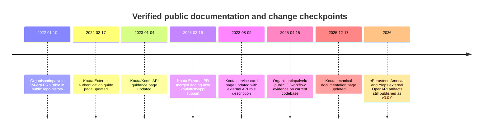
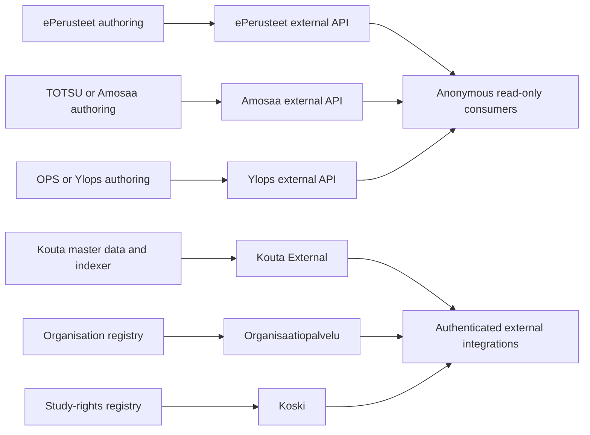

# Opetushallitus Public and Likely Public API Landscape

## Executive summary

The Opetushallitus organisation’s externally relevant APIs fall into two clearly different groups. The first group is genuinely public, anonymous, and read-only: the **ePerusteet external API**, the **TOTSU/Amosaa external API**, and the **OPS/Ylops external API**. In all three cases, the published OpenAPI documents use “external” or “public” endpoint groups, expose server URLs on `virkailija.opintopolku.fi`, and contain **no OpenAPI security scheme declarations** in the generated external specs, which is strong evidence that these specific external interfaces are intended for anonymous access. citeturn9view0turn10view0turn10view1turn11view0turn11view1turn11view2

The second group is public-facing in the sense that it is meant for integrations outside the immediate application UI, but it is **not anonymously public**. **Kouta External** is documented as an external integration API for education-offer data, but the official integration instructions require a **CAS ticket flow** followed by a session cookie, and broader Kouta guidance says authentication is needed for Kouta APIs. **Organisaatiopalvelu** exposes REST and SOAP external interfaces, but its Swagger UI currently redirects to CAS login, and the source code enforces read permissions and some role-based authorisation. **Koski** is the most explicit: its official documentation states that **all APIs require HTTP Basic Authentication**, and the repository documents a detailed rights model for service use. citeturn55view0turn17view2turn17view1turn24view2turn25view2turn25view4turn13search0turn37view3

Practically, if you are looking for the **fully public / anonymous** APIs, the safest list is: **ePerusteet external**, **TOTSU/Amosaa external**, and **OPS/Ylops external**. If you are looking for **external-facing but access-controlled** APIs, add **Kouta External**, **Organisaatiopalvelu**, and **Koski**. Public documentation quality is uneven: the ePerusteet family has directly retrievable raw OpenAPI JSON files, while Kouta External, Organisaatiopalvelu, and Koski rely more on live Swagger UIs, wiki pages, custom documentation, or source code than on raw downloadable OpenAPI specs. citeturn8view2turn8view1turn8view0turn9view0turn10view0turn10view1turn55view0turn18view0turn12search4

## Comparison at a glance

| API name | Main purpose | Base URL | Auth type | Public vs restricted | Confidence |
|---|---|---|---|---|---|
| ePerusteet external | Published national curriculum / qualification-basis content | `https://virkailija.opintopolku.fi/eperusteet-service` | Unspecified in external spec; no security schemes declared | Public anonymous, read-only | High citeturn9view0turn11view0turn11view3 |
| TOTSU / Amosaa external | Published teaching / implementation-plan content from the TOTSU tool | `https://virkailija.opintopolku.fi/eperusteet-amosaa-service` | Unspecified in external spec; no security schemes declared | Public anonymous, read-only | High citeturn10view0turn11view1turn11view4 |
| OPS / Ylops external | Published local curriculum content from the OPS tool | `https://virkailija.opintopolku.fi/eperusteet-ylops-service` | Unspecified in external spec; no security schemes declared | Public anonymous, read-only | High citeturn10view1turn47view0turn11view2turn11view5 |
| Kouta External | External integrations to indexed education-offer data; also supports creating/editing some Kouta-side search data | `https://virkailija.opintopolku.fi/kouta-external` | CAS TGT → CAS ST → `/auth/login` → session cookie; caller-id header required in general Kouta guidance | External-facing but restricted | High for “restricted”, medium for broader endpoint catalogue because raw spec was not retrievable citeturn55view0turn17view2turn54search0 |
| Organisaatiopalvelu | External organisation registry interfaces, including REST v1/v2 and SOAP | Inferred as `https://virkailija.opintopolku.fi/organisaatio-service/api` for REST v4 examples | CAS-backed login for UI; API rights/roles enforced in code; token/service-account flow unspecified in public docs | External-facing but restricted | Medium-high citeturn18view0turn17view1turn24view2turn25view2turn25view4 |
| Koski | National study-rights and completions registry; SIS integrations, disclosure APIs, and OAuth2/mTLS OmaData material | `https://koski.opintopolku.fi/koski/api` | HTTP Basic Authentication for documented APIs; OAuth2 + mTLS documented separately for OmaData sample/integration | External-facing but restricted | Very high citeturn13search0turn37view3turn37view4 |

## API-by-API findings

### ePerusteet external

The ePerusteet external API is the cleanest example of a truly public Opetushallitus API in this set. The repository contains a generator script that explicitly produces a **public OpenAPI description** (`eperusteet-ext.spec.json`), and the raw spec declares the server `https://virkailija.opintopolku.fi/eperusteet-service`. The spec groups these routes under `/api/external/...` and includes no `securitySchemes` or top-level `security` declarations. citeturn8view2turn9view0turn11view0turn11view3

**Purpose.** Read published “perusteet” content: curricula, qualification bases, parts of a basis, competence-badge records, and related public structures. The API is read-only in the external spec. citeturn9view0

**Base URL.** `https://virkailija.opintopolku.fi/eperusteet-service` citeturn9view0

**Official docs and spec.**  
Docs page: `https://opetushallitus.github.io/eperusteet/api/eperusteet`  
Raw OpenAPI JSON: `https://raw.githubusercontent.com/Opetushallitus/eperusteet/master/generated/eperusteet-ext.spec.json` citeturn9view0turn8view2

**Authentication.** **Unspecified** in the external spec. The strongest observable evidence is negative rather than positive: the external spec contains no OpenAPI security scheme entries or security requirements. I therefore assess this interface as intended for anonymous use. citeturn11view0turn11view3

**Example endpoints and shapes**

| Endpoint | Method | What it does | Request shape | Response shape |
|---|---|---|---|---|
| `/api/external/perusteet` | GET | Search/list published bases | Query params such as `koulutustyyppi[]`, `nimi`, `kieli`, `voimassa`, `tulevat`, `poistuneet`, `tyyppi`, `diaarinumero`, `koodi`, `sivu`, `sivukoko` | `PagePerusteenJulkaisuData` page object with paginated results citeturn9view0 |
| `/api/external/peruste/{perusteId}` | GET | Fetch one basis in full | Path param `perusteId` as `int64` | `PerusteKaikkiDto` citeturn9view0 |
| `/api/external/peruste/{perusteId}/{custompath}` | GET | Traverse exact nested content structure dynamically | Path params `perusteId`, `custompath` | JSON object based on `PerusteKaikkiDto` traversal; example in spec shows nested lookups down to language-specific name fields citeturn9view0 |
| `/api/external/peruste/{perusteId}/perusteenosa/{perusteenOsaId}` | GET | Fetch one published section / part of a basis | Path params `perusteId`, `perusteenOsaId` | `PerusteenOsaDto` citeturn9view0 |
| `/api/external/peruste/tutkinnonosa/{tutkinnonOsaKoodiUri}` | GET | Fetch a qualification unit by code URI | Path param `tutkinnonOsaKoodiUri` | `TutkinnonOsaKaikkiDto` citeturn9view0 |
| `/api/external/osaamismerkit` | GET | List all published competence badges | No params required | Array of `OsaamismerkkiExternalDto` citeturn9view0 |

**Rate limits / usage policies.** No rate limit was documented in the raw external OpenAPI document I inspected. citeturn9view0

**Confidence on public anonymous access.** **High.** The route namespace is explicitly `external`, the generator script labels it public, and the external spec has no auth declaration. citeturn8view2turn11view0turn11view3

### TOTSU / Amosaa external

The Amosaa repository mirrors the ePerusteet pattern almost exactly: the build script generates both a standard and an **external/public** OpenAPI document, with the public one emitted as `amosaa-ext.spec.json`. The raw spec declares the server `https://virkailija.opintopolku.fi/eperusteet-amosaa-service` and again contains no OpenAPI security declarations. citeturn8view1turn10view0turn11view1turn11view4

**Purpose.** Public retrieval of published `opetussuunnitelma` data from the TOTSU / Amosaa tool. The routes are centred on teaching-plan / curriculum documents and dynamic traversal of nested structures. citeturn10view0

**Base URL.** `https://virkailija.opintopolku.fi/eperusteet-amosaa-service` citeturn10view0

**Official docs and spec.**  
Docs page: `https://opetushallitus.github.io/eperusteet/api/amosaa`  
Raw OpenAPI JSON: `https://raw.githubusercontent.com/Opetushallitus/eperusteet-amosaa/master/generated/amosaa-ext.spec.json` citeturn8view1turn10view0

**Authentication.** **Unspecified** in the public external spec; no OpenAPI security scheme or requirement is declared. That makes anonymous, read-only public access the most credible reading of the published evidence. citeturn11view1turn11view4

**Example endpoints and shapes**

| Endpoint | Method | What it does | Request shape | Response shape |
|---|---|---|---|---|
| `/api/external/opetussuunnitelma/{koulutustoimijaId}/{opsId}` | GET | Fetch a published curriculum/plan by education-provider ID and plan ID | Path params `koulutustoimijaId`, `opsId` | `OpetussuunnitelmaKaikkiDto` citeturn10view0turn46view0 |
| `/api/external/opetussuunnitelma/{opsId}` | GET | Fetch a published curriculum/plan by plan ID | Path param `opsId` | `OpetussuunnitelmaKaikkiDto` citeturn10view0turn46view0 |
| `/api/external/opetussuunnitelma/{opsId}/{custompath}` | GET | Traverse nested plan content dynamically | Path params `opsId`, `custompath`; query parameters may filter returned lists | JSON fragment from `OpetussuunnitelmaKaikkiDto`; spec examples show traversing into `tutkinnonOsat` and filtering by fields such as `tyyppi` and `nimi.fi` citeturn10view0turn46view0 |

**Rate limits / usage policies.** None documented in the retrieved external spec. citeturn10view0

**Confidence on public anonymous access.** **High.** Same rationale as ePerusteet: an explicitly generated public spec plus no security declaration. citeturn8view1turn11view1turn11view4

### OPS / Ylops external

Ylops follows the same publication model as the other ePerusteet-family services. Its generator script copies `ylops-ext.spec.json` as the external/public OpenAPI artifact, and the raw spec declares the server `https://virkailija.opintopolku.fi/eperusteet-ylops-service`. The public spec again omits security declarations. citeturn8view0turn10view1turn47view0turn11view2turn11view5

**Purpose.** Public retrieval of published OPS tool content, especially local curricula / teaching-plan records and structured exports. The external routes are more list-oriented than Amosaa’s, with an official public search endpoint for curricula. citeturn10view1turn47view0

**Base URL.** `https://virkailija.opintopolku.fi/eperusteet-ylops-service` citeturn10view1

**Official docs and spec.**  
Docs page: `https://opetushallitus.github.io/eperusteet/api/ylops`  
Raw OpenAPI JSON: `https://raw.githubusercontent.com/Opetushallitus/eperusteet-ylops/master/generated/ylops-ext.spec.json` citeturn8view0turn10view1

**Authentication.** **Unspecified** in the external spec; no OpenAPI security schemes or security requirements were present in the retrieved artifact. citeturn11view2turn11view5

**Example endpoints and shapes**

| Endpoint | Method | What it does | Request shape | Response shape |
|---|---|---|---|---|
| `/api/external/opetussuunnitelmat` | GET | Search/list published curricula | Query params include `nimi`, `kieli[]`, `perusteenDiaarinumero`, `koulutustyypit[]`, `organisaatio`, `sivu`, `sivukoko`, `julkaistuJalkeen`, `julkaistuEnnen` | `PageOpetussuunnitelmaJulkinenDto` citeturn10view1 |
| `/api/external/opetussuunnitelma/{opetussuunnitelmaId}` | GET | Fetch one curriculum/plan export | Path param `opetussuunnitelmaId` | `OpetussuunnitelmaExportDto` citeturn47view0 |
| `/api/external/opetussuunnitelma/{opetussuunnitelmaId}/{custompath}` | GET | Traverse nested curriculum content dynamically | Path params `opetussuunnitelmaId`, `custompath` | JSON fragment from exported curriculum structure citeturn47view0 |

**Rate limits / usage policies.** None documented in the retrieved external spec. citeturn10view1

**Confidence on public anonymous access.** **High.** The evidence is the same as for the other ePerusteet-family external specs. citeturn8view0turn11view2turn11view5

### Kouta External

Kouta External is very clearly **external-facing**, but it is not anonymously public. Official Kouta guidance describes the service as the external API for the new education-offer data and says it is particularly suitable when another system wants to **fetch stored education-offer data or import it from its own system**. A separate official integration page documents a four-step CAS authentication flow ending in a session cookie and gives a concrete example request against `/kouta-external/hakukohde/{oid}`. General Kouta guidance also says Kouta APIs need authentication, and all APIs require a `caller-id` header; some requests also need a CSRF token. citeturn17view2turn54search0turn55view0

**Purpose.** External integrations to indexed Kouta data. The broader Kouta service description identifies the main resource families as **koulutus** (education modules), **toteutus** (implementations), **hakukohde** (application options), **haku** (application rounds), **valintaperuste** (selection criteria descriptions), and **SORA descriptions**. The service card also says Kouta External enables creation and modification of Kouta-backend searches. citeturn54search0turn56search1

**Base URL.** `https://virkailija.opintopolku.fi/kouta-external` citeturn55view0

**Official docs and spec.**  
Swagger UI: `https://virkailija.opintopolku.fi/kouta-external/swagger/index.html`  
ReDoc: `https://virkailija.opintopolku.fi/kouta-external/redoc/index.html`  
Raw OpenAPI/Swagger artifact: **not found in repo or via crawler-accessible docs**. citeturn55view0turn17view2

**Authentication.**  
Documented flow:

- Acquire a **CAS TGT** by `POST`ing username/password to `https://virkailija.opintopolku.fi/cas/v1/tickets`.
- Use the TGT to request a **CAS service ticket** for `https://virkailija.opintopolku.fi/kouta-external/auth/login`.
- Exchange the service ticket at `/auth/login` to obtain a **session cookie**.
- Present the session cookie on subsequent Kouta External requests. citeturn55view0

How to obtain credentials is **not documented on the Kouta page itself**. The Opintopolku CAS login page says Opintopolku virkailija credentials are obtained, for example, from the user’s own organisation’s Opintopolku admin / superuser. I therefore classify “how to obtain credentials” as **partly specified generically, but API-specific provisioning is unspecified**. citeturn17view1turn55view0

**Example endpoints and shapes**

Because the live Swagger/ReDoc payload was not crawler-retrievable, only one concrete business endpoint could be verified directly from the official auth instructions. I therefore separate **verified** from **likely-but-not-crawler-verified** endpoint forms.

| Endpoint | Verification status | What it does | Request / response note |
|---|---|---|---|
| `/auth/login?ticket={ST}` | Verified | Finalises CAS login and creates Kouta session | Returns `Set-Cookie: session=...` on success citeturn55view0 |
| `/hakukohde/{oid}` | Verified | Fetches one application option by OID | Official example request uses `GET .../hakukohde/1.2.246.562.20...` with session cookie; response shape not shown in the auth page citeturn55view0 |
| `/koulutus/{oid}` | Likely top-level resource family, not independently verified | Would align with the documented Kouta resource model (“koulutus”) | Treat path form as provisional until checked against live Swagger/ReDoc citeturn54search0 |
| `/toteutus/{oid}` | Likely top-level resource family, not independently verified | Would align with documented “toteutus” resource family | Provisional citeturn54search0 |
| `/haku/{oid}` | Likely top-level resource family, not independently verified | Would align with documented “haku” resource family | Provisional citeturn54search0 |
| `/valintaperuste/{id}` | Likely top-level resource family, not independently verified | Would align with documented “valintaperuste” resource family | Provisional citeturn54search0 |

**Rate limits / usage policies.** I found **no published numerical rate limits**. I did find a documented general usage requirement: Kouta-side APIs require authentication, `caller-id` headers, and some requests also require CSRF tokens. citeturn17view2

**Confidence on public anonymous access.** **Very low.** Confidence that it is **restricted** is **high**, because the official instructions describe a CAS → service ticket → session-cookie flow. citeturn55view0

### Organisaatiopalvelu

Organisaatiopalvelu is externally relevant but clearly access-controlled. The repository README says the service contains the organisation service’s **REST and SOAP services**, and another README snippet says the `organisaatio-api` module describes the service’s **external interfaces (SOAP, REST V1 and REST V2)**. The public Swagger UI URL currently redirects to the CAS login page. The source code for the newer REST interface shows route definitions, result DTOs, and explicit permission checks such as `permissionChecker.checkReadOrganisation(oid)` and role-gated operations with `@PreAuthorize("hasRole('ROLE_APP_ORGANISAATIOHALLINTA')")`. citeturn18view0turn20search0turn17view1turn24view2turn25view2turn25view4turn25view5

**Purpose.** External organisation-registry APIs for reading organisation data, searching, viewing history, creating/updating organisations, and supporting both REST and SOAP integrations. citeturn18view0turn20search0turn24view0turn24view1

**Base URL.** The host is documented as `https://virkailija.opintopolku.fi/organisaatio-service`. The source class is mounted at `@RequestMapping("${server.api.context-path}")`, and the implementation comments show concrete paths like `GET /api/{oid}` and `GET /api/hierarkia/hae`. I therefore infer the REST base as `https://virkailija.opintopolku.fi/organisaatio-service/api` for the route examples below. citeturn18view0turn24view2turn25view0turn25view2

**Official docs and spec.**  
Swagger UI: `https://virkailija.opintopolku.fi/organisaatio-service/swagger-ui`  
Raw OpenAPI/Swagger JSON/YAML: **not found** in retrievable repo/docs artefacts. citeturn18view0turn17view1

**Authentication.**  
Public documentation does **not** spell out a separate bearer-token or API-key issuance flow. What is visible is:

- the Swagger UI redirects to **CAS login**;  
- the CAS login page says Opintopolku credentials are obtained from the user’s organisation’s Opintopolku admin / superuser;  
- the service code enforces per-organisation read checks and some admin-role checks. citeturn17view1turn24view2turn25view2turn25view4turn25view5

So the best evidence-based summary is: **CAS-backed authenticated access with service-side permission checks; token/service-account acquisition is unspecified in public documentation**. citeturn17view1turn24view2

**Example endpoints and shapes**

| Endpoint | Method | What it does | Request shape | Response shape |
|---|---|---|---|---|
| `/findbyoids` | POST | Fetch up to 1000 non-deleted organisations by OID set | JSON body: set of OID strings | `List<OrganisaatioRDTOV4>` citeturn24view0turn24view2 |
| `/{oid}` | GET | Fetch one organisation by OID, business ID, agency code, school code, or site code | Path param `oid`; optional `includeImage=false` | `OrganisaatioRDTOV4` citeturn24view0turn25view4 |
| `/{oid}/children` | GET | Fetch child organisations under a given organisation | Path param `oid`; optional `includeImage=false` | `List<OrganisaatioRDTOV4>` citeturn24view0turn24view2 |
| `/muutetut` | GET | List organisations modified after a date | Query params: `lastModifiedSince`, `includeImage`, `organizationType[]`, `excludeDiscontinued` | `List<OrganisaatioRDTOV4>` citeturn24view1turn25view1 |
| `/{oid}/historia` | GET | Fetch organisation structural history | Path param `oid` | `OrganisaatioHistoriaRDTOV4` citeturn24view1turn25view2 |
| `/hae` | GET | Search organisations with structured criteria | Query object `OrganisaatioSearchCriteriaDTOV4` | `OrganisaatioHakutulosV4` citeturn24view1turn25view0 |

**Rate limits / usage policies.** I found no published numerical rate limits in the public docs I could retrieve. citeturn18view0turn17view1

**Confidence on public anonymous access.** **Low.** Confidence that access is **restricted** is **medium-high**, because the UI sits behind CAS and the code performs explicit authorisation checks. citeturn17view1turn25view2turn25view4turn25view5

### Koski

Koski is the most clearly documented restricted API surface in this set. The official API docs say, in plain Finnish, that **all interfaces require HTTP Basic Authentication**, and they add that access is controlled by rights groups. The repository README details those rights further, including `KOSKI READ`, `KOSKI READ_UPDATE`, `KOSKI LUOTTAMUKSELLINEN`, and `KOSKI TIEDONSIIRTO`. Separately, the repository includes an **OmaData OAuth2 sample** that documents an OAuth2 + **mTLS** integration model in production behind AWS ALB, so Koski should be understood as having multiple authenticated integration styles depending on the sub-API. citeturn13search0turn37view3turn37view4

**Purpose.** National registry and transfer service for study rights and completed studies, with interfaces for student-information-system integrations, disclosure services, and special OAuth2/OmaData scenarios. The public documentation site says it documents both **data models** and **interfaces**, and the schema pages show the core payload model built around an `Oppija` (learner) with nested `opiskeluoikeudet` (study-rights). citeturn12search4turn12search5turn38search0

**Base URL.** The documented API paths are under `https://koski.opintopolku.fi/koski/api`. This is explicit for the disclosure-service example and consistent with the documentation site structure and example JSON files. citeturn12search3turn12search7

**Official docs and spec.**  
Docs root: `https://opintopolku.fi/koski/dokumentaatio`  
Student-information-system API docs: `https://koski.opintopolku.fi/koski/dokumentaatio/rajapinnat/opintohallintojarjestelmat`  
Disclosure-service docs: `https://koski.opintopolku.fi/koski/dokumentaatio/rajapinnat/luovutuspalvelu`  
Data model / schema browser: `https://koski.opintopolku.fi/koski/dokumentaatio/koski-oppija-schema.html`  
OmaData OAuth2 sample docs (from repo README): `https://testiopintopolku.fi/koski/dokumentaatio/rajapinnat/oauth2/omadata`  
Raw OpenAPI/Swagger JSON/YAML: **not found**; the documentation is presented as custom docs and schema pages rather than a retrievable OpenAPI spec. citeturn12search4turn13search0turn12search3turn38search0turn37view4

**Authentication.**  
For the main documented Koski APIs: **HTTP Basic Authentication**. The docs also say credentials can be obtained from the Koski development team on request. For OAuth2/OmaData, the repository sample documents **OAuth2 with mTLS client certificates**, validating client-cert information forwarded by AWS ALB in production. citeturn13search0turn37view4

**Example endpoints and shapes**

Because the official docs are custom-rendered and the crawler could only directly expose one concrete path from the public docs, I am again separating **verified** from **operation-family examples**.

| Endpoint / operation family | Verification status | What it does | Request / response note |
|---|---|---|---|
| `/koski/api/luovutuspalvelu/haku` | Verified | Search up to 1000 study-right records by criteria | Official docs show `v=1`, paging params, date filter, and repeated `opiskeluoikeudenTyyppi` filters; returns multiple study-right records citeturn12search3 |
| `Oppija`-based SIS transfer operations | Verified as documented operation family, exact path not crawler-exposed | Read / write learner + study-right payloads for SIS integrations | Schema browser shows an `Oppija` object containing `henkilö` and `opiskeluoikeudet`; example JSON is published under `/koski/api/documentation/examples/...json` citeturn38search0turn12search7 |
| Disclosure-service family under `/koski/api/luovutuspalvelu/...` | Verified family | Bulk disclosure / search operations for restricted consumers | Official documentation page and example request are published for this family; one concrete path is visible in docs search output citeturn12search3 |
| OAuth2 / OmaData operation family | Verified family | OAuth2-based personal-data access / consent-oriented integration model | Repo sample documents OAuth2 + mTLS architecture and points to dedicated OAuth2 docs citeturn37view4 |

**Rate limits / usage policies.** I found no published numeric rate-limit policy. I did find one explicit functional limit: the disclosure-service search call can fetch data for **up to 1000 study rights** at a time. The docs also say access is rights-group based and some calls are limited to specific authorities. citeturn12search3turn13search0

**Confidence on public anonymous access.** **Essentially none.** Confidence that it is **restricted** is **very high**, because the official docs explicitly state that all APIs require HTTP Basic Authentication. citeturn13search0

## Translated key Finnish source excerpts

A few Finnish passages are especially important for interpreting the API landscape correctly.

**Kouta general guidance.** Original Finnish: “**Autentikointia tarvitaan tarjonnan (kouta) eri rajapintojen käyttöön. Julkisen puolen (uudistettu opintopolku.fi eli konfo) rajapintojen käyttämiseen ei tarvita autentikaatiota. Kaikkien rajapintojen käyttöön vaaditaan kuitenkin caller-id-header ja osaan pyynnöistä myös CSRF-token.**”  
Translation: “**Authentication is required for using the different Kouta APIs. Authentication is not required for the public-side APIs (the renewed Studyinfo / Konfo). However, all APIs require a caller-id header, and some requests also require a CSRF token.**” This is the cleanest official statement distinguishing Kouta External from the anonymous Konfo external APIs. citeturn17view2

**Kouta External auth flow.** Original Finnish heading and step text: “**Hae CAS-palvelulta TGT… Hae CAS-palvelulta ST… Autentikoidu palveluun ja muodosta sessio… Kutsu kouta-externalin rajapintaa**.”  
Translation: “**Obtain a TGT from the CAS service… obtain a service ticket from CAS… authenticate to the service and establish a session… call the Kouta External API.**” This is why Kouta External should be treated as external-facing but authenticated, not anonymous. citeturn55view0

**Organisaatiopalvelu API scope.** Original Finnish: “**Organisaatio-api-moduuli kuvaa organisaatiopalvelun ulkoiset rajapinnat (SOAP, REST V1 ja REST V2).**”  
Translation: “**The organisaatio-api module describes the organisation service’s external interfaces (SOAP, REST V1 and REST V2).**” That wording matters because it confirms external exposure, but not anonymous exposure. citeturn20search0

**Koski authentication.** Original Finnish: “**Kaikki rajapinnat vaativat HTTP Basic Authentication -tunnistautumisen… Saat tarvittavat tunnukset Koski-kehitystiimiltä pyydettäessä.**”  
Translation: “**All interfaces require HTTP Basic Authentication… You can obtain the necessary credentials from the Koski development team on request.**” This is the strongest direct answer to the access question for Koski. citeturn13search0

## Timeline and usage model

Public changelogs are inconsistent across these services, so the timeline below uses the nearest dated primary change artefacts I could verify: repository PR dates, official wiki/doc update dates, and documented publication checkpoints. That is more reliable than inventing a consolidated changelog that does not actually exist publicly. citeturn55view0turn54search0turn54search1turn20search3turn37view4

The architectural split is also fairly clear: the ePerusteet-family external APIs are read-only publication surfaces; Kouta External is an authenticated integration surface over offer data; Organisaatiopalvelu is a protected organisation-registry integration surface; and Koski is a protected study-rights registry/integration surface. citeturn9view0turn10view0turn10view1turn54search0turn18view0turn13search0

## Missing specs and search gaps

Three services in this report had directly retrievable raw OpenAPI files: **ePerusteet**, **TOTSU/Amosaa**, and **OPS/Ylops**. For the remaining services, I did **not** find crawler-retrievable raw OpenAPI/Swagger JSON or YAML despite checking the most plausible official locations. citeturn9view0turn10view0turn10view1turn55view0turn18view0turn12search4

**Repos searched and files checked when raw spec files were missing**

- **`Opetushallitus/kouta-external`**  
  Checked public repo README and `pom.xml`, plus the official Swagger/ReDoc URLs and official Eduuni integration guidance. Result: docs UI exists and auth is documented, but I could not retrieve a raw OpenAPI JSON/YAML artifact through the crawler. citeturn26search8turn26search1turn55view0turn17view2

- **`Opetushallitus/organisaatio`**  
  Checked repo `README.md`, the `organisaatio-api` README snippet, `organisaatio-api/.../OrganisaatioApi.java`, and `organisaatio-service/.../OrganisaatioApiImpl.java`, plus the public Swagger UI URL. Result: endpoint catalogue is reconstructible from source annotations and implementation comments, but no raw OpenAPI JSON/YAML artifact was located in the retrieved sources. citeturn18view0turn20search0turn24view0turn24view1turn24view2turn17view1

- **`Opetushallitus/koski`**  
  Checked repo `README.md`, `omadata-oauth2-sample/README.md`, documentation root, disclosure-service docs, and schema-browser/examples pages. Result: extensive custom docs and schema pages exist, but I did not locate a public raw OpenAPI/Swagger JSON/YAML file. citeturn37view3turn37view4turn12search4turn12search3turn38search0turn12search7

**Bottom line**

If you need the safest shortlist of **fully public, likely anonymous** Opetushallitus APIs, use the three ePerusteet-family external specs first. If you need the broader set of **external-facing integration APIs**, add Kouta External, Organisaatiopalvelu, and Koski — but treat all three as permissioned integrations rather than open public APIs. citeturn9view0turn10view0turn10view1turn55view0turn17view1turn13search0