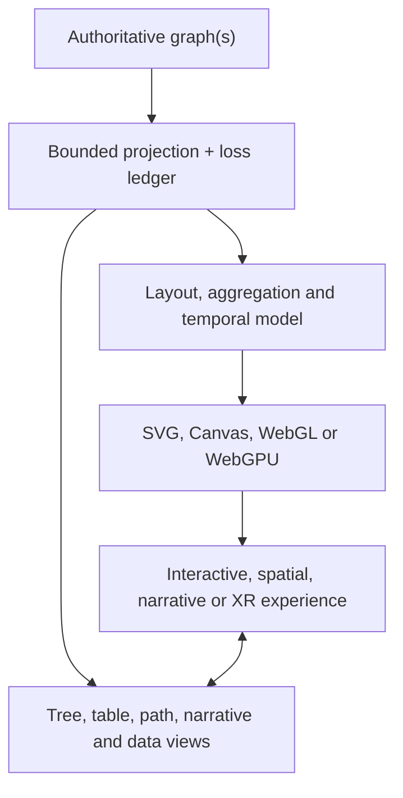

# Web technology landscape for dynamic, interactive graph experiences

<!-- markdownlint-disable MD013 MD060 -->

- **Date:** 2026-08-30
- **Status:** Provisional research landscape; no implementation selected
- **Decision class:** Broad capability and evidence map, not a product, stack or architecture decision
- **Strategic relationship:** Research input to the owner-declared Oak Innovation Kit fourth value stream; strategy authority remains in `docs/strategy/`
- **Evidence pin:** OCE `engraph` commit [`6f0aecf5d9326658409ee8e199e9dfc2af0f9951`](https://github.com/EngraphCode/oak-open-curriculum-ecosystem/commit/6f0aecf5d9326658409ee8e199e9dfc2af0f9951)

## Scope and answer

The originating brief sought graph experiences that move beyond flat, static node-link diagrams; it did not prescribe a dimensional form. This report therefore treats expressive 2D, semantic zoom, transitions, small multiples, linked views, animation, 2.5D, 3D, spatial layouts, narrative, multimodal interaction and immersive forms as one evidence-led design landscape. The web platform can support all of these, but no single technology or dimensional form is best in the abstract.

The landscape spans:

1. the authoritative graph or graphs;
2. bounded, loss-declared projections;
3. layout and analysis;
4. rendering substrates;
5. scene and graph frameworks;
6. interaction, narrative and spatial experience;
7. an equivalent, synchronised non-spatial representation.

The strongest conclusion is therefore a boundary, not a library choice:

> Dimensionality, motion and immersion are encodings and interaction modes. They are not evidence that a view is more faithful, usable or valuable.

This report maps the broad landscape without selecting a stack, product, dimensionality or implementation. Its external evidence is current to 30 August 2026.

## Executive synthesis

- **The browser substrate is viable.** WebGL 2 is a mature GPU baseline. WebGPU has implementations across current major-engine release lines and brings modern render and compute pipelines, but fleet coverage remains device- and operating-system-specific; optional features and engine-framework parity still vary. [WebGPU specification](https://www.w3.org/TR/webgpu/), [MDN compatibility overview](https://developer.mozilla.org/en-US/docs/Web/API/WebGPU_API), [WebKit in Safari 26](https://webkit.org/blog/17333/webkit-features-in-safari-26-0/), [WebGL overview](https://www.khronos.org/webgl/)
- **There are several credible technology families.** Browser-native interactive composition such as D3; general scene engines such as Three.js, Babylon.js and PlayCanvas; graph-specific components such as 3d-force-graph and Reagraph; GPU data-visualisation systems such as deck.gl and Cosmograph; graph-analysis and layout libraries such as Graphology, Cytoscape.js and ELK; and commercial graph SDKs such as yFiles, Ogma and KeyLines all occupy different layers.
- **Dimensionality is not the organising goal.** Interactive 2D, semantic zoom, progressive disclosure, stable transitions, matrix and hybrid representations, small multiples, 2.5D layers, 3D scenes, linked views, spatial narratives, immersive WebXR and multimodal cues can each make a graph less static while answering different tasks.
- **No universal perceptual advantage has been established.** The cited studies report task-, display- and interaction-dependent trade-offs; they do not establish a general winner among 2D, 2.5D, desktop 3D and immersive forms. In some tested immersive conditions, participants performed better on particular topology tasks; other tasks favoured 2D spatial-memory performance or showed no clear overall winner. Occlusion, unstable labels, perspective shrinkage, navigation cost and loss of spatial memory remain material risks. Viewpoint preference is useful design evidence but does not establish task performance. [Feyer et al.](https://arxiv.org/html/2307.10674v2), [Kotlarek et al.](https://arxiv.org/abs/2001.06462), [Joos et al.](https://drops.dagstuhl.de/storage/00lipics/lipics-vol357-gd2025/html/LIPIcs.GD.2025.37/LIPIcs.GD.2025.37.html)
- **Accessibility is a co-equal product surface.** Canvas, WebGL and WebXR do not create graph semantics in the accessibility tree. Equivalent access means preserving the relevant nodes, relationships, state and tasks through synchronised search, tree, table, path, outline, narrative, data or second-screen views—not merely adding alternative text. [WHATWG canvas](https://html.spec.whatwg.org/multipage/canvas.html), [WAI complex images](https://www.w3.org/WAI/tutorials/images/complex/), [XR Accessibility User Requirements](https://www.w3.org/TR/xaur/)
- **Scale has three independent meanings.** Rendering throughput, interaction latency and semantic completeness must be evaluated separately. A GPU can draw a misleading million-edge projection; a faithful graph can still be visually unusable.
- **For OCE, projection integrity is the decisive architectural concern.** Stable identity, graph authority, direction, multiplicity, ordering, temporal validity, provenance, inference status, structural bounds and declared loss must survive every view.

## Repository fit and authority

The current `engraph` baseline treats graph capability as cross-domain and keeps an accepted, componentised SVG visualisation precedent. The Innovation Kit strategy frames the Kit as a fourth value stream and names visual, interactive graph exploration as an open-ended demonstrator. [Innovation Kit strategy](../../../docs/strategy/stream-innovation-kit.md), [strategy overview](../../../docs/strategy/README.md)

That direction broadens the opportunity without settling the mechanism.

The accepted [ADR-062](../../../docs/architecture/architectural-decisions/062-knowledge-graph-svg-visualization.md) remains a sound solution for its stated, small schema graph of roughly 28 concepts and 45 edges. Its more durable lessons are separation of data and rendering, stable IDs, relative groups, derived edge geometry, central styling, hover/focus detail, deterministic tests and visual verification. This research does not show that SVG should be replaced; it asks what other representations become possible for different graph sizes, meanings and tasks.

OCE’s graph doctrine, recorded in accepted
[ADR-195](../../../docs/architecture/architectural-decisions/195-graph-tools-first-class-tool-category.md),
adds stronger constraints:

- a graph is not a list;
- a bounded subgraph must be complete within its declared structural bound;
- random truncation or top-N display must not masquerade as a graph result;
- contiguous and sparse views can both be valid when their shape is explicit;
- the next navigation anchor must remain recoverable;
- authority and provenance do not disappear when data becomes visual;
- a property graph, scene graph or screen layout is a projection, not canonical truth.

Those constraints are repository-derived. The layered model below is an analytical frame introduced by this report, not ratified architecture.

## A layered model

| Layer                     | Questions it owns                                                                               | Technology examples                                                                     |
| ------------------------- | ----------------------------------------------------------------------------------------------- | --------------------------------------------------------------------------------------- |
| Authority and graph model | Which graph, source, identity, direction, multiplicity, time and provenance are true?           | OCE graph corpus/project/SDK; RDF/JSON-LD; property-graph projections                   |
| Projection and query      | What complete bounded result is being shown? What is filtered, inferred, aggregated or omitted? | OCE graph tools; Graphology; Cytoscape.js; query/result envelopes                       |
| Layout and analysis       | Why are nodes at these coordinates? What does distance mean?                                    | d3-force-3d, ngraph, ELK/ELKJS, Graphviz/WASM, MSAGL, GPU force layouts                 |
| Rendering                 | How are marks drawn and updated?                                                                | SVG, Canvas 2D, OffscreenCanvas, WebGL 2, WebGPU                                        |
| Scene and interaction     | How are camera, picking, labels, gestures and animation managed?                                | Three.js, React Three Fiber, Babylon.js, PlayCanvas, PixiJS, deck.gl, A-Frame           |
| Graph experience          | Which graph-specific exploration tools exist?                                                   | 3d-force-graph, Reagraph, G6, Sigma, Cosmograph, yFiles, Ogma, KeyLines, GraphXR        |
| Equivalent access         | Can the same information and tasks be reached without spatial perception or complex gestures?   | DOM controls, search, tree, table, path, outline, narrative, JSON, print, second screen |

A renderer’s “scene graph” is merely a hierarchy of render objects. It should not be confused with OCE’s domain graph.

## Rendering, interaction and composition substrates

### Browser substrates

| Family        | What it is good at                                                                                     | Boundaries relevant to graphs                                                                                            | Maturity as of 2026-08-30                                                                                             |
| ------------- | ------------------------------------------------------------------------------------------------------ | ------------------------------------------------------------------------------------------------------------------------ | --------------------------------------------------------------------------------------------------------------------- |
| **DOM + SVG** | Crisp vector marks and text; addressable elements; CSS; familiar focus and event model                 | Retained DOM cost grows with dense, frequently changing scenes; 2D only; still needs a meaningful graph navigation model | Established and appropriate for small or moderately complex semantic diagrams                                         |
| **Canvas 2D** | Batched bitmap drawing; flexible custom marks; lower per-mark DOM cost                                 | Application owns retained state, hit testing, redraw, focus mapping and semantics                                        | Established; OffscreenCanvas can move rendering work into a worker                                                    |
| **WebGL 2**   | GPU-instanced points, lines, meshes and textures; broad deployment; mature engine support              | Low-level; no graph model, layout, text, camera or accessibility semantics; general compute is constrained               | Mature browser GPU baseline                                                                                           |
| **WebGPU**    | Modern render and compute pipelines; storage buffers; indirect work; GPU-resident layout possibilities | Low-level; feature and limit variance; device loss and fallback; framework parity is still uneven                        | Implemented across current major-engine release lines, but fleet coverage and higher-level tooling continue to evolve |

Official standards do not provide portable “maximum nodes” figures. Actual capacity depends on labels, edge geometry, transparency and overdraw, picking, update rate, layout computation, buffer churn, device memory and the target frame budget.

### General scene and data-visualisation frameworks

| Family                                         | Broad suitability                                                                                                                                                                                                                                                                                                                  | Important caveats                                                                                                                                                                                                                                                          |
| ---------------------------------------------- | ---------------------------------------------------------------------------------------------------------------------------------------------------------------------------------------------------------------------------------------------------------------------------------------------------------------------------------- | -------------------------------------------------------------------------------------------------------------------------------------------------------------------------------------------------------------------------------------------------------------------------- |
| **D3**                                         | Low-level, web-standards-based composition for dynamic data-driven graphics: selections, zoom, drag, transitions and force simulation rendered through SVG, Canvas or HTML. [D3](https://d3js.org/what-is-d3), [zoom](https://d3js.org/d3-zoom), [transitions](https://d3js.org/d3-transition), [force](https://d3js.org/d3-force) | Supplies primitives rather than a complete graph product. The application still owns graph semantics, layout choices, interaction policy, scale strategy and accessible task surfaces. ISC                                                                                 |
| **Three.js**                                   | Flexible general 3D scene construction, instancing, raycasting, WebXR and a large ecosystem. Its WebGPU renderer can select WebGPU and fall back to WebGL 2. [Three.js WebGPURenderer](https://threejs.org/docs/pages/WebGPURenderer.html)                                                                                         | Supplies no domain graph or layout. Labels, wide edges, batching, semantic interaction and accessible companion surfaces remain design work. WebGPU feature parity continues to move. MIT                                                                                  |
| **React Three Fiber**                          | Declarative React composition over Three.js; useful where visual objects, states and controls should be components. [R3F introduction](https://r3f.docs.pmnd.rs/getting-started/introduction)                                                                                                                                      | It is a React renderer, not another graphics backend. High-frequency animation cannot be reasoned about like ordinary React state. MIT                                                                                                                                     |
| **Babylon.js**                                 | Full 3D/game-engine feature set: scenes, cameras, picking, GUI, instances, WebXR, WebGL and WebGPU. [Babylon.js](https://www.babylonjs.com/)                                                                                                                                                                                       | Heavier policy surface than a thin visualisation toolkit; graph layout and semantics remain external; backend parity is broad but not absolute. Apache-2.0                                                                                                                 |
| **PlayCanvas Engine**                          | Open-source 3D engine with WebGL, WebGPU, WebXR, batching, instancing and compute-oriented facilities. [PlayCanvas graphics](https://developer.playcanvas.com/user-manual/graphics/), [open-source projects](https://developer.playcanvas.com/user-manual/getting-started/open-source/)                                            | Engine and hosted editor/platform are separate propositions. WebGPU is still described as beta in its manuals. MIT engine                                                                                                                                                  |
| **deck.gl + luma.gl**                          | Data-to-layer model, multiple view types, picking and very large typed/binary datasets; particularly strong for geospatial, 2.5D and linked-view composition. [deck.gl](https://deck.gl/docs)                                                                                                                                      | Graph layout is external. deck.gl’s own WebGPU path remains work in progress and is not yet feature-parity evidence. MIT                                                                                                                                                   |
| **PixiJS**                                     | Retained, high-performance 2D GPU scene graph, text and interaction; useful for a linked 2D overview or a hybrid surface                                                                                                                                                                                                           | Primarily 2D; its [WebGPU renderer](https://pixijs.com/8.x/guides/components/renderers) remains experimental, and its optional [DOM accessibility overlay](https://pixijs.com/8.x/guides/components/accessibility) illustrates that GPU marks need explicit semantics. MIT |
| **A-Frame**                                    | Declarative, entity-component WebXR experiences on top of Three.js; low-friction VR/AR experimentation. [A-Frame](https://aframe.io/docs/)                                                                                                                                                                                         | XR delivery is its centre of gravity, not graph analysis or semantic accessibility; device/browser support remains a separate constraint. MIT                                                                                                                              |
| **Raw WebGPU, luma.gl or thin WebGL wrappers** | Maximum control over buffers, compute, picking and custom shaders; suitable research substrates for specialised layouts                                                                                                                                                                                                            | Camera, labels, selection, recovery, portability and accessible surfaces all become application responsibilities. Raw power is not evidence of lower whole-system complexity                                                                                               |

## Graph-aware engines, components and products

These systems are not interchangeable. Some provide a graph data model, some compute layouts, some only render, and some are complete analyst products.

| Family                                 | Native form and strengths                                                                                                                                                                                                                                                                                                                                            | Why it belongs in the landscape                                                                                                | Boundary                                                                                                                                                                                                                                          |
| -------------------------------------- | -------------------------------------------------------------------------------------------------------------------------------------------------------------------------------------------------------------------------------------------------------------------------------------------------------------------------------------------------------------------- | ------------------------------------------------------------------------------------------------------------------------------ | ------------------------------------------------------------------------------------------------------------------------------------------------------------------------------------------------------------------------------------------------- |
| **3d-force-graph / react-force-graph** | Direct Canvas/WebGL 2D, 3D, VR and AR components; d3-force-3d or ngraph physics; orbit, drag, hover and selection. [3d-force-graph](https://github.com/vasturiano/3d-force-graph), [React bindings](https://github.com/vasturiano/react-force-graph)                                                                                                                 | A comparatively low-setup route to exploring force-directed spatial and cross-form APIs; an important reference implementation | Force-directed space is only one layout hypothesis. CPU/GPU split, labels, accessibility and large dynamic graphs still need evidence. MIT                                                                                                        |
| **Reagraph**                           | React + WebGL, 2D and 3D, clustering, bundling, selection, path finding and custom nodes. [Reagraph](https://reagraph.dev/), [repository](https://github.com/reaviz/reagraph)                                                                                                                                                                                        | A graph-specific React surface with richer built-in interaction than a raw scene engine                                        | Feature presence is not proof of OCE semantic fit or scale. Apache-2.0                                                                                                                                                                            |
| **AntV G6 and 3D extension**           | Graph drawing, layout, analysis, interaction, animation and plugins; explicit 3D extension. [G6](https://g6.antv.antgroup.com/en), [3D extension](https://g6.antv.antgroup.com/en/manual/extension/3d)                                                                                                                                                               | Broad graph-application engine rather than only a force demo                                                                   | Verify current extension maturity, bundle/browser behaviour and accessible composition for the intended experience. MIT                                                                                                                           |
| **Sigma.js + Graphology**              | WebGL interactive 2D renderer paired with a graph data model, algorithms and eventful state. [Sigma.js](https://www.sigmajs.org/), [Graphology](https://graphology.github.io/)                                                                                                                                                                                       | A strong architectural example of separating graph model/algorithms from rendering; useful as a linked high-scale overview     | Primarily an interactive 2D renderer. MIT                                                                                                                                                                                                         |
| **Cosmograph 2.5 / cosmos.gl**         | Current Cosmograph adds native GPU-simulated 3D, fixed XYZ embeddings, 2D↔3D switching and hot add/remove updates; its older classic/cosmos.gl lineage is a high-scale 2D reference. [3D option](https://cosmograph.app/docs-lib/features/3d/), [hot updates](https://cosmograph.app/docs-lib/features/data-update/), [cosmos.gl](https://github.com/cosmosgl/graph) | Unusually combines GPU layout, rendering, interaction, timeline/search and multiple dimensional forms                          | Scale claims are hardware/style dependent and not a labelled full-graph SLA. [Official terms](https://cosmograph.app/docs-general/citing-and-licensing/) permit non-commercial use under CC BY-NC 4.0; commercial use requires a business licence |
| **Helios Web**                         | Native 2D/3D graph visualisation with WebGPU preference, WebGL 2 fallback, WASM graph store, GPU/worker layout paths and modular interaction. [documentation](https://heliosweb.io/docs/), [repository](https://github.com/filipinascimento/helios-web)                                                                                                              | Strong additional candidate at the intersection of open graph tooling and new GPU substrates                                   | A younger ecosystem whose release stability, maintenance and browser matrix require validation; tuning defaults are not benchmarks. MIT                                                                                                           |
| **Cytoscape.js**                       | Mature graph data, algorithms, layouts, styling and interactive 2D visualisation with a large extension ecosystem. [Cytoscape.js](https://js.cytoscape.org/)                                                                                                                                                                                                         | Useful graph-semantic/controller layer and a powerful interactive comparison condition                                         | No first-party general volumetric renderer was identified in the reviewed documentation as of the evidence date                                                                                                                                   |
| **ELKJS, Graphviz/WASM, MSAGLJS**      | Layered, hierarchical and other structured layouts that can run in JavaScript, workers or WebAssembly                                                                                                                                                                                                                                                                | Positions can be computed independently of the final renderer; this widens the space beyond force layout                       | Layout responsiveness and semantic stability still require measurement                                                                                                                                                                            |
| **deck.gl / graph.gl-style layers**    | GPU layers, orthographic/perspective/geospatial views and composable picking                                                                                                                                                                                                                                                                                         | Promising for custom 2.5D, geography, embeddings, paths and linked views                                                       | Graph features and layouts are not core deck.gl guarantees; community graph layers vary in maintenance                                                                                                                                            |
| **yFiles for HTML**                    | Commercial 2D SVG/WebGL/Canvas graph SDK with extensive layouts, aggregation, edge bundling, isometric/height-based 2.5D, event timelines and space-time demonstrations. [yFiles demos](https://www.yfiles.com/demos)                                                                                                                                                | Deep layout, LOD and graph-interaction capability with vendor support                                                          | Its “3D” showcase is projection-based/isometric rather than a general volumetric 3D graph engine. Commercial licensing                                                                                                                            |
| **Ogma**                               | Commercial 2D WebGL/Canvas graph analytics SDK with large-graph, layout, clustering, timeline, geographic and interaction features. [Ogma](https://doc.linkurious.com/ogma/latest/)                                                                                                                                                                                  | Full graph analytics surface, LOD patterns and enterprise support                                                              | No first-party general volumetric graph camera/layout was identified in the reviewed documentation as of the evidence date. Vendor scale claims need workload-specific validation; commercial licensing                                           |
| **KeyLines / Neo4j NVL and Bloom**     | Commercial or use-restricted 2D embedded SDKs/products with mature graph exploration, progressive loading, layouts and live application-fed updates. [KeyLines](https://cambridge-intelligence.com/keylines/), [Neo4j visualisation landscape](https://neo4j.com/docs/getting-started/graph-visualization/graph-visualization-tools/)                                | Show mature interaction and analyst workflows that richer forms need to match                                                  | Primarily 2D products; integration, licensing, data coupling and customisability differ sharply                                                                                                                                                   |
| **GraphXR / Kineviz**                  | Browser 3D exploration platform with force/cube/sphere/spring layouts, a 2D toggle, geo/time views, analytics, database connections and optional WebXR. [Kineviz platform](https://kineviz.com/platform), [force layouts](https://helpcenter.kineviz.com/user-guides/v3/g-user/layouts/force-layout.html)                                                            | A current product precedent for an integrated spatial graph workbench rather than a rendering library                          | Proprietary platform, not an embeddable neutral engine; vendor performance guidance is not a portable SLA                                                                                                                                         |

The table is intentionally non-ranked. A direct component may be ideal for a bounded experiment while a general engine may be better for unusual composition or spatial semantics; a mature interactive 2D graph engine may still provide the most useful overview, analysis model or accessibility companion.

## The layout design space

“3D force graph” is only one point in a much larger space.

| Layout family                   | Meaning that position could encode                                        | Principal risk                                                                                                                    |
| ------------------------------- | ------------------------------------------------------------------------- | --------------------------------------------------------------------------------------------------------------------------------- |
| Force-directed topology         | Connectivity and selected edge weights                                    | Distance and centrality can be misread as curriculum importance; small graph edits can move everything                            |
| Layered or hierarchical         | Prerequisite direction, phase, programme structure, provenance stages     | Cross-links and many-to-many relations can become cluttered; hierarchy can overstate a tree                                       |
| Semantic axes                   | Explicit dimensions such as sequence, programme and thread                | Axes must be genuinely independent and every coordinate derivable; otherwise depth is decorative                                  |
| Multilayer / 2.5D               | Subject, phase, source, confidence, time slice or relation type as planes | Extrusion or layer order can imply an unsupported magnitude or priority                                                           |
| Radial, spherical or hyperbolic | Focus-plus-context, levels, or neighbourhood expansion                    | Distortion changes with focus and may be confused with metric distance                                                            |
| Geospatial                      | Real location, flows, regional constraints                                | Geography dominates even when topology, not distance, explains the relation                                                       |
| Temporal                        | Valid time, observation time, version or event sequence                   | A true 3D spatial layout already consumes x/y/z; time then needs animation, small multiples or an explicitly disclosed projection |
| Embedding / latent space        | Similarity from a declared model and corpus                               | Proximity is model-dependent, probabilistic and time-bound—not an asserted edge                                                   |
| Community aggregation           | An algorithmic partition at a declared resolution                         | Communities can be mistaken for ontology classes or pedagogical groupings                                                         |
| Authored narrative              | A sequence of selected views, paths and annotations                       | The author’s path can hide alternatives; camera movement and re-layout can break object constancy                                 |

Layout coordinates should therefore carry a reproducibility contract: source graph revision, included types and edges, filters, stable ID ordering, algorithm and version, seed, parameters, initial coordinates, termination rule, aggregation mapping and time window.

## Experience forms beyond static diagrams

| Form                                             | What it could reveal                                                                                       | Web technology families                                                    | Evidence status                                                                                                                                                                                                                                            |
| ------------------------------------------------ | ---------------------------------------------------------------------------------------------------------- | -------------------------------------------------------------------------- | ---------------------------------------------------------------------------------------------------------------------------------------------------------------------------------------------------------------------------------------------------------- |
| **Interactive 2D direct manipulation**           | Neighbourhoods, paths, comparisons, exact labels and reversible filtering without camera-depth navigation  | D3, Cytoscape.js, Sigma, PixiJS, yFiles, Ogma, KeyLines                    | Mature technology family; interaction taxonomies do not prove task quality. [Shneiderman](https://doi.org/10.1109/VL.1996.545307)                                                                                                                          |
| **Semantic zoom and focus-plus-context**         | Progressive levels of detail, declared aggregation and stable expansion anchors                            | D3 zoom, Sigma, Cosmograph, graph SDK LOD and aggregation                  | Fisheye focus-plus-context and scale-dependent semantic zoom are established patterns; neither licenses undisclosed topology-changing culling. [Furnas](https://doi.org/10.1145/22627.22342), [Bederson and Hollan](https://doi.org/10.1145/192426.192435) |
| **Coordinated multiple views**                   | Overview plus precise table, path, matrix, timeline, geography or detail views sharing one selection state | D3, deck.gl, Sigma, Cytoscape.js, DOM/data grids                           | Established design family; seminal guidance stresses complementarity, parsimony and explicit coordination rather than automatic benefit. [Baldonado et al.](https://doi.org/10.1145/345513.345271)                                                         |
| **Matrix/node-link hybrids**                     | Dense adjacency and local communities without overplotting every edge in one view                          | SVG/Canvas/WebGL matrices, D3, graph layout and table components           | Controlled node-link/matrix results vary by task, size and density; NodeTrix is a hybrid precedent, not a universal winner. [Ghoniem et al.](https://doi.org/10.1057/palgrave.ivs.9500092), [NodeTrix](https://doi.org/10.1109/TVCG.2007.70582)            |
| **Small multiples**                              | Repeated conditions, versions or partitions visible together for comparison                                | SVG, Canvas, WebGL, D3, stable layout and faceting components              | One dynamic-graph experiment found small multiples faster on five tested tasks, with an accuracy trade-off favouring animation on two simultaneous-addition tasks. [Archambault et al.](https://doi.org/10.1109/TVCG.2010.78)                              |
| **Animated transitions and temporal narratives** | Change, preserved identity and guided explanation; animation is not causal evidence                        | D3 transitions, stable layouts, timelines, small multiples, annotations    | Appropriately designed transitions can support tracking and object constancy, but false semantic correspondence can mislead. [Heer and Robertson](https://doi.org/10.1109/TVCG.2007.70539)                                                                 |
| **Desktop 3D explorer**                          | Dense topology, depth-separated links, paths, neighbourhoods, semantic axes                                | Three.js/R3F, Babylon, PlayCanvas, 3d-force-graph, Reagraph, G6            | Technically established; perceptual value remains task-dependent                                                                                                                                                                                           |
| **2.5D semantic layers**                         | Subjects, phases, sources, relation types, confidence or time as planes                                    | General scene engines, deck.gl, layered graph layouts                      | Makes the meaning of depth explicit and therefore testable; no universal task winner                                                                                                                                                                       |
| **Linked 2D + 3D views**                         | Stable overview, precise labels/table, plus spatial focus                                                  | Sigma/Cosmograph/Pixi/SVG linked to a 3D scene                             | Can support equivalent access only when tasks and state are exposed through a synchronised semantic surface                                                                                                                                                |
| **Temporal graph**                               | Additions, removals, changing paths, curriculum/version evolution                                          | Stable layouts, transitions, time slider, small multiples, event timelines | Animation and small multiples serve different tasks; interpolated states must not be shown as historical fact                                                                                                                                              |
| **Immersive VR**                                 | Stereo and motion-parallax inspection, embodied path tracing, room-scale separation                        | WebXR, A-Frame, Three, Babylon, PlayCanvas                                 | Standards and research exist; hardware, comfort, labels and evidence generality remain constraints                                                                                                                                                         |
| **Situated AR**                                  | Graph relations anchored to physical places or objects                                                     | WebXR AR, hit testing, DOM overlays, GeoPose                               | Useful only when physical location is semantically relevant; browser support is uneven                                                                                                                                                                     |
| **Geospatial/terrain graph**                     | Flows, routes, infrastructure or place-dependent relations                                                 | deck.gl, MapLibre/Cesium ecosystems, OGC 3D Tiles                          | Mature spatial standards; not obviously central to curriculum unless geography is causal                                                                                                                                                                   |
| **Guided spatial narrative**                     | Misconception path, prerequisite journey, change story, evidence trail                                     | Camera bookmarks, annotations, transitions, audio, DOM panels              | Well-grounded as narrative visualisation; graph-specific efficacy remains to be tested                                                                                                                                                                     |
| **Collaborative graph room**                     | Shared selections, divided search territories, annotations and joint explanation                           | WebRTC/WebTransport, shared state/CRDTs, WebXR or desktop cursors          | Promising but small and heterogeneous evidence base; privacy, moderation and hardware inequality matter                                                                                                                                                    |
| **Sonified or haptic graph**                     | Off-screen focus, alerts, direction, uncertainty, selection confirmation                                   | Web Audio spatial panning, Gamepad/WebXR vibration                         | Complementary and experimental; should not encode every element or assume hearing/motor uniformity                                                                                                                                                         |
| **Digital-twin or scanned context**              | A dependency graph over physical geometry, observed state and simulation                                   | WoT, SensorThings, 3D Tiles, point clouds, Gaussian splats                 | Relevant to other graph domains; speculative for curriculum. Photorealism does not provide graph identity                                                                                                                                                  |

[WebXR](https://www.w3.org/TR/webxr/) defines sessions, spaces, poses and device views; it does not validate a graph encoding. [WebXR AR](https://www.w3.org/TR/webxr-ar-module-1/), [WebXR Layers](https://www.w3.org/TR/webxrlayers-1/) and [DOM Overlays](https://www.w3.org/TR/webxr-dom-overlays-1/) widen the interaction surface, but specification status must not be confused with uniform shipping support.

## Dynamic behaviour, scale and temporal integrity

### Rendering and computation patterns

- **Instancing and batching** can reduce draw calls for repeated node and edge forms.
- **WebGPU compute or specialised WebGL shader techniques** can keep layout state on the GPU, but many practical graph components—including spatial options—still use CPU physics.
- **Workers, transferable typed buffers and OffscreenCanvas** can move parsing, layout or rendering away from the main thread. [OffscreenCanvas](https://developer.mozilla.org/en-US/docs/Web/API/OffscreenCanvas)
- **Columnar/binary transfer and partial buffer updates** can reduce conversion and allocation costs for large or streaming data.
- **GPU picking, raycasting and spatial indices** have different performance and update costs; visual selection is a separate scale budget from rendering.
- **Edge bundling** may reduce visual clutter while increasing geometry and making individual direction or membership harder to inspect.

### Semantic zoom, not silent culling

Progressive views can be valid when each level has an explicit meaning:

- a complete bounded neighbourhood;
- a declared sparse view;
- a reversible supernode/superedge aggregation;
- a precomputed multi-level graph;
- an overview whose omitted counts and expansion anchors are visible.

Merely hiding nodes or edges below a zoom or frame-rate threshold changes the apparent topology. If the mapping cannot reconstruct source identities, directions, multiplicity and membership—or explicitly state that it cannot—the result is rendering loss, not semantic zoom.

### Dynamic layout and mental maps

Repeatability and stability are different:

- a seeded layout can reproduce the same coordinates for the same complete execution contract;
- it may still move nearly every node after one insertion;
- a temporally regularised or warm-started layout can preserve positions, but may understate genuine structural change.

Evaluation should measure both identical reruns and small-edit churn: preserved-node displacement, neighbourhood preservation, path traceability, crossings/stress, convergence time and task performance.

### Time is data, not animation

A temporal surface must distinguish at least:

- event time versus interval validity;
- valid time versus observation or transaction time;
- added, removed, corrected and inferred relations;
- snapshots versus continuous trajectories;
- real intermediate states versus visual interpolation.

One dynamic-graph study found small multiples faster across five tested comprehension tasks, while animation produced fewer errors on two simultaneous-addition tasks. This is a task-specific time–error trade-off, not a universal ranking. Interpolated transition frames must not be presented as observed graph states. [Archambault et al.](https://doi.org/10.1109/TVCG.2010.78)

[RDF 1.1 Concepts](https://www.w3.org/TR/rdf11-concepts/) does not define a universal temporal-validity model, so graph-at-time reconstruction and provenance require an explicit temporal contract.

## Accessibility and interaction parity

A canvas/WebGL/XR scene is not an accessible object model. The required unit of equivalence is the **task and meaning**, not the pixel arrangement.

For a graph, equivalent access may need to support:

- find and identify a node;
- inspect attributes, authority and provenance;
- enumerate incoming and outgoing typed relationships;
- follow a path;
- compare nodes or versions;
- filter, select, expand and return to an anchor;
- receive current counts, caveats and state-change announcements;
- perform the same operation without drag, multipoint gestures, motion or spatial interpretation.

HTML explicitly supports focusable fallback descendants for interactive canvas regions and describes one-to-one mappings; WCAG requires keyboard operation and non-drag alternatives for drag functionality. [Canvas](https://html.spec.whatwg.org/multipage/canvas.html), [Keyboard](https://www.w3.org/WAI/WCAG22/Understanding/keyboard), [Dragging Movements](https://www.w3.org/WAI/WCAG22/Understanding/dragging-movements.html)

A co-equal surface might combine:

| Need                            | Possible representation                                                  |
| ------------------------------- | ------------------------------------------------------------------------ |
| Locate and select               | Search/autocomplete plus stable result list                              |
| Traverse topology               | Keyboard graph navigation with explicit incoming/outgoing relation menus |
| Understand a bounded result     | Tree or outline where the chosen spanning rule is declared               |
| Inspect exact relationships     | Sortable/filterable edge table with source and target IDs                |
| Follow a route                  | Ordered path view with relation labels, alternatives and provenance      |
| Compare versions                | Added/removed/changed table and synchronised small multiples             |
| Understand the whole projection | Plain-language summary, counts, bounds, omissions and loss ledger        |
| Reuse or verify                 | Structured JSON/JSON-LD export and source links                          |

Other first-order requirements include:

- do not use colour, depth, size or motion as the only carrier of meaning;
- distinguish focus, hover, selection and highlight programmatically;
- keep hover/focus content dismissible, persistent and keyboard reachable;
- preserve visible focus even as the camera changes;
- offer reduced-motion/static-layout behaviour and orientation/reset controls;
- provide single-pointer alternatives to orbit/drag gestures where the function is not essential;
- treat dense-target WCAG exceptions as conformance boundaries, not usability evidence;
- support desktop/second-screen access to immersive state.

The W3C [XR Accessibility User Requirements](https://www.w3.org/TR/xaur/) is an informative Working Group Note, not a conformance standard, but it usefully covers semantic descriptions, query/filter access, motion-independent input, personalisation, captions, timing, orientation and motion sickness.

## OCE-specific opportunity hypotheses

These are hypotheses to keep broad, not product commitments.

| Hypothesis                                      | Meaningful use of space                                                                                                                            | What would make it invalid                                                                                                            |
| ----------------------------------------------- | -------------------------------------------------------------------------------------------------------------------------------------------------- | ------------------------------------------------------------------------------------------------------------------------------------- |
| **Curriculum dimensions**                       | Sequence, programme and thread form explicit axes or layers; a unit is inspected at their intersection                                             | The axes are not independent, the source model has changed, or ordinary programme-first navigation performs the task more clearly     |
| **Prerequisite and misconception trajectories** | Directed paths show intended progress, alternatives, conditional branches and “wrong turns”; depth/layers distinguish relation types or confidence | Force proximity is treated as prerequisite truth, inferred edges are not marked, or alternatives disappear behind one authored route  |
| **Curriculum time/version landscape**           | Stable identities persist across snapshots; additions, removals and changed paths are inspectable                                                  | Time semantics are unclear, layout churn looks like graph change, or animation invents intermediate states                            |
| **Evidence and provenance space**               | Source, claim, observation, inference and projection occupy distinct layers with traceable joins                                                   | Same-label nodes from different authorities are collapsed or provenance becomes a tooltip-only afterthought                           |
| **Innovation Kit gallery**                      | Several representations—SVG, 2D GPU, 2.5D, 3D and XR—share one bounded graph and evaluation tasks                                                  | The exercise becomes a technology beauty contest, uses staged data, or treats polish as proof of capability                           |
| **Collaborative inquiry**                       | Teachers, curriculum specialists and engineers share selections, annotations and alternative perspectives                                          | Hardware access is unequal, expertise is flattened into voting, or shared filters obscure who is seeing which graph                   |
| **Agent-explanation view**                      | Deterministic graph facts and evidence paths are visible alongside an agent’s narrative                                                            | The visual layout is presented as agent reasoning or relevance, or model-generated edges enter the authoritative graph without review |

The older [curriculum structure spatial model](../curriculum-structure-3d-model.md) explores one three-axis option, but it should be treated as a model to test against current domain authority, not as current curriculum fact.

## Conditions that should falsify a richer visual form

Any richer form—interactive or animated 2D, 2.5D, volumetric 3D or immersive—should be rejected, reduced or made optional when its added complexity does not earn task-specific value. That includes any of these conditions:

1. the added dimension, motion or interaction has no stable domain meaning and does not measurably improve a target task;
2. users cannot maintain node identity and path context across camera or layout changes;
3. labels, direction, multiplicity, conditionality or provenance become less legible than in a simpler representation;
4. the visual surface cannot disclose its graph bound, aggregation and omissions;
5. the same task cannot be completed through a synchronised non-spatial surface;
6. pointer, keyboard, touch, reduced-motion or second-screen routes are materially unequal;
7. performance claims only hold for unlabelled static points, not the intended styled and dynamic workload;
8. graph updates require unstable full re-layouts that users mistake for semantic change;
9. communities, distance or centrality are read as ontology or pedagogical importance without evidence;
10. the experience depends on one browser, device, host, proprietary format or vendor in a way that violates the project’s Independent, Optional, Adaptable and Free constraints;
11. an immersive version adds spectacle or engagement but no task advantage proportionate to hardware, comfort and privacy costs;
12. a simpler representation already answers the task more clearly.

## An evaluation frame, without choosing an implementation

Future research can remain broad while becoming empirical by evaluating each candidate form against the same declared corpus, tasks and evidence envelope.

### Meaning and task

- Which graph or graphs are visible?
- Is the task overview, search, path tracing, comparison, explanation, authoring or discovery?
- What do position, layering, distance, orientation, colour, size and motion mean?
- Which view is authoritative, and which is exploratory?

### Projection integrity

- Are identity, direction, parallel edges, n-ary membership, confidence, inference, time and provenance preserved?
- Is every filter, aggregation, bundle, community and omission declared?
- Can an aggregate be expanded or its loss explained?
- Can the exact graph result be exported and reproduced?

### Human evidence

- Time, error and confidence on task-specific comparisons across static 2D, interactive 2D, matrices and hybrids, small multiples, 2.5D, desktop 3D and immersive conditions
- Object constancy and path recall after updates
- Label/edge legibility across camera positions
- Motion sickness, fatigue, discoverability and learning cost
- Accessibility task parity with disabled users, not checklist-only conformance

### Technical evidence

- First meaningful frame, p50/p95 frame time and pick latency
- Layout convergence and small-edit stability
- Memory/VRAM, buffer-update and stream-correction behaviour
- Fully styled workloads with labels, selections, parallel/curved edges and temporal updates
- Browser/device/backend loss and recovery
- Visual regression plus deterministic graph-result tests

### Governance and longevity

- Open-source and commercial licence implications
- Host, vendor and device independence
- Source freshness, generation date and rebuildability
- Security/privacy for shared, immersive and telemetry-rich experiences
- Clear ownership between graph core, projection adapters and consumer UI

This evaluation frame deliberately does not choose Three.js over Babylon, WebGL over WebGPU, a native graph component over a custom scene, or any richer form over a simpler one. Those are downstream decisions that require a bounded user task, graph scale, semantic contract, device envelope and evidence threshold.

## Confidence and open questions

### High confidence

- WebGL 2, Canvas and SVG are mature browser substrates.
- WebGPU is a real cross-engine platform capability, not merely a Chromium experiment, while coverage and limits still vary.
- General scene engines and direct graph components can render interactive 2D, 2.5D and 3D node-link scenes in browsers.
- Canvas/WebGL/WebXR do not automatically expose per-node graph semantics to assistive technology.
- OCE must keep graph authority and visual projection separate.

### Medium confidence

- 2.5D, linked views and other coordinated representations are worth comparative evaluation because they can give layering an explicit meaning while retaining precise overview and text.
- GPU-resident layout, binary data and semantic zoom can materially widen scale, but their value depends on the fully styled dynamic workload.
- Immersive graph views are worth task-specific comparison because some tested conditions improved particular topology tasks; the causal mechanisms and generality remain unresolved.

### Low or speculative

- A universal performance ranking across libraries.
- A general cognitive advantage for any richer graph form.
- Gaussian splats, light-field displays or digital-twin forms as useful curriculum graph representations.
- Sonification or haptics as more than complementary cues.
- One universal graph landscape spanning all OCE graph estates.

Open questions include the target users and tasks, the intended graph estate, expected node/edge and update distributions, semantic meaning of position, layering, depth and motion, whether current V1 schema graphs or future V2 instance graphs are in scope, and what empirical bar would justify added representational and interaction complexity over a simpler baseline.

## Selected primary and official sources

### Standards and browser platform

- [WebGPU](https://www.w3.org/TR/webgpu/)
- [WebGL 2](https://registry.khronos.org/webgl/specs/latest/2.0/)
- [WHATWG Canvas](https://html.spec.whatwg.org/multipage/canvas.html)
- [WebXR Device API](https://www.w3.org/TR/webxr/)
- [WCAG 2.2 quick reference](https://www.w3.org/WAI/WCAG22/quickref/)
- [XR Accessibility User Requirements](https://www.w3.org/TR/xaur/)

### Open technology ecosystems

- [Three.js](https://github.com/mrdoob/three.js)
- [React Three Fiber](https://r3f.docs.pmnd.rs/)
- [Babylon.js](https://www.babylonjs.com/)
- [PlayCanvas Engine](https://github.com/playcanvas/engine)
- [deck.gl](https://deck.gl/docs)
- [3d-force-graph](https://github.com/vasturiano/3d-force-graph)
- [Reagraph](https://github.com/reaviz/reagraph)
- [Sigma.js](https://www.sigmajs.org/)
- [Graphology](https://graphology.github.io/)
- [Cosmograph](https://cosmograph.app/docs-general/concept/)
- [Cytoscape.js](https://js.cytoscape.org/)
- [AntV G6](https://g6.antv.antgroup.com/en)

### Human perception and visualisation research

- [The Eyes Have It: A Task by Data Type Taxonomy for Information Visualizations](https://doi.org/10.1109/VL.1996.545307)
- [Generalized Fisheye Views](https://doi.org/10.1145/22627.22342)
- [Pad++: A Zooming Graphical Interface for Exploring Alternate Interface Physics](https://doi.org/10.1145/192426.192435)
- [Guidelines for Using Multiple Views in Information Visualization](https://doi.org/10.1145/345513.345271)
- [On the Readability of Graphs Using Node-Link and Matrix-Based Representations](https://doi.org/10.1057/palgrave.ivs.9500092)
- [NodeTrix: a Hybrid Visualization of Social Networks](https://doi.org/10.1109/TVCG.2007.70582)
- [Animated Transitions in Statistical Data Graphics](https://doi.org/10.1109/TVCG.2007.70539)
- [Animation, Small Multiples, and the Effect of Mental Map Preservation in Dynamic Graphs](https://doi.org/10.1109/TVCG.2010.78)
- [Show Me Your Best Side: Characteristics of User-Preferred Perspectives for 3D Graph Drawings](https://drops.dagstuhl.de/storage/00lipics/lipics-vol357-gd2025/html/LIPIcs.GD.2025.37/LIPIcs.GD.2025.37.html)
- [A Study of Mental Maps in Immersive Network Visualization](https://arxiv.org/abs/2001.06462)
- [2D, 2.5D, or 3D? An Exploratory Study on Multilayer Network Visualisations in Virtual Reality](https://arxiv.org/html/2307.10674v2)

## Research disposition

- **Outcome:** broad capability and evidence map
- **Decision:** none
- **Implementation:** none
- **Repository role:** versioned Innovation Kit research input; no runtime or architecture mutation
- **Next evidence needed:** a bounded graph estate, user tasks, device/accessibility envelope and comparative prototypes or probes
