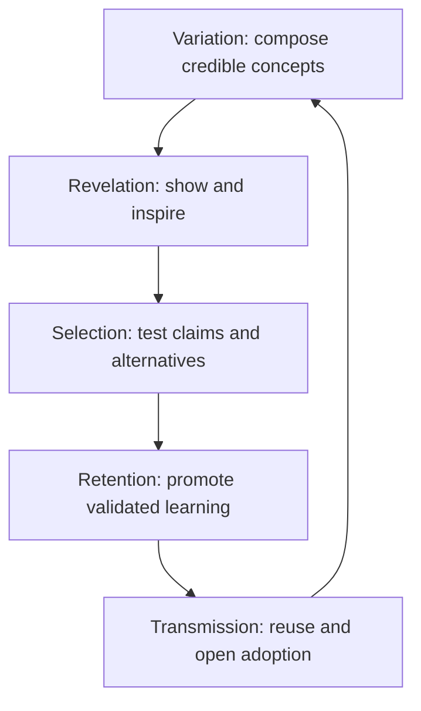
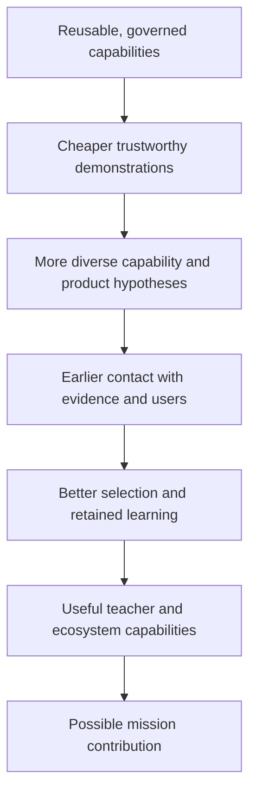
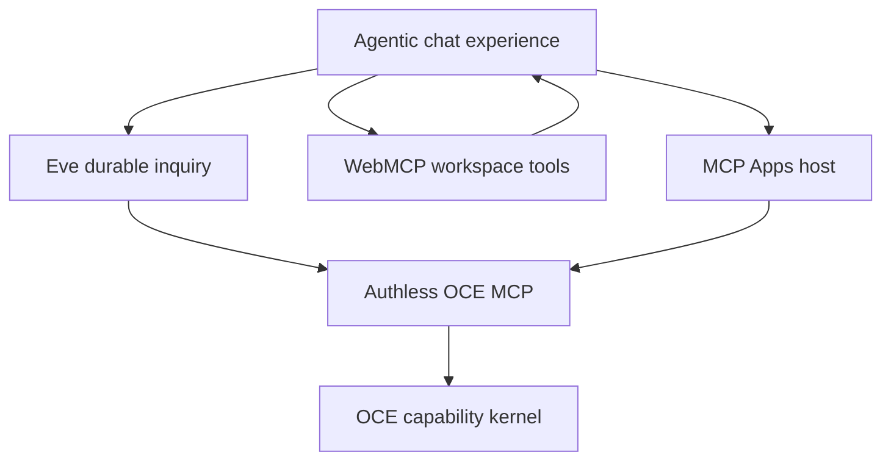

# Eve + MCP agentic chat experience — one peer demo in the open-ended Oak Innovation Kit portfolio

<!-- markdownlint-disable MD013 MD060 -->

- **Date:** 2026-08-30
- **Status:** Value exploration and technical investigation complete; implementation not started
- **Decision class:** Bounded experiment recommendation, not a product or strategy ratification
- **Strategic relationship:** Research input to the owner-declared Oak Innovation Kit fourth value stream and first-class strategic node (2026-08-30); strategy authority remains in `docs/strategy/`
- **Evidence pin:** OCE `engraph` commit [`6f0aecf5d9326658409ee8e199e9dfc2af0f9951`](https://github.com/EngraphCode/oak-open-curriculum-ecosystem/commit/6f0aecf5d9326658409ee8e199e9dfc2af0f9951), [`eve@0.47.3`](https://github.com/vercel/eve/blob/3012ae0429edc19373cd9dd4a05ca3baf9dddeaf/packages/eve/package.json), [`@modelcontextprotocol/ext-apps@1.7.5`](https://github.com/modelcontextprotocol/ext-apps/blob/92f46a574568a3ddac7600343b7d3c4c4ed7b588/package.json)
- **Supersedes:** `oce-eve-in-app-mcp-chat-demo-investigation-2026-08-29.md`

## Executive conclusion

The proposed agentic chat experience is buildable. That is no longer the important uncertainty.

The stronger purpose of this demo is to contribute one bounded piece of evidence to the stream-level question of whether Oak is becoming a **value-preserving, recomposable public capability system**:

> Can trusted public curriculum capabilities move rapidly between products, hosts and agentic experiences while preserving provenance, openness and teacher decision authority; carrying accessibility requirements and tested primitives into each composition; and keeping providers substitutable at explicitly tested seams?

This report concerns one member of a wider, open-ended portfolio of currently identified demonstrations:

1. **Curriculum Studio** as one distinct demo;
2. **a full semantic-search showcase**;
3. **a design-system showcase**;
4. **a visual, interactive graph exploration** likely combining some subset of prerequisites, sequencing, misconceptions, learning outcomes, conceptual and wrong-turn trajectories, non-linear time, knowledge transfer through curriculum and options such as dynamic 2D, animation, linked views, 2.5D, 3D or immersive form; and
5. **the Eve + MCP agentic chat experience** examined here.

The portfolio is open-ended, with further demos expected as new capabilities and concepts emerge. Its independently scoped, implemented demos become repeated consumers where they actually reuse shared capability. They should remain deliberately heterogeneous: some exhibit a capability fully, some test a novel representation, some integrate several systems, and some instantiate a possible product. Some are intentionally showpieces: they exist to make latent capability visible, inspire and impress, expand what people understand the data and tools can do, and provoke possibilities that would not emerge from documentation or abstract explanation.

This report keeps five related objects distinct:

1. **The Innovation Kit value stream — the governing flow:** the owner-declared fourth stream and its `KIT-*` choices turn capability and ideas into working experiences, evidence and learning.
2. **The `innovation-kit` strategic node — one proposed outcome:** this born-sketch plan node currently proposes a `KIT-2` parent edge; it neither contains the whole stream nor governs work until owner-ratified.
3. **The Kit — the shared substrate touched by this demo:** the specific OCE capabilities, Oak Design System primitives, composition and assurance mechanisms, agent infrastructure and delivery practices the chat reuses or exposes.
4. **The demo portfolio — repeated consumers and probes:** independently scoped, implemented demos test distinct regions of possibility and challenge candidate commonality.
5. **The proposed evidence ledger — comparative institutional memory:** a versioned record of vertical, horizontal and longitudinal evidence that does not treat planned work as proof.

The strategic hypothesis across those objects is public capability that travels: Oak knowledge remains recognisable and inspectable inside AI environments Oak does not control; an inspectable challenge can be handed to the legitimate source authority; tested provider seams remain substitutable; and teacher decision authority is encoded explicitly. Whether the authority adjudicates and propagates a correction is a separate institutional claim unless a real correction service is exercised. Evidence that professionals understand and exercise the encoded authority boundaries requires a professional probe.

At its deepest defensible level, this is an experiment in how a public institution can remain an active, accountable shaper of AI-mediated work. Two risks motivate it: public knowledge can remain confined to destinations users must deliberately visit, or lose attribution and governing context when mediated by third-party models and hosts. OCE suggests another settlement: open, governed capability; bounded machine reasoning; legible evidence; plural hosts; and legitimate human judgement.

The recommended action is therefore **not** “commit to a new Oak product” or “prove every protocol in one feature parade.” It is:

> Build the agentic chat experience as one bounded, instrumented member of the demo portfolio, using the dual-plane composition as its leading architecture hypothesis. Judge it by whether it demonstrates Eve-specific value, preserves authority and provenance across surfaces, exposes reusable capability gaps and contributes learning and primitives to the wider portfolio.

The chat demo does not need to manufacture a second concept: the identified portfolio already supplies intended concept diversity, and implemented siblings will supply comparative evidence. Its obligation is to declare its own purpose and evidence class, record what it reuses and adds, and return candidate learning to the shared substrate. Innovation Kit evidence accumulates across successive heterogeneous implementations; no one demo proves it. Evidence from a selected professional audience is required before making either teacher-agency or product-value claims, not before building a capability showcase. A cold internal consumer can test the public boundary; an external consumer is required before claiming ecosystem usability. The portfolio cannot establish pupil impact without separate adoption and longitudinal evidence.

## 1. Metacognitive reset

The first investigation asked whether an Eve in-app agent could call OCE through MCP, render rich UI and use WebMCP. The answer is yes. OAuth is optional for this owned demo instance; Eve is extensible; OCE already exposes canonical tool definitions and an authless path; MCP Apps have a reference host; and WebMCP explicitly supports a site-authored page agent.

The previous revision then made a different category error. It treated Curriculum Studio and the agentic chat experience as one specimen and required that project to create a divergent second concept. The actual shape is an ongoing portfolio of independently scoped demos. Curriculum Studio is one demo; this chat experience is another. Search, design-system and graph showcases are others. The unit for testing repeated recomposition is the implemented portfolio, while the unit for implementation scope and evidence is each individual demo.

Recursing on “why” changed both the unit of value and the recommendation:

| Pass           | Question                                           | Answer                                                                                                                                                                  | Consequence                                                                                                            |
| -------------- | -------------------------------------------------- | ----------------------------------------------------------------------------------------------------------------------------------------------------------------------- | ---------------------------------------------------------------------------------------------------------------------- |
| Feasibility    | Can the parts be assembled?                        | Yes, at several effort levels.                                                                                                                                          | Architecture is no longer the success gate.                                                                            |
| Demonstration  | What should this artefact visibly show?            | Bounded reuse of shared OCE and Oak Design System primitives, plus Eve’s distinctive behaviours.                                                                        | A generic chat page is insufficient.                                                                                   |
| Imagination    | What should become newly thinkable?                | The experience should reveal latent possibilities, inspire ideas, impress through genuine capability and expand understanding of the data and tools.                    | Communicative and aesthetic power are part of the intended value.                                                      |
| Experience     | What situated value might this composition create? | A professional can investigate and adapt curriculum while evidence, alternatives and authority remain visible.                                                          | The artefact, not conversation, becomes the centre; product value remains optional evidence, not the only purpose.     |
| Portfolio      | What do implemented demos collectively test?       | Curriculum Studio and the semantic-search, design-system, exploratory graph, chat and later demos are intended to exercise different regions of the capability space.   | Preserve conceptual diversity and compare actual reuse across demos.                                                   |
| Organisational | What durable capability should remain?             | A repeatable way to turn ideas into credible evidence and retain learning in shared capabilities.                                                                       | Measure the portfolio’s changing marginal cost and decision yield, not one contrived pair.                             |
| Ecosystem      | What must travel?                                  | Capability identity, provenance and policy—not one owned application or vendor-specific implementation.                                                                 | Include multiple probe arms and a clean external route.                                                                |
| Institutional  | Whose agency changes?                              | Teachers, Oak and external builders should gain options without the agent or host absorbing their authority.                                                            | Make allocation of authority explicit and testable.                                                                    |
| Public value   | Why does this matter in an AI-mediated world?      | Public knowledge should remain active, attributable and contestable, with challenges able to reach legitimate authority rather than merely being published or ingested. | Treat the demo as a public-capability prototype; effective remedy and correction remain separate institutional claims. |
| Mission        | Why does Oak ultimately care?                      | Better, more adaptable support may contribute to teacher and pupil outcomes.                                                                                            | This is a distant bridge requiring separate evidence, not a demo claim.                                                |

The earlier conclusion—“proceed with the dual-plane Curriculum Studio”—was wrong in identity as well as too close to a product commitment. The dual-plane composition belongs to the agentic chat demo. Curriculum Studio remains a separate portfolio member with its own purpose, evidence and architecture.

## 2. The recursive value thesis

Recursing on purpose does not produce one maturity ladder. It exposes four related but
independently gated paths. Shared technical integrity is a prerequisite where relevant, but a
demonstration may create legitimate revelation value without becoming a product, and
institutional stewardship does not have to wait for a teacher-facing product-boundary change.

1. **Revelation:** real capability → accurate legibility of its mechanism and limits → new
   questions and ambition → possible collaborations and uses. Excellent representation is part
   of the inquiry: search, chat, design composition, and visual or temporal graph exploration
   can reveal different properties of the same underlying capability rather than merely restyle
   one answer.
2. **Institutional learning:** reusable quality and assurance → deliberately plural experiments →
   earlier decision-relevant evidence → explicit dispositions and retained negative findings →
   greater institutional option value. Working experiences become boundary objects through
   which curriculum, design, product, engineering, strategy, professionals, and partners can
   expose assumptions without first sharing one abstract model.
3. **Public capability and stewardship:** portable contracts, provenance, and explicit authority
   boundaries → independent use across tested hosts → contestability, export, and provider exit →
   authorised correction and stewardship only where separately implemented and exercised. The
   chat demo can demonstrate challenge hand-off; it cannot establish effective remedy by itself.
4. **Mission contribution:** useful adopted capability → changed professional practice and
   distribution → possible teacher and pupil outcomes. Every beneficiary, adoption, causal, and
   distributional bridge requires separate evidence.

Across those paths, the deepest candidate capability is **responsible, runnable imagination**:
making possible futures concrete enough to inspect, challenge, compare, and improve while they
are still cheap to change. This widens participation in shaping those futures beyond people who
can already compose the technical parts and gives a public institution evidence with which to
shape emerging interaction paradigms rather than merely inherit vendor defaults. It is a theory
to test, not a claim that the Kit already performs that role.

The deepest concise formulation is:

> We are testing whether trusted public knowledge can remain recognisable, contestable, adaptable and human-governed when it becomes active inside agentic systems we do not control, with challenge handed to the legitimate source authority. Actual reparability requires an authorised adjudication and derivative-correction path that this demo does not establish.

This is not a claim that Oak should become more authoritative. The public-interest purpose is to make rigorous public knowledge more available while preserving plurality, professional choice and the legitimate option to choose something other than Oak.

## 3. Separate the governing flow, outcome node, shared Kit, demo portfolio and evidence ledger

The owner declaration creates two strategy structures, not one. The **Innovation Kit value
stream** governs the end-to-end flow through `KIT-1`–`KIT-4`; the **`innovation-kit` strategic
node** is a separate born-sketch outcome node that currently proposes `KIT-2` as its one parent
choice. The **Kit substrate**, **demo portfolio**, and **proposed evidence ledger** are operating
objects beneath that strategy. Here, “strategy portfolio” means the four value streams, while
“demo portfolio” means only the open-ended set of experiences inside this stream.

The repository already contains important antecedents. Historical Curriculum Hub plans provide evidence for the reuse discipline; this report does not assume that Curriculum Hub and the user-defined Curriculum Studio are the same demo. Those plans separate three co-equal programme workstreams, not the repository’s now-four value streams:

- a user-facing experience for testing;
- a reusable agent-assisted design-to-code ingestion pipeline; and
- rapid user-facing web-app capability.

One specimen is not enough to prove portability or commonality, but consumer count is not a prerequisite for deliberate Kit ownership. The current [research charter](./web-app-deconstruction/docs/research-charter.md) makes the stronger distinction: a framework boundary may be justified when it must preserve meaning and reference where semantic authority lives, or when invariants, isolation, lifecycle or assurance require deliberate ownership. The authority itself remains with its legitimate source. Unlike implemented consumers then test the reach of the portability and commonality claims. The next UI should cost a fraction of the first without making a second consumer the source of architectural truth.

The user’s current portfolio definition identifies those intended consumers. They are peers, not features of one umbrella demo; only implemented demos contribute execution evidence:

| Currently identified demo                     | Current status in this report                          | Distinct region of possibility                                                                              | Evidence it may contribute once exercised                                                                                    |
| --------------------------------------------- | ------------------------------------------------------ | ----------------------------------------------------------------------------------------------------------- | ---------------------------------------------------------------------------------------------------------------------------- |
| Curriculum Studio                             | Identified; implementation status not established here | A coherent, integrated curriculum experience                                                                | End-to-end domain application and capability composition                                                                     |
| Semantic-search showcase                      | Identified; implementation status not established here | The full depth of discovery by meaning and intent, including relevance, ranking, filtering and explanation  | Search quality, breadth, behaviour, limits and user legibility                                                               |
| Design-system showcase                        | Identified; implementation status not established here | Oak’s visual and interaction language as reusable infrastructure and an experience in its own right         | Component range, states, composition, responsiveness, component-level accessibility and accessibility of the showcase itself |
| Exploratory visual/interactive graph showcase | Identified and explicitly exploratory                  | Open-ended investigation of how selected curriculum relations might become intelligible through interaction | Intelligibility, interaction and representational limits for the relation set actually tested                                |
| Agentic chat experience                       | Investigated; implementation not started               | Durable multi-turn composition of OCE capabilities                                                          | Tool orchestration, refinement, synthesis, provenance, MCP/MCP Apps/WebMCP integration and Eve’s temporal behaviours         |

The portfolio remains open to future demonstrations. They add intent when identified and evidence only when exercised.

Terminology matters: the **Oak Design System** is shared design substrate; the **design-system showcase** is the peer demo that tests its breadth and presents it compellingly; the **Kit** is the broader composition, assurance, design, delivery, and experimentation substrate. A Kit-placement decision must preserve and reference the legitimate semantic authority; it does not transfer curriculum meaning, design-system semantics, or Practice doctrine into the Kit.

### Showing what is possible is a first-class outcome

Some demonstrations should intentionally optimise for revelation, inspiration and impact. Data structures, APIs and tool definitions are difficult to understand in the abstract; an excellent interactive experience can let people _feel_ the shape and reach of the capability. Being impressive can earn the attention needed for deeper understanding, generate new questions, attract collaborators and raise the ambition of subsequent work.

This is neither an apology for polish nor a disguised product experiment. A possibility showcase can succeed when it:

- makes a real but previously invisible capability legible;
- gives people an accurate, memorable mental model of what the data and tools enable;
- provokes diverse follow-on ideas rather than only the implementation already shown;
- demonstrates an excellence bar worthy of the underlying public asset; and
- invites exploration, composition and participation.

Audience excitement, recall, generated ideas, requests to explore or integrate, and changed understanding are proportionate signals for that purpose. They are not evidence of task utility, adoption or pupil impact. **Showmanship becomes evidence theatre only when the capability is fake or excitement is promoted into a claim it cannot support.**

The graph experience is intentionally still exploratory. Representational options such as dynamic 2D, animation, linked views, 2.5D, 3D and immersive form, alongside a school-career trajectory, wrong turns and non-linear time, are candidate directions—not landed functionality or claims that the system possesses a faithful model of an individual learner. The [dedicated graph-experience landscape](dynamic-interactive-graph-experience-landscape-2026-08-30.md) frames that possibility space and its evidence boundaries. Prerequisite, sequence, misconception, outcome, temporal and transfer relations may carry different semantics and must not be collapsed merely because they can be drawn in one space. The semantic-search showcase is likewise distinct from lexical/IDF graph traversal or agent-mediated lookup. Dedicated search and graph showcases test depth and edge cases; using search or graph tools inside chat supplies integration evidence, not a substitute for those showcases.

Keep the five objects separate in every claim:

1. **Value stream:** the governing flow and `KIT-*` choices.
2. **`innovation-kit` node:** one sketch `KIT-2` outcome, not the stream container.
3. **Kit substrate:** deliberately owned cross-demo composition and assurance capability.
4. **Demo portfolio:** independent instruments that stress different regions of the substrate and possibility space.
5. **Proposed evidence ledger:** what each demo actually demonstrates, contradicts or leaves unresolved, and how the finding is dispositioned.

Portfolio evidence accumulates in three ways:

- **Vertical:** each demo succeeds or fails against its own purpose, evidence class and measures.
- **Horizontal:** canonical capabilities retain meaning, provenance and policy across unlike demos without bespoke forks.
- **Longitudinal:** later demos become easier to create and change without weakening earlier consumers or collapsing into one template.

Embedded reuse must not be double-counted. If Curriculum Studio and chat both use semantic search, that is evidence of reuse and ecological applicability; it is not two independent validations of search relevance. Planned demos contribute intent, not demonstrated evidence. Do not compress demo position into one maturity state. A proposed register should track orthogonally:

- **lifecycle disposition:** identified, active, paused, retired;
- **technical state:** concept, working, deployed;
- **evidence and claim disposition:** untested, supported, contradicted, inconclusive;
  advance, confirm, narrow, reshape, stop, retire, defer, or preserve as unresolved; and
- **reuse and promotion state:** local, candidate, deliberately Kit-owned, exercised by an unlike consumer, rejected, or superseded.

A demo may be exploratory and deployed, or user-evaluated and retired. These axes describe
different facts and must not be presented as one delivery or maturity ladder.

The evidence ledger is proposed machinery, not a capability already implemented by this report.
Its minimum versioned, supersedable entry should link to primary evidence and name the demo and
tested configuration; proposition and evidence class; intended audience or beneficiary; source
versions; comparator and method; threshold and falsifier; positive, negative, or ambiguous
result; claim boundary; decision owner and disposition; return target and owning layer; and next
test or revalidation trigger. A record that no named reader uses to change understanding,
disposition, retirement, or reuse is ceremony rather than retained learning.

This proposal can make that operating model explicit as a variation–selection–retention loop:

- **Variation:** OCE capabilities, selected Oak Design System primitives and the agent runtime are hypothesised to make genuinely different concepts affordable.
- **Revelation:** showpieces make latent capability visible and expand the ideas, questions and collaborations available to the next cycle.
- **Selection:** capability evaluations, experience research where relevant, comparators and falsifiers determine what survives.
- **Retention:** findings return first to their legitimate owner—curriculum semantics and reusable tool contracts to the engineering-tools stream, general delivery Practice to the agentic-framework stream, design primitives to the Oak Design System, concept-specific machinery to the demo, and only deliberately owned composition and assurance capability to the Kit. Product-specific code remains local.
- **Transmission:** examples, conformance fixtures and open contracts let later Oak teams and external builders begin from accumulated learning.

The failure modes are equally important:

- variation without selection creates a demo zoo;
- selection without variation optimises only familiar products;
- retention without real cross-demo consumers creates platform bureaucracy;
- demo-local learning does not compound;
- a portfolio that remembers only successes selects for theatre;
- faster scaffolding without clearer capability or experience evidence does not improve discovery.

The candidate durable organisational value is therefore not app throughput. It is **Oak’s capacity to discover, test, retain and distribute new forms of public value faster than its environment changes, without sacrificing rigour, professional agency or institutional independence**.

## 4. Theory of change and proof limits

This is not only a product-validation funnel. A second path runs directly from **showcase → expanded understanding → new questions and ambition → new concepts, collaborations and uses**. That path can create value before a product hypothesis exists.

Every arrow is conditional:

- Reusable capabilities lower cost only if their contracts compose cleanly, requirements and tested primitives carry forward, and the composed experience re-establishes its quality floor.
- Cheaper demos improve learning only when each declares whether it is exhibiting capability, exploring a representation, testing integration or resolving a product uncertainty.
- More evidence improves decisions only if negative results can stop or reshape work.
- Shared infrastructure compounds only when later consumers actually reuse it.
- Open code creates ecosystem value only when independent builders can obtain useful results without privileged knowledge.
- Agent capability creates teacher value only when it supports rather than obscures professional judgement.
- Teacher value contributes to pupil outcomes only through adoption, changed practice and distributional effects that this demo cannot establish.

The report should use the following claim ladder:

| Evidence level                                                 | What may legitimately be claimed                                                                                                                                       |
| -------------------------------------------------------------- | ---------------------------------------------------------------------------------------------------------------------------------------------------------------------- |
| Claimable only after the agentic-chat specimen demonstrates it | Real protocol execution, schema consistency, cross-surface composition, provenance retention, per-host accessibility verification and Eve’s visible temporal mechanics |
| Claimable only after an optional experience probe              | Selected-audience comprehension, perceived control, task usefulness, errors and interaction burden for the tested scenario                                             |
| Claimable only after horizontal portfolio evidence             | Conceptual range, semantic consistency and actual reuse across unlike implemented demo consumers                                                                       |
| Claimable only after longitudinal portfolio evidence           | Reduced concept-to-evidence cost, disciplined learning retention and lower marginal effort without template capture                                                    |
| Claimable only after an independent consumer                   | Public-boundary completeness and substitutability at the tested seams; external usability requires an external consumer                                                |
| Claimable only after institutional correction proof            | Safe challenge intake, legitimate adjudication, review or appeal, correction propagation across declared derivatives, visible status and measured challenger burden    |
| Claimable only after adoption and longitudinal research        | Changes in teacher practice, reach, pupil outcomes and disadvantage                                                                                                    |

A sophisticated implementation cannot use its own sophistication as proof of public value.

## 5. Protected frames and counterframes

The work is easier to reason about when several serious frames remain protected rather than being collapsed into one success story.

| Frame                         | Unit of value                          | Evidence required                                                                             | Characteristic blind spot                                      |
| ----------------------------- | -------------------------------------- | --------------------------------------------------------------------------------------------- | -------------------------------------------------------------- |
| Integration proof             | Adapter and application                | Real discovery, execution, lifecycle and conformance evidence                                 | May prove plumbing while solving no valuable job               |
| Possibility showcase          | Audience understanding and imagination | Genuine capability made legible, memorable and generative of new ideas                        | Excitement may be mistaken for product evidence                |
| Professional experience probe | Journey and working artefact           | Task outcome, comprehension, agency, correction and appropriate trust                         | May hide bespoke platform effort                               |
| Portfolio falsifier suite     | Heterogeneous demos                    | Range, coherent semantics, non-forced reuse and distinct losing conditions                    | May become a technology gallery with no disciplined evidence   |
| Innovation Kit experiment     | Repeated demo production               | Lower marginal effort, standards by construction and learning returned to shared capabilities | May optimise prototype throughput rather than decisions        |
| Eve experiment                | Durable human–agent inquiry            | Observable benefit from interruption, waiting, steering, recovery, branching and resumption   | May turn framework mechanics into theatre                      |
| Ecosystem substrate           | Capability plus independent consumers  | Cold integration, portability, attribution, tested-seam substitutability and stewardship      | Open publication may be mistaken for adoption                  |
| Public-interest architecture  | Distribution of authority              | Choice, export, provenance, reversibility and no privileged provider                          | Protocol neutrality may be mistaken for practical independence |
| Mission experiment            | Teachers and pupils over time          | Real adoption, distributional research and outcomes                                           | Long causal distance from the demo                             |

The main adversarial counterframes are load-bearing:

- **Architecture marking its own homework:** multiple OCE capabilities and streams converging is not itself evidence that the resulting experience is useful.
- **Demo theatre:** a capability showcase is legitimate, but visual polish and a curated golden path must not be represented as product-value evidence.
- **Protocol spectacle:** MCP, MCP Apps and WebMCP can displace the human task rather than improve it.
- **Destination drift:** any owned demo, including Curriculum Studio or chat, could quietly become a product strategy without the relevant decision and evidence.
- **Agency theatre:** final approval can leave the agent framing every consequential choice.
- **Brand authority laundering:** Oak styling can make model inference appear institutionally endorsed.
- **Vendor capture by convenience:** a Vercel-, Eve- or Chrome-rich exemplar can remain practically coupled even when contracts are nominally open.
- **Premature platformisation:** one golden path can generate abstractions that explain only themselves.
- **Mission inflation:** developer speed or internal activation cannot establish pupil benefit.

These counterframes do not argue against building. They define what the build must reveal and when its claims must be narrowed.

## 6. Free-play harvest and deliberate discards

The free-play pass was used to widen the concept before selecting it. The following associations survived concept exploration:

| Association                  | Retained meaning                                                                                                                                      |
| ---------------------------- | ----------------------------------------------------------------------------------------------------------------------------------------------------- |
| Scientific instrument        | The demo makes latent capability, boundaries and product behaviour observable.                                                                        |
| Boundary object              | Curriculum, product, design, engineering, leadership and partners can interrogate the same running proposition without first sharing one model of it. |
| Evolutionary system          | The Kit enables variation; evidence selects; shared infrastructure retains; open contracts transmit.                                                  |
| Language and grammar         | Tools, schemas, design patterns and agent primitives form a vocabulary from which new experiences can be expressed without predetermining them.       |
| Rehearsal                    | The specimen rehearses future roles and authority boundaries before they harden into production defaults.                                             |
| Real option                  | A bounded experiment buys information before Oak commits to a product, provider or interaction model.                                                 |
| Runnable counterfactual      | A demo makes one possible future concrete enough to inspect, challenge and improve while it is still cheap to change.                                 |
| Institutional imagination    | Excellent experiences widen who can perceive and shape the option space beyond people who can already compose APIs, data and tools mentally.          |
| Phase-space probe            | Direct SDK, MCP, Eve, MCP Apps, WebMCP and the owned page should test different invariants rather than act as checkbox integrations.                  |
| Continuity without captivity | Useful work should survive interruption and model/runtime replacement without being trapped in one transcript or host.                                |

The following fluent associations were discarded because they distorted the task or outran the evidence:

- **“Lego for products”** hides incompatible seams, assurance work and the importance of selection.
- **“App factory”** overweights throughput and predetermined production rather than resolved uncertainty.
- **“Universal curriculum operating system”** is grandiose and encourages centralisation.
- **“Capability marketplace”** imports a commercial network-growth model and assumes adoption.
- **“AI constitution”** is too abstract for the current evidence; governance should be expressed as concrete interaction and data boundaries.
- **“Democratising education”** skips every beneficiary and distributional bridge.
- **“Digital twin of teaching”** misrepresents professional work and invites inappropriate inference.
- **“One interface replaces products”** contradicts plurality and the strategy of capability across hosts.
- **“Museum of future products”** makes the audience passive and the artefacts final; the distinctive value here is interaction, challenge, recomposition and return learning.

The retained phrase **responsible imagination** is useful: the Kit should make ambitious educational possibilities cheaper to instantiate while preserving a floor of evidence, accessibility requirements and verification, provenance and human authority.

## 7. The demo in this report: agentic chat experience

### Purpose and identity

This report’s specimen is the **Eve + MCP agentic chat experience**, not Curriculum Studio. It should have two explicitly separated views:

1. **Agentic chat experience:** a coherent conversation around a visible, evolving curriculum artefact. Teacher-relevant provenance, inference status, caveats and unknowns remain visible here; technology labels do not dominate it.
2. **Under the hood:** capability lineage, protocol traffic, raw tool inputs and results, Eve events, MCP/App/WebMCP projections, source versions, reused design components and adapter parity. This lets observers verify that the experience is not mocked magic without turning runtime diagnostics into the professional interface.

Its primary role may legitimately be a capability showcase and reference composition. The hero inquiry makes that showcase coherent rather than turning it into a tool gallery. If Oak also wants to claim professional usefulness, the same artefact can become an experience probe with the relevant audience and comparative evidence. It is not an automatically authorised destination product, and it does not subsume Curriculum Studio or the dedicated search, design or graph showcases.

### Hero inquiry: continue the progression

The repository already contains dormant guidance for this job in `continue-progression.ts`. This is one technically discriminating chat-orchestration scenario. It embeds bounded search and graph calls to test refinement, evidence handling and Eve’s temporal behaviour; it does not evaluate the full semantic-search or exploratory graph-showcase propositions.

1. The teacher says, “My Year 9 class has just covered photosynthesis. What should come next in Oak’s sequence, and what should I check first?”
2. OCE search resolves the actual candidates returned by the pinned live index rather than silently choosing a slug. The fixture and any ambiguity must be verified before the experiment; alternatives must not be manufactured to demonstrate Eve.
3. Eve pauses and asks the teacher to select or amend the intended anchor.
4. Progression, prior-knowledge and misconception tools run as bounded investigations.
5. The workspace shows evidence-linked continuation options, trade-offs and unknowns. “Next” means a following candidate within a named, versioned Oak ordering—not an independent pedagogical recommendation. The relationship basis and genuine alternatives remain visible; applicability belongs to the teacher.
6. The teacher corrects local context, changes a constraint, inspects sources and steers or cancels live work.
7. Where the evidence supports materially different options, branches remain visible. The teacher may edit, combine, create another, choose neither or defer, then record any decision and rationale. The system must not fabricate alternatives to demonstrate branching.
8. The page reloads or the process restarts; settled work remains and the inquiry resumes without duplicated calls.
9. The result exports as a source-linked, application-owned artefact independent of the transcript and runtime.

The workflow should initially be described as a **capability-provoking scenario and optional product hypothesis**, not a validated teacher need. Independent research must establish the actual job, audience and current baseline before teacher-value claims are made; that research is not a prerequisite for the declared capability-showcase evidence.

### A possible future peer inquiry, outside this demo

A later, separately scoped portfolio member might examine a situated teaching loop. It is neither an extension of this chat demo nor a claim about Curriculum Studio:

`plan → teach → observe → reflect → adapt`

OCE supplies general curriculum structure; the teacher supplies local professional knowledge and later class-level, non-identifiable observations; Eve preserves the bounded inquiry across the real-world gap. This could develop curriculum understanding as well as complete a task. No pupil profiles or named pupil data belong in this experiment. Any later retention requires an explicit purpose, principal identity, access model, consent where applicable, retention period and deletion route. The stronger privacy, safeguarding and evidence questions place this opportunity after the authless first experiment, not inside it by default.

## 8. Teacher agency is a functional requirement

A curriculum decision joins several authorities that a fluent answer tends to collapse:

| Epistemic status           | Example                                                                                             | Proper authority                                                |
| -------------------------- | --------------------------------------------------------------------------------------------------- | --------------------------------------------------------------- |
| Oak-authored assertion     | Outcome, named misconception, prior-knowledge statement or declared ordering                        | Oak source                                                      |
| Deterministic projection   | A bounded subset or following item under a declared operation and ordering                          | Pinned source plus declared operation; no independent authority |
| Retrieval signal           | Candidate or rank under a named query and index version                                             | Evidence of possible relevance, not a curriculum fact           |
| External evidence          | Attributed evidence statement and caveats                                                           | The cited source                                                |
| Agent interpretation       | “This may be the relevant prerequisite because…”                                                    | Provisional analysis                                            |
| Agent option               | One continuation with trade-offs                                                                    | Proposal only                                                   |
| Teacher context            | “This class has already covered…”                                                                   | Teacher, scoped to this work                                    |
| Teacher decision           | Selected emphasis, sequence or adaptation                                                           | Teacher                                                         |
| Unknown or bounded absence | Missing material, unresolved anchor, unsupported claim, or no result in the queried surface/version | Explicitly unresolved; not proof that nothing exists            |

Teacher authority is not ceremonial. The system lacks much of the situated knowledge and does not bear responsibility for the pupils affected. OCE’s existing direction—deterministic data, agent reasoning, teacher decision—should therefore become observable interaction behaviour.

Genuine agency spans the inquiry:

1. **Initiation:** the teacher states the purpose in ordinary professional language.
2. **Context control:** they decide what local information to supply.
3. **Legibility:** consequential claims expose source, status, caveats and alternatives.
4. **Contestability:** the teacher can challenge an anchor, assumption, omission or proposal.
5. **Reversibility:** narrowing, selection and mutation can be undone or branched.
6. **Direction:** the teacher can compare, expand, stop, defer or redirect active work.
7. **Authorship:** the resulting pedagogical decision is theirs, not a final approval appended to an agent verdict.
8. **Portability:** the artefact can leave the agent and host.
9. **Memory control:** retained context is visible, scoped, amendable and resettable.

Operational initiative and decision authority are distinct. An agent may proactively retrieve, compare and synthesise without secretly turning its proposal into institutional truth.

A teacher may deliberately ask for the agent’s current best view. The agent should then offer a clearly labelled proposal with its basis, caveats and nearest genuine alternatives. Preserving authority must not become a refusal to provide useful judgement.

Accessibility is part of this agency. Table, list and narrative routes must complete every core chat task. If chat embeds a spatial view, it is optional, has a co-equal non-spatial route and supplies integration evidence only—not graph-showcase evidence. Interaction must be keyboard and screen-reader complete; no action may be drag-only, colour-only or pointer-only; provenance must use progressive disclosure rather than permanent overload. Reusable primitives and requirements can travel, but conformance belongs to each composed experience and host rendering and must be reverified.

## 9. What each component is really testing

| Component or arm                    | Immediate role                                                              | Deeper proposition                                                                                              | Losing condition                                                                                                             |
| ----------------------------------- | --------------------------------------------------------------------------- | --------------------------------------------------------------------------------------------------------------- | ---------------------------------------------------------------------------------------------------------------------------- |
| OCE capability kernel               | Typed facts, search, graph and tool contracts                               | Domain meaning and policy exist independently of any host                                                       | Adapters need copied schemas, private imports or hidden semantics                                                            |
| Shared Oak Design System primitives | Tested accessibility affordances, Oak-quality components and visual grammar | New ideas can inherit requirements and proven primitives without becoming visually identical                    | Each concept requires extensive bespoke primitives, host conformance is not reverified, or shared design forces one workflow |
| Eve                                 | Durable sessions, tools, questions, steering, cancellation and recovery     | Time, interruption and human latency can become first-class product states                                      | Conventional stateful orchestration produces the same experience with materially less complexity                             |
| MCP                                 | Open discovery and execution                                                | Capabilities can travel through a host-neutral transport                                                        | Meaning or provenance changes across the adapter                                                                             |
| MCP Apps                            | Server-associated interactive UI                                            | Interaction semantics, attribution, accessibility requirements and tested primitives can travel with capability | It renders only a static card, or host embedding degrades accessibility and interaction                                      |
| WebMCP                              | Explicit live-page tools and state                                          | Human and agent can act on the same workspace without DOM guesswork                                             | It merely duplicates backend calls and adds no page-bound capability                                                         |
| Owned page                          | Controlled reference composition                                            | The parts can form a coherent experience without privileged domain logic                                        | The page becomes the only complete path or an accidental destination strategy                                                |
| Direct SDK/raw MCP path             | Simple builder route                                                        | No external user must adopt Eve, Oak’s UI or one model                                                          | A cold builder cannot obtain a useful result without maintainers                                                             |

### Shared design-system primitives in this demo

The Oak Design System is not decorative reuse. It packages tested accessibility affordances, interaction patterns, visual language and production knowledge. At its best it partly makes institutional values executable: experiments can move quickly without deferring quality until after a concept has already gained momentum. It does not confer accessibility automatically; every composition and host must be tested in context.

This does not make chat the design-system showcase. That peer demo tests system breadth, states and range; chat tests only whether selected shared primitives compose successfully in this experience.

Its desired shape is a **quality floor with plural compositions**, not a product template. The strongest proof is not the number of components imported into chat. It is whether the search, graph, Studio, chat and future demos retain distinct interaction grammars while reusing tested primitives and requiring progressively less repeated assurance and plumbing.

### Eve as the temporal agency substrate

OCE makes curriculum capability callable. Eve can make the resulting inquiry **continuous, interruptible and governable through time**.

The valuable unit is not an answer but a durable, teacher-governed inquiry that can wait rather than guess, keep alternatives alive, survive interruption and preserve correction. Eve mechanics should map to visible value:

| Eve mechanism                    | Product meaning                                             | Required demonstration                                                                                   |
| -------------------------------- | ----------------------------------------------------------- | -------------------------------------------------------------------------------------------------------- |
| Durable sessions and checkpoints | Work survives disconnect, reload and process recovery       | Reload or restart mid-inquiry and resume without duplicated settled calls                                |
| Durable question                 | Missing judgement can remain missing                        | Park on genuine anchor ambiguity until the teacher responds                                              |
| Steering and cancellation        | The user can change or stop active work                     | Redirect an investigation and prove cancellation propagates                                              |
| Typed session state              | Continuity is explicit rather than hidden in prompt history | Preserve selected anchor, constraints, open questions and plan state                                     |
| Structured subagents             | Bounded epistemic partitioning                              | Retain only if progression, misconception or evidence review improves quality, latency or inspectability |
| Rich result plus `toModelOutput` | UI detail need not distort model context                    | Full evidence in the workspace; bounded model projection                                                 |
| Durable event stream             | Visible work can be reconstructed                           | Inspectable timeline of calls, decisions, cancellation and settled results                               |

Eve is an implementation of the temporal control plane, not the owner of domain meaning or the durable artefact. If the experience does not visibly need waiting, resumption, steering, cancellation or branching, Eve is ornamental and should not be a headline claim.

### State and authority must remain separate

| State stratum                      | Authority and lifetime                                                                 |
| ---------------------------------- | -------------------------------------------------------------------------------------- |
| Oak sources                        | Curriculum authority; versioned and attributable                                       |
| Deterministic OCE results          | Reproducible derived evidence over pinned sources; no independent curriculum authority |
| Eve conversation and session state | Temporary inquiry execution context                                                    |
| Teacher decision records           | Local authority over the situated artefact                                             |
| Workspace artefact and branches    | Application-owned, portable product state                                              |
| Eve events and telemetry           | Operational evidence, not curriculum truth                                             |

Cross-session personal memory is a later governed feature. An unauthenticated demo has no credible persistent principal scope, and teacher corrections, local observations or any pupil information must not silently become profile claims or curriculum authority.

## 10. Recommended technical composition

The strongest leading hypothesis remains a dual-plane composition:

| Layer                 | Responsibility                                                                        | Example capabilities                                                            |
| --------------------- | ------------------------------------------------------------------------------------- | ------------------------------------------------------------------------------- |
| OCE capability kernel | Canonical schemas, descriptions, annotations, UI metadata and deterministic execution | `listUniversalTools()`, `createUniversalToolExecutor()`                         |
| Demo MCP              | Actual MCP discovery, calls and resources with auth omitted for this instance         | `initialize`, `tools/list`, `tools/call`, `resources/read`                      |
| Eve                   | Durable model loop and inquiry orchestration                                          | sessions, streaming, steering, cancellation, questions, bounded subagents       |
| MCP Apps host         | Render OCE-associated interactive UI inside tool results                              | `AppBridge`, sandboxed iframe, tool input/result, app-originated calls          |
| WebMCP                | Live page state and actions                                                           | select anchor, focus node, pin evidence, compare options, add to branch         |
| Experience state      | Portable derived representation of the inquiry                                        | goals, anchors, constraints, branches, evidence references, decisions, unknowns |

Backend MCP and WebMCP are complementary:

- **OCE sources and the capability kernel own domain meaning:** sources contain authored assertions; the kernel produces bounded deterministic projections.
- **MCP transports discovery and remote execution:** search, fetch and graph calls reach those capabilities without MCP becoming an authority.
- **The chat application owns live state and actions:** WebMCP exposes selected page-bound capabilities such as focus, pin, branch and view changes to agents.

MCP, Eve, WebMCP, native renderers and MCP Apps must consume or adapt one canonical capability identity; none becomes a separate contract authority.

This architecture needs two controlled comparisons. A **capability/transport comparator** uses the direct SDK or raw MCP with native structured UI to test what MCP, MCP Apps and WebMCP earn. An **Eve comparator** keeps the same tools, task, workspace and result model but uses a conventional AI SDK or explicit application state machine to test Eve’s incremental durability, waiting, steering and recovery value. Every additional layer must earn either visible user value or an explicitly named interoperability learning.

## 11. The OCE seams already exist

### Canonical catalogue and executor

The SDK already centralises most adapter inputs:

- `packages/sdks/oak-curriculum-sdk/src/mcp/universal-tools/list-tools.ts`
- `packages/sdks/oak-curriculum-sdk/src/mcp/universal-tools/types.ts`
- `packages/sdks/oak-curriculum-sdk/src/mcp/universal-tools/definitions.ts`
- `packages/sdks/oak-curriculum-sdk/src/mcp/universal-tools/executor.ts`
- public exports in `packages/sdks/oak-curriculum-sdk/src/public/mcp-tools.ts`

`listUniversalTools(generatedToolRegistry)` supplies names, descriptions, Zod input shapes, annotations, security schemes and MCP Apps metadata. `createUniversalToolExecutor(deps)` validates and dispatches aggregated and generated tools into MCP results.

This is the beginning of a capability compiler. The same authority can drive:

- MCP server registration;
- Eve authored or dynamic tools;
- WebMCP descriptors;
- input forms and native renderers;
- MCP Apps routing;
- tool evaluations and adapter conformance fixtures.

### Authless MCP is an exercised mode

The HTTP app already contains unauthenticated route composition and `dev:observe:noauth`; `DANGEROUSLY_DISABLE_AUTH=true` is covered by integration and harness tests. The demo can run the existing local path or expose a purpose-built, read-only demo entry point that simply does not compose production auth.

OCE’s registration proofs also connect the official MCP `Client` and `McpServer` through `InMemoryTransport.createLinkedPair()`. A co-located demo can preserve literal MCP initialisation, discovery, calls, resources and metadata without a separate network or OAuth boundary.

### MCP Apps are substantially started

OCE already uses `registerAppTool`, `registerAppResource`, `text/html;profile=mcp-app`, `_meta.ui.resourceUri` and a React widget built on `@modelcontextprotocol/ext-apps`. Its runtime state handles full and partial tool input, results, host context, theme, cancellation and teardown.

The dormant `user-search` / `user-search-query` pair also expresses the important model-visible plus app-only pattern. The official ext-apps package supplies the remaining host recipe through `AppBridge`, sandboxing and a basic host reference implementation. The gap is experience completion and host integration, not protocol feasibility.

## 12. Eve integration options

Eve’s stock MCP connector is a useful starting point, not the system boundary. Executed MCP results reach the frontend with structured content and metadata; automatic discovery currently narrows some raw UI metadata. Several successful shapes remain available:

| Shape                              | Mechanism                                                                                      | Effort | Best use                                        |
| ---------------------------------- | ---------------------------------------------------------------------------------------------- | -----: | ----------------------------------------------- |
| Stock Eve MCP plus native cards    | Eve calls authless MCP; React renders known OCE results                                        |    S–M | Fastest credible vertical slice                 |
| Generated Eve wrappers             | Generate Eve tools from the OCE catalogue and dispatch through MCP or the executor             |      M | Best model/UI payload control                   |
| Parallel app-aware MCP client      | Eve runs the inquiry; a small host client retains raw metadata, resources and widget lifecycle |    M–L | Fastest standards-faithful MCP Apps composition |
| In-process real MCP                | Official client/server over linked in-memory transport, adapted into Eve                       |    M–L | Literal MCP semantics without network/auth      |
| First-class Eve MCP Apps extension | Preserve discovery metadata/resources and add renderer hooks                                   |   L–XL | Reusable or upstreamable platform work          |
| Eve client-tool/WebMCP bridge      | Eve parks a call, the browser executes a live page tool, and the result resumes the turn       |   L–XL | Durable action across the browser boundary      |

The parallel app-aware client would be a pragmatic first implementation. If successfully exercised against the declared comparators, it would provide evidence for the intended technical composition without requiring an Eve framework change first.

## 13. WebMCP makes the page an explicit capability surface

The imperative WebMCP API provides `registerTool`, `getTools`, `executeTool` and `toolchange`. Google’s Page Agent demo already demonstrates a site-authored chat interface discovering and executing page tools.

An OCE MCP-to-WebMCP adapter can:

1. connect a browser MCP client to the authless demo endpoint;
2. call `tools/list` and select a bounded catalogue;
3. convert MCP schemas and relevant annotations into WebMCP descriptors;
4. forward execution to MCP `tools/call`;
5. retain MCP-only UI metadata for the Apps host; and
6. register page-local workspace tools alongside bridged backend tools.

The result is an actual MCP-backed page agent; OCE logic is not reimplemented in the browser.

WebMCP remains an evolving Community Group draft. Native browser-agent discovery cannot be polyfilled, but the in-page experience can use native `document.modelContext` when present and a same-origin compatibility registry otherwise. This keeps browser churn in an adapter rather than in the capability kernel.

Current references:

- [Chrome WebMCP overview](https://developer.chrome.com/docs/ai/webmcp)
- [Chrome imperative API](https://developer.chrome.com/docs/ai/webmcp/imperative-api)
- [Current WebMCP draft](https://webmachinelearning.github.io/webmcp/)
- [WebMCP and MCP comparison](https://developer.chrome.com/docs/ai/webmcp/compare-mcp)
- [GoogleChromeLabs Page Agent](https://github.com/GoogleChromeLabs/webmcp-tools/tree/main/demos/page-agent)
- [MCP Apps basic host](https://github.com/modelcontextprotocol/ext-apps/tree/main/examples/basic-host)

## 14. Agentic-chat delivery and portfolio evidence plan

### Stage 0 — register purpose, portfolio position and baselines

Before implementation, record:

- the demo’s identity as the **agentic chat experience**, separate from Curriculum Studio and the dedicated search, design-system and graph showcases;
- its orthogonal lifecycle disposition, technical state, evidence and claim disposition, and reuse or promotion state rather than one maturity label;
- its primary evidence classes—possibility showcase, technical capability showcase, reference composition and interoperability probe—and any optional professional-experience hypothesis;
- the audience it should inspire or inform, the capability that should become newly visible, and the kinds of follow-on ideas or questions the experience is meant to unlock;
- the exact hero scenario and which Eve, MCP, MCP Apps, WebMCP, OCE capabilities and selected Oak Design System primitives it exists to make visible;
- a chat-demo reuse manifest against the current Innovation Kit hypothesis, recording the specific capability catalogue/executor, adapters, design and interaction primitives, scaffold/ingestion path, assurance/evidence mechanisms, agent skills and delivery practices this demo claims, reuses, exercises or still builds locally;
- two technical comparators: direct SDK/raw MCP with native UI for the transport layers, and the same tools/workspace/result model on a conventional AI SDK or explicit state machine for Eve;
- the audience, current practice and research method only for any professional usefulness or product-value claim pursued;
- practical thresholds for protocol reality, semantic parity, Eve-specific behaviour, communicative/aesthetic coherence, first-pass accessibility/fidelity/repository conformance, hypothesis-versus-plumbing effort and portfolio learning returned;
- stop, narrow, iterate and advance-to-next-evidence-stage conditions; and
- what this chat demo cannot establish about semantic-search depth, visual graph exploration, Curriculum Studio, design-system range, ecosystem adoption or mission impact.

**Acceptance:** every in-scope claim has a collection method, threshold and losing condition; the proposed demo register records the orthogonal states above and does not treat planned sibling demos as completed evidence.

### Stage 1 — genuine protocol slice

- Add a dedicated first-class demo workspace for the agentic chat experience; do not place it under Curriculum Studio.
- Start the authless read-only OCE MCP instance or co-located in-memory MCP.
- Use a small allowlist: `search`, `fetch`, `get-thread-progressions`, `get-prior-knowledge-graph`, `get-misconception-graph`.
- Render tool receipts with source links and epistemic status.
- Verify the anchor and any real ambiguity against the pinned index; prove one genuine question where judgement is actually missing, plus cancellation and reload/resume.
- Record adapter code, copied semantics, elapsed time and first-pass quality.

**Acceptance:** a prompt causes observable real MCP discovery/call traffic and produces a source-linked result after any necessary human disambiguation.

### Stage 2 — coherent chat experience and controlled baselines

- Build the application-owned workspace and evidence inspector around the conversation.
- Implement the progression scenario and branchable decision artefact.
- Build the capability/transport comparator with direct SDK or raw MCP and native structured UI.
- Build the Eve comparator with the same tools, task, workspace and result model on a conventional AI SDK or explicit state machine.
- Compare functional parity, implementation surface, latency, cost and whether every authority state is programmatically and accessibly exposed.
- Keep the “Under the hood” view separate from the coherent chat experience.

**Acceptance:** every authority state is exposed in the interface and accessibility tree; the artefact can be altered through conversation and direct interaction, reloaded and exported independently of Eve.

### Stage 3 — full agentic-chat capability showcase

- Register genuinely page-local actions through WebMCP and add at least one bridged OCE backend capability.
- Host one OCE MCP App whose interaction is richer than a static result card, then reverify its accessibility in the host.
- Verify direct SDK/raw MCP consumption without Eve.
- Exercise provider or model substitution at the capability boundary.
- Run the same capability—and the MCP App if cross-host UI portability is claimed—in a second real compatible or reference host. Otherwise narrow the conclusion to substitutability at the tested seams.
- Exercise every core task through co-equal table, list and narrative views, with manual keyboard and screen-reader testing, zoom/reflow, mobile/touch, visible focus, reduced motion and accessible streaming/error announcements.

**Acceptance:** each arm demonstrates its named technical or interaction proposition; any arm that does neither is removed or confined to the “Under the hood” view.

### Stage 4 — optional audience and professional experience probes

For the declared inspiration purpose, proportionately observe whether intended audiences can accurately describe capabilities they had not understood before, what new questions or ideas the experience generates, and whether the impressive surface remains connected to the real mechanism.

Keep the possibility chain explicit and non-promotable:

- **reception:** attention, affect, or memorable encounter;
- **comprehension:** accurate explanation of the real capability, mechanism, limits, and unstated gaps;
- **generativity:** materially new questions, concepts, or uses rather than restyling the shown demo;
- **activation:** a mutually agreed next action with a named counterpart and owner; and
- **consequence:** completed collaboration or use, or an evidence-linked disposition by a legitimate decision owner.

A possibility showcase can succeed at comprehension or generativity. It need not manufacture a
collaboration or product decision, but evidence at one state cannot be promoted into the next. A
request or introduction remains intent, not collaboration evidence. If the claim is that the
interactive demo communicates better than documentation or a static example, use a proportionate
baseline and immediate teach-back; add delayed recall only when that stronger claim matters.

For professional-usefulness or product claims, additionally:

- observe representatives of one selected audience on the hero task, current-practice comparator and credible adverse cases;
- test whether disagreement, correction, undo, branching, abstention, resumption and choosing neither are understood and controllable;
- test whether participants understand the proposal’s basis, can predict what changes after a correction and regard the final judgement as theirs;
- measure whether they distinguish authored assertion, deterministic projection, retrieval signal, agent interpretation, professional choice and unknown; and
- include disabled professionals or accessibility practitioners before making accessibility-related user-value claims.

These are affordances, not target behaviour counts; accepting a sound proposal may still demonstrate agency.

**Acceptance:** report inspiration/understanding signals separately from task-utility evidence. Product evidence supports an explicit retire, reshape, iterate or advance-to-next-evidence-stage decision for the experience hypothesis. Absence of formal product research narrows product claims; it does not invalidate an honest capability or possibility showcase.

### Stage 5 — portfolio contribution and cross-demo learning

Update the proposed demo-portfolio evidence ledger with:

- the chat demo’s lifecycle disposition, technical state, evidence and claim disposition, and reuse or promotion state;
- the tested OCE, Eve, model, host, protocol, and source versions plus the entry's supersession or revalidation trigger;
- capabilities and design primitives reused from the shared substrate;
- chat-specific adapters, interaction patterns and assurance work;
- generic search and graph-tool use—and any specifically verified semantic-search path—classified as embedded integration evidence, not dedicated-showcase evidence;
- defects returned to their owning layer immediately;
- Kit placement decided by what cross-demo composition or assurance capability must deliberately preserve, including references to legitimate semantic authority, rather than by transferring that authority or counting consumers;
- portability and commonality claims tested when an implemented sibling consumes, rejects or revises them;
- speculative generalisations recorded as hypotheses rather than treated as exercised evidence; and
- active effort split into shared substrate, chat-specific experience, human and automated assurance, rework, promotion, maintenance, and retirement;
- each finding's decision owner, legitimate return target, disposition, accepted/rejected/deferred rationale, and next consumer or test; and
- reception, comprehension, generativity, activation, and consequence evidence retained as separate states.

As Curriculum Studio, search, design-system, graph and later demos progress, compare range, semantic coherence, actual reuse, bespoke forks, time to declared evidence and whether the portfolio is becoming easier to extend without becoming homogeneous. Do not require this chat project to build another demo merely to manufacture that evidence.

**Acceptance:** the chat demo leaves a traceable portfolio contribution. Candidate improvements enter the Kit when its deliberate boundary criteria warrant that ownership; their portability and commonality remain explicit hypotheses until an implemented sibling exercises or challenges them. A named future consumer is not evidence of either claim.

### Stage 6 — demo-portfolio-level independent-consumer proofs

These are needed for wider Kit or ecosystem claims, not to complete the chat demo:

- give a cold internal consumer only the documented public route and require a useful direct SDK/raw MCP result without Eve or Oak’s UI;
- ask an independent builder to create a small standards-conforming experience through the documented Innovation Kit path; and
- require an external consumer before claiming ecosystem usability or external adoption readiness.

**Acceptance:** report separate conclusions for capability-boundary usability, Innovation Kit transferability and external ecosystem usability; do not promote evidence from one category into another.

### Stage 7 — disposition and retention

Separately disposition:

- the agentic-chat capability-showcase claims;
- any optional professional experience hypothesis;
- Eve’s incremental value;
- each protocol arm;
- each discovered OCE or Oak Design System gap;
- this demo’s contribution to stream-level learning and Kit-substrate evidence; and
- any ecosystem claim actually tested.

Leave an experiment charter, activation/fidelity ledger, evidence and negative-result record, claim-by-claim disposition, capability-promotion ledger and retirement instructions for chat-demo-local machinery.

## 15. Proof obligations and falsifiers

| Hypothesis                                                               | Evidence to collect                                                                                                                                                                               | Material falsifier or pivot                                                                                                                                                    |
| ------------------------------------------------------------------------ | ------------------------------------------------------------------------------------------------------------------------------------------------------------------------------------------------- | ------------------------------------------------------------------------------------------------------------------------------------------------------------------------------ |
| The canonical OCE capability contract is portable across tested surfaces | One canonical definition behaves consistently in direct SDK, MCP, Eve and WebMCP surfaces                                                                                                         | Separate schemas, hidden domain glue, private imports or semantic drift are required                                                                                           |
| The chat demo reveals possibility                                        | Intended audiences accurately understand newly visible capabilities and their limits, remember the real mechanism and generate materially new questions, ideas or intended uses                   | They remember only “AI chat” or visual polish, misunderstand what the system can do, merely restyle the shown demo, or the impressive behaviour is staged rather than real     |
| Relevant public OCE capabilities support materially different peer demos | Implemented peers reuse the relevant public capability or primitive where shared semantics genuinely exist                                                                                        | Sibling demos recreate relevant semantics privately, need privileged knowledge or are forced into one template                                                                 |
| The portfolio preserves conceptual range                                 | Each demo has a distinct question, evidence class and interaction grammar; embedded reuse is not mistaken for the dedicated showcase                                                              | Chat becomes the umbrella for search/graph/Studio, or every demo becomes a restyled workflow                                                                                   |
| The Innovation Kit lowers idea-to-evidence cost                          | Across successive real demos, effort is split into substrate, novel hypothesis, assurance, promotion and maintenance and compared at each demo’s declared evidence level                          | Later demos repeatedly repay the same plumbing/assurance cost, or reuse constrains their concepts                                                                              |
| Eve creates distinctive value                                            | Compare Eve and conventional stateful orchestration with the same task, tools, workspace and result model on resumption, steering, correction, complexity, latency and outcome                    | Removing Eve loses no meaningful user capability or saves substantially more complexity than it adds                                                                           |
| The workflow serves a meaningful job, if claimed                         | Representative task evidence, current-practice comparison and voluntary reuse                                                                                                                     | Users admire the experience but revert to current practice, or the scenario reflects available tools rather than their job                                                     |
| Professional agency is genuine                                           | Participants understand the basis, can predict and control changes after correction, may choose neither, can export/reset, and regard the final judgement as theirs                               | The agent’s defaults determine outcomes and the professional merely approves at the end                                                                                        |
| Epistemic status is legible                                              | Participants correctly identify authored assertions, deterministic projections, retrieval signals, agent interpretations, professional decisions and bounded absences                             | Provenance is decorative or participants systematically misattribute authority                                                                                                 |
| Accessibility is intrinsic to each composition                           | Every core task completes through keyboard, screen reader and co-equal non-spatial views; each host is reverified                                                                                 | Any core task depends on a graph, or an otherwise accessible component degrades in its host                                                                                    |
| Eve continuity is governed                                               | State is scoped, inspectable, resettable and separate from curriculum truth                                                                                                                       | Stale or private context silently changes later work, or the artefact dies with the session                                                                                    |
| Protocols earn their complexity                                          | Each arm has visible value or a discriminating interoperability result                                                                                                                            | WebMCP duplicates backend calls, MCP Apps render a static card, or choreography dominates the task                                                                             |
| Tested seams are substitutable                                           | Model/provider substitution, second compatible host where claimed, application-owned artefact and no vendor-specific domain layer                                                                 | One provider or owned page is the only complete path, or work cannot leave it                                                                                                  |
| The public surface and Kit are usable                                    | Cold internal capability integration, independent Kit composition and external use are reported separately                                                                                        | Only repository insiders obtain useful results, or evidence from one category is promoted into another                                                                         |
| The chat demo produces learning                                          | Understanding expands or named uncertainties resolve; claims are dispositioned; negative and no-change results are retained; each returned candidate has a legitimate owner, target and next test | It produces neither the intended understanding nor a technical disposition, hides friction, loses negative findings, leaves candidates ownerless, or leaves only polished code |
| Portfolio learning compounds                                             | A later implemented demo consumes, rejects or revises the chat demo's candidates, changing the shared substrate or the marginal effort of subsequent work                                         | No later consumer engages the candidates, so the learning remains chat-local and no cross-demo claim is made                                                                   |
| The public-value causal theory is ready to test                          | Named beneficiary and decision, current alternative, proposed remedy, distribution route, stewardship owner and next evidence step                                                                | No concrete route connects the technical result to a human decision or use context; only developer speed or internal activation changes                                        |

Failure of one hypothesis need not kill the entire experiment. It narrows the candidate weakness—experience idea, capability boundary, Oak Design System primitives, Eve, protocol arm, evidence method or public-value theory—but follow-up isolation may still be needed to identify cause.

## 16. Scope and proportionality

The question was initially framed too narrowly as technical feasibility. The value inquiry needed to widen. The implementation should now remain deliberately narrow.

### In scope

- one coherent, judgement-rich hero journey;
- a deliberately impressive and revealing presentation of the real data, tools and agent behaviour;
- two controlled baselines: capability/transport and Eve/orchestration;
- a small canonical capability allowlist;
- real protocol traffic and a separate inspection view;
- one meaningful Eve pause/resume/steer/cancel path;
- one page-local WebMCP action and one backend bridge;
- one MCP App that earns interactive UI;
- a portable, branchable artefact with explicit authority states;
- task-complete table, list and narrative representations, with a co-equal non-spatial route for any spatial view;
- proportionate audience-reception evidence for the inspiration purpose, and a professional experience probe only if product or usefulness claims are pursued;
- explicit registration in the portfolio and a cross-demo reuse/learning record; and
- portfolio-level independent-consumer work only if the wider Kit or ecosystem claims are pursued in this tranche.

### Out of scope

- production launch or a new destination strategy;
- building, renaming or subsuming Curriculum Studio or the dedicated semantic-search, design-system and graph showcases;
- validating the full depth of semantic search or the proposed visual graph concepts merely because chat invokes those capabilities;
- pupil-outcome claims;
- a universal agent platform;
- generic cross-session personal memory in the authless demo;
- full abstraction of every OCE capability;
- forcing identical behaviour across every host;
- upstreaming an Eve framework extension before the vertical slice warrants it; and
- turning every future implication into first-demo scope.

### Indicative effort

Assuming an experienced engineer familiar with OCE and excluding recruitment time for research:

- **S, 1–3 focused days:** authentic MCP/Eve protocol slice and receipts.
- **M, 4–8 days:** coherent agentic-chat workspace, state model and controlled comparators.
- **M increment:** bounded WebMCP bridge and page actions.
- **M–L increment:** one standards-faithful MCP App host and useful interactive resource.
- **S–M:** instrumentation, portfolio registration and documented reuse/promotion evidence.
- **L, roughly 2–4 engineering weeks overall:** the full agentic-chat demo at showcase quality, depending on MCP Apps depth, host coverage and how much reusable infrastructure is promoted. Professional research and portfolio-level independent-consumer work add elapsed time and are separate evidence activities.

No investigated architecture is feasibility-blocked. Additional effort buys stronger evidence, richer interoperability and more reusable leverage; it is not required to make the core experience work and cannot guarantee product or public value.

## 17. Decision

Build the Eve + MCP agentic chat experience as one independently scoped member of the growing demo portfolio. Do not call it Curriculum Studio, make it the home of the other showcases or require it to build a second concept.

Use the dual-plane architecture as the chat demo’s leading hypothesis, not a portfolio-wide platform decision. Start with Stage 0: register its identity, evidence classes, shared Kit inputs, comparators, thresholds and losing conditions. Then build the smallest vertical slice that makes real OCE evidence, Eve’s temporal behaviour and an application-owned artefact visible. Continue to WebMCP and MCP Apps because they are legitimate named capability probes for this showcase; run professional research only for the professional-value claims actually pursued.

The chat demo succeeds when it produces trustworthy evidence and retained portfolio learning. Its possible successful outcomes include:

- inspire and impress through a compelling agentic-chat showcase that accurately expands understanding of what OCE’s data and tools make possible, without requiring a product claim;
- advance a useful professional-experience hypothesis to its next evidence stage;
- expose and improve selected Oak Design System primitives, the capability catalogue or the public tool boundary;
- show that Eve materially enables durable interaction—or that simpler orchestration is preferable;
- keep WebMCP or MCP Apps as valuable interoperability probes—or remove them from the user-facing path; and
- contribute reusable primitives and honest negative findings to sibling and future demos.

The stream-level Innovation Kit thesis and any Kit-substrate portability claim are judged later from vertical, horizontal and longitudinal evidence across real demos. Neither is proved nor falsified by this chat demo alone.

The final recommendation is:

> Build the agentic chat experience as one distinct peer demo. Let it make the underlying capabilities vivid enough to inspire, impress and expand what people think is possible, while remaining technically honest. Let it test Eve, MCP, MCP Apps, WebMCP and durable human-agent interaction; let Curriculum Studio and the semantic-search, design-system and exploratory visual/interactive graph showcases pursue their own propositions. Judge the Innovation Kit only across these heterogeneous demos over time.

## 18. Evidence basis

Primary OCE sources:

- [`VISION.md`](https://github.com/EngraphCode/oak-open-curriculum-ecosystem/blob/6f0aecf5d9326658409ee8e199e9dfc2af0f9951/VISION.md)
- [`docs/strategy/README.md`](https://github.com/EngraphCode/oak-open-curriculum-ecosystem/blob/6f0aecf5d9326658409ee8e199e9dfc2af0f9951/docs/strategy/README.md)
- [`docs/strategy/alignment-and-streams.md`](https://github.com/EngraphCode/oak-open-curriculum-ecosystem/blob/6f0aecf5d9326658409ee8e199e9dfc2af0f9951/docs/strategy/alignment-and-streams.md)
- [`docs/strategy/stream-mcp-app.md`](https://github.com/EngraphCode/oak-open-curriculum-ecosystem/blob/6f0aecf5d9326658409ee8e199e9dfc2af0f9951/docs/strategy/stream-mcp-app.md)
- [`docs/strategy/stream-engineering-tools.md`](https://github.com/EngraphCode/oak-open-curriculum-ecosystem/blob/6f0aecf5d9326658409ee8e199e9dfc2af0f9951/docs/strategy/stream-engineering-tools.md)
- [`docs/strategy/stream-agentic-framework.md`](https://github.com/EngraphCode/oak-open-curriculum-ecosystem/blob/6f0aecf5d9326658409ee8e199e9dfc2af0f9951/docs/strategy/stream-agentic-framework.md)
- [`demos/README.md`](https://github.com/EngraphCode/oak-open-curriculum-ecosystem/blob/6f0aecf5d9326658409ee8e199e9dfc2af0f9951/demos/README.md)
- [`packages/design/oak-design-system/README.md`](https://github.com/EngraphCode/oak-open-curriculum-ecosystem/blob/6f0aecf5d9326658409ee8e199e9dfc2af0f9951/packages/design/oak-design-system/README.md)
- [`docs/foundation/cost-of-change-gradient.md`](https://github.com/EngraphCode/oak-open-curriculum-ecosystem/blob/6f0aecf5d9326658409ee8e199e9dfc2af0f9951/docs/foundation/cost-of-change-gradient.md)
- [Curriculum Hub productionisation and reuse plan](https://github.com/EngraphCode/oak-open-curriculum-ecosystem/blob/6f0aecf5d9326658409ee8e199e9dfc2af0f9951/.agent/plans-backlog-2026-07/curriculum-hub-demo/current/productionisation-and-reuse.plan.md)
- [Curriculum Hub prototype-to-live plan](https://github.com/EngraphCode/oak-open-curriculum-ecosystem/blob/6f0aecf5d9326658409ee8e199e9dfc2af0f9951/.agent/plans-backlog-2026-07/curriculum-hub-demo/active/port-prototype-to-live-demo.md)
- [`ADR-191: deterministic data surface, agent reasons`](https://github.com/EngraphCode/oak-open-curriculum-ecosystem/blob/6f0aecf5d9326658409ee8e199e9dfc2af0f9951/docs/architecture/architectural-decisions/191-deterministic-data-surface-agent-reasons.md)
- [`ADR-194: teacher as expert product boundary`](https://github.com/EngraphCode/oak-open-curriculum-ecosystem/blob/6f0aecf5d9326658409ee8e199e9dfc2af0f9951/docs/architecture/architectural-decisions/194-teacher-as-expert-product-boundary.md)
- [Public-alpha teacher workflows concept exploration](https://github.com/EngraphCode/oak-open-curriculum-ecosystem/blob/6f0aecf5d9326658409ee8e199e9dfc2af0f9951/.agent/research/public-alpha-teacher-workflows-concept-exploration.md)
- [Teacher vocabulary experience record](https://github.com/EngraphCode/oak-open-curriculum-ecosystem/blob/6f0aecf5d9326658409ee8e199e9dfc2af0f9951/.agent/experience/2026-02-28-the-teachers-vocabulary.md)
- [Oak curriculum principles skill](https://github.com/EngraphCode/oak-open-curriculum-ecosystem/blob/6f0aecf5d9326658409ee8e199e9dfc2af0f9951/plugins/oak-open-curriculum/skills/oak-curriculum-principles/SKILL.md)
- [Oak accessibility skill](https://github.com/EngraphCode/oak-open-curriculum-ecosystem/blob/6f0aecf5d9326658409ee8e199e9dfc2af0f9951/plugins/oak-open-curriculum/skills/oak-accessibility/SKILL.md)

Supporting supplied analyses:

These session-supplied files are contextual analytical inputs, not repository authority,
implementation evidence, or independent corroboration. Overlapping claims were counted once;
proposals remain proposals unless separately grounded in the pinned primary sources.

- `oce-cool-ideas.md`
- `oce-through-graphify-design-lenses-2026-08-20(1).md`
- `practice-observatory-governed-intervention-and-memory-architecture-2026-08-20(1).md`
- `oce-graph-agent-tools-and-practice-development-needs-2026-08-20(1).md`
- `oce-practice-graph-and-agent-tools-analysis-2026-08-20(1).md`
- `oce-and-graphify-mit-deep-comparative-analysis-2026-08-20(1).md`

Method lenses applied before and during revision: OCE metacognition, free play, concept exploration, reasoning, proportionality, Parallax Frame and planning. Free-play associations were explicitly separated from findings and either retained through concept exploration or discarded above.
