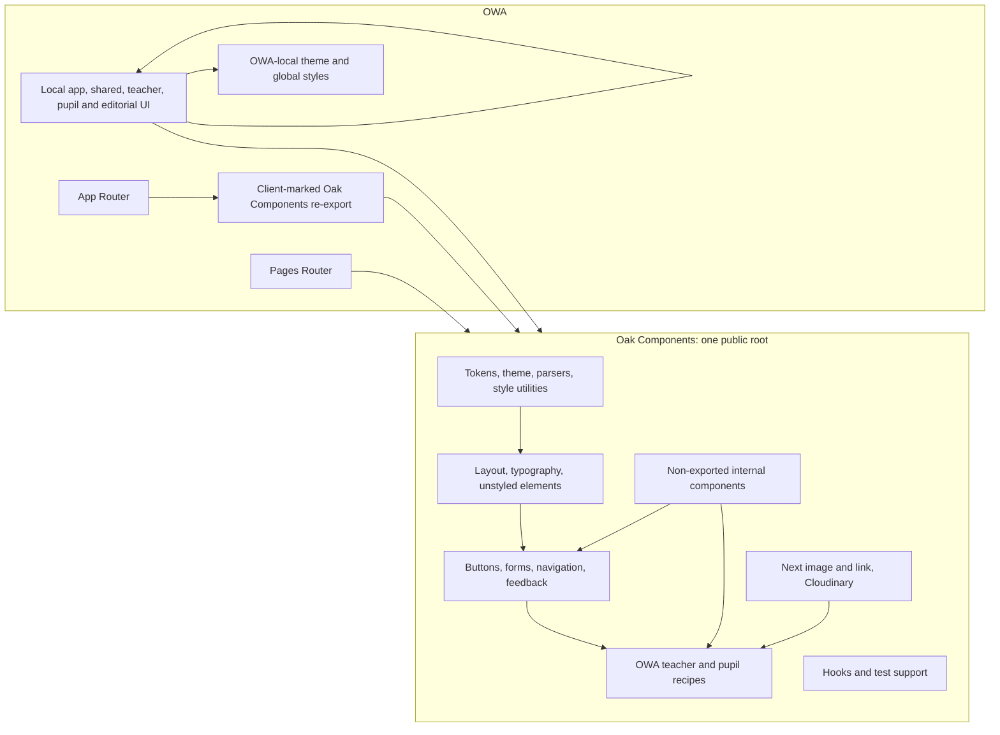

# OWA and Oak Components boundary

## Purpose

This report maps the current UI boundary between Oak Web Application (OWA) and
Oak Components. It describes the boundary that exists, not the package boundary
we might prefer. It also records evidence for and against
[H002: Layered UI platform](../hypotheses/H002-layered-ui-platform.md).

## Source snapshot

**Observed:** The investigation is pinned to these revisions:

| Source                         | Revision                                                                                                                                       | Release at revision |
| ------------------------------ | ---------------------------------------------------------------------------------------------------------------------------------------------- | ------------------- |
| OWA                            | [`510ac63a62fb37a70183b00ce0f5fb15be4491e5`](https://github.com/oaknational/Oak-Web-Application/tree/510ac63a62fb37a70183b00ce0f5fb15be4491e5) | `v1.1128.0`         |
| Oak Components                 | [`8ff8264fa921e4e40fdaf9a99b02fd156c699cc8`](https://github.com/oaknational/oak-components/tree/8ff8264fa921e4e40fdaf9a99b02fd156c699cc8)      | `v3.0.0`            |
| Oak Components consumed by OWA | [`93260fde4b6cacae4018eadfaab2018863318077`](https://github.com/oaknational/oak-components/tree/93260fde4b6cacae4018eadfaab2018863318077)      | `v2.45.0`           |

**Observed:** Counts in this report were made from tracked `src/**/*.ts` and
`src/**/*.tsx` files. "Production" excludes `*.test.*`, `*.stories.*`,
`*.mock.*`, `__tests__` and snapshots. Counts describe static imports, public
names and source locations; they do not measure production traffic or runtime
render frequency.

No build, test, install or browser run was performed for this report.

**Historical inventory method:** The retired
[component-boundary inventory](../../evidence-harness-provenance.md#component-boundary-inventory)
performed the TypeScript public-export resolution, working-layer
classification, static import counts and recipe dependency counts used below.
It read the two source repositories without changing them and emitted JSON with
their revisions, package versions and initial worktree status. The generated
export list was raw evidence rather than a reviewed conclusion and was not
committed.

## Executive finding

**Observed:** Oak Components already contains recognisable source seams for
tokens and style utilities, layout and typography primitives, shared controls,
framework-aware components, test support, and OWA-specific recipes. Those seams
are flattened into one root entry and one set of ESM, CJS and declaration
artifacts ([root entry](https://github.com/oaknational/oak-components/blob/8ff8264fa921e4e40fdaf9a99b02fd156c699cc8/src/index.ts#L1-L4),
[component barrel](https://github.com/oaknational/oak-components/blob/8ff8264fa921e4e40fdaf9a99b02fd156c699cc8/src/components/index.ts#L1-L14),
[Rollup build](https://github.com/oaknational/oak-components/blob/8ff8264fa921e4e40fdaf9a99b02fd156c699cc8/rollup.config.js#L12-L43)).

**Observed:** OWA uses that flattened API extensively while retaining an active
local UI system. There are 438 production source files which consume Oak
Components directly or through OWA's client-marked re-export, 192 which import
OWA `SharedComponents`, and 151 which do both. OWA describes
`SharedComponents` as a future replacement target for Oak Components, so this
is at least partly an encoded migration direction rather than sufficient
evidence of a defective end state
([OWA Storybook introduction](https://github.com/oaknational/Oak-Web-Application/blob/510ac63a62fb37a70183b00ce0f5fb15be4491e5/src/components/introduction.mdx#L22-L61)).

**Inferred:** A layered public contract is plausible because the source graph is
mostly directed from product recipes into shared controls and foundations, and
OWA consumption is concentrated in a small primitive vocabulary. Separate
published packages are not yet justified. Export groups and enforced dependency
rules inside one release unit could test the same hypothesis while preserving a
single provenance and compatibility contract.

**Observed:** The strongest evidence weakening H002 is also explicit in the
current design: repo-specific components stay in Oak Components when they need
non-exported internals
([organisation guidance](https://github.com/oaknational/oak-components/blob/8ff8264fa921e4e40fdaf9a99b02fd156c699cc8/src/docs/organisationalStructure.mdx#L53-L62)).
Twenty-seven production files under `src/components/owa` currently import those
internals. Product ownership cannot simply be moved without first deciding
which internal extension contracts are genuinely shared.

## Boundary topology

**Inferred:** The useful seams are dependency directions and ownership
contracts, not necessarily repository or package boundaries.

## Package and public contract

**Observed:** `@oaknational/oak-components@3.0.0` publishes only `dist`, with a
single CJS `main`, ESM `module` and declaration `types` entry. It has no
`exports` map and no declared `sideEffects` policy. React, React DOM,
styled-components, Next.js and next-cloudinary are all peer dependencies
([package manifest](https://github.com/oaknational/oak-components/blob/8ff8264fa921e4e40fdaf9a99b02fd156c699cc8/package.json#L1-L40)).

**Observed:** Rollup starts at `src/index.ts`, emits one minified ESM file, one
minified CJS file and one rolled-up declaration file, and explicitly externalises
the peers. The supported package contract does not expose token-only,
framework-adapter or recipe subpaths
([Rollup configuration](https://github.com/oaknational/oak-components/blob/8ff8264fa921e4e40fdaf9a99b02fd156c699cc8/rollup.config.js#L12-L43)).

**Observed:** TypeScript's checker resolves 425 public names from the current
root barrel. This includes values, types, hooks, helpers and test utilities, not
425 React components.

The following is a working classification by each export's declaration path.
It is an analytical model, not a classification enforced by the repository.
Framework adapters are narrowly defined here as declarations that directly
bind to Next.js or Cloudinary.

| Working layer                                        | Current public names | Names imported directly by OWA | Direct import appearances in OWA |
| ---------------------------------------------------- | -------------------: | -----------------------------: | -------------------------------: |
| Foundations: tokens, theme, parsers, style utilities |                   47 |                             12 |                               60 |
| React primitives, theme provider and global style    |                   40 |                             24 |                            1,057 |
| Shared controls and composites                       |                  155 |                             57 |                              417 |
| Next.js and Cloudinary adapters                      |                   11 |                              4 |                               20 |
| OWA product recipes                                  |                  165 |                             70 |                              142 |
| General React hooks                                  |                    4 |                              1 |                                2 |
| Test support                                         |                    3 |                              0 |                                0 |
| **Current `v3.0.0` total**                           |              **425** |                        **168** |                        **1,698** |
| Imported by OWA `v2.45.0`, removed in `v3.0.0`       |                  n/a |                              1 |                                1 |

**Observed:** OWA directly imports 169 distinct names from its installed
`v2.45.0` contract. Of those, 168 resolve in the current `v3.0.0` source and
`OakSaveButton` does not. The import-appearance measure counts a name once per
import declaration, including type imports; it is not a bundle or execution
measure. Imports through OWA's local re-export are additional, so this table is
a lower bound on actual source consumption. Including the one appearance of the
removed `OakSaveButton`, OWA has 1,699 direct import appearances in total.

**Observed:** Five primitive names dominate direct use: `OakFlex` appears in 260
production imports, `OakBox` in 183, `OakHeading` in 137, `OakP` in 104 and
`OakSpan` in 77. The corresponding source components are thin compositions of
typed style utilities, as illustrated by
[`OakFlex`](https://github.com/oaknational/oak-components/blob/8ff8264fa921e4e40fdaf9a99b02fd156c699cc8/src/components/layout-and-structure/OakFlex/OakFlex.tsx#L1-L21).

**Inferred:** These five names are a candidate stable construction vocabulary.
Their high use does not establish that their current styled-components API or
responsive prop surface is the best contract.

## Layers present in the source

### Foundations

**Observed:** Theme modules expose concrete tokens and semantic UI roles; for
example, raw colour values and their keys are defined independently of React in
[`color.ts`](https://github.com/oaknational/oak-components/blob/8ff8264fa921e4e40fdaf9a99b02fd156c699cc8/src/styles/theme/color.ts#L1-L83),
and the default theme maps semantic roles such as `text-error`, `bg-btn-primary`
and `border-success` to those tokens
([default theme](https://github.com/oaknational/oak-components/blob/8ff8264fa921e4e40fdaf9a99b02fd156c699cc8/src/styles/theme/default.theme.ts#L3-L98)).

**Observed:** The public `styles` barrel combines those token modules with
styled-components helpers and style-fragment utilities
([styles barrel](https://github.com/oaknational/oak-components/blob/8ff8264fa921e4e40fdaf9a99b02fd156c699cc8/src/styles/index.ts#L1-L3)).
Twenty production source files within `src/styles` import styled-components,
and the theme type itself refers to styled-components types. A supported
token-only consumer must therefore enter through the same package root and peer
contract as React UI.

**Inferred:** Pure token source is visible, but a framework-neutral foundation
is not currently a supported distribution contract. A token-only export is a
direct experiment for H002; a new package is not a prerequisite.

### Primitives and shared controls

**Observed:** Layout and typography form a broad polymorphic construction
surface. Controls then compose non-exported interaction details into branded
buttons, fields, modals, navigation and feedback. For example,
[`OakPrimaryButton`](https://github.com/oaknational/oak-components/blob/8ff8264fa921e4e40fdaf9a99b02fd156c699cc8/src/components/buttons/OakPrimaryButton/OakPrimaryButton.tsx#L1-L55)
configures a shared internal button rather than reimplementing its interaction
model.

**Observed:** The repository explicitly distinguishes shared components,
non-exported internals and repo-specific components. It says a repo-specific
component should normally live in that repo, with an exception when it needs a
non-exported internal
([organisation guidance](https://github.com/oaknational/oak-components/blob/8ff8264fa921e4e40fdaf9a99b02fd156c699cc8/src/docs/organisationalStructure.mdx#L10-L62)).

**Inferred:** The internal layer is doing useful work: it centralises difficult
focus, modal, radio, checkbox, accordion, draggable and button behaviour. The
boundary question is whether recipes need stable extension points, not whether
internals should all become public.

### OWA product recipes

**Observed:** `src/components/owa` contains 80 `Oak*` component directories and
contributes 165 names to the root public API. Its barrel explicitly combines
general OWA recipes with pupil and teacher subtrees
([OWA barrel](https://github.com/oaknational/oak-components/blob/8ff8264fa921e4e40fdaf9a99b02fd156c699cc8/src/components/owa/index.ts#L1-L42)).

**Observed:** Product recipes are not merely styled wrappers. `OakDownloadCard`
owns selectable-resource semantics and composes radio/checkbox internals,
tokens, icons and layout
([source](https://github.com/oaknational/oak-components/blob/8ff8264fa921e4e40fdaf9a99b02fd156c699cc8/src/components/owa/OakDownloadCard/OakDownloadCard.tsx#L1-L16),
[documented outcome](https://github.com/oaknational/oak-components/blob/8ff8264fa921e4e40fdaf9a99b02fd156c699cc8/src/components/owa/OakDownloadCard/OakDownloadCard.tsx#L66-L123)).
`OakQuizMatch` owns keyboard sensors, accessible announcements, reduced-motion
behaviour, drag state and matching callbacks
([source](https://github.com/oaknational/oak-components/blob/8ff8264fa921e4e40fdaf9a99b02fd156c699cc8/src/components/owa/pupil/quiz/OakQuizMatch/OakQuizMatch.tsx#L1-L68),
[interaction](https://github.com/oaknational/oak-components/blob/8ff8264fa921e4e40fdaf9a99b02fd156c699cc8/src/components/owa/pupil/quiz/OakQuizMatch/OakQuizMatch.tsx#L153-L226)).

**Observed:** Seventy-five production files in the OWA recipe subtree import
shared public component areas and 27 import non-exported internals. Excluding
barrels, only one non-OWA implementation imports an OWA recipe: the House CAT
caption search imports `OakFormInputWithLabels`.

**Inferred:** Most dependencies point in the direction expected of a recipe
layer, which supports H002. The 27 internal dependencies weaken any stronger
claim that recipes can immediately be separately owned, versioned or published.

### Framework and provider adapters

**Observed:** Framework coupling is part of the root contract rather than an
explicit subpath. `OakImage` wraps `next/image`
([source](https://github.com/oaknational/oak-components/blob/8ff8264fa921e4e40fdaf9a99b02fd156c699cc8/src/components/images-and-icons/OakImage/OakImage.tsx#L1-L40)),
`OakPrimaryNavItem` and `OakTabs` import `next/link`, and
`OakCloudinaryImage` wraps next-cloudinary while noting that its service
coupling is intended for refactoring
([source](https://github.com/oaknational/oak-components/blob/8ff8264fa921e4e40fdaf9a99b02fd156c699cc8/src/components/owa/OakCloudinaryImage/OakCloudinaryImage.tsx#L1-L44)).

**Observed:** OWA still owns additional adapters. Its `OwaImage` composes
`next/image` with Oak Components' `OakBoxProps` and `oakBoxCss`
([source](https://github.com/oaknational/Oak-Web-Application/blob/510ac63a62fb37a70183b00ce0f5fb15be4491e5/src/components/SharedComponents/OwaImage/OwaImage.tsx#L1-L15)).

**Inferred:** The actual seam is not "framework code is in OWA". Framework
knowledge is split between the library and app, and differently shaped adapters
are retained for different call sites.

## Active OWA overlap

**Observed:** Static production usage at the pinned OWA revision is:

| Measure                                                                   | Files |
| ------------------------------------------------------------------------- | ----: |
| Directly mention `@oaknational/oak-components`                            |   430 |
| Import OWA's `styles/oakThemeApp` re-export                               |     9 |
| Consume Oak Components by either path, deduplicated                       |   438 |
| Import a local `components/SharedComponents` path                         |   192 |
| Consume Oak Components and local `SharedComponents` in the same file      |   151 |
| Local `SharedComponents` implementation files which import Oak Components |    56 |

**Observed:** Local `SharedComponents` remains a substantial system: Box,
buttons, forms, images, video, cards, portable text, filters, navigation and
editorial assemblies are all represented. Incremental migration also mixes the
two systems inside individual components. The local `Button`, for example,
retains OWA style utilities and interaction composition while taking
`OakUiRoleToken` from Oak Components
([source](https://github.com/oaknational/Oak-Web-Application/blob/510ac63a62fb37a70183b00ce0f5fb15be4491e5/src/components/SharedComponents/Button/Button.tsx#L1-L39)).

**Inferred:** File overlap is migration and coupling evidence, not a deletion
list. Replacing a local component is complete only when its semantic behaviour,
content cases, accessibility, analytics hooks and visual states are preserved.

## Theme, global style and router integration

**Observed:** The Pages Router shell applies OWA's `GlobalStyle`, an OWA-local
`ThemeProvider`, Oak Components' `OakThemeProvider`, and `OakGlobalStyle`. It
also injects Lexend font styling
([Pages shell](https://github.com/oaknational/Oak-Web-Application/blob/510ac63a62fb37a70183b00ce0f5fb15be4491e5/src/pages/_app.tsx#L40-L95)).
The OWA-local theme remains selectable between `default` and `oak`
([`useOakTheme`](https://github.com/oaknational/Oak-Web-Application/blob/510ac63a62fb37a70183b00ce0f5fb15be4491e5/src/hooks/useOakTheme.ts#L14-L60)).

**Observed:** Oak Components says `OakGlobalStyle` is currently for Storybook
because its rules are already applied in OWA
([source](https://github.com/oaknational/oak-components/blob/8ff8264fa921e4e40fdaf9a99b02fd156c699cc8/src/components/OakGlobalStyle/OakGlobalStyle.tsx#L1-L14)),
but the Pages shell renders it in addition to OWA's own global style. The reset
and general Oak rules in the two repositories are near copies; the component
version additionally sets its font family and semantic text colour, while OWA
adds PostHog and Gleap integration rules.

**Observed:** The App Router instead imports a manually extracted
`app-global.css`, applies only the Oak Components theme, and uses an OWA-owned
styled-components server registry
([App shell](https://github.com/oaknational/Oak-Web-Application/blob/510ac63a62fb37a70183b00ce0f5fb15be4491e5/src/app/layout.tsx#L41-L112),
[CSS extraction](https://github.com/oaknational/Oak-Web-Application/blob/510ac63a62fb37a70183b00ce0f5fb15be4491e5/src/styles/app-global.css#L1-L105),
[style registry](https://github.com/oaknational/Oak-Web-Application/blob/510ac63a62fb37a70183b00ce0f5fb15be4491e5/src/app/styles-registry.tsx#L1-L30)).

**Observed:** OWA also provides a two-line adapter which adds `"use client"`
and re-exports the whole Oak Components root
([`oakThemeApp.ts`](https://github.com/oaknational/Oak-Web-Application/blob/510ac63a62fb37a70183b00ce0f5fb15be4491e5/src/styles/oakThemeApp.ts#L1-L2)).
Nine production files import it, including the App Router root layout.

**Inferred:** Theme and global-style behaviour is currently a router-specific
integration contract, not solely a library concern. Moving tokens or providers
without recording reset order, font loading, SSR insertion, third-party
overrides and semantic role resolution would lose behaviour.

## `2.45.0` to `3.0.0` contract gap

**Observed:** The relevant release sequence is:

| Release                  | Commit                                                                                                                                           | Created              |
| ------------------------ | ------------------------------------------------------------------------------------------------------------------------------------------------ | -------------------- |
| Oak Components `v2.45.0` | [`93260fde4b6cacae4018eadfaab2018863318077`](https://github.com/oaknational/oak-components/commit/93260fde4b6cacae4018eadfaab2018863318077)      | 2026-07-15 11:47 UTC |
| Oak Components `v2.45.1` | [`ae04c527a67de505baec57ce944007985b33334a`](https://github.com/oaknational/oak-components/commit/ae04c527a67de505baec57ce944007985b33334a)      | 2026-07-16 14:41 UTC |
| OWA `v1.1128.0`          | [`510ac63a62fb37a70183b00ce0f5fb15be4491e5`](https://github.com/oaknational/Oak-Web-Application/commit/510ac63a62fb37a70183b00ce0f5fb15be4491e5) | 2026-07-17 08:06 UTC |
| Oak Components `v3.0.0`  | [`8ff8264fa921e4e40fdaf9a99b02fd156c699cc8`](https://github.com/oaknational/oak-components/commit/8ff8264fa921e4e40fdaf9a99b02fd156c699cc8)      | 2026-07-17 11:13 UTC |

**Observed:** OWA declares `^2.45.0` and its lockfile resolves exactly
`2.45.0`
([manifest](https://github.com/oaknational/Oak-Web-Application/blob/510ac63a62fb37a70183b00ce0f5fb15be4491e5/package.json#L84-L102),
[lockfile](https://github.com/oaknational/Oak-Web-Application/blob/510ac63a62fb37a70183b00ce0f5fb15be4491e5/pnpm-lock.yaml#L53-L58)).
The range admits `2.45.1` but excludes `3.0.0`.

**Observed:** The major release removes `OakSaveButton` and save behaviour from
unit-list recipes, alongside the `2.45.1` typography correction. The breaking
removal was explicitly committed as such
([breaking commit](https://github.com/oaknational/oak-components/commit/a2c4a8a35c03f3052b21106a5111f807e75204f0)).
The removed `v2.45.0` button encoded saved/loading/unavailable states and an
action-specific accessible name
([previous source](https://github.com/oaknational/oak-components/blob/93260fde4b6cacae4018eadfaab2018863318077/src/components/owa/OakSaveButton/OakSaveButton.tsx#L5-L31)).

**Observed:** Current OWA still imports `OakSaveButton` and renders it twice in
`MyLibraryUnitCard`
([source](https://github.com/oaknational/Oak-Web-Application/blob/510ac63a62fb37a70183b00ce0f5fb15be4491e5/src/components/TeacherComponents/MyLibraryUnitCard/MyLibraryUnitCard.tsx#L1-L10),
[uses](https://github.com/oaknational/Oak-Web-Application/blob/510ac63a62fb37a70183b00ce0f5fb15be4491e5/src/components/TeacherComponents/MyLibraryUnitCard/MyLibraryUnitCard.tsx#L80-L130)).
Installing `3.0.0` without an OWA change would therefore break the current
source contract.

**Unknown:** The source does not establish whether an OWA migration is already
planned elsewhere, whether `2.45.0` is intentionally pinned in the lockfile, or
how releases are coordinated across consumers. The close timestamps are
evidence of concurrent change, not evidence of coordination quality.

## Testing, accessibility and release contract

**Observed:** Oak Components contains 223 test files, 190 Storybook story files
and 177 stored snapshots. Unit tests include semantic and interaction assertions,
such as labelled radio groups
([test](https://github.com/oaknational/oak-components/blob/8ff8264fa921e4e40fdaf9a99b02fd156c699cc8/src/components/form-elements/OakRadioGroup/OakRadioGroup.test.tsx#L38-L52)),
dropdown ARIA state
([test](https://github.com/oaknational/oak-components/blob/8ff8264fa921e4e40fdaf9a99b02fd156c699cc8/src/components/buttons/OakButtonWithDropdown/OakButtonWithDropdown.test.tsx#L178-L237)),
and distinct accessible names and IDs for pupil quiz results
([test](https://github.com/oaknational/oak-components/blob/8ff8264fa921e4e40fdaf9a99b02fd156c699cc8/src/components/owa/pupil/lesson/OakLessonReviewQuiz/OakPupilLessonReviewQuiz.test.tsx#L22-L57)).

**Observed:** Storybook config includes the accessibility addon and supplies
themes and global styles
([main config](https://github.com/oaknational/oak-components/blob/8ff8264fa921e4e40fdaf9a99b02fd156c699cc8/.storybook/main.ts#L10-L22),
[preview](https://github.com/oaknational/oak-components/blob/8ff8264fa921e4e40fdaf9a99b02fd156c699cc8/.storybook/preview.tsx#L19-L35)).
The Components verify workflow runs format, lint, type-check, package build,
Jest and SonarCloud, but does not invoke Storybook or a dedicated automated
accessibility command
([workflow](https://github.com/oaknational/oak-components/blob/8ff8264fa921e4e40fdaf9a99b02fd156c699cc8/.github/workflows/verify.yml#L10-L39)).

**Observed:** A successful Components verify run on `main` triggers semantic
release
([release workflow](https://github.com/oaknational/oak-components/blob/8ff8264fa921e4e40fdaf9a99b02fd156c699cc8/.github/workflows/release.yml#L1-L48)).
The documented host-app check is a manual `yalc` workflow in OWA rather than a
cross-repository CI contract
([documentation](https://github.com/oaknational/oak-components/blob/8ff8264fa921e4e40fdaf9a99b02fd156c699cc8/README.md#L56-L84)).

**Observed:** OWA runs Axe through Pa11y against a configured set of deployed
application URLs and explicitly excludes Storybook deployments
([workflow](https://github.com/oaknational/Oak-Web-Application/blob/510ac63a62fb37a70183b00ce0f5fb15be4491e5/.github/workflows/post_deployment_actions.yml#L67-L114),
[Pa11y configuration](https://github.com/oaknational/Oak-Web-Application/blob/510ac63a62fb37a70183b00ce0f5fb15be4491e5/pa11yci.config.js#L19-L89)).
This supplies integration evidence for components reached by those URLs, but is
not a public component accessibility contract.

**Unknown:** The available source does not establish Storybook-wide automated
violation counts, keyboard and screen-reader coverage, accessibility support
targets, consumer compatibility fixtures, public API diff gates or release
adoption time. Test volume alone cannot answer those questions.

## Bundle and React Server Component boundary

**Observed:** OWA's already-installed `2.45.0` package artifact is a single
minified ESM file of 564,690 bytes and a single minified CJS file of 579,429
bytes; the complete `dist` directory is approximately 4.5 MiB including types
and source maps. These are local artifact sizes, not client bundle sizes. No
artifact was generated during this investigation.

**Observed:** The package source contains React hooks and browser-dependent
behaviour, while no source file in the current Components revision declares a
`"use client"` boundary. For example, `useMediaQuery` accesses
`globalThis.matchMedia` and resize events
([source](https://github.com/oaknational/oak-components/blob/8ff8264fa921e4e40fdaf9a99b02fd156c699cc8/src/hooks/useMediaQuery.tsx#L1-L21)).
The same root also exports components that are plausible server-renderable
primitives.

**Observed:** OWA's local `"use client"; export *` adapter makes the entire root
an explicit client boundary for its nine consumers. Other OWA files import the
package root directly, including App Router source.

**Unknown:** Source shape and package artifact size do not reveal:

- how much Oak Components code reaches each OWA client route;
- whether Next consistently selects and tree-shakes the ESM artifact;
- whether bundled third-party interaction code is removed from primitive-only
  consumers;
- which exports are valid in App Router server components;
- whether a narrow client adapter reduces the client graph compared with the
  current root re-export;
- whether CJS remains a required supported contract.

**Inferred:** Bundle and RSC claims should remain unknown until measured with
minimal consumers and OWA route output. The absence of an `exports` map or
`sideEffects` declaration is a reason to test, not proof of poor tree-shaking.

## Observed strengths and preservation questions

The following are behavioral assets visible in source, independent of future
package shape. Their impact and necessity remain preservation hypotheses until
consumer, product, user or operational evidence establishes them.

- **Observed:** Semantic tokens separate interface roles from raw palette
  values and include default and dark themes.
- **Observed:** Primitive layout and typography give OWA a small, consistent and
  heavily reused construction vocabulary.
- **Observed:** Internal controls centralise focus, disabled, loading, keyboard,
  modal, radio, checkbox and accordion behaviour.
- **Observed:** Product recipes encode educational interaction details, including
  pupil quiz announcements, reduced motion, review structure and downloadable
  resource selection.
- **Observed:** Next image optimisation, Cloudinary handling, placeholders and
  asset configuration are operational behaviour, even if their current owner
  changes.
- **Observed:** Component tests, stories, snapshots and deployed-app Pa11y checks
  provide complementary evidence.
- **Inferred:** OWA-local components are likely to contain content and editorial
  cases not represented by like-named library controls; parity must be shown,
  not assumed from visual similarity.
- **Unknown:** Which variants are still used by meaningful production traffic,
  which dark-theme paths are supported, and which behaviours have caused past
  incidents or accessibility regressions.

## Concrete boundary tensions

1. **Observed:** One root export and one build unit present foundations, React
   UI, Next adapters, product recipes, hooks and test support as one public
   surface.
2. **Observed:** A token consumer inherits mandatory Next.js,
   next-cloudinary, React and styled-components peer expectations through the
   supported package contract.
3. **Observed:** Product recipes are visibly grouped but depend on 27 files of
   non-exported internal behaviour, limiting independent ownership.
4. **Observed:** OWA retains parallel local primitives, controls, themes and
   globals; 151 production files cross both component systems.
5. **Observed:** Framework adapters are split between the package and OWA, while
   App Router client marking is supplied by an OWA-wide re-export.
6. **Observed:** Pages and App Router shells establish different theme and
   global-style contracts.
7. **Observed:** Library verification and release do not prove current OWA
   compatibility; `3.0.0` demonstrates a real major-version hand-off still to
   be made in the pinned source.
8. **Unknown:** Bundle inclusion, RSC validity, consumer inventory and automated
   component accessibility coverage are not expressed as package contracts.

## H002 assessment and invalidators

### Evidence currently supporting H002

- **Observed:** Source folders already expose the proposed conceptual layers.
- **Observed:** Product dependencies are predominantly directed into shared
  controls, internals and foundations; reverse product dependencies are rare.
- **Observed:** OWA usage is concentrated in reusable primitives while still
  drawing on many product recipes.
- **Observed:** Framework coupling is localised to a small number of direct
  Next.js and Cloudinary declarations, even though those declarations currently
  widen the whole peer contract.
- **Observed:** OWA has already created an adapter for client-boundary semantics,
  showing that host integration is distinct work.

### Evidence currently weakening or narrowing H002

- **Observed:** The consumer available in this workspace is a Next.js, React and
  styled-components application. It establishes the current compatibility
  surface but cannot determine the Innovation Kit's intended consumer contracts;
  those must be derived from the products the framework exists to enable.
- **Observed:** Twenty-seven recipe files depend on private internals, and the
  repository documents this as the reason repo-specific UI sometimes stays in
  Oak Components. Separate publication or team ownership is therefore a
  stronger claim than the evidence supports.
- **Observed:** Tokens, theme types, CSS parsers and styled-components utilities
  are related but not currently isolated; a boundary drawn only from folder
  names would be false precision.
- **Observed:** OWA's mixed local/package usage is extensive. Layering does not
  itself remove the need to prove behaviour during migration.
- **Unknown:** Current tree-shaking may already make the flattened build efficient
  at runtime, in which case bundle size would not support H002 even if ownership
  clarity still did.

### Evidence that would invalidate or materially weaken H002

H002 should be rejected or narrowed if one or more of these observations is
established:

1. A complete consumer inventory shows that all credible consumers need the
   same Next.js, styled-components, provider and client-boundary contract, and
   explicit layers do not improve independent testing, ownership or change
   safety.
2. Minimal consumer builds show that the current root reliably removes unused
   recipes and interaction dependencies, produces the same server/client graph
   as proposed subpath exports, and has no meaningful compatibility ambiguity.
3. A token-only extraction requires duplicating semantic definitions or keeping
   most of styled-components and React in the contract, so it cannot express an
   independently meaningful or verifiable boundary.
4. Dependency analysis plus a recipe extraction trial shows that most product
   recipes intrinsically need private shared implementation, creating repeated
   back-edges without a distinct semantic or assurance boundary.
5. Teams responsible for OWA and Components demonstrate one stable shared
   ownership and release cadence, with consumer compatibility failures already
   prevented by existing gates; additional ownership layers would then model no
   real organisational boundary.
6. Accessibility comparison shows that isolated control/recipe contracts miss
   the important failures and that only integrated journey testing detects or
   prevents regressions. H002 would then need to treat recipes as app-owned test
   fixtures rather than an independently assured layer.

These are invalidators because they challenge the claimed value or location of
the layers. Migration effort alone is not an invalidator.

## Unknowns and next discriminating work

| Unknown                                     | Most decisive evidence                                                                                                            | H002 decision affected                                                                 |
| ------------------------------------------- | --------------------------------------------------------------------------------------------------------------------------------- | -------------------------------------------------------------------------------------- |
| Non-OWA consumers and runtime needs         | Inventory internal and published consumers; record framework, styling, SSR and ownership needs.                                   | Whether foundations/adapters need independently consumable contracts.                  |
| Public API use                              | Generate an export-to-consumer matrix including OWA's local re-export and any other repositories.                                 | Which exports are contract, recipe, obsolete or internal detail.                       |
| Tree-shaking and route dependency footprint | Compare a primitive-only fixture, a recipe fixture and representative OWA route bundle output.                                    | Whether subpath exports improve runtime output or only clarity.                        |
| RSC semantics                               | Compile minimal Pages, App Router server and App Router client consumers using root and narrow adapter imports.                   | Where `"use client"`, styled-components SSR and provider adapters belong.              |
| Token independence                          | Expose only token/theme schema in an experiment and inspect emitted dependencies and usable outputs.                              | Whether the foundation layer is real and independently valuable.                       |
| Recipe ownership                            | Trace change history and interview owners for download, pupil quiz, teacher notes and save recipes.                               | Whether recipes belong with capabilities, the design system, or a shared release unit. |
| Accessibility contract                      | Run automated Storybook checks, keyboard scripts and selected screen-reader/manual checks; compare with OWA Pa11y route findings. | Which assurance belongs to controls, recipes and journeys.                             |
| Version hand-off                            | Trial `3.0.0` in an isolated OWA branch and enumerate compile, visual, interaction and accessibility changes.                     | Whether compatibility fixtures or coordinated release automation are needed.           |

## Current conclusion

**Experiment proposition:** The next experiment should keep one repository and one release
unit while exposing four explicit, enforceable paths: framework-neutral tokens,
shared React UI, framework/provider adapters, and OWA recipes. Dependency rules
should prevent foundations from importing UI and shared UI from importing
recipes. This is an experiment, not the target architecture.

**Inferred:** That experiment is more focused and discriminating than splitting
packages. It can show whether consumers, tests, bundles and ownership actually
benefit before coordinated versioning is introduced.

**Unknown:** H002 remains low-confidence until the consumer, bundle, RSC and
accessibility experiments above are completed.
