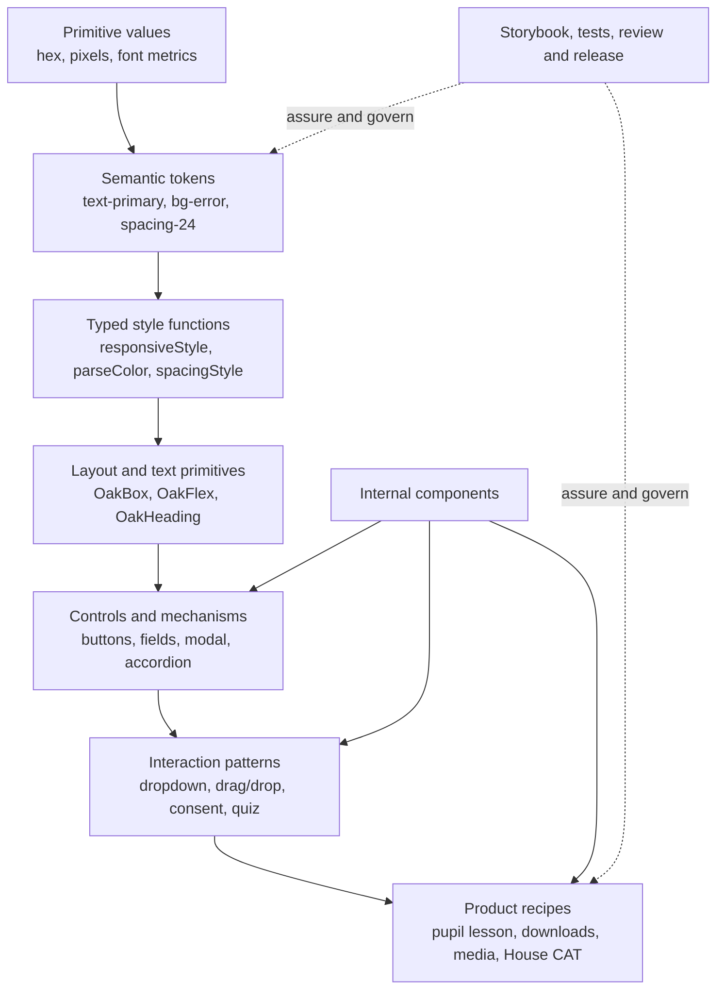
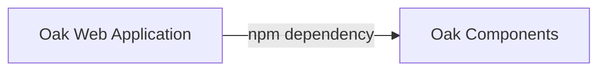
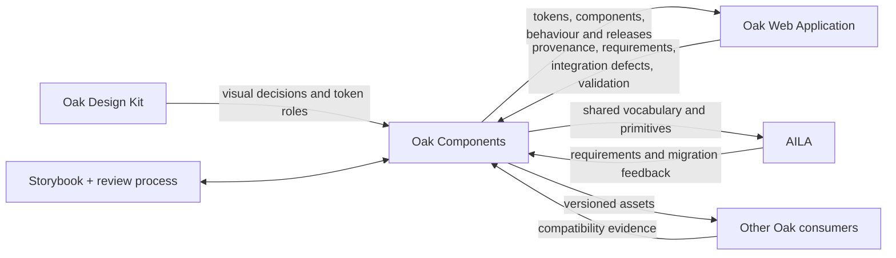

# Oak Components: anatomy, intent, coupling, value and unresolved seams

> A source-backed architectural and sociotechnical reading of [`oaknational/oak-components`](https://github.com/oaknational/oak-components), with its relationship to [`oaknational/Oak-Web-Application`](https://github.com/oaknational/Oak-Web-Application) treated as essential context but not as the whole story.

**Research snapshot:** 3 August 2026

**Primary code snapshots:** Oak Components [`e28d22a`](https://github.com/oaknational/oak-components/tree/e28d22ad346ce3de36ddbeb4b2f5f254ddf5b44e), OWA [`c4ca9a9`](https://github.com/oaknational/Oak-Web-Application/tree/c4ca9a9a246ca2d2bf81f64b4baee74eee5b0d31), AILA [`d1c15ea`](https://github.com/oaknational/oak-ai-lesson-assistant/tree/d1c15ea0064e763f928f0b4cd6f038bbb16adb46), Oak Components Sandbox [`e103d16`](https://github.com/oaknational/oak-components-sandbox/tree/e103d1635e0faeaf07112c9ffe6170676dcf254a), Resource Adapter [`4f356fc`](https://github.com/oaknational/oak-resource-adapter/tree/4f356fc388b13c5af04a813bc6f48cae85b2a91f)

**Package snapshot:** `@oaknational/oak-components` 3.4.0

## Executive summary

Oak Components is best understood as a **shared UI capability system for Oak's React applications**, not simply as a component library and not cleanly as a standalone design system. Oak Components contains at least five materially different things (the first four ship in the npm package; the fifth is repository infrastructure rather than published package contents):

1. a semantic design vocabulary: colour roles, spacing, typography, borders, shadows, transitions and responsive rules;
2. a typed styling language built from those tokens and `$`-prefixed responsive props;
3. reusable controls and interaction mechanisms, including focus, keyboard, modal, drag-and-drop, consent and media behaviour;
4. progressively more product-shaped compositions for pupil, teacher, OWA and House CAT experiences;
5. a governance and assurance environment: Storybook, templates, tests, review heuristics, release automation and cross-repository validation practices.

That combination is the source of both its value and its ambiguity.

The library succeeds at turning repeated Oak decisions into reusable, reviewable and distributable code. It is particularly valuable where the hard part is not appearance alone but interaction behaviour, accessibility detail, responsive composition, and the accumulated knowledge embedded in internal components. A primary button is a thin policy-setting layer over a substantial internal button mechanism. A quiz matching component packages mouse, touch and keyboard sensors, announcements, reduced-motion behaviour and application callbacks. The value is therefore closer to **interaction capital** than to a gallery of styled rectangles.

OWA and Oak Components remain coupled. The source dependency points in one direction—OWA imports the package—but the change system points both ways. The library began through explicit extraction and adaptation of OWA styles and components. OWA still supplies requirements, integration feedback, environment conventions, local testing machinery and defects found only in application composition. Oak Components, in turn, supplies OWA's theme, global primitives, public vocabulary and a growing set of product patterns. The npm boundary permits independent commits and releases; it does not create independent evolution.

Other consumers matter because they reveal which parts travel. AILA uses the theme, layout primitives and semantic styling vocabulary to construct a distinct application, sometimes extending Oak components with local styled wrappers. A Resource Adapter harness uses the package to reproduce an OWA-like host environment. An old sandbox preserves an earlier integration style. A coordinated 2026 token migration was explicitly tested in OWA, AILA, House CAT, Open API and the Google Classroom Addon. These are not equivalent consumers, and their different package versions show that distribution is federated rather than lockstep.

The public surface is broad. The barrel graph exposes **164 component-family module entry points** through one root package import, before counting the additional public hooks, style helpers, tokens and test helpers. The single root export is a deliberate stabiliser: a 999-file internal reorganisation could be non-breaking because consumers did not import physical paths. It also flattens distinctions among primitive, behaviour, product recipe, test utility and service adapter. The repository's folders explain provenance and ownership to maintainers, but those distinctions disappear at the package boundary.

The strongest conceptual models are complementary rather than mutually exclusive:

- **typed language / DSL** explains how tokens and style props let consumers write Oak UI sentences;
- **shared kernel** explains the intimate co-ownership and coordinated change with OWA better than a conventional upstream library model;
- **software product-line core asset** explains shared defaults plus deliberately exposed variability;
- **information-hiding module** tests whether the package hides volatile decisions—and shows that it hides implementation better than product change;
- **boundary object** explains how code, Storybook and tokens coordinate design, engineering, QA and multiple product teams without requiring identical local interpretations;
- **co-evolving ecosystem** explains why a one-way dependency graph understates the relationship among repositories;
- **asset portfolio** explains promotion, deprecation, relocation and deletion better than a static component hierarchy.

The central confusion is the word **shared**. In this repository it can mean:

- used by more than one repository;
- generic enough to be a common primitive;
- built from private mechanisms shared by several components;
- governed centrally even when used by one product;
- distributed to several applications;
- aligned with a shared visual language.

Those meanings overlap, but they are not the same. Much of the structural tension follows from treating them as one classification.

The report's overall judgement is therefore:

> Oak Components is a successful shared implementation and governance surface whose package boundary is clearer than its conceptual boundary. Its greatest value lies in semantic consistency, behaviour and institutional memory. Its greatest weakness is that one flat public interface and one repository carry assets at several semantic altitudes, ownership models and lifecycle stages, making “what belongs here?” permanently negotiable.

## 1. Scope, evidence and method

### 1.1 Questions

This investigation asks:

- What is Oak Components structurally and operationally?
- Which roles does it actually play, whether or not they are named in the README?
- What did its maintainers intend, and how has that intent changed?
- What value does it produce for consumers?
- What does it achieve strongly, what remains partial, and where are the recurring failure seams?
- What did it not set out to be?
- How is its history entangled with OWA?
- What do other consumers reveal that OWA alone cannot?
- Which conceptual models illuminate the evidence, and where does each model mislead?
- What unexpected relationships become visible when components are treated as historical, organisational and assurance artefacts rather than only source files?

This is an explanatory study, not a proposal for a replacement architecture.

### 1.2 Evidence base

The analysis used:

- current package metadata, source barrels, representative implementations, tests, stories and documentation;
- build, TypeScript, Storybook, Jest, Sonar and GitHub Actions configuration;
- selected pull requests from the repository's beginning in October 2023 through July 2026;
- current open issues that expose integration and documentation seams;
- current integration code in OWA, AILA, the Resource Adapter harness and Oak Components Sandbox;
- organisation-wide GitHub code search for imports and representative symbols;
- npm registry release metadata;
- original or authoritative sources for the external conceptual models.

Evidence uses the repository's four claim states:

- **Observation** — directly visible in source, configuration, issue or pull-request evidence;
- **Inference** — the most economical explanation connecting several observations;
- **Hypothesis** — a plausible relationship worth testing, not a settled conclusion.
- **Unknown** — material information that the available evidence cannot establish.

Direct factual descriptions supported by the cited snapshots are **Observed** even where that label is not repeated on every paragraph. Evaluative interpretations, model applications and conclusions are **Inferred** unless explicitly marked as hypotheses or unknowns. The executive summary and conclusion are syntheses: their quantitative and structural statements repeat observations, while their overall characterisations are inferences.

### 1.3 Quantitative protocol and limits

The public component count is a count of module exports reachable through the component barrel chain at the snapshot, not a count of React function declarations. It excludes non-exported internals but includes modules that may export more than one value or type. It is therefore best read as a measure of public surface breadth.

Organisation-wide code search returned the maximum 100 results for the exact package string: 81 from OWA, 18 from AILA and one from Oak Components itself. That result is saturated and is **not** a complete usage count. Lower-volume consumers were found through symbol searches, package manifests and cross-repository migration records. Private or unavailable repositories could not be inspected, so the consumer census is a lower bound.

The investigation did not include interviews, Slack discussions, private design files, analytics, user research or runtime telemetry. Design and organisational intent are inferred only where the repositories preserve it. A pull-request statement that a change was tested in another repository proves the relationship at that time, not permanent current use.

## 2. The observable object

### 2.1 Package facts

| Property | Snapshot observation | Architectural significance |
|---|---|---|
| Package | `@oaknational/oak-components` 3.4.0 | A separately versioned, publicly distributed artefact |
| Description | “Shared components for Oak applications” | Organisational scope, not general ecosystem scope |
| Runtime | React `>=18.2`, Next `>=14.2.12`, styled-components `>=5.3.11` | Framework- and styling-system-specific |
| Service peer | `next-cloudinary >=6.16.0` | A service adapter affects the package-level installation contract |
| Export map | only `.` with ESM and CJS forms | One flat public doorway; no supported subpath contracts |
| Build | Rollup, preserved ESM modules, CJS bundle, bundled declarations | Tree-shakable implementation internally, flattened contract externally |
| Root exports | components, styles, hooks and test helpers | More than a component catalogue |
| Releases | semantic-release after verified merges to `main` | High-frequency distribution is part of normal development |
| Registry history | 434 published versions from Jan 2024 to Jul 2026 | The package is a rapid change channel, not a slow-moving standard |
| Contribution model | public source, external code contributions currently declined | Openly inspectable but internally governed |

Sources: [package manifest](https://github.com/oaknational/oak-components/blob/e28d22ad346ce3de36ddbeb4b2f5f254ddf5b44e/package.json), [Rollup configuration](https://github.com/oaknational/oak-components/blob/e28d22ad346ce3de36ddbeb4b2f5f254ddf5b44e/rollup.config.ts), [README](https://github.com/oaknational/oak-components/blob/e28d22ad346ce3de36ddbeb4b2f5f254ddf5b44e/README.md), [npm registry metadata](https://registry.npmjs.org/@oaknational%2foak-components).

The README calls the repository a “React Typescript components library” supporting Oak-produced React and Next applications. That is accurate, but incomplete. The root [`src/index.ts`](https://github.com/oaknational/oak-components/blob/e28d22ad346ce3de36ddbeb4b2f5f254ddf5b44e/src/index.ts) also exports style tokens and parsers, four hooks, and browser-test helpers such as mock observers. Those exports make the package a development vocabulary and test support package as well as a runtime UI library.

### 2.2 Public component surface

The current barrels expose the following component-family modules:

| Public grouping | Direct module entries | Character |
|---|---:|---|
| Buttons | 15 | branded control variants and dropdown behaviour |
| Cookies | 4 | consent UI and orchestration |
| Form elements | 17 | fields, input controls and selectable cards |
| House CAT | 2 | explicitly repository/product-specific caption workflows |
| Images and icons | 5 | media primitives |
| Layout and structure | 8 | box, flex, grid, max-width and disclosure primitives |
| Messaging and feedback | 11 | modal, toast, tooltip, banners, focus affordances |
| Navigation | 10 | links, navigation, pagination, cards, tabs and breadcrumbs |
| Presentational | 3 | carousel, quote and video composition |
| Typography | 7 | headings, paragraphs, lists and polymorphic text |
| Unstyled | 1 | a deliberately minimally styled accordion mechanism |
| OWA, direct | 40 | product-shaped cards, media, downloads and other recipes |
| OWA teacher | 5 | teacher-specific compositions |
| OWA pupil browse | 12 | pupil journey and optionality patterns |
| OWA pupil lesson | 8 | lesson shell/navigation/review patterns |
| OWA pupil quiz | 12 | question, feedback and interaction patterns |
| OWA pupil unit, direct | 2 | unit-list patterns |
| Root providers/styles | 2 | theme provider and global styles |
| **Reachable total** | **164** | broad multi-altitude public surface |

Sources: [component root barrel](https://github.com/oaknational/oak-components/blob/e28d22ad346ce3de36ddbeb4b2f5f254ddf5b44e/src/components/index.ts), [OWA barrel](https://github.com/oaknational/oak-components/blob/e28d22ad346ce3de36ddbeb4b2f5f254ddf5b44e/src/components/owa/index.ts), [pupil quiz barrel](https://github.com/oaknational/oak-components/blob/e28d22ad346ce3de36ddbeb4b2f5f254ddf5b44e/src/components/owa/pupil/quiz/index.ts), [pupil lesson barrel](https://github.com/oaknational/oak-components/blob/e28d22ad346ce3de36ddbeb4b2f5f254ddf5b44e/src/components/owa/pupil/lesson/index.ts), [pupil browse barrel](https://github.com/oaknational/oak-components/blob/e28d22ad346ce3de36ddbeb4b2f5f254ddf5b44e/src/components/owa/pupil/browse/index.ts).

This census exposes the first important structural fact: category names do not describe a single dimension. “Buttons” and “navigation” describe UI function. “OWA” and “House CAT” describe consumers or organisational provenance. “Unstyled” describes presentation policy. “Internal” describes visibility and reuse. “Pupil” and “teacher” describe audiences. A maintainer navigating the tree is moving through several taxonomies at once.

### 2.3 A semantic-altitude map

The source can be read as a vertical stack:



The package exports every solid layer except most of the internal mechanism layer. This is why “component library” feels too small: consumers can work at several semantic altitudes without leaving the package.

### 2.4 The typed styling language

The theme layer currently defines:

- 79 primitive colour tokens;
- 92 semantic UI role tokens spanning text, background, icon, border and code roles;
- 28 numeric spacing values from 0 to 1360 pixels;
- additional dimension values such as `100%`, viewport units, `auto` and intrinsic sizing keywords;
- 10 font-size tokens and 29 composite heading, body, list and code styles;
- border, radius, shadow, opacity, transition and z-index vocabularies;
- complete default and dark maps from every UI role to a primitive colour.

The public helpers translate this vocabulary into CSS. `OakBox` composes position, size, spacing, colour, border, display, shadow, opacity, transform, transition, typography, z-index and scroll-snap style functions. Responsive props accept arrays, so a consumer can write:

```tsx
<OakFlex
  $flexDirection={["column", "row"]}
  $gap="spacing-16"
  $background="bg-primary"
  $color="text-primary"
/>
```

This is not just prop convenience. It is a small, typed language with:

- a **lexicon** — the token names;
- **grammar** — which token kinds are legal for which style props;
- **responsive syntax** — scalar or breakpoint-indexed values;
- **sentences** — component compositions;
- **semantic checking** — TypeScript rejects many invalid combinations;
- **interpretation** — styled-components and parsing helpers emit CSS.

The late-2025 and early-2026 move from raw/combined colours to semantic UI roles made the grammar more meaningful: `bg-primary` expresses intent, while `white` expresses an implementation. That distinction is what permits the default and dark themes to share component code. Sources: [colour vocabulary](https://github.com/oaknational/oak-components/blob/e28d22ad346ce3de36ddbeb4b2f5f254ddf5b44e/src/styles/theme/color.ts), [spacing vocabulary](https://github.com/oaknational/oak-components/blob/e28d22ad346ce3de36ddbeb4b2f5f254ddf5b44e/src/styles/theme/spacing.ts), [typography vocabulary](https://github.com/oaknational/oak-components/blob/e28d22ad346ce3de36ddbeb4b2f5f254ddf5b44e/src/styles/theme/typography.ts), [`OakBox`](https://github.com/oaknational/oak-components/blob/e28d22ad346ce3de36ddbeb4b2f5f254ddf5b44e/src/components/layout-and-structure/OakBox/OakBox.tsx).

The language is intentionally Oak-specific. It is not a framework-neutral design-token interchange layer: the tokens are TypeScript objects, the style grammar is styled-components-based, and the package currently exposes no DTCG JSON contract. The Design Tokens Community Group's stable 2025.10 format is useful here as a contrast model for cross-tool exchange, not as a standard Oak Components claims to implement. The DTCG itself describes its format as an interoperability layer rather than an organisational methodology ([specification](https://www.designtokens.org/tr/2025.10/), [status clarification](https://www.designtokens.org/faq/)).

### 2.5 Components as policy layers over mechanisms

The public/internal distinction is one of the clearest intentional designs in the repository.

`OakPrimaryButton` is a small specialisation that fixes semantic colours and hover/disabled policies on top of `InternalShadowRectButton`. The internal component owns polymorphism, icons, loading, selected state, multiple focus shadows, hover timing callbacks, sizing and typography. The public component is therefore a named policy rather than a fresh implementation. Sources: [`OakPrimaryButton`](https://github.com/oaknational/oak-components/blob/e28d22ad346ce3de36ddbeb4b2f5f254ddf5b44e/src/components/buttons/OakPrimaryButton/OakPrimaryButton.tsx), [`InternalShadowRectButton`](https://github.com/oaknational/oak-components/blob/e28d22ad346ce3de36ddbeb4b2f5f254ddf5b44e/src/components/internal-components/InternalShadowRectButton/InternalShadowRectButton.tsx).

The documented reuse strategy explicitly prefers separate public components with fewer props, backed by shared internal composition or carefully controlled styled-component inheritance. It also names the “swiss army knife effect”, discoverability risk, divergence risk and encapsulation hazards. This is evidence that the broad catalogue is not accidental proliferation; part of it is a deliberate trade: more named public concepts in exchange for narrower individual APIs. See [How to design components](https://github.com/oaknational/oak-components/blob/e28d22ad346ce3de36ddbeb4b2f5f254ddf5b44e/src/docs/designingComponents.mdx) and [Reusable code](https://github.com/oaknational/oak-components/blob/e28d22ad346ce3de36ddbeb4b2f5f254ddf5b44e/src/docs/reusableCode.mdx).

### 2.6 Components as packaged interaction knowledge

The higher-value components encode behaviour that would otherwise be repeatedly rediscovered:

- `OakModalCenter` owns portals, focus trapping and return, escape and backdrop handling, scroll effects and responsive presentation;
- `OakQuizMatch` combines mouse, touch and keyboard drag sensors, screen-reader announcements, reduced-motion behaviour, overlay rendering and match state;
- `OakButtonWithDropdown` owns outside-click handling, escape and arrow-key navigation, focus discovery, open/close state and compound subcomponents;
- `OakCookieConsent` coordinates banner and settings-modal state while exposing a product-level consent surface;
- `UnstyledChevronAccordion` packages controlled/uncontrolled disclosure behaviour while leaving much of the visual policy to its consumer.

This is why judging the repository by screenshots alone undervalues it. The reusable asset is often the tested sequence of focus, state and announcement decisions. Representative sources: [`OakModalCenter`](https://github.com/oaknational/oak-components/blob/e28d22ad346ce3de36ddbeb4b2f5f254ddf5b44e/src/components/messaging-and-feedback/OakModalCenter/OakModalCenter.tsx), [`OakQuizMatch`](https://github.com/oaknational/oak-components/blob/e28d22ad346ce3de36ddbeb4b2f5f254ddf5b44e/src/components/owa/pupil/quiz/OakQuizMatch/OakQuizMatch.tsx), [`OakButtonWithDropdown`](https://github.com/oaknational/oak-components/blob/e28d22ad346ce3de36ddbeb4b2f5f254ddf5b44e/src/components/buttons/OakButtonWithDropdown/OakButtonWithDropdown.tsx), [`OakCookieConsent`](https://github.com/oaknational/oak-components/blob/e28d22ad346ce3de36ddbeb4b2f5f254ddf5b44e/src/components/cookies/OakCookieConsent/OakCookieConsent.tsx).

## 3. Declared intent and the roles that emerge

### 3.1 The repository's explicit rules

The current documentation declares:

- shared components are generic or used by more than one repository;
- a repository-specific component should normally be built in that repository;
- if such a component needs private internals, it may remain in Oak Components under a repository-specific folder;
- if another repository starts reusing a repository-specific component, the reuser is responsible for moving it into shared components;
- names prefixed `Oak` are exported; other names are not;
- an `Internal...` component supports several public Oak components and has its own story;
- a `Sub...` component supports one parent and remains nested and unexported;
- component design should prefer fewer props and more named components, expose only genuine variation, reuse existing mechanisms, and use semantic colour roles.

Sources: [organisational structure](https://github.com/oaknational/oak-components/blob/e28d22ad346ce3de36ddbeb4b2f5f254ddf5b44e/src/docs/organisationalStructure.mdx), [naming conventions](https://github.com/oaknational/oak-components/blob/e28d22ad346ce3de36ddbeb4b2f5f254ddf5b44e/src/docs/namingConventions.mdx), [design heuristics](https://github.com/oaknational/oak-components/blob/e28d22ad346ce3de36ddbeb4b2f5f254ddf5b44e/src/docs/designingComponents.mdx).

These rules amount to a **local-first promotion policy** with an exception for privileged internal reuse. They are more sophisticated than “put all UI in the library”: they try to make reuse evidence, not prediction, the trigger for centralisation.

### 3.2 Nine actual roles

| Role | Evidence | Value produced | Tension introduced |
|---|---|---|---|
| Package and release product | npm, SemVer, ESM/CJS, provenance | versioned distribution and rollback points | migration and version skew |
| Design vocabulary | tokens, themes, typography, spacing | visual consistency and semantic intent | code and design-tool drift must be coordinated |
| Styling DSL | typed `$` props and responsive utilities | fast composition with constrained choices | a wide prop language and styled-components lock-in |
| Interaction kernel | internal controls, focus, drag/drop, modal | difficult behaviour implemented once | private internals exert a centripetal pull on product code |
| Component catalogue | 164 public module entries | discovery and reuse | mixed semantic altitude in one flat namespace |
| Product pattern store | pupil, teacher, OWA and House CAT folders | preserves validated domain-shaped interaction recipes | unclear boundary between common asset and product ownership |
| Integration adapter | Next, Cloudinary, global style and font conventions | reduces repeated host setup | framework/service requirements become package-wide |
| Assurance environment | tests, snapshots, Storybook, Sonar, review template | visible, repeatable component scrutiny | isolated assurance does not equal page/process assurance |
| Organisational boundary object | design links, QA prompts, Slack escalation, cross-repo trials | coordination among disciplines and products | central negotiation cost and ambiguous ownership |

No single conventional label covers all nine. “Library” captures packaging; “design system” captures vocabulary and governance; “shared kernel” captures co-ownership; “platform” captures enablement. The repository is the overlap.

### 3.3 What it does not appear to have tried to be

The evidence does **not** show an attempt to be:

- a framework-neutral Web Components or CSS-only library;
- an unstyled/headless component suite (there is one intentionally unstyled public accordion, but it is the exception);
- a general-purpose public design system for arbitrary brands or organisations;
- a complete application framework containing routing, data access and product state;
- a cross-platform token source for native and web tools;
- an independently governed external open-source community project;
- a guarantee of page-level accessibility conformance by itself;
- a repository in which every component is generic.

These are boundaries, not defects. For example, Next and styled-components peers, Oak-specific visual roles, brand fonts and asset environment variables are coherent if the intended market is Oak's React applications. Likewise, WCAG conformance applies to complete pages and processes, not to a component package in isolation ([WCAG 2.2 conformance requirements](https://www.w3.org/TR/WCAG22/#cc1)). The right criticism is not that Oak Components failed to become a universal UI platform; there is no evidence that universality was its goal.

## 4. Repository history: extraction, expansion, semanticisation and portfolio management

The pull-request record is unusually revealing because contributors often wrote down provenance, intended consumer, design links, integration tests and categorisation decisions. Four overlapping phases emerge.

### 4.1 Phase 1 — extraction and language formation, October 2023 to January 2024

The first merged work did not begin from an abstract greenfield component model. It built a simplified theme, copied a responsive utility and reimplemented OWA colour/background utilities in the new repository. [`#2`](https://github.com/oaknational/oak-components/pull/2) added themes and a copied responsive function; [`#9`](https://github.com/oaknational/oak-components/pull/9) explicitly reimplemented style utilities “from OWA in oak-components”; [`#20`](https://github.com/oaknational/oak-components/pull/20) consolidated naming and documented exports.

The early product components mixed extraction with new pupil work. [`#67`](https://github.com/oaknational/oak-components/pull/67) deliberately made `OakLessonTopNav` “dumb”, using slots so the host retained lesson state. [`#72`](https://github.com/oaknational/oak-components/pull/72) copied and adapted `OakGrid` from OWA while intentionally keeping its interface closely aligned with the existing component. This is an important early distinction:

- some assets were **ported for compatibility**;
- some were **designed at a host/library seam**;
- both became package exports.

The npm package first appeared in January 2024, already at 0.0.27. Its repository history predates its registry history by roughly three months.

### 4.2 Phase 2 — systematisation and product expansion, February 2024 to mid-2025

In February 2024, [`#112`](https://github.com/oaknational/oak-components/pull/112) reorganised 353 files around Atomic Design names while preserving public exports. [`#115`](https://github.com/oaknational/oak-components/pull/115) introduced verification and automatic semantic releases. A detailed review checklist became normal: component hierarchy, design heuristics, naming, accidental exports, snapshot blast radius, circular dependencies, duplication, Storybook integrity and sensitive token changes.

The component set also moved upward in semantic altitude. [`#137`](https://github.com/oaknational/oak-components/pull/137) added a modal with ARIA Authoring Practices cues, focus locking, responsive behaviour, scrolling rules and tests. [`#205`](https://github.com/oaknational/oak-components/pull/205) deliberately aligned consent UI props with `oak-consent-client`, stating that the components were unlikely to be used without that client. [`#251`](https://github.com/oaknational/oak-components/pull/251) reorganised pupil components across 276 files and instructed reviewers to publish locally, install into OWA and run OWA's suite.

This phase established three enduring patterns:

1. the package was a destination for OWA extractions and new product UI;
2. public exports insulated consumers from repeated physical reorganisation;
3. OWA acted as an integration laboratory beyond Storybook and unit tests.

### 4.3 Phase 3 — semantic roles, themes and coordinated migration, late 2025 to February 2026

[`#499`](https://github.com/oaknational/oak-components/pull/499) added a dark theme and Storybook theme switcher, while explicitly warning that not every component yet supported themes or looked good and accessible in the new theme. This is direct evidence of a staged transition: a second theme was used to expose misuse of raw colour values and incorrect semantic roles.

[`#522`](https://github.com/oaknational/oak-components/pull/522) then replaced raw and combined colour types with `OakUiRoleToken`, deprecated obsolete roles and aligned values with the Design Kit. It was developed from December 2025 to February 2026, touched 80 files, and was validated with temporary builds in five consuming repositories:

- OWA;
- AILA;
- House CAT;
- Open API;
- Google Classroom Addon.

That PR is the clearest single piece of evidence about the real system boundary. A source change in one repository required inspection and prepared changes across a consumer set before it was considered safe. The package boundary supported distribution, but compatibility was assured through a coordinated social and technical exercise.

At almost the same time, [`#550`](https://github.com/oaknational/oak-components/pull/550) changed 999 files to replace Atomic Design folders with current functional and consumer-oriented categories. Its rationale explicitly said consumers were agnostic because all imports came through the package root. The physical model changed; the published language stayed stable.

### 4.4 Phase 4 — lifecycle correction and semantic repair, February to July 2026

Recent changes look less like simple catalogue growth and more like active portfolio management:

- [`#588`](https://github.com/oaknational/oak-components/pull/588) corrected `OakImage`'s invalid behaviour as a descendant of a paragraph after the problem appeared in OWA. A small semantic fix changed 92 files because snapshots captured generated structure.
- [`#639`](https://github.com/oaknational/oak-components/pull/639) removed `OakCATQuestion` because only Studio consumed it, while promoting a private accordion mechanism to the public `UnstyledChevronAccordion` so the product component could move local.
- [`#724`](https://github.com/oaknational/oak-components/pull/724) proposed deleting 2,786 lines of components believed unused by a unit page but closed unmerged.
- [`#726`](https://github.com/oaknational/oak-components/pull/726) instead moved those components into the pupil area “to stop Teach from trying to delete” them, exposing ownership through taxonomy.
- [`#743`](https://github.com/oaknational/oak-components/pull/743) replaced an incorrect `label` element in `OakTagFunctional` but deferred a cleaner polymorphic API because it would break many callers.
- [`#747`](https://github.com/oaknational/oak-components/pull/747) extended dropdown closing and focus behaviour so Studio could compose a multi-select control locally.
- [`#752`](https://github.com/oaknational/oak-components/pull/752) fixed video composition details, while [`#753`](https://github.com/oaknational/oak-components/pull/753) addressed readability at 400% zoom.

These changes show movement in both directions. Product components can be promoted into the package, relocated inside it, or removed back to a consumer. Private mechanisms can become public specifically to enable that outward movement. The repository is not an archive with a single inward flow; it is a managed asset portfolio.

### 4.5 Timeline summary

| Period | Dominant activity | Representative evidence | Interpretation |
|---|---|---|---|
| Oct 2023–Jan 2024 | extraction and vocabulary | PRs [#2](https://github.com/oaknational/oak-components/pull/2), [#9](https://github.com/oaknational/oak-components/pull/9), [#20](https://github.com/oaknational/oak-components/pull/20), [#72](https://github.com/oaknational/oak-components/pull/72) | separate repository formed around already-lived Oak UI knowledge |
| Feb 2024–mid-2025 | taxonomy, CI and higher-order components | PRs [#112](https://github.com/oaknational/oak-components/pull/112), [#115](https://github.com/oaknational/oak-components/pull/115), [#137](https://github.com/oaknational/oak-components/pull/137), [#251](https://github.com/oaknational/oak-components/pull/251) | component product and governance system became explicit |
| late 2025–Feb 2026 | semantic theming and fleet migration | PRs [#499](https://github.com/oaknational/oak-components/pull/499), [#522](https://github.com/oaknational/oak-components/pull/522), [#550](https://github.com/oaknational/oak-components/pull/550) | visual semantics and consumer coordination became first-class |
| Feb–Jul 2026 | ownership, lifecycle and repair | PRs [#588](https://github.com/oaknational/oak-components/pull/588), [#639](https://github.com/oaknational/oak-components/pull/639), [#726](https://github.com/oaknational/oak-components/pull/726), [#743](https://github.com/oaknational/oak-components/pull/743) | catalogue is being pruned and boundaries renegotiated |

One striking operational fact sits behind all four phases: the registry contains 434 versions. On 30 July 2026 alone, versions 3.3.0, 3.3.1, 3.3.2 and 3.4.0 were published in just over four hours. Automatic release-per-merge makes change cheap to distribute, but it also makes consumer upgrade discipline and correct commit classification unusually important.

## 5. Oak Components and OWA: separate repositories, coupled evolution

### 5.1 The one-way dependency view is true but insufficient

At the source-code level, the dependency direction is simple:



There is no evidence of Oak Components importing OWA. This matters: builds are separable, releases have their own identity, and OWA can select a version.

But architecture is also a history of change. At that level the graph is different:



The second graph explains observed work better than the first. OWA and Oak Components are operationally separable yet **evolutionarily coupled**.

### 5.2 Current coupling evidence

The current repositories preserve several direct connections:

- OWA depends on `@oaknational/oak-components ^3.3.1`, close to the current 3.4.0 release ([OWA package manifest](https://github.com/oaknational/Oak-Web-Application/blob/c4ca9a9a246ca2d2bf81f64b4baee74eee5b0d31/package.json)).
- Both repositories contain dedicated `use-local-components` and `remove-local-components` workflows using yalc. Oak Components' README gives OWA special-case instructions rather than only generic consumer guidance.
- OWA's App Router creates a client-boundary adapter whose entire content is `"use client"; export * from "@oaknational/oak-components";` ([`oakThemeApp.ts`](https://github.com/oaknational/Oak-Web-Application/blob/c4ca9a9a246ca2d2bf81f64b4baee74eee5b0d31/src/styles/oakThemeApp.ts)).
- OWA's App Router root uses the Oak theme provider alongside a local styled-components registry and app-global CSS ([App Router layout](https://github.com/oaknational/Oak-Web-Application/blob/c4ca9a9a246ca2d2bf81f64b4baee74eee5b0d31/src/app/layout.tsx)).
- Its Pages Router nests OWA's local `ThemeProvider` and `GlobalStyle` with `OakThemeProvider` and `OakGlobalStyle` ([`_app.tsx`](https://github.com/oaknational/Oak-Web-Application/blob/c4ca9a9a246ca2d2bf81f64b4baee74eee5b0d31/src/pages/_app.tsx)).
- OWA's Storybook introduction says its `SharedComponents` folder “will be replaced by `oak-components` and deprecated one day”, while explicitly leaving its old nesting untouched because of that anticipated migration ([OWA Storybook introduction](https://github.com/oaknational/Oak-Web-Application/blob/c4ca9a9a246ca2d2bf81f64b4baee74eee5b0d31/src/components/introduction.mdx)).

This is not a completed replacement. OWA currently carries both local and package-level style providers, local component families and an explicit future-deprecation narrative. Oak Components is therefore simultaneously dependency, destination and migration programme.

### 5.3 Dimensions of coupling

| Coupling dimension | Evidence | Strength |
|---|---|---|
| Build/runtime | OWA imports an npm version; Oak Components does not import OWA | directional and controlled |
| Framework | shared React, Next, styled-components, Cloudinary and SSR concerns | strong |
| Visual language | Oak themes, semantic roles, Lexend and Design Kit alignment | strong |
| Requirements | pupil, teacher, downloads, media and OWA components originate in product work | strong |
| Validation | local package tested in OWA; integration bugs found in OWA | strong |
| Release/migration | semantic changes coordinated with OWA PRs | strong |
| Ownership | OWA-specific public folder plus OWA local SharedComponents | overlapping |
| Time | OWA can lag or select versions, but package changes frequently | partially decoupled |

The useful distinction is **dependency independence versus decision independence**. The repositories have meaningful dependency independence: a library branch can build and release without compiling OWA. They do not have decision independence: a token migration, semantic correction or product-pattern change often cannot be judged safely without OWA context.

### 5.4 A shared-kernel interpretation

Eric Evans describes a Shared Kernel as a deliberately bounded model and code subset that teams agree to share, warning that this is an intimate interdependency and advising that the kernel remain small and changes be coordinated ([DDD Reference, Shared Kernel](https://www.domainlanguage.com/wp-content/uploads/2016/05/DDD_Reference_2015-03.pdf)). That model fits the OWA relationship better than “third-party upstream library”:

- the vocabulary is shared;
- product and component changes are coordinated;
- each repository's success can affect the other;
- OWA is not simply a powerless downstream customer;
- package APIs are shaped by OWA's lived model.

The mismatch is size and scope. A classic Shared Kernel is intentionally small. Oak Components' 164 public module entries include generic primitives, product-specific recipes, service adapters and test utilities. It behaves like a **broad shared kernel with a published package boundary**, not a narrow kernel.

### 5.5 What the coupling achieves

The coupling is not only debt. It provides:

- a high-fidelity proving ground for components in real content and journeys;
- rapid transfer of OWA knowledge into reusable assets;
- tight feedback between page problems and package repair;
- a shared language between design work and the dominant application;
- confidence that component changes serve a real product rather than hypothetical reuse.

The cost is that Storybook and package tests are not the whole verification story. A change can be locally correct but compositionally wrong, semantically invalid in an OWA paragraph, unstyled during OWA hydration, or incompatible with OWA's local theme layers. The two repositories jointly form part of the test system.

## 6. Consumers beyond OWA

### 6.1 Current visible consumers and historical evidence

| Consumer | Package version at snapshot | Observed use | What it reveals |
|---|---:|---|---|
| OWA | `^3.3.1` | extensive primitives, providers and product components | dominant co-evolving host |
| AILA | `^2.36.0` | theme provider, layout/typography primitives, buttons and local extensions | vocabulary and primitives travel into a distinct product stack |
| Resource Adapter harness | `^3.0.0` | theme provider and global styles in an “OWA-like host” | package is useful for host simulation and integration testing |
| Oak Components Sandbox | `^0.2.1` | provider, layout and heading in a minimal Next page | historic proving ground and integration fossil |
| House CAT | confirmed in Feb 2026 migration | token migration; two current public House CAT component modules | central package carries explicitly product-specific UI |
| Open API | confirmed in Feb 2026 migration | token migration; issue evidence for image and list composition | non-OWA host surfaces SSR and composition seams |
| Google Classroom Addon | confirmed in Feb 2026 migration | token migration | package extends into another integration context |

The last three current manifests were not available to this investigation; they are listed as documented consumers at the time of [`#522`](https://github.com/oaknational/oak-components/pull/522), not asserted to be current at the snapshot.

### 6.2 AILA: the strongest evidence of portability

AILA is a useful counterexample to an OWA-only reading. Its Next application uses React 19, Next 16, Radix, Tailwind, Headless UI and other local UI tools alongside Oak Components. It still adopts `OakThemeProvider` and `oakDefaultTheme` in both application providers and Storybook. Its `ResourcesLayout` constructs a full page frame from `OakBox`, `OakFlex`, `OakMaxWidth`, `OakHeading` and `OakP`, using the semantic styling language rather than importing a ready-made OWA page.

AILA also extends public Oak primitives locally:

```tsx
export const OakLinkNoUnderline = styled(OakLink)`
  text-decoration: none;
`;

const OakBoxWithCustomWidth = styled(OakBox)<{ width: number }>`
  width: ${({ width }) => width}px;
`;
```

Sources: [AILA package manifest](https://github.com/oaknational/oak-ai-lesson-assistant/blob/d1c15ea0064e763f928f0b4cd6f038bbb16adb46/apps/nextjs/package.json), [providers](https://github.com/oaknational/oak-ai-lesson-assistant/blob/d1c15ea0064e763f928f0b4cd6f038bbb16adb46/apps/nextjs/src/components/AppComponents/Chat/providers.tsx), [resource layout](https://github.com/oaknational/oak-ai-lesson-assistant/blob/d1c15ea0064e763f928f0b4cd6f038bbb16adb46/apps/nextjs/src/components/ResourcesLayout.tsx), [`OakLinkNoUnderline`](https://github.com/oaknational/oak-ai-lesson-assistant/blob/d1c15ea0064e763f928f0b4cd6f038bbb16adb46/apps/nextjs/src/components/OakLinkNoUnderline.tsx), [`OakBoxWithCustomWidth`](https://github.com/oaknational/oak-ai-lesson-assistant/blob/d1c15ea0064e763f928f0b4cd6f038bbb16adb46/apps/nextjs/src/components/OakBoxWithCustomWidth.tsx).

This usage shows that the most portable layer is not necessarily a finished product component. It is the combination of theme, semantic tokens, layout primitives and stable extension points. AILA can speak the Oak UI language while retaining a different application architecture and additional design tools.

Its version also matters. AILA remains on the 2.x line while OWA and the Resource Adapter harness are on 3.x. The consumer network therefore has adoption rings, not a single fleet version. Compatibility work must account for consumers moving at different speeds.

### 6.3 Small consumers are analytically useful

The Resource Adapter harness describes itself as a “Local OWA-like host” and wraps its children with the Oak theme and global styles ([manifest](https://github.com/oaknational/oak-resource-adapter/blob/4f356fc388b13c5af04a813bc6f48cae85b2a91f/apps/harness/package.json), [providers](https://github.com/oaknational/oak-resource-adapter/blob/4f356fc388b13c5af04a813bc6f48cae85b2a91f/apps/harness/app/providers.tsx)). Its role is not broad reuse but environmental fidelity. That is a distinct kind of value: Oak Components makes an Oak-like surface reproducible outside OWA.

The sandbox, by contrast, is pinned to 0.2.1 and still supplies primitive colours such as `mint30` and `oakGreen` through styling props ([manifest](https://github.com/oaknational/oak-components-sandbox/blob/e103d1635e0faeaf07112c9ffe6170676dcf254a/package.json), [page](https://github.com/oaknational/oak-components-sandbox/blob/e103d1635e0faeaf07112c9ffe6170676dcf254a/src/app/page.tsx)). It captures the pre-semantic style language. The repository is valuable as historical evidence even if it is no longer a meaningful compatibility target.

### 6.4 Consumer archetypes

The observed consumers fall into at least four archetypes:

1. **Co-evolving product host** — OWA shapes and consumes the catalogue.
2. **Independent composer** — AILA adopts the vocabulary and primitives inside its own UI ecology.
3. **Integration harness** — Resource Adapter uses the package to reproduce host conditions.
4. **Proving ground / fossil** — the sandbox demonstrates installation at an earlier moment.

The migration record suggests a fifth: **specialised product consumer**, represented by House CAT, Open API and the Classroom Addon. These may consume a narrow slice yet still constrain token and release changes.

Treating all five as “consumers” without distinguishing their roles obscures more than it explains. Their upgrade tolerance, assurance needs and influence on the public API are different.

### 6.5 What the non-OWA consumers reveal

The broader network supports six conclusions that cannot be derived from OWA alone:

- the token and layout language is genuinely portable across different application stacks;
- a consumer can extend Oak components locally without first centralising every variation;
- package versions are federated and can span major releases;
- small consumers can expose package defects—Open API reported the pre-JavaScript image flash and list indentation issue;
- some value is environmental rather than visual, as in an OWA-like harness;
- cross-repository migrations are a portfolio operation even when OWA remains dominant.

## 7. Conceptual models

No single model should be promoted to a total explanation. Each asks a different question and preserves a different part of the evidence.

### 7.1 Comparative model map

| Model | Question it asks | Strong fit | Where it misleads |
|---|---|---|---|
| Component library | What reusable React elements can consumers import? | packaging, Storybook, component APIs | understates tokens, governance, product patterns and change coordination |
| Design system implementation | How are visual and interaction decisions made consistent? | tokens, themes, design links, review and semantic roles | may imply the repository is the whole design system or sole source of truth |
| Typed language / DSL | What can consumers express, and which expressions are legal? | `$` props, responsive arrays, tokens, parsers and primitives | says little about ownership or release coupling |
| Information-hiding module | Which volatile decisions are concealed behind a stable interface? | root exports hide physical structure and internal mechanisms | the public surface itself contains volatile product concepts |
| Shared Kernel | Which model and code are jointly owned across contexts? | OWA co-evolution, common language and coordinated migrations | a classic kernel should be smaller and more explicitly bounded |
| Product-line core asset | Which common assets and variation points serve a portfolio? | themes, responsive props, component variants and multiple apps | Oak consumers are not configured products of one formal product-line model |
| Platform product | Which difficult capabilities reduce consumer cognitive load? | interaction behaviour, setup conventions, Storybook and support | there is no evidence of a separately managed platform service or explicit platform SLOs |
| Boundary object | How do different disciplines and products coordinate through a shared artefact? | Design Kit links, Storybook, tokens, review and repository-specific use | interpretive flexibility alone should not be romanticised; work and infrastructure matter |
| Co-evolving ecosystem | Which repositories and teams cause one another to change? | bidirectional OWA flow and multi-repo migrations | can understate the real asymmetry of OWA's usage volume |
| Asset portfolio | What should be promoted, deprecated, relocated or removed? | local-first policy and 2026 lifecycle changes | does not describe component composition itself |
| Assurance case | Which evidence supports confidence in which properties? | unit tests, stories, Sonar, host testing and QA prompts | the repository does not maintain a formal assurance-case document |

### 7.2 Information hiding: strong physical encapsulation, weaker conceptual encapsulation

Parnas's classic modularity criterion asks maintainers to decompose around design decisions likely to change, hiding those decisions behind interfaces rather than merely grouping steps in a process ([“On the Criteria To Be Used in Decomposing Systems into Modules”](https://doi.org/10.1145/361598.361623)).

Oak Components performs well under this lens in several places:

- consumers import from one root while maintainers can reorganise hundreds of physical files;
- internal button, checkbox, focus and accordion mechanisms are hidden behind narrower public policies;
- a semantic colour role can retain its public name while its primitive value changes by theme;
- responsive implementation and CSS generation are hidden behind typed props;
- package versions provide explicit change checkpoints.

It performs less well when the public abstraction is itself a changeable product decision:

- `OakDownloadsJourneyChildSubjectTierSelector` names a specific journey;
- pupil lesson and quiz modules encode a particular experience model;
- `OakCloudinaryImage` exposes a service choice and requires a package-level peer;
- House CAT modules expose caption workflow concepts;
- cookie components align their API with a separate Oak consent client.

These are not necessarily wrongly located. They simply hide less volatility than `OakBox` or `text-primary`. The public interface shields implementation churn while allowing product vocabulary to travel. Under an information-hiding model, the repository is a **mixture of stable abstractions and distributed change agreements**.

### 7.3 Product-line core assets: commonality plus managed variability

Software product-line engineering treats a shared asset base as valuable only when commonality and variability are both designed. The Software Engineering Institute warns that unmanaged variability produces duplicated mechanisms, incompatible choices and awkward evolution ([SEI, “Variability in Software Product Lines”](https://www.sei.cmu.edu/library/variability-in-software-product-lines/)).

Oak Components encodes variability at several levels:

- default and dark theme maps vary semantic roles without changing component code;
- responsive arrays vary values by breakpoint;
- polymorphic `element` props vary HTML element while retaining appearance;
- slots and callbacks leave product state in the host;
- separate named button components vary policy over shared internals;
- controlled/uncontrolled modes vary state ownership;
- repository-specific folders allow assets that use the common mechanisms without pretending to be generic.

The design heuristic “fewer props, more components” is a local answer to the product-line problem: avoid concentrating all variation in a single configurable component. `OakLessonTopNav`'s slots are another answer: preserve shared layout while leaving lesson-state variability in the host.

The tension is that variation mechanisms accumulate. AILA sometimes steps outside the token vocabulary with styled wrappers; product components add narrow props; internal inheritance depends on generated structure; product folders encode specialisation through location. There is no explicit variability model linking themes, consumers, optional behaviour and compatibility. The product-line lens therefore explains both the sophistication of the APIs and why apparently small changes need portfolio-wide validation.

### 7.4 Shared Kernel, Partnership and Published Language

Domain-Driven Design distinguishes several context relationships. Three are useful here:

- a **Shared Kernel** is a small, explicitly shared model and code subset changed in consultation;
- a **Partnership** coordinates development where delivery success is interdependent;
- a **Published Language** provides a documented common medium between models.

Oak Components exhibits all three at different scales ([Eric Evans, DDD Reference](https://www.domainlanguage.com/wp-content/uploads/2016/05/DDD_Reference_2015-03.pdf)):

- its tokens, primitives and interaction mechanisms are a Shared Kernel for Oak web products;
- OWA and the library often operate as a Partnership during integration and migration;
- the root package interface and semantic token vocabulary act as a Published Language for looser consumers such as AILA.

This layered reading is more accurate than choosing one DDD label for the entire repository. Different consumers stand in different relationships. OWA helps evolve the language; AILA mostly conforms to or locally extends it; a harness uses it to recreate environmental expectations.

The DDD advice to keep a Shared Kernel small highlights a genuine structural question: which of the 164 module entries are part of the common language, and which are merely co-located product assets? The repository's present answer is pragmatic rather than formal: use history, private internals and reuse count to decide.

### 7.5 Boundary object: coordination without identical interpretation

Star and Griesemer's boundary-object model describes artefacts robust enough to retain identity across social worlds yet adaptable to local use. Their original account emphasises standardised methods and work arrangements, not only flexible interpretation ([1989 paper](https://doi.org/10.1177/030631289019003001)); Star later warned against applying the label without attention to scale and infrastructure ([2010 reflection](https://doi.org/10.1177/0162243910377624)).

Oak Components fits at three levels:

1. **Tokens as standardised forms.** Design and engineering can refer to `bg-error` even though one sees a design role and the other sees a TypeScript union and CSS value.
2. **Storybook as a shared repository.** Developers, QA, designers and product staff can inspect the same named component under multiple states.
3. **Components as transportable agreements.** OWA and AILA can use `OakPrimaryButton` in different local compositions while preserving a common identity and behaviour.

The model also explains why the repository contains negotiation artefacts: design links in PRs, review prompts, documented heuristics, a Slack escalation channel, story categories and deprecation notes. These are not overhead surrounding the “real code”; they are part of what makes a common artefact workable across groups.

The warning is equally useful. If Storybook controls omit important props, if a semantic role is not yet in the Design Kit, or if an old consumer remains on a raw-colour version, the boundary object has different local structures that no longer translate cleanly. Coordination requires maintenance, not merely publication.

### 7.6 Atomic Design: historically useful, eventually insufficient

Atomic Design deliberately provides a hierarchy from atoms through molecules and organisms to templates and pages, helping teams view interfaces as both parts and wholes. Brad Frost also stresses that the names are a mental model rather than rigid dogma and should fit the organisation ([Atomic Design methodology](https://atomicdesign.bradfrost.com/chapter-2/)).

Oak Components adopted Atomic Design folders in February 2024 and replaced them in January 2026. This does not show that Atomic Design “failed”. It shows that compositional size was not the repository's only classification need. Maintainers also needed to answer:

- what function does this component perform?
- is it internal or public?
- which consumer or audience owns it?
- is it a product recipe or generic primitive?
- where will a developer look for it in Storybook?

One hierarchy could not answer all five. The current structure uses functional categories for shared components and provenance/audience categories for specialised ones. Storybook is intentionally slightly different from the file tree. That is a move from a single ontological hierarchy toward **faceted classification**, even though the facets remain encoded as folders rather than explicit metadata.

### 7.7 The package as a language, not a warehouse

The language model brings several otherwise disconnected choices together:

- naming rules define which words are public (`Oak...`) and private (`Internal...`, `Sub...`);
- semantic tokens distinguish meaning from implementation;
- primitives provide grammatical constructions;
- product components are idioms or phrases;
- Storybook is the dictionary plus usage examples;
- deprecation marks archaic vocabulary;
- semantic releases publish language revisions;
- migration scripts and cross-repository trials update speakers.

This model explains why discoverability is an architectural property. A type may exist and compile, yet remain practically unavailable if its name, Storybook controls or category do not let a developer find and understand it. Open issue [`#248`](https://github.com/oaknational/oak-components/issues/248), where a developer had to dig to discover the link form of `OakPrimaryButton`, is a language-documentation failure rather than an implementation failure.

It also sharpens the root-export trade-off. A single import gives every consumer one stable dictionary, but does not tell them whether a word is a primitive, an OWA idiom, a test helper or a service-bound adapter.

### 7.8 Co-evolution and change topology

A dependency graph records who imports whom. A change-topology model records which artefact causes which other artefact to change. The historical evidence yields recurring loops:

```text
OWA requirement → Oak component/API → package release → OWA adoption
OWA composition defect → Oak component fix → snapshots/release → OWA adoption
Design Kit role change → Oak token migration → consumer PRs → design confirmation
Product-local need → public internal mechanism → local product composition
Consumer reuse → promotion from repo-specific folder → shared category
```

These loops explain why “decoupled because npm” and “the same codebase in two repositories” are both inaccurate. The package introduces queueing, version choice and explicit compatibility checkpoints. The loops preserve causality across that boundary.

### 7.9 Assurance case: confidence is distributed

The repository's verification workflow checks formatting, linting, strict types, build, Jest and Sonar on pull requests. Jest collects coverage; Sonar tracks new-code quality. Storybook provides docs, theme switching and an a11y addon. The PR template asks for design links, preview links, testing instructions and multidisciplinary review where needed. Release follows successful verification and publishes with npm provenance. Sources: [verify workflow](https://github.com/oaknational/oak-components/blob/e28d22ad346ce3de36ddbeb4b2f5f254ddf5b44e/.github/workflows/verify.yml), [release workflow](https://github.com/oaknational/oak-components/blob/e28d22ad346ce3de36ddbeb4b2f5f254ddf5b44e/.github/workflows/release.yml), [PR template](https://github.com/oaknational/oak-components/blob/e28d22ad346ce3de36ddbeb4b2f5f254ddf5b44e/pull_request_template.md).

Each mechanism answers a different question:

| Evidence | Supports confidence in | Does not by itself prove |
|---|---|---|
| TypeScript | prop/type consistency | correct semantics or visual result |
| unit and interaction tests | local render/state/event behaviour | host hydration, complete journeys or all assistive technology |
| snapshots | structural change detection | visual correctness or semantic validity |
| Storybook | isolated states and human review | application composition |
| a11y addon | inspectable isolated accessibility findings | page/process conformance or CI enforcement |
| Sonar | coverage and static quality trends | product fitness |
| OWA/consumer trial | real integration compatibility | all consumers and version combinations |
| QA/design/product review | contextual judgement | repeatable automated regression detection |

The verification workflow does not currently build or test Storybook and contains no explicit automated Storybook accessibility run. Conversely, OWA has `test-storybook`, Pa11y and Playwright machinery. This reinforces the joint-assurance interpretation: some properties are proven in Oak Components, others only in hosts.

## 8. What Oak Components achieves well

### 8.1 It turns design intent into executable constraints

The move to 92 semantic roles is more than naming polish. It makes inappropriate choices less representable: a colour prop can accept a UI role rather than an arbitrary primitive, and a dark theme can reinterpret the same intent. The type system, style functions and component policies form a chain from design meaning to CSS.

### 8.2 It concentrates difficult interaction behaviour

Modal focus, keyboard drag-and-drop, reduced motion, dropdown navigation, hover-duration analytics, consent orchestration and responsive disclosure are expensive to implement and easy to get subtly wrong. Internal mechanisms allow several public variants to inherit fixes. The repository's value rises with behavioural complexity, not merely component count.

### 8.3 It makes large internal reorganisations cheap for consumers

The root export allowed both the 353-file Atomic Design move and the 999-file functional reorganisation without changing consumer imports. That is strong information hiding around physical structure. Maintainers have been able to revise their conceptual map without forcing a migration for every folder decision.

### 8.4 It retains institutional memory

Stories, tests, PR discussions and product-shaped components preserve why a focus ring has two shadows, why a lesson header uses slots, why a download card supports radio and checkbox forms, and why a quiz drag operation needs announcements. Without the repository, much of that reasoning would be dispersed across applications or remembered socially.

### 8.5 It supports several modes of reuse

Consumers can adopt:

- only the theme and global styles;
- tokens and style helpers;
- layout and typography primitives;
- branded controls;
- complex interaction patterns;
- product-level recipes.

AILA demonstrates composition and local extension. The Resource Adapter demonstrates environmental reuse. OWA demonstrates deep adoption. This range is genuine capability, not only ambiguity.

### 8.6 It has an explicit social quality system

The PR template treats component review as more than code review. It asks reviewers to consider hierarchy, heuristics, design, exports, circularity, snapshots, duplication, Storybook and sensitive tokens. Contributors routinely attach preview and design links and call for QA. That social system is a material strength even where automation is incomplete.

### 8.7 It can evolve assets in both directions

The `OakCATQuestion` / `UnstyledChevronAccordion` change is a particularly healthy example. A product-specific component moved out, while the genuinely reusable mechanism it required became public. The repository could separate the portable capability from the local composition after learning from use. That is evidence of boundary refinement, not simply accumulation.

## 9. Weaknesses, partial success and confusion

### 9.1 A flat contract hides useful distinctions

All 164 component-family modules, style tokens, parsers, hooks and test helpers are reachable from one root export. This gives import stability and simple discovery by autocomplete. It also makes the public API look conceptually uniform when it is not.

A consumer sees no contract-level distinction among:

- stable semantic primitive;
- branded component policy;
- OWA-specific recipe;
- service-bound adapter;
- migration-stage component;
- public test utility.

The folders encode those distinctions for maintainers, but the package export map publishes only `.`. This is the clearest place where package simplicity creates conceptual opacity.

### 9.2 Private internals create a centripetal force

The organisational rule says repository-specific code belongs locally—unless it needs a non-exported internal, in which case it belongs in Oak Components. This exception is logically coherent but structurally powerful. The more valuable the internal mechanisms become, the more product code is pulled inward merely to access them.

PR [`#639`](https://github.com/oaknational/oak-components/pull/639) proves both the problem and a release valve: making the accordion mechanism public allowed the product component to move out. Until that promotion happens, location can reflect privilege of access rather than genuine shared ownership.

### 9.3 “Shared” remains under-specified

The declared threshold—generic or used by more than one repository—does not by itself decide:

- whether two consumers need the same API or only similar appearance;
- whether product language should become common language;
- who funds maintenance after promotion;
- whether the second use is durable or incidental;
- whether private behaviour, rather than the public component, is the shared asset;
- when a once-shared component should be demoted.

The repository compensates through discussion and judgement. That flexibility is useful, but it makes category placement a recurring negotiation rather than a mechanically resolved rule.

### 9.4 Theming is a real achievement with an incomplete assurance story

The code now has complete default and dark role maps, and semantic typing substantially improves themeability. Yet the dark-theme PR explicitly stated that not all components supported themes or were known to look good and accessible. The later token migration addressed a major cause, but the current workflow does not visibly run a complete themed Storybook interaction/a11y matrix.

The correct judgement is **partial success**, not failure: the semantic architecture exists; evidence of comprehensive component-by-component theme conformance is not present in the inspected CI.

### 9.5 Documentation and declared contracts drift

Several small inconsistencies matter because this package is a language:

- the README says React 18 and Next 13.5+, while the package peer requires Next 14.2.12+;
- open issue [`#248`](https://github.com/oaknational/oak-components/issues/248) reports incomplete Storybook prop visibility for a core button;
- `OakGlobalStyle` has historically been described in source as mainly for Storybook because OWA already applies equivalent styles, while the README instructs consumers to render it;
- the `OakCloudinaryImage` source itself says it is to be refactored away from tight Cloudinary coupling.

None is catastrophic. Together they show that prose, generated docs, source assumptions and current host patterns do not always move in one transaction.

### 9.6 Semantic release automates mechanics, not judgement

The release pipeline is strong: verified main merges trigger semantic-release with npm provenance. But release type depends on commit language. Open issue [`#207`](https://github.com/oaknational/oak-components/issues/207) reports breaking changes not receiving major bumps and proposes human reminders. Semantic Versioning defines incompatible public API changes as major changes ([SemVer 2.0.0](https://semver.org/)); the automation cannot determine incompatibility independently.

With 434 published versions and several releases possible in one day, a missed classification propagates quickly. The package has release automation, but compatibility governance remains partly manual.

### 9.7 Host-context defects survive isolated assurance

The open issues and recent fixes cluster at composition seams:

- [`#237`](https://github.com/oaknational/oak-components/issues/237): `OakImage` can appear full-screen before JavaScript styles apply, reported through Open API;
- [`#213`](https://github.com/oaknational/oak-components/issues/213): anchors inherit list indentation in realistic nested content;
- [`#211`](https://github.com/oaknational/oak-components/issues/211): a button rendered as an anchor has alignment differences;
- [`#588`](https://github.com/oaknational/oak-components/pull/588): an image wrapper was not valid phrasing content inside a paragraph;
- [`#743`](https://github.com/oaknational/oak-components/pull/743): a functional tag incorrectly used a `label` element;
- [`#753`](https://github.com/oaknational/oak-components/pull/753): a responsive layout became unreadable at 400% zoom.

These do not imply weak accessibility intent—the repository contains substantial accessibility work. They show a predictable limit: component-local rendering and snapshots do not cover every HTML ancestor, hydration phase, zoom geometry or polymorphic element.

### 9.8 Framework and service assumptions are broad

The package-level peers include Next and next-cloudinary, even though many consumers may only need tokens, `OakBox` or a button. The root API also exports the Cloudinary adapter and global host conventions. The README requires Oak asset environment values and points engineers to OWA configuration or colleagues for them.

This improves the paved path for Oak applications while increasing installation and SSR/client-boundary coupling. OWA's `"use client"` re-export adapter is direct evidence that the host must sometimes wrap the package to fit its Next architecture. The package is portable across Oak React applications, but not context-free.

### 9.9 Taxonomy changes expose ownership more than ontology

The move from Atomic Design to functional categories improved navigation, but specialised folders still encode organisational facts. Moving unit components to pupil so another group would stop trying to delete them is especially revealing. Folder placement is doing at least three jobs:

- helping developers find code;
- declaring conceptual kind;
- signalling ownership and survival rights.

Those jobs can conflict. A component can be functionally a navigation control, product-specific to pupils and maintained by a particular squad. A single path must choose one story.

### 9.10 Cross-repository compatibility is coordinated, not continuously proven

PR `#522` used temporary builds and per-repository PRs to validate a token migration. That is diligent. It is also evidence that the consumer compatibility matrix lives partly in human coordination. The Oak Components workflow does not compile known consumers against a candidate package on every change.

The approach scales while changes are selective and maintainers know the consumer list. It becomes harder with private consumers, version skew and rapid releases. The relevant weakness is not absence of care; it is that care is episodic and socially enumerated.

### 9.11 Open issues can become long-lived background debt

Issues [`#207`](https://github.com/oaknational/oak-components/issues/207), [`#211`](https://github.com/oaknational/oak-components/issues/211), [`#212`](https://github.com/oaknational/oak-components/issues/212), [`#213`](https://github.com/oaknational/oak-components/issues/213), [`#237`](https://github.com/oaknational/oak-components/issues/237) and [`#248`](https://github.com/oaknational/oak-components/issues/248) were all opened in June or July 2024 and remained open at the August 2026 snapshot. They cover release correctness, polymorphism, asset infrastructure, composition, SSR styling and discoverability. Some may be low priority or partially superseded, but their age makes the issue list an unreliable direct representation of active priorities.

This is another portfolio signal: the repository has strong throughput for product-driven PRs but weaker visible closure of older cross-cutting seams.

## 10. Where the value is

The highest-value parts of Oak Components are not evenly distributed.

| Value source | Why it is valuable | Evidence |
|---|---|---|
| Semantic vocabulary | aligns design intent and code while enabling theme reinterpretation | 92 UI roles, typed style props, two complete theme maps |
| Behavioural internals | fixes propagate across multiple branded policies | buttons, checkboxes, focus, accordion and drag/drop mechanisms |
| Interaction recipes | packages accessibility and responsive knowledge around real tasks | modal, quiz match, consent, dropdown, video, lesson navigation |
| Stable root language | consumers survive physical reorganisation | 353- and 999-file moves without import migrations |
| Story and review context | makes state, design and reasoning inspectable | Storybook, preview links, PR checklist, multidisciplinary review |
| OWA feedback loop | tests components against realistic content and application constraints | local yalc workflow and OWA-discovered defects |
| Other-consumer pressure | distinguishes portable vocabulary from OWA accident | AILA composition, Open API defects, integration harness |
| Release infrastructure | makes shared improvements available quickly | automatic verified release and npm provenance |
| Historical record | preserves why assets exist and how their boundaries changed | unusually descriptive PR corpus |

The lowest-value reading would count how many visual widgets can be imported. The more accurate reading values **reduced rediscovery**: fewer teams independently rediscovering focus order, theme semantics, responsive spacing, loading behaviour, ARIA announcements, consent states or Oak visual policy.

## 11. Where the confusion is

Confusion concentrates at four boundary crossings:

### 11.1 Generic ↔ product-shaped

`OakFlex` and `OakQuizMatch` are both public exports, but they carry radically different assumptions. The root interface does not communicate the difference; folders do.

### 11.2 Public ↔ internal

“Internal” means reusable within the package but unavailable to applications. It is an assurance and reuse boundary, yet it also determines where product code is allowed to live.

### 11.3 Design system ↔ component implementation

The package enacts design tokens and components but also follows a separate Design Kit and relies on design review. Calling it “the design system” risks erasing the wider people, tools and decisions; calling it “just components” erases its executable semantic language and governance role.

### 11.4 Distribution boundary ↔ ownership boundary

Publishing a component centrally does not prove it is jointly owned. Some entries are distributed from Oak Components because private mechanisms or release convenience made that practical. The npm boundary and the conceptual ownership boundary do not coincide.

## 12. Exploratory findings

This section follows relationships suggested by the evidence rather than the repository's own categories. Each finding is labelled by confidence so that interpretation does not masquerade as observation.

### 12.1 Oak Components is a negotiation surface, not merely a reuse surface

**Inference — high confidence.**

The PR template, design links, QA requests, semantic-token discussions, Storybook previews and Slack escalation rule all converge on the repository. Code reuse is one output of a repeated negotiation among design meaning, product need, accessibility, implementation cost and cross-consumer compatibility.

This helps explain why apparently local choices—such as the name of a semi-transparent token—receive cross-disciplinary discussion. The repository is where a design decision becomes a typed, released organisational fact.

### 12.2 The most reusable asset may sit one level below the requested component

**Inference — high confidence.**

The `OakCATQuestion` case is not just a relocation story. It shows a decomposition method:

1. a product wants a specific component;
2. the component depends on a valuable private mechanism;
3. central location is initially required by access, not by shared product meaning;
4. the mechanism is recognised as the portable asset;
5. the mechanism becomes public and the product composition moves local.

The same logic appears in public button policies over internal button mechanics. Reuse discovery should therefore ask not only “should this component be shared?” but “which layer of this component is actually shared?”

### 12.3 Internals form an assurance membrane

**Inference — high confidence.**

Private internals are usually described as code reuse. They also form an **assurance membrane**. They concentrate focus styles, input behaviour, hover analytics, selected states and structural conventions, then expose narrower named policies. Public components inherit not only implementation but evidence: internal tests and stories support several public variants.

This is why simply copying a public component to a consumer may lose more than DRYness. It can detach the composition from a shared behavioural substrate and its future fixes.

### 12.4 The root export is a universal compatibility boundary

**Observation plus inference — high confidence.**

There are preserved modules in the ESM build, but only the package root is exported. Consumers are intentionally insulated from physical paths. This made taxonomy experimentation cheap and protected applications from 999-file reorganisation.

The same decision removes the ability to express contract zones through imports. A future maintainer cannot infer from `@oaknational/oak-components` whether a consumer relies on tokens, primitive layout, product recipes or test helpers without code analysis. Stability and observability trade places.

### 12.5 The package is a language with several dialects

**Inference — medium-high confidence.**

OWA speaks the broadest dialect, including product phrases. AILA speaks mostly semantic layout and typography, extending words locally with styled-components. The sandbox speaks an older raw-colour dialect. A harness speaks only setup and providers.

Version skew is therefore not just old versus new code. It is a coexistence of language versions. The semantic-token migration changed which expressions were considered valid, and temporary builds tested whether each dialect could be translated.

### 12.6 The second theme was a diagnostic instrument

**Inference — high confidence.**

Dark theme support is often framed as a feature. In the pull-request history it also functions as a test that distinguishes intent-bearing roles from accidental raw colours. Components that only worked under the default mapping exposed where implementation values had leaked into APIs or styles.

The theme therefore increased observability of semantic debt. Its value was partly epistemic: it revealed which abstractions were real.

### 12.7 Product-shaped components can be interaction capital rather than contamination

**Inference — medium-high confidence.**

A product name does not by itself make an asset valueless outside its original page. `OakQuizMatch` contains a substantial accessible drag/drop mechanism; lesson navigation components encode responsive and state-seam decisions; download cards encode selectable-resource behaviour.

The better analytical distinction is not generic versus impure. It is:

- how much product vocabulary is embedded;
- how much portable interaction knowledge is embedded;
- who owns the expected changes;
- whether the useful mechanism can be separated from the local phrase.

This explains why some product components should remain central for a time even if they later decompose.

### 12.8 Other consumers are “portability probes”

**Inference — high confidence.**

OWA maximises realism but cannot reveal which assumptions are uniquely OWA-shaped. AILA, Open API and the Resource Adapter harness expose different boundaries:

- AILA probes coexistence with React 19, Next 16 and several other UI systems;
- Open API exposed pre-hydration and nested-content defects;
- the harness probes reproducibility of an Oak host shell;
- the sandbox shows how earlier raw-token affordances aged.

The minority consumers therefore contribute information disproportionate to their usage count. They are not just additional beneficiaries; they test the abstraction.

### 12.9 The release boundary is a coordination checkpoint, not proof of autonomy

**Inference — high confidence.**

The high release count could be read as independence: Oak Components ships frequently without OWA deployments. The coordinated token PR shows the other side. A version is a checkpoint at which a negotiated change becomes consumable; compatibility may already have been proven through temporary builds and linked consumer PRs.

The package creates temporal choice and auditability. It does not remove shared planning.

### 12.10 Taxonomy is being used as an ownership protocol

**Inference — high confidence.**

The progression from atoms/molecules/organisms to functional categories, consumer folders and the pupil relocation indicates that folders are part of the social control system. Placement affects who notices, reviews, deletes and feels responsible for an asset.

This means reorganisation PRs are not “only moves”, even when imports remain stable. They can reassign attention and perceived stewardship without changing runtime code.

### 12.11 Snapshots reveal implementation blast radius more readily than user impact

**Inference — high confidence.**

Small semantic changes have updated dozens of snapshots because generated styled-component structure or class ordering changed. Snapshots are useful alarms, but file count then exaggerates product impact while sometimes missing invalid composition with an ancestor.

The contrast between `#588`'s 92 changed files and the underlying wrapper-element fix is instructive. The repository has high structural sensitivity and incomplete contextual sensitivity.

### 12.12 “Generic or two consumers” is a promotion heuristic, not a theory of value

**Inference — high confidence.**

The documented threshold is intentionally simple. The evidence shows other value dimensions:

- one consumer may need a very expensive accessible mechanism;
- two consumers may use superficially similar components for different reasons;
- a harness may consume only providers yet be strategically useful;
- a product component may be central temporarily because its mechanism is private;
- an unused asset may preserve an imminent journey or another team's ownership.

Reuse count is evidence, but it cannot by itself determine the right boundary.

### 12.13 The repository has two distinct forms of coupling debt

**Hypothesis — medium confidence.**

The evidence suggests separating:

1. **necessary coupling** created by a shared visual language and genuinely common interaction behaviour;
2. **incidental coupling** created by provider setup, service peers, root flattening, private access and migration-stage product code.

The former is the purpose of the repository. The latter is where confusion and upgrade friction accumulate. Treating all coupling as bad would destroy value; treating all coupling as inherent would hide design choices.

### 12.14 Provenance predicts change shape

**Hypothesis — medium confidence.**

Components explicitly ported from OWA appear likely to optimise compatibility with an existing interface; components born for a product ticket appear likely to evolve with that journey; semantic primitives appear likely to change through broad migrations; internal mechanisms appear likely to produce high snapshot blast radius.

If validated, provenance could be more predictive than current folder category for review scope and compatibility risk.

### 12.15 The real unit of reuse is sometimes an assurance bundle

**Hypothesis — medium-high confidence.**

An Oak component often travels with:

- implementation;
- semantic token choices;
- stories and state examples;
- tests and snapshots;
- design reference;
- review history;
- expected host configuration;
- release and migration history.

The reusable unit is therefore not merely a `.tsx` export. It is an assurance bundle. This explains why a locally recreated lookalike may not be equivalent even when the rendered pixels initially match.

## 13. A synthesis along the requested dimensions

| Dimension | Judgement |
|---|---|
| **Structure** | One package and root API over a faceted repository: functional shared categories, private mechanisms, consumer/audience-specific families, styles, hooks, test helpers and governance artefacts. |
| **Roles** | Package, design vocabulary, styling DSL, interaction kernel, catalogue, product-pattern store, host adapter, assurance environment and organisational boundary object. |
| **Intentions** | Support Oak React/Next applications; centralise demonstrated reuse; encode design semantics; keep variants narrow; preserve private reusable mechanisms; publish rapidly with review and evidence. |
| **Strengths** | Semantic type safety, deep behavioural reuse, import stability, real-product feedback, descriptive history, multiple reuse altitudes and strong social review practice. |
| **Weaknesses** | Flat contract, mixed semantic altitude, internal-access gravity, framework/service breadth, documentation drift, manual compatibility matrix and host-context gaps in isolated assurance. |
| **What it achieves** | A common executable UI language and a large bank of tested Oak interaction knowledge distributed across multiple applications. |
| **What remains partial** | Comprehensive theme assurance, reliable human classification of breaking changes, complete Storybook discoverability, continuous consumer compatibility and closure of old integration issues. |
| **What it did not try to be** | Framework-neutral, headless, multi-brand public infrastructure, a complete app framework, a cross-platform token standard or a page-level accessibility guarantee. |
| **Where the value is** | Semantic vocabulary, behavioural internals, accessible/responsive interaction recipes, stable distribution and institutional memory. |
| **Where the confusion is** | The several meanings of shared; package boundary versus ownership boundary; generic primitives beside product recipes; design system versus implementation; internal visibility determining physical location. |
| **OWA relationship** | A one-way code dependency embedded in a bidirectional requirement, validation, design and migration loop: separate delivery units, coupled evolution. |
| **Other consumers** | Proof that the language travels, a source of abstraction pressure, and a set of differently paced compatibility constraints. |

## 14. Questions for a further research pass

The next useful work would test the hypotheses rather than begin with a target design.

### 14.1 Build a provenance and lifecycle inventory

For every public module, record:

- first PR and originating repository/product;
- current known consumers and version lines;
- semantic altitude;
- private internals used;
- design reference and named owner;
- last functional change;
- deprecation/replacement state;
- whether host integration tests exist.

This would test whether provenance predicts volatility and reveal which assets are truly common versus centrally distributed.

### 14.2 Construct a cross-repository co-change graph

Link Oak Components PRs to consumer PRs, ticket identifiers and package bumps. Measure:

- how often library changes require OWA changes;
- how often OWA defects cause package fixes;
- which modules trigger multi-consumer migrations;
- median delay from release to adoption by consumer archetype;
- which consumers skip majors;
- which changes are tested only manually.

This would quantify evolutionary coupling rather than infer it from selected cases.

### 14.3 Analyse the public language by usage

An AST-based census across accessible consumers could identify:

- public exports with zero, one or several repository consumers;
- primitives versus product recipes by import frequency;
- style props and token roles used outside Oak Components;
- local wrappers that signal missing variation or healthy extension;
- imports of test helpers in production versus test code;
- package peer dependencies actually exercised by each consumer.

### 14.4 Map assurance to failure seams

Classify defects by phase:

- type/API;
- isolated behaviour;
- isolated visual state;
- HTML composition;
- SSR/hydration;
- responsive/zoom;
- application journey;
- cross-version integration.

Then map each class to the check that found it. The goal would be to understand the existing assurance system, not assume one test tool should cover everything.

### 14.5 Study decision-making directly

Repository evidence cannot answer:

- who currently owns the package as a product;
- how design, product, QA and engineering resolve disagreements;
- how “used by two repos” is applied in ambiguous cases;
- which components teams avoid and why;
- whether old open issues are still relevant;
- whether the dark theme has a product consumer or primarily remains a semantic test;
- how maintainers perceive OWA's continuing influence.

Short interviews and selected Slack/design-history review would be more informative here than further static code counting.

## 15. Conclusion

Oak Components should not be reduced to either pole of a false choice: it is neither merely a detachable package nor merely OWA code in another repository. The package boundary has real force. It supports independent commits, hundreds of releases, consumer version choice, internal reorganisation and use in applications with different stacks. At the same time, its content and evolution remain shaped by OWA requirements, OWA history and OWA integration, alongside a smaller but analytically important network of other consumers.

Its most durable achievement is an executable Oak UI language backed by interaction knowledge and a social assurance process. Its public primitives let applications express layout and meaning consistently; its internal mechanisms turn difficult behaviour into inherited capability; its product recipes preserve patterns learned in real journeys; its history records why boundaries moved.

Its unresolved problem is not simply “too many components”. It is that assets with different reasons for being shared occupy one flat public contract. Some are shared because their semantics are universal within Oak. Some because their behaviour is expensive. Some because two products use them. Some because private internals made central location necessary. Some because they are moving between local and shared ownership. The repository knows these differences informally and through folders, but the package contract does not express them.

The clearest conceptual stance is plural:

- treat the tokens and primitives as a typed language;
- treat the behavioural internals as an assurance kernel;
- treat the OWA relationship as a shared-kernel partnership with separate delivery;
- treat other consumers as portability probes and federated adopters;
- treat the catalogue as a lifecycle portfolio;
- treat Storybook, review and migration work as part of the product, not peripheral process.

Seen this way, the repository's apparent contradictions become legible. Generic and product-shaped code can coexist because the package is doing several jobs. The task for any later architectural work is not to force those jobs into one simpler story, but to decide which distinctions need to become explicit and which productive forms of coupling should be preserved.

## Appendix A — Evidence index

### Current Oak Components

- [README and stated scope](https://github.com/oaknational/oak-components/blob/e28d22ad346ce3de36ddbeb4b2f5f254ddf5b44e/README.md)
- [Package manifest and public export map](https://github.com/oaknational/oak-components/blob/e28d22ad346ce3de36ddbeb4b2f5f254ddf5b44e/package.json)
- [Root barrel](https://github.com/oaknational/oak-components/blob/e28d22ad346ce3de36ddbeb4b2f5f254ddf5b44e/src/index.ts)
- [Component barrel](https://github.com/oaknational/oak-components/blob/e28d22ad346ce3de36ddbeb4b2f5f254ddf5b44e/src/components/index.ts)
- [Organisational structure](https://github.com/oaknational/oak-components/blob/e28d22ad346ce3de36ddbeb4b2f5f254ddf5b44e/src/docs/organisationalStructure.mdx)
- [Naming and visibility rules](https://github.com/oaknational/oak-components/blob/e28d22ad346ce3de36ddbeb4b2f5f254ddf5b44e/src/docs/namingConventions.mdx)
- [Component design heuristics](https://github.com/oaknational/oak-components/blob/e28d22ad346ce3de36ddbeb4b2f5f254ddf5b44e/src/docs/designingComponents.mdx)
- [Reuse guidance](https://github.com/oaknational/oak-components/blob/e28d22ad346ce3de36ddbeb4b2f5f254ddf5b44e/src/docs/reusableCode.mdx)
- [Colour roles and primitive tokens](https://github.com/oaknational/oak-components/blob/e28d22ad346ce3de36ddbeb4b2f5f254ddf5b44e/src/styles/theme/color.ts)
- [Default theme](https://github.com/oaknational/oak-components/blob/e28d22ad346ce3de36ddbeb4b2f5f254ddf5b44e/src/styles/theme/default.theme.ts) and [dark theme](https://github.com/oaknational/oak-components/blob/e28d22ad346ce3de36ddbeb4b2f5f254ddf5b44e/src/styles/theme/dark.theme.ts)
- [`OakBox` styling primitive](https://github.com/oaknational/oak-components/blob/e28d22ad346ce3de36ddbeb4b2f5f254ddf5b44e/src/components/layout-and-structure/OakBox/OakBox.tsx)
- [`OakPrimaryButton`](https://github.com/oaknational/oak-components/blob/e28d22ad346ce3de36ddbeb4b2f5f254ddf5b44e/src/components/buttons/OakPrimaryButton/OakPrimaryButton.tsx) and its [internal mechanism](https://github.com/oaknational/oak-components/blob/e28d22ad346ce3de36ddbeb4b2f5f254ddf5b44e/src/components/internal-components/InternalShadowRectButton/InternalShadowRectButton.tsx)
- [`OakQuizMatch`](https://github.com/oaknational/oak-components/blob/e28d22ad346ce3de36ddbeb4b2f5f254ddf5b44e/src/components/owa/pupil/quiz/OakQuizMatch/OakQuizMatch.tsx) and [interaction tests](https://github.com/oaknational/oak-components/blob/e28d22ad346ce3de36ddbeb4b2f5f254ddf5b44e/src/components/owa/pupil/quiz/OakQuizMatch/OakQuizMatch.test.tsx)
- [Verification workflow](https://github.com/oaknational/oak-components/blob/e28d22ad346ce3de36ddbeb4b2f5f254ddf5b44e/.github/workflows/verify.yml), [release workflow](https://github.com/oaknational/oak-components/blob/e28d22ad346ce3de36ddbeb4b2f5f254ddf5b44e/.github/workflows/release.yml), [Storybook configuration](https://github.com/oaknational/oak-components/blob/e28d22ad346ce3de36ddbeb4b2f5f254ddf5b44e/.storybook/main.ts), [review template](https://github.com/oaknational/oak-components/blob/e28d22ad346ce3de36ddbeb4b2f5f254ddf5b44e/pull_request_template.md)

### History and coupling

- [Early theme formation, PR #2](https://github.com/oaknational/oak-components/pull/2)
- [Explicit OWA style extraction, PR #9](https://github.com/oaknational/oak-components/pull/9)
- [Compatibility-preserving OakGrid port, PR #72](https://github.com/oaknational/oak-components/pull/72)
- [Atomic Design reorganisation, PR #112](https://github.com/oaknational/oak-components/pull/112)
- [Modal and accessibility behaviour, PR #137](https://github.com/oaknational/oak-components/pull/137)
- [OWA integration test for broad reorganisation, PR #251](https://github.com/oaknational/oak-components/pull/251)
- [Dark theme as staged transition, PR #499](https://github.com/oaknational/oak-components/pull/499)
- [Five-consumer semantic-token migration, PR #522](https://github.com/oaknational/oak-components/pull/522)
- [999-file functional reorganisation, PR #550](https://github.com/oaknational/oak-components/pull/550)
- [Demotion of product component and promotion of mechanism, PR #639](https://github.com/oaknational/oak-components/pull/639)
- [Ownership-signalling pupil move, PR #726](https://github.com/oaknational/oak-components/pull/726)
- [OWA client-boundary adapter](https://github.com/oaknational/Oak-Web-Application/blob/c4ca9a9a246ca2d2bf81f64b4baee74eee5b0d31/src/styles/oakThemeApp.ts)
- [OWA dual provider/global-style composition](https://github.com/oaknational/Oak-Web-Application/blob/c4ca9a9a246ca2d2bf81f64b4baee74eee5b0d31/src/pages/_app.tsx)
- [OWA local-component taxonomy and intended SharedComponents deprecation](https://github.com/oaknational/Oak-Web-Application/blob/c4ca9a9a246ca2d2bf81f64b4baee74eee5b0d31/src/components/introduction.mdx)

### Other consumers

- [AILA package manifest](https://github.com/oaknational/oak-ai-lesson-assistant/blob/d1c15ea0064e763f928f0b4cd6f038bbb16adb46/apps/nextjs/package.json)
- [AILA Oak providers](https://github.com/oaknational/oak-ai-lesson-assistant/blob/d1c15ea0064e763f928f0b4cd6f038bbb16adb46/apps/nextjs/src/components/AppComponents/Chat/providers.tsx)
- [AILA composition from Oak primitives](https://github.com/oaknational/oak-ai-lesson-assistant/blob/d1c15ea0064e763f928f0b4cd6f038bbb16adb46/apps/nextjs/src/components/ResourcesLayout.tsx)
- [Resource Adapter OWA-like harness](https://github.com/oaknational/oak-resource-adapter/blob/4f356fc388b13c5af04a813bc6f48cae85b2a91f/apps/harness/package.json)
- [Sandbox integration example](https://github.com/oaknational/oak-components-sandbox/blob/e103d1635e0faeaf07112c9ffe6170676dcf254a/src/app/page.tsx)

### Failure and limitation evidence

- [Breaking changes not major-bumped, issue #207](https://github.com/oaknational/oak-components/issues/207)
- [Anchor/button alignment, issue #211](https://github.com/oaknational/oak-components/issues/211)
- [List/anchor composition, issue #213](https://github.com/oaknational/oak-components/issues/213)
- [Pre-JavaScript image flash, issue #237](https://github.com/oaknational/oak-components/issues/237)
- [Incomplete Storybook props, issue #248](https://github.com/oaknational/oak-components/issues/248)
- [Invalid paragraph descendant fixed, PR #588](https://github.com/oaknational/oak-components/pull/588)
- [Incorrect label semantics fixed, PR #743](https://github.com/oaknational/oak-components/pull/743)
- [400% zoom reflow repair, PR #753](https://github.com/oaknational/oak-components/pull/753)

### Conceptual references

- D. L. Parnas, [“On the Criteria To Be Used in Decomposing Systems into Modules”](https://doi.org/10.1145/361598.361623)
- Eric Evans, [Domain-Driven Design Reference](https://www.domainlanguage.com/wp-content/uploads/2016/05/DDD_Reference_2015-03.pdf)
- Felix Bachmann and Paul Clements, [“Variability in Software Product Lines”](https://www.sei.cmu.edu/library/variability-in-software-product-lines/)
- Brad Frost, [Atomic Design Methodology](https://atomicdesign.bradfrost.com/chapter-2/)
- Susan Leigh Star and James R. Griesemer, [“Institutional Ecology, ‘Translations’ and Boundary Objects”](https://doi.org/10.1177/030631289019003001)
- Susan Leigh Star, [“This is Not a Boundary Object”](https://doi.org/10.1177/0162243910377624)
- Design Tokens Community Group, [stable format specification 2025.10](https://www.designtokens.org/tr/2025.10/)
- W3C, [Web Content Accessibility Guidelines 2.2](https://www.w3.org/TR/WCAG22/)
- [Semantic Versioning 2.0.0](https://semver.org/)

## Appendix B — Public module count

The total of 164 is calculated from current barrel entries as follows:

```text
shared functional/repo groupings:
  buttons 15 + cookies 4 + forms 17 + house-cat 2 + images 5
  + layout 8 + messaging 11 + navigation 10 + presentational 3
  + typography 7 + unstyled 1 = 83

OWA direct modules excluding its two nested barrels = 40
OWA teacher = 5
OWA pupil direct = 2
OWA pupil browse = 12
OWA pupil lesson = 8
OWA pupil quiz = 12
root theme/global-style modules = 2

83 + 40 + 5 + 2 + 12 + 8 + 12 + 2 = 164
```

This intentionally does not count component declarations inside a module, internal components, hooks, styles or test helpers. It measures public component-module reachability, not bundle size or usage.
