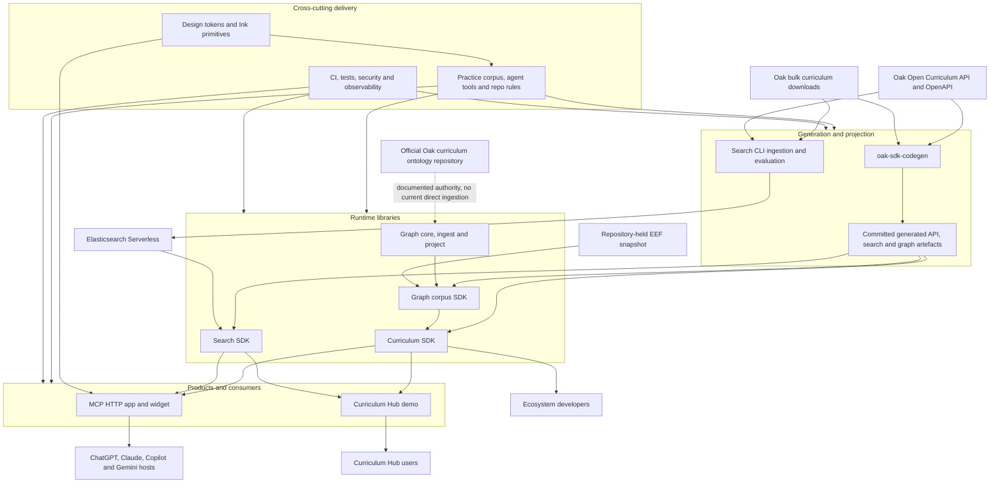
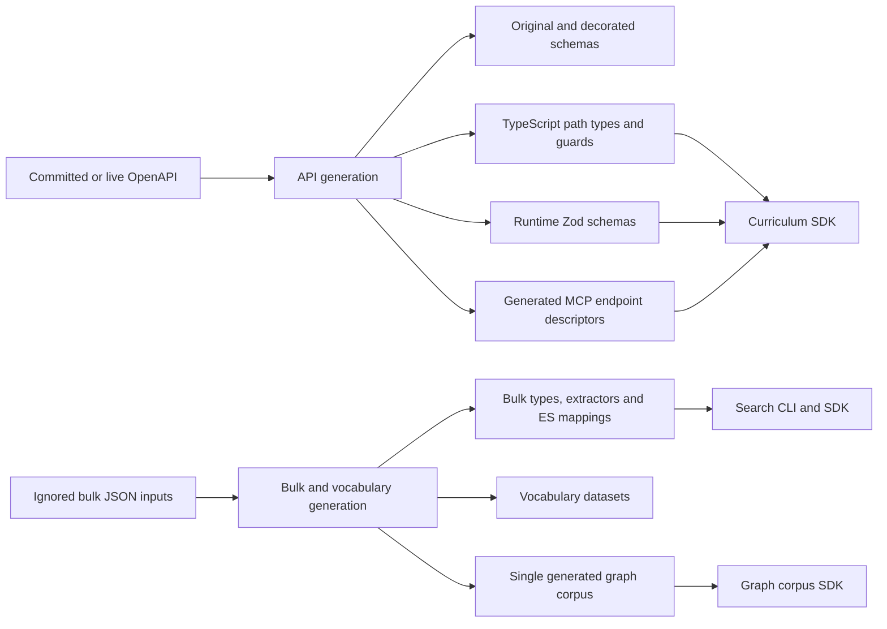
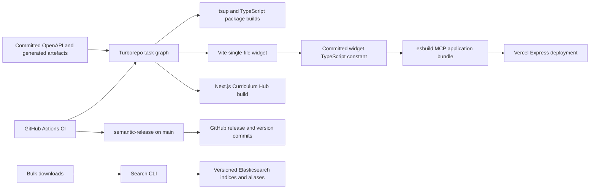

# OCE current-state system map

## Scope and evidence

This map describes the Oak Open Curriculum Ecosystem (OCE) at commit
[`bd878a3a550c8e5e5d21163a6d0962cebdaf43fa`](https://github.com/oaknational/oak-open-curriculum-ecosystem/tree/bd878a3a550c8e5e5d21163a6d0962cebdaf43fa).
It is a structural baseline for the investigation defined by the
[research charter](../research-charter.md), not a proposed Innovation Kit
architecture.

The labels have strict meanings:

- **Observed** means the claim is directly evidenced by source, configuration,
  generated data or repository structure at the pinned commit.
- **Inferred** means the claim is the least-assumptive architectural
  interpretation of several observations.
- **Repository claim** means OCE documentation asserts something about intent or
  deployed state that this source-only investigation has not independently
  verified.
- **Unknown** means the repository does not supply enough evidence.
- **Candidate explanation** means an investigation input, not a registered
  architecture hypothesis or conclusion.
- **Invalidator** means evidence that would refute or materially change its
  associated candidate explanation.

**Observed:** OCE contains 8,178 tracked files, 26 resolved pnpm workspaces, 203
numbered architecture decision records and 850 tracked test/spec files at this
snapshot. Those measurements describe scale, not quality. The workspace count
resolves the 24 declared patterns against tracked package manifests; the
workspace manifest remains authoritative for membership
([workspace manifest](https://github.com/oaknational/oak-open-curriculum-ecosystem/blob/bd878a3a550c8e5e5d21163a6d0962cebdaf43fa/pnpm-workspace.yaml#L1-L27)).

**Repository claim:** the README describes the MCP server as an invite-only alpha
at `curriculum-mcp-alpha.oaknational.dev`
([README](https://github.com/oaknational/oak-open-curriculum-ecosystem/blob/bd878a3a550c8e5e5d21163a6d0962cebdaf43fa/README.md#L27-L40)).
**Unknown:** the live deployment, traffic, users, reliability and current
configuration have not been verified.

### Historical inventory method

The retired [OCE inventory](../../evidence-harness-provenance.md#oce-inventory)
asserted OCE's root package identity, recorded the Git revision and clean state,
used `git ls-files` as its population, resolved workspace patterns, parsed the
tracked working-tree graph and Hub JSON payloads (revision-exact only when the
worktree was clean, per the limit below), derived tracked Hub page routes,
measured tracked generated files and reconciled the rules index with canonical
rule files.

**Limit:** it reads current working-tree bytes. The measurements are exact for
the recorded revision only when the emitted `input.clean` is `true`. It does
not fetch upstream sources, run code generation or application schemas, prove
that ignored bulk inputs reproduce committed outputs, measure compressed or
browser payloads, inspect deployed/runtime state, or provide user and impact
evidence.

## System context

**Inferred:** OCE is not one framework. It is a monorepo containing curriculum
contract generation, runtime SDKs, search operations, graph projections, an MCP
product, a worked web consumer, design foundations and an extensive agentic
engineering operating system. Their co-location and shared checks make them one
delivery estate; it does not establish that their present package boundaries are
the necessary boundaries of an Innovation Kit.

## Repository anatomy

| Area                                       | Observed current responsibility                                                                                                                                             | Current boundary evidence                                                                                                                                                                                                                                                                                                                                                                                                                     |
| ------------------------------------------ | --------------------------------------------------------------------------------------------------------------------------------------------------------------------------- | --------------------------------------------------------------------------------------------------------------------------------------------------------------------------------------------------------------------------------------------------------------------------------------------------------------------------------------------------------------------------------------------------------------------------------------------- |
| `agent-tools/`                             | Executable collaboration, validation, review, context, repository and Practice tooling.                                                                                     | It is a workspace in its own right and is invoked throughout root scripts ([workspace](https://github.com/oaknational/oak-open-curriculum-ecosystem/blob/bd878a3a550c8e5e5d21163a6d0962cebdaf43fa/pnpm-workspace.yaml#L1-L3), [scripts](https://github.com/oaknational/oak-open-curriculum-ecosystem/blob/bd878a3a550c8e5e5d21163a6d0962cebdaf43fa/package.json#L49-L105)).                                                                   |
| `apps/`                                    | The deployable MCP HTTP app and the operator-facing search CLI.                                                                                                             | Both are workspace members; search is not a standalone HTTP service in this repository ([workspace](https://github.com/oaknational/oak-open-curriculum-ecosystem/blob/bd878a3a550c8e5e5d21163a6d0962cebdaf43fa/pnpm-workspace.yaml#L3-L4)).                                                                                                                                                                                                   |
| `demos/`                                   | Curriculum Hub, a private Next.js worked consumer over search, curriculum data and locally generated learning content.                                                      | It is explicitly a demo-tier workspace at full repository standards ([Hub README](https://github.com/oaknational/oak-open-curriculum-ecosystem/blob/bd878a3a550c8e5e5d21163a6d0962cebdaf43fa/demos/oak-curriculum-hub/README.md#L1-L23)).                                                                                                                                                                                                     |
| `packages/core/`                           | Low-dependency primitives: Result, environment contracts, graph primitives, observability, type helpers, safe paths, build metadata, lint rules and an OpenAPI/Zod adapter. | The package tier is explicit in the workspace manifest and dependency rules ([workspace](https://github.com/oaknational/oak-open-curriculum-ecosystem/blob/bd878a3a550c8e5e5d21163a6d0962cebdaf43fa/pnpm-workspace.yaml#L8-L16), [dependency rules](https://github.com/oaknational/oak-open-curriculum-ecosystem/blob/bd878a3a550c8e5e5d21163a6d0962cebdaf43fa/.dependency-cruiser.mjs)).                                                     |
| `packages/libs/`                           | Foundation and adapter mechanisms for environment resolution, logging, Sentry, graph ingestion/projection and search contracts.                                             | Six explicit workspaces sit between core and SDK/application consumers ([workspace](https://github.com/oaknational/oak-open-curriculum-ecosystem/blob/bd878a3a550c8e5e5d21163a6d0962cebdaf43fa/pnpm-workspace.yaml#L18-L23)).                                                                                                                                                                                                                 |
| `packages/sdks/`                           | Generated curriculum client surface, search capabilities, graph corpus views and the code-generation workspace.                                                             | Four SDK workspaces are declared, although only the curriculum SDK manifest is non-private ([workspace](https://github.com/oaknational/oak-open-curriculum-ecosystem/blob/bd878a3a550c8e5e5d21163a6d0962cebdaf43fa/pnpm-workspace.yaml#L24-L27), [curriculum SDK manifest](https://github.com/oaknational/oak-open-curriculum-ecosystem/blob/bd878a3a550c8e5e5d21163a6d0962cebdaf43fa/packages/sdks/oak-curriculum-sdk/package.json#L1-L19)). |
| `packages/design/`                         | Generic DTCG token tooling, Oak token values and Ink terminal primitives.                                                                                                   | The three packages deliberately separate mechanism, Oak values and terminal components ([design packages](https://github.com/oaknational/oak-open-curriculum-ecosystem/blob/bd878a3a550c8e5e5d21163a6d0962cebdaf43fa/packages/design/README.md#L1-L9)).                                                                                                                                                                                       |
| `.agent/`, adapter directories and `docs/` | Strategy, decisions, directives, rules, plans, skills, memory, reports and platform-specific projections of the Practice.                                                   | The repository describes these as part of an executable agentic engineering system, not incidental notes ([system description](https://github.com/oaknational/oak-open-curriculum-ecosystem/blob/bd878a3a550c8e5e5d21163a6d0962cebdaf43fa/docs/foundation/agentic-engineering-system.md)).                                                                                                                                                    |

**Observed:** the root is Node 24, pnpm, ESM, TypeScript 6 and Turborepo. The
canonical `check` script composes generation, build, type checking, lint, unit,
widget, browser, UI and accessibility tests plus repository, dependency, format,
encoding, portability and Practice validators
([root manifest](https://github.com/oaknational/oak-open-curriculum-ecosystem/blob/bd878a3a550c8e5e5d21163a6d0962cebdaf43fa/package.json#L30-L116)).

**Inferred:** architecture policy is represented twice: as explanatory records
and as executable constraints. The latter includes package dependency rules,
custom ESLint rules, generators, repository validators, hooks and CI.

## Curriculum authority and generated model

This OCE-local map is complemented by the pinned
[Database-Tools to oak-openapi authority-chain deconstruction](./database-tools/README.md),
which traces the upstream projections, public contract, policy and bulk paths
that OCE consumes. The chain's
[multi-lens synthesis](./database-tools/concept-lenses/synthesis.md) is related
back to the OWA/Components corpus in the
[combined canonical basis](../synthesis/meta-analysis.md#databaseapioce-kernel-reconciliation).
The links establish reciprocal evidence navigation; they do not make the
upstream repositories part of OCE's target architecture.

### Authority is deliberately plural

| Concern                                                  | Recorded authority                                            | Executable state at the snapshot                                                                                                                                                                                                                                                                                                                                                                                                                                                                         |
| -------------------------------------------------------- | ------------------------------------------------------------- | -------------------------------------------------------------------------------------------------------------------------------------------------------------------------------------------------------------------------------------------------------------------------------------------------------------------------------------------------------------------------------------------------------------------------------------------------------------------------------------------------------- |
| API requests, responses and generated MCP endpoint tools | Open Curriculum OpenAPI document                              | Cached OpenAPI is validated and generates SDK schema, types, path metadata, Zod validators and tool descriptors ([code generator](https://github.com/oaknational/oak-open-curriculum-ecosystem/blob/bd878a3a550c8e5e5d21163a6d0962cebdaf43fa/packages/sdks/oak-sdk-codegen/code-generation/codegen.ts#L3-L25)).                                                                                                                                                                                          |
| Search documents and curriculum graph facts              | Bulk curriculum download                                      | Bulk JSON drives search transformations and generated graph/vocabulary artefacts; ignored bulk inputs are not committed with those outputs ([pipeline boundary](https://github.com/oaknational/oak-open-curriculum-ecosystem/blob/bd878a3a550c8e5e5d21163a6d0962cebdaf43fa/packages/sdks/oak-sdk-codegen/src/index.ts#L1-L30), [bulk ignore](https://github.com/oaknational/oak-open-curriculum-ecosystem/blob/bd878a3a550c8e5e5d21163a6d0962cebdaf43fa/apps/oak-search-cli/bulk-downloads/.gitignore)). |
| Ontology terms, classes and predicates                   | `oaknational/oak-curriculum-ontology`                         | ADR-173 names the external repository as source of truth and describes pinned ingestion, but the accepted target topology is ahead of the currently present workspaces ([authority decision](https://github.com/oaknational/oak-open-curriculum-ecosystem/blob/bd878a3a550c8e5e5d21163a6d0962cebdaf43fa/docs/architecture/architectural-decisions/173-graph-stack-topology.md#L307-L334)).                                                                                                               |
| EEF evidence content                                     | Repository-held snapshot pending an upstream refresh contract | `graph-corpus-sdk` contains the snapshot and typed domain views ([EEF package source](https://github.com/oaknational/oak-open-curriculum-ecosystem/tree/bd878a3a550c8e5e5d21163a6d0962cebdaf43fa/packages/sdks/graph-corpus-sdk/src/eef-strands)).                                                                                                                                                                                                                                                       |
| Agent-facing “curriculum model” orientation              | A composition of generated and authored material              | Subject and key-stage slugs are generated; names, coverage, age ranges, exam boards, tiers and pathways include authored metadata ([ontology data](https://github.com/oaknational/oak-open-curriculum-ecosystem/blob/bd878a3a550c8e5e5d21163a6d0962cebdaf43fa/packages/sdks/oak-curriculum-sdk/src/mcp/ontology-data.ts#L1-L40)).                                                                                                                                                                        |

**Observed:** `ontology-data.ts` explicitly says it is a simple public-API
ontology, not Oak's complete official ontology
([source](https://github.com/oaknational/oak-open-curriculum-ecosystem/blob/bd878a3a550c8e5e5d21163a6d0962cebdaf43fa/packages/sdks/oak-curriculum-sdk/src/mcp/ontology-data.ts#L1-L18)).
The label “curriculum model” therefore names an agent-orientation projection, not
a single canonical curriculum ontology.

### Generation topology

**Observed:** code generation defaults to the committed OpenAPI cache. Live
fetching requires `--online`, `SDK_CODEGEN_MODE=online` or a Vercel build,
making ordinary local/CI generation hermetic while keeping an explicit refresh
path
([schema source](https://github.com/oaknational/oak-open-curriculum-ecosystem/blob/bd878a3a550c8e5e5d21163a6d0962cebdaf43fa/packages/sdks/oak-sdk-codegen/code-generation/resolve-schema-source.ts#L1-L40)).

**Observed:** the codegen workspace describes two pipelines: OpenAPI to
TypeScript/Zod/MCP descriptors, and bulk files to search mappings, graph and
vocabulary outputs. It exposes generated domains through named subpaths rather
than requiring consumers to reach into generated directories
([codegen package surface](https://github.com/oaknational/oak-open-curriculum-ecosystem/blob/bd878a3a550c8e5e5d21163a6d0962cebdaf43fa/packages/sdks/oak-sdk-codegen/src/index.ts#L1-L30)).

**Observed:** the committed generated vocabulary directory contains 11 tracked
files totalling 32,993,217 uncompressed working-tree bytes (31.465 MiB). Its
single graph corpus contains 40,016 nodes and 74,724 edges, and its metadata
reports 16 `subjectsCovered` entries, with a generated timestamp of 2026-06-11
([generated corpus](https://github.com/oaknational/oak-open-curriculum-ecosystem/blob/bd878a3a550c8e5e5d21163a6d0962cebdaf43fa/packages/sdks/oak-sdk-codegen/src/generated/vocab/graph-corpus/data.json)).
The nodes themselves contain 20 distinct `subject` strings because biology,
chemistry, combined science and physics appear alongside science. The inventory
keeps the metadata claim and the independently counted node values separate.
The graph subpath deliberately presents that corpus as one identity space
([graph-corpus export](https://github.com/oaknational/oak-open-curriculum-ecosystem/blob/bd878a3a550c8e5e5d21163a6d0962cebdaf43fa/packages/sdks/oak-sdk-codegen/src/graph-corpus.ts#L1-L46)).

**Inferred:** a checkout can build against committed derived artefacts without
possessing the bulk source files, but cannot independently regenerate those
artefacts until the ignored upstream bulk inputs are acquired. Reproducibility
of a normal build and reproducibility of the derivation are different contracts.

## SDK surfaces

### Curriculum SDK

**Observed:** `@oaknational/curriculum-sdk` exports generated API clients and
types, path constants and guards, runtime validation, URL helpers and structured
error types
([public barrel](https://github.com/oaknational/oak-open-curriculum-ecosystem/blob/bd878a3a550c8e5e5d21163a6d0962cebdaf43fa/packages/sdks/oak-curriculum-sdk/src/index.ts)).
Its base client uses `openapi-fetch`, accepts API key and logger dependencies,
and layers retry, rate-limit tracking and response augmentation without reading
application environment itself
([base client](https://github.com/oaknational/oak-open-curriculum-ecosystem/blob/bd878a3a550c8e5e5d21163a6d0962cebdaf43fa/packages/sdks/oak-curriculum-sdk/src/client/oak-base-client.ts)).

**Observed:** the same SDK also contains substantial MCP-shaped product logic:
universal tool definitions and execution, agent guidance, prompts, resource
content, search interfaces, graph result formatting and curriculum-model
orientation
([MCP source tree](https://github.com/oaknational/oak-open-curriculum-ecosystem/tree/bd878a3a550c8e5e5d21163a6d0962cebdaf43fa/packages/sdks/oak-curriculum-sdk/src/mcp)).

**Inferred:** the current curriculum SDK boundary combines a general API client,
Oak curriculum domain projections and reusable MCP product behavior. “SDK” does
not mean only a transport-neutral API client in this repository.

### Search SDK and search CLI

**Observed:** the search SDK is a dependency-injected Elasticsearch capability
library. Consumers supply client, configuration and optional logger; it does not
read `process.env`
([SDK barrel](https://github.com/oaknational/oak-open-curriculum-ecosystem/blob/bd878a3a550c8e5e5d21163a6d0962cebdaf43fa/packages/sdks/oak-search-sdk/src/index.ts#L1-L30)).
Its `/read` surface excludes index lifecycle and administration, while
`/admin` contains privileged lifecycle and write operations
([read surface](https://github.com/oaknational/oak-open-curriculum-ecosystem/blob/bd878a3a550c8e5e5d21163a6d0962cebdaf43fa/packages/sdks/oak-search-sdk/src/read.ts#L1-L15),
[admin surface](https://github.com/oaknational/oak-open-curriculum-ecosystem/blob/bd878a3a550c8e5e5d21163a6d0962cebdaf43fa/packages/sdks/oak-search-sdk/src/admin.ts#L1-L28)).

**Observed:** the search CLI owns acquisition/transformation, ingestion
orchestration, administration, diagnostics, evaluation and ground truths; the SDK
owns reusable retrieval, observability and index-lifecycle capabilities. This
boundary is explicitly recorded in ADRs 134 and 140
([capability ADR](https://github.com/oaknational/oak-open-curriculum-ecosystem/blob/bd878a3a550c8e5e5d21163a6d0962cebdaf43fa/docs/architecture/architectural-decisions/134-search-sdk-capability-surface-boundary.md),
[ingestion ADR](https://github.com/oaknational/oak-open-curriculum-ecosystem/blob/bd878a3a550c8e5e5d21163a6d0962cebdaf43fa/docs/architecture/architectural-decisions/140-search-ingestion-sdk-boundary.md)).

**Observed:** current teacher-oriented retrieval uses Elasticsearch Serverless,
BM25 and ELSER. Lessons and units use four-way reciprocal-rank fusion across
content and structure; threads use two-way fusion; sequences are lexical only.
Seven indices hold lessons, unit rollups, units, threads, sequences, sequence
facets and metadata
([search README](https://github.com/oaknational/oak-open-curriculum-ecosystem/blob/bd878a3a550c8e5e5d21163a6d0962cebdaf43fa/apps/oak-search-cli/README.md#L40-L53),
[retrieval and indices](https://github.com/oaknational/oak-open-curriculum-ecosystem/blob/bd878a3a550c8e5e5d21163a6d0962cebdaf43fa/apps/oak-search-cli/README.md#L91-L134)).

**Observed:** ingestion is bulk-first but supplements fields from the live API;
the CLI prepares and uploads to versioned indices while the SDK performs
promotion, rollback and lifecycle operations
([supplementation adapter](https://github.com/oaknational/oak-open-curriculum-ecosystem/blob/bd878a3a550c8e5e5d21163a6d0962cebdaf43fa/apps/oak-search-cli/src/adapters/api-supplementation.ts),
[versioned ingest](https://github.com/oaknational/oak-open-curriculum-ecosystem/blob/bd878a3a550c8e5e5d21163a6d0962cebdaf43fa/apps/oak-search-cli/src/lib/indexing/run-versioned-ingest.ts#L1-L20)).

**Inferred:** Elasticsearch indices are disposable projections of curriculum
sources, not an additional curriculum authority. Their distinct document shapes
encode retrieval needs and gaps between bulk and API data.

### Graph stack

**Observed:** the executable graph stack currently has four workspaces:

- `graph-core`: RDF/JS-aligned terms, datasets, vocabulary, graph views,
  JSON-LD processing and canonicalisation
  ([source](https://github.com/oaknational/oak-open-curriculum-ecosystem/tree/bd878a3a550c8e5e5d21163a6d0962cebdaf43fa/packages/core/graph-core/src)).
- `graph-ingest`: transport-neutral ingestion from Turtle, JSON-LD, node/edge
  records, source paths, trees and custom mappings
  ([source](https://github.com/oaknational/oak-open-curriculum-ecosystem/tree/bd878a3a550c8e5e5d21163a6d0962cebdaf43fa/packages/libs/graph-ingest/src)).
- `graph-project`: property-graph conversion and adjacency projections
  ([source](https://github.com/oaknational/oak-open-curriculum-ecosystem/tree/bd878a3a550c8e5e5d21163a6d0962cebdaf43fa/packages/libs/graph-project/src)).
- `graph-corpus-sdk`: stable curriculum views for prior knowledge, thread
  progression, misconceptions and keywords, plus EEF strand views
  ([source](https://github.com/oaknational/oak-open-curriculum-ecosystem/tree/bd878a3a550c8e5e5d21163a6d0962cebdaf43fa/packages/sdks/graph-corpus-sdk/src)).

**Observed:** ADR-173 records a larger accepted topology, including enhancement,
validation, agent/Practice graphs and a deferred future adapter. Those workspaces
are not all present at the snapshot
([decision](https://github.com/oaknational/oak-open-curriculum-ecosystem/blob/bd878a3a550c8e5e5d21163a6d0962cebdaf43fa/docs/architecture/architectural-decisions/173-graph-stack-topology.md)).

**Observed:** the graph substrate intentionally has no MCP, HTTP or CLI transport;
transport products select and expose bounded views
([ADR-179](https://github.com/oaknational/oak-open-curriculum-ecosystem/blob/bd878a3a550c8e5e5d21163a6d0962cebdaf43fa/docs/architecture/architectural-decisions/179-transport-agnostic-graph-substrate.md)).

**Inferred:** accepted architecture, generated corpus and implemented graph
workspaces are three different maturity states. A system map that treats the ADR
topology as deployed code would be inaccurate.

## Products and consumers

### MCP HTTP app

**Observed:** the deployable app is an Express 5 server targeting Vercel. Startup
loads and validates configuration, initializes observability and composes the
application with the generated widget
([entry point](https://github.com/oaknational/oak-open-curriculum-ecosystem/blob/bd878a3a550c8e5e5d21163a6d0962cebdaf43fa/apps/oak-curriculum-mcp-streamable-http/src/index.ts)).
The composition root installs base middleware, security, OAuth/caching/auth,
application routes, static and MCP endpoints, diagnostics and error handling in
an explicit order
([application](https://github.com/oaknational/oak-open-curriculum-ecosystem/blob/bd878a3a550c8e5e5d21163a6d0962cebdaf43fa/apps/oak-curriculum-mcp-streamable-http/src/application.ts)).

**Observed:** each MCP request creates a fresh `McpServer` and stateless
`StreamableHTTPServerTransport`, attaches authentication context, handles the
request and cleans up
([handler](https://github.com/oaknational/oak-open-curriculum-ecosystem/blob/bd878a3a550c8e5e5d21163a6d0962cebdaf43fa/apps/oak-curriculum-mcp-streamable-http/src/mcp-handler.ts)).

**Observed:** its capability surface combines:

- generated one-to-one OpenAPI endpoint tools;
- authored aggregate search, fetch, browse, explore and asset tools;
- curriculum-model, thread, prior-knowledge, misconception and keyword views;
- EEF evidence and user-search tools;
- documentation, curriculum model and EEF interpretation resources;
- prompts for finding, planning, adapting, mapping and progressing learning;
- an interactive MCP App widget.

The authored universal tool registry is visible in the SDK
([definitions](https://github.com/oaknational/oak-open-curriculum-ecosystem/blob/bd878a3a550c8e5e5d21163a6d0962cebdaf43fa/packages/sdks/oak-curriculum-sdk/src/mcp/universal-tools/definitions.ts));
resources and prompts are separately registered in the app
([resource registration](https://github.com/oaknational/oak-open-curriculum-ecosystem/blob/bd878a3a550c8e5e5d21163a6d0962cebdaf43fa/apps/oak-curriculum-mcp-streamable-http/src/register-resources.ts),
[prompt registration](https://github.com/oaknational/oak-open-curriculum-ecosystem/blob/bd878a3a550c8e5e5d21163a6d0962cebdaf43fa/apps/oak-curriculum-mcp-streamable-http/src/register-prompts.ts)).

**Observed:** graph capability is exposed through bounded tool queries, not by
shipping the whole corpus to a host. Curriculum assets are proxied through a
signed server route and the Oak API rather than exposing the server API key or
assuming raw CDN access
([asset proxy](https://github.com/oaknational/oak-open-curriculum-ecosystem/blob/bd878a3a550c8e5e5d21163a6d0962cebdaf43fa/apps/oak-curriculum-mcp-streamable-http/src/asset-download/asset-proxy.ts)).

**Inferred:** the MCP app itself is predominantly composition and transport, but
that thinness depends on the curriculum SDK owning a large amount of MCP-specific
orchestration and agent experience.

### Curriculum Hub

**Observed:** Curriculum Hub is a private Next.js 16/React 19 demo and the
strategy's first worked Innovation Kit instance
([strategy](https://github.com/oaknational/oak-open-curriculum-ecosystem/blob/bd878a3a550c8e5e5d21163a6d0962cebdaf43fa/docs/strategy/README.md#L47-L60),
[manifest](https://github.com/oaknational/oak-open-curriculum-ecosystem/blob/bd878a3a550c8e5e5d21163a6d0962cebdaf43fa/demos/oak-curriculum-hub/package.json#L1-L34)).
It reproduces a Claude Design export and records every visual divergence in a
disposition register; the canonical vendor export and generated visual evidence
are deliberately untracked
([Hub structure](https://github.com/oaknational/oak-open-curriculum-ecosystem/blob/bd878a3a550c8e5e5d21163a6d0962cebdaf43fa/demos/oak-curriculum-hub/README.md#L15-L23)).

**Observed:** the Hub has two server-only live data planes: an internal search
route over `oak-search-sdk/read`, and direct server-side curriculum SDK access
for lesson content. It also serves committed course and quality-standards JSON
generated from the untracked design export and validates that data with Zod both
when generated and when loaded
([data planes](https://github.com/oaknational/oak-open-curriculum-ecosystem/blob/bd878a3a550c8e5e5d21163a6d0962cebdaf43fa/demos/oak-curriculum-hub/README.md#L56-L92)).

**Observed:** its tracked App Router pages are `/`, `/course`, `/curriculum`,
`/exemplars`, `/lesson/[slug]`, `/rubrics`, `/standards` and `/wiki`.
The committed course payload contains 214 blocks and the quality-standards
payload contains 685 entries. These provide integration and build evidence across
a broader surface than a minimal SDK demonstration; without user evidence they
do not establish consumer or product impact.

**Unknown:** no Hub deployment configuration was found in the repository.
Its users, research outcomes, accessibility evidence in deployed browsers and
status as an operated product are not established by source.

## Design tokens and UI

**Observed:** OCE's design estate currently consists of:

- generic DTCG parsing, tier enforcement, CSS emission and WCAG contrast
  validation in `design-tokens-core`;
- Oak palette, light/dark semantics, component tokens, generated CSS and terminal
  theme in `oak-design-tokens`;
- Oak-themed React/Ink terminal primitives in `oak-design-ink`.

ADR-148 defines palette to semantic to component reference direction, CSS custom
properties as the primary output and WCAG 2.2 AA contrast as a build gate
([ADR-148](https://github.com/oaknational/oak-open-curriculum-ecosystem/blob/bd878a3a550c8e5e5d21163a6d0962cebdaf43fa/docs/architecture/architectural-decisions/148-design-token-architecture.md#L29-L108)).

**Observed:** ADR-148 treats Oak Components as a reference for values only and
prohibits runtime coupling
([relationship](https://github.com/oaknational/oak-open-curriculum-ecosystem/blob/bd878a3a550c8e5e5d21163a6d0962cebdaf43fa/docs/architecture/architectural-decisions/148-design-token-architecture.md#L110-L116)).
OCE therefore has a token foundation and a small MCP widget surface, not a web
component library equivalent to Oak Components.

**Observed:** the MCP widget imports generated token CSS and is bundled by Vite
as single-file HTML, which is then embedded in a generated TypeScript module.
The measured module file is 567,901 bytes (554.591 KiB, approximately 568 kB
decimal) at this snapshot; that is not a measurement of the HTML string alone
([widget source](https://github.com/oaknational/oak-open-curriculum-ecosystem/tree/bd878a3a550c8e5e5d21163a6d0962cebdaf43fa/apps/oak-curriculum-mcp-streamable-http/widget),
[generated module](https://github.com/oaknational/oak-open-curriculum-ecosystem/blob/bd878a3a550c8e5e5d21163a6d0962cebdaf43fa/apps/oak-curriculum-mcp-streamable-http/src/generated/widget-html-content.ts)).

**Observed:** widget metadata permits Google Fonts domains for a Lexend import.
“Single-file” and “self-contained” therefore describe bundled code and CSS, not
the absence of all runtime resource requests
([resource metadata](https://github.com/oaknational/oak-open-curriculum-ecosystem/blob/bd878a3a550c8e5e5d21163a6d0962cebdaf43fa/apps/oak-curriculum-mcp-streamable-http/src/register-widget-resource.ts#L19-L40)).

**Observed:** Curriculum Hub does not depend on `oak-design-tokens`; it declares
Tailwind and carries its own global theme values
([Hub manifest](https://github.com/oaknational/oak-open-curriculum-ecosystem/blob/bd878a3a550c8e5e5d21163a6d0962cebdaf43fa/demos/oak-curriculum-hub/package.json#L25-L56),
[Hub CSS](https://github.com/oaknational/oak-open-curriculum-ecosystem/blob/bd878a3a550c8e5e5d21163a6d0962cebdaf43fa/demos/oak-curriculum-hub/app/globals.css)).

**Inferred:** OCE currently has at least two web delivery paths for Oak visual
semantics: the shared token package used by the widget and a design-export-derived
Tailwind surface in the Hub. The repository does not yet demonstrate one
authoritative UI system generating both.

## Result and error model

**Observed:** `@oaknational/result` is a small discriminated union with
`ok`/`err` constructors, guards, mapping/flat-mapping, unwrapping helpers and
a non-throwing exhaustiveness helper
([implementation](https://github.com/oaknational/oak-open-curriculum-ecosystem/blob/bd878a3a550c8e5e5d21163a6d0962cebdaf43fa/packages/core/result/src/index.ts)).

**Observed:** ADR-088 directs expected failures, decision-bearing failures and
boundary crossings to `Result`; programming errors, unrecoverable startup state
and vendor exceptions remain exceptions, with vendor throws converted at the
boundary
([decision](https://github.com/oaknational/oak-open-curriculum-ecosystem/blob/bd878a3a550c8e5e5d21163a6d0962cebdaf43fa/docs/architecture/architectural-decisions/088-result-pattern-for-error-handling.md#L65-L120)).
Custom lint rules reinforce that doctrine
([ESLint package](https://github.com/oaknational/oak-open-curriculum-ecosystem/tree/bd878a3a550c8e5e5d21163a6d0962cebdaf43fa/packages/core/oak-eslint)).

**Observed:** search retrieval/admin, graph operations, configuration/startup and
observability expose typed error unions and Results extensively. Intentional
throws remain at invariant and startup boundaries, so “no exceptions anywhere”
would not describe the code.

**Inferred:** Result is both a shared data type and a repository-wide control-flow
policy. Its value and cost need evaluation at those two levels separately.

## Practice and architecture rules

**Observed:** OCE describes its development system as agent-first: humans provide
direction, design and feedback while agents implement; the Practice combines
philosophy, structure, tooling and recurring capture/refine/enforce/work loops
([system description](https://github.com/oaknational/oak-open-curriculum-ecosystem/blob/bd878a3a550c8e5e5d21163a6d0962cebdaf43fa/docs/foundation/agentic-engineering-system.md)).
Platform adapters project this corpus into Claude, Cursor, Codex, Gemini and
cross-agent surfaces.

**Observed:** the canonical rules index contains 107 entries: 90 always-on and 17
trigger-loaded. They exactly match the 107 top-level tracked canonical rule files
at this snapshot and cover validation, accessibility, security, boundaries,
testing, collaboration, evidence and continuity
([rules index](https://github.com/oaknational/oak-open-curriculum-ecosystem/blob/bd878a3a550c8e5e5d21163a6d0962cebdaf43fa/RULES_INDEX.md)).
The root scripts execute many of those policies through `agent-tools`, making
Practice part of the build and contribution architecture.

**Observed:** dependency-cruiser prohibits cycles and orphans, enforces tier
direction, protects the graph corpus from reverse dependencies and prevents
runtime imports from `.agent`
([dependency rules](https://github.com/oaknational/oak-open-curriculum-ecosystem/blob/bd878a3a550c8e5e5d21163a6d0962cebdaf43fa/.dependency-cruiser.mjs)).
Custom ESLint configurations prohibit skipped/focused tests and type shortcuts
and enforce project-specific boundary, Result, observability and I/O rules.

**Observed current doctrine:** ADR-154 requires framework and Oak consumer
specificity layers to be visible as separate workspaces, uses “could a non-Oak
consumer use this unchanged?” as its test, and says single-consumer mechanisms
can stay inline until a second consumer or classification tension appears
([decision](https://github.com/oaknational/oak-open-curriculum-ecosystem/blob/bd878a3a550c8e5e5d21163a6d0962cebdaf43fa/docs/architecture/architectural-decisions/154-separate-framework-from-consumer.md#L50-L104),
[trade-off](https://github.com/oaknational/oak-open-curriculum-ecosystem/blob/bd878a3a550c8e5e5d21163a6d0962cebdaf43fa/docs/architecture/architectural-decisions/154-separate-framework-from-consumer.md#L141-L149)).

**Research constraint:** that second-consumer trigger is not an Innovation Kit
requirement. The Kit is intentionally a framework for enabling additional
consumers; whether something belongs in it must be decided from semantic
authority, invariants, lifecycle, product outcomes and engineering excellence,
not deferred until another consumer already exists. This records the
investigation's governing correction without rewriting OCE's current doctrine.

## Assurance, security and observability

### Assurance

**Observed:** the GitHub Actions pipeline separates secret scanning, installation,
static checks, build/schema drift, unit tests, dependency analysis and browser
tests, then uses a fail-closed aggregator
([CI workflow](https://github.com/oaknational/oak-open-curriculum-ecosystem/blob/bd878a3a550c8e5e5d21163a6d0962cebdaf43fa/.github/workflows/ci.yml)).
Tests install a no-network guard by default
([test setup](https://github.com/oaknational/oak-open-curriculum-ecosystem/blob/bd878a3a550c8e5e5d21163a6d0962cebdaf43fa/test.setup.no-network.ts)).

**Observed:** browser/UI/accessibility tasks are first-class Turbo tasks for the
MCP app and widget. Curriculum Hub has component-level `jest-axe` tests, but no
Hub Playwright configuration was found. The two web surfaces therefore have
different current assurance depth.

**Observed:** GitHub Actions are pinned by commit SHA; pnpm imposes a 24-hour
minimum package age for new resolution, explicitly allows lifecycle builds and
sets security-version overrides
([workspace security configuration](https://github.com/oaknational/oak-open-curriculum-ecosystem/blob/bd878a3a550c8e5e5d21163a6d0962cebdaf43fa/pnpm-workspace.yaml#L29-L85)).
Dependency review exists as a separate advisory workflow
([workflow](https://github.com/oaknational/oak-open-curriculum-ecosystem/blob/bd878a3a550c8e5e5d21163a6d0962cebdaf43fa/.github/workflows/dependency-review.yml)).

**Unknown:** Sonar badges and configuration are present, but this source snapshot
does not prove branch protection, required status checks or the applied quality
gate.

### Security

**Observed:** the MCP application composes Helmet security headers, host
validation, OAuth 2.1/Clerk authentication, route-specific rate limits and
selective public resources
([security headers](https://github.com/oaknational/oak-open-curriculum-ecosystem/blob/bd878a3a550c8e5e5d21163a6d0962cebdaf43fa/apps/oak-curriculum-mcp-streamable-http/src/security-headers.ts),
[application composition](https://github.com/oaknational/oak-open-curriculum-ecosystem/blob/bd878a3a550c8e5e5d21163a6d0962cebdaf43fa/apps/oak-curriculum-mcp-streamable-http/src/application.ts)).
It uses permissive CORS because authorization is bearer-token based rather than
cookie based.

**Observed:** serverless application rate limits use instance-local memory and are
therefore probabilistic; OCE's security decision treats edge controls as the
authoritative distributed layer
([ADR-158](https://github.com/oaknational/oak-open-curriculum-ecosystem/blob/bd878a3a550c8e5e5d21163a6d0962cebdaf43fa/docs/architecture/architectural-decisions/158-multi-layer-security-and-rate-limiting.md)).

**Observed:** shared redaction removes credentials, tokens, OAuth material,
query/form secrets and partial IP information before logging or Sentry egress
([redaction](https://github.com/oaknational/oak-open-curriculum-ecosystem/blob/bd878a3a550c8e5e5d21163a6d0962cebdaf43fa/packages/core/observability/src/redaction.ts),
[Sentry barrier](https://github.com/oaknational/oak-open-curriculum-ecosystem/blob/bd878a3a550c8e5e5d21163a6d0962cebdaf43fa/packages/libs/sentry-node/src/runtime-redaction.ts)).

**Repository claim:** governance documents describe Cloudflare and Vercel as
defence layers. **Unknown:** applied Cloudflare rules, Vercel firewall state,
Clerk configuration and production secrets are outside the repository.

### Observability

**Observed:** OCE has a structured JSON logger, Sentry Node adapter, OpenTelemetry
span correlation and shared redaction. The MCP app records correlation IDs,
tool/resource/request spans, outbound byte size and estimated token size
([observability package](https://github.com/oaknational/oak-open-curriculum-ecosystem/tree/bd878a3a550c8e5e5d21163a6d0962cebdaf43fa/packages/core/observability),
[MCP handler](https://github.com/oaknational/oak-open-curriculum-ecosystem/blob/bd878a3a550c8e5e5d21163a6d0962cebdaf43fa/apps/oak-curriculum-mcp-streamable-http/src/mcp-handler.ts)).
Search also has a zero-hit persistence surface, so blanket documentation claims
of “no persistence” or “no tracking” should not be generalized across the estate
([read SDK note](https://github.com/oaknational/oak-open-curriculum-ecosystem/blob/bd878a3a550c8e5e5d21163a6d0962cebdaf43fa/packages/sdks/oak-search-sdk/src/read.ts#L1-L10)).

**Unknown:** applied Sentry configuration, log drains, retention, alert routing,
production traces and service-level objectives are not evidenced by source.

## Build, deployment and release topology

**Observed:** Turborepo coordinates generation and dependency-ordered builds.
The MCP widget is built before being embedded into the application bundle; the
app carries a Vercel Express configuration
([app package](https://github.com/oaknational/oak-open-curriculum-ecosystem/blob/bd878a3a550c8e5e5d21163a6d0962cebdaf43fa/apps/oak-curriculum-mcp-streamable-http/package.json),
[Vercel config](https://github.com/oaknational/oak-open-curriculum-ecosystem/blob/bd878a3a550c8e5e5d21163a6d0962cebdaf43fa/apps/oak-curriculum-mcp-streamable-http/vercel.json)).

**Observed:** Elasticsearch is populated and managed operationally through the
CLI and search SDK; this repository contains no standalone search HTTP
deployment. MCP and Curriculum Hub each link directly to the search SDK from
their server runtime.

**Observed contradiction:** the release configuration says it publishes the
curriculum SDK, while both npm plugin entries currently set
`npmPublish: false`
([release configuration](https://github.com/oaknational/oak-open-curriculum-ecosystem/blob/bd878a3a550c8e5e5d21163a6d0962cebdaf43fa/.releaserc.mjs#L1-L104)).
The SDK manifest is non-private but declares restricted access and includes both
`dist` and non-test `src`
([manifest](https://github.com/oaknational/oak-open-curriculum-ecosystem/blob/bd878a3a550c8e5e5d21163a6d0962cebdaf43fa/packages/sdks/oak-curriculum-sdk/package.json#L1-L15),
[publish configuration](https://github.com/oaknational/oak-open-curriculum-ecosystem/blob/bd878a3a550c8e5e5d21163a6d0962cebdaf43fa/packages/sdks/oak-curriculum-sdk/package.json#L123-L130)).

**Inferred:** current release automation creates versions, changelog/GitHub
release state and package version commits without publishing npm from this
configuration. **Unknown:** whether the package has been published by another
path, who consumes it outside the monorepo and what compatibility guarantees
those consumers rely on.

## Ownership boundaries

| Boundary                                                  | Current owner or responsibility                                  |
| --------------------------------------------------------- | ---------------------------------------------------------------- |
| Upstream API schema/content                               | Oak Open Curriculum API; consumed rather than authored here.     |
| Bulk curriculum source                                    | Upstream bulk export; transformed and projected here.            |
| Official curriculum ontology                              | Separate `oak-curriculum-ontology` repository, per ADR-173.      |
| Generated schema, graph and search artefacts              | `oak-sdk-codegen` generation plus committed outputs.             |
| Search retrieval and index lifecycle                      | Search SDK capability surface.                                   |
| Search acquisition, ingestion, evaluation and operations  | Search CLI.                                                      |
| MCP transport, auth and product composition               | MCP HTTP application.                                            |
| MCP domain/tool experience                                | Split between curriculum SDK and MCP application.                |
| Curriculum Hub product and export ingestion               | Demo workspace.                                                  |
| Generic token mechanism, Oak token values and terminal UI | Three design workspaces.                                         |
| Engineering doctrine and enforcement                      | Practice corpus, `agent-tools`, ESLint, dependency rules and CI. |

**Observed:** CODEOWNERS assigns the entire repository and its governance file to
one GitHub owner
([CODEOWNERS](https://github.com/oaknational/oak-open-curriculum-ecosystem/blob/bd878a3a550c8e5e5d21163a6d0962cebdaf43fa/.github/CODEOWNERS#L1-L5)).
ADRs and strategy distribute conceptual responsibility more finely, but path-level
review ownership does not.

**Unknown:** operational ownership, succession, on-call responsibility,
decision rights outside the named owner and knowledge concentration have not
been established.

## Strengths to preserve as outcomes

These are candidate preservation qualities. The objective is to retain the
quality or outcome when evidence confirms its value, not automatically to retain
the current package, vendor or mechanism.

1. **Observed:** authority and provenance are named rather than allowing generated
   projections to become accidental sources of truth.
2. **Inferred:** deriving types, validation, path metadata and endpoint tools from
   one schema reduces cross-artifact drift; the resulting coherence has not been
   independently measured.
3. **Inferred:** hermetic default generation and committed artefacts support a
   deterministic ordinary build. The ignored bulk-source derivation remains a
   separate, unproven reproducibility contract.
4. **Inferred:** runtime validation and typed failure contracts reduce malformed
   data crossing external boundaries; production failure reduction is unknown.
5. **Observed mechanism:** search has ground truths, evaluation tooling,
   field-integrity checks and blue/green promotion/rollback. **Unknown:** their
   effect on current production relevance and recovery outcomes.
6. **Observed:** graph capabilities are exposed as bounded domain views over a
   stable identity space and remain independent of product transport.
7. **Observed:** application composition roots inject clients, configuration,
   logging, auth, rate limiting and observability.
8. **Observed:** redaction, correlation and failure translation are architectural
   concerns, not deployment afterthoughts.
9. **Observed mechanism:** browser accessibility, security checks and
   supply-chain policy participate in the build. **Unknown:** applied gates and
   production outcomes are not established here.
10. **Observed:** the token model separates palette, semantic intent and component
    use, with contrast validation at generation time.
11. **Observed mechanism:** Curriculum Hub compiles SDK/search integration into a
    web surface and retains source-export fidelity evidence. It supplies
    integration/build proof, not user or impact proof.
12. **Repository claim:** the Practice is intended to make decisions,
    propositions and invalidators durable and executable. A subset is
    mechanically enforced; its overall effectiveness remains unknown.

## Premises that warrant deeper investigation

These questions deliberately examine whole-system alternatives. They do not
assume OCE's current boundaries are target boundaries.

### One curriculum contract or coordinated authorities?

**Candidate explanation:** the present OpenAPI cache, generated schema package, runtime SDK,
search contracts, bulk transformations and authored orientation metadata contain
avoidable parallel representations because no upstream publication fully serves
runtime, retrieval and graph needs.

**Invalidator:** evidence that each representation carries an irreducibly
different semantic authority, freshness or licensing contract, and that a single
upstream model/change feed would either lose necessary meaning or couple
independent lifecycles.

### Bulk plus live API ingestion

**Candidate explanation:** live API supplementation is compensating for incomplete bulk
exports; an upstream canonical snapshot plus version/provenance/change contract
could remove an acquisition path and several reconciliation mechanisms.

**Invalidator:** evidence that required fields cannot legally, operationally or
semantically be published together, or that their required freshness differs in a
way that makes separate sources the simpler system.

### SDK, domain and MCP responsibility

**Candidate explanation:** API client mechanics, Oak domain projections and MCP agent
experience have different change drivers; their current co-location makes the
application look thin while broadening the SDK contract.

**Invalidator:** consumer evidence showing these capabilities always evolve and
ship together, with no non-MCP SDK consumer harmed by the dependency and surface.

### Workspace-per-specificity-layer

**Candidate explanation:** ADR-154's requirement that every specificity layer be a workspace
can turn conceptual purity into package proliferation, build graph overhead and
navigation cost where module/export boundaries would enforce the same invariants
more coherently.

**Invalidator:** measured evidence that package boundaries materially improve
independent release, dependency enforcement, test isolation or reuse for every
split, and that those benefits outweigh coordination overhead.

### Framework scope without a second-consumer gate

**Candidate explanation:** because the Innovation Kit is intentionally infrastructure for
future consumers, its framework boundary must be designed from known product
capabilities, semantic cohesion and intended extension points from the first
worked consumer; waiting for a second consumer would defer its primary purpose.

**Invalidator:** evidence that a proposed extension point is speculative and can
be added later without migration, behavioral compromise or loss of excellence.
That invalidates the particular extension point, not the Kit's framework intent.

### Search and graph projections

**Candidate explanation:** parts of search, graph and API machinery are distinct projections
of one curriculum model, while other parts exist to repair omissions in upstream
data. Mapping facts to user outcomes may reveal that multiple systems can be
generated from a smaller authority or that some projections are unnecessary.

**Invalidator:** user-task and quality evidence showing the projections require
independent models, ranking lifecycles or graph semantics and cannot share an
authority without degrading outcomes.

### Result as universal policy

**Candidate explanation:** explicit typed failures are valuable at recoverable and external
boundaries, while enforcing one Result style across all fallible functions may
add ceremony or create non-idiomatic TypeScript control flow in code whose caller
cannot recover.

**Invalidator:** comparative defect, comprehension and composition evidence that
the uniform policy produces clearer and more exhaustive behavior across the
estate than a boundary-focused rule.

### Generated artefact custody

**Candidate explanation:** committing large API, vocabulary, graph and widget outputs solves
hermetic builds but leaves source acquisition, derivation reproducibility and
reviewability partially separate; a content-addressed build artefact with
provenance may preserve determinism more transparently.

**Invalidator:** evidence that repository custody is necessary for offline builds,
review, distribution or consumer tooling and that an artefact registry would add
more failure modes than it removes.

### One design authority, multiple delivery surfaces

**Candidate explanation:** widget tokens, Hub Tailwind values, design-export inputs and Oak
Components prior art should be treated as evidence for one semantic design
authority that can generate framework-specific delivery surfaces without
duplicating visual intent.

**Invalidator:** evidence that the products intentionally have distinct brands or
interaction semantics and a shared authority would erase meaningful differences.

### Widget delivery

**Candidate explanation:** the 567,901-byte (554.591 KiB) generated TypeScript
module containing the embedded React widget, plus a remote font request, may be
disproportionate to the widget's current interaction and host constraints; a
smaller idiomatic surface could retain fidelity, accessibility and MCP host
integration.

**Invalidator:** measured interaction complexity, compatibility or performance
evidence showing the current runtime is necessary and performs within explicit
budgets across supported hosts.

### Practice as executable product

**Candidate explanation:** executable Practice preserves rigor and continuity, but its very
large rule, plan, memory and tooling surface may reduce signal or impose
coordination work unless each policy demonstrates enforcement yield.

**Invalidator:** evidence that the rules are correctly triggered, comprehended,
non-conflicting and traceable to prevented failure modes, and that removing or
consolidating them degrades correctness, assurance, architectural judgment or
decision continuity.

### Product vendors as adapters

**Candidate explanation:** Vercel, Clerk, Elasticsearch, Sentry and MCP hosts are current
adapters around product capabilities, not premises of an Oak application or
Innovation Kit.

**Invalidator:** explicit product or organisational constraints that make a
vendor-backed behavior part of the required service contract for every intended
consumer.

## Unknowns that could change the map

1. Which OCE capabilities have current production users, and what outcomes or
   impact do they create?
2. What are the measured latency, reliability, accessibility, search quality and
   task-success baselines?
3. What Cloudflare, Vercel, Clerk, Elasticsearch, Sentry, DNS, secrets, retention
   and alerting configuration is actually applied?
4. Which packages have consumers outside this monorepo, and what compatibility
   promises exist?
5. Can every committed generated artefact be reproduced byte-for-byte from a
   pinned and legally redistributable source?
6. How fresh are the cached OpenAPI, bulk corpus, EEF snapshot, authored metadata
   and synonyms, and who owns each refresh?
7. What is the implemented plan for direct official ontology ingestion?
8. Which of the 203 ADRs describe executable current state, active transition or
   abandoned intent?
9. What current evaluation results support the search architecture and ranking
   choices?
10. Is Curriculum Hub deployed, user-tested or impact-evaluated, and which parts
    are intended to graduate beyond demonstration?
11. Which OWA and Oak Components outcomes must additional Kit consumers reproduce
    or exceed?
12. Which Practice mechanisms measurably prevent defects or improve design, and
    which only record process?
13. What operational and review ownership exists beyond the single CODEOWNERS
    assignment?
14. What privacy, safeguarding, content-rights and service-assurance obligations
    apply to each intended product rather than only the current MCP alpha?
15. Which publication, projection, contract and policy-release identities can an
    OCE consumer observe, and which current generated surfaces silently discard
    them?

## Implications for the Innovation Kit investigation

**Observed:** OCE strategy already names the Oak Innovation Kit as tools and
knowledge for creating Oak products to production standards, including web apps,
MCP apps, APIs and SDKs, with Curriculum Hub as its first worked instance
([strategy](https://github.com/oaknational/oak-open-curriculum-ecosystem/blob/bd878a3a550c8e5e5d21163a6d0962cebdaf43fa/docs/strategy/README.md#L47-L60)).

**Research conclusion:** the existence of the Kit is not awaiting proof from a
second consumer. What remains open is the excellent shape of that framework.

The next investigation therefore needs to:

1. Join OWA, Oak Components, the Database/API authority chain and OCE into one
   outcome/capability atlas. OWA and Components show substantial functionality,
   interaction and accumulated product/pedagogy intent; external evidence is
   still required to establish impact. The authority chain exposes source,
   release, policy and transformation obligations. OCE shows newer data, agent,
   assurance and framework mechanisms.
2. Separate enduring requirements from current implementations. A feature is
   evidence that a need may exist, not proof of one; its router, package,
   projection, vendor and workaround remain candidate explanations.
3. Trace every mechanism back to the premise that makes it necessary, including
   upstream omissions, duplicated authorities, deployment constraints and
   organisational ownership.
4. Compare whole-system alternatives, including changing an upstream contract or
   product boundary when that removes downstream machinery.
5. Define framework boundaries from semantic cohesion, authority, invariants,
   lifecycle and intentional extensibility. Do not apply a second-consumer gate.
6. Evaluate excellence as the primary constraint: user and curriculum impact,
   service and interaction design, accessibility, security, privacy,
   observability, correctness, deterministic delivery and developer experience.
7. Preserve demonstrated qualities, not packages. Lower innovation and
   maintenance cost should follow from simpler, more coherent, more correct
   architecture; it is not a substitute objective or a time/cost constraint.

**Unknown:** no target architecture is established by this map. OCE's current
boundaries are evidence to interrogate alongside OWA and Oak Components, not
prior art to copy and not a ceiling on what the Innovation Kit can become.
