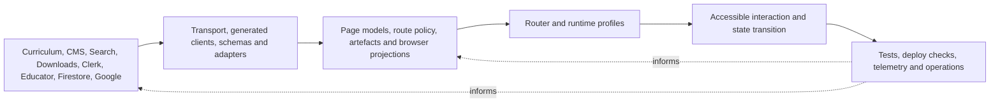

# Recursive OWA architecture atlas

## Purpose

This atlas is the entry point for a deep, recursive investigation of Oak Web
Application (OWA). It maps the architecture beneath repository labels and
framework conventions: authority, identity, projection, execution, lifetime,
trust, failure, observation and change.

The investigation uses OCE's
[`concept-exploration`](https://github.com/oaknational/oak-open-curriculum-ecosystem/blob/bd878a3a550c8e5e5d21163a6d0962cebdaf43fa/.agent/skills/concept-exploration/SKILL-CANONICAL.md)
Practice at pinned OCE revision
[`bd878a3a550c8e5e5d21163a6d0962cebdaf43fa`](https://github.com/oaknational/oak-open-curriculum-ecosystem/tree/bd878a3a550c8e5e5d21163a6d0962cebdaf43fa).
Each pass:

1. starts from literal observations and exposes inherited assumptions;
2. defines the problem without embedding a solution;
3. reopens competing explanations; and
4. proposes only warranted, falsifiable next investigations.

The source under examination is OWA
[`510ac63a62fb37a70183b00ce0f5fb15be4491e5`](https://github.com/oaknational/Oak-Web-Application/tree/510ac63a62fb37a70183b00ce0f5fb15be4491e5),
release `v1.1128.0`. This is a current-state map, not an OWA improvement plan and
not an OCE target architecture.

## The five recursive views

| View                            | Governing question                                                                                                                     | Deep record                                                                                |
| ------------------------------- | -------------------------------------------------------------------------------------------------------------------------------------- | ------------------------------------------------------------------------------------------ |
| Runtime, routing and rendering  | Which authority decides what executes, where, for how long, with what cache and failure behaviour?                                     | [Runtime, routing and rendering](./runtime-routing-and-rendering.md)                       |
| Information and content         | Which source owns a claim, how is it transformed into an audience projection, and what establishes identity, freshness and provenance? | [Information and content authority](./information-and-content-authority.md)                |
| State, identity and trust       | When does browser or provider state become a trusted outcome, for which subject, with what acknowledgement and reconciliation?         | [State, identity and trust](./state-identity-and-trust.md)                                 |
| UI composition and interaction  | How do projections, runtime profiles, components, styles and browser behaviours become one accessible interaction?                     | [UI composition and interaction](./ui-composition-and-interaction.md)                      |
| Change, delivery and operations | What warrants belief that an intended change is the reviewed, built, deployed, observed and recoverable system users receive?          | [Change assurance, delivery and operations](./change-assurance-delivery-and-operations.md) |

These are analytical views over one system. They are not proposed bounded
contexts or packages.

## Structural evidence method

The retired
[OWA architecture inventory](../../../evidence-harness-provenance.md#owa-architecture-inventory)
recorded the pinned revision and clean state, tracked source populations,
router conventions, local dependency directions, explicit client boundaries,
static client reachability, cycles and assurance artefacts.

**Observed at the pinned clean revision:**

| Structural noticer                                                                |   Observation | Limit                                                                                                           |
| --------------------------------------------------------------------------------- | ------------: | --------------------------------------------------------------------------------------------------------------- |
| Tracked analysed TypeScript files                                                 |         1,569 | Filename/path exclusions remove tests, stories and mocks but retain fixture-shaped and Storybook support files. |
| App Router pages / route handlers / layouts                                       |   27 / 15 / 9 | Filesystem convention modules, not traffic or distinct user outcomes.                                           |
| Pages route modules / API modules                                                 |       67 / 12 | Excludes special underscore modules from the page count; modules can contain several behaviours.                |
| Pages files mentioning `getStaticProps` / `getStaticPaths` / `getServerSideProps` |  55 / 39 / 10 | Static source occurrence by file, not effective build/runtime mode.                                             |
| Static runtime-shaped local edges                                                 |         4,312 | Excludes explicit type-only imports; the graph population is not a deployment manifest.                         |
| Cross-top-level-area runtime-shaped edges                                         |         2,228 | Top-level folders are a coarse analytical classification.                                                       |
| Explicit `use client` roots / upper-bound directive closure                       |     102 / 946 | Source reachability, not emitted chunks; excludes implicit Pages Router browser entries.                        |
| Cyclic strongly connected components / modules within them                        |      19 / 206 | Barrels and type-shaped imports may inflate runtime significance.                                               |
| Tracked source tests / stories / browser journey specs                            | 844 / 208 / 1 | Authored artefacts, not execution, enforcement or claim coverage.                                               |

The raw JSON is intentionally not committed. Every interpretation below remains
labelled and points to the detailed evidence that qualifies it.

## Holistic current-state model

### OWA is an application projection system

**Inferred:** “Next.js web app” is true but architecturally shallow. OWA turns
several independently governed systems into teacher, pupil, editorial,
registration, resource, export and Classroom outcomes.



The arrows are not a single linear pipeline. Search, redirects, live file
checks, optimistic state, provider replication and runtime telemetry create
feedback and reconciliation loops.

### Authority is plural but should be explainable per claim

**Observed:** Curriculum data, Sanity, Search, Downloads, Clerk, Educator,
Firestore, Google Classroom, consent and telemetry services each own different
kinds of fact or state. OWA also owns meaningful policy: parsing, reconciliation,
navigation identity, restriction, fallback, page projection and interaction.

**Inferred:** Multiple authorities are not automatically duplication. The
architectural requirement is that, for any user-visible claim or transition, a
reader can identify:

- the subject and stable identity;
- the authority entitled to decide it;
- transports and transformations;
- projections and replicas;
- freshness or acknowledgement state;
- disagreement and failure policy; and
- the evidence that proves the intended outcome.

The current implementation often contains those facts, but not as one explicit
contract.

### Routes are both execution addresses and a public identity protocol

**Observed:** Route resolution is distributed across platform configuration,
Next redirects/rewrites, a narrow Clerk API/tRPC middleware matcher, Pages and
App filesystems, a typed URL catalogue, route-local guards, curriculum redirect
queries and browser effects. Slugs can identify content, placement, programme
context, historical addresses or provider context.

**Inferred:** A route is not merely a controller location. It can assert which
concept a historical or contextual address denotes, which runtime profile owns
it, and which projection is canonical. Redirects are part of information and
compatibility architecture as well as request handling.

### Page models are OWA's implicit application API

**Observed:** Generated clients and remote schemas rarely flow unchanged into
rendering. Query adapters validate and transform them; page data functions join
sources and apply absence, multiplicity, restriction and navigation policy;
views/components then consume audience-specific models.

**Inferred:** Those models form an implicit internal application API. Their
stability, provenance and policy are more architecturally significant than the
directory named `node-lib`, `pages-helpers`, `view` or `Component`.

### Runtime is a set of outcome-specific profiles

**Observed:** One deployment contains two UI routers and two API mechanisms.
Pages and App roots install overlapping but non-identical providers; route
groups add core, registration, beta and Classroom profiles. Rendering lifetimes
include build/prerender, ISR, cross-request cache, request memoization, browser
provider lifetime and request-bound BFF work.

**Inferred:** “two routers” is an inventory fact, not the deepest seam. The
architecture is a set of execution profiles whose obligations include
metadata, consent, identity, error behaviour, state lifetime, client delivery
and observation. Some divergence is migration residue; some may express real
outcome differences. That distinction requires evidence.

### Freshness and success are vectors

**Observed:** One rendered outcome can combine curriculum materialized-view
time, Next cache age, Sanity publication/CDN age, Search index age, local
intent-cache age and a browser-time resource check. One write can pass through
local intent, optimistic projection, HTTP acceptance, remote commit, provider
replication and later read-back.

**Inferred:** “fresh” and “successful” are not booleans unless the relevant
authority and stage are named. The most general transition ladder found by the
state/trust pass is:

```text
intent -> locally projected -> request accepted -> authority committed
       -> replicas observed -> user-visible outcome verified
```

Not every outcome needs every stage. Every user acknowledgement and analytics
event does need to state which stage it represents.

### The UI is a projection-composition system, not a component tree

**Observed:** Routes/page models, two root profiles, views, feature components,
Oak Components, OWA-local shared UI, styled-components, extracted global CSS,
generated assets, contexts/hooks and third-party overlays jointly create the
interaction. Existing folder rules mix audience, reuse, page class, composition
role and migration intent.

**Inferred:** The enduring responsibilities are semantic projection,
interaction behaviour, visual language, runtime composition, accessibility and
failure states. Package and folder placement are current mechanisms whose
authority and ownership must be tested rather than inherited.

### Assurance is a correspondence problem

**Observed:** Format, lint, types, Jest, Sonar, Storybook, Pa11y, Percy,
Playwright, platform builds, semantic release, Terraform drift and runtime
reporters exist at different events and scopes. Configuration does not reveal
which checks are required, which deployment is promoted, which infrastructure
is applied, or which signals produce operator action.

**Inferred:** Confidence depends on correspondence:

```text
outcome claim -> failure mechanism -> cheapest observing layer
              -> executed evidence -> promotion authority -> runtime signal
```

A green tool is meaningful only when it can invalidate the claim assigned to
it and its result has the intended authority.

## The recursive seams

These seams recur across all five views. A seam is a place where responsibility
or trust changes; it is not automatically a place to add an interface, package
or service.

| Seam                                      | Question to recurse into                                                                       | Representative current mechanisms                                                          |
| ----------------------------------------- | ---------------------------------------------------------------------------------------------- | ------------------------------------------------------------------------------------------ |
| Published claim -> application projection | What did the source assert, what policy did OWA add, and what provenance survives?             | GraphQL/Sanity/Search adapters, Zod schemas, page models, export builders.                 |
| Concept identity -> public address        | Is the slug content, placement, context or history, and who reconciles change?                 | Typed URL catalogue, route files, redirect queries and Next redirects.                     |
| Request -> execution profile              | Which host, middleware, router, layout, cache and client boundary applies?                     | Platform config, middleware, Pages/App roots and route groups.                             |
| Local intent -> durable outcome           | Which authority accepted the transition, how is it acknowledged, and how do replicas converge? | Saved content, pupil attempts, teacher notes and Classroom writes.                         |
| Possessed identifier -> authorization     | Is the identifier an address, capability, user-owned record or provider-bound context?         | Clerk, anonymous attempt IDs, note IDs and Classroom session headers.                      |
| Shared vocabulary -> complete interaction | Which semantics and behaviours are shared, and which belong to a product projection?           | Oak Components, SharedComponents, views, route-local features and styles.                  |
| Server source -> browser payload          | Which code and data cross the boundary, deliberately and measurably?                           | `use client`, client re-export, providers, hydration and static import graph.              |
| Failure -> user recovery                  | Which layer translates absence/error, and can the person continue without corrupting trust?    | redirects, `notFound`, error boundaries, fallbacks, retries and local continuation.        |
| Declared control -> effective assurance   | Did it execute, gate promotion, match applied state and detect the intended harm?              | workflows, platform checks, Terraform, Pa11y/Percy and telemetry.                          |
| Current mechanism -> enduring requirement | Is it essential, chosen, accidental, compensating or simply unknown?                           | dual routers, style parity, caches, stores, BFFs, provider adapters and migration folders. |

## What the exploration changed

| Fluent starting frame                                                         | Evidence-led frame now held                                                                                                         |
| ----------------------------------------------------------------------------- | ----------------------------------------------------------------------------------------------------------------------------------- |
| OWA architecture can be mapped from directories.                              | Directory names mix runtime, audience, reuse, technology and history. Map authority and change semantics first.                     |
| OWA has a Pages architecture and an App architecture.                         | It has distributed request policy and several execution profiles; router is one mechanism in each.                                  |
| Curriculum API supplies the page data.                                        | OWA federates authorities and creates audience-specific publication projections.                                                    |
| A slug identifies a curriculum object.                                        | Slugs participate in a contextual, historical public-address protocol.                                                              |
| State architecture means choosing among context, Zustand and SWR.             | The load-bearing facts are subject, identity, authority, lifetime, acknowledgement and reconciliation.                              |
| Clerk is the application's identity boundary.                                 | Clerk, Google, anonymous capabilities, browser possession and analytics identity govern different subjects.                         |
| Oak Components is the UI architecture.                                        | It is one layer in a larger interaction-composition and assurance system.                                                           |
| One application shell should be made consistent.                              | Composition roots are behavioural profiles; shared obligations and intentional differences must be established before unification.  |
| Static or cached content has one freshness setting.                           | Freshness is a vector across independently published and cached authorities.                                                        |
| A successful call or analytics event denotes success.                         | It denotes a particular transition stage, which may precede durable or observed outcome.                                            |
| CI/CD is the workflow that tests and deploys the app.                         | Change authority is distributed across source checks, platform builds, deploy events, release, infrastructure and runtime response. |
| More interfaces around observed boundaries would create cleaner architecture. | A seam first demands an authority/outcome explanation; abstraction can preserve unnecessary or compensating complexity.             |

## Load-bearing current hypotheses

These hypotheses explain the pinned source. They are not target decisions.

### HA-1: OWA is primarily a federation of publication and state projections

**Warrant:** user outcomes join independently authoritative curriculum,
editorial, search, identity, saved-content, pupil, file and provider claims,
with OWA-owned validation and policy between source and interaction.

**Invalidator:** upstream and runtime evidence shows one coherent authoritative
model already governs the apparently separate sources, while OWA transformations
are lossless transport adaptation only.

### HA-2: complexity clusters where authority, identity or lifetime changes

**Warrant:** redirects, caches, provider roots, optimistic state, local storage,
BFFs, reconciliation and error translation concentrate at those transitions.

**Invalidator:** a representative graph and runtime trace shows complexity is
instead explained by independent domain capabilities with aligned authority and
lifetime, not transition mismatch or compensation.

### HA-3: public routes form an enduring compatibility protocol

**Warrant:** route construction, analytics identity, contextual slugs, canonical
and browse variants, historical redirects and upstream redirect projections all
participate in meaning.

**Invalidator:** stable concept identifiers and one generated route authority
already make route variants disposable presentation aliases with no independent
compatibility obligation.

### HA-4: page models are the current internal product contract

**Warrant:** query adapters and page helpers repeatedly validate, join,
normalize, restrict and degrade external data before views consume it.

**Invalidator:** source/runtime sampling shows components routinely depend on
raw providers and page models have no stable semantics, reuse or assurance role.

### HA-5: part of the architecture is migration and compatibility strata

**Warrant:** dual routers, two global-style paths, a client-marked component
barrel, an explicitly transitional Shared folder and route redirects retain
parallel mechanisms.

**Invalidator:** owner/history and runtime evidence show each parallel path is
an intentional long-term profile with distinct required outcomes and no planned
convergence or compensating role.

### HA-6: the weakest visible assurance is at cross-authority transitions

**Warrant:** source-local tests are extensive, while deployed control-plane,
provider failure, ordering, reconciliation and multi-stage acknowledgement
evidence is sparse or external.

**Invalidator:** external contract suites, platform gates and operational
evidence demonstrate those transitions under delay, rejection, duplication,
reordering, stale reads and recovery.

## Highest-value deeper investigations

Priority is information value for understanding and future premise decisions,
not an OWA implementation sequence. There is no invented time or cost
constraint.

| Investigation                                             | Warrant                                                                                                                                         | Observation that would falsify or materially redirect it                                                                                                           |
| --------------------------------------------------------- | ----------------------------------------------------------------------------------------------------------------------------------------------- | ------------------------------------------------------------------------------------------------------------------------------------------------------------------ |
| Reference outcome, impact and excellence evidence         | Source proves mechanism, not why the outcome matters or what excellence means to users, curriculum, accessibility and operations.               | Authoritative research, metrics, support/incidents and service intent already map every load-bearing capability to accepted outcomes and difficult states.         |
| Concept identity and cross-surface provenance census      | Content, placement, address, Search, export and provider context use overlapping identifiers and clocks.                                        | One governed immutable identity/publication model already reconciles every surface with explicit compatible projections.                                           |
| Deployed request, cache and build-manifest trace          | Static source cannot prove ingress order, prerender mode, emitted client graph, cache keys or profile payloads.                                 | Retained manifests and live traces already demonstrate one intentional model with route/profile budgets and freshness semantics.                                   |
| Transition acknowledgement and concurrency matrix         | Saved content, pupil results, notes and Classroom writes use different optimistic, capability and replication protocols.                        | End-to-end contracts already prove authorization, idempotency, ordering, durable acknowledgement, convergence and user messaging for all variants.                 |
| Privacy, safeguarding, retention and revocation inventory | URL, browser storage, anonymous capabilities, identity providers and telemetry retain different subjects and create deliberate visibility gaps. | An operated data map and tests demonstrate collection, access, expiry, deletion, revocation, backup retention and safeguarding lifetime at every store.            |
| Rendered interaction and runtime-profile contracts        | Static components and provider trees cannot prove semantic, responsive, assistive-technology, failure or cross-root behaviour.                  | Explicit conformance tests already cover every shared obligation and intentional profile difference at the rendered boundary.                                      |
| Assurance-to-claim and promotion-control-plane audit      | Declared checks live at different events; enforcement, applied state and response authority are external.                                       | One auditable promotion model already ties reviewed commit, immutable artefact, required evidence, applied infrastructure, rollout, rollback and runtime response. |
| Failure-semantics and recovery injection                  | Absence, multiplicity, stale data, provider error and client failure are translated differently by projection.                                  | A documented criticality model and controlled suite already proves every material translation and recovery outcome.                                                |
| Decision history and ownership recovery                   | Source distinguishes mechanism poorly from destination, workaround and hard-won constraint.                                                     | Current decision records and accountable owners already state purpose, authority, success evidence and removal/reopening conditions for each questioned seam.      |
| Framework-consumer outcome study                          | OWA describes one mature product; the kit exists deliberately to enable additional consumers.                                                   | Validated consumer research already defines tasks, extension points, diagnostic needs, compatibility and excellence contracts across intended products.            |

Each detailed record contains narrower investigations with its own warrant and
falsifier. These cross-cutting investigations should join those observations
rather than repeat them independently.

## Evidence still capable of overturning the atlas

- upstream curriculum, Sanity, Search, Downloads, Educator and Classroom
  authority, versioning and compatibility contracts;
- applied Vercel, Netlify, Cloudflare, Terraform, data-store and provider state;
- real build, middleware, prerender, cache, client-chunk and CSS manifests;
- production traffic, latency, freshness, failure, retry and convergence traces;
- complete authorization, capability-entropy and privacy threat models;
- retention, deletion, revocation, backup and recovery operation;
- product, curriculum, accessibility, visual-design and support evidence;
- branch protection, required checks, visual approval, release promotion and
  incident response;
- architecture decisions, migration destinations, incidents and current
  ownership; and
- intended Innovation Kit consumers and their product-creation work.

## Reading rule

This atlas changes the questions; it does not settle the future design.

- Preserve an observed behaviour only after its outcome or obligation is
  established.
- Preserve a boundary only after its independent authority and lifecycle are
  established.
- Remove or combine mechanisms only after their excellent behaviour and failure
  knowledge are recovered.
- Treat a simpler architecture as better only when it removes causes or
  concepts without hiding state, trust, accessibility or operational work.
- Treat an idiomatic pattern as eligible only after the premise and whole-system
  model are ready; fluency is not evidence.

That is the bridge from deconstructing OWA to eventually designing an Oak
Innovation Kit based on intent and excellence rather than copied prior art.
