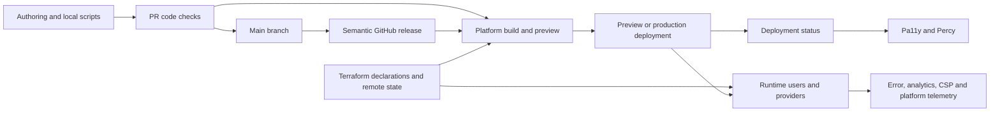

# OWA change assurance, delivery and operations architecture

## Purpose

This record maps how an OWA change becomes an asserted, built, deployed and
observable production change. It does not equate test files with confidence,
workflow files with enforced gates, infrastructure code with applied state, or
error telemetry with understood impact.

It applies the four movements of OCE concept exploration: question inherited
frames, define the problem without a preferred mechanism, compare explanations,
then record changed assumptions and falsifiable next steps.

This is not a remediation plan for OWA and not a proposed OCE delivery
architecture. It recovers responsibilities and unknowns that any excellent Oak
system would need to address.

## Source snapshot and evidence levels

**Observed:** Source evidence is pinned to OWA
[`510ac63a62fb37a70183b00ce0f5fb15be4491e5`](https://github.com/oaknational/Oak-Web-Application/tree/510ac63a62fb37a70183b00ce0f5fb15be4491e5),
release `v1.1128.0`. The worktree was clean when the architecture inventory ran.

The structural counts came from the retired
[OWA architecture inventory](../../../evidence-harness-provenance.md#owa-architecture-inventory).

The pinned tree contains 844 tracked source test/spec files, 208 story files,
seven GitHub workflow files, fourteen tracked files below custom GitHub actions,
eleven Terraform files and one Playwright spec under the inventory's explicit
definitions. These counts establish authored surface only.

Evidence in this record is separated into five levels:

| Level     | Meaning                                                                           | What source can establish                                                        |
| --------- | --------------------------------------------------------------------------------- | -------------------------------------------------------------------------------- |
| Declared  | A script, configuration, test, workflow or resource is present.                   | Strongly observable in the pinned tree.                                          |
| Executed  | A declared mechanism ran for a particular change or deployment.                   | Requires run/build/deployment evidence; not established by configuration alone.  |
| Enforced  | Failure prevents promotion, merge or release.                                     | Requires branch, platform and check-policy evidence outside most source files.   |
| Applied   | A deployed artefact and infrastructure state match the declaration.               | Requires platform, Terraform state, DNS/CDN and runtime evidence.                |
| Effective | The mechanism detects or prevents the user/operational harm it exists to address. | Requires failure injection, incidents, product outcomes and observation quality. |

Unless stated otherwise, this report establishes the declared architecture and
some source-visible execution triggers, not current enforcement, applied state
or effectiveness.

## Executive frame

**Inferred:** OWA's change system is a distributed control plane, not one CI
pipeline. Authority is split among:

- local scripts and generated build inputs;
- GitHub pull-request and main-branch workflows;
- GitHub release creation;
- Vercel and possibly Netlify build/deployment integrations;
- deployment-status-triggered Pa11y and Percy jobs;
- Terraform Cloud, an external Terraform module and provider state;
- runtime configuration, consent and observability providers; and
- human review, visual approval and operational response outside the tree.

The source records strong breadth but cannot show whether these controls form a
single closed promotion contract. In particular, code checks, platform build,
deployment checks, release tagging and production observation occur at
different events and may have different promotion authority.

Arrows show declared relationships, not proof that every predecessor is a
required gate for every successor.

## Movement 1: inherited shapes put under suspicion

### “CI” is not one assurance boundary

**Observed:** The workflow named `Code checks` runs format, lint and TypeScript
checks in one job, and Jest plus SonarCloud upload in another
([check job](https://github.com/oaknational/Oak-Web-Application/blob/510ac63a62fb37a70183b00ce0f5fb15be4491e5/.github/workflows/code_checks.yml#L14-L46),
[test job](https://github.com/oaknational/Oak-Web-Application/blob/510ac63a62fb37a70183b00ce0f5fb15be4491e5/.github/workflows/code_checks.yml#L48-L81)).
The workflow explicitly describes its Jest command as unit tests, not
integration tests. It does not declare an application build, Storybook build,
Playwright run, Pa11y run, Percy run or Terraform plan.

**Observed:** Terraform checks run in a separate push-triggered workflow using
an Oak external action
([Terraform checks](https://github.com/oaknational/Oak-Web-Application/blob/510ac63a62fb37a70183b00ce0f5fb15be4491e5/.github/workflows/terraform_checks.yml#L1-L15)).
Pa11y and Percy run in a deployment-status workflow after a successful
non-Storybook deployment
([Pa11y trigger and job](https://github.com/oaknational/Oak-Web-Application/blob/510ac63a62fb37a70183b00ce0f5fb15be4491e5/.github/workflows/post_deployment_actions.yml#L1-L8),
[Pa11y condition](https://github.com/oaknational/Oak-Web-Application/blob/510ac63a62fb37a70183b00ce0f5fb15be4491e5/.github/workflows/post_deployment_actions.yml#L67-L115),
[Percy condition](https://github.com/oaknational/Oak-Web-Application/blob/510ac63a62fb37a70183b00ce0f5fb15be4491e5/.github/workflows/post_deployment_actions.yml#L117-L176)).

**Inferred:** “CI passes” has no single source-visible meaning. It can mean
source checks passed, a platform build succeeded, deployed-page checks ran,
visual review was accepted, or infrastructure declarations passed a separate
check. Promotion authority between these events is an external-state question.

### Test abundance is not journey confidence

**Observed:** Jest collects coverage broadly across `src` with explicit
exclusions and runs in jsdom
([base Jest configuration](https://github.com/oaknational/Oak-Web-Application/blob/510ac63a62fb37a70183b00ce0f5fb15be4491e5/jest.base.config.js#L1-L43)).
Sonar declares further coverage and copy/paste exclusions, including generated
code, router infrastructure, registration, App layout/provider files and
intentionally duplicated pupil route families
([coverage exclusions](https://github.com/oaknational/Oak-Web-Application/blob/510ac63a62fb37a70183b00ce0f5fb15be4491e5/sonar-project.properties#L26-L90),
[duplication rationale and exclusions](https://github.com/oaknational/Oak-Web-Application/blob/510ac63a62fb37a70183b00ce0f5fb15be4491e5/sonar-project.properties#L92-L133)).

**Observed:** The current Playwright surface contains one teacher lesson spec
with two tests: reaching downloads and completing a ZIP download
([spec](https://github.com/oaknational/Oak-Web-Application/blob/510ac63a62fb37a70183b00ce0f5fb15be4491e5/src/tests/e2e/teacher/lesson-page.spec.ts#L1-L40)).
Playwright can target a deployment or start local development, uses one desktop
Chromium project and is configured for traces/screenshots on failure
([configuration](https://github.com/oaknational/Oak-Web-Application/blob/510ac63a62fb37a70183b00ce0f5fb15be4491e5/playwright.config.ts#L8-L61)).

**Inferred:** The repository has extensive unit/component evidence and a very
narrow declared browser-journey surface. That may be proportionate to current
team strategy, but counts alone cannot establish confidence in cross-router,
provider, caching, authentication, accessibility or distributed-write
behaviour.

### A successful deployment is not the same event as an accepted release

**Observed:** The main-branch semantic-release workflow says changes should
have passed automated checks, code review and appropriate manual checks, then
creates a tag, changelog update and GitHub release
([workflow intent and trigger](https://github.com/oaknational/Oak-Web-Application/blob/510ac63a62fb37a70183b00ce0f5fb15be4491e5/.github/workflows/create_semantic_release.yml#L1-L27),
[release execution](https://github.com/oaknational/Oak-Web-Application/blob/510ac63a62fb37a70183b00ce0f5fb15be4491e5/.github/workflows/create_semantic_release.yml#L28-L63)).
The semantic-release configuration derives releases from commit types, commits
the changelog and Sonar version, and creates a GitHub release
([release configuration](https://github.com/oaknational/Oak-Web-Application/blob/510ac63a62fb37a70183b00ce0f5fb15be4491e5/release.config.js#L1-L48)).

**Observed:** Deployment assurance is event-driven after a platform reports
success. The workflow uses custom commit statuses because multiple themed
deployment events can overwrite one another in the checks UI
([Pa11y status rationale](https://github.com/oaknational/Oak-Web-Application/blob/510ac63a62fb37a70183b00ce0f5fb15be4491e5/.github/workflows/post_deployment_actions.yml#L105-L115),
[Percy status rationale](https://github.com/oaknational/Oak-Web-Application/blob/510ac63a62fb37a70183b00ce0f5fb15be4491e5/.github/workflows/post_deployment_actions.yml#L169-L176)).

**Inferred:** Commit acceptance, deployability, deployment success, deployed
page checks, visual approval, release tagging and production promotion are
separate state transitions. The source does not prove they form one atomic or
monotonic state machine.

### Infrastructure as code is a declaration, not the control plane itself

**Observed:** OWA declares website and Storybook Vercel builds, domains,
frameworks and skew-protection windows, including a staging custom environment
([build declarations](https://github.com/oaknational/Oak-Web-Application/blob/510ac63a62fb37a70183b00ce0f5fb15be4491e5/infrastructure/project/builds.tf#L1-L31)).
It delegates Vercel project creation to
`oak-terraform-modules` pinned at `v2.0.4`
([Vercel module](https://github.com/oaknational/Oak-Web-Application/blob/510ac63a62fb37a70183b00ce0f5fb15be4491e5/infrastructure/project/main.tf#L1-L41)).

**Observed:** Environment and identity inputs combine repository Terraform,
Terraform remote state, workspace variables, Vercel environments and sensitive
values
([remote-state and environment model](https://github.com/oaknational/Oak-Web-Application/blob/510ac63a62fb37a70183b00ce0f5fb15be4491e5/infrastructure/project/locals.tf#L1-L68)).
A separate workflow checks Vercel drift for website and Storybook workspaces
after pushes to main
([drift workflow](https://github.com/oaknational/Oak-Web-Application/blob/510ac63a62fb37a70183b00ce0f5fb15be4491e5/.github/workflows/terraform_vercel_drift.yml#L1-L31)).

**Inferred:** The authoritative applied topology spans source, an external
module version, Terraform Cloud workspaces, Vercel state, provider credentials,
DNS/CDN state and workflow variables. Source alone cannot settle current drift,
manual platform changes or whether Netlify remains operational. See
[production topology](../production-topology.md).

### Observability is conditional behaviour, not passive exhaust

**Observed:** Build configuration chooses source-map/reporting integration
based on release stage, build phase and `NEXT_PUBLIC_SENTRY_ENABLED`. When
source maps are enabled, the production-build branch creates Bugsnag build
information and chooses Sentry or Bugsnag for source-map upload
([build observability](https://github.com/oaknational/Oak-Web-Application/blob/510ac63a62fb37a70183b00ce0f5fb15be4491e5/next.config.ts#L294-L351)).

**Observed:** In the browser, `AppHooks` chooses Sentry or Bugsnag and gates
either on service-specific consent, while Gleap, Axe and identity metadata have
their own conditions
([browser activation](https://github.com/oaknational/Oak-Web-Application/blob/510ac63a62fb37a70183b00ce0f5fb15be4491e5/src/components/AppComponents/App/AppHooks.tsx#L31-L59)).
Revoking consent ends a Sentry session or pauses Bugsnag
([Sentry lifecycle](https://github.com/oaknational/Oak-Web-Application/blob/510ac63a62fb37a70183b00ce0f5fb15be4491e5/src/browser-lib/sentry/useSentry.ts#L19-L35),
[Bugsnag lifecycle](https://github.com/oaknational/Oak-Web-Application/blob/510ac63a62fb37a70183b00ce0f5fb15be4491e5/src/browser-lib/bugsnag/useBugsnag.ts#L17-L40)).

**Inferred:** Error visibility depends on build-time provider selection,
runtime configuration, consent state, route, reporter initialization and
source-map identity. “Instrumented” does not imply every failure population is
observable, nor that a signal is actionable.

## Movement 2: define the problem space

### Mechanism-neutral problem frame

Oak needs every change to preserve or improve intended educational, product,
trust, accessibility and operational outcomes, and to make divergence visible
before or soon after affected people encounter it. The change system must also
support deliberate evolution without making confidence depend on individual
memory or a particular vendor interface.

The gap is between a source change and warranted belief that the intended
system is the one users receive and operators can understand.

People harmed by a weak change system include pupils and teachers exposed to
incorrect or inaccessible behaviour, teams unable to diagnose or reverse a
change, content owners whose publication is stale or wrong, and future kit
consumers whose compatibility depends on implicit behaviour.

Success is not “all checks green”. It requires:

- explicit outcome, invariant and risk claims for a change;
- evidence at the cheapest layer capable of invalidating each claim;
- reproducible artefacts and configuration with traceable provenance;
- promotion states with explicit authority and monotonic transitions;
- controlled rollback, forward recovery and data-compatibility behaviour;
- observation that respects consent while covering material failure modes;
- known ownership and response expectations; and
- evidence that the controls themselves detect seeded representative failure.

This frame does not prescribe GitHub Actions, Vercel, Terraform, Jest, a
coverage threshold, semantic versioning or any particular observability vendor.

### Recursive control map

| Control depth      | Responsibility                                                   | Declared OWA mechanism                                                                                 | Authority still unknown                                                                                         |
| ------------------ | ---------------------------------------------------------------- | ------------------------------------------------------------------------------------------------------ | --------------------------------------------------------------------------------------------------------------- |
| Intent             | State what must change and what must not.                        | PR template, code review, tests, commit semantics and team practice.                                   | Product, curriculum, accessibility and operational acceptance criteria; review evidence was not inspected here. |
| Static source      | Reject malformed or internally inconsistent change.              | Format, ESLint, TypeScript and Terraform checks.                                                       | Required-check policy, exception process and false-negative history.                                            |
| Isolated behaviour | Assert transformations and component behaviour.                  | Jest/jsdom, snapshots, coverage and Sonar.                                                             | Quality gate settings, mutation strength and relationship to user outcomes.                                     |
| Artefact           | Prove the deployable build is reproducible and internally valid. | Next/Vercel build, Storybook build, generated sprites/browser support, bundle reports and source maps. | Whether an application build is required before merge; artefact identity and retention.                         |
| Integrated system  | Assert real services, browser and provider interactions.         | Deployment Pa11y/Percy and narrow Playwright configuration.                                            | Which environments/providers are controlled; test data, authentication and cross-system failure coverage.       |
| Promotion          | Decide which artefact reaches which audience.                    | Platform deployment, custom environment, GitHub release and domain configuration.                      | Branch protection, Vercel production promotion, post-deploy check authority and rollback policy.                |
| Runtime            | Detect divergence after release.                                 | Sentry/Bugsnag, PostHog, CSP reports, Gleap, uptime metadata and platform logs.                        | SLOs, alerts, sampling, consent blind spots, retention, triage and outcome linkage.                             |
| Infrastructure     | Preserve runtime and control-plane state.                        | Terraform modules, remote state, drift checks, Firestore and monitoring declarations.                  | Applied state, DNS/Cloudflare, Netlify role, backup restoration and disaster exercises.                         |

### Build configuration is an architectural composition root

**Observed:** `next.config.ts` loads test configuration locally or requires an
external `OAK_CONFIG_LOCATION`; release stage is derived from override, Vercel
or Netlify variables. Its comment says production builds currently depend on a
Vercel-specific variable and failover would require adjustment
([configuration and stage](https://github.com/oaknational/Oak-Web-Application/blob/510ac63a62fb37a70183b00ce0f5fb15be4491e5/next.config.ts#L43-L82)).

**Observed:** The same file composes security headers, image-provider policy,
SVG transformation, bundle reports, copied MathJax assets, source maps,
observability uploads, server-action origins, redirects, rewrites and sitemap
configuration. It writes `SITEMAP_BASE_URL` into `.env.local` and the process
environment during configuration because App Router sitemaps prerender during
the build
([sitemap side effect](https://github.com/oaknational/Oak-Web-Application/blob/510ac63a62fb37a70183b00ce0f5fb15be4491e5/next.config.ts#L519-L564)).

**Observed:** The file has an ESM default async configuration function and a
later conditional `module.exports = withSentryConfig(module.exports, ...)`
branch
([default configuration](https://github.com/oaknational/Oak-Web-Application/blob/510ac63a62fb37a70183b00ce0f5fb15be4491e5/next.config.ts#L43-L51),
[conditional Sentry wrapper](https://github.com/oaknational/Oak-Web-Application/blob/510ac63a62fb37a70183b00ce0f5fb15be4491e5/next.config.ts#L566-L585)).

**Inferred:** Build configuration is an active program with network/config
inputs, workspace side effects and provider-specific composition. It is a major
runtime, security and release boundary. The effect of the mixed export idioms
must be tested in actual build modes rather than inferred from syntax.

### Deployed accessibility and visual checks share a route sample

**Observed:** Pa11y uses Axe, a deployment URL and a Vercel bypass header. It
hides external widgets, ignores colour contrast, video caption and list rules,
and waits for `#__next` so an intermediary error page is less likely to be
mistaken for OWA
([Pa11y defaults and exceptions](https://github.com/oaknational/Oak-Web-Application/blob/510ac63a62fb37a70183b00ce0f5fb15be4491e5/pa11yci.config.js#L19-L62),
[URL execution](https://github.com/oaknational/Oak-Web-Application/blob/510ac63a62fb37a70183b00ce0f5fb15be4491e5/pa11yci.config.js#L71-L89)).

**Observed:** The shared deployment URL list covers generic, curriculum,
teacher, pupil and sign-in examples, with several routes commented because of
known Pa11y or preview errors
([route set and exceptions](https://github.com/oaknational/Oak-Web-Application/blob/510ac63a62fb37a70183b00ce0f5fb15be4491e5/src/common-lib/urls/getDeploymentTestUrls.js#L1-L84)).
Percy snapshots at 375 and 1280 pixels and suppresses part of the consent UI
([Percy configuration](https://github.com/oaknational/Oak-Web-Application/blob/510ac63a62fb37a70183b00ce0f5fb15be4491e5/percy.config.js#L21-L50)).

**Inferred:** The route sample is a valuable deployed-system sentinel. Its
exceptions and suppression rules are part of the assurance architecture, not
mere test noise. Effectiveness depends on ownership, expiry, approval policy,
representative state and whether failures gate promotion.

### Failure handling and failure observation are separate

**Observed:** App Router has route, root and global error boundaries; the root
boundary renders navigation/footer around a reusable fallback, while the
global boundary reconstructs its own document and Oak theme
([root error](https://github.com/oaknational/Oak-Web-Application/blob/510ac63a62fb37a70183b00ce0f5fb15be4491e5/src/app/error.tsx#L1-L25),
[global error](https://github.com/oaknational/Oak-Web-Application/blob/510ac63a62fb37a70183b00ce0f5fb15be4491e5/src/app/global-error.tsx#L1-L60)).
Pages has its own error-page path and status derivation
([Pages error](https://github.com/oaknational/Oak-Web-Application/blob/510ac63a62fb37a70183b00ce0f5fb15be4491e5/src/pages/_error.tsx#L1-L41)).

**Inferred:** A graceful fallback, an HTTP status, an emitted error event and an
operator alert are four distinct contracts. The current tree contains
mechanisms for each class, but their correlation, completeness and user-impact
semantics are not established by static source.

### Supply-chain and control-plane trust is mixed

**Observed:** Workflows pin the pnpm, SonarSource and Slack actions to full
commit SHAs, while checkout and setup-node use moving major tags in the inspected
workflows
([code-check actions](https://github.com/oaknational/Oak-Web-Application/blob/510ac63a62fb37a70183b00ce0f5fb15be4491e5/.github/workflows/code_checks.yml#L20-L34),
[Sonar action](https://github.com/oaknational/Oak-Web-Application/blob/510ac63a62fb37a70183b00ce0f5fb15be4491e5/.github/workflows/code_checks.yml#L73-L81)).
Terraform logic depends on an external version-tagged module, remote state and
external actions pinned by SHA.

**Inferred:** Reproducibility and trust include actions, package locks, build
images, platform builders, external Terraform modules, generated inputs and
remote configuration. A lockfile alone cannot establish the complete artefact
provenance chain.

## Movement 3: competing explanations

| Explanation                                      | Supporting evidence                                                                                 | Weakening evidence                                                                                            | Current status                                                 |
| ------------------------------------------------ | --------------------------------------------------------------------------------------------------- | ------------------------------------------------------------------------------------------------------------- | -------------------------------------------------------------- |
| Unit-test-centred confidence                     | 844 source test/spec files, broad Jest collection and Sonar upload.                                 | Code workflow calls them unit tests; browser and controlled-provider evidence is narrow.                      | Strong for local logic, insufficient whole-system explanation. |
| Platform-centred delivery                        | Vercel variables, Terraform Vercel module, deployment events and bypass headers are pervasive.      | Netlify configuration remains; platform settings and applied state are external.                              | Strong primary path, incomplete control-plane map.             |
| Continuous deployment with post-deploy sentinels | Pa11y and Percy run after successful deployments and preserve statuses per environment.             | Source does not show whether their results gate merge/promotion or arrive before affected exposure.           | Plausible mechanism, promotion authority unknown.              |
| Release-driven production                        | Main creates a semantic GitHub release that is described as triggering deployment.                  | Preview/production platform deployments also emit independently; release-to-artefact identity is not visible. | Partly explanatory; exact state machine unknown.               |
| Infrastructure-as-code authority                 | Vercel, Firestore, monitoring and environment declarations live in Terraform, with drift detection. | External modules, remote state, DNS/CDN and manual platform settings are outside the snapshot.                | Strong declaration layer, applied authority unproven.          |
| Consent-aware observability                      | Reporter activation and shutdown follow consent, with build-time source maps and release identity.  | Consent creates deliberate blind spots; alerts, sampling and outcome correlation are unknown.                 | Important trust property; operational effectiveness unproven.  |

**Synthesis:** OWA has a broad federated assurance system. It appears optimised
for fast local feedback, platform-provided deployability, deployed visual and
accessibility sentinels, and vendor-backed runtime signals. Its architecture is
best understood as multiple evidence producers and promotion actors rather
than a single pipeline. The decisive unknown is how those actors are joined by
external enforcement and operational practice.

## Movement 4: changed understanding and next evidence

### What changed in the frame

- **Changed:** “map CI/CD” became “map claims, evidence producers, promotion
  authority, artefact identity, applied state and runtime response.”
- **Changed:** the large test surface is evidence of engineering investment,
  not a proxy for complete outcome coverage.
- **Changed:** Pa11y and Percy are deployed-system checks rather than ordinary
  PR tests; that changes both their signal value and the question of when they
  can prevent harm.
- **Changed:** `next.config.ts` is part of the operational control plane because
  it loads configuration, mutates build state, defines security/routing policy
  and configures observability artefacts.
- **Changed:** Terraform is one declaration layer in a distributed authority
  graph, not proof that production equals the checked-in files.
- **Retained:** the source contains substantial excellence mechanisms and clear
  operational learning, including route sampling, custom deployment statuses,
  source maps, drift checks and consent-aware reporter lifecycles.

### Discriminating investigations

| Next investigation                                                                                         | Warrant                                                                                                      | Observation that would weaken the concern or alter the frame                                                                                         |
| ---------------------------------------------------------------------------------------------------------- | ------------------------------------------------------------------------------------------------------------ | ---------------------------------------------------------------------------------------------------------------------------------------------------- |
| Read-only promotion/control-plane inventory across GitHub, Vercel, Netlify, Cloudflare and Terraform Cloud | Required checks, production promotion and applied ownership are external.                                    | One documented, enforced and auditable promotion state machine already joins artefact, checks, environment and rollback.                             |
| Commit-to-production provenance trace                                                                      | Release, platform build and deployment checks occur on different events.                                     | A production response can be traced cryptographically or immutably to one reviewed commit, locked inputs, build and accepted checks.                 |
| Seeded-failure assay for each assurance layer                                                              | Presence and green history do not measure detection strength.                                                | Representative type, unit, build, accessibility, visual, journey, configuration and runtime failures are each caught at the intended cheapest layer. |
| Controlled build matrix                                                                                    | Build configuration has provider/stage branches, external config and mixed export idioms.                    | Test, preview, staging, production and failover builds produce the intended config with no workspace leakage and equivalent required policy.         |
| Journey-confidence matrix                                                                                  | One Playwright spec cannot represent the high-consequence cross-system journeys already mapped.              | Existing non-Playwright integration evidence covers those invariants with equal fidelity, control and failure diagnostics.                           |
| Accessibility/visual exception ledger                                                                      | Current ignored rules, hidden elements and commented routes encode risk and provider constraints.            | Every exception has an owner, rationale, expiry/review condition and compensating manual or automated evidence.                                      |
| Runtime signal-to-outcome trace                                                                            | Reporter initialization is conditional and vendor-specific.                                                  | Material user harms have defined signals, consent-compatible coverage, alert thresholds, ownership and demonstrated incident response.               |
| Backup, rollback and forward-compatibility exercise                                                        | Declarations include Firestore backup and skew protection, but recovery effectiveness is not source-visible. | Regular exercises demonstrate bounded restoration, schema/data compatibility and safe forward recovery across active versions.                       |
| Supply-chain provenance inventory                                                                          | Actions and modules use a mixture of SHA and tag references; platform builders remain external.              | All executable build inputs are immutable, attested, scanned and tied to retained artefacts under explicit trust policy.                             |

### Unresolved evidence

- GitHub branch protection, merge queue and required status configuration;
- Sonar quality-gate thresholds and whether failure blocks merge;
- Vercel project, production-promotion, protection, rollback and retention state;
- Netlify's current operational or failover role;
- Cloudflare DNS, edge security, cache and origin authority;
- Terraform Cloud workspace runs, applied state and drift findings;
- Percy approval/baseline policy and Pa11y failure ownership;
- application-build and Storybook-build enforcement before merge;
- release-to-deployment and source-map-to-artefact identity;
- alert definitions, SLOs, sampling, consent blind spots and incident response;
- restore exercises, rollback compatibility and multi-version data behaviour;
- manual accessibility, security, curriculum and product acceptance protocols;
- escaped-defect history showing which controls create signal and which create
  ceremony.

No source-only architecture judgment can close these gaps. The next useful
step is read-only control-plane and run evidence, not redesign.
