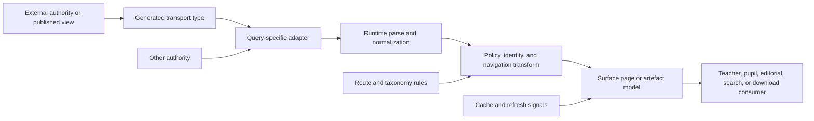

# OWA information and content authority

## Status and scope

This is a current-state concept exploration of the Oak Web Application (OWA), pinned to commit [`510ac63a62fb37a70183b00ce0f5fb15be4491e5`](https://github.com/oaknational/Oak-Web-Application/tree/510ac63a62fb37a70183b00ce0f5fb15be4491e5).

It follows information recursively from authority, through transport and transformation, into page and artefact projections, then into teacher, pupil, search, editorial, and download consumers. It also follows the inverse path: what happens when identity is ambiguous, content is absent or malformed, sources disagree, or caches have different views of freshness.

This is not a target architecture and does not recommend an OCE implementation. Its job is to expose the current responsibilities, the assumptions that hold them together, and investigations that could confirm or overturn the model.

### Evidence notation

- **Observed** means directly supported by source at the pinned commit.
- **Inferred** means the source supports the interpretation, but the interpretation is not itself declared as a contract.
- **Hypothesis** means a current explanatory model with an explicit invalidator.
- **Unknown** means the necessary authority, runtime evidence, or product decision is outside this source pass.

The strongest evidence here is static implementation and test structure. It establishes what OWA is built to do. It does not by itself establish production data quality, cache behaviour at every intermediary, upstream publication guarantees, operational frequency, or user impact.

### Exploration stance

- **Mode:** open concept exploration and hypothesis formation.
- **System:** OWA's information architecture, including the external contracts it consumes.
- **Altitude:** end-to-end information projections and their recursive boundaries, rather than individual components.
- **Central question:** how does OWA turn several independently shaped and refreshed sources into information that is usable, routable, policy-correct, and trustworthy on each public surface?

## Executive synthesis

**Inferred:** OWA is not principally a passive renderer over one curriculum API. It is an application-level information projection system. It federates curriculum materialized views, a shared curriculum-schema package, Sanity documents, a search index, a local search-intent taxonomy, download metadata, live file checks, and route history. It then creates surface-specific models whose behaviour includes navigation, policy, sequencing, restrictions, canonicalization, tracking, fallback, and cache semantics.

**Observed:** the curriculum integration alone contains 40 GraphQL documents, 38 query adapters, 24 query schemas, and a 22,875-line generated SDK in this commit. The Sanity integration contains 50 GraphQL documents, 22 local CMS type modules, and a 7,864-line generated SDK. These counts are a source census, not complexity scores.

**Inferred:** there is no single useful answer to “what is the source of truth?” Authority is field- and decision-specific:

- curriculum materialized views provide published curriculum, lesson content, browse placement, policy payloads, redirects, and refresh metadata;
- `@oaknational/oak-curriculum-schema` supplies part of the controlled vocabulary and validation contract;
- OWA query adapters and Zod schemas turn transport results into application contracts;
- Sanity supplies editorial projections used by both editorial pages and curriculum experiences;
- the Search API supplies ranked hits, while other sources supply facets, vocabulary, and intent interpretation;
- curriculum data says which resources should exist, while the Downloads API says whether files do exist and returns a usable URL;
- URL definitions, slug parsers, redirect views, and local mapping rules collectively define public identity.

**Working hypothesis:** OWA's most load-bearing architecture is the set of implicit projection contracts between these authorities, not any single API client. This hypothesis would be invalidated if upstream contracts define one canonical concept model, identity model, policy model, and publication version that every observed adapter merely exposes without changing semantics. The inspected OWA source instead shows local joins, omission, intersection, fallback, first-result selection, sorting, filtering, and URL reconstruction.

## Movement 1: reflect the raw observations

### 1. The information system has multiple authorities

The following table distinguishes an authority from an OWA projection of it. “Authority” here means the source whose answer OWA currently accepts for a particular decision, not a claim about organizational ownership.

| Information or decision                           | Current authority accepted by OWA                                                             | OWA projection or reconciliation                                                                          | Evidence                                                                                                                                                                                                                                                                                                                                                                                                                                                                                                                                                                                                                                           |
| ------------------------------------------------- | --------------------------------------------------------------------------------------------- | --------------------------------------------------------------------------------------------------------- | -------------------------------------------------------------------------------------------------------------------------------------------------------------------------------------------------------------------------------------------------------------------------------------------------------------------------------------------------------------------------------------------------------------------------------------------------------------------------------------------------------------------------------------------------------------------------------------------------------------------------------------------------- |
| Published curriculum structure and lesson content | Versioned curriculum materialized views exposed through GraphQL                               | Generated SDK, page-oriented query adapters, Zod parsing, camel-casing, sorting, filtering, and joins     | **Observed:** remote-schema code generation is configured from local GraphQL documents ([codegen configuration](https://github.com/oaknational/Oak-Web-Application/blob/510ac63a62fb37a70183b00ce0f5fb15be4491e5/src/node-lib/curriculum-api-2023/codegen.yml#L1-L13)); the facade exposes page, search, redirect, sitemap, and navigation operations ([curriculum facade](https://github.com/oaknational/Oak-Web-Application/blob/510ac63a62fb37a70183b00ce0f5fb15be4491e5/src/node-lib/curriculum-api-2023/index.ts#L114-L161)).                                                                                                                 |
| Curriculum vocabulary and policy payload shape    | Curriculum GraphQL schema plus `@oaknational/oak-curriculum-schema`                           | Shared and query-specific Zod schemas                                                                     | **Observed:** the shared schema imports actions, key-stage, tier, pathway, and synthetic-unit contracts from the package, then adds OWA lesson and resource shapes ([shared schema](https://github.com/oaknational/Oak-Web-Application/blob/510ac63a62fb37a70183b00ce0f5fb15be4491e5/src/node-lib/curriculum-api-2023/shared.schema.ts#L1-L14), [lesson model](https://github.com/oaknational/Oak-Web-Application/blob/510ac63a62fb37a70183b00ce0f5fb15be4491e5/src/node-lib/curriculum-api-2023/shared.schema.ts#L189-L241)).                                                                                                                     |
| Editorial copy and structured editorial documents | Sanity GraphQL dataset selected by environment and draft state                                | Generated SDK, a hand-written CMS facade, runtime schemas, and recursive reference resolution             | **Observed:** OWA derives a Sanity GraphQL endpoint and credentials ([Sanity transport](https://github.com/oaknational/Oak-Web-Application/blob/510ac63a62fb37a70183b00ce0f5fb15be4491e5/src/node-lib/sanity-graphql/index.ts#L15-L40)); the facade registers document-specific methods ([CMS facade](https://github.com/oaknational/Oak-Web-Application/blob/510ac63a62fb37a70183b00ce0f5fb15be4491e5/src/node-lib/cms/sanity-client/index.ts#L40-L85)).                                                                                                                                                                                          |
| Ranked search results                             | Search API/index                                                                              | Raw-response validation, result-type projection, route reconstruction, and omission of unusable hits      | **Observed:** browser search POSTs to the Search API, parses the raw response, transforms keys, and parses again ([result boundary](https://github.com/oaknational/Oak-Web-Application/blob/510ac63a62fb37a70183b00ce0f5fb15be4491e5/src/context/Search/search-api/2023/fetchResults.ts#L14-L75)); route models are reconstructed locally ([search result mapping](https://github.com/oaknational/Oak-Web-Application/blob/510ac63a62fb37a70183b00ce0f5fb15be4491e5/src/app/%28core%29/teachers/search/helpers/index.ts#L263-L428)).                                                                                                               |
| Search facets                                     | Curriculum search-page materialized view                                                      | A small Zod page model, including one local exclusion                                                     | **Observed:** the query selects a versioned search-page view ([facet query](https://github.com/oaknational/Oak-Web-Application/blob/510ac63a62fb37a70183b00ce0f5fb15be4491e5/src/node-lib/curriculum-api-2023/queries/searchPage/searchPage.gql#L1-L9)); its adapter removes `rule-of-law` before parsing ([facet adapter](https://github.com/oaknational/Oak-Web-Application/blob/510ac63a62fb37a70183b00ce0f5fb15be4491e5/src/node-lib/curriculum-api-2023/queries/searchPage/searchPage.query.ts#L1-L20)).                                                                                                                                      |
| Search intent vocabulary and aliases              | Local 1,094-line curriculum data table plus model output                                      | Direct/fuzzy matching, structured-output validation, confidence ordering, and suggested-filter derivation | **Observed:** the local table declares key stages, years, exam boards, subject descriptions, aliases, and availability ([local taxonomy](https://github.com/oaknational/Oak-Web-Application/blob/510ac63a62fb37a70183b00ce0f5fb15be4491e5/src/context/Search/suggestions/oakCurriculumData.ts#L1-L130)); intent output is constrained by a local schema ([intent schema](https://github.com/oaknational/Oak-Web-Application/blob/510ac63a62fb37a70183b00ce0f5fb15be4491e5/src/common-lib/schemas/search-intent.ts#L1-L72)).                                                                                                                        |
| Resource metadata                                 | Curriculum lesson/download projections                                                        | OWA derives labels, types, restrictions, additional files, and initial availability                       | **Observed:** the downloads query joins asset flags to an exact browse placement ([download query](https://github.com/oaknational/Oak-Web-Application/blob/510ac63a62fb37a70183b00ce0f5fb15be4491e5/src/node-lib/curriculum-api-2023/queries/lessonDownloads/lessonDownloads.gql#L1-L42)); the adapter applies policy and constructs the application model ([download adapter](https://github.com/oaknational/Oak-Web-Application/blob/510ac63a62fb37a70183b00ce0f5fb15be4491e5/src/node-lib/curriculum-api-2023/queries/lessonDownloads/lessonDownloads.query.ts#L16-L129)).                                                                      |
| Actual downloadable file and delivery URL         | Downloads API                                                                                 | Client-side existence checks, selection mapping, authorization context, and link activation               | **Observed:** file checks are explicitly kept client-side and parse separate lesson/unit responses ([existence check](https://github.com/oaknational/Oak-Web-Application/blob/510ac63a62fb37a70183b00ce0f5fb15be4491e5/src/components/SharedComponents/helpers/downloadAndShareHelpers/getDownloadResourcesExistence.tsx#L11-L123)); link creation calls lesson or unit endpoints and validates responses ([download link](https://github.com/oaknational/Oak-Web-Application/blob/510ac63a62fb37a70183b00ce0f5fb15be4491e5/src/components/SharedComponents/helpers/downloadAndShareHelpers/createDownloadLink.tsx#L9-L119)).                      |
| Public route identity and historical continuity   | Current curriculum placement, redirect materialized views, URL registry, and local slug rules | Parsing, option completion, canonical/browse choice, and permanent or data-selected redirects             | **Observed:** programme slugs are parsed and reconstructed locally ([slug rules](https://github.com/oaknational/Oak-Web-Application/blob/510ac63a62fb37a70183b00ce0f5fb15be4491e5/src/utils/curriculum/slugs.ts#L16-L153), [resolution](https://github.com/oaknational/Oak-Web-Application/blob/510ac63a62fb37a70183b00ce0f5fb15be4491e5/src/utils/curriculum/slugs.ts#L221-L371)); redirect choice varies by audience, entity, and canonical/browse form ([redirect dispatcher](https://github.com/oaknational/Oak-Web-Application/blob/510ac63a62fb37a70183b00ce0f5fb15be4491e5/src/pages-helpers/shared/lesson-pages/getRedirects.ts#L20-L89)). |

**Inferred:** “single source of truth” is too coarse for this system. A source may be authoritative for one fact but only indicative for another. Curriculum data is authoritative enough to advertise a worksheet, but the Downloads API is authoritative for whether a corresponding file is currently deliverable. The Search API is authoritative for ranking, but not for which filter vocabulary the page offers.

### 2. The recurring architecture is a projection pipeline

This shape recurs, but individual stages sometimes move:

- **Observed:** remote GraphQL schemas and local operation documents generate transport SDKs for both curriculum and Sanity ([curriculum codegen](https://github.com/oaknational/Oak-Web-Application/blob/510ac63a62fb37a70183b00ce0f5fb15be4491e5/src/node-lib/curriculum-api-2023/codegen.yml#L1-L13), [Sanity codegen](https://github.com/oaknational/Oak-Web-Application/blob/510ac63a62fb37a70183b00ce0f5fb15be4491e5/src/node-lib/sanity-graphql/codegen.yml#L1-L12)).
- **Observed:** generated curriculum scalar types leave `json`, `jsonb`, timestamps, and redirect enums as `any` ([generated scalar mapping](https://github.com/oaknational/Oak-Web-Application/blob/510ac63a62fb37a70183b00ce0f5fb15be4491e5/src/node-lib/curriculum-api-2023/generated/sdk.ts#L11-L26)).
- **Observed:** runtime schemas therefore do work that generated types cannot: they validate opaque data, narrow nullable structures, and create output contracts. They also sometimes leave fields open; for example curriculum-sequence `features` and `actions` are `z.any()` ([sequence schema](https://github.com/oaknational/Oak-Web-Application/blob/510ac63a62fb37a70183b00ce0f5fb15be4491e5/src/node-lib/curriculum-api-2023/queries/curriculumSequence/curriculumSequence.schema.ts#L3-L93)).
- **Inferred:** code generation and runtime validation are complementary boundaries, not simple duplication. Whether their current division is complete or coherent remains unresolved.

### 3. Teacher lesson: content, placement, policy, and navigation become one page model

The teacher lesson path demonstrates the complete recursion.

1. **Observed, authority selection:** one operation joins three separately versioned curriculum materialized views using `programmeSlug`, `unitSlug`, and `lessonSlug`, and also obtains third-party-copyright works ([teacher lesson operation](https://github.com/oaknational/Oak-Web-Application/blob/510ac63a62fb37a70183b00ce0f5fb15be4491e5/src/node-lib/curriculum-api-2023/queries/teachersLessonOverview/teachersLessonOverview.gql#L1-L90)).
2. **Observed, normalization:** the adapter selects the expected records, parses content, determines available downloads, calculates adjacent published lessons, applies overrides, and constructs URLs and navigation ([adjacency and download derivation](https://github.com/oaknational/Oak-Web-Application/blob/510ac63a62fb37a70183b00ce0f5fb15be4491e5/src/node-lib/curriculum-api-2023/queries/teachersLessonOverview/teachersLessonOverview.query.ts#L33-L137), [page transformation](https://github.com/oaknational/Oak-Web-Application/blob/510ac63a62fb37a70183b00ce0f5fb15be4491e5/src/node-lib/curriculum-api-2023/queries/teachersLessonOverview/teachersLessonOverview.query.ts#L168-L279)).
3. **Observed, failure semantics:** invalid optional media clips are reported and degraded to `null`, while absent core results become a curriculum not-found error; duplicate records cause warnings before a selected result continues ([media degradation](https://github.com/oaknational/Oak-Web-Application/blob/510ac63a62fb37a70183b00ce0f5fb15be4491e5/src/node-lib/curriculum-api-2023/queries/teachersLessonOverview/teachersLessonOverview.query.ts#L188-L196), [query, uniqueness, and parsing](https://github.com/oaknational/Oak-Web-Application/blob/510ac63a62fb37a70183b00ce0f5fb15be4491e5/src/node-lib/curriculum-api-2023/queries/teachersLessonOverview/teachersLessonOverview.query.ts#L282-L378)).
4. **Observed, application contract:** the final teacher page schema derives from the shared lesson schema and adds browse placement, previous/next lessons, download types, unit data, and presentation concerns ([teacher page schema](https://github.com/oaknational/Oak-Web-Application/blob/510ac63a62fb37a70183b00ce0f5fb15be4491e5/src/node-lib/curriculum-api-2023/queries/teachersLessonOverview/teachersLessonOverview.schema.ts#L18-L128)).
5. **Observed, consumer:** the App Router page statically caches the assembled query, creates metadata from it, and gives the same model to the view and breadcrumb/restriction logic ([teacher lesson route](https://github.com/oaknational/Oak-Web-Application/blob/510ac63a62fb37a70183b00ce0f5fb15be4491e5/src/app/%28core%29/teachers/programmes/%5Bslug%5D/units/%5BunitSlug%5D/lessons/%5BlessonSlug%5D/page.tsx#L29-L116)).

**Inferred:** the page model is an application aggregate, not a curriculum entity. It contains lesson content, a particular placement, policy, route identity, navigation, resource claims, and rendering state. Calling it a DTO would hide decisions made while constructing it.

**Observed:** the `actions` payload is not merely displayed. OWA filters or rewrites browse data using journey exclusions, query exclusions, opt-out status, and `programme_field_overrides` ([override application](https://github.com/oaknational/Oak-Web-Application/blob/510ac63a62fb37a70183b00ce0f5fb15be4491e5/src/node-lib/curriculum-api-2023/helpers/overridesAndExceptions.ts#L1-L67)). **Inferred:** published curriculum content carries experience policy into the application, so the boundary between “content” and “application behaviour” is porous.

### 4. Teacher programme and unit: the page is a join over projections

**Observed:** programme data is assembled from four curriculum projections: curriculum overview, sequence, phase options, and materialized-view refresh time. The local orchestration joins and sorts these results and derives subject overrides ([programme data loading](https://github.com/oaknational/Oak-Web-Application/blob/510ac63a62fb37a70183b00ce0f5fb15be4491e5/src/app/%28core%29/teachers/programmes/%5Bslug%5D/%5Btab%5D/getProgrammeData.ts#L22-L78), [join and derivation](https://github.com/oaknational/Oak-Web-Application/blob/510ac63a62fb37a70183b00ce0f5fb15be4491e5/src/app/%28core%29/teachers/programmes/%5Bslug%5D/%5Btab%5D/getProgrammeData.ts#L95-L190)).

**Observed:** the route also loads a Sanity curriculum overview and programme page, validates and may redirect the slug, applies filtering, builds download links, and creates view and tracking data ([teacher programme route](https://github.com/oaknational/Oak-Web-Application/blob/510ac63a62fb37a70183b00ce0f5fb15be4491e5/src/app/%28core%29/teachers/programmes/%5Bslug%5D/%5Btab%5D/page.tsx#L58-L151), [projection and render](https://github.com/oaknational/Oak-Web-Application/blob/510ac63a62fb37a70183b00ce0f5fb15be4491e5/src/app/%28core%29/teachers/programmes/%5Bslug%5D/%5Btab%5D/page.tsx#L154-L302)).

**Observed:** tab helpers derive unique threads, years, and key stages; group units by year; recover pathway, tier, exam-board, category, and national-curriculum information; apply ordering; and create a distinct downloads projection ([tab projection types and dimensions](https://github.com/oaknational/Oak-Web-Application/blob/510ac63a62fb37a70183b00ce0f5fb15be4491e5/src/pages-helpers/curriculum/docx/tab-helpers.ts#L29-L147), [unit grouping and download projection](https://github.com/oaknational/Oak-Web-Application/blob/510ac63a62fb37a70183b00ce0f5fb15be4491e5/src/pages-helpers/curriculum/docx/tab-helpers.ts#L149-L367)).

**Observed:** unit identity is also contextual. A unit query can return placements in multiple programmes. The route validates the requested programme against those placements; when it does not match, it selects the first available programme and permanently redirects ([unit query projection](https://github.com/oaknational/Oak-Web-Application/blob/510ac63a62fb37a70183b00ce0f5fb15be4491e5/src/node-lib/curriculum-api-2023/queries/teachersUnitOverview/teachersUnitOverview.query.ts#L21-L91), [unit route correction](https://github.com/oaknational/Oak-Web-Application/blob/510ac63a62fb37a70183b00ce0f5fb15be4491e5/src/app/%28core%29/teachers/programmes/%5Bslug%5D/units/%5BunitSlug%5D/lessons/getCachedUnitData.ts#L8-L69)).

**Inferred:** programme and unit pages do not consume a pre-existing page aggregate. OWA is the place where curriculum, editorial framing, route validity, filters, exports, and analytics become coherent enough to render.

### 5. Pupil lesson is a deliberately different projection

Teacher and pupil experiences share lesson material, but the query and projection rules differ.

- **Observed:** the pupil operation obtains lesson content by `lessonSlug` and can add an optional browse predicate for programme, unit, year, subject, and other placement dimensions ([pupil lesson operation](https://github.com/oaknational/Oak-Web-Application/blob/510ac63a62fb37a70183b00ce0f5fb15be4491e5/src/node-lib/curriculum-api-2023/queries/pupilLesson/pupilLesson.gql#L1-L48), [identity predicate](https://github.com/oaknational/Oak-Web-Application/blob/510ac63a62fb37a70183b00ce0f5fb15be4491e5/src/node-lib/curriculum-api-2023/queries/pupilLesson/pupilLesson.query.ts#L24-L55)).
- **Observed:** if a canonical pupil lesson has several browse placements, OWA intersects `actions` and `features` across them rather than selecting one pathway's values ([canonical reconciliation](https://github.com/oaknational/Oak-Web-Application/blob/510ac63a62fb37a70183b00ce0f5fb15be4491e5/src/node-lib/curriculum-api-2023/queries/pupilLesson/pupilLesson.query.ts#L57-L101)).
- **Observed:** the pupil schema derives from the shared curriculum lesson but omits teacher-specific resources and restriction fields ([pupil schema](https://github.com/oaknational/Oak-Web-Application/blob/510ac63a62fb37a70183b00ce0f5fb15be4491e5/src/node-lib/curriculum-api-2023/queries/pupilLesson/pupilLesson.schema.ts#L41-L80)).
- **Observed:** page helpers handle canonical, browse, and preview modes, redirects, section availability, and transcript hydration before producing the pupil page props ([pupil props modes](https://github.com/oaknational/Oak-Web-Application/blob/510ac63a62fb37a70183b00ce0f5fb15be4491e5/src/pages-helpers/pupil/lessons-pages/getProps.ts#L28-L145), [pupil page projection](https://github.com/oaknational/Oak-Web-Application/blob/510ac63a62fb37a70183b00ce0f5fb15be4491e5/src/pages-helpers/pupil/lessons-pages/pupilLessonPage.helpers.ts#L18-L94)).
- **Observed:** if transcript sentences are not present in the curriculum view, OWA can retrieve captions from object storage using the video title; worksheet information is requested from the Downloads API and degrades to absent on error ([transcript resource path](https://github.com/oaknational/Oak-Web-Application/blob/510ac63a62fb37a70183b00ce0f5fb15be4491e5/src/components/PupilComponents/pupilUtils/requestLessonResources.ts#L19-L38), [worksheet resource path](https://github.com/oaknational/Oak-Web-Application/blob/510ac63a62fb37a70183b00ce0f5fb15be4491e5/src/components/PupilComponents/pupilUtils/getWorksheetInfo.ts#L5-L45)).

**Inferred:** “lesson” is not one projection with two templates. Teacher and pupil contracts differ in placement dimensions, policy reconciliation, exposed resources, navigation, and fallback. The shared content is a common input, not the complete domain object consumed by both.

### 6. Sanity is editorial authority, but OWA owns its consumer contract

The Sanity path has two layers: generated transport and a hand-written CMS interface.

1. **Observed:** OWA generates an SDK from the remote authenticated Sanity GraphQL schema and local operations ([Sanity codegen](https://github.com/oaknational/Oak-Web-Application/blob/510ac63a62fb37a70183b00ce0f5fb15be4491e5/src/node-lib/sanity-graphql/codegen.yml#L1-L12)).
2. **Observed:** the transport wrapper derives a dataset endpoint, optionally uses the CDN, adds bearer authorization, and reports then rethrows failures ([Sanity GraphQL wrapper](https://github.com/oaknational/Oak-Web-Application/blob/510ac63a62fb37a70183b00ce0f5fb15be4491e5/src/node-lib/sanity-graphql/index.ts#L15-L40), [failure wrapper](https://github.com/oaknational/Oak-Web-Application/blob/510ac63a62fb37a70183b00ce0f5fb15be4491e5/src/node-lib/sanity-graphql/index.ts#L85-L108)).
3. **Observed:** generic CMS methods implement singleton, slug, and list access, while draft filtering differs by preview state ([CMS access methods](https://github.com/oaknational/Oak-Web-Application/blob/510ac63a62fb37a70183b00ce0f5fb15be4491e5/src/node-lib/cms/sanity-client/cmsMethods.ts#L19-L158)).
4. **Observed:** the parser has distinct assurance semantics. Preview lists can discard invalid items and de-duplicate drafts; production parsing uses the supplied Zod contract and can reject the result ([Sanity parsing](https://github.com/oaknational/Oak-Web-Application/blob/510ac63a62fb37a70183b00ce0f5fb15be4491e5/src/node-lib/cms/sanity-client/parseResults.ts#L84-L144)).
5. **Observed:** reference resolution recursively discovers Sanity reference objects, batch-fetches their targets, validates them, and replaces references in the result. Missing referenced data is an exception ([reference resolver](https://github.com/oaknational/Oak-Web-Application/blob/510ac63a62fb37a70183b00ce0f5fb15be4491e5/src/node-lib/cms/sanity-client/resolveSanityReferences.ts#L12-L80)).
6. **Observed:** some rich structures intentionally remain weakly validated. Portable text is represented as `z.array(z.any())` because full runtime validation had proved error-prone ([portable text contract](https://github.com/oaknational/Oak-Web-Application/blob/510ac63a62fb37a70183b00ce0f5fb15be4491e5/src/common-lib/cms-types/portableText.ts#L1-L8)).

**Inferred:** Sanity is the editing and publication authority, but OWA defines what a valid consumable Sanity document means. That definition includes draft precedence, reference hydration, nullability, and what happens to malformed documents.

**Observed:** Sanity is not restricted to a separate “editorial website.” Curriculum programme pages consume a Sanity programme document with body copy and bullet points ([programme CMS model](https://github.com/oaknational/Oak-Web-Application/blob/510ac63a62fb37a70183b00ce0f5fb15be4491e5/src/common-lib/cms-types/programmePage.ts#L1-L13), [programme query](https://github.com/oaknational/Oak-Web-Application/blob/510ac63a62fb37a70183b00ce0f5fb15be4491e5/src/node-lib/sanity-graphql/queries/programmePageBySlug.gql#L1-L16)). Curriculum overview editorial fields also enter curriculum pages and generated downloads ([curriculum overview model](https://github.com/oaknational/Oak-Web-Application/blob/510ac63a62fb37a70183b00ce0f5fb15be4491e5/src/common-lib/cms-types/curriculumOverview.ts#L11-L36)).

### 7. Search is a federation and reconciliation workflow

The visible search experience joins at least four information planes.

| Plane                               | Role                                                                        | Current reconciliation                                                                   |
| ----------------------------------- | --------------------------------------------------------------------------- | ---------------------------------------------------------------------------------------- |
| Curriculum search-page view         | Which facets are offered                                                    | Server-load and Zod parse; one subject removed locally                                   |
| Search API/index                    | Which units and lessons match, their rank, highlights, and index-era fields | Raw parse, transform, second parse                                                       |
| OWA route and curriculum helpers    | Whether a hit has enough placement identity to become a public result       | Rebuild teacher lesson/unit URLs; drop hits without required identity                    |
| Local taxonomy plus intent endpoint | Interpret user wording as suggested filters                                 | Direct and fuzzy matching first; optional structured model call; filter suggestion rules |

**Observed:** URL query parameters are the durable search-state input. OWA validates them against currently loaded facet data and updates the URL when state changes ([search state parsing](https://github.com/oaknational/Oak-Web-Application/blob/510ac63a62fb37a70183b00ce0f5fb15be4491e5/src/context/Search/useSearch.ts#L28-L127), [request lifecycle](https://github.com/oaknational/Oak-Web-Application/blob/510ac63a62fb37a70183b00ce0f5fb15be4491e5/src/context/Search/useSearch.ts#L149-L223)).

**Observed:** the result schema retains legacy-compatible, nullable, and deprecated source fields, then narrows hits into lesson and unit variants ([search contracts](https://github.com/oaknational/Oak-Web-Application/blob/510ac63a62fb37a70183b00ce0f5fb15be4491e5/src/context/Search/search.schema.ts#L3-L147)).

**Observed:** the intent endpoint attempts local matching before an optional model call. Only the model-call branch is rate-limited, and only its successful response receives a 30-day Cloudflare cache header; direct local matches bypass both. The endpoint returns distinct unavailable, rate-limit, invalid, and failure responses ([intent endpoint](https://github.com/oaknational/Oak-Web-Application/blob/510ac63a62fb37a70183b00ce0f5fb15be4491e5/src/pages/api/search/intent/index.ts#L22-L102)). The model call uses structured output but additionally validates recognized subjects against the local data before ordering by confidence ([model boundary](https://github.com/oaknational/Oak-Web-Application/blob/510ac63a62fb37a70183b00ce0f5fb15be4491e5/src/context/Search/ai/callModel.ts#L11-L45)).

**Inferred:** search does not expose a single curriculum ontology. It reconciles an indexed document vocabulary, a live curriculum facet projection, package-defined enum values, local aliases and availability, user URL state, and public route requirements. A successful search result is therefore both a relevance judgment and an identity reconstruction.

### 8. Resource delivery is a two-stage truth claim

**Observed:** curriculum projections carry flags and metadata from which OWA constructs possible resource types, labels, extensions, restrictions, and additional-file identifiers ([resource construction](https://github.com/oaknational/Oak-Web-Application/blob/510ac63a62fb37a70183b00ce0f5fb15be4491e5/src/node-lib/curriculum-api-2023/queries/lessonDownloads/downloadUtils.ts#L3-L89), [download page model](https://github.com/oaknational/Oak-Web-Application/blob/510ac63a62fb37a70183b00ce0f5fb15be4491e5/src/node-lib/curriculum-api-2023/queries/lessonDownloads/constructLessonDownloads.ts#L14-L105)).

**Observed:** OWA then asks the Downloads API for current existence and later for a link. Form submission maps visible selections and additional-file asset IDs, includes authorization context, and chooses lesson or curriculum-download endpoints ([resource submission](https://github.com/oaknational/Oak-Web-Application/blob/510ac63a62fb37a70183b00ce0f5fb15be4491e5/src/components/TeacherComponents/hooks/downloadAndShareHooks/useResourceFormSubmit.ts#L26-L79)).

**Inferred:** the first stage means “this published lesson projection says a resource belongs here”; the second means “the delivery system can currently supply it.” These are intentionally different facts. Treating either as the whole truth would erase a useful failure boundary.

### 9. Curriculum exports are publication artefacts, not view serialization

**Observed:** the curriculum-download endpoint loads curriculum sequence, curriculum overview, Sanity editorial content, and materialized-view refresh metadata. If the CMS material is absent, it substitutes local fallback editorial values before creating a combined model ([export data join](https://github.com/oaknational/Oak-Web-Application/blob/510ac63a62fb37a70183b00ce0f5fb15be4491e5/src/pages/api/curriculum-downloads/index.ts#L55-L174), [combined projection](https://github.com/oaknational/Oak-Web-Application/blob/510ac63a62fb37a70183b00ce0f5fb15be4491e5/src/pages/api/curriculum-downloads/index.ts#L192-L226)).

**Observed:** the endpoint redirects requests without a current refresh key, then generates DOCX, XLSX, or a ZIP, hashes a filename from selected dimensions plus materialized-view time, and emits response-cache headers ([versioned request handling](https://github.com/oaknational/Oak-Web-Application/blob/510ac63a62fb37a70183b00ce0f5fb15be4491e5/src/pages/api/curriculum-downloads/index.ts#L229-L312), [generation and caching](https://github.com/oaknational/Oak-Web-Application/blob/510ac63a62fb37a70183b00ce0f5fb15be4491e5/src/pages/api/curriculum-downloads/index.ts#L318-L387)).

**Observed:** DOCX production mutates an OOXML template through ordered builders and writes the generation date into the footer ([DOCX assembly](https://github.com/oaknational/Oak-Web-Application/blob/510ac63a62fb37a70183b00ce0f5fb15be4491e5/src/pages-helpers/curriculum/docx/index.ts#L48-L208)). Image identity is derived locally and remote images are fetched during construction ([DOCX image handling](https://github.com/oaknational/Oak-Web-Application/blob/510ac63a62fb37a70183b00ce0f5fb15be4491e5/src/pages-helpers/curriculum/docx/docx.ts#L15-L175)). XLSX generation creates sheets and reconstructs links to OWA routes ([XLSX projection](https://github.com/oaknational/Oak-Web-Application/blob/510ac63a62fb37a70183b00ce0f5fb15be4491e5/src/pages-helpers/curriculum/xlsx/index.ts#L26-L149)).

**Inferred:** an export is another public information projection with its own presentation rules, provenance, identity, and failure behaviour. It is not the same page model in another encoding.

**Inferred, potentially significant:** the export cache identity visibly includes curriculum materialized-view refresh time, while the assembled data also includes Sanity content. A Sanity-only edit may therefore not create a new canonical export URL until the curriculum view refresh changes, subject to response-cache expiry and any unobserved invalidation. This would be invalidated by runtime cache behaviour, webhook invalidation, or an upstream coupling not present in the inspected path.

### 10. Taxonomy and identity are distributed protocols

OWA uses related but non-equivalent identities:

- **Observed:** lesson content can be fetched by `lessonSlug`, while an exact teacher placement uses `programmeSlug + unitSlug + lessonSlug`.
- **Observed:** pupil and teacher redirect views differ, including pupil/year and teacher/key-stage projections ([teacher canonical redirect query](https://github.com/oaknational/Oak-Web-Application/blob/510ac63a62fb37a70183b00ce0f5fb15be4491e5/src/node-lib/curriculum-api-2023/queries/canonicalLessonRedirect/canonicalLessonRedirect.gql#L1-L8), [pupil canonical redirect query](https://github.com/oaknational/Oak-Web-Application/blob/510ac63a62fb37a70183b00ce0f5fb15be4491e5/src/node-lib/curriculum-api-2023/queries/pupilCanonicalLessonRedirect/pupilCanonicalLessonRedirect.gql#L1-L8)).
- **Observed:** programme identity is encoded into a composite public slug. Parsing depends on token and delimiter conventions and locally completes missing KS4 dimensions, including an exam-board preference ([composite parser](https://github.com/oaknational/Oak-Web-Application/blob/510ac63a62fb37a70183b00ce0f5fb15be4491e5/src/utils/curriculum/slugs.ts#L16-L153), [option choice](https://github.com/oaknational/Oak-Web-Application/blob/510ac63a62fb37a70183b00ce0f5fb15be4491e5/src/utils/curriculum/slugs.ts#L183-L252)).
- **Observed:** a separate older validator implements another programme-slug parser and documents an ambiguity around maths/core ([legacy validator](https://github.com/oaknational/Oak-Web-Application/blob/510ac63a62fb37a70183b00ce0f5fb15be4491e5/src/utils/validateProgrammeSlug.ts#L11-L71)).
- **Observed:** migration from legacy programme-factor URLs to integrated URLs has subject-specific and science child-subject rules ([legacy route translation](https://github.com/oaknational/Oak-Web-Application/blob/510ac63a62fb37a70183b00ce0f5fb15be4491e5/src/utils/integratedJourney/legacyProgrammeUnitsRedirect.ts#L1-L123)).
- **Observed:** route definitions carry URL construction, parameter types, and analytics page identity together ([route contracts](https://github.com/oaknational/Oak-Web-Application/blob/510ac63a62fb37a70183b00ce0f5fb15be4491e5/src/common-lib/urls/urls.ts#L80-L180), [teacher route registry](https://github.com/oaknational/Oak-Web-Application/blob/510ac63a62fb37a70183b00ce0f5fb15be4491e5/src/common-lib/urls/urls.ts#L686-L885)).

**Inferred:** a public slug is not an immutable concept identifier. It is a contextual address and compatibility protocol. Redirect projections and parsing rules are part of the information architecture because they decide which present concept a historical address denotes.

### 11. Freshness is a vector, not one duration

| Projection                    | Visible freshness mechanism                                                  | Consequence supported by source                                                                                                                                                                                                                                                                                                                                                                                                             |
| ----------------------------- | ---------------------------------------------------------------------------- | ------------------------------------------------------------------------------------------------------------------------------------------------------------------------------------------------------------------------------------------------------------------------------------------------------------------------------------------------------------------------------------------------------------------------------------------- |
| Curriculum GraphQL request    | Versioned materialized-view names; a separate refreshed-at query             | **Observed:** page operations select named view versions. Export URLs can incorporate a queried refresh timestamp ([refresh query](https://github.com/oaknational/Oak-Web-Application/blob/510ac63a62fb37a70183b00ce0f5fb15be4491e5/src/node-lib/curriculum-api-2023/queries/refreshedMVTime/refreshedMvTime.gql#L1-L8)).                                                                                                                   |
| App Router data               | Default `unstable_cache` revalidation of 7,200 seconds unless overridden     | **Observed:** the cache helper declares the default and warns that caching transformed data couples cache shape to application code ([application cache](https://github.com/oaknational/Oak-Web-Application/blob/510ac63a62fb37a70183b00ce0f5fb15be4491e5/src/node-lib/cache/index.ts#L1-L33)).                                                                                                                                             |
| Pages Router data             | ISR wrappers use `sanityRevalidateSeconds` and blocking paths                | **Observed:** the shared helper applies that value to props and fallback behaviour ([ISR helper](https://github.com/oaknational/Oak-Web-Application/blob/510ac63a62fb37a70183b00ce0f5fb15be4491e5/src/node-lib/isr/index.ts#L9-L51)); its server-config default is 60 seconds ([server default](https://github.com/oaknational/Oak-Web-Application/blob/510ac63a62fb37a70183b00ce0f5fb15be4491e5/src/node-lib/getServerConfig.ts#L86-L94)). |
| Sanity reads                  | Dataset/draft filter plus optional CDN endpoint                              | **Observed:** draft choice and CDN choice are configured independently in the consumer. The upstream publish-to-CDN propagation bound is **Unknown** from OWA source.                                                                                                                                                                                                                                                                       |
| Search results                | Separate Search API/index                                                    | **Unknown:** index publication and deletion lag are outside OWA.                                                                                                                                                                                                                                                                                                                                                                            |
| Search intent                 | Uncached local matches; 30-day CDN cache for successful model-call responses | **Observed:** caching is branch-specific and independent of curriculum query caching ([intent branch](https://github.com/oaknational/Oak-Web-Application/blob/510ac63a62fb37a70183b00ce0f5fb15be4491e5/src/pages/api/search/intent/index.ts#L44-L90)).                                                                                                                                                                                      |
| Generated curriculum document | Refresh-keyed URL plus one-day response cache and stale-while-revalidate     | **Observed:** the endpoint sets these response semantics after joining curriculum and CMS inputs ([export response](https://github.com/oaknational/Oak-Web-Application/blob/510ac63a62fb37a70183b00ce0f5fb15be4491e5/src/pages/api/curriculum-downloads/index.ts#L375-L387)).                                                                                                                                                               |
| Download availability         | Browser-time check against Downloads API                                     | **Observed:** this can be fresher than the statically assembled lesson metadata.                                                                                                                                                                                                                                                                                                                                                            |

**Inferred:** “is this page fresh?” cannot be answered with one timestamp. A rendered experience may combine curriculum-view time, OWA cache age, Sanity publication/CDN age, search-index age, a branch-specific model-intent cache age, and a live resource check.

**Observed:** lesson page models carry `updatedAt` and `lessonReleaseDate` ([lesson schema](https://github.com/oaknational/Oak-Web-Application/blob/510ac63a62fb37a70183b00ce0f5fb15be4491e5/src/node-lib/curriculum-api-2023/shared.schema.ts#L219-L240)). **Unknown:** there is no inspected cross-source publication token that proves a teacher page, pupil page, search hit, Sanity editorial block, and generated document all describe the same publication state.

### 12. Failure policy is part of each projection

| Boundary                   | Observed failure policy                                                                                                                         | Assurance visible in OWA                                                                                                                                                                                                            |
| -------------------------- | ----------------------------------------------------------------------------------------------------------------------------------------------- | ----------------------------------------------------------------------------------------------------------------------------------------------------------------------------------------------------------------------------------- |
| Curriculum transport       | Retry three times; log and report terminal timeout                                                                                              | Generated request types plus adapter-level Zod parsing ([curriculum SDK retries](https://github.com/oaknational/Oak-Web-Application/blob/510ac63a62fb37a70183b00ce0f5fb15be4491e5/src/node-lib/curriculum-api-2023/sdk.ts#L12-L57)) |
| Curriculum query adapter   | Missing core record commonly becomes typed not-found; duplicates commonly warn and continue with one result; optional substructures may degrade | Query-specific fixtures and unit tests; runtime schemas                                                                                                                                                                             |
| Sanity transport           | Report and rethrow                                                                                                                              | Generated operation types                                                                                                                                                                                                           |
| Sanity document projection | Missing singleton/slug may return null; invalid production data can fail; preview lists can omit invalid entries                                | Local CMS Zod types and parser tests                                                                                                                                                                                                |
| Search result request      | Parse raw and transformed data; request failure is reported and collapsed to the caller's failure value                                         | Search schema and unit tests ([search failure wrapper](https://github.com/oaknational/Oak-Web-Application/blob/510ac63a62fb37a70183b00ce0f5fb15be4491e5/src/context/Search/search-api/performSearch.ts#L10-L34))                    |
| Search intent              | Distinguishes invalid query, unavailable experiment, rate limit, and internal failure                                                           | Structured result schema and endpoint branching                                                                                                                                                                                     |
| Download existence/link    | Throw and report at client boundary; UI can withhold unavailable resources                                                                      | Response Zod schemas and component tests                                                                                                                                                                                            |
| Curriculum export          | Missing requested data becomes 404; missing CMS copy has a local fallback; generator errors fail the request                                    | API and generator unit/snapshot tests                                                                                                                                                                                               |

**Inferred:** there is not one global degradation policy. Whether OWA rejects, redirects, chooses the first record, intersects policy, drops a malformed child, substitutes fallback copy, or reports absence depends on the projection and the perceived criticality of the field.

**Observed:** the primary code-check workflow runs formatting, lint, type checking, and Jest unit tests; its own comment says “no integration tests.” It does not invoke either GraphQL code-generation script in the inspected workflow ([code-check job](https://github.com/oaknational/Oak-Web-Application/blob/510ac63a62fb37a70183b00ce0f5fb15be4491e5/.github/workflows/code_checks.yml#L14-L46), [test job](https://github.com/oaknational/Oak-Web-Application/blob/510ac63a62fb37a70183b00ce0f5fb15be4491e5/.github/workflows/code_checks.yml#L48-L81), [available codegen scripts](https://github.com/oaknational/Oak-Web-Application/blob/510ac63a62fb37a70183b00ce0f5fb15be4491e5/package.json#L17-L34)).

**Unknown:** code generation or cross-service contract checks may run in another repository, deployment pipeline, or upstream publication process. Their absence from this workflow is evidence of an OWA-local assurance boundary, not proof that they do not exist anywhere.

## Movement 2: define the problem space

### Problem frame

**Kind:** this is a distributed information-projection, identity, and publication-coherence problem inside a web application.

**Gap:** the inspected OWA source implements useful, mature projections, but it does not expose one explicit, cross-surface contract that says:

- which source owns each user-visible fact and policy decision;
- which identity denotes content, placement, public address, or historical address;
- which transformations are lossless normalization versus product policy;
- which publication or freshness state each field represents;
- how disagreement, multiplicity, absence, and malformed data should be resolved;
- which tests prove equivalence across teacher, pupil, search, editorial, and generated-document projections.

**Who or what is harmed:** maintainers and future framework consumers cannot reliably predict the blast radius of a source or schema change; editors cannot derive all propagation consequences from the Sanity model alone; curriculum publishers cannot see every local reinterpretation of published data; teachers and pupils can encounter cross-surface differences in discoverability, route resolution, or resource availability; assurance work cannot state a complete trust claim without reconstructing the same paths.

**Mechanism:** independent authorities publish differently shaped and refreshed projections. OWA adapters then make locally distributed decisions: selecting a record, joining by contextual slugs, intersecting policy, omitting fields by audience, applying action overrides, choosing default dimensions, reconstructing URLs, substituting copy, and caching the result on different clocks. Those decisions are individually understandable but collectively form an implicit information contract.

**Constraints of this exploration:**

- OWA source is a consumer view; the curriculum publisher, materialized-view definitions, Sanity Studio/schema, Search indexer/API implementation, and Downloads API implementation were not available in this trace.
- Static source cannot establish production cardinality, latency, data drift, cache hit behaviour, or user-visible frequency.
- Existing behaviour carries prior impact and should be understood before it is judged.
- This document deliberately does not assume that one consolidated system, one data store, one API, or one universal page model would be better.

**Success condition for further understanding:** for any public field, route, filter, restriction, resource, or exported value, the evidence should allow a reader to state its authority, identity key, transformations, policy owner, freshness/provenance, failure behaviour, and assurance. Where two surfaces project the same concept differently, the difference should be declared and testable rather than discovered through implementation archaeology.

### Load-bearing observations

1. **Observed:** versioned materialized views are the actual query surface for curriculum pages, not a stable entity API hidden by OWA.
2. **Observed:** the generated GraphQL boundary leaves semantically important JSON fields open; local Zod schemas and transformations are part of the contract.
3. **Observed:** a lesson's content identity and browse placement identity are different, and teacher and pupil canonicalization are different.
4. **Observed:** editorial Sanity content participates in curriculum programme and export projections.
5. **Observed:** search facets, ranked results, intent vocabulary, and public route identity come from different sources.
6. **Observed:** resource metadata and actual file existence come from different systems at different times.
7. **Observed:** caching and refresh are projection-specific rather than governed by one publication version.
8. **Observed:** failure semantics vary according to the projection and field criticality.

## Movement 3: reopen the possibility space

The first fluent reading was “OWA has several data clients and needs a clearer data-access layer.” That framing is too shallow. It names the visible mechanism but not the purpose or the impact. A single facade already exists for curriculum and another for CMS; the difficult work happens after access, where identity, policy, projection, and freshness are reconciled.

### Inherited assumptions changed

| Initial assumption                                             | What changed it                                                                                                                    | Revised current-state understanding                                                                                                               |
| -------------------------------------------------------------- | ---------------------------------------------------------------------------------------------------------------------------------- | ------------------------------------------------------------------------------------------------------------------------------------------------- |
| The GraphQL schema is the application information authority.   | Generated `json/jsonb` fields are `any`; local schemas reshape them; adapters add joins and policy.                                | The GraphQL schema is a transport and published-view contract. OWA and the shared schema package jointly define the consumed application meaning. |
| A lesson slug identifies a lesson.                             | Exact teacher placement uses a triple; canonical pupil data can span placements; redirect views differ.                            | A lesson slug can identify reusable content, while a routable lesson is a context-bearing projection.                                             |
| Sanity is an editorial side system.                            | Teacher programmes and curriculum document generation incorporate Sanity data.                                                     | Editorial framing is part of some curriculum products and artefacts, not a separate concern at the edge.                                          |
| Search is a query over curriculum.                             | Results, facets, local taxonomy, intent, and route reconstruction have separate authorities.                                       | Search is a federated reconciliation workflow whose output must be both relevant and routable.                                                    |
| Download metadata proves a resource exists.                    | OWA performs a later browser-time Downloads API check.                                                                             | Published resource membership and current deliverability are separate claims.                                                                     |
| Freshness is a cache duration.                                 | Materialized-view refresh, App cache, Pages ISR, Sanity CDN, search index, intent cache, export cache, and live file check differ. | Freshness is a vector attached to an assembled projection.                                                                                        |
| Page models are presentation DTOs.                             | They carry policy, redirects, restrictions, navigation, tracking, and derived availability.                                        | Page models are application decisions packaged for a surface.                                                                                     |
| Code generation and Zod validation are accidental duplication. | The generated boundary has opaque scalars and the application narrows/reshapes them.                                               | They serve different assurance stages, though the completeness and ownership of each stage remain open.                                           |

### Competing interpretations

These are hypotheses about what the current architecture is doing. They are not target designs.

#### Hypothesis A: adapters are anti-corruption boundaries

**Warrant:** adapters isolate versioned view names, snake-case transport, opaque JSON, cardinality handling, and policy transformation from routes.

**Invalidator:** a change to a materialized view or action schema routinely leaks through routes, components, search mapping, and exports despite the adapters, or adapters primarily rename fields without containing source semantics.

#### Hypothesis B: page models are OWA's implicit domain API

**Warrant:** routes, metadata, navigation, resource views, and components consume assembled page-oriented models rather than raw SDK records.

**Invalidator:** the models have no stable meaning outside a component tree, differ arbitrarily between call sites, or are bypassed by significant consumers using raw source types.

#### Hypothesis C: versioned materialized views are publication products

**Warrant:** OWA deliberately queries named versions tailored to lesson, sequence, search, sitemap, redirect, and export needs; refresh time affects export identity.

**Invalidator:** view versions are internal implementation detail with an external compatibility contract that makes their shape and refresh atomic across all consumer projections.

#### Hypothesis D: public routes form an identity protocol

**Warrant:** route construction, composite parsing, option defaults, analytics page type, legacy translation, and redirect history jointly determine what a URL means.

**Invalidator:** an upstream immutable identifier and canonical route mapping fully determine these answers, with local helpers acting as generated or mechanically verified encoders only.

#### Hypothesis E: distributed authorities reflect real capability boundaries

**Warrant:** editorial authorship, curriculum publication, search ranking, and file delivery have different operational purposes. OWA asks each system a materially different question.

**Invalidator:** source history shows the separation is only accidental duplication, with no independent lifecycle, ownership, assurance, or capability need.

### Strongest alternative explanation

**Alternative:** the apparent implicitness may be mainly a repository-boundary effect. The real contracts, publication guarantees, identity rules, and observability may exist in the curriculum API, schema package, Sanity Studio, Search service, Downloads service, or organizational operating procedures. OWA could be a well-disciplined consumer whose local code only looks authoritative when inspected alone.

**Evidence that would decide it:** upstream schema definitions, materialized-view creation and release rules, consumer contract tests, change-management records, cache invalidation hooks, search indexing jobs, Downloads API guarantees, and incident evidence showing where disagreements are detected.

This alternative is credible and prevents the current OWA source from being treated as the whole ecosystem. It does not erase the observed fact that OWA presently contains product-significant reconciliation logic.

## Movement 4: synthesize and propose investigations

### Current information-projection map

| Surface              | Primary inputs                                                                                                                     | Local decisions added by OWA                                                                                           | Resulting projection                                       |
| -------------------- | ---------------------------------------------------------------------------------------------------------------------------------- | ---------------------------------------------------------------------------------------------------------------------- | ---------------------------------------------------------- |
| Teacher lesson       | Curriculum lesson content, browse placement, unit sequence, action/features, third-party works                                     | placement validation, overrides, restrictions, available-resource claims, adjacency, metadata, canonical URLs          | A policy- and navigation-bearing teacher lesson page model |
| Pupil lesson         | Curriculum lesson content, optional year/programme placement, action/features, object-storage transcript, Downloads worksheet info | canonical versus browse mode, intersection across placements, audience field omission, section availability, redirects | A pupil activity sequence and page-props model             |
| Teacher programme    | Curriculum overview, sequence, phase options, refresh time, Sanity overview/programme copy, URL query                              | slug correction, dimension defaults, grouping, filtering, sorting, visibility, download choices, analytics             | A filtered programme/tab model                             |
| Teacher unit         | Curriculum unit, lessons, programme placements, sequence, threads                                                                  | requested-programme validation, fallback placement redirect, page data reduction                                       | A unit page tied to one valid programme                    |
| Editorial page       | Sanity document graph                                                                                                              | draft precedence, schema validation, reference hydration, internal-link resolution                                     | A page-specific editorial model                            |
| Search               | Curriculum facets, Search index results, URL state, local taxonomy, optional intent model                                          | parameter validation, intent-to-filter mapping, result normalization, route reconstruction, unusable-hit omission      | Routable unit/lesson results and suggested filters         |
| Lesson resources     | Curriculum resource metadata, policy, authorization, Downloads API                                                                 | resource enumeration, forbidden/existence rules, selection mapping, live URL acquisition                               | A current download interaction                             |
| Curriculum documents | Curriculum overview/sequence/options/refresh, Sanity copy, routes, remote images                                                   | editorial fallback, filtering, grouping, link construction, DOCX/XLSX formatting, ZIP and cache identity               | A separately versioned publication artefact                |

### Candidate investigations

These are ordered by how directly they test the load-bearing model, not by presumed implementation effort or schedule.

#### 1. Build a concept-identity census

**Question:** for representative lessons, units, programmes, subjects, and threads, which identifiers exist upstream and which identities are constructed only for browse, canonical URLs, search, redirects, analytics, or exports?

**Method:** choose examples with multiple pathways, KS4 options, child subjects, legacy routes, and canonical pupil pages. Trace identifiers through materialized views, adapters, URL helpers, Search documents, redirect records, and generated artefacts. Record equivalence and non-equivalence explicitly.

**Warrant:** current code uses content slugs, placement triples, composite programme slugs, audience-specific redirects, and local option completion.

**Falsifier:** an upstream immutable concept/placement identity model accounts for all observed mappings and is already mechanically enforced in each projection.

#### 2. Test cross-surface projection equivalence

**Question:** when teacher, pupil, search, sitemap, programme, unit, and export surfaces refer to the same curriculum concepts, which attributes must agree and which are intentionally audience-specific?

**Method:** create an evidence matrix over real fixtures and production-like records for titles, taxonomy, publication status, action/features, restrictions, sequence, canonical path, resource claims, and dates. Compare outputs of existing adapters rather than only their raw queries.

**Warrant:** separate materialized views and local transformations can create semantically meaningful differences even when each schema parses.

**Falsifier:** upstream publication tests already prove atomic equivalence, and observed differences all correspond to declared audience projections.

#### 3. Trace publication provenance and measure propagation

**Question:** what exact publication event makes a curriculum or Sanity edit observable on each page, Search result, resource list, and generated document?

**Method:** follow one controlled curriculum edit and one controlled Sanity-only edit through view refresh, CDN, application cache, ISR, search indexing, intent cache, export redirect/cache, and browser-time file checks. Capture timestamps, cache keys/tags, and invalidation events.

**Warrant:** source exposes multiple independent freshness mechanisms and no common publication token.

**Falsifier:** an existing end-to-end publication version and invalidation protocol bounds every surface and is observable in production.

#### 4. Reconcile the search ontologies

**Question:** where do subject aliases, key stages, years, exam boards, pathways, availability, and deprecated fields originate, and how is drift detected across the curriculum schema package, search-page view, Search index, and local intent table?

**Method:** generate a normalized comparison from all four sources, including routeability of every indexed hit and validity of every suggested filter. Inspect the Search indexer's source model.

**Warrant:** OWA accepts separate vocabularies for facets, indexed hits, route construction, and intent interpretation.

**Falsifier:** all are generated from one versioned source and automated checks already prevent or alert on every mismatch class.

#### 5. Inventory actions, features, and presentation policy

**Question:** which data-carried actions/features are content facts, publication controls, temporary interventions, experiments, journey exclusions, or presentation overrides?

**Method:** enumerate fields and values across view schemas and records, then trace every consumer and fallback. Identify which are runtime-validated, weakly typed, silently ignored, or able to alter identity and navigation.

**Warrant:** actions/features affect query filtering, programme fields, canonical pupil reconciliation, resource restrictions, and surface visibility, while some projection schemas retain `any`.

**Falsifier:** the upstream schema and governance already define exhaustive semantics, ownership, lifecycle, compatibility, and conformance tests for every consumer.

#### 6. Establish the resource-truth timeline

**Question:** when and why can curriculum resource metadata disagree with Downloads API existence or delivery?

**Method:** sample all resource types, legacy/current lessons, additional files, restricted/login/geo states, and authenticated/unauthenticated calls. Measure metadata-to-file parity and classify expected versus erroneous gaps.

**Warrant:** OWA deliberately retains both metadata-derived availability and a live client-only check, with source comments indicating prior reliability-sensitive changes.

**Falsifier:** delivery records and curriculum metadata are transactionally synchronized, and the live check serves only a non-authoritative optimization or obsolete compatibility path.

#### 7. Recover the full Sanity publication contract

**Question:** which Studio schemas, validations, references, preview rules, webhooks, and editor workflows stand behind OWA's local CMS types?

**Method:** inspect the Sanity schema repository/dataset configuration, map each OWA query and local Zod model to editor validation, and trace revision/publish metadata through a teacher programme, editorial page, and curriculum export.

**Warrant:** OWA redefines consumer validity and reference resolution, while most consumed projections do not carry revision provenance to the final page model.

**Falsifier:** generated schemas and publish checks guarantee exact alignment with OWA's consumer contracts, including reference completeness and downstream invalidation.

#### 8. Test export reproducibility and provenance

**Question:** can the same declared source version regenerate the same semantic and byte-level DOCX/XLSX artefact, and can a recipient identify the source revisions?

**Method:** regenerate identical selections under fixed and real clocks, normalize ZIP metadata, vary a Sanity-only edit and remote image response, and compare XML, relationships, links, filenames, and cache behaviour.

**Warrant:** generation includes current date and remote images, while URL identity visibly includes curriculum refresh time but not a Sanity revision.

**Falsifier:** existing normalization, cache invalidation, and provenance metadata make regeneration stable at the intended equivalence level and incorporate every mutable input.

#### 9. Exercise the failure-semantics matrix

**Question:** are first-result selection, intersection, redirect, null degradation, invalid-child omission, fallback copy, 404, and total failure deliberate product semantics?

**Method:** inject zero, one, and multiple records; malformed opaque JSON; missing Sanity references; stale Search identity; unavailable file; source timeout; and partial optional data at each adapter boundary. Assert the user-visible outcome and observability event.

**Warrant:** source already contains all of these resolution styles, but no cross-projection policy is visible.

**Falsifier:** a documented criticality model and contract suite already maps every information class to the observed behaviour.

#### 10. Verify schema-generation and compatibility assurance

**Question:** what prevents deployed remote schemas, committed generated SDKs, local GraphQL documents, shared-package schemas, and Zod projections from drifting incompatibly?

**Method:** inspect upstream release and deployment pipelines, regenerate both SDKs at known schema versions, compare generated diffs, locate consumer contract tests, and determine whether opaque scalar contents are versioned.

**Warrant:** OWA exposes manual codegen scripts and checked-in output, while its primary code-check workflow does not regenerate clients and unit tests do not cross a live service boundary.

**Falsifier:** another enforced pipeline or upstream compatibility gate proves generated and runtime contracts before either side can deploy.

### Unresolved evidence

The following cannot be responsibly concluded from OWA alone:

- the semantic definitions and refresh atomicity of each curriculum materialized view;
- whether view version numbers encode compatibility policy or only implementation history;
- upstream immutable identifiers for lesson content, placements, units, programmes, and taxonomy concepts;
- the Sanity Studio schemas, editor validation, webhook/invalidation flow, and revision history;
- Search indexing inputs, ranking guarantees, deletion/update latency, and its relationship to curriculum publication;
- Downloads API storage and consistency guarantees, signed-link lifetime, and why browser-only existence checks remain required;
- runtime cardinality of ambiguous lesson/unit placements and how often first-result or intersection paths execute;
- production cache topology beyond the application-level settings visible here;
- operational error rates and user impact for degraded, redirected, missing, or inconsistent projections;
- cross-repository CI, contract testing, and publication controls;
- the intended product semantics for every `actions` and `features` value.

## Current conclusion

**Inferred:** OWA's information architecture is best understood as a network of audience-specific publication projections held together by contextual identity and local reconciliation. Its external systems do not merely supply fields: each supplies a different kind of authority. OWA makes those authorities usable by applying runtime contracts, policy, route semantics, navigation, fallback, and caching.

The key seam is therefore not simply “curriculum versus CMS,” “server versus client,” or “generated versus hand-written.” It is the boundary between an authority's published claim and the application projection that turns that claim into a teacher, pupil, search, editorial, resource, or document experience.

That framing survives the current evidence but remains falsifiable. The next decisive evidence is upstream and operational: identity contracts, publication/version guarantees, index and file consistency, controlled propagation measurements, and cross-surface conformance. Until those are recovered, any account that treats OWA's data flow as one API feeding pages is materially incomplete.
