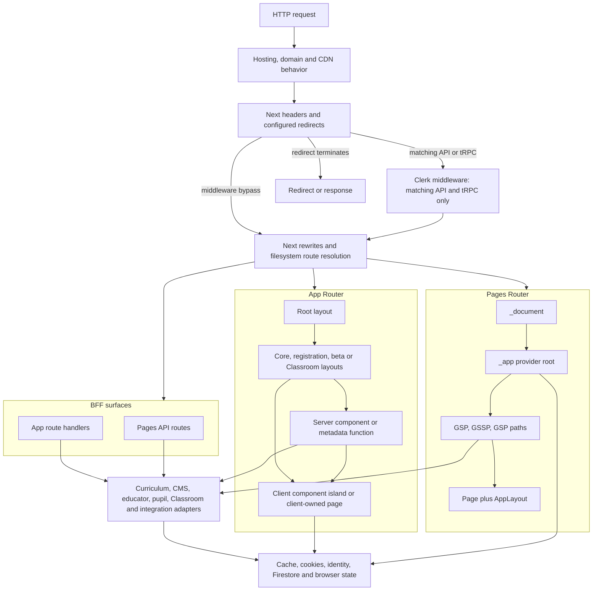

# OWA runtime, routing and rendering architecture

## Scope and method

This is a source-backed concept exploration of the Oak Web Application (OWA) at
commit
[`510ac63a62fb37a70183b00ce0f5fb15be4491e5`](https://github.com/oaknational/Oak-Web-Application/tree/510ac63a62fb37a70183b00ce0f5fb15be4491e5).
It follows the four movements in OCE's concept-exploration Practice: raw
observation, problem-space definition, reflective reopening of possible
explanations, then a synthesis with warranted and falsifiable next
investigations.

The scope is execution architecture:

- request ingress and middleware;
- Pages Router and App Router ownership;
- route groups, layouts, composition roots and providers;
- rendering, data-loading and freshness lifetimes;
- route handlers and Pages API routes as backend-for-frontend (BFF) surfaces;
- redirects, not-found behavior and error propagation;
- client/server boundaries; and
- the assurance that exercises those mechanisms.

It does not propose an OCE target architecture. Framework convention is
evidence of how OWA currently works, not evidence that the same mechanism is an
Oak requirement. Existing maps provide the wider [system context](../system-map.md),
the detailed [shell comparison](../runtime-shell-parity.md), and a cross-system
view of [freshness and failure](../freshness-and-failure.md).

Evidence labels are strict:

- **Observed**: directly evidenced by source, configuration or a reproducible
  repository inventory at the pinned commit.
- **Inferred**: the least-assumptive explanation connecting multiple
  observations.
- **Repository claim**: a code comment or repository document states intent;
  runtime evidence has not independently confirmed it.
- **Unknown**: source does not establish the fact.
- **Candidate explanation**: a model to investigate, not a conclusion.
- **Falsifier**: evidence that would refute or materially change a candidate
  explanation or proposed investigation.

Inventory counts were produced from the clean pinned tree with `find` and `rg`.
They describe source shape, not traffic, importance, quality or deployed
behavior.

## Movement 1: reflect on the raw observations

### Observation 1: the execution path is a policy graph, not only a router tree

**Observed:** the repository uses Next 15.5 and React 18.3, with one `next
build`/`next start` deployment unit
([package and scripts](https://github.com/oaknational/Oak-Web-Application/blob/510ac63a62fb37a70183b00ce0f5fb15be4491e5/package.json#L1-L14),
[runtime dependencies](https://github.com/oaknational/Oak-Web-Application/blob/510ac63a62fb37a70183b00ce0f5fb15be4491e5/package.json#L150-L184)).
That unit contains two active UI routers and two API mechanisms.

**Observed:** the pinned tree contains:

| Filesystem surface                | Count | Directly visible execution role                                   |
| --------------------------------- | ----: | ----------------------------------------------------------------- |
| `src/pages/**/*.tsx`              |    70 | Pages UI routes plus `_app`, `_document` and `_error`             |
| `src/pages/api/**/*.ts`           |    12 | Pages API endpoints                                               |
| `src/app/**/page.tsx`             |    27 | App pages                                                         |
| `src/app/**/route.ts`             |    15 | App route handlers                                                |
| `src/app/**/layout.tsx`           |     9 | App root and nested layout profiles                               |
| App error/loading/not-found files |     7 | Three `error`, one `global-error`, one `loading`, two `not-found` |

The [Pages tree](https://github.com/oaknational/Oak-Web-Application/tree/510ac63a62fb37a70183b00ce0f5fb15be4491e5/src/pages)
still owns the pupil lesson runtime, editorial pages, canonical teacher lesson
routes and My Library. The [App tree](https://github.com/oaknational/Oak-Web-Application/tree/510ac63a62fb37a70183b00ce0f5fb15be4491e5/src/app)
owns integrated teacher browse, search, onboarding, Classroom and beta
timetabling surfaces.

**Inferred:** "dual router" is a useful inventory label but an incomplete
architectural model. Route outcome is also controlled by hosting behavior,
Next configuration, middleware matching, a separate typed URL catalogue,
route-local guards, upstream curriculum redirect data, cache state and client
effects.

### Observation 2: request ingress has several authorities

#### Platform and build configuration

**Observed:** `vercel.json` selects three European regions but declares no
route policy
([source](https://github.com/oaknational/Oak-Web-Application/blob/510ac63a62fb37a70183b00ce0f5fb15be4491e5/vercel.json#L1-L4)).
`netlify.toml` also remains executable source: it redirects Netlify hostnames to
the canonical domain and attaches an edge redirect function to preview and
branch deploys
([source](https://github.com/oaknational/Oak-Web-Application/blob/510ac63a62fb37a70183b00ce0f5fb15be4491e5/netlify.toml#L4-L48)).
**Unknown:** which of those paths receives production traffic; see the wider
[production topology](../production-topology.md).

**Observed:** evaluating `next.config.ts` is itself a prerequisite for a
non-test build. It loads an externally located Oak configuration, derives
release identity from hosting environment variables, and fails when
`OAK_CONFIG_LOCATION` is absent
([source](https://github.com/oaknational/Oak-Web-Application/blob/510ac63a62fb37a70183b00ce0f5fb15be4491e5/next.config.ts#L44-L83)).
It also writes the sitemap base URL to `.env.local` and `process.env` while the
configuration is evaluated
([source](https://github.com/oaknational/Oak-Web-Application/blob/510ac63a62fb37a70183b00ce0f5fb15be4491e5/next.config.ts#L519-L564)).

**Authority:** build-time Oak configuration and hosting variables determine
service endpoints, release identity, allowed image hosts, observability build
plugins and some request policy before a route executes.

**Lifetime:** configuration evaluation/build, with emitted artifacts then used
by the deployed process and browser bundle.

**Failure:** missing configuration aborts configuration evaluation; production
source-map reporting behavior branches between Sentry and Bugsnag
([source](https://github.com/oaknational/Oak-Web-Application/blob/510ac63a62fb37a70183b00ce0f5fb15be4491e5/next.config.ts#L294-L350)).

**Assurance:** build, bundle-analysis and post-build sitemap commands exist, but
no build output or route manifest is committed at the snapshot
([scripts](https://github.com/oaknational/Oak-Web-Application/blob/510ac63a62fb37a70183b00ce0f5fb15be4491e5/package.json#L8-L14)).

#### Next headers, redirects and rewrites

**Observed:** Next configuration applies:

- an API-catalog discovery header on `/`;
- special CORS, framing and bypass-cookie headers to `/api/pupil/:path*`;
- reporting and report-only CSP headers globally
  ([source](https://github.com/oaknational/Oak-Web-Application/blob/510ac63a62fb37a70183b00ce0f5fb15be4491e5/next.config.ts#L122-L191));
- static permanent redirect families for pupil section defaults, renamed About
  pages, EYFS and integrated teacher journeys
  ([source](https://github.com/oaknational/Oak-Web-Application/blob/510ac63a62fb37a70183b00ce0f5fb15be4491e5/next.config.ts#L380-L484)); and
- a well-known API-catalog rewrite plus development-only PostHog proxy rewrites
  ([source](https://github.com/oaknational/Oak-Web-Application/blob/510ac63a62fb37a70183b00ce0f5fb15be4491e5/next.config.ts#L486-L516)).

**Authority:** this layer owns matches that occur before page or handler code.
The route files do not see a request that a configured redirect has already
terminated.

**Lifetime:** generated configuration, applied per matching request by the
framework/host.

**Failure:** invalid or stale destinations are not represented through the
application's `OakError` taxonomy; they are configuration behavior.

**Assurance:** **Unknown.** No dedicated parity test was found that compares
these declarations with filesystem routes, `OAK_PAGES`, deployed responses or
upstream redirect records.

#### Middleware and authentication context

**Observed:** the only Next middleware is `clerkMiddleware()`. Its matcher is
limited to `/api` or `/trpc` and excludes `/api/classroom/*`; a comment says
this narrowing avoids page latency and enables Clerk only where backend session
access is needed
([source](https://github.com/oaknational/Oak-Web-Application/blob/510ac63a62fb37a70183b00ce0f5fb15be4491e5/src/middleware.ts#L1-L16)).

**Observed:** the middleware does not call `auth.protect()` or express endpoint
authorization. Pages API educator handlers perform their own `getAuth` check
([example](https://github.com/oaknational/Oak-Web-Application/blob/510ac63a62fb37a70183b00ce0f5fb15be4491e5/src/pages/api/educator/getSavedContentLists/index.ts#L18-L31));
App onboarding handlers call `currentUser`
([example](https://github.com/oaknational/Oak-Web-Application/blob/510ac63a62fb37a70183b00ce0f5fb15be4491e5/src/app/api/auth/onboarding/route.ts#L7-L35));
Classroom handlers instead require package-specific access-token/session
headers
([example](https://github.com/oaknational/Oak-Web-Application/blob/510ac63a62fb37a70183b00ce0f5fb15be4491e5/src/app/api/classroom/attachment/create/route.ts#L12-L47)).

**Inferred:** middleware supplies identity context to a subset of BFF routes;
authorization authority remains route- or provider-specific. It is not a
single protected-route boundary.

**Unknown:** hosting firewall rules, deployment protection and provider-side
authorization may add controls not visible in this source.

#### Filesystem and URL-catalogue authority

**Observed:** the actual handlers are selected by two filesystem routers. In
parallel, `OAK_PAGES` defines typed internal path patterns, external
destinations and analytics page names, then `resolveOakHref` turns semantic
page arguments into links
([factory](https://github.com/oaknational/Oak-Web-Application/blob/510ac63a62fb37a70183b00ce0f5fb15be4491e5/src/common-lib/urls/urls.ts#L420-L511),
[catalogue examples](https://github.com/oaknational/Oak-Web-Application/blob/510ac63a62fb37a70183b00ce0f5fb15be4491e5/src/common-lib/urls/urls.ts#L686-L819),
[resolver](https://github.com/oaknational/Oak-Web-Application/blob/510ac63a62fb37a70183b00ce0f5fb15be4491e5/src/common-lib/urls/urls.ts#L943-L970)).

**Observed:** the catalogue is not the router: it includes multiple semantic
names for `/`, external domains, and internal Classroom routes, while filesystem
files independently determine whether those paths execute
([source](https://github.com/oaknational/Oak-Web-Application/blob/510ac63a62fb37a70183b00ce0f5fb15be4491e5/src/common-lib/urls/urls.ts#L618-L670),
[source](https://github.com/oaknational/Oak-Web-Application/blob/510ac63a62fb37a70183b00ce0f5fb15be4491e5/src/common-lib/urls/urls.ts#L844-L939)).

**Authority:** filesystem names own request dispatch; `OAK_PAGES` owns much of
link construction and page-name analytics; Next config and upstream data can
supersede either with redirects.

**Failure:** a failed `resolveOakHref` is reported and degrades to `/`, rather
than refusing link creation
([source](https://github.com/oaknational/Oak-Web-Application/blob/510ac63a62fb37a70183b00ce0f5fb15be4491e5/src/common-lib/urls/urls.ts#L955-L970)).

### Observation 3: the two router roots implement overlapping but different hosts

#### Pages composition root

**Observed:** `_document` owns the outer HTML, `en-GB`, styled-components
server collection and release metadata
([source](https://github.com/oaknational/Oak-Web-Application/blob/510ac63a62fb37a70183b00ce0f5fb15be4491e5/src/pages/_document.tsx#L14-L63)).
`_app` then owns a broad client provider tree: Clerk, consent, legacy and Oak
themes, global styles, a client error boundary, PostHog, analytics, pupil
client, React Aria overlay, menu, toast, save count, notifications, global
browser hooks and sprite sheets
([source](https://github.com/oaknational/Oak-Web-Application/blob/510ac63a62fb37a70183b00ce0f5fb15be4491e5/src/pages/_app.tsx#L40-L95)).

**Observed:** common page chrome is not in `_app`. Individual Pages routes
usually render `AppLayout`, which owns SEO, organization structured data,
top navigation, the `main` landmark, footer and preview controls
([source](https://github.com/oaknational/Oak-Web-Application/blob/510ac63a62fb37a70183b00ce0f5fb15be4491e5/src/components/AppComponents/AppLayout/AppLayout.tsx#L28-L79)).

**Authority:** `_document` owns document emission, `_app` owns cross-Page client
services, each loader owns serializable initial data, and each page composition
chooses its chrome and SEO.

**Lifetime:** `_document` and loaders execute in server/build contexts; the
provider tree becomes browser-resident for Pages navigation; route components
and `AppLayout` change with the selected page.

**Failure:** server data errors pass through `getPageProps`; render errors pass
through the `_app` client boundary; framework failures can use `_error`, `404`
or `500`.

**Cross-link:** the exact provider differences are mapped in
[runtime-shell parity](../runtime-shell-parity.md).

#### App composition roots and route profiles

**Observed:** App Router has one outer root and several nested profiles rather
than one uniform shell:

| Profile                     | Nested layout behavior                                                                                                                                |
| --------------------------- | ----------------------------------------------------------------------------------------------------------------------------------------------------- |
| Root                        | HTML, `lang="en"`, metadata, styled-components registry, theme, consent, PostHog, notifications, Clerk, analytics, browser hooks, menu and save count |
| `(core)`                    | Cached curriculum navigation, `main`, footer, draft controls and a two-hour `revalidate` declaration                                                  |
| `(core)/teachers`           | Adds only an injected-error control                                                                                                                   |
| EYFS subject                | Fetches subject data and owns header/navigation around its page                                                                                       |
| `(registration)/onboarding` | Client-side Clerk loading/auth/onboarding gate and redirect                                                                                           |
| `(beta)/timetabling`        | Server-side, cookie-dependent PostHog feature gate                                                                                                    |
| `classroom`                 | Client provider seeded from URL query state plus journey analytics                                                                                    |
| `classroom/browse`          | Client package authentication and attachment-composition guard                                                                                        |
| Classroom printable results | Client package authentication with pupil cookie keys                                                                                                  |

The root composition is directly visible in
[`src/app/layout.tsx`](https://github.com/oaknational/Oak-Web-Application/blob/510ac63a62fb37a70183b00ce0f5fb15be4491e5/src/app/layout.tsx#L43-L113).
The core shell loads top navigation and draft state
([source](https://github.com/oaknational/Oak-Web-Application/blob/510ac63a62fb37a70183b00ce0f5fb15be4491e5/src/app/%28core%29/layout.tsx#L11-L40)).
The Classroom root deliberately starts with a client directive and derives
provider identity from search parameters
([source](https://github.com/oaknational/Oak-Web-Application/blob/510ac63a62fb37a70183b00ce0f5fb15be4491e5/src/app/classroom/layout.tsx#L1-L66)).

**Observed:** the root's client providers accept `children`, so server-rendered
route content can be passed through client-owned service boundaries. Nested
layouts decide whether further work stays on the server or moves fully into a
client route.

**Authority:** root layouts own services common to their subtree; route-group
layouts own chrome, feature availability or identity gates; leaf pages own
data and view composition.

**Lifetime:** a server layout can load data for a route subtree; client layouts
hold browser state across navigation within their subtree. Exact remount and
cache behavior is framework-controlled and was not measured here.

**Failure:** the root, core and Classroom profiles have distinct error
boundaries. Feature-gated layouts translate a disabled flag into `notFound`.

**Inferred:** the observable unit is a set of execution profiles, not "the App
Router shell." Core public content, registration, beta and Classroom have
materially different chrome, identity and rendering obligations.

### Observation 4: rendering and freshness are a stack of distinct lifetimes

#### Pages Router rendering

**Observed:** of 70 Pages TSX files, 55 reference `getStaticProps`, 39 reference
`getStaticPaths`, and 10 reference `getServerSideProps`. These categories
overlap where a dynamic static page declares both props and paths. Two framework
root files use `getInitialProps`.

**Observed:** the common `getStaticPaths` helper returns no build-time paths and
`fallback: "blocking"`. The ISR module uses the same empty blocking result when
ISR is enabled; when disabled, individual routes may enumerate paths
([helper](https://github.com/oaknational/Oak-Web-Application/blob/510ac63a62fb37a70183b00ce0f5fb15be4491e5/src/pages-helpers/get-static-paths.ts#L1-L22),
[ISR policy](https://github.com/oaknational/Oak-Web-Application/blob/510ac63a62fb37a70183b00ce0f5fb15be4491e5/src/node-lib/isr/index.ts#L7-L51)).

**Observed:** `getPageProps` is the principal Pages loading wrapper. It catches
`OakError` instances configured as 404, reports other errors, rethrows them for
Next, and by default adds an environment-configured revalidation interval
([source](https://github.com/oaknational/Oak-Web-Application/blob/510ac63a62fb37a70183b00ce0f5fb15be4491e5/src/node-lib/getPageProps.ts#L21-L82)).
The pinned tree has 52 calls to that wrapper and three explicit
`withIsr: false` uses.

**Observed:** a canonical pupil overview route is mostly a thin adapter: it
adds a lesson section to route params and delegates to the shared pupil loader
([source](https://github.com/oaknational/Oak-Web-Application/blob/510ac63a62fb37a70183b00ce0f5fb15be4491e5/src/pages/pupils/lessons/%5BlessonSlug%5D/overview.tsx#L1-L37)).
The shared loader validates section and browse context, selects a query by page
type, resolves content availability, tries data-driven redirects on absence,
then constructs view props
([source](https://github.com/oaknational/Oak-Web-Application/blob/510ac63a62fb37a70183b00ce0f5fb15be4491e5/src/pages-helpers/pupil/lessons-pages/getProps.ts#L28-L145)).

**Observed:** a canonical teacher lesson page contains more orchestration in
the route itself: query, transcript enrichment, not-found/redirect conversion,
EYFS redirect and top-nav loading before serializing props
([source](https://github.com/oaknational/Oak-Web-Application/blob/510ac63a62fb37a70183b00ce0f5fb15be4491e5/src/pages/teachers/lessons/%5BlessonSlug%5D.tsx#L121-L180)).
An editorial blog route selects preview behavior, joins a post, all-post
categories and curriculum navigation, and serializes its date
([source](https://github.com/oaknational/Oak-Web-Application/blob/510ac63a62fb37a70183b00ce0f5fb15be4491e5/src/pages/blog/%5BblogSlug%5D.tsx#L77-L141)).

**Authority:** each route or shared page helper decides its query,
transformation, redirect and serializable view model. `getPageProps` centralizes
only failure translation/reporting and default ISR decoration.

**Lifetime:** some results are generated at build, many dynamic paths are first
resolved through blocking fallback, then regenerated on the configured
interval; selected routes are request-rendered.

**Failure:** 404-like provider errors can be converted into redirects or
framework not-found results. Other errors abort generation/request rendering
after reporting.

#### App Router rendering

**Observed:** 12 of the 27 App `page.tsx` files are explicitly client-owned.
They are concentrated in registration and Classroom. The integrated teacher
programme, unit, lesson, media, downloads and search pages begin as server
components, while their interactive views contain narrower client boundaries.

**Observed:** five teacher pages declare `dynamic = "force-static"`; the
download-success page declares `force-dynamic`; the core layout and teacher
sitemap declare `revalidate = 7200`. No `generateStaticParams` implementation
exists in `src/app` at this snapshot. Other routes rely on framework inference:
for example, beta timetabling reads request cookies to obtain a server-side
feature flag
([flag reader](https://github.com/oaknational/Oak-Web-Application/blob/510ac63a62fb37a70183b00ce0f5fb15be4491e5/src/utils/featureFlags.ts#L34-L61),
[gating layout](https://github.com/oaknational/Oak-Web-Application/blob/510ac63a62fb37a70183b00ce0f5fb15be4491e5/src/app/%28beta%29/timetabling/%5BsubjectPhaseSlug%5D/layout.tsx#L1-L18)).

**Observed:** App data has at least two explicit memoization layers:

1. React `cache` deduplicates calls made with the same arguments during React
   rendering, including calls shared by page and `generateMetadata`.
2. `cacheData` wraps `unstable_cache`, defaulting to 7,200 seconds and allowing
   tags for invalidation
   ([source](https://github.com/oaknational/Oak-Web-Application/blob/510ac63a62fb37a70183b00ce0f5fb15be4491e5/src/node-lib/cache/index.ts#L1-L33)).

**Observed:** the programme page composes both. It caches subject options,
curriculum overview/sequence data and a concurrent join of two CMS queries plus
materialized-view refresh time
([programme cache composition](https://github.com/oaknational/Oak-Web-Application/blob/510ac63a62fb37a70183b00ce0f5fb15be4491e5/src/app/%28core%29/teachers/programmes/%5Bslug%5D/%5Btab%5D/page.tsx#L45-L90),
[curriculum query fan-out](https://github.com/oaknational/Oak-Web-Application/blob/510ac63a62fb37a70183b00ce0f5fb15be4491e5/src/app/%28core%29/teachers/programmes/%5Bslug%5D/%5Btab%5D/getProgrammeData.ts#L20-L78),
[join](https://github.com/oaknational/Oak-Web-Application/blob/510ac63a62fb37a70183b00ce0f5fb15be4491e5/src/app/%28core%29/teachers/programmes/%5Bslug%5D/%5Btab%5D/getProgrammeData.ts#L133-L170)).

**Observed:** `generateMetadata` and the programme page separately validate
params and call the cached subject-data function. The page then applies slug
redirects, not-found rules, curriculum/CMS joins, URL-derived filters and
download/tracking projections before rendering a client `ProgrammeView`
([metadata](https://github.com/oaknational/Oak-Web-Application/blob/510ac63a62fb37a70183b00ce0f5fb15be4491e5/src/app/%28core%29/teachers/programmes/%5Bslug%5D/%5Btab%5D/page.tsx#L92-L152),
[page orchestration](https://github.com/oaknational/Oak-Web-Application/blob/510ac63a62fb37a70183b00ce0f5fb15be4491e5/src/app/%28core%29/teachers/programmes/%5Bslug%5D/%5Btab%5D/page.tsx#L154-L303)).

**Authority:** route-segment declarations, use of request APIs and explicit
cache wrappers jointly determine execution/freshness. Route code owns the
semantic join and output view model.

**Lifetime:** the source distinguishes render-pass memoization, cross-request
cached data, segment revalidation, per-request values such as draft mode and
cookies, and long-lived client state. The exact deployed interaction between
those layers is not proven by static source.

**Failure:** the common App HOC maps 404-configured `OakError` to `notFound`,
avoids reporting two recognized Next sentinel messages, reports other errors
and rethrows
([source](https://github.com/oaknational/Oak-Web-Application/blob/510ac63a62fb37a70183b00ce0f5fb15be4491e5/src/hocs/withPageErrorHandling.tsx#L24-L71)).

#### Other freshness lifetimes

**Observed:** freshness policy is not limited to page caching:

- `GET /api/pupil/lesson-attempt` declares `revalidate = 60`
  ([source](https://github.com/oaknational/Oak-Web-Application/blob/510ac63a62fb37a70183b00ce0f5fb15be4491e5/src/app/api/pupil/lesson-attempt/route.ts#L1-L31));
- AI-derived search intent sets a Cloudflare shared-cache lifetime of 30 days,
  while direct matches return without that header
  ([source](https://github.com/oaknational/Oak-Web-Application/blob/510ac63a62fb37a70183b00ce0f5fb15be4491e5/src/pages/api/search/intent/index.ts#L30-L93));
- curriculum-download responses set `s-maxage` plus
  `stale-while-revalidate`, and include materialized-view refresh time in an
  output hash
  ([source](https://github.com/oaknational/Oak-Web-Application/blob/510ac63a62fb37a70183b00ce0f5fb15be4491e5/src/pages/api/curriculum-downloads/index.ts#L350-L390)); and
- the well-known API catalogue sets a one-hour public max age
  ([source](https://github.com/oaknational/Oak-Web-Application/blob/510ac63a62fb37a70183b00ce0f5fb15be4491e5/src/app/api/well-known/api-catalog/route.ts#L72-L82)).

**Inferred:** freshness is currently an emergent result of segment declarations,
two cache APIs, per-route response headers, upstream identity and hosting/CDN
behavior. A single "OWA cache duration" does not exist.

### Observation 5: data loading is page-oriented orchestration over validated adapters

**Observed:** the curriculum boundary exposes a page-oriented facade containing
teacher, pupil, search, redirect, sitemap and navigation queries
([source](https://github.com/oaknational/Oak-Web-Application/blob/510ac63a62fb37a70183b00ce0f5fb15be4491e5/src/node-lib/curriculum-api-2023/index.ts#L103-L164)).
Its generated GraphQL client is configured once with a bearer key and wraps
operations in three retries, logging intermediate failures and reporting the
last attempt as a `graphql/timeout` Oak error
([source](https://github.com/oaknational/Oak-Web-Application/blob/510ac63a62fb37a70183b00ce0f5fb15be4491e5/src/node-lib/curriculum-api-2023/sdk.ts#L12-L57)).

**Observed:** generated GraphQL typing is not treated as sufficient runtime
evidence. The pupil lesson adapter:

- constructs query predicates from canonical or browse context;
- reports uniqueness-assumption violations;
- intersects actions/features across canonical variants;
- applies overrides/exceptions;
- throws domain-coded not-found errors; and
- parses browse/content records with Zod before camel-casing them
  ([source](https://github.com/oaknational/Oak-Web-Application/blob/510ac63a62fb37a70183b00ce0f5fb15be4491e5/src/node-lib/curriculum-api-2023/queries/pupilLesson/pupilLesson.query.ts#L24-L135)).

**Observed:** the integrated teacher lesson adapter similarly applies
publication/exclusion rules, enforces record presence and runtime schemas, then
derives navigation and presentation data
([source](https://github.com/oaknational/Oak-Web-Application/blob/510ac63a62fb37a70183b00ce0f5fb15be4491e5/src/node-lib/curriculum-api-2023/queries/teachersLessonOverview/teachersLessonOverview.query.ts#L300-L378)).

**Observed:** the CMS boundary is another page-oriented facade. It binds
generated Sanity operations to page schemas and selection/projection functions
([source](https://github.com/oaknational/Oak-Web-Application/blob/510ac63a62fb37a70183b00ce0f5fb15be4491e5/src/node-lib/cms/sanity-client/index.ts#L40-L108),
[source](https://github.com/oaknational/Oak-Web-Application/blob/510ac63a62fb37a70183b00ce0f5fb15be4491e5/src/node-lib/cms/sanity-client/index.ts#L193-L270)).
In preview mode its parser can discard invalid list items and prefer drafts;
outside preview it parses the complete result strictly
([source](https://github.com/oaknational/Oak-Web-Application/blob/510ac63a62fb37a70183b00ce0f5fb15be4491e5/src/node-lib/cms/sanity-client/parseResults.ts#L84-L145)).

**Authority:** upstream services own source records; generated clients own
transport types; handwritten query adapters own runtime acceptance,
not-found/uniqueness interpretation, Oak overrides and page models; route
loaders own cross-provider joins and navigation outcomes.

**Lifetime:** module-scoped clients/configuration persist with the server
process; calls execute at build, revalidation or request time depending on the
calling route; cached App wrappers may outlive one request.

**Failure:** transport retries, runtime schema rejection, explicit domain errors
and tolerant subfield handling coexist. For example, invalid lesson media clips
are reported and replaced with `null`, while invalid core lesson records abort
the query
([source](https://github.com/oaknational/Oak-Web-Application/blob/510ac63a62fb37a70183b00ce0f5fb15be4491e5/src/node-lib/curriculum-api-2023/queries/teachersLessonOverview/teachersLessonOverview.query.ts#L168-L197)).

**Inferred:** the principal reusable server unit is not a generic repository.
It is a transport-plus-policy adapter that often returns a page-shaped model.
That makes route code relatively direct, but splits some page authority between
query modules, `pages-helpers`, route files and view helpers.

### Observation 6: the BFF is a family of endpoint contracts, not one API layer

#### Endpoint families

**Observed:** Pages API routes cover curriculum document generation, saved
content, health, HubSpot, AI search intent and Mux signing. App route handlers
cover onboarding/region identity metadata, Clerk webhooks, preview, pupil
attempts, teacher notes, Classroom OAuth/context/progress/submission and the API
catalogue.

| Family                 | Authority and state                                                        | Request lifetime and failure shape                                                                |
| ---------------------- | -------------------------------------------------------------------------- | ------------------------------------------------------------------------------------------------- |
| Educator saved content | Clerk user identity, Educator GraphQL API, route projection                | Request-authenticated; Zod parse; JSON 401/500; source records projected to My Library            |
| Onboarding             | Clerk current user and metadata                                            | Request-authenticated; Zod body; metadata update; invalid input 400; other errors escape          |
| Pupil attempt/note     | Firestore-backed pupil datastore; note DLP                                 | Identifier/key or payload validated locally; route-specific 400/404/500 responses                 |
| Classroom              | Google Classroom add-on package, encrypted session/access token, Firestore | Classroom middleware exclusion; explicit headers; provider exception translation; OAuth redirects |
| Search intent          | Static curriculum suggestion data, optional model call, Upstash limit      | Direct local match or rate-limited AI call; Cloudflare cache only for AI result                   |
| Curriculum export      | Curriculum/CMS data and in-process document builders                       | Synchronous request fan-out and generation; binary response with shared-cache policy              |
| Clerk webhook          | Signed Svix event, Educator API and analytics side effects                 | Signature validation; sequential event switch; selected failures return 500                       |

**Observed:** endpoint contract styles differ. Educator routes validate provider
responses and reshape them for UI use
([source](https://github.com/oaknational/Oak-Web-Application/blob/510ac63a62fb37a70183b00ce0f5fb15be4491e5/src/pages/api/educator/getSavedContentLists/index.ts#L18-L100)).
The pupil-attempt handler validates writes but returns datastore reads directly
([source](https://github.com/oaknational/Oak-Web-Application/blob/510ac63a62fb37a70183b00ce0f5fb15be4491e5/src/app/api/pupil/lesson-attempt/route.ts#L10-L69)).
Teacher-note writes run two DLP checks before upsert, while `PUT` starts a batch
redaction call without awaiting it
([source](https://github.com/oaknational/Oak-Web-Application/blob/510ac63a62fb37a70183b00ce0f5fb15be4491e5/src/app/api/teacher/note/route.ts#L37-L91)).

**Unknown:** whether an external control restricts the teacher-note batch
endpoint. No route-local authorization check is visible, and the middleware
only establishes Clerk context; source alone does not prove deployed
reachability or authorization.

#### Classroom as a nested execution system

**Observed:** `/api/classroom/*` intentionally bypasses Clerk middleware. A
browser client reads package-defined cookies, sends `Authorization` and
`X-Oakgc-Session`, calls OWA route handlers and normalizes provider failures
([source](https://github.com/oaknational/Oak-Web-Application/blob/510ac63a62fb37a70183b00ce0f5fb15be4491e5/src/browser-lib/google-classroom/googleClassroomApi.ts#L12-L77)).
Each handler constructs an `OakGoogleClassroomAddOn` server object with secrets,
Firestore and a request-derived callback/base URL
([source](https://github.com/oaknational/Oak-Web-Application/blob/510ac63a62fb37a70183b00ce0f5fb15be4491e5/src/node-lib/google-classroom/getOakGoogleClassroomAddon.ts#L1-L32)).

**Observed:** the OAuth callback exchanges the code, optionally performs a
newsletter side effect, then places encrypted session and access token values
in a redirect query string to the client success route
([source](https://github.com/oaknational/Oak-Web-Application/blob/510ac63a62fb37a70183b00ce0f5fb15be4491e5/src/app/api/classroom/auth/callback/route.ts#L76-L138)).
The client auth layer subsequently stores/reads package cookie keys and calls
verification endpoints. The Classroom pupil page verifies its own credential
profile and then pushes into the Pages-owned pupil lesson route
([source](https://github.com/oaknational/Oak-Web-Application/blob/510ac63a62fb37a70183b00ce0f5fb15be4491e5/src/app/classroom/pupil/programmes/%5BprogrammeSlug%5D/%5BunitSlug%5D/%5BlessonSlug%5D/page.tsx#L17-L44)).

**Authority:** Google/package contracts own OAuth and session semantics; OWA
handlers own HTTP adaptation, environment wiring, newsletter integration and
some Firestore joins; client layouts own verification flow and handoff.

**Lifetime:** request-local server package instances; cookie-backed browser
credentials; client provider state for the Classroom route subtree; Firestore
for durable attachment/progress state.

**Failure:** package-specific exceptions are converted to JSON, other failures
usually become 500, and client helpers sometimes convert failures into `null`
or `authenticated: false`
([source](https://github.com/oaknational/Oak-Web-Application/blob/510ac63a62fb37a70183b00ce0f5fb15be4491e5/src/browser-lib/google-classroom/googleClassroomApi.ts#L79-L140),
[source](https://github.com/oaknational/Oak-Web-Application/blob/510ac63a62fb37a70183b00ce0f5fb15be4491e5/src/browser-lib/google-classroom/googleClassroomApi.ts#L189-L203)).

**Cross-link:** the outcome path is traced in
[Classroom assignment to submission](../journeys/classroom-assignment-to-submission.md).

#### Browser-mediated BFF state

**Observed:** My Library is statically generated with only navigation data,
then client HOCs gate identity/onboarding and a hook fetches the authenticated
Educator BFF
([route](https://github.com/oaknational/Oak-Web-Application/blob/510ac63a62fb37a70183b00ce0f5fb15be4491e5/src/pages/teachers/my-library.tsx#L15-L57),
[auth HOC](https://github.com/oaknational/Oak-Web-Application/blob/510ac63a62fb37a70183b00ce0f5fb15be4491e5/src/hocs/withPageAuthRequired.tsx#L5-L42)).
The hook validates the BFF response again, derives local presentation state and
performs optimistic save/unsave updates with rollback callbacks
([source](https://github.com/oaknational/Oak-Web-Application/blob/510ac63a62fb37a70183b00ce0f5fb15be4491e5/src/node-lib/educator-api/helpers/saveUnits/useMyLibrary.tsx#L28-L125),
[source](https://github.com/oaknational/Oak-Web-Application/blob/510ac63a62fb37a70183b00ce0f5fb15be4491e5/src/node-lib/educator-api/helpers/saveUnits/useMyLibrary.tsx#L138-L231)).

**Inferred:** for authenticated Pages outcomes, the initial page response can be
public/static while authority is resolved after hydration by Clerk and the BFF.
The user's observed state therefore depends on server projection, client cache,
provider readiness and optimistic local transitions.

### Observation 7: redirects, absence and errors form a distributed protocol

#### Redirect classes

**Observed:** redirect decisions occur in at least five places:

1. host/Netlify redirects;
2. `next.config.ts` path redirects;
3. Pages loader `{ redirect }` results;
4. App `redirect`/`permanentRedirect` calls; and
5. client `router.replace`/`router.push` effects.

**Observed:** curriculum redirects are data-driven and run only after a primary
lesson/unit lookup is treated as absent. The shared helper selects canonical or
browse and teacher or pupil redirect queries, then returns provider-specified
307/308 status with `?redirected=true`
([source](https://github.com/oaknational/Oak-Web-Application/blob/510ac63a62fb37a70183b00ce0f5fb15be4491e5/src/pages-helpers/shared/lesson-pages/getRedirects.ts#L20-L90)).
App unit pages instead fetch valid programmes and call `permanentRedirect` when
the requested programme is not valid for the unit
([source](https://github.com/oaknational/Oak-Web-Application/blob/510ac63a62fb37a70183b00ce0f5fb15be4491e5/src/app/%28core%29/teachers/programmes/%5Bslug%5D/units/%5BunitSlug%5D/lessons/getCachedUnitData.ts#L29-L69)).

**Observed:** registration and Classroom also redirect after client identity
resolution. Onboarding waits for Clerk, uses a same-origin-safe `returnTo`, and
replaces the current route for already-onboarded users
([source](https://github.com/oaknational/Oak-Web-Application/blob/510ac63a62fb37a70183b00ce0f5fb15be4491e5/src/app/%28registration%29/onboarding/layout.tsx#L37-L75)).

**Authority:** canonicalization is divided among static site policy, curriculum
data, route validation, identity state and client journey state.

**Failure:** a redirect lookup can fail independently of the primary data
lookup. App redirect/not-found primitives throw framework control-flow errors,
which the common error wrapper identifies by message string.

#### Not-found and error hierarchy

**Observed:** Pages `getPageProps` converts `OakError` with a 404 response
configuration to `{ notFound: true }`; the App HOC performs the equivalent
conversion with `notFound()`
([Pages](https://github.com/oaknational/Oak-Web-Application/blob/510ac63a62fb37a70183b00ce0f5fb15be4491e5/src/node-lib/getPageProps.ts#L53-L82),
[App](https://github.com/oaknational/Oak-Web-Application/blob/510ac63a62fb37a70183b00ce0f5fb15be4491e5/src/hocs/withPageErrorHandling.tsx#L39-L70)).
The shared `OakError` catalogue encodes notification and optional HTTP-status
policy for provider/domain failure codes
([source](https://github.com/oaknational/Oak-Web-Application/blob/510ac63a62fb37a70183b00ce0f5fb15be4491e5/src/errors/OakError.ts#L48-L67),
[curriculum examples](https://github.com/oaknational/Oak-Web-Application/blob/510ac63a62fb37a70183b00ce0f5fb15be4491e5/src/errors/OakError.ts#L159-L181)).

**Observed:** App has three rendering boundaries:

- `global-error` reconstructs HTML/body/theme and offers a browser reload
  ([source](https://github.com/oaknational/Oak-Web-Application/blob/510ac63a62fb37a70183b00ce0f5fb15be4491e5/src/app/global-error.tsx#L18-L60));
- root and core errors render the shared retry/back fallback with different
  reporter identities
  ([root](https://github.com/oaknational/Oak-Web-Application/blob/510ac63a62fb37a70183b00ce0f5fb15be4491e5/src/app/error.tsx#L10-L25),
  [core](https://github.com/oaknational/Oak-Web-Application/blob/510ac63a62fb37a70183b00ce0f5fb15be4491e5/src/app/%28core%29/error.tsx#L9-L20)); and
- Classroom renders its own product error view and reports in a client effect
  ([source](https://github.com/oaknational/Oak-Web-Application/blob/510ac63a62fb37a70183b00ce0f5fb15be4491e5/src/app/classroom/error.tsx#L1-L17)).

**Observed:** the generic App `not-found` component performs a client replace to
the Pages `/404`, while Classroom has a local 404 view
([root source](https://github.com/oaknational/Oak-Web-Application/blob/510ac63a62fb37a70183b00ce0f5fb15be4491e5/src/app/not-found.tsx#L1-L10),
[Classroom source](https://github.com/oaknational/Oak-Web-Application/blob/510ac63a62fb37a70183b00ce0f5fb15be4491e5/src/app/classroom/not-found.tsx#L1-L5)).
The Pages 404 and 500 themselves depend on curriculum top-nav loading and the
ordinary Pages data wrapper
([404 source](https://github.com/oaknational/Oak-Web-Application/blob/510ac63a62fb37a70183b00ce0f5fb15be4491e5/src/pages/404.tsx#L1-L28),
[500 source](https://github.com/oaknational/Oak-Web-Application/blob/510ac63a62fb37a70183b00ce0f5fb15be4491e5/src/pages/500.tsx#L1-L28)).

**Observed:** client render errors under Pages are caught by a selectable
Sentry/Bugsnag boundary. Reporting is conditional on prior consent-driven
service initialization; a local React boundary still renders a fallback when
the service is unavailable
([source](https://github.com/oaknational/Oak-Web-Application/blob/510ac63a62fb37a70183b00ce0f5fb15be4491e5/src/components/AppComponents/ErrorBoundary/ErrorBoundary.tsx#L54-L108)).

**Inferred:** "an OWA failure" has no single translation point. Provider errors,
route absence, redirect control flow, API response errors, server-render errors
and hydrated client errors each travel through different mechanisms before a
user sees recovery UI.

### Observation 8: client/server is an outcome-specific boundary, not a router-wide split

**Observed:** all Pages route components use the Pages hydration model, even
when their data was statically or server rendered. App route source is mixed:
12 leaf pages and 54 App TSX files carry `"use client"`; the rest default to
server components unless imported through a client boundary.

**Observed:** integrated teacher pages load curriculum/CMS and decide metadata,
redirects and absence on the server, then hand page-specific props into client
views. The lesson page, for example, fetches and memoizes its view model on the
server but wraps the rendered result in a client analytics store and uses
client lesson header/view components
([source](https://github.com/oaknational/Oak-Web-Application/blob/510ac63a62fb37a70183b00ce0f5fb15be4491e5/src/app/%28core%29/teachers/programmes/%5Bslug%5D/units/%5BunitSlug%5D/lessons/%5BlessonSlug%5D/page.tsx#L29-L118)).
Search similarly loads filter metadata on the server and renders a Suspense-
wrapped client view
([source](https://github.com/oaknational/Oak-Web-Application/blob/510ac63a62fb37a70183b00ce0f5fb15be4491e5/src/app/%28core%29/teachers/search/page.tsx#L21-L40)).

**Observed:** Classroom and onboarding choose client-owned layouts/pages because
their control flow depends on browser query parameters, Clerk hooks, package
cookie handling and client navigation. Some Classroom browse leaf pages remain
server components and pass curriculum results into client package views
([source](https://github.com/oaknational/Oak-Web-Application/blob/510ac63a62fb37a70183b00ce0f5fb15be4491e5/src/app/classroom/browse/years/%5ByearSlug%5D/subjects/page.tsx#L1-L43)).

**Observed:** global browser initialization is shared between router roots
through `AppHooks`: modal watching and storage cleanup run at module/browser
load, while consent-controlled error reporting, feedback, accessibility checks,
identity metadata and PostHog aliasing run as hooks
([source](https://github.com/oaknational/Oak-Web-Application/blob/510ac63a62fb37a70183b00ce0f5fb15be4491e5/src/components/AppComponents/App/AppHooks.tsx#L19-L65)).

**Authority:** server routes own secrets, initial queries, metadata and status
control where used; client islands own interaction, provider state and browser
integrations; BFF endpoints mediate browser access to privileged providers.

**Lifetime:** server component evaluation, request/build/cache lifetimes and
browser provider/store lifetimes intersect. Cross-router navigation can also
cross host roots, as the Classroom-to-pupil handoff demonstrates.

**Unknown:** no committed measurement here establishes the hydrated module
graph, payload, provider remount behavior or whether each current client
boundary is intentional.

### Observation 9: assurance is broad in source but uneven at execution boundaries

**Observed:** App has 23 page tests, 14 route-handler tests and 8 layout tests at
the snapshot. There are 76 tracked TypeScript test/spec files under
`src/__tests__/pages`, alongside tests for shared Pages loaders, ISR, App
caching, redirects and error wrappers. These are predominantly direct
module/component tests with mocked framework and provider boundaries.

**Observed:** deployed assurance includes Pa11y and Percy jobs triggered by
successful deployment status
([workflow](https://github.com/oaknational/Oak-Web-Application/blob/510ac63a62fb37a70183b00ce0f5fb15be4491e5/.github/workflows/post_deployment_actions.yml#L67-L176)).
Playwright can target a deployed base URL, but the committed E2E directory has
one teacher lesson/download spec
([configuration](https://github.com/oaknational/Oak-Web-Application/blob/510ac63a62fb37a70183b00ce0f5fb15be4491e5/playwright.config.ts#L8-L61),
[spec](https://github.com/oaknational/Oak-Web-Application/blob/510ac63a62fb37a70183b00ce0f5fb15be4491e5/src/tests/e2e/teacher/lesson-page.spec.ts#L1-L40)).

**Observed:** one route test illustrates a boundary-correspondence risk. The
production pupil-attempt route never sets `Cache-Control`, but its mocked
`NextResponse.json` returns a hard-coded `public, max-age=86400` for every
response; the test then asserts that value
([route](https://github.com/oaknational/Oak-Web-Application/blob/510ac63a62fb37a70183b00ce0f5fb15be4491e5/src/app/api/pupil/lesson-attempt/route.ts#L8-L31),
[mock and assertion](https://github.com/oaknational/Oak-Web-Application/blob/510ac63a62fb37a70183b00ce0f5fb15be4491e5/src/app/api/pupil/lesson-attempt/route.test.ts#L32-L46),
[assertion](https://github.com/oaknational/Oak-Web-Application/blob/510ac63a62fb37a70183b00ce0f5fb15be4491e5/src/app/api/pupil/lesson-attempt/route.test.ts#L87-L104)).

**Inferred:** unit coverage gives strong evidence for local branching and
projection logic, but weaker evidence for behavior created by the real Next
runtime, hosting/CDN, middleware ordering, cache interaction, cross-router
navigation and deployed failure status.

## Movement 2: define the problem space

### Kind, altitude and system behavior

This is primarily a **descriptive and explanatory** investigation at mechanism
and system altitude. OWA is a complicated technical system whose behavior is
also coupled to complex external content, identity, hosting and Classroom
systems. The immediate question is not "which router is better?" It is:

> What set of execution contracts makes an OWA request become the correct,
> fresh, accessible and recoverable Oak outcome, where is each contract
> authoritative, and which observed differences are requirements rather than
> migration or framework residue?

### Gap, affected parties and causal frame

**Gap:** the code implements rich outcomes, but execution authority and lifetime
are distributed across several overlapping mechanisms. Source names expose
mechanisms (`getStaticProps`, layout, middleware, cache, HOC, route handler)
more readily than the user/operational contract each mechanism preserves.

**Who this can harm:**

- users, when routing, identity, stale data or recovery behavior differs across
  otherwise related journeys;
- product and content owners, when update or publication semantics are implicit
  in framework/cache behavior;
- OWA maintainers, when a change must preserve a contract whose authority is
  distributed; and
- future Oak framework consumers, if current mechanisms are copied as presumed
  requirements or discarded without identifying the outcome they protect.

**Candidate causal mechanism:** successive product integrations and an active
router migration have placed new behavior beside still-active prior behavior.
At the same time, genuinely different outcomes (public content, authenticated
library, pupil lesson, editorial preview, Classroom add-on) require different
identity, freshness and interaction lifetimes. The present shape may therefore
be a mixture of intentional profiles, migration overlap, framework defaults and
provider-specific constraints.

**Falsifier:** repository history and runtime evidence show one deliberate,
documented execution model with every divergence tied to a current outcome
contract and no accidental overlap.

### Problem frames, not preferred solutions

| Frame                             | Gap to understand                                                               | Load-bearing mechanism hypothesis                                                                       | Success evidence                                                                                            |
| --------------------------------- | ------------------------------------------------------------------------------- | ------------------------------------------------------------------------------------------------------- | ----------------------------------------------------------------------------------------------------------- |
| PF-RR-01 Route authority          | Dispatch, link generation and canonicalization have several sources             | Filesystem, URL catalogue, config and curriculum redirects can drift because none is complete authority | Every meaningful path has one traceable dispatch/link/canonical contract, with intentional exceptions named |
| PF-RR-02 Execution lifetime       | Build, revalidation, request, cache, client and background work are interleaved | Mechanism-level defaults obscure the outcome freshness/durability requirement                           | Each outcome names authoritative state, permissible staleness, invalidation, retry and completion lifetime  |
| PF-RR-03 Host composition         | Cross-cutting obligations live in overlapping roots/profiles                    | Router migration plus outcome-specific shells makes common and local obligations hard to distinguish    | Common obligations and intentional profiles are evidenced behaviorally, including payload and failure cost  |
| PF-RR-04 Boundary authority       | Routes, adapters, BFFs and clients all validate/project data                    | Page-shaped adapters reduce view work but distribute policy and mapping ownership                       | Each invariant, projection and provider translation has one semantic owner and contract evidence            |
| PF-RR-05 Failure protocol         | Absence, redirect and error take many paths                                     | Framework control flow, domain errors and provider errors are translated at different layers            | Representative failures produce known status, UI, reporting, retry and data-integrity outcomes              |
| PF-RR-06 Assurance correspondence | Many local tests mock framework behavior                                        | Tests may prove mocked contracts rather than the deployed boundary                                      | Critical request, cache, auth and recovery claims are observed at their real boundary                       |

### Constraints on this understanding

- The pinned source is authoritative only for committed implementation, not
  current production state or intent.
- A code comment is not runtime proof.
- Next conventions describe implementation behavior, not why Oak needs it.
- Route/file counts do not indicate usage or value.
- Existing excellence and impact must be identified through user, content,
  educational, operational and production evidence before a mechanism is
  preserved or rejected.

## Movement 3: reflect on possible explanations

This movement reopens the fluent interpretations rather than selecting a future
design.

### Inherited assumption changed: "OWA has two routing architectures"

The starting label was too narrow. The routers are important, but routing
outcome is controlled by a larger graph: platform redirects, Next config,
middleware, filesystem dispatch, `OAK_PAGES`, upstream curriculum redirects,
server validation and client navigation.

**Changed model:** OWA has multiple **request and navigation authorities** that
intersect with two rendering frameworks.

**What would change this model:** a generated or runtime authority is found that
derives all those surfaces and proves they cannot drift.

### Inherited assumption changed: "Pages is legacy; App is the server-first destination"

Pages remains product-active for the pupil lesson engine, editorial content,
canonical teacher lessons, authenticated My Library and half of the BFF. App
contains server-first integrated teacher pages, but also client-owned
registration and Classroom subtrees. Cross-router handoffs are current journey
behavior.

**Changed model:** the meaningful distinction is outcome profile and execution
lifetime, not old router versus new router.

**What would change this model:** a current migration decision and traffic/deletion
plan show Pages outcomes are temporary compatibility only, with behaviorally
complete App replacements already proven.

### Inherited assumption changed: "there is one application shell"

Pages has `_document`, `_app` and page-level `AppLayout`. App has an outer root
plus core, registration, beta, Classroom and nested feature layouts. Provider
overlap is real, but profiles differ in chrome, identity, client weight,
preview and failure boundaries.

**Changed model:** shell behavior is a layered contract with several profiles;
whether it should be one abstraction is an unanswered question, not an
observation.

**What would change this model:** rendered traces show every route shares the
same obligations and lifecycle, with the apparent profiles merely syntactic.

### Inherited assumption changed: "static pages have one two-hour freshness policy"

Pages ISR reads configuration; App has segment revalidation, `unstable_cache`
and React memoization; request APIs force dynamic behavior; API responses add
one-hour, 30-day or document-specific CDN policies; preview changes CMS reads;
browser state and provider caches add further lifetimes.

**Changed model:** freshness is a compositional property of route, data,
preview, response and hosting layers.

**What would change this model:** deployed traces and build manifests show a
single effective cache authority that overrides all other declarations without
semantic variation.

### Inherited assumption changed: "middleware is the authentication boundary"

Middleware supplies Clerk context only to a narrow matcher and explicitly
excludes Classroom. Authorization is performed in selected routes, client HOCs,
the Classroom package and providers; some public pupil/note endpoints use
identifier/key contracts instead of Clerk identity.

**Changed model:** identity and authorization are endpoint/journey contracts
that happen to use middleware where Clerk server context is needed.

**What would change this model:** verified deployment policy proves all relevant
authorization is centrally enforced before route code, including the Classroom
exception and maintenance endpoints.

### Inherited assumption changed: "errors are centrally normalized"

`OakError` provides a useful vocabulary, and both router loaders map configured
404s. Yet API response shapes, redirect sentinels, tolerant parsing, provider
exceptions, client error boundaries and root/Classroom recovery remain
distinct.

**Changed model:** OWA has a partial shared error language embedded in multiple
failure protocols.

**What would change this model:** end-to-end failure tests demonstrate one
stable status/reporting/recovery contract across every execution profile.

### Inherited assumption changed: "test presence proves runtime behavior"

The route-test cache-header example shows why a mocked framework surface can
create evidence for behavior absent from production source. The broad local
suite remains valuable, but evidence strength depends on whether the tested
boundary is the one that creates the behavior.

**Changed model:** assurance must be classified by claim and boundary, not test
count.

**What would change this model:** real Next/deployed response traces confirm
that the mocked value is framework-generated and the test accurately models
that documented contract.

### Possible explanations still held open

1. **Intentional-profile explanation:** public, pupil, account and Classroom
   outcomes genuinely require different shells, lifetimes and failure behavior.
2. **Migration-overlap explanation:** much duplication and cross-router handoff
   is temporary but still carries current behavior that must be understood.
3. **Framework-gravity explanation:** some shape exists because successive Next
   APIs made that expression locally convenient, without an enduring Oak
   requirement.
4. **Provider-boundary explanation:** Classroom, Clerk, Sanity, curriculum and
   educator contracts require distinct adapters and failure semantics.
5. **Distributed-policy explanation:** some differences are accidental because
   no single artifact owns the outcome contract.

These explanations can coexist. Source alone does not warrant selecting one as
the identity of the system.

## Movement 4: synthesise and propose

### Holistic current-state model

**Synthesis:** OWA is one deployable whose execution architecture is a layered
policy graph. A request passes through hosting/build-derived policy, Next
headers/redirects/rewrites, a narrow identity-context middleware and one of two
filesystem routers. From there, an outcome-specific profile selects server,
cache and client lifetimes; page-oriented adapters validate and project
provider data; BFF routes mediate privileged or stateful effects; distributed
redirect/error rules decide status and recovery; client providers sustain
interaction and integration state.

The dominant recurring concepts are:

| Concept                     | Current authority                                            | Lifetime                             | Principal failure mode                                     | Assurance visible in source                       |
| --------------------------- | ------------------------------------------------------------ | ------------------------------------ | ---------------------------------------------------------- | ------------------------------------------------- |
| Request policy              | Host config, `next.config`, middleware                       | Build/deployment/request             | Wrong match, missing config, policy drift                  | Build config plus limited deployed checks         |
| Route dispatch              | Two filesystem trees                                         | Deployment/request                   | Collision, missing route, unexpected profile               | Route/component tests                             |
| Link and page identity      | `OAK_PAGES` plus local strings                               | Source/browser                       | Drift, fallback to `/`, analytics mismatch                 | URL unit tests                                    |
| Public page data            | Route loaders and page-oriented adapters                     | Build/ISR/request/cache              | Stale/invalid/missing provider data                        | Loader/query/schema tests                         |
| Cross-cutting host behavior | Router roots and nested layouts                              | Server render and browser navigation | Omitted/different provider or recovery behavior            | Layout/provider tests, Pa11y/Percy                |
| User-owned state            | Clerk/Educator/Firestore plus client projections             | Request/durable/browser              | Auth failure, optimistic drift, partial effect             | Handler/hook tests and journey traces             |
| Canonicalization            | Config, route code, curriculum redirect data, client effects | Request/browser                      | Loop, wrong permanence, lost context                       | Local redirect tests; deployed matrix unknown     |
| Failure recovery            | Provider adapters, `OakError`, router boundaries, API JSON   | Call/request/render/browser          | Wrong status, duplicate/suppressed report, failed recovery | Unit boundary tests; systematic injection unknown |

This model changes the investigation priority. Counting router files or
cataloguing providers is not enough. The discriminating evidence is where a
user/operational contract is authoritative, how long it lives, what happens
when it fails, and whether assurance observes the actual boundary.

### Candidate next investigations

These are evidence proposals, not implementation or target-architecture
recommendations.

#### NI-RR-01: produce a deployed request trace matrix

Trace representative cold and warm requests through headers, redirects,
middleware-visible identity, route selection, response status and server
timings for: a Pages blocking/ISR route, a Pages SSR route, an App force-static
route, a cookie-dynamic App route, an authenticated Pages API route, a public
pupil route and a middleware-excluded Classroom route.

- **Warrant:** static source cannot show applied CDN/platform policy or the
  effective order of the control planes.
- **Falsifier:** existing deployment traces already expose all stages and show
  one consistent, documented path for every profile.
- **Decision it can change:** whether later work treats ingress as one authority
  or several independently assured contracts.

#### NI-RR-02: inspect the real Next build and route manifests

Build the pinned revision with controlled configuration and record the emitted
Pages/App route, prerender and middleware manifests, including which dynamic
params are prebuilt, on-demand, request-dynamic or inherited from layouts.

- **Warrant:** source declarations and request APIs interact through framework
  inference; no committed artifact shows the effective rendering classification.
- **Falsifier:** a reproducible checked-in inventory already extracts and
  verifies the complete effective route classification at this pin.
- **Decision it can change:** which apparent rendering differences are real
  runtime contracts versus source-level syntax.

#### NI-RR-03: measure freshness as an outcome matrix

For navigation, curriculum pages, CMS preview, pupil attempts, saved content,
search intent and exports, observe cold/warm reads, upstream changes,
revalidation, preview entry/exit and failure recovery. Record all response/cache
headers and provider calls.

- **Warrant:** current freshness arises from several nested lifetimes with no
  source-backed end-to-end precedence model.
- **Falsifier:** one effective cache layer is shown to govern all representative
  outcomes and meets their independently stated freshness requirements.
- **Decision it can change:** which cache mechanisms preserve necessary outcome
  semantics and which are incidental.

#### NI-RR-04: reconcile the route authority graph

Generate a comparison of filesystem routes, `OAK_PAGES`, Next redirects,
well-known rewrites, sitemap sources and curriculum redirect inputs. Classify
unmatched, multiply named and intentionally external paths; then execute
round-trip/property checks for typed links.

- **Warrant:** these surfaces independently own dispatch, link, canonical or
  discovery semantics.
- **Falsifier:** an existing generator or exhaustive test proves they derive
  from one authoritative model and every exception is explicit.
- **Decision it can change:** whether route/link/canonical behavior is one
  concept or several legitimate authorities.

#### NI-RR-05: run a cross-router host and hydration trace

For equivalent public pages and real cross-router transitions, record rendered
HTML/head, provider initialization, client modules, hydration work, global
effects, consent behavior, focus/announcements and provider remounts.

- **Warrant:** source proves overlap and divergence but not behavioral intent or
  delivered cost.
- **Falsifier:** existing traces show profile differences are behaviorally and
  operationally intentional with no unexplained divergence.
- **Decision it can change:** which host obligations are universal, profile-
  specific or migration residue.

#### NI-RR-06: map authentication and authorization at the real perimeter

For every BFF endpoint, record caller, credential, middleware match, route-local
check, provider check, hosting control, data sensitivity and failure response.
Probe the teacher-note maintenance operation and public pupil identifiers only
in an authorized contained environment.

- **Warrant:** identity context, authorization and provider credentials are
  visibly distributed, while external controls are unknown.
- **Falsifier:** an authoritative threat model and deployed policy demonstrate
  complete enforcement and tests at every endpoint.
- **Decision it can change:** the actual trust boundaries to preserve, rather
  than the current placement of Clerk or package calls.

#### NI-RR-07: execute a failure-injection matrix

Inject upstream 404, timeout, invalid schema, redirect lookup failure, partial
CMS absence, BFF validation failure, render exception and client-provider
failure across representative profiles. Observe status, UI, reporting,
duplicate reports, retry, navigation and data integrity.

- **Warrant:** the same conceptual failure crosses different translators and
  boundaries depending on route and router.
- **Falsifier:** current end-to-end tests already prove those observations for
  all material profiles.
- **Decision it can change:** whether the present shared error language is an
  outcome contract or only a partial implementation aid.

#### NI-RR-08: audit assurance-to-claim correspondence

Choose the load-bearing runtime claims in this document and identify the
lowest test that observes the boundary which creates each behavior. Begin with
the pupil-attempt cache header, configured redirects, middleware exclusions,
preview cache behavior and root/core/Classroom recovery.

- **Warrant:** at least one committed test asserts behavior manufactured by its
  own mock rather than route source.
- **Falsifier:** real-runtime or deployed observations confirm every selected
  mocked contract and the mocks are generated from those contracts.
- **Decision it can change:** which existing tests are evidence of deployed
  architecture and where new observation is necessary.

#### NI-RR-09: recover intent from change history and owners

Trace the introduction and migration history of App route groups, cache
wrappers, `OAK_PAGES`, Classroom middleware exclusion, App not-found bridging
and the shared error HOCs. Pair commits/PRs with current product and operations
owner interviews.

- **Warrant:** source proves current mechanism but cannot distinguish deliberate
  destination from temporary migration or superseded intent.
- **Falsifier:** current decision records already state the outcome contract,
  destination, success evidence and removal condition for each mechanism.
- **Decision it can change:** which divergences warrant behavioral preservation
  while exploring any future framework.

### Unresolved evidence that could materially change the synthesis

1. Applied production ingress, CDN, WAF, domain and failover configuration.
2. The effective Next build/prerender/middleware manifests at the pinned commit.
3. Route traffic, user-criticality, latency, cache hit rate and error rate by
   execution profile.
4. Stated freshness and consistency requirements for each user/content outcome.
5. Current migration intent and removal criteria for Pages/App overlaps.
6. Whether provider differences between roots are intentional obligations,
   known defects or harmless implementation variance.
7. Complete endpoint authorization, including external platform controls and
   identifier/key threat models.
8. Completion behavior for request-started work such as teacher-note batch
   redaction and synchronous document generation under hosting limits.
9. Deployed behavior of draft mode when it intersects with two-hour CMS caches.
10. End-to-end status, reporting and recovery evidence for representative
    provider, render and client failures.
11. Actual JavaScript payload, hydration, provider remount and cross-router
    navigation costs.
12. Educational, product, accessibility, content and operational evidence that
    identifies which current execution behaviors create OWA's impact and
    excellence.

## Current conclusion

The investigation supports a more precise starting hypothesis:

> OWA's runtime is a set of outcome-specific execution profiles inside one
> deployment, coordinated by distributed request, route, data, lifetime and
> failure authorities. The two Next routers are prominent mechanisms within
> that system, not its deepest architectural boundary.

This hypothesis is **not yet validated**. It would be weakened if build,
deployment, history and owner evidence reveal one generated authority and a
fully intentional contract behind every observed divergence. Until those
invalidators are tested, both preservation and simplification claims should
remain attached to the specific user or operational outcome they purport to
protect.
