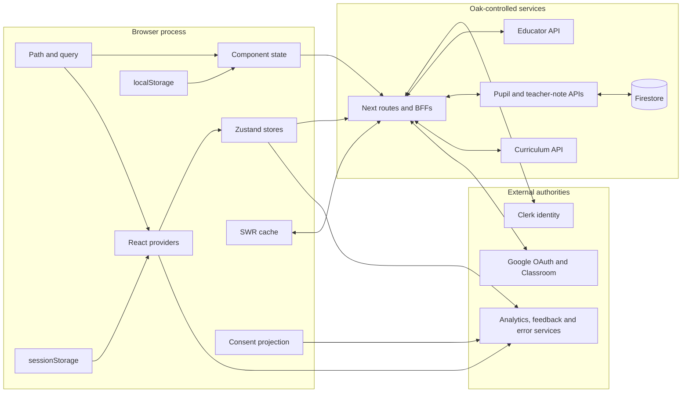

# State, identity and trust in OWA

## Purpose and evidence boundary

This report asks how Oak Web Application (OWA) currently decides:

- what state exists;
- which representation is authoritative;
- which identity may read or change it;
- when a transition is merely attempted, accepted or durable;
- how divergent representations are reconciled; and
- what evidence can establish that the result is correct.

It is a current-state exploration, not a proposed architecture for the Oak Open
Curriculum Ecosystem. It applies the four movements of OCE's concept-exploration
practice: reflect on raw observations, define the problem space, challenge
inherited solution shapes, then identify warranted and falsifiable next
investigations.

The source investigation is pinned to OWA revision
[`510ac63a62fb37a70183b00ce0f5fb15be4491e5`](https://github.com/oaknational/Oak-Web-Application/tree/510ac63a62fb37a70183b00ce0f5fb15be4491e5),
the revision named in the [research charter](../../research-charter.md).
`Observed`, `Inferred` and `Unknown` have the meanings defined by that charter.
This pass was static: no production telemetry, external provider configuration,
browser trace or fault injection was available. Existing executable findings
are linked rather than silently promoted into this evidence class.

## Executive synthesis

**Observed:** OWA does not have one application state or one identity system. It
coordinates several authorities through browser projections:

1. curriculum responses and route parameters identify public learning content;
2. Clerk owns signed-in Oak identity and account metadata;
3. the Educator API owns saved-content membership;
4. Firestore-backed pupil APIs own shared lesson attempts and teacher notes;
5. Google and the Classroom add-on own assignment identity, authentication,
   submission state and remote progress;
6. the consent service owns the browser's permission decision while PostHog,
   HubSpot, Sentry, Bugsnag and Gleap each retain their own runtime state; and
7. URL, React context, Zustand, SWR, component state, `sessionStorage` and
   `localStorage` carry projections with different lifetimes.

**Inferred:** the most useful current-state model is therefore a **polycentric
system of record plus projections**, not a React state-management taxonomy. A
state mechanism is only one part of its contract. Its identity key, lifetime,
authority, transition protocol, acknowledgement, recovery path and
observability determine whether it can be trusted.

**Observed:** many transitions intentionally keep the interface responsive or
the lesson usable when a remote system is slow or unavailable. Several paths,
however, name or measure the local intent as if it were the durable outcome.
Examples include optimistic saves with multiple local projections, pupil result
sharing before remote persistence is acknowledged, teacher-note save events
before the request completes, and fire-and-forget Classroom progress writes.

**Inferred:** the load-bearing seam is not "client versus server" or "Zustand
versus SWR". It is the boundary at which an outcome changes trust level:

```text
intent -> locally projected -> request accepted -> authority committed
       -> replicas observed -> user-visible outcome verified
```

OWA often implements some of these stages but rarely names all of them as one
transition contract. The resulting ambiguity affects authorization, privacy,
recovery, analytics semantics and assurance at once.

## Movement 1: reflect on raw observations

### The state and trust topology



The arrows show data movement, not authority. In particular, a browser value may
be the best available projection without being entitled to decide a server-side
authorization question.

### State-plane inventory

| Plane                      | Observed role                                                                                                            | Typical lifetime                                      | Authority and trust boundary                                                               |
| -------------------------- | ------------------------------------------------------------------------------------------------------------------------ | ----------------------------------------------------- | ------------------------------------------------------------------------------------------ |
| Path and query             | Content identity, search/filter state, pupil section navigation, Classroom identifiers and onboarding continuation state | Link/history entry; survives root and process changes | Authoritative for navigation intent, but generally untrusted input at an API boundary      |
| Component state            | Loading, modal, form, optimistic and interaction state                                                                   | Mounted component                                     | Authoritative only for the current presentation unless a transition explicitly promotes it |
| React context              | Service instances and shared UI/workflow projections                                                                     | Provider mount                                        | Provider placement defines lifetime; it does not make the value durable or authorized      |
| Zustand                    | Pupil progress, quiz and analytics; teacher-browse and Classroom analytics                                               | Module process or provider mount                      | Often the active browser working copy; remote systems can remain authoritative             |
| SWR                        | Authenticated Educator reads                                                                                             | Cache/key lifetime                                    | Cached projection of the BFF response, with hook-local projections layered on top          |
| `sessionStorage`           | Classroom analytics de-duplication across router-root navigation                                                         | Browser tab                                           | Browser-local coordination, not business authority                                         |
| `localStorage`             | Download form defaults, UTM attribution, local pupil attempts, teacher-note possession                                   | Browser profile until cleared                         | Durable on one browser, but neither user identity nor server authorization by itself       |
| Clerk                      | Oak user/session and public/private metadata                                                                             | External account/session                              | Identity authority for Oak-account paths; distinct from Classroom identity                 |
| Educator API               | Saved-content collections                                                                                                | External service                                      | Durable content-membership authority behind Clerk-authenticated BFFs                       |
| Firestore-backed APIs      | Shared pupil attempts and teacher notes                                                                                  | Service retention period                              | Durable document authority; access semantics depend on API contracts and identifiers       |
| Google/Classroom           | OAuth identity, assignment context, submission state and progress                                                        | Provider session and assignment                       | Separate authentication and workflow authority, deliberately outside Clerk middleware      |
| Consent and telemetry SDKs | Policy decision, event queues, provider sessions                                                                         | Consent service, page memory and third-party service  | Consent state governs allowed processing; each SDK has its own acknowledgement semantics   |

**Observed:** the pupil progress and quiz stores are module-level Zustand stores,
so their default lifetime is the loaded browser module rather than a React
subtree. Progress contains section results, read-only/hydration flags and content
guidance acknowledgement
([progress store](https://github.com/oaknational/Oak-Web-Application/blob/510ac63a62fb37a70183b00ce0f5fb15be4491e5/src/context/PupilLessonProgress/usePupilLessonProgress.ts#L13-L70),
[state contract](https://github.com/oaknational/Oak-Web-Application/blob/510ac63a62fb37a70183b00ce0f5fb15be4491e5/src/context/PupilLessonProgress/pupilLessonProgressTypes.ts#L12-L74)).
Teacher-browse and Classroom analytics instead create a store inside a provider,
giving each provider mount a distinct session
([teacher-browse provider](https://github.com/oaknational/Oak-Web-Application/blob/510ac63a62fb37a70183b00ce0f5fb15be4491e5/src/context/TeacherBrowseAnalytics/TeacherBrowseAnalyticsProvider.tsx#L24-L50),
[Classroom provider](https://github.com/oaknational/Oak-Web-Application/blob/510ac63a62fb37a70183b00ce0f5fb15be4491e5/src/context/GoogleClassroomAnalytics/GoogleClassroomAnalyticsProvider.tsx#L18-L59)).

**Observed:** URL state is not uniformly public or low-sensitivity. The
onboarding flow base64-encodes JSON into a `state` query parameter; the schema
can contain role, school identity or manually entered school name and address,
newsletter choice and support preferences
([codec](https://github.com/oaknational/Oak-Web-Application/blob/510ac63a62fb37a70183b00ce0f5fb15be4491e5/src/components/TeacherComponents/OnboardingForm/onboardingDataQueryParam.ts#L11-L60),
[schema](https://github.com/oaknational/Oak-Web-Application/blob/510ac63a62fb37a70183b00ce0f5fb15be4491e5/src/components/TeacherComponents/OnboardingForm/OnboardingForm.schema.ts#L3-L127)).
Base64 provides transport encoding, not confidentiality.

**Unknown:** whether production referrer policy, logs, analytics capture,
retention policy and operational access make this URL representation acceptable.
Static code establishes the exposure surface, not its realised disclosure.

**Observed:** the generic local-storage hook synchronises changes within the tab
and through browser `storage` events, supports optional schema validation, and
falls back to a default when reading fails; it has no general expiry mechanism
([implementation](https://github.com/oaknational/Oak-Web-Application/blob/510ac63a62fb37a70183b00ce0f5fb15be4491e5/src/hooks/useLocalStorage.ts#L40-L155)).
The key registry includes email, school, accepted terms and campaign attribution
([keys](https://github.com/oaknational/Oak-Web-Application/blob/510ac63a62fb37a70183b00ce0f5fb15be4491e5/src/config/localStorageKeys.ts#L1-L33)).
The UTM hook explicitly notes that a shared browser can attribute a later user
to an earlier user's campaign
([UTM hook](https://github.com/oaknational/Oak-Web-Application/blob/510ac63a62fb37a70183b00ce0f5fb15be4491e5/src/hooks/useUtmParams.ts#L19-L59)).

### Router roots are state-lifetime boundaries

**Observed:** OWA has two provider compositions. The Pages root nests Clerk,
consent, theming, error, analytics, the pupil client, overlays, menus, toasts and
save state around a page. The App root composes the shared services in a
different order and omits the pupil, overlay and toast providers
([Pages root](https://github.com/oaknational/Oak-Web-Application/blob/510ac63a62fb37a70183b00ce0f5fb15be4491e5/src/pages/_app.tsx#L47-L90),
[App root](https://github.com/oaknational/Oak-Web-Application/blob/510ac63a62fb37a70183b00ce0f5fb15be4491e5/src/app/layout.tsx#L43-L112)).

**Inferred:** moving between roots is a consistency event. Component and
provider-scoped projections are destroyed and recreated; module stores may
survive only while the same client bundle remains; URL, browser storage and
external authorities persist. `sessionStorage` is deliberately used to carry
Classroom-opened analytics de-duplication across an App-to-Pages navigation
([tracking helper](https://github.com/oaknational/Oak-Web-Application/blob/510ac63a62fb37a70183b00ce0f5fb15be4491e5/src/context/GoogleClassroomAnalytics/classroomAddonTracking.ts#L1-L57)).
The broader provider differences are mapped in
[runtime-shell parity](../runtime-shell-parity.md).

### Account, onboarding and saved-content workflow

#### Authority and identity

**Observed:** Clerk middleware matches API and tRPC routes but explicitly
excludes Classroom APIs. The middleware establishes Clerk integration for that
matched surface; its presence alone does not require sign-in for every route
([middleware](https://github.com/oaknational/Oak-Web-Application/blob/510ac63a62fb37a70183b00ce0f5fb15be4491e5/src/middleware.ts#L1-L16)).
Onboarding UI reads `isSignedIn` and `publicMetadata.owa.isOnboarded`, prevents a
flash while Clerk loads, and redirects through a checked return path
([layout](https://github.com/oaknational/Oak-Web-Application/blob/510ac63a62fb37a70183b00ce0f5fb15be4491e5/src/app/%28registration%29/onboarding/layout.tsx#L37-L69)).

**Observed:** the onboarding route derives region server-side, writes selected
OWA fields and authorization-related projections into Clerk public metadata,
and writes region to private metadata
([route](https://github.com/oaknational/Oak-Web-Application/blob/510ac63a62fb37a70183b00ce0f5fb15be4491e5/src/app/api/auth/onboarding/route.ts#L7-L44)).
A Clerk webhook separately creates or updates an Educator user; an Educator save
BFF can also create a missing user before saving, providing a lazy convergence
path
([webhook](https://github.com/oaknational/Oak-Web-Application/blob/510ac63a62fb37a70183b00ce0f5fb15be4491e5/src/app/api/webhooks/route.ts#L19-L142),
[save BFF](https://github.com/oaknational/Oak-Web-Application/blob/510ac63a62fb37a70183b00ce0f5fb15be4491e5/src/pages/api/educator/saveUnit/%5BprogrammeSlug%5D/%5BunitSlug%5D.ts#L17-L67)).

**Inferred:** Clerk is the authority for Oak identity, but Educator has its own
user projection and content authority. Webhook creation plus lazy repair is a
distributed reconciliation policy, even though it is not represented as one
named workflow.

#### Transition and acknowledgement

**Observed:** final onboarding awaits the Clerk mutation, records completion,
reloads the Clerk user, copies selected values to local storage, submits HubSpot
data with non-blocking error handling, then navigates
([form](https://github.com/oaknational/Oak-Web-Application/blob/510ac63a62fb37a70183b00ce0f5fb15be4491e5/src/components/TeacherComponents/OnboardingForm/OnboardingForm.tsx#L145-L199)).
The first three operations are presented as one retryable failure region, while
HubSpot failure is intentionally non-blocking.

**Observed:** saved content has at least three browser projections: SWR data,
hook-local unit membership, and a shell-level save count. The save hook updates
membership, count and notification optimistically; compensates on a non-OK HTTP
response; does not mutate SWR on success; and emits its analytics event after
the helper resolves even when the helper reports failure. A rejected `fetch`
can bypass the compensation and leave the in-flight flag set
([save hook](https://github.com/oaknational/Oak-Web-Application/blob/510ac63a62fb37a70183b00ce0f5fb15be4491e5/src/node-lib/educator-api/helpers/saveUnits/useSaveUnits.tsx#L23-L164),
[POST helper](https://github.com/oaknational/Oak-Web-Application/blob/510ac63a62fb37a70183b00ce0f5fb15be4491e5/src/node-lib/educator-api/helpers/postEducatorData.ts#L1-L10)).

**Observed:** the saved-list BFF joins Educator records to the browse view and
silently omits saved items that have no matching browse row
([BFF](https://github.com/oaknational/Oak-Web-Application/blob/510ac63a62fb37a70183b00ce0f5fb15be4491e5/src/pages/api/educator/getSavedContentLists/index.ts#L18-L100)).
The user can therefore observe a projection that differs from Educator's stored
membership without an explicit deletion or reconciliation event.

#### Failure, recovery, observability and assurance

**Observed:** recovery is path-specific: retry onboarding; lazily repair a
missing Educator user; roll back some optimistic save failures; re-read SWR on
its normal lifecycle. No common transition identifier connects Clerk webhook,
Educator request, browser projection, toast and analytics event in the traced
code.

**Inferred:** current telemetry can count an action without establishing which
authority accepted it or what the user later observed. The account-to-save
journey is mapped separately in
[account to saved content](../journeys/account-to-saved-content.md).

### Pupil attempts, results and teacher notes

#### Authority and identity

**Observed:** a pupil lesson uses module-level progress, quiz and analytics
stores. Initialisation waits for Classroom context, but progress initialisation
returns early whenever the current lesson slug matches the incoming lesson
slug. Classroom assignment identity is not part of that progress key
([initialisation](https://github.com/oaknational/Oak-Web-Application/blob/510ac63a62fb37a70183b00ce0f5fb15be4491e5/src/components/PupilComponents/Views/ViewHelpers/Shared/usePupilStores.ts#L32-L153)).
Analytics initialisation, by contrast, keys the lesson together with a serialized
Classroom context.

**Inferred:** lesson slug is the browser progress identity. Two visits to the
same lesson in different assignment or sharing contexts can be distinct domain
sessions while appearing identical to progress initialisation. Whether a real
navigation can produce stale progress is not established statically.

**Observed:** a local pupil attempt is a JSON document in `localStorage` keyed by
a random attempt ID. A shared attempt is posted to the pupil API and retained in
Firestore; the schema contains answers, correct answers, feedback, lesson and
curriculum identifiers, quiz data and video data, but no Oak pupil account
identity
([client](https://github.com/oaknational/Oak-Web-Application/blob/510ac63a62fb37a70183b00ce0f5fb15be4491e5/src/browser-lib/pupil-client/client.ts#L110-L180),
[schema](https://github.com/oaknational/Oak-Web-Application/blob/510ac63a62fb37a70183b00ce0f5fb15be4491e5/src/node-lib/pupil-api/types/lessonAttempt.ts#L43-L147)).
The GET API requires the attempt ID but no authenticated user
([route](https://github.com/oaknational/Oak-Web-Application/blob/510ac63a62fb37a70183b00ce0f5fb15be4491e5/src/app/api/pupil/lesson-attempt/route.ts#L10-L30)).

**Inferred:** shared results use possession of an opaque identifier as the read
capability. "Anonymous" here means not bound to a Clerk identity, not
stateless, non-personal or access-free.

**Observed:** the shared-results route obtains curriculum content from the URL
lesson slug and the result document from the attempt ID. No binding check
between the attempt's recorded lesson and the route lesson is visible at this
composition point
([page](https://github.com/oaknational/Oak-Web-Application/blob/510ac63a62fb37a70183b00ce0f5fb15be4491e5/src/pages/pupils/lessons/%5BlessonSlug%5D/results/%5BattemptId%5D/share.tsx#L40-L81)).

**Observed:** teacher notes use an opaque `sid_key` and `note_id`. Browser-local
possession of the stored note ID determines whether the UI reports a note as
editable
([client](https://github.com/oaknational/Oak-Web-Application/blob/510ac63a62fb37a70183b00ce0f5fb15be4491e5/src/browser-lib/pupil-client/client.ts#L182-L267)).
The note API reads by the ID pair and writes a validated note without Clerk
authentication; its batch `PUT` starts a scan without awaiting completion
([route](https://github.com/oaknational/Oak-Web-Application/blob/510ac63a62fb37a70183b00ce0f5fb15be4491e5/src/app/api/teacher/note/route.ts#L16-L91)).

**Unknown:** whether result and note identifiers are intentionally the complete
server-side capability contract, whether an upstream control adds protection,
and what enumeration, rotation, revocation and retention properties have been
accepted. A client-side editable flag cannot answer those server authorization
questions.

#### Transition and acknowledgement

**Observed:** the pupil client creates an attempt ID, starts the remote request,
and immediately records the ID and attempt hash in memory. On promise rejection
it clears those values. The review flow can construct and expose the share URL
before the promise is acknowledged
([client](https://github.com/oaknational/Oak-Web-Application/blob/510ac63a62fb37a70183b00ce0f5fb15be4491e5/src/browser-lib/pupil-client/client.ts#L110-L155),
[review workflow](https://github.com/oaknational/Oak-Web-Application/blob/510ac63a62fb37a70183b00ce0f5fb15be4491e5/src/components/PupilComponents/Views/Hooks/usePupilReviewExperience.ts#L99-L167)).

**Observed:** the attempt API correctly returns `201` after a datastore write,
but its catch path puts `{status: 500}` in a JSON body without setting the HTTP
status. The browser API client logs non-OK responses but resolves parsed JSON
instead of rejecting it
([route](https://github.com/oaknational/Oak-Web-Application/blob/510ac63a62fb37a70183b00ce0f5fb15be4491e5/src/app/api/pupil/lesson-attempt/route.ts#L33-L69),
[network client](https://github.com/oaknational/Oak-Web-Application/blob/510ac63a62fb37a70183b00ce0f5fb15be4491e5/src/browser-lib/pupil-client/network/PupilApiClient.ts#L9-L29)).
The executable status-semantics finding and its test limitation are recorded in
[freshness and failure](../freshness-and-failure.md).

**Observed:** teacher-note ownership is placed in local storage before the
network write. Note save state and analytics are updated before the returned
promise acknowledges persistence; sharing starts a save without awaiting it,
then exposes the share URL
([client write](https://github.com/oaknational/Oak-Web-Application/blob/510ac63a62fb37a70183b00ce0f5fb15be4491e5/src/browser-lib/pupil-client/client.ts#L182-L207),
[note hook](https://github.com/oaknational/Oak-Web-Application/blob/510ac63a62fb37a70183b00ce0f5fb15be4491e5/src/pages-helpers/teacher/share/useTeacherNotes.ts#L25-L160),
[modal](https://github.com/oaknational/Oak-Web-Application/blob/510ac63a62fb37a70183b00ce0f5fb15be4491e5/src/components/TeacherComponents/TeacherNotesModal/TeacherNotesModal.tsx#L260-L320)).

#### Safeguarding

**Observed:** teacher-note writes invoke Google DLP for person names, email,
phone and address, reject detected PII, and support batch redaction
([API](https://github.com/oaknational/Oak-Web-Application/blob/510ac63a62fb37a70183b00ce0f5fb15be4491e5/src/app/api/teacher/note/route.ts#L37-L83),
[DLP implementation](https://github.com/oaknational/Oak-Web-Application/blob/510ac63a62fb37a70183b00ce0f5fb15be4491e5/src/node-lib/dlp/dlp.ts#L44-L142)).
This is an explicit safeguarding boundary, distinct from authorization.

**Observed:** pupil content guidance can block lesson entry until acknowledged.
Acceptance mutates only the in-memory lesson progress store; decline closes the
Classroom iframe or navigates away
([modal](https://github.com/oaknational/Oak-Web-Application/blob/510ac63a62fb37a70183b00ce0f5fb15be4491e5/src/components/PupilComponents/Views/PupilLessonOverview/PupilLessonOverviewContentGuidanceModal/PupilLessonOverviewContentGuidanceModal.tsx#L28-L86),
[workflow](https://github.com/oaknational/Oak-Web-Application/blob/510ac63a62fb37a70183b00ce0f5fb15be4491e5/src/components/PupilComponents/Views/Hooks/usePupilOverviewExperience.ts#L145-L165)).

**Inferred:** content-guidance acceptance is a lesson-session acknowledgement,
not durable age, guardian or institutional authorization. That may be exactly
the intended product contract; the important architectural fact is its scope.

#### Failure, recovery, observability and assurance

**Observed:** local attempts recover from loss of network by never requiring it,
but are confined to the browser profile. Remote attempts recover only through
the caller's promise/error path. Shared identifiers provide later retrieval;
there is no observed user identity through which to enumerate, revoke or recover
all of a pupil's attempts.

**Observed:** Firestore append uses an auto-generated document while retaining a
separate `attempt_id`; reads query by that field and keep the first successfully
parsed match. `empty` is based on the raw snapshot, so a snapshot containing
only malformed records is not described as empty even though it produces no
valid attempt
([write](https://github.com/oaknational/Oak-Web-Application/blob/510ac63a62fb37a70183b00ce0f5fb15be4491e5/src/node-lib/pupil-api/lesson-attempt/logLessonAttempt.ts#L8-L16),
[read](https://github.com/oaknational/Oak-Web-Application/blob/510ac63a62fb37a70183b00ce0f5fb15be4491e5/src/node-lib/pupil-api/lesson-attempt/getLessonAttempt.ts#L10-L43)).

**Inferred:** duplicate detection, write and retrieval form an application-level
idempotency protocol rather than an atomic document identity constraint.
Concurrent duplicate writes and malformed duplicate records require runtime or
Firestore-rule evidence to characterize fully.

The complete lesson-result path is mapped in
[pupil lesson to results](../journeys/pupil-lesson-to-results.md).

### Google Classroom workflow

#### Authority and identity

**Observed:** Classroom context derives course, item and login-hint values from
the add-on package store or URL, while attachment identity comes from the URL.
It derives an assignment ID from course and item
([context hook](https://github.com/oaknational/Oak-Web-Application/blob/510ac63a62fb37a70183b00ce0f5fb15be4491e5/src/components/GoogleClassroom/useGoogleClassroomContext.ts#L22-L58)).
The Classroom layout initializes the package provider from `courseId`, `itemId`
and `addOnToken` query parameters
([layout](https://github.com/oaknational/Oak-Web-Application/blob/510ac63a62fb37a70183b00ce0f5fb15be4491e5/src/app/classroom/layout.tsx#L13-L66)).

**Observed:** the OAuth sign-in route asks the package to construct the provider
URL, then parses and augments the JSON `state` value with OWA's pupil/teacher
context. The callback parses that state and delegates code exchange to the
package, then places encrypted session and access-token values into query
parameters for the success handoff
([sign-in route](https://github.com/oaknational/Oak-Web-Application/blob/510ac63a62fb37a70183b00ce0f5fb15be4491e5/src/app/api/classroom/auth/sign-in/route.ts#L12-L44),
[callback](https://github.com/oaknational/Oak-Web-Application/blob/510ac63a62fb37a70183b00ce0f5fb15be4491e5/src/app/api/classroom/auth/callback/route.ts#L19-L139)).

**Unknown:** anti-CSRF state validation, encryption properties, URL cleanup,
token lifetime and provider-side authorization are substantially owned by the
external Classroom package and deployment configuration. OWA's wrapping code
does not provide enough evidence to assert those properties.

**Observed:** Classroom context, progress writes and submission reads require
the package session/access-token headers. Progress read does not; its source
contains a comment to add the header check
([context API](https://github.com/oaknational/Oak-Web-Application/blob/510ac63a62fb37a70183b00ce0f5fb15be4491e5/src/app/api/classroom/context/route.ts#L33-L75),
[progress read](https://github.com/oaknational/Oak-Web-Application/blob/510ac63a62fb37a70183b00ce0f5fb15be4491e5/src/app/api/classroom/pupil/progress/route.ts#L11-L40),
[progress write](https://github.com/oaknational/Oak-Web-Application/blob/510ac63a62fb37a70183b00ce0f5fb15be4491e5/src/app/api/classroom/pupil/progress/submit/route.ts#L18-L59)).

**Inferred:** Clerk and Google identity are separate trust domains. A teacher or
pupil being signed in to one does not establish identity in the other. The
unauthenticated progress read is a visible mismatch with neighbouring endpoint
contracts, but static inspection cannot decide whether the provider identifier
tuple is an intentional read capability or an incomplete authorization
boundary.

#### Transition and acknowledgement

**Observed:** the pupil handoff verifies Classroom cookie keys, then navigates
from the App root to the ordinary Pages lesson while preserving the query string
([handoff](https://github.com/oaknational/Oak-Web-Application/blob/510ac63a62fb37a70183b00ce0f5fb15be4491e5/src/app/classroom/pupil/programmes/%5BprogrammeSlug%5D/%5BunitSlug%5D/%5BlessonSlug%5D/page.tsx#L17-L40)).
The lesson resolves context, then remote progress, then submission read-only
state sequentially. Failures are converted to fallback values and readiness is
set; focus events refresh only read-only state
([Classroom hook](https://github.com/oaknational/Oak-Web-Application/blob/510ac63a62fb37a70183b00ce0f5fb15be4491e5/src/components/PupilComponents/Views/ViewHelpers/Shared/useClassroomAddonContext.ts#L19-L189)).

**Observed:** after hydration, every section-results change submits the complete
mapped progress document. Writes are fire-and-forget; rejection is discarded so
the lesson can continue. There is no browser-visible sequence number, debounce,
retry queue or durable acknowledgement in this adapter
([sync hook](https://github.com/oaknational/Oak-Web-Application/blob/510ac63a62fb37a70183b00ce0f5fb15be4491e5/src/components/PupilComponents/Views/ViewHelpers/Shared/useClassroomProgressSync.ts#L20-L80)).

**Inferred:** this is an asynchronous full-snapshot replication protocol. If two
requests are in flight, request completion order rather than learning-action
order may determine the remote projection unless the package or datastore adds
version control. That possibility is not proof of a production race; provider
and datastore behavior is unresolved.

**Observed:** provider progress is mapped back into OWA's generic pupil attempt
shape for display, with defaults for fields the provider representation does not
carry
([mapper](https://github.com/oaknational/Oak-Web-Application/blob/510ac63a62fb37a70183b00ce0f5fb15be4491e5/src/browser-lib/google-classroom/PupilLessonProgressMapper.ts#L33-L117)).
The result is another projection, not the provider record itself.

#### Failure, recovery, observability and assurance

**Observed:** degraded Classroom context is designed not to block the ordinary
lesson. A failed write is retried only incidentally when a later section change
causes another full-state submission. A focus event can refresh submission
read-only status but does not rehydrate progress. A route transition asks for
external read-only state before changing section
([navigation hook](https://github.com/oaknational/Oak-Web-Application/blob/510ac63a62fb37a70183b00ce0f5fb15be4491e5/src/components/PupilComponents/Views/Hooks/usePupilExperienceBase.ts#L18-L70)).

**Inferred:** "the lesson continued" and "Classroom has recoverable current
progress" are separate outcomes. The current UI strongly protects the former;
the latter has no end-to-end acknowledgement visible in OWA.

**Observed:** focused unit tests cover Classroom route and mapping behavior, but
the configured Playwright suite contains only a teacher lesson-download journey
([browser spec](https://github.com/oaknational/Oak-Web-Application/blob/510ac63a62fb37a70183b00ce0f5fb15be4491e5/src/tests/e2e/teacher/lesson-page.spec.ts#L1-L40)).
There is no repository-visible browser journey for concurrent progress, expired
credentials, App-to-Pages handoff, resumption or result display. The wider
journey is mapped in
[Classroom assignment to submission](../journeys/classroom-assignment-to-submission.md).

### Consent, analytics, feedback and error reporting

#### Authority and lifetime

**Observed:** PostHog, Gleap, Bugsnag, Sentry and HubSpot are all assigned to the
`statistics` consent policy
([policy map](https://github.com/oaknational/Oak-Web-Application/blob/510ac63a62fb37a70183b00ce0f5fb15be4491e5/src/browser-lib/cookie-consent/ServicePolicyMap.ts#L5-L11)).
The consent provider exposes policy state and the banner; its client can report
its own errors only when Bugsnag consent is already granted, an explicit
observability limitation
([provider](https://github.com/oaknational/Oak-Web-Application/blob/510ac63a62fb37a70183b00ce0f5fb15be4491e5/src/browser-lib/cookie-consent/CookieConsentProvider.tsx#L26-L73),
[client](https://github.com/oaknational/Oak-Web-Application/blob/510ac63a62fb37a70183b00ce0f5fb15be4491e5/src/browser-lib/cookie-consent/consentClient.ts#L12-L29)).

**Observed:** the analytics adapter has a page-memory queue. Enabled service
state drains it, disabled state clears it, and pending state retains it;
`sendInstantly` only triggers an immediate conditional processing attempt
([queue](https://github.com/oaknational/Oak-Web-Application/blob/510ac63a62fb37a70183b00ce0f5fb15be4491e5/src/browser-lib/analytics/withQueue.ts#L31-L124)).
The service hook initializes once and subsequently invokes opt-in or opt-out as
consent changes
([service hook](https://github.com/oaknational/Oak-Web-Application/blob/510ac63a62fb37a70183b00ce0f5fb15be4491e5/src/browser-lib/analytics/useAnalyticsService.ts#L23-L59)).

**Observed:** App Router code initializes the PostHog client at browser-module
load, while the shared analytics provider later configures service behavior and
consent transitions
([App providers](https://github.com/oaknational/Oak-Web-Application/blob/510ac63a62fb37a70183b00ce0f5fb15be4491e5/src/app/providers.tsx#L8-L21),
[analytics provider](https://github.com/oaknational/Oak-Web-Application/blob/510ac63a62fb37a70183b00ce0f5fb15be4491e5/src/context/Analytics/AnalyticsProvider.tsx#L120-L276)).
PostHog is configured for cookieless behavior on rejection, no automatic page
views, restricted autocapture and no session recording
([configuration](https://github.com/oaknational/Oak-Web-Application/blob/510ac63a62fb37a70183b00ce0f5fb15be4491e5/src/browser-lib/posthog/getPosthogInitConfig.ts#L19-L34)).

**Unknown:** static initialization order does not establish that a prohibited
cookie, storage entry or network request occurs. That requires network and
storage traces for pending, granted and revoked consent in both roots.

#### Identity and privacy

**Observed:** after Oak sign-in, the browser aliases an anonymous PostHog ID to
the Clerk user
([alias hook](https://github.com/oaknational/Oak-Web-Application/blob/510ac63a62fb37a70183b00ce0f5fb15be4491e5/src/hooks/usePostHogAlias.ts#L10-L19)).
Pupil analytics enrich events with Classroom course, item, attachment,
submission and assignment identifiers plus teacher and pupil login hints, and
lesson tracking spreads those additional arguments into the generated event
calls
([pupil analytics store](https://github.com/oaknational/Oak-Web-Application/blob/510ac63a62fb37a70183b00ce0f5fb15be4491e5/src/context/PupilLessonAnalytics/usePupilLessonAnalyticsStore.ts#L38-L109),
[event calls](https://github.com/oaknational/Oak-Web-Application/blob/510ac63a62fb37a70183b00ce0f5fb15be4491e5/src/context/PupilLessonAnalytics/trackingFunctions/lessonTracking.ts#L9-L59)).

**Inferred:** anonymous pupil experience, Oak account analytics identity and
Google assignment identity can converge in telemetry even though their product
authentication domains remain separate. Consent is necessary to govern that
processing, but it does not by itself answer purpose limitation, minimisation,
retention or who can join the identifiers.

**Observed:** Clerk webhook handlers also send account/session lifecycle events
through server-side PostHog/Avo clients, where browser consent state is not an
input
([server event tracking](https://github.com/oaknational/Oak-Web-Application/blob/510ac63a62fb37a70183b00ce0f5fb15be4491e5/src/app/api/webhooks/eventTracking.ts#L8-L32)).

**Unknown:** the lawful basis and policy governing those server-side events. It
would be incorrect to infer either compliance or non-compliance from the absence
of browser consent state.

#### Acknowledgement, failure and observability

**Observed:** browser error reporting first logs locally and then requires the
Bugsnag statistics policy before sending to either configured browser error
provider. Server execution bypasses the browser consent check
([reporter](https://github.com/oaknational/Oak-Web-Application/blob/510ac63a62fb37a70183b00ce0f5fb15be4491e5/src/common-lib/error-reporter/errorReporter.ts#L69-L158)).
App hooks start the selected error service and Gleap only when enabled; Gleap is
omitted from pupil and standalone-video routes
([hooks](https://github.com/oaknational/Oak-Web-Application/blob/510ac63a62fb37a70183b00ce0f5fb15be4491e5/src/components/AppComponents/App/AppHooks.tsx#L31-L59)).

**Inferred:** absence of a browser error report is weak negative evidence: the
user may not have consented, the consent system may have failed, the route may
exclude feedback, the page may have navigated, or the provider may not have
acknowledged delivery.

**Observed:** the analytics queue treats invocation of a provider adapter as
completion and has no application-level delivery acknowledgement. Elsewhere,
several domain events describe local intent before remote durability. The
telemetry vocabulary therefore cannot be assumed to be a transaction log.

### Authorization, privacy and safeguarding are different controls

| Concern                    | Current evidence                                                                    | What it does not establish                                                               |
| -------------------------- | ----------------------------------------------------------------------------------- | ---------------------------------------------------------------------------------------- |
| Authentication             | Clerk for Oak accounts; Google/package session for Classroom                        | Authorization to every resource reachable under that identity                            |
| Browser ownership          | Local note ID marks teacher-note editability; local attempt ID retrieves local data | Server-enforced identity, portability, revocation or recovery                            |
| Capability access          | Attempt ID and teacher-note ID pair address shared records                          | Accepted entropy, enumeration threat model, expiry or recipient control                  |
| Region eligibility         | Clerk metadata projects region authorization into UI decisions                      | That public metadata alone is the enforcement point for protected downloads              |
| Consent                    | Statistics policy gates browser analytics, feedback and error services              | Data minimisation, purpose, retention, server-side lawful basis or delivery              |
| PII safeguarding           | DLP scans teacher-note text and HTML before normal writes                           | Authorization, completeness of the detector, all historic notes, or batch-job completion |
| Content safeguarding       | Pupil acknowledges content guidance in lesson-session state                         | Age verification, guardian consent or durable cross-device acknowledgement               |
| Read-only assignment state | Classroom submission state is refreshed on focus and navigation                     | Atomic prevention of every concurrent or already-in-flight write                         |

**Inferred:** treating any row as a substitute for another obscures its actual
guarantee. DLP is not authorization; authentication is not ownership; consent
is not anonymisation; a UI read-only flag is not a transactional write guard;
and possession of a browser value is not automatically a server identity.

### Acknowledgement and reconciliation map

| Workflow            | Local intent/projection               | Remote authority                          | Visible acknowledgement                                                          | Recovery/reconciliation                                           |
| ------------------- | ------------------------------------- | ----------------------------------------- | -------------------------------------------------------------------------------- | ----------------------------------------------------------------- |
| Onboarding          | Query-form state, then local storage  | Clerk metadata; later Educator projection | Clerk mutation and user reload are awaited                                       | Retry combined step; webhook plus lazy Educator creation          |
| Save unit           | Local membership, count, toast        | Educator API                              | UI is optimistic; helper distinguishes non-OK, not every transport failure       | Partial compensation; future SWR read                             |
| Local pupil result  | `localStorage` attempt                | Same browser storage                      | Synchronous storage call                                                         | None across devices/profile clearing                              |
| Shared pupil result | In-memory ID/hash and share URL       | Pupil API/Firestore                       | Promise exists, but link can precede it; error status semantics are inconsistent | Clear in-memory de-dup state on rejection; recipient retries read |
| Teacher note        | Local ownership and saved UI          | Teacher-note API/Firestore                | Save state/event can precede promise                                             | Later autosave/edit; no observed durable outbox                   |
| Classroom progress  | Current full section-results snapshot | Classroom provider/Firestore              | None in the lesson UI                                                            | Later state change incidentally submits another full snapshot     |
| Classroom read-only | Hook-local state                      | Google submission state                   | Context/submission read completion                                               | Refresh on focus and before section navigation                    |
| Analytics event     | In-memory queue entry                 | Analytics service                         | Adapter invocation, not provider durability                                      | Interval retry while page lives; clear on rejected consent        |
| Error report        | Console plus provider call            | Sentry/Bugsnag                            | Provider SDK call where permitted                                                | No report when consent disallows it; server path differs          |

## Movement 2: define the problem space

The source does not justify the problem statement "OWA uses too many kinds of
state". Different lifetimes and authorities genuinely require different
representations. The deeper gap is that their relationship is frequently
implicit.

### Frame A: authority and identity are incomplete at composition points

**Kind of problem:** distributed domain modelling and access-control clarity.

**Gap:** a route, hook or component often composes values from authorities that
use different identity keys: lesson slug, attempt ID, note ID plus share key,
Clerk user ID, Educator user projection, Classroom course/item/attachment/
submission tuple, browser profile and analytics distinct ID. The code does not
always make the binding between those identities explicit.

**Causal mechanism:** identity is reconstructed at each boundary from URL,
cookies, local storage, metadata and provider context. A locally useful key can
silently become the assumed domain or authorization key.

**Who can be harmed:** pupils whose result or assignment context is confused;
teachers whose saves or notes are misrepresented; support and safeguarding
staff who cannot identify the governing record; Oak when access policy is
ambiguous.

**Constraints:** no-account pupil access, shareable outcomes, deep links,
Classroom interoperability, cross-router handoff, privacy and uninterrupted
learning are real product properties, not accidental complexity to delete.

**Success condition for understanding:** every material record has a named
authority, subject, audience, identity key, access policy, retention/revocation
policy and binding validation at each composition point.

### Frame B: transition semantics collapse distinct levels of truth

**Kind of problem:** distributed workflow correctness.

**Gap:** UI state and events can use "saved", "shared", "submitted" or similar
outcome language for intent, optimistic projection, HTTP completion or durable
provider state without consistently distinguishing them.

**Causal mechanism:** each adapter handles responsiveness and errors locally;
there is no shared transition vocabulary connecting browser projection, network
response, datastore commit, replica read and user observation.

**Who can be harmed:** a pupil who shares an unreadable result; a teacher whose
saved collection diverges; a Classroom pupil whose apparent progress is stale;
product teams whose metrics count attempts as successes.

**Constraints:** waiting for every remote replica before responding would damage
learning continuity and interaction quality. Excellence requires accurate
semantics and intentional degradation, not blanket synchrony.

**Success condition for understanding:** for each workflow, the code and
evidence can distinguish attempted, locally projected, accepted, durable,
observed and compensated states and state which one the interface and telemetry
claim.

### Frame C: trust policy is separated from the data it governs

**Kind of problem:** privacy, authorization and safeguarding policy
traceability.

**Gap:** URLs, local storage and analytics can carry school, contact or provider
identifiers; capability-like API access, DLP, consent and content guidance each
protect different concerns; their exact policy is not co-located as one
inspectable data contract.

**Causal mechanism:** safeguards were added at the service or journey boundary
where they are operationally needed. Cross-system data lineage and policy are
therefore emergent from source traversal.

**Who can be harmed:** children, teachers and schools through inappropriate
access, disclosure, retention or misleading assurances; engineers and reviewers
who mistake one control for another.

**Constraints:** legitimate sharing, analytics, support, fraud prevention,
provider interoperability and safeguarding may require data movement. The
question is not whether all data crosses no boundary, but whether each crossing
has explicit necessity and assurance.

**Success condition for understanding:** data classes and identifiers are traced
from collection through every projection and recipient, with purpose, consent
or lawful basis, minimisation, access, retention, deletion and incident evidence
attached.

### Frame D: recovery and observability do not always close the loop

**Kind of problem:** resilience and operational assurance.

**Gap:** fallback often preserves the foreground journey but does not establish
whether remote state converged. Consent correctly suppresses some telemetry,
which also creates deliberate blind spots. No common correlation identity was
found across the traced browser-to-provider workflows.

**Causal mechanism:** exceptions are caught at local experience boundaries;
analytics, error reporting and persistence have independent queues and policy;
tests predominantly assert adapters in isolation.

**Who can be harmed:** users receive a usable but misleading state; operations
cannot distinguish deliberate degradation from data loss; teams cannot prove
the effect of failure handling.

**Constraints:** privacy-respecting absence of telemetry is a requirement, and
third-party providers cannot be treated as locally transactional.

**Success condition for understanding:** every degraded path has an explicit
user outcome, convergence expectation, privacy-respecting diagnostic signal and
test oracle, including a defined meaning for absent evidence.

### Frame E: root and route transitions are consistency boundaries

**Kind of problem:** runtime composition and lifecycle correctness.

**Gap:** provider order and presence differ across router roots, while workflows
cross them using URL and browser storage. State lifetimes are controlled partly
by bundling and mount topology rather than domain concepts.

**Causal mechanism:** the dual-router application composes capabilities at its
framework roots. A navigation can reset some projections and preserve others.

**Success condition for understanding:** each cross-root journey has an explicit
state handoff contract and parity oracle for consent, identity, analytics,
errors, notifications and domain session state.

## Movement 3: reflect on inherited solution shapes

The investigation changed or weakened these starting assumptions.

| Inherited assumption                                     | Evidence-led revision                                                                                                                                      |
| -------------------------------------------------------- | ---------------------------------------------------------------------------------------------------------------------------------------------------------- |
| The question is which state library OWA should use       | The decisive properties are authority, identity, lifetime and transition semantics. Zustand, SWR and context can each be appropriate projections.          |
| Clerk is the application's identity                      | Clerk is one identity authority. Anonymous capabilities, browser possession and Google Classroom identity support different journeys.                      |
| URL state is reconstructable and therefore benign        | It is also a cross-root workflow carrier and can contain school/onboarding data, OAuth state and provider identifiers.                                     |
| Persistent means durable                                 | `localStorage`, Educator, Firestore, Classroom and analytics are durable for different subjects and failure domains. None is interchangeable with another. |
| Anonymous means stateless or private                     | Anonymous pupil outcomes are stateful and shareable; their content and identifiers still need access, retention and privacy reasoning.                     |
| A provider is dependency injection plumbing              | Provider placement creates session identity and teardown behavior; root composition is application semantics.                                              |
| A successful client call proves the user outcome         | Some clients resolve error-shaped responses, some transitions expose outcomes before acknowledgement, and provider replication can remain pending.         |
| Analytics is an audit trail                              | Events can describe intent or local projection and queues acknowledge adapter invocation, not domain durability.                                           |
| Error reporting supplies objective failure counts        | Consent, route exclusion, page lifetime and provider delivery intentionally bound what is visible.                                                         |
| Silent degradation is always resilience                  | It preserves one outcome, often lesson continuity, while potentially weakening freshness or recoverability. The trade must be named.                       |
| The client/server boundary is the authorization boundary | Authorization varies by API and identity domain; some shared records appear capability-addressed and one Classroom read lacks neighbouring auth checks.    |
| One lesson slug identifies one lesson session            | The same content can occur in canonical, shared and multiple Classroom contexts with distinct progress and audience meaning.                               |

**Reflection on plausible solutions:** a fluent response would be to centralise
state, introduce a universal event bus, put every write behind one server store,
or require authentication for every resource. The evidence does not justify any
of those shapes. They could erase offline/local outcomes, link child data to an
identity unnecessarily, make Classroom coupling stronger, or replace explicit
capabilities with an over-broad central authority.

**Inferred:** a more disciplined future conversation should begin with domain
truth and transition guarantees, then choose the smallest mechanism that
expresses them. It should preserve deliberate properties such as public content,
no-account pupil learning, shareability, provider interoperability, consent and
graceful lesson continuity until evidence shows a premise should change.

## Movement 4: synthesize and propose investigations

### Current-state architectural hypothesis

**Working architectural hypothesis:** OWA is a federation of authorities connected by browser-held
projections and journey-specific replication protocols. It succeeds when stable
identifiers, provider context and optimistic/local state align. Its principal
architectural risk is not state volume but **implicit trust promotion**: a value
or event moves from navigation hint, local possession or attempted transition
to an assumed authoritative outcome without an explicit, observable contract.

**Evidence supporting the hypothesis:** the distinct identity domains; multiple
saved-content projections; slug-keyed pupil progress; capability-addressed
results and notes; unauthenticated Classroom progress read beside authenticated
operations; fire-and-forget replication; and analytics events whose timing does
not consistently match durable acknowledgement.

**Evidence that would invalidate it:** complete external-package and deployment
contracts showing that the apparently implicit bindings are enforced at every
boundary, plus end-to-end traces demonstrating consistent convergence and event
semantics under delay, rejection, concurrency, navigation and consent change.

### Strengths worth carrying into further inquiry

**Observed:** current mechanisms encode valuable intent:

- pupil lessons can continue without an Oak account and can deliberately keep
  working when Classroom is temporarily unavailable;
- URLs make public curriculum and lesson navigation reconstructable;
- schemas validate onboarding, attempt, note and provider payloads at many
  boundaries;
- Classroom identity is not casually conflated with Clerk identity;
- consent state explicitly gates browser telemetry and feedback;
- teacher notes have a concrete PII safeguarding step;
- content guidance is an explicit, blocking acknowledgement; and
- optimistic interaction keeps frequent teacher and pupil actions responsive.

These observations establish outcomes to understand, not implementations to
copy unchanged.

### Candidate investigations

Each investigation is phrased to be stopped or redirected by evidence.

#### 1. Build an executable authority and transition ledger

**Warrant:** the static map finds repeated ambiguity between local projection,
HTTP response and durable authority.

**Deciding observation:** instrument one controlled instance of onboarding,
save, result share, note share and Classroom progress with a privacy-safe
transition ID. Record intent, request, response, datastore/provider read-back,
UI state and event emission.

**Falsifier / stop rule:** stop treating acknowledgement as a cross-cutting gap
if every workflow already provides an unambiguous durable acknowledgement and
the UI/analytics semantics match it under injected delay and failure.

#### 2. Test pupil session identity, not only lesson identity

**Warrant:** progress initialization keys on lesson slug while analytics includes
assignment context.

**Deciding observation:** navigate to the same lesson successively as canonical,
shared, Classroom assignment A and Classroom assignment B without a full browser
restart. Inspect progress, read-only state, analytics context and remote writes.

**Falsifier / stop rule:** close the concern if supported navigation always
forces a lifecycle reset before contexts can differ, and an end-to-end test
proves that invariant.

#### 3. Exercise the Educator save convergence matrix

**Warrant:** SWR data, local membership and shell count change through different
paths.

**Deciding observation:** inject HTTP rejection, transport rejection, timeout,
duplicate click, second tab, route change and stale browse-view data; compare
toast, icon, count, My Library and Educator records after revalidation.

**Falsifier / stop rule:** stop if every observable projection converges within
a documented bound and analytics distinguishes attempted from accepted outcomes
in every case.

#### 4. Establish the pupil result publication contract

**Warrant:** a share link can exist before persistence acknowledgement and the
route combines URL lesson identity with an independently fetched attempt.

**Deciding observation:** delay or reject Firestore writes, open the link
immediately and later, test mismatched lesson slug/attempt ID, duplicate writes
and malformed records, and record the exact user outcome.

**Falsifier / stop rule:** close if links are never exposed before a verified
readable record, the attempt-to-lesson binding is enforced elsewhere, and
concurrent duplicate writes are prevented by an authoritative constraint.

#### 5. Review teacher-note capability and DLP boundaries together

**Warrant:** browser-local possession determines UI editability, server routes
accept opaque identifiers, normal writes run DLP, and the batch trigger is
unawaited.

**Deciding observation:** document the intended reader/editor capability,
entropy, rotation, revocation, retention and batch authorization; test copied
links, cleared storage, guessed/replayed IDs, DLP false-positive/negative
classes, batch failure and partial completion.

**Falsifier / stop rule:** redirect the investigation if an upstream access
layer and operated batch system already enforce and evidence the complete
contract.

#### 6. Characterize Classroom replication under concurrency

**Warrant:** every change sends a full snapshot without sequence or browser
acknowledgement.

**Deciding observation:** reorder and fail writes, expire credentials, close the
tab, resume on another device, turn in during an in-flight write, then compare
lesson UI, provider progress and teacher results.

**Falsifier / stop rule:** close the ordering concern if the external package or
datastore applies authoritative monotonic versions and end-to-end tests show
that older writes cannot replace newer progress.

#### 7. Resolve the Classroom authorization and OAuth handoff contract

**Warrant:** OWA augments OAuth `state`, transports callback credentials through
query parameters and authenticates neighbouring Classroom operations
differently.

**Deciding observation:** inspect the package at the consumed revision,
Firestore rules, cookies and deployment edge; threat-model state validation,
token exposure, URL cleanup, progress-read access and tenant/assignment binding.

**Falsifier / stop rule:** close each concern only when the owning layer has a
specific enforcement point and adversarial test, not merely because identifiers
are difficult to guess.

#### 8. Trace consent across both runtime roots

**Warrant:** SDK construction, consent transition and provider lifetime are
distributed across module load, analytics provider and app hooks.

**Deciding observation:** capture cookies, browser storage, requests, payloads
and SDK state for fresh pending, accept, reject, revoke and cross-root navigation,
including Clerk sign-in and a Classroom pupil journey.

**Falsifier / stop rule:** close initialization-order concerns if no disallowed
storage or request occurs before consent and revocation meets the documented
service policy in every root.

#### 9. Audit event semantics and identifier necessity

**Warrant:** domain events can precede durable completion, while Classroom
login hints and provider identifiers enter pupil event arguments.

**Deciding observation:** for each high-value metric, state the domain fact it
claims, emission point, identifiers, recipient, retention and joinability;
compare counts with authoritative read-back under induced failures.

**Falsifier / stop rule:** retain current events unchanged only where their names
explicitly mean attempt/local intent and every identifier is necessary for a
documented purpose.

#### 10. Make root lifetime parity observable

**Warrant:** App and Pages roots differ and real journeys cross them.

**Deciding observation:** run a browser matrix across root transitions while
tracking consent, Clerk state, PostHog identity, save count, notifications,
Classroom open de-duplication and pupil session state.

**Falsifier / stop rule:** stop if no supported journey crosses roots or if a
single composition now governs both at the pinned production revision.

#### 11. Test safeguarding as stateful workflow

**Warrant:** content guidance is session-scoped; note DLP is write-scoped;
Classroom can alter entry and exit behavior.

**Deciding observation:** enumerate accepted safeguarding outcomes, then test
refresh, back/forward, same-lesson new assignment, shared link, offline failure,
provider iframe and batch redaction with human safeguarding review.

**Falsifier / stop rule:** change the scope only if policy explicitly confirms
that acknowledgement is meant to be ephemeral and existing tests prove exactly
that lifetime across all supported entries.

#### 12. Complete the data retention, deletion and revocation inventory

**Warrant:** URL, local storage, Clerk, Educator, Firestore, Google and telemetry
retain overlapping identifiers and content with different subjects.

**Deciding observation:** follow a school, account, pupil attempt, teacher note,
Classroom assignment and analytics ID through creation, export, access, expiry,
deletion and backup/provider retention.

**Falsifier / stop rule:** stop only when an operated inventory covers every
store and projection in this report and deletion tests demonstrate the declared
outcome.

## Load-bearing observations

1. Identity is plural: Clerk, Google, anonymous capabilities, browser possession
   and analytics identifiers serve different subjects.
2. State lifetime is partly determined by framework topology: module, provider,
   route, tab, browser profile and external service boundaries all matter.
3. Browser state is usually a projection, but some UI and analytics transitions
   promote it to outcome language before remote acknowledgement.
4. Shared pupil results and teacher notes are capability-shaped resources; their
   authorization, privacy and recovery properties cannot be inferred from
   absence of Clerk identity.
5. Classroom progress is full-snapshot asynchronous replication, while
   read-only state is a separately refreshed provider projection.
6. Consent is both a trust control and an observability boundary.
7. Safeguarding acknowledgement, DLP, authentication and authorization are
   separate guarantees and must remain separately inspectable.
8. Graceful degradation protects lesson continuity but does not itself prove
   convergence, recoverability or accurate telemetry.

## Assumptions changed

The exploration began with the visible mechanisms: URL state, context, Zustand,
SWR, local state and storage. It ends with a different question. The important
unit is the **state transition across authorities**, and the important design
facts are its subject, identity, lifetime, trust level, acknowledgement and
reconciliation rule. Consolidating mechanisms without first recovering those
facts could make the system more uniform while making its guarantees less
precise.

## Unresolved evidence

The following cannot be settled from the pinned OWA source alone:

- Clerk dashboard, session, webhook retry and metadata policy;
- Educator API idempotency, datastore constraints and service-level telemetry;
- Google Classroom package implementation, OAuth state validation, token and
  cookie attributes, provider API semantics and Firestore security rules;
- CDN, proxy, referrer, query-log and cache behavior for URLs carrying state or
  identifiers;
- capability entropy threat model, retention, deletion and revocation policy for
  attempts and teacher notes;
- production consent configuration and network/storage behavior for each SDK;
- lawful basis and retention for server-side account/session analytics;
- whether download providers enforce region policy independently of public
  Clerk metadata;
- concurrency and ordering behavior of Firestore/provider writes;
- production rates and user impact of divergent projections or silent fallback;
- branch protection and external assurance gates; and
- safeguarding policy defining the intended lifetime and subject of content
  guidance acknowledgement.

These unknowns are not residual footnotes. They are the evidence needed to tell
whether several observed seams are deliberate, well-assured contracts or merely
emergent behavior.

## Conclusion

The present architecture should not be reduced to a list of frameworks. OWA
coordinates multiple legitimate authorities and trust domains, often while
preserving valuable public, anonymous, shareable and provider-integrated
experiences. Its central current-state challenge is that the promotion from
local state or possessed identifier to trusted outcome is frequently encoded
inside individual hooks, routes and analytics calls rather than stated as a
single transition contract.

That conclusion does not select an OCE architecture. It establishes what future
work must be able to explain and prove before any architecture can claim to
deliver the same impact with greater engineering discipline.
