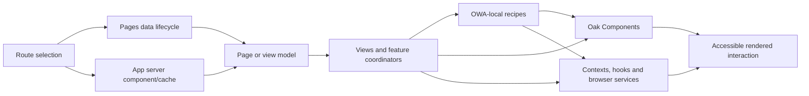

# OWA UI composition and interaction architecture

## Purpose

This record asks what architecture turns Oak information and user state into a
coherent, accessible interaction, rather than treating `src/components` as the
UI architecture by definition. It applies OCE's concept-exploration sequence:

1. expose inherited interpretations before choosing a frame;
2. define the problem without embedding a preferred implementation;
3. compare explanations for the current shape; and
4. state what changed, what would falsify it and what evidence is still needed.

It is a current-state investigation, not a proposal for OCE. Recommendations
belong after the underlying outcome and excellence contracts are established.

## Source snapshot and historical method

**Observed:** Source evidence is pinned to OWA
[`510ac63a62fb37a70183b00ce0f5fb15be4491e5`](https://github.com/oaknational/Oak-Web-Application/tree/510ac63a62fb37a70183b00ce0f5fb15be4491e5),
release `v1.1128.0`. The worktree was clean when the inventory ran.

The retired
[OWA architecture inventory](../../../evidence-harness-provenance.md#owa-architecture-inventory)
measured tracked TypeScript source areas, route-convention files, static local
imports, explicit client boundaries, cycles and assurance artefacts.

Its population is tracked `src/**/*.ts(x)` after a filename/path heuristic
excludes tests, stories, mocks and snapshots. It deliberately remains an
analysis population, not a production/deployment manifest: 73 fixture-shaped
files, eight Storybook decorators, one Storybook mock and one `src/tests`
support file remain. Runtime-shaped edges include static imports and re-exports
except imports explicitly marked type-only. The client-reachable set is an
upper-bound source graph from explicit `use client` roots: it is not a Next.js
bundle, execution trace or proof that every reachable module reaches a browser.
It also excludes the implicit browser graph of Pages Router entries without
that directive. Unresolved CSS, JSON, SVG and out-of-population imports are
reported rather than silently treated as edges. Counts below are noticers, not
quality scores.

## Executive frame

**Inferred:** OWA does not have one UI architecture. It has an interaction
composition system made from six overlapping structures:

1. route modules and page-data functions choose an outcome and its data;
2. Pages and App Router composition roots install different runtime profiles;
3. page, view and feature components assemble interactions;
4. Oak Components and OWA-local UI jointly supply visual and behavioural
   vocabulary;
5. styled-components, generated assets and global CSS establish presentation;
6. tests, stories, Pa11y and Percy observe different slices of the result.

The user-visible interface is the product of all six. No single package,
folder, provider tree or Storybook is authoritative for it.

**Observed:** Of 1,569 tracked TypeScript files in the analysis population, 805
are below `src/components`. Those 805 are divided among eleven first-level
families. The largest are `TeacherComponents` (240), `SharedComponents` (169),
`PupilComponents` (155) and `GenericPagesComponents` (111). This describes
source placement, not deployed inclusion, runtime weight or conceptual
importance.

**Observed:** The static analysis graph contains 4,312 local runtime-shaped
edges, of which 2,228 cross a top-level source area. There are 102 explicit
`"use client"` roots; their upper-bound local closure contains 946 analysed
modules, including components, contexts, browser libraries, styles, page
helpers and files below `node-lib`. There are 19 cyclic strongly connected
components containing 206 modules; the largest contains 127 modules. Population
inclusions, regular
imports used only as types and barrel re-exports can overstate runtime
reachability, so these numbers warrant framework graph and bundle investigation
rather than a conclusion about shipped JavaScript.

## Movement 1: inherited shapes put under suspicion

### Folder names are not architectural proof

**Observed:** OWA's Storybook introduction defines component placement by a
mixture of audience (`PupilComponents`, `TeacherComponents`), page class
(`GenericPagesComponents`), product area (`CurriculumComponents`), composition
role (`AppComponents`, `*Views`) and reuse (`SharedComponents`). It explicitly
says that `SharedComponents` should eventually be replaced by Oak Components
and that its nesting rule was not applied there because of that expected
deprecation
([folder rules](https://github.com/oaknational/Oak-Web-Application/blob/510ac63a62fb37a70183b00ce0f5fb15be4491e5/src/components/introduction.mdx#L10-L42),
[rename, view and nesting rules](https://github.com/oaknational/Oak-Web-Application/blob/510ac63a62fb37a70183b00ce0f5fb15be4491e5/src/components/introduction.mdx#L45-L61)).

**Inferred:** This is a maintenance and migration policy, not a stable domain
model. Reuse count determines movement into `SharedComponents`; anticipated
replacement determines where structure was not improved. Reading these names
as ownership or dependency layers would import historical choices into the
analysis.

### “View” is a convention, not one enforced layer

**Observed:** The documented rule moves `.page` components into a relevant
view folder and renames them `.view`, but current routes use several forms:

- Pages routes sometimes re-export a view as their default component;
- Pages routes sometimes load data and render a view directly;
- App Router routes colocate `Components` beneath the route segment;
- onboarding App Router pages import `TeacherViews`;
- teacher App Router pages reuse the same `TeacherViews` used by Pages routes.

For example, the Pages blog view imports a pagination component from the App
Router tree
([`BlogIndex.view.tsx`](https://github.com/oaknational/Oak-Web-Application/blob/510ac63a62fb37a70183b00ce0f5fb15be4491e5/src/components/GenericPagesViews/BlogIndex.view.tsx#L1-L16)),
while both App and Pages teacher lesson routes use `TeacherViews`.

**Inferred:** “View” sometimes means page presentation, sometimes an
interaction coordinator and sometimes a reusable full-screen projection. It
does not by itself define an input contract, runtime, data authority or allowed
dependencies.

### A component package is not the whole interaction system

**Observed:** The separate
[Oak Components boundary](../component-boundary.md) records a broad, flattened
public package plus extensive OWA-local UI. OWA's Pages shell imports Oak
Components directly, while the App Router imports them through a file whose
entire contract is `"use client"; export *`
([client re-export](https://github.com/oaknational/Oak-Web-Application/blob/510ac63a62fb37a70183b00ce0f5fb15be4491e5/src/styles/oakThemeApp.ts#L1-L2)).

**Inferred:** The actual design and interaction language includes tokens,
primitives, OWA recipes, local shared components, feature components, global
styles, third-party widgets and shell composition. Equating it with the npm
package hides responsibilities that the package neither owns nor can verify.

### A client directive is a boundary instruction, not a domain classification

**Observed:** OWA has explicit client roots for providers, hooks and interactive
components. A root barrel also turns all imports through `oakThemeApp` into a
client boundary. The static closure then reaches modules in names such as
`node-lib` and `pages-helpers`.

**Inferred:** Folder labels are insufficient to determine execution placement.
Some of the apparent reach is types and barrels, but the only reliable answer
for browser payload and server-only exclusion is a framework-aware graph and
build output.

## Movement 2: define the problem space

### Mechanism-neutral problem frame

Oak needs to present curriculum, editorial content and user workflows so that
teachers, pupils and other participants can understand state, take the right
action and recover from failure across supported devices and assistive
technologies, while preserving identity, consent, content and operational
obligations.

The gap being solved is not “lack of components”. It is the gap between
authoritative information and a perceivable, operable, understandable and
trustworthy interaction over time.

People harmed by failure include pupils who cannot complete learning,
teachers who cannot find or use resources, users of assistive technology,
content and support teams whose intent is misrepresented, and product teams
that cannot change one journey without unpredictable effects elsewhere.

Success would mean that every important interaction has:

- an explicit user outcome and semantic contract;
- authoritative inputs and state transitions;
- a deliberate server, request, navigation and browser lifetime;
- accessible behaviour and coherent visual expression;
- defined loading, empty, partial, denied and failed states;
- observation and assurance at the layer where failure becomes visible; and
- an ownership boundary that makes related change happen together.

This frame does not require React, Next.js, a component library, a universal
shell, CSS-in-JS, Storybook or even a web page. Those are candidate mechanisms.

### Recursive responsibility map

| Level        | Question                                                 | Current mechanism                                                                                      | Authority or gap                                                                                                  |
| ------------ | -------------------------------------------------------- | ------------------------------------------------------------------------------------------------------ | ----------------------------------------------------------------------------------------------------------------- |
| Outcome      | What is the person trying to accomplish?                 | Teacher, pupil, editorial, registration and Classroom journeys                                         | Intent is distributed across route names, copy, analytics and product history; source alone is not authoritative. |
| Projection   | Which information and actions should be visible?         | Route page models, views and feature components                                                        | Several projections are explicit; no common contract requires loading, partial, denied and failed states.         |
| Composition  | What installs shared interaction behaviour?              | Router roots, layouts, providers, app hooks and page layouts                                           | Pages and App Router install overlapping but non-identical profiles.                                              |
| Vocabulary   | Which semantics, controls and visual rules are reusable? | Oak Components plus local shared, audience and feature components                                      | The public package boundary and actual reuse/ownership boundary differ.                                           |
| Presentation | How is stable visual output produced?                    | Oak theme, local theme, styled-components, extracted global CSS, generated sprites and third-party CSS | Two styling paths are kept in parity manually; provider/widget styles also require global arbitration.            |
| Behaviour    | Where do interaction and browser effects live?           | React state/context, hooks, browser libraries, third-party clients                                     | Behaviour is distributed by technology and migration history as well as outcome.                                  |
| Assurance    | How is excellence demonstrated?                          | Jest, stories, Storybook, Axe/Pa11y, Percy and a small Playwright surface                              | Each sees a different projection; configured presence is not proof of enforcement or user-outcome coverage.       |

### Composition roots are runtime profiles

**Observed:** The Pages root installs global styled-components styles, Clerk,
consent, both local and Oak themes, an error boundary, PostHog, analytics, SEO,
pupil client state, React Aria overlays, menu, toast, save count, notifications,
application hooks and sprite sheets
([`_app.tsx`](https://github.com/oaknational/Oak-Web-Application/blob/510ac63a62fb37a70183b00ce0f5fb15be4491e5/src/pages/_app.tsx#L40-L90)).

**Observed:** The App Router root installs an SSR styled-components registry,
Oak theme, consent, PostHog, notifications, Clerk, analytics, application hooks,
menu and save count, but it does not reproduce the same tree or ordering. It
also owns metadata, favicon insertion and global error simulation
([`app/layout.tsx`](https://github.com/oaknational/Oak-Web-Application/blob/510ac63a62fb37a70183b00ce0f5fb15be4491e5/src/app/layout.tsx#L24-L40),
[provider composition](https://github.com/oaknational/Oak-Web-Application/blob/510ac63a62fb37a70183b00ce0f5fb15be4491e5/src/app/layout.tsx#L43-L112)).

**Observed:** The Pages `AppLayout` adds page SEO, organisation JSON-LD,
navigation, main landmark, footer and preview controls
([`AppLayout.tsx`](https://github.com/oaknational/Oak-Web-Application/blob/510ac63a62fb37a70183b00ce0f5fb15be4491e5/src/components/AppComponents/AppLayout/AppLayout.tsx#L39-L78)).
App Router route-group layouts perform comparable work using nested layouts.

**Inferred:** A “shell” is not one component. It is a behavioural profile whose
responsibilities have different valid scopes: document, product area, request,
navigation, consent state or browser session. Comparing provider-tree parity
alone would miss metadata, error, cache and browser-effect parity.

### Page assembly has at least three shapes

**Observed:** Pages routes commonly combine a Next data lifecycle with a
separate view. App Router teacher routes commonly combine server page modules,
route-local data functions and colocated components. Long-lived pupil and
generic-page areas retain their own component/view arrangements.

**Inferred:** These shapes encode migration era and workload needs as well as
architecture. The important seam is the contract between authoritative input,
projection and interaction, not whether the file is named `page`, `view` or
`Component`.

### Reuse-driven placement creates change coupling

**Observed:** The runtime-shaped import matrix is bidirectional across many
nominal areas. Analysed files below `components` statically import files below
`app`, `browser-lib`, `common-lib`, `context`, `node-lib`, `pages`,
`pages-helpers`, `styles` and `utils`. This does not prove every direction is
wrong; some imports are shared types, browser adapters or deliberate
coordination.

Two concrete loops show why the labels are not enough:

- `BlogIndex.view` imports `PostListing`; `PostListing` imports blog and webinar
  transformations and renders `PostListAndCategories`; that component imports
  `PostListingPageProps` from `BlogIndex.view`
  ([blog view](https://github.com/oaknational/Oak-Web-Application/blob/510ac63a62fb37a70183b00ce0f5fb15be4491e5/src/components/GenericPagesViews/BlogIndex.view.tsx#L1-L15),
  [listing coordinator](https://github.com/oaknational/Oak-Web-Application/blob/510ac63a62fb37a70183b00ce0f5fb15be4491e5/src/components/GenericPagesViews/PostListing.view.tsx#L20-L35),
  [list and categories](https://github.com/oaknational/Oak-Web-Application/blob/510ac63a62fb37a70183b00ce0f5fb15be4491e5/src/components/GenericPagesViews/PostListAndCategories.view.tsx#L9-L22));
- the central URL catalogue imports analytics, browser config, search state and
  teacher-component types, while navigation components import the catalogue
  ([URL catalogue imports](https://github.com/oaknational/Oak-Web-Application/blob/510ac63a62fb37a70183b00ce0f5fb15be4491e5/src/common-lib/urls/urls.ts#L1-L18)).

**Inferred:** Shared types, URL policy, presentation conversion and rendering
can become mutually change-coupled even when runtime behaviour remains correct.
The largest strongly connected component is evidence to investigate the
direction of authority, not permission to infer 127 independently defective
modules.

### Styling is a compatibility architecture

**Observed:** Pages uses a styled-components `GlobalStyle` assembled from
reset, Oak-local, PostHog and Gleap fragments
([`GlobalStyle.ts`](https://github.com/oaknational/Oak-Web-Application/blob/510ac63a62fb37a70183b00ce0f5fb15be4491e5/src/styles/GlobalStyle.ts#L1-L30)).
App Router uses a manually extracted CSS version specifically to avoid a client
flash
([`app-global.css`](https://github.com/oaknational/Oak-Web-Application/blob/510ac63a62fb37a70183b00ce0f5fb15be4491e5/src/styles/app-global.css#L1-L5))
and an SSR registry for styled-components
([`styles-registry.tsx`](https://github.com/oaknational/Oak-Web-Application/blob/510ac63a62fb37a70183b00ce0f5fb15be4491e5/src/app/styles-registry.tsx#L1-L30)).

**Observed:** The extracted stylesheet contains reduced-motion behaviour and
global layout rules, then explicit z-index/pointer-event adjustments for
PostHog and Gleap
([global and reduced-motion rules](https://github.com/oaknational/Oak-Web-Application/blob/510ac63a62fb37a70183b00ce0f5fb15be4491e5/src/styles/app-global.css#L37-L105),
[third-party adjustments](https://github.com/oaknational/Oak-Web-Application/blob/510ac63a62fb37a70183b00ce0f5fb15be4491e5/src/styles/app-global.css#L131-L154)).

**Inferred:** Styling here does more than visual decoration. It coordinates SSR,
hydration, accessibility preferences, two theme systems and third-party overlay
behaviour. Some duplication is compensating complexity for the current
rendering/styling combination; calling it simply “legacy CSS” would discard the
problem it currently solves.

### Browser-wide behaviour is centralised but consent-dependent

**Observed:** `AppHooks` declares itself the place for code that should run once
in the browser. Module evaluation installs modal watching and storage cleanup;
hooks then select Sentry or Bugsnag, enable Gleap outside pupil/video routes,
enable development Axe, attach user metadata and alias PostHog identity
([`AppHooks.tsx`](https://github.com/oaknational/Oak-Web-Application/blob/510ac63a62fb37a70183b00ce0f5fb15be4491e5/src/components/AppComponents/App/AppHooks.tsx#L19-L64)).

**Inferred:** This is an application-lifetime coordinator. Its current single
location makes global effects discoverable, but module-load effects, route
policy, consent, identity and observability share one lifecycle. The unit of
reasoning is each effect's activation and revocation contract, not the hook
file.

### Stories and tests observe projections, not the complete system

**Observed:** The pinned tree contains 844 tracked source test/spec files and
208 story files under the inventory definitions. Storybook discovers all
stories, uses the Next.js integration and configures documentation and
accessibility addons
([`main.ts`](https://github.com/oaknational/Oak-Web-Application/blob/510ac63a62fb37a70183b00ce0f5fb15be4491e5/.storybook/main.ts#L17-L36)).

**Inferred:** This is substantial authored evidence and a valuable exploration
surface. It does not establish that every story is behaviourally asserted,
that Axe findings fail CI, that router/provider parity is represented, or that
visual baselines express product intent. Those enforcement questions are
mapped in [accessibility and assurance](../accessibility-and-assurance.md).

## Movement 3: competing explanations

| Explanation                           | Supporting evidence                                                                                                                      | Weakening evidence                                                                                                                  | Current status                                                   |
| ------------------------------------- | ---------------------------------------------------------------------------------------------------------------------------------------- | ----------------------------------------------------------------------------------------------------------------------------------- | ---------------------------------------------------------------- |
| Audience-owned UI                     | Teacher, pupil, generic and curriculum families make product context visible.                                                            | Shared, App, route-local and cross-audience imports make ownership ambiguous; reuse can trigger relocation.                         | Partly explanatory.                                              |
| A layered design system               | Oak Components supplies foundations and controls while OWA supplies product projections.                                                 | The package has OWA recipes, OWA retains foundational/shared UI, and the root public contract is flattened.                         | Useful working model, not the enforced architecture.             |
| A route/view separation               | Many Pages routes load data and delegate rendering to views.                                                                             | App Router colocates features; views import route components and other views; several views coordinate state and transformations.   | Local convention, not universal architecture.                    |
| A migration-strata system             | Two routers, two global-style paths, a client re-export and an explicitly transitional Shared folder align with incremental replacement. | Some differences may be intentional product/runtime profiles rather than temporary residue.                                         | Strong historical explanation; duration and destination unknown. |
| Outcome-specific composition profiles | Teacher, pupil, registration and Classroom experiences need different providers, state and trust policy.                                 | Root trees also differ because of framework capability and incremental parity work.                                                 | Stronger frame than “one shell”, but contracts are not explicit. |
| An accidental dependency mesh         | Cross-area edges and large strongly connected components show change coupling beyond folder claims.                                      | Barrels and non-`import type` type dependencies exaggerate runtime coupling; high connectivity can be legitimate in a composed app. | Material risk signal, not yet a causal verdict.                  |

**Synthesis:** The best current explanation is a combination: product-oriented
UI grew across framework eras, a separate component system absorbed part of the
shared vocabulary, and compatibility mechanisms preserved behaviour while
routes migrated. The result retains important outcome knowledge but does not
encode one enforceable authority model.

## Movement 4: changed understanding and next evidence

### What changed in the frame

- **Changed:** “map the component hierarchy” became “map the projection,
  composition, vocabulary, behaviour and assurance contracts.”
- **Changed:** Pages/App differences are not assumed to be duplication; they are
  candidate runtime profiles whose behavioural parity and intentional
  differences must be established.
- **Changed:** `SharedComponents` and Oak Components are not assumed to be old
  and new versions of the same responsibility. Their current duties overlap but
  their extension, ownership and runtime contracts differ.
- **Changed:** the large client closure and cyclic graph are questions about
  dependency direction and execution placement, not bundle or quality
  conclusions.
- **Retained:** OWA contains extensive, high-value interaction knowledge in its
  components, tests, stories and failure handling. A future system must recover
  that knowledge by outcome, not copy its current containers.

### Discriminating investigations

| Next investigation                                                                                                  | Warrant                                                                                                                                            | Observation that would weaken the concern or alter the frame                                                                          |
| ------------------------------------------------------------------------------------------------------------------- | -------------------------------------------------------------------------------------------------------------------------------------------------- | ------------------------------------------------------------------------------------------------------------------------------------- |
| Representative rendered-interaction contracts for teacher search/download, pupil lesson, registration and Classroom | Static components do not reveal keyboard, assistive-technology, responsive, loading or recovery behaviour.                                         | The same small set of explicit semantic/state contracts already governs these surfaces and is enforced end to end.                    |
| Framework-aware client graph and production bundle trace                                                            | The explicit-directive closure reaches 946 modules and nominal server areas, but may overstate runtime inclusion and omits implicit Pages entries. | Next build manifests show narrow client chunks with server-only modules excluded and stable route budgets.                            |
| Dependency-cycle cause sample                                                                                       | The largest cycle can hide authority inversion or can be mostly barrel/type noise.                                                                 | Removing type-only and barrel edges dissolves it without changing meaningful runtime/change dependencies.                             |
| Composition-profile inventory                                                                                       | Two roots and nested layouts install overlapping behaviour without an explicit profile contract.                                                   | Product/runtime differences are already deliberate, documented and protected by parity tests.                                         |
| Styling provenance and first-render probe                                                                           | Global rules are duplicated to prevent flash and reconcile providers/widgets.                                                                      | Generated parity is exact, first render is stable across routes, and third-party adjustments have owned regression tests.             |
| Story-to-assurance trace                                                                                            | Story count and addon configuration do not show which claims are enforced.                                                                         | Every high-consequence interaction state maps to automated Axe, interaction and visual assertions with owned exceptions.              |
| UI decision-history sample                                                                                          | Migration comments explain some current shape but not which contracts are enduring.                                                                | Maintainers and records show that the current folders, package boundary and style split are deliberate long-term ownership decisions. |

### Unresolved evidence

- user and product research establishing which interaction outcomes matter most;
- supported browser, device, input and assistive-technology contracts;
- actual client chunks, hydration boundaries, CSS order and first-render traces;
- Storybook interaction execution, Axe enforcement and visual approval policy;
- design and content decision authority across OWA and Oak Components;
- ownership of shared behaviours, recipes and third-party integration styles;
- incidents or support evidence caused or prevented by the current composition;
- which differences between runtime profiles are intentional, transitional or
  accidental.

Until those are known, the evidence supports a richer map and sharper
questions, not a preferred OCE component or application architecture.
