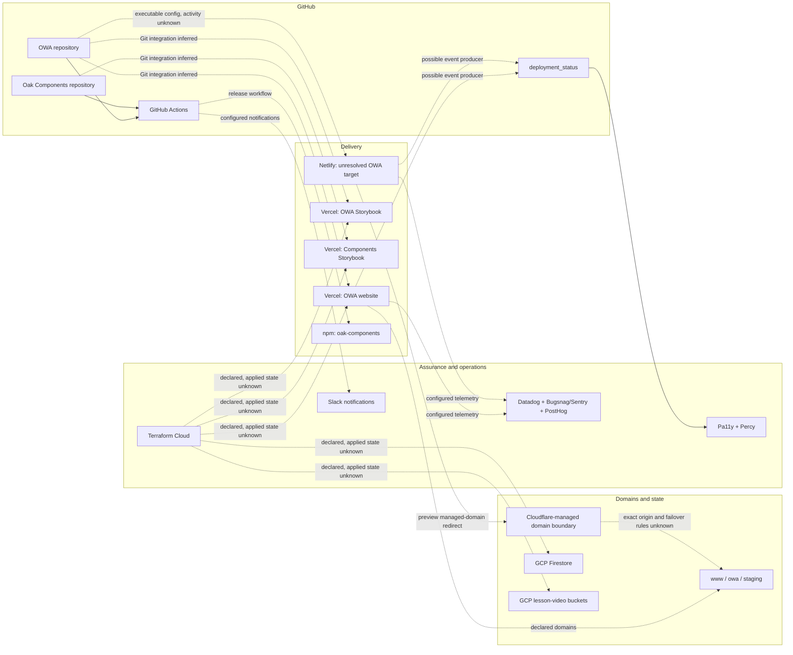

# Production and operational topology

## Scope and evidence

This is a static reconstruction of repository-visible deployment and operations at:

- OWA: [`510ac63a62fb37a70183b00ce0f5fb15be4491e5`](https://github.com/oaknational/Oak-Web-Application/tree/510ac63a62fb37a70183b00ce0f5fb15be4491e5)
- Oak Components: [`8ff8264fa921e4e40fdaf9a99b02fd156c699cc8`](https://github.com/oaknational/oak-components/tree/8ff8264fa921e4e40fdaf9a99b02fd156c699cc8)

It does not prove the state of Vercel, Netlify, Cloudflare, Terraform Cloud, GCP, npm or observability accounts. In this document:

- **Observed** means the behavior is present and enabled in the pinned source.
- **Inferred** means it is the most parsimonious explanation of several observations, but an external setting completes the path.
- **Unknown** means the repository cannot answer the question.
- **Configured, external state unknown** means a complete repository-side activation path exists, but no control-plane or run evidence was inspected.
- **Residue candidate** means contradictory or incomplete configuration warrants verification; it does not mean the platform is inactive.

## Provisional topology

**Inferred:** Vercel is the primary OWA application platform. It is the only application host provisioned by the current project Terraform, owns the canonical domains in that configuration, has a staging environment, receives drift checks, and is named by current deployment automation.

**Unknown:** The real DNS path, whether Cloudflare proxies every canonical request, whether Netlify remains a failover origin, and which deployment currently owns each alias require external verification.

## Deployment inventory

| Surface or artifact      | Repository-visible platform | Evidence state                                                 | Repository contract                                                                                                                                                                                                                                                                                                                                                                                                                                             |
| ------------------------ | --------------------------- | -------------------------------------------------------------- | --------------------------------------------------------------------------------------------------------------------------------------------------------------------------------------------------------------------------------------------------------------------------------------------------------------------------------------------------------------------------------------------------------------------------------------------------------------- |
| OWA website              | Vercel                      | **Configured, external state unknown**                         | Terraform declares a public Next.js project for `www.thenational.academy` and `owa.thenational.academy`, an enhanced build machine, seven-day skew protection and a `main`-backed staging domain ([source](https://github.com/oaknational/Oak-Web-Application/blob/510ac63a62fb37a70183b00ce0f5fb15be4491e5/infrastructure/project/builds.tf#L1-L30)).                                                                                                          |
| OWA website functions    | Vercel                      | **Configured, external state unknown**                         | `vercel.json` selects London, Dublin and Paris regions ([source](https://github.com/oaknational/Oak-Web-Application/blob/510ac63a62fb37a70183b00ce0f5fb15be4491e5/vercel.json#L1-L4)).                                                                                                                                                                                                                                                                          |
| OWA Storybook            | Vercel                      | **Configured, external state unknown**                         | A private Storybook project is declared for `storybook.thenational.academy`, with a one-day skew window ([source](https://github.com/oaknational/Oak-Web-Application/blob/510ac63a62fb37a70183b00ce0f5fb15be4491e5/infrastructure/project/builds.tf#L21-L30)).                                                                                                                                                                                                  |
| OWA website              | Netlify                     | **Residue candidate; external state unknown**                  | Netlify production, deploy-preview and branch-deploy behavior remains executable, but there is no repository Terraform or workflow inventory proving a connected site ([source](https://github.com/oaknational/Oak-Web-Application/blob/510ac63a62fb37a70183b00ce0f5fb15be4491e5/netlify.toml#L4-L53)).                                                                                                                                                         |
| Components documentation | Vercel                      | **Configured, external state unknown**                         | Terraform declares a public Storybook project at `components.thenational.academy`, built from the Components repository, with one-day skew protection ([source](https://github.com/oaknational/oak-components/blob/8ff8264fa921e4e40fdaf9a99b02fd156c699cc8/infrastructure/project/main.tf#L14-L26)).                                                                                                                                                           |
| Components package       | npm                         | **Repository-active publication path; registry state unknown** | Semantic Release publishes `dist` as ESM, CJS and declarations; the workflow grants OIDC provenance permission and runs only after a successful `Verify` workflow on `main` ([package](https://github.com/oaknational/oak-components/blob/8ff8264fa921e4e40fdaf9a99b02fd156c699cc8/package.json#L1-L14), [release workflow](https://github.com/oaknational/oak-components/blob/8ff8264fa921e4e40fdaf9a99b02fd156c699cc8/.github/workflows/release.yml#L1-L48)). |
| Pupil and teacher state  | GCP Firestore               | **Configured, external state unknown**                         | Terraform creates production and staging stores, maps Vercel production and preview environments to them, enables optimistic concurrency, and optionally configures weekly production backup and point-in-time recovery ([source](https://github.com/oaknational/Oak-Web-Application/blob/510ac63a62fb37a70183b00ce0f5fb15be4491e5/infrastructure/project/firestore.tf#L1-L64)).                                                                                |
| Lesson-video storage     | GCP Storage                 | **Configured, ownership/activity unknown**                     | A separate Terraform workspace declares environment-named buckets and creator-origin CORS ([source](https://github.com/oaknational/Oak-Web-Application/blob/510ac63a62fb37a70183b00ce0f5fb15be4491e5/infrastructure/web/lesson_video_buckets.tf#L1-L24)).                                                                                                                                                                                                       |

## Build, release and deployment flows

### OWA

1. **Observed:** pushes to `main`, pull-request updates and merge queues run formatting, lint, type checks, Jest and Sonar. The workflow explicitly describes its Jest job as unit tests, not integration tests ([source](https://github.com/oaknational/Oak-Web-Application/blob/510ac63a62fb37a70183b00ce0f5fb15be4491e5/.github/workflows/code_checks.yml#L1-L81)).
2. **Observed:** each non-release-file push to `main` runs Semantic Release. It updates the changelog and Sonar version, creates a release commit and creates a GitHub release. The workflow states that the GitHub release triggers deployment ([workflow](https://github.com/oaknational/Oak-Web-Application/blob/510ac63a62fb37a70183b00ce0f5fb15be4491e5/.github/workflows/create_semantic_release.yml#L1-L63), [release contract](https://github.com/oaknational/Oak-Web-Application/blob/510ac63a62fb37a70183b00ce0f5fb15be4491e5/release.config.js#L1-L48)).
3. **Observed:** OWA is marked private, so Semantic Release publishes release metadata and source history rather than an npm application package ([package](https://github.com/oaknational/Oak-Web-Application/blob/510ac63a62fb37a70183b00ce0f5fb15be4491e5/package.json#L1-L12), [release contract](https://github.com/oaknational/Oak-Web-Application/blob/510ac63a62fb37a70183b00ce0f5fb15be4491e5/release.config.js#L20-L48)).
4. **Observed:** Terraform passes the OWA GitHub repository to a shared Vercel project module and declares production, preview and custom staging environment variables ([project](https://github.com/oaknational/Oak-Web-Application/blob/510ac63a62fb37a70183b00ce0f5fb15be4491e5/infrastructure/project/main.tf#L19-L41), [environment mapping](https://github.com/oaknational/Oak-Web-Application/blob/510ac63a62fb37a70183b00ce0f5fb15be4491e5/infrastructure/project/locals.tf#L1-L25)).
5. **Inferred:** connected hosting platforms build the deployable Next.js and Storybook artifacts. The shared module likely configures a Vercel Git integration, so pull requests produce previews and the configured production branch or release event produces production builds. The module implementation and live Vercel Git settings are outside the repository, so the exact trigger cannot be proven here.
6. **Observed:** build-time release identity has two paths: `OVERRIDE_APP_VERSION` wins when present; otherwise production parses a Semantic Release commit and adds `-vercel` for Vercel builds ([source](https://github.com/oaknational/Oak-Web-Application/blob/510ac63a62fb37a70183b00ce0f5fb15be4491e5/scripts/build/build_config_helpers.ts#L59-L126)). Terraform lists the override as a required production variable ([source](https://github.com/oaknational/Oak-Web-Application/blob/510ac63a62fb37a70183b00ce0f5fb15be4491e5/infrastructure/project/locals.tf#L40-L51)).
7. **Unknown:** whether production deploys from the release commit, the GitHub release, every `main` commit, or a control-plane override; which mechanism owns the production version; and how rollback changes that version.

### Oak Components

1. **Observed:** `Verify` runs format, lint, type, Rollup build, Jest and Sonar for pull requests and `main` ([source](https://github.com/oaknational/oak-components/blob/8ff8264fa921e4e40fdaf9a99b02fd156c699cc8/.github/workflows/verify.yml#L1-L39)).
2. **Observed:** only a successful `Verify` run on `main` activates the release job. It verifies dependency signatures, requests npm provenance through GitHub OIDC, and executes Semantic Release ([source](https://github.com/oaknational/oak-components/blob/8ff8264fa921e4e40fdaf9a99b02fd156c699cc8/.github/workflows/release.yml#L1-L48)).
3. **Observed:** the package release contract publishes only `dist`, builds ESM, CJS and a declaration bundle, and commits generated package-version files with `[skip ci]` ([package](https://github.com/oaknational/oak-components/blob/8ff8264fa921e4e40fdaf9a99b02fd156c699cc8/package.json#L1-L31), [release configuration](https://github.com/oaknational/oak-components/blob/8ff8264fa921e4e40fdaf9a99b02fd156c699cc8/package.json#L126-L145), [bundle](https://github.com/oaknational/oak-components/blob/8ff8264fa921e4e40fdaf9a99b02fd156c699cc8/rollup.config.js#L12-L43)).
4. **Inferred:** the Components Storybook Vercel project follows Git independently of npm publication. A commit can therefore produce a documentation preview before it has a package version, and the production Storybook can move on `main` independently of a consuming OWA deployment.
5. **Unknown:** whether Storybook deployment success gates npm publication, whether npm publication triggers any OWA dependency update, and what rollback procedure keeps documentation, package and consumers aligned.

## Environment and preview model

| Context                                | Application/data mapping visible in source                                                                  | Confidence                                                               |
| -------------------------------------- | ----------------------------------------------------------------------------------------------------------- | ------------------------------------------------------------------------ |
| OWA Vercel production                  | Canonical `www` and `owa` domains; production Clerk and GCP service identity; production Firestore          | **Observed configuration; external values unknown**                      |
| OWA Vercel preview                     | Per-branch Vercel context implied by Git project; preview Clerk and GCP service identity; staging Firestore | **Observed environment mapping; preview creation inferred**              |
| OWA Vercel staging                     | `main` custom environment at `owa-staging.thenational.academy`; staging credentials and Firestore           | **Observed configuration; deployment cadence unknown**                   |
| OWA Storybook                          | Production and preview env groups; private Vercel project                                                   | **Observed configuration; access policy implementation unknown**         |
| Components Storybook                   | Production and preview asset variables; public Vercel project at `components.thenational.academy`           | **Observed configuration; deployment cadence unknown**                   |
| Netlify production                     | Canonical-host redirects, attempted non-version-build cancellation, Slack plugin and bundled env file       | **Observed configuration; connected site and successful builds unknown** |
| Netlify deploy preview / branch deploy | Edge redirect from `*.netlify.app` to `*.netlify.thenational.academy`                                       | **Observed configuration; DNS worker and deploy activity unknown**       |

**Observed:** OWA's Terraform separates Vercel environment names from GCP environment names. Both ordinary previews and the named staging environment use staging-side state, while production uses production state ([source](https://github.com/oaknational/Oak-Web-Application/blob/510ac63a62fb37a70183b00ce0f5fb15be4491e5/infrastructure/project/locals.tf#L1-L25)). This is a useful boundary: deployment identity and data identity are related but not synonymous.

## Request, edge and routing layers

### Canonical Vercel path

**Observed:** the repository configures the OWA Vercel project with `www` and `owa` domains through a shared module that also receives a Cloudflare zone. The shared module is an external source, so this proves declared domain management but not whether traffic is proxied, DNS-only, load-balanced or capable of origin failover ([source](https://github.com/oaknational/Oak-Web-Application/blob/510ac63a62fb37a70183b00ce0f5fb15be4491e5/infrastructure/project/main.tf#L19-L34)).

**Observed:** within Next.js, permanent redirects preserve old pupil, about, EYFS and curriculum paths. A rewrite exposes the API catalog at `/.well-known/api-catalog`; development-only rewrites proxy PostHog ingestion ([source](https://github.com/oaknational/Oak-Web-Application/blob/510ac63a62fb37a70183b00ce0f5fb15be4491e5/next.config.ts#L380-L516)). These are application routing contracts, not hosting-provider redirects.

**Observed:** Clerk middleware is deliberately limited to API and tRPC paths and excludes `/api/classroom`, rather than running on all page requests ([source](https://github.com/oaknational/Oak-Web-Application/blob/510ac63a62fb37a70183b00ce0f5fb15be4491e5/src/middleware.ts#L1-L16)). Identity enforcement therefore also lives in route, layout, handler and Google Classroom-specific code.

### Netlify path

**Observed:** direct production Netlify hosts redirect to `www.thenational.academy`. Preview and branch deployments attach a Netlify Edge function at `/*`, except for internal/static allow-listed paths ([configuration](https://github.com/oaknational/Oak-Web-Application/blob/510ac63a62fb37a70183b00ce0f5fb15be4491e5/netlify.toml#L4-L53), [edge function](https://github.com/oaknational/Oak-Web-Application/blob/510ac63a62fb37a70183b00ce0f5fb15be4491e5/netlify/edge-functions/subdomain-redirects.ts#L1-L80)).

**Observed:** the edge function rewrites the host to `<deploy>.netlify.thenational.academy` and checks an `x-cloudflare-redirect` header to prevent a loop. **Inferred:** an external Cloudflare worker or rule proxies that managed preview domain back to Netlify. **Unknown:** whether that rule still exists.

## Caching, regeneration and schedules

**Observed:** the repository uses clocks rather than a single cache policy:

| Boundary                                   | Repository policy                                                                                                                                                                                                                                                                                                           |
| ------------------------------------------ | --------------------------------------------------------------------------------------------------------------------------------------------------------------------------------------------------------------------------------------------------------------------------------------------------------------------------- |
| App Router core layout and teacher sitemap | 7,200-second revalidation ([layout](https://github.com/oaknational/Oak-Web-Application/blob/510ac63a62fb37a70183b00ce0f5fb15be4491e5/src/app/%28core%29/layout.tsx#L11-L13), [sitemap](https://github.com/oaknational/Oak-Web-Application/blob/510ac63a62fb37a70183b00ce0f5fb15be4491e5/src/app/teachers/sitemap.ts#L1-L9)) |
| Shared App Router data helper              | `unstable_cache`, default 7,200 seconds, optional tags ([source](https://github.com/oaknational/Oak-Web-Application/blob/510ac63a62fb37a70183b00ce0f5fb15be4491e5/src/node-lib/cache/index.ts#L1-L33))                                                                                                                      |
| Pages Router CMS/static pages              | ISR clock from `SANITY_REVALIDATE_SECONDS`; ISR can be disabled and dynamic paths use blocking fallback ([source](https://github.com/oaknational/Oak-Web-Application/blob/510ac63a62fb37a70183b00ce0f5fb15be4491e5/src/node-lib/isr/index.ts#L1-L51))                                                                       |
| Curriculum download response               | shared cache for 24 hours, then three minutes stale-while-revalidate ([source](https://github.com/oaknational/Oak-Web-Application/blob/510ac63a62fb37a70183b00ce0f5fb15be4491e5/src/pages/api/curriculum-downloads/index.ts#L21-L22))                                                                                       |
| AI search-intent response                  | Cloudflare shared-cache header for 30 days ([source](https://github.com/oaknational/Oak-Web-Application/blob/510ac63a62fb37a70183b00ce0f5fb15be4491e5/src/pages/api/search/intent/index.ts#L20-L30))                                                                                                                        |
| API catalog                                | public browser/shared cache for one hour ([source](https://github.com/oaknational/Oak-Web-Application/blob/510ac63a62fb37a70183b00ce0f5fb15be4491e5/src/app/api/well-known/api-catalog/route.ts#L74-L82))                                                                                                                   |
| Production Firestore                       | optional weekly backup plus optional point-in-time recovery ([source](https://github.com/oaknational/Oak-Web-Application/blob/510ac63a62fb37a70183b00ce0f5fb15be4491e5/infrastructure/project/firestore.tf#L26-L35))                                                                                                        |

**Observed:** no `revalidatePath` or live `revalidateTag` call, application cron in `vercel.json`, or scheduled application workflow was found in the pinned tree. The post-deployment cache-warming job is commented out ([source](https://github.com/oaknational/Oak-Web-Application/blob/510ac63a62fb37a70183b00ce0f5fb15be4491e5/.github/workflows/post_deployment_actions.yml#L45-L65)). Dependabot schedules dependency maintenance, not application work.

**Unknown:** CMS webhooks, provider-side cache purge rules, Vercel control-plane cron jobs, Cloudflare cache rules and manually operated invalidation may exist outside the repository. Absence in source is not evidence that they do not.

## Post-deployment assurance

**Observed:** a successful GitHub `deployment_status`, excluding environments whose names end in `storybook` or `storybook-console`, runs Pa11y and Percy against the deployment URL. Both write environment-specific custom commit statuses. Vercel's automation bypass secret is supplied to both checks ([source](https://github.com/oaknational/Oak-Web-Application/blob/510ac63a62fb37a70183b00ce0f5fb15be4491e5/.github/workflows/post_deployment_actions.yml#L67-L177)).

**Observed:** adding deployment URLs to pull-request descriptions and warming caches are present but disabled. **Unknown:** which hosts emit the `deployment_status` events, whether these checks are required before alias promotion, and whether any external functional smoke, performance, security or rollback check exists.

**Observed:** Oak Components has build and Jest verification before publication and a Storybook accessibility addon, but no repository workflow reacts to a deployed Components Storybook. **Unknown:** Vercel checks or external monitors may fill that gap.

## Observability and operational feedback

| Signal             | Repository behavior                                                                                                                                                                                                                                                                                                                                                                                                                                                                                                                                                                                                                                              | Evidence state                                                 |
| ------------------ | ---------------------------------------------------------------------------------------------------------------------------------------------------------------------------------------------------------------------------------------------------------------------------------------------------------------------------------------------------------------------------------------------------------------------------------------------------------------------------------------------------------------------------------------------------------------------------------------------------------------------------------------------------------------- | -------------------------------------------------------------- |
| Application errors | Production builds report a release and upload source maps to Bugsnag, or to Sentry when the Sentry flag is enabled. Sentry events can tunnel through `/monitoring` ([build integration](https://github.com/oaknational/Oak-Web-Application/blob/510ac63a62fb37a70183b00ce0f5fb15be4491e5/next.config.ts#L294-L351), [tunnel](https://github.com/oaknational/Oak-Web-Application/blob/510ac63a62fb37a70183b00ce0f5fb15be4491e5/next.config.ts#L569-L584)).                                                                                                                                                                                                        | **Observed configuration; destination activity unknown**       |
| Runtime privacy    | Sentry and Bugsnag omit default PII/IP; browser error reporting is consent-aware ([Sentry](https://github.com/oaknational/Oak-Web-Application/blob/510ac63a62fb37a70183b00ce0f5fb15be4491e5/src/common-lib/error-reporter/sentry.ts#L39-L71), [Bugsnag](https://github.com/oaknational/Oak-Web-Application/blob/510ac63a62fb37a70183b00ce0f5fb15be4491e5/src/common-lib/error-reporter/bugsnag.ts#L42-L104)).                                                                                                                                                                                                                                                    | **Observed**                                                   |
| Host logs          | Production Terraform declares Datadog error and timeout monitors separately for Vercel and Netlify and sends alerts to Slack ([source](https://github.com/oaknational/Oak-Web-Application/blob/510ac63a62fb37a70183b00ce0f5fb15be4491e5/infrastructure/web/monitoring.tf#L1-L81)).                                                                                                                                                                                                                                                                                                                                                                               | **Configured; log drains and recent data unknown**             |
| Product analytics  | PostHog is configured in the application shell and server-side CMS decisions ([client](https://github.com/oaknational/Oak-Web-Application/blob/510ac63a62fb37a70183b00ce0f5fb15be4491e5/src/app/providers.tsx#L1-L27), [server](https://github.com/oaknational/Oak-Web-Application/blob/510ac63a62fb37a70183b00ce0f5fb15be4491e5/src/node-lib/cms/ab-testing.ts#L1-L31)).                                                                                                                                                                                                                                                                                        | **Observed application integration; project activity unknown** |
| Release health     | OWA Semantic Release reports failure to Slack. Netlify's production plugin reports build start/completion to Slack. Vercel drift detection can alert to Slack ([release](https://github.com/oaknational/Oak-Web-Application/blob/510ac63a62fb37a70183b00ce0f5fb15be4491e5/.github/workflows/create_semantic_release.yml#L53-L73), [Netlify](https://github.com/oaknational/Oak-Web-Application/blob/510ac63a62fb37a70183b00ce0f5fb15be4491e5/netlify/plugins/slack-reporting/index.js#L10-L118), [drift](https://github.com/oaknational/Oak-Web-Application/blob/510ac63a62fb37a70183b00ce0f5fb15be4491e5/.github/workflows/terraform_vercel_drift.yml#L1-L32)). | **Configured; notification delivery unknown**                  |
| Static analysis    | Both repositories invoke Sonar in their verification workflows ([OWA](https://github.com/oaknational/Oak-Web-Application/blob/510ac63a62fb37a70183b00ce0f5fb15be4491e5/.github/workflows/code_checks.yml#L48-L81), [Components](https://github.com/oaknational/oak-components/blob/8ff8264fa921e4e40fdaf9a99b02fd156c699cc8/.github/workflows/verify.yml#L29-L39)).                                                                                                                                                                                                                                                                                              | **Observed workflow path; quality-gate settings unknown**      |

## Netlify and Vercel coexistence

The repository does not support a binary conclusion that Netlify is either active failover or harmless dead code.

### Evidence for intentional coexistence

- **Observed:** release-stage and app-version code handles both Vercel and Netlify build inputs (`VERCEL_ENV` is consumed by the caller; `COMMIT_REF` is parsed here) ([release stage](https://github.com/oaknational/Oak-Web-Application/blob/510ac63a62fb37a70183b00ce0f5fb15be4491e5/next.config.ts#L68-L82), [version](https://github.com/oaknational/Oak-Web-Application/blob/510ac63a62fb37a70183b00ce0f5fb15be4491e5/scripts/build/build_config_helpers.ts#L69-L126)).
- **Observed:** Netlify has production redirects, preview edge routing, a production Slack reporter and included build env files.
- **Observed:** Datadog declares separate monitors for both providers rather than a provider-neutral monitor.
- **Observed:** Bugsnag versions deliberately distinguish Vercel, implying the un-suffixed version may identify the other production host.

### Evidence for historical residue or incomplete failover

- **Observed:** Vercel, not Netlify, is provisioned and drift-checked by current project Terraform.
- **Observed:** the Netlify GitHub-deployments plugin is commented out and absent from the tree ([source](https://github.com/oaknational/Oak-Web-Application/blob/510ac63a62fb37a70183b00ce0f5fb15be4491e5/netlify.toml#L1-L3)).
- **Observed:** the Netlify production `ignore` command points to `scripts/build/cancel_netlify_build.js`, but that file does not exist in the pinned tree ([configuration](https://github.com/oaknational/Oak-Web-Application/blob/510ac63a62fb37a70183b00ce0f5fb15be4491e5/netlify.toml#L30-L32), [pinned build-script tree](https://github.com/oaknational/Oak-Web-Application/tree/510ac63a62fb37a70183b00ce0f5fb15be4491e5/scripts/build)). The intended cancellation gate is therefore not reproducible from this source.
- **Observed:** post-deployment comments repeatedly mention temporarily filtering Netlify, while the active predicates only identify Storybook by name. With the Netlify deployments plugin absent, the actual event path is unclear.
- **Observed:** build comments say production is Vercel-only while adjacent code still accepts Netlify context ([source](https://github.com/oaknational/Oak-Web-Application/blob/510ac63a62fb37a70183b00ce0f5fb15be4491e5/next.config.ts#L68-L78)).

**Provisional conclusion:** treat Netlify as an unresolved operational branch. Do not delete it, depend on it for recovery, or reproduce it in an OCE product until the control plane, DNS and last successful deploy are checked.

## Observed strengths and preservation questions

These mechanisms are visible in source. Their impact and necessity remain preservation hypotheses until operational, product, user or impact evidence establishes them.

- **Observed:** infrastructure and environment wiring are declared in code, and Vercel drift is checked for website and Storybook workspaces after `main` changes.
- **Observed:** production and non-production identities and Firestore stores are separated. Terraform supplies GCP workload-identity coordinates, while a separate secret-manager service-account value remains part of the current build contract ([source](https://github.com/oaknational/Oak-Web-Application/blob/510ac63a62fb37a70183b00ce0f5fb15be4491e5/infrastructure/project/locals.tf#L54-L99)).
- **Observed:** skew-protection windows acknowledge that old browser assets and new server functions coexist during a release.
- **Observed:** deployment-level accessibility and visual checks use the real preview URL and retain separate statuses for parallel deployment environments.
- **Observed:** the Components package is built and tested before an OIDC-provenance npm publication.
- **Observed:** error events are versioned, source-mapped, filtered, consent-aware and paired with host-level log monitors.
- **Observed:** old public paths are preserved through explicit redirects during product and router migrations.
- **Observed:** production pupil state has explicit optimistic-concurrency and conditional weekly-backup/point-in-time-recovery policy in infrastructure code.

These are candidate outcomes to retain. External evidence must establish which are requirements; the specific vendors, duplicate configuration and current release choreography are not automatically part of them.

## Operational seams and residue candidates

1. **Deployment source of truth:** GitHub release, release commit, Vercel Git settings and `OVERRIDE_APP_VERSION` can all affect production identity. Rollback and promotion ownership are not visible.
2. **Second-host intent:** Netlify contains substantial executable behavior but lacks current infrastructure ownership and has a missing build-gate script.
3. **Domain-edge ownership:** the shared Terraform module receives a Cloudflare zone, while Netlify preview code assumes a Cloudflare redirect. The actual DNS, proxy, cache and failover graph is external.
4. **Cache ownership:** repository clocks range from one minute to 30 days, but no active on-demand invalidation path is visible. Product freshness and operator recovery are not named together.
5. **Assurance timing:** Pa11y and Percy run after a successful deployment event; whether they block alias promotion is unknown. Functional journey and rollback smoke checks are not visible.
6. **Error-platform transition:** Bugsnag remains the default path while Sentry is flag-selected, duplicating build, source-map and runtime behavior. The intended destination and parity exit criteria are unknown.
7. **Documentation artifacts:** OWA and Components each deploy a Storybook with different visibility and domains, while only the npm artifact is a consumer contract. Ownership of preview, documentation and release compatibility is split.
8. **Package-to-app propagation:** Components publishes independently; OWA consumes a semver range from npm. No repository automation proves a component release in OWA before or after publication ([OWA dependency](https://github.com/oaknational/Oak-Web-Application/blob/510ac63a62fb37a70183b00ce0f5fb15be4491e5/package.json#L84-L103)).
9. **Legacy infrastructure boundary:** `infrastructure/web` owns storage and dual-host Datadog monitors while `infrastructure/project` owns Vercel and Firestore. The README still describes the folder mainly as lesson-video buckets, so workspace ownership is not self-evident.
10. **GCP credential transition:** workload-identity coordinates and a secret-manager service-account credential coexist. The intended destination, rotation ownership and remaining use of the latter are not visible.

## Effects on the hypotheses

| Hypothesis                                                                                    | Effect of this evidence                                                                                                                                                                                                                 | Invalidator or narrowing test                                                                                                                                                                                                                                              |
| --------------------------------------------------------------------------------------------- | --------------------------------------------------------------------------------------------------------------------------------------------------------------------------------------------------------------------------------------- | -------------------------------------------------------------------------------------------------------------------------------------------------------------------------------------------------------------------------------------------------------------------------- |
| [H001: Capability-owned modules](../hypotheses/H001-capability-owned-modules.md)              | **Mixed.** OWA is one deployment unit with shared identity, cache and operations, while Firestore, Classroom and package publication expose distinct capability boundaries. Capability ownership need not imply independent deployment. | Weaken package-per-capability interpretations if a vertical slice needs most global build settings, coupled releases and shared rollback to remain operable. Strengthen in-process capability ownership if one deployment can expose small explicit operational contracts. |
| [H002: Layered UI platform](../hypotheses/H002-layered-ui-platform.md)                        | **Supports testing.** Package publication and Storybook deployment are already separate artifacts, so supported exports, documentation and consumer verification can be treated as different contracts.                                 | Reject package splitting if the proposed boundaries do not express distinct semantics, dependency contracts or independently verifiable obligations and one release unit expresses them more coherently. Test export boundaries inside one release first.                  |
| [H003: Unified runtime-shell contract](../hypotheses/H003-unified-runtime-shell.md)           | **Supports a platform profile.** Error reporting, consent, release identity, metadata, middleware and analytics cross both routers and the deployment boundary.                                                                         | Narrow the contract if provider-specific needs cannot be represented without loading unnecessary client code, or if Netlify/Vercel differences are intentional failover behavior requiring distinct adapters.                                                              |
| [H004: Domain ports and explicit freshness](../hypotheses/H004-domain-ports-and-freshness.md) | **Strengthens the freshness part.** OWA has several unrelated clocks and CDN layers, while no active on-demand invalidation path is visible.                                                                                            | Weaken if external CMS webhooks and cache rules already provide observable, outcome-specific freshness and recovery. A port is useful only if it owns a user-visible stale/failure policy, not merely a cache number.                                                      |
| [H005: Journey-level confidence](../hypotheses/H005-journey-level-confidence.md)              | **Supports a discriminating experiment.** Real-deployment Pa11y and Percy are strong, but they do not state that teacher download, pupil completion, saved content or Classroom submission works.                                       | Reject added journey gates if existing external checks already cover those outcomes, or if a controlled journey cannot predict production because identity/data environments differ too much. First establish whether checks block promotion.                              |

## Most decisive external verification

A read-only control-plane inventory would resolve most high-value unknowns without changing a deployment:

| Order | Read-only query                                                                                                               | Evidence to capture                                                                                                                                                        | Decision unlocked                                                                                                        |
| ----- | ----------------------------------------------------------------------------------------------------------------------------- | -------------------------------------------------------------------------------------------------------------------------------------------------------------------------- | ------------------------------------------------------------------------------------------------------------------------ |
| 1     | Vercel projects and deployment history spanning the current and previous configurations for OWA, OWA Storybook and Components | Git binding, production branch, ignored-build command, custom environments, aliases, deployment protection, regions, log drains, last successful SHA and promotion history | Confirm the primary path, preview behavior, release trigger and whether Pa11y/Percy can gate promotion.                  |
| 2     | Netlify site inventory and deployment history spanning the current and previous configurations                                | Connected repository, build command, contexts, domains, build hooks, last successful production/preview SHA and effective ignore-command result                            | Classify Netlify as active, failover-ready, dormant or removable residue.                                                |
| 3     | Cloudflare DNS, workers, load balancers and cache rules for the named domains                                                 | Proxied/DNS-only flags, origin pools, preview redirect worker, health checks, fallback origin and API cache rules                                                          | Establish the real request, preview, failover and purge topology.                                                        |
| 4     | Terraform Cloud workspace list, current states and recent runs                                                                | Workspaces matching OWA website, OWA Storybook, Components, web storage and environments; outputs and drift status                                                         | Confirm which declarations are applied and who owns each resource.                                                       |
| 5     | GitHub deployment events and recent workflow runs for one merged OWA release                                                  | Event producer, environment names, release commit, deployment URL, check conclusions and ordering                                                                          | Reconstruct the actual merge-to-production timeline and identify the release source of truth.                            |
| 6     | npm metadata and provenance for the current and previous Components versions                                                  | Published files, provenance subject SHA, dist-tags and publish time                                                                                                        | Confirm that the package workflow produces the documented artifact and expose consumer lag.                              |
| 7     | Datadog, Bugsnag and Sentry read-only health                                                                                  | Last log/event by host and release, monitor state, alert delivery and relative traffic                                                                                     | Distinguish active integrations from migration residue and prove host usage without relying only on deployment metadata. |
| 8     | Sanity/Vercel/Cloudflare invalidation settings                                                                                | Webhooks, revalidation endpoints, cache tags, purge hooks, failure history and operator runbook                                                                            | Decide whether the repository's time-based model is complete or only one part of freshness behavior.                     |

The highest-value first check is the combined Vercel and Netlify deployment inventory. It can settle the primary/failover question, expose the real release trigger, and prevent both accidental deletion of recovery capability and accidental preservation of non-functional complexity.
