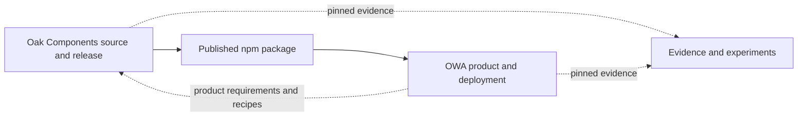

# Repository anatomy

## Scope and counting method

This is a source-shape map at the revisions pinned in the [research charter](../research-charter.md). Counts use `rg --files`, so they include non-ignored working-tree files and exclude Git, ignored dependencies and build output. Test counts match `*.test.*` or `*.spec.*` under `src`; story counts match `*.stories.*` or story MDX under `src`.

Counts are navigation evidence, not quality measures. Generated SDKs, snapshots, fixtures and migration copies can dominate line/file totals without representing equivalent authored complexity.

| Repository             | Revision                                                                                                                                       | Non-ignored files | Source files | Focus                                                     |
| ---------------------- | ---------------------------------------------------------------------------------------------------------------------------------------------- | ----------------: | -----------: | --------------------------------------------------------- |
| Oak Web Application    | [`510ac63a62fb37a70183b00ce0f5fb15be4491e5`](https://github.com/oaknational/Oak-Web-Application/tree/510ac63a62fb37a70183b00ce0f5fb15be4491e5) |             3,022 |        2,905 | Product, routes, BFF, service adapters and operations     |
| Oak Components         | [`8ff8264fa921e4e40fdaf9a99b02fd156c699cc8`](https://github.com/oaknational/oak-components/tree/8ff8264fa921e4e40fdaf9a99b02fd156c699cc8)      |             1,145 |        1,103 | One published UI package and its catalogue/tests          |
| Web app deconstruction | retained historical corpus                                                                                                                     |                77 |           77 | Evidence, hypotheses, experiment records and synthesis    |

## Oak Web Application

### Repository roles

**Observed:** OWA is one Next.js deployment that contains:

- public teacher, pupil, editorial and account pages;
- an embedded Google Classroom add-on surface;
- backend-for-frontend route handlers for curriculum, identity, user data, pupil results, Classroom, exports and integrations;
- generated and handwritten service adapters;
- configuration, Terraform, release automation, deployed-page checks and observability integration.

The [system map](./system-map.md) records the product/service context; this document records where those responsibilities currently live.

### Routing systems

| Routing area                      | Production files at snapshot | Visible responsibility                                                                              |
| --------------------------------- | ---------------------------: | --------------------------------------------------------------------------------------------------- |
| `src/pages` UI                    |                 70 TSX files | Pupil lesson engine, editorial pages, My Library, older teacher/public surfaces and framework roots |
| `src/pages/api`                   |          12 TypeScript files | Educator saved content plus curriculum/download-related endpoints                                   |
| `src/app` pages                   |          27 `page.tsx` files | Integrated teacher routes, registration, Classroom and beta surfaces                                |
| `src/app` route handlers          |          15 `route.ts` files | Clerk/webhooks, pupil results, Classroom and teacher notes                                          |
| `src/app` layouts                 |                            9 | Common, core, teacher, registration and Classroom profiles                                          |
| `src/app` error/loading/not-found |                            6 | App Router recovery and boundary-specific states                                                    |

**Observed:** Both routers are product-active, not only compatibility shells. Registration and Classroom entry use App Router and hand users into Pages-owned account or pupil outcomes; teacher discovery starts in Pages and moves into integrated App routes. See [runtime-shell parity](./runtime-shell-parity.md).

**Inferred:** Route count alone cannot identify the destination of the migration. Recent history includes App migrations, deletion of a legacy pupil experience and deliberate cross-router reuse.

### Main source areas

| Area                | Files | Current role                                                                          |
| ------------------- | ----: | ------------------------------------------------------------------------------------- |
| `src/components`    | 1,419 | UI, view composition, interaction hooks and some outcome policy                       |
| `src/node-lib`      |   386 | Server/provider adapters, generated APIs, validation, caching and transformations     |
| `src/app`           |   252 | App Router UI, layouts and BFF handlers                                               |
| `src/pages-helpers` |   177 | Shared Pages loaders and route/view orchestration, especially pupil and teacher flows |
| `src/utils`         |   111 | Curriculum, onboarding, URLs, media and general transformations                       |
| `src/context`       |    86 | Analytics, pupil progress/quiz, notifications, consent-adjacent and shell state       |
| `src/pages`         |    83 | Pages routes and roots                                                                |
| `src/browser-lib`   |    76 | Browser analytics, media, identity, pupil and Classroom clients                       |
| `src/common-lib`    |    54 | Shared URL, config/schema, errors and framework-neutral helpers                       |
| `src/hooks`         |    33 | Cross-view behavior and integration hooks                                             |
| `src/hocs`          |     7 | Pages authentication, onboarding and error wrappers                                   |

**Observed:** The source topology mixes technical location, audience, product outcome and provider. That mixture is why capability ownership is a hypothesis to test, not because horizontal folders are inherently wrong.

### UI taxonomy

| Component family         | Files | Encoded organizing idea                              |
| ------------------------ | ----: | ---------------------------------------------------- |
| `TeacherComponents`      |   411 | Audience and reusable teacher UI                     |
| `PupilComponents`        |   291 | Audience, lesson interaction and state orchestration |
| `SharedComponents`       |   261 | Cross-product/local reusable UI and older primitives |
| `GenericPagesComponents` |   206 | Editorial/public page sections                       |
| `CurriculumComponents`   |   134 | Curriculum-domain presentation                       |
| `AppComponents`          |    50 | Shell, navigation, errors and global behavior        |
| `TeacherViews`           |    23 | Teacher page-level composition                       |
| `GoogleClassroom`        |    18 | Classroom wrappers, analytics and context            |
| `PupilViews`             |    16 | Remaining pupil view compositions                    |
| `GenericPagesViews`      |     6 | Editorial view composition                           |

**Observed:** These families describe different axes. A single teacher outcome can cross teacher, shared, curriculum, app and route-local UI. Conversely, compact editorial work can stay within one page/component/story/test convention. The [change-history sample](../investigations/change-history-sample.md) records both patterns.

### Provider and domain adapters

| `src/node-lib` area                      | Files | Boundary                                                   |
| ---------------------------------------- | ----: | ---------------------------------------------------------- |
| `curriculum-api-2023`                    |   218 | Generated GraphQL, Zod schemas, exceptions and page models |
| `sanity-graphql`                         |    77 | Generated CMS GraphQL client and types                     |
| `educator-api`                           |    26 | Saved-content GraphQL and browser helpers                  |
| `pupil-api`                              |    16 | Local/Firestore attempt and teacher-note models            |
| `cms`                                    |    15 | Sanity content methods and runtime parsing                 |
| `google-classroom`                       |     7 | Add-on package construction and error facade               |
| `hubspot-forms`                          |     5 | Engagement/contact submission                              |
| `dlp`                                    |     5 | Document-loss-prevention integration                       |
| `firestore`                              |     3 | Pupil database construction                                |
| `avo`, `posthog`, `isr`, `cache`, `oidc` |    10 | Analytics, cache and cloud identity infrastructure         |

**Observed:** `node-lib` is not one architectural layer. Some areas are provider clients, some domain/page adapters, some generated code and some infrastructure. The strongest current behavior is runtime validation and explicit translation at many boundaries; a future port model should preserve that rather than add wrappers mechanically.

### State ownership

The current system uses several state shapes for different lifetimes:

- URL path/query for reconstructable curriculum, filters, onboarding and Classroom context;
- React context for shell, consent-facing services, analytics, notifications and saved count;
- Zustand for pupil lesson/quiz/analytics and teacher browse analytics;
- SWR for authenticated saved-content reads;
- local component state for forms, optimistic projections and interaction state;
- local storage for teacher download details and pupil printable attempts;
- Clerk metadata, Educator API, Firestore and Google for durable/provider-owned state.

**Inferred:** Multiple state tools are not themselves a defect. The architectural question is whether identity, authority, lifetime and reconciliation are named at each outcome. The [freshness and failure map](./freshness-and-failure.md) records the current semantics.

### Assurance and operations

**Observed:** OWA contains 844 source test/spec files and 208 stories. Its workflows cover static checks and Jest, Terraform checks, release creation, deployment-event Pa11y/Percy and Vercel drift. Playwright contains one teacher-download journey but is not wired into repository CI. See [accessibility and assurance](./accessibility-and-assurance.md).

**Unknown:** Test counts do not establish assertion quality, CI enforcement outside repository workflows, production SLOs or outcome coverage.

## Oak Components

### Package shape

**Observed:** The repository publishes one package, `@oaknational/oak-components@3.0.0`, from a root barrel that re-exports components, styles, test helpers and hooks ([root](https://github.com/oaknational/oak-components/blob/8ff8264fa921e4e40fdaf9a99b02fd156c699cc8/src/index.ts#L1-L4)). Its manifest exposes one CJS, ESM and declaration entry, with five framework/runtime peers and no `exports` map ([manifest](https://github.com/oaknational/oak-components/blob/8ff8264fa921e4e40fdaf9a99b02fd156c699cc8/package.json#L1-L40)).

**Observed:** The current root resolves 425 public TypeScript names; the installed OWA `2.45.0` runtime exposes 241 value names. Types and runtime values are different counts. See the [component-boundary map](./component-boundary.md) and [package runtime experiment](../experiments/oak-components-runtime.md).

### Source areas

| Area                                | Files | Current role                                                      |
| ----------------------------------- | ----: | ----------------------------------------------------------------- |
| `components/owa`                    |   410 | Teacher and pupil product recipes                                 |
| `components/internal-components`    |    96 | Non-exported reusable interaction implementation                  |
| `components/form-elements`          |    92 | Fields, inputs and selection controls                             |
| `components/buttons`                |    76 | Branded action controls                                           |
| `components/messaging-and-feedback` |    66 | Banners, errors, progress and assistive text                      |
| `components/navigation`             |    52 | Links, menus, tabs and navigation patterns                        |
| `components/layout-and-structure`   |    41 | Layout primitives and containers                                  |
| `components/typography`             |    36 | Text primitives and styles                                        |
| `components/images-and-icons`       |    28 | Asset primitives and framework adapters                           |
| `components/cookies`                |    21 | Consent UI                                                        |
| Other component areas               |    44 | Presentational, House CAT, unstyled, theme/global and scaffolding |
| `styles`                            |    81 | Tokens, semantic theme, parsers and styled-system utilities       |
| `hooks`, `test-helpers`, `docs`     |    26 | Runtime hooks, consumer helpers and guidance                      |

**Observed:** The source already has conceptual seams, but 27 production recipe files reach non-exported internals. That is evidence for useful centralized behavior and an obstacle to independent recipe ownership, not a reason to publish every internal.

### Assurance and release

**Observed:** Components contains 223 source tests, 190 stories and 177 snapshots. Verify runs format, lint, types, build, Jest and Sonar before the main-branch release workflow can publish. Storybook Axe is configured but not automated in that workflow.

**Observed:** OWA consumes Components through a separately versioned release (`2.45.0` at the pinned OWA revision), while the adjacent Components snapshot is `3.0.0`. Current OWA still uses the removed `OakSaveButton`, so consumer compatibility is an explicit version hand-off rather than a shared-workspace compile.

## Repository relationship

**Observed:** OWA and Components have independent build, verification and release histories. Their relationship is a published dependency plus coordinated product work, not a monorepo boundary.

**Inferred:** Better may mean stronger compatibility fixtures and clearer entry contracts before it means repository consolidation. A monorepo would change coordination mechanics but would not decide product-recipe ownership, runtime layering or accessibility responsibility.

## Seams to test

1. **Route to capability:** can route files become thin adapters without hiding route-specific rendering, caching and SEO needs?
2. **Capability to provider:** can freshness, failure, identity and acknowledgement be named without wrapping strong existing query adapters in pass-through interfaces?
3. **App to UI platform:** can token, shared-control, framework and recipe entries become explicit inside one release while preserving private accessible internals?
4. **Package to consumer:** can compatibility be proven in Pages, App server and App client fixtures before publish?
5. **Focused to journey assurance:** which integration failures escape the extensive local test layer and justify a small deterministic journey suite?
6. **Repository to ownership:** do actual stable teams and review paths match any proposed code boundary?

These questions are tracked as falsifiable claims in the [hypothesis register](../hypotheses/README.md), not conclusions derived from file counts.
