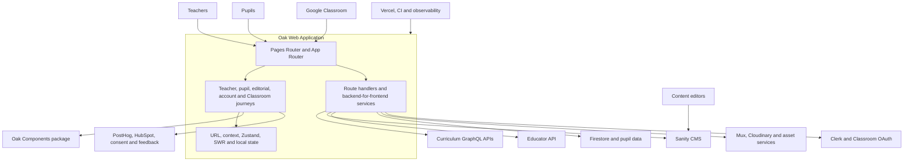
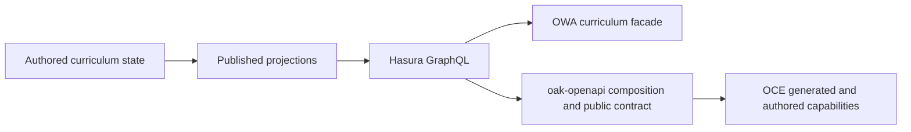

# Current-state system map

## Scope

This map describes the source snapshot recorded in the [research charter](../research-charter.md). It is a structural baseline, not a proposed architecture.

The related [Database-Tools to oak-openapi to OCE authority chain](./database-tools/README.md)
is mapped separately because it crosses a different product and contract
boundary. Its [multi-lens synthesis](./database-tools/concept-lenses/synthesis.md)
is reconciled with the OWA/Components findings in the
[combined meta-analysis](../synthesis/meta-analysis.md).

## System context

**Observed:** OWA is simultaneously a public content site, an authenticated teacher product, a pupil learning runtime, a Classroom add-on and a backend-for-frontend. Its home-page and route source foreground curriculum and teacher resources while also containing distinct pupil, account, editorial and Classroom surfaces ([home page](https://github.com/oaknational/Oak-Web-Application/blob/510ac63a62fb37a70183b00ce0f5fb15be4491e5/src/pages/index.tsx#L28-L115)).

## Product capability map

| Capability           | User outcome                                                        | Current entry surfaces                                     | Principal systems                                                 |
| -------------------- | ------------------------------------------------------------------- | ---------------------------------------------------------- | ----------------------------------------------------------------- |
| Teacher discovery    | Find a suitable curriculum, unit, lesson or resource.               | Home, search, programme, unit and lesson routes            | Curriculum API, Sanity, search, Oak Components                    |
| Teacher resource use | Inspect, download, share and save teaching resources.               | Lesson overview, downloads, share and My Library           | Curriculum API, Educator API, Clerk, document/download services   |
| Pupil learning       | Complete a structured lesson and understand results.                | Pupil browse, intro, video, quiz, review and result routes | Curriculum API, pupil client, local state, Firestore, Mux         |
| Editorial publishing | Publish guidance, campaigns and organisational content.             | Home, about, blog, webinar, campaign and policy routes     | Sanity, HubSpot, media services                                   |
| Account and library  | Register, identify context and retain useful content.               | Sign-in, onboarding and My Library                         | Clerk, Educator API, HubSpot                                      |
| Classroom            | Assign Oak work and return pupil progress.                          | `/classroom` teacher and pupil surfaces                    | Classroom package, Google OAuth/APIs, Firestore                   |
| Search and intent    | Find content using filters or interpreted intent.                   | Teacher search and search API routes                       | Search API, curriculum metadata, AI gateway, Upstash              |
| Curriculum export    | Generate reusable curriculum documents and archives.                | Curriculum download routes                                 | Curriculum API, document generation, storage and DLP controls     |
| Platform trust       | Keep all journeys accessible, observable, private and discoverable. | Both application shells and deployment workflows           | Consent, analytics, Sentry/Bugsnag, Pa11y, Percy, SEO and hosting |

## Runtime topology

**Observed:** Both Next.js routers are active. The Pages Router shell composes Clerk, consent, two theme providers, error handling, analytics, pupil, overlay, menu, toast, save-count and notification providers ([source](https://github.com/oaknational/Oak-Web-Application/blob/510ac63a62fb37a70183b00ce0f5fb15be4491e5/src/pages/_app.tsx#L40-L95)). The App Router root composes a similar but non-identical set ([source](https://github.com/oaknational/Oak-Web-Application/blob/510ac63a62fb37a70183b00ce0f5fb15be4491e5/src/app/layout.tsx#L43-L113)).

**Inferred:** The system is in an active router and integrated-journey migration. Provider and route duplication should therefore be evaluated as a moving boundary, not assumed to be the intended end state.

The detailed comparison is recorded in [runtime-shell parity](./runtime-shell-parity.md).

**Observed:** Account and saved-content behavior crosses the router boundary: sign-in and onboarding are App Router surfaces, while My Library and its Educator API backend-for-frontend are Pages Router surfaces. Clerk metadata carries eligibility and the Educator API carries durable saved state. The detailed path is recorded in [account to saved content](./journeys/account-to-saved-content.md).

**Observed:** Current Classroom behavior is a Marketplace add-on path: App Router launch, Google identity and attachment routes hand a pupil into the ordinary Pages Router lesson engine. OWA writes progress and observes Google submission state but has no current turn-in action. The detailed boundary is recorded in [Classroom assignment to submission](./journeys/classroom-assignment-to-submission.md).

**Observed:** Editorial publication combines a Sanity-facing model, generated query SDK, runtime validation, cross-router preview, feature release, rendering, metadata and deployed assurance. The traced impact page currently renders only part of its richer CMS model. See [editorial publish to page](./journeys/editorial-publish-to-page.md).

**Observed:** Programme curriculum export is generated synchronously inside OWA as DOCX, XLSX or ZIP and versioned through curriculum refresh metadata; lesson and unit resources use a separate Downloads API. See [curriculum export](./journeys/curriculum-export.md).

**Observed:** Pages Router dynamic content primarily uses blocking fallback and incremental regeneration. App Router teacher pages use server components, request memoization and shared cache helpers. A representative programme page joins curriculum data, CMS data, filters, redirects, metadata and analytics inputs before rendering ([source](https://github.com/oaknational/Oak-Web-Application/blob/510ac63a62fb37a70183b00ce0f5fb15be4491e5/src/app/%28core%29/teachers/programmes/%5Bslug%5D/%5Btab%5D/page.tsx#L154-L310)).

## Data and service topology

**Observed:** The `node-lib` layer contains generated and handwritten adapters for curriculum, Sanity, educator data, Firestore, Classroom, caching, DLP, HubSpot and analytics. The curriculum facade alone exposes page-oriented queries spanning teacher and pupil journeys ([source](https://github.com/oaknational/Oak-Web-Application/blob/510ac63a62fb37a70183b00ce0f5fb15be4491e5/src/node-lib/curriculum-api-2023/index.ts#L114-L164)).

**Observed:** Generated GraphQL types are commonly followed by Zod validation and page-specific shaping. **Candidate requirement:** runtime boundary validation may need to remain independent of the future transport or schema tooling; the relevant premise and failure evidence have not yet established that requirement.

**Observed:** Configuration names reveal dependencies on curriculum and educator APIs, Sanity, pupil endpoints, consent services, Clerk, Cloudinary, Google services, Mux, PostHog, Sentry and an AI gateway ([source](https://github.com/oaknational/Oak-Web-Application/blob/510ac63a62fb37a70183b00ce0f5fb15be4491e5/oak-config/oak.config.test.json#L12-L119)).

### Related curriculum authority chain

**Observed:** the later pinned authority-chain investigation traces authored
database state through published projections and Hasura into oak-openapi, then
through the public OpenAPI and bulk contracts into OCE generation, SDK, MCP,
search and application surfaces. OWA's curriculum facade is a separate GraphQL
consumer of curriculum projections; this relationship does not mean that OWA
calls oak-openapi. See the
[chain boundary](./database-tools/README.md#status-and-purpose),
[API runtime and policy map](./database-tools/api-runtime-contract-and-policy.md)
and [OCE generation correspondence](./database-tools/oce-consumer-and-generation.md).

**Inferred:** OWA and OCE therefore expose different projections and product
contracts over related upstream curriculum claims. The enduring architecture
question is correspondence among authority, identity, release, policy and
observation, not whether the current runtime paths should be merged. The
[canonical basis reconciliation](../synthesis/meta-analysis.md#databaseapioce-kernel-reconciliation)
keeps that question open.

## UI topology

**Observed:** OWA imports Oak Components broadly but retains local app, curriculum, generic-page, pupil, shared and teacher component families. Its Storybook introduction explicitly describes `SharedComponents` as a future replacement target for Oak Components ([source](https://github.com/oaknational/Oak-Web-Application/blob/510ac63a62fb37a70183b00ce0f5fb15be4491e5/src/components/introduction.mdx#L22-L61)).

**Observed:** Oak Components combines design tokens, style utilities, accessible primitives, composite UI and OWA-specific product components behind one package entry ([source](https://github.com/oaknational/oak-components/blob/8ff8264fa921e4e40fdaf9a99b02fd156c699cc8/src/components/index.ts#L1-L14)). The detailed boundary is recorded separately in [Oak Components boundary](./component-boundary.md).

## Delivery topology

**Inferred:** Vercel is the primary OWA host in the pinned repository because current Terraform declares its application and Storybook projects, canonical domains, staging environment and drift checks. Netlify still has executable routing and monitoring configuration but lacks current infrastructure ownership and references a missing build-cancellation script. Applied platform state, DNS, failover and release gates remain unknown. See [production and operational topology](./production-topology.md).

## Observed strengths and preservation questions

These mechanisms are visible in source. Their impact and necessity remain preservation hypotheses until product, user, operational or impact evidence establishes them.

- **Inferred:** user journeys encode substantial curriculum and Classroom domain knowledge.
- **Observed:** runtime validation rejects or reshapes upstream data before it reaches many views.
- **Observed:** accessibility behavior is present in global motion rules, focus management, semantic controls and deployment checks.
- **Observed:** consent is integrated with analytics, feedback and error-reporting behavior.
- **Observed:** static generation, caching and SEO mechanisms serve the large public route surface.
- **Observed:** unit, component, snapshot and visual/accessibility checks provide several local and deployed evidence layers.
- **Observed:** observability and error translation are treated as application behavior, not only infrastructure.

## Current uncertainties

1. Which routes and variants carry meaningful production traffic?
2. Which provider differences are intentional performance or product requirements?
3. Which component and route migrations have an agreed destination and completion plan?
4. Which production incidents are caused by boundary confusion rather than ordinary defects?
5. What freshness does each user outcome require, rather than what each current API happens to use?
6. Which Oak Components exports are supported contracts for consumers other than OWA?
7. Is Netlify retained as failover, historical configuration or an active deployment target?
8. Which measures best represent the impact and excellence that future OCE products must meet or exceed?
9. What consistency and recovery contract should user-owned state meet across identity, BFF, provider and optimistic UI layers?
10. Which Classroom outcomes are Oak-owned contracts, and which belong to Google or the add-on package?
