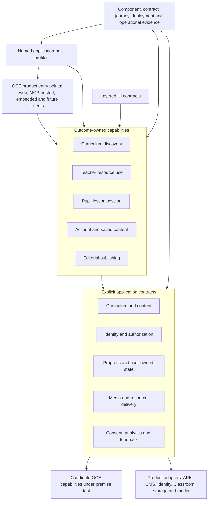

# Working model of an Oak product

## Status

This is a synthesis of the pinned OWA and Oak Components investigation, not an architecture decision or a proposal to change either system. It describes a provisional mechanism-neutral product model in which every retained concept still requires premise evidence.

The target-facing interpretation lives in the [ecosystem enablement model](./ecosystem-enablement.md): OCE and the Oak Innovation Kit are the beneficiary; OWA and Oak Components are the primary functional and experiential references whose purposes must be recovered without presuming their mechanisms. The later [meta-analysis](./meta-analysis.md) reduces the evidence to a smaller conceptual basis; its primitives and seam rule take precedence over the candidate topology below.

## Provisional definition

An Oak product delivers one or more educational outcomes over trusted curriculum content while preserving the applicable accessibility, safeguarding, rights, identity, privacy, consent, observability and operational contracts.

React, Next.js, styled-components, Clerk, Google Classroom, Sanity, GraphQL, Firestore and the current repository layout are mechanisms. None is part of the definition unless an outcome cannot be met without its specific behavior.

## What the current system teaches us

The second column records mechanisms that appear deliberate and robust in source. Their impact and necessity remain preservation hypotheses until external evidence establishes them.

| Enduring concern                  | Observed mechanism or candidate strength                                                                                 | Mechanisms that remain replaceable                                                          | Important unknown                                                                                                    |
| --------------------------------- | ------------------------------------------------------------------------------------------------------------------------ | ------------------------------------------------------------------------------------------- | -------------------------------------------------------------------------------------------------------------------- |
| Curriculum identity and discovery | Progressive selection, canonical URLs, validated content, redirects and rich curriculum context                          | Route folder shape, generic string slugs, GraphQL transport and filter-store implementation | Which identity distinctions and freshness windows are product requirements?                                          |
| Teacher resource use              | Restriction policy, editable resource choice, live file checks, recovery UI and useful continuation                      | Download form composition, HubSpot sequencing and success-route implementation              | Does success mean request, link issue, transfer, valid archive or use?                                               |
| Pupil learning                    | Account-free entry, activity evidence, grading, feedback, media alternatives, safeguarding and review                    | Six route files, module-level stores and provider-shaped persistence                        | Which activity order, persistence duration and result projection are pedagogical contracts?                          |
| Account and saved content         | Explicit account boundary, safe return, optimistic feedback, durable curriculum-grouped collections                      | Clerk metadata shape, HOCs, duplicated mutation hooks and Educator BFF route layout         | What authorization, reconciliation and retired-content behavior is required?                                         |
| Classroom                         | Reuse of the pupil engine, distinct teacher/pupil identity, resume, read-only returned work and provider-aware analytics | Google IDs in UI state, cross-router redirect and fire-and-forget write policy              | Which outcomes does Oak own versus Google or the add-on package?                                                     |
| Editorial publishing              | Compact page/component changes, fixtures, stories, runtime schemas and deployed inspection                               | Current CMS and page families                                                               | Which editorial capabilities are essential product contracts, and which should remain product-specific integrations? |
| UI platform                       | Semantic tokens, a small primitive vocabulary, accessible internals and education-specific recipes                       | One flattened export, mixed global styles and recipe placement                              | Which real consumers need independent token, React, adapter or recipe contracts?                                     |
| Platform trust                    | Consent-aware diagnostics, extensive focused tests, deployed Pa11y/Percy and human review prompts                        | Provider tree duplication and current tool vendors                                          | Which checks actually block release, and which journey evidence is uniquely valuable?                                |

The supporting traces are indexed in the [research record](../README.md).

## Candidate topology

The diagram visualises one composite of H001-H005 so that its assumptions can be tested. It is not privileged over the materially different candidates in the [architecture option register](../investigations/architecture-option-register.md).

This diagram is one candidate dependency model for a kit-enabled product, not a commitment to deployment units or package count. The Innovation Kit is deliberately a framework. Product-local and kit-owned responsibilities are competing placements chosen from semantics, authority, invariants, lifecycle and assurance; neither is the default, and existing consumer count is not a gate.

## Candidate properties to test

These are not an acceptance checklist or a target architecture. Each is a current expectation paired with evidence and an invalidator; premise analysis may replace the named concept entirely.

### 1. Outcomes are traceable

A developer should be able to start with "save a unit", "complete a lesson" or "attach a lesson" and find its policy, state transitions, provider contracts and assurance without reconstructing the application from horizontal folders.

**Measure:** compare conceptual hops, files and top-level areas touched for representative changes; use unfamiliar-engineer trace tasks; sample actual change history.

**Invalidator:** a capability slice duplicates shared curriculum and interaction logic, adds dependency cycles or makes compact changes materially harder.

### 2. State has named identity and consistency

Lesson progress, saved content, result publication and Classroom writes should state what identifies a record, which source is authoritative, when optimistic state is reconciled, and what duplicate, delayed, reordered or failed operations mean.

**Measure:** fault-injection tests and state-transition tables for two tabs, refresh, delayed writes, duplicate requests and provider recovery.

**Invalidator:** existing provider guarantees and adapters already express the required semantics, making another application contract pass-through indirection.

### 3. Freshness follows the outcome

Curriculum publication, CMS copy, file existence, identity metadata, saved content and pupil progress have different change rates and failure consequences. The acceptable age and degraded behavior should be named at the use case, not inferred from router placement or one broad default.

**Measure:** a matrix of authority, acceptable age, invalidation, stale fallback, retry, user message and telemetry for each core read/write.

**Invalidator:** stakeholder evidence shows the important sources share one policy, or route-specific optimization cannot be represented without obscuring performance-critical queries.

### 4. The UI contract matches ownership and runtime

Foundations, accessible controls, framework/provider adapters and product recipes should have visible dependency and assurance contracts. This can begin with export paths and rules inside one repository and release.

**Measure:** actual and intended consumer profiles, primitive/recipe bundle fixtures, Pages/App server/client compilation, accessibility evidence by layer and coordinated-release failures.

**Invalidator:** the intended consumer profiles share one coherent runtime contract and explicit layering adds no semantic or assurance clarity, the current root tree-shakes and compiles without ambiguity, or recipe separation creates more private back-edges and release coupling.

### 5. Shell differences are profiles, not folklore

Public, authenticated, pupil and Classroom surfaces can require different client providers and chrome while conforming to named outcomes for language, consent, identity, analytics, errors, notifications, metadata and diagnostics.

**Measure:** render equivalent profiles under consent and failure variants; record initialization, hydration and delivered client code; prove route migration does not silently change behavior.

**Invalidator:** the surfaces are intentionally separate products without shared outcomes, or the proposed conformance model adds concepts without preserving or clarifying behaviour.

### 6. Assurance follows risk

Focused tests, stories, snapshots, Axe, Pa11y, Percy and runtime diagnostics are existing strengths. A journey layer is justified where cross-boundary outcome behaviour cannot be demonstrated confidently at a narrower layer.

**Evidence:** classify escaped defects by the most direct layer capable of demonstrating the behaviour; assess journey reliability, diagnostic clarity and the distinct assurance each layer provides.

**Invalidator:** controlled journeys fail to predict provider behavior, remain unreliable, or duplicate earlier evidence without finding distinct defects.

### 7. Excellence governs the system

The Innovation Kit should make accessibility, security, privacy, rights, diagnostics, runtime validation and release evidence intrinsic to its concepts. Its architecture and implementation should use the most idiomatic complete solution, without trading away quality for an invented delivery or economic constraint.

**Evidence:** demonstrate the actual user and system behaviour, trace every rule and abstraction to a necessary outcome or obligation, and show that the resulting concepts form a coherent whole.

**Invalidator:** tool conformance is used as a substitute for quality, or the framework preserves unnecessary concepts and compensating mechanisms while calling their consistent implementation excellent.

## Guardrails for OCE enablement

The deconstruction and Innovation Kit should not:

- fix, replatform or seek internal consistency in OWA or Oak Components;
- reproduce both routers or current component taxonomies to demonstrate fidelity;
- treat any OWA mechanism as an OCE requirement without an outcome or trust contract;
- create a package for every box in the topology;
- apply a second-consumer, product-local or package-extraction rule instead of reasoning about semantic authority and cohesion;
- hide provider behavior behind interfaces that add no policy or substitution value;
- reproduce a workaround without challenging the surrounding system that made it necessary;
- replace runtime validation, content exceptions or accessibility behavior with compile-time optimism;
- describe a write as successful before defining acknowledgement and recovery;
- call configured tooling a release gate without verifying enforcement;
- use a clean demo path as proof that restricted, stale, failed and resumed paths work.

## Experiment sequence

1. **Outcome atlas:** turn OWA and Components observations into a mechanism-neutral account of what Oak needs to make possible.
2. **Purpose chain:** connect each mechanism to outcome, obligation, invariant, chosen system decision, external constraint and workaround.
3. **Premise challenge:** test whether the need remains, whether the surrounding system can change, and whether several mechanisms can collapse into one model.
4. **Competing architectures:** compare preserve, remove, combine, invert, generate, platform-native and redesigned-service alternatives.
5. **Decisive evidence:** use user and domain expertise, standards, history, incidents, runtime observation and focused experiments to reject weak designs.
6. **Framework implementation:** build only the selected capabilities inside the Innovation Kit, with explicit excellence and failure contracts.
7. **Teaching workspace:** explain the validated purpose, rejected premises, selected architecture and observations that would reverse the decision.

The order is intentional: understand what exists, question why it exists, change the problem where appropriate, then build a conceptually coherent and complete framework in which every remaining concept is justified.

## Decisions not yet earned

- the framework, router or rendering model for future OCE web products;
- the number of repositories, packages or deployables;
- whether UI recipes belong with capabilities or the component system;
- whether Clerk, Google Classroom, Sanity, GraphQL, Firestore or styled-components remain;
- whether the Innovation Kit needs shared UI, application state, persistence or scaffolding capabilities;
- the required production, accessibility and impact measures.

Those decisions need runtime measurements, current and intended consumer/team evidence, product intent and incident/support history in addition to source analysis.
