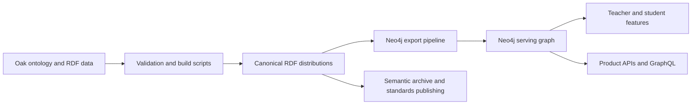
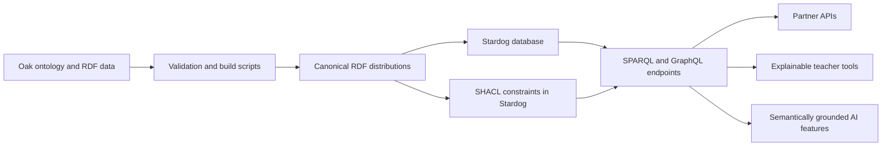

# RDF to Product Evaluating Neo4j and Stardog as Knowledge Graph Platforms for External User Facing Features in Support of Oak’s Mission

## Executive summary

Oak is not starting from a blank sheet. The public `oak-curriculum-ontology` repository is already an explicitly semantic asset: it describes itself as a formal representation of Oak’s curriculum and its alignment to the National Curriculum for England, published in RDF, OWL, SKOS, and SHACL; it provides SPARQL examples; it publishes multi-format RDF distributions; and it frames interoperability, semantic queries, and data-driven educational tools as first-order goals. At the same time, the repository also contains a documented and fairly substantial export path into Neo4j AuraDB, including an export script, configuration, architecture notes, validation tooling, and testing utilities. In other words, Oak already has both a semantic canonical layer and a product-graph projection path. The real decision is therefore not “which graph database is better?” but “which serving architecture best turns Oak’s curriculum knowledge into trustworthy external features for teachers, students, professional users, partners, and future AI consumers?” [[1]](#ref-1)

The strongest case for **Neo4j** is pragmatic delivery. Oak has already invested in a Neo4j pipeline that imports RDF with `rdflib-neo4j` and then applies fourteen transformations tailored to product-serving concerns: label remapping, property renaming, slug extraction, reversal of certain relationship directions, flattening of inclusion nodes into direct edges with order properties, cleanup, indexing, batching, retry logic, and AuraDB deployment assumptions. Neo4j itself is oriented toward graph application development: Cypher for pattern matching, official drivers and HTTP Query API for backend integration, a GraphQL library for fast API generation, Bloom for visual exploration, Graph Data Science for recommendation-like or similarity workloads, and official GraphRAG/vector capabilities for LLM-facing features. For near-term external product delivery, that combination of existing Oak work plus Neo4j’s application tooling is a serious incumbent advantage. [[2]](#ref-2)

The strongest case for **Stardog** is architectural coherence with Oak’s source of truth. Stardog is natively RDF- and SPARQL-oriented, supports OWL and rule reasoning at query time, stores SHACL constraints as RDF, exposes standard HTTP/SPARQL interfaces, and can query RDF with GraphQL directly, including optional reasoning, named-graph scoping, and auto-generated schemas from RDFS/OWL or SHACL. That aligns unusually well with Oak’s repository, which already contains ontology, RDF instance data, SHACL validation shapes, and example SPARQL queries. If Oak wants external-facing capabilities to remain close to the canonical semantics rather than to a transformed app graph, Stardog has a stronger conceptual fit. This is especially true for partner APIs, explainable curriculum relationships, semantically grounded AI retrieval, and standards-led interoperability. [[3]](#ref-3)

The essential trade-off is therefore clear. Neo4j lowers near-term product risk by serving an explicitly transformed, traversal-friendly graph. Stardog lowers long-term semantic distortion by keeping the serving model much closer to Oak’s native RDF/ontology layer. Neo4j’s risk is semantic drift and translation-layer maintenance; Stardog’s risk is that Oak would need to build more of the product-serving layer, query discipline, and operating model from scratch. A further complication is that Oak’s current Neo4j path depends on `rdflib-neo4j`, which Neo4j classifies as a Neo4j Labs project; Neo4j says Labs projects are actively maintained but do not carry SLAs or guarantees around backwards compatibility or deprecation. That does not negate the incumbent advantage, but it does matter for platform risk. [[4]](#ref-4)

The most defensible recommendation is a **decision frame, not a one-line verdict**. Keep **canonical RDF** as the source of truth in all scenarios. Before choosing either downstream platform, Oak should first ask whether direct use of pinned ontology artefacts already supports the first wave of MCP surfaces, search projections, QA checks, or external API slices. In other words, **neither** is a valid initial answer. If a live graph-serving layer is still needed after that baseline is tested, Neo4j remains the pragmatic incumbent for traversal-heavy product work because Oak has already done material delivery work in that direction. But Oak should not rule out Stardog on abstract grounds. Stardog is the platform to beat if Oak decides that external features themselves must remain ontology-native, standards-oriented, explainable, and closer to the public semantic contract that the repository already advertises, including a future public SPARQL endpoint. A later answer of **both, for different use cases**, can also be legitimate if Oak keeps one canonical semantic source and assigns each downstream platform a clearly different job. The most mission-aligned next move is therefore not an immediate re-platform, but a bounded prototype comparison on a small set of real Oak use cases, with direct ontology use as the control case. [[1]](#ref-1)

## Oak context and current state

Oak’s public graph asset is unusually well aligned with a semantic-knowledge-graph strategy. The repository exposes a formal ontology and curriculum instance data, uses persistent HTTP URIs, explicitly adopts RDF 1.1, OWL 2, SKOS, and SHACL, and positions itself as interoperable open curriculum infrastructure rather than as a closed internal schema. It also emphasises open reuse: the ontology, data, and documentation are licensed under OGL 3.0, while the code is under MIT. That matters strategically because Oak’s mission is not only to support its own internal analysis; the published asset is already shaped for reuse by downstream tools, integrations, and educational services. [[1]](#ref-1)

The repository is still early. The README labels it version `0.1`, says the ontology structure, URIs, and data are under active development, and notes that the National Curriculum mapping is a best-effort machine-readable representation ahead of the 2027 revision. At the same time, Oak says the core ontology structure is stable, validation is automated, and future plans include additional subjects, learning-resource integration, progression models, and notably a **public SPARQL endpoint deployment**. That roadmap point matters in this decision: if Oak already anticipates exposing semantic query capability publicly, an RDF-native serving option is not a theoretical tangent but an aligned continuation of the published direction. [[1]](#ref-1)

The current repository layout also matters. GitHub shows top-level `data`, `docs`, `ontology`, and `scripts` directories, plus a release with pre-generated Turtle, JSON-LD, RDF/XML, and N-Triples files. The README documents several first-class ways of consuming the data: download distributions, load into a triple store such as Apache Jena TDB2 or GraphDB, validate with SHACL, or export to Neo4j. That is a strong signal that Oak’s semantic layer is not an upstream one-off artefact; it is already designed to be loaded into RDF-native stores as well as projected into Neo4j. [[1]](#ref-1)

One useful caveat is that the public documentation is not perfectly internally consistent. The README “Key Features” section says there are **eight subject areas** with full knowledge taxonomies, but the detailed “Current subject coverage” list names English, Mathematics, Science, History, Geography, and Citizenship, with Science subdivided into Biology, Chemistry, and Physics. That inconsistency does not weaken the core architecture discussion, but it is a reminder that the repository is still evolving and that product decisions should use measured prototypes rather than assume all public docs are final. [[1]](#ref-1)

**Current Neo4j translation path: what Oak has already bought itself**

Oak has already purchased a meaningful amount of time-to-value for Neo4j. The scripts documentation lists `export_to_neo4j.py` alongside validation, RDF-merge, static-distribution, and SPARQL-testing utilities; it describes the Neo4j export as a production-oriented path to Neo4j AuraDB rather than a throwaway experiment. The export help text documents clear operational modes such as `--clear`, `--dry-run`, `--list-files`, and `--verbose`; it expects Neo4j credentials in `.env`; and it explicitly says the job imports RDF triples with `rdflib-neo4j` before applying fourteen graph transformations. The architecture document goes further, describing a config-driven, reusable pipeline with Pydantic validation, batching, retry handling, indexing, and post-import verification. [[2]](#ref-2)

The configuration file shows just how opinionated that projection already is. Oak is not merely loading triples into Neo4j and querying them raw. The config excludes ontology metadata, list structures, and some predicates; remaps generic `Resource` nodes into `NatCurric` and `OakCurric`; removes labels such as `Concept`; extracts URI slugs into dedicated properties; renames properties into product-friendly names such as `programmeTitle`, `unitTitle`, and `lessonTitle`; reverses some relationships into `HAS_*` forms; and flattens `LessonInclusion` and `UnitVariantInclusion` intermediary nodes into direct relationships such as `HAS_LESSON` and `INCLUDES`, carrying sequence metadata on the relationship. That is valuable delivery work, but it also means the serving graph is intentionally no longer a semantically faithful mirror of the RDF source. [[5]](#ref-5)

The practical implication is straightforward. Neo4j is not just an option Oak could theoretically adopt; Oak already has a curated **product-graph projection** that embodies assumptions about the features it wants to build. That dramatically lowers Neo4j’s near-term delivery risk. The same evidence also sharpens the counterfactual: a Stardog path would not be “starting greenfield from nothing,” because Oak’s canonical RDF assets and validation/test scripts already exist; but it would require a different serving philosophy and a different product engineering surface. [[2]](#ref-2)

## Neo4j for Oak

Neo4j is best understood here as a **property-graph application platform** rather than as an RDF-native semantic platform. Neo4j’s current product stack centres on the graph database itself and adds Cypher, GraphQL tooling, Query API, drivers, Bloom for visual exploration, Graph Data Science for analytics and machine learning, and managed AuraDB tiers across the major cloud providers. Cypher is a declarative, GQL-conformant graph query language optimised around pattern matching over nodes, relationships, and properties, and the official GraphQL library is explicitly aimed at rapid API development for applications. That is a very natural fit for frontend/backend product teams that want to turn connected data into user-facing journeys, filters, recommendations, and exploration interfaces. [[6]](#ref-6)

In Oak’s specific context, Neo4j’s headline strength is not RDF fidelity but **the combination of Oak’s existing projection work and Neo4j’s app-serving ergonomics**. Oak’s pipeline already reshapes the curriculum graph into something friendlier for traversal-heavy products: ordered lessons become direct edges with `lessonOrder`; units and programmes gain human-facing title and slug properties; generic RDF resource labelling is replaced by domain-specific property-graph categories; and relationships are re-oriented into more natural `HAS_*` directions for traversal. This is exactly the sort of shaping a product team typically does before building teacher navigation, curricular journey, prerequisite browsing, or recommendation-like discovery features. [[2]](#ref-2)

That makes Neo4j especially strong for external features where the graph’s job is to drive interaction design rather than to expose formal semantics directly. Teacher-facing planning and discovery tools, student-facing curriculum exploration, rich “what comes next?” navigation, path-based relationship browsing, and graph-backed UIs are good examples. Neo4j gives Oak multiple ways to serve those features: direct driver access from backend services, HTTP Query API for service integration, or a GraphQL layer generated from type definitions. Bloom also offers a fast route to visual internal exploration and stakeholder demos, which matters when domain experts and product teams need to inspect graph structure together. [[7]](#ref-7)

Neo4j also has a credible AI-facing story if Oak later wants graph-backed retrieval or structured context generation. The official Neo4j GraphRAG Python package is positioned as a first-party package for GraphRAG patterns, and Neo4j documents vector indexes for embeddings. In practice, that means a Neo4j serving graph could underpin use cases such as curriculum-aware retrieval, entity/relationship expansion around a query, or generation of structured context windows for LLM prompts. Graph Data Science adds a further option if Oak wants recommendation-like similarity, pathfinding, or ranking logic that goes beyond static navigation. [[8]](#ref-8)

The caveats are important. First, Neo4j is not the same thing as Oak’s canonical RDF layer. Neo4j’s own RDF story in cloud deployments is via `rdflib-neo4j`, which Neo4j describes as a client-side alternative for cloud-native deployments because `neosemantics` is not available in Aura; and Neo4j Labs says Labs projects do not come with SLAs or guarantees around backwards compatibility and deprecation. Second, the Oak export is doing non-trivial semantic adaptation, not merely loading triples verbatim. That means every future ontology change, shape change, or modelling refinement may need accompanying projection maintenance, regression testing, and possibly UI/API updates downstream. Neo4j is therefore strongest when Oak wants a **product graph derived from semantics**, not when it wants the external product contract itself to remain ontology-native. [[9]](#ref-9)

## Stardog for Oak

Stardog is best understood here as a **semantic knowledge graph platform**. It is RDF-native, uses SPARQL as a primary query language, supports OWL and rule reasoning, stores SHACL constraints as RDF, exposes standard HTTP/SPARQL interfaces, supports GraphQL over RDF, and adds platform features such as Explorer, Designer, Studio, Voicebox, virtual graphs, entity resolution, and graph analytics via Spark. In other words, where Neo4j starts from “build graph applications over a property graph,” Stardog starts from “operate a standards-based knowledge graph and expose it through semantic and API layers.” [[3]](#ref-3)

That means Stardog's natural centre of gravity is semantic platform work: a
governed, standards-based, RDF-native knowledge layer that preserves ontology
semantics, supports reasoning and validation, and exposes structured knowledge
through semantic interfaces such as SPARQL, GraphQL, and HTTP APIs. But that
does **not** confine it to internal tooling. Stardog can absolutely sit behind
external-facing products. The sharper distinction is that it is especially well
suited to external products where semantic fidelity, explainability,
interoperability, and structured knowledge access are themselves part of the
value, while being less obviously optimised for the kind of fast-moving,
traversal-heavy, app-centric product development that Neo4j tends to
foreground. [[3]](#ref-3)

That maps unusually neatly onto Oak’s repository. Oak already publishes RDF data, ontology, SHACL constraints, and SPARQL examples; it documents triple-store loading; and it intends to expand semantic serving, including a public SPARQL endpoint. For Stardog, those are not awkward upstream artefacts that first need to be reshaped into another model. They are already the native inputs. Even better, Stardog can auto-generate a GraphQL schema from the RDFS/OWL schema or from SHACL shapes when `graphql.auto.schema` is enabled. Because Oak already has both ontology and shape files, Stardog’s GraphQL layer is not just generically relevant; it is directly aligned with the assets Oak already curates. [[1]](#ref-1)

For external user-facing features, Stardog is strongest where **semantic fidelity is part of the product value**. That includes partner-facing structured APIs, explainable prerequisite or topic relationship features, semantic search or browsing where provenance and ontology alignment matter, professional tools where users need to trust that relationships are not simply hand-curated UX shortcuts, and AI-facing capabilities where semantic grounding is strategically important. Stardog’s reasoning model is particularly relevant here: it performs reasoning lazily at query time rather than materialising inferred statements, and it also documents explanation facilities that can return the minimal set of asserted statements supporting an inference. That creates a more natural path to externally explainable curriculum relationships than a purely transformed property graph does. [[10]](#ref-10)

Stardog also has a compelling AI-grounding story, though it is different from Neo4j’s. Rather than foregrounding GraphRAG libraries, Stardog foregrounds semantics, explainability, and API/query layers over a knowledge graph. GraphQL queries can optionally run with reasoning, can scope over named graphs, and support schema generation from ontology or SHACL. Voicebox adds a conversational interface that Stardog presents as grounded, explainable interaction over structured, semi-structured, and unstructured data. For Oak, the most realistic use of those capabilities is not immediately public student chat, but AI-assisted curation, partner integrations, internal expert tooling, or externally exposed curriculum APIs where standards, semantics, and explainability matter more than rapid app prototyping alone. [[11]](#ref-11)

The caveats are real. Stardog’s GraphQL layer is powerful, but the docs note that auto-generated schemas are **not automatically refreshed** when the source schema changes and may sometimes require manual tweaks. Full-text search supports both lexical and semantic modes, but search is not supported over virtual sources, which matters if Oak ever leans heavily on virtualization. Self-managed high availability is also operationally heavier: Stardog’s HA cluster requires at least three Stardog nodes and three ZooKeeper nodes. Commercially, Neo4j’s Aura pricing is public and tiered, whereas Stardog’s enterprise pricing is custom and not publicly itemised, though Stardog Cloud offers Free and paid plans. None of those are disqualifying, but they move Stardog from “excellent semantic fit” to “excellent semantic fit with more platform decisions still to make.” [[11]](#ref-11)

## Side by side comparison

The table below is a decision matrix for Oak’s context, not a generic market scorecard. The scores are indicative rather than mathematical truth; the important part is the evidence-backed rationale.

| Criterion | Importance to Oak | Neo4j fit | Stardog fit | Evidence-based note |
|---|---:|---:|---:|---|
| Time to value from today’s repo | 5 | 5 | 3 | Oak already has a documented AuraDB export path with config, transforms, retries, batching, and validation; Stardog can ingest current RDF directly, but Oak has not yet built an equivalent serving workflow for it. [[2]](#ref-2) |
| External feature delivery velocity | 5 | 5 | 3 | Neo4j combines drivers, Query API, GraphQL library, Bloom, and an already-shaped product graph; Stardog can serve GraphQL and HTTP/SPARQL, but the default developer surface is more semantic-platform oriented. [[12]](#ref-12) |
| RDF-native fit | 5 | 2 | 5 | Neo4j requires a projection from RDF into a property graph; Stardog’s data model is RDF itself. [[13]](#ref-13) |
| Semantic fidelity and ontology support | 5 | 2 | 5 | Oak’s Neo4j export explicitly flattens and renames parts of the source graph; Stardog keeps ontology, SHACL, and reasoning first-class. [[5]](#ref-5) |
| Query/API ergonomics for app teams | 4 | 5 | 3 | Cypher plus GraphQL and driver tooling are very app-friendly; Stardog exposes GraphQL and HTTP/SPARQL, but SPARQL/ontology fluency becomes more central. [[14]](#ref-14) |
| Explainability and semantic grounding | 4 | 3 | 5 | Neo4j is strongest when reasoning is made explicit in Oak’s own projection or app logic; Stardog documents reasoning explanations and query-time inference over the semantic graph. [[13]](#ref-13) |
| AI enablement | 4 | 5 | 4 | Neo4j has first-party GraphRAG and vector indexes; Stardog has reasoning, GraphQL-over-RDF, semantic/lexical search, and Voicebox. [[8]](#ref-8) |
| Governance and standards portability | 4 | 3 | 5 | Neo4j can certainly serve governance-led use cases, but Oak’s serving model becomes coupled to a transformed property graph; Stardog stays closer to RDF, SPARQL, SHACL, and OWL. [[15]](#ref-15) |
| Operational simplicity | 3 | 4 | 3 | AuraDB offers managed tiers and public pricing; Stardog Cloud exists, but self-managed HA is heavier and enterprise pricing is more bespoke. [[16]](#ref-16) |

On Oak-weighted priorities, Neo4j comes out ahead **if** the weighting favours rapid product delivery, developer ergonomics, and exploitation of work already done. Stardog catches up quickly, and can surpass Neo4j, **if** the weighting shifts towards semantic fidelity, standards exposure, explainable AI, and keeping the external product contract closer to Oak’s canonical model. That is why this should be treated as an architecture choice, not a simple vendor bake-off. [[2]](#ref-2)

| Dimension | Neo4j in Oak context | Stardog in Oak context | Oak implication |
|---|---|---|---|
| Fit to Oak’s RDF-first starting point | Adapted via export/projection. [[2]](#ref-2) | Native. [[3]](#ref-3) | Stardog is closer to the source model; Neo4j is closer to a serving model. |
| Fit to external user-facing features | Strong for graph-backed app UX. [[12]](#ref-12) | Strong where semantics are part of the product. [[11]](#ref-11) | Near-term UI-heavy features lean Neo4j; semantics-heavy features lean Stardog. |
| Semantic fidelity and ontology support | Lower, because Oak already transforms the graph. [[5]](#ref-5) | Higher, because ontology/reasoning remain first-class. [[10]](#ref-10) | This is the core trade-off. |
| Ease of using existing Oak assets | High because Oak has already built the path. [[2]](#ref-2) | High for data ingestion, lower for product-serving workflow. [[1]](#ref-1) | Neo4j wins on incumbent workflow; Stardog wins on native asset compatibility. |
| Performance expectations for product-serving workloads | Likely strong for traversal-heavy product graph patterns; Oak’s export is explicitly optimised for that. [[13]](#ref-13) | Likely strong for RDF/SPARQL, but Oak should benchmark reasoning-on/off and GraphQL translation for its own workloads. [[17]](#ref-17) | Do not decide on performance without Oak-specific tests. |
| Query and API ergonomics | Cypher, drivers, Query API, GraphQL library. [[14]](#ref-14) | SPARQL, SPARQL HTTP, HTTP API, GraphQL over RDF. [[18]](#ref-18) | Neo4j is app-team-friendly; Stardog is semantic-platform-friendly. |
| Explainability and transparency | Mostly explicit traversals and Oak-defined logic. [[13]](#ref-13) | Explicit inference explanations and proof-style reasoning support. [[19]](#ref-19) | Stardog has the better native story for “why did the graph say this?” |
| AI enablement and grounding | First-party GraphRAG, vector indexes, GDS ecosystem. [[8]](#ref-8) | Semantically grounded GraphQL/SPARQL, reasoning, search, Voicebox. [[11]](#ref-11) | Neo4j is stronger for developer-centric GraphRAG; Stardog is stronger for semantics-rich grounding. |
| Operational complexity and platform maturity | Managed Aura tiers, major-cloud availability, public pricing. [[16]](#ref-16) | Cloud exists; self-managed HA is heavier. [[20]](#ref-20) | Neo4j is simpler if Oak wants fully managed quickly. |
| Long-term maintainability | Ongoing translation maintenance. [[5]](#ref-5) | Less semantic projection maintenance, more semantic-platform discipline. [[3]](#ref-3) | The burden shifts, rather than disappearing. |
| Governance and standards alignment | Moderate; Cypher is open and GQL-conformant, but the serving graph is still a transformed projection. [[14]](#ref-14) | High; RDF/SPARQL/SHACL/OWL remain operational. [[3]](#ref-3) | Stardog better supports standards-led external contracts. |
| Cost and commercial model | More transparent public cloud pricing. [[21]](#ref-21) | Enterprise pricing is largely call-based/custom. [[22]](#ref-22) | Neo4j is easier to cost early; Stardog may need vendor engagement earlier. |
| Vendor lock-in and portability | Medium. Cypher is increasingly standardised, but Oak’s product graph would still be platform-specific. [[14]](#ref-14) | Lower in data model terms because RDF/SPARQL/SHACL/OWL are open standards. [[3]](#ref-3) | Stardog preserves standards portability better. |
| Time to value for Oak | Better. [[2]](#ref-2) | Worse, unless Oak decides semantics-first serving justifies the new work. [[1]](#ref-1) | This is Neo4j’s biggest practical advantage. |

## External use cases and architecture options

The platform choice becomes clearer when translated into actual Oak-like product scenarios rather than abstract database criteria.

| Use case | What the graph must do | Better fit today | Why |
|---|---|---|---|
| Curriculum journey exploration for teachers | Traverse ordered programmes, units, lessons, options, and related themes with low-friction API support. | Neo4j | Oak already flattens inclusion nodes into ordered edges and renames data into product-friendly fields, which is exactly what teacher-facing navigation products need. [[5]](#ref-5) |
| Topic prerequisite or dependency navigation | Represent and explain “comes before”, “belongs to”, “related to”, and potentially inferred conceptual relations. | Split, leaning Stardog if inference matters | Neo4j is good if Oak precomputes explicit edges; Stardog is stronger if the relationship itself needs semantic explanation or query-time inference. [[13]](#ref-13) |
| Lesson and content discovery | Filter and traverse by year, subject, strand, thread, exam board, tier, related topics. | Neo4j | This is a classic app-serving graph pattern with Cypher/GraphQL advantages and Oak’s existing projection already geared towards such traversal. [[2]](#ref-2) |
| Structured curriculum APIs for partners and edtech developers | Offer stable, interoperable, semantically clear access to curriculum entities and relations. | Stardog | RDF/SPARQL and GraphQL-over-RDF keep the external contract closer to Oak’s ontology, shapes, and future SPARQL-endpoint ambitions. [[1]](#ref-1) |
| AI assistant grounded in curriculum structure | Retrieve relevant curriculum entities and relationships, with controllable grounding and possibly explanations. | Split | Neo4j has first-party GraphRAG and vector support; Stardog has reasoning, GraphQL-over-RDF, and explicit explanation machinery. Which wins depends on whether Oak values developer velocity or semantic explainability more. [[8]](#ref-8) |
| Trustworthy professional tools for curriculum experts | Show not only related concepts but why they are related and under which semantic assumptions. | Stardog | This is where knowledge-graph semantics become part of the product, not just hidden infrastructure. [[10]](#ref-10) |

The architecture options below are therefore all viable, but they optimise for different mission outcomes.

**Option A: RDF as canonical source, Neo4j as serving graph**

This is the most pragmatic near-term path. Oak keeps the current repository, validation, shapes, distributions, and semantic governance as the source of truth, and continues to generate a product-serving projection into Neo4j for externally facing applications. This leverages the existing export path and keeps the user-facing graph optimised for traversal, slugs, title properties, and ordered relationships. [[1]](#ref-1)

**Option B: RDF as canonical and serving model via Stardog**

This path keeps Oak closer to its native contract. Oak loads its ontology, TTL data, and SHACL constraints into Stardog, and serves product features through SPARQL, GraphQL-over-RDF, and HTTP APIs, with optional reasoning for use cases that need inference or explanation. This reduces semantic distortion, but it increases the amount of API, product, and performance work that Oak would need to do to make the semantic graph feel like a polished product backend. [[1]](#ref-1)

**Option C: Dual-platform or staged architecture**

This is the most powerful and the easiest to get wrong. It is justified only if Oak can name distinct workloads. A sensible split would be: canonical RDF remains the source of truth; Stardog serves semantics-led APIs or explainable AI/partner features; Neo4j serves selected UI-heavy product experiences where traversal ergonomics are more important than strict model fidelity. This can be strategically strong, but only if Oak avoids dual-write chaos and maintains strict contracts between the canonical semantic layer and any serving projection. [[2]](#ref-2)

**Option D: Start with direct ontology use and only add a serving platform if a bounded workload earns it**

This is the right default if Oak’s next product step is to ship externally useful features soon and learn from real user behaviour without overcommitting the architecture. Start with direct ontology use as the control case. If a live serving layer is still needed after that, Neo4j remains the incumbent benchmark for traversal-heavy product ergonomics, while Stardog remains the semantic platform to beat for standards-native, explainable, ontology-led workloads. The important move is to define the evidence that would justify either addition rather than quietly inheriting Neo4j as the default answer. [[2]](#ref-2)

## Extending support to Stardog from Oak’s current repo

The good news is that Oak’s repository is already much closer to Stardog than a typical application database would be. Oak already has ontology files, RDF data, SHACL validation, merged RDF generation, multi-format distributions, SPARQL examples, and explicit triple-store-loading guidance. Stardog can create databases from RDF files, add RDF atomically, and store SHACL constraints as RDF. That means the **data production** side of a Stardog path is largely straightforward. The harder part is the **serving model** and the surrounding operations. [[2]](#ref-2)

| Area | Likely effort | What Oak can reuse or must add |
|---|---|---|
| RDF ingestion/loading | Straightforward | Reuse Oak’s TTL distributions or merged Turtle output; load with `stardog-admin db create` or `stardog data add`. [[1]](#ref-1) |
| Shape validation and integrity rules | Straightforward | Reuse Oak’s SHACL shapes and validation discipline; load shapes into named graphs and use Stardog ICV/reporting. [[2]](#ref-2) |
| SPARQL regression testing | Straightforward | Reuse Oak’s existing SPARQL examples and `test_sparql_queries.py` patterns as functional smoke tests. [[2]](#ref-2) |
| GraphQL serving layer | Medium | Stardog can expose GraphQL directly over RDF and can auto-generate schemas from RDFS/OWL or SHACL, but Oak would need a schema-governance and refresh workflow because auto-generated schemas are not auto-updated and may need tweaks. [[11]](#ref-11) |
| Query model for product teams | Significant redesign | Any current or future product code written against Cypher, Neo4j labels, or flattened `HAS_*` relationships would need equivalent SPARQL/GraphQL queries or a new API translation layer. Oak’s current Neo4j projection rules would no longer be the serving contract. [[13]](#ref-13) |
| Deployment and environments | Medium in cloud, significant self-managed | Stardog Cloud reduces setup; self-managed HA requires at least three Stardog nodes plus three ZooKeeper nodes. Oak would need new secrets, backup, monitoring, permissions, and runbooks. [[20]](#ref-20) |
| Performance and index tuning | Prototype required | Stardog documents high-performance SPARQL and query optimisation, but Oak still needs to test reasoning on/off, GraphQL translation, full-text search choices, and whether teacher/student product flows need materialised shortcuts. [[17]](#ref-17) |
| Operations and maintenance | Medium | Add documentation for load, schema refresh, optimisation, backup, permissions, GraphQL endpoint management, and reasoning diagnostics. Stardog also documents storage optimisation and CLI/Admin tooling for these workflows. [[23]](#ref-23) |
| Staff capability | Medium to significant | Oak would need stronger SPARQL, SHACL, ontology-debugging, and Stardog-operating fluency across engineering and platform roles. The technical capabilities exist in the platform, but they imply a different team skill profile from a Cypher-first app model. [[18]](#ref-18) |

The Neo4j-specific pieces that do **not** port directly are precisely the pieces that make Neo4j attractive for product delivery: property renaming into product fields, relationship reversal, inclusion flattening into direct traversal edges, Aura-specific connection expectations, and any application code that assumes the projected graph rather than the canonical RDF structure. Those assets are valuable, but they are valuable **for the Neo4j architecture**, not as a neutral abstraction layer. [[5]](#ref-5)

The parts most likely to benefit from a Stardog prototype before any wider commitment are threefold. First, **GraphQL ergonomics**: Oak should test whether auto-generated or lightly curated GraphQL schemas derived from its ontology/SHACL are actually pleasant for frontend and partner developers. Second, **reasoning and explanation**: Oak should test whether semantic inference materially improves teacher/professional use cases enough to justify the platform shift. Third, **product latency and model simplicity**: Oak should test whether serving real navigation flows directly from RDF/SPARQL/GraphQL is good enough, or whether it still ends up needing projection shortcuts similar to the current Neo4j flattening. [[11]](#ref-11)

## Risks, recommendation framework, and next research steps

The main risks are not abstract technology risks; they are architecture risks arising from what Oak wants the graph to be in the product.

| Risk | Why it matters for Oak | Basis |
|---|---|---|
| Semantic drift in a Neo4j serving graph | Oak’s current export intentionally renames, reverses, flattens, and filters parts of the RDF graph. If unmanaged, the projected graph can slowly diverge from the canonical semantics that Oak publishes publicly. | Oak export config and architecture. [[5]](#ref-5) |
| Dependence on Neo4j Labs RDF tooling | Oak’s cloud-oriented RDF import path uses `rdflib-neo4j`, and Neo4j says Labs projects do not carry SLAs or guarantees on backwards compatibility or deprecation. | Neo4j Labs and rdflib-neo4j docs. [[4]](#ref-4) |
| Overestimating Stardog’s product readiness | Stardog is a very strong semantic platform, but Oak still needs to prove that its GraphQL/SPARQL surface and performance are good enough for specific external UX patterns. | Stardog GraphQL and reasoning docs; Oak has not yet published a Stardog workflow. [[11]](#ref-11) |
| Schema-refresh friction in Stardog GraphQL | Auto-generated GraphQL schemas are not automatically refreshed after source-schema changes and may need manual tweaks. | Stardog GraphQL docs. [[11]](#ref-11) |
| Reasoning overhead | Stardog reasoning can require schema reasoning in memory and may make the first reasoning query slower on large schemas. | Stardog reasoning docs. [[24]](#ref-24) |
| Dual-platform complexity | Running both a canonical semantic graph and a serving graph is sensible only with strict role separation and test contracts; otherwise Oak pays twice. | Inference from Oak’s current projection plus the distinct vendor models. [[13]](#ref-13) |
| Immature source assumptions | Oak’s repository is still an early public release with evolving data and documentation inconsistencies. | Oak README and release notes. [[1]](#ref-1) |

The recommendation framework below is therefore more useful than a flat verdict.

**Default hypothesis**

Oak should keep **canonical RDF** as the source of truth and treat any
product-serving graph as downstream. The first question is whether direct use
of pinned ontology artefacts already serves the next wave of MCP, QA, search,
or external API needs. If a live product-serving graph is still needed after
that baseline is tested, Neo4j is the pragmatic incumbent benchmark because Oak
already has a meaningful export path, documented operational assumptions, and a
serving model explicitly tuned for traversal-heavy application use. [[2]](#ref-2)

**When Neo4j should win**

Neo4j should win if Oak’s next value horizon is dominated by teacher/student-facing navigation, discovery, recommendation-like flows, rapid iteration by product squads, GraphQL-backed app development, and GraphRAG-style AI augmentation where developer velocity is more important than keeping the external contract perfectly ontology-native. It should also win if Oak wants to learn from real product usage before investing in a richer semantic serving platform. [[12]](#ref-12)

**When Stardog should win**

Stardog should win if Oak concludes that semantic fidelity is not just an internal governance concern but part of the external offer: standards-based partner APIs, explainable curriculum relationships, ontology-native public interfaces, reasoning-backed professional tools, or AI features whose credibility depends on semantically defensible answers rather than just good retrieval. It is also the stronger option if Oak wants the eventual public semantic interface to look more like a knowledge graph and less like an application-specific property graph. [[1]](#ref-1)

**When a hybrid is justified**

A hybrid is justified only if Oak can keep one canonical source and assign each platform a clearly different job. In practical terms, this is the credible version of “both”: not both for everything, but **both for different use cases**. The strongest hybrid pattern is: RDF remains canonical; Stardog serves semantics-led interfaces and explanation-heavy use cases; Neo4j serves selected UX-heavy products that benefit from a traversal-optimised projection. A hybrid is **not** justified if both platforms would simply be asked to do everything. [[13]](#ref-13)

The minimum prototype plan should be oriented around real Oak use cases rather than synthetic vendor demos.

| Prototype | What to build | Success signal |
|---|---|---|
| Teacher journey API | Implement the same curriculum-navigation flow in Neo4j and Stardog. | Comparable correctness, latency, and developer effort on ordered programme/unit/lesson navigation. [[13]](#ref-13) |
| Partner API slice | Expose a narrow external API for subject → programme → unit → lesson discovery in both stacks. | Clearer external contract, easier onboarding, and lower maintenance burden. [[12]](#ref-12) |
| Explainable relationship test | Model one inferred or rule-backed relationship set, such as topic/prerequisite or taxonomy inheritance. | Evidence on whether Stardog’s reasoning/explanation materially improves user trust and product value. [[10]](#ref-10) |
| AI grounding slice | Build one Oak-specific assistant workflow on each platform. | Evidence on whether Neo4j’s GraphRAG speed or Stardog’s semantic grounding yields better educational usefulness. [[8]](#ref-8) |
| Change-management test | Make one ontology or shape change and propagate it through each architecture. | Evidence on real maintenance cost: projection upkeep in Neo4j versus schema/API refresh effort in Stardog. [[5]](#ref-5) |

The next research steps should also be concrete and decision-gated.

| Next step | Why it matters |
|---|---|
| Inspect the exact Cypher queries, API contracts, and any downstream application code that already depend on Oak’s Neo4j projection. | This determines how much incumbent lock-in is already real rather than theoretical. |
| Inspect the exact SHACL shapes and ontology modules Oak would want exposed externally. | This determines whether Stardog’s schema-from-SHACL capability would produce a useful external API surface. [[15]](#ref-15) |
| Interview product, data, platform, curriculum, and AI stakeholders against the same shortlist of use cases. | The platform decision should follow the product contract, not precede it. |
| Run benchmark scenarios with reasoning off and on in Stardog, and with precomputed versus on-demand traversals in Neo4j. | Neither platform should be crowned on performance without Oak-specific workloads. [[10]](#ref-10) |
| Ask Neo4j about production support expectations for `rdflib-neo4j`, recommended upgrade strategy, and the long-term supported path for RDF in Aura. | Oak’s current Neo4j advantage is partly built on Labs tooling, so that dependency should be made explicit. [[4]](#ref-4) |
| Ask Stardog about GraphQL governance, schema refresh workflows, workload sizing for reasoning, and the most suitable deployment tier for Oak’s likely external usage. | These are the practical levers that decide whether Stardog is elegant in principle or workable in practice. [[11]](#ref-11) |
| Define a decision gate around external mission value. | Oak should choose the architecture that most convincingly improves discoverability, trustworthiness, interoperability, and educational usefulness for real users, not the one that simply feels more technically pure. |

The bottom line is not that one platform is universally better. It is that Oak has already created two different kinds of leverage: a standards-based RDF knowledge asset, and a real Neo4j serving projection. The wisest immediate decision is therefore staged. First, preserve RDF canonically and test whether direct ontology use already creates enough value without a live graph platform. If Oak then wants the fastest path from graph to product for traversal-heavy external features, Neo4j is the incumbent to beat. If Oak wants the product surface itself to stay close to the ontology, the semantics, and the explainability of the canonical curriculum graph, Stardog is the more coherent destination. And if Oak later has genuinely different classes of workload, both can be legitimate downstream choices so long as one canonical semantic source remains in charge. [[1]](#ref-1)

## References

### Oak curriculum ontology repository

- **[1]** <https://github.com/oaknational/oak-curriculum-ontology/tree/main/>
- **[2]** <https://github.com/oaknational/oak-curriculum-ontology/blob/main/scripts/README.md>
- **[5]** <https://raw.githubusercontent.com/oaknational/oak-curriculum-ontology/main/scripts/export_to_neo4j_config.json>
- **[13]** <https://github.com/oaknational/oak-curriculum-ontology/blob/main/scripts/export_to_neo4j_ARCHITECTURE.md>
- **[15]** <https://github.com/oaknational/oak-curriculum-ontology/blob/main/docs/standards-compliance.md>

### Neo4j product and documentation

- **[4]** <https://neo4j.com/labs/>
- **[6]** <https://neo4j.com/product/>
- **[7]** <https://neo4j.com/docs/query-api/current/>
- **[8]** <https://neo4j.com/docs/neo4j-graphrag-python/current/>
- **[9]** <https://neo4j.com/labs/neosemantics/>
- **[12]** <https://neo4j.com/docs/graphql/current/>
- **[14]** <https://neo4j.com/docs/getting-started/cypher/>
- **[16]** <https://neo4j.com/cloud/platform/aura-graph-database/faq/>
- **[21]** <https://neo4j.com/pricing/>

### Stardog product and documentation

- **[3]** <https://docs.stardog.com/tutorials/rdf-graph-data-model>
- **[10]** <https://docs.stardog.com/inference-engine/>
- **[11]** <https://docs.stardog.com/query-stardog/graphql>
- **[17]** <https://www.stardog.com/platform/features/high-performance-graph-database/>
- **[18]** <https://docs.stardog.com/query-stardog/>
- **[19]** <https://docs.stardog.com/stardog-cli-reference/reasoning/reasoning-explain>
- **[20]** <https://docs.stardog.com/stardog-cloud/getting-started-stardog-cloud>
- **[22]** <https://www.stardog.com/pricing/>
- **[23]** <https://docs.stardog.com/operating-stardog/database-administration/storage-optimize>
- **[24]** <https://docs.stardog.com/inference-engine/troubleshooting>
