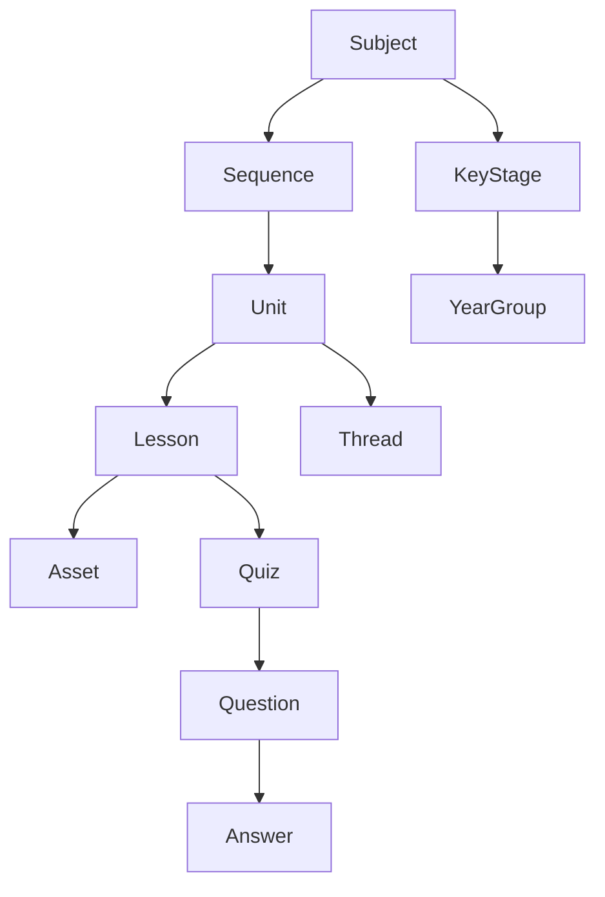
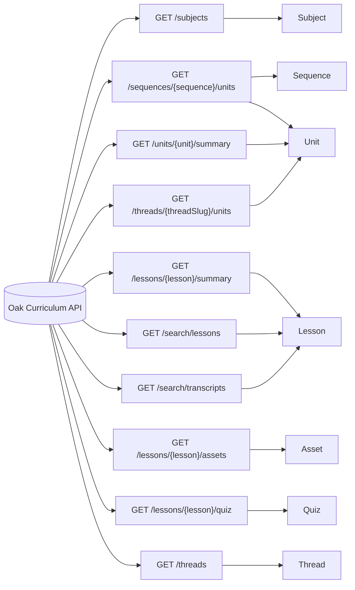
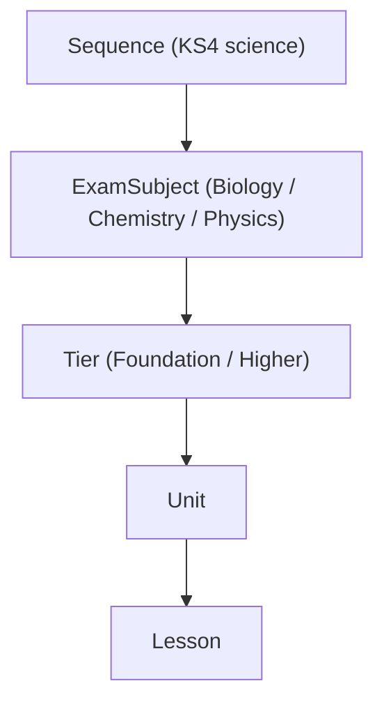

# Oak Curriculum Knowledge Graph – Overview

This document explains how the Oak Curriculum knowledge graph was created, what sources it uses, which assumptions were made, and how you can safely use it in downstream tools or analysis.

It is the conceptual companion to:

- `kg-graph.md` – a human-readable dump of nodes and edges.
- `kg-graph.ts` – a machine-readable representation of the same graph for TypeScript.

---

## 1. Goals and scope

The knowledge graph is designed to:

1. **Unify the API and the curriculum ontology** – connect OpenAPI endpoints and response schemas to curriculum concepts like subjects, units, lessons, threads and quizzes.
2. **Make implicit structure explicit** – represent relationships that are obvious in the documentation (e.g. “a unit contains lessons” or “threads link units vertically”) as first-class graph edges.
3. **Support both humans and machines** – provide a Markdown view for humans and a strongly-typed JSON/TypeScript representation for code.

The graph focuses on the public curriculum API at:

- [https://open-api.thenational.academy/api/v0/swagger.json](https://open-api.thenational.academy/api/v0/swagger.json)
- [https://open-api.thenational.academy/docs/about-oaks-api/api-overview](https://open-api.thenational.academy/docs/about-oaks-api/api-overview)
- [https://open-api.thenational.academy/docs/about-oaks-data/glossary](https://open-api.thenational.academy/docs/about-oaks-data/glossary)
- [https://open-api.thenational.academy/docs/about-oaks-data/ontology-diagrams](https://open-api.thenational.academy/docs/about-oaks-data/ontology-diagrams)

and the user-provided research materials that mirror or interpret those sources.

---

## 2. Inputs and sources

The graph was built from four main kinds of source material:

1. **OpenAPI schema**
   - Public: [Oak OpenAPI swagger.json](https://open-api.thenational.academy/api/v0/swagger.json)
   - Local copy: `api-schema-sdk.json` (uploaded)
   - Used to discover **endpoints**, **response schemas**, and the structural relationships implied by `$ref` and schema fields (e.g. arrays of units, categories, threads).

2. **API overview and narrative docs**
   - [API overview](https://open-api.thenational.academy/docs/about-oaks-api/api-overview)
   - Used to clarify concepts like subjects, sequences, units, programmes, and rate limiting.

3. **Curriculum ontology and glossary**
   - [Glossary](https://open-api.thenational.academy/docs/about-oaks-data/glossary)
   - [Ontology diagrams](https://open-api.thenational.academy/docs/about-oaks-data/ontology-diagrams)
   - Local ontology markdown: `curriculum-ontology.md`
   - These define conceptual entities (Subject, Programme, Unit, Thread, Pathway, ExamBoard, etc.) and relationships that may not appear directly in the API.

4. **Internal research notes (uploaded)**
   - `official-api-ontology-comparison.md`
   - `ONTOLOGY_RESEARCH_SUMMARY.md`
   - Used to resolve ambiguities and encode design decisions such as how to treat Programmes versus Sequences or how to model KS4 exam structures (ExamSubject and Tier).

---

## 3. Node model and edge model

The graph uses a small, explicit type system:

- **Concept** – curriculum or platform concepts (Subject, Unit, Lesson, Thread, Quiz, Answer, etc.).
- **Endpoint** – a concrete HTTP endpoint from the OpenAPI (e.g. `GET /subjects`).
- **Schema** – an OpenAPI response schema (e.g. `AllSubjectsResponseSchema`).
- **SourceDoc** – an uploaded local document used as a source (e.g. `curriculum-ontology.md`).
- **ExternalLink** – a node that carries a URL to an external web resource (e.g. the public glossary page).

Edges have:

- `from` – source node id
- `to` – target node id
- `label` – short description of the relationship (e.g. `"has assets"`, `"returns schema"`)
- `inferred` – optional boolean flag indicating that the relationship was **inferred** rather than spelled out directly in JSON or diagrams.

Example edges:

- `Subject --has sequences--> Sequence`
- `Sequence --includes units--> Unit`
- `Unit --contains lessons--> Lesson`
- `Lesson --has assets--> Asset`
- `Lesson --has quizzes--> Quiz --contains questions--> Question --has answers--> Answer`
- `Thread --links units across years--> Unit`
- `GET /sequences/{sequence}/units --returns schema--> SequenceUnitsResponseSchema --lists units--> Unit`

These relationships appear explicitly in `kg-graph.ts` and are rendered textually in `kg-graph.md`.

---

## 4. How the graph was constructed

### 4.1. Harvesting entities from OpenAPI

From the OpenAPI specification we extracted:

- **Paths** (endpoints) such as `/subjects`, `/lessons/{lesson}/summary`, `/sequences/{sequence}/units`, `/threads/{threadSlug}/units`, `/search/lessons`.
- **Schemas** under `components.schemas` representing structured response types:
  - Subject-level schemas (e.g. `AllSubjectsResponseSchema`, `SubjectResponseSchema`).
  - Sequence- and unit-level schemas (`SequenceUnitsResponseSchema`, `AllKeyStageAndSubjectUnitsResponseSchema`).
  - Lesson-level schemas (`LessonSummaryResponseSchema`, `LessonAssetsResponseSchema`, `TranscriptResponseSchema`).
  - Quiz schemas (`QuestionForLessonsResponseSchema`, `QuestionsForSequenceResponseSchema`, `QuestionsForKeyStageAndSubjectResponseSchema`).
  - Search schemas (`SearchTranscriptResponseSchema`, `LessonSearchResponseSchema`).
  - Operational schemas (`RateLimitResponseSchema`, changelog-related schemas).

Each path became an **Endpoint** node and each response schema became a **Schema** node. The “major” concept names were extracted from schema field names (`subjectSlug`, `unitSlug`, `lessonSlug`, `threads`, `categories`, etc.) and mapped to **Concept** nodes such as `Subject`, `Unit`, `Lesson`, `Thread`, `Category`, `Quiz`, and `Answer`.

### 4.2. Harvesting entities from ontology + glossary

The curriculum ontology and glossary contribute additional concepts that do not always appear explicitly in the OpenAPI payloads but are critical for understanding the structure:

- **Programme** – a user-facing view of a sequence for a particular year, tier, pathway and exam board.
- **Pathway** and **ExamBoard** – contextual factors used to parameterise programmes at KS4.
- **ExamSubject** and **Tier** – KS4-specific structures that distinguish biology vs chemistry vs physics and foundation vs higher tiers.
- **Thread**, **Category**, **Phase**, **KeyStage** and **YearGroup** – high-level curriculum structuring concepts.
- **Educational metadata** concepts – prior knowledge, curriculum statements, keywords, misconceptions, teacher tips and content guidance.

These all became **Concept** nodes, even if the OpenAPI lists them only indirectly (for example, as fields within a response schema).

### 4.3. Building relationships from schemas

For each schema, the graph builder looked for:

- Object fields containing collections of other objects, e.g. an array called `units` or `lessons`, which became edges like `Sequence --includes units--> Unit`.
- Identifier pairs such as `lessonSlug`, `unitSlug`, `subjectSlug`, which imply membership edges even when the full nested object is not returned.
- Fields like `threads` and `categories` on units, which became edges `Unit --tagged with thread--> Thread` and `Unit --tagged with category--> Category`.
- Nested quiz question structures, which became the `Quiz -> Question -> Answer` chain.

These edges are marked as _explicit_ (no `inferred` flag) when there is a direct structural relationship in the JSON (e.g. an array of units inside a sequence response).

### 4.4. Adding inferred / implicit relationships

Some important relationships are not fully explicit in a single API response but are clearly implied by the documentation and ontology. These are marked with `inferred: true` in `kg-graph.ts`. Examples:

- **Programme relationships** – Programmes are derived views of sequences for specific subject/year/tier/pathway combinations. The graph encodes this as:
  - `Programme --about subject--> Subject`
  - `Programme --contains units--> Unit`
  - `Programme --scoped to key stage--> KeyStage`
  - `Programme --uses pathway--> Pathway`
  - `Programme --uses exam board--> ExamBoard`
  - `Programme --uses tier--> Tier`
- **Unit context** – Units “belong” to a subject, key stage and year based on their placement in sequences and key stage/unit endpoints. This gives edges like:
  - `Unit --belongs to subject--> Subject`
  - `Unit --belongs to key stage--> KeyStage`
  - `Unit --targets year group--> YearGroup`
- **KS4 exam structure** – Some sequences, especially in science and maths, branch by exam subject and tier. The graph treats this as:
  - `Sequence --branches into exam subjects--> ExamSubject`
  - `ExamSubject --has tiers--> Tier`

These relationships help when you want to traverse the graph “curriculum-first” (e.g. “all higher-tier biology units for Year 11”) even though no single API call exposes that view directly.

### 4.5. Linking to documentation and sources

To track provenance, the graph includes:

- **SourceDoc nodes** for each uploaded local file.
- **ExternalLink nodes** for each public webpage (OpenAPI, overview, glossary, ontology diagrams).

Example provenance edges:

- `api-schema-sdk.json (uploaded) --mirrors external OpenAPI spec--> Oak OpenAPI swagger.json`
- `curriculum-ontology.md (uploaded) --summarises external ontology diagrams--> Oak ontology diagrams`
- `Subject --defined in glossary--> Oak data glossary`
- `Sequence --defined in OpenAPI spec--> Oak OpenAPI swagger.json`

This lets you trace each design choice back to human or machine-readable sources.

---

## 5. Mermaid diagrams

Below are a few high-level diagrams to visualise the structure before diving into the full node/edge lists.

### 5.1. Core curriculum structure

### 5.2. API endpoints mapped to concepts

### 5.3. KS4 exam structure (science example)

---

## 6. How to use the knowledge graph

You can use the graph in a few different ways:

### 6.1. For API and curriculum exploration

- Start from **Subject** and follow `has sequences` → `includes units` → `contains lessons` to understand the shape of a subject’s curriculum.
- Follow **Thread** → **Unit** to explore vertical progression, then traverse to lessons and assets to see how that concept is taught over time.
- Use **Endpoint** and **Schema** nodes to see _which_ API calls surface _which_ parts of the curriculum graph.

### 6.2. For developer tooling

- Load `kg-graph.ts` and use `kgGraph.nodes` / `kgGraph.edges` to:
  - Generate API client helpers that know which endpoint returns which concept.
  - Build navigation UIs that mirror the curriculum hierarchy (Subject → Sequence → Unit → Lesson).
  - Attach additional project-specific annotations to nodes or edges without having to re-parse OpenAPI or the ontology docs.

### 6.3. For search, recommendation and analytics

- Combine the graph with transcript or title search to provide curriculum-aware search results (e.g. “similar lessons” along the same thread or unit).
- Use Thread and Category relationships to cluster content for analytics or recommendation.
- Exploit inferred Programme edges to build schedule planners or progression maps for particular cohorts (pathway + exam board + tier).

---

## 7. Assumptions and limitations

A few important caveats:

1. **Programmes are inferred.** The API is sequence-centric; the notion of a Programme (the teacher-facing view) is derived from ontology docs and research notes, not a dedicated endpoint.
2. **Cardinalities are implicit.** The graph labels do not encode precise cardinalities (e.g. 1-to-many vs many-to-many), though many of them can be inferred from context.
3. **KS4 branching is simplified.** ExamSubject and Tier relationships are modelled at a high level; fine-grained differences between exam boards may be richer in the original documents than in this graph.
4. **Only read-only API is included.** The graph covers the read-only curriculum API; any internal authoring or admin APIs are out of scope.
5. **Updates require regeneration.** If the OpenAPI or ontology docs change, this graph becomes stale; it should be regenerated or extended to remain accurate.

When in doubt, treat the **official OpenAPI** and **public documentation** as the source of truth, and this graph as an opinionated, structured summary designed to make those sources easier to navigate.

---

## 8. Relationship to the other files

### 8.1 Core Graph Files

- `kg-overview.md` (this file) explains the design and how to read the graph.
- `kg-graph.md` shows the complete list of nodes and edges in a human-friendly format.
- `kg-graph.ts` exposes the exact same information as a TypeScript object for programmatic use.

All three are derived from the same underlying model, so you can safely move between them without losing information.

### 8.2 Implementation Research (December 2025)

The following documents analyse how to implement the knowledge graph as an MCP tool:

- **`knowledge-graph-tool-research.md`** — Comprehensive analysis of:
  - Existing agent support tool patterns (`get-ontology`, `get-help`)
  - Architecture of aggregated tools in the SDK
  - Output format patterns (`formatOptimizedResult`)
  - Integration points (tool guidance, documentation resources, prompts)
  - Design recommendations for `get-knowledge-graph` tool

- **`complementary-by-construction.md`** — Analysis of how to make the knowledge graph and ontology complementary:
  - Clear separation of concerns (structure vs guidance)
  - Content allocation (what belongs where)
  - Shared identifiers for cross-referencing
  - Agent usage patterns for both tools
  - Validation criteria for complementary design

- **`optimised-graph-proposal.md`** — Proposed optimisations to reduce payload size:
  - Structural changes (remove SourceDoc nodes, shorten IDs)
  - Size reduction from ~40KB to ~18KB
  - Alternative minimal graph format (~2KB)
  - Query patterns enabled by the optimised structure

### 8.3 Recommended Reading Order

For understanding the knowledge graph:

1. This overview (`kg-overview.md`)
2. The graph itself (`kg-graph.md` or `kg-graph.ts`)

For implementing the MCP tool:

1. `knowledge-graph-tool-research.md`
2. `complementary-by-construction.md`
3. `optimised-graph-proposal.md`

---

## 9. Next Steps

To implement `get-knowledge-graph` as an MCP tool:

1. **Optimise the graph** — Apply changes from `optimised-graph-proposal.md`
2. **Create SDK data file** — Move optimised graph to `packages/sdks/oak-curriculum-sdk/src/mcp/knowledge-graph-data.ts`
3. **Create tool definition** — Follow pattern from `aggregated-ontology.ts`
4. **Register tool** — Add to `AGGREGATED_TOOL_DEFS` and update type guards
5. **Add to guidance** — Update `agentSupport` category in `tool-guidance-data.ts`
6. **Test with agents** — Validate utility in real conversations

See `knowledge-graph-tool-research.md` for detailed implementation guidance.
