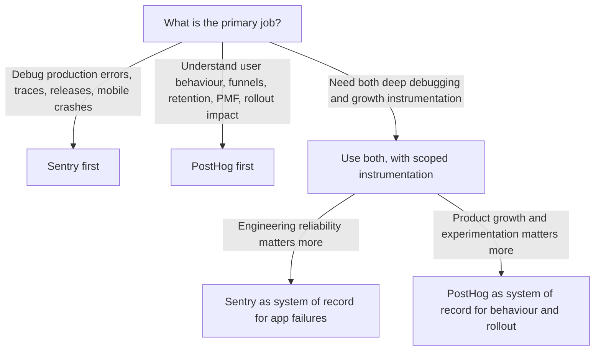

# Sentry and PostHog

## Executive summary

Sentry and PostHog overlap in a meaningful but narrow band: both can capture application exceptions, both can attach session replay context, both can alert, and both support cloud and self-hosted deployment models. Beyond that overlap, they are built for different jobs. Sentry is fundamentally an application monitoring and debugging platform centred on error monitoring, distributed tracing, profiling, releases, ownership workflows, and developer remediation. PostHog is fundamentally a product and customer data platform centred on product analytics, web analytics, feature flags, experiments, surveys, customer profiles, customer data pipelines, and a warehouse-style analysis layer; its error tracking is designed to connect exceptions back to user behaviour and product outcomes rather than to act as a deep APM replacement. [[1]](#ref-1)

In practical buying terms, the simplest rule is this: if your primary question is **“what broke, where, in which release, and who should fix it?”**, Sentry is the stronger primary system. If your primary question is **“how are users behaving, where are they dropping off, what should we test next, and how do we roll it out?”**, PostHog is the stronger primary system. If you need both product growth instrumentation and deep developer debugging, the most robust architecture is often to use **both**, with disciplined scoping so you do not duplicate every trace, replay, and event unnecessarily. [[2]](#ref-2)

The current commercial posture also differs. Sentry uses a base subscription plus included quotas and pay-as-you-go or reserved volume across categories such as errors, spans, replays and monitors; its Team plan starts at **$26/month** and Business at **$80/month** on annual billing. PostHog starts at **$0**, charges by product after generous free tiers, and lets you set per-product billing limits; on cloud it includes free monthly allowances such as **1M analytics events**, **5k session recordings**, **1M feature-flag requests**, and **100k exceptions**. That makes PostHog unusually attractive for early-stage product teams, while Sentry’s pricing tends to map more naturally to engineering observability budgets. [[3]](#ref-3)

For self-hosting, both vendors explicitly steer most customers towards cloud. Sentry’s self-hosted starter repo is geared towards **low traffic loads under about 1 million submitted events per month**, and its architecture includes components such as Relay, Snuba, Kafka, ClickHouse, Redis, PostgreSQL and Symbolicator. PostHog’s open-source self-hosted deployment is MIT-licensed, but its own disclaimer says it is aimed at hobbyists / unusual deployments, runs on a **single machine**, is **unlikely to scale past a couple of hundred thousand events without significant effort**, and comes without commercial support or guarantees. [[4]](#ref-4)

Market signals broadly reinforce the product split. On G2, both products sit at **4.5/5**, though PostHog has many more reviews in the current snapshot, which is consistent with its broader use across product, growth and engineering teams. Community feedback is directional rather than definitive, but it commonly describes Sentry as polished and powerful for debugging while warning that self-hosting can be operationally heavy; PostHog is often praised for breadth, pricing leverage and “all-in-one” workflows, but criticised for increasingly steering users towards its cloud offering and limiting support for self-hosted deployments. [[5]](#ref-5)

## Questions to confirm and working assumptions

Please confirm these if you want the analysis narrowed later:

- What is your **primary use case**: error monitoring, product analytics, full-stack observability, privacy-first analytics, or something else?
- Do you prefer **cloud**, **self-host**, or have **no deployment preference**?
- How price-sensitive are you, and do you have any hard **budget constraints**?
- What is your **stack**: web framework, back-end language, mobile platforms, data warehouse, and current analytics/observability tools?
- Do you have **data residency or compliance** requirements such as GDPR, HIPAA, BAA, SSO/SAML, or audit logging?
- Do you want **integration guidance** or **migration steps**, or is the goal only vendor comparison for now?

For this report, I have assumed a modern SaaS or digital product team, no fixed deployment preference, moderate price sensitivity, a common TypeScript/JavaScript front end with a typical server stack, GDPR-level privacy expectations by default, and no immediate need for migration playbooks unless you later request them.

## Product overviews

### Sentry

Sentry positions itself as application monitoring and debugging software. Its official product documentation describes end-to-end distributed tracing for performance issues and errors, code-level observability, session replay, profiling, cron monitoring, uptime monitoring, releases, alerts, and a large integrations ecosystem. Its platform breadth is notably wide: Sentry says it supports **100+ platforms and frameworks** across **30+ languages**, including major web, back-end, mobile, desktop and game-development environments. [[1]](#ref-1)

What makes Sentry distinctive is that the entire workflow is built around reducing time to identify and fix software problems. It groups events into issues, links releases and source maps/debug files, surfaces suspect commits, supports ownership rules and CODEOWNERS-based routing, monitors crash-free sessions and release health, and can add AI-assisted diagnosis through Seer. That combination appeals most strongly to software engineers, mobile teams, platform teams, SRE-adjacent application teams, and engineering managers who care about triage quality, mean time to detect, and mean time to resolution. [[6]](#ref-6)

Sentry’s customer stories align with that positioning. Official case studies highlight Airtable resolving issues up to **65% faster**, Rootly cutting MTTR by **50%**, and Delivery Hero using Sentry to cut mobile MTTD from days to hours while keeping **99.95% crash-free sessions**. Those are vendor-selected stories, but they are consistent with Sentry’s emphasis on debugging speed and release confidence rather than on growth analytics. [[7]](#ref-7)

### PostHog

PostHog positions itself as a developer platform or “Product OS” for building successful products. Official documentation and pricing materials show a broader suite: product analytics, web analytics, session replay, feature flags, experiments, surveys, error tracking, customer analytics, data pipelines, a managed warehouse, logs, workflows, LLM analytics, and an in-product AI assistant. Its libraries page shows official or community-maintained SDKs across major web, mobile and server environments, with a feature-support matrix that explicitly includes event capture, user identification, autocapture, session recording, feature flags, group analytics and error tracking. [[8]](#ref-8)

PostHog’s centre of gravity is not “find the deepest stack trace” but “understand and change user behaviour”. Its insights layer includes trends, funnels, retention, paths, stickiness, lifecycle and SQL. Its identity system creates person profiles and merges anonymous with identified behaviour. Its customer profiles can combine events, errors, LLM traces and Zendesk tickets. Around that core it adds rollout and experimentation primitives through feature flags and experiments, then closes the loop with surveys and data-pipeline exports. This makes it especially strong for product engineers, PMs, growth teams and founders trying to build toward product-market fit without stitching together half a dozen vendors. [[9]](#ref-9)

Its customer stories reflect that pattern. Official examples include Webshare replacing Mixpanel, Hotjar and FullStory use cases and improving conversion rates by **26%** with experiments; Hasura improving conversion by **10–20%** after identifying onboarding drop-offs; Contra increasing registrations by **30%** with session replay and rollout analysis; and Phantom cutting failure rates by **90%** after instrumenting product failures and using feature flags to control rollouts. Again, these are vendor-selected examples, but they show that PostHog’s strongest value proposition is the connection between observation, experimentation and product change. [[10]](#ref-10)

## Feature comparison

| Dimension | Sentry | PostHog | What it means in practice |
|---|---|---|---|
| Primary purpose | Application monitoring and debugging: errors, tracing, profiling, releases, replay, uptime and cron monitoring. [[1]](#ref-1) | Product and customer platform: analytics, replay, flags, experiments, surveys, error tracking, warehouse/CDP, customer analytics. [[8]](#ref-8) | They solve adjacent rather than identical problems. |
| Error monitoring | Core feature. Automatic issue grouping, triage, ownership, suspect commits, release linkage, readable stack traces via source maps/debug files. [[6]](#ref-6) | Present and expanding. Error tracking is integrated with replay, analytics and feature flags so you can see user impact and roll back quickly. Platforms include web, mobile and major back-end frameworks. [[11]](#ref-11) | Both do exception capture; Sentry is deeper and more mature for engineering remediation. |
| Performance monitoring | Strong. Distributed tracing, transaction/span analysis, automated issue detection, profiling and release health. [[12]](#ref-12) | Not a primary APM product in the same sense. PostHog can analyse product and session performance patterns, but it does not position itself as a broad code-level distributed tracing platform. [[13]](#ref-13) | If you mean application performance monitoring, Sentry is far closer. |
| Session replay | Yes, with web and mobile replay, issue/replay linking, AI summaries, privacy controls, masking/blocking defaults, and replay-on-error sampling. [[14]](#ref-14) | Yes, deeply tied into product analytics, errors, cohorts and experiments. Recordings can be used to inspect drop-offs and customer behaviour. [[15]](#ref-15) | Same headline feature, different job-to-be-done: debugging for Sentry, behaviour analysis for PostHog. |
| Product analytics | Limited. Sentry has dashboards and Discover/Insights, but not the product-analytics stack of funnels, retention and experimentation that PostHog offers. [[16]](#ref-16) | Core product. Trends, funnels, retention, paths, stickiness, lifecycle and SQL are first-class concepts. [[9]](#ref-9) | If PMs and growth teams are primary users, PostHog is materially stronger. |
| Event tracking | Sentry captures application telemetry events tied to errors, traces, replays and releases. [[1]](#ref-1) | Core design principle. Capture anonymous and identified events, analyse them in product insights, and export them through data pipelines. [[9]](#ref-9) | PostHog is built around event modelling and downstream analysis. |
| User tracking | Light-touch user context via SDKs such as `setUser()` to attach identification and event context. [[17]](#ref-17) | Deep identity model with anonymous IDs, `identify`, aliasing, person profiles, cohorts and group analytics. [[18]](#ref-18) | Sentry knows “which user saw this issue”; PostHog knows “how this user or cohort behaves over time”. |
| Alerting | Issue alerts, metric alerts and uptime alerts. Business adds anomaly detection in metric alerts. Integrations route alerts to Slack, PagerDuty, Teams and more. [[19]](#ref-19) | Trend alerts with thresholds and anomaly detection, plus dedicated error-tracking alerts and dashboard subscriptions; notifications can go to email, Slack or webhooks. [[20]](#ref-20) | Both alert; Sentry is stronger for engineering incidents, PostHog for KPI and product-signal monitoring. |
| Integrations | Broad app ecosystem across source control, issue tracking, notifications and SSO. Official examples include GitHub, Jira, GitLab and Slack. [[21]](#ref-21) | Mix of SDKs, Slack app, data-pipeline destinations and warehouse/source connectors such as Stripe, HubSpot, Zendesk, S3, Slack, webhooks and Intercom-style destinations. [[22]](#ref-22) | Sentry integrates around engineering workflow; PostHog integrates around customer and product data flow. |
| SDK breadth | Very wide: 100+ platforms/frameworks, 30+ languages; web, server, mobile, desktop and game engines. [[16]](#ref-16) | Broad but more product-focused. Official comparison page lists Android, iOS, JavaScript web, Next.js, Node.js, Python, React, React Native, Flutter, PHP, Go, Java, .NET, Elixir, Rust, Unity and more. [[23]](#ref-23) | Sentry has the broader debugging footprint; PostHog covers the mainstream stacks most product teams need. |
| Data retention | By plan and data type: e.g. errors 30 days on Developer and 90 days on Team/Business/Enterprise; replays 30 days on Developer and 90 days on Team/Business/Enterprise; spans 30 days, with sampled 13-month span retention for Business/Enterprise. [[24]](#ref-24) | Non-recording data is guaranteed for 1 year on free and 7 years on paid plans; replay retention is configurable, up to 30 days on Free, 90 days on Pay-as-you-go, 1 year on Boost/Scale, and 5 years on Enterprise. [[25]](#ref-25) | PostHog retains product data much longer by default; Sentry retains debugging telemetry on shorter observability-oriented windows. |
| Storage and architecture | Cloud-managed on SaaS; self-hosted deployments involve Relay, Snuba, Kafka, ClickHouse, Redis, PostgreSQL and Symbolication-related components. [[26]](#ref-26) | Cloud-managed on SaaS; architecture uses Django web/API, Rust ingestion services, Kafka, ClickHouse, PostgreSQL, Redis and blob storage. [[27]](#ref-27) | Both are data-heavy systems under the hood; neither is “just one container” at scale. |
| Privacy and GDPR controls | EU/US storage-location support is surfaced in docs; privacy controls include server-side and advanced data scrubbing, Relay for central PII scrubbing/proxying, and replay defaults that mask text and block media. Sentry is SOC 2 Type 2 and ISO 27001 certified and has HIPAA attestation; qualifying plans can access a BAA. [[24]](#ref-24) | EU cloud region in Frankfurt, project/org IP-capture controls with EU orgs defaulting to IP disabled, `before_send` sanitisation, property filtering, cookieless tracking and opt-out modes. PostHog is SOC 2 Type II certified; BAAs are only offered for Cloud users with Boost, Scale or Enterprise add-ons. [[25]](#ref-25) | PostHog offers more explicit analytics-oriented privacy controls; Sentry offers stronger central PII scrubbing and enterprise debug-data controls. |
| Cloud versus self-host | Cloud is the mainstream path. Self-hosted exists, but the starter repo is aimed at low traffic and supported Linux distributions are limited; Debian/Ubuntu are preferred and Alpine is unsupported. [[28]](#ref-28) | Cloud is explicitly recommended for most users. Open-source self-host exists under MIT, but Kubernetes is sunset, commercial support is unavailable for open-source deployments, and many cloud features are missing in self-host. [[29]](#ref-29) | Both self-host; neither vendor makes self-host the default recommendation. |
| Scalability | Sentry’s ingestion architecture can process very large volumes, but the self-hosted repo is explicitly geared toward low-traffic setups below ~1M submitted events/month unless you extend the architecture. [[26]](#ref-26) | PostHog Cloud is built for serious volume, but the open-source single-machine deployment is unlikely to scale past a couple of hundred thousand events without significant effort. [[29]](#ref-29) | Cloud is the sensible choice for most serious production scale on both platforms. |
| Pricing model | Base subscription plus included quotas and PAYG/reserved-volume billing by category. Team starts at $26/month and Business at $80/month annually. Quotas include errors, spans, logs, replays, monitors and more. [[3]](#ref-3) | $0 base with free monthly allowances and per-product billing after that. Free plan has 1 project and 1-year retention; PAYG has 6 projects and 7-year retention. Add-ons include Boost $250/month, Scale $750/month and Enterprise $2,000/month. [[25]](#ref-25) | Sentry is easier to budget as an observability line item; PostHog is easier to start with and more modular across product tools. |

## Overlap and differentiators

### Overlap matrix

| Capability | Overlap level | Sentry edge | PostHog edge |
|---|---|---|---|
| Exception capture and triage | High | Better issue grouping, release awareness, ownership routing, suspect commits, source maps/debug files. [[6]](#ref-6) | Better linkage between exceptions and user behaviour, cohorts, analytics, feature flags and rollback workflows. [[11]](#ref-11) |
| Session replay | High | Better debugging-first workflow, privacy masking defaults, replay-on-error sampling, AI replay summary. [[17]](#ref-17) | Better behaviour-analysis workflow, cohort filtering, replay-to-funnel and replay-to-insight workflows. [[13]](#ref-13) |
| Alerts | Medium | Issue/metric/uptime alerts are more engineering-incident oriented. [[19]](#ref-19) | KPI/trends/anomaly alerts are more PM and growth oriented. [[20]](#ref-20) |
| User context | Medium | Enough for debugging and feedback forms. [[30]](#ref-30) | Full person identity, cohorting and cross-device/user-path resolution. [[18]](#ref-18) |
| Performance tracing | Low | First-class APM/tracing/profiling. [[12]](#ref-12) | Not a primary use case. [[8]](#ref-8) |
| Product analytics | Low | Limited compared with dedicated product analytics. [[16]](#ref-16) | First-class insights, funnels, retention, web analytics and SQL. [[9]](#ref-9) |
| Experimentation and rollout | Very low | Not core beyond release workflows. [[31]](#ref-31) | Feature flags, experiments, surveys and customer targeting are core. [[32]](#ref-32) |
| Data platform functions | Very low | Not a CDP/warehouse product. | Managed warehouse, transformations and destinations are built in. [[22]](#ref-22) |

### What Sentry does that PostHog does not do as well

Sentry’s deepest differentiator is its **developer remediation workflow**. A Sentry issue is not just an exception record; it can be grouped intelligently, linked to a release, enriched with source maps or debug files, routed automatically via ownership rules or CODEOWNERS, connected to suspect commits, measured against crash-free session rates, and increasingly handed to Seer for automated analysis and code-fix generation. Official docs and customer stories consistently reinforce this as the product’s centre of gravity. [[6]](#ref-6)

A representative Sentry use case is a mobile or multi-service production incident after a deployment: engineering needs to know which release introduced the regression, whether crash-free sessions are falling, which users are affected, what changed in the code, and which team owns the fix. Sentry is expressly built to answer those questions from one workflow. Delivery Hero’s and Rootly’s published results are good examples of that “release confidence plus faster remediation” value. [[2]](#ref-2)

Sentry also has the stronger app-observability story if your definition of “full-stack” is centred on **application code, requests, spans and performance bottlenecks** rather than on infrastructure telemetry. It is still application-centric rather than a complete infrastructure observability suite, but it is materially closer to that need than PostHog. That matters for engineering organisations that already have product analytics elsewhere but lack a strong debugging platform. [[1]](#ref-1)

### What PostHog does that Sentry does not do as well

PostHog’s deepest differentiator is that it **connects analysis, experimentation and deployment control** in one product. A funnel drop-off can lead directly to a replay, which can lead to a feature-flagged change, which can be measured via an experiment, which can be cut by cohort, and then supplemented with a survey or customer-profile review. Sentry does not offer that integrated product-operations loop. [[33]](#ref-33)

A representative PostHog use case is onboarding or activation optimisation: the team identifies where users abandon a flow, watches recordings for those users, segments them into a cohort, ships a targeted flag, runs an experiment, monitors the conversion delta, and optionally exports the resulting data or triggers downstream systems. Webshare’s, Hasura’s and Contra’s customer stories all follow this general shape. [[10]](#ref-10)

PostHog is also the clearly stronger choice if you want **one engineering-friendly platform for product analytics, feature flags, experiments, surveys and identity-aware customer understanding**. Its customer analytics layer brings together events, errors, LLM traces and support tickets in profiles, and its warehouse / CDP features let it act as more of a customer-data operating system. For teams chasing product-market fit, that is often more strategically useful than deeper tracing. [[34]](#ref-34)

## Deployment, operations, and pricing

Operationally, both products are considerably easier in cloud than self-hosted mode. Sentry’s self-hosted install path is well documented and uses an install script plus Docker Compose, but the surrounding architecture is still non-trivial, Linux support is opinionated, and Sentry’s own guidance says the starter repo is aimed at lower traffic. PostHog’s Docker Compose-based self-hosted deployment is explicitly open source and MIT-licensed, but PostHog also states that self-hosting means you own scaling, upgrades and risk, that Kubernetes support has been sunset, that support is limited, and that the open-source deployment misses a meaningful set of cloud features. In other words: **self-host exists on both sides, but it is an operational commitment rather than an easy default**. [[28]](#ref-28)

On compliance and data residency, both can satisfy serious organisations, but the mechanisms differ. Sentry emphasises enterprise security/compliance, data scrubbing, Relay, SOC 2 Type 2, ISO 27001, HIPAA attestation and qualifying-plan BAAs. PostHog emphasises privacy controls at capture and processing time, EU cloud in Frankfurt, IP-discard controls, cookieless tracking, configurable storage rules, SOC 2 Type II, and BAAs only on specific paid cloud add-ons. If your main concern is **PII control around debugging telemetry**, Sentry’s Relay and scrubbing model stand out. If your main concern is **privacy-aware product analytics and user tracking**, PostHog’s controls are unusually explicit. [[35]](#ref-35)

The pricing scenarios below are illustrative only. They use public self-serve cloud pricing as of **18 April 2026**, exclude taxes, discounts, negotiated enterprise terms, and infrastructure costs, and should be read carefully because the products are not equivalent. In particular, **Sentry figures below cover Sentry workloads only**; where a scenario also assumes analytics or feature flags, a separate product would normally still be required. **PostHog figures below reflect its all-in-one pricing across the products used in the scenario**. [[3]](#ref-3)

| Scenario | Assumed monthly usage | Sentry cloud estimate | PostHog cloud estimate | Interpretation |
|---|---|---:|---:|---|
| Small team | 50k errors/exceptions, 1k replays, 100k analytics events, 500k flag requests | **≈ $29.56/mo** on Sentry Team for errors + replays only. Analytics/flags would still need another tool. [[3]](#ref-3) | **$0/mo** if all usage stays inside the monthly free tiers for analytics, replay, flags and error tracking. [[25]](#ref-25) | PostHog is dramatically cheaper if you need a broad early-stage product stack; Sentry is still inexpensive if you only need developer debugging. |
| Mid-sized product | 300k exceptions, 20k replays, 5M analytics events, 5M flag requests | **≈ $159.89/mo** for Sentry errors + replay only, on Team pricing. This is a floor if you still need a separate analytics/flagging stack. [[3]](#ref-3) | **≈ $529.40/mo** across Product Analytics, Session Replay, Error Tracking and Feature Flags after free tiers. [[25]](#ref-25) | PostHog costs more here because it is covering more jobs in one bill; Sentry is cheaper only because it is not replacing the rest of the product stack. |
| Enterprise-scale product | 2M exceptions, 100k replays, 50M analytics events, 50M flag requests | **≈ $769.94/mo** as a Team-plan floor for Sentry errors + replay only. If you need SAML/SCIM, advanced quota controls or enterprise support, practical spend moves towards Business or Enterprise tiers. [[3]](#ref-3) | **≈ $3,578.65/mo** before platform add-ons such as Boost, Scale or Enterprise; add-on list prices are $250/mo, $750/mo and $2,000/mo respectively. [[25]](#ref-25) | At scale, PostHog can still be cost-effective if it replaces several vendors; Sentry remains compelling when the budget is specifically for engineering observability. |

A final pricing nuance matters a lot: Sentry’s model is easier to compare against Datadog/New Relic/Rollbar-style observability spend, whereas PostHog’s model is easier to compare against the **combined** spend of Amplitude/Mixpanel + FullStory/Hotjar + LaunchDarkly/Optimizely-lite + survey tooling + some CDP/warehouse functions. That is why raw monthly numbers can be misleading if you compare them without asking which adjacent tools each platform is replacing. [[3]](#ref-3)

## Decision criteria and recommendations

The recommendation logic above is the shortest defensible summary of the evidence. Sentry’s own documentation, workflows and pricing all revolve around application failures and developer remediation. PostHog’s documentation, workflows and pricing revolve around product understanding, experimentation and user-level insight. The overlap is real, but it does not erase the difference in primary design intent. [[1]](#ref-1)

For an **engineering-led SaaS, API platform, mobile app, or reliability-conscious product team**, the best single-platform recommendation is **Sentry**. It is the stronger choice when your non-negotiables include release health, crash-free sessions, tracing, source maps/debug files, suspect commits, ownership routing, and deep debugging context. If your organisation is already happy with Amplitude/Mixpanel/LaunchDarkly or does not yet need advanced product analytics, Sentry is the cleaner primary buy. [[2]](#ref-2)

For a **product-led SaaS, startup seeking PMF, growth team, or “one platform for product engineers” mandate**, the best single-platform recommendation is **PostHog**. It is the stronger choice when your non-negotiables include funnels, retention, cohorts, feature flags, experiments, surveys, customer profiles, warehouse/CDP-style connectivity, and a generous free tier that lets the team start broad instrumentation early. [[9]](#ref-9)

For an organisation that genuinely needs **both** worlds, the best recommendation is usually **Sentry plus PostHog**, not one replacing the other. A common, sensible split is: Sentry owns error monitoring, tracing, releases and developer triage; PostHog owns analytics, replay for behaviour analysis, feature flags, experiments and customer/product insight. Community examples show exactly this pairing in the wild. The main caution is instrumentation discipline: avoid collecting the same high-volume client telemetry in both systems unless there is a clear reason, because that can add cost and operational overhead. [[36]](#ref-36)

For **strict self-hosting requirements**, neither platform is “easy mode” at serious scale, but the trade-off is different. If you need self-hosted **product analytics** at modest volume and are willing to accept feature limitations and no commercial support, PostHog’s MIT-licensed hobby deployment is the friendlier starting point on paper. If you need self-hosted **developer observability**, Sentry’s self-hosted path is viable, but the operational burden is typically higher and the official starter repo is explicitly aimed at lower traffic. In either case, if scale, support, and compliance matter more than owning the infrastructure, the vendor-managed cloud is the more defensible default. [[29]](#ref-29)

My final recommendation, under the working assumptions in this report, is therefore:

- **Choose Sentry** if your primary buying centre is engineering and your current pain is production debugging, release safety, and app performance.
- **Choose PostHog** if your primary buying centre is product/growth and your current pain is understanding behaviour, proving product changes, and consolidating analytics + rollout tools.
- **Choose both** if you are a scaling digital product organisation that wants a best-of-breed split: Sentry for code-level observability, PostHog for product intelligence and controlled rollout. This is especially attractive once the cost of multiple point solutions exceeds the cost of keeping each platform focused on its strongest job. [[1]](#ref-1)

## References

### Sentry product documentation

- **[1]** <https://docs.sentry.io/>
- **[2]** <https://docs.sentry.io/product/releases/health/>
- **[6]** <https://docs.sentry.io/concepts/data-management/event-grouping/>
- **[12]** <https://docs.sentry.io/product/sentry-basics/performance-monitoring/>
- **[14]** <https://docs.sentry.io/product/explore/session-replay/>
- **[16]** <https://docs.sentry.io/product/>
- **[17]** <https://docs.sentry.io/platforms/javascript/session-replay/configuration/>
- **[19]** <https://docs.sentry.io/product/alerts/alert-types/>
- **[24]** <https://docs.sentry.io/security-legal-pii/security/data-retention-periods/>
- **[30]** <https://docs.sentry.io/platforms/javascript/user-feedback/configuration__v7.x>
- **[31]** <https://docs.sentry.io/platforms/javascript/guides/nextjs/configuration/releases/>

### Sentry developer & self-host documentation

- **[4]** <https://develop.sentry.dev/self-hosted/support/>
- **[26]** <https://develop.sentry.dev/ingestion/>
- **[28]** <https://develop.sentry.dev/self-hosted/>

### Sentry product pages

- **[21]** <https://sentry.io/integrations/>

### Sentry pricing

- **[3]** <https://sentry.io/pricing/>

### Sentry customer stories

- **[7]** <https://sentry.io/customers/airtable/>

### Sentry trust & compliance

- **[35]** <https://sentry.io/trust/>

### PostHog product documentation

- **[9]** <https://posthog.com/docs/product-analytics/insights>
- **[13]** <https://posthog.com/docs/data/sessions>
- **[15]** <https://posthog.com/docs/session-replay>
- **[18]** <https://posthog.com/docs/product-analytics/identify>
- **[20]** <https://posthog.com/docs/alerts>
- **[22]** <https://posthog.com/docs/advanced/cdp>
- **[23]** <https://posthog.com/docs/libraries>
- **[27]** <https://posthog.com/docs/how-posthog-works>
- **[29]** <https://posthog.com/docs/self-host>
- **[33]** <https://posthog.com/docs/product-analytics/funnels>
- **[34]** <https://posthog.com/docs/customer-analytics>

### PostHog product pages

- **[8]** <https://posthog.com/>
- **[11]** <https://posthog.com/error-tracking>
- **[32]** <https://posthog.com/feature-flags>

### PostHog pricing

- **[25]** <https://posthog.com/pricing>

### PostHog customer stories

- **[10]** <https://posthog.com/customers/webshare>

### Third-party reviews & community

- **[5]** <https://www.g2.com/products/sentry/reviews>
- **[36]** <https://news.ycombinator.com/item?id=46913479>
