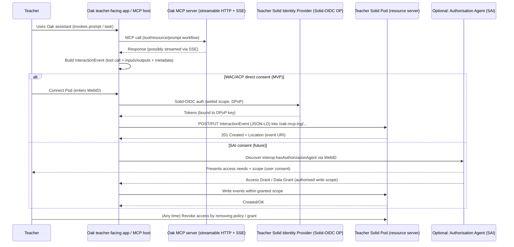

# Solid as a Teacher-Controlled Data Layer for Oak MCP Interaction Records

## Executive summary

Solid is positioned as a decentralised “file system for the Web” where individuals can store data online and decide which people, websites, apps, and AI agents can read and edit it. [[1]](https://solidproject.org/for_developers) For the specific goal of building a persistent record of a teacher’s interactions with the Oak MCP server **while keeping the teacher in control**, Solid’s core value proposition maps well: the interaction record can live in the teacher’s Pod (personal online datastore), and Oak (or an Oak-integrated client/app) can be granted only the minimum access needed—then revoked—using Solid’s authorisation mechanisms. [[2]](https://solidproject.org/faq) [[3]](https://solidproject.org/TR/protocol)

Technically, Solid builds on standard Web primitives (HTTP resources, folders/containers, URIs) and Linked Data (RDF), with identity and authentication typically handled via WebID + Solid-OIDC (an OpenID Connect profile), and authorisation handled via resource-based policies such as **WAC** (Web Access Control) and/or **ACP** (Access Control Policy). [[3]](https://solidproject.org/TR/protocol) [[4]](https://solidproject.org/TR/sai) [[5]](https://solidproject.org/faq) [[6]](https://solidproject.org/faq) For more structured “consent UX” and least-privilege patterns, the Solid community is also developing **Solid Application Interoperability (SAI)**, which introduces an **Authorisation Agent** and explicit **Access Grants / Data Grants** workflows. [[4]](https://solidproject.org/TR/sai) [[5]](https://solidproject.org/faq) [[6]](https://solidproject.org/faq)

However, a rigorous assessment needs to recognise several constraints up front:

Solid’s promise of control is strongest **for the copy of the interaction record stored in the teacher’s Pod**, but once a third-party app has legitimate read access, Solid cannot prevent that app from making its own copy; revocation stops further access/updates but does not “recall” data already copied. [[5]](https://solidproject.org/faq) Offline-first behaviour is part of Solid’s long-term vision, but the Solid Project FAQ explicitly notes there are **no offline implementations yet**, so any practical Oak integration needs its own local buffering/queueing strategy. [[6]](https://solidproject.org/faq) Encryption-at-rest is **provider-dependent**: Pod providers can be Solid-compliant without encrypting stored data, so “sovereignty” claims must be paired with concrete provider requirements and/or client-side encryption. [[5]](https://solidproject.org/faq)

Recommendation: For Oak, the most pragmatic path is a phased approach. Start with a **client-side “push to teacher Pod”** integration that writes an append-only audit log (immutable interaction events) into a dedicated container in the teacher’s Pod, using Solid-OIDC for authentication and WAC (or ACP where available) to enforce least-privilege. [[7]](https://solidproject.org/TR/oidc) [[8]](https://www.w3.org/TR/shacl12-core/) [[9]](https://solidproject.org/TR/sai-primer-application) Design the data model as RDF/JSON-LD with SHACL validation, and align event semantics with ActivityStreams/PROV where possible to maximise interoperability (including with Solid Notifications, which also uses ActivityStreams semantics for change notifications). [[8]](https://www.w3.org/TR/shacl12-core/) [[9]](https://solidproject.org/TR/sai-primer-application) [[10]](https://solidproject.org/faq) [[10]](https://solidproject.org/faq) Then evaluate SAI-based consent flows and/or an Oak-provided “authorisation agent” experience if stronger user-centred consent and delegation become product requirements. [[9]](https://solidproject.org/TR/sai-primer-application) [[10]](https://solidproject.org/faq)

## Solid technical foundations relevant to teacher-controlled logs

### Architecture and roles in the Solid ecosystem

At a high level, Solid distinguishes between (a) where data is stored and (b) how the user proves identity to apps. The Solid FAQ defines a **Pod** as the place “where data is stored on the Web with Solid”, and notes users may have one or multiple Pods; apps read/write depending on authorisations granted. [[10]](https://solidproject.org/faq) It also explicitly separates **Pod Providers** (host storage) from **Identity Providers** (let users authenticate as their WebID), and notes these can be different organisations; this separation is foundational for data portability and avoiding lock-in. [[10]](https://solidproject.org/faq)

Solid’s framing for developers emphasises the “online file system” metaphor: you store documents once, and multiple applications can use them, with the user controlling access for people/apps/AI agents and controlling when they can read/edit. [[1]](https://solidproject.org/for_developers) That is exactly the mental model you want for a teacher-controlled interaction history: the teacher’s Pod is the “system of record”, and Oak-related applications act as tools that can be allowed to write (append) and/or read, based on explicit permission.

### Storage model: HTTP resources, containers, and a storage root

The Solid Protocol is explicit that servers must provide one or more **storages**, and defines a **storage resource (`pim:Storage`) as the root container for contained resources**. [[11]](https://solidproject.org/TR/protocol) The protocol also defines a **container resource** (a hierarchical collection of resources) and a **root container** (the highest-level container). [[12]](https://solidproject.org/TR/protocol) [[13]](https://solidproject.org/TR/protocol) Importantly for building an append-only audit trail, Solid has “the notion of containers to represent a collection of linked resources to help with resource discovery and lifecycle management”, with container behaviour corresponding to an LDP Basic Container. [[13]](https://solidproject.org/TR/protocol)

The Solid Project FAQ adds a practical implementation insight: Pod providers can use different underlying storage technologies, but to be Solid compliant they must expose data consistently “as resources in folders”; performance can vary across providers because implementation choices differ. [[6]](https://solidproject.org/faq) This variability matters operationally for Oak: you should assume heterogeneous performance and feature support across Pod providers.

### Data model: RDF, Linked Data, JSON-LD/Turtle, and validation shapes

Solid is fundamentally a Linked Data ecosystem: the Solid Protocol relies on RDF representations for many discovery and metadata functions (eg storage description, auxiliary resources). [[14]](https://solidproject.org/TR/protocol) [[15]](https://www.w3.org/TR/rdf11-concepts/) RDF itself is defined by W3C as a graph-based data model: RDF graphs are sets of subject–predicate–object triples, used to express descriptions of resources; RDF datasets support multiple graphs (default + named graphs). [[15]](https://www.w3.org/TR/rdf11-concepts/)

RDF data can be serialised in multiple formats. Turtle is a W3C Recommendation providing a compact textual syntax for RDF. [[16]](https://www.w3.org/TR/turtle/) JSON-LD 1.1 is a W3C Recommendation providing a JSON-based syntax for serialising Linked Data, explicitly designed to integrate with JSON-centric systems. [[17]](https://www.w3.org/TR/json-ld11/) For Oak MCP interaction logging, JSON-LD is often the “lowest-friction” choice because MCP ecosystems are typically JSON-native, but Turtle can still be useful for debugging and specification examples.

For data quality and interoperability, validation matters. SHACL is a W3C Recommendation for describing and validating RDF graphs against constraints. [[18]](https://www.w3.org/TR/shacl/) In practice, Oak should treat the interaction-log schema as a versioned contract, published alongside SHACL shapes (and/or SAI shape trees later), so that logs remain machine-usable across apps and time.

### Non-RDF payloads: storing large transcripts and artefacts safely

Not every piece of an interaction record needs to be RDF. The W3C Linked Data Platform (which Solid builds upon) explicitly defines **LDP Non-RDF Sources (LDP-NR)**: resources whose state is not represented in RDF (eg images, HTML, documents). [[19]](https://www.w3.org/TR/ldp/) LDP servers *may* accept POST of non-RDF representations for creation of resources (eg binary resources). [[20]](https://www.w3.org/TR/ldp/)

That supports a common pattern for interaction logs: store a compact RDF/JSON-LD “event envelope” plus optional linked non-RDF artefacts (eg a full prompt/response transcript as text, or a generated lesson-plan document), with RDF metadata describing those artefacts. Solid further reinforces this pattern through “auxiliary resources” intended to hold supplementary information such as descriptive metadata, authorisation conditions, data shape constraints, digital rights, or provenance about a subject resource. [[21]](https://solidproject.org/TR/protocol) [[22]](https://solidproject.org/TR/protocol)

### Identity, authentication, and proof-of-possession tokens

Solid uses **WebIDs** (HTTP URIs denoting agents) as its primary identifier for users and applications; dereferencing a WebID yields an RDF profile describing the agent. [[22]](https://solidproject.org/TR/protocol) [[23]](https://solidproject.org/TR/protocol) The Solid Protocol notes WebIDs are an “underpinning component” and are used as “the primary identifier for users and applications”. [[23]](https://solidproject.org/TR/protocol)

For authentication, the Solid ecosystem’s current recommendation is **Solid-OIDC**. The Solid Protocol explicitly states that Solid initially relied on WebID-TLS, but current recommendation relies on Solid-OIDC (with WebID-TLS as an optional additional method). [[23]](https://solidproject.org/TR/protocol) Solid-OIDC requires OpenID Providers that conform to the spec to advertise support by including `webid` in `scopes_supported`. [[24]](https://solidproject.org/TR/oidc) It also includes DPoP-related requirements: for DPoP-bound ID tokens, a valid DPoP proof must be present and validated. [[24]](https://solidproject.org/TR/oidc)

For an Oak integration, these details matter because they influence your security posture: DPoP-bound tokens help reduce token replay risk by binding tokens to a proof key, which is valuable if a teacher is granting an app (or Oak middleware) access to write sensitive logs into their Pod. [[24]](https://solidproject.org/TR/oidc)

### Authorisation: WAC vs ACP

The Solid Protocol requires that servers conform to **either or both** WAC and ACP specifications, and that clients conform to whichever is used. [[23]](https://solidproject.org/TR/protocol)

WAC is a decentralised, cross-domain access control system that uses an Access Control List model to set authorisation conditions on HTTP resources, with access modes such as read, write, append, and control. [[25]](https://solidproject.org/TR/wac) The WAC specification explicitly does **not** specify authentication; it assumes deployments use appropriate authentication/verification techniques as needed. [[25]](https://solidproject.org/TR/wac) In practice, WAC is widely implemented and is often the quickest path to interoperability, but it can be awkward for expressing richer policy constraints.

ACP is defined as “a language for describing, controlling, and granting access to resources”، and is being developed as an editor’s draft by the Solid Community Group. [[26]](https://solid.github.io/authorization-panel/acp-specification/) [[27]](https://solid.github.io/authorization-panel/acp-specification/) The ACP specification includes richer matching constructs, for example matchers based on client, issuer, and even verifiable credential (VC) types presented as part of access requests. [[27]](https://solid.github.io/authorization-panel/acp-specification/) This expressivity is attractive for enterprise-grade consent and policy enforcement, but implementer support varies, and its “work in progress” status needs to be reflected in Oak’s risk assessment. [[28]](https://solid.github.io/authorization-panel/acp-specification/)

### Consent models beyond raw ACLs: Solid Application Interoperability

The most important Solid “consent UX” work item for Oak’s use case is **Solid Application Interoperability (SAI)**, a Draft Community Group Report (not a W3C Standard). [[29]](https://solidproject.org/TR/sai) SAI introduces an **Authorisation Agent** that a user designates and that can be discovered from the user’s WebID document using `interop:hasAuthorizationAgent`. [[30]](https://solidproject.org/TR/sai-primer-application)

SAI’s Application Primer sketches an explicit consent flow: when an app is not registered, it redirects the user to their Authorisation Agent; the agent presents “Access Need Groups” to explain what data is requested and why; the user chooses scope; and the agent records the decision as an Access Authorisation and generates Access Grants/Data Grants for the app. [[30]](https://solidproject.org/TR/sai-primer-application) The Authorisation Agent Primer further describes registries (data registry, authorisation registry, agent registry) and an “immutable” pattern for Access Authorisations and Data Authorisations (new authorisations replace older ones rather than being updated). [[31]](https://solidproject.org/TR/sai-primer-authorization-agent)

For Oak, SAI is relevant in two ways: it provides a standard framework for user-facing consent and least-privilege data access, and it suggests patterns (registries, immutable grants) that map well to a durable “interaction record” product—where auditability and non-repudiation are desirable.

### Provenance and auditability

W3C PROV-O provides classes and properties to represent provenance—information about entities, activities, and agents involved in producing a piece of data—and is intended to support interchange across systems. [[32]](https://www.w3.org/TR/prov-o/) Solid also explicitly anticipates provenance capture at the protocol level: it defines auxiliary resources as a mechanism to associate provenance record (among other metadata) with subject resources. [[33]](https://solidproject.org/TR/protocol)

A teacher-controlled interaction record should therefore be designed with explicit provenance fields (who/what wrote the record, when, based on what inputs, using what app/version), so that the record is meaningful and trustworthy even when shared across systems.

### Encryption options: in transit, at rest, and end-to-end

The Solid Protocol encourages servers to use TLS connections to protect requests and responses from eavesdropping/modification, while noting that non-TLS may exist in test environments or behind TLS-terminating proxies. [[23]](https://solidproject.org/TR/protocol) The Solid FAQ similarly asserts that Pod↔app traffic is encrypted “in transit”, and emphasises selective sharing and app trust. [[5]](https://solidproject.org/faq)

At rest, Solid does **not** guarantee encryption: the Solid FAQ states Pod providers can be Solid compliant without encrypting stored data, and that encryption-at-rest depends on the provider’s storage system. [[5]](https://solidproject.org/faq) Therefore, if Oak’s requirement is “teacher sovereignty at all times”, Oak must treat encryption-at-rest as a **hard provider requirement** (for any recommended providers) or implement **client-side encryption** before writing sensitive payloads into the Pod.

A practical set of encryption choices for Oak’s design is:

Transport security: mandate HTTPS/TLS for all Oak Solid interactions (even if Solid only “encourages” TLS) and reject non-HTTPS endpoints in production. [[34]](https://solidproject.org/TR/protocol) [[5]](https://solidproject.org/faq)  
Provider-side encryption at rest: treat as a procurement/compatibility requirement because Solid-compliance alone is insufficient. [[5]](https://solidproject.org/faq)  
Client-side (end-to-end) encryption: encrypt highly sensitive log elements (eg raw prompts that might include pupil data) before storage; store only encrypted blobs plus minimal RDF metadata. This is not standardised by Solid itself, so it must be an Oak application-layer design decision, with corresponding key management UX and recovery strategy. [[35]](https://solidproject.org/faq) [[36]](https://github.com/oaknational/oak-open-curriculum-ecosystem)

## Assumptions about Oak MCP and required API capabilities

### What is known from public Oak MCP documentation

Oak does have public MCP-facing documentation in the Oak Open Curriculum Ecosystem repository, which describes an “invite-only alpha” curriculum MCP server and states the aim is to provide curriculum access to AI assistants via SDKs, MCP servers, and semantic search. [[36]](https://github.com/oaknational/oak-open-curriculum-ecosystem) That repo characterises the MCP interface in terms of the three MCP primitive types—**Tools, Resources, Prompts**—and describes example tool counts and prompt workflows. [[36]](https://github.com/oaknational/oak-open-curriculum-ecosystem)

The canonical server workspace (streamable HTTP) states it exposes the Curriculum MCP server over **Streamable HTTP** with **stateless session management** and streams responses using **Server-Sent Events (SSE)** “as per the MCP specification”. [[37]](https://github.com/oaknational/oak-open-curriculum-ecosystem/tree/main/apps/oak-curriculum-mcp-streamable-http) It also indicates that MCP tool definitions are generated from the OpenAPI schema via the curriculum SDK, and references ADRs relating to MCP authentication and OAuth authorisation models. [[37]](https://github.com/oaknational/oak-open-curriculum-ecosystem/tree/main/apps/oak-curriculum-mcp-streamable-http)

From the MCP specification documentation (Model Context Protocol), MCP servers offer three building blocks: Tools (model-controlled), Resources (application-controlled), Prompts (user-controlled). [[38]](https://modelcontextprotocol.io/docs/learn/server-concepts) MCP also highlights mechanisms for human oversight of tool use, including approvals, permission settings, and “activity logs that show all tool executions with their results”. [[38]](https://modelcontextprotocol.io/docs/learn/server-concepts) This is directly aligned with Oak’s goal of teacher-visible, teacher-controlled interaction histories.

### Assumptions where Oak MCP details are unspecified

The user request asks to “assume unspecified specifics of Oak MCP APIs”. Where Oak MCP surface area is not fully documented for the interaction-log use case, this report assumes:

An “interaction” includes at minimum: teacher-initiated prompt invocation (eg choosing an Oak prompt workflow), model tool calls to Oak MCP tools, resource reads/subscriptions, and returned outputs/errors. [[39]](https://modelcontextprotocol.io/docs/learn/server-concepts) [[39]](https://modelcontextprotocol.io/docs/learn/server-concepts)  
Teachers may use Oak MCP via an Oak UI (eg a lesson assistant) or via third-party MCP clients (eg ChatGPT/Claude-type hosts) that connect to Oak’s remote MCP server, so the “logger” may need to live in a host app, Oak’s UI layer, or a gateway. [[39]](https://modelcontextprotocol.io/docs/learn/server-concepts) [[40]](https://solidproject.org/faq)  
Some interactions may involve personal data (teacher identifiers, school context, possibly pupil-related content typed into prompts). Solid explicitly treats “behaviour” and communications as personal data, and its FAQ quotes GDPR’s notion of personal data as information relating to an identified/identifiable person. [[40]](https://solidproject.org/faq) [[38]](https://modelcontextprotocol.io/docs/learn/server-concepts)

### Required Oak MCP API capabilities to support Solid-based interaction records

Regardless of where the logger runs, a Solid-based “teacher-controlled record” benefits from Oak providing (or allowing capture of) the following capabilities:

Deterministic identifiers and timestamps per interaction event (tool call, resource read, prompt invocation) so events can be stored as immutable resources and deduplicated on retries. This aligns with MCP’s emphasis on activity logging. [[38]](https://modelcontextprotocol.io/docs/learn/server-concepts)  
A standardised event envelope (JSON) for MCP interactions, including: tool name, input schema version, output summary, error codes, latency, and references to curriculum resources accessed (URIs). Oak already structures capability exposure around tools/resources/prompts, so the interaction envelope should carry these primitives explicitly. [[41]](https://github.com/oaknational/oak-open-curriculum-ecosystem) [[42]](https://solidproject.org/TR/protocol)  
An authentication story for any Oak component that needs to write to a teacher’s Pod: either (a) the teacher-facing client performs Solid-OIDC and writes directly to the Pod, or (b) Oak receives delegated authorisation to write (ideally via an SAI grant model later). [[42]](https://solidproject.org/TR/protocol) [[43]](https://solidproject.org/faq) [[44]](https://github.com/oaknational/oak-open-curriculum-ecosystem/tree/main/apps/oak-curriculum-mcp-streamable-http)  
A clear separation between Oak’s operational logs (which Oak may need for reliability/security) and the teacher’s sovereign log (in the Pod). Solid cannot “recall” data already accessed by third parties, so minimisation and transparency are essential. [[43]](https://solidproject.org/faq) [[44]](https://github.com/oaknational/oak-open-curriculum-ecosystem/tree/main/apps/oak-curriculum-mcp-streamable-http)  
Support for streaming contexts: because Oak’s MCP server streams SSE responses and is stateless, the logging design should handle multi-chunk responses and store either (a) a final merged output or (b) a chunked transcript artefact stored as an LDP Non-RDF Source. [[44]](https://github.com/oaknational/oak-open-curriculum-ecosystem/tree/main/apps/oak-curriculum-mcp-streamable-http) [[45]](https://github.com/oaknational/oak-open-curriculum-ecosystem)

Oak-specific documentation note: beyond the Oak Open Curriculum Ecosystem repository and its MCP server README, relevant “Oak MCP interaction logging” documentation was not found in the provided source corpus, so this report treats the above as integration requirements rather than confirmed existing capabilities. [[45]](https://github.com/oaknational/oak-open-curriculum-ecosystem)

## Integration approaches and recommended data models

### Integration approaches

A Solid-based interaction record can be integrated in several ways, depending on who initiates writes to the Pod and where credentials live.

| Approach | High-level flow | Teacher sovereignty strengths | Key weaknesses / risks | Best-fit scenarios |
|---|---|---|---|---|
| Client-side push (recommended MVP) | Oak teacher-facing app (or MCP host) writes interaction events directly to teacher Pod via Solid Protocol after Solid-OIDC login | Teacher directly authorises the app; logs stored in teacher-controlled Pod; easy revocation via WAC/ACP | Requires Solid-OIDC in the client; cross-origin/browser constraints need careful handling (CORS, tokens); offline requires local queue | Teacher uses Oak web app / desktop app; you can modify client code and UX |
| Oak server-side push | Oak backend writes events into teacher Pod (needs teacher-granted access) | Centralised, consistent logging; no dependence on third-party MCP host support | Oak must securely manage delegated write access per teacher; higher liability surface if tokens compromised; more complex consent UX | Oak controls the full MCP host/client and wants consistent capture even if user changes devices |
| Teacher-side pull / sync | Teacher-authorised agent periodically pulls logs from Oak API and stores in Pod | Teacher can run the sync agent; Oak doesn’t need Pod write access | Requires Oak to expose a “teacher event history” API; higher latency; may miss ephemeral context unless Oak retains it | Organisations where teachers want periodic exports rather than real-time logging |
| Event-driven with Solid Notifications | Apps subscribe to changes in a log container; Pod/Solid server emits notifications on updates | Efficient for downstream consumption and multi-app interoperability; notification content respects access control | Requires Pod servers with Solid Notifications support and robust channel types; still need initial write path | When multiple teacher tools want to react to log updates (dashboards, analytics apps) |
| Middleware / adapter / proxy | A gateway sits between MCP host and Oak MCP server; captures interactions and writes to Pod | Works even if the teacher uses an external MCP host; can enforce minimisation | Adds operational complexity and a new trust boundary; may be hard to deploy for all teachers | Power-users, pilots, or managed environments where a proxy is acceptable |

Several Solid protocol features reinforce these patterns. Solid servers provide a storage root (`pim:Storage`) and container hierarchy suitable for event stores. [[46]](https://solidproject.org/TR/protocol) [[23]](https://solidproject.org/TR/protocol) Solid also aims to avoid CORS-based blocking and instead rely on authorisation at the storage layer, which is crucial if Oak implements a browser-based logger writing across origins to teacher Pods. [[23]](https://solidproject.org/TR/protocol)

For event-driven patterns, Solid’s Notifications Protocol defines a Linked Data-based framework for sending notifications on resource updates while respecting access controls; notifications are represented in JSON-LD and use ActivityStreams semantics (eg Update/Add activities). [[47]](https://solidproject.org/TR/notifications-protocol) [[32]](https://www.w3.org/TR/prov-o/)

### Recommended data schemas and RDF vocabularies for interaction records

A durable interaction record should represent at least three conceptual layers: (a) the event/activity, (b) the inputs/outputs/resources involved, and (c) consent/policy/provenance metadata.

Event/activity layer: use a combination of **PROV-O** and **ActivityStreams 2.0**. PROV-O provides a standard model for associating activities, entities, and agents. [[32]](https://www.w3.org/TR/prov-o/) ActivityStreams is a W3C Recommendation for representing activities, and Solid Notifications already uses ActivityStreams types for update notifications, which helps interoperability if Oak later wants to subscribe/respond to changes. [[48]](https://www.w3.org/TR/activitystreams-core/) [[22]](https://solidproject.org/TR/protocol)

Identity layer: represent the teacher as a WebID (agent URI), consistent with Solid’s identity model. [[22]](https://solidproject.org/TR/protocol) [[49]](https://solidproject.org/TR/protocol) Represent the Oak app (or Oak MCP host) as an agent as well, so the event has clear authorship and auditability. [[49]](https://solidproject.org/TR/protocol) [[50]](https://solidproject.org/TR/protocol)

Metadata layer: use common metadata vocabularies such as Dublin Core Terms (`dcterms`) for timestamps, titles, and modification metadata (Solid and LDP already use `dcterms` in examples and container metadata). [[50]](https://solidproject.org/TR/protocol) [[51]](https://dpvcg.org/)

Consent/policy semantics: consider recording *intended* processing purposes and sharing constraints using DPV (Data Privacy Vocabulary) and/or ODRL. DPV is designed to represent metadata about processing of personal data and can be used to maintain consent records and privacy preferences. [[51]](https://dpvcg.org/) [[52]](https://www.w3.org/TR/odrl-model/) ODRL is a W3C Recommendation providing a semantic model for permissions/prohibitions/obligations for content usage policies, which can complement “who can access” controls with “for what purpose” documentation. [[52]](https://www.w3.org/TR/odrl-model/)

Validation: publish SHACL shapes for the interaction-event resources so other apps can reliably parse and reuse them. [[18]](https://www.w3.org/TR/shacl/) In a later phase, consider SAI shape trees for stricter boundaries and standard discovery across apps. [[53]](https://solidproject.org/TR/sai) [[54]](https://solidproject.org/TR/protocol)

### Recommended storage layout in the teacher Pod

Use an append-only “interaction log” container, partitioned by time (eg per month) to reduce hot-spotting, with each interaction stored as its own immutable resource. This pattern avoids write-conflicts and aligns with Solid/LDP’s container-based resource discovery model. [[54]](https://solidproject.org/TR/protocol) [[55]](https://www.w3.org/TR/ldp/)

For large or sensitive payloads, store them as LDP Non-RDF Sources (eg `text/plain` transcript or `application/json` chunks) and link from the main RDF event envelope. [[55]](https://www.w3.org/TR/ldp/) [[33]](https://solidproject.org/TR/protocol) Use Solid auxiliary resources (or attached RDF descriptions) to store provenance/policy metadata. [[33]](https://solidproject.org/TR/protocol)

### Sequence diagram for a client-side push design

This diagram aligns key primitives from both ecosystems: MCP interactions (tools/resources/prompts) [[39]](https://modelcontextprotocol.io/docs/learn/server-concepts) [[56]](https://solidproject.org/TR/oidc), Solid-OIDC login and DPoP mechanics [[56]](https://solidproject.org/TR/oidc) [[9]](https://solidproject.org/TR/sai-primer-application), and (optionally) SAI authorisation agent consent flows [[9]](https://solidproject.org/TR/sai-primer-application) [[57]](https://solidproject.org/for_developers).

## Privacy, security, legal/compliance, and operational considerations

### Privacy boundaries and “teacher sovereignty” realism

Solid can give teachers strong control over **their Pod-based copy** of the interaction record through selective sharing and revocation, consistent with Solid’s design goal of user-controlled access. [[57]](https://solidproject.org/for_developers) [[5]](https://solidproject.org/faq) But the Solid FAQ is explicit: once an application has read access, you cannot prevent it from duplicating data, and revoking access does not delete data already copied out. [[5]](https://solidproject.org/faq) Therefore, Oak’s architecture needs to treat “sovereignty” as:

Teacher controls what is written to their Pod and who can access it going forward (strong). [[2]](https://solidproject.org/faq) [[5]](https://solidproject.org/faq)  
Teacher cannot enforce deletion of third-party copies once access is granted (limit). [[5]](https://solidproject.org/faq)  
Data minimisation and careful scoping are essential: if an interaction record might contain pupil personal data, you should default to storing minimal metadata or client-side-encrypted payloads, and design UI copy that clearly explains the consequences of sharing. [[35]](https://solidproject.org/faq) [[56]](https://solidproject.org/TR/oidc)

### Security model and access control design

A robust security posture should lean on Solid-OIDC and modern proof-of-possession approaches. Solid-OIDC’s conformance discovery and DPoP requirements indicate that the ecosystem is explicitly addressing token replay risks. [[56]](https://solidproject.org/TR/oidc) [[25]](https://solidproject.org/TR/wac)

For authorisation, WAC provides a straightforward ACL model for per-resource or per-container permissions. [[25]](https://solidproject.org/TR/wac) If Oak’s primary requirement is “append-only logging” (write but not edit/delete), WAC’s access modes (read/write/append/control) support that conceptually. [[58]](https://solidproject.org/TR/wac) [[59]](https://solid.github.io/authorization-panel/acp-specification/) Where ACP is available, you can add stronger constraints (eg binding access to specific clients/issuers or requiring VCs), but ACP’s evolving status and uneven support mean Oak should implement capability detection and graceful fallback. [[59]](https://solid.github.io/authorization-panel/acp-specification/) [[60]](https://solidproject.org/TR/sai-primer-application) [[61]](https://solidproject.org/faq)

From a threat-model perspective, the highest risks typically are: stolen tokens/credentials, overly-broad grants (eg giving full Pod read/write instead of a single log container), and accidental logging of sensitive content. SAI is attractive here because it standardises the “access needs → user consent → grants” lifecycle with an Authorisation Agent and explicit grant registries. [[60]](https://solidproject.org/TR/sai-primer-application) [[61]](https://solidproject.org/faq) [[10]](https://solidproject.org/faq)

### Legal/compliance considerations

Direct access to the official EU GDPR text via EUR-Lex could not be verified in this environment due to EUR-Lex requiring JavaScript-based bot verification at the time of access, so citations below use (a) Solid’s own definition excerpt referencing GDPR and (b) regulator/standards sources. [[61]](https://solidproject.org/faq) [[10]](https://solidproject.org/faq) This section is not legal advice; it is a technical risk mapping.

Solid’s FAQ quotes GDPR’s concept of personal data as information relating to an identified or identifiable natural person, including online identifiers. [[10]](https://solidproject.org/faq) Teacher–MCP interaction logs can easily become personal data (eg a teacher’s WebID identity, behavioural patterns, or free-text prompts). [[2]](https://solidproject.org/faq) [[62]](https://ico.org.uk/for-organisations/uk-gdpr-guidance-and-resources/data-protection-principles/a-guide-to-the-data-protection-principles/)

From a principles perspective, UK GDPR guidance (highly aligned with EU GDPR in core principles) highlights seven key principles including lawfulness/fairness/transparency, purpose limitation, data minimisation, storage limitation, integrity/confidentiality (security), and accountability. [[62]](https://ico.org.uk/for-organisations/uk-gdpr-guidance-and-resources/data-protection-principles/a-guide-to-the-data-protection-principles/) [[63]](https://ico.org.uk/for-organisations/uk-gdpr-guidance-and-resources/data-protection-principles/a-guide-to-the-data-protection-principles/) [[64]](https://ico.org.uk/for-organisations/uk-gdpr-guidance-and-resources/data-protection-principles/a-guide-to-the-data-protection-principles/) For Oak, this pushes concrete design actions:

Purpose limitation: log only what is needed for teacher benefit (eg personal audit trail, reuse across tools), avoid “collect everything just in case”. [[63]](https://ico.org.uk/for-organisations/uk-gdpr-guidance-and-resources/data-protection-principles/a-guide-to-the-data-protection-principles/) [[64]](https://ico.org.uk/for-organisations/uk-gdpr-guidance-and-resources/data-protection-principles/a-guide-to-the-data-protection-principles/)  
Data minimisation: store minimal metadata by default; store raw transcripts only with explicit user action and clear warnings, or encrypt them client-side. [[64]](https://ico.org.uk/for-organisations/uk-gdpr-guidance-and-resources/data-protection-principles/a-guide-to-the-data-protection-principles/) [[65]](https://ico.org.uk/for-organisations/uk-gdpr-guidance-and-resources/data-protection-principles/a-guide-to-the-data-protection-principles/)  
Storage limitation: implement lifecycle management in the teacher pod (eg auto-archive/rotate), and ensure Oak’s own systems do not retain more than necessary. [[65]](https://ico.org.uk/for-organisations/uk-gdpr-guidance-and-resources/data-protection-principles/a-guide-to-the-data-protection-principles/) [[66]](https://solidproject.org/TR/protocol)  
Security: pair access control with strong authentication (Solid-OIDC) and encryption expectations; ensure your app does not assume browser-only request semantics (Solid warns against relying on browser properties like Origin). [[66]](https://solidproject.org/TR/protocol) [[67]](https://www.edpb.europa.eu/sites/default/files/files/file1/edpb_guidelines_201904_dataprotection_by_design_and_by_default_v2.0_en.pdf)

The European Data Protection Board’s Guidelines 4/2019 on “data protection by design and by default” reinforce that privacy/design measures should be applied at design time and throughout processing. [[67]](https://www.edpb.europa.eu/sites/default/files/files/file1/edpb_guidelines_201904_dataprotection_by_design_and_by_default_v2.0_en.pdf) [[6]](https://solidproject.org/faq) This supports positioning a Solid-based teacher-controlled log as a privacy-by-design measure—provided Oak does not undermine it with overly broad server-side retention.

### Performance, scalability, and latency

Solid/Pod performance varies by provider, because underlying storage technologies differ even though the interface is standardised. [[6]](https://solidproject.org/faq) The Oak MCP server itself is designed as stateless and streams responses via SSE, which implies an interaction-log design must handle streaming outputs and avoid blocking core UX on log writes. [[37]](https://github.com/oaknational/oak-open-curriculum-ecosystem/tree/main/apps/oak-curriculum-mcp-streamable-http)

Practically, this means:

Write-behind logging: enqueue events locally and flush to the Pod asynchronously, using deterministic IDs to avoid duplicates on retries.  
Batching: consider writing a day/session bundle as one resource plus individual event resources, depending on provider performance.  
Avoiding conflicts: treat each event as immutable and store as a distinct resource (append-only). This matches SAI’s preference for unpredictable resource names and immutable authorisations. [[68]](https://solidproject.org/TR/sai) [[6]](https://solidproject.org/faq)

### Offline, conflict resolution, and resilience

Solid’s long-term vision includes “local first” and patch-passing sync networks, but the Solid FAQ states there are no offline implementations yet. [[6]](https://solidproject.org/faq) Therefore, Oak must implement its own offline strategy if needed: local storage queue + eventual upload.

Conflict resolution is easiest if you avoid in-place edits. Append-only event resources essentially eliminate write conflicts. If you do need mutable “indexes” (eg a monthly manifest), use conditional updates (ETags / If-Match) and treat conflicts as resolvable by retrying with refetch—consistent with standard HTTP semantics that Solid builds upon. [[69]](https://solidproject.org/TR/protocol) [[70]](https://solidproject.org/TR/wac)

### UX implications: consent, revocation, and user comprehension

If Oak uses raw WAC/ACP directly, user comprehension can suffer: ACLs are technically powerful but not inherently user-friendly. [[70]](https://solidproject.org/TR/wac) [[30]](https://solidproject.org/TR/sai-primer-application) SAI’s Authorisation Agent concept exists specifically to provide an interpretable consent UI: the application redirects to the authorisation agent; the agent presents Access Need Groups explaining what is requested and why; the user chooses scope; and grants are issued. [[30]](https://solidproject.org/TR/sai-primer-application)

Revocation UX must include explicit guidance that revocation stops future access but cannot delete data already copied out—this is called out directly in the Solid FAQ. [[5]](https://solidproject.org/faq)

## Implementation options and phased roadmap

### Implementation options

Minimum viable approach: direct Pod logging with Solid-OIDC + WAC  
Key components: teacher Pod connection UI (WebID entry), Solid-OIDC authentication in the Oak app, an append-only log container in the teacher Pod, JSON-LD event schema + SHACL validation, and WAC ACL management to grant the Oak app append/write access (and optionally read for review). [[71]](https://solidproject.org/TR/protocol) [[72]](https://solidproject.org/faq) [[73]](https://solidproject.org/faq) [[74]](https://solid.github.io/authorization-panel/acp-specification/) [[75]](https://solid.github.io/authorization-panel/acp-specification/)  
Pros: fastest path; builds on widely deployed concepts; clear teacher ownership; works well with immutable per-event resources. [[72]](https://solidproject.org/faq) [[73]](https://solidproject.org/faq)  
Cons: consent UX may be clunky; provider variability; doesn’t prevent third-party copying; offline needs custom queueing; encryption-at-rest not guaranteed by Solid alone. [[73]](https://solidproject.org/faq) [[74]](https://solid.github.io/authorization-panel/acp-specification/)  
Estimated effort (indicative): 1–2 engineers for ~6–10 weeks to reach a working pilot (schema + logging + basic consent + minimal UI), plus additional time for threat modelling, accessibility, and provider compatibility testing.

Policy-rich approach: ACP-first authorisation  
Key components: all of the above plus ACP policy authoring and capability detection; optionally enforce constraints on client/issuer/VC-based access patterns. [[74]](https://solid.github.io/authorization-panel/acp-specification/) [[75]](https://solid.github.io/authorization-panel/acp-specification/)  
Pros: more expressive controls; better fit for “only Oak app X can access log Y” constraints. [[75]](https://solid.github.io/authorization-panel/acp-specification/) [[76]](https://solid.github.io/authorization-panel/acp-specification/)  
Cons: ACP is an editor’s draft and support varies; raises interoperability risk; requires more advanced testing across Pod providers. [[76]](https://solid.github.io/authorization-panel/acp-specification/) [[77]](https://solidproject.org/TR/sai-primer-application)  
Estimated effort: +4–8 weeks beyond MVP, largely in compatibility work, policy tooling, and fallbacks.

Consent-forward approach: SAI / Authorisation Agent  
Key components: authorisation agent discovery (`interop:hasAuthorizationAgent`), Access Needs modelling for Oak apps, grant issuance and storage per SAI, and a consent UI that lets teachers choose scope for what Oak can write/read. [[77]](https://solidproject.org/TR/sai-primer-application) [[78]](https://solidproject.org/TR/sai-primer-application) [[79]](https://solidproject.org/TR/sai)  
Pros: best alignment with user comprehension and least-privilege; standardising interoperability and consent flows; immutable authorisations support auditability. [[78]](https://solidproject.org/TR/sai-primer-application) [[79]](https://solidproject.org/TR/sai)  
Cons: ecosystem maturity risk; requires more moving parts (registries, grants); likely higher initial complexity than WAC. [[79]](https://solidproject.org/TR/sai) [[80]](https://docs.inrupt.com/wallet/introduction)  
Estimated effort: 3–6 months for a robust implementation (depending on whether Oak builds its own authorisation agent UI or integrates with existing ones).

Enterprise wallet option: Inrupt Data Wallet / ESS Wallet Service  
Inrupt provides a “Solid Data Wallet” positioned as a consent-driven storage and sharing UI; however, the Inrupt documentation currently flags the Wallet Service/Data Wallet as “Developer Preview” and not for production or sensitive/personal data storage. [[80]](https://docs.inrupt.com/wallet/introduction)  
Pros: accelerates wallet UX; packaged patterns. [[81]](https://docs.inrupt.com/wallet/architecture-and-flows) [[80]](https://docs.inrupt.com/wallet/introduction)  
Cons: preview status; vendor dependency; may not meet Oak’s risk appetite for teacher data in production yet. [[80]](https://docs.inrupt.com/wallet/introduction)

### Phased roadmap with milestones and risks

Discovery and schema design  
Milestones: define “interaction event” taxonomy across Oak MCP primitives (tools/resources/prompts), publish RDF vocabulary + JSON-LD context, create SHACL shapes, define what is stored by default vs optional transcripts, threat model and DPIA-style assessment (especially if pupil data might appear). [[82]](https://modelcontextprotocol.io/docs/learn/server-concepts) [[83]](https://solidproject.org/TR/oidc) [[84]](https://solidproject.org/TR/protocol)  
Key risks: over-collection; schema churn; unclear ownership boundaries.

Pilot MVP (client-side push + WAC)  
Milestones: implement Solid-OIDC login and Pod selection; create log container; write per-event JSON-LD resources; implement WAC policy setting; build teacher UI for viewing/exporting; implement local queue for offline/latency; provider compatibility test across at least 2–3 Pod providers. [[83]](https://solidproject.org/TR/oidc) [[84]](https://solidproject.org/TR/protocol) [[85]](https://solidproject.org/TR/notifications-protocol) [[77]](https://solidproject.org/TR/sai-primer-application)  
Key risks: cross-origin/auth integration complexity; user confusion during consent; provider performance variability. [[84]](https://solidproject.org/TR/protocol) [[85]](https://solidproject.org/TR/notifications-protocol)

Hardening and interoperability  
Milestones: add Solid Notifications subscriptions for any downstream apps (dashboards) that need near-real-time updates; implement encryption options for sensitive payloads; build robust revocation UX including clear “cannot recall data already copied” messaging; add monitoring and incident playbooks. [[85]](https://solidproject.org/TR/notifications-protocol) [[77]](https://solidproject.org/TR/sai-primer-application) [[18]](https://www.w3.org/TR/shacl/)  
Key risks: token/key management UX; support burden.

SAI evaluation and migration path  
Milestones: prototype authorisation agent flow for Oak apps, model “Access Needs” and “Data Grants” for the log container, compare UX and security with ACL-based approach, decide whether to adopt SAI as primary consent mechanism or as an optional advanced mode. [[77]](https://solidproject.org/TR/sai-primer-application) [[18]](https://www.w3.org/TR/shacl/) [[86]](https://solidproject.org/TR/oidc)  
Key risks: ecosystem maturity; interoperability gaps; increased complexity.

### Recommended tests, monitoring, and governance practices

Testing should be treated as both protocol conformance and product correctness. SHACL-based validation tests should run in CI to ensure any generated/stored interaction records conform to the published shapes. [[18]](https://www.w3.org/TR/shacl/) Integration tests should cover Solid-OIDC flows (including DPoP-bound token scenarios) and negative tests for revoked permissions. [[86]](https://solidproject.org/TR/oidc) [[6]](https://solidproject.org/faq) Because Solid providers vary, Oak should maintain a “Pod provider compatibility matrix” tested regularly, reflecting Solid’s explicit acknowledgement that performance and underlying storage vary. [[6]](https://solidproject.org/faq)

Monitoring should include: write success rate to Pods; latency distribution for log writes; auth/token errors; consent grant/revocation events; and (crucially) detection of “logging backpressure” so the teacher-facing UX never blocks on Pod availability. Solid’s security considerations encourage minimising exposed information and sanitising requests; monitoring should include privacy-safe logging practices to avoid leaking identifying information in error responses. [[87]](https://solidproject.org/TR/protocol) [[88]](https://solidproject.org/faq)

Governance should cover: versioning of RDF vocabulary + JSON-LD context; change control for SHACL shapes; publication of compatibility guarantees (eg “we keep old fields for 24 months”); and a clear policy for what Oak stores in its own systems versus what is stored only in teacher Pods—reflecting the fundamental limitation that Solid cannot enforce deletion of third-party copies once shared. [[88]](https://solidproject.org/faq) [[1]](https://solidproject.org/for_developers)
