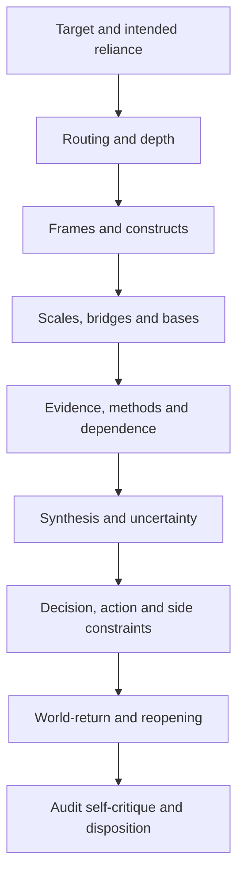

# Audit protocol

Use this matrix proportionately. Record `not-applicable` with a reason rather than manufacturing a
finding.



## Routing and invocation

- Was the target task recognised correctly?
- Did an overly broad skill create ceremony, or did an under-specified description hide a needed
  capability?
- Was operating depth proportionate to uncertainty, stakes, reversibility, novelty, disagreement,
  systemic span, and evidence availability?
- Were directly relevant skills omitted, duplicated, or activated in conflict?

## Frames and constructs

- Are question types distinguished: empirical, causal, formal, interpretive, normative, or design?
- Are constructs operationalised without mistaking a proxy for the phenomenon?
- Are boundaries, stakeholders, exclusions, and value commitments explicit?
- Is at least one serious alternative decomposition represented where material?

## Scale and basis

- Distinguish claim, observation, mechanism, intervention, consequence, and monitoring scales.
- Treat scale as a task-defined vector, not a universal micro/meso/macro enum.
- Search for aggregation, atomistic, ecological, temporal-extrapolation, proxy, and implementation
  leaps.
- Require explicit Bridge Claims for material cross-scale movement.
- Require crosswalks for cross-basis translation; allow mappings to be partial, asymmetric, lossy,
  many-to-many, or unavailable.

## Evidence and methods

- Trace every consequential claim to evidence or a stated assumption.
- Record source and method dependence. Multiple reports derived from one source are not independent.
- Check measurement validity, selection, missingness, confounding, multiplicity, researcher degrees
  of freedom, model sensitivity, and contradictory evidence where applicable.
- Test whether the method could have detected the relevant error.
- Distinguish absence of evidence from evidence of absence.

## Synthesis

- Preserve disagreement that cannot be warrantedly resolved.
- Reject consensus, vote count, or branch count as a truth criterion.
- Check whether uncertainty is multidimensional: support, sensitivity, transportability,
  measurement, model, ethical and operational uncertainty may differ.
- Identify live alternatives, defeaters, and conditions under which the conclusion changes.

## Decision and world-return

- Separate evidence from values, constraints, and risk appetite.
- Check whose outcomes count, distributional consequences, accessibility, dignity, and harms.
- Prefer reversible actions under unresolved uncertainty when feasible.
- Require predicted observables, instruments or sources, timeframe, thresholds, attribution caveats,
  monitoring ownership, and exact reopen actions.

## Finding shape

For each material finding record:

```yaml
finding_id: stable-id
claim: what is wrong or insufficient
evidence: concrete artifact, observation, or absence
consequence: why it matters to the intended reliance
severity: low | medium | high | critical
confidence: low | medium | high
cheapest_resolving_action: action or evidence
affected_scales: []
affected_bases: []
status: open | accepted-risk | resolved | disputed
```
