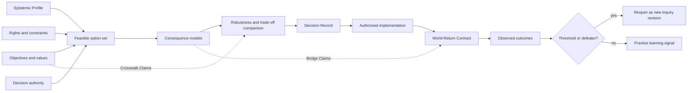

# Decision-method reference

Use this reference to keep epistemic warrant, values, authority, action, and outcome learning connected without collapsing them.

## Decision and return graph



## Decision disciplines

Choose tools that match the information:

- **Dominance:** discard an option worse on every material dimension under the same assumptions.
- **Thresholds and side constraints:** require minimum safety, rights, accessibility, quality, or feasibility before trade-offs.
- **Scenario analysis:** compare coherent futures without pretending precise probabilities exist.
- **Expected value:** use only when probability and utility assumptions are defensible and sensitivity is shown.
- **Minimax regret or robustness:** prefer options performing acceptably across plausible models.
- **Value of information:** compare additional inquiry with the expected cost of choosing under current uncertainty.
- **Real options and reversible probes:** value learning, optionality, staged commitment, and rollback.

Methods may be combined. State the value judgments embedded in thresholds, utilities, weights, and regret definitions.

## World-Return Contract minimum

```yaml
decision_id: ""
selected_option: ""
implementation_owner: ""
authorised_next_step: ""
expected_outcomes: []
unacceptable_outcomes: []
indicators: []
baselines: []
observation_scale: {}
consequence_scale: {}
monitoring_scale: {}
time_horizons: []
thresholds: []
defeaters: []
rollback_conditions: []
reopening_conditions: []
review_owner: ""
review_cadence: ""
```

Every indicator must connect to an outcome through an explicit warrant. A convenient metric is not automatically an adequate observation of intended impact.

## Non-decision outcomes

A sound process may conclude:

- act now;
- run a reversible probe;
- gather specified information;
- defer until a condition holds;
- preserve several options;
- stop or reverse an existing action;
- decline because authority, evidence, safety, or legitimacy is insufficient.

Record why the non-decision is active judgement rather than unexamined delay.
